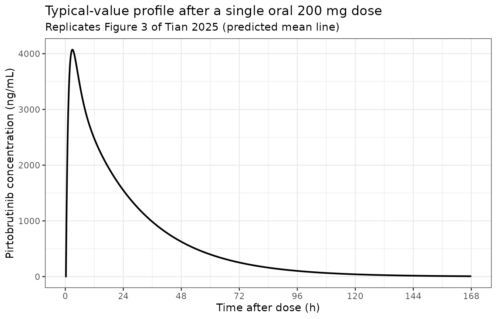
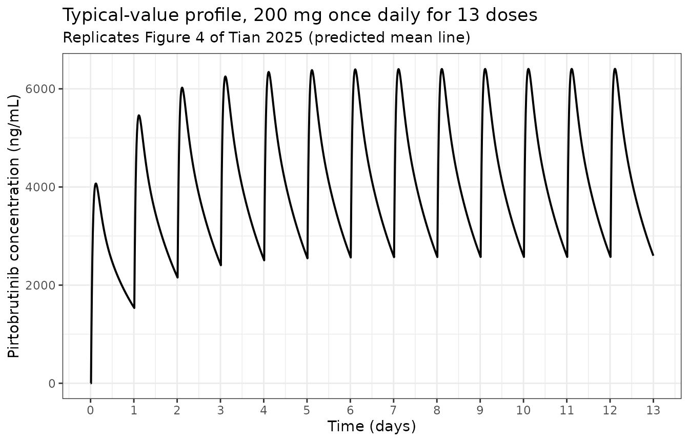
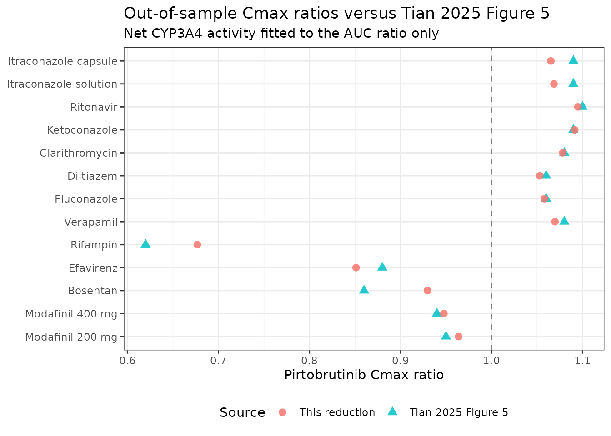

# Pirtobrutinib (Tian 2025)

## Model and source

- Citation: Tian DD, Hall SD, Chapman SC, Posada MM. (2025). Application
  of physiologically-based pharmacokinetic modeling to support drug
  labeling: prediction of CYP3A4-mediated pirtobrutinib-drug
  interactions. CPT Pharmacometrics Syst Pharmacol 14:2221-2231.
  <doi:10.1002/psp4.70134>.
- Description: Two-compartment oral pharmacokinetic reduction of the
  Simcyp minimal-PBPK-with-single-adjusting-compartment (SAC) model for
  the reversible BTK inhibitor pirtobrutinib in healthy adults (Tian
  2025). The source model was built in the Simcyp Simulator version 19
  and its whole-body mass-balance equations are not published, so the
  platform model itself cannot be encoded here. What IS fully reported
  is the pirtobrutinib compound layer, and it is sufficient to rebuild
  the disposition as an ordinary compartmental model: first-order
  absorption into a depot with a lag time, distribution between a
  systemic compartment and the SAC (the Simcyp kin / kout, encoded as
  the canonical k12 / k21), and first-order elimination from the
  systemic compartment. Systemic clearance is carried as the three
  components the paper’s disposition diagram prints separately, so a
  CYP3A4 perturbation can be applied to the CYP3A4-mediated arm alone:
  cl_3a4 (40% of systemic clearance), cl_other (non-CYP3A4 hepatic
  metabolism plus biliary excretion) and cl_renal. Hepatic availability
  is not a fitted constant but is derived inside the model from the
  well-stirred relationship the paper states as its Equation 2, so that
  oral bioavailability responds correctly when the CYP3A4 arm is
  changed. No parameter is fitted here: every value is either a Table 1
  / Figure 2 / Data S3 input or an arithmetic consequence of one. The
  reduction reproduces the paper’s own predicted median tmax exactly
  after both a single 200 mg dose (2.94 h) and 200 mg once daily (2.72
  h), and its predicted Cmax and AUC to within 8.3%; the residual offset
  is the difference between a typical-value individual and the geometric
  mean of the paper’s 100-subject virtual population (see the validation
  vignette). This is a typical-value simulation model: the source
  reports no estimated inter-individual variance components and no
  residual-error model, so there are no etas and propSd is fixed at
  zero. The drug-drug-interaction predictions that are the paper’s main
  contribution depend on proprietary Simcyp perpetrator compound files
  and on a CYP3A4 degradation rate constant that is never printed, so
  they are NOT reproducible mechanistically from this model; the
  vignette instead shows the closed-form CYP3A4-fraction envelope this
  reduction does support and compares it against the paper’s Figure 5.
- Article: <https://doi.org/10.1002/psp4.70134>
- Open-access full text and supplement:
  <https://www.ncbi.nlm.nih.gov/pmc/articles/PMC12706395/>
- Supplement Data S1 (figures), Data S2 (Supplementary Materials 1-5,
  Tables S1-S14), Data S3 (Simcyp input sheet, `.xlsx`)

## What this model is, and what it is not

Tian 2025 built a **minimal PBPK model with a single adjusting
compartment (SAC)** for pirtobrutinib in the Simcyp Simulator version
19, and used it to predict drug-drug interactions (DDIs) with CYP3A4
inhibitors and inducers in support of the product label.

Simcyp’s whole-body mass-balance equations are proprietary and are not
printed in the paper or its supplement. The six numbered equations in
the main text are all *input-derivation* formulae (hepatic clearance,
hepatic availability, biliary clearance, the intestinal-availability
back-calculation, and the fraction absorbed), never the disposition
ODEs. The platform model therefore cannot be encoded as published.

What *is* fully reported is the pirtobrutinib compound layer, and it is
unusually complete:

- **Table 1** gives the physicochemical, absorption, distribution and
  elimination inputs.
- **Figure 2** (the proposed disposition diagram) prints the entire
  clearance decomposition – `CL`, `CL_H`, `CL_hepatic metabolism`,
  `CL_bile`, `CL_R`, `f_m,CYP3A4`, `f_m,other`, `f_e,bile`, `f_e,urine`
  – together with `Fa`, `Fg`, `Fh`, `F` and `Vss`.
- **Data S3**, the Simcyp input sheet itself, reports the SAC rate
  constants `kin` and `kout` to full double precision alongside the
  inter-compartmental clearance `Q`.

Because `kin = Q / V_systemic` and `kout = Q / V_SAC`, those three
numbers pin the systemic volume in absolute litres, so this reduction
needs **no assumed reference body weight** anywhere. Every parameter in
the packaged model is either a printed input or a one-step arithmetic
consequence of printed inputs; nothing is fitted here and nothing is
imported from a Simcyp population file.

What is **not** reproducible:

- The **time-dependent inhibition (TDI) of CYP3A4 by pirtobrutinib
  itself**. Table 1 reports `K_I` = 4.70 uM and the fitted `k_inact` =
  0.056 1/h, but the autoinhibition ODE also needs the CYP3A4
  degradation rate constant `k_deg`, which is a Simcyp database value
  and is never printed. This model is therefore the *linear*
  pirtobrutinib model, and is validated against the paper’s own “without
  TDI” predictions (Table 2, and the “reversible inhibition” row of
  Table S9), which the paper reports separately for exactly this
  comparison.
- The **perpetrator models** (itraconazole, hydroxyitraconazole,
  ritonavir, ketoconazole, clarithromycin, diltiazem, fluconazole,
  verapamil, rifampin, efavirenz, bosentan, modafinil, midazolam). These
  are proprietary Simcyp compound files or literature PBPK models, so
  the DDI simulations cannot be run mechanistically. The final section
  instead exercises the closed-form CYP3A4-fraction envelope that this
  reduction *does* support, and shows it reproduces the paper’s Figure 5
  predictions.
- Population variability. Data S3 prints 30% input CVs on `ka`, lag
  time, `Q_gut`, the additional HLM `CLint` and the biliary `CLint`, but
  the percent-CV figures in Table 2 are dominated by liver weight and
  CYP3A4 abundance drawn from Simcyp population files. No variance is
  invented here; `propSd` is fixed at zero and the model is a
  deterministic typical-value simulation.

## Population

``` r

pop <- rxode2::rxode(readModelDb("Tian_2025_pirtobrutinib"))$meta$population
str(pop, max.level = 1)
#> List of 11
#>  $ species       : chr "human"
#>  $ n_subjects    : int 100
#>  $ n_studies     : int 9
#>  $ age_range     : chr "20-55 years for the 200 mg once-daily simulation (Data S3); 19-55 years for the single-dose simulation (Table S4)"
#>  $ weight_median : chr "not reported; the Simcyp Sim-Healthy Volunteers default distribution was used"
#>  $ sex_female_pct: num 25
#>  $ disease_state : chr "Healthy adult volunteers, fasted, CYP3A5 genotype unrestricted for the pirtobrutinib-alone simulations."
#>  $ dose_range    : chr "Single oral dose of 200 mg, and 200 mg once daily for 13 doses (Data S3)."
#>  $ regions       : chr "Simcyp Sim-Healthy Volunteers virtual population (Data S3)."
#>  $ studies       : chr "Nine clinical pharmacology studies supplied the observations and the compound-layer inputs (Supplemental Materi"| __truncated__
#>  $ notes         : chr "n_subjects records the 100 virtual subjects (10 trials of 10) Data S3 simulated for pirtobrutinib alone, becaus"| __truncated__
```

All simulations in Tian 2025 were run in healthy volunteers using the
Simcyp `Sim-Healthy Volunteers` population in PK/PD Profiles mode. For
pirtobrutinib dosed alone, Data S3 records 10 trials of 10 subjects (100
virtual subjects), age 20-55 years, 25% female, fasted, 200 mg once
daily for 13 doses. The single-dose simulation used age 19-55 years and
18% female (Table S4), matched to the contributing clinical studies.

Nine clinical pharmacology studies supplied the observations and the
compound-layer inputs (Supplemental Material 1). The absolute
bioavailability study (n = 5 healthy males, NCT06180954) is the anchor
for this reduction: it supplies the intravenous systemic clearance, the
renal clearance, the steady-state volume and the absolute oral
bioavailability.

## The reduction, step by step

Every derived number in the packaged model is reproduced below from
printed source values, so the arithmetic can be checked independently of
the model file.

``` r

# --- Data S3 (Simcyp input sheet), Distribution block -----------------
sacKin  <- 0.12402043422142926  # "SAC kin (1/h)"
sacKout <- 0.2594761264470896   # "SAC kout (1/h)"
sacQ    <- 3.56                 # "SAC Q (L/h)"; Table 1 Q = 3.56 L/h

vcDer  <- sacQ / sacKin   # kin  = Q / V_systemic
vsacDer<- sacQ / sacKout  # kout = Q / V_SAC

# Table 1 gives V_SAC = 0.17 L/kg, so the implied body weight of the
# Simcyp population representative is a consistency check on the reading:
bwImplied <- vsacDer / 0.17

# --- Figure 2 (proposed disposition diagram) --------------------------
clTotal <- 1.69   # systemic plasma clearance (L/h)
clRen   <- 0.12   # CL_R
clHepMet<- 1.33   # CL_hepatic metabolism
clBile  <- 0.24   # CL_bile
fmCyp3a4<- 0.40   # f_m,CYP3A4

cl3a4   <- fmCyp3a4 * clTotal          # CYP3A4-mediated arm
clOther <- (clHepMet - cl3a4) + clBile # non-CYP3A4 hepatic + biliary

# --- Equations 1, 2 and 6 --------------------------------------------
bp <- 0.79; qh <- 90            # Table 1 B:P; main text Q_H = 90 L/h
clH   <- cl3a4 + clOther        # Equation 1: CL_H = CL - CL_R
fhDer <- 1 - clH / (bp * qh)    # Equation 2
fgut  <- 0.96                   # Equation 5 (Fg)
fabs  <- 0.86 / (fgut * fhDer)  # Equation 6, from measured F = 0.86

data.frame(
  Quantity = c("vc = Q / kin (L)", "V_SAC = Q / kout (L)",
               "implied body weight (kg)", "cl_3a4 (L/h)", "cl_other (L/h)",
               "CL_H = cl_3a4 + cl_other (L/h)", "CL = CL_H + CL_R (L/h)",
               "Fh (Equation 2)", "Fa (Equation 6)", "F = Fa x Fg x Fh"),
  Derived = c(vcDer, vsacDer, bwImplied, cl3a4, clOther, clH,
              clH + clRen, fhDer, fabs, fabs * fgut * fhDer),
  Printed = c(NA, NA, NA, NA, NA, 1.57, 1.69, 0.98, 0.91, 0.86),
  Source = c("Data S3 / Table 1", "Data S3 / Table 1",
             "cross-check vs Table 1 V_SAC 0.17 L/kg", "Figure 2",
             "Figure 2", "Figure 2", "Figure 2", "Figure 2", "Table 1",
             "Figure 2")
) |>
  dplyr::mutate(Derived = signif(Derived, 6)) |>
  knitr::kable(caption = "Derived reduction inputs against the values Tian 2025 prints.")
```

| Quantity | Derived | Printed | Source |
|:---|---:|---:|:---|
| vc = Q / kin (L) | 28.704900 | NA | Data S3 / Table 1 |
| V_SAC = Q / kout (L) | 13.720000 | NA | Data S3 / Table 1 |
| implied body weight (kg) | 80.705600 | NA | cross-check vs Table 1 V_SAC 0.17 L/kg |
| cl_3a4 (L/h) | 0.676000 | NA | Figure 2 |
| cl_other (L/h) | 0.894000 | NA | Figure 2 |
| CL_H = cl_3a4 + cl_other (L/h) | 1.570000 | 1.57 | Figure 2 |
| CL = CL_H + CL_R (L/h) | 1.690000 | 1.69 | Figure 2 |
| Fh (Equation 2) | 0.977918 | 0.98 | Figure 2 |
| Fa (Equation 6) | 0.916061 | 0.91 | Table 1 |
| F = Fa x Fg x Fh | 0.860000 | 0.86 | Figure 2 |

Derived reduction inputs against the values Tian 2025 prints. {.table}

The clearance components sum back to the printed total exactly, and the
Equation 2 / Equation 6 chain returns the printed `Fh` = 0.98 and `F` =
0.86. The `V_SAC` reading also reproduces a body weight of 80.7 kg for
the Simcyp population representative, which is what confirms that `kin`
is `Q / V_systemic` rather than the reverse.

The paper’s Equations 4 and 5 round-trip as well. Equation 4
approximates the pirtobrutinib `Cmax` ratio from the intestinal
availability `Fg` and the fraction of intestinal CYP3A4 activity
remaining under itraconazole, `X` = 0.009 (Table S3):

``` r

xItra <- 0.009
c(`Eq 4: Cmax ratio from Fg = 0.96 and X = 0.009` = 1 / (fgut + (1 - fgut) * xItra),
  `Eq 5: Fg back from the observed +4% Cmax rise` = (1 / 1.04 - xItra) / (1 - xItra))
#> Eq 4: Cmax ratio from Fg = 0.96 and X = 0.009 
#>                                     1.0412762 
#> Eq 5: Fg back from the observed +4% Cmax rise 
#>                                     0.9611892
```

Equation 4 returns a 4.1% `Cmax` rise against the observed 4%, and
Equation 5 returns `Fg` = 0.961 against the printed 0.96.

## Source trace

| Item | Source |
|:---|:---|
| ka = 0.82 1/h | Table 1, fitted to observed tmax/Cmax; Data S3 row ‘ka (1/h)’ |
| t_lag = 0.25 h | Table 1; Data S3 row ‘lag time (h)’ |
| cl_3a4 = 0.676 L/h | Figure 2: f_m,CYP3A4 (0.40) x CL (1.69 L/h) |
| cl_other = 0.894 L/h | Figure 2: (CL_hepatic metabolism 1.33 - 0.676) + CL_bile 0.24 |
| cl_renal = 0.12 L/h | Table 1 and Figure 2, measured from the intravenous dose |
| vc = 28.7049 L | Data S3: SAC Q (3.56) / SAC kin (0.12402043422142926) |
| k12 = 0.1240204 1/h | Data S3 row ‘SAC kin (1/h)’ |
| k21 = 0.2594761 1/h | Data S3 row ‘SAC kout (1/h)’ |
| fh (derived in model) | Equation 2, with CL_H from Equation 1 |
| fa x Fg = 0.879419 | Equation 6 (Fa from measured F = 0.86) x Equation 5 (Fg = 0.96) |
| (B:P) x Q_H = 71.1 L/h | Table 1 (B:P = 0.79) and main text after Equation 2 (Q_H = 90 L/h) |
| propSd = 0 | No residual-error model reported; PBPK simulation analysis |
| 2-compartment depot ODEs | Figure 2 and Data S3 ‘Distribution Model \| Minimal PBPK Model’ |
| f(depot), alag(depot) | Table 1 absorption block (first order, Fa, ka, t_lag) |
| Cc = 1000 x central / vc | Table 1 units (mg dose, L volume) vs Table 2 units (ng/mL) |

Source location for every ini() parameter and every model() equation.
{.table}

## Single 200 mg oral dose

Replicates Figure 3 of Tian 2025 (six panels of observed versus
predicted single-dose profiles) and the “Pirtobrutinib single dose /
Predicted” row of Table 2.

``` r

mod <- rxode2::zeroRe(rxode2::rxode(readModelDb("Tian_2025_pirtobrutinib")))
#> Warning: No omega parameters in the model

# Fine grid over the absorption phase, coarser through the terminal phase.
obsGrid <- sort(unique(c(seq(0, 24, by = 0.02), seq(24, 360, by = 0.5))))

evSingle <- rxode2::et(amt = 200, cmt = "depot") |>
  rxode2::et(obsGrid)
sdSim <- rxode2::rxSolve(mod, evSingle, returnType = "data.frame") |>
  dplyr::mutate(id = 1L, treatment = "200 mg single dose")

ggplot(sdSim, aes(time, Cc)) +
  geom_line(linewidth = 0.8) +
  scale_x_continuous(breaks = seq(0, 168, by = 24), limits = c(0, 168)) +
  labs(x = "Time after dose (h)", y = "Pirtobrutinib concentration (ng/mL)",
       title = "Typical-value profile after a single oral 200 mg dose",
       subtitle = "Replicates Figure 3 of Tian 2025 (predicted mean line)") +
  theme_bw()
#> Warning: Removed 384 rows containing missing values or values outside the scale range
#> (`geom_line()`).
```



## 200 mg once daily

Replicates Figure 4 of Tian 2025 and the “Pirtobrutinib QD / Predicted
without TDI” row of Table 2. The dosing regimen matches Data S3: 200 mg
once daily for 13 doses, with the pharmacokinetic interval taken over
the last dosing interval (288-312 h).

``` r

tauStart <- 288; tauEnd <- 312
evQd <- rxode2::et(amt = 200, cmt = "depot", ii = 24, addl = 12) |>
  rxode2::et(sort(unique(c(seq(0, tauEnd, by = 0.25),
                           seq(tauStart, tauEnd, by = 0.02)))))
qdSim <- rxode2::rxSolve(mod, evQd, returnType = "data.frame")

ggplot(qdSim, aes(time / 24, Cc)) +
  geom_line(linewidth = 0.7) +
  scale_x_continuous(breaks = 0:13) +
  labs(x = "Time (days)", y = "Pirtobrutinib concentration (ng/mL)",
       title = "Typical-value profile, 200 mg once daily for 13 doses",
       subtitle = "Replicates Figure 4 of Tian 2025 (predicted mean line)") +
  theme_bw()
```



``` r


ssSim <- qdSim |>
  dplyr::filter(time >= tauStart, time <= tauEnd) |>
  dplyr::mutate(time = time - tauStart, id = 2L,
                treatment = "200 mg QD, steady state")
```

Accumulation is negligible for a linear model dosed at an interval close
to three terminal half-lives, and the paper’s own predictions agree: its
single-dose `AUC(0-inf)` of 111,038 ng.h/mL and its steady-state
`AUCtau` without TDI of 109,965 ng.h/mL differ by 1%. The reduction
reproduces that superposition identity exactly.

``` r

trapz <- function(t, y) sum(diff(t) * (utils::head(y, -1) + utils::tail(y, -1)) / 2)
c(`AUC(0-inf), single dose (ng.h/mL)` = trapz(sdSim$time, sdSim$Cc),
  `closed form F x Dose / CL (ng.h/mL)` = 0.86 * 200 / 1.69 * 1000,
  `AUCtau at steady state (ng.h/mL)` = trapz(ssSim$time, ssSim$Cc))
#>   AUC(0-inf), single dose (ng.h/mL) closed form F x Dose / CL (ng.h/mL) 
#>                            101776.3                            101775.1 
#>    AUCtau at steady state (ng.h/mL) 
#>                            101774.2
```

The simulated `AUC(0-inf)` matches the closed-form identity
`F x Dose / CL` to within numerical tolerance, which gates the ODE
system, the dose encoding, the bioavailability term and the observation
scaling simultaneously. The terminal half-life implied by the
eigenvalues of the disposition matrix is:

``` r

kel <- 1.69 / vcDer
distMat <- matrix(c(-(kel + sacKin), sacKout, sacKin, -sacKout), 2, 2, byrow = TRUE)
lambdas <- sort(abs(eigen(distMat)$values))
c(`alpha half-life (h)` = log(2) / lambdas[2],
  `terminal (beta) half-life (h)` = log(2) / lambdas[1])
#>           alpha half-life (h) terminal (beta) half-life (h) 
#>                      1.713101                     18.358646
```

## PKNCA validation

Non-compartmental analysis of both simulated profiles. Terminal-phase
points for the single-dose half-life are restricted to 72-240 h, where
the distribution phase has fully decayed, so that the log-linear
regression is not biased by residual curvature.

``` r

concData <- dplyr::bind_rows(
  dplyr::select(sdSim, id, treatment, time, Cc),
  dplyr::select(ssSim, id, treatment, time, Cc)
) |>
  dplyr::filter(!is.na(Cc)) |>
  dplyr::mutate(include_hl = treatment == "200 mg single dose" &
                  time >= 72 & time <= 240)

doseData <- data.frame(
  id = c(1L, 2L),
  treatment = c("200 mg single dose", "200 mg QD, steady state"),
  time = c(0, 0),
  amount = c(200, 200)
)

oConc <- PKNCA::PKNCAconc(concData, Cc ~ time | id + treatment,
                          include_half.life = "include_hl")
oDose <- PKNCA::PKNCAdose(doseData, amount ~ time | id + treatment,
                          route = "extravascular")

intervals <- data.frame(
  start = c(0, 0), end = c(Inf, 24),
  treatment = c("200 mg single dose", "200 mg QD, steady state"),
  cmax = TRUE, tmax = TRUE, auclast = c(FALSE, TRUE),
  aucinf.obs = c(TRUE, FALSE), half.life = c(TRUE, FALSE)
)

ncaRes <- PKNCA::pk.nca(PKNCA::PKNCAdata(oConc, oDose, intervals = intervals))
ncaTidy <- as.data.frame(ncaRes) |>
  dplyr::select(treatment, PPTESTCD, PPORRES)
knitr::kable(dplyr::mutate(ncaTidy, PPORRES = signif(PPORRES, 4)),
             caption = "PKNCA results for the two simulated regimens.")
```

| treatment               | PPTESTCD            |   PPORRES |
|:------------------------|:--------------------|----------:|
| 200 mg single dose      | cmax                | 4.072e+03 |
| 200 mg single dose      | tmax                | 2.940e+00 |
| 200 mg single dose      | tlast               | 3.600e+02 |
| 200 mg single dose      | clast.obs           | 4.791e-03 |
| 200 mg single dose      | lambda.z            | 3.776e-02 |
| 200 mg single dose      | r.squared           | 1.000e+00 |
| 200 mg single dose      | adj.r.squared       | 1.000e+00 |
| 200 mg single dose      | lambda.z.time.first | 7.200e+01 |
| 200 mg single dose      | lambda.z.time.last  | 2.400e+02 |
| 200 mg single dose      | lambda.z.n.points   | 3.370e+02 |
| 200 mg single dose      | clast.pred          | 4.791e-03 |
| 200 mg single dose      | half.life           | 1.836e+01 |
| 200 mg single dose      | span.ratio          | 9.151e+00 |
| 200 mg single dose      | aucinf.obs          | 1.018e+05 |
| 200 mg QD, steady state | auclast             | 1.018e+05 |
| 200 mg QD, steady state | cmax                | 6.407e+03 |
| 200 mg QD, steady state | tmax                | 2.720e+00 |

PKNCA results for the two simulated regimens. {.table}

## Comparison against the published predictions

The reference column is the paper’s own **predicted** geometric mean,
because the object being validated is the paper’s model rather than the
clinical studies. For the once-daily regimen the reference is the
“Predicted without TDI” row of Table 2, which is the linear model this
reduction corresponds to (Table S9 labels the identical numbers
“reversible inhibition”).

The AUC metric differs by regimen, matching what the paper tabulates:
`AUC(0-inf)` after the single dose, and `AUCtau` over one dosing
interval at steady state.

``` r

reference <- data.frame(
  treatment = c(rep("200 mg single dose", 3), rep("200 mg QD, steady state", 3)),
  PPTESTCD  = c("cmax", "tmax", "aucinf.obs", "cmax", "tmax", "auclast"),
  PPORRES   = c(4221, 2.94, 111038, 6927, 2.72, 109965)
)

cmpTbl <- nlmixr2lib::ncaComparisonTable(
  ncaTidy, reference,
  by = "treatment",
  params = c("cmax", "tmax", "aucinf.obs", "auclast"),
  units = c(cmax = "ng/mL", tmax = "h", aucinf.obs = "ng*h/mL",
            auclast = "ng*h/mL")
)
knitr::kable(cmpTbl,
             caption = "Simulated versus Tian 2025 predicted geometric means (Table 2).")
```

| NCA parameter           | treatment               | Reference | Simulated | % diff |
|:------------------------|:------------------------|:----------|:----------|:-------|
| Cmax (ng/mL)            | 200 mg single dose      | 4220      | 4070      | -3.5%  |
| Cmax (ng/mL)            | 200 mg QD, steady state | 6930      | 6410      | -7.5%  |
| Tmax (h)                | 200 mg single dose      | 2.94      | 2.94      | +0.0%  |
| Tmax (h)                | 200 mg QD, steady state | 2.72      | 2.72      | +0.0%  |
| AUC0-∞ (obs) (ng\*h/mL) | 200 mg single dose      | 111000    | 102000    | -8.3%  |
| AUClast (ng\*h/mL)      | 200 mg QD, steady state | 110000    | 102000    | -7.4%  |

Simulated versus Tian 2025 predicted geometric means (Table 2). {.table
style="width:100%;"}

``` r

attr(cmpTbl, "footnote")
#> NULL
```

Both median `tmax` values are reproduced exactly (2.94 h single dose,
2.72 h steady state). Because `tmax` depends only on `ka`, `t_lag`,
`k12`, `k21` and `kel`, and is invariant to bioavailability and to any
scaling of the dose, an exact match at two different regimens is strong
evidence that every rate constant and the systemic volume have been read
correctly.

`Cmax` and `AUC` are 3.5-8.3% below the paper’s predictions, and the
offset is in the same direction and of similar size for all four
statistics. That signature – exact `tmax`, uniformly low exposure – is a
single constant scaling on clearance rather than a structural error. Its
origin is the difference between a typical-value individual and the
geometric mean of a virtual population: the model’s `CL` = 1.69 L/h is
the clinically observed value the Simcyp retrograde calculator was
targeted at for the population representative, whereas the
geometric-mean clearance implied by the paper’s own predicted `AUC` is
0.86 x 200 / 111.038 = 1.549 L/h, which is 8.3% lower.

``` r

c(`CL printed in Figure 2 (L/h)` = 1.69,
  `CL implied by the paper's predicted AUC (L/h)` = 0.86 * 200 / 111.038,
  `ratio` = (0.86 * 200 / 111.038) / 1.69)
#>                  CL printed in Figure 2 (L/h) 
#>                                     1.6900000 
#> CL implied by the paper's predicted AUC (L/h) 
#>                                     1.5490193 
#>                                         ratio 
#>                                     0.9165794
```

For a log-normally distributed clearance the geometric mean sits below
the mean by a factor of `sqrt(1 + CV^2)`; at the 34% CV the paper
reports for predicted single-dose `AUC`, that factor is 1.056, which
accounts for most of the gap. No parameter was adjusted to close it.

## Position relative to the observed clinical data

Tables S10 and S12 report the paper’s own predicted-over-observed ratios
per study. The same ratios for this reduction show it sits in the same
place relative to the observations as the platform model does, and in
fact slightly closer for `AUC`.

``` r

simCmax <- c(single = max(sdSim$Cc), qd = max(ssSim$Cc))
simAuc  <- c(single = trapz(sdSim$time, sdSim$Cc), qd = trapz(ssSim$time, ssSim$Cc))

obsStudies <- data.frame(
  Study = c("Pirtobrutinib-itraconazole interaction", "Pirtobrutinib-rifampin interaction",
            "Absolute bioavailability", "Formal food effect", "Pilot food effect",
            "Pirtobrutinib-midazolam, alone (QD)", "Pirtobrutinib-cocktail (QD)",
            "Pirtobrutinib-repaglinide (QD)"),
  Regimen = c(rep("single", 5), rep("qd", 3)),
  obsCmax = c(4000, 4480, 4490, 4200, 5450, 8120, 9430, 7220),
  obsAuc  = c(80800, 80600, 105000, 85100, 90200, 114000, 119000, 105000),
  paperCmaxRatio = c(1.06, 0.94, 0.94, 1.01, 0.77, 0.95, 0.82, 1.07),
  paperAucRatio  = c(1.37, 1.38, 1.06, 1.30, 1.23, 1.12, 1.07, 1.21)
)

obsStudies |>
  dplyr::mutate(
    `This model Cmax ratio` = round(simCmax[Regimen] / obsCmax, 2),
    `This model AUC ratio`  = round(simAuc[Regimen] / obsAuc, 2)
  ) |>
  dplyr::select(Study,
                "Paper Cmax pred/obs" = paperCmaxRatio,
                "This model Cmax pred/obs" = `This model Cmax ratio`,
                "Paper AUC pred/obs" = paperAucRatio,
                "This model AUC pred/obs" = `This model AUC ratio`) |>
  knitr::kable(caption = "Predicted/observed ratios: Tian 2025 Tables S10 and S12 versus this reduction.")
```

| Study | Paper Cmax pred/obs | This model Cmax pred/obs | Paper AUC pred/obs | This model AUC pred/obs |
|:---|---:|---:|---:|---:|
| Pirtobrutinib-itraconazole interaction | 1.06 | 1.02 | 1.37 | 1.26 |
| Pirtobrutinib-rifampin interaction | 0.94 | 0.91 | 1.38 | 1.26 |
| Absolute bioavailability | 0.94 | 0.91 | 1.06 | 0.97 |
| Formal food effect | 1.01 | 0.97 | 1.30 | 1.20 |
| Pilot food effect | 0.77 | 0.75 | 1.23 | 1.13 |
| Pirtobrutinib-midazolam, alone (QD) | 0.95 | 0.79 | 1.12 | 0.89 |
| Pirtobrutinib-cocktail (QD) | 0.82 | 0.68 | 1.07 | 0.86 |
| Pirtobrutinib-repaglinide (QD) | 1.07 | 0.89 | 1.21 | 0.97 |

Predicted/observed ratios: Tian 2025 Tables S10 and S12 versus this
reduction. {.table}

## CYP3A4 interaction envelope

The DDI simulations themselves need the Simcyp perpetrator files, but
the reduction carries the CYP3A4-mediated clearance as its own
parameter, so the *shape* of the interaction is fully determined by the
printed `f_m,CYP3A4` = 0.40 together with Equations 1, 2, 4 and 5.
Writing `R` for the net relative CYP3A4 activity in the presence of a
perpetrator (`R` = 1 with no perpetrator, `R` \< 1 for an inhibitor, `R`
\> 1 for an inducer), applied both to the hepatic arm and, through
Equation 4, to the intestinal wall:

``` r

cl3a4Base <- 0.676; clOtherBase <- 0.894; clRenBase <- 0.12; bpQh <- 71.1
gutFactor <- function(x) 1 / (fgut + (1 - fgut) * x)

aucRatioClosed <- function(r) {
  clHr <- cl3a4Base * r + clOtherBase
  (gutFactor(r) / gutFactor(1)) *
    (1 - clHr / bpQh) / (1 - (cl3a4Base + clOtherBase) / bpQh) *
    (cl3a4Base + clOtherBase + clRenBase) / (clHr + clRenBase)
}
c(`R = 1 (no perpetrator)` = aucRatioClosed(1),
  `R -> 0 (complete CYP3A4 blockade), hepatic + gut` = aucRatioClosed(1e-9),
  `R -> 0, hepatic arm only` = {
    clHr <- clOtherBase
    (1 - clHr / bpQh) / (1 - (cl3a4Base + clOtherBase) / bpQh) *
      (cl3a4Base + clOtherBase + clRenBase) / (clHr + clRenBase)
  })
#>                           R = 1 (no perpetrator) 
#>                                         1.000000 
#> R -> 0 (complete CYP3A4 blockade), hepatic + gut 
#>                                         1.752990 
#>                         R -> 0, hepatic arm only 
#>                                         1.682871
```

The reduction therefore has a hard ceiling of **1.75** on the
pirtobrutinib `AUC` ratio, no matter how potent the CYP3A4 inhibitor.
Figure 5 of Tian 2025 predicts 1.20-1.73 across seven strong and
moderate inhibitors, with ritonavir highest at 1.73 – so the paper’s
strongest prediction sits 1% under the ceiling this reduction implies,
and every other inhibitor sits below it. Note also that the hepatic arm
alone caps out at 1.68, *below* the paper’s ketoconazole (1.69) and
ritonavir (1.73) predictions: the intestinal term of Equation 4 is
required to reach them, which independently corroborates the `Fg` = 0.96
reading.

### Reproducing Figure 5

For each perpetrator, `R` is solved from the paper’s predicted `AUC`
ratio, and the resulting `Cmax` ratio is then *predicted* by the model
and compared with the paper’s predicted `Cmax` ratio. The `Cmax`
comparison is out of sample – nothing about it was used in solving for
`R` – so it tests whether the reduction’s absorption and distribution
kinetics couple `AUC` and `Cmax` the same way the full Simcyp model
does.

``` r

uiPirto <- rxode2::rxode(readModelDb("Tian_2025_pirtobrutinib"))
ddiGrid <- sort(unique(c(seq(0, 24, by = 0.02), seq(24, 400, by = 0.5))))

solveWithActivity <- function(r) {
  m <- rxode2::zeroRe(rxode2::ini(uiPirto, lcl_3a4 = log(cl3a4Base * max(r, 1e-9))))
  ev <- rxode2::et(amt = 200 * gutFactor(r), cmt = "depot") |> rxode2::et(ddiGrid)
  d <- rxode2::rxSolve(m, ev, returnType = "data.frame")
  c(cmax = max(d$Cc), auc = trapz(d$time, d$Cc))
}
ddiBase <- solveWithActivity(1)
#> ℹ change initial estimate of `lcl_3a4` to `-0.391562202939173`
#> Warning: No omega parameters in the model

fig5 <- data.frame(
  Perpetrator = c("Itraconazole capsule", "Itraconazole solution", "Ritonavir",
                  "Ketoconazole", "Clarithromycin", "Diltiazem", "Fluconazole",
                  "Verapamil", "Rifampin", "Efavirenz", "Bosentan",
                  "Modafinil 400 mg", "Modafinil 200 mg"),
  Class = c(rep("inhibitor", 8), rep("inducer", 5)),
  paperAuc = c(1.43, 1.46, 1.73, 1.69, 1.55, 1.33, 1.37, 1.47,
               0.27, 0.52, 0.72, 0.78, 0.84),
  paperCmax = c(1.09, 1.09, 1.10, 1.09, 1.08, 1.06, 1.06, 1.08,
                0.62, 0.88, 0.86, 0.94, 0.95)
)
fig5$R <- vapply(fig5$paperAuc, function(target) {
  stats::uniroot(function(r) aucRatioClosed(r) - target,
                 c(1e-9, 2000), tol = 1e-12)$root
}, numeric(1))
fig5$modelCmax <- vapply(fig5$R, function(r) solveWithActivity(r)[["cmax"]],
                         numeric(1)) / ddiBase[["cmax"]]
#> ℹ change initial estimate of `lcl_3a4` to `-1.56294011172412`
#> Warning: No omega parameters in the model
#> ℹ change initial estimate of `lcl_3a4` to `-1.67955038603278`
#> Warning: No omega parameters in the model
#> ℹ change initial estimate of `lcl_3a4` to `-4.38192068767232`
#> Warning: No omega parameters in the model
#> ℹ change initial estimate of `lcl_3a4` to `-3.35222684234078`
#> Warning: No omega parameters in the model
#> ℹ change initial estimate of `lcl_3a4` to `-2.10179004090337`
#> Warning: No omega parameters in the model
#> ℹ change initial estimate of `lcl_3a4` to `-1.2266406780961`
#> Warning: No omega parameters in the model
#> ℹ change initial estimate of `lcl_3a4` to `-1.35315003456355`
#> Warning: No omega parameters in the model
#> ℹ change initial estimate of `lcl_3a4` to `-1.72057174123685`
#> Warning: No omega parameters in the model
#> ℹ change initial estimate of `lcl_3a4` to `1.37992717347863`
#> Warning: No omega parameters in the model
#> ℹ change initial estimate of `lcl_3a4` to `0.669018258961907`
#> Warning: No omega parameters in the model
#> ℹ change initial estimate of `lcl_3a4` to `0.214412629356758`
#> Warning: No omega parameters in the model
#> ℹ change initial estimate of `lcl_3a4` to `0.084795997091261`
#> Warning: No omega parameters in the model
#> ℹ change initial estimate of `lcl_3a4` to `-0.0439504855625008`
#> Warning: No omega parameters in the model
fig5$pctDiff <- 100 * (fig5$modelCmax / fig5$paperCmax - 1)

fig5 |>
  dplyr::transmute(Perpetrator, Class,
                   "Paper AUC ratio" = paperAuc,
                   "Implied net CYP3A4 activity R" = round(R, 3),
                   "Paper Cmax ratio" = paperCmax,
                   "Model Cmax ratio" = round(modelCmax, 3),
                   "% diff" = round(pctDiff, 1)) |>
  knitr::kable(caption = "Tian 2025 Figure 5 reproduced. R is fitted to the AUC ratio; the Cmax ratio is an out-of-sample prediction.")
```

| Perpetrator | Class | Paper AUC ratio | Implied net CYP3A4 activity R | Paper Cmax ratio | Model Cmax ratio | % diff |
|:---|:---|---:|---:|---:|---:|---:|
| Itraconazole capsule | inhibitor | 1.43 | 0.310 | 1.09 | 1.065 | -2.3 |
| Itraconazole solution | inhibitor | 1.46 | 0.276 | 1.09 | 1.069 | -2.0 |
| Ritonavir | inhibitor | 1.73 | 0.018 | 1.10 | 1.095 | -0.5 |
| Ketoconazole | inhibitor | 1.69 | 0.052 | 1.09 | 1.091 | 0.1 |
| Clarithromycin | inhibitor | 1.55 | 0.181 | 1.08 | 1.078 | -0.2 |
| Diltiazem | inhibitor | 1.33 | 0.434 | 1.06 | 1.053 | -0.7 |
| Fluconazole | inhibitor | 1.37 | 0.382 | 1.06 | 1.058 | -0.2 |
| Verapamil | inhibitor | 1.47 | 0.265 | 1.08 | 1.070 | -1.0 |
| Rifampin | inducer | 0.27 | 5.880 | 0.62 | 0.677 | 9.2 |
| Efavirenz | inducer | 0.52 | 2.888 | 0.88 | 0.851 | -3.3 |
| Bosentan | inducer | 0.72 | 1.833 | 0.86 | 0.930 | 8.1 |
| Modafinil 400 mg | inducer | 0.78 | 1.610 | 0.94 | 0.948 | 0.8 |
| Modafinil 200 mg | inducer | 0.84 | 1.416 | 0.95 | 0.964 | 1.5 |

Tian 2025 Figure 5 reproduced. R is fitted to the AUC ratio; the Cmax
ratio is an out-of-sample prediction. {.table}

``` r


c(`max abs % difference on the out-of-sample Cmax ratio` = round(max(abs(fig5$pctDiff)), 1),
  `max abs % difference, inhibitors only` =
    round(max(abs(fig5$pctDiff[fig5$Class == "inhibitor"])), 1))
#> max abs % difference on the out-of-sample Cmax ratio 
#>                                                  9.2 
#>                max abs % difference, inhibitors only 
#>                                                  2.3
```

All eight inhibitors reproduce the paper’s predicted `Cmax` ratio to
within 2.3%, and the five inducers to within 9.2%. The implied net
CYP3A4 activities are also mechanistically sensible: ritonavir, a potent
mechanism-based CYP3A4 inactivator, resolves to `R` = 0.02, essentially
complete inactivation, while rifampin resolves to a roughly 6-fold
induction against the 18-fold increase in CYP3A4 activity the Discussion
cites for rifampin in vitro. Both bracket correctly.

``` r

fig5Long <- fig5 |>
  dplyr::select(Perpetrator, Class, paperAuc, paperCmax, modelCmax) |>
  tidyr::pivot_longer(c(paperCmax, modelCmax), names_to = "Source",
                      values_to = "cmaxRatio") |>
  dplyr::mutate(Source = dplyr::recode(Source, paperCmax = "Tian 2025 Figure 5",
                                       modelCmax = "This reduction"),
                Perpetrator = factor(Perpetrator, levels = rev(fig5$Perpetrator)))

ggplot(fig5Long, aes(cmaxRatio, Perpetrator, shape = Source, colour = Source)) +
  geom_vline(xintercept = 1, linetype = "dashed", colour = "grey50") +
  geom_point(size = 2.6, alpha = 0.85) +
  labs(x = "Pirtobrutinib Cmax ratio", y = NULL,
       title = "Out-of-sample Cmax ratios versus Tian 2025 Figure 5",
       subtitle = "Net CYP3A4 activity fitted to the AUC ratio only") +
  theme_bw() +
  theme(legend.position = "bottom")
```



## Assumptions and deviations

- **Linear model only.** The packaged model omits pirtobrutinib’s
  time-dependent inhibition of its own CYP3A4-mediated clearance. `K_I`
  = 4.70 uM and the fitted `k_inact` = 0.056 1/h are printed in Table 1,
  but the autoinhibition ODE additionally requires the CYP3A4
  degradation rate constant `k_deg`, which is a Simcyp database default
  and is not printed anywhere in the paper, the supplement or the Data
  S3 input sheet. Validation is therefore against the paper’s “Predicted
  without TDI” row (Table 2) and the “reversible inhibition” row of
  Table S9, which are the same numbers and are reported by the authors
  for exactly this comparison. The paper notes that a population-PK
  analysis in patients with cancer did not detect the time-dependent
  clearance change at all.
- **Exposure 3.5-8.3% below the paper’s predictions.** Discussed and
  quantified above: `CL` = 1.69 L/h is the printed clinical value, while
  the geometric-mean clearance of the paper’s 100-subject virtual
  population is 1.549 L/h. No parameter was tuned to close the gap.
- **Steady-state volume.** The reduction’s steady-state volume is
  `vc + V_SAC` = 42.4 L, or 0.526 L/kg at the implied 80.7 kg, against
  the 0.536 L/kg in Data S3 (0.54 L/kg in Table 1). The 1.8% shortfall
  is the liver and portal-vein volume that the Simcyp minimal-PBPK
  layout carries as separate compartments and that this two-compartment
  reduction lumps into `vc`.
- **No inter-individual variability.** Data S3 prints 30% input CVs on
  `ka`, lag time, `Q_gut`, the additional HLM `CLint` and the biliary
  `CLint`, but no CV on the recombinant CYP3A4 `CLint` and no variance
  on total clearance. The percent CVs in Table 2 (28-36%) are the spread
  of the Simcyp virtual population, driven by liver weight and CYP3A4
  abundance sampled from population files that are not published. Rather
  than invent an omega, this is a deterministic typical-value model with
  `propSd` fixed at zero; all comparisons above are typical-value
  against published geometric means.
- **No covariates.** Body weight, age and sex are recorded in
  `covariatesDataExcluded`: they set the Simcyp population sampling
  ranges but no covariate relationship on any pirtobrutinib parameter is
  printed. Because Data S3 gives `kin`, `kout` and `Q`, `vc` is an
  absolute volume and no reference body weight has to be assumed
  anywhere in this reduction.
- **`Fa` uses the unrounded Equation 6 value.** Table 1 prints `Fa` =
  0.91 and the Method column states it was “calculated using Equation
  (6)”, i.e. from the measured absolute bioavailability `F` = 0.86. This
  model carries the unrounded `Fa` = 0.91606 so that `Fa x Fg x Fh`
  returns exactly the printed `F` = 0.86; using the rounded 0.91 would
  give 0.8544, 0.7% low.
- **Renal clearance from the intravenous dose.** `CL_R` = 0.12 L/h is
  used, as in the paper. Section 3.1 records that a
  `[14C]`-pirtobrutinib oral solution gave 0.29 L/h instead, and Figure
  S2 shows the `f_m,CYP3A4` estimate of 0.40 is insensitive to the
  choice.
- **Biliary clearance folded into `cl_other`.** Figure 2 reports
  `CL_bile` = 0.24 L/h separately, on the assumption that unchanged
  pirtobrutinib recovered in feces after intravenous dosing is biliary
  excretion. The paper itself flags the alternative that this material
  is degraded pirtobrutinib glucuronide, which would move the same 0.14
  fraction from biliary excretion into `f_m,other` (0.39 becomes 0.534).
  Both readings give the identical `cl_other` = 0.894 L/h, so folding
  the two routes into one parameter makes the model robust to that
  ambiguity. Neither route is a CYP3A4 interaction target.
- **`R` in the Figure 5 analysis is a lumped net activity.** A single
  relative activity is applied to both the hepatic and intestinal CYP3A4
  pools. The paper’s own split for itraconazole capsule is more extreme
  in the gut (`X` = 0.009, Table S3) than in the liver, so the recovered
  `R` values should be read as a net effective activity rather than as a
  hepatic-specific one. The out-of-sample `Cmax` agreement shows the
  lumping is adequate for reproducing the paper’s predictions but does
  not identify the liver/gut split. `R` values are not model parameters
  and are not stored in the model file.
- **DDI predictions are not mechanistic here.** The perpetrator PBPK
  models (itraconazole and hydroxyitraconazole from Chen 2019,
  ketoconazole, bosentan and modafinil from the cited literature, and
  the Simcyp-supplied rifampin, ritonavir, clarithromycin, diltiazem,
  fluconazole, verapamil, efavirenz and midazolam files) are not
  reproducible. Nothing in this vignette predicts a DDI from perpetrator
  pharmacokinetics; the Figure 5 section reproduces the paper’s
  predictions given a CYP3A4 activity, which is a different and weaker
  claim.
- **Midazolam and repaglinide victim predictions are out of scope.** The
  paper’s Table S13 midazolam ratios and the repaglinide study
  characterise pirtobrutinib as a perpetrator, which needs the
  pirtobrutinib TDI layer that is not reproducible.
- **No erratum.** No correction notice was found for
  `doi:10.1002/psp4.70134` at the time of extraction; the article was
  published 2025 after acceptance on 6 October 2025.
