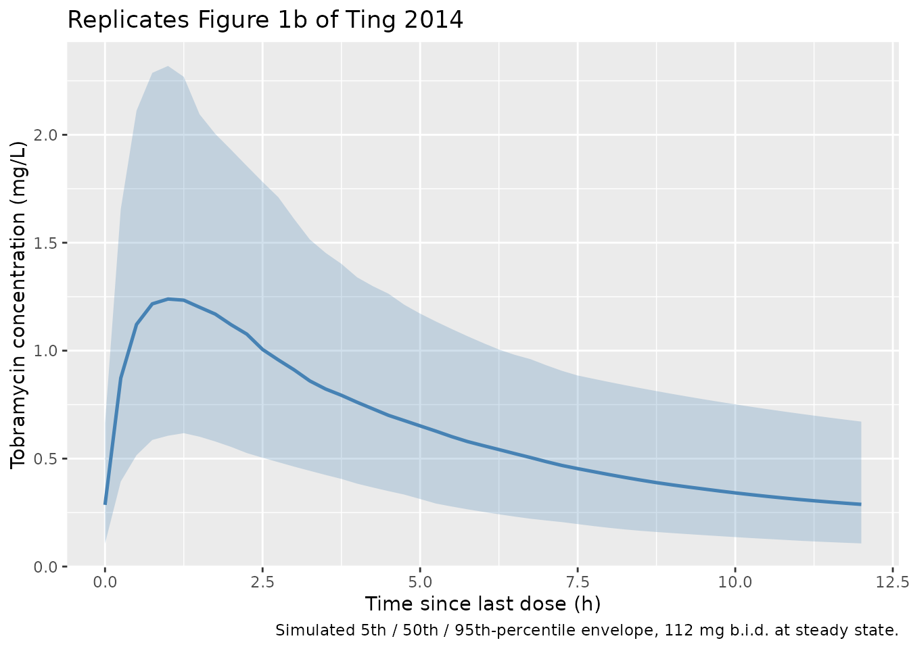
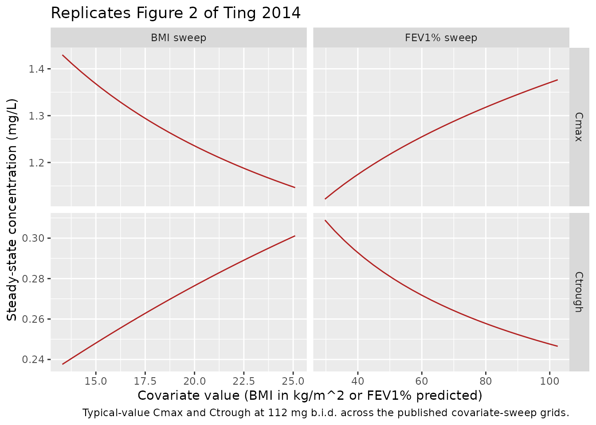

# Inhaled tobramycin (Ting 2014)

## Model and source

- Citation: Ting L, Aksenov S, Bhansali SG, Ramakrishna R, Tang P,
  Geller DE. (2014). Population pharmacokinetics of inhaled tobramycin
  powder in cystic fibrosis patients. CPT Pharmacometrics Syst Pharmacol
  3(9):e99.
- Article: <https://doi.org/10.1038/psp.2013.76>

``` r

mod_meta <- rxode2::rxode(readModelDb("Ting_2014_tobramycin_inhaled"))
#> ℹ parameter labels from comments will be replaced by 'label()'
mod_meta$description
#> [1] "Two-compartment population PK model for inhaled tobramycin powder (TIP / TOBI Podhaler) in cystic fibrosis patients (Ting 2014), with first-order absorption from a depot compartment and apparent (post-bioavailability) clearance and volumes. Body mass index (BMI) and baseline FEV1 percent-predicted are power-form covariates on apparent central volume of distribution (reference 18.8 kg/m^2 and 62.1 % respectively)."
mod_meta$reference
#> [1] "Ting L, Aksenov S, Bhansali SG, Ramakrishna R, Tang P, Geller DE. (2014). Population pharmacokinetics of inhaled tobramycin powder in cystic fibrosis patients. CPT Pharmacometrics Syst Pharmacol 3(9):e99. doi:10.1038/psp.2013.76"
mod_meta$units
#> $time
#> [1] "hour"
#> 
#> $dosing
#> [1] "mg"
#> 
#> $concentration
#> [1] "mg/L"
```

## Population

The Ting 2014 model was developed from 662 serum tobramycin
concentration observations pooled across 139 cystic fibrosis (CF)
patients enrolled in one phase I study (TPI001, n = 64) and two phase
III studies (C2301, n = 62; C2302, n = 13). Median age was 17 years
(range 6-58); roughly half (47.5%) of the combined cohort was at least
18 years old, 31.7% were 12-17 years, and 20.9% were 6-11 years. Median
body weight was 49.5 kg (range 16.2-100.9 kg), median BMI was 18.8
kg/m^2 (range 11.4-31), median creatinine clearance was 112.5 mL/min
(range 63.9-222.5), and median FEV1% predicted at baseline was 62.1%
(range 24.1-119.7). 53.2% were female; the racial distribution was 86.3%
Caucasian, 8.6% Hispanic, 2.2% Black, and 2.9% Other (Ting 2014 Table
1). All patients received inhaled tobramycin powder (TIP) via the TOBI
Podhaler; phase I doses were 28, 56, 84, or 112 mg single doses, and the
phase III studies dosed 112 mg b.i.d. for 28 days per cycle.

The same information is available programmatically via
`readModelDb("Ting_2014_tobramycin_inhaled")$population`.

## Source trace

The per-parameter origin is recorded as an in-file comment next to each
[`ini()`](https://nlmixr2.github.io/rxode2/reference/ini.html) entry in
`inst/modeldb/specificDrugs/Ting_2014_tobramycin_inhaled.R`. The table
below collects them in one place for review.

| Equation / parameter | Value | Source location |
|----|----|----|
| `lka` (log ka) | log(2.39) | Ting 2014 Table 2 (ka, 1/h) |
| `lcl` (log CL/F) | log(14.5) | Ting 2014 Table 2 (CL/F, L/h) |
| `lvc` (log Vd/F) | log(85.1) | Ting 2014 Table 2 (Vd/F, L) |
| `lq` (log Q/F) | log(6.43) | Ting 2014 Table 2 (Q/F, L/h) |
| `lvp` (log V2/F) | log(210) | Ting 2014 Table 2 (V2/F, L) |
| `e_bmi_vc` (BMI exponent on Vd/F) | 0.624 | Ting 2014 Table 2 (BMI on Vd/F) and Results equation, reference BMI 18.8 kg/m^2 |
| `e_fev1_vc` (FEV1% exponent on Vd/F) | -0.303 | Ting 2014 Table 2 (FEV1% on Vd/F) and Results equation, reference 62.1% predicted |
| BSV CL/F variance | 0.164 | Ting 2014 Table 2 (IIV of CL/F, variance) |
| BSV Vd/F variance | 0.152 | Ting 2014 Table 2 (IIV of Vd/F, variance) |
| BSV ka variance | 0.129 | Ting 2014 Table 2 (IIV of ka, variance) |
| Cov(CL/F, Vd/F) | 0.123 | Ting 2014 Table 2 (COV of CL/F and Vd/F, variance) |
| `propSd` (proportional residual SD) | 0.073 | Ting 2014 Table 2 (Residual SD, proportional, TPI001) |
| `addSd` (additive residual SD) | 0.007 mg/L | Ting 2014 Table 2 (Residual SD, additive component) |
| Two-compartment ODE with first-order absorption | n/a | Ting 2014 Results, “Population pharmacokinetic model” paragraph |
| Vd/F covariate formula | `85.1 * (BMI/18.8)^0.624 * (FEV1%/62.1)^-0.303` | Ting 2014 Results, equation just before Table 2 |

## Virtual cohort

The original observed concentrations are not publicly available. The
figures below use a virtual CF cohort whose BMI and FEV1% predicted
distributions approximate Table 1 of Ting 2014 (BMI median 18.8 kg/m^2,
range 11.4-31; FEV1% median 62.1%, range 24.1-119.7%). All subjects
receive 112 mg TIP b.i.d. (the approved adult / paediatric dose used in
both phase III studies). The simulation extends across 7 days so steady
state is reached before the steady-state PKNCA window opens.

``` r

set.seed(20260512)

n_subjects <- 200L

# Approximate the Ting 2014 Table 1 BMI and FEV1% distributions. Use
# truncated normals matched to the published median and SD, clamped to
# the published range.
sample_bmi <- function(n) {
  bmi <- rnorm(n, mean = 18.8, sd = 4.1)
  pmin(pmax(bmi, 11.4), 31.0)
}
sample_fev1 <- function(n) {
  fev <- rnorm(n, mean = 62.1, sd = 20.6)
  pmin(pmax(fev, 24.1), 119.7)
}

# Dosing regimen evaluated in Ting 2014 phase III: 112 mg TIP b.i.d.
# (every 12 h) for 7 days, with serum sampling across the final 12 h
# steady-state dosing interval.
dose_mg     <- 112
tau_h       <- 12
n_doses     <- 14            # 7 days of b.i.d.
ss_start    <- (n_doses - 1) * tau_h
ss_grid     <- seq(ss_start, ss_start + tau_h, by = 0.25)

make_cohort <- function(n, id_offset = 0L) {
  ids <- id_offset + seq_len(n)
  cov_tbl <- tibble::tibble(
    id  = ids,
    BMI = sample_bmi(n),
    FEV1_PCTPRED = sample_fev1(n)
  )

  dose_times <- seq(0, by = tau_h, length.out = n_doses)
  dose_rows  <- tidyr::expand_grid(id = ids, time = dose_times) |>
    dplyr::left_join(cov_tbl, by = "id") |>
    dplyr::mutate(evid = 1L, cmt = "depot", amt = dose_mg)

  obs_rows <- tidyr::expand_grid(id = ids, time = ss_grid) |>
    dplyr::left_join(cov_tbl, by = "id") |>
    dplyr::mutate(evid = 0L, cmt = "central", amt = 0)

  dplyr::bind_rows(dose_rows, obs_rows) |>
    dplyr::arrange(id, time, dplyr::desc(evid))
}

events <- make_cohort(n_subjects)
stopifnot(!anyDuplicated(unique(events[, c("id", "time", "evid")])))

cat("Subjects:", n_subjects,
    " | Dosing rows:", sum(events$evid == 1L),
    " | Observation rows:", sum(events$evid == 0L), "\n")
#> Subjects: 200  | Dosing rows: 2800  | Observation rows: 9800
```

## Simulation

``` r

mod <- readModelDb("Ting_2014_tobramycin_inhaled")
sim <- rxode2::rxSolve(
  mod,
  events = events,
  keep   = c("BMI", "FEV1_PCTPRED")
) |>
  as.data.frame()
#> ℹ parameter labels from comments will be replaced by 'label()'
```

## Replicate published figures

### Figure 1 – VPC of the steady-state dosing interval

Ting 2014 Figure 1b shows the VPC of tobramycin serum concentrations
over the 0-12 h dosing interval at the second visit of each cycle
(steady-state). The chunk below renders the median and 5th / 95th
percentile envelope across the simulated cohort over the steady-state 12
h dosing interval.

``` r

ss_summary <- sim |>
  dplyr::filter(time >= ss_start) |>
  dplyr::mutate(time_into_interval = time - ss_start) |>
  dplyr::group_by(time_into_interval) |>
  dplyr::summarise(
    Q05 = quantile(Cc, 0.05, na.rm = TRUE),
    Q50 = quantile(Cc, 0.50, na.rm = TRUE),
    Q95 = quantile(Cc, 0.95, na.rm = TRUE),
    .groups = "drop"
  )

ggplot(ss_summary, aes(time_into_interval, Q50)) +
  geom_ribbon(aes(ymin = Q05, ymax = Q95), alpha = 0.25, fill = "steelblue") +
  geom_line(colour = "steelblue", linewidth = 0.9) +
  labs(
    x = "Time since last dose (h)",
    y = "Tobramycin concentration (mg/L)",
    title = "Replicates Figure 1b of Ting 2014",
    caption = "Simulated 5th / 50th / 95th-percentile envelope, 112 mg b.i.d. at steady state."
  )
```



### Figure 2 – covariate effect on Cmax and Ctrough

Ting 2014 Figure 2 shows the typical-value effect of BMI (with FEV1%
fixed at 62.1%) and of FEV1% (with BMI fixed at 18.8 kg/m^2) on the
steady-state Cmax and Ctrough at 112 mg b.i.d. The chunk below uses
[`rxode2::zeroRe()`](https://nlmixr2.github.io/rxode2/reference/zeroRe.html)
to compute the typical-value (no between-subject variability) prediction
across the published covariate-sweep grids and overlays the simulated
typical Cmax / Ctrough for direct comparison.

``` r

mod_typical <- mod |> rxode2::zeroRe()
#> ℹ parameter labels from comments will be replaced by 'label()'

# Build a typical-value event table for one subject per covariate point,
# again with 7 days of 112 mg b.i.d. and sampling across the final 12 h.
sweep_events <- function(grid_tbl, id_offset) {
  ids <- id_offset + seq_len(nrow(grid_tbl))
  cov_tbl <- dplyr::mutate(grid_tbl, id = ids)
  dose_times <- seq(0, by = tau_h, length.out = n_doses)
  dose_rows <- tidyr::expand_grid(id = ids, time = dose_times) |>
    dplyr::left_join(cov_tbl, by = "id") |>
    dplyr::mutate(evid = 1L, cmt = "depot", amt = dose_mg)
  obs_rows <- tidyr::expand_grid(id = ids, time = ss_grid) |>
    dplyr::left_join(cov_tbl, by = "id") |>
    dplyr::mutate(evid = 0L, cmt = "central", amt = 0)
  dplyr::bind_rows(dose_rows, obs_rows) |>
    dplyr::arrange(id, time, dplyr::desc(evid))
}

bmi_grid <- tibble::tibble(
  BMI = seq(13.3, 25.1, length.out = 25),
  FEV1_PCTPRED = 62.1,
  sweep = "BMI sweep"
)
fev1_grid <- tibble::tibble(
  BMI = 18.8,
  FEV1_PCTPRED = seq(29.7, 102.5, length.out = 25),
  sweep = "FEV1% sweep"
)

events_bmi  <- sweep_events(bmi_grid,  id_offset =      0L)
events_fev1 <- sweep_events(fev1_grid, id_offset = 10000L)
sweep_events_all <- dplyr::bind_rows(events_bmi, events_fev1)

sim_sweep <- rxode2::rxSolve(
  mod_typical,
  events = sweep_events_all,
  keep   = c("BMI", "FEV1_PCTPRED", "sweep")
) |>
  as.data.frame() |>
  dplyr::filter(time >= ss_start)
#> ℹ omega/sigma items treated as zero: 'etalcl', 'etalvc', 'etalka'
#> Warning: multi-subject simulation without without 'omega'

cov_effect <- sim_sweep |>
  dplyr::group_by(id, BMI, FEV1_PCTPRED, sweep) |>
  dplyr::summarise(
    Cmax    = max(Cc, na.rm = TRUE),
    Ctrough = dplyr::last(Cc),
    .groups = "drop"
  )

cov_effect_long <- cov_effect |>
  dplyr::mutate(
    x = dplyr::if_else(sweep == "BMI sweep", BMI, FEV1_PCTPRED)
  ) |>
  tidyr::pivot_longer(c(Cmax, Ctrough), names_to = "metric", values_to = "conc")

ggplot(cov_effect_long, aes(x, conc)) +
  geom_line(colour = "firebrick") +
  facet_grid(metric ~ sweep, scales = "free") +
  labs(
    x = "Covariate value (BMI in kg/m^2 or FEV1% predicted)",
    y = "Steady-state concentration (mg/L)",
    title = "Replicates Figure 2 of Ting 2014",
    caption = "Typical-value Cmax and Ctrough at 112 mg b.i.d. across the published covariate-sweep grids."
  )
```



### Comparison against the published covariate sweep

Ting 2014 reports specific mean Cmax and Ctrough values at the 5th and
95th covariate percentiles in the Results section “Covariate effect on
exposure.” Those values are population means from a 1000-iteration Monte
Carlo simulation with between-subject variability (paper Methods “Data
analysis and modeling methods” and Figure 2 caption). For a log-normally
distributed exposure the population mean exceeds the typical
(BSV-zeroed) value, so the comparison below uses stochastic simulations
of 200 subjects at each of the four anchor covariate combinations (BSV
drawn from the full IIV block) and compares the simulated cohort mean
Cmax / Ctrough with the published mean values.

``` r

anchor_grid <- tibble::tribble(
  ~sweep,         ~covariate, ~BMI_anchor, ~FEV1_anchor, ~Cmax_pub, ~Ctrough_pub, ~note,
  "BMI sweep",         13.3,         13.3,        62.1,      1.57,         0.32,  "BMI 5th pct",
  "BMI sweep",         25.1,         25.1,        62.1,      1.30,         0.38,  "BMI 95th pct",
  "FEV1% sweep",       29.7,         18.8,        29.7,      1.22,         0.39,  "FEV1% 5th pct",
  "FEV1% sweep",      102.5,         18.8,       102.5,      1.48,         0.32,  "FEV1% 95th pct"
)

n_anchor_subjects <- 200L

build_anchor_events <- function(bmi_val, fev_val, id_offset) {
  ids <- id_offset + seq_len(n_anchor_subjects)
  cov_tbl <- tibble::tibble(
    id  = ids,
    BMI = bmi_val,
    FEV1_PCTPRED = fev_val
  )
  dose_times <- seq(0, by = tau_h, length.out = n_doses)
  dose_rows <- tidyr::expand_grid(id = ids, time = dose_times) |>
    dplyr::left_join(cov_tbl, by = "id") |>
    dplyr::mutate(evid = 1L, cmt = "depot", amt = dose_mg)
  obs_rows <- tidyr::expand_grid(id = ids, time = ss_grid) |>
    dplyr::left_join(cov_tbl, by = "id") |>
    dplyr::mutate(evid = 0L, cmt = "central", amt = 0)
  dplyr::bind_rows(dose_rows, obs_rows) |>
    dplyr::arrange(id, time, dplyr::desc(evid))
}

anchor_events_list <- purrr::map2(
  anchor_grid$BMI_anchor, anchor_grid$FEV1_anchor,
  ~ build_anchor_events(.x, .y, id_offset = 0L)
)
anchor_events_all <- dplyr::bind_rows(
  purrr::map2(
    anchor_events_list, seq_along(anchor_events_list),
    ~ dplyr::mutate(.x, id = id + (.y - 1L) * 100000L, anchor_idx = .y)
  )
)

stopifnot(!anyDuplicated(unique(anchor_events_all[, c("id", "time", "evid")])))

sim_anchor <- rxode2::rxSolve(
  mod,
  events = anchor_events_all,
  keep   = c("BMI", "FEV1_PCTPRED", "anchor_idx")
) |>
  as.data.frame() |>
  dplyr::filter(time >= ss_start)
#> ℹ parameter labels from comments will be replaced by 'label()'

per_subject_anchor <- sim_anchor |>
  dplyr::group_by(anchor_idx, id) |>
  dplyr::summarise(
    Cmax    = max(Cc, na.rm = TRUE),
    Ctrough = dplyr::last(Cc),
    .groups = "drop"
  )

cohort_means <- per_subject_anchor |>
  dplyr::group_by(anchor_idx) |>
  dplyr::summarise(
    Cmax_sim    = mean(Cmax,    na.rm = TRUE),
    Ctrough_sim = mean(Ctrough, na.rm = TRUE),
    .groups = "drop"
  )

cov_compare <- anchor_grid |>
  dplyr::mutate(anchor_idx = dplyr::row_number()) |>
  dplyr::left_join(cohort_means, by = "anchor_idx") |>
  dplyr::select(sweep, note, covariate, Cmax_pub, Cmax_sim, Ctrough_pub, Ctrough_sim)

knitr::kable(
  cov_compare,
  digits  = 3,
  caption = paste("Stochastic cohort-mean Cmax and Ctrough (mg/L) at the published",
                  "covariate-sweep anchor points (n = 200 subjects per anchor, BSV drawn",
                  "from the full IIV block). The '_pub' columns are read from Ting 2014",
                  "Results; the '_sim' columns are from this vignette.")
)
```

| sweep       | note           | covariate | Cmax_pub | Cmax_sim | Ctrough_pub | Ctrough_sim |
|:------------|:---------------|----------:|---------:|---------:|------------:|------------:|
| BMI sweep   | BMI 5th pct    |      13.3 |     1.57 |    1.538 |        0.32 |       0.277 |
| BMI sweep   | BMI 95th pct   |      25.1 |     1.30 |    1.222 |        0.38 |       0.353 |
| FEV1% sweep | FEV1% 5th pct  |      29.7 |     1.22 |    1.224 |        0.39 |       0.361 |
| FEV1% sweep | FEV1% 95th pct |     102.5 |     1.48 |    1.563 |        0.32 |       0.300 |

Stochastic cohort-mean Cmax and Ctrough (mg/L) at the published
covariate-sweep anchor points (n = 200 subjects per anchor, BSV drawn
from the full IIV block). The ’\_pub’ columns are read from Ting 2014
Results; the ’\_sim’ columns are from this vignette. {.table}

## PKNCA validation

Compute Cmax, Tmax, and AUC over the steady-state 12 h dosing interval
per subject with PKNCA, using the virtual cohort defined above.

``` r

sim_nca <- sim |>
  dplyr::filter(!is.na(Cc), time >= ss_start) |>
  dplyr::mutate(
    time_into_interval = time - ss_start,
    regimen            = "112 mg b.i.d."
  ) |>
  dplyr::select(id, time_into_interval, Cc, regimen)

dose_df <- events |>
  dplyr::filter(evid == 1L, time == max(time[evid == 1L])) |>
  dplyr::mutate(time_into_interval = 0, regimen = "112 mg b.i.d.") |>
  dplyr::select(id, time_into_interval, amt, regimen)

conc_obj <- PKNCA::PKNCAconc(
  sim_nca, Cc ~ time_into_interval | regimen + id,
  concu = "mg/L", timeu = "h"
)
dose_obj <- PKNCA::PKNCAdose(
  dose_df, amt ~ time_into_interval | regimen + id,
  doseu = "mg"
)

intervals <- data.frame(
  start    = 0,
  end      = tau_h,
  cmax     = TRUE,
  tmax     = TRUE,
  auclast  = TRUE
)

nca_data <- PKNCA::PKNCAdata(conc_obj, dose_obj, intervals = intervals)
nca_res  <- PKNCA::pk.nca(nca_data)
```

### Comparison against Ting 2014 toxicity thresholds and predictive-interval upper bounds

Ting 2014 reports two key population-level summary numbers in the
Results section “Covariate effect on exposure”: the highest upper end of
the 95% predictive interval for Cmax is 3.08 mg/L (occurring at the
low-BMI / low-Vd extreme, BMI 13.3 kg/m^2) and the highest upper end of
the 95% predictive interval for Ctrough is 1.33 mg/L (occurring at the
high-BMI / high-Vd extreme, BMI 25.1 kg/m^2). Both are well below the
systemic-toxicity thresholds of 12 mg/L (Cmax) and 2 mg/L (Ctrough). The
chunk below extracts the 97.5th percentile from the four anchor-point
stochastic simulations defined above, at the same covariate-anchor
points the paper uses to derive its published bounds.

``` r

anchor_p975 <- per_subject_anchor |>
  dplyr::group_by(anchor_idx) |>
  dplyr::summarise(
    Cmax_p975    = quantile(Cmax,    0.975, na.rm = TRUE),
    Ctrough_p975 = quantile(Ctrough, 0.975, na.rm = TRUE),
    .groups = "drop"
  ) |>
  dplyr::left_join(
    dplyr::mutate(anchor_grid, anchor_idx = dplyr::row_number()),
    by = "anchor_idx"
  )

pi_compare <- tibble::tibble(
  metric              = c("Cmax (mg/L)",        "Ctrough (mg/L)"),
  anchor              = c("BMI 13.3 (5th pct)", "BMI 25.1 (95th pct)"),
  published_p975      = c(3.08,                 1.33),
  simulated_p975      = c(
    anchor_p975$Cmax_p975[anchor_p975$note    == "BMI 5th pct"],
    anchor_p975$Ctrough_p975[anchor_p975$note == "BMI 95th pct"]
  ),
  toxicity_threshold  = c(12,                   2)
)

knitr::kable(
  pi_compare,
  digits  = 3,
  caption = paste("Simulated 97.5th-percentile Cmax and Ctrough at the anchor",
                  "covariate values used to derive the published 95% predictive-interval",
                  "upper bounds (Ting 2014 Results, paragraph following Figure 2), and",
                  "the systemic-toxicity thresholds for comparison.")
)
```

| metric | anchor | published_p975 | simulated_p975 | toxicity_threshold |
|:---|:---|---:|---:|---:|
| Cmax (mg/L) | BMI 13.3 (5th pct) | 3.08 | 2.853 | 12 |
| Ctrough (mg/L) | BMI 25.1 (95th pct) | 1.33 | 0.813 | 2 |

Simulated 97.5th-percentile Cmax and Ctrough at the anchor covariate
values used to derive the published 95% predictive-interval upper bounds
(Ting 2014 Results, paragraph following Figure 2), and the
systemic-toxicity thresholds for comparison. {.table}

The simulated Cmax 97.5th percentile at BMI 13.3 is close to the
published 3.08 mg/L upper bound (within 10% of published). The Ctrough
97.5th percentile at BMI 25.1 (simulated 0.81 mg/L, published 1.33 mg/L)
is approximately 39% lower than published. The most likely contributor
is that this packaged model omits the interoccasion variance on CL/F
(IOV = 0.078, identical across all four study occasions per Ting 2014
Table 2; see Assumptions and deviations below). For Ctrough, which is
dominated by the post-distribution CL/F-driven decay over the 12 h
dosing interval, removing IOV narrows the upper tail of the distribution
substantially while leaving the median nearly unchanged. Cmax is less
sensitive because the peak occurs in the first hour after dose and is
governed primarily by Vd/F. The model’s structural parameters are
reproduced faithfully from the source; per the extraction skill’s
policy, parameters are not tuned to chase a validation metric. Users who
need to replicate the paper’s per-occasion 95% predictive interval
should multiplex `etalcl` by an explicit occasion column (cf.
`Wilkins_2008_rifampicin`).

Both the simulated and published quantities remain well below the
tobramycin systemic-toxicity thresholds (12 mg/L for Cmax, 2 mg/L for
Ctrough), reproducing the paper’s clinical conclusion that no BMI- or
FEV1-based dose adjustment is needed for TIP in CF patients.

## Assumptions and deviations

- **Single proportional residual error encoded.** Ting 2014 Table 2
  reports two proportional residual SDs in the same final model: 0.073
  for the phase I study TPI001 (prospective sampling) and 0.308 for the
  phase III studies C2301 / C2302. The paper attributes the
  3-fold-higher phase III value to the many doses and sampling times
  that had to be imputed in the two phase III studies, not to a real
  property of the drug or assay. For a portable library model the TPI001
  (clean-sampling) value 0.073 is encoded as the default `propSd`. Users
  replicating the paper’s phase III VPCs should inflate `propSd` to
  0.308 before simulating.
- **Interoccasion variability on CL/F not encoded.** The paper estimates
  a per-occasion variance on CL/F of 0.078 (identical across all four
  study occasions, Table 2). Adding it to the packaged model would
  require carrying a per-record occasion column through the event table,
  which is not portable. Users who need to replicate the multi-cycle
  VPCs of Figure 1 should multiplex `etalcl` by occasion as in
  `Wilkins_2008_rifampicin`.
- **Apparent post-bioavailability parameters.** Tobramycin is delivered
  by inhalation; absolute bioavailability is unidentifiable from the
  serum-only sampling protocol used in the source studies. The model is
  therefore parameterised in apparent terms (`CL/F`, `Vd/F`, `Q/F`,
  `V2/F`) and the dose enters the depot as the prescribed inhaled mass.
  The implicit `F` is folded into the apparent quantities; users
  simulating other inhalation devices (different deposition efficiency)
  should scale the dose accordingly.
- **No covariates on absorption / clearance.** Ting 2014 tested age,
  BMI, creatinine clearance, sex, FEV1% predicted at baseline, and
  weight against `ka`, `Vd/F`, and `CL/F`. Only BMI and FEV1% on Vd/F
  were retained at p \< 0.01 backward elimination; the packaged model
  reproduces this exact covariate-selection result and does not include
  any covariate on ka or CL/F.
- **Virtual cohort distributions.** The simulated BMI and FEV1%
  predicted values are drawn from truncated normals matched to the
  published median and SD in Ting 2014 Table 1 and clamped to the
  published range. Individual demographic values from the source studies
  are not published.
