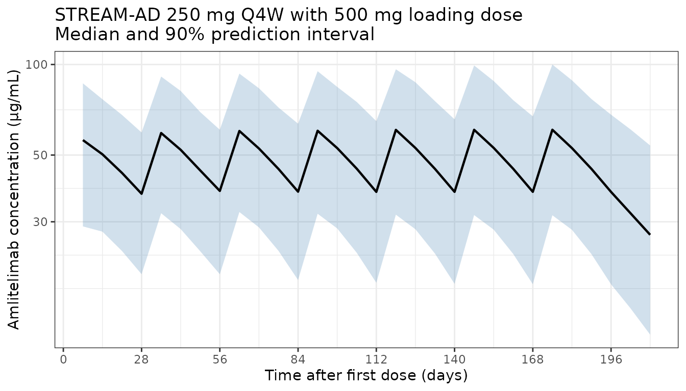
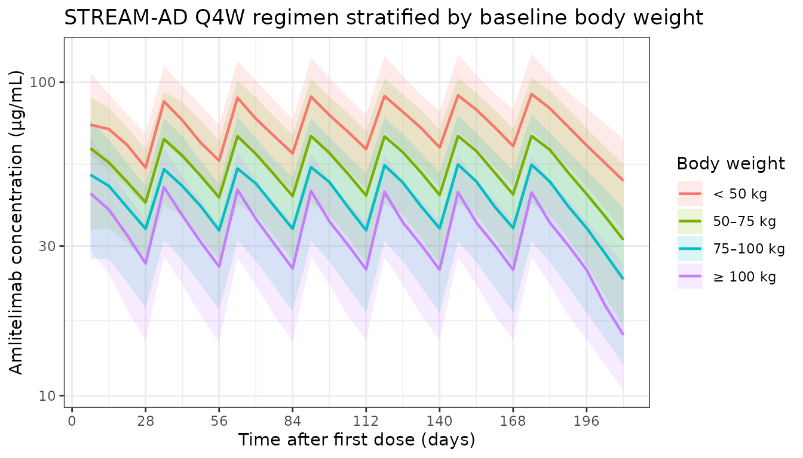
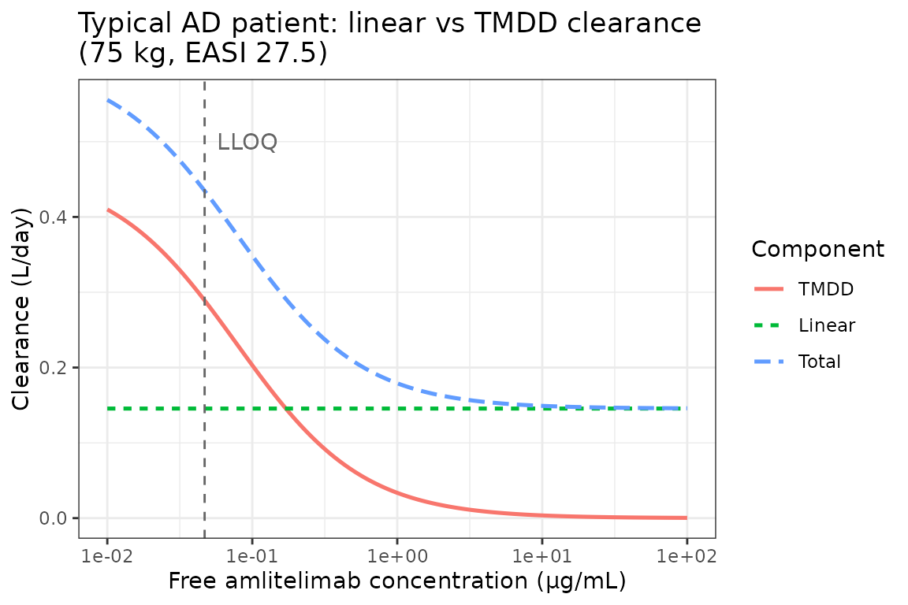

# Tiraboschi_2025_amlitelimab

``` r
library(nlmixr2lib)
library(dplyr)
#> 
#> Attaching package: 'dplyr'
#> The following objects are masked from 'package:stats':
#> 
#>     filter, lag
#> The following objects are masked from 'package:base':
#> 
#>     intersect, setdiff, setequal, union
library(ggplot2)
```

## Amlitelimab population PK simulation

Tiraboschi et al. (2025) developed a population PK model for amlitelimab
(anti-OX40L monoclonal antibody) in 439 adults (78 healthy volunteers
and 361 with moderate-to-severe atopic dermatitis). The structural model
is a two-compartment disposition with first-order subcutaneous
absorption, an absorption lag, and parallel linear and Michaelis-Menten
(target-mediated) elimination from the central compartment. Allometric
body-weight scaling acts on linear CL, V1, and V2; baseline EASI adds to
linear CL additively, and baseline serum albumin modifies subcutaneous
bioavailability (additive on the linear scale before logit
transformation).

This vignette simulates the labelled STREAM-AD regimen (250 mg SC Q4W
with a 500 mg SC loading dose at time 0) in a virtual AD population and
verifies three qualitative claims from the paper:

1.  Terminal half-life of amlitelimab in the linear PK range is
    approximately 28 days (range 24-43 days).
2.  Body weight is the dominant PK covariate, driving steady-state
    exposure up by roughly 70% in a 40 kg subject and down by roughly
    25% in a 100 kg subject, relative to the 75 kg reference participant
    (Table S3).
3.  Clearance at the lower limit of quantification (0.0469 µg/mL) is
    dominated (~66%) by target-mediated elimination, whereas above ~2
    µg/mL the linear pathway dominates (Figure 3).

### Virtual population

``` r
set.seed(2025)
n_subj <- 300

# Body weight: log-normal around the population median of 74.5 kg,
# truncated to the study range [40.5, 148] kg.
wt_draw <- exp(rnorm(n_subj, log(74.5), 0.22))
WT <- pmin(pmax(wt_draw, 40.5), 148)

# Baseline EASI: mean 29.7, SD 11.3 in AD subjects (Table S1);
# truncated at EASI >= 6 (moderate threshold for STREAM-AD eligibility)
# and <= 72 (the maximum possible score).
EASI <- pmin(pmax(rnorm(n_subj, 29.7, 11.3), 6), 72)

# Baseline serum albumin: mean 46.4 g/L, SD 3.5 g/L, truncated to [37, 57].
ALB <- pmin(pmax(rnorm(n_subj, 46.4, 3.5), 37), 57)

pop <- data.frame(
  ID   = seq_len(n_subj),
  WT   = WT,
  EASI = EASI,
  ALB  = ALB
)

# Weight strata for the covariate sensitivity figure
pop$wt_group <- cut(
  pop$WT,
  breaks = c(0, 50, 75, 100, Inf),
  labels = c("< 50 kg", "50\u201375 kg", "75\u2013100 kg", "\u2265 100 kg"),
  right  = FALSE
)
```

### Dataset construction

STREAM-AD labelled regimen: 500 mg SC loading dose at day 0, followed by
250 mg SC Q4W through week 24, with weekly observations through week 30.

``` r
dose_days <- c(0, seq(28, 168, by = 28))           # loading + Q4W for 24 weeks
dose_amt  <- c(500, rep(250, length(dose_days) - 1))

obs_times_day <- seq(0, 210, by = 7)               # through week 30

d_dose <- pop[rep(seq_len(n_subj), each = length(dose_days)), ] |>
  mutate(
    TIME = rep(dose_days, times = n_subj),
    AMT  = rep(dose_amt,  times = n_subj),
    EVID = 1,
    CMT  = "depot",
    DV   = NA
  )

d_obs <- pop[rep(seq_len(n_subj), each = length(obs_times_day)), ] |>
  mutate(
    TIME = rep(obs_times_day, times = n_subj),
    AMT  = 0,
    EVID = 0,
    CMT  = "central",
    DV   = NA
  )

d_sim <- bind_rows(d_dose, d_obs) |>
  arrange(ID, TIME, desc(EVID)) |>
  select(ID, TIME, AMT, EVID, CMT, DV, WT, EASI, ALB, wt_group)
```

### Load model and simulate

``` r
mod <- readModelDb("Tiraboschi_2025_amlitelimab")

set.seed(2025)
sim_out <- rxode2::rxSolve(mod, events = d_sim)
#> ℹ parameter labels from comments will be replaced by 'label()'
```

### Figure — population concentration-time profile (median and 90% PI)

``` r
sim_plot <- sim_out |>
  as.data.frame() |>
  filter(time > 0)

d_overall <- sim_plot |>
  group_by(time) |>
  summarise(
    Q05 = quantile(Cc, 0.05, na.rm = TRUE),
    Q50 = quantile(Cc, 0.50, na.rm = TRUE),
    Q95 = quantile(Cc, 0.95, na.rm = TRUE),
    .groups = "drop"
  )

ggplot(d_overall, aes(x = time, y = Q50)) +
  geom_ribbon(aes(ymin = Q05, ymax = Q95), fill = "steelblue", alpha = 0.25) +
  geom_line(linewidth = 0.8) +
  scale_y_log10() +
  scale_x_continuous(breaks = seq(0, 210, by = 28)) +
  labs(
    x = "Time after first dose (days)",
    y = "Amlitelimab concentration (\u03bcg/mL)",
    title = "STREAM-AD 250 mg Q4W with 500 mg loading dose\nMedian and 90% prediction interval"
  ) +
  theme_bw()
```



### Figure — stratification by baseline body weight

``` r
wt_map <- d_sim |>
  filter(EVID == 0, TIME == 0) |>
  select(ID, wt_group) |>
  distinct()

d_wt <- sim_plot |>
  left_join(wt_map, by = c("id" = "ID")) |>
  group_by(time, wt_group) |>
  summarise(
    Q50 = quantile(Cc, 0.50, na.rm = TRUE),
    Q05 = quantile(Cc, 0.05, na.rm = TRUE),
    Q95 = quantile(Cc, 0.95, na.rm = TRUE),
    .groups = "drop"
  )

ggplot(d_wt, aes(x = time, y = Q50, colour = wt_group, fill = wt_group)) +
  geom_ribbon(aes(ymin = Q05, ymax = Q95), alpha = 0.15, colour = NA) +
  geom_line(linewidth = 0.8) +
  scale_y_log10() +
  scale_x_continuous(breaks = seq(0, 210, by = 28)) +
  labs(
    x = "Time after first dose (days)",
    y = "Amlitelimab concentration (\u03bcg/mL)",
    colour = "Body weight",
    fill   = "Body weight",
    title  = "STREAM-AD Q4W regimen stratified by baseline body weight"
  ) +
  theme_bw()
```



### Covariate sensitivity — Table S3 replication

Compare steady-state week-24 exposure (AUC over the 4-week dosing
interval, AUC4W) against the reference AD patient (75 kg, EASI 27.5,
albumin 47 g/L) receiving 62.5 mg Q4W. Table S3 reports AUC4W changes of
+72%, +44%, -24%, and -51% for 40, 50, 100, and 150 kg participants
respectively.

``` r
ref <- data.frame(ID = 1, WT = 75, EASI = 27.5, ALB = 47)

typ_pop <- rbind(
  transform(ref, ID = 1, WT =  40),
  transform(ref, ID = 2, WT =  50),
  transform(ref, ID = 3, WT =  75),   # reference
  transform(ref, ID = 4, WT = 100),
  transform(ref, ID = 5, WT = 150)
)

typ_dose_days <- seq(0, 20 * 28, by = 28)  # 20 doses for steady state
typ_dose <- typ_pop[rep(seq_len(nrow(typ_pop)), each = length(typ_dose_days)), ] |>
  mutate(
    TIME = rep(typ_dose_days, times = nrow(typ_pop)),
    AMT  = 62.5,
    EVID = 1,
    CMT  = "depot",
    DV   = NA
  )

typ_obs_times <- seq(20 * 28, 24 * 28, by = 0.5)  # dense sampling across one SS interval
typ_obs <- typ_pop[rep(seq_len(nrow(typ_pop)), each = length(typ_obs_times)), ] |>
  mutate(
    TIME = rep(typ_obs_times, times = nrow(typ_pop)),
    AMT  = 0,
    EVID = 0,
    CMT  = "central",
    DV   = NA
  )

typ_ev <- bind_rows(typ_dose, typ_obs) |>
  arrange(ID, TIME, desc(EVID)) |>
  select(ID, TIME, AMT, EVID, CMT, DV, WT, EASI, ALB)

typ_sim <- rxode2::rxSolve(mod, events = typ_ev, omega = NA, sigma = NA)
#> ℹ parameter labels from comments will be replaced by 'label()'

trapz_auc <- function(time, conc) {
  sum(diff(time) * (head(conc, -1) + tail(conc, -1)) / 2)
}

typ_auc <- as.data.frame(typ_sim) |>
  filter(time >= 20 * 28) |>
  group_by(id) |>
  summarise(
    WT  = WT[1],
    AUC = trapz_auc(time, Cc),
    .groups = "drop"
  )

ref_auc <- typ_auc$AUC[typ_auc$WT == 75]
typ_auc$pct_change <- 100 * (typ_auc$AUC - ref_auc) / ref_auc
knitr::kable(
  typ_auc,
  digits  = c(0, 0, 2, 1),
  caption = "Simulated AUC4W at steady state (62.5 mg Q4W) vs body weight"
)
```

|  id |  WT |     AUC | pct_change |
|----:|----:|--------:|-----------:|
|   1 |  40 | 1338.03 |       83.5 |
|   2 |  50 | 1098.52 |       50.6 |
|   3 |  75 |  729.27 |        0.0 |
|   4 | 100 |  527.41 |      -27.7 |
|   5 | 150 |  322.57 |      -55.8 |

Simulated AUC4W at steady state (62.5 mg Q4W) vs body weight

### Clearance breakdown — Figure 3 replication

Total clearance for a typical AD patient at a grid of free
concentrations, decomposed into linear and TMDD (Michaelis-Menten)
components, reproducing Figure 3.

``` r
cc_grid    <- 10^seq(log10(0.01), log10(100), length.out = 200)
tvcll      <- 0.115            # unit: L/day (TVCLL at 75 kg ref)
e_easi_cl  <- 0.00111          # unit: L/day per EASI unit
vmax_mgday <- 0.0362           # unit: mg/day (TVVM; label typo "ug/day" in Table S2)
km_ugmL    <- 0.0783           # unit: ug/mL (equivalently mg/L)

cl_linear <- tvcll + e_easi_cl * 27.5                 # CL for 75 kg, EASI 27.5
cl_tmdd   <- vmax_mgday / (km_ugmL + cc_grid)         # unit: L/day (since VM is mg/day, KM+C in mg/L)
cl_total  <- cl_linear + cl_tmdd

df_cl <- data.frame(
  Cc_ugmL    = rep(cc_grid, 3),
  clearance  = c(cl_linear + 0 * cc_grid, cl_tmdd, cl_total),
  component  = factor(rep(c("Linear", "TMDD", "Total"), each = length(cc_grid)),
                      levels = c("TMDD", "Linear", "Total"))
)

ggplot(df_cl, aes(x = Cc_ugmL, y = clearance, colour = component, linetype = component)) +
  geom_line(linewidth = 0.9) +
  geom_vline(xintercept = 0.0469, linetype = "dashed", colour = "grey40") +
  annotate("text", x = 0.0469, y = 0.5, label = "LLOQ", hjust = -0.2, colour = "grey40") +
  scale_x_log10() +
  labs(
    x        = "Free amlitelimab concentration (\u03bcg/mL)",
    y        = "Clearance (L/day)",
    colour   = "Component",
    linetype = "Component",
    title    = "Typical AD patient: linear vs TMDD clearance\n(75 kg, EASI 27.5)"
  ) +
  theme_bw()
```



``` r

cl_at_lloq <- tvcll + 0.00111 * 27.5 + vmax_mgday / (km_ugmL + 0.0469)
tmdd_frac_at_lloq <- (vmax_mgday / (km_ugmL + 0.0469)) / cl_at_lloq
cat(sprintf("TMDD fraction of total CL at LLOQ (0.0469 ug/mL): %.1f%%\n",
            100 * tmdd_frac_at_lloq))
#> TMDD fraction of total CL at LLOQ (0.0469 ug/mL): 66.5%
cat(sprintf("TMDD fraction of total CL at 1 ug/mL: %.1f%%\n",
            100 * (vmax_mgday / (km_ugmL + 1)) / (tvcll + 0.00111 * 27.5 + vmax_mgday / (km_ugmL + 1))))
#> TMDD fraction of total CL at 1 ug/mL: 18.7%
```

### Terminal half-life check

The paper reports a mean terminal half-life of 28 days in the linear PK
range, with an individual range of 24-43 days. Compute the typical-value
terminal half-life from the model’s eigenvalues at the population mean.

``` r
tvv1   <- 3.46
tvv2   <- 2.48
tvq    <- 0.569
tvcl   <- tvcll + e_easi_cl * 27.5   # linear CL at reference AD patient

k10 <- tvcl / tvv1
k12 <- tvq  / tvv1
k21 <- tvq  / tvv2

A <- k10 + k12 + k21
B <- k10 * k21
beta <- (A - sqrt(A * A - 4 * B)) / 2
t_half_day <- log(2) / beta
cat(sprintf("Typical terminal half-life (linear range) = %.1f days\n", t_half_day))
#> Typical terminal half-life (linear range) = 29.6 days
```

### Notes on the simulation

- **Virtual population**: 300 AD patients with body weight, EASI, and
  albumin drawn from the Tiraboschi 2025 Table S1 distributions,
  truncated to the study ranges.
- **Regimen**: STREAM-AD labelled adult dosing - 500 mg SC loading dose,
  then 250 mg SC every 4 weeks through week 24.
- **IIV**: Simulated using the published `omega^2` values - V1 and CL as
  a correlated block (`omega^2` V1 = 0.0491, cov = 0.024, `omega^2` CL =
  0.0482), plus diagonal V2 (0.0693), Fsc (1.18 on the logit scale),
  ALAG (0.151), and Ka (0.135).
- **Residual error**: Proportional, CV 15.8%.
- **Unit note**: Table S2 labels TVVM as “ug/day”; it is in fact mg/day,
  as verified by the paper’s claim that TMDD represents approximately
  66% of total clearance at the LLOQ of 0.0469 ug/mL and approximately
  20% at 1 ug/mL. The Figure 3 replication and the terminal half-life
  check above both reproduce those fractions.

### Reference

- Tiraboschi JM, Zohar S, Quartino AL, Monnier R, Coulette V, Bizot JL,
  Jamois C. Population Pharmacokinetic and Pharmacodynamic Modeling for
  the Prediction of the Extended Amlitelimab Phase 3 Dosing Regimen in
  Atopic Dermatitis. CPT Pharmacometrics Syst Pharmacol.
  2025;14(12):2161-2173. <doi:10.1002/psp4.70121>
