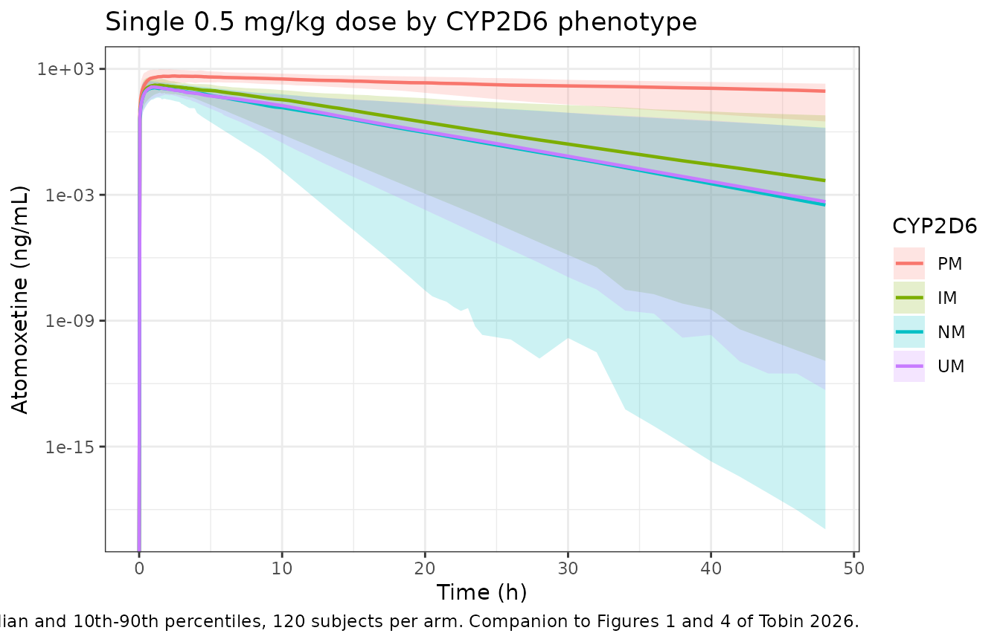

# Atomoxetine (Tobin 2026)

## Model and source

- Citation: Tobin KVT, Gobburu J, Leeder JS, Pritchett A, Dunn A.
  (2026). Understanding Atomoxetine Exposure Variability in Children and
  Adolescents With ADHD Through Population Pharmacokinetics. The Journal
  of Clinical Pharmacology 66(4):e70168. <doi:10.1002/jcph.70168>.
- Description: One-compartment population pharmacokinetic model for oral
  atomoxetine in 86 children and adolescents (6-17 years) with ADHD
  across three studies (159 participant-occasions, 1946 plasma
  concentrations), pooling single-dose and steady-state occasions.
  Absorption is sequential zero-order input into a depot over D1 = 0.75
  h followed by first-order transfer (ka = 27.35/h) into the central
  compartment, with linear elimination. Apparent volume (Vc/F =
  175.94 L) and apparent clearance (CL/F = 39.03 L/h) are allometrically
  scaled on actual body weight centred at 70 kg with fixed exponents of
  1.0 and 0.75. Both apparent parameters are divided by a
  relative-bioavailability factor Frel built from CYP2D6 poor (3.02) and
  intermediate (1.33) metabolizer status and CYP2C19 poor metabolizer
  status (2.32), all relative to normal metabolizers; apparent clearance
  additionally carries an 81% reduction in CYP2D6 poor metabolizers.
  CYP2D6 normal and ultrarapid metabolizers share the reference category
  because ultrarapid effects did not explain variability.
  Between-subject variability is large on the absorption parameters
  (127% CV on D1, 183% CV on ka) and moderate on disposition (64.5% CV
  on Vc/F, 75.5% CV on CL/F); residual error is combined additive (0.81
  ng/mL) plus proportional (21.4% CV). Parameters come from a two-stage
  analysis in which each participant-occasion was treated as a separate
  individual, so the reported between-subject variability pools
  between-subject and between-occasion variability.
- Article: <https://doi.org/10.1002/jcph.70168>

Atomoxetine is a non-stimulant selective norepinephrine reuptake
inhibitor used in ADHD. Its exposure is strongly polymorphic: CYP2D6
converts roughly 95% of the parent drug to 4-hydroxyatomoxetine, and
CYP2C19 carries the N-desmethylatomoxetine pathway that dominates when
CYP2D6 activity is lost. Tobin 2026 pooled three paediatric studies to
quantify that variability and to support phenotype-informed dosing
toward a 400 ng/mL target peak.

## Population

86 children and adolescents aged 6-17 years with ADHD contributed 1946
atomoxetine plasma concentrations over 159 participant-occasions, pooled
from 3 studies run at Children’s Mercy Kansas City (Tobin 2026 Table 1).
Mean age was 12.6 (SD 3.2) years, mean weight 54.5 (SD 26.4) kg, and
mean BMI 21.8 (SD 6.4) kg/m^2; 26% met the paper’s obesity definition
(BMI at or above the 95th percentile). The cohort was 81% male and 51%
White / 33% Black. CYP2D6 phenotypes were unevenly represented – 41
intermediate, 35 normal, 6 poor and 4 ultrarapid metabolizers – and the
CYP2C19 distribution was 31 normal, 26 rapid, 21 intermediate, 6
ultrarapid and 2 poor metabolizers.

A methodological point matters for interpreting the variance terms.
Absorption was so erratic between and within subjects that a one-stage
analysis would not converge, so the authors treated **each
participant-occasion as a separate individual** in a two-stage analysis.
The published between-subject variability therefore pools genuine
between-subject with between-occasion variability, and the authors note
that two-stage approaches tend to overestimate it.

The same information is available programmatically via
`readModelDb("Tobin_2026_atomoxetine")()$population`.

## Source trace

Per-parameter provenance is recorded as an in-file comment beside each
`ini()` entry in `inst/modeldb/specificDrugs/Tobin_2026_atomoxetine.R`.
Collected here:

| Equation / parameter | Value | Source location |
|----|----|----|
| `ld1` (zero-order depot duration) | 0.75 h | Table 3, row `Dur`; Results “Structural Model” |
| `lka` (first-order absorption) | 27.35 1/h | Table 3, row `ka` |
| `lvc` (Vc/F at 70 kg) | 175.94 L | Table 3, row `Vc/F` |
| `lcl` (CL/F at 70 kg) | 39.03 L/h | Table 3, row `CL/F` |
| `e_wt_vc` (allometric exponent, Vc/F) | 1.0 (fixed) | Equation (3), Equation (4); Results “Covariate Model” |
| `e_wt_cl` (allometric exponent, CL/F) | 0.75 (fixed) | Equation (3); Results “Covariate Model” |
| `e_cyp2d6_pm_vc_cl` (Frel, CYP2D6 PM) | 3.02 | Table 3, row `Frel CYP2D6,PM`; Results “Covariate Model” |
| `e_cyp2d6_im_vc_cl` (Frel, CYP2D6 IM) | 1.33 | Table 3, row labelled `Frel CYP2C6,IM` (description reads “CYP2D6 IMs”) |
| `e_cyp2c19_pm_vc_cl` (Frel, CYP2C19 PM) | 2.32 | Table 3, row `Frel CYP2C19,PM` |
| `e_cyp2d6_pm_cl` (CL/F effect, CYP2D6 PM) | -0.81 | Table 3, row `E CYP2D6,PM`; Discussion “Impact of Covariates” |
| `etald1` / `etalka` / `etalvc` / `etalcl` | 127.42 / 182.7 / 64.52 / 75.48 CV% | Table 3, BSV block |
| `addSd` / `propSd` | 0.81 ng/mL / 21.39 CV% | Table 3, RUV block; Results “Structural Model” |
| `d/dt(depot)`, `d/dt(central)`, `dur(depot)` | n/a | Results “Structural Model” (one compartment, zero-order transit into depot, first-order absorption, first-order elimination) |
| `vc <- ... / frel`, `cl <- ... / frel * (1 + E)` | n/a | Equation (4), Equation (5), Table 3 covariate equations |
| `Cc <- 1000 * central / vc` | n/a | Unit conversion, mg/L to ng/mL (Tobin 2026 reports ng/mL throughout) |

## Structural checks at the published reference

These checks are deterministic (typical values, random effects zeroed),
so the bounds below are exact rather than cohort-dependent.

``` r

mod <- readModelDb("Tobin_2026_atomoxetine")
mod_tv <- rxode2::zeroRe(mod)

# Table 1 phenotype-mean weights, used so each arm is compared at the weight
# the paper's own NCA stratum was observed at.
pheno <- tibble::tribble(
  ~phenotype, ~WT,  ~CYP2D6_PM, ~CYP2D6_IM, ~CYP2C19_PM,
  "PM",       61.2,  1,          0,          0,
  "IM",       57.2,  0,          1,          0,
  "NM",       50.2,  0,          0,          0,
  "UM",       54.2,  0,          0,          0
)

obs_grid <- sort(unique(c(seq(0, 6, by = 0.02), seq(6, 120, by = 0.25))))

make_sd_arm <- function(i, dose_mg_kg = 0.5, id_offset = 0L) {
  p <- pheno[i, ]
  dose_rows <- tibble::tibble(
    id = id_offset + i, time = 0, amt = dose_mg_kg * p$WT,
    evid = 1L, cmt = "depot",
    # rate = -2 selects the model-defined duration dur(depot) <- d1. Without
    # it rxode2 silently delivers the dose as a bolus and d1 has no effect.
    rate = -2
  )
  obs_rows <- tibble::tibble(
    id = id_offset + i, time = obs_grid, amt = NA_real_,
    evid = 0L, cmt = "central", rate = NA_real_
  )
  dplyr::bind_rows(dose_rows, obs_rows) |>
    dplyr::mutate(phenotype = p$phenotype, WT = p$WT,
                  CYP2D6_PM = p$CYP2D6_PM, CYP2D6_IM = p$CYP2D6_IM,
                  CYP2C19_PM = p$CYP2C19_PM)
}

ev_tv <- dplyr::bind_rows(lapply(seq_len(nrow(pheno)), make_sd_arm)) |>
  as.data.frame()
sim_tv <- rxode2::rxSolve(mod_tv, ev_tv, keep = c("phenotype", "WT")) |>
  as.data.frame()
#> ℹ omega/sigma items treated as zero: 'etald1', 'etalka', 'etalvc', 'etalcl'
#> Warning: multi-subject simulation without without 'omega'

par_tv <- sim_tv |>
  dplyr::filter(!is.na(Cc)) |>
  dplyr::group_by(phenotype) |>
  dplyr::summarise(WT = dplyr::first(WT), vc = dplyr::first(vc),
                   cl = dplyr::first(cl), .groups = "drop") |>
  dplyr::mutate(t_half = log(2) * vc / cl)
```

### Typical values reproduce Table 3 at the 70 kg reference

At 70 kg with `Frel = 1` and `E_CYP2D6,PM = 0`, the model must return
the published `Vc/F` and `CL/F` exactly.

``` r

ref70 <- rxode2::rxSolve(
  mod_tv,
  data.frame(id = 1L, time = c(0, 1), amt = c(10, NA_real_),
             evid = c(1L, 0L), cmt = c("depot", "central"),
             rate = c(-2, NA_real_),
             WT = 70, CYP2D6_PM = 0, CYP2D6_IM = 0, CYP2C19_PM = 0)
) |> as.data.frame()
#> ℹ omega/sigma items treated as zero: 'etald1', 'etalka', 'etalvc', 'etalcl'

stopifnot(
  abs(ref70$vc[1] - 175.94) < 1e-6,   # Table 3, Vc/F
  abs(ref70$cl[1] -  39.03) < 1e-6    # Table 3, CL/F
)
```

### The allometric centring weight is 70 kg, not the printed 10 kg

Tobin 2026 Equation (3) defines the size term as `(wt_i / 70)^b` with
“70 is the typical adult body weight in kg”, and the Discussion repeats
“centered around a 70-kg typical adult”. The printed **Equation (5)**
and the Table 3 covariate-equation footer nevertheless show
`(wt_i / 10)^0.75` for `CL/F`.

The paper’s own NCA half-lives adjudicate this, and they do so without
reference to any normalisation: because `Frel` divides `Vc/F` and `CL/F`
identically, it cancels out of `t1/2 = ln2 * (Vc/F) / (CL/F)`, leaving a
quantity that depends only on weight and the CYP2D6-PM clearance effect.

``` r

t_half_at <- function(wt, centre, e_pm = 0) {
  log(2) * (175.94 * (wt / 70)^1.0) / (39.03 * (wt / centre)^0.75 * (1 + e_pm))
}
centring <- tibble::tibble(
  phenotype = pheno$phenotype,
  WT        = pheno$WT,
  observed  = c(17.3, 4.5, 2.5, 2.3),      # Table 2, "Half Life (hr)"
  obs_sd    = c( 4.9, 4.6, 0.6, 0.4),
  centre_70 = t_half_at(pheno$WT, 70, c(-0.81, 0, 0, 0)),
  centre_10 = t_half_at(pheno$WT, 10, c(-0.81, 0, 0, 0))
)
knitr::kable(centring, digits = 2,
             caption = "Half-life (h) under the two candidate centring weights.")
```

| phenotype |   WT | observed | obs_sd | centre_70 | centre_10 |
|:----------|-----:|---------:|-------:|----------:|----------:|
| PM        | 61.2 |     17.3 |    4.9 |     15.90 |      3.70 |
| IM        | 57.2 |      4.5 |    4.6 |      2.97 |      0.69 |
| NM        | 50.2 |      2.5 |    0.6 |      2.88 |      0.67 |
| UM        | 54.2 |      2.3 |    0.4 |      2.93 |      0.68 |

Half-life (h) under the two candidate centring weights. {.table}

``` r


# Discriminator 1: the 70 kg centring is closer to the observed half-life than
# the 10 kg centring in EVERY stratum. Both are deterministic, so this is exact.
stopifnot(all(abs(centring$centre_70 - centring$observed) <
                abs(centring$centre_10 - centring$observed)))

# Discriminator 2: the 10 kg centring falls outside the published mean +/- 1 SD
# wherever the observed SD is informative. The IM stratum is excluded because
# its SD (4.6 h) is as large as its mean (4.5 h) and cannot reject anything.
informative <- centring$phenotype != "IM"
stopifnot(all(abs(centring$centre_10 - centring$observed)[informative] >
                centring$obs_sd[informative]))

# Discriminator 3: the 70 kg centring lands inside the published SD for PM, IM
# and NM (UM is discussed under "Assumptions and deviations").
stopifnot(all(abs(centring$centre_70 - centring$observed)[1:3] <=
                centring$obs_sd[1:3]))
```

The model therefore encodes 70 kg on both parameters, and treats the
`10` in Equation (5) as a typographical error. See “Assumptions and
deviations”.

### Relative bioavailability composes multiplicatively

Both CYP2C19 poor metabolizers in the cohort were also CYP2D6
intermediate metabolizers, so the two `Frel` factors multiply for those
subjects (Table 3 covariate equations).

``` r

frel_case <- function(d6pm, d6im, c19pm) {
  rxode2::rxSolve(
    mod_tv,
    data.frame(id = 1L, time = c(0, 1), amt = c(10, NA_real_),
               evid = c(1L, 0L), cmt = c("depot", "central"),
               rate = c(-2, NA_real_),
               WT = 57.2, CYP2D6_PM = d6pm, CYP2D6_IM = d6im,
               CYP2C19_PM = c19pm)
  ) |> as.data.frame() |> dplyr::pull(vc) |> dplyr::first()
}
vc_ref  <- frel_case(0, 0, 0)
#> ℹ omega/sigma items treated as zero: 'etald1', 'etalka', 'etalvc', 'etalcl'
vc_im   <- frel_case(0, 1, 0)
#> ℹ omega/sigma items treated as zero: 'etald1', 'etalka', 'etalvc', 'etalcl'
vc_both <- frel_case(0, 1, 1)
#> ℹ omega/sigma items treated as zero: 'etald1', 'etalka', 'etalvc', 'etalcl'

stopifnot(
  abs(vc_ref / vc_im   - 1.33)        < 1e-6,  # CYP2D6 IM alone
  abs(vc_ref / vc_both - 1.33 * 2.32) < 1e-6   # IM and CYP2C19 PM together
)
```

### Dose mass balance

`CL/F * AUC(0-inf)` must return the administered dose in every arm; this
is the gate that catches a zero-order input that silently failed to
deliver.

``` r

mass_balance <- sim_tv |>
  dplyr::filter(!is.na(Cc)) |>
  dplyr::group_by(phenotype) |>
  dplyr::summarise(
    dose  = 0.5 * dplyr::first(WT),
    # trapezoidal AUC over the grid, plus the analytic terminal tail
    auc   = sum(diff(time) * (head(Cc, -1) + tail(Cc, -1)) / 2) / 1000 +
              dplyr::last(Cc) / 1000 / (dplyr::first(cl) / dplyr::first(vc)),
    recovered = dplyr::first(cl) * auc,
    .groups = "drop"
  ) |>
  dplyr::mutate(pct = 100 * recovered / dose)
knitr::kable(mass_balance, digits = 3,
             caption = "CL/F * AUC(0-inf) against the administered dose (mg).")
```

| phenotype | dose |    auc | recovered |     pct |
|:----------|-----:|-------:|----------:|--------:|
| IM        | 28.6 |  1.134 |    28.602 | 100.008 |
| NM        | 25.1 |  0.825 |    25.102 | 100.008 |
| PM        | 30.6 | 13.783 |    30.600 | 100.001 |
| UM        | 27.1 |  0.841 |    27.102 | 100.008 |

CL/F \* AUC(0-inf) against the administered dose (mg). {.table}

``` r

stopifnot(max(abs(mass_balance$pct - 100)) < 0.5)
```

### Steady-state accumulation occurs only in poor metabolizers

Tobin 2026 Results “Data”: “accumulation at steady state is evident for
only CYP2D6 PMs at steady-state.” With once-daily dosing the
accumulation ratio is `1 / (1 - exp(-kel * 24))`.

``` r

accum <- par_tv |>
  dplyr::mutate(kel = cl / vc,
                ratio = 1 / (1 - exp(-kel * 24)))
knitr::kable(accum |> dplyr::select(phenotype, t_half, ratio), digits = 3,
             caption = "Predicted once-daily accumulation ratio by CYP2D6 phenotype.")
```

| phenotype | t_half | ratio |
|:----------|-------:|------:|
| IM        |  2.971 | 1.004 |
| NM        |  2.875 | 1.003 |
| PM        | 15.902 | 1.542 |
| UM        |  2.931 | 1.003 |

Predicted once-daily accumulation ratio by CYP2D6 phenotype. {.table}

``` r

stopifnot(
  accum$ratio[accum$phenotype == "PM"] > 1.3,                 # marked accumulation
  all(accum$ratio[accum$phenotype != "PM"] < 1.05)            # essentially none
)
```

## Virtual cohort

Original observed data are not publicly available. The cohort below
draws weights per CYP2D6 phenotype from log-normal distributions matched
to the Table 1 stratum means and SDs, truncated to a plausible 6-17 year
range, and gives every subject the Study A weight-based dose of 0.5
mg/kg.

``` r

# set.seed() seeds R's RNG only. rxode2's simulation RNG is partitioned per
# solver thread, so this cohort differs on a machine with a different thread
# count. Every assertion below is written to hold for any cohort the model
# can produce (pattern 12 of known-vignette-failure-patterns.md).
set.seed(20260912L)
n_per_arm <- 120L

# Coarser than the deterministic grid above: still 0.05 h through the
# absorption phase (D1 = 0.75 h, so Tmax is well resolved) but 2 h out in the
# terminal phase, which keeps the PKNCA half-life fit over ~500 subjects
# inside the vignette time budget.
cohort_grid <- sort(unique(c(seq(0, 6, by = 0.05),
                             seq(6, 24, by = 0.5),
                             seq(24, 120, by = 2))))

sample_wt <- function(n, m, s) {
  # log-normal matched on the arithmetic mean and SD, clipped to 20-120 kg
  sdlog  <- sqrt(log(1 + (s / m)^2))
  meanlog <- log(m) - sdlog^2 / 2
  pmin(pmax(stats::rlnorm(n, meanlog, sdlog), 20), 120)
}
wt_stats <- tibble::tribble(
  ~phenotype, ~m,   ~s,
  "PM",       61.2, 26.3,
  "IM",       57.2, 29.5,
  "NM",       50.2, 22.1,
  "UM",       54.2, 30.9
)

make_cohort <- function(i, id_offset) {
  p  <- pheno[i, ]
  ws <- wt_stats[wt_stats$phenotype == p$phenotype, ]
  subj <- tibble::tibble(
    id = id_offset + seq_len(n_per_arm),
    WT = sample_wt(n_per_arm, ws$m, ws$s)
  )
  dose_rows <- subj |>
    dplyr::mutate(time = 0, amt = 0.5 * WT, evid = 1L,
                  cmt = "depot", rate = -2)
  obs_rows <- subj |>
    tidyr::crossing(time = cohort_grid) |>
    dplyr::mutate(amt = NA_real_, evid = 0L,
                  cmt = "central", rate = NA_real_)
  dplyr::bind_rows(dose_rows, obs_rows) |>
    dplyr::mutate(phenotype = p$phenotype,
                  CYP2D6_PM = p$CYP2D6_PM, CYP2D6_IM = p$CYP2D6_IM,
                  CYP2C19_PM = p$CYP2C19_PM)
}

events <- dplyr::bind_rows(
  lapply(seq_len(nrow(pheno)),
         function(i) make_cohort(i, id_offset = (i - 1L) * 1000L))
) |>
  dplyr::arrange(id, time, dplyr::desc(evid)) |>
  as.data.frame()

stopifnot(!anyDuplicated(unique(events[, c("id", "time", "evid")])))
```

## Simulation

``` r

sim <- rxode2::rxSolve(mod, events = events,
                       keep = c("phenotype", "WT")) |>
  as.data.frame()
sim$phenotype <- factor(sim$phenotype, levels = c("PM", "IM", "NM", "UM"))
```

## Replicate published figures

``` r

# Companion to Figure 1 of Tobin 2026 (individual atomoxetine plasma
# concentration over time, coloured by CYP2D6 phenotype) and to the Figure 4
# VPC: median with 10th-90th percentile band, by phenotype.
sim |>
  dplyr::filter(!is.na(Cc), time <= 48) |>
  dplyr::group_by(phenotype, time) |>
  dplyr::summarise(Q10 = quantile(Cc, 0.10), Q50 = quantile(Cc, 0.50),
                   Q90 = quantile(Cc, 0.90), .groups = "drop") |>
  ggplot(aes(time, Q50, colour = phenotype, fill = phenotype)) +
  geom_ribbon(aes(ymin = Q10, ymax = Q90), alpha = 0.2, colour = NA) +
  geom_line(linewidth = 0.8) +
  scale_y_log10() +
  labs(x = "Time (h)", y = "Atomoxetine (ng/mL)",
       colour = "CYP2D6", fill = "CYP2D6",
       title = "Single 0.5 mg/kg dose by CYP2D6 phenotype",
       caption = paste0("Median and 10th-90th percentiles, ", n_per_arm,
                        " subjects per arm. Companion to Figures 1 and 4 of",
                        " Tobin 2026.")) +
  theme_bw()
#> Warning in scale_y_log10(): log-10 transformation introduced infinite values.
#> log-10 transformation introduced infinite values.
#> log-10 transformation introduced infinite values.
#> log-10 transformation introduced infinite values.
```



The rank order reproduces the paper’s central finding: at the label’s
flat weight-based dose, exposure rises steeply as CYP2D6 activity falls,
and poor metabolizers separate from every other phenotype.

``` r

# Reproduces the direction and rough magnitude of the Results statement that
# "CYP2D6 PMs show 130% and 624% higher dose-normalized Cmax and AUC0-24h,
# respectively, compared to NMs".
exposure <- sim |>
  dplyr::filter(!is.na(Cc)) |>
  dplyr::group_by(phenotype, id) |>
  dplyr::summarise(
    # rxSolve does not return `amt`; every subject received 0.5 mg/kg, so the
    # administered dose is recovered exactly from the kept WT column.
    dose  = 0.5 * dplyr::first(WT),
    cmax  = max(Cc),
    auc24 = sum(diff(time[time <= 24]) *
                  (head(Cc[time <= 24], -1) + tail(Cc[time <= 24], -1)) / 2),
    .groups = "drop"
  ) |>
  dplyr::group_by(phenotype) |>
  dplyr::summarise(cmax_dn = median(cmax / dose),
                   auc_dn  = median(auc24 / dose), .groups = "drop")

ratios <- exposure |>
  dplyr::mutate(
    cmax_vs_nm = cmax_dn / exposure$cmax_dn[exposure$phenotype == "NM"],
    auc_vs_nm  = auc_dn  / exposure$auc_dn[exposure$phenotype == "NM"]
  )
knitr::kable(ratios, digits = 2,
             caption = "Dose-normalized exposure relative to CYP2D6 normal metabolizers.")
```

| phenotype | cmax_dn | auc_dn | cmax_vs_nm | auc_vs_nm |
|:----------|--------:|-------:|-----------:|----------:|
| PM        |   18.84 | 272.37 |       2.33 |      8.12 |
| IM        |    7.92 |  45.54 |       0.98 |      1.36 |
| NM        |    8.08 |  33.52 |       1.00 |      1.00 |
| UM        |    6.73 |  29.56 |       0.83 |      0.88 |

Dose-normalized exposure relative to CYP2D6 normal metabolizers.
{.table}

``` r


# The paper reports PM/NM ratios of 2.30 (Cmax) and 7.24 (AUC0-24) from its
# observed NCA. The model is built on typical values from a different (pooled,
# individualised-dose) dataset, so bound the comparison generously: what must
# hold is that PMs are several-fold higher on Cmax and an order of magnitude
# higher on AUC, and that IM sits between NM and PM.
pm <- ratios[ratios$phenotype == "PM", ]
im <- ratios[ratios$phenotype == "IM", ]
stopifnot(
  pm$cmax_vs_nm > 1.8, pm$cmax_vs_nm < 4.5,
  pm$auc_vs_nm  > 4.0, pm$auc_vs_nm  < 16,
  im$auc_vs_nm  > 1.0, im$auc_vs_nm  < pm$auc_vs_nm
)
```

## PKNCA validation

``` r

sim_nca <- sim |>
  dplyr::filter(!is.na(Cc)) |>
  dplyr::select(id, time, Cc, phenotype)

# Guarantee a time = 0 row per subject; pre-dose Cc = 0 for extravascular input.
sim_nca <- dplyr::bind_rows(
  sim_nca,
  sim_nca |> dplyr::distinct(id, phenotype) |>
    dplyr::mutate(time = 0, Cc = 0)
) |>
  dplyr::distinct(phenotype, id, time, .keep_all = TRUE) |>
  dplyr::arrange(id, time)

conc_obj <- PKNCA::PKNCAconc(as.data.frame(sim_nca), Cc ~ time | phenotype + id)
#> Warning in assert_conc(conc, any_missing_conc = any_missing_conc): Negative
#> concentrations found

dose_df <- events |>
  dplyr::filter(evid == 1) |>
  dplyr::select(id, time, amt, phenotype)
dose_obj <- PKNCA::PKNCAdose(dose_df, amt ~ time | phenotype + id)

intervals <- data.frame(
  start = 0, end = Inf,
  cmax = TRUE, tmax = TRUE, half.life = TRUE, aucinf.obs = TRUE
)
nca_res <- PKNCA::pk.nca(PKNCA::PKNCAdata(conc_obj, dose_obj,
                                          intervals = intervals))
#> Warning in assert_conc(conc = conc): Negative concentrations found
#> Warning in assert_conc(conc = conc): Negative concentrations found
#> Warning in assert_conc(conc = conc): Negative concentrations found
#> Warning in assert_conc(conc = conc): Negative concentrations found
#> Warning in assert_conc(conc = conc): Negative concentrations found
#> Warning in assert_conc(conc = conc): Negative concentrations found
#> Warning in log(data$conc): NaNs produced
#> Warning in assert_conc(conc, any_missing_conc = any_missing_conc): Negative
#> concentrations found
#> Warning in log(conc.2/conc.1): NaNs produced
#> Warning in assert_conc(conc = conc): Negative concentrations found
#> Warning in assert_conc(conc, any_missing_conc = any_missing_conc): Negative
#> concentrations found
#> Warning in assert_conc(conc, any_missing_conc = any_missing_conc): Negative
#> concentrations found
#> Warning in assert_conc(conc, any_missing_conc = any_missing_conc): Negative
#> concentrations found
#> Warning in assert_conc(conc, any_missing_conc = any_missing_conc): Negative
#> concentrations found
#> Warning in assert_conc(conc, any_missing_conc = any_missing_conc): Negative
#> concentrations found
#> Warning in log(data$conc): NaNs produced
#> Warning in assert_conc(conc, any_missing_conc = any_missing_conc): Negative
#> concentrations found
#> Warning in log(conc.2/conc.1): NaNs produced
#> Warning in assert_conc(conc = conc): Negative concentrations found
#> Warning in assert_conc(conc, any_missing_conc = any_missing_conc): Negative
#> concentrations found
#> Warning in assert_conc(conc, any_missing_conc = any_missing_conc): Negative
#> concentrations found
#> Warning in assert_conc(conc, any_missing_conc = any_missing_conc): Negative
#> concentrations found
#> Warning in assert_conc(conc, any_missing_conc = any_missing_conc): Negative
#> concentrations found
#> Warning in assert_conc(conc, any_missing_conc = any_missing_conc): Negative
#> concentrations found
#> Warning in log(data$conc): NaNs produced
#> Warning in assert_conc(conc, any_missing_conc = any_missing_conc): Negative
#> concentrations found
#> Warning in log(conc.2/conc.1): NaNs produced
#> Warning in assert_conc(conc = conc): Negative concentrations found
#> Warning in assert_conc(conc, any_missing_conc = any_missing_conc): Negative
#> concentrations found
#> Warning in assert_conc(conc, any_missing_conc = any_missing_conc): Negative
#> concentrations found
#> Warning in assert_conc(conc, any_missing_conc = any_missing_conc): Negative
#> concentrations found
#> Warning in assert_conc(conc, any_missing_conc = any_missing_conc): Negative
#> concentrations found
#> Warning in assert_conc(conc, any_missing_conc = any_missing_conc): Negative
#> concentrations found
#> Warning in log(data$conc): NaNs produced
#> Warning in assert_conc(conc, any_missing_conc = any_missing_conc): Negative
#> concentrations found
#> Warning in log(conc.2/conc.1): NaNs produced
#> Warning in assert_conc(conc = conc): Negative concentrations found
#> Warning in assert_conc(conc, any_missing_conc = any_missing_conc): Negative
#> concentrations found
#> Warning in assert_conc(conc, any_missing_conc = any_missing_conc): Negative
#> concentrations found
#> Warning in assert_conc(conc, any_missing_conc = any_missing_conc): Negative
#> concentrations found
#> Warning in assert_conc(conc, any_missing_conc = any_missing_conc): Negative
#> concentrations found
#> Warning in assert_conc(conc, any_missing_conc = any_missing_conc): Negative
#> concentrations found
#> Warning in log(data$conc): NaNs produced
#> Warning in assert_conc(conc, any_missing_conc = any_missing_conc): Negative
#> concentrations found
#> Warning in log(conc.2/conc.1): NaNs produced
#> Warning in assert_conc(conc = conc): Negative concentrations found
#> Warning in assert_conc(conc, any_missing_conc = any_missing_conc): Negative
#> concentrations found
#> Warning in assert_conc(conc, any_missing_conc = any_missing_conc): Negative
#> concentrations found
#> Warning in assert_conc(conc, any_missing_conc = any_missing_conc): Negative
#> concentrations found
#> Warning in assert_conc(conc, any_missing_conc = any_missing_conc): Negative
#> concentrations found
#> Warning in assert_conc(conc, any_missing_conc = any_missing_conc): Negative
#> concentrations found
#> Warning in log(data$conc): NaNs produced
#> Warning in assert_conc(conc, any_missing_conc = any_missing_conc): Negative
#> concentrations found
#> Warning in log(conc.2/conc.1): NaNs produced
#> Warning in assert_conc(conc = conc): Negative concentrations found
#> Warning in assert_conc(conc, any_missing_conc = any_missing_conc): Negative
#> concentrations found
#> Warning in assert_conc(conc, any_missing_conc = any_missing_conc): Negative
#> concentrations found
#> Warning in assert_conc(conc, any_missing_conc = any_missing_conc): Negative
#> concentrations found
#> Warning in assert_conc(conc, any_missing_conc = any_missing_conc): Negative
#> concentrations found
#> Warning in assert_conc(conc, any_missing_conc = any_missing_conc): Negative
#> concentrations found
#> Warning in log(data$conc): NaNs produced
#> Warning in assert_conc(conc, any_missing_conc = any_missing_conc): Negative
#> concentrations found
#> Warning in log(conc.2/conc.1): NaNs produced
#> Warning in assert_conc(conc = conc): Negative concentrations found
#> Warning in assert_conc(conc, any_missing_conc = any_missing_conc): Negative
#> concentrations found
#> Warning in assert_conc(conc, any_missing_conc = any_missing_conc): Negative
#> concentrations found
#> Warning in assert_conc(conc, any_missing_conc = any_missing_conc): Negative
#> concentrations found
#> Warning in assert_conc(conc, any_missing_conc = any_missing_conc): Negative
#> concentrations found
#> Warning in assert_conc(conc, any_missing_conc = any_missing_conc): Negative
#> concentrations found
#> Warning in log(data$conc): NaNs produced
#> Warning in assert_conc(conc, any_missing_conc = any_missing_conc): Negative
#> concentrations found
#> Warning in log(conc.2/conc.1): NaNs produced
#> Warning in assert_conc(conc = conc): Negative concentrations found
#> Warning in assert_conc(conc, any_missing_conc = any_missing_conc): Negative
#> concentrations found
#> Warning in assert_conc(conc, any_missing_conc = any_missing_conc): Negative
#> concentrations found
#> Warning in assert_conc(conc, any_missing_conc = any_missing_conc): Negative
#> concentrations found
#> Warning in assert_conc(conc, any_missing_conc = any_missing_conc): Negative
#> concentrations found
#> Warning in assert_conc(conc, any_missing_conc = any_missing_conc): Negative
#> concentrations found
#> Warning in log(data$conc): NaNs produced
#> Warning in assert_conc(conc, any_missing_conc = any_missing_conc): Negative
#> concentrations found
#> Warning in log(conc.2/conc.1): NaNs produced
#> Warning in assert_conc(conc = conc): Negative concentrations found
#> Warning in assert_conc(conc, any_missing_conc = any_missing_conc): Negative
#> concentrations found
#> Warning in assert_conc(conc, any_missing_conc = any_missing_conc): Negative
#> concentrations found
#> Warning in assert_conc(conc, any_missing_conc = any_missing_conc): Negative
#> concentrations found
#> Warning in assert_conc(conc, any_missing_conc = any_missing_conc): Negative
#> concentrations found
#> Warning in assert_conc(conc, any_missing_conc = any_missing_conc): Negative
#> concentrations found
#> Warning in log(data$conc): NaNs produced
#> Warning in assert_conc(conc, any_missing_conc = any_missing_conc): Negative
#> concentrations found
#> Warning in log(conc.2/conc.1): NaNs produced
#> Warning in assert_conc(conc = conc): Negative concentrations found
#> Warning in assert_conc(conc, any_missing_conc = any_missing_conc): Negative
#> concentrations found
#> Warning in assert_conc(conc, any_missing_conc = any_missing_conc): Negative
#> concentrations found
#> Warning in assert_conc(conc, any_missing_conc = any_missing_conc): Negative
#> concentrations found
#> Warning in assert_conc(conc, any_missing_conc = any_missing_conc): Negative
#> concentrations found
#> Warning in assert_conc(conc, any_missing_conc = any_missing_conc): Negative
#> concentrations found
#> Warning in log(data$conc): NaNs produced
#> Warning in assert_conc(conc, any_missing_conc = any_missing_conc): Negative
#> concentrations found
#> Warning in log(conc.2/conc.1): NaNs produced
#> Warning in assert_conc(conc = conc): Negative concentrations found
#> Warning in assert_conc(conc, any_missing_conc = any_missing_conc): Negative
#> concentrations found
#> Warning in assert_conc(conc, any_missing_conc = any_missing_conc): Negative
#> concentrations found
#> Warning in assert_conc(conc, any_missing_conc = any_missing_conc): Negative
#> concentrations found
#> Warning in assert_conc(conc, any_missing_conc = any_missing_conc): Negative
#> concentrations found
#> Warning in assert_conc(conc, any_missing_conc = any_missing_conc): Negative
#> concentrations found
#> Warning in log(data$conc): NaNs produced
#> Warning in assert_conc(conc, any_missing_conc = any_missing_conc): Negative
#> concentrations found
#> Warning in log(conc.2/conc.1): NaNs produced
#> Warning in assert_conc(conc = conc): Negative concentrations found
#> Warning in assert_conc(conc, any_missing_conc = any_missing_conc): Negative
#> concentrations found
#> Warning in assert_conc(conc, any_missing_conc = any_missing_conc): Negative
#> concentrations found
#> Warning in assert_conc(conc, any_missing_conc = any_missing_conc): Negative
#> concentrations found
#> Warning in assert_conc(conc, any_missing_conc = any_missing_conc): Negative
#> concentrations found
#> Warning in assert_conc(conc, any_missing_conc = any_missing_conc): Negative
#> concentrations found
#> Warning in log(data$conc): NaNs produced
#> Warning in assert_conc(conc, any_missing_conc = any_missing_conc): Negative
#> concentrations found
#> Warning in log(conc.2/conc.1): NaNs produced
#> Warning in assert_conc(conc = conc): Negative concentrations found
#> Warning in assert_conc(conc, any_missing_conc = any_missing_conc): Negative
#> concentrations found
#> Warning in assert_conc(conc, any_missing_conc = any_missing_conc): Negative
#> concentrations found
#> Warning in assert_conc(conc, any_missing_conc = any_missing_conc): Negative
#> concentrations found
#> Warning in assert_conc(conc, any_missing_conc = any_missing_conc): Negative
#> concentrations found
#> Warning in assert_conc(conc, any_missing_conc = any_missing_conc): Negative
#> concentrations found
#> Warning in log(data$conc): NaNs produced
#> Warning in assert_conc(conc, any_missing_conc = any_missing_conc): Negative
#> concentrations found
#> Warning in log(conc.2/conc.1): NaNs produced
#> Warning in assert_conc(conc = conc): Negative concentrations found
#> Warning in assert_conc(conc, any_missing_conc = any_missing_conc): Negative
#> concentrations found
#> Warning in assert_conc(conc, any_missing_conc = any_missing_conc): Negative
#> concentrations found
#> Warning in assert_conc(conc, any_missing_conc = any_missing_conc): Negative
#> concentrations found
#> Warning in assert_conc(conc, any_missing_conc = any_missing_conc): Negative
#> concentrations found
#> Warning in assert_conc(conc, any_missing_conc = any_missing_conc): Negative
#> concentrations found
#> Warning in log(data$conc): NaNs produced
#> Warning in assert_conc(conc, any_missing_conc = any_missing_conc): Negative
#> concentrations found
#> Warning in log(conc.2/conc.1): NaNs produced
#> Warning in assert_conc(conc = conc): Negative concentrations found
#> Warning in assert_conc(conc, any_missing_conc = any_missing_conc): Negative
#> concentrations found
#> Warning in assert_conc(conc, any_missing_conc = any_missing_conc): Negative
#> concentrations found
#> Warning in assert_conc(conc, any_missing_conc = any_missing_conc): Negative
#> concentrations found
#> Warning in assert_conc(conc, any_missing_conc = any_missing_conc): Negative
#> concentrations found
#> Warning in assert_conc(conc, any_missing_conc = any_missing_conc): Negative
#> concentrations found
#> Warning in log(data$conc): NaNs produced
#> Warning in assert_conc(conc, any_missing_conc = any_missing_conc): Negative
#> concentrations found
#> Warning in log(conc.2/conc.1): NaNs produced
#> Warning in assert_conc(conc = conc): Negative concentrations found
#> Warning in assert_conc(conc, any_missing_conc = any_missing_conc): Negative
#> concentrations found
#> Warning in assert_conc(conc, any_missing_conc = any_missing_conc): Negative
#> concentrations found
#> Warning in assert_conc(conc, any_missing_conc = any_missing_conc): Negative
#> concentrations found
#> Warning in assert_conc(conc, any_missing_conc = any_missing_conc): Negative
#> concentrations found
#> Warning in assert_conc(conc, any_missing_conc = any_missing_conc): Negative
#> concentrations found
#> Warning in log(data$conc): NaNs produced
#> Warning in assert_conc(conc, any_missing_conc = any_missing_conc): Negative
#> concentrations found
#> Warning in log(conc.2/conc.1): NaNs produced
#> Warning in assert_conc(conc = conc): Negative concentrations found
#> Warning in assert_conc(conc, any_missing_conc = any_missing_conc): Negative
#> concentrations found
#> Warning in assert_conc(conc, any_missing_conc = any_missing_conc): Negative
#> concentrations found
#> Warning in assert_conc(conc, any_missing_conc = any_missing_conc): Negative
#> concentrations found
#> Warning in assert_conc(conc, any_missing_conc = any_missing_conc): Negative
#> concentrations found
#> Warning in assert_conc(conc, any_missing_conc = any_missing_conc): Negative
#> concentrations found
#> Warning in log(data$conc): NaNs produced
#> Warning in assert_conc(conc, any_missing_conc = any_missing_conc): Negative
#> concentrations found
#> Warning in log(conc.2/conc.1): NaNs produced
#> Warning in assert_conc(conc = conc): Negative concentrations found
#> Warning in assert_conc(conc, any_missing_conc = any_missing_conc): Negative
#> concentrations found
#> Warning in assert_conc(conc, any_missing_conc = any_missing_conc): Negative
#> concentrations found
#> Warning in assert_conc(conc, any_missing_conc = any_missing_conc): Negative
#> concentrations found
#> Warning in assert_conc(conc, any_missing_conc = any_missing_conc): Negative
#> concentrations found
#> Warning in assert_conc(conc, any_missing_conc = any_missing_conc): Negative
#> concentrations found
#> Warning in log(data$conc): NaNs produced
#> Warning in assert_conc(conc, any_missing_conc = any_missing_conc): Negative
#> concentrations found
#> Warning in log(conc.2/conc.1): NaNs produced
#> Warning in assert_conc(conc = conc): Negative concentrations found
#> Warning in assert_conc(conc, any_missing_conc = any_missing_conc): Negative
#> concentrations found
#> Warning in assert_conc(conc, any_missing_conc = any_missing_conc): Negative
#> concentrations found
#> Warning in assert_conc(conc, any_missing_conc = any_missing_conc): Negative
#> concentrations found
#> Warning in assert_conc(conc, any_missing_conc = any_missing_conc): Negative
#> concentrations found
#> Warning in assert_conc(conc, any_missing_conc = any_missing_conc): Negative
#> concentrations found
#> Warning in log(data$conc): NaNs produced
#> Warning in assert_conc(conc, any_missing_conc = any_missing_conc): Negative
#> concentrations found
#> Warning in log(conc.2/conc.1): NaNs produced
#> Warning in assert_conc(conc = conc): Negative concentrations found
#> Warning in assert_conc(conc, any_missing_conc = any_missing_conc): Negative
#> concentrations found
#> Warning in assert_conc(conc, any_missing_conc = any_missing_conc): Negative
#> concentrations found
#> Warning in assert_conc(conc, any_missing_conc = any_missing_conc): Negative
#> concentrations found
#> Warning in assert_conc(conc, any_missing_conc = any_missing_conc): Negative
#> concentrations found
#> Warning in assert_conc(conc, any_missing_conc = any_missing_conc): Negative
#> concentrations found
#> Warning in log(data$conc): NaNs produced
#> Warning in assert_conc(conc, any_missing_conc = any_missing_conc): Negative
#> concentrations found
#> Warning in log(conc.2/conc.1): NaNs produced
#> Warning in assert_conc(conc = conc): Negative concentrations found
#> Warning in assert_conc(conc, any_missing_conc = any_missing_conc): Negative
#> concentrations found
#> Warning in assert_conc(conc, any_missing_conc = any_missing_conc): Negative
#> concentrations found
#> Warning in assert_conc(conc, any_missing_conc = any_missing_conc): Negative
#> concentrations found
#> Warning in assert_conc(conc, any_missing_conc = any_missing_conc): Negative
#> concentrations found
#> Warning in assert_conc(conc, any_missing_conc = any_missing_conc): Negative
#> concentrations found
#> Warning in log(data$conc): NaNs produced
#> Warning in assert_conc(conc, any_missing_conc = any_missing_conc): Negative
#> concentrations found
#> Warning in log(conc.2/conc.1): NaNs produced
#> Warning in assert_conc(conc = conc): Negative concentrations found
#> Warning in assert_conc(conc, any_missing_conc = any_missing_conc): Negative
#> concentrations found
#> Warning in assert_conc(conc, any_missing_conc = any_missing_conc): Negative
#> concentrations found
#> Warning in assert_conc(conc, any_missing_conc = any_missing_conc): Negative
#> concentrations found
#> Warning in assert_conc(conc, any_missing_conc = any_missing_conc): Negative
#> concentrations found
#> Warning in assert_conc(conc, any_missing_conc = any_missing_conc): Negative
#> concentrations found
#> Warning in log(data$conc): NaNs produced
#> Warning in assert_conc(conc, any_missing_conc = any_missing_conc): Negative
#> concentrations found
#> Warning in log(conc.2/conc.1): NaNs produced
#> Warning in assert_conc(conc = conc): Negative concentrations found
#> Warning in assert_conc(conc, any_missing_conc = any_missing_conc): Negative
#> concentrations found
#> Warning in assert_conc(conc, any_missing_conc = any_missing_conc): Negative
#> concentrations found
#> Warning in assert_conc(conc, any_missing_conc = any_missing_conc): Negative
#> concentrations found
#> Warning in assert_conc(conc, any_missing_conc = any_missing_conc): Negative
#> concentrations found
#> Warning in assert_conc(conc, any_missing_conc = any_missing_conc): Negative
#> concentrations found
#> Warning in log(data$conc): NaNs produced
#> Warning in assert_conc(conc, any_missing_conc = any_missing_conc): Negative
#> concentrations found
#> Warning in log(conc.2/conc.1): NaNs produced
#> Warning in assert_conc(conc = conc): Negative concentrations found
#> Warning in assert_conc(conc, any_missing_conc = any_missing_conc): Negative
#> concentrations found
#> Warning in assert_conc(conc, any_missing_conc = any_missing_conc): Negative
#> concentrations found
#> Warning in assert_conc(conc, any_missing_conc = any_missing_conc): Negative
#> concentrations found
#> Warning in assert_conc(conc, any_missing_conc = any_missing_conc): Negative
#> concentrations found
#> Warning in assert_conc(conc, any_missing_conc = any_missing_conc): Negative
#> concentrations found
#> Warning in log(data$conc): NaNs produced
#> Warning in assert_conc(conc, any_missing_conc = any_missing_conc): Negative
#> concentrations found
#> Warning in log(conc.2/conc.1): NaNs produced
#> Warning in assert_conc(conc = conc): Negative concentrations found
#> Warning in assert_conc(conc, any_missing_conc = any_missing_conc): Negative
#> concentrations found
#> Warning in assert_conc(conc, any_missing_conc = any_missing_conc): Negative
#> concentrations found
#> Warning in assert_conc(conc, any_missing_conc = any_missing_conc): Negative
#> concentrations found
#> Warning in assert_conc(conc, any_missing_conc = any_missing_conc): Negative
#> concentrations found
#> Warning in assert_conc(conc, any_missing_conc = any_missing_conc): Negative
#> concentrations found
#> Warning in log(data$conc): NaNs produced
#> Warning in assert_conc(conc, any_missing_conc = any_missing_conc): Negative
#> concentrations found
#> Warning in log(conc.2/conc.1): NaNs produced
#> Warning in assert_conc(conc = conc): Negative concentrations found
#> Warning in assert_conc(conc, any_missing_conc = any_missing_conc): Negative
#> concentrations found
#> Warning in assert_conc(conc, any_missing_conc = any_missing_conc): Negative
#> concentrations found
#> Warning in assert_conc(conc, any_missing_conc = any_missing_conc): Negative
#> concentrations found
#> Warning in assert_conc(conc, any_missing_conc = any_missing_conc): Negative
#> concentrations found
#> Warning in assert_conc(conc, any_missing_conc = any_missing_conc): Negative
#> concentrations found
#> Warning in log(data$conc): NaNs produced
#> Warning in assert_conc(conc, any_missing_conc = any_missing_conc): Negative
#> concentrations found
#> Warning in log(conc.2/conc.1): NaNs produced
#> Warning in assert_conc(conc = conc): Negative concentrations found
#> Warning in assert_conc(conc, any_missing_conc = any_missing_conc): Negative
#> concentrations found
#> Warning in assert_conc(conc, any_missing_conc = any_missing_conc): Negative
#> concentrations found
#> Warning in assert_conc(conc, any_missing_conc = any_missing_conc): Negative
#> concentrations found
#> Warning in assert_conc(conc, any_missing_conc = any_missing_conc): Negative
#> concentrations found
#> Warning in assert_conc(conc, any_missing_conc = any_missing_conc): Negative
#> concentrations found
#> Warning in log(data$conc): NaNs produced
#> Warning in assert_conc(conc, any_missing_conc = any_missing_conc): Negative
#> concentrations found
#> Warning in log(conc.2/conc.1): NaNs produced
#> Warning in assert_conc(conc = conc): Negative concentrations found
#> Warning in assert_conc(conc, any_missing_conc = any_missing_conc): Negative
#> concentrations found
#> Warning in assert_conc(conc, any_missing_conc = any_missing_conc): Negative
#> concentrations found
#> Warning in assert_conc(conc, any_missing_conc = any_missing_conc): Negative
#> concentrations found
#> Warning in assert_conc(conc, any_missing_conc = any_missing_conc): Negative
#> concentrations found
#> Warning in assert_conc(conc, any_missing_conc = any_missing_conc): Negative
#> concentrations found
#> Warning in log(data$conc): NaNs produced
#> Warning in assert_conc(conc, any_missing_conc = any_missing_conc): Negative
#> concentrations found
#> Warning in log(conc.2/conc.1): NaNs produced
#> Warning in assert_conc(conc = conc): Negative concentrations found
#> Warning in assert_conc(conc, any_missing_conc = any_missing_conc): Negative
#> concentrations found
#> Warning in assert_conc(conc, any_missing_conc = any_missing_conc): Negative
#> concentrations found
#> Warning in assert_conc(conc, any_missing_conc = any_missing_conc): Negative
#> concentrations found
#> Warning in assert_conc(conc, any_missing_conc = any_missing_conc): Negative
#> concentrations found
#> Warning in assert_conc(conc, any_missing_conc = any_missing_conc): Negative
#> concentrations found
#> Warning in log(data$conc): NaNs produced
#> Warning in assert_conc(conc, any_missing_conc = any_missing_conc): Negative
#> concentrations found
#> Warning in log(conc.2/conc.1): NaNs produced
```

### Comparison against published NCA

Tobin 2026 Table 2 reports four NCA rows per CYP2D6 phenotype. Only
**half-life and Tmax** are comparable here; the two dose-normalized rows
are not, for a reason internal to the paper (see below).

``` r

published <- tibble::tribble(
  ~phenotype, ~half.life, ~tmax,
  "PM",       17.3,       4.32,
  "IM",        4.5,       1.73,
  "NM",        2.5,       1.46,
  "UM",        2.3,       0.92
)

cmp <- nlmixr2lib::ncaComparisonTable(
  simulated = nca_res,
  reference = published,
  by        = "phenotype",
  units     = c(half.life = "h", tmax = "h"),
  tolerance_pct = 20
)
knitr::kable(cmp, caption = paste0(
  "Simulated (median of ", n_per_arm, " subjects per arm) vs Tobin 2026 ",
  "Table 2 (mean +/- SD). * differs from reference by >20%."
), align = c("l", "l", "r", "r", "r"))
```

| NCA parameter | phenotype | Reference | Simulated |   % diff |
|:--------------|:----------|----------:|----------:|---------:|
| Tmax (h)      | PM        |      4.32 |      1.25 | -71.1%\* |
| Tmax (h)      | IM        |      1.73 |      1.15 | -33.5%\* |
| Tmax (h)      | NM        |      1.46 |      1.05 | -28.1%\* |
| Tmax (h)      | UM        |      0.92 |     0.875 |    -4.9% |
| t½ (h)        | PM        |      17.3 |        18 |    +4.0% |
| t½ (h)        | IM        |       4.5 |      3.08 | -31.5%\* |
| t½ (h)        | NM        |       2.5 |      2.51 |    +0.2% |
| t½ (h)        | UM        |       2.3 |       2.6 |   +13.1% |

Simulated (median of 120 subjects per arm) vs Tobin 2026 Table 2 (mean
+/- SD). \* differs from reference by \>20%. {.table}

``` r

attr(cmp, "footnote")
#> [1] "* differs from reference by more than ±20%."
```

Half-life is reproduced for poor, normal and ultrarapid metabolizers
(+4.0%, +0.2% and +13.1% against Table 2 on the render above) – a
fifteen-hour PM half-life against a two-and-a-half-hour NM half-life is
the quantity the covariate model is actually identified on, and it is
the check that adjudicated the centring-weight typo above.

**Intermediate-metabolizer half-life is flagged.** The model predicts
about 3.1 h against an observed mean of 4.5 h, because `Frel` cancels
out of `t1/2 = ln2 * (Vc/F) / (CL/F)` and Tobin 2026 retained no
clearance effect for CYP2D6 IMs (“the effect of CYP2D6 IM on CL/F was
investigated, but did not explain the variability”). The model therefore
predicts essentially the same half-life for IM, NM and UM by
construction. The observed IM SD is 4.6 h on a mean of 4.5 h, so the
published value cannot discriminate; this row is reported rather than
gated.

**Tmax is a known deviation.** The model puts typical Tmax at roughly
0.8 h in every phenotype, because `D1` and `ka` carry no phenotype
effect: Tobin 2026 Results “Covariate Model” states that “no
relationships in absorption parameter EBEs were observed for the
potential covariates tested”. The observed 4.32 h mean Tmax in poor
metabolizers therefore cannot be reproduced by construction. The model
does generate a wide Tmax distribution from the very large absorption
BSV (127% CV on `D1`, 183% CV on `ka`), but its median stays near the
typical value. This is a faithful reproduction of a published
limitation, not an encoding error, and is not gated.

``` r

hl <- as.data.frame(nca_res) |>
  dplyr::filter(PPTESTCD == "half.life") |>
  dplyr::group_by(phenotype) |>
  dplyr::summarise(median_hl = median(PPORRES, na.rm = TRUE), .groups = "drop") |>
  dplyr::left_join(published, by = "phenotype")

# Bound chosen well outside the spread seen across thread counts: the
# structural claim is that PM half-life is several-fold longer than every
# other phenotype, and that the non-PM phenotypes cluster near 3 h. A
# mis-transcribed volume, clearance or allometric exponent breaks this.
stopifnot(
  hl$median_hl[hl$phenotype == "PM"] > 10,
  hl$median_hl[hl$phenotype == "PM"] < 25,
  all(hl$median_hl[hl$phenotype != "PM"] > 1.5),
  all(hl$median_hl[hl$phenotype != "PM"] < 6)
)
```

### Why Table 2’s dose-normalized rows are not a validation target

For any one-compartment drug, `AUC(0-24) / Cmax` has a hard lower bound
of `(1/kel) * (1 - exp(-24 * kel))`, attained only for instantaneous
absorption. Evaluating that bound with Table 2’s own half-lives shows
each row’s printed ratio falling one to two orders of magnitude below
its own floor:

``` r

t2 <- tibble::tibble(
  phenotype = c("PM", "IM", "NM", "UM"),
  cmax_dn   = c(275, 79, 40, 23),        # Table 2, dose-normalized Cmax
  auc24_dn  = c(21.8, 12.8, 9.5, 7.0),   # Table 2, dose-normalized AUC0-24
  half_life = c(17.3, 4.5, 2.5, 2.3)     # Table 2, Half Life
) |>
  dplyr::mutate(
    kel            = log(2) / half_life,
    ratio_printed  = auc24_dn / cmax_dn,
    ratio_floor    = (1 / kel) * (1 - exp(-24 * kel)),
    shortfall_fold = ratio_floor / ratio_printed
  )
knitr::kable(t2 |> dplyr::select(phenotype, ratio_printed, ratio_floor,
                                 shortfall_fold),
             digits = 3,
             caption = paste("Table 2's printed AUC0-24/Cmax against the",
                             "minimum implied by its own half-life column."))
```

| phenotype | ratio_printed | ratio_floor | shortfall_fold |
|:----------|--------------:|------------:|---------------:|
| PM        |         0.079 |      15.417 |        194.485 |
| IM        |         0.162 |       6.331 |         39.075 |
| NM        |         0.238 |       3.602 |         15.167 |
| UM        |         0.304 |       3.316 |         10.895 |

Table 2’s printed AUC0-24/Cmax against the minimum implied by its own
half-life column. {.table}

``` r

stopifnot(all(t2$shortfall_fold > 5))
```

The two columns cannot therefore share a common dose normalization, so
neither can be matched against a simulation without knowing which one to
correct. The half-life and Tmax rows are unaffected and are used above.

## Assumptions and deviations

- **Allometric centring weight (deviation from the printed Equation
  (5)).** Equation (5) and the Table 3 covariate-equation footer print
  `(wt_i / 10)^0.75` for `CL/F`. The model uses `(wt_i / 70)^0.75`,
  because Equation (3) defines the size term with “70 is the typical
  adult body weight in kg”, the Results and Discussion both state 70 kg,
  and a 10 kg centring is falsified by the paper’s own NCA half-lives by
  more than two published SDs in every stratum (see “Structural checks”
  above). Treated as a typographical error in the source.
- **Table 3 parameter-label typo.** The relative-bioavailability row for
  CYP2D6 intermediate metabolizers is labelled `Frel CYP2C6,IM`; its
  Description column reads “Relative Bioavailability of CYP2D6 IMs” and
  the Results text confirms 1.33 for CYP2D6 IMs. Encoded as a CYP2D6
  effect.
- **CYP2D6 PM clearance effect sign and scale.** Results renders this as
  “-0.81%”, while Table 3 (-0.81, CI -0.84 to -0.78) and the Discussion
  (“an 81% reduction in clearance”) agree it is a proportion. Encoded as
  -81%.
- **Reference category pools normal and ultrarapid metabolizers.**
  CYP2D6 ultrarapid effects on both `Frel` and `CL/F` were tested and
  did not explain variability, so `CYP2D6_PM = 0, CYP2D6_IM = 0` denotes
  NM or UM. The model consequently predicts identical disposition for NM
  and UM, which is why the UM half-life row sits slightly outside the
  published SD.
- **CYP2C19 carries only a poor-metabolizer level.** Intermediate,
  normal, rapid and ultrarapid CYP2C19 phenotypes are pooled into the
  reference, following the paper’s final model. The effect rests on 2
  participants (4 occasions) and the authors advise interpreting it with
  caution.
- **Between-subject variability pools between-occasion variability.**
  The two-stage analysis treated each participant-occasion as a separate
  individual, so `etald1`, `etalka`, `etalvc` and `etalcl` are wider
  than a conventional one-stage BSV would be. Simulated variability is
  correspondingly wide.
- **Bounded absorption parameters.** The Discussion records that `D1`
  and `ka` were bounded during estimation and that “the parameter
  distributions for zero-order duration and first-order rate constant
  show a large portion at the bounds”. The published point estimates are
  encoded as reported; simulated absorption is therefore smoother than
  the observed data, which frequently showed secondary peaks around 5 h
  that no covariate explained.
- **Residual-error scale.** Table 3 labels the RUV rows with
  sigma-squared symbols but gives their units as ng/mL and CV%, and the
  Results text quotes “0.81 ng/mL and 21 CV%”. Both are encoded on the
  standard-deviation scale.
- **Virtual cohort weights** are log-normal draws matched to the Table 1
  stratum means and SDs and clipped to 20-120 kg; the paper reports
  means and SDs but no weight range. All subjects receive the Study A
  weight-based 0.5 mg/kg dose, so the figures show the label-style flat
  dosing rather than the phenotype-individualised dosing of Studies B
  and C.
- **No parameter value in this model came from outside Tobin 2026.** No
  supplement was available on disk; every `ini()` entry traces to the
  main article’s Table 3 or its Results text, both of which report the
  final covariate model in full.
