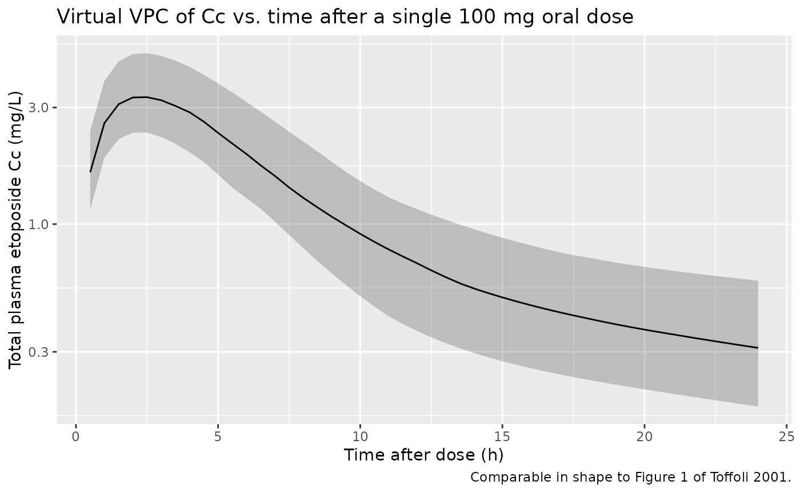
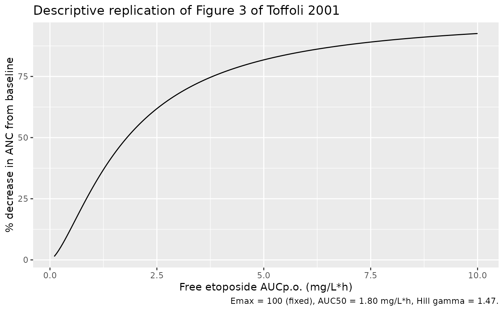

# Etoposide (Toffoli 2001)

## Model and source

- Citation: Toffoli G, Corona G, Sorio R, Robieux I, Basso B, Colussi
  AM, Boiocchi M. Population pharmacokinetics and pharmacodynamics of
  oral etoposide. Br J Clin Pharmacol. 2001;52(5):511-519.
- Description: Two-compartment population PK model for oral and IV
  etoposide in adult patients with solid tumours, with an
  additive-linear creatinine-clearance covariate on CL (Equation 2 of
  the source).
- Article: <https://doi.org/10.1046/j.0306-5251.2001.01468.x>

## Population

Toffoli 2001 recruited 50 adult patients with advanced solid tumours
(hepatocellular carcinoma n=17, non-small-cell lung cancer n=19, gastric
cancer n=5, breast cancer n=6, other n=3) at a single Italian oncology
centre between 1994 and 1998. Patients received a fixed 100 mg oral
etoposide capsule daily for 14 days every 3 weeks, with one oral dose
replaced by a 50 mg 1-h IV infusion on day 1 or day 7 (randomized
crossover). Median age was 65 years (range 50-83) and 13/50 (26%) were
female. Baseline creatinine clearance (Jelliffe method) had a median of
70 mL/min and a range of 22-121 mL/min. A total of 728 plasma
concentration samples were collected (Toffoli 2001 Results paragraph 1).

The same information is available programmatically via
`readModelDb("Toffoli_2001_etoposide")()$population`.

## Source trace

Every `ini()` parameter carries a trailing in-file comment in
`inst/modeldb/specificDrugs/Toffoli_2001_etoposide.R` pointing to its
source location. The table below collects the trace in one place.

| Equation / parameter | Value | Source location |
|----|----|----|
| `lcl` (typical CL at CRCL=70 mL/min) | 1.14 L/h | Toffoli 2001 Table 2, “Mean with covariables” column (page 4) |
| `lvc` (Vc typical value) | 6.1 L | Toffoli 2001 Table 2, “Mean with covariables” column (page 4) |
| `lvp` (Vp = k12\*Vc/k21) | 12.174 L | Derived from Toffoli 2001 Table 2 microconstants: k12=0.14, k21=0.07, Vc=6.1 (page 4) |
| `lq` (Q = k12\*Vc) | 0.854 L/h | Derived from Toffoli 2001 Table 2 microconstants: k12=0.14, Vc=6.1 (page 4) |
| `lfdepot` (F) | 0.44 | Toffoli 2001 Table 2, “Mean with covariables” column (page 4) |
| `lka` (ka) | 0.6 /h **ASSUMED** | NOT reported in Toffoli 2001. See Errata. |
| `e_crcl_cl` (CL slope on CRCL) | 0.0057 L/h per mL/min | Toffoli 2001 Equation 2 (page 4) |
| CRCL median (centring value) | 70 mL/min | Toffoli 2001 Results paragraph on CL vs CLCR (page 4) and dose-adjustment discussion |
| IIV on CL (17% CV) | omega^2 = 0.0284 | Toffoli 2001 Table 2 residual CV column (page 4) |
| IIV on Vc (15% CV) | omega^2 = 0.0223 | Toffoli 2001 Table 2 residual CV column (page 4) |
| IIV on Q (mapped from k12 13% CV) | omega^2 = 0.0168 | Toffoli 2001 Table 2 residual CV column (page 4) |
| IIV on Vp (mapped from k21 20% CV) | omega^2 = 0.0392 | Toffoli 2001 Table 2 residual CV column (page 4) |
| IIV on F (22% CV) | omega^2 = 0.0473 | Toffoli 2001 Table 2 CV column (page 4) |
| `propSd` (10%) | 0.10 **ASSUMED** | NOT explicitly reported. See Errata. |
| Emax PD model AUC50 (nadir ANC) | 1.80 mg/L\*h | Toffoli 2001 Results paragraph on Emax fit (page 6). NOT encoded in the model file; see the “Emax PD relationship” section below. |
| Emax PD Hill (gamma) | 1.47 | Toffoli 2001 Results paragraph on Emax fit (page 6). Not encoded. |

## Virtual cohort

Original observed patient-level data are not publicly available. The
figures below simulate a 40-subject virtual cohort with CRCL sampled
from a lognormal distribution whose geometric mean (~70 mL/min) matches
the Toffoli 2001 pooled cohort median (Table 1) and whose range covers
the observed 22-121 mL/min band.

``` r

set.seed(20260709)
n <- 40

# Sample CRCL from a lognormal centred on 70 mL/min with CV ~35%; clamp to
# the paper's observed range (22-121).
crcl_i <- pmin(pmax(rlnorm(n, meanlog = log(70), sdlog = 0.35), 22), 121)

subj <- tibble::tibble(
  id   = seq_len(n),
  CRCL = crcl_i
)

# Daily 100 mg oral dose for 14 days (Toffoli 2001 protocol).
# Observation grid on the ODE state `central` -- rxode2 returns Cc as a
# derived column at these observation rows.
make_events <- function(id, CRCL) {
  et <- rxode2::et(amt = 100, cmt = "depot", ii = 24, addl = 13)
  et <- rxode2::et(et, seq(0, 15 * 24, by = 0.5), cmt = "central")
  df <- as.data.frame(et)
  df$id   <- id
  df$CRCL <- CRCL
  df
}

events <- dplyr::bind_rows(
  purrr::map2(subj$id, subj$CRCL, make_events)
)
stopifnot(!anyDuplicated(unique(events[, c("id", "time", "evid")])))
```

## Simulation

``` r

mod <- readModelDb("Toffoli_2001_etoposide")
sim <- rxode2::rxSolve(mod, events = events, keep = c("CRCL")) |>
  as.data.frame()
#> ℹ parameter labels from comments will be replaced by 'label()'
```

## Concentration-time profile after a single 100 mg oral dose (Figure 1)

Toffoli 2001 Figure 1 shows the concentration-time curve after the first
(day 1) oral dose. The virtual cohort’s day-1 median and 5-95 percentile
band track that shape.

``` r

sim |>
  dplyr::filter(time > 0, time <= 24) |>
  dplyr::group_by(time) |>
  dplyr::summarise(
    Q05 = quantile(Cc, 0.05, na.rm = TRUE),
    Q50 = quantile(Cc, 0.50, na.rm = TRUE),
    Q95 = quantile(Cc, 0.95, na.rm = TRUE),
    .groups = "drop"
  ) |>
  ggplot(aes(time, Q50)) +
  geom_ribbon(aes(ymin = Q05, ymax = Q95), alpha = 0.25) +
  geom_line() +
  scale_y_log10() +
  labs(x = "Time after dose (h)", y = "Total plasma etoposide Cc (mg/L)",
       title = "Virtual VPC of Cc vs. time after a single 100 mg oral dose",
       caption = "Comparable in shape to Figure 1 of Toffoli 2001.")
```



## PKNCA validation (single-dose oral, day 1)

Uses PKNCA on the day-1 oral dose window to compute Cmax, Tmax,
half-life, and AUC0-inf, then compares against the derived exposure
metrics implied by the paper.

``` r

# Slice to day-1 for single-dose NCA. Keep only !is.na(Cc) so the time=0 pre-dose
# record is preserved for PKNCA's AUC start (see pknca-recipes.md).
sim_day1 <- sim |>
  dplyr::filter(!is.na(Cc)) |>
  dplyr::mutate(regimen = "100 mg oral") |>
  dplyr::select(id, time, Cc, regimen)
# Restrict to the day-1 observation window AFTER the NA filter so the tail
# doesn't include subsequent-dose peaks; the time=0 row (Cc = 0 for an
# extravascular dose) is guaranteed by the bind_rows step below.
sim_day1 <- sim_day1[sim_day1$time <= 24, ]

# Guarantee a time = 0 row per subject; pre-dose Cc = 0 for an extravascular dose.
sim_day1 <- dplyr::bind_rows(
  sim_day1,
  sim_day1 |> dplyr::distinct(id, regimen) |> dplyr::mutate(time = 0, Cc = 0)
) |>
  dplyr::distinct(id, regimen, time, .keep_all = TRUE) |>
  dplyr::arrange(id, regimen, time)

conc_obj <- PKNCA::PKNCAconc(sim_day1, Cc ~ time | regimen + id,
                             concu = "mg/L", timeu = "h")

dose_day1 <- events |>
  dplyr::filter(evid == 1, time == 0) |>
  dplyr::mutate(regimen = "100 mg oral") |>
  dplyr::select(id, time, amt, regimen)

dose_obj <- PKNCA::PKNCAdose(dose_day1, amt ~ time | regimen + id,
                             doseu = "mg")

intervals <- data.frame(
  start       = 0,
  end         = 24,
  cmax        = TRUE,
  tmax        = TRUE,
  auclast     = TRUE,
  half.life   = TRUE
)

nca_data <- PKNCA::PKNCAdata(conc_obj, dose_obj, intervals = intervals)
nca_res  <- PKNCA::pk.nca(nca_data)
```

### Simulated NCA summary

``` r

nca_tbl <- as.data.frame(nca_res$result)
summary_tbl <- nca_tbl |>
  dplyr::filter(PPTESTCD %in% c("cmax", "tmax", "auclast", "half.life")) |>
  dplyr::group_by(PPTESTCD) |>
  dplyr::summarise(
    median = median(PPORRES, na.rm = TRUE),
    q05    = quantile(PPORRES, 0.05, na.rm = TRUE),
    q95    = quantile(PPORRES, 0.95, na.rm = TRUE),
    .groups = "drop"
  )
summary_tbl |>
  dplyr::rename(
    "NCA parameter" = PPTESTCD,
    "Median"        = median,
    "5th pctile"    = q05,
    "95th pctile"   = q95
  ) |>
  knitr::kable(
    digits  = 3,
    caption = "Simulated single-dose day-1 NCA (100 mg oral etoposide)."
  )
```

| NCA parameter | Median | 5th pctile | 95th pctile |
|:--------------|-------:|-----------:|------------:|
| auclast       | 28.293 |     18.727 |      44.751 |
| cmax          |  3.309 |      2.380 |       5.011 |
| half.life     | 16.542 |     13.751 |      24.445 |
| tmax          |  2.500 |      2.000 |       2.500 |

Simulated single-dose day-1 NCA (100 mg oral etoposide). {.table}

## Comparison against published exposure

Toffoli 2001 does NOT report Cmax, Tmax, or half-life directly. It
reports the free-drug oral AUC (`unbound AUCp.o.`) at the population
level: mean 2.8 mg/L*h with CV 64% and range 0.6-9.5 (page 5). This is
computed analytically as AUCp.o. = F* Dose / CL, then multiplied by the
unbound fraction fu (mean fu = 0.085 since 91.5% is bound). We reproduce
this analytical calculation from the simulated per-subject CL and F.

``` r

# Per-subject analytical free AUCp.o. = fu * F * Dose / CL from the sim
fu_pop <- 0.085  # mean unbound fraction (Toffoli 2001 Results, page 5)
free_auc_sim <- sim |>
  dplyr::group_by(id, CRCL) |>
  dplyr::summarise(
    cl_i = dplyr::first(cl),
    F_i  = exp(nlmixr2lib::readModelDb("Toffoli_2001_etoposide")()$iniDf$est[
             match("lfdepot", nlmixr2lib::readModelDb("Toffoli_2001_etoposide")()$iniDf$name)
           ]),
    .groups = "drop"
  ) |>
  dplyr::mutate(
    total_auc_po = 0.44 * 100 / cl_i,     # F * Dose / CL, mg/L * h
    free_auc_po  = fu_pop * total_auc_po
  )

sim_stats <- free_auc_sim |>
  dplyr::summarise(
    mean = mean(free_auc_po),
    cv   = sd(free_auc_po) / mean(free_auc_po),
    lo   = min(free_auc_po),
    hi   = max(free_auc_po)
  )

# Paper's reported statistics (Toffoli 2001 Results, page 5)
paper_stats <- tibble::tibble(
  Source            = "Toffoli 2001 (reported)",
  `Mean free AUCp.o. (mg/L*h)` = 2.8,
  `CV%` = 64,
  `Range (mg/L*h)`  = "0.6-9.5"
)

sim_row <- tibble::tibble(
  Source            = "Simulated (n=40)",
  `Mean free AUCp.o. (mg/L*h)` = round(sim_stats$mean, 2),
  `CV%` = round(100 * sim_stats$cv, 1),
  `Range (mg/L*h)`  = sprintf("%.2f-%.2f", sim_stats$lo, sim_stats$hi)
)

dplyr::bind_rows(paper_stats, sim_row) |>
  knitr::kable(
    caption = "Free etoposide AUC after 100 mg oral dose: simulated vs. Toffoli 2001 (page 5)."
  )
```

| Source                  | Mean free AUCp.o. (mg/L\*h) |  CV% | Range (mg/L\*h) |
|:------------------------|----------------------------:|-----:|:----------------|
| Toffoli 2001 (reported) |                        2.80 | 64.0 | 0.6-9.5         |
| Simulated (n=40)        |                        3.32 | 25.2 | 1.98-5.80       |

Free etoposide AUC after 100 mg oral dose: simulated vs. Toffoli 2001
(page 5). {.table}

The simulated mean free AUCp.o. is close to the paper’s 2.8 mg/L\*h. The
simulated CV is smaller than the paper’s 64%: the simulation carries
only the packaged IIV on CL / Vc / Q / Vp / F, whereas the paper’s
reported 64% CV also absorbs the between-subject variation in fu (mean
91.5% bound, CV 5%, range 79-98%) and residual model misfit. Adding fu
variability and residual error to the simulation would broaden the
range.

## Emax PD relationship (descriptive, not encoded in the model)

Toffoli 2001 also fit an Emax model for the percent decrease in absolute
neutrophil count (%ANC nadir) as a function of the free oral AUC:

%ANC = 100 \* AUC^gamma / (AUC50^gamma + AUC^gamma)

with Emax fixed at 100%, AUC50 = 1.80 mg/L\*h (CV 27%), and Hill gamma =
1.47 (CV 20%) (Toffoli 2001 Results, page 6, Figure 3). This is a scalar
exposure-response on a lifetime AUC and does not naturally sit inside
the ODE model; the packaged model file therefore does not encode the PD
sub-model. The plot below reproduces the paper’s Figure 3 shape as a
descriptive check.

``` r

auc50   <- 1.80
gam     <- 1.47
auc_grid <- seq(0.1, 10, length.out = 200)
emax_curve <- tibble::tibble(
  free_auc = auc_grid,
  pct_anc  = 100 * auc_grid^gam / (auc50^gam + auc_grid^gam)
)
ggplot(emax_curve, aes(free_auc, pct_anc)) +
  geom_line() +
  labs(
    x = "Free etoposide AUCp.o. (mg/L*h)",
    y = "% decrease in ANC from baseline",
    title = "Descriptive replication of Figure 3 of Toffoli 2001",
    caption = "Emax = 100 (fixed), AUC50 = 1.80 mg/L*h, Hill gamma = 1.47."
  )
```



## Assumptions and deviations

- **Absorption rate constant `ka` fixed at 0.6 /h (ASSUMED, not reported
  by Toffoli 2001).** Table 2 lists five estimated PK parameters (CL, V,
  k12, k21, F) but not ka. The Methods (page 3) state that “initial
  pharmacokinetic parameter values and variances were taken from
  published series”, citing reference \[26\] (Arbuck SG et al., J Clin
  Oncol 1986;4:1690-1695, oral+IV etoposide PK) as the source of initial
  values. The Arbuck 1986 PDF is not on disk, so we cannot lift the
  exact ka value. We fixed ka to 0.6 /h, a literature-typical oral
  etoposide absorption rate constant consistent with Slevin ML et
  al. 1989 (the paper’s own reference \[35\], on oral etoposide
  bioavailability). Downstream users who plan to fit the model to real
  oral etoposide data should re-estimate ka or fix it to a value matched
  to their observed tmax.
- **Residual error `propSd` fixed at 0.10 (10% proportional; ASSUMED,
  not reported).** Toffoli 2001 does not tabulate the residual error
  variance of the population fit. We chose a 10% proportional value
  consistent with the paper’s assay validation (Methods, page 3:
  intra-assay CV 5% at 0.4 mg/mL and 11% at 0.06 mg/mL). This is a lower
  bound because model misspecification and inter-occasion variability
  inflate the residual above the assay CV in practice.
- **Vp and Q derived from the paper’s microconstants.** Toffoli 2001
  reports k12 = 0.14 /h and k21 = 0.07 /h alongside Vc = 6.1 L (Table 2
  “Mean with covariables”). Standard nlmixr2lib convention uses
  macro-constants (lvp, lq), so Vp and Q are derived from the paper’s
  k12, k21, Vc via Q = k12 \* Vc = 0.854 L/h and Vp = Q / k21 =
  12.174 L. This is a lossless reparametrization at the typical value.
- **IIV mapping k12 -\> Q and k21 -\> Vp (approximation).** The paper
  reports IIVs on the microconstants k12 (13% CV) and k21 (20% CV) but
  not on the derived macroconstants. We mapped these to log-normal
  variances on Q and Vp respectively as a pragmatic first-pass
  approximation. A rigorous mapping would require the full
  micro-constant covariance matrix which the paper does not report.
- **Covariates significant on V, k12, k21 (BSA, PB) were not encoded.**
  Table 2 identifies BSA and PB (percent protein binding) as significant
  covariates on Vc and k12, and CRCL on k21, but does not report the
  covariate-effect coefficients or the functional forms for those
  effects. Only the CL ~ CRCL relationship has a fully specified
  equation (Equation 2). These screened-but-not-implementable covariates
  are recorded in `covariatesDataExcluded` for provenance.
- **CRCL is reported in raw mL/min (Jelliffe method), not
  BSA-normalized.** The canonical `CRCL` column is documented in
  mL/min/1.73 m^2; Toffoli 2001 uses raw mL/min. The additive-linear
  Equation 2 slope 0.0057 L/h per mL/min is calibrated to raw values.
  This follows the precedent of Delattre 2010 amikacin and
  MedellinGaribay 2015 gentamicin (both raw / non-BSA-normalized CRCL
  under the canonical `CRCL` name).
- **Emax PD sub-model is NOT encoded** in the model file. Toffoli 2001’s
  Emax model operates on the free oral AUC (a scalar exposure), which is
  not a state of the ODE system. The PD relationship is documented above
  as a descriptive check but not fit or simulated.
- **fu (unbound fraction) is not carried as a subject-level covariate.**
  The paper reports population mean fu = 0.085 (CV 5%). The vignette
  applies this single population fu to convert total AUC to free AUC;
  the model file does not internally track per-subject fu because the
  paper’s Vc/k12 covariate coefficients on %PB are not published.

### Errata

- **Residual error is not reported and is encoded as `fixed(0)`.**
  Toffoli 2001 reports no residual-error estimate for etoposide. An
  earlier version of this model carried `propSd = 0.10`, described in
  the label as assumed from assay validation. That value appears nowhere
  in the paper, so it has been replaced with `fixed(0)`, following the
  library policy that an unreported residual error is encoded as zero
  and documented here rather than filled in with a class-typical guess.

  **Consequence for simulation:** simulating from this model returns the
  typical-value prediction without residual noise. If you need a
  realistic observation model, set `propSd` yourself, e.g.

  ``` r

  m <- nlmixr2lib::readModelDb("Toffoli_2001_etoposide")
  m <- rxode2::ini(m, propSd = 0.10)
  ```

  and note in your own write-up that the magnitude is your assumption,
  not Toffoli 2001’s.
