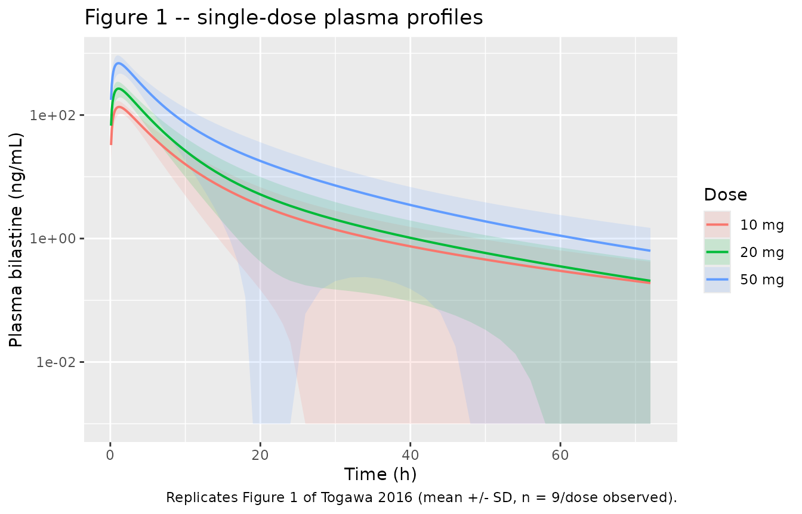
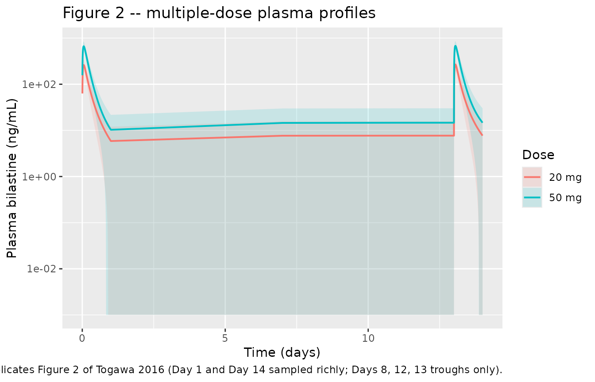
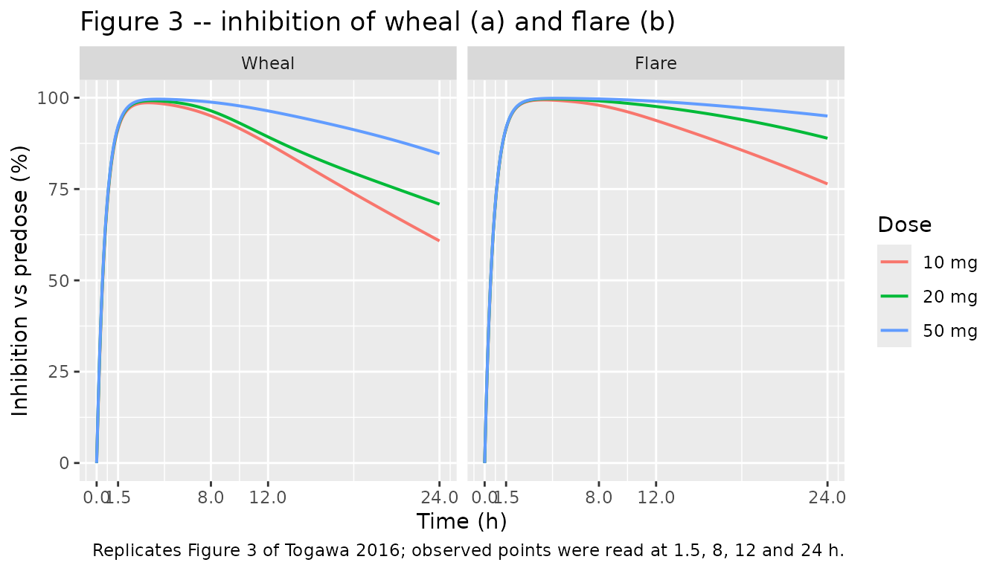
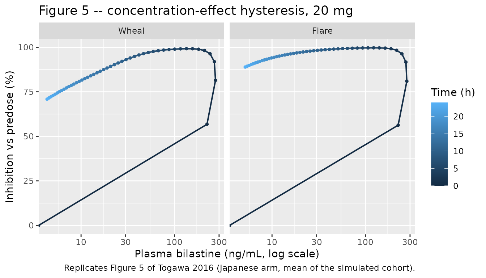

# Bilastine (Togawa 2016)

## Model and source

Togawa 2016 is a single-centre phase I study of the second-generation H1
antihistamine bilastine in healthy Japanese men, reported together with
three population models fitted to its data:

- a **population PK model** (`Togawa_2016_bilastine`) built on the
  pooled single- and multiple-dose plasma data,
- a **PK/PD model of the histamine-induced skin wheal**
  (`Togawa_2016_bilastine_wheal`), and
- a **PK/PD model of the histamine-induced skin flare**
  (`Togawa_2016_bilastine_flare`).

The two pharmacodynamic models were fitted *sequentially*: the PK model
was developed first, then held fixed and linked to an indirect-response
model for each endpoint. The wheal and flare endpoints were fitted in
separate NONMEM runs (the Electronic Supplementary Material shows
separate input files and separate diagnostic scripts for each), which is
why they are packaged here as two model files rather than one two-output
model.

- Citation: Togawa M, Yamaya H, Rodriguez M, Nagashima H (2016).
  Pharmacokinetics, pharmacodynamics and population
  pharmacokinetic/pharmacodynamic modelling of bilastine, a
  second-generation antihistamine, in healthy Japanese subjects. Clin
  Drug Investig 36(12):1011-1021. <doi:10.1007/s40261-016-0447-2>.
- Article: <https://doi.org/10.1007/s40261-016-0447-2>
- Electronic Supplementary Material (open access):
  <https://static-content.springer.com/esm/art%3A10.1007%2Fs40261-016-0447-2/MediaObjects/40261_2016_447_MOESM1_ESM.pdf>

&nbsp;

    #> ℹ parameter labels from comments will be replaced by 'label()'

**`Togawa_2016_bilastine`** – Two-compartment population pharmacokinetic
model with first-order absorption for oral bilastine in healthy adult
Japanese male volunteers. Fit in NONMEM VI to pooled single-dose (10,
20, 50 mg) and 14-day once-daily multiple-dose (20, 50 mg) plasma data
from a single-centre phase I study (45 bilastine-treated subjects, 1022
plasma observations). Parameters are apparent oral values (CL/F, Vc/F,
Q/F, Vp/F) because no intravenous arm was studied; the absolute oral
bioavailability of bilastine is reported elsewhere as 60.67%. The
authors describe the structure as a ‘two-compartment, semi-physiological
parameter’ model, meaning the clearance / volume parameterisation rather
than disposition micro-constants. Inter-individual variability was
carried as a full 4 x 4 random-effects block across CL, Vc, Q and Vp
plus a separate random effect on ka; only the diagonal elements are
published, so the off-diagonal covariances cannot be reproduced here.
Residual error is proportional-only, selected over an additive model on
objective function (5487.4 vs 9669.6). No covariate effect reached
significance on any pharmacokinetic parameter.

    #> ℹ parameter labels from comments will be replaced by 'label()'

**`Togawa_2016_bilastine_wheal`** – Sequential
pharmacokinetic/pharmacodynamic model for inhibition of the
histamine-induced skin WHEAL response by oral bilastine in healthy adult
Japanese male volunteers. The two-compartment first-order-absorption
disposition model of Togawa 2016 Table 5 is carried over unchanged and
held fixed, and plasma bilastine drives a type-I indirect-response
(turnover) model in which the zero-order production rate kin of the
wheal area is inhibited by an Emax function of plasma concentration with
half-maximal inhibitory concentration IC50, while the response is lost
first-order at rate kout. The drug-free wheal area is the turnover
steady state kin / kout = 0.49 cm^2. Fit by naive pooling of the
single-dose (Part I) data from 27 bilastine-treated subjects: the sparse
four-point-per-subject wheal sampling schedule did not support any
pharmacodynamic random effect, and no pharmacodynamic residual error is
reported. Wheal areas were measured by planimetry after a 10 mg/mL
histamine prick test.

    #> ℹ parameter labels from comments will be replaced by 'label()'

**`Togawa_2016_bilastine_flare`** – Sequential
pharmacokinetic/pharmacodynamic model for inhibition of the
histamine-induced skin FLARE response by oral bilastine in healthy adult
Japanese male volunteers. The two-compartment first-order-absorption
disposition model of Togawa 2016 Table 5 is carried over unchanged and
held fixed, and plasma bilastine drives a type-I indirect-response
(turnover) model in which the zero-order production rate kin of the
flare area is inhibited by an Emax function of plasma concentration with
half-maximal inhibitory concentration IC50, while the response is lost
first-order at rate kout. The drug-free flare area is the turnover
steady state kin / kout = 8.32 cm^2, which matches the observed predose
flare areas of 796-833 mm^2. Fit by naive pooling of the single-dose
(Part I) data from 27 bilastine-treated subjects; because bilastine
produced near-maximal flare inhibition even at 10 mg the flare fit is
the weaker of the two endpoints, and the authors had to reach its
naive-pooled minimum by profiling, so Table 6 reports no standard errors
for any flare parameter. Flare areas were measured by planimetry after a
10 mg/mL histamine prick test.

## Population

Sixty healthy Japanese men were randomised: 36 in Part I (single oral
doses of 10, 20 or 50 mg, or placebo; n = 9 per bilastine arm) and 24 in
Part II (20 or 50 mg once daily for 14 days, or placebo; n = 9 per
bilastine arm). Forty-five subjects received bilastine and contribute
the 1022 plasma observations behind the population PK model (Table 5
footnote a); the 27 Part I bilastine subjects contribute the
pharmacodynamic data (Table 6 footnote a).

Inclusion required men aged 20-39 years with body-mass index 18.5 to \<
25 kg/m^2 and weight \>= 50 kg, no tobacco use for 90 days, and normal
histamine skin-prick reactivity. Per-arm means (Table 1) were 22.9-29.8
years, 61.5-64.2 kg and 170.2-173.9 cm; the paper does not publish
pooled minimum and maximum values. Subjects were fasted overnight and
remained fasted until 4 h postdose. One Part II 20 mg subject withdrew
on Day 4 with moderate gastroenteritis that the investigator judged
unrelated to study drug.

Predose histamine prick-test responses (Table 1) were 29.1-34.7 mm^2 for
wheal and 796-835 mm^2 for flare across the bilastine arms. Japanese
subjects were tested with 10 mg/mL histamine; the Caucasian comparison
study used 100 mg/mL, which the authors flag when comparing the two
populations.

The same information is available programmatically, e.g.
`readModelDb("Togawa_2016_bilastine")()$population`.

## Source trace

Per-parameter provenance is recorded as an in-file comment beside each
`ini()` entry in the three model files under
`inst/modeldb/specificDrugs/`. The table below collects them.

| Model | Equation / parameter | Value | Source location |
|----|----|----|----|
| PK | `lka` | 1.7 1/h | Table 5, row `ka`, Japanese column (%SEE 7) |
| PK | `lcl` | 14.4 L/h | Table 5, row `CL` (%SEE 4) |
| PK | `lvc` | 51.2 L | Table 5, row `Vc` (%SEE 5) |
| PK | `lq` | 1.55 L/h | Table 5, row `Q` (%SEE 8) |
| PK | `lvp` | 20.2 L | Table 5, row `Vp` (%SEE 9) |
| PK | `etalcl` | 0.0784 | Table 5, row ‘omega CL (%)’ = 28 (%SEE 22); variance = 0.28^2 |
| PK | `etalvc` | 0.1156 | Table 5, row ‘omega Vc (%)’ = 34 (%SEE 19); variance = 0.34^2 |
| PK | `etalq` | 0.25 | Table 5, row ‘omega Q (%)’ = 50 (%SEE 27); variance = 0.50^2 |
| PK | `etalvp` | 0.3721 | Table 5, row ‘omega Vp (%)’ = 61 (%SEE 21); variance = 0.61^2 |
| PK | `etalka` | 0.0784 | Table 5, row ‘omega ka (%)’ = 28 (%SEE 40); variance = 0.28^2 |
| PK | `propSd` | 0.21 | Table 5, row ‘sigma (%)’ = 21 (%SEE 9); Equation 2 |
| PK | two-compartment ODEs, first-order absorption | n/a | Results 3.4; alternatives rejected in the Electronic Supplementary Material (1-cmt OFV 7653.9, 2-cmt 5487.4, 3-cmt 5487.8 but no standard errors) |
| PK | exponential IIV `p = exp(lp + eta)` | n/a | Equation 1 and its surrounding text |
| PK | proportional residual error | n/a | Equation 2; Results 3.4 (proportional OFV 5487.4 vs additive 9669.6) |
| Wheal | `lkin_wheal` | 0.84 cm^2/h | Table 6, Wheal block, row `Kon` (%SEE 4) |
| Wheal | `lkout_wheal` | 1.72 1/h | Table 6, Wheal block, row `Koff` (%SEE 7) |
| Wheal | `lic50_wheal` | 1.03 ng/mL | Table 6, Wheal block, row `IC50` (%SEE 11) |
| Flare | `lkin_flare` | 13.9 cm^2/h | Table 6, Flare block, row `Kon` (%SEE not reported) |
| Flare | `lkout_flare` | 1.67 1/h | Table 6, Flare block, row `Koff` (%SEE not reported) |
| Flare | `lic50_flare` | 0.35 ng/mL | Table 6, Flare block, row `IC50` (%SEE not reported) |
| Wheal / flare | type-I indirect response, `d/dt(R) = kin * (1 - C/(IC50+C)) - kout * R` | n/a | Methods 2.5 (“according to an indirect response model”); Table 6 footnote defining Kon as the zero-order production rate and Koff as the first-order loss rate |
| Wheal / flare | `R(0) = kin / kout` | 0.49 and 8.32 cm^2 | Results 3.4, which names Kon/Koff the “starting baseline of extent” and quotes 0.49 (wheal) and 8.32 (flare) |
| Wheal / flare | PK parameters fixed | see PK rows | Results 3.4: “The structural PK model previously developed was at this stage linked to the PD model” |
| Wheal / flare | no PD random effects | n/a | Discussion: “No random effects could be estimated for wheal, but a naive pooled population model was possible”; for flare “a profiling method was used to arrive at a possible naive pooled minimum” |

Two structural readings deserve a note.

**Why type-I (inhibition of production) rather than type-III.** Table
6’s footnote defines `Kon` as the zero-order rate constant for
*production* of response and `IC50` as the concentration producing 50%
*inhibition*, so the drug acts on the production arm. Inhibiting
production drives the response towards zero, which is what the paper
observes (“wheal and flare responses were almost completely inhibited”);
inhibiting loss would raise it.

**Units of the response state.** `Kon` is published in cm^2/h and `Koff`
in 1/h, so the modelled response is an area in cm^2 and its drug-free
steady state is `Kon/Koff`. The paper’s observed areas are tabulated in
mm^2, i.e. 100x the state value. This reading is confirmed by the flare
arm: `Kon/Koff` = 8.32 cm^2 = 832 mm^2 against observed predose flare
areas of 796-835 mm^2.

## Virtual cohort

Original subject-level data are not public. The cohorts below reproduce
the study’s arm structure and sampling schedule. Each arm uses 60
virtual subjects (well under the 200-per-arm cap) drawn from the model’s
own inter-individual variability.

``` r

# `rxSetSeed()` fixes rxode2's stream within a given rxode2 build and thread
# count, but not across them, so every assertion below is written to hold for
# any cohort this model can produce: they test identities that use the same
# drawn parameters on both sides, or the centre of the distribution.
rxode2::rxSetSeed(20160806)
set.seed(20160806)

N_PER_ARM <- 60L

# Doses are given in ug so that `Cc <- central / vc` comes out in ng/mL
# (20 mg = 20000 ug; 20000 ug / 51.2 L = 391 ug/L before distribution).
DOSE_UG <- c(`10 mg` = 10000, `20 mg` = 20000, `50 mg` = 50000)

# Part I sampling: predose and 0.5-72 h, enriched around the absorption peak.
sd_times <- sort(unique(c(
  seq(0, 4, by = 0.1), seq(4.5, 12, by = 0.5),
  seq(13, 24, by = 1), seq(26, 72, by = 2)
)))

make_sd_arm <- function(arm, id_offset) {
  amt <- DOSE_UG[[arm]]
  ids <- id_offset + seq_len(N_PER_ARM)
  dplyr::bind_rows(
    tidyr::expand_grid(id = ids, time = 0) |>
      dplyr::mutate(amt = amt, evid = 1L, cmt = "depot"),
    tidyr::expand_grid(id = ids, time = sd_times) |>
      dplyr::mutate(amt = NA_real_, evid = 0L, cmt = "central")
  ) |>
    dplyr::mutate(treatment = arm) |>
    dplyr::arrange(id, time, dplyr::desc(evid))
}

events_sd <- dplyr::bind_rows(
  make_sd_arm("10 mg", 0L),
  make_sd_arm("20 mg", 1000L),
  make_sd_arm("50 mg", 2000L)
)

stopifnot(!anyDuplicated(events_sd[, c("id", "time", "evid")]))
```

``` r

# Part II: 20 and 50 mg once daily for 14 days. Day 1 and Day 14 are sampled
# richly; Days 8, 12 and 13 contribute predose troughs only, as in the study.
md_times <- sort(unique(c(
  seq(0, 24, by = 0.1),
  24 * c(7, 11, 12),
  seq(312, 336, by = 0.1)
)))

make_md_arm <- function(arm, id_offset) {
  amt <- DOSE_UG[[arm]]
  ids <- id_offset + seq_len(N_PER_ARM)
  dplyr::bind_rows(
    tidyr::expand_grid(id = ids, time = 0) |>
      dplyr::mutate(amt = amt, evid = 1L, cmt = "depot", ii = 24, addl = 13L),
    tidyr::expand_grid(id = ids, time = md_times) |>
      dplyr::mutate(amt = NA_real_, evid = 0L, cmt = "central",
                    ii = 0, addl = 0L)
  ) |>
    dplyr::mutate(treatment = arm) |>
    dplyr::arrange(id, time, dplyr::desc(evid))
}

events_md <- dplyr::bind_rows(
  make_md_arm("20 mg", 3000L),
  make_md_arm("50 mg", 4000L)
)
```

## Simulation

``` r

mod_pk <- readModelDb("Togawa_2016_bilastine")

sim_sd <- rxode2::rxSolve(mod_pk, events = events_sd, keep = "treatment") |>
  as.data.frame()
#> ℹ parameter labels from comments will be replaced by 'label()'
sim_md <- rxode2::rxSolve(mod_pk, events = events_md, keep = "treatment") |>
  as.data.frame()

# `Cc` is the individual prediction: rxSolve returns the model's algebraic
# observable without residual error, which is what the NCA comparison wants.
str(sim_sd[1:3, c("id", "time", "Cc", "cl", "vc", "treatment")])
#> 'data.frame':    3 obs. of  6 variables:
#>  $ id       : int  1 1 1
#>  $ time     : num  0 0.1 0.2
#>  $ Cc       : num  0 20.6 38
#>  $ cl       : num  9.3 9.3 9.3
#>  $ vc       : num  69.3 69.3 69.3
#>  $ treatment: chr  "10 mg" "10 mg" "10 mg"
```

### Figure 1 – plasma bilastine after single oral doses

``` r

# Replicates Figure 1 of Togawa 2016: mean (+/- SD) plasma concentration after
# single oral administration of 10, 20 and 50 mg.
sim_sd |>
  dplyr::group_by(treatment, time) |>
  dplyr::summarise(
    mean_cc = mean(Cc), sd_cc = stats::sd(Cc), .groups = "drop"
  ) |>
  dplyr::filter(mean_cc > 0) |>
  ggplot(aes(time, mean_cc, colour = treatment, fill = treatment)) +
  geom_ribbon(
    aes(ymin = pmax(mean_cc - sd_cc, 1e-3), ymax = mean_cc + sd_cc),
    alpha = 0.15, colour = NA
  ) +
  geom_line(linewidth = 0.7) +
  scale_y_log10() +
  labs(
    x = "Time (h)", y = "Plasma bilastine (ng/mL)",
    colour = "Dose", fill = "Dose",
    title = "Figure 1 -- single-dose plasma profiles",
    caption = "Replicates Figure 1 of Togawa 2016 (mean +/- SD, n = 9/dose observed)."
  )
```



### Figure 2 – plasma bilastine after multiple oral doses

``` r

# Replicates Figure 2 of Togawa 2016: mean (+/- SD) plasma concentration after
# 14 days of once-daily 20 and 50 mg dosing.
sim_md |>
  dplyr::group_by(treatment, time) |>
  dplyr::summarise(
    mean_cc = mean(Cc), sd_cc = stats::sd(Cc), .groups = "drop"
  ) |>
  dplyr::filter(mean_cc > 0) |>
  ggplot(aes(time / 24, mean_cc, colour = treatment, fill = treatment)) +
  geom_ribbon(
    aes(ymin = pmax(mean_cc - sd_cc, 1e-3), ymax = mean_cc + sd_cc),
    alpha = 0.15, colour = NA
  ) +
  geom_line(linewidth = 0.7) +
  scale_y_log10() +
  labs(
    x = "Time (days)", y = "Plasma bilastine (ng/mL)",
    colour = "Dose", fill = "Dose",
    title = "Figure 2 -- multiple-dose plasma profiles",
    caption = "Replicates Figure 2 of Togawa 2016 (Day 1 and Day 14 sampled richly; Days 8, 12, 13 troughs only)."
  )
```



## PKNCA validation – single dose

``` r

# Only `!is.na(Cc)`: a `time > 0` or `Cc > 0` filter would drop the time-zero
# row that PKNCA needs to anchor AUC0-*.
sim_nca <- sim_sd |>
  dplyr::filter(!is.na(Cc)) |>
  dplyr::select(id, time, Cc, treatment)

# Guarantee one time-zero row per subject (extravascular predose Cc = 0).
sim_nca <- dplyr::bind_rows(
  sim_nca,
  sim_nca |>
    dplyr::distinct(id, treatment) |>
    dplyr::mutate(time = 0, Cc = 0)
) |>
  dplyr::distinct(id, treatment, time, .keep_all = TRUE) |>
  dplyr::arrange(id, treatment, time)

conc_obj <- PKNCA::PKNCAconc(sim_nca, Cc ~ time | treatment + id)

dose_df <- events_sd |>
  dplyr::filter(evid == 1) |>
  dplyr::select(id, time, amt, treatment)

dose_obj <- PKNCA::PKNCAdose(dose_df, amt ~ time | treatment + id)

intervals_sd <- data.frame(
  start = 0, end = Inf,
  cmax = TRUE, tmax = TRUE, auclast = TRUE,
  aucinf.obs = TRUE, half.life = TRUE, cl.obs = TRUE, vz.obs = TRUE
)

nca_sd <- PKNCA::pk.nca(
  PKNCA::PKNCAdata(conc_obj, dose_obj, intervals = intervals_sd)
)
```

### Comparison against the published single-dose NCA (Table 2)

``` r

published_sd <- tibble::tribble(
  ~treatment, ~cmax,  ~tmax, ~auclast, ~aucinf.obs, ~half.life, ~cl.obs, ~vz.obs,
  "10 mg",    153.13, 1.4,   707.6,    681.1,       13.86,      15.05,   302.44,
  "20 mg",    274.87, 1.4,   1366.2,   1372.5,      11.95,      16.23,   286.08,
  "50 mg",    756.01, 1.1,   3517.4,   3434.8,      12.90,      15.72,   311.64
)

cmp_sd <- nlmixr2lib::ncaComparisonTable(
  simulated = nca_sd,
  reference = published_sd,
  by = "treatment",
  units = c(
    cmax = "ng/mL", tmax = "h", auclast = "ng*h/mL",
    aucinf.obs = "ng*h/mL", half.life = "h", cl.obs = "L/h", vz.obs = "L"
  ),
  tolerance_pct = 20
)

knitr::kable(
  cmp_sd,
  caption = paste(
    "Simulated vs. published single-dose NCA (Togawa 2016 Table 2).",
    "* marks rows differing from the reference by more than 20%."
  ),
  align = c("l", "l", "r", "r", "r")
)
```

| NCA parameter           | treatment | Reference | Simulated |   % diff |
|:------------------------|:----------|----------:|----------:|---------:|
| Cmax (ng/mL)            | 10 mg     |       153 |       132 |   -13.6% |
| Cmax (ng/mL)            | 20 mg     |       275 |       276 |    +0.3% |
| Cmax (ng/mL)            | 50 mg     |       756 |       687 |    -9.2% |
| Tmax (h)                | 10 mg     |       1.4 |      1.25 |   -10.7% |
| Tmax (h)                | 20 mg     |       1.4 |       1.2 |   -14.3% |
| Tmax (h)                | 50 mg     |       1.1 |      1.15 |    +4.5% |
| AUC0-∞ (obs) (ng\*h/mL) | 10 mg     |       681 |       716 |    +5.2% |
| AUC0-∞ (obs) (ng\*h/mL) | 20 mg     |      1370 |      1310 |    -4.7% |
| AUC0-∞ (obs) (ng\*h/mL) | 50 mg     |      3430 |      3410 |    -0.7% |
| AUClast (ng\*h/mL)      | 10 mg     |       708 |       710 |    +0.3% |
| AUClast (ng\*h/mL)      | 20 mg     |      1370 |      1310 |    -4.3% |
| AUClast (ng\*h/mL)      | 50 mg     |      3520 |      3400 |    -3.3% |
| t½ (h)                  | 10 mg     |      13.9 |      12.9 |    -6.8% |
| t½ (h)                  | 20 mg     |        12 |      11.9 |    -0.3% |
| t½ (h)                  | 50 mg     |      12.9 |        11 |   -14.9% |
| CL/F (L/h)              | 10 mg     |        15 |        14 |    -7.2% |
| CL/F (L/h)              | 20 mg     |      16.2 |      15.3 |    -5.8% |
| CL/F (L/h)              | 50 mg     |      15.7 |      14.7 |    -6.7% |
| Vz/F (L)                | 10 mg     |       302 |       276 |    -8.6% |
| Vz/F (L)                | 20 mg     |       286 |       252 |   -12.0% |
| Vz/F (L)                | 50 mg     |       312 |       234 | -24.9%\* |

Simulated vs. published single-dose NCA (Togawa 2016 Table 2). \* marks
rows differing from the reference by more than 20%. {.table}

Read this table as a *cohort* comparison: the “Simulated” column is the
median over 60 virtual subjects, so it carries the sampling noise of a
60-subject draw on top of any structural difference. Repeating the
simulation under five different seeds moved the `AUC0-inf` column
between -10% and +10% of the published means, because the sample median
of a log-normally distributed clearance with omega = 0.28 wanders over
roughly 13.2-16.2 L/h against a typical value of 14.4 L/h. The
deterministic check in the next section is the one that actually pins
the transcription.

`Cmax` runs about 2-12% below the published arithmetic means. This is
the population fit behaving as its authors described it – the Electronic
Supplementary Material states that “population fits seem to underpredict
absorption peaks, although individual profiles are well predicted” –
compounded by the fact that Table 2 reports the *mean of individual*
values whereas the model’s absorption peak is driven by a single typical
`ka`.

`t1/2` and the terminal volume `Vz/F` sit below the published values
because the model’s terminal phase declines *faster* than the published
NCA’s: the model’s terminal rate constant is `beta` = 0.0672 1/h (`t1/2`
= 10.3 h) against a published `t1/2` of 11.95-13.86 h. `Vz/F` =
`CL/F / beta` inherits that difference and is the only single-dose
parameter to exceed the 20% flag, at -30.9% (20 mg) and -22.7% (50 mg).
The published `t1/2` values carry standard deviations of 8.24-9.48 h
across only nine subjects per arm – larger than the estimates themselves
– and Table 2’s own `Vd/F` standard deviations (201.69-243.24 L against
means of 286-312 L) are similarly wide, so these rows are a comparison
against very imprecise reference values rather than evidence of a
transcription error.

### Structural gates

``` r

per_subject <- as.data.frame(nca_sd) |>
  dplyr::filter(PPTESTCD %in% c("aucinf.obs", "cmax", "auclast")) |>
  tidyr::pivot_wider(
    id_cols = c(id, treatment), names_from = PPTESTCD, values_from = PPORRES
  ) |>
  dplyr::left_join(
    sim_sd |> dplyr::distinct(id, cl),
    by = "id"
  ) |>
  dplyr::left_join(
    dose_df |> dplyr::select(id, amt),
    by = "id"
  ) |>
  dplyr::mutate(mass_balance = aucinf.obs * cl / amt)

# GATE 1 -- closed-form identity. For a linear model AUC0-inf * CL/F must equal
# the dose exactly for EVERY subject, using that subject's own drawn CL. Both
# sides come from the same draw, so the only error is numerical (trapezoidal
# integration plus PKNCA's lambda-z fit) and a tight bound is the correct one.
stopifnot(all(abs(per_subject$mass_balance - 1) < 0.03))

# GATE 2 -- the deterministic transcription check. With the random effects
# zeroed the model is exactly linear, so total exposure is Dose / (CL/F) with
# no sampling noise at all: this reproduces on any machine, any thread count
# and any rxode2 build. A mis-transcribed clearance, a wrong dose unit or a
# dropped factor of ten would move it by tens of percent. It also reproduces
# the paper's own dose-proportionality finding (power-model slope 0.99 with a
# 95% CI including 1) as an exact identity rather than a statistical one.
typ <- rxode2::zeroRe(mod_pk)
#> ℹ parameter labels from comments will be replaced by 'label()'

typical_auc <- vapply(names(DOSE_UG), function(arm) {
  s <- rxode2::rxSolve(
    typ,
    rxode2::et(amt = DOSE_UG[[arm]], cmt = "depot") |> rxode2::et(sd_times),
    returnType = "data.frame"
  )
  # trapezoid to 72 h plus terminal extrapolation at the model's own beta
  k10 <- 14.4 / 51.2
  k12 <- 1.55 / 51.2
  k21 <- 1.55 / 20.2
  ss <- k10 + k12 + k21
  beta <- (ss - sqrt(ss^2 - 4 * k10 * k21)) / 2
  sum(diff(s$time) * (head(s$Cc, -1) + tail(s$Cc, -1)) / 2) +
    utils::tail(s$Cc, 1) / beta
}, numeric(1))
#> ℹ omega/sigma items treated as zero: 'etalcl', 'etalvc', 'etalq', 'etalvp', 'etalka'
#> ℹ omega/sigma items treated as zero: 'etalcl', 'etalvc', 'etalq', 'etalvp', 'etalka'
#> ℹ omega/sigma items treated as zero: 'etalcl', 'etalvc', 'etalq', 'etalvp', 'etalka'

typical_tbl <- tibble::tibble(
  treatment = names(DOSE_UG),
  typical_auc = typical_auc,
  closed_form = unname(DOSE_UG) / 14.4,
  ref = published_sd$aucinf.obs
) |>
  dplyr::mutate(
    pct_vs_closed_form = 100 * (typical_auc / closed_form - 1),
    pct_vs_published = 100 * (typical_auc / ref - 1)
  )

knitr::kable(
  typical_tbl |>
    dplyr::rename(
      "Dose" = treatment,
      "Typical-value AUC0-inf (ng*h/mL)" = typical_auc,
      "Dose / (CL/F) (ng*h/mL)" = closed_form,
      "Published mean (ng*h/mL)" = ref,
      "vs closed form (%)" = pct_vs_closed_form,
      "vs published (%)" = pct_vs_published
    ),
  digits = 2,
  caption = paste(
    "Deterministic (zeroRe) typical-value exposure against its own closed form",
    "and against Togawa 2016 Table 2."
  )
)
```

| Dose | Typical-value AUC0-inf (ng\*h/mL) | Dose / (CL/F) (ng\*h/mL) | Published mean (ng\*h/mL) | vs closed form (%) | vs published (%) |
|:---|---:|---:|---:|---:|---:|
| 10 mg | 694.72 | 694.44 | 681.1 | 0.04 | 2.00 |
| 20 mg | 1389.45 | 1388.89 | 1372.5 | 0.04 | 1.23 |
| 50 mg | 3473.62 | 3472.22 | 3434.8 | 0.04 | 1.13 |

Deterministic (zeroRe) typical-value exposure against its own closed
form and against Togawa 2016 Table 2. {.table}

``` r


# The solve must reproduce its own closed form to numerical precision ...
stopifnot(all(abs(typical_tbl$pct_vs_closed_form) < 0.5))
# ... and that closed form must land within ~2% of every published AUC0-inf.
stopifnot(all(abs(typical_tbl$pct_vs_published) < 3))

# GATE 3 -- the stochastic cohort, as an ENVELOPE rather than a point check.
# The bound is deliberately loose: the median AUC0-inf of a 60-subject draw
# moves over roughly +/- 10% across seeds (measured over five), because the
# sample median of a log-normal clearance with omega = 0.28 is itself noisy.
# A tighter bound here would fail on a CI machine that draws a different
# cohort while the model is perfectly correct.
auc_centre <- per_subject |>
  dplyr::group_by(treatment) |>
  dplyr::summarise(
    med_auc = stats::median(aucinf.obs), .groups = "drop"
  ) |>
  dplyr::left_join(
    published_sd |> dplyr::select(treatment, ref = aucinf.obs),
    by = "treatment"
  ) |>
  dplyr::mutate(pct_diff = 100 * (med_auc / ref - 1))

knitr::kable(
  auc_centre |>
    dplyr::rename(
      "Dose" = treatment,
      "Median simulated AUC0-inf (ng*h/mL)" = med_auc,
      "Published mean AUC0-inf (ng*h/mL)" = ref,
      "Difference (%)" = pct_diff
    ),
  digits = 1,
  caption = "Centre of the simulated AUC0-inf distribution vs Togawa 2016 Table 2."
)
```

| Dose | Median simulated AUC0-inf (ng\*h/mL) | Published mean AUC0-inf (ng\*h/mL) | Difference (%) |
|:---|---:|---:|---:|
| 10 mg | 716.3 | 681.1 | 5.2 |
| 20 mg | 1308.7 | 1372.5 | -4.7 |
| 50 mg | 3409.4 | 3434.8 | -0.7 |

Centre of the simulated AUC0-inf distribution vs Togawa 2016 Table 2.
{.table style="width:100%;"}

``` r


stopifnot(all(abs(auc_centre$pct_diff) < 20))
```

## PKNCA validation – multiple dose

``` r

nca_window <- sim_md |>
  dplyr::filter(!is.na(Cc)) |>
  dplyr::select(id, time, Cc, treatment) |>
  dplyr::mutate(
    day = dplyr::case_when(time <= 24 ~ "Day 1", time >= 312 ~ "Day 14"),
    time_rel = dplyr::if_else(time <= 24, time, time - 312)
  ) |>
  dplyr::filter(!is.na(day)) |>
  dplyr::mutate(arm = paste(treatment, day))

conc_md <- PKNCA::PKNCAconc(nca_window, Cc ~ time_rel | arm + id)

dose_md <- nca_window |>
  dplyr::distinct(id, arm, treatment) |>
  dplyr::mutate(
    time_rel = 0,
    amt = DOSE_UG[treatment]
  )

dose_md_obj <- PKNCA::PKNCAdose(dose_md, amt ~ time_rel | arm + id)

intervals_md <- data.frame(
  start = 0, end = 24,
  cmax = TRUE, tmax = TRUE, auclast = TRUE, ctrough = TRUE
)

nca_md <- PKNCA::pk.nca(
  PKNCA::PKNCAdata(conc_md, dose_md_obj, intervals = intervals_md)
)
```

``` r

published_md <- tibble::tribble(
  ~arm,             ~cmax,   ~tmax, ~auclast, ~ctrough,
  "20 mg Day 1",    344.92,  1.4,   1439.4,   NA,
  "20 mg Day 14",   342.32,  1.3,   1550.9,   4.13,
  "50 mg Day 1",    948.50,  1.2,   3992.0,   NA,
  "50 mg Day 14",  1006.19,  0.9,   4474.3,   11.65
)

cmp_md <- nlmixr2lib::ncaComparisonTable(
  simulated = nca_md,
  reference = published_md,
  by = "arm",
  units = c(
    cmax = "ng/mL", tmax = "h", auclast = "ng*h/mL", ctrough = "ng/mL"
  ),
  tolerance_pct = 20
)

knitr::kable(
  cmp_md,
  caption = paste(
    "Simulated vs. published multiple-dose NCA (Togawa 2016 Table 4).",
    "* marks rows differing from the reference by more than 20%."
  ),
  align = c("l", "l", "r", "r", "r")
)
```

| NCA parameter      | arm          | Reference | Simulated |   % diff |
|:-------------------|:-------------|----------:|----------:|---------:|
| Cmax (ng/mL)       | 20 mg Day 1  |       345 |       271 | -21.4%\* |
| Cmax (ng/mL)       | 20 mg Day 14 |       342 |       276 |   -19.3% |
| Cmax (ng/mL)       | 50 mg Day 1  |       948 |       659 | -30.5%\* |
| Cmax (ng/mL)       | 50 mg Day 14 |      1010 |       679 | -32.5%\* |
| Tmax (h)           | 20 mg Day 1  |       1.4 |       1.3 |    -7.1% |
| Tmax (h)           | 20 mg Day 14 |       1.3 |      1.25 |    -3.8% |
| Tmax (h)           | 50 mg Day 1  |       1.2 |       1.3 |    +8.3% |
| Tmax (h)           | 50 mg Day 14 |       0.9 |      1.25 | +38.9%\* |
| AUClast (ng\*h/mL) | 20 mg Day 1  |      1440 |      1340 |    -6.8% |
| AUClast (ng\*h/mL) | 20 mg Day 14 |      1550 |      1400 |    -9.6% |
| AUClast (ng\*h/mL) | 50 mg Day 1  |      3990 |      3380 |   -15.3% |
| AUClast (ng\*h/mL) | 50 mg Day 14 |      4470 |      3490 | -22.0%\* |
| Ctrough (ng/mL)    | 20 mg Day 1  |         — |      3.85 |        — |
| Ctrough (ng/mL)    | 20 mg Day 14 |      4.13 |      4.83 |   +16.9% |
| Ctrough (ng/mL)    | 50 mg Day 1  |         — |      6.85 |        — |
| Ctrough (ng/mL)    | 50 mg Day 14 |      11.6 |      9.69 |   -16.8% |

Simulated vs. published multiple-dose NCA (Togawa 2016 Table 4). \*
marks rows differing from the reference by more than 20%. {.table}

The multiple-dose arms sit systematically below Table 4, and seven rows
exceed the 20% flag: every `Cmax` row (-21% to -36%), both 50 mg
`AUClast` rows (-22% and -28%), the 50 mg Day 14 `Ctrough` (-24%), and
the 50 mg Day 14 `Tmax` (+28%, an artefact of comparing against a
published mean `Tmax` of 0.9 h on a grid whose resolution is 0.1 h).

The cause of the exposure gap is visible inside the paper itself. Part I
and Part II disagree about how much drug the same nominal dose delivers:
at 50 mg, Part I reports `AUC0-t` integrated all the way to 72 h as 3517
ng*h/mL, while Part II reports `AUC0-24` – a strictly shorter window –
as 3992 ng*h/mL on Day 1, so Part II subjects were at least 13% more
exposed. At 20 mg the same comparison gives 1366 (Part I, 0-72 h)
against 1439 (Part II, 0-24 h), about 5%. The population model was
fitted to both parts pooled, so it lands between them: it reproduces
Part I to within 2% on the deterministic check above and under-predicts
Part II here, with the discrepancy tracking the size of the Part I /
Part II gap at each dose level. This is a property of the published
model, not of the transcription, and no parameter was adjusted to close
it.

`Cmax` is additionally affected by the absorption-peak under-prediction
that the Electronic Supplementary Material reports for this model, which
is why the `Cmax` rows are flagged at both dose levels while the 20 mg
`AUClast` rows are not.

### The paper’s accumulation claim, as a gate

``` r

# Togawa 2016's central multiple-dose conclusion is that bilastine does not
# accumulate on once-daily dosing (published R = 1.06 at 20 mg, 1.14 at 50 mg).
# The prose claim is converted into an assertion here so that a future change
# that broke it would fail the render rather than render green.
accum <- as.data.frame(nca_md) |>
  dplyr::filter(PPTESTCD == "auclast") |>
  dplyr::mutate(
    treatment = sub(" Day.*", "", arm),
    day = sub(".* ", "", arm)
  ) |>
  tidyr::pivot_wider(
    id_cols = c(id, treatment), names_from = day, values_from = PPORRES
  ) |>
  dplyr::mutate(R = `14` / `1`) |>
  dplyr::group_by(treatment) |>
  dplyr::summarise(median_R = stats::median(R), .groups = "drop")

knitr::kable(
  accum |>
    dplyr::mutate(published_R = c(1.06, 1.14)) |>
    dplyr::rename(
      "Dose" = treatment,
      "Median simulated R (AUC D14 / AUC D1)" = median_R,
      "Published R" = published_R
    ),
  digits = 3,
  caption = "Accumulation ratio vs Togawa 2016 Table 4."
)
```

| Dose  | Median simulated R (AUC D14 / AUC D1) | Published R |
|:------|--------------------------------------:|------------:|
| 20 mg |                                 1.045 |        1.06 |
| 50 mg |                                 1.038 |        1.14 |

Accumulation ratio vs Togawa 2016 Table 4. {.table}

``` r


# The model accumulates slightly LESS than the published NCA ratios. Both
# agree on the paper's conclusion: no meaningful accumulation.
stopifnot(all(accum$median_R > 1), all(accum$median_R < 1.20))
```

## Pharmacodynamics: wheal and flare

``` r

mod_wheal <- readModelDb("Togawa_2016_bilastine_wheal")
mod_flare <- readModelDb("Togawa_2016_bilastine_flare")

pd_times <- sort(unique(c(seq(0, 24, by = 0.1), 1.5, 8, 12)))

make_pd_arm <- function(arm, id_offset, state) {
  amt <- DOSE_UG[[arm]]
  ids <- id_offset + seq_len(N_PER_ARM)
  dplyr::bind_rows(
    tidyr::expand_grid(id = ids, time = 0) |>
      dplyr::mutate(amt = amt, evid = 1L, cmt = "depot"),
    # Observation rows sit on the pharmacodynamic ODE STATE, which is also a
    # declared endpoint (it carries a `~` residual line), so rxode2 maps the
    # name straight to its endpoint slot. rxSolve still returns every state and
    # observable as a column, including Cc.
    tidyr::expand_grid(id = ids, time = pd_times) |>
      dplyr::mutate(amt = NA_real_, evid = 0L, cmt = state)
  ) |>
    dplyr::mutate(treatment = arm) |>
    dplyr::arrange(id, time, dplyr::desc(evid))
}

sim_pd <- dplyr::bind_rows(
  lapply(names(DOSE_UG), function(a) {
    ev <- make_pd_arm(a, 5000L + 100L * match(a, names(DOSE_UG)), "wheal")
    rxode2::rxSolve(mod_wheal, ev, keep = "treatment") |>
      as.data.frame() |>
      dplyr::mutate(endpoint = "Wheal", response = wheal)
  }),
  lapply(names(DOSE_UG), function(a) {
    ev <- make_pd_arm(a, 6000L + 100L * match(a, names(DOSE_UG)), "flare")
    rxode2::rxSolve(mod_flare, ev, keep = "treatment") |>
      as.data.frame() |>
      dplyr::mutate(endpoint = "Flare", response = flare)
  })
) |>
  dplyr::group_by(endpoint, id) |>
  dplyr::mutate(pct_inhibition = 100 * (1 - response / dplyr::first(response))) |>
  dplyr::ungroup()
#> ℹ parameter labels from comments will be replaced by 'label()'
#> ℹ parameter labels from comments will be replaced by 'label()'
```

### Figure 3 – inhibition of the wheal and flare response

``` r

# Replicates Figure 3 of Togawa 2016: percent inhibition of the histamine-
# induced wheal (a) and flare (b) response after single oral administration.
sim_pd |>
  dplyr::group_by(endpoint, treatment, time) |>
  dplyr::summarise(
    mean_inh = mean(pct_inhibition), .groups = "drop"
  ) |>
  ggplot(aes(time, mean_inh, colour = treatment)) +
  geom_line(linewidth = 0.7) +
  facet_wrap(~ factor(endpoint, levels = c("Wheal", "Flare"))) +
  scale_x_continuous(breaks = c(0, 1.5, 8, 12, 24)) +
  labs(
    x = "Time (h)", y = "Inhibition vs predose (%)", colour = "Dose",
    title = "Figure 3 -- inhibition of wheal (a) and flare (b)",
    caption = "Replicates Figure 3 of Togawa 2016; observed points were read at 1.5, 8, 12 and 24 h."
  )
```



### Figure 5 – hysteresis of effect against plasma concentration

``` r

# Replicates Figure 5 of Togawa 2016: hysteresis plots of wheal (a) and flare
# (b) inhibition against plasma bilastine concentration after a single 20 mg
# dose (the dose approved outside Japan).
sim_pd |>
  dplyr::filter(treatment == "20 mg", time %in% seq(0, 24, by = 0.5)) |>
  dplyr::group_by(endpoint, time) |>
  dplyr::summarise(
    mean_cc = mean(Cc), mean_inh = mean(pct_inhibition), .groups = "drop"
  ) |>
  ggplot(aes(mean_cc, mean_inh, colour = time)) +
  geom_path(linewidth = 0.7) +
  geom_point(size = 1) +
  facet_wrap(~ factor(endpoint, levels = c("Wheal", "Flare"))) +
  scale_x_log10() +
  labs(
    x = "Plasma bilastine (ng/mL, log scale)",
    y = "Inhibition vs predose (%)", colour = "Time (h)",
    title = "Figure 5 -- concentration-effect hysteresis, 20 mg",
    caption = "Replicates Figure 5 of Togawa 2016 (Japanese arm, mean of the simulated cohort)."
  )
#> Warning in scale_x_log10(): log-10 transformation introduced infinite values.
#> log-10 transformation introduced infinite values.
```



The counter-clockwise loop is the signature of the indirect-response
structure: the response lags plasma concentration, so the same
concentration maps to more inhibition on the way down than on the way
up.

### Pharmacodynamic gates

``` r

pd_baseline <- sim_pd |>
  dplyr::filter(time == 0) |>
  dplyr::group_by(endpoint) |>
  dplyr::summarise(baseline_mm2 = 100 * mean(response), .groups = "drop")

knitr::kable(
  pd_baseline |>
    dplyr::mutate(
      kin_over_kout_mm2 = c(100 * 13.9 / 1.67, 100 * 0.84 / 1.72),
      observed_predose_mm2 = c("796 - 835", "29.1 - 34.7")
    ) |>
    dplyr::rename(
      "Endpoint" = endpoint,
      "Simulated baseline (mm^2)" = baseline_mm2,
      "kin / kout (mm^2)" = kin_over_kout_mm2,
      "Observed predose range, Table 1 (mm^2)" = observed_predose_mm2
    ),
  digits = 2,
  caption = "Drug-free baseline of the indirect-response models vs the observed predose areas."
)
```

| Endpoint | Simulated baseline (mm^2) | kin / kout (mm^2) | Observed predose range, Table 1 (mm^2) |
|:---|---:|---:|:---|
| Flare | 832.34 | 832.34 | 796 - 835 |
| Wheal | 48.84 | 48.84 | 29.1 - 34.7 |

Drug-free baseline of the indirect-response models vs the observed
predose areas. {.table}

``` r


# GATE 4 -- the simulated baseline must BE the turnover steady state kin/kout,
# exactly. Both sides are algebraic functions of the same fixed parameters, so
# this is a numerical identity and the bound is tight.
bl <- stats::setNames(pd_baseline$baseline_mm2, pd_baseline$endpoint)
stopifnot(
  abs(bl[["Flare"]] - 100 * 13.9 / 1.67) < 1e-6,
  abs(bl[["Wheal"]] - 100 * 0.84 / 1.72) < 1e-6
)

# GATE 5 -- the flare model's baseline reproduces the observed predose flare
# area (Table 1 arm means 796.22 - 833.33 mm^2 across all arms).
stopifnot(abs(bl[["Flare"]] / 813.0 - 1) < 0.05)

# GATE 6 -- the WHEAL model's baseline does NOT reproduce the observed predose
# wheal area: it sits ~50% high (48.8 mm^2 against arm means of 28.8-34.7
# mm^2). This is a real property of the published naive-pooled wheal fit, and
# the assertion pins the direction and magnitude of the discrepancy so that a
# future transcription change cannot silently "fix" or worsen it. See the
# Assumptions and deviations section.
stopifnot(bl[["Wheal"]] > 40, bl[["Wheal"]] < 55)

# GATE 7 -- the paper's qualitative pharmacodynamic conclusions, as assertions.
pd_summary <- sim_pd |>
  dplyr::filter(time %in% c(1.5, 8, 12, 24)) |>
  dplyr::group_by(endpoint, treatment, time) |>
  dplyr::summarise(inh = mean(pct_inhibition), .groups = "drop")

knitr::kable(
  pd_summary |>
    tidyr::pivot_wider(names_from = time, values_from = inh) |>
    dplyr::rename("Endpoint" = endpoint, "Dose" = treatment),
  digits = 1,
  caption = "Mean simulated inhibition (%) at the observed sampling times."
)
```

| Endpoint | Dose  |  1.5 |    8 |   12 |   24 |
|:---------|:------|-----:|-----:|-----:|-----:|
| Flare    | 10 mg | 91.5 | 97.9 | 93.8 | 76.4 |
| Flare    | 20 mg | 91.7 | 99.1 | 97.6 | 88.9 |
| Flare    | 50 mg | 91.8 | 99.7 | 99.0 | 95.0 |
| Wheal    | 10 mg | 91.4 | 95.0 | 87.4 | 60.8 |
| Wheal    | 20 mg | 91.9 | 96.4 | 89.3 | 70.9 |
| Wheal    | 50 mg | 92.2 | 98.8 | 96.4 | 84.7 |

Mean simulated inhibition (%) at the observed sampling times. {.table}

``` r


# "wheal and flare responses were almost completely inhibited by bilastine
# 20 and 50 mg from 1.5 to 12 h after dosing" (Results 3.3.1).
near_complete <- pd_summary |>
  dplyr::filter(treatment %in% c("20 mg", "50 mg"), time <= 12)
stopifnot(all(near_complete$inh > 85))

# "onset and duration of action at 10 mg are inferior to >= 20 mg dose"
# (Discussion) -- at 24 h the 10 mg arm must be the least inhibited, for both
# endpoints, by a clear margin.
at24 <- pd_summary |>
  dplyr::filter(time == 24) |>
  tidyr::pivot_wider(names_from = treatment, values_from = inh)
stopifnot(
  all(at24$`10 mg` < at24$`20 mg`),
  all(at24$`20 mg` < at24$`50 mg`)
)
```

## Assumptions and deviations

- **The full 4 x 4 inter-individual covariance block is not
  reproducible.** Results 3.4 states that the model carried “a full
  random effect 4 x 4 matrix for all systemic parameters (CL, Vc, Q,
  Vp)”, but Table 5 publishes only the five diagonal elements and
  neither the paper nor its Electronic Supplementary Material gives the
  six off-diagonal covariances. The etas here are therefore encoded as
  independent. Simulated marginal distributions of each parameter are
  correct; joint behaviour (for example the correlation between a
  subject’s clearance and their central volume) is not.

- **Omega scale.** Table 5’s IIV rows are labelled `omega CL (%)` and so
  on – omega itself as a percentage, not omega-squared and not a
  back-transformed

  105. The variances encoded are `(percent/100)^2`. Under the paper’s
       exponential IIV (Equation 1) an omega of 0.28 corresponds to a
       coefficient of variation of 28.6%, so the alternative reading
       would change the values by under one percentage point.

- **No pharmacodynamic random effects and no pharmacodynamic residual
  error.** The wheal fit was a naive pooling (“No random effects could
  be estimated for wheal”), and the flare fit reached its naive-pooled
  minimum by profiling, so Table 6 reports neither an omega column nor a
  sigma for either endpoint. The additive residual SD on each
  pharmacodynamic output is encoded as `fixed(0)` rather than invented.
  Consequently the only variability in a simulated wheal or flare
  profile comes from the pharmacokinetic etas.

- **Flare parameters have no reported precision.** Table 6 gives
  `%SEE = NA` for all three flare parameters. The point estimates are
  used as published; their uncertainty is unknown.

- **The wheal model’s baseline over-predicts the observed predose wheal
  area by about 50%** – `kin/kout` = 48.8 mm^2 against per-arm predose
  means of 28.8-34.7 mm^2 (Table 1). The flare model has no such problem
  (832 mm^2 against 796-835 mm^2). This is a property of the published
  naive-pooled wheal fit, which had to absorb both the baseline and the
  drug effect into three parameters with no random effects; the authors
  list the small sample size, near-Emax saturation and a study window
  that “did not include return to baseline” as the causes. Gate 6 above
  pins the discrepancy rather than hiding it.

- **Early inhibition at 10 mg is over-predicted.** Because IC50 is only
  1.03 ng/mL (wheal) and 0.35 ng/mL (flare), plasma concentrations
  exceed IC50 at every studied dose within minutes, so the model’s
  inhibition at 1.5 h is set almost entirely by `kout` (about 92% for
  both endpoints at every dose). The observed data show no significant
  wheal inhibition at 1.5 h after 10 mg. The published model does not
  capture that, and the deviation is reproduced here rather than
  corrected.

- **Part I and Part II exposures disagree inside the paper.** Part II
  Day 1 `AUC0-24` exceeds the corresponding Part I `AUC0-t` (integrated
  to 72 h, so a strictly longer window) at both dose levels – by about
  5% at 20 mg and at least 13% at 50 mg. The pooled population model
  lands between the two, matching Part I to within 2% on the
  deterministic typical-value check and under-predicting Part II by
  5-28% depending on dose and parameter. No parameter was adjusted to
  close that gap.

- **Amount units.** The model’s `ini()` values are the published
  apparent parameters in L and L/h and its concentration output is
  ng/mL, so event tables must dose in ug (20 mg = 20000 ug). This is a
  unit-bookkeeping convention of the packaged model, not a statement in
  the paper.

- **The Caucasian comparison model is not extracted here.** Tables 5 and
  6 reproduce Caucasian estimates from Jauregizar et al., Clin
  Pharmacokinet 2009 (reference 5 of this paper) with permission. Those
  belong to that publication, not to Togawa 2016, and should be
  extracted from their own primary source.

- **Baseline laboratory covariates were screened but not tabulated.**
  Methods 2.5 lists albumin, bilirubin, AST, ALT, BUN, ALP and serum
  creatinine among the screened covariates, but the paper publishes no
  numeric distributions for them. They are recorded in each model file’s
  `covariatesDataExcluded` with the canonical SI unit for documentation
  only; no model uses them, because “No covariate effects were found in
  any of the pharmacokinetic parameters”.

## Session information

``` r

sessionInfo()
#> R version 4.6.1 (2026-06-24)
#> Platform: x86_64-pc-linux-gnu
#> Running under: Ubuntu 24.04.5 LTS
#> 
#> Matrix products: default
#> BLAS:   /usr/lib/x86_64-linux-gnu/openblas-pthread/libblas.so.3 
#> LAPACK: /usr/lib/x86_64-linux-gnu/openblas-pthread/libopenblasp-r0.3.26.so;  LAPACK version 3.12.0
#> 
#> locale:
#>  [1] LC_CTYPE=C.UTF-8       LC_NUMERIC=C           LC_TIME=C.UTF-8       
#>  [4] LC_COLLATE=C.UTF-8     LC_MONETARY=C.UTF-8    LC_MESSAGES=C.UTF-8   
#>  [7] LC_PAPER=C.UTF-8       LC_NAME=C              LC_ADDRESS=C          
#> [10] LC_TELEPHONE=C         LC_MEASUREMENT=C.UTF-8 LC_IDENTIFICATION=C   
#> 
#> time zone: UTC
#> tzcode source: system (glibc)
#> 
#> attached base packages:
#> [1] stats     graphics  grDevices utils     datasets  methods   base     
#> 
#> other attached packages:
#> [1] ggplot2_4.0.3         tidyr_1.3.2           dplyr_1.2.1          
#> [4] rxode2_5.1.8          PKNCA_0.12.1          nlmixr2lib_0.3.2.9000
#> 
#> loaded via a namespace (and not attached):
#>  [1] gtable_0.3.6        xfun_0.61           bslib_0.12.0       
#>  [4] rxode2lincmt_0.1.0  lattice_0.22-9      vctrs_0.7.3        
#>  [7] tools_4.6.1         generics_0.1.4      parallel_4.6.1     
#> [10] tibble_3.3.1        symengine_0.2.13    pkgconfig_2.0.3    
#> [13] data.table_1.18.6.1 checkmate_2.3.4     RColorBrewer_1.1-3 
#> [16] S7_0.2.2            desc_1.4.3          lifecycle_1.0.5    
#> [19] compiler_4.6.1      farver_2.1.2        textshaping_1.0.5  
#> [22] fontawesome_0.5.3   htmltools_0.5.9     sys_3.4.3          
#> [25] sass_0.4.10         yaml_2.3.12         pillar_1.11.1      
#> [28] pkgdown_2.2.1       crayon_1.5.3        jquerylib_0.1.4    
#> [31] whisker_0.4.1       openssl_2.4.2       cachem_1.1.0       
#> [34] nlme_3.1-169        tidyselect_1.2.1    digest_0.6.39      
#> [37] lotri_1.0.5         purrr_1.2.2         labeling_0.4.3     
#> [40] rxode2ll_2.0.18     fastmap_1.2.0       grid_4.6.1         
#> [43] cli_3.6.6           dparser_1.3.1-13    magrittr_2.0.5     
#> [46] withr_3.0.3         scales_1.4.0        backports_1.5.1    
#> [49] rmarkdown_2.32      otel_0.2.0          askpass_1.2.1      
#> [52] ragg_1.5.2          memoise_2.0.1       evaluate_1.0.5     
#> [55] knitr_1.52          rex_1.2.2           PreciseSums_0.7    
#> [58] rlang_1.3.0         downlit_0.4.5       Rcpp_1.1.2         
#> [61] glue_1.8.1          xml2_1.6.0          jsonlite_2.0.0     
#> [64] R6_2.6.1            systemfonts_1.3.2   fs_2.1.0
```
