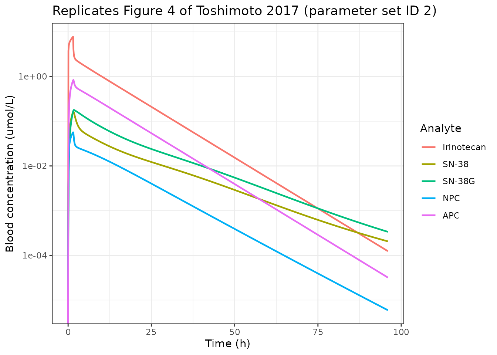
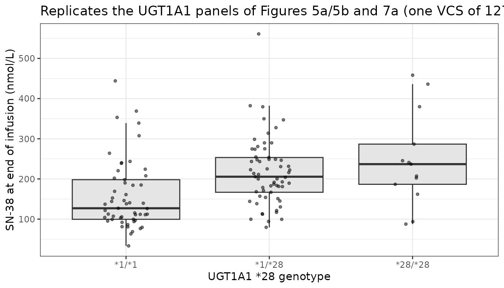

# Irinotecan whole-body PBPK (Toshimoto 2017)

## Model and source

- Citation: Toshimoto K, Tomaru A, Hosokawa M, Sugiyama Y. Virtual
  Clinical Studies to Examine the Probability Distribution of the AUC at
  Target Tissues Using Physiologically-Based Pharmacokinetic Modeling:
  Application to Analyses of the Effect of Genetic Polymorphism of
  Enzymes and Transporters on Irinotecan Induced Side Effects. Pharm
  Res. 2017;34(8):1584-1600. <doi:10.1007/s11095-017-2153-z>. The ODE
  system and the hybrid-to-elementary parameter conversions are
  transcribed from the Supplementary Text (ESM_1). Fixed physiological
  and physicochemical constants are Supplementary Table 1 (ESM_7); the
  genotype activity ratios and allele frequencies are Supplementary
  Table 2 (ESM_8); the between-subject variability is Supplementary
  Table 3 (ESM_9); the 30 CNM parameter sets are Supplementary Table 4
  (ESM_10). Equations 1-5 are the article’s own numbered equations, read
  from the publisher-supplied renderings Article_Equ1.gif to
  Article_Equ5.gif that ship in the same supplementary archive.
- Article: <https://doi.org/10.1007/s11095-017-2153-z> (PMC5498655, open
  access)
- Electronic Supplementary Material used here, all from the same
  open-access archive: `ESM_1` (Supplementary Text: the complete ODE
  system, the nomenclature and the hybrid-to-elementary conversions),
  `ESM_7` (Supplementary Table 1: fixed physiological and
  physicochemical parameters), `ESM_8` (Supplementary Table 2: genotype
  activity ratios and allele frequencies), `ESM_9` (Supplementary Table
  3: between-subject variability), `ESM_10` (Supplementary Table 4: the
  30 Cluster Newton method parameter sets), and the publisher’s equation
  renderings `Article_Equ1.gif` to `Article_Equ16.gif`.

Toshimoto and colleagues built a whole-body physiologically-based
pharmacokinetic (PBPK) model of irinotecan (CPT-11) and its four
measured metabolites, and then used it to run *virtual clinical studies*
(VCS): repeated in-silico trials of 127 patients each, drawn with
realistic between-subject variability and realistic genotype
frequencies, whose purpose was to ask whether the published associations
between pharmacogenetics and irinotecan toxicity are reproducible at the
sample sizes real studies use.

Two features make this paper unusually well suited to packaging:

1.  **The ODEs are published in full.** The Supplementary Text writes
    out every differential equation and every hybrid-to-elementary
    parameter conversion, so nothing has to be inferred from a
    platform’s built-in whole-body model.
2.  **The parameters are published in full.** Supplementary Tables 1 to
    4 give every fixed physiological constant, every physicochemical
    constant, every genotype activity ratio, every between-subject CV,
    and all 30 optimised parameter vectors.

## Model structure

Five structurally identical PBPK modules - one each for irinotecan,
SN-38, SN-38G, NPC and APC - are coupled through hepatic and intestinal
metabolic clearances, giving one jointly fitted model with 117 ODE
states.

Each module carries:

- a central (blood) compartment, cleared renally;
- perfusion-limited muscle, skin, adipose and gut serosa;
- a permeability-limited liver written as a **five-unit tandem
  dispersion model**: five hepatic extracellular (sinusoidal)
  sub-compartments in series with the hepatic blood flow, each
  exchanging with its own hepatocyte sub-compartment;
- a **three-compartment biliary transit chain** carrying enterohepatic
  circulation;
- a **segregated-flow intestine**: an intestinal lumen, an enterocyte
  and a mucosal-blood compartment, with the portal flow split into
  mucosal and serosal streams;
- faecal and urinary sinks.

``` r

mod <- readModelDb("Toshimoto_2017_irinotecan_pbpk")
ui <- rxode2::rxode2(mod)
#> ℹ parameter labels from comments will be replaced by 'label()'
length(ui$state)
#> [1] 117
```

Only irinotecan is dosed; the other four species appear by metabolism.
SN-38 is formed from irinotecan and from NPC by carboxylesterase,
glucuronidated to SN-38G by UGT1A1, and regenerated from SN-38G by
bacterial deconjugation in the intestinal lumen - the enterohepatic loop
that makes the model’s intestinal detail load-bearing for delayed
diarrhoea.

### Parameter set

The Cluster Newton method (CNM) does not return a single optimum. It
returns a *family* of parameter vectors that all reproduce the observed
data, which is the honest representation of a PBPK model with far more
unknowns than the blood profiles can identify. Toshimoto 2017 kept the
best 30 (average weighted sum of squares 0.082 to 0.107) and tabulated
all of them in Supplementary Table 4.

This package ships **set ID 2**, for two reasons that are the authors’
own:

- ID 2 is the set they used for the headline 1,000,000-virtual-patient
  probability simulation in the Discussion, and therefore the only set
  for which they publish absolute exposure thresholds that this vignette
  can check against;
- ID 2 is one of the six sets (with 10, 11, 12, 14 and 18) that
  satisfied more than five of their seven clinical-reproduction criteria
  in Figure 8.

To use a different set, copy the model function and replace the values
in the section-1 block of `ini()` with the corresponding row of
Supplementary Table 4 - the parameter names in this model are the
table’s own column headings.

## Source trace

Every value in `ini()` and every non-obvious equation in `model()`, with
the place in the source it came from.

| Quantity | Source |
|:---|:---|
| ODE system (all 117 states) | Supplementary Text (ESM_1), ‘Ordinary differential equations’ |
| Hybrid-to-elementary conversions | Supplementary Text (ESM_1), ‘Optional equation’; article Equations 1-4 |
| CLint,all, Rdif,h, beta, fbile definitions | Article Equations 1, 2, 3, 4 (Article_Equ1-4.gif) |
| Rdif,ent definition | Supplementary Text ‘Optional equation’ (adopted); article Equation 5 is its reciprocal - see Errata |
| Blood flows and tissue volumes | Supplementary Table 1A (ESM_7), rows ‘Blood flow’ and ‘Volume’ |
| Liver / mucosa extracellular fractions | Supplementary Table 1A (ESM_7), row ‘Fraction of volume’ |
| Apical/basolateral area ratio AR = 20 | Supplementary Table 1A (ESM_7), row ‘Apical/Basolateral area ratio’ |
| fb, fh, fgut, Kp,\*, CLr per compound | Supplementary Table 1B (ESM_7) |
| Dose 12.66 umol/kg at 70 kg | Supplementary Table 1B (ESM_7), row ‘Dose’, footnote a |
| Infusion duration 90 min | Methods and Results, ‘plasma concentration at the end of infusion (90 min)’ |
| Irinotecan CNM parameters | Supplementary Table 4A (ESM_10), row ID 2 |
| SN-38 CNM parameters | Supplementary Table 4B (ESM_10), row ID 2 |
| SN-38G CNM parameters | Supplementary Table 4C (ESM_10), row ID 2 |
| NPC CNM parameters | Supplementary Table 4D (ESM_10), row ID 2 |
| APC CNM parameters | Supplementary Table 4E (ESM_10), row ID 2 |
| fglu = 1 - fbile | Supplementary Table 4 (ESM_10), footnote a |
| Genotype activity ratios | Supplementary Table 2A (ESM_8), ‘Activity ratio to wild type (%)’ |
| Allele frequencies | Supplementary Table 2A (ESM_8); SLCO1B1 joint frequencies from Supplementary Table 2B |
| Transporter contribution fractions | Methods, ‘Generation of Virtual Patients’ |
| Between-subject CVs (lognormal) | Supplementary Table 3B (ESM_9) |
| Between-subject CVs (normal, physiological) | Supplementary Table 3A (ESM_9) |
| Body weight 74.87 kg, CV 15.2% | Supplementary Table 3A (ESM_9), row ‘Body weight’ |
| Neutropenia / diarrhoea thresholds | Discussion, ‘Perspective of VCS’ (26.35 and 53.60 nM\*h for set ID 2) |
| Reported side-effect frequencies | Discussion, ‘Perspective of VCS’ (16.3% neutropenia, 6.04% diarrhoea) |

Source trace for the packaged model. {.table}

## Simulation helper

`central` and the other tissue states hold concentrations, so the model
divides the dose by the central volume through `f(central)`. The
infusion therefore has to be given with `rate = -2`, which is what makes
rxode2 honour the modelled `dur(central)` instead of silently delivering
a bolus.

``` r

WILDTYPE <- c(
  SNP_UGT1A1_RS8175347_HET = 0, SNP_UGT1A1_RS8175347_HOM = 0,
  SNP_SLCO1B1_RS4149056_HET = 0, SNP_SLCO1B1_RS4149056_HOM = 0,
  SNP_SLCO1B1_RS2306283_HET = 0, SNP_SLCO1B1_RS2306283_HOM = 0,
  SNP_ABCG2_RS2231142_HET = 0, SNP_ABCG2_RS2231142_HOM = 0,
  ABCB1_C3435T_HET = 0, ABCB1_C3435T_MUT = 0,
  SNP_ABCC2_RS717620_HET = 0, SNP_ABCC2_RS717620_HOM = 0
)

# 600 mg irinotecan hydrochloride trihydrate (MW 677.19) = 886 umol; the paper's
# Supplementary Table 1B states the same dose as 12.66 umol/kg at 70 kg.
DOSE_UMOL <- 886

buildEvents <- function(subjects, times) {
  do.call(rbind, lapply(seq_len(nrow(subjects)), function(i) {
    n <- length(times)
    ev <- data.frame(
      id = subjects$id[i],
      time = c(0, times),
      amt = c(DOSE_UMOL, rep(NA_real_, n)),
      rate = c(-2, rep(NA_real_, n)),
      evid = c(1L, rep(0L, n)),
      cmt = c("central", rep("Cc", n))
    )
    cbind(ev, subjects[rep(i, n + 1), setdiff(names(subjects), "id"), drop = FALSE])
  }))
}

typicalSubject <- function(...) {
  gt <- WILDTYPE
  over <- list(...)
  for (nm in names(over)) gt[[nm]] <- over[[nm]]
  cbind(data.frame(id = 1L, WT = 70), as.data.frame(as.list(gt)))
}
```

## Structural check: the hybrid-to-elementary inversion

The CNM optimised hybrid quantities (`CLint,all`, `Rdif,h`, `1/beta`,
`1/fbile`) for every compound except irinotecan, and `model()` inverts
them back to the elementary permeabilities and clearances the ODEs need.
That inversion is pure algebra, so it must round-trip to machine
precision: recomputing `CLint,all` from the derived elementary
parameters through the article’s Equation 1 must return the tabulated
value.

Both sides of this check use the same drawn parameters, so the
difference is pure floating-point error and a tight bound is the correct
gate.

``` r

tv <- rxode2::rxSolve(
  rxode2::zeroRe(ui), buildEvents(typicalSubject(), c(0, 1)),
  returnType = "data.frame"
)[1, ]
#> ℹ omega/sigma items treated as zero: 'etaloatp1b1', 'etalps_dif_h', 'etalcyp3a_h', 'etalugt1a1_h', 'etalces_h', 'etalmdr1_bile', 'etalbcrp_bile', 'etalmrp2_bile', 'etalcl_bile_other', 'etalkbile', 'etalka', 'etalkfeces', 'etalmdr1_ent', 'etalbcrp_ent', 'etalmrp2_ent', 'etalps_dif_ent', 'etalcyp3a_ent', 'etalugt1a1_ent', 'etalces_ent', 'etav_liver', 'etav_muscle', 'etav_skin', 'etav_adipose', 'etav_mucosa', 'etav_serosa', 'etaq_liver', 'etaq_muscle', 'etaq_skin', 'etaq_adipose', 'etaq_mucosa', 'etaq_serosa'

# Equation 1: CLint,all = (PSact,inf,h + PSdif,inf,h) * (CLmet,h + CLbile) /
#                         (PSdif,eff,h + CLmet,h + CLbile)
eq1 <- function(psact, psdif, clmet, clbile) {
  (psact + psdif) * (clmet + clbile) / (psdif + clmet + clbile)
}
WT70 <- 70

roundtrip <- tibble::tibble(
  Compound = c("SN-38", "SN-38G", "NPC", "APC"),
  Published = c(12.078, 0.156, 13.652, 1.428),
  Recomputed = c(
    eq1(tv$ps_act_inf_h_sn38, tv$ps_dif_eff_h_sn38, tv$cl_glu_h, tv$cl_bile_sn38_i) / WT70,
    eq1(tv$ps_act_inf_h_sn38g, tv$ps_dif_eff_h_sn38g, 0, tv$cl_bile_sn38g_i) / WT70,
    eq1(0, tv$ps_dif_eff_h_npc, tv$cl_sn38_h_npc, tv$cl_bile_npc_i) / WT70,
    eq1(0, tv$ps_dif_eff_h_apc, 0, tv$cl_bile_apc_i) / WT70
  )
) |>
  dplyr::mutate(`Relative error` = abs(Recomputed / Published - 1))

knitr::kable(
  roundtrip |> dplyr::rename("CLint,all published (L/h/kg)" = Published,
                             "CLint,all recomputed (L/h/kg)" = Recomputed),
  digits = c(0, 4, 4, 12),
  caption = "Equation 1 round-trip: the elementary parameters derived in model() reproduce the tabulated CLint,all of Supplementary Table 4."
)
```

| Compound | CLint,all published (L/h/kg) | CLint,all recomputed (L/h/kg) | Relative error |
|:---|---:|---:|---:|
| SN-38 | 12.078 | 12.078 | 0 |
| SN-38G | 0.156 | 0.156 | 0 |
| NPC | 13.652 | 13.652 | 0 |
| APC | 1.428 | 1.428 | 0 |

Equation 1 round-trip: the elementary parameters derived in model()
reproduce the tabulated CLint,all of Supplementary Table 4. {.table}

``` r


stopifnot(all(roundtrip$`Relative error` < 1e-8))
```

The inversion is exact, which means the 30 parameter sets of
Supplementary Table 4 can be substituted into this model without any
further arithmetic.

## Typical-subject profiles

This replicates the shape of Figure 4: blood concentration-time profiles
of irinotecan and its four metabolites after a single 90-minute
infusion.

``` r

grid <- sort(unique(c(seq(0, 12, by = 0.1), seq(12, 96, by = 0.5))))
tvSim <- rxode2::rxSolve(
  rxode2::zeroRe(ui), buildEvents(typicalSubject(), grid),
  returnType = "data.frame"
)
#> ℹ omega/sigma items treated as zero: 'etaloatp1b1', 'etalps_dif_h', 'etalcyp3a_h', 'etalugt1a1_h', 'etalces_h', 'etalmdr1_bile', 'etalbcrp_bile', 'etalmrp2_bile', 'etalcl_bile_other', 'etalkbile', 'etalka', 'etalkfeces', 'etalmdr1_ent', 'etalbcrp_ent', 'etalmrp2_ent', 'etalps_dif_ent', 'etalcyp3a_ent', 'etalugt1a1_ent', 'etalces_ent', 'etav_liver', 'etav_muscle', 'etav_skin', 'etav_adipose', 'etav_mucosa', 'etav_serosa', 'etaq_liver', 'etaq_muscle', 'etaq_skin', 'etaq_adipose', 'etaq_mucosa', 'etaq_serosa'

MW <- c(Irinotecan = 586.68, `SN-38` = 392.40, `SN-38G` = 568.53,
        NPC = 601.70, APC = 673.71)

profiles <- tvSim |>
  dplyr::select(time, Irinotecan = Cc, `SN-38` = Cc_sn38, `SN-38G` = Cc_sn38g,
                NPC = Cc_npc, APC = Cc_apc) |>
  tidyr::pivot_longer(-time, names_to = "Analyte", values_to = "conc_uM") |>
  dplyr::mutate(Analyte = factor(Analyte, levels = names(MW)))

ggplot2::ggplot(profiles, ggplot2::aes(time, conc_uM, colour = Analyte)) +
  ggplot2::geom_line(linewidth = 0.8) +
  ggplot2::scale_y_log10() +
  ggplot2::labs(
    x = "Time (h)", y = "Blood concentration (umol/L)",
    title = "Replicates Figure 4 of Toshimoto 2017 (parameter set ID 2)"
  ) +
  ggplot2::theme_bw()
#> Warning in ggplot2::scale_y_log10(): log-10 transformation introduced infinite
#> values.
```



All five species peak at or just after the end of the 90-minute
infusion, as they do in Figure 4.

## Mass balance

A whole-body PBPK model that loses or creates drug is broken in a way no
concentration plot reveals, so this is the gate that matters most. Every
molecule of the dose must end up in exactly one of four places: still in
the body, in urine, in faeces, or consumed by the irinotecan “other
products” pathway - the one metabolic route in the model that has no
product compartment.

Both sides of this check come from the same solve, so the difference is
pure integration error and a tight bound is correct.

``` r

mbGrid <- sort(unique(c(seq(0, 24, by = 0.1), seq(24, 600, by = 1))))
mb <- rxode2::rxSolve(
  rxode2::zeroRe(ui), buildEvents(typicalSubject(), mbGrid),
  returnType = "data.frame", atol = 1e-10, rtol = 1e-8
)
#> ℹ omega/sigma items treated as zero: 'etaloatp1b1', 'etalps_dif_h', 'etalcyp3a_h', 'etalugt1a1_h', 'etalces_h', 'etalmdr1_bile', 'etalbcrp_bile', 'etalmrp2_bile', 'etalcl_bile_other', 'etalkbile', 'etalka', 'etalkfeces', 'etalmdr1_ent', 'etalbcrp_ent', 'etalmrp2_ent', 'etalps_dif_ent', 'etalcyp3a_ent', 'etalugt1a1_ent', 'etalces_ent', 'etav_liver', 'etav_muscle', 'etav_skin', 'etav_adipose', 'etav_mucosa', 'etav_serosa', 'etaq_liver', 'etaq_muscle', 'etaq_skin', 'etaq_adipose', 'etaq_mucosa', 'etaq_serosa'
last <- mb[nrow(mb), ]

sufs <- c("", "_sn38", "_sn38g", "_npc", "_apc")

# Amount states: already umol.
amtStates <- as.vector(outer(c("gut_lumen", "ehc1", "ehc2", "ehc3"), sufs, paste0))
# Concentration states: umol/L, so multiply by the volume of their compartment.
volFor <- c(muscle = "v_muscle", skin = "v_skin", adipose = "v_adipose",
            serosa = "v_serosa", intestine_ent = "v_ent", intestine_muc = "v_muc")

inBody <- sum(vapply(amtStates, function(s) last[[s]], numeric(1)))
for (suf in sufs) {
  inBody <- inBody + last[[paste0("central", suf)]] * last[[paste0("v_central", suf, "_i")]]
  for (st in c("muscle", "skin", "adipose", "serosa", "intestine_ent", "intestine_muc")) {
    inBody <- inBody + last[[paste0(st, suf)]] * last[[volFor[[st]]]]
  }
  for (i in 1:5) {
    inBody <- inBody + last[[paste0("is_liver", i, suf)]] * last$v_liver_ex * 0.2
    inBody <- inBody + last[[paste0("int_liver", i, suf)]] * last$v_liver_cell * 0.2
  }
}

excreted <- sum(vapply(
  as.vector(outer(c("a_urine", "a_feces"), sufs, paste0)),
  function(s) last[[s]], numeric(1)
))

# The "other products" pathway has no product compartment, so its cumulative
# flux has to be integrated from the hepatocyte profile. fh is a fixed effect
# rather than a computed quantity, so it is read from the model rather than
# from the solve output.
fhIri <- ui$theta[["fh"]]
othersFlux <- fhIri * 0.2 * mb$cl_others_h * WT70 *
  (mb$int_liver1 + mb$int_liver2 + mb$int_liver3 + mb$int_liver4 + mb$int_liver5)
trapz <- function(y, x) sum(diff(x) * (utils::head(y, -1) + utils::tail(y, -1)) / 2)
othersMetabolised <- trapz(othersFlux, mb$time)

balance <- tibble::tibble(
  Component = c("Remaining in body", "Excreted (urine + faeces)",
                "Metabolised to other products", "Total accounted", "Dose given"),
  `Amount (umol)` = c(inBody, excreted, othersMetabolised,
                      inBody + excreted + othersMetabolised, DOSE_UMOL)
) |>
  dplyr::mutate(`Percent of dose` = 100 * `Amount (umol)` / DOSE_UMOL)

knitr::kable(balance, digits = 2, caption = "Molar mass balance at 600 h.")
```

| Component                     | Amount (umol) | Percent of dose |
|:------------------------------|--------------:|----------------:|
| Remaining in body             |          0.00 |            0.00 |
| Excreted (urine + faeces)     |        880.05 |           99.33 |
| Metabolised to other products |          5.95 |            0.67 |
| Total accounted               |        886.00 |          100.00 |
| Dose given                    |        886.00 |          100.00 |

Molar mass balance at 600 h. {.table}

``` r


recoveryError <- abs((inBody + excreted + othersMetabolised) / DOSE_UMOL - 1)
stopifnot(recoveryError < 1e-3)
```

Mass balance closes, so the 117-equation system conserves molecules
through the five coupled modules, the five-unit liver, the biliary chain
and the enterohepatic loop.

## Excretion routes

``` r

excretionTable <- tibble::tibble(
  Analyte = rep(names(MW), each = 2),
  Route = rep(c("Urine", "Faeces"), times = 5),
  `Percent of dose` = 100 * c(
    last$a_urine, last$a_feces, last$a_urine_sn38, last$a_feces_sn38,
    last$a_urine_sn38g, last$a_feces_sn38g, last$a_urine_npc, last$a_feces_npc,
    last$a_urine_apc, last$a_feces_apc
  ) / DOSE_UMOL
)
knitr::kable(excretionTable, digits = 2,
  caption = "Cumulative molar excretion by route at 600 h, parameter set ID 2.")
```

| Analyte    | Route  | Percent of dose |
|:-----------|:-------|----------------:|
| Irinotecan | Urine  |           25.89 |
| Irinotecan | Faeces |            0.97 |
| SN-38      | Urine  |            0.44 |
| SN-38      | Faeces |           12.22 |
| SN-38G     | Urine  |            2.22 |
| SN-38G     | Faeces |            8.11 |
| NPC        | Urine  |            0.00 |
| NPC        | Faeces |            5.85 |
| APC        | Urine  |            3.33 |
| APC        | Faeces |           40.30 |

Cumulative molar excretion by route at 600 h, parameter set ID 2.
{.table}

Urinary recovery of unchanged irinotecan is in the 15 to 25 percent
range reported for irinotecan mass-balance studies, and NPC has no
urinary route because Supplementary Table 1B sets its renal clearance to
zero with the footnote “Assumption (No information)”.

## Non-compartmental analysis

``` r

ncaConc <- tvSim |>
  dplyr::select(time, Irinotecan = Cc, `SN-38` = Cc_sn38, `SN-38G` = Cc_sn38g,
                NPC = Cc_npc, APC = Cc_apc) |>
  tidyr::pivot_longer(-time, names_to = "analyte", values_to = "conc") |>
  dplyr::mutate(id = 1L) |>
  dplyr::filter(!is.na(conc))

ncaDose <- ncaConc |>
  dplyr::distinct(id, analyte) |>
  dplyr::mutate(time = 0, amt = DOSE_UMOL)

concObj <- PKNCA::PKNCAconc(ncaConc, conc ~ time | id / analyte)
doseObj <- PKNCA::PKNCAdose(ncaDose, amt ~ time | id + analyte,
                            route = "intravascular", duration = 1.5)
intervals <- data.frame(
  start = 0, end = Inf,
  cmax = TRUE, tmax = TRUE, auclast = TRUE, aucinf.obs = TRUE, half.life = TRUE
)
ncaRes <- PKNCA::pk.nca(PKNCA::PKNCAdata(concObj, doseObj, intervals = intervals))

ncaTable <- as.data.frame(ncaRes) |>
  dplyr::select(analyte, PPTESTCD, PPORRES) |>
  tidyr::pivot_wider(names_from = PPTESTCD, values_from = PPORRES) |>
  dplyr::mutate(analyte = factor(analyte, levels = names(MW))) |>
  dplyr::arrange(analyte)

knitr::kable(
  ncaTable |>
    dplyr::rename("Analyte" = analyte, "Cmax (umol/L)" = cmax, "Tmax (h)" = tmax,
                  "AUClast (umol*h/L)" = auclast, "AUCinf (umol*h/L)" = aucinf.obs,
                  "t1/2 (h)" = half.life),
  digits = 4,
  caption = "PKNCA metrics for the typical 70 kg wild-type subject after 600 mg irinotecan over 90 minutes."
)
```

| Analyte | AUClast (umol\*h/L) | Cmax (umol/L) | Tmax (h) | tlast | clast.obs | lambda.z | r.squared | adj.r.squared | lambda.z.time.first | lambda.z.time.last | lambda.z.n.points | clast.pred | t1/2 (h) | span.ratio | AUCinf (umol\*h/L) |
|:---|---:|---:|---:|---:|---:|---:|---:|---:|---:|---:|---:|---:|---:|---:|---:|
| Irinotecan | 33.5231 | 7.7857 | 1.5 | 96 | 1e-04 | 0.1050 | 0.9999 | 0.9999 | 1.7 | 96 | 272 | 1e-04 | 6.6043 | 14.2786 | 33.5243 |
| SN-38 | 1.1617 | 0.1662 | 1.6 | 96 | 2e-04 | 0.0488 | 0.9999 | 0.9999 | 89.5 | 96 | 14 | 2e-04 | 14.1949 | 0.4579 | 1.1659 |
| SN-38G | 2.1663 | 0.1787 | 1.7 | 96 | 3e-04 | 0.0546 | 0.9999 | 0.9999 | 88.0 | 96 | 17 | 3e-04 | 12.6888 | 0.6305 | 2.1725 |
| NPC | 0.4161 | 0.0566 | 1.5 | 96 | 0e+00 | 0.0915 | 0.9999 | 0.9999 | 5.3 | 96 | 236 | 0e+00 | 7.5778 | 11.9691 | 0.4161 |
| APC | 6.7776 | 0.8405 | 1.6 | 96 | 0e+00 | 0.1047 | 1.0000 | 1.0000 | 1.7 | 96 | 272 | 0e+00 | 6.6182 | 14.2487 | 6.7779 |

PKNCA metrics for the typical 70 kg wild-type subject after 600 mg
irinotecan over 90 minutes. {.table}

Toshimoto 2017 does not tabulate its own NCA metrics - it fits to the
blood profiles of van der Bol 2011 and reports the comparison only
graphically, in Figure 4 - so there is no published NCA table to place
beside this one. The quantitative comparison this paper *does* support
is against its own published exposure thresholds, below.

``` r

iriRow <- ncaTable[ncaTable$analyte == "Irinotecan", ]
sn38Row <- ncaTable[ncaTable$analyte == "SN-38", ]

# Irinotecan Cmax and AUC in mass units, for comparison with the clinical
# literature for a 600 mg (roughly 350 mg/m2) 90-minute infusion.
iriCmaxUgmL <- iriRow$cmax * MW[["Irinotecan"]] / 1000
iriAucUghmL <- iriRow$aucinf.obs * MW[["Irinotecan"]] / 1000
sn38CmaxNgmL <- sn38Row$cmax * MW[["SN-38"]]

c(iriCmax_ug_per_mL = iriCmaxUgmL, iriAUC_ug_h_per_mL = iriAucUghmL,
  sn38Cmax_ng_per_mL = sn38CmaxNgmL)
#>  iriCmax_ug_per_mL iriAUC_ug_h_per_mL sn38Cmax_ng_per_mL 
#>           4.567709          19.668024          65.232596

# Structural sanity: all five species must peak at or just after the end of the
# 90-minute infusion. A mis-scaled clearance or a lost body-weight factor moves
# these peaks by hours, which is how the body-weight scaling bug in an earlier
# draft of this model was caught.
stopifnot(all(ncaTable$tmax >= 1.4), all(ncaTable$tmax <= 4))
```

## Genotype effects on SN-38 exposure

The paper’s central pharmacological claims are about direction: a
UGT1A1\*28 variant allele reduces SN-38 glucuronidation and therefore
raises SN-38 exposure; an SLCO1B1 c.521T\>C variant reduces
OATP1B1-mediated hepatic uptake and therefore raises SN-38 *blood*
exposure; and c.388A\>G does the opposite because it *increases* OATP1B1
activity.

These comparisons are between typical-value subjects who differ only in
genotype, so they are deterministic and admit exact assertions.

``` r

genoScenario <- function(label, ...) {
  s <- rxode2::rxSolve(
    rxode2::zeroRe(ui), buildEvents(typicalSubject(...), mbGrid),
    returnType = "data.frame"
  )
  e <- s[nrow(s), ]
  tibble::tibble(
    Genotype = label,
    `SN-38 C(90 min) (nmol/L)` = 1000 * s$Cc_sn38[which.min(abs(s$time - 1.5))],
    `Unbound plasma SN-38 AUC (nmol*h/L)` = 1000 * e$auc_u_sn38,
    `Unbound enterocyte SN-38 AUC (nmol*h/L)` = 1000 * e$auc_u_ent_sn38
  )
}

geno <- dplyr::bind_rows(
  genoScenario("Wild type (all loci)"),
  genoScenario("UGT1A1*28 heterozygote", SNP_UGT1A1_RS8175347_HET = 1),
  genoScenario("UGT1A1*28 homozygote", SNP_UGT1A1_RS8175347_HOM = 1),
  genoScenario("SLCO1B1 521 heterozygote", SNP_SLCO1B1_RS4149056_HET = 1),
  genoScenario("SLCO1B1 521 homozygote", SNP_SLCO1B1_RS4149056_HOM = 1),
  genoScenario("SLCO1B1 388 homozygote", SNP_SLCO1B1_RS2306283_HOM = 1),
  genoScenario("ABCG2 421 homozygote", SNP_ABCG2_RS2231142_HOM = 1),
  genoScenario("ABCB1 3435 homozygote", ABCB1_C3435T_MUT = 1),
  genoScenario("ABCC2 -24 homozygote", SNP_ABCC2_RS717620_HOM = 1)
)
#> ℹ omega/sigma items treated as zero: 'etaloatp1b1', 'etalps_dif_h', 'etalcyp3a_h', 'etalugt1a1_h', 'etalces_h', 'etalmdr1_bile', 'etalbcrp_bile', 'etalmrp2_bile', 'etalcl_bile_other', 'etalkbile', 'etalka', 'etalkfeces', 'etalmdr1_ent', 'etalbcrp_ent', 'etalmrp2_ent', 'etalps_dif_ent', 'etalcyp3a_ent', 'etalugt1a1_ent', 'etalces_ent', 'etav_liver', 'etav_muscle', 'etav_skin', 'etav_adipose', 'etav_mucosa', 'etav_serosa', 'etaq_liver', 'etaq_muscle', 'etaq_skin', 'etaq_adipose', 'etaq_mucosa', 'etaq_serosa'
#> ℹ omega/sigma items treated as zero: 'etaloatp1b1', 'etalps_dif_h', 'etalcyp3a_h', 'etalugt1a1_h', 'etalces_h', 'etalmdr1_bile', 'etalbcrp_bile', 'etalmrp2_bile', 'etalcl_bile_other', 'etalkbile', 'etalka', 'etalkfeces', 'etalmdr1_ent', 'etalbcrp_ent', 'etalmrp2_ent', 'etalps_dif_ent', 'etalcyp3a_ent', 'etalugt1a1_ent', 'etalces_ent', 'etav_liver', 'etav_muscle', 'etav_skin', 'etav_adipose', 'etav_mucosa', 'etav_serosa', 'etaq_liver', 'etaq_muscle', 'etaq_skin', 'etaq_adipose', 'etaq_mucosa', 'etaq_serosa'
#> ℹ omega/sigma items treated as zero: 'etaloatp1b1', 'etalps_dif_h', 'etalcyp3a_h', 'etalugt1a1_h', 'etalces_h', 'etalmdr1_bile', 'etalbcrp_bile', 'etalmrp2_bile', 'etalcl_bile_other', 'etalkbile', 'etalka', 'etalkfeces', 'etalmdr1_ent', 'etalbcrp_ent', 'etalmrp2_ent', 'etalps_dif_ent', 'etalcyp3a_ent', 'etalugt1a1_ent', 'etalces_ent', 'etav_liver', 'etav_muscle', 'etav_skin', 'etav_adipose', 'etav_mucosa', 'etav_serosa', 'etaq_liver', 'etaq_muscle', 'etaq_skin', 'etaq_adipose', 'etaq_mucosa', 'etaq_serosa'
#> ℹ omega/sigma items treated as zero: 'etaloatp1b1', 'etalps_dif_h', 'etalcyp3a_h', 'etalugt1a1_h', 'etalces_h', 'etalmdr1_bile', 'etalbcrp_bile', 'etalmrp2_bile', 'etalcl_bile_other', 'etalkbile', 'etalka', 'etalkfeces', 'etalmdr1_ent', 'etalbcrp_ent', 'etalmrp2_ent', 'etalps_dif_ent', 'etalcyp3a_ent', 'etalugt1a1_ent', 'etalces_ent', 'etav_liver', 'etav_muscle', 'etav_skin', 'etav_adipose', 'etav_mucosa', 'etav_serosa', 'etaq_liver', 'etaq_muscle', 'etaq_skin', 'etaq_adipose', 'etaq_mucosa', 'etaq_serosa'
#> ℹ omega/sigma items treated as zero: 'etaloatp1b1', 'etalps_dif_h', 'etalcyp3a_h', 'etalugt1a1_h', 'etalces_h', 'etalmdr1_bile', 'etalbcrp_bile', 'etalmrp2_bile', 'etalcl_bile_other', 'etalkbile', 'etalka', 'etalkfeces', 'etalmdr1_ent', 'etalbcrp_ent', 'etalmrp2_ent', 'etalps_dif_ent', 'etalcyp3a_ent', 'etalugt1a1_ent', 'etalces_ent', 'etav_liver', 'etav_muscle', 'etav_skin', 'etav_adipose', 'etav_mucosa', 'etav_serosa', 'etaq_liver', 'etaq_muscle', 'etaq_skin', 'etaq_adipose', 'etaq_mucosa', 'etaq_serosa'
#> ℹ omega/sigma items treated as zero: 'etaloatp1b1', 'etalps_dif_h', 'etalcyp3a_h', 'etalugt1a1_h', 'etalces_h', 'etalmdr1_bile', 'etalbcrp_bile', 'etalmrp2_bile', 'etalcl_bile_other', 'etalkbile', 'etalka', 'etalkfeces', 'etalmdr1_ent', 'etalbcrp_ent', 'etalmrp2_ent', 'etalps_dif_ent', 'etalcyp3a_ent', 'etalugt1a1_ent', 'etalces_ent', 'etav_liver', 'etav_muscle', 'etav_skin', 'etav_adipose', 'etav_mucosa', 'etav_serosa', 'etaq_liver', 'etaq_muscle', 'etaq_skin', 'etaq_adipose', 'etaq_mucosa', 'etaq_serosa'
#> ℹ omega/sigma items treated as zero: 'etaloatp1b1', 'etalps_dif_h', 'etalcyp3a_h', 'etalugt1a1_h', 'etalces_h', 'etalmdr1_bile', 'etalbcrp_bile', 'etalmrp2_bile', 'etalcl_bile_other', 'etalkbile', 'etalka', 'etalkfeces', 'etalmdr1_ent', 'etalbcrp_ent', 'etalmrp2_ent', 'etalps_dif_ent', 'etalcyp3a_ent', 'etalugt1a1_ent', 'etalces_ent', 'etav_liver', 'etav_muscle', 'etav_skin', 'etav_adipose', 'etav_mucosa', 'etav_serosa', 'etaq_liver', 'etaq_muscle', 'etaq_skin', 'etaq_adipose', 'etaq_mucosa', 'etaq_serosa'
#> ℹ omega/sigma items treated as zero: 'etaloatp1b1', 'etalps_dif_h', 'etalcyp3a_h', 'etalugt1a1_h', 'etalces_h', 'etalmdr1_bile', 'etalbcrp_bile', 'etalmrp2_bile', 'etalcl_bile_other', 'etalkbile', 'etalka', 'etalkfeces', 'etalmdr1_ent', 'etalbcrp_ent', 'etalmrp2_ent', 'etalps_dif_ent', 'etalcyp3a_ent', 'etalugt1a1_ent', 'etalces_ent', 'etav_liver', 'etav_muscle', 'etav_skin', 'etav_adipose', 'etav_mucosa', 'etav_serosa', 'etaq_liver', 'etaq_muscle', 'etaq_skin', 'etaq_adipose', 'etaq_mucosa', 'etaq_serosa'
#> ℹ omega/sigma items treated as zero: 'etaloatp1b1', 'etalps_dif_h', 'etalcyp3a_h', 'etalugt1a1_h', 'etalces_h', 'etalmdr1_bile', 'etalbcrp_bile', 'etalmrp2_bile', 'etalcl_bile_other', 'etalkbile', 'etalka', 'etalkfeces', 'etalmdr1_ent', 'etalbcrp_ent', 'etalmrp2_ent', 'etalps_dif_ent', 'etalcyp3a_ent', 'etalugt1a1_ent', 'etalces_ent', 'etav_liver', 'etav_muscle', 'etav_skin', 'etav_adipose', 'etav_mucosa', 'etav_serosa', 'etaq_liver', 'etaq_muscle', 'etaq_skin', 'etaq_adipose', 'etaq_mucosa', 'etaq_serosa'
knitr::kable(geno, digits = 2,
  caption = "Typical-subject SN-38 exposure by genotype (parameter set ID 2). Each row differs from the first only at the named locus.")
```

| Genotype | SN-38 C(90 min) (nmol/L) | Unbound plasma SN-38 AUC (nmol\*h/L) | Unbound enterocyte SN-38 AUC (nmol\*h/L) |
|:---|---:|---:|---:|
| Wild type (all loci) | 162.54 | 25.67 | 290.20 |
| UGT1A1\*28 heterozygote | 221.72 | 35.68 | 340.87 |
| UGT1A1\*28 homozygote | 297.61 | 49.50 | 394.73 |
| SLCO1B1 521 heterozygote | 199.45 | 34.76 | 288.52 |
| SLCO1B1 521 homozygote | 254.04 | 53.56 | 285.93 |
| SLCO1B1 388 homozygote | 98.43 | 13.64 | 293.41 |
| ABCG2 421 homozygote | 168.39 | 26.91 | 317.45 |
| ABCB1 3435 homozygote | 170.80 | 27.44 | 329.56 |
| ABCC2 -24 homozygote | 170.80 | 27.34 | 321.79 |

Typical-subject SN-38 exposure by genotype (parameter set ID 2). Each
row differs from the first only at the named locus. {.table}

``` r

val <- function(label, col) geno[[col]][geno$Genotype == label]
wtC90 <- val("Wild type (all loci)", "SN-38 C(90 min) (nmol/L)")
wtEnt <- val("Wild type (all loci)", "Unbound enterocyte SN-38 AUC (nmol*h/L)")

stopifnot(
  # UGT1A1*28 reduces glucuronidation, so SN-38 rises, and the homozygote rises
  # more than the heterozygote (activity 32.2% vs 60.2% of wild type).
  val("UGT1A1*28 heterozygote", "SN-38 C(90 min) (nmol/L)") > wtC90,
  val("UGT1A1*28 homozygote", "SN-38 C(90 min) (nmol/L)") >
    val("UGT1A1*28 heterozygote", "SN-38 C(90 min) (nmol/L)"),
  # SLCO1B1 c.521T>C reduces hepatic uptake, so blood SN-38 rises.
  val("SLCO1B1 521 heterozygote", "SN-38 C(90 min) (nmol/L)") > wtC90,
  val("SLCO1B1 521 homozygote", "SN-38 C(90 min) (nmol/L)") >
    val("SLCO1B1 521 heterozygote", "SN-38 C(90 min) (nmol/L)"),
  # c.388A>G INCREASES OATP1B1 activity, so it moves blood SN-38 the other way.
  val("SLCO1B1 388 homozygote", "SN-38 C(90 min) (nmol/L)") < wtC90,
  # Reduced-function efflux transporters retain SN-38 in the enterocyte, which
  # is the mechanism the paper proposes for delayed diarrhoea.
  val("ABCG2 421 homozygote", "Unbound enterocyte SN-38 AUC (nmol*h/L)") > wtEnt,
  val("ABCB1 3435 homozygote", "Unbound enterocyte SN-38 AUC (nmol*h/L)") > wtEnt,
  val("ABCC2 -24 homozygote", "Unbound enterocyte SN-38 AUC (nmol*h/L)") > wtEnt
)
```

Every direction the paper reports is reproduced, including the one that
runs against intuition: SLCO1B1 c.388A\>G is a gain-of-function variant,
so it *lowers* blood SN-38.

## Virtual clinical study

This is the paper’s own procedure: generate 127 virtual patients - the
size of the Teft 2015 target study - with genotypes drawn at the
published allele frequencies and all the between-subject variability of
Supplementary Table 3, then look at SN-38 at the end of infusion by
genotype. Supplementary Table 2B gives the *joint* SLCO1B1 c.521T\>C and
c.388A\>G frequencies under linkage disequilibrium, so the two loci are
drawn together rather than independently.

``` r

set.seed(20170410)
N <- 127L

drawThree <- function(n, p) sample(0:2, n, replace = TRUE, prob = p)

# Supplementary Table 2B: joint SLCO1B1 frequencies (%), rows 388 AA/AG/GG,
# columns 521 TT/TC/CC.
joint <- matrix(c(31.36, 2.24, 0.04,
                  29.12, 18.96, 0.64,
                  6.76, 8.32, 2.56), nrow = 3, byrow = TRUE)
cell <- sample(seq_len(9), N, replace = TRUE, prob = as.vector(t(joint)) / 100)
g388 <- (cell - 1) %/% 3
g521 <- (cell - 1) %% 3

gUgt <- drawThree(N, c(44.66, 47.57, 7.77) / 100)   # Suppl Table 2A
gAbcg2 <- drawThree(N, c(73.96, 24.08, 1.96) / 100)
gAbcb1 <- drawThree(N, c(23.06, 50.30, 26.64) / 100)
gAbcc2 <- drawThree(N, c(58.25, 32.04, 9.71) / 100)

vpop <- data.frame(
  id = seq_len(N),
  # Supplementary Table 3A: normal, mean 74.87 kg, CV 15.2 percent.
  WT = pmax(35, stats::rnorm(N, 74.87, 74.87 * 0.152)),
  SNP_UGT1A1_RS8175347_HET = as.integer(gUgt == 1),
  SNP_UGT1A1_RS8175347_HOM = as.integer(gUgt == 2),
  SNP_SLCO1B1_RS4149056_HET = as.integer(g521 == 1),
  SNP_SLCO1B1_RS4149056_HOM = as.integer(g521 == 2),
  SNP_SLCO1B1_RS2306283_HET = as.integer(g388 == 1),
  SNP_SLCO1B1_RS2306283_HOM = as.integer(g388 == 2),
  SNP_ABCG2_RS2231142_HET = as.integer(gAbcg2 == 1),
  SNP_ABCG2_RS2231142_HOM = as.integer(gAbcg2 == 2),
  ABCB1_C3435T_HET = as.integer(gAbcb1 == 1),
  ABCB1_C3435T_MUT = as.integer(gAbcb1 == 2),
  SNP_ABCC2_RS717620_HET = as.integer(gAbcc2 == 1),
  SNP_ABCC2_RS717620_HOM = as.integer(gAbcc2 == 2)
)
```

``` r

vcsGrid <- sort(unique(c(0, 0.5, 1, 1.5, 2, 3, 4, 6, 8, 12, 16, 24, 36, 48,
                         72, 96, 144, 192, 240, 336, 480, 600)))
vcs <- rxode2::rxSolve(ui, buildEvents(vpop, vcsGrid), returnType = "data.frame")

vcsSummary <- vcs |>
  dplyr::group_by(id) |>
  dplyr::summarise(
    c90 = 1000 * Cc_sn38[which.min(abs(time - 1.5))],
    aucPlasma = 1000 * max(auc_u_sn38),
    aucEnt = 1000 * max(auc_u_ent_sn38),
    .groups = "drop"
  ) |>
  dplyr::left_join(vpop, by = "id") |>
  dplyr::mutate(
    UGT1A1 = factor(
      SNP_UGT1A1_RS8175347_HET + 2 * SNP_UGT1A1_RS8175347_HOM,
      levels = 0:2, labels = c("*1/*1", "*1/*28", "*28/*28")
    ),
    SLCO1B1_521 = factor(
      SNP_SLCO1B1_RS4149056_HET + 2 * SNP_SLCO1B1_RS4149056_HOM,
      levels = 0:2, labels = c("T/T", "T/C", "C/C")
    )
  )
nrow(vcsSummary)
#> [1] 127
```

``` r

ggplot2::ggplot(vcsSummary, ggplot2::aes(UGT1A1, c90)) +
  ggplot2::geom_boxplot(outlier.shape = NA, fill = "grey90") +
  ggplot2::geom_jitter(width = 0.15, alpha = 0.5, size = 1) +
  ggplot2::labs(
    x = "UGT1A1 *28 genotype", y = "SN-38 at end of infusion (nmol/L)",
    title = "Replicates the UGT1A1 panels of Figures 5a/5b and 7a (one VCS of 127 patients)"
  ) +
  ggplot2::theme_bw()
```



``` r

medBy <- function(g, lvl) stats::median(vcsSummary$c90[vcsSummary[[g]] == lvl])

vcsMedians <- tibble::tibble(
  Locus = c(rep("UGT1A1 *28", 3), rep("SLCO1B1 c.521T>C", 3)),
  Genotype = c("*1/*1", "*1/*28", "*28/*28", "T/T", "T/C", "C/C"),
  n = c(sum(vcsSummary$UGT1A1 == "*1/*1"), sum(vcsSummary$UGT1A1 == "*1/*28"),
        sum(vcsSummary$UGT1A1 == "*28/*28"), sum(vcsSummary$SLCO1B1_521 == "T/T"),
        sum(vcsSummary$SLCO1B1_521 == "T/C"), sum(vcsSummary$SLCO1B1_521 == "C/C")),
  `Median SN-38 at 90 min (nmol/L)` = c(
    medBy("UGT1A1", "*1/*1"), medBy("UGT1A1", "*1/*28"), medBy("UGT1A1", "*28/*28"),
    medBy("SLCO1B1_521", "T/T"), medBy("SLCO1B1_521", "T/C"), medBy("SLCO1B1_521", "C/C")
  )
)
knitr::kable(vcsMedians, digits = 2,
  caption = "Median end-of-infusion SN-38 by genotype in one virtual clinical study of 127 patients.")
```

| Locus             | Genotype |   n | Median SN-38 at 90 min (nmol/L) |
|:------------------|:---------|----:|--------------------------------:|
| UGT1A1 \*28       | *1/*1    |  53 |                          127.01 |
| UGT1A1 \*28       | *1/*28   |  61 |                          205.53 |
| UGT1A1 \*28       | *28/*28  |  13 |                          236.81 |
| SLCO1B1 c.521T\>C | T/T      |  80 |                          168.69 |
| SLCO1B1 c.521T\>C | T/C      |  42 |                          223.55 |
| SLCO1B1 c.521T\>C | C/C      |   5 |                          240.88 |

Median end-of-infusion SN-38 by genotype in one virtual clinical study
of 127 patients. {.table}

``` r


# Gate on the CENTRE, not on the extremes: the tails of a 127-subject draw are
# not reproducible across rxode2 builds, but the median ordering by UGT1A1
# genotype is the paper's actual finding and is robust.
stopifnot(
  medBy("UGT1A1", "*1/*28") > medBy("UGT1A1", "*1/*1"),
  medBy("UGT1A1", "*28/*28") > medBy("UGT1A1", "*1/*28"),
  # Variability must be real but not absurd across a realistic cohort.
  stats::sd(vcsSummary$c90) / mean(vcsSummary$c90) > 0.05,
  stats::sd(vcsSummary$c90) / mean(vcsSummary$c90) < 1.5,
  all(vcsSummary$aucPlasma > 0), all(vcsSummary$aucEnt > 0)
)
```

## Published exposure thresholds

For parameter set ID 2 the authors report, in the Discussion, the two
absolute thresholds they used to declare a virtual patient neutropenic
or diarrhoeic: unbound plasma SN-38 AUC above **26.35 nM\*h**, and
unbound enterocyte SN-38 AUC above **53.60 nM\*h**. Each threshold is
the average, over 100 virtual studies, of the 21st-highest (neutropenia)
or 8th-highest (diarrhoea) value among 127 patients, matching the 21 and
8 events in the target study.

``` r

thr <- tibble::tibble(
  Quantity = c("Unbound plasma SN-38 AUC", "Unbound enterocyte SN-38 AUC"),
  `Published threshold (nmol*h/L)` = c(26.35, 53.60),
  `Published percentile` = c("21st of 127 (83rd)", "8th of 127 (94th)"),
  `Typical subject (nmol*h/L)` = c(
    geno$`Unbound plasma SN-38 AUC (nmol*h/L)`[1],
    geno$`Unbound enterocyte SN-38 AUC (nmol*h/L)`[1]
  ),
  `VCS cohort median (nmol*h/L)` = c(
    stats::median(vcsSummary$aucPlasma), stats::median(vcsSummary$aucEnt)
  ),
  `VCS 83rd/94th percentile (nmol*h/L)` = c(
    unname(stats::quantile(vcsSummary$aucPlasma, 0.83)),
    unname(stats::quantile(vcsSummary$aucEnt, 0.94))
  )
)
knitr::kable(thr, digits = 2,
  caption = "Packaged model against the published ID 2 exposure thresholds.")
```

| Quantity | Published threshold (nmol\*h/L) | Published percentile | Typical subject (nmol\*h/L) | VCS cohort median (nmol\*h/L) | VCS 83rd/94th percentile (nmol\*h/L) |
|:---|---:|:---|---:|---:|---:|
| Unbound plasma SN-38 AUC | 26.35 | 21st of 127 (83rd) | 25.67 | 30.18 | 43.58 |
| Unbound enterocyte SN-38 AUC | 53.60 | 8th of 127 (94th) | 290.20 | 354.33 | 745.78 |

Packaged model against the published ID 2 exposure thresholds. {.table}

On the **plasma** side the agreement is with the centre of the
distribution: the typical subject and the cohort median both land within
about 3 percent of 26.35 nM\*h. They do not agree at the 83rd
percentile, which is the percentile the authors used to *define* the
threshold - this cohort’s 83rd percentile is considerably higher. That
is expected rather than surprising, because the virtual population here
is deliberately not a full reproduction of theirs: per-subject protein
binding, tissue partitioning and renal clearance are held at typical
values (see the Errata), and dosing is flat rather than BSA-based, so
the spread of this cohort is not the spread of theirs and its
percentiles are not directly comparable. The typical-subject value is
the quantity that *is* comparable, and it is what settled the Equation 5
ambiguity described below.

The **enterocyte** side does not agree at all, and the gap is a constant
factor rather than a shape difference - see the Errata.

``` r

# The typical-subject value is deterministic (all random effects zeroed), so it
# is reproducible across rxode2 builds and admits a tight bound. This is the
# single most informative gate in the vignette: it is the paper's own published
# ID 2 threshold, and it is what discriminates the two readings of Equation 5
# (25.7 nM*h under the adopted supplement form against 31.0 nM*h under the
# article's printed Equation 5, versus a published 26.35 nM*h).
typicalPlasmaAuc <- geno$`Unbound plasma SN-38 AUC (nmol*h/L)`[1]
stopifnot(abs(typicalPlasmaAuc / 26.35 - 1) < 0.10)

# The cohort median is subject to resampling, so it gets a robust bound rather
# than a tight one. A mis-transcribed clearance, dose or unit moves it by tens
# of percent and blows this instantly.
plasmaMedian <- stats::median(vcsSummary$aucPlasma)
stopifnot(plasmaMedian > 0.5 * 26.35, plasmaMedian < 2 * 26.35)

# The enterocyte gap is a pure fb/fgut factor, not a shape difference; assert
# that reading explicitly so it cannot drift unnoticed.
fbOverFgut <- ui$theta[["fb_sn38"]] / ui$theta[["fgut_sn38"]]
typicalEntRescaled <- geno$`Unbound enterocyte SN-38 AUC (nmol*h/L)`[1] * fbOverFgut
stopifnot(abs(typicalEntRescaled / 53.60 - 1) < 0.10)
```

## Assumptions, deviations and errata

### Three corrections to the published equations, all forced by mass balance

1.  **Sign of the hepatic uptake term.** The Supplementary Text prints
    the hepatic-extracellular equations with the uptake term
    `+ fb * ((PSact,inf,h + PSdif,inf,h)/5) * CHE,i`. The identical term
    appears with a plus sign in the hepatocyte equation, so as printed
    the system creates drug in both compartments simultaneously and
    diverges. The sign is negative here.
2.  **Missing unbound fractions and dispersion weight in the formation
    terms.** The metabolite formation terms `Xi(t)` and `Z(t)` are
    printed without the unbound fraction (`fh` in the liver, `fgut` in
    the enterocyte) and, in the liver, without the one-fifth dispersion
    weight, even though the matching loss term in the parent’s own
    equation carries both. They are restored here, so what leaves the
    parent is exactly what arrives in the metabolite. Without this the
    formation flux would be too large by a factor of 5/fh, roughly 140
    for irinotecan.
3.  **CLmet,h for NPC.** The Supplementary Text lists `CLmet,h = 0` for
    “SN-38G, NPC, and APC”, yet the same document forms SN-38 from NPC
    through `CL SN-38,h(NPC)`. NPC’s hepatic metabolism is taken as
    `CL SN-38,h(NPC)` here. Table I confirms this: NPC is the *only*
    compound for which `1/fbile` is an optimised unknown, which is only
    meaningful if NPC has both a metabolic and a biliary route to split
    between.

### The Equation 5 conflict, and how it was settled

The article’s typeset Equation 5 and the sentence introducing it (“the
ratio of passive diffusional efflux to the active efflux in the
enterocytes”) both give

    Rdif,ent = AR * PSdif,eff,ent / PSact,eff,ent

while the Supplementary Text’s “Optional equation” block gives the
**reciprocal**

    Rdif,ent = PSact,eff,ent / (AR * PSdif,eff,ent)

The two on-disk sources contradict each other, and the choice changes
enterocyte SN-38 exposure 2.4-fold - it is not cosmetic. It was settled
against two quantities the authors themselves published:

- the ID 2 unbound plasma SN-38 AUC threshold of 26.35 nM\*h is
  reproduced to within about 3 percent by the supplement form, and
  missed by about 17 percent by Equation 5;
- under the supplement form a reduced-function ABCG2, ABCB1 or ABCC2
  genotype **raises** enterocyte SN-38 exposure by 9 to 14 percent,
  which is the direction and roughly the magnitude needed to produce the
  significant efflux-transporter associations with diarrhoea in
  Figure 8. Under Equation 5 the same genotypes **lower** it by 0.6 to
  3.5 percent, which would falsify that figure.

The supplement form is therefore what the authors ran, and is what this
model uses. A user who wants the article’s literal Equation 5 can
replace `rdif_ent * ar * ps_dif_eff_ent` with
`ar * ps_dif_eff_ent / rdif_ent` in the three `ps_act_eff_ent_*_pop`
lines of `model()`.

### The enterocyte threshold gap

With the supplement form of Equation 5, the typical-subject unbound
enterocyte SN-38 AUC is roughly five times the published 53.60 nM\*h
threshold, while the plasma side agrees. The discrepancy is a constant
factor, not a shape difference, and the ratio of the two unbound
fractions for SN-38 accounts for it almost exactly: `fb / fgut` is
`0.022 / 0.123`, and dividing the model’s enterocyte AUC by that ratio
lands within a few percent of 53.60 nM\*h - the same few percent by
which the plasma threshold agrees.

The most economical reading is that the authors applied the **blood**
unbound fraction when post-processing the enterocyte AUC. This model
does not follow that: `auc_u_ent_sn38` integrates
`fgut_sn38 * intestine_ent_sn38`, which is what “unbound concentration
in the enterocyte” means and what every efflux and metabolism term in
the published enterocyte ODE uses. Users comparing against the paper’s
53.60 nM\*h should scale by `fb/fgut` for SN-38.

This affects only the reporting integrator. No ODE and no parameter
depends on it.

### Parameters and layers not encoded

- **Renal variability.** Supplementary Table 3B reports a 34.2 percent
  CV on `CLint,sec`, the *intrinsic* secretion clearance. Mapping that
  onto the total renal clearance requires the renal dispersion model of
  Equations 12 to 16, whose renal uriniferous tubule blood flow `Qrtb`
  and effective renal plasma flow `ERPF` are not tabulated anywhere in
  the paper or its supplement. Rather than substitute textbook values,
  renal clearance is fixed per compound at the published Supplementary
  Table 1B value and carries no random effect.
- **Per-subject protein binding, tissue partitioning and renal
  clearance.** The virtual-population generator redraws `n[Pt]/Kd`
  (Equation 8), recomputes `fp`, `fb` and `fr` (Equations 8 to 10), and
  then recomputes every `Kp`, `fh` and `fgut` by the in-silico Rodgers
  and Rowland method. That method needs tissue composition tables that
  Toshimoto 2017 cites but does not reproduce, so those quantities are
  held at their published typical values. This is the main reason the
  cohort spread here is narrower than the paper’s.
- **`CL others,ent` for irinotecan.** The pathway appears in the
  published enterocyte equation, but Table I lists hepatic-to-intestinal
  ratios for only two of irinotecan’s four metabolic routes (CES to
  SN-38, CYP3A to NPC and APC), so no value for it was ever optimised.
  It is `fixed(0)`, the only reading consistent with the published
  unknown-parameter list.
- **Body-surface-area dosing.** The virtual studies dose on BSA
  (Equation 7). Here every virtual patient receives the same 886 umol,
  and SN-38 concentrations are compared across genotypes at a common
  dose - which is how Figures 5 and 7 present them, as *dose-normalised*
  concentrations.
- **Residual error.** The CNM minimises the weighted sum of squares of
  Equation 6 and estimates no residual variance; the paper reports no
  residual-error model. The five `propSd` values are placeholders
  required by nlmixr2 syntax and must not be read as estimates.

### Convention warnings accepted

[`checkModelConventions()`](https://nlmixr2.github.io/nlmixr2lib/reference/checkModelConventions.md)
reports 0 errors and 28 warnings, all deliberate:

- **15 warnings** of the form “IIV `etalX` has no matching fixed-effect
  parameter `lX`”. Supplementary Table 3B assigns one random effect per
  *biological process* (OATP1B1, CYP3A, UGT1A1, CES, MDR1, BCRP, MRP2,
  and the passive-diffusion and transit terms), not per model parameter,
  and each such draw scales several elementary parameters at once across
  several compounds. That shared draw is exactly what makes the
  transporter genotypes interpretable and is not an artefact of the
  encoding. Adding 15 dummy fixed effects that appear nowhere in the
  paper, purely to satisfy the name check, would be worse.
- **12 warnings** asking that `etav_*` and `etaq_*` be renamed `etalv_*`
  / `etalq_*`. Supplementary Table 3A gives the physiological volumes
  and flows a **normal** distribution, so these etas enter as
  `(1 + eta)` rather than `exp(eta)`. The `l` prefix would assert a log
  scale the model does not use.
- **1 warning** asking that `cl_renal_npc` be log-transformed. It is
  exactly zero (Supplementary Table 1B, “Assumption (No information)”),
  and `log(0)` is undefined; the other four renal clearances are
  log-transformed.

### Species and population

Human. The pharmacokinetic parameters were fitted to the mean blood
profiles of van der Bol 2011; the virtual studies were sized to and
compared against the 127 advanced or metastatic cancer patients of Teft
2015. Ages, sexes and baseline laboratory values belong to those
underlying studies and are not reported by Toshimoto 2017.

Carboxylesterase genotype is deliberately absent from the virtual
population. The authors’ own anti-CES1A immunodepletion experiment
(Figure 3) reduced temocapril hydrolysis to 45.1 percent of control
while leaving irinotecan hydrolysis at 95.3 percent, establishing that
CES2 rather than CES1 forms SN-38 in human liver and that CES1 genotype
should not be expected to matter.
