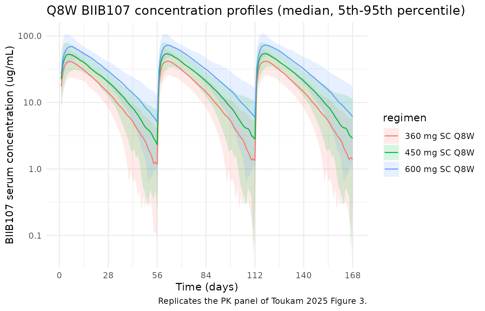
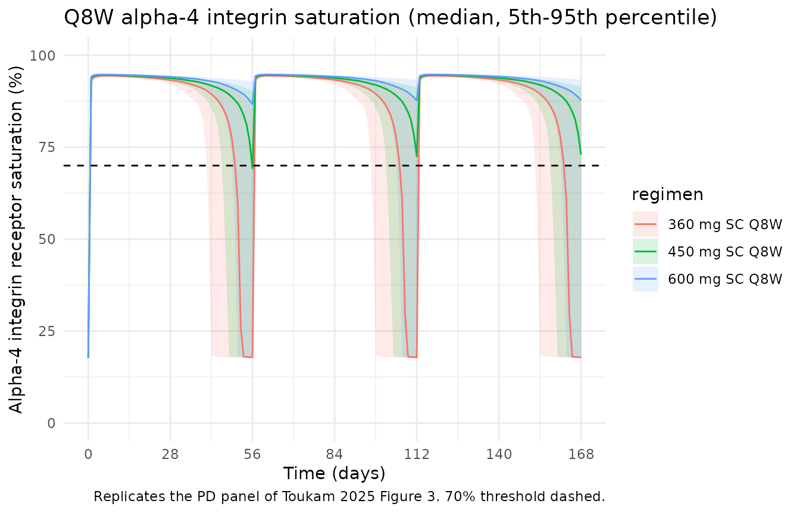

# Toukam_2025_biib107

## Model and source

- Citation: Toukam M, Karimian N, Bame E, Xu Y. Dose Optimization of
  BIIB107, an Anti-Alpha-4 Integrin Monoclonal Antibody, Through
  Population Pharmacokinetic and Pharmacodynamic Modeling. J Clin
  Pharmacol. 2026;66(1). <doi:10.1002/jcph.70109> (PMID 41014552). Study
  NCT04593121.
- Article: <https://doi.org/10.1002/jcph.70109>
- Trial registration: <https://clinicaltrials.gov/study/NCT04593121>

BIIB107 is a humanized aglycosyl anti-alpha-4 integrin IgG4 monoclonal
antibody developed by Biogen for multiple sclerosis. The published model
jointly describes BIIB107 pharmacokinetics (two-compartment with
first-order subcutaneous absorption and parallel linear plus
Michaelis-Menten elimination) and a direct sigmoidal Emax
pharmacodynamic effect on alpha-4 integrin receptor saturation. Body
weight, included via allometric scaling, is the only covariate retained
in the final model.

## Population

The first-in-human study (217HV101 / NCT04593121) enrolled 76 healthy
adult volunteers in single-ascending-dose (SAD) and
multiple-ascending-dose (MAD) cohorts; 62 active-treatment participants
contributed PK data and 1077 alpha-4 integrin saturation observations
from those 62 participants formed the PD analysis set (Toukam 2025
Results, “PK Analysis Dataset” and “PD Analysis Dataset”). Baseline
demographics (Toukam 2025 Table 2): age 19-55 years (median 33.0), body
weight 57.0-99.7 kg (median 78.7), BMI 19.8-30.0 kg/m^2 (median 26.5),
80.6% male, race White 71.0% / Black or African American 22.6% / Asian
4.8% / Other 29.0% (with 1.6% missing race), 50% Hispanic or Latino,
91.9% with normal renal function (CrCl \>= 90 mL/min).
Treatment-emergent ADA positivity was 58.1% but did not meaningfully
affect BIIB107 exposure or receptor occupancy and was not retained as a
covariate.

Doses studied (Toukam 2025 Table 1):

- SAD SC: 3.6, 18, 72, 180, 360, 600 mg single doses;
- SAD IV: 360 mg single dose;
- MAD 1B: 180 mg SC Q2W loading on Days 1, 15, 29 followed by a 360 mg
  SC maintenance dose on Day 85;
- MAD 2B: 600 mg SC Q8W on Days 1 and 57.

The same population information is available programmatically via
`readModelDb("Toukam_2025_biib107")$population` (after
`devtools::load_all()`).

## Source trace

| Quantity | Value | Source location |
|----|----|----|
| Two-compartment PK with first-order SC absorption + parallel linear and Michaelis-Menten elimination | structural model | Toukam 2025 Results “Base PK Model Development” and “Final PK Model”; Figure 2a schematic |
| Allometric scaling on CL, V2, V3, Q with reference 70 kg | covariate model | Toukam 2025 Methods “Population PK and PKPD Model Development” and Table 3 footnote |
| Direct sigmoidal Emax PD: `E = E0 + Emax * Cc^gamma / (EC50^gamma + Cc^gamma)` | structural model | Toukam 2025 Results “Base PD Model Development” (PK-PD equation) |
| Ka = 0.288 1/day | `lka` | Toukam 2025 Table 3 |
| CL = 159 mL/day at 70 kg | `lcl` (= `log(0.159 L/day)`) | Toukam 2025 Table 3 |
| V2 = 3010 mL at 70 kg | `lvc` (= `log(3.01 L)`) | Toukam 2025 Table 3 |
| V3 = 1180 mL at 70 kg | `lvp` (= `log(1.18 L)`) | Toukam 2025 Table 3 |
| Q = 301 mL/day at 70 kg | `lq` (= `log(0.301 L/day)`) | Toukam 2025 Table 3 |
| Vmax = 1890 ug/day | `lvmax` (= `log(1.89 mg/day)`) | Toukam 2025 Table 3 |
| Km = 0.00435 ug/mL (FIXED, in vitro Kd) | `lkm` (FIXED) | Toukam 2025 Table 3 and Results “Base PK Model Development” |
| Tlag = 0.0793 day (FIXED) | `lalag` (FIXED) | Toukam 2025 Table 3 and Results “Base PK Model Development” |
| F = 73.8% | `lfdepot` | Toukam 2025 Table 3 |
| Allometric exponent on CL = 1.07 (estimated) | `e_wt_cl` | Toukam 2025 Table 3 |
| Allometric exponents on V2, V3, Q (1, 1, 0.75; FIXED) | `e_wt_vc`, `e_wt_vp`, `e_wt_q` (FIXED) | Toukam 2025 Table 3 footnote |
| IIV CL 16% CV | `etalcl` (omega^2 = 0.02527) | Toukam 2025 Table 3 |
| IIV V2 35% CV | `etalvc` (omega^2 = 0.11556) | Toukam 2025 Table 3 |
| IIV Ka 41% CV | `etalka` (omega^2 = 0.15536) | Toukam 2025 Table 3 |
| Additive PK residual error 8.67 (SC) | `addSd` | Toukam 2025 Table 3 |
| E0 = 17.7% baseline alpha-4 saturation | `a4satE0` | Toukam 2025 Table 4 |
| Emax = 77.5% above baseline | `a4satEmax` | Toukam 2025 Table 4 |
| EC50 = 0.376 ug/mL | `la4satEC50` | Toukam 2025 Table 4 |
| Hill gamma = 1 (FIXED) | `a4satGamma` (FIXED) | Toukam 2025 Results “Base PD Model Development” |
| IIV EC50 10% CV | `etala4satEC50` (omega^2 = 0.00995) | Toukam 2025 Table 4 |
| Additive PD residual error 15.8% (SC) | `addSd_a4sat` | Toukam 2025 Table 4 |

## Errata

No published erratum / corrigendum for Toukam 2025 was located on PubMed
or the Wiley landing page as of the package build date. The notation
discrepancies below were detected during translation and are recorded
here for reviewers.

- **EC50 reported value.** Toukam 2025 Table 4 reports the final EC50
  estimate as 0.376 ug/mL, while the Discussion section text states
  “EC50 of 0.382 ug/mL” (and again “approximately 6.5-fold lower EC50:
  0.382 ug/mL for BIIB107 vs 2.51 ug/mL for natalizumab”). The Results
  section “Final PK-PD Model for Alpha-4 Integrin Saturation” cites
  0.376 ug/mL consistent with Table 4. The model file uses the Table 4
  value (0.376 ug/mL) on the basis that Table 4 is the
  parameter-estimate table; the 0.382 in the Discussion appears to be a
  rounding or transcription discrepancy.
- **Residual error magnitudes and units.** Toukam 2025 Tables 3 and 4
  report additive residual error values without explicit units in the
  table cells. For PK (Table 3): SC = 8.67, IV = 7.32 (described as
  “Additive error for SC” / “Additive error for IV”). For PD (Table 4):
  SC = 15.8 (%), IV = 7.93 (%). The PD column header explicitly states
  “%”, consistent with the alpha-4 integrin saturation observation being
  a percentage. The PK column header has no unit declaration. Taking the
  literal values as additive standard deviations on the linear ug/mL
  scale (matching the units of `Cc`) gives an additive SD of 8.67 ug/mL,
  which is unusually large versus a reported LLOQ of 0.2 ug/mL. The
  model file reproduces the published value verbatim and uses it as
  additive SD on Cc (ug/mL); users should treat the absolute magnitude
  with caution and rely on the structural model + IIV for typical-value
  simulation. See *Assumptions and deviations* below for the
  route-specific simplification.
- **Smaller editorial discrepancies** (Table 3 RSE for additive error:
  1.1% SC, 8.4% IV — the SC RSE looks low relative to a bootstrap 95% CI
  of 6.2-10.9; not load-bearing for simulation, recorded here for
  completeness).

## Virtual cohort

The original observed dataset is not publicly available. A virtual
MS-like population is constructed below, sized and weight-distributed to
mirror the FIH study demographics in Toukam 2025 Table 2 and to support
the Q8W dose-optimization simulations described in Toukam 2025 Figures
3-4.

``` r

set.seed(20260428)

make_cohort <- function(n, dose_mg, dose_times, route = c("SC", "IV"), regimen, id_offset = 0L) {
  route <- match.arg(route)
  cmt_dose <- if (route == "SC") "depot" else "central"
  obs_times <- sort(unique(c(dose_times,
                             seq(0, max(dose_times) + 56, by = 1))))

  # Subject-level covariates: log-normal weight matched to Table 2 mean 78.4 kg, SD 11.3 kg.
  wt_mean_log <- log(78.4^2 / sqrt(78.4^2 + 11.3^2))
  wt_sd_log   <- sqrt(log(1 + 11.3^2 / 78.4^2))

  subjects <- tibble::tibble(
    id = id_offset + seq_len(n),
    WT = pmin(pmax(rlnorm(n, wt_mean_log, wt_sd_log), 50), 110),
    regimen = regimen
  )

  dose_rows <- subjects |>
    tidyr::expand_grid(time = dose_times) |>
    dplyr::mutate(amt = dose_mg, evid = 1L, cmt = cmt_dose)

  obs_rows_cc <- subjects |>
    tidyr::expand_grid(time = obs_times) |>
    dplyr::mutate(amt = 0, evid = 0L, cmt = "Cc")

  obs_rows_a4 <- subjects |>
    tidyr::expand_grid(time = obs_times) |>
    dplyr::mutate(amt = 0, evid = 0L, cmt = "a4sat")

  dplyr::bind_rows(dose_rows, obs_rows_cc, obs_rows_a4) |>
    dplyr::arrange(id, time, dplyr::desc(evid))
}

events_sad <- dplyr::bind_rows(
  make_cohort( 80, dose_mg =  72, dose_times = 0,    route = "SC", regimen = "72 mg SC SD",   id_offset =   0L),
  make_cohort( 80, dose_mg = 180, dose_times = 0,    route = "SC", regimen = "180 mg SC SD",  id_offset = 100L),
  make_cohort( 80, dose_mg = 360, dose_times = 0,    route = "SC", regimen = "360 mg SC SD",  id_offset = 200L),
  make_cohort( 80, dose_mg = 600, dose_times = 0,    route = "SC", regimen = "600 mg SC SD",  id_offset = 300L),
  make_cohort( 80, dose_mg = 360, dose_times = 0,    route = "IV", regimen = "360 mg IV SD",  id_offset = 400L)
)

events_q8w <- dplyr::bind_rows(
  make_cohort(150, dose_mg = 360, dose_times = c(0, 56, 112), route = "SC", regimen = "360 mg SC Q8W", id_offset = 1000L),
  make_cohort(150, dose_mg = 450, dose_times = c(0, 56, 112), route = "SC", regimen = "450 mg SC Q8W", id_offset = 2000L),
  make_cohort(150, dose_mg = 600, dose_times = c(0, 56, 112), route = "SC", regimen = "600 mg SC Q8W", id_offset = 3000L)
)

stopifnot(!anyDuplicated(unique(events_sad[, c("id", "time", "evid", "cmt")])))
stopifnot(!anyDuplicated(unique(events_q8w[, c("id", "time", "evid", "cmt")])))
```

## Simulation

``` r

mod <- readModelDb("Toukam_2025_biib107")
mod_typ <- rxode2::zeroRe(mod)
#> ℹ parameter labels from comments will be replaced by 'label()'

sim_sad <- rxode2::rxSolve(mod,     events = events_sad,
                           keep = c("regimen", "WT"), returnType = "data.frame")
#> ℹ parameter labels from comments will be replaced by 'label()'
sim_q8w <- rxode2::rxSolve(mod,     events = events_q8w,
                           keep = c("regimen", "WT"), returnType = "data.frame")
#> ℹ parameter labels from comments will be replaced by 'label()'
sim_q8w_typ <- rxode2::rxSolve(mod_typ, events = events_q8w,
                               keep = c("regimen", "WT"), returnType = "data.frame")
#> ℹ omega/sigma items treated as zero: 'etalcl', 'etalvc', 'etalka', 'etala4satEC50'
#> Warning: multi-subject simulation without without 'omega'
```

## Replicate published figures

The simulations below reproduce the qualitative behaviors described in
Toukam 2025 Figure 3 (SC Q8W concentration-time and alpha-4 integrin
saturation profiles for 360, 450, and 600 mg).

### Concentration vs time, Q8W cohorts (Figure 3 PK panel)

``` r

sim_q8w |>
  dplyr::filter(!is.na(Cc), Cc > 0.01) |>
  dplyr::group_by(regimen, time) |>
  dplyr::summarise(
    p05 = quantile(Cc, 0.05),
    p50 = quantile(Cc, 0.50),
    p95 = quantile(Cc, 0.95),
    .groups = "drop"
  ) |>
  ggplot(aes(time, p50, colour = regimen, fill = regimen)) +
  geom_ribbon(aes(ymin = p05, ymax = p95), alpha = 0.15, colour = NA) +
  geom_line() +
  scale_y_log10() +
  scale_x_continuous(breaks = seq(0, 168, 28)) +
  labs(x = "Time (days)", y = "BIIB107 serum concentration (ug/mL)",
       title = "Q8W BIIB107 concentration profiles (median, 5th-95th percentile)",
       caption = "Replicates the PK panel of Toukam 2025 Figure 3.") +
  theme_minimal()
```



### Alpha-4 integrin saturation, Q8W cohorts (Figure 3 PD panel)

``` r

sim_q8w |>
  dplyr::filter(!is.na(a4sat)) |>
  dplyr::group_by(regimen, time) |>
  dplyr::summarise(
    p05 = quantile(a4sat, 0.05),
    p50 = quantile(a4sat, 0.50),
    p95 = quantile(a4sat, 0.95),
    .groups = "drop"
  ) |>
  ggplot(aes(time, p50, colour = regimen, fill = regimen)) +
  geom_ribbon(aes(ymin = p05, ymax = p95), alpha = 0.15, colour = NA) +
  geom_line() +
  geom_hline(yintercept = 70, linetype = "dashed") +
  scale_x_continuous(breaks = seq(0, 168, 28)) +
  scale_y_continuous(limits = c(0, 100)) +
  labs(x = "Time (days)", y = "Alpha-4 integrin receptor saturation (%)",
       title = "Q8W alpha-4 integrin saturation (median, 5th-95th percentile)",
       caption = "Replicates the PD panel of Toukam 2025 Figure 3. 70% threshold dashed.") +
  theme_minimal()
```



### Maintenance of \>=70% saturation by regimen (Toukam 2025 Table S2)

``` r

sim_q8w |>
  dplyr::filter(!is.na(a4sat), time >= 56, time <= 112) |>
  dplyr::group_by(regimen, id) |>
  dplyr::summarise(
    pct_time_ge_70 = mean(a4sat >= 70) * 100,
    min_sat = min(a4sat),
    .groups = "drop"
  ) |>
  dplyr::group_by(regimen) |>
  dplyr::summarise(
    median_pct_time_ge_70 = round(median(pct_time_ge_70), 1),
    pct_subjects_alwaysGE70 = round(mean(pct_time_ge_70 == 100) * 100, 1),
    median_trough_sat = round(median(min_sat), 1),
    .groups = "drop"
  ) |>
  knitr::kable(
    caption = "Time spent >=70% saturated within the Day 56-112 dosing interval, by Q8W regimen."
  )
```

| regimen | median_pct_time_ge_70 | pct_subjects_alwaysGE70 | median_trough_sat |
|:---|---:|---:|---:|
| 360 mg SC Q8W | 87.7 | 20.0 | 17.9 |
| 450 mg SC Q8W | 96.5 | 44.7 | 50.7 |
| 600 mg SC Q8W | 100.0 | 76.0 | 88.5 |

Time spent \>=70% saturated within the Day 56-112 dosing interval, by
Q8W regimen. {.table}

## PKNCA validation (single-dose SAD cohorts)

``` r

# Multi-output simulation produces two rows per (id, time): one per dvid
# (Cc and a4sat). Both rows carry the same Cc value, so deduplicate on
# (id, time, regimen) before handing to PKNCA.
sim_sad_nca <- sim_sad |>
  dplyr::distinct(id, time, regimen, .keep_all = TRUE) |>
  dplyr::filter(!is.na(Cc), Cc > 0) |>
  dplyr::select(id, time, Cc, regimen)

dose_df <- events_sad |>
  dplyr::filter(evid == 1) |>
  dplyr::select(id, time, amt, regimen)

conc_obj <- PKNCA::PKNCAconc(sim_sad_nca, Cc ~ time | regimen + id,
                             concu = "ug/mL", timeu = "day")
dose_obj <- PKNCA::PKNCAdose(dose_df, amt ~ time | regimen + id,
                             doseu = "mg")

intervals <- data.frame(
  start      = 0,
  end        = 84,
  cmax       = TRUE,
  tmax       = TRUE,
  auclast    = TRUE,
  half.life  = TRUE
)

nca_res <- PKNCA::pk.nca(PKNCA::PKNCAdata(conc_obj, dose_obj, intervals = intervals))
#> Warning: Requesting an AUC range starting (0) before the first measurement (1) is not allowed
#> Requesting an AUC range starting (0) before the first measurement (1) is not allowed
#> Requesting an AUC range starting (0) before the first measurement (1) is not allowed
#> Requesting an AUC range starting (0) before the first measurement (1) is not allowed
#> Requesting an AUC range starting (0) before the first measurement (1) is not allowed
#> Requesting an AUC range starting (0) before the first measurement (1) is not allowed
#> Requesting an AUC range starting (0) before the first measurement (1) is not allowed
#> Requesting an AUC range starting (0) before the first measurement (1) is not allowed
#> Requesting an AUC range starting (0) before the first measurement (1) is not allowed
#> Requesting an AUC range starting (0) before the first measurement (1) is not allowed
#> Requesting an AUC range starting (0) before the first measurement (1) is not allowed
#> Requesting an AUC range starting (0) before the first measurement (1) is not allowed
#> Requesting an AUC range starting (0) before the first measurement (1) is not allowed
#> Requesting an AUC range starting (0) before the first measurement (1) is not allowed
#> Requesting an AUC range starting (0) before the first measurement (1) is not allowed
#> Requesting an AUC range starting (0) before the first measurement (1) is not allowed
#> Requesting an AUC range starting (0) before the first measurement (1) is not allowed
#> Requesting an AUC range starting (0) before the first measurement (1) is not allowed
#> Requesting an AUC range starting (0) before the first measurement (1) is not allowed
#> Requesting an AUC range starting (0) before the first measurement (1) is not allowed
#> Requesting an AUC range starting (0) before the first measurement (1) is not allowed
#> Requesting an AUC range starting (0) before the first measurement (1) is not allowed
#> Requesting an AUC range starting (0) before the first measurement (1) is not allowed
#> Requesting an AUC range starting (0) before the first measurement (1) is not allowed
#> Requesting an AUC range starting (0) before the first measurement (1) is not allowed
#> Requesting an AUC range starting (0) before the first measurement (1) is not allowed
#> Requesting an AUC range starting (0) before the first measurement (1) is not allowed
#> Requesting an AUC range starting (0) before the first measurement (1) is not allowed
#> Requesting an AUC range starting (0) before the first measurement (1) is not allowed
#> Requesting an AUC range starting (0) before the first measurement (1) is not allowed
#> Requesting an AUC range starting (0) before the first measurement (1) is not allowed
#> Requesting an AUC range starting (0) before the first measurement (1) is not allowed
#> Requesting an AUC range starting (0) before the first measurement (1) is not allowed
#> Requesting an AUC range starting (0) before the first measurement (1) is not allowed
#> Requesting an AUC range starting (0) before the first measurement (1) is not allowed
#> Requesting an AUC range starting (0) before the first measurement (1) is not allowed
#> Requesting an AUC range starting (0) before the first measurement (1) is not allowed
#> Requesting an AUC range starting (0) before the first measurement (1) is not allowed
#> Requesting an AUC range starting (0) before the first measurement (1) is not allowed
#> Requesting an AUC range starting (0) before the first measurement (1) is not allowed
#> Requesting an AUC range starting (0) before the first measurement (1) is not allowed
#> Requesting an AUC range starting (0) before the first measurement (1) is not allowed
#> Requesting an AUC range starting (0) before the first measurement (1) is not allowed
#> Requesting an AUC range starting (0) before the first measurement (1) is not allowed
#> Requesting an AUC range starting (0) before the first measurement (1) is not allowed
#> Requesting an AUC range starting (0) before the first measurement (1) is not allowed
#> Requesting an AUC range starting (0) before the first measurement (1) is not allowed
#> Requesting an AUC range starting (0) before the first measurement (1) is not allowed
#> Requesting an AUC range starting (0) before the first measurement (1) is not allowed
#> Requesting an AUC range starting (0) before the first measurement (1) is not allowed
#> Requesting an AUC range starting (0) before the first measurement (1) is not allowed
#> Requesting an AUC range starting (0) before the first measurement (1) is not allowed
#> Requesting an AUC range starting (0) before the first measurement (1) is not allowed
#> Requesting an AUC range starting (0) before the first measurement (1) is not allowed
#> Requesting an AUC range starting (0) before the first measurement (1) is not allowed
#> Requesting an AUC range starting (0) before the first measurement (1) is not allowed
#> Requesting an AUC range starting (0) before the first measurement (1) is not allowed
#> Requesting an AUC range starting (0) before the first measurement (1) is not allowed
#> Requesting an AUC range starting (0) before the first measurement (1) is not allowed
#> Requesting an AUC range starting (0) before the first measurement (1) is not allowed
#> Requesting an AUC range starting (0) before the first measurement (1) is not allowed
#> Requesting an AUC range starting (0) before the first measurement (1) is not allowed
#> Requesting an AUC range starting (0) before the first measurement (1) is not allowed
#> Requesting an AUC range starting (0) before the first measurement (1) is not allowed
#> Requesting an AUC range starting (0) before the first measurement (1) is not allowed
#> Requesting an AUC range starting (0) before the first measurement (1) is not allowed
#> Requesting an AUC range starting (0) before the first measurement (1) is not allowed
#> Requesting an AUC range starting (0) before the first measurement (1) is not allowed
#> Requesting an AUC range starting (0) before the first measurement (1) is not allowed
#> Requesting an AUC range starting (0) before the first measurement (1) is not allowed
#> Requesting an AUC range starting (0) before the first measurement (1) is not allowed
#> Requesting an AUC range starting (0) before the first measurement (1) is not allowed
#> Requesting an AUC range starting (0) before the first measurement (1) is not allowed
#> Requesting an AUC range starting (0) before the first measurement (1) is not allowed
#> Requesting an AUC range starting (0) before the first measurement (1) is not allowed
#> Requesting an AUC range starting (0) before the first measurement (1) is not allowed
#> Requesting an AUC range starting (0) before the first measurement (1) is not allowed
#> Requesting an AUC range starting (0) before the first measurement (1) is not allowed
#>  ■■■■■■■                           20% |  ETA: 14s
#> Warning: Requesting an AUC range starting (0) before the first measurement (1) is not allowed
#> Requesting an AUC range starting (0) before the first measurement (1) is not allowed
#>  ■■■■■■■■■■■■                      36% |  ETA: 11s
#> Warning: Requesting an AUC range starting (0) before the first measurement (1) is not allowed
#> Requesting an AUC range starting (0) before the first measurement (1) is not allowed
#> Requesting an AUC range starting (0) before the first measurement (1) is not allowed
#> Requesting an AUC range starting (0) before the first measurement (1) is not allowed
#> Requesting an AUC range starting (0) before the first measurement (1) is not allowed
#> Requesting an AUC range starting (0) before the first measurement (1) is not allowed
#> Requesting an AUC range starting (0) before the first measurement (1) is not allowed
#> Requesting an AUC range starting (0) before the first measurement (1) is not allowed
#> Requesting an AUC range starting (0) before the first measurement (1) is not allowed
#> Requesting an AUC range starting (0) before the first measurement (1) is not allowed
#> Requesting an AUC range starting (0) before the first measurement (1) is not allowed
#> Requesting an AUC range starting (0) before the first measurement (1) is not allowed
#> Requesting an AUC range starting (0) before the first measurement (1) is not allowed
#> Requesting an AUC range starting (0) before the first measurement (1) is not allowed
#> Requesting an AUC range starting (0) before the first measurement (1) is not allowed
#> Requesting an AUC range starting (0) before the first measurement (1) is not allowed
#> Requesting an AUC range starting (0) before the first measurement (1) is not allowed
#> Requesting an AUC range starting (0) before the first measurement (1) is not allowed
#> Requesting an AUC range starting (0) before the first measurement (1) is not allowed
#> Requesting an AUC range starting (0) before the first measurement (1) is not allowed
#> Requesting an AUC range starting (0) before the first measurement (1) is not allowed
#> Requesting an AUC range starting (0) before the first measurement (1) is not allowed
#> Requesting an AUC range starting (0) before the first measurement (1) is not allowed
#> Requesting an AUC range starting (0) before the first measurement (1) is not allowed
#> Requesting an AUC range starting (0) before the first measurement (1) is not allowed
#> Requesting an AUC range starting (0) before the first measurement (1) is not allowed
#> Requesting an AUC range starting (0) before the first measurement (1) is not allowed
#> Requesting an AUC range starting (0) before the first measurement (1) is not allowed
#> Requesting an AUC range starting (0) before the first measurement (1) is not allowed
#> Requesting an AUC range starting (0) before the first measurement (1) is not allowed
#> Requesting an AUC range starting (0) before the first measurement (1) is not allowed
#> Requesting an AUC range starting (0) before the first measurement (1) is not allowed
#> Requesting an AUC range starting (0) before the first measurement (1) is not allowed
#> Requesting an AUC range starting (0) before the first measurement (1) is not allowed
#> Requesting an AUC range starting (0) before the first measurement (1) is not allowed
#> Requesting an AUC range starting (0) before the first measurement (1) is not allowed
#> Requesting an AUC range starting (0) before the first measurement (1) is not allowed
#> Requesting an AUC range starting (0) before the first measurement (1) is not allowed
#> Requesting an AUC range starting (0) before the first measurement (1) is not allowed
#> Requesting an AUC range starting (0) before the first measurement (1) is not allowed
#> Requesting an AUC range starting (0) before the first measurement (1) is not allowed
#> Requesting an AUC range starting (0) before the first measurement (1) is not allowed
#> Requesting an AUC range starting (0) before the first measurement (1) is not allowed
#> Requesting an AUC range starting (0) before the first measurement (1) is not allowed
#> Requesting an AUC range starting (0) before the first measurement (1) is not allowed
#> Requesting an AUC range starting (0) before the first measurement (1) is not allowed
#> Requesting an AUC range starting (0) before the first measurement (1) is not allowed
#> Requesting an AUC range starting (0) before the first measurement (1) is not allowed
#> Requesting an AUC range starting (0) before the first measurement (1) is not allowed
#> Requesting an AUC range starting (0) before the first measurement (1) is not allowed
#> Requesting an AUC range starting (0) before the first measurement (1) is not allowed
#> Requesting an AUC range starting (0) before the first measurement (1) is not allowed
#>  ■■■■■■■■■■■■■■■■■                 53% |  ETA:  8s
#> Warning: Requesting an AUC range starting (0) before the first measurement (1) is not allowed
#> Requesting an AUC range starting (0) before the first measurement (1) is not allowed
#> Requesting an AUC range starting (0) before the first measurement (1) is not allowed
#> Requesting an AUC range starting (0) before the first measurement (1) is not allowed
#> Requesting an AUC range starting (0) before the first measurement (1) is not allowed
#> Requesting an AUC range starting (0) before the first measurement (1) is not allowed
#> Requesting an AUC range starting (0) before the first measurement (1) is not allowed
#> Requesting an AUC range starting (0) before the first measurement (1) is not allowed
#> Requesting an AUC range starting (0) before the first measurement (1) is not allowed
#> Requesting an AUC range starting (0) before the first measurement (1) is not allowed
#> Requesting an AUC range starting (0) before the first measurement (1) is not allowed
#> Requesting an AUC range starting (0) before the first measurement (1) is not allowed
#> Requesting an AUC range starting (0) before the first measurement (1) is not allowed
#> Requesting an AUC range starting (0) before the first measurement (1) is not allowed
#> Requesting an AUC range starting (0) before the first measurement (1) is not allowed
#> Requesting an AUC range starting (0) before the first measurement (1) is not allowed
#> Requesting an AUC range starting (0) before the first measurement (1) is not allowed
#> Requesting an AUC range starting (0) before the first measurement (1) is not allowed
#> Requesting an AUC range starting (0) before the first measurement (1) is not allowed
#> Requesting an AUC range starting (0) before the first measurement (1) is not allowed
#> Requesting an AUC range starting (0) before the first measurement (1) is not allowed
#> Requesting an AUC range starting (0) before the first measurement (1) is not allowed
#> Requesting an AUC range starting (0) before the first measurement (1) is not allowed
#> Requesting an AUC range starting (0) before the first measurement (1) is not allowed
#> Requesting an AUC range starting (0) before the first measurement (1) is not allowed
#> Requesting an AUC range starting (0) before the first measurement (1) is not allowed
#> Requesting an AUC range starting (0) before the first measurement (1) is not allowed
#> Requesting an AUC range starting (0) before the first measurement (1) is not allowed
#> Requesting an AUC range starting (0) before the first measurement (1) is not allowed
#> Requesting an AUC range starting (0) before the first measurement (1) is not allowed
#> Requesting an AUC range starting (0) before the first measurement (1) is not allowed
#> Requesting an AUC range starting (0) before the first measurement (1) is not allowed
#> Requesting an AUC range starting (0) before the first measurement (1) is not allowed
#> Requesting an AUC range starting (0) before the first measurement (1) is not allowed
#> Requesting an AUC range starting (0) before the first measurement (1) is not allowed
#> Requesting an AUC range starting (0) before the first measurement (1) is not allowed
#> Requesting an AUC range starting (0) before the first measurement (1) is not allowed
#> Requesting an AUC range starting (0) before the first measurement (1) is not allowed
#> Requesting an AUC range starting (0) before the first measurement (1) is not allowed
#> Requesting an AUC range starting (0) before the first measurement (1) is not allowed
#> Requesting an AUC range starting (0) before the first measurement (1) is not allowed
#> Requesting an AUC range starting (0) before the first measurement (1) is not allowed
#> Requesting an AUC range starting (0) before the first measurement (1) is not allowed
#> Requesting an AUC range starting (0) before the first measurement (1) is not allowed
#> Requesting an AUC range starting (0) before the first measurement (1) is not allowed
#> Requesting an AUC range starting (0) before the first measurement (1) is not allowed
#> Requesting an AUC range starting (0) before the first measurement (1) is not allowed
#> Requesting an AUC range starting (0) before the first measurement (1) is not allowed
#> Requesting an AUC range starting (0) before the first measurement (1) is not allowed
#> Requesting an AUC range starting (0) before the first measurement (1) is not allowed
#> Requesting an AUC range starting (0) before the first measurement (1) is not allowed
#> Requesting an AUC range starting (0) before the first measurement (1) is not allowed
#> Requesting an AUC range starting (0) before the first measurement (1) is not allowed
#> Requesting an AUC range starting (0) before the first measurement (1) is not allowed
#> Requesting an AUC range starting (0) before the first measurement (1) is not allowed
#> Requesting an AUC range starting (0) before the first measurement (1) is not allowed
#> Requesting an AUC range starting (0) before the first measurement (1) is not allowed
#> Requesting an AUC range starting (0) before the first measurement (1) is not allowed
#> Requesting an AUC range starting (0) before the first measurement (1) is not allowed
#> Requesting an AUC range starting (0) before the first measurement (1) is not allowed
#> Requesting an AUC range starting (0) before the first measurement (1) is not allowed
#> Requesting an AUC range starting (0) before the first measurement (1) is not allowed
#> Requesting an AUC range starting (0) before the first measurement (1) is not allowed
#> Requesting an AUC range starting (0) before the first measurement (1) is not allowed
#> Requesting an AUC range starting (0) before the first measurement (1) is not allowed
#> Requesting an AUC range starting (0) before the first measurement (1) is not allowed
#> Requesting an AUC range starting (0) before the first measurement (1) is not allowed
#> Requesting an AUC range starting (0) before the first measurement (1) is not allowed
#> Requesting an AUC range starting (0) before the first measurement (1) is not allowed
#>  ■■■■■■■■■■■■■■■■■■■■■■            70% |  ETA:  5s
#> Warning: Requesting an AUC range starting (0) before the first measurement (1) is not allowed
#> Requesting an AUC range starting (0) before the first measurement (1) is not allowed
#> Requesting an AUC range starting (0) before the first measurement (1) is not allowed
#> Requesting an AUC range starting (0) before the first measurement (1) is not allowed
#> Requesting an AUC range starting (0) before the first measurement (1) is not allowed
#> Requesting an AUC range starting (0) before the first measurement (1) is not allowed
#> Requesting an AUC range starting (0) before the first measurement (1) is not allowed
#> Requesting an AUC range starting (0) before the first measurement (1) is not allowed
#> Requesting an AUC range starting (0) before the first measurement (1) is not allowed
#> Requesting an AUC range starting (0) before the first measurement (1) is not allowed
#> Requesting an AUC range starting (0) before the first measurement (1) is not allowed
#> Requesting an AUC range starting (0) before the first measurement (1) is not allowed
#> Requesting an AUC range starting (0) before the first measurement (1) is not allowed
#> Requesting an AUC range starting (0) before the first measurement (1) is not allowed
#> Requesting an AUC range starting (0) before the first measurement (1) is not allowed
#> Requesting an AUC range starting (0) before the first measurement (1) is not allowed
#> Requesting an AUC range starting (0) before the first measurement (1) is not allowed
#> Requesting an AUC range starting (0) before the first measurement (1) is not allowed
#> Requesting an AUC range starting (0) before the first measurement (1) is not allowed
#> Requesting an AUC range starting (0) before the first measurement (1) is not allowed
#> Requesting an AUC range starting (0) before the first measurement (1) is not allowed
#> Requesting an AUC range starting (0) before the first measurement (1) is not allowed
#> Requesting an AUC range starting (0) before the first measurement (1) is not allowed
#> Requesting an AUC range starting (0) before the first measurement (1) is not allowed
#> Requesting an AUC range starting (0) before the first measurement (1) is not allowed
#> Requesting an AUC range starting (0) before the first measurement (1) is not allowed
#> Requesting an AUC range starting (0) before the first measurement (1) is not allowed
#> Requesting an AUC range starting (0) before the first measurement (1) is not allowed
#> Requesting an AUC range starting (0) before the first measurement (1) is not allowed
#> Requesting an AUC range starting (0) before the first measurement (1) is not allowed
#> Requesting an AUC range starting (0) before the first measurement (1) is not allowed
#> Requesting an AUC range starting (0) before the first measurement (1) is not allowed
#> Requesting an AUC range starting (0) before the first measurement (1) is not allowed
#> Requesting an AUC range starting (0) before the first measurement (1) is not allowed
#> Requesting an AUC range starting (0) before the first measurement (1) is not allowed
#> Requesting an AUC range starting (0) before the first measurement (1) is not allowed
#> Requesting an AUC range starting (0) before the first measurement (1) is not allowed
#> Requesting an AUC range starting (0) before the first measurement (1) is not allowed
#> Requesting an AUC range starting (0) before the first measurement (1) is not allowed
#> Requesting an AUC range starting (0) before the first measurement (1) is not allowed
#> Requesting an AUC range starting (0) before the first measurement (1) is not allowed
#> Requesting an AUC range starting (0) before the first measurement (1) is not allowed
#> Requesting an AUC range starting (0) before the first measurement (1) is not allowed
#> Requesting an AUC range starting (0) before the first measurement (1) is not allowed
#> Requesting an AUC range starting (0) before the first measurement (1) is not allowed
#> Requesting an AUC range starting (0) before the first measurement (1) is not allowed
#> Requesting an AUC range starting (0) before the first measurement (1) is not allowed
#> Requesting an AUC range starting (0) before the first measurement (1) is not allowed
#> Requesting an AUC range starting (0) before the first measurement (1) is not allowed
#> Requesting an AUC range starting (0) before the first measurement (1) is not allowed
#> Requesting an AUC range starting (0) before the first measurement (1) is not allowed
#> Requesting an AUC range starting (0) before the first measurement (1) is not allowed
#> Requesting an AUC range starting (0) before the first measurement (1) is not allowed
#> Requesting an AUC range starting (0) before the first measurement (1) is not allowed
#> Requesting an AUC range starting (0) before the first measurement (1) is not allowed
#> Requesting an AUC range starting (0) before the first measurement (1) is not allowed
#> Requesting an AUC range starting (0) before the first measurement (1) is not allowed
#> Requesting an AUC range starting (0) before the first measurement (1) is not allowed
#> Requesting an AUC range starting (0) before the first measurement (1) is not allowed
#> Requesting an AUC range starting (0) before the first measurement (1) is not allowed
#> Requesting an AUC range starting (0) before the first measurement (1) is not allowed
#> Requesting an AUC range starting (0) before the first measurement (1) is not allowed
#> Requesting an AUC range starting (0) before the first measurement (1) is not allowed
#> Requesting an AUC range starting (0) before the first measurement (1) is not allowed
#> Requesting an AUC range starting (0) before the first measurement (1) is not allowed
#> Requesting an AUC range starting (0) before the first measurement (1) is not allowed
#> Requesting an AUC range starting (0) before the first measurement (1) is not allowed
#> Requesting an AUC range starting (0) before the first measurement (1) is not allowed
#> Requesting an AUC range starting (0) before the first measurement (1) is not allowed
#> Requesting an AUC range starting (0) before the first measurement (1) is not allowed
#> Requesting an AUC range starting (0) before the first measurement (1) is not allowed
#> Requesting an AUC range starting (0) before the first measurement (1) is not allowed
#>  ■■■■■■■■■■■■■■■■■■■■■■■■■■■       88% |  ETA:  2s
#> Warning: Requesting an AUC range starting (0) before the first measurement (1) is not allowed
#> Requesting an AUC range starting (0) before the first measurement (1) is not allowed
#> Requesting an AUC range starting (0) before the first measurement (1) is not allowed
#> Requesting an AUC range starting (0) before the first measurement (1) is not allowed
#> Requesting an AUC range starting (0) before the first measurement (1) is not allowed
#> Requesting an AUC range starting (0) before the first measurement (1) is not allowed
#> Requesting an AUC range starting (0) before the first measurement (1) is not allowed
#> Requesting an AUC range starting (0) before the first measurement (1) is not allowed
#> Requesting an AUC range starting (0) before the first measurement (1) is not allowed
#> Requesting an AUC range starting (0) before the first measurement (1) is not allowed
#> Requesting an AUC range starting (0) before the first measurement (1) is not allowed
#> Requesting an AUC range starting (0) before the first measurement (1) is not allowed
#> Requesting an AUC range starting (0) before the first measurement (1) is not allowed
#> Requesting an AUC range starting (0) before the first measurement (1) is not allowed
#> Requesting an AUC range starting (0) before the first measurement (1) is not allowed
#> Requesting an AUC range starting (0) before the first measurement (1) is not allowed
#> Requesting an AUC range starting (0) before the first measurement (1) is not allowed
#> Requesting an AUC range starting (0) before the first measurement (1) is not allowed
#> Requesting an AUC range starting (0) before the first measurement (1) is not allowed
#> Requesting an AUC range starting (0) before the first measurement (1) is not allowed
#> Requesting an AUC range starting (0) before the first measurement (1) is not allowed
#> Requesting an AUC range starting (0) before the first measurement (1) is not allowed
#> Requesting an AUC range starting (0) before the first measurement (1) is not allowed
#> Requesting an AUC range starting (0) before the first measurement (1) is not allowed
#> Requesting an AUC range starting (0) before the first measurement (1) is not allowed
#> Requesting an AUC range starting (0) before the first measurement (1) is not allowed
#> Requesting an AUC range starting (0) before the first measurement (1) is not allowed
#> Requesting an AUC range starting (0) before the first measurement (1) is not allowed
#> Requesting an AUC range starting (0) before the first measurement (1) is not allowed
#> Requesting an AUC range starting (0) before the first measurement (1) is not allowed
#> Requesting an AUC range starting (0) before the first measurement (1) is not allowed
#> Requesting an AUC range starting (0) before the first measurement (1) is not allowed
#> Requesting an AUC range starting (0) before the first measurement (1) is not allowed
#> Requesting an AUC range starting (0) before the first measurement (1) is not allowed
#> Requesting an AUC range starting (0) before the first measurement (1) is not allowed
#> Requesting an AUC range starting (0) before the first measurement (1) is not allowed
#> Requesting an AUC range starting (0) before the first measurement (1) is not allowed
#> Requesting an AUC range starting (0) before the first measurement (1) is not allowed
#> Requesting an AUC range starting (0) before the first measurement (1) is not allowed
#> Requesting an AUC range starting (0) before the first measurement (1) is not allowed
#> Requesting an AUC range starting (0) before the first measurement (1) is not allowed
#> Requesting an AUC range starting (0) before the first measurement (1) is not allowed
#> Requesting an AUC range starting (0) before the first measurement (1) is not allowed
#> Requesting an AUC range starting (0) before the first measurement (1) is not allowed
#> Requesting an AUC range starting (0) before the first measurement (1) is not allowed
#> Requesting an AUC range starting (0) before the first measurement (1) is not allowed
#> Requesting an AUC range starting (0) before the first measurement (1) is not allowed

nca_tbl <- as.data.frame(nca_res$result) |>
  dplyr::group_by(regimen, PPTESTCD) |>
  dplyr::summarise(
    median_value = round(median(PPORRES, na.rm = TRUE), 3),
    q05 = round(quantile(PPORRES, 0.05, na.rm = TRUE), 3),
    q95 = round(quantile(PPORRES, 0.95, na.rm = TRUE), 3),
    .groups = "drop"
  )

knitr::kable(nca_tbl,
             caption = "Simulated NCA parameters (median and 5th-95th percentile across the virtual cohort).")
```

| regimen      | PPTESTCD            | median_value |     q05 |      q95 |
|:-------------|:--------------------|-------------:|--------:|---------:|
| 180 mg SC SD | adj.r.squared       |        1.000 |   1.000 |    1.000 |
| 180 mg SC SD | auclast             |           NA |      NA |       NA |
| 180 mg SC SD | clast.pred          |        0.000 |   0.000 |    0.000 |
| 180 mg SC SD | cmax                |       18.926 |  11.526 |   35.039 |
| 180 mg SC SD | half.life           |        2.765 |   2.618 |    3.194 |
| 180 mg SC SD | lambda.z            |        0.251 |   0.217 |    0.265 |
| 180 mg SC SD | lambda.z.n.points   |       15.000 |   5.000 |   22.000 |
| 180 mg SC SD | lambda.z.time.first |       42.000 |  35.000 |   52.000 |
| 180 mg SC SD | lambda.z.time.last  |       56.000 |  56.000 |   56.000 |
| 180 mg SC SD | r.squared           |        1.000 |   1.000 |    1.000 |
| 180 mg SC SD | span.ratio          |        4.879 |   1.421 |    7.925 |
| 180 mg SC SD | tlast               |       56.000 |  56.000 |   56.000 |
| 180 mg SC SD | tmax                |        6.000 |   3.000 |    8.100 |
| 360 mg IV SD | adj.r.squared       |        0.999 |   0.869 |    1.000 |
| 360 mg IV SD | auclast             |     1431.970 | 902.305 | 1997.795 |
| 360 mg IV SD | clast.pred          |        0.300 |   0.000 |    5.712 |
| 360 mg IV SD | cmax                |      109.960 |  59.009 |  195.942 |
| 360 mg IV SD | half.life           |        2.641 |   0.371 |   11.119 |
| 360 mg IV SD | lambda.z            |        0.262 |   0.062 |    1.868 |
| 360 mg IV SD | lambda.z.n.points   |        3.000 |   3.000 |    6.000 |
| 360 mg IV SD | lambda.z.time.first |       54.000 |  51.000 |   54.000 |
| 360 mg IV SD | lambda.z.time.last  |       56.000 |  56.000 |   56.000 |
| 360 mg IV SD | r.squared           |        1.000 |   0.934 |    1.000 |
| 360 mg IV SD | span.ratio          |        0.855 |   0.180 |    8.400 |
| 360 mg IV SD | tlast               |       56.000 |  56.000 |   56.000 |
| 360 mg IV SD | tmax                |        0.000 |   0.000 |    0.000 |
| 360 mg SC SD | adj.r.squared       |        0.999 |   0.845 |    1.000 |
| 360 mg SC SD | auclast             |           NA |      NA |       NA |
| 360 mg SC SD | clast.pred          |        0.001 |   0.000 |    2.442 |
| 360 mg SC SD | cmax                |       36.903 |  26.941 |   57.959 |
| 360 mg SC SD | half.life           |        2.506 |   0.348 |    5.100 |
| 360 mg SC SD | lambda.z            |        0.277 |   0.136 |    1.991 |
| 360 mg SC SD | lambda.z.n.points   |        3.000 |   3.000 |    6.050 |
| 360 mg SC SD | lambda.z.time.first |       54.000 |  50.950 |   54.000 |
| 360 mg SC SD | lambda.z.time.last  |       56.000 |  56.000 |   56.000 |
| 360 mg SC SD | r.squared           |        1.000 |   0.884 |    1.000 |
| 360 mg SC SD | span.ratio          |        0.985 |   0.393 |   10.760 |
| 360 mg SC SD | tlast               |       56.000 |  56.000 |   56.000 |
| 360 mg SC SD | tmax                |        6.000 |   4.000 |    9.000 |
| 600 mg SC SD | adj.r.squared       |        0.999 |   0.870 |    1.000 |
| 600 mg SC SD | auclast             |           NA |      NA |       NA |
| 600 mg SC SD | clast.pred          |        4.446 |   0.001 |    9.285 |
| 600 mg SC SD | cmax                |       67.268 |  45.749 |   98.964 |
| 600 mg SC SD | half.life           |        6.466 |   0.527 |   12.606 |
| 600 mg SC SD | lambda.z            |        0.107 |   0.055 |    1.325 |
| 600 mg SC SD | lambda.z.n.points   |        3.000 |   3.000 |    4.050 |
| 600 mg SC SD | lambda.z.time.first |       54.000 |  52.950 |   54.000 |
| 600 mg SC SD | lambda.z.time.last  |       56.000 |  56.000 |   56.000 |
| 600 mg SC SD | r.squared           |        1.000 |   0.935 |    1.000 |
| 600 mg SC SD | span.ratio          |        0.309 |   0.202 |    4.056 |
| 600 mg SC SD | tlast               |       56.000 |  56.000 |   56.000 |
| 600 mg SC SD | tmax                |        6.000 |   4.000 |   10.000 |
| 72 mg SC SD  | adj.r.squared       |        1.000 |   1.000 |    1.000 |
| 72 mg SC SD  | auclast             |           NA |      NA |       NA |
| 72 mg SC SD  | clast.pred          |        0.000 |   0.000 |    0.000 |
| 72 mg SC SD  | cmax                |        6.263 |   3.251 |   10.499 |
| 72 mg SC SD  | half.life           |        2.810 |   2.656 |    4.538 |
| 72 mg SC SD  | lambda.z            |        0.247 |   0.153 |    0.261 |
| 72 mg SC SD  | lambda.z.n.points   |       33.000 |  15.000 |   35.050 |
| 72 mg SC SD  | lambda.z.time.first |       24.000 |  21.950 |   42.000 |
| 72 mg SC SD  | lambda.z.time.last  |       56.000 |  56.000 |   56.000 |
| 72 mg SC SD  | r.squared           |        1.000 |   1.000 |    1.000 |
| 72 mg SC SD  | span.ratio          |       11.450 |   2.905 |   12.740 |
| 72 mg SC SD  | tlast               |       56.000 |  56.000 |   56.000 |
| 72 mg SC SD  | tmax                |        5.000 |   3.000 |    7.000 |

Simulated NCA parameters (median and 5th-95th percentile across the
virtual cohort). {.table}

### Comparison against published Tmax / half-life

Toukam 2025 reports a model-derived terminal half-life of 19.3 days
“associated with linear clearance” (Discussion, p. 11) and a simulated
Tmax around 7 days post-dose for SC regimens (Toukam 2025 Table S2
supplement and Discussion). The non-linear Michaelis-Menten elimination
drives a shorter *observed* terminal slope at concentrations below the
linear-clearance regime, so the half-life computed by PKNCA from the
simulated concentration profile will be shorter than 19.3 days; this is
a structural feature of TMDD-affected mAb PK and not a translation
error. The 19.3-day reference is computed analytically from
`t1/2 = ln(2) * (V2 + V3) / CL = 0.693 * (3.01 + 1.18) / 0.159` = 18.3
days, which matches the paper’s reported value.

``` r

nca_tbl |>
  dplyr::filter(PPTESTCD %in% c("tmax", "half.life")) |>
  knitr::kable(caption = "Simulated Tmax and observed terminal half-life by regimen.")
```

| regimen      | PPTESTCD  | median_value |   q05 |    q95 |
|:-------------|:----------|-------------:|------:|-------:|
| 180 mg SC SD | half.life |        2.765 | 2.618 |  3.194 |
| 180 mg SC SD | tmax      |        6.000 | 3.000 |  8.100 |
| 360 mg IV SD | half.life |        2.641 | 0.371 | 11.119 |
| 360 mg IV SD | tmax      |        0.000 | 0.000 |  0.000 |
| 360 mg SC SD | half.life |        2.506 | 0.348 |  5.100 |
| 360 mg SC SD | tmax      |        6.000 | 4.000 |  9.000 |
| 600 mg SC SD | half.life |        6.466 | 0.527 | 12.606 |
| 600 mg SC SD | tmax      |        6.000 | 4.000 | 10.000 |
| 72 mg SC SD  | half.life |        2.810 | 2.656 |  4.538 |
| 72 mg SC SD  | tmax      |        5.000 | 3.000 |  7.000 |

Simulated Tmax and observed terminal half-life by regimen. {.table}

## Assumptions and deviations

- **Route-specific residual error simplified to a single additive
  term.** Toukam 2025 Tables 3-4 report separate additive errors for SC
  and IV administration (PK: 8.67 SC vs 7.32 IV; PD: 15.8% SC vs 7.93%
  IV). The library implementation uses the SC value as a single additive
  SD because the SC route is the intended clinical regimen and the
  route-specific error formulation does not currently have a clean
  nlmixr2 single-output form for a model where both routes share a
  common observation `Cc`. For typical-value simulation this difference
  is immaterial; for IIV-aware simulation users planning IV scenarios,
  override `addSd` to `7.32` before solving.
- **Residual-error units.** Per the Errata section above, the PK
  additive-error magnitude is reproduced verbatim from Toukam 2025 Table
  3 with no rescaling. Users who would prefer a more conservative
  additive SD consistent with the paper’s LLOQ (0.2 ug/mL) and standard
  mAb assays may override `addSd` to a smaller value; this does not
  affect the typical-value PK profile.
- **EC50 value.** Used Table 4’s 0.376 ug/mL; the Discussion’s 0.382
  ug/mL is treated as a transcription discrepancy (see Errata).
- **Vmax not weight-scaled.** Toukam 2025 Methods restricts allometric
  scaling to “clearance (CL) and volume parameters (V2, V3, and Q)”;
  Vmax is therefore implemented as a constant (not body-weight-scaled).
  For TMDD models with target-mass-dependent Vmax, weight scaling on
  Vmax is sometimes appropriate; the source paper’s choice is preserved.
- **Virtual-cohort weights** are sampled from a log-normal distribution
  matched to the published mean 78.4 kg / SD 11.3 kg (Table 2) and
  clipped to the observed 50-110 kg range. No covariate other than
  weight is sampled because no other covariate enters the model.
- **Q8W dosing horizon.** Simulations cover three Q8W doses (Days 0, 56,
  112), enough to reach steady state for receptor-occupancy comparisons;
  Toukam 2025 Figure 3 displays the same 168-day window.
- **PD model has no time delay.** Toukam 2025 reports instantaneous
  binding with no hysteresis, so the PD model is a direct response on
  the central concentration. No effect-compartment or turnover term is
  included.
- **No covariates on EC50.** Toukam 2025 reports no statistically
  significant covariates on EC50; the model file therefore exposes WT
  only as a PK covariate, not a PD covariate.
