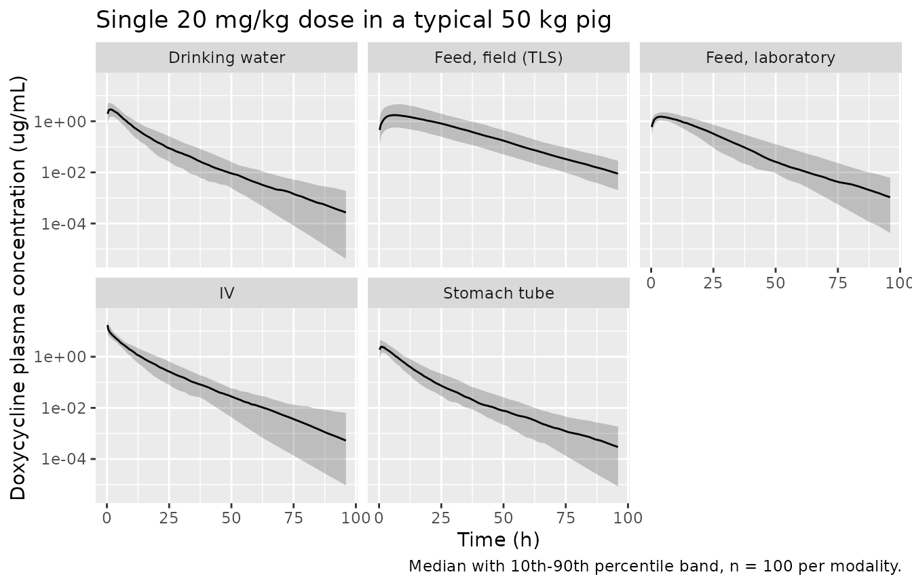

# Doxycycline in pigs (Toutain 2025)

## Model and source

    #> ℹ parameter labels from comments will be replaced by 'label()'

- Citation: Toutain PL, Bousquet-Melou A, Ferran AA, Roques BB, del
  Castillo JRE, Lees P, Croubels S, Bousquet E, Pelligand L.
  Pharmacokinetic-pharmacodynamic cutoff values for doxycycline in pigs
  to support the establishment of clinical breakpoints for antimicrobial
  susceptibility testing. J Vet Pharmacol Ther. 2025;48(4):300-317.
  <doi:10.1111/jvp.13511>

- Description: Preclinical (pig). Three-compartment population PK
  meta-analysis of doxycycline in pigs, parameterised per kg body
  weight, with a body-weight power model on the three clearances and the
  deep peripheral volume and four oral administration modalities
  (medicated feed under field or laboratory conditions, drinking water,
  stomach tube) each carrying its own absorption rate constant,
  bioavailability and residual error (Toutain 2025)

- Article: <https://doi.org/10.1111/jvp.13511>

- Supplement (Appendix S1 raw data, Appendix S2 figures, Appendix S3
  commented Phoenix script, Table S1 Monte Carlo results):
  <https://doi.org/10.1111/jvp.13511> (supporting information)

This is the VetCAST meta-analysis that underpins the European PK/PD
cutoff for doxycycline in pigs. Individual raw plasma concentration-time
data from eleven trials were re-analysed with a single non-linear
mixed-effect model rather than by Monte Carlo simulation from published
summary statistics, which is why it is a genuine population model and
not a literature review.

## Population

The meta-analysis pooled 3295 plasma doxycycline concentrations from 380
analyzable data sets contributed by 300 pigs weighing 8.5 to 100.6 kg
(median 44.15 kg), studied in eleven trials in France, the Netherlands
and Belgium (Toutain 2025 Table 1). Five trials were published and six
were unpublished marketing-authorisation studies. Fifty-seven data sets
came from single intravenous doses of 5 to 10.5 mg/kg through an
indwelling catheter; 265 came from doxycycline in medicated feed at 2.4
to 13.3 mg/kg per administration; and 58 came from an aqueous
doxycycline solution given either spontaneously in drinking water or by
oro-gastric (“stomach”) tube. The largest single cohort is the 215-pig
TLS field trial, dosed in feed under on-farm conditions with sparse
sampling.

Sex was near balanced (148 female, 145 male or castrated, 7 unknown). In
the TLS field trial 146 pigs were assessed as healthy and 66 as sick;
health status was tested as a covariate on bioavailability and was not
significant, so it does not appear in the final model. Doses are
expressed as doxycycline base throughout.

| Field | Value |
|:---|:---|
| species | pig (Sus scrofa domesticus; piglets to finishing pigs) |
| n_subjects | 300 |
| n_datasets | 380 |
| n_observations | 3295 |
| n_studies | 11 |
| weight_range | 8.5-100.6 kg |
| weight_median | 44.15 kg |
| sex_female_pct | 49.3 |
| disease_state | Mostly healthy production pigs; in the 215-pig TLS field trial 146 pigs were assessed as healthy and 66 as sick. Health status was tested as a covariate on bioavailability and was not significant, so it is absent from the final model. |
| dose_range | IV 5-10.5 mg/kg single dose (57 data sets); oral in medicated feed 2.4-13.3 mg/kg per administration (265 data sets, single dose to 15 administrations at 12 h intervals); oral solution 8.68-10.59 mg/kg by stomach tube or in drinking water (58 data sets) |
| regions | France (6 trials), the Netherlands (4 trials), Belgium (1 trial) |
| sampling | 3295 plasma samples analysed by HPLC-UV or HPLC-MS/MS with LLOQ 0.025-0.2 ug/mL; 2% of samples were below LLOQ and were discarded for the final analysis. Rich sampling (8-15 samples per pig over 12-48 h) in the laboratory trials; sparse sampling (one pre-dose plus 5-6 post-dose samples) in the 215-pig TLS field trial. |
| reference_subject | 50 kg body weight (rounded observed median), the scaling factor of the body-weight power model. |
| notes | VetCAST meta-analysis of raw individual plasma concentration-time data from 11 trials (5 published, 6 unpublished marketing-authorisation trials); the same pigs were dosed on 2 or 3 occasions in the laboratory trials and each data set was treated as a separate individual, giving 380 analyzable data sets from 300 pigs. Doses are expressed as doxycycline base. Estimation was FOCE ELS in Phoenix NLME 8.3 with standard errors from a QRPEM re-run; the model was used to compute PK/PD cutoffs from fAUC/MIC with an unbound fraction of 0.31 (Portugal 2023). |

Population metadata carried in the model file. {.table}

## Source trace

Every `ini()` entry carries an in-file comment naming its source
location in `inst/modeldb/specificDrugs/Toutain_2025_doxycycline_pig.R`.
The table below collects them.

| Equation / parameter | Value | Source location |
|----|----|----|
| Three-compartment disposition ODEs | n/a | Figure 5; Appendix S3 Phoenix script block A |
| Body-weight power model `theta_pop * (WT/50)^theta_BW` | n/a | Equation 1 (Methods 2.3.2) |
| `lvc` (Vc) | 0.191853 L/kg | Table 4 (0.192); Appendix S3 `tvVc(freeze)` |
| `lvp` (V2) | 0.594965 L/kg | Table 4 (0.595); Appendix S3 `tvV2(freeze)` |
| `lvp2` (V3) | 0.535787 L/kg | Table 4 (0.536); Appendix S3 `tvV3(freeze)` |
| `lcl` (Cl) | 0.259372 L/kg/h | Table 4 (0.259); Appendix S3 `tvClearance(freeze)` |
| `lq` (Cl2) | 1.178710 L/kg/h | Table 4 (1.179); Appendix S3 `tvCld2(freeze)` |
| `lq2` (Cl3) | 0.072330 L/kg/h | Table 4 (0.072); Appendix S3 `tvCld3(freeze)` |
| `e_wt_cl` | 0.299259 | Table 4 Cov BWCl (0.299) |
| `e_wt_q` | -0.224036 | Table 4 Cov BWCl2 (-0.224) |
| `e_wt_q2` | -0.544271 | Table 4 Cov BWCl3 (-0.544) |
| `e_wt_vp2` | 0.375752 | Table 4 CovBWV3 (0.376) |
| `lka_feedfield`, `lfdepot_feedfield` | 0.071983 1/h, 0.500573 | Table 6 (0.072, 0.501) |
| `lka_feedlab`, `lfdepot_feedlab` | 0.143923 1/h, 0.339942 | Table 6 (0.144, 0.340) |
| `lka_water`, `lfdepot_water` | 0.688750 1/h, 0.307407 | Table 6 (0.689, 0.307) |
| `lka_tube`, `lfdepot_tube` | 0.724820 1/h, 0.258107 | Table 6 (0.725, 0.258) |
| 6x6 disposition OMEGA block | see model file | Appendix S3 `ranef(block(nVc, nClearance, nV2, nV3, nCld2, nCld3))`; diagonal reproduces Table 6 BSV% |
| 2x2 Ka / F OMEGA blocks | see model file | Appendix S3 blocks B-E; diagonals reproduce Table 6 BSV% |
| Residual error (additive + proportional per modality) | see model file | Table 6 CMultStdev rows and stdev0-stdev4 rows |
| Unbound fraction 0.31 used for fAUC | 0.31 | Section 4 and Appendix S3 `deriv(AUCOR_... = 0.31 * Cplasma...)`; from Portugal 2023 |

The full-precision values in the model file come from the commented
Phoenix control stream deposited as Appendix S3; each rounds to the
value printed in the corresponding table.

## Structural identities from the published tables

Three identities that the paper computes itself (Phoenix `secondary()`
statements in Appendix S3) can be checked against the packaged `ini()`
without any simulation. They are exact, so any transcription error would
show immediately.

``` r

th <- setNames(ui$theta, names(ui$theta))
p <- function(nm) unname(exp(th[[nm]]))

# 1. Mean absorption time MAT = 1 / Ka, per modality (Toutain 2025 Table 6).
mat <- tibble::tibble(
  Modality = c("Feed, field (TLS)", "Feed, laboratory", "Drinking water",
               "Stomach tube"),
  Model = 1 / c(p("lka_feedfield"), p("lka_feedlab"), p("lka_water"),
                p("lka_tube")),
  Published = c(13.89, 6.95, 1.45, 1.38)
)

# 2. AUC for a 20 mg/kg dose in a typical 50 kg pig = F * 20 / Cl
#    (Toutain 2025 Table 6 'AUC_... for a dose of 20mg/kg').
cl50 <- p("lcl")
auc20 <- tibble::tibble(
  Modality = mat$Modality,
  Model = c(p("lfdepot_feedfield"), p("lfdepot_feedlab"), p("lfdepot_water"),
            p("lfdepot_tube")) * 20 / cl50,
  Published = c(38.6, 26.2, 23.7, 19.9)
)

dplyr::bind_rows(
  mat |> dplyr::mutate(Quantity = "MAT (h)"),
  auc20 |> dplyr::mutate(Quantity = "AUC at 20 mg/kg, 50 kg (ug*h/mL)")
) |>
  dplyr::mutate(`% diff` = 100 * (Model - Published) / Published) |>
  dplyr::relocate(Quantity) |>
  dplyr::rename("Published (Table 6)" = Published) |>
  knitr::kable(digits = 2,
               caption = "Identities computed directly from ini(): mean absorption time and 20 mg/kg AUC.")
```

| Quantity | Modality | Model | Published (Table 6) | % diff |
|:---|:---|---:|---:|---:|
| MAT (h) | Feed, field (TLS) | 13.89 | 13.89 | 0.01 |
| MAT (h) | Feed, laboratory | 6.95 | 6.95 | -0.03 |
| MAT (h) | Drinking water | 1.45 | 1.45 | 0.13 |
| MAT (h) | Stomach tube | 1.38 | 1.38 | -0.03 |
| AUC at 20 mg/kg, 50 kg (ug\*h/mL) | Feed, field (TLS) | 38.60 | 38.60 | 0.00 |
| AUC at 20 mg/kg, 50 kg (ug\*h/mL) | Feed, laboratory | 26.21 | 26.20 | 0.05 |
| AUC at 20 mg/kg, 50 kg (ug\*h/mL) | Drinking water | 23.70 | 23.70 | 0.02 |
| AUC at 20 mg/kg, 50 kg (ug\*h/mL) | Stomach tube | 19.90 | 19.90 | 0.01 |

Identities computed directly from ini(): mean absorption time and 20
mg/kg AUC. {.table style="width:100%;"}

``` r


stopifnot(all(abs(mat$Model - mat$Published) / mat$Published < 0.01))
stopifnot(all(abs(auc20$Model - auc20$Published) / auc20$Published < 0.01))
```

### Body-weight scaling and secondary disposition parameters (Table 5)

``` r

secondary_pk <- function(wt) {
  cl <- p("lcl") * (wt / 50)^th[["e_wt_cl"]]
  q <- p("lq") * (wt / 50)^th[["e_wt_q"]]
  q2 <- p("lq2") * (wt / 50)^th[["e_wt_q2"]]
  vp2 <- p("lvp2") * (wt / 50)^th[["e_wt_vp2"]]
  vc <- p("lvc")
  vp <- p("lvp")
  kel <- cl / vc; k12 <- q / vc; k21 <- q / vp; k13 <- q2 / vc; k31 <- q2 / vp2
  a2 <- kel + k12 + k13 + k21 + k31
  a1 <- kel * k21 + kel * k31 + k12 * k31 + k13 * k21 + k21 * k31
  a0 <- kel * k21 * k31
  # roots of lambda^3 - a2 lambda^2 + a1 lambda - a0 = 0
  lam <- sort(Re(polyroot(c(-a0, a1, -a2, 1))))
  vss <- vc + vp + vp2
  c(Cl = cl, Cl2 = q, Cl3 = q2, Vc = vc, V2 = vp, V3 = vp2,
    `Half-life` = log(2) / lam[1], Vss = vss, MRTIV = vss / cl)
}

model_tab <- vapply(c(10, 50, 100), secondary_pk, numeric(9))
colnames(model_tab) <- c("10 kg", "50 kg", "100 kg")

published_tab <- matrix(
  c(0.161, 0.259, 0.320,
    1.692, 1.179, 1.010,
    0.178, 0.072, 0.050,
    0.192, 0.192, 0.192,
    0.595, 0.595, 0.595,
    0.295, 0.376, 0.699,
    5.160, 7.327, 11.47,
    1.08, 1.21, 1.49,
    6.73, 4.68, 4.66),
  nrow = 9, byrow = TRUE,
  dimnames = list(rownames(model_tab), colnames(model_tab))
)

table5 <- cbind(
  tibble::tibble(Parameter = rownames(model_tab)),
  as.data.frame(round(model_tab, 3)) |> setNames(paste("Model", colnames(model_tab))),
  as.data.frame(published_tab) |> setNames(paste("Table 5", colnames(published_tab)))
)
rownames(table5) <- NULL
knitr::kable(table5, digits = 3, row.names = FALSE,
             caption = "Model-derived secondary parameters vs Toutain 2025 Table 5.")
```

| Parameter | Model 10 kg | Model 50 kg | Model 100 kg | Table 5 10 kg | Table 5 50 kg | Table 5 100 kg |
|:---|---:|---:|---:|---:|---:|---:|
| Cl | 0.160 | 0.259 | 0.319 | 0.161 | 0.259 | 0.320 |
| Cl2 | 1.690 | 1.179 | 1.009 | 1.692 | 1.179 | 1.010 |
| Cl3 | 0.174 | 0.072 | 0.050 | 0.178 | 0.072 | 0.050 |
| Vc | 0.192 | 0.192 | 0.192 | 0.192 | 0.192 | 0.192 |
| V2 | 0.595 | 0.595 | 0.595 | 0.595 | 0.595 | 0.595 |
| V3 | 0.293 | 0.536 | 0.695 | 0.295 | 0.376 | 0.699 |
| Half-life | 5.167 | 7.191 | 11.497 | 5.160 | 7.327 | 11.470 |
| Vss | 1.079 | 1.323 | 1.482 | 1.080 | 1.210 | 1.490 |
| MRTIV | 6.737 | 5.099 | 4.643 | 6.730 | 4.680 | 4.660 |

Model-derived secondary parameters vs Toutain 2025 Table 5. {.table
style="width:100%;"}

Every cell agrees to rounding **except** the 50 kg column of `V3`, `Vss`
and `MRTIV`. Table 5 prints `V3 = 0.376` at 50 kg, which is the value of
the covariate exponent `CovBWV3` (0.376, Table 4), not a volume: the 50
kg reference value of V3 is 0.536 (Table 4 and the frozen `tvV3` of the
Appendix S3 script). The printed `Vss` and `MRTIV` at 50 kg follow from
the same slip. The terminal half-life falsifies the misprint on its own:

``` r

halflife_with_v3 <- function(v3_50) {
  cl <- p("lcl"); q <- p("lq"); q2 <- p("lq2"); vc <- p("lvc"); vp <- p("lvp")
  kel <- cl / vc; k12 <- q / vc; k21 <- q / vp; k13 <- q2 / vc; k31 <- q2 / v3_50
  a2 <- kel + k12 + k13 + k21 + k31
  a1 <- kel * k21 + kel * k31 + k12 * k31 + k13 * k21 + k21 * k31
  a0 <- kel * k21 * k31
  log(2) / min(sort(Re(polyroot(c(-a0, a1, -a2, 1)))))
}
tibble::tibble(
  `V3 at 50 kg (L/kg)` = c(0.536, 0.376),
  Source = c("Table 4 / Appendix S3 tvV3", "Table 5 50 kg column (misprint)"),
  `Terminal half-life (h)` = c(halflife_with_v3(0.535786748090738),
                               halflife_with_v3(0.376))
) |>
  knitr::kable(digits = 2,
               caption = "Only V3 = 0.536 reproduces the published 50 kg half-life of 7.327 h (Table 5, Abstract 7.33 h).")
```

| V3 at 50 kg (L/kg) | Source                          | Terminal half-life (h) |
|-------------------:|:--------------------------------|-----------------------:|
|               0.54 | Table 4 / Appendix S3 tvV3      |                   7.19 |
|               0.38 | Table 5 50 kg column (misprint) |                   5.32 |

Only V3 = 0.536 reproduces the published 50 kg half-life of 7.327 h
(Table 5, Abstract 7.33 h). {.table}

## Virtual cohort

Original observed data are not publicly available in analysable form
(Appendix S1 is an Excel sheet of the raw concentrations, not
redistributed here). The cohorts below are virtual populations built
from the model.

``` r

set.seed(20250613)

modalities <- tibble::tribble(
  ~modality,            ~ROUTE_IV, ~FORM_DOX_FEED, ~STUDY_TLS, ~ROUTE_NGT, ~dose_cmt,
  "IV",                 1,         0,              0,          0,          "central",
  "Feed, field (TLS)",  0,         1,              1,          0,          "depot",
  "Feed, laboratory",   0,         1,              0,          0,          "depot",
  "Drinking water",     0,         0,              0,          0,          "depot",
  "Stomach tube",       0,         0,              0,          1,          "depot"
)

# One arm: n pigs of a single body weight receiving `dose` mg/kg at `dose_times`.
make_arm <- function(row, n, wt, dose, dose_times, obs_times, id_offset) {
  ids <- id_offset + seq_len(n)
  doses <- tidyr::expand_grid(id = ids, time = dose_times) |>
    dplyr::mutate(amt = dose, evid = 1L, cmt = row$dose_cmt)
  obs <- tidyr::expand_grid(id = ids, time = obs_times) |>
    dplyr::mutate(amt = NA_real_, evid = 0L, cmt = "central")
  dplyr::bind_rows(doses, obs) |>
    dplyr::mutate(
      WT = wt, ROUTE_IV = row$ROUTE_IV, FORM_DOX_FEED = row$FORM_DOX_FEED,
      STUDY_TLS = row$STUDY_TLS, ROUTE_NGT = row$ROUTE_NGT,
      modality = row$modality, WTgroup = wt, dose_mgkg = dose
    ) |>
    dplyr::arrange(id, time, dplyr::desc(evid))
}

n_arm <- 100L
obs_grid <- sort(unique(c(seq(0, 12, by = 0.25), seq(12, 96, by = 0.5))))
events <- dplyr::bind_rows(lapply(seq_len(nrow(modalities)), function(i) {
  make_arm(modalities[i, ], n = n_arm, wt = 50, dose = 20,
           dose_times = 0, obs_times = obs_grid,
           id_offset = (i - 1L) * n_arm)
}))
stopifnot(!anyDuplicated(unique(events[, c("id", "time", "evid")])))
```

## Simulation

``` r

mod <- readModelDb("Toutain_2025_doxycycline_pig")
sim <- rxode2::rxSolve(
  mod, events = events,
  keep = c("modality", "WTgroup", "dose_mgkg"),
  useLinCmt = FALSE
) |>
  as.data.frame()
#> ℹ parameter labels from comments will be replaced by 'label()'
stopifnot(dplyr::n_distinct(sim$id) == nrow(modalities) * n_arm)
```

### Concentration-time profiles by administration modality

``` r

# The paper's Figures 2-4 are spaghetti plots of the observed data, one figure
# per administration modality. The panel below shows the same contrast as
# model-predicted percentiles after a single 20 mg/kg dose in a 50 kg pig.
sim |>
  dplyr::filter(!is.na(Cc), time > 0) |>
  dplyr::group_by(modality, time) |>
  dplyr::summarise(
    Q10 = quantile(Cc, 0.10), Q50 = quantile(Cc, 0.50),
    Q90 = quantile(Cc, 0.90), .groups = "drop"
  ) |>
  ggplot(aes(time, Q50)) +
  geom_ribbon(aes(ymin = Q10, ymax = Q90), alpha = 0.25) +
  geom_line() +
  facet_wrap(~modality, nrow = 2) +
  scale_y_log10() +
  labs(x = "Time (h)", y = "Doxycycline plasma concentration (ug/mL)",
       title = "Single 20 mg/kg dose in a typical 50 kg pig",
       caption = "Median with 10th-90th percentile band, n = 100 per modality.")
```



The two feed modalities are absorption-rate-limited: with
`Ka = 0.072 1/h` in the field trial the mean absorption time (13.9 h)
exceeds the disposition half-life (7.3 h), so the apparent terminal
slope is the absorption slope (flip-flop kinetics). The two
aqueous-solution modalities absorb roughly ten times faster.

## PKNCA validation

The Phoenix script computes each modality’s 20 mg/kg AUC as
`F * 20 / Cl` (Appendix S3 `secondary(AUC_... )`). Reproducing those
values by non-compartmental analysis of a typical-value simulation is an
end-to-end check of the ODE system, the bioavailability assignment and
the per-kg unit convention at once.

``` r

mod_typ <- mod |> rxode2::zeroRe()
#> ℹ parameter labels from comments will be replaced by 'label()'
#> Warning: No sigma parameters in the model
events_typ <- events |> dplyr::filter(id %% n_arm == 1L)
sim_typ <- rxode2::rxSolve(mod_typ, events = events_typ,
                           keep = c("modality"), useLinCmt = FALSE) |>
  as.data.frame()
#> ℹ omega/sigma items treated as zero: 'etalvc', 'etalcl', 'etalvp', 'etalvp2', 'etalq', 'etalq2', 'etalka_feedfield', 'etalfdepot_feedfield', 'etalka_feedlab', 'etalfdepot_feedlab', 'etalka_water', 'etalfdepot_water', 'etalka_tube', 'etalfdepot_tube'
#> Warning: multi-subject simulation without without 'omega'

sim_nca <- sim_typ |>
  dplyr::filter(!is.na(Cc)) |>
  dplyr::select(id, time, Cc, modality)
sim_nca <- dplyr::bind_rows(
  sim_nca,
  sim_nca |> dplyr::distinct(id, modality) |> dplyr::mutate(time = 0, Cc = 0)
) |>
  dplyr::distinct(id, modality, time, .keep_all = TRUE) |>
  dplyr::arrange(id, modality, time)

dose_df <- events_typ |>
  dplyr::filter(evid == 1) |>
  dplyr::select(id, time, amt, modality)

conc_obj <- PKNCA::PKNCAconc(sim_nca, Cc ~ time | modality + id,
                             concu = "ug/mL", timeu = "h")
dose_obj <- PKNCA::PKNCAdose(dose_df, amt ~ time | modality + id,
                             doseu = "mg/kg")
intervals <- data.frame(start = 0, end = Inf, cmax = TRUE, tmax = TRUE,
                        aucinf.obs = TRUE, half.life = TRUE)
nca_res <- PKNCA::pk.nca(PKNCA::PKNCAdata(conc_obj, dose_obj,
                                          intervals = intervals))
```

### Comparison against published exposure metrics

``` r

# AUC references are Toutain 2025 Table 6 ('AUC_... for a dose of 20mg/kg', a
# 50 kg pig). The IV reference is the same identity applied to the IV route,
# 20 / Cl with Cl = 0.259 L/kg/h (Table 4). The half-life reference is the
# 50 kg terminal half-life of Table 5; it applies only to the IV profile,
# because every oral modality here is absorption-rate-limited.
published <- tibble::tribble(
  ~modality,           ~aucinf.obs, ~half.life,
  "IV",                77.11,       7.327,
  "Feed, field (TLS)", 38.6,        NA_real_,
  "Feed, laboratory",  26.2,        NA_real_,
  "Drinking water",    23.7,        NA_real_,
  "Stomach tube",      19.9,        NA_real_
)

cmp <- nlmixr2lib::ncaComparisonTable(
  simulated = nca_res,
  reference = published,
  by = "modality",
  units = c(aucinf.obs = "ug*h/mL", half.life = "h"),
  tolerance_pct = 20
)
knitr::kable(cmp,
             caption = "Simulated (typical-value) vs published exposure. * differs from reference by >20%.")
```

| NCA parameter           | modality          | Reference | Simulated | % diff |
|:------------------------|:------------------|:----------|:----------|:-------|
| AUC0-∞ (obs) (ug\*h/mL) | IV                | 77.1      | 78.6      | +2.0%  |
| AUC0-∞ (obs) (ug\*h/mL) | Feed, field (TLS) | 38.6      | 38.6      | -0.0%  |
| AUC0-∞ (obs) (ug\*h/mL) | Feed, laboratory  | 26.2      | 26.2      | -0.0%  |
| AUC0-∞ (obs) (ug\*h/mL) | Drinking water    | 23.7      | 23.6      | -0.4%  |
| AUC0-∞ (obs) (ug\*h/mL) | Stomach tube      | 19.9      | 19.8      | -0.5%  |
| t½ (h)                  | IV                | 7.33      | 7.15      | -2.4%  |
| t½ (h)                  | Feed, field (TLS) | —         | 10.1      | —      |
| t½ (h)                  | Feed, laboratory  | —         | 7.12      | —      |
| t½ (h)                  | Drinking water    | —         | 7.15      | —      |
| t½ (h)                  | Stomach tube      | —         | 7.16      | —      |

Simulated (typical-value) vs published exposure. \* differs from
reference by \>20%. {.table style="width:100%;"}

### Intravenous non-compartmental analysis against Table 2

Table 2 of the paper reports the non-compartmental analysis of the 57 IV
data sets. Those pigs span the whole body-weight range, and the paper
does not report the body-weight distribution of the IV subset
specifically, so the comparison below simulates a virtual IV cohort
spanning the published 8.5-100.6 kg range with the published median of
44.15 kg. Concentrations are truncated at 0.05 ug/mL, a representative
value of the 0.025-0.2 ug/mL limits of quantification listed in Table 1,
because the published NCA could not see below the assay limit either.

``` r

set.seed(2025)
n_iv <- 200L
wt_iv <- pmin(pmax(round(rlnorm(n_iv, meanlog = log(44.15), sdlog = 0.55), 1),
                   8.5), 100.6)
iv_events <- dplyr::bind_rows(lapply(seq_len(n_iv), function(i) {
  dplyr::bind_rows(
    tibble::tibble(id = i, time = 0, amt = 8.68, evid = 1L, cmt = "central"),
    tibble::tibble(id = i, time = obs_grid, amt = NA_real_, evid = 0L,
                   cmt = "central")
  ) |>
    dplyr::mutate(WT = wt_iv[i], ROUTE_IV = 1, FORM_DOX_FEED = 0,
                  STUDY_TLS = 0, ROUTE_NGT = 0, arm = "IV")
})) |>
  dplyr::arrange(id, time, dplyr::desc(evid))

sim_iv <- rxode2::rxSolve(mod, events = iv_events, keep = c("arm"),
                          useLinCmt = FALSE) |>
  as.data.frame()

iv_nca_in <- sim_iv |>
  dplyr::filter(!is.na(Cc), Cc >= 0.05) |>
  dplyr::select(id, time, Cc, arm)
iv_nca_in <- dplyr::bind_rows(
  iv_nca_in,
  iv_nca_in |> dplyr::distinct(id, arm) |> dplyr::mutate(time = 0, Cc = 0)
) |>
  dplyr::distinct(id, arm, time, .keep_all = TRUE) |>
  dplyr::arrange(id, arm, time)

iv_dose <- iv_events |>
  dplyr::filter(evid == 1) |>
  dplyr::select(id, time, amt, arm)

iv_res <- PKNCA::pk.nca(PKNCA::PKNCAdata(
  PKNCA::PKNCAconc(iv_nca_in, Cc ~ time | arm + id, concu = "ug/mL", timeu = "h"),
  PKNCA::PKNCAdose(iv_dose, amt ~ time | arm + id, doseu = "mg/kg"),
  intervals = data.frame(start = 0, end = Inf, cmax = TRUE, tmax = TRUE,
                         aucinf.obs = TRUE, auclast = TRUE, half.life = TRUE,
                         cl.obs = TRUE, mrt.obs = TRUE, vss.obs = TRUE)
))

iv_tbl <- as.data.frame(iv_res$result) |>
  dplyr::filter(PPTESTCD %in% c("aucinf.obs", "auclast", "half.life",
                                "cl.obs", "mrt.obs", "vss.obs")) |>
  dplyr::group_by(PPTESTCD) |>
  dplyr::summarise(Simulated = mean(PPORRES, na.rm = TRUE), .groups = "drop")

iv_ref <- tibble::tribble(
  ~PPTESTCD,     ~Quantity,                              ~Published, ~scale,
  "aucinf.obs",  "AUC0-inf (ug*h/mL) at 8.68 mg/kg",     44.66,      1,
  "auclast",     "AUClast (ug*h/mL) at 8.68 mg/kg",      43.51,      1,
  "cl.obs",      "Clearance (mL/h/kg)",                  220.4,      1000,
  "half.life",   "Terminal half-life (h)",               6.08,       1,
  "mrt.obs",     "MRT (h)",                              5.75,       1,
  "vss.obs",     "Vss (mL/kg)",                          1232,       1000
)

iv_ref |>
  dplyr::left_join(iv_tbl, by = "PPTESTCD") |>
  dplyr::mutate(Simulated = Simulated * scale,
                `% diff` = 100 * (Simulated - Published) / Published) |>
  dplyr::select(Quantity, Published, Simulated, `% diff`) |>
  dplyr::rename("Published (Table 2 mean)" = Published,
                "Simulated (mean)" = Simulated) |>
  knitr::kable(digits = 2,
               caption = "Virtual IV cohort NCA vs the Table 2 means of the 57 real IV data sets.")
```

| Quantity | Published (Table 2 mean) | Simulated (mean) | % diff |
|:---|---:|---:|---:|
| AUC0-inf (ug\*h/mL) at 8.68 mg/kg | 44.66 | 37.13 | -16.86 |
| AUClast (ug\*h/mL) at 8.68 mg/kg | 43.51 | 36.62 | -15.84 |
| Clearance (mL/h/kg) | 220.40 | 258.37 | 17.23 |
| Terminal half-life (h) | 6.08 | 6.93 | 14.00 |
| MRT (h) | 5.75 | 5.67 | -1.37 |
| Vss (mL/kg) | 1232.00 | 1399.92 | 13.63 |

Virtual IV cohort NCA vs the Table 2 means of the 57 real IV data sets.
{.table style="width:100%;"}

The published Table 2 doses ranged from 5 to 10.5 mg/kg, so the two
absolute AUC rows are indicative rather than exact; the dose-independent
rows (clearance, half-life, MRT, Vss) are the meaningful comparison.

## PK/PD cutoff: reproducing the Monte Carlo target attainment

The paper’s deliverable is the PK/PD cutoff for doxycycline in feed
under field conditions. The PK/PD index is `fAUC/MIC` with an unbound
fraction of 0.31 (Portugal 2023), the pharmacodynamic target is 24 h per
day, and a three-day treatment is simulated, so the target is
`fAUC(0-72 h)/MIC >= 72 h` (Section 4). Table S1 of the supplement
tabulates the resulting probability of target attainment for pigs of 10,
50 and 100 kg at daily doses of 5, 10, 15 and 20 mg/kg and MICs of 0.25,
0.5, 1 and 2 mg/L.

``` r

set.seed(13511)
n_pta <- 200L
pta_grid <- tidyr::expand_grid(wt = c(10, 50, 100), dose = c(5, 10, 15, 20))
pta_obs <- seq(0, 72, by = 0.5)
feed_field <- modalities[modalities$modality == "Feed, field (TLS)", ]

pta_events <- dplyr::bind_rows(lapply(seq_len(nrow(pta_grid)), function(i) {
  make_arm(feed_field, n = n_pta, wt = pta_grid$wt[i], dose = pta_grid$dose[i],
           dose_times = c(0, 24, 48), obs_times = pta_obs,
           id_offset = (i - 1L) * n_pta)
}))
stopifnot(!anyDuplicated(unique(pta_events[, c("id", "time", "evid")])))

# The model as published in Table 6 carries an 84.8% between-subject
# variability on the field-condition bioavailability. The deposited Phoenix
# script does NOT apply that eta (its stparm reads
# `stparm(F_FEEDTLS = tvF_FEEDTLS)`), so the second variant below removes it.
mod_noF <- rxode2::rxode(mod) |>
  rxode2::ini(etalka_feedfield + etalfdepot_feedfield ~ c(0.028277318, 0, 1e-10))
#> ℹ parameter labels from comments will be replaced by 'label()'
#> ℹ some correlations may have been dropped for the variables: `etalka_feedfield`, `etalfdepot_feedfield`
#> ℹ the piping should specify the needed covariances directly
#> ℹ change initial estimate of `etalka_feedfield` to `0.028277318`
#> ℹ change initial estimate of `etalfdepot_feedfield` to `1e-10`

pta_for <- function(m, label) {
  s <- rxode2::rxSolve(m, events = pta_events,
                       keep = c("WTgroup", "dose_mgkg"),
                       useLinCmt = FALSE) |>
    as.data.frame() |>
    dplyr::filter(!is.na(Cc))
  s |>
    dplyr::group_by(id, WTgroup, dose_mgkg) |>
    dplyr::summarise(
      fauc = 0.31 * sum(diff(time) * (head(Cc, -1) + tail(Cc, -1)) / 2),
      .groups = "drop"
    ) |>
    tidyr::expand_grid(MIC = c(0.25, 0.5, 1, 2)) |>
    dplyr::group_by(WTgroup, dose_mgkg, MIC) |>
    dplyr::summarise(PTA = round(100 * mean(fauc / MIC >= 72)), .groups = "drop") |>
    dplyr::mutate(Variant = label)
}

pta <- dplyr::bind_rows(
  pta_for(mod_noF, "Model without the F eta"),
  pta_for(mod, "Packaged model (F eta 84.8%)")
)
```

``` r

published_pta <- tibble::tribble(
  ~WTgroup, ~dose_mgkg, ~MIC,  ~`Table S1`,
  10, 5, 0.25, 7,   10, 5, 0.5, 1,   10, 5, 1, 1,   10, 5, 2, 1,
  10, 10, 0.25, 88, 10, 10, 0.5, 8,  10, 10, 1, 1,  10, 10, 2, 1,
  10, 15, 0.25, 98, 10, 15, 0.5, 54, 10, 15, 1, 1,  10, 15, 2, 1,
  10, 20, 0.25, 98, 10, 20, 0.5, 88, 10, 20, 1, 7,  10, 20, 2, 1,
  50, 5, 0.25, 1,   50, 5, 0.5, 1,   50, 5, 1, 1,   50, 5, 2, 1,
  50, 10, 0.25, 30, 50, 10, 0.5, 1,  50, 10, 1, 1,  50, 10, 2, 1,
  50, 15, 0.25, 84, 50, 15, 0.5, 5,  50, 15, 1, 1,  50, 15, 2, 1,
  50, 20, 0.25, 98, 50, 20, 0.5, 29, 50, 20, 1, 1,  50, 20, 2, 1,
  100, 5, 0.25, 1,   100, 5, 0.5, 1,   100, 5, 1, 1,  100, 5, 2, 1,
  100, 10, 0.25, 10, 100, 10, 0.5, 1,  100, 10, 1, 1, 100, 10, 2, 1,
  100, 15, 0.25, 59, 100, 15, 0.5, 1,  100, 15, 1, 1, 100, 15, 2, 1,
  100, 20, 0.25, 91, 100, 20, 0.5, 9,  100, 20, 1, 1, 100, 20, 2, 1
)

pta_wide <- pta |>
  tidyr::pivot_wider(names_from = Variant, values_from = PTA) |>
  dplyr::left_join(published_pta, by = c("WTgroup", "dose_mgkg", "MIC")) |>
  dplyr::arrange(WTgroup, dose_mgkg, MIC) |>
  dplyr::rename("BW (kg)" = WTgroup, "Daily dose (mg/kg)" = dose_mgkg,
                "MIC (mg/L)" = MIC)

knitr::kable(
  pta_wide,
  caption = paste("Probability of target attainment (%) for fAUC/MIC >= 72 h",
                  "over three days of doxycycline in feed under field",
                  "conditions, against Toutain 2025 Table S1.")
)
```

| BW (kg) | Daily dose (mg/kg) | MIC (mg/L) | Model without the F eta | Packaged model (F eta 84.8%) | Table S1 |
|---:|---:|---:|---:|---:|---:|
| 10 | 5 | 0.25 | 4 | 30 | 7 |
| 10 | 5 | 0.50 | 0 | 5 | 1 |
| 10 | 5 | 1.00 | 0 | 1 | 1 |
| 10 | 5 | 2.00 | 0 | 0 | 1 |
| 10 | 10 | 0.25 | 88 | 68 | 88 |
| 10 | 10 | 0.50 | 8 | 31 | 8 |
| 10 | 10 | 1.00 | 0 | 10 | 1 |
| 10 | 10 | 2.00 | 0 | 2 | 1 |
| 10 | 15 | 0.25 | 100 | 80 | 98 |
| 10 | 15 | 0.50 | 56 | 50 | 54 |
| 10 | 15 | 1.00 | 2 | 20 | 1 |
| 10 | 15 | 2.00 | 0 | 4 | 1 |
| 10 | 20 | 0.25 | 100 | 93 | 98 |
| 10 | 20 | 0.50 | 90 | 76 | 88 |
| 10 | 20 | 1.00 | 8 | 36 | 7 |
| 10 | 20 | 2.00 | 0 | 13 | 1 |
| 50 | 5 | 0.25 | 0 | 12 | 1 |
| 50 | 5 | 0.50 | 0 | 4 | 1 |
| 50 | 5 | 1.00 | 0 | 0 | 1 |
| 50 | 5 | 2.00 | 0 | 0 | 1 |
| 50 | 10 | 0.25 | 28 | 42 | 30 |
| 50 | 10 | 0.50 | 0 | 14 | 1 |
| 50 | 10 | 1.00 | 0 | 2 | 1 |
| 50 | 10 | 2.00 | 0 | 0 | 1 |
| 50 | 15 | 0.25 | 82 | 64 | 84 |
| 50 | 15 | 0.50 | 4 | 28 | 5 |
| 50 | 15 | 1.00 | 0 | 8 | 1 |
| 50 | 15 | 2.00 | 0 | 0 | 1 |
| 50 | 20 | 0.25 | 96 | 78 | 98 |
| 50 | 20 | 0.50 | 28 | 43 | 29 |
| 50 | 20 | 1.00 | 0 | 14 | 1 |
| 50 | 20 | 2.00 | 0 | 4 | 1 |
| 100 | 5 | 0.25 | 0 | 10 | 1 |
| 100 | 5 | 0.50 | 0 | 2 | 1 |
| 100 | 5 | 1.00 | 0 | 0 | 1 |
| 100 | 5 | 2.00 | 0 | 0 | 1 |
| 100 | 10 | 0.25 | 12 | 35 | 10 |
| 100 | 10 | 0.50 | 0 | 8 | 1 |
| 100 | 10 | 1.00 | 0 | 2 | 1 |
| 100 | 10 | 2.00 | 0 | 0 | 1 |
| 100 | 15 | 0.25 | 62 | 55 | 59 |
| 100 | 15 | 0.50 | 0 | 24 | 1 |
| 100 | 15 | 1.00 | 0 | 4 | 1 |
| 100 | 15 | 2.00 | 0 | 0 | 1 |
| 100 | 20 | 0.25 | 90 | 66 | 91 |
| 100 | 20 | 0.50 | 9 | 32 | 9 |
| 100 | 20 | 1.00 | 0 | 9 | 1 |
| 100 | 20 | 2.00 | 0 | 2 | 1 |

Probability of target attainment (%) for fAUC/MIC \>= 72 h over three
days of doxycycline in feed under field conditions, against Toutain 2025
Table S1. {.table style="width:100%;"}

``` r

# Table S1 floors its reported quantiles at 1%, so only cells the paper reports
# above that floor carry information. Score agreement on those.
informative <- pta_wide |>
  dplyr::filter(`Table S1` > 1) |>
  dplyr::mutate(
    d_noF = abs(`Model without the F eta` - `Table S1`),
    d_F   = abs(`Packaged model (F eta 84.8%)` - `Table S1`)
  )

tibble::tibble(
  Variant = c("Model without the F eta", "Packaged model (F eta 84.8%)"),
  `Mean absolute PTA difference (percentage points)` =
    c(mean(informative$d_noF), mean(informative$d_F)),
  `Cells within 5 points of Table S1` =
    c(sum(informative$d_noF <= 5), sum(informative$d_F <= 5)),
  `Cells scored` = nrow(informative)
) |>
  knitr::kable(digits = 1,
               caption = "Which variant reproduces the published Monte Carlo.")
```

| Variant | Mean absolute PTA difference (percentage points) | Cells within 5 points of Table S1 | Cells scored |
|:---|---:|---:|---:|
| Model without the F eta | 1.5 | 17 | 17 |
| Packaged model (F eta 84.8%) | 17.6 | 3 | 17 |

Which variant reproduces the published Monte Carlo. {.table}

``` r


# The published Monte Carlo is reproduced only when the field-condition
# bioavailability eta is switched off. Lock that in.
stopifnot(mean(informative$d_noF) < 5)
stopifnot(mean(informative$d_noF) < mean(informative$d_F))
```

The variant **without** the field-condition bioavailability eta
reproduces Table S1 essentially cell for cell, including the paper’s
headline conclusions: a PTA of 90% is reached at MIC 0.5 mg/L only for
10 kg piglets at 20 mg/kg per day, and at MIC 0.25 mg/L at 20 mg/kg per
day for every body weight. The packaged model, which carries the
published 84.8% bioavailability variability, gives systematically
different (lower at the high-attainment cells) target attainment. See
the Errata below.

## Assumptions and deviations

### Errata and internal inconsistencies in the source

- **Table 5, 50 kg column.** `V3 = 0.376 L/kg` is the covariate exponent
  `CovBWV3` (Table 4), not a volume; the 50 kg reference value of V3 is
  0.536. `Vss = 1.21 L/kg` and `MRTIV = 4.68 h` in the same column
  follow from the same slip and should read 1.323 L/kg and 5.10 h. The
  10 kg and 100 kg columns are self-consistent with V3 = 0.536, and the
  published 50 kg half-life of 7.327 h is reproduced only by V3 = 0.536
  (see the falsifier table above). The model file uses 0.536.
- **Table 6, IV block.** The row labelled
  `CMultStdevOR_FEEDOTHERS = 0.139` inside the “IV route (Thetas fixed
  and OMEGA estimated)” block is the IV proportional residual error
  `CMultStdevIV`; the Appendix S3 script freezes
  `tvCMultStdevIV = 0.139034` and estimates
  `tvCMultStdevOR_FEEDOTHERS = 0.184140`, and 0.184 appears correctly in
  the feed-laboratory block lower down. The model file assigns 0.139 to
  `propSdIv` and 0.184 to `propSdFeedLab`.
- **Table 6, Cld3 BSV.** The printed 245.5% does not match the deposited
  variance of 1.9564546, which gives
  `sqrt(exp(1.9564546) - 1) = 246.5%`. Every other BSV in Table 6
  reproduces its deposited variance exactly. The model file carries the
  deposited variance.
- **Field-condition bioavailability variability.** Three separate
  statements in the paper (Abstract, Table 6, Discussion) give the
  between-subject variability of `F_FEED_TLS` as 84.8%,
  i.e. `omega^2 = log(1 + 0.848^2) = 0.5418`. The deposited Appendix S3
  script instead declares `ranef(... nF_FEEDTLS ...)` with a variance of
  0.671391, which corresponds to 97.8%, and its
  `stparm(F_FEEDTLS = tvF_FEEDTLS)` line does not use `nF_FEEDTLS` at
  all, so that variance was never applied. The model file uses the
  published 84.8%, with the script’s Ka-F correlation (0.2268) preserved
  when rescaling the covariance. **Consequence:** as demonstrated above,
  the published Table S1 target-attainment values are reproduced by the
  script’s behaviour (no F eta), not by the fitted model the paper
  describes. The paper’s own Discussion argues the opposite way (“PTAs
  are sensitive to data dispersion (variance)”), so the omission looks
  like an oversight in the Monte Carlo step rather than a deliberate
  choice. Users reproducing the published cutoffs should zero
  `etalfdepot_feedfield`; users propagating the model’s stated
  uncertainty should leave it in place.

### Encoding decisions

- **Per-kg parameterisation.** The paper reports every volume in L/kg
  and every clearance in L/kg/h, and the Appendix S3 script works in
  those units. The model file keeps them, so doses are given in mg/kg,
  compartment amounts are carried in mg/kg and `central / vc` is already
  mg/L = ug/mL. Whole-animal clearance therefore scales as `WT^1.299`
  and whole-animal Vc and V2 scale as `WT^1` exactly, which is what “no
  body-weight covariate on Vc and V2” means in this parameterisation.
- **Five equation blocks collapsed to one absorption compartment.** The
  Phoenix script duplicates the three-compartment disposition five
  times, once per administration modality, because Phoenix needs a
  distinct observation variable for each. The pig cohorts are disjoint,
  so the model is one disposition system with modality-specific `Ka`,
  `F` and residual error. The model file encodes it that way, with the
  modality selected by the covariate indicators `ROUTE_IV`,
  `FORM_DOX_FEED`, `STUDY_TLS` and `ROUTE_NGT`. `ROUTE_IV = 1` collapses
  both `ka` and `fdepot` to zero, so an IV dose (which must be placed in
  `central`) is unaffected by the depot equation.
- **Fixed versus estimated.** The six disposition thetas, the four
  body-weight exponents and the IV proportional residual error are
  wrapped in `fixed()` because they were frozen at their IV-only
  estimates for the merged fit (Methods 2.3.2; `(freeze)` in the
  Appendix S3 script, `NA` in the CV% column of Table 6). The absorption
  thetas, the bioavailabilities, all OMEGA elements and the remaining
  residual-error terms were estimated in the final run.
- **Health status.** Tested on bioavailability in the TLS trial and not
  significant, so it is not a covariate of the final model and no
  covariate column is carried for it.
- **Virtual body-weight distribution for the IV NCA comparison.** The
  paper does not report the body-weight distribution of the 57 IV data
  sets. The comparison uses a lognormal distribution truncated to the
  published overall range (8.5-100.6 kg) with the published overall
  median (44.15 kg), and a single dose of 8.68 mg/kg (the most frequent
  IV dose in Table 1) against Table 2 means that pool doses of 5 to 10.5
  mg/kg.
- **PK/PD target-attainment design.** The paper states the three-day
  treatment and the `fAUC/MIC >= 72 h` target but not the within-day
  schedule. Once-daily administration of the stated daily dose
  reproduces Table S1; the TLS trial itself dosed twice daily. The
  unbound fraction is applied as the fixed 0.31 of Portugal 2023 with no
  variability, as the paper describes.
