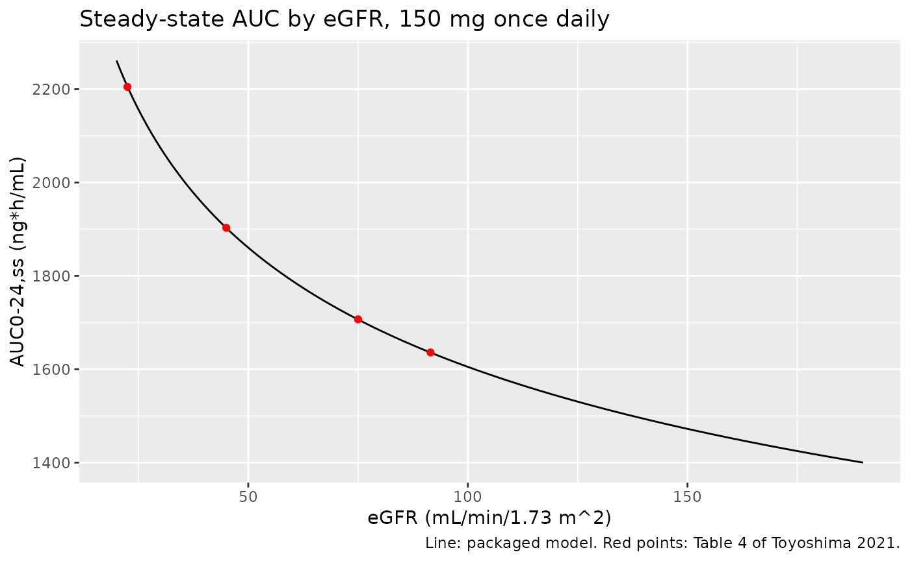
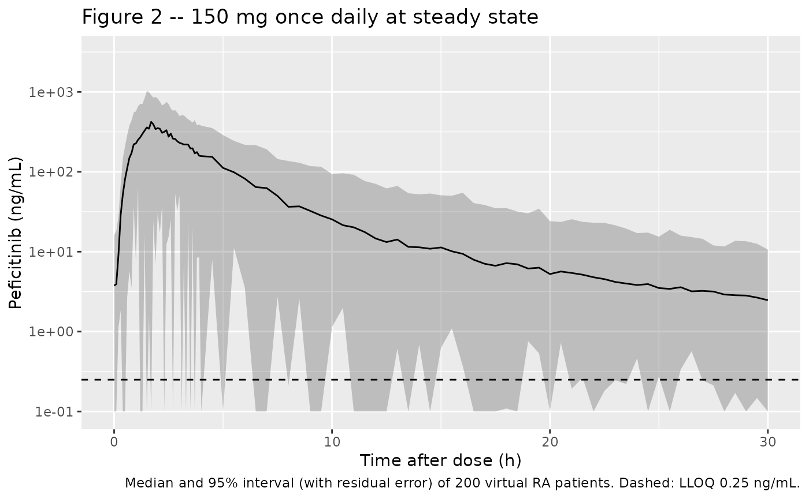
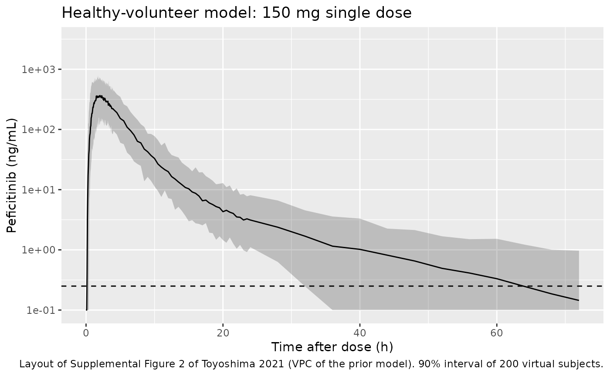

# Peficitinib (Toyoshima 2021)

## Model and source

Toyoshima et al. (2021) built two population PK models for the oral
pan-JAK inhibitor peficitinib. A prior model was fitted to rich phase 1
data from healthy Japanese volunteers (Supplemental Table 2). It then
served, through the NONMEM `PRIOR NWPRI` penalty, as prior information
for the structural parameters of the final model in patients with
rheumatoid arthritis (RA) from one phase 2 and two phase 3 studies
(Table 3), where sampling was mostly at trough. The authors fitted and
reported both models, so both are packaged:

- `Toyoshima_2021_peficitinib`: final RA patient model (Table 3,
  Equation 5).

- `Toyoshima_2021_peficitinib_healthy`: prior healthy-volunteer model
  (Supplemental Table 2).

- Citation: Toyoshima J, Shibata M, Kaibara A, Kaneko Y, Izutsu H,
  Nishimura T. (2021). Population pharmacokinetic analysis of
  peficitinib in patients with rheumatoid arthritis. Br J Clin Pharmacol
  87(4):2014-2022. <doi:10.1111/bcp.14605>. This file encodes the final
  RA patient model (Table 3, Equation 5); the prior healthy-volunteer
  model of Supplemental Table 2 is encoded in
  Toyoshima_2021_peficitinib_healthy.R.

- Description (RA): Two-compartment population PK model for oral
  peficitinib (a pan-Janus kinase inhibitor) in adult Asian patients
  with rheumatoid arthritis (Toyoshima 2021 RA patient model; 989
  patients with PK data from the phase 2 RAJ1 and phase 3 RAJ3 / RAJ4
  studies). Absorption is sequential zero-order then first-order with a
  lag time: the dose enters the depot over a zero-order duration D after
  the lag ALAG and is then absorbed first-order at rate Ka. Apparent
  clearance CL/F depends on baseline MDRD eGFR and baseline lymphocyte
  count through power functions centred on the RA-patient means (91.5
  mL/min/1.73 m^2 and 1550 x 10^6 cells/L). Interindividual variability
  on CL and Vc only; proportional residual error. Structural parameters
  were estimated with the NONMEM PRIOR NWPRI penalty informed by the
  companion healthy-volunteer model
  (Toyoshima_2021_peficitinib_healthy).

- Description (healthy): Two-compartment population PK model for oral
  peficitinib (a pan-Janus kinase inhibitor) in healthy Japanese adult
  volunteers (Toyoshima 2021 prior healthy-volunteer model; 98 subjects
  from five phase 1 studies at 150 mg). Absorption is sequential
  zero-order then first-order with a lag time: the dose enters the depot
  over a zero-order duration D after the lag ALAG and is then absorbed
  first-order at rate Ka. Interindividual variability on CL, Vp, Q, Ka,
  ALAG, D and relative bioavailability F (no IIV on Vc); proportional
  residual error; no covariates. The authors used this model as the
  NWPRI prior for the RA patient model (Toyoshima_2021_peficitinib).

- Article: <https://doi.org/10.1111/bcp.14605> (open access; the
  Supporting Information document holds Supplemental Tables 1-2 and
  Supplemental Figures 1-3)

Both models share the structure: a two-compartment disposition with
sequential zero- and first-order absorption and a lag time. After the
lag `ALAG` the dose is released into the depot at a constant rate over
the duration `D`, and it leaves the depot first-order at rate `Ka`. In
rxode2 this is `alag(depot)` and `dur(depot)`, and dose records carry
`rate = -2` so that the modelled duration is used.

## Population

**RA patient model.** 4919 plasma concentrations from 989 patients with
RA in the phase 2 RAJ1 study (25-150 mg once daily, 12 weeks) and the
phase 3 RAJ3 and RAJ4 studies (100 or 150 mg once daily, 52 weeks).
Table 2 of the paper summarises 1011 patients: 74.2% female, mean age
55.3 years (range 20-86), mean body weight 58.1 kg (29.9-117.4), MDRD
eGFR 91.49 mL/min/1.73 m^2 (36.4-188.4) and lymphocyte count 1550 x
10^6/L (500-4600). All were enrolled in Japan (94.7%), Korea (3.0%) or
Taiwan (2.3%), and all took the drug in the morning after food. Sampling
was mostly at trough, with one post-dose sample at week 4 or 8 in the
phase 3 studies (Table 1).

**Healthy-volunteer model.** 2464 concentrations from 98 healthy
Japanese volunteers (4.1% female, mean age 34.7 years, mean weight 64.1
kg) in five clinical pharmacology studies: single 150 mg doses in PK10,
PK11, PK12 and PK27, and a single dose followed by 7 days of once-daily
dosing in PK20. Sampling was rich, to 48-72 h (Table 1).

The same information is available programmatically:

``` r

str(rxode2::rxode(readModelDb("Toyoshima_2021_peficitinib"))$population)
#> ℹ parameter labels from comments will be replaced by 'label()'
#> List of 12
#>  $ species       : chr "human"
#>  $ n_subjects    : num 989
#>  $ n_studies     : num 3
#>  $ age_range     : chr "20-86 years (mean 55.3, SD 11.8; Table 2, n = 1011)"
#>  $ weight_range  : chr "29.9-117.4 kg (mean 58.1, SD 12.4; Table 2, n = 1011)"
#>  $ sex_female_pct: num 74.2
#>  $ race_ethnicity: chr "Asian (enrolled in Japan, Korea and Taiwan)"
#>  $ disease_state : chr "Rheumatoid arthritis with inadequate response to conventional DMARDs (RAJ3) or methotrexate (RAJ4), or on monotherapy (RAJ1)"
#>  $ dose_range    : chr "25, 50, 100 or 150 mg orally once daily, fed, in the morning"
#>  $ regions       : chr "Japan 94.7%, Korea 3.0%, Taiwan 2.3%"
#>  $ renal_function: chr "MDRD eGFR 36.4-188.4 mL/min/1.73 m^2 (mean 91.49)"
#>  $ notes         : chr "4919 plasma concentrations from 989 patients in the phase 2 RAJ1 (12 weeks) and phase 3 RAJ3 / RAJ4 (52 weeks) "| __truncated__
```

## Source trace

Every `ini()` value carries an in-file comment naming its source. They
are collected here.

| Parameter | RA model (Table 3) | Healthy model (Supplemental Table 2) | Notes |
|----|----|----|----|
| `lcl` (CL/F, L/h) | log(91.7) | log(83.4) | RA value is at eGFR 91.5 and lymphocytes 1550 (Equation 5) |
| `lvc` (Vc/F, L) | log(280) | log(253) |  |
| `lvp` (Vp/F, L) | log(122) | log(124) |  |
| `lq` (Q/F, L/h) | log(10.2) | log(9.19) |  |
| `lka` (Ka, 1/h) | log(5.83) | log(5.04) | Table 3 prints the unit as “L/h”, a typo for 1/h |
| `ltlag` (ALAG, h) | log(0.132) | log(0.133) |  |
| `ld1` (D, h) | log(1.37) | log(1.3) | zero-order release duration into the depot |
| `lfdepot` (F) | – | fixed(log(1)) | only IIV on F is tabulated |
| `e_crcl_cl` | 0.213 | – | Table 3 “eGFR on CL”; Equation 5 |
| `e_lymph_abs_cl` | -0.104 | – | Table 3 “LYM on CL”; Equation 5 |
| `etalcl` (omega^2) | 0.0639 | 0.0068 |  |
| `etalvc` | 0.143 | – |  |
| `etalvp` | – | 0.427 |  |
| `etalq` | – | 0.27 |  |
| `etalka` | – | 1.21 |  |
| `etaltlag` | – | 0.525 |  |
| `etald1` | – | 0.249 |  |
| `etalfdepot` | – | 0.0626 |  |
| `propSd` | 0.496 | 0.338 | footnote c: variability % = estimate x 100, so SD scale |
| `P_i = theta exp(eta_i)` | Equation 1 | Equation 1 | exponential IIV |
| `Y = Yhat (1 + eps)` | Equation 2 | Equation 2 | proportional residual error |
| `CL = 91.7 (eGFR/91.5)^0.213 (LYM/1550)^-0.104` | Equation 5 | – | power covariate model centred on RA-patient means (Equation 3) |

### Deterministic checks against the paper’s own derived numbers

The paper reports the IIV of each parameter as a CV computed from
omega^2 (Table 3 and Supplemental Table 2 footnote a:
`sqrt(exp(omega^2) - 1)`). It also gives the percentage change in CL at
the observed extremes of each covariate (Results 3.3). Both are
recomputed below from the packaged `ini()` values.

``` r

ui_ra <- rxode2::rxode(readModelDb("Toyoshima_2021_peficitinib"))
#> ℹ parameter labels from comments will be replaced by 'label()'
ui_hv <- rxode2::rxode(readModelDb("Toyoshima_2021_peficitinib_healthy"))
#> ℹ parameter labels from comments will be replaced by 'label()'

cv_pct <- function(omega2) 100 * sqrt(exp(omega2) - 1)
iiv_ra <- diag(ui_ra$omega)
iiv_hv <- diag(ui_hv$omega)
iiv <- tibble::tibble(
  model = c(rep("RA", 2), rep("Healthy", 7)),
  eta = c(names(iiv_ra), names(iiv_hv)),
  omega2 = c(iiv_ra, iiv_hv),
  cv_model = cv_pct(omega2),
  cv_paper = c(25.7, 39.2, 8.3, 73, 55.7, 153.4, 83.1, 53.2, 25.4)
)
stopifnot(identical(iiv$eta, c(
  "etalcl", "etalvc", "etalcl", "etalvp", "etalq", "etalka",
  "etaltlag", "etald1", "etalfdepot"
)))
knitr::kable(iiv, digits = c(0, 0, 4, 1, 1), caption = "IIV CV% recomputed from omega^2.")
```

| model   | eta        | omega2 | cv_model | cv_paper |
|:--------|:-----------|-------:|---------:|---------:|
| RA      | etalcl     | 0.0639 |     25.7 |     25.7 |
| RA      | etalvc     | 0.1430 |     39.2 |     39.2 |
| Healthy | etalcl     | 0.0068 |      8.3 |      8.3 |
| Healthy | etalvp     | 0.4270 |     73.0 |     73.0 |
| Healthy | etalq      | 0.2700 |     55.7 |     55.7 |
| Healthy | etalka     | 1.2100 |    153.4 |    153.4 |
| Healthy | etaltlag   | 0.5250 |     83.1 |     83.1 |
| Healthy | etald1     | 0.2490 |     53.2 |     53.2 |
| Healthy | etalfdepot | 0.0626 |     25.4 |     25.4 |

IIV CV% recomputed from omega^2. {.table}

``` r

# Pure arithmetic on the transcribed values: a mis-typed omega moves the CV
# by far more than the paper's one-decimal rounding.
stopifnot(all(abs(iiv$cv_model - iiv$cv_paper) < 0.15))

th <- ui_ra$theta
cl_change <- function(crcl, lym) {
  100 * ((crcl / 91.5)^th[["e_crcl_cl"]] * (lym / 1550)^th[["e_lymph_abs_cl"]] - 1)
}
covchk <- tibble::tibble(
  covariate = c("eGFR 36.4", "eGFR 188", "Lymphocytes 500", "Lymphocytes 4600"),
  change_model = c(
    cl_change(36.4, 1550), cl_change(188, 1550),
    cl_change(91.5, 500), cl_change(91.5, 4600)
  ),
  change_paper = c(-17.8, 16.7, 12.3, -10.7)
)
knitr::kable(covchk, digits = 1, caption = "Change in typical CL (%) at the observed covariate extremes (Results 3.3).")
```

| covariate        | change_model | change_paper |
|:-----------------|-------------:|-------------:|
| eGFR 36.4        |        -17.8 |        -17.8 |
| eGFR 188         |         16.6 |         16.7 |
| Lymphocytes 500  |         12.5 |         12.3 |
| Lymphocytes 4600 |        -10.7 |        -10.7 |

Change in typical CL (%) at the observed covariate extremes (Results
3.3). {.table}

``` r

# The lymphocyte minimum reproduces as +12.5% against the printed +12.3%;
# the other three agree to 0.1 point. The 0.2-point gap is within what a
# mean lymphocyte count of ~1553 (printed rounded to 1550) would explain.
stopifnot(all(abs(covchk$change_model - covchk$change_paper) < 0.3))
```

## Table 4: steady-state AUC by renal function

Table 4 reports the population-mean AUC over the 24-h dosing interval at
steady state for 150 mg once daily, at four eGFR values, with
lymphocytes at the reference. The typical-value model is solved to
steady state, and PKNCA integrates the 0-24 h profile at each eGFR.

``` r

egfr_levels <- c(91.5, 75, 45, 22.5)
egfr_label <- c(
  "eGFR 91.5 (reference)", "eGFR 75 (mild)",
  "eGFR 45 (moderate)", "eGFR 22.5 (severe)"
)
grid <- sort(unique(c(seq(0, 3, by = 0.02), seq(3, 24, by = 0.25))))
subj_t4 <- tibble::tibble(
  id = seq_along(egfr_levels),
  CRCL = egfr_levels,
  LYMPH_ABS = 1550,
  treatment = egfr_label
)
ev_t4 <- dplyr::bind_rows(
  subj_t4 |> dplyr::mutate(
    time = 0, amt = 150, evid = 1L, cmt = "depot",
    rate = -2, ii = 24, ss = 1L
  ),
  subj_t4 |>
    tidyr::crossing(time = grid) |>
    dplyr::mutate(evid = 0L, cmt = "central")
) |>
  dplyr::arrange(id, time, dplyr::desc(evid))

mod_ra <- readModelDb("Toyoshima_2021_peficitinib")
sim_t4 <- rxode2::rxSolve(
  rxode2::zeroRe(mod_ra), events = ev_t4,
  keep = c("treatment", "CRCL"),
  rtol = 1e-10, atol = 1e-12, ssRtol = 1e-10, ssAtol = 1e-12,
  maxsteps = 1e6
) |>
  as.data.frame()
#> ℹ parameter labels from comments will be replaced by 'label()'
#> ℹ omega/sigma items treated as zero: 'etalcl', 'etalvc'
#> Warning: multi-subject simulation without without 'omega'
```

``` r

conc_t4 <- sim_t4 |>
  dplyr::filter(!is.na(Cc)) |>
  dplyr::select(id, time, Cc, treatment)
# At steady state the concentration at time 0 is the trough, not zero, and
# the grid already contains time 0, so no zero row is added.
stopifnot(all(tapply(conc_t4$time, conc_t4$id, min) == 0))
dose_t4 <- ev_t4 |>
  dplyr::filter(evid == 1) |>
  dplyr::select(id, time, amt, treatment)

nca_t4 <- PKNCA::pk.nca(PKNCA::PKNCAdata(
  PKNCA::PKNCAconc(conc_t4, Cc ~ time | treatment + id),
  PKNCA::PKNCAdose(dose_t4, amt ~ time | treatment + id),
  intervals = data.frame(start = 0, end = 24, auclast = TRUE, cmax = TRUE, cmin = TRUE)
))

published_t4 <- tibble::tibble(
  treatment = egfr_label,
  auclast = c(1636, 1707, 1903, 2205)
)
cmp_t4 <- nlmixr2lib::ncaComparisonTable(
  simulated = nca_t4,
  reference = published_t4,
  by = "treatment",
  params = "auclast",
  units = c(auclast = "ng*h/mL"),
  tolerance_pct = 20
)
knitr::kable(cmp_t4, caption = "Steady-state AUC0-24 at 150 mg once daily: typical-value simulation vs Table 4.")
```

| NCA parameter      | treatment             | Reference | Simulated | % diff |
|:-------------------|:----------------------|:----------|:----------|:-------|
| AUClast (ng\*h/mL) | eGFR 91.5 (reference) | 1640      | 1640      | -0.0%  |
| AUClast (ng\*h/mL) | eGFR 75 (mild)        | 1710      | 1710      | -0.0%  |
| AUClast (ng\*h/mL) | eGFR 45 (moderate)    | 1900      | 1900      | -0.0%  |
| AUClast (ng\*h/mL) | eGFR 22.5 (severe)    | 2200      | 2210      | +0.0%  |

Steady-state AUC0-24 at 150 mg once daily: typical-value simulation vs
Table 4. {.table style="width:100%;"}

``` r


auc_t4 <- as.data.frame(nca_t4) |>
  dplyr::filter(PPTESTCD == "auclast") |>
  dplyr::left_join(published_t4, by = "treatment")
stopifnot(nrow(auc_t4) == 4L)
# Deterministic: AUC0-24,ss = Dose / CL. The numeric solve plus the
# trapezoid reproduces the four printed values to < 0.1% (measured
# < 0.02%); a transcription error in CL, e_crcl_cl or the unit scaling
# moves them by whole percent.
stopifnot(all(abs(auc_t4$PPORRES / auc_t4$auclast - 1) < 0.001))
# Table 4 ratios to the reference eGFR: 1.04, 1.16, 1.35.
auc_by_level <- auc_t4$PPORRES[match(egfr_label, auc_t4$treatment)]
stopifnot(!anyNA(auc_by_level))
ratio_t4 <- auc_by_level / auc_by_level[1]
stopifnot(all(abs(round(ratio_t4[-1], 2) - c(1.04, 1.16, 1.35)) < 0.006))
```

### Supplemental Figure 3: AUC versus eGFR

``` r

# Replicates the trend of Supplemental Figure 3 (population-mean AUC24,ss vs
# eGFR) with the typical-value closed form AUC = Dose / CL, which the solve
# above confirms.
tibble::tibble(CRCL = seq(20, 190, by = 1)) |>
  dplyr::mutate(auc24 = 150 * 1000 / (exp(th[["lcl"]]) * (CRCL / 91.5)^th[["e_crcl_cl"]])) |>
  ggplot(aes(CRCL, auc24)) +
  geom_line() +
  geom_point(data = published_t4 |> dplyr::mutate(CRCL = egfr_levels), aes(y = auclast), colour = "red") +
  labs(
    x = "eGFR (mL/min/1.73 m^2)", y = "AUC0-24,ss (ng*h/mL)",
    title = "Steady-state AUC by eGFR, 150 mg once daily",
    caption = "Line: packaged model. Red points: Table 4 of Toyoshima 2021."
  )
```



## Virtual RA cohort

Individual data are not available. The cohort below draws eGFR and
lymphocyte count from distributions matching the Table 2 means and SDs.
Values outside the observed ranges are redrawn rather than clipped, so
the range is a definition of the cohort and not a pile-up at its edges.

``` r

rxode2::rxSetSeed(20210401)
set.seed(20210401)

draw_in_range <- function(n, draw, lo, hi) {
  out <- draw(n)
  bad <- out < lo | out > hi
  while (any(bad)) {
    out[bad] <- draw(sum(bad))
    bad <- out < lo | out > hi
  }
  out
}
lognormal_draw <- function(mean, sd) {
  s2 <- log(1 + (sd / mean)^2)
  function(n) exp(rnorm(n, log(mean) - s2 / 2, sqrt(s2)))
}

n_per_arm <- 200L
make_cohort <- function(n, dose, id_offset = 0L) {
  tibble::tibble(
    id = id_offset + seq_len(n),
    CRCL = draw_in_range(n, lognormal_draw(91.49, 22.27), 36.4, 188.4),
    LYMPH_ABS = draw_in_range(n, lognormal_draw(1550, 540), 500, 4600),
    treatment = paste0(dose, " mg QD"),
    dose = dose
  )
}
subj <- dplyr::bind_rows(
  make_cohort(n_per_arm, 100, id_offset = 0L),
  make_cohort(n_per_arm, 150, id_offset = n_per_arm)
)
obs_grid <- sort(unique(c(seq(0, 4, by = 0.1), seq(4, 30, by = 0.5))))
events <- dplyr::bind_rows(
  subj |> dplyr::mutate(
    time = 0, amt = dose, evid = 1L, cmt = "depot",
    rate = -2, ii = 24, ss = 1L
  ),
  subj |>
    tidyr::crossing(time = obs_grid) |>
    dplyr::mutate(evid = 0L, cmt = "central")
) |>
  dplyr::select(-dose) |>
  dplyr::arrange(id, time, dplyr::desc(evid))
stopifnot(!anyDuplicated(unique(events[, c("id", "time", "evid")])))
```

## Simulation

A single `ss = 1` record puts each subject at steady state for
once-daily dosing. Observations run to 30 h after that dose, as in
Figure 2, where samples up to 48 h after the last dose were retained.

``` r

sim <- rxode2::rxSolve(
  mod_ra, events = events,
  keep = c("treatment", "CRCL", "LYMPH_ABS"),
  maxsteps = 1e6
) |>
  as.data.frame()
#> ℹ parameter labels from comments will be replaced by 'label()'
stopifnot(!anyNA(sim$Cc))
```

### Figure 2: VPC at steady state

``` r

# Replicates the layout of Figure 2 of Toyoshima 2021 (prediction-corrected
# VPC of the RA patient model, 0-30 h after dose, log scale). This is a plain
# VPC of the 150 mg arm with residual error, not prediction-corrected.
sim |>
  dplyr::filter(treatment == "150 mg QD") |>
  dplyr::group_by(time) |>
  dplyr::summarise(
    Q025 = quantile(sim, 0.025), Q50 = median(sim), Q975 = quantile(sim, 0.975),
    .groups = "drop"
  ) |>
  # A 49.6% proportional error drives the lowest simulated values below zero;
  # the lower band is drawn at the axis floor there rather than dropped.
  dplyr::mutate(Q025 = pmax(Q025, 0.1)) |>
  ggplot(aes(time, Q50)) +
  geom_ribbon(aes(ymin = Q025, ymax = Q975), alpha = 0.25) +
  geom_line() +
  geom_hline(yintercept = 0.25, linetype = "dashed") +
  scale_y_log10() +
  coord_cartesian(ylim = c(0.1, 3000)) +
  labs(
    x = "Time after dose (h)", y = "Peficitinib (ng/mL)",
    title = "Figure 2 -- 150 mg once daily at steady state",
    caption = "Median and 95% interval (with residual error) of 200 virtual RA patients. Dashed: LLOQ 0.25 ng/mL."
  )
```



The simulated profile peaks near 1.7 h at a few hundred ng/mL and falls
to single-digit ng/mL at the 24-h trough. This matches Figure 2 of the
paper, where the observed post-dose values reach several hundred ng/mL
at 1-3 h and the trough cloud sits between about 1 and 10 ng/mL.

### PKNCA by dose group

``` r

sim_nca <- sim |>
  dplyr::filter(!is.na(Cc), time <= 24) |>
  dplyr::select(id, time, Cc, treatment)
dose_df <- events |>
  dplyr::filter(evid == 1) |>
  dplyr::select(id, time, amt, treatment)
nca_ra <- PKNCA::pk.nca(PKNCA::PKNCAdata(
  PKNCA::PKNCAconc(sim_nca, Cc ~ time | treatment + id),
  PKNCA::PKNCAdose(dose_df, amt ~ time | treatment + id),
  intervals = data.frame(start = 0, end = 24, cmax = TRUE, tmax = TRUE, cmin = TRUE, auclast = TRUE)
))
nca_ra_summary <- as.data.frame(nca_ra) |>
  dplyr::group_by(treatment, PPTESTCD) |>
  dplyr::summarise(median = median(PPORRES), .groups = "drop") |>
  tidyr::pivot_wider(names_from = PPTESTCD, values_from = median)
nca_ra_summary |>
  dplyr::rename(
    "Dose group" = treatment,
    "AUC0-24,ss (ng*h/mL)" = auclast,
    "Cmax,ss (ng/mL)" = cmax,
    "Ctrough,ss (ng/mL)" = cmin,
    "Tmax (h)" = tmax
  ) |>
  knitr::kable(digits = 2, caption = "Median steady-state NCA of the virtual RA cohort (no residual error).")
```

| Dose group | AUC0-24,ss (ng\*h/mL) | Cmax,ss (ng/mL) | Ctrough,ss (ng/mL) | Tmax (h) |
|:-----------|----------------------:|----------------:|-------------------:|---------:|
| 100 mg QD  |               1088.36 |          259.35 |               3.12 |      1.7 |
| 150 mg QD  |               1583.66 |          389.56 |               4.15 |      1.7 |

Median steady-state NCA of the virtual RA cohort (no residual error).
{.table}

``` r


auc_150 <- as.data.frame(nca_ra) |>
  dplyr::filter(PPTESTCD == "auclast", treatment == "150 mg QD")
stopifnot(nrow(auc_150) == n_per_arm)
# Centre of the cohort vs the Table 4 reference (1636 ng*h/mL at the mean
# covariates). The per-subject SD of log AUC is ~0.27, so the SE of the
# median over 200 subjects is ~2.4%; 10% is > 4 SE and still breaks on a
# mis-scaled CL or dose.
stopifnot(abs(median(auc_150$PPORRES) / 1636 - 1) < 0.10)
```

The paper reports no NCA for the RA cohort other than the Table 4 AUCs,
which are compared above.

## Healthy-volunteer model

The prior model is exercised with a single 150 mg dose, the phase 1
dose, and is compared with the paper’s own figures. CL/F is 83.4 L/h and
F has a typical value of 1, so the typical AUC0-inf is 150 / 83.4 = 1.80
mg*h/L (1799 ng*h/mL). The Introduction, citing the phase 1 reports,
gives a Tmax of 1.0-1.8 h in healthy volunteers.

``` r

mod_hv <- readModelDb("Toyoshima_2021_peficitinib_healthy")
hv_grid <- sort(unique(c(seq(0, 4, by = 0.05), seq(4, 24, by = 0.5), seq(24, 240, by = 4))))
ev_hv_typ <- dplyr::bind_rows(
  tibble::tibble(id = 1L, time = 0, amt = 150, evid = 1L, cmt = "depot", rate = -2),
  tibble::tibble(id = 1L, time = hv_grid, evid = 0L, cmt = "central")
)
sim_hv_typ <- rxode2::rxSolve(
  rxode2::zeroRe(mod_hv), events = ev_hv_typ,
  rtol = 1e-10, atol = 1e-12
) |>
  as.data.frame()
#> ℹ parameter labels from comments will be replaced by 'label()'
#> ℹ omega/sigma items treated as zero: 'etalcl', 'etalvp', 'etalq', 'etalka', 'etaltlag', 'etald1', 'etalfdepot'
if (is.null(sim_hv_typ$id)) sim_hv_typ$id <- 1L
auc_typ <- sum(diff(sim_hv_typ$time) *
  (head(sim_hv_typ$Cc, -1) + tail(sim_hv_typ$Cc, -1)) / 2)
tmax_typ <- sim_hv_typ$time[which.max(sim_hv_typ$Cc)]
c(auc0_240 = auc_typ, dose_over_cl = 150000 / 83.4, tmax = tmax_typ)
#>     auc0_240 dose_over_cl         tmax 
#>     1800.409     1798.561        1.650
# Deterministic: AUC to 240 h (> 20 terminal half-lives of the typical
# profile) against Dose / CL, to 1% (measured within 0.2%; the gap is the
# linear-trapezoid error on the peak).
stopifnot(abs(auc_typ / (150000 / 83.4) - 1) < 0.01)
# The typical Tmax lies in the 1.0-1.8 h range the paper quotes for phase 1.
stopifnot(tmax_typ >= 1.0, tmax_typ <= 1.8)
```

A stochastic cohort of 200 healthy volunteers is shown for the single
dose. It uses the phase 1 IIV, which is large on the absorption
parameters and small on CL.

``` r

ev_hv <- dplyr::bind_rows(
  tibble::tibble(id = seq_len(200), time = 0, amt = 150, evid = 1L, cmt = "depot", rate = -2),
  tidyr::crossing(id = seq_len(200), time = hv_grid) |>
    dplyr::mutate(evid = 0L, cmt = "central")
) |>
  dplyr::mutate(treatment = "150 mg single dose") |>
  dplyr::arrange(id, time, dplyr::desc(evid))
sim_hv <- rxode2::rxSolve(mod_hv, events = ev_hv, keep = "treatment") |>
  as.data.frame()
#> ℹ parameter labels from comments will be replaced by 'label()'

sim_hv |>
  dplyr::filter(time <= 72) |>
  dplyr::group_by(time) |>
  dplyr::summarise(
    Q05 = quantile(sim, 0.05), Q50 = median(sim), Q95 = quantile(sim, 0.95),
    .groups = "drop"
  ) |>
  # Before the lag and in the far tail the lower band is at or below zero;
  # draw it at the axis floor rather than drop it.
  dplyr::mutate(dplyr::across(c(Q05, Q50, Q95), \(x) pmax(x, 0.1))) |>
  ggplot(aes(time, Q50)) +
  geom_ribbon(aes(ymin = Q05, ymax = Q95), alpha = 0.25) +
  geom_line() +
  geom_hline(yintercept = 0.25, linetype = "dashed") +
  scale_y_log10() +
  coord_cartesian(ylim = c(0.1, 3000)) +
  labs(
    x = "Time after dose (h)", y = "Peficitinib (ng/mL)",
    title = "Healthy-volunteer model: 150 mg single dose",
    caption = "Layout of Supplemental Figure 2 of Toyoshima 2021 (VPC of the prior model). 90% interval of 200 virtual subjects."
  )
```



``` r


conc_hv <- sim_hv |>
  dplyr::filter(!is.na(Cc)) |>
  dplyr::select(id, time, Cc, treatment)
stopifnot(all(conc_hv$Cc >= -1e-6 * max(conc_hv$Cc)))
conc_hv <- conc_hv |> dplyr::mutate(Cc = pmax(Cc, 0))
nca_hv <- PKNCA::pk.nca(PKNCA::PKNCAdata(
  PKNCA::PKNCAconc(conc_hv, Cc ~ time | treatment + id),
  PKNCA::PKNCAdose(
    ev_hv |> dplyr::filter(evid == 1) |> dplyr::select(id, time, amt, treatment),
    amt ~ time | treatment + id
  ),
  intervals = data.frame(start = 0, end = Inf, cmax = TRUE, tmax = TRUE, aucinf.obs = TRUE, half.life = TRUE)
))
nca_hv_summary <- as.data.frame(nca_hv) |>
  dplyr::filter(PPTESTCD %in% c("cmax", "tmax", "aucinf.obs", "half.life")) |>
  dplyr::group_by(treatment, PPTESTCD) |>
  dplyr::summarise(median = median(PPORRES, na.rm = TRUE), .groups = "drop")
knitr::kable(nca_hv_summary, digits = 2, caption = "Median single-dose NCA of the virtual healthy cohort (no residual error).")
```

| treatment          | PPTESTCD   |  median |
|:-------------------|:-----------|--------:|
| 150 mg single dose | aucinf.obs | 1822.76 |
| 150 mg single dose | cmax       |  419.39 |
| 150 mg single dose | half.life  |   10.80 |
| 150 mg single dose | tmax       |    1.85 |

Median single-dose NCA of the virtual healthy cohort (no residual
error). {.table}

``` r


hv_auc <- nca_hv_summary$median[nca_hv_summary$PPTESTCD == "aucinf.obs"]
hv_tmax <- nca_hv_summary$median[nca_hv_summary$PPTESTCD == "tmax"]
stopifnot(length(hv_auc) == 1L, length(hv_tmax) == 1L)
# IIV on CL is only 8.3% CV and F 25.4% CV, so the median AUC0-inf sits
# close to the typical 1799 ng*h/mL; 10% is > 4 SE of the median for n = 200.
stopifnot(abs(hv_auc / (150000 / 83.4) - 1) < 0.10)
# Median Tmax across the cohort: measured 1.85 h, slightly above both the
# typical-value 1.65 h and the 1.0-1.8 h phase 1 range. The Ka, ALAG and D
# IIV (153%, 83% and 53% CV) is right-skewed on the time scale, so the
# cohort median sits later than the typical profile. The bound admits that
# spread and still fails if an absorption parameter is off by a factor.
stopifnot(hv_tmax > 1.0, hv_tmax < 2.5)
```

The paper does not tabulate NCA values of its own for these phase 1
studies. The only published anchors are the Tmax range and the Dose / CL
AUC, both checked above. The typical Tmax (1.65 h) is within the 1.0-1.8
h range; the cohort median (about 1.85 h) is slightly above it. The
cohort median half-life of about 11 h is inside the 2.8-12.9 h range of
mean terminal half-lives that the Introduction cites from the phase 1
reports.

## Assumptions and deviations

- **Two models from one paper.** The healthy-volunteer model is the
  prior used to estimate the structural parameters of the RA model. The
  authors report it in full (Supplemental Table 2, with its own VPC and
  bootstrap), so it is packaged as a separate model rather than dropped.
- **RA structural parameters are penalised estimates.** They were
  estimated with the NONMEM `PRIOR NWPRI` penalty informed by the
  healthy-volunteer model, because the RA data are mostly troughs. The
  prior’s IIV was not carried forward (Results 3.3). The RA model is
  used here exactly as tabulated.
- **Bioavailability.** Neither model estimates a typical F; the
  parameters are apparent (CL/F, V/F). The healthy-volunteer model has
  IIV on F, which is encoded as `etalfdepot` on a fixed typical F of 1.
  The RA model has no F term.
- **Residual error on the SD scale.** Table 3 and Supplemental Table 2
  footnote c state that the residual variability percentage equals the
  estimate x 100, so 0.496 and 0.338 are proportional SDs, not
  variances.
- **Ka unit.** Table 3 prints “Ka (L/h)”; the unit is taken as 1/h, as
  printed in Supplemental Table 2 and as required for a rate constant.
- **Lymphocyte count units.** The paper reports 10^6 cells/L, which is
  numerically identical to the canonical cells/uL.
- **Covariate reference values.** Equation 5 prints the centring values
  91.5 mL/min/1.73 m^2 and 1550 x 10^6/L (RA-patient means). The change
  in CL recomputed at the lymphocyte minimum (+12.5%) differs by 0.2
  points from the printed +12.3%, consistent with rounding of the mean.
- **Food.** Phase 1 food conditions were not modelled by the authors;
  the RA patients all dosed after food.
- **Virtual cohort.** eGFR and lymphocyte counts are drawn from
  log-normal distributions with the Table 2 means and SDs, redrawn
  within the observed ranges; they are drawn independently because the
  paper gives no correlation.
- **Figure 2** is a prediction-corrected VPC across all doses. The
  replication here is a plain VPC of the 150 mg arm and is a visual
  comparison only.
- No erratum or correction notice for this article was found in Europe
  PMC or Crossref as of 2026-09-28.
