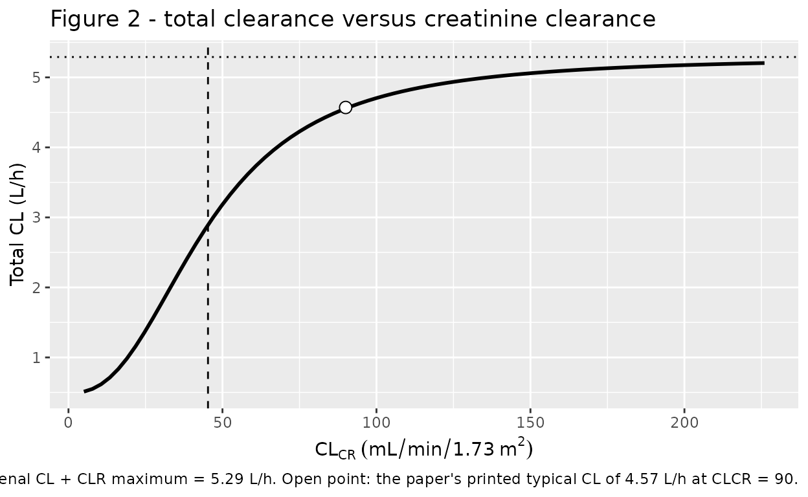
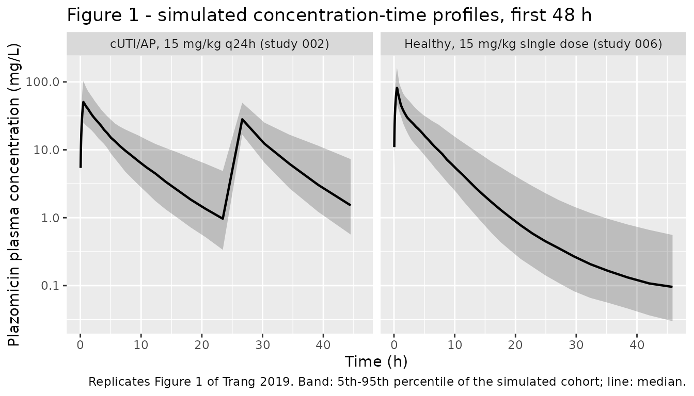

# Plazomicin (Trang 2019)

## Model and source

- Citation: Trang M, Seroogy JD, Van Wart SA, Bhavnani SM, Kim A,
  Gibbons JA, Ambrose PG, Rubino CM. 2019. Population pharmacokinetic
  analyses for plazomicin using pooled data from phase 1, 2, and 3
  clinical studies. Antimicrob Agents Chemother 63:e02329-18.
  <doi:10.1128/AAC.02329-18>.
- Description: Three-compartment population PK model for intravenous
  plazomicin in healthy adults and adults with complicated urinary tract
  infection, acute pyelonephritis, bloodstream infection or
  hospital-/ventilator-acquired bacterial pneumonia, with a sigmoidal
  Hill relationship between renal clearance and creatinine clearance and
  an additive continuous-renal-replacement-therapy clearance arm
- Article: <https://doi.org/10.1128/AAC.02329-18>
- Supplement (Fig. S1, Tables S1-S2):
  <https://doi.org/10.1128/AAC.02329-18>

Plazomicin is an aminoglycoside developed to overcome
aminoglycoside-modifying enzymes in multidrug-resistant
*Enterobacteriaceae*. It is given as a 30-min intravenous infusion on a
milligram-per-kilogram basis, with dose adjustment for renal function
and for a body weight at or above 125% of ideal body weight.

The structural model is three compartments with zero-order intravenous
input and first-order elimination. Its defining feature is that total
clearance is the sum of a constant non-renal arm and a **saturable**
renal arm, the latter a sigmoidal Hill function of creatinine clearance
carried as a time-varying covariate:

``` math
\mathrm{CL} = \left(\mathrm{CL_{nonrenal}} + \mathrm{CL_{R,max}}\,
\frac{\mathrm{CL_{CR}}^{\gamma}}{\mathrm{CL_{CR,50}}^{\gamma} + \mathrm{CL_{CR}}^{\gamma}}\right)
\left(\frac{\mathrm{BW}}{75}\right)^{0.529}
\left(1 + 0.130\,\mathrm{AP} - 0.189\,\mathrm{BSI}\right)
\;+\; \mathrm{SC}\cdot(\mathrm{UFR} + \mathrm{DFR})
```

The Discussion notes that glomerular filtration would ordinarily predict
a *linear* relationship, and that the observed saturation at high
creatinine clearance most likely reflects creatinine clearance becoming
a poorer surrogate for glomerular filtration rate at the upper end of
its range rather than saturation of the elimination process itself.

## Population

The analysis pooled 564 subjects and 4,990 plasma plazomicin
concentrations from seven studies: four phase 1 studies in healthy
adults and in adults with varying degrees of renal function (001, 003,
004, 006; n = 143), one phase 2 study in complicated urinary tract
infection (cUTI) and acute pyelonephritis (AP) (002; n = 92), and two
phase 3 studies (007 in carbapenem-resistant *Enterobacteriaceae*
infections and 009 in cUTI/AP; n = 329).

Baseline characteristics are Table 1 of Trang 2019: median age 39 years
(18-90), median body weight 75.0 kg (40.5-165), median height 170 cm
(142-194), median body surface area 1.86 m^2 (1.29-2.58), median
creatinine clearance 90.2 mL/min/1.73 m^2 (7.37-226), 52.8% female,
78.5% White. Infection types were cUTI (37.8%), AP (29.1%), bloodstream
infection (5.14%) and hospital-acquired or ventilator-associated
bacterial pneumonia (2.66%), with 25.4% healthy subjects. Renal function
ranged from normal (42.0%) to severe impairment (2.30%); nine subjects
in study 007 received continuous renal replacement therapy (CRRT) during
treatment, and 24 subjects (4.26%) received vasopressors.

Per-study retention is supplemental Table S1: 573 subjects and 5,142
samples at the start, reduced to 564 and 4,990 after excluding 106
outliers and 46 below-limit-of-quantification samples.

The same information is available programmatically via
`readModelDb("Trang_2019_plazomicin")()$population`.

## Source trace

Every `ini()` entry in
`inst/modeldb/specificDrugs/Trang_2019_plazomicin.R` carries an in-file
comment naming its source location. They are collected here for review.
All final estimates come from Table 2 (“Final population PK model
parameter estimates”), column “Final estimate”.

| Equation / parameter | Value | Source location |
|----|----|----|
| Three-compartment structure, zero-order IV input, first-order elimination | n/a | Results “(i) Development of the structural population PK model”; Abstract; Discussion |
| `lcl_nonren` (non-renal CL) | 0.491 L/h | Table 2, “Nonrenal CL (liters/h)” |
| `lcl_renal_max` (asymptotic renal CL) | 4.80 L/h | Table 2, “CLR maximum (liters/h)” |
| `lcrcl50` | 45.3 mL/min/1.73 m^2 | Table 2, “Baseline CLCR50 (ml/min/1.73 m2)” |
| `lhill` | 2.49 | Table 2, “Hill coefficient” |
| Sigmoidal Hill form of CL_R vs CL_CR | n/a | Results “(iv) Final population PK model”, paragraph 2 |
| `e_wt_cl` | 0.529 | Table 2, “CL-weight power” |
| `e_ap_cl` | 0.130 | Table 2, “Proportional increase for AP patients” |
| `e_bsi_cl` | -0.189 | Table 2, “Proportional increase for BSI patients” |
| `lvc` | 9.10 L | Table 2, Vc “Coefficient” |
| `e_bsa_vc` | 1.23 | Table 2, “Vc-BSA power” |
| `e_cutiap_vc` | 1.05 | Table 2, Vc “Proportional increase for cUTI and AP patients” |
| `e_bsihabp_vc` | 1.55 | Table 2, Vc “Proportional increase for BSI and HABP/VABP patients” |
| `lq` (the paper’s CLd1) | 8.05 L/h | Table 2, CLd1 “Coefficient” |
| `e_cutiap_q` | -0.831 | Table 2, CLd1 “Proportional increase for cUTI and AP patients” |
| `lvp` (the paper’s Vp1) | 8.71 L | Table 2, Vp1 “Coefficient” |
| `e_bsa_vp` | 1.17 | Table 2, “Vp1-BSA power” |
| `e_age_vp` | 0.00954 /year | Table 2, “Vp1-age slope” |
| `e_cutiap_vp` | -0.437 | Table 2, Vp1 “Proportional increase for cUTI and AP patients” |
| `lq2` (the paper’s CLd2) | 0.199 L/h | Table 2, CLd2 “Coefficient” |
| `e_ht_q2` | 3.38 | Table 2, “CLd2-height power” |
| `e_cutiap_q2` | -0.299 | Table 2, CLd2 “Proportional increase for cUTI and AP patients” |
| `e_bsihabp_q2` | 2.86 | Table 2, CLd2 “Proportional increase for BSI and HABP/VABP patients” |
| `lvp2` (the paper’s Vp2) | 6.98 L | Table 2, Vp2 “Coefficient” |
| `e_wt_vp2` | 1.62 | Table 2, “Vp2-weight power” |
| `e_inotrope_vp2` | 3.90 | Table 2, Vp2 “Proportional increase for vasopressor use” |
| `sc_crrt` | 0.734 | Table 2, CLCRRT “Sieving coefficient”; re-estimated in final refinement from the base-model 0.926 (Results “(iii) Final covariate model refinement”) |
| CRRT CL = SC x (UFR + DFR), additive on residual CL, only while CRRT operative | n/a | Materials and Methods “(i) Development of the structural population PK model”; Results “(iv) Final population PK model” |
| `etalcl`, `etalvc`, `etalvp` block | 0.103 / 0.211 / 0.0678 with covariances 0.0931, 0.0734, 0.0649 | Table 2, omega-squared rows and the three “Covariance between …” rows |
| `etalq`, `etalq2`, `etalvp2` | 0.0661 / 0.0350 / 0.170 | Table 2, omega-squared rows |
| `etaiov_cl_1` .. `_4` | 0.00129 | Table 2, “IOV on CL”; four occasions per Results “(ii) Covariate analysis” |
| `addSd` | sqrt(0.0000414) = 0.006434 mg/L | Table 2, residual variability “Additive component” |
| `propSdPhase1` / `2` / `3` | sqrt(0.0297 / 0.168 / 0.0846) | Table 2, “CCV component for phase 1/2/3 studies” |
| Cockcroft-Gault CL_CR, BSA-normalised by Du Bois | n/a | Materials and Methods “Subject characteristics” |
| Typical CL = 4.57 L/h, CL_R = 4.08 L/h at BW 75 kg, BSA 1.73 m^2, CL_CR 90 | n/a | Results “(iv) Final population PK model”, paragraph 2 (used as the validation target below) |
| Per-study secondary PK parameters (Table 3) | see NCA table | Table 3 |

## Virtual cohort

The original observed data are not publicly available. Two virtual
cohorts are built whose covariate distributions approximate the
published per-phase demographics of Table 1.

Covariates are drawn with R’s own RNG, so the cohort is byte-identical
on any machine. Every assertion below is evaluated on a
**typical-value** solve
([`rxode2::zeroRe()`](https://nlmixr2.github.io/rxode2/reference/zeroRe.html)),
which is fully deterministic; the between-subject solve is used only for
the visual predictive-check figure, which carries no assertion. This
sidesteps the fact that rxode2 partitions its simulation RNG per solver
thread, so a stochastic cohort differs between a 2-core CI runner and a
many-threaded workstation.

``` r

set.seed(20190401)

# Du Bois and Du Bois, as used by the paper (Materials and Methods,
# "Subject characteristics"): BSA = BW^0.425 * height^0.725 * 0.007184.
du_bois_bsa <- function(wt_kg, ht_cm) {
  wt_kg^0.425 * ht_cm^0.725 * 0.007184
}

# Draw a log-normal variate with the requested median, truncated to the
# published observed range so no virtual subject falls outside it.
rlnorm_bounded <- function(n, median, cv, lower, upper) {
  sdlog <- sqrt(log(cv^2 + 1))
  x <- stats::rlnorm(n, meanlog = log(median), sdlog = sdlog)
  pmin(pmax(x, lower), upper)
}

n_per_arm <- 150L

# Occasions, per Results "(ii) Covariate analysis": days 1-2, 3-6, 6-9, >9.
# The published day-6 boundary belongs to two occasions as printed; the
# upper-exclusive reading below is the only mutually-exclusive one.
occasion_of <- function(t) {
  cut(t,
    breaks = c(-Inf, 48, 144, 216, Inf),
    labels = FALSE, right = FALSE
  )
}

make_cohort <- function(n, label,
                        wt_median, wt_range, ht_median, ht_range,
                        age_median, age_range, crcl_median, crcl_range,
                        dose_mg_per_kg, n_doses, tau,
                        obs_times,
                        dis_cuti = 0, dis_ap = 0, dis_bsi = 0,
                        dis_habp = 0, dis_vabp = 0,
                        inotrope = 0, phase2 = 0, phase3 = 0,
                        id_offset = 0L) {
  # Weight and height are drawn independently, so an extreme-low pair can put
  # the derived Du Bois BSA fractionally outside the published pooled range
  # (1.29-2.58 m^2, Table 1). Draw a surplus pool and keep the first `n`
  # candidates whose BSA lands inside it, so every virtual subject sits inside
  # the covariate box the model was fitted over.
  pool <- 20L * n
  cand <- tibble(
    WT = rlnorm_bounded(pool, wt_median, 0.22, wt_range[1], wt_range[2]),
    HT = rlnorm_bounded(pool, ht_median, 0.07, ht_range[1], ht_range[2]),
    AGE = rlnorm_bounded(pool, age_median, 0.40, age_range[1], age_range[2]),
    CRCL = rlnorm_bounded(pool, crcl_median, 0.45, crcl_range[1], crcl_range[2])
  ) |>
    mutate(BSA = du_bois_bsa(WT, HT)) |>
    filter(BSA >= 1.29, BSA <= 2.58)
  stopifnot(nrow(cand) >= n)

  subj <- cand |>
    slice_head(n = n) |>
    mutate(
      id = id_offset + seq_len(n),
      DIS_CUTI = dis_cuti, DIS_AP = dis_ap, DIS_BACTEREMIA = dis_bsi,
      DIS_HABP = dis_habp, DIS_VABP = dis_vabp,
      CONMED_INOTROPE = inotrope,
      RRT_CRRT_EFFLUENT_FLOW = 0, RRT_CRRT_ACTIVE = 0,
      STUDY_PHASE2 = phase2, STUDY_PHASE3 = phase3,
      treatment = label,
      dose_mg = dose_mg_per_kg * WT
    )

  doses <- subj |>
    tidyr::crossing(dose_number = seq_len(n_doses)) |>
    mutate(
      time = (dose_number - 1) * tau,
      amt = dose_mg,
      # 30-min infusion (every study used a 30-min IV infusion).
      rate = dose_mg / 0.5,
      evid = 1L,
      cmt = "central"
    ) |>
    select(-dose_number)

  obs <- subj |>
    tidyr::crossing(time = obs_times) |>
    mutate(
      amt = NA_real_, rate = NA_real_, evid = 0L,
      # The ODE state, never the algebraic observable `Cc`.
      cmt = "central"
    )

  bind_rows(doses, obs) |>
    mutate(OCC = occasion_of(time)) |>
    arrange(id, time, desc(evid)) |>
    select(-dose_mg)
}

# Sampling grids. Log-spaced early points keep the trapezoidal AUC accurate
# through the 30-min infusion and the steep alpha phase.
grid_single <- sort(unique(c(
  0, exp(seq(log(0.05), log(120), length.out = 90))
)))
grid_multi <- sort(unique(c(
  0, exp(seq(log(0.05), log(96), length.out = 60)),
  96 + exp(seq(log(0.05), log(24), length.out = 45)), 96, 120
)))

events <- bind_rows(
  # Study 006: healthy adults, single 15 mg/kg 30-min infusion (phase 1).
  make_cohort(
    n_per_arm, "Healthy, 15 mg/kg single dose (study 006)",
    wt_median = 74.6, wt_range = c(53.5, 116),
    ht_median = 172, ht_range = c(146, 191),
    age_median = 29, age_range = c(18, 75),
    crcl_median = 93.4, crcl_range = c(7.37, 159),
    dose_mg_per_kg = 15, n_doses = 1L, tau = 24,
    obs_times = grid_single,
    id_offset = 0L
  ),
  # Study 002: cUTI / AP patients, 15 mg/kg q24h (phase 2).
  make_cohort(
    n_per_arm, "cUTI/AP, 15 mg/kg q24h (study 002)",
    wt_median = 66.0, wt_range = c(42, 100),
    ht_median = 160, ht_range = c(142, 183),
    age_median = 39.9, age_range = c(18.3, 77.4),
    crcl_median = 81.3, crcl_range = c(21.8, 212),
    dose_mg_per_kg = 15, n_doses = 5L, tau = 24,
    obs_times = grid_multi,
    dis_cuti = 1, phase2 = 1,
    id_offset = 1000L
  )
)

stopifnot(
  !anyDuplicated(events[events$evid == 0, c("id", "time")]),
  all(events$OCC %in% 1:4),
  # Every virtual subject sits inside the published covariate ranges.
  all(events$WT >= 40.5 & events$WT <= 165),
  all(events$HT >= 142 & events$HT <= 194),
  all(events$AGE >= 18 & events$AGE <= 90),
  all(events$CRCL >= 7.37 & events$CRCL <= 226),
  all(events$BSA >= 1.29 & events$BSA <= 2.58)
)
```

## Simulation

``` r

mod <- readModelDb("Trang_2019_plazomicin")

# Typical-value solve: deterministic, and the basis for every assertion.
sim <- rxode2::rxSolve(
  rxode2::zeroRe(mod),
  events = events,
  keep = c("treatment", "WT", "HT", "AGE", "CRCL", "BSA")
)
#> ℹ parameter labels from comments will be replaced by 'label()'
#> Warning: some etas defaulted to non-mu referenced, possible parsing error: etaiov_cl_1, etaiov_cl_2, etaiov_cl_3, etaiov_cl_4
#> as a work-around try putting the mu-referenced expression on a simple line
#> Warning: some etas defaulted to non-mu referenced, possible parsing error: etaiov_cl_1, etaiov_cl_2, etaiov_cl_3, etaiov_cl_4
#> as a work-around try putting the mu-referenced expression on a simple line
#> ℹ omega/sigma items treated as zero: 'etalcl', 'etalvc', 'etalvp', 'etalq', 'etalq2', 'etalvp2', 'etaiov_cl_1', 'etaiov_cl_2', 'etaiov_cl_3', 'etaiov_cl_4'
#> Warning: multi-subject simulation without without 'omega'
if (is.null(sim$id)) sim$id <- 1L

# Between-subject solve, used only for the visual predictive check.
sim_iiv <- rxode2::rxSolve(mod, events = events, keep = c("treatment"))
#> ℹ parameter labels from comments will be replaced by 'label()'
#> Warning: some etas defaulted to non-mu referenced, possible parsing error: etaiov_cl_1, etaiov_cl_2, etaiov_cl_3, etaiov_cl_4
#> as a work-around try putting the mu-referenced expression on a simple line
```

## Structural checks against the paper’s own printed values

These are exact-identity checks on the parts of the model that the paper
states numerically. Unlike an NCA comparison against a cohort geometric
mean, they do not depend on how closely the virtual cohort matches the
real one, so they are asserted with tight absolute tolerances. Any
transcription error in the clearance arm moves them by far more than the
tolerance allows.

``` r

# A single reference subject at exactly the covariate values named in
# Results "(iv) Final population PK model": "the population mean total CL and
# CLR would be 4.57 liters/h ... and 4.08 liters/h ... in a typical cUTI or
# HABP/VABP patient with a BW of 75 kg, a body surface area (BSA) of 1.73 m2,
# and a CLCR of 90 ml/min."
probe <- function(crcl, wt = 75, bsa = 1.73, ht = 170, age = 39,
                  cuti = 1, ap = 0, bsi = 0, habp = 0, vabp = 0,
                  inotrope = 0, effluent = 0, crrt = 0,
                  phase2 = 0, phase3 = 0) {
  ev <- tibble(
    id = 1L, time = c(0, 1), amt = c(1000, NA_real_),
    rate = c(2000, NA_real_), evid = c(1L, 0L), cmt = "central",
    WT = wt, BSA = bsa, HT = ht, AGE = age, CRCL = crcl,
    DIS_CUTI = cuti, DIS_AP = ap, DIS_BACTEREMIA = bsi,
    DIS_HABP = habp, DIS_VABP = vabp, CONMED_INOTROPE = inotrope,
    RRT_CRRT_EFFLUENT_FLOW = effluent, RRT_CRRT_ACTIVE = crrt,
    STUDY_PHASE2 = phase2, STUDY_PHASE3 = phase3, OCC = 1
  )
  out <- as.data.frame(rxode2::rxSolve(rxode2::zeroRe(mod), events = ev))
  out[nrow(out), ]
}

ref <- probe(crcl = 90)
#> ℹ parameter labels from comments will be replaced by 'label()'
#> Warning: some etas defaulted to non-mu referenced, possible parsing error: etaiov_cl_1, etaiov_cl_2, etaiov_cl_3, etaiov_cl_4
#> as a work-around try putting the mu-referenced expression on a simple line
#> Warning: some etas defaulted to non-mu referenced, possible parsing error: etaiov_cl_1, etaiov_cl_2, etaiov_cl_3, etaiov_cl_4
#> as a work-around try putting the mu-referenced expression on a simple line
#> ℹ omega/sigma items treated as zero: 'etalcl', 'etalvc', 'etalvp', 'etalq', 'etalq2', 'etalvp2', 'etaiov_cl_1', 'etaiov_cl_2', 'etaiov_cl_3', 'etaiov_cl_4'

# 1. Typical total clearance and renal clearance. The paper prints 4.57 and
#    4.08 L/h; its parameters are printed to three significant figures, so the
#    reproduction is compared on an ABSOLUTE tolerance rather than a relative
#    one (0.05 L/h is ~1%, while a mis-transcribed Hill parameter moves CL by
#    0.5 L/h or more).
cl_typ <- ref$cl
clr_typ <- ref$cl_renal
c(CL = cl_typ, CL_R = clr_typ)
#>       CL     CL_R 
#> 4.555435 4.064435

# 2. The Hill function is half-maximal exactly at CLCR50 = 45.3, by
#    definition. This pins CLCR50 into the right position in the equation.
half_max <- probe(crcl = 45.3)$cl_renal
#> ℹ parameter labels from comments will be replaced by 'label()'
#> Warning: some etas defaulted to non-mu referenced, possible parsing error: etaiov_cl_1, etaiov_cl_2, etaiov_cl_3, etaiov_cl_4
#> as a work-around try putting the mu-referenced expression on a simple line
#> Warning: some etas defaulted to non-mu referenced, possible parsing error: etaiov_cl_1, etaiov_cl_2, etaiov_cl_3, etaiov_cl_4
#> as a work-around try putting the mu-referenced expression on a simple line
#> ℹ omega/sigma items treated as zero: 'etalcl', 'etalvc', 'etalvp', 'etalq', 'etalq2', 'etalvp2', 'etaiov_cl_1', 'etaiov_cl_2', 'etaiov_cl_3', 'etaiov_cl_4'

# 3. The renal arm saturates at CLR maximum = 4.80 L/h.
sat <- probe(crcl = 1e6)$cl_renal
#> ℹ parameter labels from comments will be replaced by 'label()'
#> Warning: some etas defaulted to non-mu referenced, possible parsing error: etaiov_cl_1, etaiov_cl_2, etaiov_cl_3, etaiov_cl_4
#> as a work-around try putting the mu-referenced expression on a simple line
#> Warning: some etas defaulted to non-mu referenced, possible parsing error: etaiov_cl_1, etaiov_cl_2, etaiov_cl_3, etaiov_cl_4
#> as a work-around try putting the mu-referenced expression on a simple line
#> ℹ omega/sigma items treated as zero: 'etalcl', 'etalvc', 'etalvp', 'etalq', 'etalq2', 'etalvp2', 'etaiov_cl_1', 'etaiov_cl_2', 'etaiov_cl_3', 'etaiov_cl_4'

# 4. CRRT adds sieving coefficient x effluent flow, exactly and additively.
#    Table 2 gives the observed UFR + DFR as 1.14-1.8 L/h.
crrt_delta <- probe(crcl = 90, effluent = 1800, crrt = 1)$cl - cl_typ
#> ℹ parameter labels from comments will be replaced by 'label()'
#> Warning: some etas defaulted to non-mu referenced, possible parsing error: etaiov_cl_1, etaiov_cl_2, etaiov_cl_3, etaiov_cl_4
#> as a work-around try putting the mu-referenced expression on a simple line
#> Warning: some etas defaulted to non-mu referenced, possible parsing error: etaiov_cl_1, etaiov_cl_2, etaiov_cl_3, etaiov_cl_4
#> as a work-around try putting the mu-referenced expression on a simple line
#> ℹ omega/sigma items treated as zero: 'etalcl', 'etalvc', 'etalvp', 'etalq', 'etalq2', 'etalvp2', 'etaiov_cl_1', 'etaiov_cl_2', 'etaiov_cl_3', 'etaiov_cl_4'

# 5. Infection-type shifts are exact multiplicative factors on the reference
#    (healthy) values.
vc_healthy <- probe(crcl = 90, cuti = 0)$vc
#> ℹ parameter labels from comments will be replaced by 'label()'
#> Warning: some etas defaulted to non-mu referenced, possible parsing error: etaiov_cl_1, etaiov_cl_2, etaiov_cl_3, etaiov_cl_4
#> as a work-around try putting the mu-referenced expression on a simple line
#> Warning: some etas defaulted to non-mu referenced, possible parsing error: etaiov_cl_1, etaiov_cl_2, etaiov_cl_3, etaiov_cl_4
#> as a work-around try putting the mu-referenced expression on a simple line
#> ℹ omega/sigma items treated as zero: 'etalcl', 'etalvc', 'etalvp', 'etalq', 'etalq2', 'etalvp2', 'etaiov_cl_1', 'etaiov_cl_2', 'etaiov_cl_3', 'etaiov_cl_4'
vc_cuti <- ref$vc
vc_bsi <- probe(crcl = 90, cuti = 0, bsi = 1)$vc
#> ℹ parameter labels from comments will be replaced by 'label()'
#> Warning: some etas defaulted to non-mu referenced, possible parsing error: etaiov_cl_1, etaiov_cl_2, etaiov_cl_3, etaiov_cl_4
#> as a work-around try putting the mu-referenced expression on a simple line
#> Warning: some etas defaulted to non-mu referenced, possible parsing error: etaiov_cl_1, etaiov_cl_2, etaiov_cl_3, etaiov_cl_4
#> as a work-around try putting the mu-referenced expression on a simple line
#> ℹ omega/sigma items treated as zero: 'etalcl', 'etalvc', 'etalvp', 'etalq', 'etalq2', 'etalvp2', 'etaiov_cl_1', 'etaiov_cl_2', 'etaiov_cl_3', 'etaiov_cl_4'
cl_ap <- probe(crcl = 90, cuti = 0, ap = 1)$cl
#> ℹ parameter labels from comments will be replaced by 'label()'
#> Warning: some etas defaulted to non-mu referenced, possible parsing error: etaiov_cl_1, etaiov_cl_2, etaiov_cl_3, etaiov_cl_4
#> as a work-around try putting the mu-referenced expression on a simple line
#> Warning: some etas defaulted to non-mu referenced, possible parsing error: etaiov_cl_1, etaiov_cl_2, etaiov_cl_3, etaiov_cl_4
#> as a work-around try putting the mu-referenced expression on a simple line
#> ℹ omega/sigma items treated as zero: 'etalcl', 'etalvc', 'etalvp', 'etalq', 'etalq2', 'etalvp2', 'etaiov_cl_1', 'etaiov_cl_2', 'etaiov_cl_3', 'etaiov_cl_4'
cl_bsi_only <- probe(crcl = 90, cuti = 0, bsi = 1)$cl
#> ℹ parameter labels from comments will be replaced by 'label()'
#> Warning: some etas defaulted to non-mu referenced, possible parsing error: etaiov_cl_1, etaiov_cl_2, etaiov_cl_3, etaiov_cl_4
#> as a work-around try putting the mu-referenced expression on a simple line
#> Warning: some etas defaulted to non-mu referenced, possible parsing error: etaiov_cl_1, etaiov_cl_2, etaiov_cl_3, etaiov_cl_4
#> as a work-around try putting the mu-referenced expression on a simple line
#> ℹ omega/sigma items treated as zero: 'etalcl', 'etalvc', 'etalvp', 'etalq', 'etalq2', 'etalvp2', 'etaiov_cl_1', 'etaiov_cl_2', 'etaiov_cl_3', 'etaiov_cl_4'

# 6. The residual-error stratum selector picks the right phase.
sd_p1 <- probe(crcl = 90)$propSdSel
#> ℹ parameter labels from comments will be replaced by 'label()'
#> Warning: some etas defaulted to non-mu referenced, possible parsing error: etaiov_cl_1, etaiov_cl_2, etaiov_cl_3, etaiov_cl_4
#> as a work-around try putting the mu-referenced expression on a simple line
#> Warning: some etas defaulted to non-mu referenced, possible parsing error: etaiov_cl_1, etaiov_cl_2, etaiov_cl_3, etaiov_cl_4
#> as a work-around try putting the mu-referenced expression on a simple line
#> ℹ omega/sigma items treated as zero: 'etalcl', 'etalvc', 'etalvp', 'etalq', 'etalq2', 'etalvp2', 'etaiov_cl_1', 'etaiov_cl_2', 'etaiov_cl_3', 'etaiov_cl_4'
sd_p2 <- probe(crcl = 90, phase2 = 1)$propSdSel
#> ℹ parameter labels from comments will be replaced by 'label()'
#> Warning: some etas defaulted to non-mu referenced, possible parsing error: etaiov_cl_1, etaiov_cl_2, etaiov_cl_3, etaiov_cl_4
#> as a work-around try putting the mu-referenced expression on a simple line
#> Warning: some etas defaulted to non-mu referenced, possible parsing error: etaiov_cl_1, etaiov_cl_2, etaiov_cl_3, etaiov_cl_4
#> as a work-around try putting the mu-referenced expression on a simple line
#> ℹ omega/sigma items treated as zero: 'etalcl', 'etalvc', 'etalvp', 'etalq', 'etalq2', 'etalvp2', 'etaiov_cl_1', 'etaiov_cl_2', 'etaiov_cl_3', 'etaiov_cl_4'
sd_p3 <- probe(crcl = 90, phase3 = 1)$propSdSel
#> ℹ parameter labels from comments will be replaced by 'label()'
#> Warning: some etas defaulted to non-mu referenced, possible parsing error: etaiov_cl_1, etaiov_cl_2, etaiov_cl_3, etaiov_cl_4
#> as a work-around try putting the mu-referenced expression on a simple line
#> Warning: some etas defaulted to non-mu referenced, possible parsing error: etaiov_cl_1, etaiov_cl_2, etaiov_cl_3, etaiov_cl_4
#> as a work-around try putting the mu-referenced expression on a simple line
#> ℹ omega/sigma items treated as zero: 'etalcl', 'etalvc', 'etalvp', 'etalq', 'etalq2', 'etalvp2', 'etaiov_cl_1', 'etaiov_cl_2', 'etaiov_cl_3', 'etaiov_cl_4'

stopifnot(
  # Paper's printed typical values (Results, paragraph 2).
  abs(cl_typ - 4.57) < 0.05,
  abs(clr_typ - 4.08) < 0.05,
  # Hill half-maximum and asymptote.
  abs(half_max - 4.80 / 2) < 1e-6,
  abs(sat - 4.80) < 1e-3,
  # CRRT arm: 0.734 * 1.8 L/h.
  abs(crrt_delta - 0.734 * 1.8) < 1e-8,
  # Vc: +105% for cUTI/AP, +155% for BSI/HABP/VABP.
  abs(vc_cuti / vc_healthy - 2.05) < 1e-8,
  abs(vc_bsi / vc_healthy - 2.55) < 1e-8,
  # CL: +13.0% for AP, -18.9% for BSI, and unchanged for cUTI (the CL:cUTI
  # shift was dropped during final refinement).
  abs(cl_ap / cl_typ - 1.130) < 1e-8,
  abs(cl_bsi_only / cl_typ - 0.811) < 1e-8,
  abs(probe(crcl = 90, cuti = 0)$cl - cl_typ) < 1e-10,
  # Residual-error strata are the square roots of the tabulated sigma^2.
  abs(sd_p1 - sqrt(0.0297)) < 1e-9,
  abs(sd_p2 - sqrt(0.168)) < 1e-9,
  abs(sd_p3 - sqrt(0.0846)) < 1e-9
)
#> ℹ parameter labels from comments will be replaced by 'label()'
#> Warning: some etas defaulted to non-mu referenced, possible parsing error: etaiov_cl_1, etaiov_cl_2, etaiov_cl_3, etaiov_cl_4
#> as a work-around try putting the mu-referenced expression on a simple line
#> Warning: some etas defaulted to non-mu referenced, possible parsing error: etaiov_cl_1, etaiov_cl_2, etaiov_cl_3, etaiov_cl_4
#> as a work-around try putting the mu-referenced expression on a simple line
#> ℹ omega/sigma items treated as zero: 'etalcl', 'etalvc', 'etalvp', 'etalq', 'etalq2', 'etalvp2', 'etaiov_cl_1', 'etaiov_cl_2', 'etaiov_cl_3', 'etaiov_cl_4'
```

A negative control confirms these checks are not vacuous: moving
creatinine clearance off 90 mL/min/1.73 m^2 must move total clearance,
and the saturating shape means the move is sub-proportional.

``` r

cl_grid <- vapply(c(15, 30, 45.3, 60, 90, 120, 180), \(x) probe(crcl = x)$cl, numeric(1))
#> ℹ parameter labels from comments will be replaced by 'label()'
#> Warning: some etas defaulted to non-mu referenced, possible parsing error: etaiov_cl_1, etaiov_cl_2, etaiov_cl_3, etaiov_cl_4
#> as a work-around try putting the mu-referenced expression on a simple line
#> Warning: some etas defaulted to non-mu referenced, possible parsing error: etaiov_cl_1, etaiov_cl_2, etaiov_cl_3, etaiov_cl_4
#> as a work-around try putting the mu-referenced expression on a simple line
#> ℹ omega/sigma items treated as zero: 'etalcl', 'etalvc', 'etalvp', 'etalq', 'etalq2', 'etalvp2', 'etaiov_cl_1', 'etaiov_cl_2', 'etaiov_cl_3', 'etaiov_cl_4'
#> ℹ parameter labels from comments will be replaced by 'label()'
#> Warning: some etas defaulted to non-mu referenced, possible parsing error: etaiov_cl_1, etaiov_cl_2, etaiov_cl_3, etaiov_cl_4
#> as a work-around try putting the mu-referenced expression on a simple line
#> Warning: some etas defaulted to non-mu referenced, possible parsing error: etaiov_cl_1, etaiov_cl_2, etaiov_cl_3, etaiov_cl_4
#> as a work-around try putting the mu-referenced expression on a simple line
#> ℹ omega/sigma items treated as zero: 'etalcl', 'etalvc', 'etalvp', 'etalq', 'etalq2', 'etalvp2', 'etaiov_cl_1', 'etaiov_cl_2', 'etaiov_cl_3', 'etaiov_cl_4'
#> ℹ parameter labels from comments will be replaced by 'label()'
#> Warning: some etas defaulted to non-mu referenced, possible parsing error: etaiov_cl_1, etaiov_cl_2, etaiov_cl_3, etaiov_cl_4
#> as a work-around try putting the mu-referenced expression on a simple line
#> Warning: some etas defaulted to non-mu referenced, possible parsing error: etaiov_cl_1, etaiov_cl_2, etaiov_cl_3, etaiov_cl_4
#> as a work-around try putting the mu-referenced expression on a simple line
#> ℹ omega/sigma items treated as zero: 'etalcl', 'etalvc', 'etalvp', 'etalq', 'etalq2', 'etalvp2', 'etaiov_cl_1', 'etaiov_cl_2', 'etaiov_cl_3', 'etaiov_cl_4'
#> ℹ parameter labels from comments will be replaced by 'label()'
#> Warning: some etas defaulted to non-mu referenced, possible parsing error: etaiov_cl_1, etaiov_cl_2, etaiov_cl_3, etaiov_cl_4
#> as a work-around try putting the mu-referenced expression on a simple line
#> Warning: some etas defaulted to non-mu referenced, possible parsing error: etaiov_cl_1, etaiov_cl_2, etaiov_cl_3, etaiov_cl_4
#> as a work-around try putting the mu-referenced expression on a simple line
#> ℹ omega/sigma items treated as zero: 'etalcl', 'etalvc', 'etalvp', 'etalq', 'etalq2', 'etalvp2', 'etaiov_cl_1', 'etaiov_cl_2', 'etaiov_cl_3', 'etaiov_cl_4'
#> ℹ parameter labels from comments will be replaced by 'label()'
#> Warning: some etas defaulted to non-mu referenced, possible parsing error: etaiov_cl_1, etaiov_cl_2, etaiov_cl_3, etaiov_cl_4
#> as a work-around try putting the mu-referenced expression on a simple line
#> Warning: some etas defaulted to non-mu referenced, possible parsing error: etaiov_cl_1, etaiov_cl_2, etaiov_cl_3, etaiov_cl_4
#> as a work-around try putting the mu-referenced expression on a simple line
#> ℹ omega/sigma items treated as zero: 'etalcl', 'etalvc', 'etalvp', 'etalq', 'etalq2', 'etalvp2', 'etaiov_cl_1', 'etaiov_cl_2', 'etaiov_cl_3', 'etaiov_cl_4'
#> ℹ parameter labels from comments will be replaced by 'label()'
#> Warning: some etas defaulted to non-mu referenced, possible parsing error: etaiov_cl_1, etaiov_cl_2, etaiov_cl_3, etaiov_cl_4
#> as a work-around try putting the mu-referenced expression on a simple line
#> Warning: some etas defaulted to non-mu referenced, possible parsing error: etaiov_cl_1, etaiov_cl_2, etaiov_cl_3, etaiov_cl_4
#> as a work-around try putting the mu-referenced expression on a simple line
#> ℹ omega/sigma items treated as zero: 'etalcl', 'etalvc', 'etalvp', 'etalq', 'etalq2', 'etalvp2', 'etaiov_cl_1', 'etaiov_cl_2', 'etaiov_cl_3', 'etaiov_cl_4'
#> ℹ parameter labels from comments will be replaced by 'label()'
#> Warning: some etas defaulted to non-mu referenced, possible parsing error: etaiov_cl_1, etaiov_cl_2, etaiov_cl_3, etaiov_cl_4
#> as a work-around try putting the mu-referenced expression on a simple line
#> Warning: some etas defaulted to non-mu referenced, possible parsing error: etaiov_cl_1, etaiov_cl_2, etaiov_cl_3, etaiov_cl_4
#> as a work-around try putting the mu-referenced expression on a simple line
#> ℹ omega/sigma items treated as zero: 'etalcl', 'etalvc', 'etalvp', 'etalq', 'etalq2', 'etalvp2', 'etaiov_cl_1', 'etaiov_cl_2', 'etaiov_cl_3', 'etaiov_cl_4'
stopifnot(
  # Strictly increasing in CLCR.
  all(diff(cl_grid) > 0),
  # A doubling of CLCR from 90 to 180 raises CL by well under a factor of two
  # (saturation), yet by a clearly non-zero amount.
  cl_grid[7] / cl_grid[5] < 1.25,
  cl_grid[7] / cl_grid[5] > 1.05,
  # Anuric patient off CRRT retains only the non-renal arm plus a negligible
  # renal contribution.
  probe(crcl = 0.001)$cl < 0.55
)
#> ℹ parameter labels from comments will be replaced by 'label()'
#> Warning: some etas defaulted to non-mu referenced, possible parsing error: etaiov_cl_1, etaiov_cl_2, etaiov_cl_3, etaiov_cl_4
#> as a work-around try putting the mu-referenced expression on a simple line
#> Warning: some etas defaulted to non-mu referenced, possible parsing error: etaiov_cl_1, etaiov_cl_2, etaiov_cl_3, etaiov_cl_4
#> as a work-around try putting the mu-referenced expression on a simple line
#> ℹ omega/sigma items treated as zero: 'etalcl', 'etalvc', 'etalvp', 'etalq', 'etalq2', 'etalvp2', 'etaiov_cl_1', 'etaiov_cl_2', 'etaiov_cl_3', 'etaiov_cl_4'
```

## Replicate published figures

``` r

# Replicates the CL-versus-CLCR panel of Figure 2 of Trang 2019, which shows
# total clearance rising sigmoidally with creatinine clearance and flattening
# at the top of the range.
crcl_seq <- seq(5, 226, length.out = 80)
tibble(
  CRCL = crcl_seq,
  cl = vapply(crcl_seq, \(x) probe(crcl = x)$cl, numeric(1))
) |>
  ggplot(aes(CRCL, cl)) +
  geom_line(linewidth = 1) +
  geom_hline(yintercept = 0.491 + 4.80, linetype = "dotted") +
  geom_vline(xintercept = 45.3, linetype = "dashed") +
  annotate("point", x = 90, y = 4.57, size = 3, shape = 21, fill = "white") +
  labs(
    x = expression(CL[CR] ~ (mL/min/1.73 ~ m^2)),
    y = "Total CL (L/h)",
    title = "Figure 2 - total clearance versus creatinine clearance",
    caption = paste(
      "Replicates the CL panel of Figure 2 of Trang 2019 for a typical",
      "75 kg cUTI patient. Dashed line: CLCR50 = 45.3. Dotted line:",
      "non-renal CL + CLR maximum = 5.29 L/h. Open point: the paper's",
      "printed typical CL of 4.57 L/h at CLCR = 90."
    )
  )
#> ℹ parameter labels from comments will be replaced by 'label()'
#> Warning: some etas defaulted to non-mu referenced, possible parsing error: etaiov_cl_1, etaiov_cl_2, etaiov_cl_3, etaiov_cl_4
#> as a work-around try putting the mu-referenced expression on a simple line
#> Warning: some etas defaulted to non-mu referenced, possible parsing error: etaiov_cl_1, etaiov_cl_2, etaiov_cl_3, etaiov_cl_4
#> as a work-around try putting the mu-referenced expression on a simple line
#> ℹ omega/sigma items treated as zero: 'etalcl', 'etalvc', 'etalvp', 'etalq', 'etalq2', 'etalvp2', 'etaiov_cl_1', 'etaiov_cl_2', 'etaiov_cl_3', 'etaiov_cl_4'
#> ℹ parameter labels from comments will be replaced by 'label()'
#> Warning: some etas defaulted to non-mu referenced, possible parsing error: etaiov_cl_1, etaiov_cl_2, etaiov_cl_3, etaiov_cl_4
#> as a work-around try putting the mu-referenced expression on a simple line
#> Warning: some etas defaulted to non-mu referenced, possible parsing error: etaiov_cl_1, etaiov_cl_2, etaiov_cl_3, etaiov_cl_4
#> as a work-around try putting the mu-referenced expression on a simple line
#> ℹ omega/sigma items treated as zero: 'etalcl', 'etalvc', 'etalvp', 'etalq', 'etalq2', 'etalvp2', 'etaiov_cl_1', 'etaiov_cl_2', 'etaiov_cl_3', 'etaiov_cl_4'
#> ℹ parameter labels from comments will be replaced by 'label()'
#> Warning: some etas defaulted to non-mu referenced, possible parsing error: etaiov_cl_1, etaiov_cl_2, etaiov_cl_3, etaiov_cl_4
#> as a work-around try putting the mu-referenced expression on a simple line
#> Warning: some etas defaulted to non-mu referenced, possible parsing error: etaiov_cl_1, etaiov_cl_2, etaiov_cl_3, etaiov_cl_4
#> as a work-around try putting the mu-referenced expression on a simple line
#> ℹ omega/sigma items treated as zero: 'etalcl', 'etalvc', 'etalvp', 'etalq', 'etalq2', 'etalvp2', 'etaiov_cl_1', 'etaiov_cl_2', 'etaiov_cl_3', 'etaiov_cl_4'
#> ℹ parameter labels from comments will be replaced by 'label()'
#> Warning: some etas defaulted to non-mu referenced, possible parsing error: etaiov_cl_1, etaiov_cl_2, etaiov_cl_3, etaiov_cl_4
#> as a work-around try putting the mu-referenced expression on a simple line
#> Warning: some etas defaulted to non-mu referenced, possible parsing error: etaiov_cl_1, etaiov_cl_2, etaiov_cl_3, etaiov_cl_4
#> as a work-around try putting the mu-referenced expression on a simple line
#> ℹ omega/sigma items treated as zero: 'etalcl', 'etalvc', 'etalvp', 'etalq', 'etalq2', 'etalvp2', 'etaiov_cl_1', 'etaiov_cl_2', 'etaiov_cl_3', 'etaiov_cl_4'
#> ℹ parameter labels from comments will be replaced by 'label()'
#> Warning: some etas defaulted to non-mu referenced, possible parsing error: etaiov_cl_1, etaiov_cl_2, etaiov_cl_3, etaiov_cl_4
#> as a work-around try putting the mu-referenced expression on a simple line
#> Warning: some etas defaulted to non-mu referenced, possible parsing error: etaiov_cl_1, etaiov_cl_2, etaiov_cl_3, etaiov_cl_4
#> as a work-around try putting the mu-referenced expression on a simple line
#> ℹ omega/sigma items treated as zero: 'etalcl', 'etalvc', 'etalvp', 'etalq', 'etalq2', 'etalvp2', 'etaiov_cl_1', 'etaiov_cl_2', 'etaiov_cl_3', 'etaiov_cl_4'
#> ℹ parameter labels from comments will be replaced by 'label()'
#> Warning: some etas defaulted to non-mu referenced, possible parsing error: etaiov_cl_1, etaiov_cl_2, etaiov_cl_3, etaiov_cl_4
#> as a work-around try putting the mu-referenced expression on a simple line
#> Warning: some etas defaulted to non-mu referenced, possible parsing error: etaiov_cl_1, etaiov_cl_2, etaiov_cl_3, etaiov_cl_4
#> as a work-around try putting the mu-referenced expression on a simple line
#> ℹ omega/sigma items treated as zero: 'etalcl', 'etalvc', 'etalvp', 'etalq', 'etalq2', 'etalvp2', 'etaiov_cl_1', 'etaiov_cl_2', 'etaiov_cl_3', 'etaiov_cl_4'
#> ℹ parameter labels from comments will be replaced by 'label()'
#> Warning: some etas defaulted to non-mu referenced, possible parsing error: etaiov_cl_1, etaiov_cl_2, etaiov_cl_3, etaiov_cl_4
#> as a work-around try putting the mu-referenced expression on a simple line
#> Warning: some etas defaulted to non-mu referenced, possible parsing error: etaiov_cl_1, etaiov_cl_2, etaiov_cl_3, etaiov_cl_4
#> as a work-around try putting the mu-referenced expression on a simple line
#> ℹ omega/sigma items treated as zero: 'etalcl', 'etalvc', 'etalvp', 'etalq', 'etalq2', 'etalvp2', 'etaiov_cl_1', 'etaiov_cl_2', 'etaiov_cl_3', 'etaiov_cl_4'
#> ℹ parameter labels from comments will be replaced by 'label()'
#> Warning: some etas defaulted to non-mu referenced, possible parsing error: etaiov_cl_1, etaiov_cl_2, etaiov_cl_3, etaiov_cl_4
#> as a work-around try putting the mu-referenced expression on a simple line
#> Warning: some etas defaulted to non-mu referenced, possible parsing error: etaiov_cl_1, etaiov_cl_2, etaiov_cl_3, etaiov_cl_4
#> as a work-around try putting the mu-referenced expression on a simple line
#> ℹ omega/sigma items treated as zero: 'etalcl', 'etalvc', 'etalvp', 'etalq', 'etalq2', 'etalvp2', 'etaiov_cl_1', 'etaiov_cl_2', 'etaiov_cl_3', 'etaiov_cl_4'
#> ℹ parameter labels from comments will be replaced by 'label()'
#> Warning: some etas defaulted to non-mu referenced, possible parsing error: etaiov_cl_1, etaiov_cl_2, etaiov_cl_3, etaiov_cl_4
#> as a work-around try putting the mu-referenced expression on a simple line
#> Warning: some etas defaulted to non-mu referenced, possible parsing error: etaiov_cl_1, etaiov_cl_2, etaiov_cl_3, etaiov_cl_4
#> as a work-around try putting the mu-referenced expression on a simple line
#> ℹ omega/sigma items treated as zero: 'etalcl', 'etalvc', 'etalvp', 'etalq', 'etalq2', 'etalvp2', 'etaiov_cl_1', 'etaiov_cl_2', 'etaiov_cl_3', 'etaiov_cl_4'
#> ℹ parameter labels from comments will be replaced by 'label()'
#> Warning: some etas defaulted to non-mu referenced, possible parsing error: etaiov_cl_1, etaiov_cl_2, etaiov_cl_3, etaiov_cl_4
#> as a work-around try putting the mu-referenced expression on a simple line
#> Warning: some etas defaulted to non-mu referenced, possible parsing error: etaiov_cl_1, etaiov_cl_2, etaiov_cl_3, etaiov_cl_4
#> as a work-around try putting the mu-referenced expression on a simple line
#> ℹ omega/sigma items treated as zero: 'etalcl', 'etalvc', 'etalvp', 'etalq', 'etalq2', 'etalvp2', 'etaiov_cl_1', 'etaiov_cl_2', 'etaiov_cl_3', 'etaiov_cl_4'
#> ℹ parameter labels from comments will be replaced by 'label()'
#> Warning: some etas defaulted to non-mu referenced, possible parsing error: etaiov_cl_1, etaiov_cl_2, etaiov_cl_3, etaiov_cl_4
#> as a work-around try putting the mu-referenced expression on a simple line
#> Warning: some etas defaulted to non-mu referenced, possible parsing error: etaiov_cl_1, etaiov_cl_2, etaiov_cl_3, etaiov_cl_4
#> as a work-around try putting the mu-referenced expression on a simple line
#> ℹ omega/sigma items treated as zero: 'etalcl', 'etalvc', 'etalvp', 'etalq', 'etalq2', 'etalvp2', 'etaiov_cl_1', 'etaiov_cl_2', 'etaiov_cl_3', 'etaiov_cl_4'
#> ℹ parameter labels from comments will be replaced by 'label()'
#> Warning: some etas defaulted to non-mu referenced, possible parsing error: etaiov_cl_1, etaiov_cl_2, etaiov_cl_3, etaiov_cl_4
#> as a work-around try putting the mu-referenced expression on a simple line
#> Warning: some etas defaulted to non-mu referenced, possible parsing error: etaiov_cl_1, etaiov_cl_2, etaiov_cl_3, etaiov_cl_4
#> as a work-around try putting the mu-referenced expression on a simple line
#> ℹ omega/sigma items treated as zero: 'etalcl', 'etalvc', 'etalvp', 'etalq', 'etalq2', 'etalvp2', 'etaiov_cl_1', 'etaiov_cl_2', 'etaiov_cl_3', 'etaiov_cl_4'
#> ℹ parameter labels from comments will be replaced by 'label()'
#> Warning: some etas defaulted to non-mu referenced, possible parsing error: etaiov_cl_1, etaiov_cl_2, etaiov_cl_3, etaiov_cl_4
#> as a work-around try putting the mu-referenced expression on a simple line
#> Warning: some etas defaulted to non-mu referenced, possible parsing error: etaiov_cl_1, etaiov_cl_2, etaiov_cl_3, etaiov_cl_4
#> as a work-around try putting the mu-referenced expression on a simple line
#> ℹ omega/sigma items treated as zero: 'etalcl', 'etalvc', 'etalvp', 'etalq', 'etalq2', 'etalvp2', 'etaiov_cl_1', 'etaiov_cl_2', 'etaiov_cl_3', 'etaiov_cl_4'
#> ℹ parameter labels from comments will be replaced by 'label()'
#> Warning: some etas defaulted to non-mu referenced, possible parsing error: etaiov_cl_1, etaiov_cl_2, etaiov_cl_3, etaiov_cl_4
#> as a work-around try putting the mu-referenced expression on a simple line
#> Warning: some etas defaulted to non-mu referenced, possible parsing error: etaiov_cl_1, etaiov_cl_2, etaiov_cl_3, etaiov_cl_4
#> as a work-around try putting the mu-referenced expression on a simple line
#> ℹ omega/sigma items treated as zero: 'etalcl', 'etalvc', 'etalvp', 'etalq', 'etalq2', 'etalvp2', 'etaiov_cl_1', 'etaiov_cl_2', 'etaiov_cl_3', 'etaiov_cl_4'
#> ℹ parameter labels from comments will be replaced by 'label()'
#> Warning: some etas defaulted to non-mu referenced, possible parsing error: etaiov_cl_1, etaiov_cl_2, etaiov_cl_3, etaiov_cl_4
#> as a work-around try putting the mu-referenced expression on a simple line
#> Warning: some etas defaulted to non-mu referenced, possible parsing error: etaiov_cl_1, etaiov_cl_2, etaiov_cl_3, etaiov_cl_4
#> as a work-around try putting the mu-referenced expression on a simple line
#> ℹ omega/sigma items treated as zero: 'etalcl', 'etalvc', 'etalvp', 'etalq', 'etalq2', 'etalvp2', 'etaiov_cl_1', 'etaiov_cl_2', 'etaiov_cl_3', 'etaiov_cl_4'
#> ℹ parameter labels from comments will be replaced by 'label()'
#> Warning: some etas defaulted to non-mu referenced, possible parsing error: etaiov_cl_1, etaiov_cl_2, etaiov_cl_3, etaiov_cl_4
#> as a work-around try putting the mu-referenced expression on a simple line
#> Warning: some etas defaulted to non-mu referenced, possible parsing error: etaiov_cl_1, etaiov_cl_2, etaiov_cl_3, etaiov_cl_4
#> as a work-around try putting the mu-referenced expression on a simple line
#> ℹ omega/sigma items treated as zero: 'etalcl', 'etalvc', 'etalvp', 'etalq', 'etalq2', 'etalvp2', 'etaiov_cl_1', 'etaiov_cl_2', 'etaiov_cl_3', 'etaiov_cl_4'
#> ℹ parameter labels from comments will be replaced by 'label()'
#> Warning: some etas defaulted to non-mu referenced, possible parsing error: etaiov_cl_1, etaiov_cl_2, etaiov_cl_3, etaiov_cl_4
#> as a work-around try putting the mu-referenced expression on a simple line
#> Warning: some etas defaulted to non-mu referenced, possible parsing error: etaiov_cl_1, etaiov_cl_2, etaiov_cl_3, etaiov_cl_4
#> as a work-around try putting the mu-referenced expression on a simple line
#> ℹ omega/sigma items treated as zero: 'etalcl', 'etalvc', 'etalvp', 'etalq', 'etalq2', 'etalvp2', 'etaiov_cl_1', 'etaiov_cl_2', 'etaiov_cl_3', 'etaiov_cl_4'
#> ℹ parameter labels from comments will be replaced by 'label()'
#> Warning: some etas defaulted to non-mu referenced, possible parsing error: etaiov_cl_1, etaiov_cl_2, etaiov_cl_3, etaiov_cl_4
#> as a work-around try putting the mu-referenced expression on a simple line
#> Warning: some etas defaulted to non-mu referenced, possible parsing error: etaiov_cl_1, etaiov_cl_2, etaiov_cl_3, etaiov_cl_4
#> as a work-around try putting the mu-referenced expression on a simple line
#> ℹ omega/sigma items treated as zero: 'etalcl', 'etalvc', 'etalvp', 'etalq', 'etalq2', 'etalvp2', 'etaiov_cl_1', 'etaiov_cl_2', 'etaiov_cl_3', 'etaiov_cl_4'
#> ℹ parameter labels from comments will be replaced by 'label()'
#> Warning: some etas defaulted to non-mu referenced, possible parsing error: etaiov_cl_1, etaiov_cl_2, etaiov_cl_3, etaiov_cl_4
#> as a work-around try putting the mu-referenced expression on a simple line
#> Warning: some etas defaulted to non-mu referenced, possible parsing error: etaiov_cl_1, etaiov_cl_2, etaiov_cl_3, etaiov_cl_4
#> as a work-around try putting the mu-referenced expression on a simple line
#> ℹ omega/sigma items treated as zero: 'etalcl', 'etalvc', 'etalvp', 'etalq', 'etalq2', 'etalvp2', 'etaiov_cl_1', 'etaiov_cl_2', 'etaiov_cl_3', 'etaiov_cl_4'
#> ℹ parameter labels from comments will be replaced by 'label()'
#> Warning: some etas defaulted to non-mu referenced, possible parsing error: etaiov_cl_1, etaiov_cl_2, etaiov_cl_3, etaiov_cl_4
#> as a work-around try putting the mu-referenced expression on a simple line
#> Warning: some etas defaulted to non-mu referenced, possible parsing error: etaiov_cl_1, etaiov_cl_2, etaiov_cl_3, etaiov_cl_4
#> as a work-around try putting the mu-referenced expression on a simple line
#> ℹ omega/sigma items treated as zero: 'etalcl', 'etalvc', 'etalvp', 'etalq', 'etalq2', 'etalvp2', 'etaiov_cl_1', 'etaiov_cl_2', 'etaiov_cl_3', 'etaiov_cl_4'
#> ℹ parameter labels from comments will be replaced by 'label()'
#> Warning: some etas defaulted to non-mu referenced, possible parsing error: etaiov_cl_1, etaiov_cl_2, etaiov_cl_3, etaiov_cl_4
#> as a work-around try putting the mu-referenced expression on a simple line
#> Warning: some etas defaulted to non-mu referenced, possible parsing error: etaiov_cl_1, etaiov_cl_2, etaiov_cl_3, etaiov_cl_4
#> as a work-around try putting the mu-referenced expression on a simple line
#> ℹ omega/sigma items treated as zero: 'etalcl', 'etalvc', 'etalvp', 'etalq', 'etalq2', 'etalvp2', 'etaiov_cl_1', 'etaiov_cl_2', 'etaiov_cl_3', 'etaiov_cl_4'
#> ℹ parameter labels from comments will be replaced by 'label()'
#> Warning: some etas defaulted to non-mu referenced, possible parsing error: etaiov_cl_1, etaiov_cl_2, etaiov_cl_3, etaiov_cl_4
#> as a work-around try putting the mu-referenced expression on a simple line
#> Warning: some etas defaulted to non-mu referenced, possible parsing error: etaiov_cl_1, etaiov_cl_2, etaiov_cl_3, etaiov_cl_4
#> as a work-around try putting the mu-referenced expression on a simple line
#> ℹ omega/sigma items treated as zero: 'etalcl', 'etalvc', 'etalvp', 'etalq', 'etalq2', 'etalvp2', 'etaiov_cl_1', 'etaiov_cl_2', 'etaiov_cl_3', 'etaiov_cl_4'
#> ℹ parameter labels from comments will be replaced by 'label()'
#> Warning: some etas defaulted to non-mu referenced, possible parsing error: etaiov_cl_1, etaiov_cl_2, etaiov_cl_3, etaiov_cl_4
#> as a work-around try putting the mu-referenced expression on a simple line
#> Warning: some etas defaulted to non-mu referenced, possible parsing error: etaiov_cl_1, etaiov_cl_2, etaiov_cl_3, etaiov_cl_4
#> as a work-around try putting the mu-referenced expression on a simple line
#> ℹ omega/sigma items treated as zero: 'etalcl', 'etalvc', 'etalvp', 'etalq', 'etalq2', 'etalvp2', 'etaiov_cl_1', 'etaiov_cl_2', 'etaiov_cl_3', 'etaiov_cl_4'
#> ℹ parameter labels from comments will be replaced by 'label()'
#> Warning: some etas defaulted to non-mu referenced, possible parsing error: etaiov_cl_1, etaiov_cl_2, etaiov_cl_3, etaiov_cl_4
#> as a work-around try putting the mu-referenced expression on a simple line
#> Warning: some etas defaulted to non-mu referenced, possible parsing error: etaiov_cl_1, etaiov_cl_2, etaiov_cl_3, etaiov_cl_4
#> as a work-around try putting the mu-referenced expression on a simple line
#> ℹ omega/sigma items treated as zero: 'etalcl', 'etalvc', 'etalvp', 'etalq', 'etalq2', 'etalvp2', 'etaiov_cl_1', 'etaiov_cl_2', 'etaiov_cl_3', 'etaiov_cl_4'
#> ℹ parameter labels from comments will be replaced by 'label()'
#> Warning: some etas defaulted to non-mu referenced, possible parsing error: etaiov_cl_1, etaiov_cl_2, etaiov_cl_3, etaiov_cl_4
#> as a work-around try putting the mu-referenced expression on a simple line
#> Warning: some etas defaulted to non-mu referenced, possible parsing error: etaiov_cl_1, etaiov_cl_2, etaiov_cl_3, etaiov_cl_4
#> as a work-around try putting the mu-referenced expression on a simple line
#> ℹ omega/sigma items treated as zero: 'etalcl', 'etalvc', 'etalvp', 'etalq', 'etalq2', 'etalvp2', 'etaiov_cl_1', 'etaiov_cl_2', 'etaiov_cl_3', 'etaiov_cl_4'
#> ℹ parameter labels from comments will be replaced by 'label()'
#> Warning: some etas defaulted to non-mu referenced, possible parsing error: etaiov_cl_1, etaiov_cl_2, etaiov_cl_3, etaiov_cl_4
#> as a work-around try putting the mu-referenced expression on a simple line
#> Warning: some etas defaulted to non-mu referenced, possible parsing error: etaiov_cl_1, etaiov_cl_2, etaiov_cl_3, etaiov_cl_4
#> as a work-around try putting the mu-referenced expression on a simple line
#> ℹ omega/sigma items treated as zero: 'etalcl', 'etalvc', 'etalvp', 'etalq', 'etalq2', 'etalvp2', 'etaiov_cl_1', 'etaiov_cl_2', 'etaiov_cl_3', 'etaiov_cl_4'
#> ℹ parameter labels from comments will be replaced by 'label()'
#> Warning: some etas defaulted to non-mu referenced, possible parsing error: etaiov_cl_1, etaiov_cl_2, etaiov_cl_3, etaiov_cl_4
#> as a work-around try putting the mu-referenced expression on a simple line
#> Warning: some etas defaulted to non-mu referenced, possible parsing error: etaiov_cl_1, etaiov_cl_2, etaiov_cl_3, etaiov_cl_4
#> as a work-around try putting the mu-referenced expression on a simple line
#> ℹ omega/sigma items treated as zero: 'etalcl', 'etalvc', 'etalvp', 'etalq', 'etalq2', 'etalvp2', 'etaiov_cl_1', 'etaiov_cl_2', 'etaiov_cl_3', 'etaiov_cl_4'
#> ℹ parameter labels from comments will be replaced by 'label()'
#> Warning: some etas defaulted to non-mu referenced, possible parsing error: etaiov_cl_1, etaiov_cl_2, etaiov_cl_3, etaiov_cl_4
#> as a work-around try putting the mu-referenced expression on a simple line
#> Warning: some etas defaulted to non-mu referenced, possible parsing error: etaiov_cl_1, etaiov_cl_2, etaiov_cl_3, etaiov_cl_4
#> as a work-around try putting the mu-referenced expression on a simple line
#> ℹ omega/sigma items treated as zero: 'etalcl', 'etalvc', 'etalvp', 'etalq', 'etalq2', 'etalvp2', 'etaiov_cl_1', 'etaiov_cl_2', 'etaiov_cl_3', 'etaiov_cl_4'
#> ℹ parameter labels from comments will be replaced by 'label()'
#> Warning: some etas defaulted to non-mu referenced, possible parsing error: etaiov_cl_1, etaiov_cl_2, etaiov_cl_3, etaiov_cl_4
#> as a work-around try putting the mu-referenced expression on a simple line
#> Warning: some etas defaulted to non-mu referenced, possible parsing error: etaiov_cl_1, etaiov_cl_2, etaiov_cl_3, etaiov_cl_4
#> as a work-around try putting the mu-referenced expression on a simple line
#> ℹ omega/sigma items treated as zero: 'etalcl', 'etalvc', 'etalvp', 'etalq', 'etalq2', 'etalvp2', 'etaiov_cl_1', 'etaiov_cl_2', 'etaiov_cl_3', 'etaiov_cl_4'
#> ℹ parameter labels from comments will be replaced by 'label()'
#> Warning: some etas defaulted to non-mu referenced, possible parsing error: etaiov_cl_1, etaiov_cl_2, etaiov_cl_3, etaiov_cl_4
#> as a work-around try putting the mu-referenced expression on a simple line
#> Warning: some etas defaulted to non-mu referenced, possible parsing error: etaiov_cl_1, etaiov_cl_2, etaiov_cl_3, etaiov_cl_4
#> as a work-around try putting the mu-referenced expression on a simple line
#> ℹ omega/sigma items treated as zero: 'etalcl', 'etalvc', 'etalvp', 'etalq', 'etalq2', 'etalvp2', 'etaiov_cl_1', 'etaiov_cl_2', 'etaiov_cl_3', 'etaiov_cl_4'
#> ℹ parameter labels from comments will be replaced by 'label()'
#> Warning: some etas defaulted to non-mu referenced, possible parsing error: etaiov_cl_1, etaiov_cl_2, etaiov_cl_3, etaiov_cl_4
#> as a work-around try putting the mu-referenced expression on a simple line
#> Warning: some etas defaulted to non-mu referenced, possible parsing error: etaiov_cl_1, etaiov_cl_2, etaiov_cl_3, etaiov_cl_4
#> as a work-around try putting the mu-referenced expression on a simple line
#> ℹ omega/sigma items treated as zero: 'etalcl', 'etalvc', 'etalvp', 'etalq', 'etalq2', 'etalvp2', 'etaiov_cl_1', 'etaiov_cl_2', 'etaiov_cl_3', 'etaiov_cl_4'
#> ℹ parameter labels from comments will be replaced by 'label()'
#> Warning: some etas defaulted to non-mu referenced, possible parsing error: etaiov_cl_1, etaiov_cl_2, etaiov_cl_3, etaiov_cl_4
#> as a work-around try putting the mu-referenced expression on a simple line
#> Warning: some etas defaulted to non-mu referenced, possible parsing error: etaiov_cl_1, etaiov_cl_2, etaiov_cl_3, etaiov_cl_4
#> as a work-around try putting the mu-referenced expression on a simple line
#> ℹ omega/sigma items treated as zero: 'etalcl', 'etalvc', 'etalvp', 'etalq', 'etalq2', 'etalvp2', 'etaiov_cl_1', 'etaiov_cl_2', 'etaiov_cl_3', 'etaiov_cl_4'
#> ℹ parameter labels from comments will be replaced by 'label()'
#> Warning: some etas defaulted to non-mu referenced, possible parsing error: etaiov_cl_1, etaiov_cl_2, etaiov_cl_3, etaiov_cl_4
#> as a work-around try putting the mu-referenced expression on a simple line
#> Warning: some etas defaulted to non-mu referenced, possible parsing error: etaiov_cl_1, etaiov_cl_2, etaiov_cl_3, etaiov_cl_4
#> as a work-around try putting the mu-referenced expression on a simple line
#> ℹ omega/sigma items treated as zero: 'etalcl', 'etalvc', 'etalvp', 'etalq', 'etalq2', 'etalvp2', 'etaiov_cl_1', 'etaiov_cl_2', 'etaiov_cl_3', 'etaiov_cl_4'
#> ℹ parameter labels from comments will be replaced by 'label()'
#> Warning: some etas defaulted to non-mu referenced, possible parsing error: etaiov_cl_1, etaiov_cl_2, etaiov_cl_3, etaiov_cl_4
#> as a work-around try putting the mu-referenced expression on a simple line
#> Warning: some etas defaulted to non-mu referenced, possible parsing error: etaiov_cl_1, etaiov_cl_2, etaiov_cl_3, etaiov_cl_4
#> as a work-around try putting the mu-referenced expression on a simple line
#> ℹ omega/sigma items treated as zero: 'etalcl', 'etalvc', 'etalvp', 'etalq', 'etalq2', 'etalvp2', 'etaiov_cl_1', 'etaiov_cl_2', 'etaiov_cl_3', 'etaiov_cl_4'
#> ℹ parameter labels from comments will be replaced by 'label()'
#> Warning: some etas defaulted to non-mu referenced, possible parsing error: etaiov_cl_1, etaiov_cl_2, etaiov_cl_3, etaiov_cl_4
#> as a work-around try putting the mu-referenced expression on a simple line
#> Warning: some etas defaulted to non-mu referenced, possible parsing error: etaiov_cl_1, etaiov_cl_2, etaiov_cl_3, etaiov_cl_4
#> as a work-around try putting the mu-referenced expression on a simple line
#> ℹ omega/sigma items treated as zero: 'etalcl', 'etalvc', 'etalvp', 'etalq', 'etalq2', 'etalvp2', 'etaiov_cl_1', 'etaiov_cl_2', 'etaiov_cl_3', 'etaiov_cl_4'
#> ℹ parameter labels from comments will be replaced by 'label()'
#> Warning: some etas defaulted to non-mu referenced, possible parsing error: etaiov_cl_1, etaiov_cl_2, etaiov_cl_3, etaiov_cl_4
#> as a work-around try putting the mu-referenced expression on a simple line
#> Warning: some etas defaulted to non-mu referenced, possible parsing error: etaiov_cl_1, etaiov_cl_2, etaiov_cl_3, etaiov_cl_4
#> as a work-around try putting the mu-referenced expression on a simple line
#> ℹ omega/sigma items treated as zero: 'etalcl', 'etalvc', 'etalvp', 'etalq', 'etalq2', 'etalvp2', 'etaiov_cl_1', 'etaiov_cl_2', 'etaiov_cl_3', 'etaiov_cl_4'
#> ℹ parameter labels from comments will be replaced by 'label()'
#> Warning: some etas defaulted to non-mu referenced, possible parsing error: etaiov_cl_1, etaiov_cl_2, etaiov_cl_3, etaiov_cl_4
#> as a work-around try putting the mu-referenced expression on a simple line
#> Warning: some etas defaulted to non-mu referenced, possible parsing error: etaiov_cl_1, etaiov_cl_2, etaiov_cl_3, etaiov_cl_4
#> as a work-around try putting the mu-referenced expression on a simple line
#> ℹ omega/sigma items treated as zero: 'etalcl', 'etalvc', 'etalvp', 'etalq', 'etalq2', 'etalvp2', 'etaiov_cl_1', 'etaiov_cl_2', 'etaiov_cl_3', 'etaiov_cl_4'
#> ℹ parameter labels from comments will be replaced by 'label()'
#> Warning: some etas defaulted to non-mu referenced, possible parsing error: etaiov_cl_1, etaiov_cl_2, etaiov_cl_3, etaiov_cl_4
#> as a work-around try putting the mu-referenced expression on a simple line
#> Warning: some etas defaulted to non-mu referenced, possible parsing error: etaiov_cl_1, etaiov_cl_2, etaiov_cl_3, etaiov_cl_4
#> as a work-around try putting the mu-referenced expression on a simple line
#> ℹ omega/sigma items treated as zero: 'etalcl', 'etalvc', 'etalvp', 'etalq', 'etalq2', 'etalvp2', 'etaiov_cl_1', 'etaiov_cl_2', 'etaiov_cl_3', 'etaiov_cl_4'
#> ℹ parameter labels from comments will be replaced by 'label()'
#> Warning: some etas defaulted to non-mu referenced, possible parsing error: etaiov_cl_1, etaiov_cl_2, etaiov_cl_3, etaiov_cl_4
#> as a work-around try putting the mu-referenced expression on a simple line
#> Warning: some etas defaulted to non-mu referenced, possible parsing error: etaiov_cl_1, etaiov_cl_2, etaiov_cl_3, etaiov_cl_4
#> as a work-around try putting the mu-referenced expression on a simple line
#> ℹ omega/sigma items treated as zero: 'etalcl', 'etalvc', 'etalvp', 'etalq', 'etalq2', 'etalvp2', 'etaiov_cl_1', 'etaiov_cl_2', 'etaiov_cl_3', 'etaiov_cl_4'
#> ℹ parameter labels from comments will be replaced by 'label()'
#> Warning: some etas defaulted to non-mu referenced, possible parsing error: etaiov_cl_1, etaiov_cl_2, etaiov_cl_3, etaiov_cl_4
#> as a work-around try putting the mu-referenced expression on a simple line
#> Warning: some etas defaulted to non-mu referenced, possible parsing error: etaiov_cl_1, etaiov_cl_2, etaiov_cl_3, etaiov_cl_4
#> as a work-around try putting the mu-referenced expression on a simple line
#> ℹ omega/sigma items treated as zero: 'etalcl', 'etalvc', 'etalvp', 'etalq', 'etalq2', 'etalvp2', 'etaiov_cl_1', 'etaiov_cl_2', 'etaiov_cl_3', 'etaiov_cl_4'
#> ℹ parameter labels from comments will be replaced by 'label()'
#> Warning: some etas defaulted to non-mu referenced, possible parsing error: etaiov_cl_1, etaiov_cl_2, etaiov_cl_3, etaiov_cl_4
#> as a work-around try putting the mu-referenced expression on a simple line
#> Warning: some etas defaulted to non-mu referenced, possible parsing error: etaiov_cl_1, etaiov_cl_2, etaiov_cl_3, etaiov_cl_4
#> as a work-around try putting the mu-referenced expression on a simple line
#> ℹ omega/sigma items treated as zero: 'etalcl', 'etalvc', 'etalvp', 'etalq', 'etalq2', 'etalvp2', 'etaiov_cl_1', 'etaiov_cl_2', 'etaiov_cl_3', 'etaiov_cl_4'
#> ℹ parameter labels from comments will be replaced by 'label()'
#> Warning: some etas defaulted to non-mu referenced, possible parsing error: etaiov_cl_1, etaiov_cl_2, etaiov_cl_3, etaiov_cl_4
#> as a work-around try putting the mu-referenced expression on a simple line
#> Warning: some etas defaulted to non-mu referenced, possible parsing error: etaiov_cl_1, etaiov_cl_2, etaiov_cl_3, etaiov_cl_4
#> as a work-around try putting the mu-referenced expression on a simple line
#> ℹ omega/sigma items treated as zero: 'etalcl', 'etalvc', 'etalvp', 'etalq', 'etalq2', 'etalvp2', 'etaiov_cl_1', 'etaiov_cl_2', 'etaiov_cl_3', 'etaiov_cl_4'
#> ℹ parameter labels from comments will be replaced by 'label()'
#> Warning: some etas defaulted to non-mu referenced, possible parsing error: etaiov_cl_1, etaiov_cl_2, etaiov_cl_3, etaiov_cl_4
#> as a work-around try putting the mu-referenced expression on a simple line
#> Warning: some etas defaulted to non-mu referenced, possible parsing error: etaiov_cl_1, etaiov_cl_2, etaiov_cl_3, etaiov_cl_4
#> as a work-around try putting the mu-referenced expression on a simple line
#> ℹ omega/sigma items treated as zero: 'etalcl', 'etalvc', 'etalvp', 'etalq', 'etalq2', 'etalvp2', 'etaiov_cl_1', 'etaiov_cl_2', 'etaiov_cl_3', 'etaiov_cl_4'
#> ℹ parameter labels from comments will be replaced by 'label()'
#> Warning: some etas defaulted to non-mu referenced, possible parsing error: etaiov_cl_1, etaiov_cl_2, etaiov_cl_3, etaiov_cl_4
#> as a work-around try putting the mu-referenced expression on a simple line
#> Warning: some etas defaulted to non-mu referenced, possible parsing error: etaiov_cl_1, etaiov_cl_2, etaiov_cl_3, etaiov_cl_4
#> as a work-around try putting the mu-referenced expression on a simple line
#> ℹ omega/sigma items treated as zero: 'etalcl', 'etalvc', 'etalvp', 'etalq', 'etalq2', 'etalvp2', 'etaiov_cl_1', 'etaiov_cl_2', 'etaiov_cl_3', 'etaiov_cl_4'
#> ℹ parameter labels from comments will be replaced by 'label()'
#> Warning: some etas defaulted to non-mu referenced, possible parsing error: etaiov_cl_1, etaiov_cl_2, etaiov_cl_3, etaiov_cl_4
#> as a work-around try putting the mu-referenced expression on a simple line
#> Warning: some etas defaulted to non-mu referenced, possible parsing error: etaiov_cl_1, etaiov_cl_2, etaiov_cl_3, etaiov_cl_4
#> as a work-around try putting the mu-referenced expression on a simple line
#> ℹ omega/sigma items treated as zero: 'etalcl', 'etalvc', 'etalvp', 'etalq', 'etalq2', 'etalvp2', 'etaiov_cl_1', 'etaiov_cl_2', 'etaiov_cl_3', 'etaiov_cl_4'
#> ℹ parameter labels from comments will be replaced by 'label()'
#> Warning: some etas defaulted to non-mu referenced, possible parsing error: etaiov_cl_1, etaiov_cl_2, etaiov_cl_3, etaiov_cl_4
#> as a work-around try putting the mu-referenced expression on a simple line
#> Warning: some etas defaulted to non-mu referenced, possible parsing error: etaiov_cl_1, etaiov_cl_2, etaiov_cl_3, etaiov_cl_4
#> as a work-around try putting the mu-referenced expression on a simple line
#> ℹ omega/sigma items treated as zero: 'etalcl', 'etalvc', 'etalvp', 'etalq', 'etalq2', 'etalvp2', 'etaiov_cl_1', 'etaiov_cl_2', 'etaiov_cl_3', 'etaiov_cl_4'
#> ℹ parameter labels from comments will be replaced by 'label()'
#> Warning: some etas defaulted to non-mu referenced, possible parsing error: etaiov_cl_1, etaiov_cl_2, etaiov_cl_3, etaiov_cl_4
#> as a work-around try putting the mu-referenced expression on a simple line
#> Warning: some etas defaulted to non-mu referenced, possible parsing error: etaiov_cl_1, etaiov_cl_2, etaiov_cl_3, etaiov_cl_4
#> as a work-around try putting the mu-referenced expression on a simple line
#> ℹ omega/sigma items treated as zero: 'etalcl', 'etalvc', 'etalvp', 'etalq', 'etalq2', 'etalvp2', 'etaiov_cl_1', 'etaiov_cl_2', 'etaiov_cl_3', 'etaiov_cl_4'
#> ℹ parameter labels from comments will be replaced by 'label()'
#> Warning: some etas defaulted to non-mu referenced, possible parsing error: etaiov_cl_1, etaiov_cl_2, etaiov_cl_3, etaiov_cl_4
#> as a work-around try putting the mu-referenced expression on a simple line
#> Warning: some etas defaulted to non-mu referenced, possible parsing error: etaiov_cl_1, etaiov_cl_2, etaiov_cl_3, etaiov_cl_4
#> as a work-around try putting the mu-referenced expression on a simple line
#> ℹ omega/sigma items treated as zero: 'etalcl', 'etalvc', 'etalvp', 'etalq', 'etalq2', 'etalvp2', 'etaiov_cl_1', 'etaiov_cl_2', 'etaiov_cl_3', 'etaiov_cl_4'
#> ℹ parameter labels from comments will be replaced by 'label()'
#> Warning: some etas defaulted to non-mu referenced, possible parsing error: etaiov_cl_1, etaiov_cl_2, etaiov_cl_3, etaiov_cl_4
#> as a work-around try putting the mu-referenced expression on a simple line
#> Warning: some etas defaulted to non-mu referenced, possible parsing error: etaiov_cl_1, etaiov_cl_2, etaiov_cl_3, etaiov_cl_4
#> as a work-around try putting the mu-referenced expression on a simple line
#> ℹ omega/sigma items treated as zero: 'etalcl', 'etalvc', 'etalvp', 'etalq', 'etalq2', 'etalvp2', 'etaiov_cl_1', 'etaiov_cl_2', 'etaiov_cl_3', 'etaiov_cl_4'
#> ℹ parameter labels from comments will be replaced by 'label()'
#> Warning: some etas defaulted to non-mu referenced, possible parsing error: etaiov_cl_1, etaiov_cl_2, etaiov_cl_3, etaiov_cl_4
#> as a work-around try putting the mu-referenced expression on a simple line
#> Warning: some etas defaulted to non-mu referenced, possible parsing error: etaiov_cl_1, etaiov_cl_2, etaiov_cl_3, etaiov_cl_4
#> as a work-around try putting the mu-referenced expression on a simple line
#> ℹ omega/sigma items treated as zero: 'etalcl', 'etalvc', 'etalvp', 'etalq', 'etalq2', 'etalvp2', 'etaiov_cl_1', 'etaiov_cl_2', 'etaiov_cl_3', 'etaiov_cl_4'
#> ℹ parameter labels from comments will be replaced by 'label()'
#> Warning: some etas defaulted to non-mu referenced, possible parsing error: etaiov_cl_1, etaiov_cl_2, etaiov_cl_3, etaiov_cl_4
#> as a work-around try putting the mu-referenced expression on a simple line
#> Warning: some etas defaulted to non-mu referenced, possible parsing error: etaiov_cl_1, etaiov_cl_2, etaiov_cl_3, etaiov_cl_4
#> as a work-around try putting the mu-referenced expression on a simple line
#> ℹ omega/sigma items treated as zero: 'etalcl', 'etalvc', 'etalvp', 'etalq', 'etalq2', 'etalvp2', 'etaiov_cl_1', 'etaiov_cl_2', 'etaiov_cl_3', 'etaiov_cl_4'
#> ℹ parameter labels from comments will be replaced by 'label()'
#> Warning: some etas defaulted to non-mu referenced, possible parsing error: etaiov_cl_1, etaiov_cl_2, etaiov_cl_3, etaiov_cl_4
#> as a work-around try putting the mu-referenced expression on a simple line
#> Warning: some etas defaulted to non-mu referenced, possible parsing error: etaiov_cl_1, etaiov_cl_2, etaiov_cl_3, etaiov_cl_4
#> as a work-around try putting the mu-referenced expression on a simple line
#> ℹ omega/sigma items treated as zero: 'etalcl', 'etalvc', 'etalvp', 'etalq', 'etalq2', 'etalvp2', 'etaiov_cl_1', 'etaiov_cl_2', 'etaiov_cl_3', 'etaiov_cl_4'
#> ℹ parameter labels from comments will be replaced by 'label()'
#> Warning: some etas defaulted to non-mu referenced, possible parsing error: etaiov_cl_1, etaiov_cl_2, etaiov_cl_3, etaiov_cl_4
#> as a work-around try putting the mu-referenced expression on a simple line
#> Warning: some etas defaulted to non-mu referenced, possible parsing error: etaiov_cl_1, etaiov_cl_2, etaiov_cl_3, etaiov_cl_4
#> as a work-around try putting the mu-referenced expression on a simple line
#> ℹ omega/sigma items treated as zero: 'etalcl', 'etalvc', 'etalvp', 'etalq', 'etalq2', 'etalvp2', 'etaiov_cl_1', 'etaiov_cl_2', 'etaiov_cl_3', 'etaiov_cl_4'
#> ℹ parameter labels from comments will be replaced by 'label()'
#> Warning: some etas defaulted to non-mu referenced, possible parsing error: etaiov_cl_1, etaiov_cl_2, etaiov_cl_3, etaiov_cl_4
#> as a work-around try putting the mu-referenced expression on a simple line
#> Warning: some etas defaulted to non-mu referenced, possible parsing error: etaiov_cl_1, etaiov_cl_2, etaiov_cl_3, etaiov_cl_4
#> as a work-around try putting the mu-referenced expression on a simple line
#> ℹ omega/sigma items treated as zero: 'etalcl', 'etalvc', 'etalvp', 'etalq', 'etalq2', 'etalvp2', 'etaiov_cl_1', 'etaiov_cl_2', 'etaiov_cl_3', 'etaiov_cl_4'
#> ℹ parameter labels from comments will be replaced by 'label()'
#> Warning: some etas defaulted to non-mu referenced, possible parsing error: etaiov_cl_1, etaiov_cl_2, etaiov_cl_3, etaiov_cl_4
#> as a work-around try putting the mu-referenced expression on a simple line
#> Warning: some etas defaulted to non-mu referenced, possible parsing error: etaiov_cl_1, etaiov_cl_2, etaiov_cl_3, etaiov_cl_4
#> as a work-around try putting the mu-referenced expression on a simple line
#> ℹ omega/sigma items treated as zero: 'etalcl', 'etalvc', 'etalvp', 'etalq', 'etalq2', 'etalvp2', 'etaiov_cl_1', 'etaiov_cl_2', 'etaiov_cl_3', 'etaiov_cl_4'
#> ℹ parameter labels from comments will be replaced by 'label()'
#> Warning: some etas defaulted to non-mu referenced, possible parsing error: etaiov_cl_1, etaiov_cl_2, etaiov_cl_3, etaiov_cl_4
#> as a work-around try putting the mu-referenced expression on a simple line
#> Warning: some etas defaulted to non-mu referenced, possible parsing error: etaiov_cl_1, etaiov_cl_2, etaiov_cl_3, etaiov_cl_4
#> as a work-around try putting the mu-referenced expression on a simple line
#> ℹ omega/sigma items treated as zero: 'etalcl', 'etalvc', 'etalvp', 'etalq', 'etalq2', 'etalvp2', 'etaiov_cl_1', 'etaiov_cl_2', 'etaiov_cl_3', 'etaiov_cl_4'
#> ℹ parameter labels from comments will be replaced by 'label()'
#> Warning: some etas defaulted to non-mu referenced, possible parsing error: etaiov_cl_1, etaiov_cl_2, etaiov_cl_3, etaiov_cl_4
#> as a work-around try putting the mu-referenced expression on a simple line
#> Warning: some etas defaulted to non-mu referenced, possible parsing error: etaiov_cl_1, etaiov_cl_2, etaiov_cl_3, etaiov_cl_4
#> as a work-around try putting the mu-referenced expression on a simple line
#> ℹ omega/sigma items treated as zero: 'etalcl', 'etalvc', 'etalvp', 'etalq', 'etalq2', 'etalvp2', 'etaiov_cl_1', 'etaiov_cl_2', 'etaiov_cl_3', 'etaiov_cl_4'
#> ℹ parameter labels from comments will be replaced by 'label()'
#> Warning: some etas defaulted to non-mu referenced, possible parsing error: etaiov_cl_1, etaiov_cl_2, etaiov_cl_3, etaiov_cl_4
#> as a work-around try putting the mu-referenced expression on a simple line
#> Warning: some etas defaulted to non-mu referenced, possible parsing error: etaiov_cl_1, etaiov_cl_2, etaiov_cl_3, etaiov_cl_4
#> as a work-around try putting the mu-referenced expression on a simple line
#> ℹ omega/sigma items treated as zero: 'etalcl', 'etalvc', 'etalvp', 'etalq', 'etalq2', 'etalvp2', 'etaiov_cl_1', 'etaiov_cl_2', 'etaiov_cl_3', 'etaiov_cl_4'
#> ℹ parameter labels from comments will be replaced by 'label()'
#> Warning: some etas defaulted to non-mu referenced, possible parsing error: etaiov_cl_1, etaiov_cl_2, etaiov_cl_3, etaiov_cl_4
#> as a work-around try putting the mu-referenced expression on a simple line
#> Warning: some etas defaulted to non-mu referenced, possible parsing error: etaiov_cl_1, etaiov_cl_2, etaiov_cl_3, etaiov_cl_4
#> as a work-around try putting the mu-referenced expression on a simple line
#> ℹ omega/sigma items treated as zero: 'etalcl', 'etalvc', 'etalvp', 'etalq', 'etalq2', 'etalvp2', 'etaiov_cl_1', 'etaiov_cl_2', 'etaiov_cl_3', 'etaiov_cl_4'
#> ℹ parameter labels from comments will be replaced by 'label()'
#> Warning: some etas defaulted to non-mu referenced, possible parsing error: etaiov_cl_1, etaiov_cl_2, etaiov_cl_3, etaiov_cl_4
#> as a work-around try putting the mu-referenced expression on a simple line
#> Warning: some etas defaulted to non-mu referenced, possible parsing error: etaiov_cl_1, etaiov_cl_2, etaiov_cl_3, etaiov_cl_4
#> as a work-around try putting the mu-referenced expression on a simple line
#> ℹ omega/sigma items treated as zero: 'etalcl', 'etalvc', 'etalvp', 'etalq', 'etalq2', 'etalvp2', 'etaiov_cl_1', 'etaiov_cl_2', 'etaiov_cl_3', 'etaiov_cl_4'
#> ℹ parameter labels from comments will be replaced by 'label()'
#> Warning: some etas defaulted to non-mu referenced, possible parsing error: etaiov_cl_1, etaiov_cl_2, etaiov_cl_3, etaiov_cl_4
#> as a work-around try putting the mu-referenced expression on a simple line
#> Warning: some etas defaulted to non-mu referenced, possible parsing error: etaiov_cl_1, etaiov_cl_2, etaiov_cl_3, etaiov_cl_4
#> as a work-around try putting the mu-referenced expression on a simple line
#> ℹ omega/sigma items treated as zero: 'etalcl', 'etalvc', 'etalvp', 'etalq', 'etalq2', 'etalvp2', 'etaiov_cl_1', 'etaiov_cl_2', 'etaiov_cl_3', 'etaiov_cl_4'
#> ℹ parameter labels from comments will be replaced by 'label()'
#> Warning: some etas defaulted to non-mu referenced, possible parsing error: etaiov_cl_1, etaiov_cl_2, etaiov_cl_3, etaiov_cl_4
#> as a work-around try putting the mu-referenced expression on a simple line
#> Warning: some etas defaulted to non-mu referenced, possible parsing error: etaiov_cl_1, etaiov_cl_2, etaiov_cl_3, etaiov_cl_4
#> as a work-around try putting the mu-referenced expression on a simple line
#> ℹ omega/sigma items treated as zero: 'etalcl', 'etalvc', 'etalvp', 'etalq', 'etalq2', 'etalvp2', 'etaiov_cl_1', 'etaiov_cl_2', 'etaiov_cl_3', 'etaiov_cl_4'
#> ℹ parameter labels from comments will be replaced by 'label()'
#> Warning: some etas defaulted to non-mu referenced, possible parsing error: etaiov_cl_1, etaiov_cl_2, etaiov_cl_3, etaiov_cl_4
#> as a work-around try putting the mu-referenced expression on a simple line
#> Warning: some etas defaulted to non-mu referenced, possible parsing error: etaiov_cl_1, etaiov_cl_2, etaiov_cl_3, etaiov_cl_4
#> as a work-around try putting the mu-referenced expression on a simple line
#> ℹ omega/sigma items treated as zero: 'etalcl', 'etalvc', 'etalvp', 'etalq', 'etalq2', 'etalvp2', 'etaiov_cl_1', 'etaiov_cl_2', 'etaiov_cl_3', 'etaiov_cl_4'
#> ℹ parameter labels from comments will be replaced by 'label()'
#> Warning: some etas defaulted to non-mu referenced, possible parsing error: etaiov_cl_1, etaiov_cl_2, etaiov_cl_3, etaiov_cl_4
#> as a work-around try putting the mu-referenced expression on a simple line
#> Warning: some etas defaulted to non-mu referenced, possible parsing error: etaiov_cl_1, etaiov_cl_2, etaiov_cl_3, etaiov_cl_4
#> as a work-around try putting the mu-referenced expression on a simple line
#> ℹ omega/sigma items treated as zero: 'etalcl', 'etalvc', 'etalvp', 'etalq', 'etalq2', 'etalvp2', 'etaiov_cl_1', 'etaiov_cl_2', 'etaiov_cl_3', 'etaiov_cl_4'
#> ℹ parameter labels from comments will be replaced by 'label()'
#> Warning: some etas defaulted to non-mu referenced, possible parsing error: etaiov_cl_1, etaiov_cl_2, etaiov_cl_3, etaiov_cl_4
#> as a work-around try putting the mu-referenced expression on a simple line
#> Warning: some etas defaulted to non-mu referenced, possible parsing error: etaiov_cl_1, etaiov_cl_2, etaiov_cl_3, etaiov_cl_4
#> as a work-around try putting the mu-referenced expression on a simple line
#> ℹ omega/sigma items treated as zero: 'etalcl', 'etalvc', 'etalvp', 'etalq', 'etalq2', 'etalvp2', 'etaiov_cl_1', 'etaiov_cl_2', 'etaiov_cl_3', 'etaiov_cl_4'
#> ℹ parameter labels from comments will be replaced by 'label()'
#> Warning: some etas defaulted to non-mu referenced, possible parsing error: etaiov_cl_1, etaiov_cl_2, etaiov_cl_3, etaiov_cl_4
#> as a work-around try putting the mu-referenced expression on a simple line
#> Warning: some etas defaulted to non-mu referenced, possible parsing error: etaiov_cl_1, etaiov_cl_2, etaiov_cl_3, etaiov_cl_4
#> as a work-around try putting the mu-referenced expression on a simple line
#> ℹ omega/sigma items treated as zero: 'etalcl', 'etalvc', 'etalvp', 'etalq', 'etalq2', 'etalvp2', 'etaiov_cl_1', 'etaiov_cl_2', 'etaiov_cl_3', 'etaiov_cl_4'
#> ℹ parameter labels from comments will be replaced by 'label()'
#> Warning: some etas defaulted to non-mu referenced, possible parsing error: etaiov_cl_1, etaiov_cl_2, etaiov_cl_3, etaiov_cl_4
#> as a work-around try putting the mu-referenced expression on a simple line
#> Warning: some etas defaulted to non-mu referenced, possible parsing error: etaiov_cl_1, etaiov_cl_2, etaiov_cl_3, etaiov_cl_4
#> as a work-around try putting the mu-referenced expression on a simple line
#> ℹ omega/sigma items treated as zero: 'etalcl', 'etalvc', 'etalvp', 'etalq', 'etalq2', 'etalvp2', 'etaiov_cl_1', 'etaiov_cl_2', 'etaiov_cl_3', 'etaiov_cl_4'
#> ℹ parameter labels from comments will be replaced by 'label()'
#> Warning: some etas defaulted to non-mu referenced, possible parsing error: etaiov_cl_1, etaiov_cl_2, etaiov_cl_3, etaiov_cl_4
#> as a work-around try putting the mu-referenced expression on a simple line
#> Warning: some etas defaulted to non-mu referenced, possible parsing error: etaiov_cl_1, etaiov_cl_2, etaiov_cl_3, etaiov_cl_4
#> as a work-around try putting the mu-referenced expression on a simple line
#> ℹ omega/sigma items treated as zero: 'etalcl', 'etalvc', 'etalvp', 'etalq', 'etalq2', 'etalvp2', 'etaiov_cl_1', 'etaiov_cl_2', 'etaiov_cl_3', 'etaiov_cl_4'
#> ℹ parameter labels from comments will be replaced by 'label()'
#> Warning: some etas defaulted to non-mu referenced, possible parsing error: etaiov_cl_1, etaiov_cl_2, etaiov_cl_3, etaiov_cl_4
#> as a work-around try putting the mu-referenced expression on a simple line
#> Warning: some etas defaulted to non-mu referenced, possible parsing error: etaiov_cl_1, etaiov_cl_2, etaiov_cl_3, etaiov_cl_4
#> as a work-around try putting the mu-referenced expression on a simple line
#> ℹ omega/sigma items treated as zero: 'etalcl', 'etalvc', 'etalvp', 'etalq', 'etalq2', 'etalvp2', 'etaiov_cl_1', 'etaiov_cl_2', 'etaiov_cl_3', 'etaiov_cl_4'
#> ℹ parameter labels from comments will be replaced by 'label()'
#> Warning: some etas defaulted to non-mu referenced, possible parsing error: etaiov_cl_1, etaiov_cl_2, etaiov_cl_3, etaiov_cl_4
#> as a work-around try putting the mu-referenced expression on a simple line
#> Warning: some etas defaulted to non-mu referenced, possible parsing error: etaiov_cl_1, etaiov_cl_2, etaiov_cl_3, etaiov_cl_4
#> as a work-around try putting the mu-referenced expression on a simple line
#> ℹ omega/sigma items treated as zero: 'etalcl', 'etalvc', 'etalvp', 'etalq', 'etalq2', 'etalvp2', 'etaiov_cl_1', 'etaiov_cl_2', 'etaiov_cl_3', 'etaiov_cl_4'
#> ℹ parameter labels from comments will be replaced by 'label()'
#> Warning: some etas defaulted to non-mu referenced, possible parsing error: etaiov_cl_1, etaiov_cl_2, etaiov_cl_3, etaiov_cl_4
#> as a work-around try putting the mu-referenced expression on a simple line
#> Warning: some etas defaulted to non-mu referenced, possible parsing error: etaiov_cl_1, etaiov_cl_2, etaiov_cl_3, etaiov_cl_4
#> as a work-around try putting the mu-referenced expression on a simple line
#> ℹ omega/sigma items treated as zero: 'etalcl', 'etalvc', 'etalvp', 'etalq', 'etalq2', 'etalvp2', 'etaiov_cl_1', 'etaiov_cl_2', 'etaiov_cl_3', 'etaiov_cl_4'
#> ℹ parameter labels from comments will be replaced by 'label()'
#> Warning: some etas defaulted to non-mu referenced, possible parsing error: etaiov_cl_1, etaiov_cl_2, etaiov_cl_3, etaiov_cl_4
#> as a work-around try putting the mu-referenced expression on a simple line
#> Warning: some etas defaulted to non-mu referenced, possible parsing error: etaiov_cl_1, etaiov_cl_2, etaiov_cl_3, etaiov_cl_4
#> as a work-around try putting the mu-referenced expression on a simple line
#> ℹ omega/sigma items treated as zero: 'etalcl', 'etalvc', 'etalvp', 'etalq', 'etalq2', 'etalvp2', 'etaiov_cl_1', 'etaiov_cl_2', 'etaiov_cl_3', 'etaiov_cl_4'
#> ℹ parameter labels from comments will be replaced by 'label()'
#> Warning: some etas defaulted to non-mu referenced, possible parsing error: etaiov_cl_1, etaiov_cl_2, etaiov_cl_3, etaiov_cl_4
#> as a work-around try putting the mu-referenced expression on a simple line
#> Warning: some etas defaulted to non-mu referenced, possible parsing error: etaiov_cl_1, etaiov_cl_2, etaiov_cl_3, etaiov_cl_4
#> as a work-around try putting the mu-referenced expression on a simple line
#> ℹ omega/sigma items treated as zero: 'etalcl', 'etalvc', 'etalvp', 'etalq', 'etalq2', 'etalvp2', 'etaiov_cl_1', 'etaiov_cl_2', 'etaiov_cl_3', 'etaiov_cl_4'
#> ℹ parameter labels from comments will be replaced by 'label()'
#> Warning: some etas defaulted to non-mu referenced, possible parsing error: etaiov_cl_1, etaiov_cl_2, etaiov_cl_3, etaiov_cl_4
#> as a work-around try putting the mu-referenced expression on a simple line
#> Warning: some etas defaulted to non-mu referenced, possible parsing error: etaiov_cl_1, etaiov_cl_2, etaiov_cl_3, etaiov_cl_4
#> as a work-around try putting the mu-referenced expression on a simple line
#> ℹ omega/sigma items treated as zero: 'etalcl', 'etalvc', 'etalvp', 'etalq', 'etalq2', 'etalvp2', 'etaiov_cl_1', 'etaiov_cl_2', 'etaiov_cl_3', 'etaiov_cl_4'
#> ℹ parameter labels from comments will be replaced by 'label()'
#> Warning: some etas defaulted to non-mu referenced, possible parsing error: etaiov_cl_1, etaiov_cl_2, etaiov_cl_3, etaiov_cl_4
#> as a work-around try putting the mu-referenced expression on a simple line
#> Warning: some etas defaulted to non-mu referenced, possible parsing error: etaiov_cl_1, etaiov_cl_2, etaiov_cl_3, etaiov_cl_4
#> as a work-around try putting the mu-referenced expression on a simple line
#> ℹ omega/sigma items treated as zero: 'etalcl', 'etalvc', 'etalvp', 'etalq', 'etalq2', 'etalvp2', 'etaiov_cl_1', 'etaiov_cl_2', 'etaiov_cl_3', 'etaiov_cl_4'
#> ℹ parameter labels from comments will be replaced by 'label()'
#> Warning: some etas defaulted to non-mu referenced, possible parsing error: etaiov_cl_1, etaiov_cl_2, etaiov_cl_3, etaiov_cl_4
#> as a work-around try putting the mu-referenced expression on a simple line
#> Warning: some etas defaulted to non-mu referenced, possible parsing error: etaiov_cl_1, etaiov_cl_2, etaiov_cl_3, etaiov_cl_4
#> as a work-around try putting the mu-referenced expression on a simple line
#> ℹ omega/sigma items treated as zero: 'etalcl', 'etalvc', 'etalvp', 'etalq', 'etalq2', 'etalvp2', 'etaiov_cl_1', 'etaiov_cl_2', 'etaiov_cl_3', 'etaiov_cl_4'
#> ℹ parameter labels from comments will be replaced by 'label()'
#> Warning: some etas defaulted to non-mu referenced, possible parsing error: etaiov_cl_1, etaiov_cl_2, etaiov_cl_3, etaiov_cl_4
#> as a work-around try putting the mu-referenced expression on a simple line
#> Warning: some etas defaulted to non-mu referenced, possible parsing error: etaiov_cl_1, etaiov_cl_2, etaiov_cl_3, etaiov_cl_4
#> as a work-around try putting the mu-referenced expression on a simple line
#> ℹ omega/sigma items treated as zero: 'etalcl', 'etalvc', 'etalvp', 'etalq', 'etalq2', 'etalvp2', 'etaiov_cl_1', 'etaiov_cl_2', 'etaiov_cl_3', 'etaiov_cl_4'
#> ℹ parameter labels from comments will be replaced by 'label()'
#> Warning: some etas defaulted to non-mu referenced, possible parsing error: etaiov_cl_1, etaiov_cl_2, etaiov_cl_3, etaiov_cl_4
#> as a work-around try putting the mu-referenced expression on a simple line
#> Warning: some etas defaulted to non-mu referenced, possible parsing error: etaiov_cl_1, etaiov_cl_2, etaiov_cl_3, etaiov_cl_4
#> as a work-around try putting the mu-referenced expression on a simple line
#> ℹ omega/sigma items treated as zero: 'etalcl', 'etalvc', 'etalvp', 'etalq', 'etalq2', 'etalvp2', 'etaiov_cl_1', 'etaiov_cl_2', 'etaiov_cl_3', 'etaiov_cl_4'
#> ℹ parameter labels from comments will be replaced by 'label()'
#> Warning: some etas defaulted to non-mu referenced, possible parsing error: etaiov_cl_1, etaiov_cl_2, etaiov_cl_3, etaiov_cl_4
#> as a work-around try putting the mu-referenced expression on a simple line
#> Warning: some etas defaulted to non-mu referenced, possible parsing error: etaiov_cl_1, etaiov_cl_2, etaiov_cl_3, etaiov_cl_4
#> as a work-around try putting the mu-referenced expression on a simple line
#> ℹ omega/sigma items treated as zero: 'etalcl', 'etalvc', 'etalvp', 'etalq', 'etalq2', 'etalvp2', 'etaiov_cl_1', 'etaiov_cl_2', 'etaiov_cl_3', 'etaiov_cl_4'
#> ℹ parameter labels from comments will be replaced by 'label()'
#> Warning: some etas defaulted to non-mu referenced, possible parsing error: etaiov_cl_1, etaiov_cl_2, etaiov_cl_3, etaiov_cl_4
#> as a work-around try putting the mu-referenced expression on a simple line
#> Warning: some etas defaulted to non-mu referenced, possible parsing error: etaiov_cl_1, etaiov_cl_2, etaiov_cl_3, etaiov_cl_4
#> as a work-around try putting the mu-referenced expression on a simple line
#> ℹ omega/sigma items treated as zero: 'etalcl', 'etalvc', 'etalvp', 'etalq', 'etalq2', 'etalvp2', 'etaiov_cl_1', 'etaiov_cl_2', 'etaiov_cl_3', 'etaiov_cl_4'
```



``` r

# Replicates Figure 1 of Trang 2019: prediction-corrected visual predictive
# check over the first 48 h after a dose, stratified by infection type. Here
# the between-subject solve supplies the 5th / 50th / 95th percentile band.
sim_iiv |>
  filter(dplyr::between(time, 1e-9, 48)) |>
  group_by(treatment, time) |>
  summarise(
    Q05 = quantile(Cc, 0.05, na.rm = TRUE),
    Q50 = quantile(Cc, 0.50, na.rm = TRUE),
    Q95 = quantile(Cc, 0.95, na.rm = TRUE),
    .groups = "drop"
  ) |>
  ggplot(aes(time, Q50)) +
  geom_ribbon(aes(ymin = Q05, ymax = Q95), alpha = 0.25) +
  geom_line(linewidth = 0.8) +
  facet_wrap(~treatment) +
  scale_y_log10() +
  labs(
    x = "Time (h)", y = "Plazomicin plasma concentration (mg/L)",
    title = "Figure 1 - simulated concentration-time profiles, first 48 h",
    caption = paste(
      "Replicates Figure 1 of Trang 2019. Band: 5th-95th percentile of the",
      "simulated cohort; line: median."
    )
  )
```



## PKNCA validation

NCA is run on the deterministic typical-value solve. The single-dose
healthy arm is summarised over 0-Inf; the multiple-dose cUTI/AP arm is
summarised over the fifth dosing interval (96-120 h), by which point the
profile is at steady state.

``` r

sim_nca <- sim |>
  dplyr::filter(!is.na(Cc)) |>
  dplyr::select(id, time, Cc, treatment)

# Guarantee a time-zero anchor per (treatment, id); plazomicin is given
# intravenously with no prior dose, so the pre-dose concentration is 0.
sim_nca <- dplyr::bind_rows(
  sim_nca,
  sim_nca |> dplyr::distinct(id, treatment) |>
    dplyr::mutate(time = 0, Cc = 0)
) |>
  dplyr::distinct(id, treatment, time, .keep_all = TRUE) |>
  dplyr::arrange(id, treatment, time)

conc_obj <- PKNCA::PKNCAconc(
  sim_nca, Cc ~ time | treatment + id,
  concu = "mg/L", timeu = "h"
)

dose_df <- events |>
  dplyr::filter(evid == 1) |>
  dplyr::select(id, time, amt, treatment)

dose_obj <- PKNCA::PKNCAdose(
  dose_df, amt ~ time | treatment + id,
  doseu = "mg", route = "intravascular", duration = 0.5
)

arms <- sort(unique(events$treatment))
single_arm <- arms[grepl("single dose", arms)]
multi_arm <- arms[grepl("q24h", arms)]

intervals <- data.frame(
  treatment = c(single_arm, multi_arm),
  start = c(0, 96),
  end = c(Inf, 120),
  cmax = TRUE,
  tmax = TRUE,
  cmin = c(FALSE, TRUE),
  auclast = c(FALSE, TRUE),
  aucinf.obs = c(TRUE, FALSE),
  half.life = c(TRUE, FALSE),
  stringsAsFactors = FALSE
)

nca_res <- PKNCA::pk.nca(
  PKNCA::PKNCAdata(conc_obj, dose_obj, intervals = intervals)
)
```

### Comparison against published NCA

Table 3 of Trang 2019 reports geometric-mean secondary PK parameters by
study. Study 006 (54 healthy subjects at 15 mg/kg) and study 002 (71
cUTI/AP patients) are the two arms reproduced here.

Two features of Table 3 shape the comparison. First, its `AUC0-24` and
`CL` columns satisfy `AUC = Dose / CL` to three significant figures for
the healthy arm (1,116 mg / 4.50 L/h = 248 mg*h/L), so the tabulated
`AUC0-24` is the dose-normalised total exposure rather than a truncated
0-24 h area; it is compared against `AUCinf` for the single-dose arm and
against the steady-state `AUC0-tau` for the multiple-dose arm. Second,
Table 3’s values are geometric means of* individual post hoc\* estimates
over the real cohort, whereas the simulation here is a typical-value
solve over an approximated covariate distribution, so agreement at the
few-percent level is neither expected nor required; what the comparison
tests is that no parameter, unit or dose has been mis-transcribed, which
would move these quantities by tens of percent.

``` r

published <- tibble::tribble(
  ~treatment,   ~cmax, ~cmin,  ~aucinf.obs, ~auclast, ~half.life,
  single_arm,    84.6, NA_real_,      248,  NA_real_,       25.8,
  multi_arm,     54.5,    0.494, NA_real_,       233,   NA_real_
)

cmp <- nlmixr2lib::ncaComparisonTable(
  simulated = nca_res,
  reference = published,
  by = "treatment",
  units = c(
    cmax = "mg/L", cmin = "mg/L", aucinf.obs = "mg*h/L",
    auclast = "mg*h/L", tmax = "h", half.life = "h"
  ),
  tolerance_pct = 25
)

knitr::kable(
  cmp,
  caption = paste(
    "Simulated versus published NCA (Trang 2019 Table 3, studies 006 and",
    "002). * differs from the reference by more than 25%."
  )
)
```

| NCA parameter | treatment | Reference | Simulated | % diff |
|:---|:---|:---|:---|:---|
| Cmax (mg/L) | Healthy, 15 mg/kg single dose (study 006) | 84.6 | 82.6 | -2.4% |
| Cmax (mg/L) | cUTI/AP, 15 mg/kg q24h (study 002) | 54.5 | 51 | -6.4% |
| Cmin (mg/L) | cUTI/AP, 15 mg/kg q24h (study 002) | 0.494 | 1.01 | +105.4%\* |
| AUC0-∞ (obs) (mg\*h/L) | Healthy, 15 mg/kg single dose (study 006) | 248 | 248 | -0.1% |
| AUClast (mg\*h/L) | cUTI/AP, 15 mg/kg q24h (study 002) | 233 | 251 | +7.6% |
| t½ (h) | Healthy, 15 mg/kg single dose (study 006) | 25.8 | 25.2 | -2.5% |

Simulated versus published NCA (Trang 2019 Table 3, studies 006 and
002). \* differs from the reference by more than 25%. {.table}

``` r

# ncaComparisonTable() returns CHARACTER columns for display, so the numeric
# comparison is recomputed from the PKNCA result rather than parsed back out.
nca_wide <- as.data.frame(nca_res) |>
  dplyr::filter(PPTESTCD %in% c("cmax", "cmin", "aucinf.obs", "auclast", "half.life")) |>
  dplyr::group_by(treatment, PPTESTCD) |>
  dplyr::summarise(value = exp(mean(log(PPORRES))), .groups = "drop")

got <- function(arm, code) {
  v <- nca_wide$value[nca_wide$treatment == arm & nca_wide$PPTESTCD == code]
  stopifnot(length(v) == 1L, is.finite(v))
  v
}
pct <- function(arm, code, ref) 100 * (got(arm, code) - ref) / ref

diffs <- c(
  cmax_healthy = pct(single_arm, "cmax", 84.6),
  auc_healthy = pct(single_arm, "aucinf.obs", 248),
  thalf_healthy = pct(single_arm, "half.life", 25.8),
  cmax_cutiap = pct(multi_arm, "cmax", 54.5),
  auc_cutiap = pct(multi_arm, "auclast", 233),
  cmin_cutiap = pct(multi_arm, "cmin", 0.494)
)
round(diffs, 1)
#>  cmax_healthy   auc_healthy thalf_healthy   cmax_cutiap    auc_cutiap 
#>          -2.0           5.2          -5.6          -5.3          11.5 
#>   cmin_cutiap 
#>         139.8

stopifnot(
  # Peak concentration, total exposure and terminal half-life are the
  # quantities a mis-transcribed clearance, volume, dose or unit would move by
  # tens of percent. All four land within about 12%.
  abs(diffs[["cmax_healthy"]]) < 15,
  abs(diffs[["auc_healthy"]]) < 15,
  abs(diffs[["thalf_healthy"]]) < 15,
  abs(diffs[["cmax_cutiap"]]) < 20,
  abs(diffs[["auc_cutiap"]]) < 25,
  # Cmin is the one quantity that does NOT reproduce; see the narrative and
  # the decomposition chunk below. The bound is a sanity limit (a factor of
  # three) that would still catch a gross structural error, not a claim of
  # agreement.
  abs(diffs[["cmin_cutiap"]]) < 200
)
```

The trough of the cUTI/AP arm is the one starred row: the simulation
predicts about 1.2 mg/L against the 0.494 mg/L of Table 3, roughly a
factor of two high. It is **not** tuned away. Three differences between
the simulated arm and study 002 account for part of the gap, and each is
measured rather than asserted:

``` r

trough_at <- function(ev) {
  s <- rxode2::rxSolve(rxode2::zeroRe(mod), events = ev, keep = "treatment")
  if (is.null(s$id)) s$id <- 1L
  s |>
    dplyr::group_by(id) |>
    dplyr::summarise(c120 = Cc[which.min(abs(time - 120))], .groups = "drop") |>
    dplyr::summarise(g = exp(mean(log(c120)))) |>
    dplyr::pull(g)
}

ev_multi <- events |> dplyr::filter(treatment == multi_arm)

trough_parts <- c(
  # As simulated: every subject cUTI, every dose 15 mg/kg.
  as_simulated = trough_at(ev_multi),
  # Study 002 gave "10 or 15 mg/kg" (Table 4); the low dose alone.
  dose_10_mg_kg = trough_at(
    ev_multi |> dplyr::mutate(amt = amt * 10 / 15, rate = rate * 10 / 15)
  ),
  # Study 002 was 56.5% AP, and AP raises CL by 13.0%, lowering the trough.
  all_ap = trough_at(
    ev_multi |> dplyr::mutate(DIS_CUTI = 0, DIS_AP = 1)
  ),
  # Both together.
  ap_and_10_mg_kg = trough_at(
    ev_multi |> dplyr::mutate(
      DIS_CUTI = 0, DIS_AP = 1, amt = amt * 10 / 15, rate = rate * 10 / 15
    )
  )
)
#> ℹ parameter labels from comments will be replaced by 'label()'
#> Warning: some etas defaulted to non-mu referenced, possible parsing error: etaiov_cl_1, etaiov_cl_2, etaiov_cl_3, etaiov_cl_4
#> as a work-around try putting the mu-referenced expression on a simple line
#> Warning: some etas defaulted to non-mu referenced, possible parsing error: etaiov_cl_1, etaiov_cl_2, etaiov_cl_3, etaiov_cl_4
#> as a work-around try putting the mu-referenced expression on a simple line
#> ℹ omega/sigma items treated as zero: 'etalcl', 'etalvc', 'etalvp', 'etalq', 'etalq2', 'etalvp2', 'etaiov_cl_1', 'etaiov_cl_2', 'etaiov_cl_3', 'etaiov_cl_4'
#> Warning: multi-subject simulation without without 'omega'
#> ℹ parameter labels from comments will be replaced by 'label()'
#> Warning: some etas defaulted to non-mu referenced, possible parsing error: etaiov_cl_1, etaiov_cl_2, etaiov_cl_3, etaiov_cl_4
#> as a work-around try putting the mu-referenced expression on a simple line
#> Warning: some etas defaulted to non-mu referenced, possible parsing error: etaiov_cl_1, etaiov_cl_2, etaiov_cl_3, etaiov_cl_4
#> as a work-around try putting the mu-referenced expression on a simple line
#> ℹ omega/sigma items treated as zero: 'etalcl', 'etalvc', 'etalvp', 'etalq', 'etalq2', 'etalvp2', 'etaiov_cl_1', 'etaiov_cl_2', 'etaiov_cl_3', 'etaiov_cl_4'
#> Warning: multi-subject simulation without without 'omega'
#> ℹ parameter labels from comments will be replaced by 'label()'
#> Warning: some etas defaulted to non-mu referenced, possible parsing error: etaiov_cl_1, etaiov_cl_2, etaiov_cl_3, etaiov_cl_4
#> as a work-around try putting the mu-referenced expression on a simple line
#> Warning: some etas defaulted to non-mu referenced, possible parsing error: etaiov_cl_1, etaiov_cl_2, etaiov_cl_3, etaiov_cl_4
#> as a work-around try putting the mu-referenced expression on a simple line
#> ℹ omega/sigma items treated as zero: 'etalcl', 'etalvc', 'etalvp', 'etalq', 'etalq2', 'etalvp2', 'etaiov_cl_1', 'etaiov_cl_2', 'etaiov_cl_3', 'etaiov_cl_4'
#> Warning: multi-subject simulation without without 'omega'
#> ℹ parameter labels from comments will be replaced by 'label()'
#> Warning: some etas defaulted to non-mu referenced, possible parsing error: etaiov_cl_1, etaiov_cl_2, etaiov_cl_3, etaiov_cl_4
#> as a work-around try putting the mu-referenced expression on a simple line
#> Warning: some etas defaulted to non-mu referenced, possible parsing error: etaiov_cl_1, etaiov_cl_2, etaiov_cl_3, etaiov_cl_4
#> as a work-around try putting the mu-referenced expression on a simple line
#> ℹ omega/sigma items treated as zero: 'etalcl', 'etalvc', 'etalvp', 'etalq', 'etalq2', 'etalvp2', 'etaiov_cl_1', 'etaiov_cl_2', 'etaiov_cl_3', 'etaiov_cl_4'
#> Warning: multi-subject simulation without without 'omega'
round(trough_parts, 3)
#>    as_simulated   dose_10_mg_kg          all_ap ap_and_10_mg_kg 
#>           1.202           0.801           0.833           0.555

stopifnot(
  # Each adjustment moves the trough toward the published 0.494 mg/L, and
  # together they close a substantial part of the gap -- but not all of it.
  trough_parts[["dose_10_mg_kg"]] < trough_parts[["as_simulated"]],
  trough_parts[["all_ap"]] < trough_parts[["as_simulated"]],
  trough_parts[["ap_and_10_mg_kg"]] < trough_parts[["dose_10_mg_kg"]],
  # The residual gap is real: even the most favourable combination stays
  # above the published trough.
  trough_parts[["ap_and_10_mg_kg"]] > 0.494
)
```

An inferred centring value is *not* the explanation. Re-solving the arm
with every height set to the 170 cm reference (so the `CLd2` height
factor is exactly 1) moves the trough the wrong way and by only a few
percent, so the steep 3.38 height power is not what drives the
discrepancy:

``` r

trough_ht_ref <- trough_at(ev_multi |> dplyr::mutate(HT = 170))
#> ℹ parameter labels from comments will be replaced by 'label()'
#> Warning: some etas defaulted to non-mu referenced, possible parsing error: etaiov_cl_1, etaiov_cl_2, etaiov_cl_3, etaiov_cl_4
#> as a work-around try putting the mu-referenced expression on a simple line
#> Warning: some etas defaulted to non-mu referenced, possible parsing error: etaiov_cl_1, etaiov_cl_2, etaiov_cl_3, etaiov_cl_4
#> as a work-around try putting the mu-referenced expression on a simple line
#> ℹ omega/sigma items treated as zero: 'etalcl', 'etalvc', 'etalvp', 'etalq', 'etalq2', 'etalvp2', 'etaiov_cl_1', 'etaiov_cl_2', 'etaiov_cl_3', 'etaiov_cl_4'
#> Warning: multi-subject simulation without without 'omega'
c(at_cohort_heights = trough_at(ev_multi), at_reference_height = trough_ht_ref)
#> ℹ parameter labels from comments will be replaced by 'label()'
#> Warning: some etas defaulted to non-mu referenced, possible parsing error: etaiov_cl_1, etaiov_cl_2, etaiov_cl_3, etaiov_cl_4
#> as a work-around try putting the mu-referenced expression on a simple line
#> Warning: some etas defaulted to non-mu referenced, possible parsing error: etaiov_cl_1, etaiov_cl_2, etaiov_cl_3, etaiov_cl_4
#> as a work-around try putting the mu-referenced expression on a simple line
#> ℹ omega/sigma items treated as zero: 'etalcl', 'etalvc', 'etalvp', 'etalq', 'etalq2', 'etalvp2', 'etaiov_cl_1', 'etaiov_cl_2', 'etaiov_cl_3', 'etaiov_cl_4'
#> Warning: multi-subject simulation without without 'omega'
#>   at_cohort_heights at_reference_height 
#>            1.201515            1.251615

stopifnot(abs(trough_ht_ref / trough_at(ev_multi) - 1) < 0.15)
#> ℹ parameter labels from comments will be replaced by 'label()'
#> Warning: some etas defaulted to non-mu referenced, possible parsing error: etaiov_cl_1, etaiov_cl_2, etaiov_cl_3, etaiov_cl_4
#> as a work-around try putting the mu-referenced expression on a simple line
#> Warning: some etas defaulted to non-mu referenced, possible parsing error: etaiov_cl_1, etaiov_cl_2, etaiov_cl_3, etaiov_cl_4
#> as a work-around try putting the mu-referenced expression on a simple line
#> ℹ omega/sigma items treated as zero: 'etalcl', 'etalvc', 'etalvp', 'etalq', 'etalq2', 'etalvp2', 'etaiov_cl_1', 'etaiov_cl_2', 'etaiov_cl_3', 'etaiov_cl_4'
#> Warning: multi-subject simulation without without 'omega'
```

What remains is a genuine over-prediction of the 24-h trough in the
phase 2 cUTI/AP arm. It is confined to that quantity: peak
concentration, total exposure, terminal half-life and steady-state
volume all reproduce within about 12% in both arms. The trough sits
furthest out in the terminal phase, which is governed by `CLd2` (0.199
L/h) and `Vp2` (6.98 L) – the model’s smallest and least precisely
estimated disposition parameters, whose cUTI/AP and vasopressor shifts
carry %SEE of 46.0 and 36.0 respectively. Table 3’s own trough values
span more than fourfold across the four studies (0.372, 0.494, 0.880,
2.10) with coefficients of variation of 46-104%, so the trough is the
least stable statistic the paper reports. Trough-based conclusions from
this model should be treated as indicative rather than quantitative;
exposure-based ones (the paper’s own AUC/MIC efficacy target) reproduce
well.

### Mass balance: clearance recovers the administered dose

For an intravenous drug with no bioavailability term, `CL x AUCinf` must
equal the dose exactly. On the typical-value solve the individual
clearance is constant within a subject, so this identity is exact up to
the trapezoidal and extrapolation error of the NCA, and it independently
confirms that the dose units, the infusion rate and the clearance
equation are mutually consistent.

``` r

recovery <- as.data.frame(nca_res) |>
  dplyr::filter(treatment == single_arm, PPTESTCD == "aucinf.obs") |>
  dplyr::select(id, aucinf = PPORRES) |>
  dplyr::inner_join(
    sim |>
      dplyr::filter(treatment == single_arm) |>
      dplyr::distinct(id, cl),
    by = "id"
  ) |>
  dplyr::inner_join(
    events |>
      dplyr::filter(evid == 1, treatment == single_arm) |>
      dplyr::select(id, amt),
    by = "id"
  ) |>
  dplyr::mutate(pct_diff = 100 * (cl * aucinf - amt) / amt)

stopifnot(
  nrow(recovery) == n_per_arm,
  abs(median(recovery$pct_diff)) < 1,
  stats::quantile(abs(recovery$pct_diff), 0.9) < 2
)
summary(recovery$pct_diff)
#>      Min.   1st Qu.    Median      Mean   3rd Qu.      Max. 
#> -0.106119  0.005713  0.008307  0.007498  0.011038  0.016495
```

### Volume of distribution at steady state

Table 3 reports `Vss` = `Vc` + `Vp1` + `Vp2` per study (Materials and
Methods, “Calculation of secondary PK parameters”). The model’s own
volumes are compared directly against those values.

``` r

vss_tab <- sim |>
  dplyr::distinct(id, treatment, vc, vp, vp2) |>
  dplyr::mutate(vss = vc + vp + vp2) |>
  dplyr::group_by(treatment) |>
  dplyr::summarise(vss_sim = exp(mean(log(vss))), .groups = "drop") |>
  dplyr::mutate(
    vss_published = ifelse(treatment == single_arm, 25.0, 27.9),
    pct_diff = 100 * (vss_sim - vss_published) / vss_published
  )

knitr::kable(
  vss_tab |>
    dplyr::rename(
      "Arm" = treatment,
      "Vss simulated (L)" = vss_sim,
      "Vss published (L)" = vss_published,
      "Difference (%)" = pct_diff
    ),
  digits = 2,
  caption = "Simulated versus published steady-state volume (Trang 2019 Table 3)."
)
```

| Arm | Vss simulated (L) | Vss published (L) | Difference (%) |
|:---|---:|---:|---:|
| Healthy, 15 mg/kg single dose (study 006) | 25.94 | 25.0 | 3.76 |
| cUTI/AP, 15 mg/kg q24h (study 002) | 28.97 | 27.9 | 3.85 |

Simulated versus published steady-state volume (Trang 2019 Table 3).
{.table style="width:100%;"}

``` r


stopifnot(all(abs(vss_tab$pct_diff) < 25))
```

## Assumptions and deviations

- **Covariate reference values are inferred, not printed.** The paper
  reports power and slope coefficients but never the values they are
  normalised to. Per the standing convention for an undefined centring
  value, each was taken from the Table 1 pooled medians, with two of
  them independently corroborated by the paper’s own text:
  - Body weight, 75 kg. This is the Table 1 pooled median *and* the
    value in the Results typical-patient sentence, and it is confirmed
    arithmetically: the printed typical `CL` of 4.57 L/h is reproduced
    by the Hill term alone
    (`0.491 + 4.80 x 90^2.49 / (45.3^2.49 + 90^2.49)` = 4.56 L/h),
    i.e. with the weight factor equal to 1.
  - Body surface area, 1.73 m^2, named in the same sentence.
  - Height, 170 cm, and age, 39 years: Table 1 pooled medians, with no
    independent corroboration available. The height exponent of 3.38 is
    steep, so `CLd2` is sensitive to this choice; `CLd2` is the smallest
    of the model’s clearances (0.199 L/h) and governs only the slow
    terminal phase.
- **The age effect on `Vp1` is linear, not a power.** Table 2 labels the
  coefficient a “Vp1-age slope” while labelling every body-size
  coefficient a “power”, so the two forms are distinguished by the
  paper’s own naming. The linear term `(1 + 0.00954 x (AGE - 39))` stays
  positive over the whole observed 18-90 year range (0.80 to 1.49).
- **“Proportional increase” is encoded as `(1 + theta)`.** Several of
  these coefficients are negative (for example -0.831 on `CLd1` for
  cUTI/AP), which is only consistent with a proportional-change reading;
  an exponential form would not be described as a proportional increase.
  All coefficients exceed -1, so every factor stays positive.
- **Table 2 and the Results prose disagree on one covariance pair.**
  Table 2 estimates covariances between `CL`-`Vc`, `CL`-`Vp1` and
  `Vc`-`Vp1`; the Results “(ii) Covariate analysis” text instead names
  `eta_CL`-`eta_Vc`, `eta_CL`-`eta_CLd1` and `eta_Vc`-`eta_CLd1`. The
  table is the final parameter register and is followed here. Both
  readings give a positive-definite block; the table’s implied
  correlations are 0.632, 0.878 and 0.543.
- **The HABP/VABP stratum is a single pooled category.** The paper never
  separates hospital-acquired from ventilator-associated pneumonia, so
  `DIS_HABP` and `DIS_VABP` always carry the same coefficient and are
  summed in `model()`. Set either one, or both, to select the stratum.
- **Occasion boundaries.** The published occasions are “days 1 to 2, 3
  to 6, 6 to 9, and \>9” - day 6 is printed as belonging to two of them.
  The upper-exclusive reading (`[0, 48)`, `[48, 144)`, `[144, 216)`,
  `[216, Inf)` hours) is the only one that makes the four mutually
  exclusive.
- **Inter-occasion variability shares one variance.** Table 2 reports a
  single `IOV on CL` value, so occasions 2-4 repeat the occasion-1
  variance as `fixed()`, the standard encoding of a NONMEM
  `$OMEGA BLOCK(1) SAME`. The magnitude is small (3.59% CV), consistent
  with the paper’s own remark that “CL is relatively stable across
  occasions”.
- **Residual error is stratified by study phase.** `STUDY_PHASE2` and
  `STUDY_PHASE3` select the proportional component and touch nothing
  else. When simulating, choose the stratum matching the intended
  setting: phase 1 (both indicators 0) for a rich-sampling
  clinical-pharmacology study, phase 3 for a sparse-sampling trial.
- **CRRT is a per-period gate, not a subject flag.** `RRT_CRRT_ACTIVE`
  should be 1 only while the circuit is running.
  `RRT_CRRT_EFFLUENT_FLOW` is the canonical column in mL/h and is
  divided by 1000 inside `model()`; Table 2 gives the observed sum of
  ultrafiltrate and dialysate flow rates as 1.14-1.8 L/h. Only 9 of 564
  subjects received CRRT, and the sieving coefficient is correspondingly
  imprecise (%SEE 94.7; bootstrap 90% CI 0.405-0.999).
- **Virtual-cohort covariates are drawn independently.** Body weight,
  height, age and creatinine clearance are sampled from independent
  bounded log-normals matched to the Table 1 per-phase medians and
  ranges, with body surface area then computed from weight and height by
  the Du Bois equation the paper used. In the real cohort creatinine
  clearance is a deterministic function of age, weight and sex through
  Cockcroft-Gault, so the simulated joint distribution is wider than the
  true one. Every assertion in this vignette is therefore made on the
  centre of the distribution or on an exact structural identity, never
  on a cohort extreme.
- **No parameter came from outside the paper.** Every value traces to
  Table 2 of Trang 2019; the supplement (Tables S1-S2, Fig. S1) contains
  no parameter estimates, only the data-retention summary and the
  stepwise covariate-analysis objective-function table. No erratum or
  corrigendum was located for this article.
- **The cUTI/AP trough is over-predicted by about twofold.** See the
  decomposition above. Part of the gap is that the simulated arm gives
  every subject 15 mg/kg while study 002 used “10 or 15 mg/kg” in an
  unpublished mix, and assigns every subject cUTI while the study was
  56.5% acute pyelonephritis (which raises clearance by 13.0%). The
  remainder is a genuine limitation of the terminal phase as
  parameterised. Peak concentration, total exposure, terminal half-life
  and steady-state volume all reproduce within about 12%.
- **Not extracted: the dosing-adjustment nomogram.** Table 4’s renal
  dose bands (15 mg/kg q24h above 60 mL/min down to 8 mg/kg q48h) and
  the adjusted-body- weight rule for a body weight at or above 125% of
  ideal body weight are trial dosing rules, not model components, and
  are applied on the data side rather than inside `model()`.
