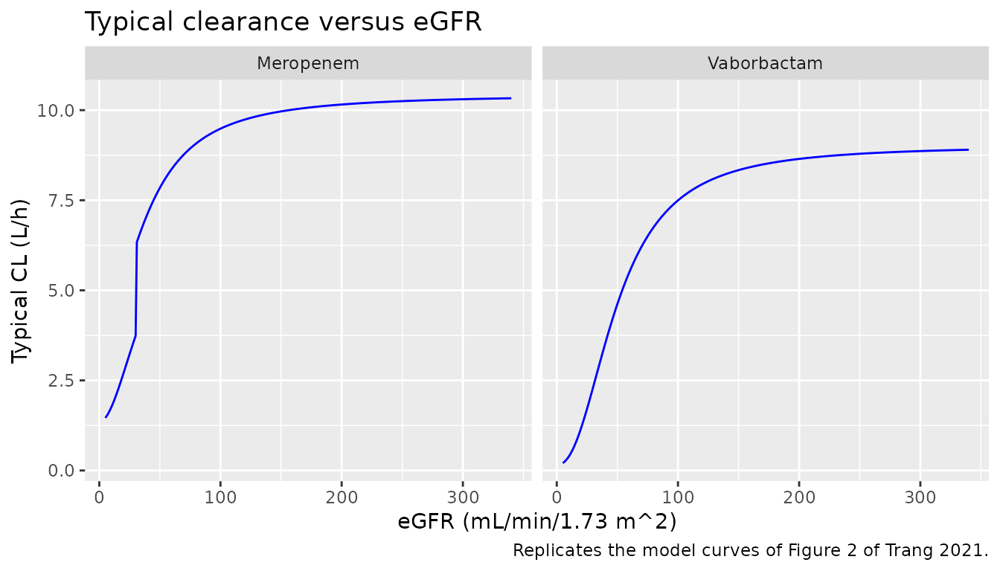
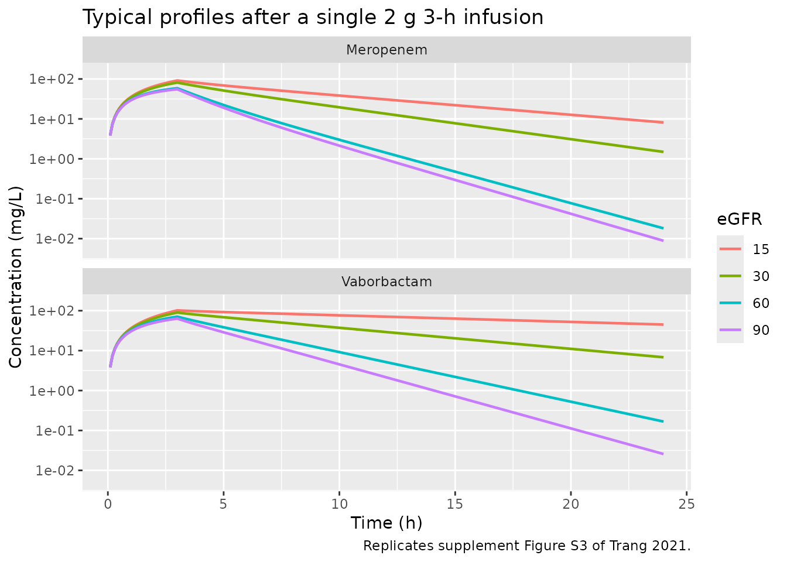
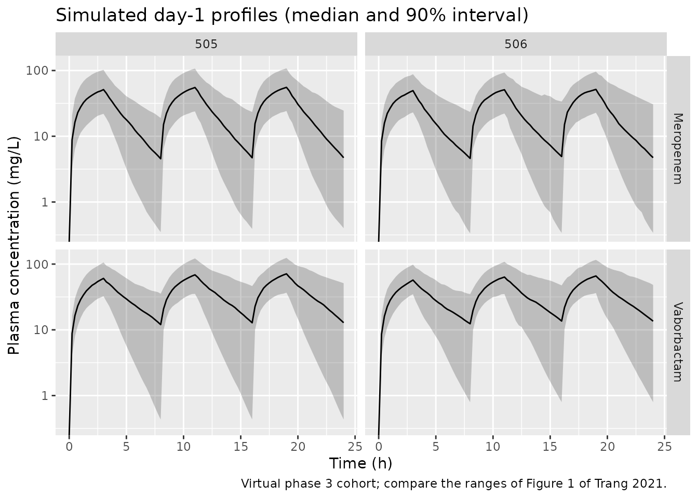

# Meropenem and vaborbactam (Trang 2021)

## Model and source

- Meropenem citation: Trang M, Griffith DC, Bhavnani SM, Loutit JS,
  Dudley MN, Ambrose PG, Rubino CM. 2021. Population pharmacokinetics of
  meropenem and vaborbactam based on data from noninfected subjects and
  infected patients. Antimicrob Agents Chemother 65:e02606-20.
  <doi:10.1128/AAC.02606-20>. Covariate-equation forms and reference
  values from the FDA Clinical Pharmacology review of NDA 209776
  (Vabomere, 2017), section 4.2, Equations (1)-(3).
- Meropenem description: Two-compartment population PK model for
  intravenous meropenem (given with vaborbactam) in noninfected adults
  and adults with complicated urinary tract, bloodstream or other
  serious infections, with a sigmoidal Hill relationship between renal
  clearance and MDRD eGFR, a lower nonrenal clearance at eGFR \<= 30
  mL/min/1.73 m^2, a power effect of age on clearance, fixed allometric
  weight scaling, and a cumulative urine compartment for the urinary
  concentrations
- Vaborbactam description: Two-compartment population PK model for
  intravenous vaborbactam (given with meropenem) in noninfected adults
  and adults with complicated urinary tract, bloodstream or other
  serious infections, with a sigmoidal Hill relationship between renal
  clearance and MDRD eGFR, power effects of height on clearance and body
  surface area on central volume, proportional study-phase shifts on
  clearance and both volumes, and a cumulative urine compartment for the
  urinary concentrations
- Article: <https://doi.org/10.1128/AAC.02606-20>
- Supplement (Tables S1-S3, Figures S1-S7): supplemental file 1 of the
  article (`aac.02606-20-s0001.pdf`)
- FDA Clinical Pharmacology review of NDA 209776 (Vabomere), section
  4.2:
  <https://www.accessdata.fda.gov/drugsatfda_docs/nda/2017/209776Orig1s000TOC.cfm>

Meropenem-vaborbactam is a fixed-dose carbapenem / cyclic boronic acid
beta-lactamase inhibitor combination given as 2 g + 2 g over 3 h every 8
h, with dose reductions for renal impairment. Because co-administration
does not alter the PK of either drug, Trang 2021 fitted two **separate**
population PK models, one per drug, to the same pooled phase 1 and phase
3 data set. Both are two-compartment models with zero-order infusion and
first-order elimination, in which plasma and urine concentrations were
co-modelled so that total clearance splits into a constant nonrenal arm
and a sigmoidal Hill function of the MDRD eGFR for the renal arm:

``` math
\mathrm{CL} = \left(\mathrm{CL_{NR}} + \mathrm{CL_{R,max}}\,
\frac{\mathrm{eGFR}^{\gamma}}{\mathrm{eGFR_{50}}^{\gamma} + \mathrm{eGFR}^{\gamma}}\right)
\times \text{(covariate factors)}
```

For meropenem the covariate factors are a fixed allometric weight term,
`(WT/80)^0.75`, a power effect of age, `(AGE/58)^-0.526`, and a 65%
lower nonrenal clearance when eGFR is at or below 30 mL/min/1.73 m^2.
For vaborbactam they are a power effect of height on CL,
`(HT/168)^2.24`, a power effect of body surface area on Vc,
`(BSA/1.88)^1.50`, and proportional shifts on CL, Vc and Vp for the
phase 1 noninfected subjects relative to the phase 3 infected patients.
The paper therefore contributes two model files, `Trang_2021_meropenem`
and `Trang_2021_vaborbactam`, documented together here.

## Population

Trang 2021 pooled two phase 1 studies in noninfected adults (study 501,
healthy volunteers given single and multiple ascending doses; study 504,
adults with normal renal function through end-stage renal disease) and
two phase 3 studies in infected patients (study 505, TANGO I,
complicated urinary tract infection or acute pyelonephritis; study 506,
TANGO II, infections due to confirmed or suspected carbapenem-resistant
*Enterobacterales*). Table 1 of the paper summarises the 431 enrolled
subjects: median age 53 years (18-92), weight 75.0 kg (40.0-177), height
168 cm (145-193), BSA 1.84 m^2 (1.27-2.83), MDRD eGFR 90.1 mL/min/1.73
m^2 (4.50-338), and 55% female. The final meropenem data set held 4,264
plasma concentrations from 91 noninfected subjects and 322 infected
patients plus 834 urine concentrations from 84 noninfected subjects; the
final vaborbactam data set held 4,082 plasma concentrations from 93
subjects and 321 patients plus 746 urine concentrations from 75
subjects. The same information is available programmatically via
`readModelDb("Trang_2021_meropenem")()$population`.

## Source trace

The per-parameter origin is recorded as an in-file comment next to each
`ini()` entry. Parameter values are the **final** models of Trang 2021
Tables 2 and 3 (the updated models fitted after study 506 completed).
The paper does not print the covariate equations or their normalising
values; those come from the FDA review of the same analysis’ initial
models (Equations 1-3 for meropenem and the vaborbactam equations on the
following page), whose parameter values equal supplement Tables S1 and
S2.

| Equation / parameter | Meropenem | Vaborbactam | Source location |
|----|----|----|----|
| `lcl_nonren` (CL_NR, L/h) | 3.85 | 0.157 | Table 2 / Table 3 |
| `lcl_renal_max` (CL_R,max, L/h) | 6.58 | 8.86 | Table 2 / Table 3 |
| `lcrcl50` (eGFR50, mL/min/1.73 m^2) | 40.0 | 49.7 | Table 2 / Table 3 |
| `lhill` (Hill coefficient) | 1.95 | 2.25 | Table 2 / Table 3 |
| `lvc` (Vc, L) | 17.0 | 17.1 | Table 2 / Table 3 |
| `lq` (CLd, L/h) | 1.36 | 2.75 | Table 2 / Table 3 |
| `lvp` (Vp, L) | 2.32 | 1.77 | Table 2 / Table 3 |
| `e_wt_cl`, `e_wt_q` / `e_wt_vc`, `e_wt_vp` | 0.75 / 1.00 (fixed) | – | Table 2 |
| `e_age_cl` | -0.526 | – | Table 2 |
| `e_rgrp_cl_nonren` | -0.650 | – | Table 2; `(1 + theta * RGRP)` form, RGRP per FDA review Eq. 1 |
| `e_ht_cl` | – | 2.24 | Table 3 |
| `e_bsa_vc` | – | 1.50 | Table 3 |
| `e_phase1_cl` / `e_phase1_vc` / `e_phase1_vp` | – | 0.517 / -0.215 / 1.28 | Table 3; `(1 + theta * Phase)` form per FDA review |
| IIV CL / Vc / CLd / Vp (%CV) | 44.5 / 48.4 / 51.7 / 37.7 | 45.6 / 39.4 / 34.5 / 23.0 | Table 2 / Table 3; `omega^2 = log(CV^2 + 1)` |
| Plasma prop / add residual (variance) | 0.0423 / 0.0204 | 0.0372 / 0.0287 | Table 2 / Table 3 |
| Urine prop / add residual (variance) | 0.207 / 0.0511 | 0.115 / 5.46 | Table 2 / Table 3 |
| Reference WT 80 kg, AGE 58 years | yes | – | FDA review Eqs. 1-3 (initial model); Discussion (58-year-old typical patient) |
| Reference HT 168 cm, BSA 1.88 m^2; Phase = 1 for phase 1 | – | yes | FDA review vaborbactam equations |
| Hill CL-eGFR structure, two compartments | yes | yes | Results (i) and (iv); FDA review structural diagrams |
| `d/dt(urine) <- frac_renal * kel * central` | yes | yes | Materials and Methods: urine and plasma co-modelled to estimate CL_R and CL_NR |
| `Curine <- urine / (URINE_VOL_INTERVAL / 1000)` | yes | yes | urine concentrations over collection intervals (supplement Table S3) |

## Typical-value checks against the paper’s own statements

The Discussion gives three typical-value numbers for meropenem: a
population mean CL of “about 10 liters/h in a 58-year-old patient with
an eGFR of 100 ml/min/1.73 m^2”, a renally cleared fraction of
“approximately 59%” at that eGFR, and a CL of “approximately 7 liters/h”
at an eGFR of 40. These follow in closed form from the model and are
checked on the solved model’s own `cl` and `frac_renal` columns.

``` r

mod_mer <- readModelDb("Trang_2021_meropenem")
mod_vab <- readModelDb("Trang_2021_vaborbactam")

# Reference covariates of both models: 80 kg and 58 years (meropenem); 168 cm,
# BSA 1.88 m^2 and a phase 3 infected patient (vaborbactam).
ref_cov <- data.frame(
  WT = 80, AGE = 58, HT = 168, BSA = 1.88, STUDY_PHASE3 = 1,
  URINE_VOL_INTERVAL = 1000
)

# One subject, one 3-h infusion into central, plasma observation rows on the
# central state. Both models declare two endpoints (Cc, Curine), so
# observation rows carry dvid = 1 (the Cc endpoint) alongside the state name.
typical_events <- function(egfr, amt = 2000, dur = 3, times = seq(0, 24, by = 0.1), id = 1L) {
  dose <- data.frame(
    id = id, time = 0, evid = 1L, amt = amt, rate = amt / dur,
    cmt = "central", dvid = NA_integer_
  )
  obs <- data.frame(
    id = id, time = times, evid = 0L, amt = 0, rate = 0,
    cmt = "central", dvid = 1L
  )
  dplyr::bind_rows(dose, obs) |>
    dplyr::mutate(CRCL = egfr) |>
    dplyr::bind_cols(ref_cov)
}

solve_typical <- function(mod, events) {
  rxode2::rxSolve(
    mod,
    events = events, omega = NA, sigma = NA,
    returnType = "data.frame"
  )
}
```

``` r

chk <- dplyr::bind_rows(
  solve_typical(mod_mer, typical_events(100, times = 1)) |> dplyr::mutate(egfr = 100),
  solve_typical(mod_mer, typical_events(40, times = 1)) |> dplyr::mutate(egfr = 40)
) |>
  dplyr::select(egfr, cl, frac_renal)
#> ℹ parameter labels from comments will be replaced by 'label()'

knitr::kable(
  chk |>
    dplyr::mutate(
      published = c("CL about 10 L/h; renal fraction about 59%", "CL about 7 L/h")
    ) |>
    dplyr::rename(
      "eGFR (mL/min/1.73 m^2)" = egfr,
      "Model CL (L/h)" = cl,
      "Model renal fraction" = frac_renal,
      "Trang 2021 Discussion" = published
    ),
  digits = 3,
  caption = "Typical meropenem clearance at 58 years and the reference weight."
)
```

| eGFR (mL/min/1.73 m^2) | Model CL (L/h) | Model renal fraction | Trang 2021 Discussion |
|---:|---:|---:|:---|
| 100 | 9.486 | 0.594 | CL about 10 L/h; renal fraction about 59% |
| 40 | 7.140 | 0.461 | CL about 7 L/h |

Typical meropenem clearance at 58 years and the reference weight.
{.table}

``` r


# Typical values: no random effects, so these are exact closed-form checks.
# A mis-transcribed CL_NR, CL_R,max, eGFR50 or Hill coefficient moves them
# outside these bands immediately.
stopifnot(
  abs(chk$cl[chk$egfr == 100] - 10) < 0.75, # 9.49 L/h: 'about 10 liters/h'
  abs(chk$frac_renal[chk$egfr == 100] - 0.59) < 0.01, # 0.594: 'approximately 59%'
  abs(chk$cl[chk$egfr == 40] - 7) < 0.5 # 7.14 L/h: 'approximately 7 liters/h'
)
```

### Figure 2: clearance versus eGFR

Figure 2 of Trang 2021 overlays the typical-value Hill function on the
individual post hoc clearances, with every covariate other than eGFR at
its reference value. The typical curves are reproduced below; the step
in the meropenem curve at 30 mL/min/1.73 m^2 is the lower nonrenal
clearance of the renal group.

``` r

# One subject per eGFR value, solved in a single call per drug.
egfr_grid <- c(seq(5, 29.9, by = 0.1), seq(30, 340, by = 1))
grid_events <- dplyr::bind_rows(lapply(seq_along(egfr_grid), function(i) {
  typical_events(egfr_grid[i], times = 1, id = i)
}))
fig2 <- dplyr::bind_rows(
  solve_typical(mod_mer, grid_events) |> dplyr::mutate(drug = "Meropenem"),
  solve_typical(mod_vab, grid_events) |> dplyr::mutate(drug = "Vaborbactam")
) |>
  dplyr::mutate(egfr = egfr_grid[id])
#> ℹ parameter labels from comments will be replaced by 'label()'

ggplot(fig2, aes(egfr, cl)) +
  geom_line(colour = "blue") +
  facet_wrap(~drug) +
  labs(
    x = "eGFR (mL/min/1.73 m^2)", y = "Typical CL (L/h)",
    title = "Typical clearance versus eGFR",
    caption = "Replicates the model curves of Figure 2 of Trang 2021."
  )
```



The plateau clearances are CL_NR + CL_R,max = 10.43 L/h for meropenem
and 9.02 L/h for vaborbactam. The Results note that the two curves have
very similar shapes, which the paper uses to argue that one eGFR-based
dose adjustment serves both drugs.

### Figure S3: typical profiles by renal function

Supplement Figure S3 shows a typical infected patient given a single 2 g
3-h infusion of each drug at eGFR 15, 30, 60 and 90 mL/min/1.73 m^2. The
maintainers read the 24-h concentrations off the figure’s log axis. The
vaborbactam values are about 45, 7, 0.15 and 0.025 mg/L; the meropenem
values at eGFR 15, 60 and 90 are about 8, 0.018 and 0.009 mg/L.

``` r

s3 <- dplyr::bind_rows(lapply(c(15, 30, 60, 90), function(e) {
  dplyr::bind_rows(
    solve_typical(mod_mer, typical_events(e)) |> dplyr::mutate(drug = "Meropenem"),
    solve_typical(mod_vab, typical_events(e)) |> dplyr::mutate(drug = "Vaborbactam")
  ) |>
    dplyr::mutate(egfr = factor(e))
}))

# Plot only (drop the pre-dose zero for the log axis); not a PKNCA input.
ggplot(s3[s3$time >= 0.1, ], aes(time, Cc, colour = egfr)) +
  geom_line(linewidth = 0.8) +
  facet_wrap(~drug, ncol = 1) +
  scale_y_log10(limits = c(0.005, 150)) +
  labs(
    x = "Time (h)", y = "Concentration (mg/L)", colour = "eGFR",
    title = "Typical profiles after a single 2 g 3-h infusion",
    caption = "Replicates supplement Figure S3 of Trang 2021."
  )
```



``` r


c24 <- s3 |>
  dplyr::filter(abs(time - 24) < 1e-8) |>
  dplyr::select(drug, egfr, Cc)
knitr::kable(
  c24 |> dplyr::rename("eGFR" = egfr, "Model C at 24 h (mg/L)" = Cc),
  digits = 4,
  caption = "Typical 24-h concentrations."
)
```

| drug        | eGFR | Model C at 24 h (mg/L) |
|:------------|:-----|-----------------------:|
| Meropenem   | 15   |                 8.1486 |
| Vaborbactam | 15   |                44.9602 |
| Meropenem   | 30   |                 1.4898 |
| Vaborbactam | 30   |                 6.8132 |
| Meropenem   | 60   |                 0.0181 |
| Vaborbactam | 60   |                 0.1673 |
| Meropenem   | 90   |                 0.0088 |
| Vaborbactam | 90   |                 0.0257 |

Typical 24-h concentrations. {.table}

``` r


got24 <- function(d, e) c24$Cc[c24$drug == d & c24$egfr == e]
fig_read <- tibble::tribble(
  ~drug, ~egfr, ~read,
  "Vaborbactam", 15, 45,
  "Vaborbactam", 30, 7,
  "Vaborbactam", 60, 0.15,
  "Vaborbactam", 90, 0.025,
  "Meropenem", 15, 8,
  "Meropenem", 60, 0.018,
  "Meropenem", 90, 0.009
)
fig_read$model <- mapply(got24, fig_read$drug, fig_read$egfr)
# Typical values against values read off a log axis. The terminal phase spans
# four decades across the panels, so a mis-transcribed clearance or volume
# moves the 24-h value by far more than the reading error allowed here.
stopifnot(all(abs(log(fig_read$model / fig_read$read)) < log(1.5)))
```

All seven readings are reproduced to within a factor of 1.5. The
remaining meropenem curve, eGFR = 30, is not. The model gives a 24-h
concentration of 1.49 mg/L, while the figure’s green curve ends near 0.1
mg/L and its peak sits well below the eGFR-15 peak. The paper text (“an
eGFR of \<= 30 ml/min/1.73 m^2”) and the FDA review equation (RGRP = 1
for eGFR \<= 30) both place eGFR = 30 inside the renal group. The figure
is instead consistent with the full nonrenal clearance at that eGFR, as
shown below with an eGFR just above the threshold. The packaged model
follows the text and the equation.

``` r

just_above <- solve_typical(mod_mer, typical_events(30.001))
c(
  C24_at_30 = got24("Meropenem", 30),
  C24_just_above_30 = just_above$Cc[abs(just_above$time - 24) < 1e-8]
)
#>         C24_at_30 C24_just_above_30 
#>         1.4898345         0.1182988
```

## Virtual phase 3 cohort

Tables 4 and 5 of Trang 2021 summarise, as geometric means, the
exposures of the phase 3 patients derived from their individual post hoc
parameters. The virtual cohort below approximates the Table 1
demographics of studies 505 and 506 (200 patients each). Age, height and
weight are drawn around the study medians and truncated to the study
ranges, BSA is computed from them by the DuBois and DuBois formula the
paper used, and eGFR is drawn log-normally around the study median and
truncated to the range. Doses follow the protocol renal adjustments of
supplement Table S3, applied to eGFR as a stand-in for creatinine
clearance. The eGFR is held constant over the simulated 5 days.

``` r

set.seed(20210817)
rxode2::rxSetSeed(20210817)

rtrunc_norm <- function(n, mean, sd, lo, hi) {
  x <- stats::rnorm(n, mean, sd)
  while (any(bad <- x < lo | x > hi)) x[bad] <- stats::rnorm(sum(bad), mean, sd)
  x
}
rtrunc_lnorm <- function(n, median, sdlog, lo, hi) {
  exp(rtrunc_norm(n, log(median), sdlog, log(lo), log(hi)))
}

# Table 1 medians and ranges per study.
study_demo <- tibble::tribble(
  ~study, ~age, ~age_lo, ~age_hi, ~ht, ~ht_lo, ~ht_hi, ~wt, ~wt_lo, ~wt_hi, ~egfr, ~egfr_lo, ~egfr_hi, ~egfr_sdlog,
  "505", 58.0, 18, 92, 165, 148, 192, 73.8, 43.8, 150, 86.9, 12.6, 241, 0.45,
  "506", 64.0, 29, 88, 168, 145, 188, 74.8, 40.0, 177, 72.1, 4.50, 338, 0.50
)

# Supplement Table S3 dose adjustment. Study 505 had only the > 50 and 30-50
# bands; the few 505 patients simulated below 30 take the 30-50 regimen.
dose_regimen <- function(study, egfr) {
  if (egfr > 50) {
    return(list(amt = 2000, ii = 8))
  }
  if (study == "505" || egfr > 30) {
    return(list(amt = 1000, ii = 8))
  }
  if (egfr > 20) {
    return(list(amt = 1000, ii = 12))
  }
  if (egfr > 10) {
    return(list(amt = 500, ii = 12))
  }
  list(amt = 500, ii = 24)
}

make_patients <- function(d, n, id_offset) {
  tibble::tibble(
    id = id_offset + seq_len(n),
    study = d$study,
    AGE = rtrunc_norm(n, d$age, 16, d$age_lo, d$age_hi),
    HT = rtrunc_norm(n, d$ht, 9, d$ht_lo, d$ht_hi),
    WT = rtrunc_lnorm(n, d$wt, 0.22, d$wt_lo, d$wt_hi),
    CRCL = rtrunc_lnorm(n, d$egfr, d$egfr_sdlog, d$egfr_lo, d$egfr_hi)
  ) |>
    dplyr::mutate(
      BSA = 0.007184 * WT^0.425 * HT^0.725,
      STUDY_PHASE3 = 1,
      URINE_VOL_INTERVAL = 1000
    )
}

patients <- dplyr::bind_rows(
  make_patients(study_demo[1, ], 200, 0L),
  make_patients(study_demo[2, ], 200, 200L)
)
patients$amt <- NA_real_
patients$ii <- NA_real_
for (i in seq_len(nrow(patients))) {
  r <- dose_regimen(patients$study[i], patients$CRCL[i])
  patients$amt[i] <- r$amt
  patients$ii[i] <- r$ii
}

obs_times <- sort(unique(c(seq(0, 24, by = 0.25), seq(96, 120, by = 0.25))))
events <- dplyr::bind_rows(lapply(seq_len(nrow(patients)), function(i) {
  p <- patients[i, ]
  dose_times <- seq(0, 120 - p$ii, by = p$ii)
  dplyr::bind_rows(
    tibble::tibble(
      id = p$id, time = dose_times, evid = 1L, amt = p$amt,
      rate = p$amt / 3, cmt = "central", dvid = NA_integer_
    ),
    tibble::tibble(
      id = p$id, time = obs_times, evid = 0L, amt = 0, rate = 0,
      cmt = "central", dvid = 1L
    )
  ) |>
    dplyr::mutate(
      study = p$study, AGE = p$AGE, HT = p$HT, WT = p$WT, BSA = p$BSA,
      CRCL = p$CRCL, STUDY_PHASE3 = 1, URINE_VOL_INTERVAL = 1000
    )
})) |>
  dplyr::arrange(id, time, dplyr::desc(evid))
stopifnot(!anyDuplicated(unique(events[, c("id", "time", "evid")])))

patients |>
  dplyr::group_by(study) |>
  dplyr::summarise(
    n = dplyr::n(),
    age = stats::median(AGE), wt = stats::median(WT), ht = stats::median(HT),
    bsa = stats::median(BSA), egfr = stats::median(CRCL),
    pct_reduced_dose = 100 * mean(amt < 2000 | ii > 8),
    .groups = "drop"
  ) |>
  dplyr::rename(
    "Study" = study, "N" = n, "Age (y)" = age, "Weight (kg)" = wt,
    "Height (cm)" = ht, "BSA (m^2)" = bsa, "eGFR" = egfr,
    "Reduced dose (%)" = pct_reduced_dose
  ) |>
  knitr::kable(digits = 1, caption = "Virtual cohort medians.")
```

| Study |   N | Age (y) | Weight (kg) | Height (cm) | BSA (m^2) | eGFR | Reduced dose (%) |
|:------|----:|--------:|------------:|------------:|----------:|-----:|-----------------:|
| 505   | 200 |    58.2 |        75.7 |       164.7 |       1.8 | 86.4 |               13 |
| 506   | 200 |    63.5 |        73.0 |       167.8 |       1.8 | 72.9 |               23 |

Virtual cohort medians. {.table style="width:100%;"}

For comparison, Table 4’s footnote records a reduced dose for 28 of 272
patients (10%) in study 505 and 9 of 50 (18%) in study 506.

## Simulation

``` r

sim_mer <- rxode2::rxSolve(
  mod_mer,
  events = events, keep = c("study"), returnType = "data.frame"
) |>
  dplyr::mutate(drug = "Meropenem")
sim_vab <- rxode2::rxSolve(
  mod_vab,
  events = events, keep = c("study"), returnType = "data.frame"
) |>
  dplyr::mutate(drug = "Vaborbactam")
sim <- dplyr::bind_rows(sim_mer, sim_vab)
```

``` r

sim |>
  dplyr::filter(time <= 24) |>
  dplyr::group_by(drug, study, time) |>
  dplyr::summarise(
    Q05 = stats::quantile(Cc, 0.05), Q50 = stats::quantile(Cc, 0.50),
    Q95 = stats::quantile(Cc, 0.95), .groups = "drop"
  ) |>
  ggplot(aes(time, Q50)) +
  geom_ribbon(aes(ymin = Q05, ymax = Q95), alpha = 0.25) +
  geom_line() +
  facet_grid(drug ~ study) +
  scale_y_log10() +
  labs(
    x = "Time (h)", y = "Plasma concentration (mg/L)",
    title = "Simulated day-1 profiles (median and 90% interval)",
    caption = "Virtual phase 3 cohort; compare the ranges of Figure 1 of Trang 2021."
  )
#> Warning in scale_y_log10(): log-10 transformation introduced infinite values.
#> log-10 transformation introduced infinite values.
#> log-10 transformation introduced infinite values.
#> log-10 transformation introduced infinite values.
```



## PKNCA validation

Cmax over the first dosing interval, AUC0-24 on day 1 and AUC0-24 at
steady state (day 5) are computed with PKNCA per study. The paper’s
exposures come from the individual post hoc parameters of the fitted
patients, so the comparison is between geometric means.

``` r

nca_one <- function(sim_drug, events) {
  conc <- sim_drug |>
    dplyr::filter(!is.na(Cc)) |>
    dplyr::select(id, time, Cc, study)
  conc <- dplyr::bind_rows(
    conc,
    conc |> dplyr::distinct(id, study) |> dplyr::mutate(time = 0, Cc = 0)
  ) |>
    dplyr::distinct(id, study, time, .keep_all = TRUE) |>
    dplyr::arrange(id, time)
  doses <- events |>
    dplyr::filter(evid == 1) |>
    dplyr::select(id, time, amt, study)
  intervals <- data.frame(
    start = c(0, 0, 96), end = c(8, 24, 120),
    cmax = c(TRUE, FALSE, FALSE), auclast = c(FALSE, TRUE, TRUE)
  )
  # One PKNCA call per study keeps each call small (the cost grows faster
  # than linearly in the number of subject-intervals).
  res <- lapply(unique(conc$study), function(s) {
    cobj <- PKNCA::PKNCAconc(dplyr::filter(conc, study == s), Cc ~ time | study + id)
    dobj <- PKNCA::PKNCAdose(dplyr::filter(doses, study == s), amt ~ time | study + id)
    as.data.frame(PKNCA::pk.nca(PKNCA::PKNCAdata(cobj, dobj, intervals = intervals)))
  })
  dplyr::bind_rows(res) |>
    dplyr::filter(PPTESTCD %in% c("cmax", "auclast")) |>
    dplyr::mutate(
      window = dplyr::case_when(
        PPTESTCD == "cmax" ~ "First dose (0-8 h)",
        start == 0 ~ "Day 1 (0-24 h)",
        TRUE ~ "Steady state (96-120 h)"
      )
    )
}

nca_mer <- nca_one(sim_mer, events) |> dplyr::mutate(drug = "Meropenem")
nca_vab <- nca_one(sim_vab, events) |> dplyr::mutate(drug = "Vaborbactam")
nca_all <- dplyr::bind_rows(nca_mer, nca_vab)

geo <- function(x) exp(mean(log(x)))
sim_geo <- nca_all |>
  dplyr::group_by(drug, study, window, PPTESTCD) |>
  dplyr::summarise(PPORRES = geo(PPORRES), .groups = "drop")
```

### Comparison against published exposures

``` r

# Trang 2021 Table 4 (meropenem) and Table 5 (vaborbactam): geometric means.
published <- tibble::tribble(
  ~drug, ~study, ~window, ~PPTESTCD, ~PPORRES,
  "Meropenem", "505", "First dose (0-8 h)", "cmax", 52.3,
  "Meropenem", "505", "Day 1 (0-24 h)", "auclast", 564,
  "Meropenem", "505", "Steady state (96-120 h)", "auclast", 548,
  "Meropenem", "506", "First dose (0-8 h)", "cmax", 75.4,
  "Meropenem", "506", "Day 1 (0-24 h)", "auclast", 802,
  "Meropenem", "506", "Steady state (96-120 h)", "auclast", 857,
  "Vaborbactam", "505", "First dose (0-8 h)", "cmax", 65.4,
  "Vaborbactam", "505", "Day 1 (0-24 h)", "auclast", 739,
  "Vaborbactam", "505", "Steady state (96-120 h)", "auclast", 710,
  "Vaborbactam", "506", "First dose (0-8 h)", "cmax", 90.4,
  "Vaborbactam", "506", "Day 1 (0-24 h)", "auclast", 1020,
  "Vaborbactam", "506", "Steady state (96-120 h)", "auclast", 1190
)

cmp <- nlmixr2lib::ncaComparisonTable(
  simulated = sim_geo,
  reference = published,
  by = c("drug", "study", "window"),
  units = c(cmax = "mg/L", auclast = "mg*h/L"),
  tolerance_pct = 20
)
knitr::kable(
  cmp,
  caption = paste(
    "Simulated vs. published geometric-mean exposures (Tables 4 and 5).",
    "* differs from the published value by more than 20%."
  )
)
```

| NCA parameter | drug | study | window | Reference | Simulated | % diff |
|:---|:---|:---|:---|:---|:---|:---|
| Cmax (mg/L) | Meropenem | 505 | First dose (0-8 h) | 52.3 | 51.4 | -1.8% |
| Cmax (mg/L) | Meropenem | 506 | First dose (0-8 h) | 75.4 | 47.7 | -36.7%\* |
| Cmax (mg/L) | Vaborbactam | 505 | First dose (0-8 h) | 65.4 | 59.9 | -8.4% |
| Cmax (mg/L) | Vaborbactam | 506 | First dose (0-8 h) | 90.4 | 57.3 | -36.6%\* |
| AUClast (mg\*h/L) | Meropenem | 505 | Day 1 (0-24 h) | 564 | 614 | +8.9% |
| AUClast (mg\*h/L) | Meropenem | 505 | Steady state (96-120 h) | 548 | 640 | +16.9% |
| AUClast (mg\*h/L) | Meropenem | 506 | Day 1 (0-24 h) | 802 | 584 | -27.2%\* |
| AUClast (mg\*h/L) | Meropenem | 506 | Steady state (96-120 h) | 857 | 613 | -28.4%\* |
| AUClast (mg\*h/L) | Vaborbactam | 505 | Day 1 (0-24 h) | 739 | 844 | +14.2% |
| AUClast (mg\*h/L) | Vaborbactam | 505 | Steady state (96-120 h) | 710 | 917 | +29.2%\* |
| AUClast (mg\*h/L) | Vaborbactam | 506 | Day 1 (0-24 h) | 1020 | 817 | -19.9% |
| AUClast (mg\*h/L) | Vaborbactam | 506 | Steady state (96-120 h) | 1190 | 901 | -24.3%\* |

Simulated vs. published geometric-mean exposures (Tables 4 and 5). \*
differs from the published value by more than 20%. {.table}

``` r

# Individual CL and the alpha / beta half-lives from each subject's own
# micro-constants (the quantities Tables 4 and 5 also report).
indiv <- sim |>
  dplyr::group_by(drug, study, id) |>
  dplyr::slice(1) |>
  dplyr::ungroup() |>
  dplyr::mutate(
    a = kel + k12 + k21,
    lambda1 = (a + sqrt(a^2 - 4 * kel * k21)) / 2,
    lambda2 = (a - sqrt(a^2 - 4 * kel * k21)) / 2,
    thalf_a = log(2) / lambda1,
    thalf_b = log(2) / lambda2
  )

derived <- indiv |>
  dplyr::group_by(drug, study) |>
  dplyr::summarise(
    cl = geo(cl), thalf_a = geo(thalf_a), thalf_b = geo(thalf_b),
    .groups = "drop"
  ) |>
  dplyr::left_join(
    tibble::tribble(
      ~drug, ~study, ~cl_pub, ~thalf_a_pub, ~thalf_b_pub,
      "Meropenem", "505", 9.61, 0.751, 1.79,
      "Meropenem", "506", 4.96, 0.895, 2.61,
      "Vaborbactam", "505", 7.04, 0.377, 1.82,
      "Vaborbactam", "506", 3.15, 0.390, 3.87
    ),
    by = c("drug", "study")
  )

derived |>
  dplyr::select(drug, study, cl, cl_pub, thalf_a, thalf_a_pub, thalf_b, thalf_b_pub) |>
  dplyr::rename(
    "Drug" = drug, "Study" = study,
    "CL sim (L/h)" = cl, "CL published" = cl_pub,
    "t1/2,a sim (h)" = thalf_a, "t1/2,a published" = thalf_a_pub,
    "t1/2,b sim (h)" = thalf_b, "t1/2,b published" = thalf_b_pub
  ) |>
  knitr::kable(digits = 3, caption = "Geometric means of individual CL and half-lives.")
```

| Drug | Study | CL sim (L/h) | CL published | t1/2,a sim (h) | t1/2,a published | t1/2,b sim (h) | t1/2,b published |
|:---|:---|---:|---:|---:|---:|---:|---:|
| Meropenem | 505 | 8.554 | 9.61 | 0.743 | 0.751 | 2.181 | 1.79 |
| Meropenem | 506 | 8.205 | 4.96 | 0.733 | 0.895 | 2.239 | 2.61 |
| Vaborbactam | 505 | 5.975 | 7.04 | 0.362 | 0.377 | 2.210 | 1.82 |
| Vaborbactam | 506 | 5.576 | 3.15 | 0.393 | 0.390 | 2.377 | 3.87 |

Geometric means of individual CL and half-lives. {.table}

``` r

pct_diff <- sim_geo |>
  dplyr::inner_join(published, by = c("drug", "study", "window", "PPTESTCD"),
                    suffix = c("_sim", "_pub")) |>
  dplyr::mutate(pct = 100 * (PPORRES_sim - PPORRES_pub) / PPORRES_pub)

# Study 505 is the large cUTI trial (272 of the 322 patients) whose
# demographics the virtual cohort follows most closely. Its DAY-1 geometric
# means (first-dose Cmax, day-1 AUC0-24) are the structural gate: a
# mis-transcribed CL, V or dose shifts them by tens of percent. Realised
# |% diff| on this machine: 1.8-14.2%; the Monte Carlo SE of a 200-subject
# geometric mean at ~50% CV is about 3.5%, so 25% leaves room for any cohort.
# Steady-state AUC is reported but not gated (see the text below), and study
# 506 (50 sicker patients with carbapenem-resistant infections) is reported but
# not gated.
gate <- dplyr::filter(pct_diff, study == "505", window != "Steady state (96-120 h)")
stopifnot(nrow(gate) == 4L, all(abs(gate$pct) < 25))

ss_pct <- function(d) {
  round(pct_diff$pct[pct_diff$drug == d & pct_diff$study == "505" &
    pct_diff$window == "Steady state (96-120 h)"])
}
cl_pct <- function(d) {
  x <- derived[derived$drug == d & derived$study == "505", ]
  round(100 * (x$cl - x$cl_pub) / x$cl_pub)
}
```

For study 505 the first-dose Cmax and day-1 AUC0-24 of both drugs fall
within 25% of Tables 4 and 5. The simulated steady-state AUC0-24 runs
higher: 17% for meropenem and 29% for vaborbactam. In the paper the
steady-state AUC0-24 is *lower* than on day 1 for both drugs (548 versus
564 mg\*h/L for meropenem, 710 versus 739 for vaborbactam), although a
3-h infusion every 8 h with a 2-h terminal half-life should accumulate
slightly. That pattern fits the time-varying eGFR the fitted patients
carried: renal function improved as their infections resolved. The
virtual cohort holds eGFR at its baseline value, so its steady-state
exposure keeps the day-1 clearance. Vaborbactam, cleared almost entirely
by the kidney, is the more sensitive of the two. The geometric mean CLs
of the study-505 cohort differ from the published values by -11%
(meropenem) and -15% (vaborbactam). A gap of that size is consistent
with approximating the eGFR distribution from its median and range.

Study 506 is simulated from the Table 1 medians and ranges only. Its
published CL geometric means (4.96 L/h for meropenem and 3.15 L/h for
vaborbactam) sit about half of the study-505 values, although the median
eGFR is only 17% lower. So the 506 patients cleared both drugs more
slowly than a cohort matched on median eGFR, age and body size predicts,
and the simulated 506 exposures are expected to fall below the published
ones. That is a limit of matching a cohort on its medians, not a defect
of the model. Table 5 also excludes two 506 patients with extreme t1/2,b
values of 63.5 and 50.9 h.

## Urinary excretion

Both models co-fit urine concentrations collected over intervals in the
phase 1 studies. The `urine` state accumulates renally excreted drug at
the rate `frac_renal * CL * Cc`, so after a single dose at constant eGFR
its asymptote is exactly `frac_renal * dose`. The check below confirms
this mass balance and then shows the interval-concentration observable,
`Curine`, for the 0-4, 4-8, 8-12 and 12-24 h collections of study 501
(supplement Table S3) with a nominal collected volume.

``` r

ub <- dplyr::bind_rows(
  solve_typical(mod_mer, typical_events(117, times = c(0, 96))) |> dplyr::mutate(drug = "Meropenem"),
  solve_typical(mod_vab, typical_events(117, times = c(0, 96))) |>
    dplyr::mutate(drug = "Vaborbactam")
) |>
  dplyr::filter(time == 96) |>
  dplyr::transmute(drug, fe_96h = urine / 2000, frac_renal)
knitr::kable(ub, digits = 4, caption = "Fraction of a 2 g dose excreted in urine by 96 h at eGFR 117 (study 501 median).")
```

| drug        | fe_96h | frac_renal |
|:------------|-------:|-----------:|
| Meropenem   | 0.6034 |     0.6034 |
| Vaborbactam | 0.9801 |     0.9801 |

Fraction of a 2 g dose excreted in urine by 96 h at eGFR 117 (study 501
median). {.table}

``` r

# Nearly all drug has left the body by 96 h, so the excreted fraction must
# equal the renal fraction of clearance to within integration error.
stopifnot(all(abs(ub$fe_96h - ub$frac_renal) < 1e-3))
```

``` r

# Urine collected 0-4, 4-8, 8-12 and 12-24 h after a 2 g dose. The urine state
# is reset (evid = 5, amt = 0) just after each interval end, because rxode2
# applies dose-type records before same-time observations. The volume column
# carries each interval's collected volume on the observation row.
bounds <- c(4, 8, 12, 24)
vol_ml <- c(400, 350, 300, 600)
ue <- dplyr::bind_rows(
  data.frame(
    id = 1L, time = 0, evid = 1L, amt = 2000, rate = 2000 / 3,
    cmt = "central", dvid = NA_integer_
  ),
  data.frame(
    id = 1L, time = bounds, evid = 0L, amt = 0, rate = 0,
    cmt = "central", dvid = 1L
  ),
  data.frame(
    id = 1L, time = bounds + 1e-6, evid = 5L, amt = 0, rate = 0,
    cmt = "urine", dvid = NA_integer_
  )
) |>
  dplyr::arrange(time) |>
  dplyr::mutate(
    CRCL = 117, WT = 80, AGE = 58, HT = 168, BSA = 1.88, STUDY_PHASE3 = 1,
    # Each row carries the volume of the collection interval it falls in;
    # an observation at an interval end belongs to the interval it closes.
    URINE_VOL_INTERVAL = vol_ml[pmin(pmax(findInterval(time - 1e-3, c(0, bounds)), 1L), 4L)]
  )
ur <- dplyr::bind_rows(
  solve_typical(mod_mer, ue) |> dplyr::mutate(drug = "Meropenem"),
  solve_typical(mod_vab, ue) |> dplyr::mutate(drug = "Vaborbactam")
) |>
  dplyr::filter(time %in% bounds) |>
  dplyr::transmute(
    drug,
    interval = paste0(c(0, bounds[-4]), "-", bounds, " h")[match(time, bounds)],
    amount_mg = urine, volume_ml = URINE_VOL_INTERVAL, Curine
  )
knitr::kable(ur, digits = 1, caption = "Typical urinary amounts and concentrations per collection interval.")
```

| drug        | interval | amount_mg | volume_ml | Curine |
|:------------|:---------|----------:|----------:|-------:|
| Meropenem   | 0-4 h    |     845.1 |       400 | 2112.8 |
| Meropenem   | 4-8 h    |     301.1 |       350 |  860.2 |
| Meropenem   | 8-12 h   |      48.8 |       300 |  162.7 |
| Meropenem   | 12-24 h  |      11.7 |       600 |   19.5 |
| Vaborbactam | 0-4 h    |    1231.8 |       400 | 3079.6 |
| Vaborbactam | 4-8 h    |     584.6 |       350 | 1670.3 |
| Vaborbactam | 8-12 h   |     115.3 |       300 |  384.3 |
| Vaborbactam | 12-24 h  |      28.3 |       600 |   47.1 |

Typical urinary amounts and concentrations per collection interval.
{.table}

``` r


# The interval amounts must add up to the cumulative 24-h excretion of an
# un-reset solve.
cum24 <- dplyr::bind_rows(
  solve_typical(mod_mer, typical_events(117, times = 24)) |> dplyr::mutate(drug = "Meropenem"),
  solve_typical(mod_vab, typical_events(117, times = 24)) |> dplyr::mutate(drug = "Vaborbactam")
) |>
  dplyr::filter(time == 24)
tot <- ur |>
  dplyr::group_by(drug) |>
  dplyr::summarise(sum_mg = sum(amount_mg), .groups = "drop") |>
  dplyr::left_join(dplyr::select(cum24, drug, urine), by = "drug")
stopifnot(
  all(abs(tot$sum_mg - tot$urine) < 1e-3 * tot$urine),
  all(abs(ur$Curine - ur$amount_mg / (ur$volume_ml / 1000)) < 1e-6)
)
```

## Assumptions and deviations

- **Covariate equations and reference values.** Trang 2021 prints the
  parameter values of the final models but not the covariate equations
  or their normalising values. The functional forms and the references
  (80 kg and 58 years for meropenem; 168 cm, 1.88 m^2 and the `Phase`
  indicator for vaborbactam) are taken from the FDA Clinical
  Pharmacology review of NDA 209776, which prints them for the initial
  models of the same analysis. The final models are refits of those
  models to the completed data set. The vaborbactam structure did not
  change (“the only modification made was fitting a full covariance
  matrix”). The typical profiles of supplement Figure S3 are reproduced
  at the FDA-review reference covariates, and the 58-year reference is
  the age the Discussion uses for its typical meropenem clearance.
- **Meropenem reference weight.** The final meropenem model replaced the
  estimated weight exponents on Vc and Vp (0.487, 0.324) with fixed
  allometric exponents on all four parameters. The paper does not say
  whether the normalising weight changed at the same time. The
  maintainers kept the 80 kg of the initial model, which is the
  analysis’ own documented reference. A 70 kg reference would raise
  typical meropenem CL and CLd by `(80/70)^0.75`, or 10%, and Vc and Vp
  by 14%, all at 70 kg. None of the paper’s typical-value numbers
  discriminates between the two, since each is stated at the reference
  weight.
- **Renal-group shift.** The initial model wrote the renal group’s
  nonrenal clearance as `CL_NR * 0.349`. The final Table 2 reports a
  “proportional shift” of -0.650. The maintainers encoded this as
  `CL_NR * (1 - 0.650 * RGRP)`, the same form as the vaborbactam phase
  shifts. It gives a multiplier of 0.350, consistent with 0.349. RGRP is
  recomputed from the time-varying eGFR as `eGFR <= 30`. Figure S3’s
  eGFR-30 meropenem curve looks as if it used the full nonrenal
  clearance (see above). The model follows the text and the equation.
- **Study phase.** The source `Phase` indicator (1 = phase 1 noninfected
  subject) is encoded as `1 - STUDY_PHASE3`, so the phase 3 infected
  patients are the typical-value reference. The phase 1 stratum includes
  the renally impaired, noninfected subjects of study 504.
- **Placement of the clearance IIV.** Tables 2 and 3 print the clearance
  IIV on the `CL R,max` row. The Results state that IIV was placed on
  “clearance (CL)”, and the applicant’s table reproduced in the FDA
  review puts it on the `CL` row. The maintainers applied the eta to
  total clearance, as in the same group’s plazomicin model
  (`Trang_2019_plazomicin`). For vaborbactam, whose nonrenal clearance
  is under 2% of the total, the two readings are nearly identical. For
  meropenem they differ in how variable clearance is at low eGFR.
- **Omitted IIV covariances.** Both final models fitted a full IIV
  covariance matrix, but the paper reports only the diagonal %CVs. The
  etas are entered as independent, with `omega^2 = log(CV^2 + 1)`.
- **Residual-error scale.** The residual-error rows of Tables 2 and 3
  carry no unit label. They are read as variances (sigma^2), and the
  models use their square roots. Read as SDs, the plasma proportional
  errors would be 4.2% and 3.7%. Supplement Figures S1 and S2 rule that
  out: the individual weighted residuals spread across about +/-2 at
  concentrations of 25-75 mg/L, where the additive term is negligible,
  and observed values scatter about 20-30% around the individual
  predictions on the log observed-versus-IPRED panels. A 20%
  proportional SD (the variance reading) fits both. The urine residual
  errors are read the same way; the urine additive term is taken to be
  in mg/L.
- **Urine arm.** The renal arm’s share of the individual clearance
  (`frac_renal`) is routed to the `urine` state. This assumes that the
  weight, age, height, phase and eta factors scale renal and nonrenal
  clearance equally, as they do in the total-clearance equation. Urine
  concentrations need the collected volume of each interval
  (`URINE_VOL_INTERVAL`), and the `urine` state must be reset at every
  interval boundary. For plasma-only simulation, any positive volume can
  be supplied.
- **Virtual cohort.** Covariates are drawn independently around the
  Table 1 medians (no correlation between age and eGFR), and eGFR stands
  in for the creatinine clearance that the protocols used to adjust
  doses. eGFR is held constant over the simulation, although the model
  accepts it as time-varying.
- **Errata.** No correction notice for the article had been published as
  of 2026-09-28.
