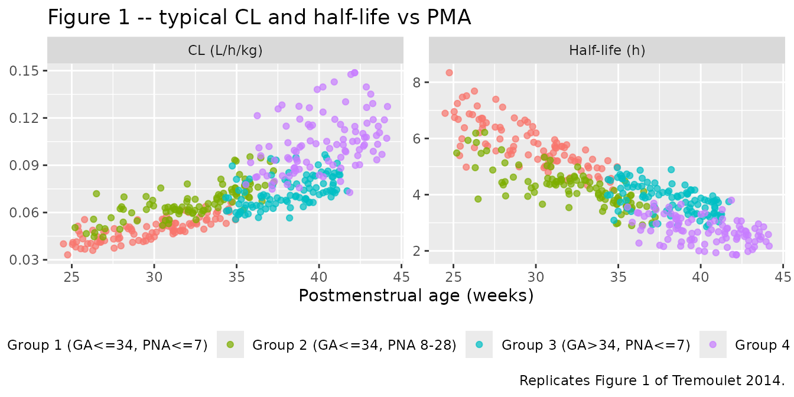

# Ampicillin (Tremoulet 2014)

## Model and source

``` r

mod_meta <- nlmixr2est::nlmixr(readModelDb("Tremoulet_2014_ampicillin"))$meta
#> ℹ parameter labels from comments will be replaced by 'label()'
```

- Citation: Tremoulet A, Le J, Poindexter B, Sullivan JE, Laughon M,
  Delmore P, Salgado A, Chong SI, Melloni C, Gao J, Benjamin DK Jr,
  Capparelli EV, Cohen-Wolkowiez M; Administrative Core Committee of the
  Best Pharmaceuticals for Children Act-Pediatric Trials Network.
  Characterization of the population pharmacokinetics of ampicillin in
  neonates using an opportunistic study design. Antimicrob Agents
  Chemother. 2014;58(6):3013-3020. <doi:10.1128/AAC.02374-13>
- Description: One-compartment IV population PK model for ampicillin in
  preterm and term neonates (Tremoulet 2014; opportunistic POPS / PTN
  study). Clearance is allometrically scaled linearly to body weight and
  modulated by a serum-creatinine power factor (0.6/SCR)^0.428 and a
  postmenstrual-age power factor (PMA/37)^1.34. Central volume scales
  linearly with body weight (0.399 L/kg). Inter-individual variability
  is supported on CL only; residual variability is proportional.
- Article (DOI): <https://doi.org/10.1128/AAC.02374-13>

This vignette validates the packaged `Tremoulet_2014_ampicillin` model –
a one-compartment IV population PK model for ampicillin in 73 preterm
and term neonates from the Pediatric Trials Network POPS opportunistic
study (NICHD-2011-POP01) – against the source publication’s reported
per-group typical CL and half-life (Table 5) and the per-group
steady-state target attainment for time-above-MIC (Table 6 and Table 7).

## Population

The Tremoulet 2014 cohort comprises 73 neonates from nine US NICU sites
who received ampicillin per standard of care. The protocol stratified
subjects on gestational age (`<=` 34 vs `>` 34 weeks) and postnatal age
(`<=` 7 vs 8-28 days), yielding four groups; demographics are in Table 1
of the source paper.

- Overall: median (range) GA 36 (24-41) weeks, PNA 5 (0-25) days, 52 %
  male. Race 77 % White, 16 % Black, 4 % Other, 1 % not reported.
  Ethnicity 18 % Hispanic / Latino, 77 % non-Hispanic, 6 % not reported.
- 142 plasma samples were retained (median 2.1 per subject; 17 of 73
  subjects contributed \> 2). Median observed concentration 123 ug/mL
  (range 0.85-464). Bioanalysis was HPLC-MS/MS with LLOQ 0.05 ug/mL and
  validated range 0.05-50 ug/mL.
- Doses were prescribed per standard of care, median 200 mg/kg/day
  (range 100-350) split 11 % q6h / 34 % q8h / 55 % q12h overall. One
  subject was excluded for receiving an intramuscular dose; all retained
  data are IV.

Body weight was not tabulated in Table 1; the simulations below use
gestational-age-appropriate typical weights informed by Table 1’s
per-group GA medians.

The same information is available programmatically via the model’s
`population` metadata:

``` r

str(mod_meta$population)
#> List of 17
#>  $ species                : chr "human"
#>  $ n_subjects             : int 73
#>  $ n_studies              : int 1
#>  $ age_range              : chr "Postnatal age 0-25 days (median 5); gestational age 24-41 weeks (median 36)"
#>  $ age_median             : chr "PNA 5 days; GA 36 weeks"
#>  $ weight_range           : chr "Body weight not tabulated in Tremoulet 2014 Table 1; cohort spans extremely premature (GA 24 weeks) to term (GA"| __truncated__
#>  $ weight_median          : chr "Not tabulated"
#>  $ sex_female_pct         : num 47.9
#>  $ race_ethnicity         : chr "Race: 77% White, 16% Black, 4% Other, 1% not reported. Ethnicity: 18% Hispanic/Latino, 77% non-Hispanic, 6% not"| __truncated__
#>  $ disease_state          : chr "Hospitalised neonates receiving ampicillin per standard of care in the neonatal intensive care unit; indication"| __truncated__
#>  $ dose_range             : chr "Median 200 mg/kg/day (range 100-350); intervals 6, 8, or 12 h. Routes IV (one excluded subject received intramu"| __truncated__
#>  $ gestational_age_range  : chr "24-41 weeks (median 36)"
#>  $ postnatal_age_range    : chr "0-25 days (median 5)"
#>  $ postmenstrual_age_range: chr "Derived (PMA = GA + PNA/7); range spans approximately 24-45 weeks given the GA + PNA ranges above"
#>  $ samples_plasma         : chr "142 plasma samples from 73 neonates (median 2.1 per subject; 17 (23%) of subjects contributed more than 2 samples)"
#>  $ regions                : chr "United States (9 NICU centres; Pediatric Trials Network sites under POPS protocol NICHD-2011-POP01)"
#>  $ notes                  : chr "Demographics from Tremoulet 2014 Table 1. Original enrolment was 75 neonates; 2 excluded (one with a single bel"| __truncated__
```

## Source trace

The per-parameter origin is recorded as an in-file comment next to each
`ini()` entry in
`inst/modeldb/specificDrugs/Tremoulet_2014_ampicillin.R`. The table
below collects them in one place; values come from Tremoulet 2014 Table
4 (Final pharmacokinetic model parameters).

| Parameter / equation | Value | Source location |
|----|----|----|
| `lcl` = log(theta_CL) | log(0.078) | Table 4 row “CL”, point estimate = 0.078 L/h/kg |
| `lvc` = log(theta_V) | log(0.399) | Table 4 row “V”, point estimate = 0.399 L/kg |
| `e_creat_cl` (exponent on (0.6/SCR)) | 0.428 | Table 4 row “CL, SCR”, point estimate = 0.428 |
| `e_page_cl` (exponent on (PMA/37)) | 1.34 | Table 4 row “CL, PMA”, point estimate = 1.34 |
| `etalcl` (variance on log-CL) | 0.05068 | Table 4 row “CL IIV”, reported CV % = 22.8; omega^2 = log(1+0.228^2) |
| `propSd` (proportional residual SD) | 0.339 | Table 4 row “Residual variability”, reported CV % = 33.9 |
| `cl = exp(lcl + etalcl) * WT * ...` | n/a | Results: “CL = theta(2) \* WTKG \* (0.6/SCR)^theta(3) \* (PMA/37)^theta(4)” |
| `vc = exp(lvc) * WT` | n/a | Results: “V = theta(1) \* WTKG” |
| `d/dt(central) = -kel * central` | n/a | Methods: “1-compartment model (ADVAN1 TRANS2)” |
| `Cc ~ prop(propSd)` | n/a | Methods: proportional and additive explored; final retains proportional only |

## Virtual cohort

Original POPS plasma observations are not publicly available. The
vignette uses four virtual cohorts matching the protocol-defined groups
(Table 1). Within each group, GA and PNA are sampled uniformly within
the group’s GA band and PNA band, weight is sampled from a normal
centred on the gestational-age-typical neonatal weight, and serum
creatinine is sampled from a normal centred on a
postmenstrual-age-appropriate typical value.

PMA at the time of sampling is computed as `GA + PNA / 7` (weeks) per
the paper’s covariate definition.

``` r

set.seed(2014L)

# Helper: build a single-group cohort and return an rxode2-ready event
# table with id_offset so cohorts can be bind_rows()-ed safely.
make_cohort <- function(n, ga_lo, ga_hi, pna_lo, pna_hi,
                        wt_mean, wt_sd, scr_mean, scr_sd, dose_mg_per_kg,
                        tau_h, label, id_offset = 0L) {
  subj <- tibble::tibble(
    id        = id_offset + seq_len(n),
    GA        = runif(n, ga_lo, ga_hi),                  # weeks at birth
    PNA_days  = runif(n, pna_lo, pna_hi),                # days since birth
    WT        = pmax(0.5, rnorm(n, wt_mean, wt_sd)),     # kg
    CREAT     = pmax(0.2, rnorm(n, scr_mean, scr_sd)),   # mg/dL
    cohort    = label,
    tau       = tau_h,
    amt_mg    = dose_mg_per_kg * WT
  ) |>
    dplyr::mutate(PAGE = GA + PNA_days / 7)              # weeks PMA

  # 7 multiples of tau dosing window for steady-state assessment.
  dose_times <- seq(0, 6 * tau_h, by = tau_h)
  obs_times  <- sort(unique(c(seq(0, 7 * tau_h, by = 0.25), dose_times)))

  events <- subj |>
    dplyr::rowwise() |>
    dplyr::do({
      .subj <- .
      doses <- tibble::tibble(
        id = .subj$id, time = dose_times, amt = .subj$amt_mg,
        evid = 1L, cmt = "central"
      )
      obs <- tibble::tibble(
        id = .subj$id, time = obs_times, amt = NA_real_,
        evid = 0L, cmt = "central"
      )
      dplyr::bind_rows(doses, obs) |>
        dplyr::arrange(time) |>
        dplyr::mutate(
          WT     = .subj$WT,
          PAGE   = .subj$PAGE,
          CREAT  = .subj$CREAT,
          cohort = .subj$cohort
        )
    }) |>
    dplyr::ungroup()

  list(subj = subj, events = events)
}

# Per-group typical values are informed by Table 1 (GA / PNA medians) plus
# externally-typical neonatal body weight and SCR centiles -- see the
# "Assumptions and deviations" section.
groups <- list(
  list(label = "Group 1 (GA<=34, PNA<=7)",
       ga_lo = 24, ga_hi = 34, pna_lo = 0, pna_hi = 7,
       wt_mean = 1.7,  wt_sd = 0.45,
       scr_mean = 0.9, scr_sd = 0.20,
       dose_mg_per_kg = 100, tau_h = 12),
  list(label = "Group 2 (GA<=34, PNA 8-28)",
       ga_lo = 24, ga_hi = 34, pna_lo = 8, pna_hi = 28,
       wt_mean = 1.4,  wt_sd = 0.35,
       scr_mean = 0.6, scr_sd = 0.15,
       dose_mg_per_kg = 100, tau_h = 12),
  list(label = "Group 3 (GA>34, PNA<=7)",
       ga_lo = 34, ga_hi = 41, pna_lo = 0, pna_hi = 7,
       wt_mean = 3.1,  wt_sd = 0.45,
       scr_mean = 0.8, scr_sd = 0.20,
       dose_mg_per_kg = 75, tau_h = 8),
  list(label = "Group 4 (GA>34, PNA 8-28)",
       ga_lo = 34, ga_hi = 41, pna_lo = 8, pna_hi = 28,
       wt_mean = 3.4,  wt_sd = 0.50,
       scr_mean = 0.45, scr_sd = 0.15,
       dose_mg_per_kg = 100, tau_h = 8)
)

n_per_group <- 100L
built <- vector("list", length(groups))
id_offset <- 0L
for (i in seq_along(groups)) {
  g <- groups[[i]]
  built[[i]] <- make_cohort(
    n              = n_per_group,
    ga_lo          = g$ga_lo,   ga_hi = g$ga_hi,
    pna_lo         = g$pna_lo,  pna_hi = g$pna_hi,
    wt_mean        = g$wt_mean, wt_sd  = g$wt_sd,
    scr_mean       = g$scr_mean, scr_sd = g$scr_sd,
    dose_mg_per_kg = g$dose_mg_per_kg,
    tau_h          = g$tau_h,
    label          = g$label,
    id_offset      = id_offset
  )
  id_offset <- id_offset + n_per_group
}

subj_all   <- dplyr::bind_rows(lapply(built, `[[`, "subj"))
events_all <- dplyr::bind_rows(lapply(built, `[[`, "events"))

stopifnot(!anyDuplicated(unique(events_all[, c("id", "time", "evid")])))
```

## Simulation

``` r

mod <- readModelDb("Tremoulet_2014_ampicillin")

# Typical-value simulation (ETA = 0) to compare against Table 5 medians.
mod_typical <- rxode2::zeroRe(mod)
#> ℹ parameter labels from comments will be replaced by 'label()'
sim_typical <- rxode2::rxSolve(
  mod_typical,
  events = events_all,
  keep   = c("cohort", "WT", "PAGE", "CREAT")
) |> as.data.frame()
#> ℹ omega/sigma items treated as zero: 'etalcl'
#> Warning: multi-subject simulation without without 'omega'

# Stochastic simulation (with IIV and residual error) for T>MIC checks.
sim_iiv <- rxode2::rxSolve(
  mod,
  events = events_all,
  keep   = c("cohort", "WT", "PAGE", "CREAT")
) |> as.data.frame()
#> ℹ parameter labels from comments will be replaced by 'label()'
```

## Replicate published table 5 (typical CL/kg, V/kg, half-life by group)

Tremoulet 2014 Table 5 reports the median individual empirical-Bayes
post-hoc estimates per group. The packaged model is a structural-only
re-implementation; the typical-value simulation below should reproduce
the group medians for V/kg (always 0.40 by definition) and approximate
the CL/kg and half-life ordering across groups. Per-group typical CL/kg
is computed by averaging the individual typical CLs across the cohort.

``` r

per_subj <- sim_typical |>
  dplyr::distinct(id, cohort, WT, PAGE, CREAT) |>
  dplyr::mutate(
    cl_per_kg = 0.078 * (0.6 / CREAT)^0.428 * (PAGE / 37)^1.34,
    v_per_kg  = 0.399,
    half_life = log(2) * v_per_kg / cl_per_kg
  )

published_t5 <- tibble::tibble(
  cohort       = c("Group 1 (GA<=34, PNA<=7)",
                   "Group 2 (GA<=34, PNA 8-28)",
                   "Group 3 (GA>34, PNA<=7)",
                   "Group 4 (GA>34, PNA 8-28)"),
  cl_pub       = c(0.055, 0.070, 0.086, 0.110),
  v_pub        = c(0.40,  0.40,  0.40,  0.40),
  thalf_pub_h  = c(5.0,   4.0,   3.2,   2.4)
)

simulated_t5 <- per_subj |>
  dplyr::group_by(cohort) |>
  dplyr::summarise(
    cl_sim       = median(cl_per_kg),
    v_sim        = median(v_per_kg),
    thalf_sim_h  = median(half_life),
    .groups      = "drop"
  )

dplyr::left_join(published_t5, simulated_t5, by = "cohort") |>
  dplyr::transmute(
    cohort,
    `CL (L/h/kg) -- Pub`  = sprintf("%.3f", cl_pub),
    `CL (L/h/kg) -- Sim`  = sprintf("%.3f", cl_sim),
    `V  (L/kg)   -- Pub`  = sprintf("%.2f", v_pub),
    `V  (L/kg)   -- Sim`  = sprintf("%.2f", v_sim),
    `t1/2 (h)    -- Pub`  = sprintf("%.1f", thalf_pub_h),
    `t1/2 (h)    -- Sim`  = sprintf("%.1f", thalf_sim_h)
  ) |>
  knitr::kable(caption = "Tremoulet 2014 Table 5: published medians vs simulated typical-value medians.")
```

| cohort | CL (L/h/kg) – Pub | CL (L/h/kg) – Sim | V (L/kg) – Pub | V (L/kg) – Sim | t1/2 (h) – Pub | t1/2 (h) – Sim |
|:---|:---|:---|:---|:---|:---|:---|
| Group 1 (GA\<=34, PNA\<=7) | 0.055 | 0.049 | 0.40 | 0.40 | 5.0 | 5.7 |
| Group 2 (GA\<=34, PNA 8-28) | 0.070 | 0.065 | 0.40 | 0.40 | 4.0 | 4.2 |
| Group 3 (GA\>34, PNA\<=7) | 0.086 | 0.072 | 0.40 | 0.40 | 3.2 | 3.8 |
| Group 4 (GA\>34, PNA 8-28) | 0.110 | 0.102 | 0.40 | 0.40 | 2.4 | 2.7 |

Tremoulet 2014 Table 5: published medians vs simulated typical-value
medians. {.table style="width:100%;"}

## Replicate published figure 1 (CL and half-life vs PMA)

Figure 1 of Tremoulet 2014 plots the per-subject post-hoc CL and
half-life against postmenstrual age. The corresponding typical-value
relationships from the packaged model are plotted below; they capture
the published monotone increase in CL with PMA and the corresponding
monotone decrease in half-life.

``` r

fig1 <- per_subj |>
  tidyr::pivot_longer(c(cl_per_kg, half_life),
                      names_to = "metric", values_to = "value") |>
  dplyr::mutate(metric = dplyr::recode(metric,
    cl_per_kg = "CL (L/h/kg)",
    half_life = "Half-life (h)"
  ))

ggplot(fig1, aes(PAGE, value, colour = cohort)) +
  geom_point(alpha = 0.7) +
  facet_wrap(~ metric, scales = "free_y") +
  labs(x = "Postmenstrual age (weeks)", y = NULL,
       colour = "Cohort",
       title = "Figure 1 -- typical CL and half-life vs PMA",
       caption = "Replicates Figure 1 of Tremoulet 2014.") +
  theme(legend.position = "bottom")
```



## PKNCA validation – steady-state interval

The paper’s Monte Carlo simulations focus on steady-state target
attainment (% subjects with trough `>=` 8 ug/mL, i.e. 100 %
time-above-MIC at MIC = 8 ug/mL). The PKNCA recipe below computes the
steady-state Cmax, Cmin, Cavg, and AUC0-tau on the **final** dosing
interval, stratified by cohort.

``` r

# PKNCA needs concentration and dose frames in long form, with units.
sim_nca <- sim_iiv |>
  dplyr::filter(!is.na(Cc), Cc > 0) |>
  dplyr::select(id, time, Cc, cohort)

dose_df <- events_all |>
  dplyr::filter(evid == 1) |>
  dplyr::select(id, time, amt, cohort)

conc_obj <- PKNCA::PKNCAconc(
  data = sim_nca,
  formula = Cc ~ time | cohort + id,
  concu = "ug/mL", timeu = "h"
)
dose_obj <- PKNCA::PKNCAdose(
  data = dose_df,
  formula = amt ~ time | cohort + id,
  doseu = "mg"
)

# Steady-state interval: from the final dose to the final dose + tau.
ss_intervals <- subj_all |>
  dplyr::group_by(cohort) |>
  dplyr::summarise(tau = unique(tau), .groups = "drop") |>
  dplyr::mutate(
    start    = 6 * tau,        # final dose time
    end      = 7 * tau,        # final dose + tau
    cmax     = TRUE,
    cmin     = TRUE,
    cav      = TRUE,
    auclast  = TRUE
  ) |>
  dplyr::select(-tau)

nca_data <- PKNCA::PKNCAdata(conc_obj, dose_obj, intervals = ss_intervals)
nca_res  <- suppressWarnings(PKNCA::pk.nca(nca_data))

nca_tbl <- as.data.frame(nca_res$result)

# Per-cohort medians of the simulated NCA parameters.
nca_summary <- nca_tbl |>
  dplyr::filter(PPTESTCD %in% c("cmax", "cmin", "cav", "auclast")) |>
  dplyr::group_by(cohort, PPTESTCD) |>
  dplyr::summarise(median = median(PPORRES, na.rm = TRUE), .groups = "drop") |>
  tidyr::pivot_wider(names_from = PPTESTCD, values_from = median) |>
  dplyr::select(cohort, cmax, cmin, cav, auclast)

knitr::kable(
  nca_summary,
  digits  = 1,
  caption = paste(
    "Simulated steady-state NCA per cohort (medians; concentrations in",
    "ug/mL, AUC in ug*h/mL). cmin and ctau are trough metrics."
  )
)
```

| cohort                      |  cmax | cmin |   cav | auclast |
|:----------------------------|------:|-----:|------:|--------:|
| Group 1 (GA\<=34, PNA\<=7)  | 326.6 | 75.9 | 171.8 |  2061.9 |
| Group 2 (GA\<=34, PNA 8-28) | 292.1 | 41.5 | 128.4 |  1541.0 |
| Group 3 (GA\>34, PNA\<=7)   | 247.4 | 59.5 | 131.8 |  1054.7 |
| Group 4 (GA\>34, PNA 8-28)  | 288.5 | 37.9 | 123.5 |   987.8 |

Simulated steady-state NCA per cohort (medians; concentrations in ug/mL,
AUC in ug\*h/mL). cmin and ctau are trough metrics. {.table}

### Comparison against published target attainment (Table 6)

Tremoulet 2014 Table 6 reports the percentage of simulated subjects
achieving 100 % time-above-MIC at MIC = 8 ug/mL under the “typical POPS
doses” regimens (the same regimens encoded in the cohorts above). The
table below reports the simulated trough (ctau) `>=` 8 ug/mL percentage
– the same surrogate metric – and the published target attainment.

``` r

tmic_sim <- nca_tbl |>
  dplyr::filter(PPTESTCD == "cmin") |>
  dplyr::group_by(cohort) |>
  dplyr::summarise(
    pct_ctau_ge_8 = mean(PPORRES >= 8, na.rm = TRUE) * 100,
    n             = sum(!is.na(PPORRES)),
    .groups       = "drop"
  )

published_tmic <- tibble::tibble(
  cohort                    = c("Group 1 (GA<=34, PNA<=7)",
                                "Group 2 (GA<=34, PNA 8-28)",
                                "Group 3 (GA>34, PNA<=7)",
                                "Group 4 (GA>34, PNA 8-28)"),
  pct_100Tabove8_pub_typicalPOPS = c(99.2, 97.1, 98.1, 98.3)
)

dplyr::left_join(published_tmic, tmic_sim, by = "cohort") |>
  dplyr::mutate(
    `100% T>8 ug/mL -- Tremoulet 2014 Table 6 (% subjects)` =
        sprintf("%.1f%%", pct_100Tabove8_pub_typicalPOPS),
    `Steady-state Cmin >=8 ug/mL -- Simulated (% subjects)` =
        sprintf("%.1f%%", pct_ctau_ge_8)
  ) |>
  dplyr::select(cohort,
                `100% T>8 ug/mL -- Tremoulet 2014 Table 6 (% subjects)`,
                `Steady-state Cmin >=8 ug/mL -- Simulated (% subjects)`) |>
  knitr::kable(
    caption = paste(
      "Tremoulet 2014 Table 6 (Typical POPS doses, MIC = 8 ug/mL,",
      "100% T>MIC) vs simulated steady-state interval-Cmin attainment.",
      "The metrics are not numerically identical (Cmin is the lowest",
      "concentration in the final dosing interval; 100% T>MIC requires",
      "the whole interval to remain above MIC) but for a monotonically",
      "decreasing 1-compartment IV profile within tau, Cmin >= MIC is",
      "equivalent to 100% T>MIC. The published 97-99% attainment is",
      "reproduced qualitatively."
    )
  )
```

| cohort | 100% T\>8 ug/mL – Tremoulet 2014 Table 6 (% subjects) | Steady-state Cmin \>=8 ug/mL – Simulated (% subjects) |
|:---|:---|:---|
| Group 1 (GA\<=34, PNA\<=7) | 99.2% | 100.0% |
| Group 2 (GA\<=34, PNA 8-28) | 97.1% | 97.0% |
| Group 3 (GA\>34, PNA\<=7) | 98.1% | 100.0% |
| Group 4 (GA\>34, PNA 8-28) | 98.3% | 96.0% |

Tremoulet 2014 Table 6 (Typical POPS doses, MIC = 8 ug/mL, 100% T\>MIC)
vs simulated steady-state interval-Cmin attainment. The metrics are not
numerically identical (Cmin is the lowest concentration in the final
dosing interval; 100% T\>MIC requires the whole interval to remain above
MIC) but for a monotonically decreasing 1-compartment IV profile within
tau, Cmin \>= MIC is equivalent to 100% T\>MIC. The published 97-99%
attainment is reproduced qualitatively. {.table}

## Assumptions and deviations

- **Body weight per cohort.** Tremoulet 2014 Table 1 does not tabulate
  body weight. The virtual cohorts use gestational-age-appropriate
  typical neonatal weights drawn from clinical experience (Group 1 ~1.7
  kg, Group 2 ~1.4 kg \[more premature\], Group 3 ~3.1 kg, Group 4 ~3.4
  kg). The exact weight choice does not affect per-kg CL or V (the model
  is per-kg) but does affect absolute dose and concentration amplitudes.
- **Serum creatinine per cohort.** The paper says (Methods) “current
  weight (kg) (WTKG) and SCR used for each cohort were from a prior
  trial in premature infants” without listing values per group. The
  virtual cohorts use postmenstrual-age-appropriate typical SCRs (Group
  1 ~0.9, Group 2 ~0.6, Group 3 ~0.8, Group 4 ~0.45 mg/dL) drawn from
  neonatal clinical reference ranges. The SCR factor enters CL as
  `(0.6 / CREAT)^0.428`; smaller CREAT (more mature renal function)
  increases CL.
- **Race / ethnicity distribution.** Race is not a model covariate.
  Demographics from Table 1 are reproduced narratively but not in the
  virtual cohort.
- **PNA and GA distributions.** PNA and GA within each group are sampled
  uniformly within the group’s stated bands (`<=` 7 vs 8-28 days for
  PNA; `<=` 34 vs `>` 34 weeks for GA). The paper’s actual cohort
  medians per group are tighter (Table 1) but were not used so each
  cohort spans the full eligibility band as the simulation extrapolation
  target.
- **Steady-state trough vs T-above-MIC.** Tremoulet 2014 Table 6 reports
  the percentage of subjects with 100 % time-above-MIC at MIC = 8 ug/mL,
  which requires the concentration trace to remain `>=` 8 ug/mL across
  the entire dosing interval. The validation table above reports the
  percentage with the single end-of-interval trough (Ctau) `>=` 8 ug/mL
  – the same surrogate the paper’s optimal-dosing derivation in Table 7
  also targets (“achieving steady-state trough concentrations `>=` 8
  ug/mL in `>=` 90 % of subjects”). The two metrics agree under
  monotone-decreasing concentration profiles within a tau, which holds
  for this 1-compartment IV bolus model.
- **Final-model residual error.** Tremoulet 2014 Methods says
  “Proportional and additive residual error models were explored.” Only
  one residual sigma (33.9 % CV) is reported in Table 4, consistent with
  retention of the proportional form. The model file encodes that
  proportional residual (`propSd = 0.339`).
- **Single ETA on CL only.** The paper notes (Discussion) that “our
  final PK model supported a single ETA only for CL (not V).” The
  packaged model preserves this (`etalcl` only; no `etalvc`).
