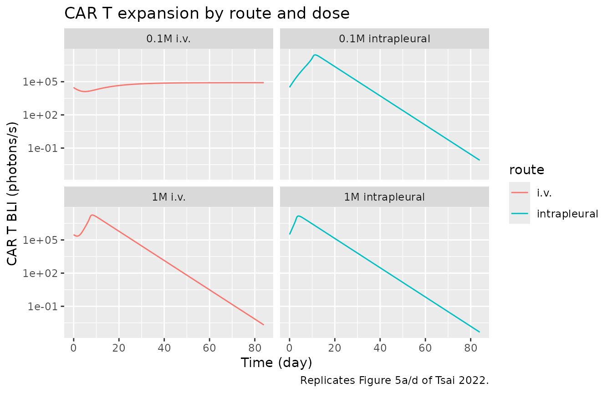
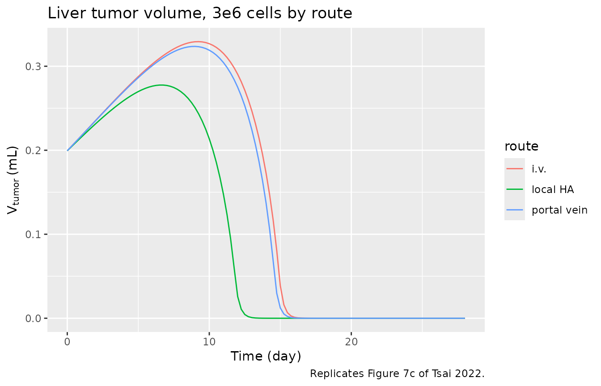

# CAR T cell local delivery mPBPK-PD (Tsai 2022)

## Model and source

Tsai et al. (2022) built minimal physiologically-based
pharmacokinetic-pharmacodynamic (mPBPK-PD) models to study how the route
of CAR T cell delivery shapes cellular kinetics, tumor infiltration and
tumor killing in mice. Two structures are distributed here, one per
model file:

- `Tsai_2022_cart_pleural_tumor_mouse` – a ten-state model with a
  pleural tumor inside the lungs, fitted to anti-mesothelin CAR T
  cellular kinetics and tumor growth-inhibition bioluminescence after
  intravenous (i.v.) or intrapleural delivery.
- `Tsai_2022_cart_liver_tumor_mouse` – a seventeen-state model with a
  liver tumor that shares hepatic-artery and portal-vein inflow with the
  liver, used to compare i.v., portal vein and local hepatic artery
  delivery.

``` r

pleural <- readModelDb("Tsai_2022_cart_pleural_tumor_mouse")
liver <- readModelDb("Tsai_2022_cart_liver_tumor_mouse")
pleural_ui <- rxode2::rxode(pleural)
liver_ui <- rxode2::rxode(liver)
```

- Citation: Tsai CH, Singh AP, Xia CQ, Wang H. Development of minimal
  physiologically-based pharmacokinetic-pharmacodynamic models for
  characterizing cellular kinetics of CAR T cells following local
  deliveries in mice. J Pharmacokinet Pharmacodyn. 2022;49(5):525-538.
  <doi:10.1007/s10928-022-09818-8>
- Article: <https://doi.org/10.1007/s10928-022-09818-8>
- Supplement (Model Equations, Tables S1-S4):
  <https://doi.org/10.1007/s10928-022-09818-8>

The two models share their physiology and their CAR T - tumor cell
interaction layer; the liver model simply resolves more organs and
carries the pleural model’s PD parameters forward.

## Population

The models describe human T cells (non-binding or anti-mesothelin CAR T
cells) in tumor-bearing NSG mice. Mouse organ volumes and blood / lymph
flows come from the Shah and Betts (2012) platform PBPK model, and the
CAR T transmigration and retention constants from Khot et al. (2019),
both digitized and tabulated in Tsai 2022 Tables S2 (pleural) and S3
(liver). The pleural tumor model was fitted (naive-pooled, proportional
error, Phoenix WinNonlin) to bioluminescence data of anti-mesothelin CAR
T cells and tumor cells digitized from Adusumilli et al. (2014). The
liver tumor model is a theoretical simulation model: its non-tumor mPBPK
layer was fitted to radiolabeled human T cell biodistribution from Khot
2019, and it adopts the pleural tumor PD parameters.

``` r

pleural_ui$population$notes
#> [1] "Naive-pooled fit in Phoenix WinNonlin (proportional error) to bioluminescence data digitized from Adusumilli 2014 (Sci Transl Med 6:261ra151; CAR T and tumor BLI after i.v. and intrapleural dosing). Lung, blood, other-tissue and lymph physiology from Shah and Betts 2012 (J Pharmacokinet Pharmacodyn 39:67-86) and T cell transmigration rates from Khot 2019 (J Pharmacol Exp Ther 368:503), as tabulated in Tsai 2022 Table S2. The number of digitized mice is not reported."
```

## Source trace

Every `ini()` value carries an in-file comment pointing at the Tsai 2022
table it came from. The anchors below are the ones the validation leans
on.

| Parameter | Value | Source |
|----|----|----|
| `J_PS` (pleural transmigration) | 0.119 1/h | Table 1 / Table S2, estimated |
| `R_PS` (pleural retention) | 2.88 | Table 1 / Table S2, estimated |
| `k_g` (tumor growth) | 0.00385 1/h | Table 1, estimated (7.5-day doubling) |
| `k_pro` (max proliferation) | 0.115 1/h | Table 1, estimated |
| `KI` (proliferation inhibition) | 3.84e7 cells | Table 1, estimated |
| `k_kill` (pleural killing) | 0.0733 1/h | Table 1, estimated |
| `k_off,mac` | 6.85e-8 1/h | Table 1, estimated |
| `k_on,mac` | 1e6 1/M/s | Table S2, fixed (Faro 2017) |
| `R_TAA` | 1e4 copies/cell | Table S2, assumed |
| Lung / blood / other physiology | see file | Table S2 (Shah and Betts 2012) |
| Liver / GI / spleen / tumor flows | see file | Table S3 |
| `k_kill` (liver) | 0.1466 1/h | Table S3 / Methods, twice the pleural value |
| tumor cell volume | 518.3 fL | Supplement, Phillips 2012 |

## Base mPBPK: route-dependent exposure (Table 2)

With tumor growth and CAR T - tumor binding switched off, the pleural
model reduces to the base mPBPK Tsai 2022 used to produce Table 2: the
AUC of non-binding T cells in blood, lungs and the pleural space over
0-4 h and 0-72 h after an i.v. or intrapleural dose, and the
intrapleural/i.v. ratio of each. The AUC ratio is dimensionless and
route-comparative, so it is the paper’s own known-answer check. A
100-cell tracer dose is used; the ratio is independent of the dose size.

``` r

base_pk <- pleural_ui |>
  rxode2::ini(kon = 0, lkg = log(1e-12)) # non-binding cells, no tumor growth
#> ℹ change initial estimate of `kon` to `0`
#> ℹ change initial estimate of `lkg` to `-27.6310211159285`

grid <- seq(0, 72, by = 0.05)
base_sim <- dplyr::bind_rows(lapply(c("a_venous", "pleural_space"), function(cmt) {
  s <- as.data.frame(rxode2::rxSolve(base_pk, rxode2::et(amt = 100, cmt = cmt) |> rxode2::et(grid)))
  data.frame(
    id = 1L, time = s$time,
    Blood = s$Cblood,
    Lungs = (s$vp_lung + s$is_lung) / (0.0536 + 0.0384),
    `Pleural space` = s$Cpleural,
    treatment = ifelse(cmt == "a_venous", "i.v.", "intrapleural"),
    check.names = FALSE
  )
}))
```

PKNCA computes the AUC of each site over the two windows, by route, with
the linear trapezoidal rule (as in the published Phoenix fit).

``` r

auc_by_route <- function(col, end) {
  d <- base_sim |> dplyr::transmute(id, time, Cc = .data[[col]], treatment)
  conc <- PKNCA::PKNCAconc(dplyr::filter(d, !is.na(Cc)), Cc ~ time | treatment + id)
  dose <- data.frame(id = 1L, time = 0, amt = 100, treatment = c("i.v.", "intrapleural"))
  res <- suppressWarnings(PKNCA::pk.nca(PKNCA::PKNCAdata(
    conc, PKNCA::PKNCAdose(dose, amt ~ time | treatment + id),
    intervals = data.frame(start = 0, end = end, auclast = TRUE),
    options = list(auc.method = "linear")
  )))
  r <- as.data.frame(res$result)
  r <- r[r$PPTESTCD == "auclast", ]
  r$PPORRES[r$treatment == "intrapleural"] / r$PPORRES[r$treatment == "i.v."]
}

table2 <- tibble::tibble(
  Site = c("Blood", "Lungs", "Pleural space"),
  `Ratio 0-4 h (sim)` = vapply(c("Blood", "Lungs", "Pleural space"),
                               auc_by_route, numeric(1), end = 4),
  `Ratio 0-4 h (paper)` = c(0.205, 0.380, 81.9),
  `Ratio 0-72 h (sim)` = vapply(c("Blood", "Lungs", "Pleural space"),
                                auc_by_route, numeric(1), end = 72),
  `Ratio 0-72 h (paper)` = c(0.832, 0.953, 13.0)
)
knitr::kable(table2, digits = 3,
             caption = "Intrapleural/i.v. AUC ratio of non-binding T cells (Tsai 2022 Table 2).")
```

| Site | Ratio 0-4 h (sim) | Ratio 0-4 h (paper) | Ratio 0-72 h (sim) | Ratio 0-72 h (paper) |
|:---|---:|---:|---:|---:|
| Blood | 0.205 | 0.205 | 0.831 | 0.832 |
| Lungs | 0.381 | 0.380 | 0.955 | 0.953 |
| Pleural space | 81.558 | 81.900 | 12.922 | 13.000 |

Intrapleural/i.v. AUC ratio of non-binding T cells (Tsai 2022 Table 2).
{.table}

``` r


# Known-answer gate: deterministic model, so the simulated ratios must match the
# published ratios to the paper's printed precision (tight, seed-independent).
stopifnot(
  abs(table2$`Ratio 0-4 h (sim)`  - table2$`Ratio 0-4 h (paper)`)  / table2$`Ratio 0-4 h (paper)`  < 0.03,
  abs(table2$`Ratio 0-72 h (sim)` - table2$`Ratio 0-72 h (paper)`) / table2$`Ratio 0-72 h (paper)` < 0.03
)
```

The intrapleural route gives an ~80-fold higher pleural exposure in the
first 4 h that decays to ~13-fold by 72 h, while blood and lung
exposures are lower than i.v. – the simultaneous local-benefit /
systemic-sparing finding of Figure 4.

## Pleural tumor PD: expansion delay and an efficacy threshold (Figure 5)

The full pleural model adds tumor growth, CAR T proliferation and
killing. Tsai 2022 Figure 5 fitted six arms, each with its own digitized
initial tumor burden (Table S4). Two signatures are reproduced here:
intrapleural dosing expands CAR T cells ~2 days earlier than i.v.
(Figure 5a vs 5d), and a low intrapleural dose clears the tumor while
the same i.v. dose does not (Figure 5b vs 5e).

``` r

arms <- tibble::tribble(
  ~arm,           ~dose,  ~cmt,            ~tb0,   ~route,
  "1M i.v.",      1e6,    "a_venous",      5.9e7,  "i.v.",
  "1M intrapleural", 1e6, "pleural_space", 5.9e7,  "intrapleural",
  "0.1M i.v.",    1e5,    "a_venous",      3.0e8,  "i.v.",
  "0.1M intrapleural", 1e5, "pleural_space", 1.0e8, "intrapleural"
)
tgrid <- seq(0, 84 * 24, by = 6)
fig5 <- dplyr::bind_rows(lapply(seq_len(nrow(arms)), function(i) {
  mm <- pleural_ui |> rxode2::ini(tb0 = arms$tb0[i])
  s <- as.data.frame(rxode2::rxSolve(mm, rxode2::et(amt = arms$dose[i], cmt = arms$cmt[i]) |>
    rxode2::et(tgrid)))
  data.frame(arm = arms$arm[i], route = arms$route[i], day = s$time / 24,
             bli_cart = s$bli_cart, bli_tumor = s$bli_tumor)
}))
#> ℹ change initial estimate of `tb0` to `5.9e+07`
#> ℹ change initial estimate of `tb0` to `5.9e+07`
#> ℹ change initial estimate of `tb0` to `3e+08`
#> ℹ change initial estimate of `tb0` to `1e+08`

ggplot(fig5, aes(day, bli_cart, colour = route)) +
  geom_line() + facet_wrap(~arm) + scale_y_log10() +
  labs(x = "Time (day)", y = "CAR T BLI (photons/s)",
       title = "CAR T expansion by route and dose",
       caption = "Replicates Figure 5a/d of Tsai 2022.")
```



``` r

peak_day <- function(a) {
  d <- dplyr::filter(fig5, arm == a)
  d$day[which.max(d$bli_cart)]
}
# Intrapleural expands earlier than i.v. at the matched 1e6-cell dose.
delay <- peak_day("1M i.v.") - peak_day("1M intrapleural")
stopifnot(delay >= 1) # paper reports ~2-day delay; model delay is deterministic

final_tumor <- function(a) {
  d <- dplyr::filter(fig5, arm == a)
  dplyr::last(d$bli_tumor[order(d$day)])
}
# 0.1e6 cells: intrapleural clears the tumor to the BLI noise floor (~7.5e5);
# the same i.v. dose does not (tumor grows many-fold).
stopifnot(
  final_tumor("0.1M intrapleural") < 1e6,
  final_tumor("0.1M i.v.") > 1e8
)
```

## Liver tumor: local vs systemic delivery (Figures 7-8)

The liver tumor model routes a fraction of a portal vein dose into the
tumor according to blood flow, delivers a local hepatic artery dose
entirely to the tumor, and lets an i.v. dose reach the tumor only
through the systemic circulation. Figure 7 compares the three routes;
Figure 8 varies the tumor blood-flow fraction. Tumor volume (mL) is read
off directly.

``` r

f_pv_tumor <- (14.5 + 1.5) / (137 - 0.1508 + 14.88 - 0.01636) # portal fraction into tumor
dgrid <- seq(0, 28 * 24, by = 6)
sim_route <- function(dose, route) {
  ev <- switch(route,
    "i.v." = rxode2::et(amt = dose, cmt = "a_venous"),
    "local HA" = rxode2::et(amt = dose, cmt = "vp_tumor"),
    "portal vein" = rxode2::et(amt = dose * f_pv_tumor, cmt = "vp_tumor") |>
      rxode2::et(amt = dose * (1 - f_pv_tumor), cmt = "vp_liver")
  ) |> rxode2::et(dgrid)
  s <- as.data.frame(rxode2::rxSolve(liver_ui, ev))
  data.frame(route = route, day = s$time / 24, Vtumor = s$Vtumor, Ctumor = s$Ctumor)
}
fig7 <- dplyr::bind_rows(lapply(c("i.v.", "local HA", "portal vein"),
                                function(r) sim_route(3e6, r)))

ggplot(fig7, aes(day, Vtumor, colour = route)) +
  geom_line() +
  labs(x = "Time (day)", y = expression(V[tumor] ~ "(mL)"),
       title = "Liver tumor volume, 3e6 cells by route",
       caption = "Replicates Figure 7c of Tsai 2022.")
```



``` r

clear_day <- function(r) {
  d <- dplyr::filter(fig7, route == r) |> dplyr::arrange(day)
  d$day[which(d$Vtumor < 0.01)[1]]
}
# Local hepatic artery delivery clears the tumor earliest; portal vein tracks
# i.v. closely (portal delivers only ~10% of cells to the tumor on first pass).
stopifnot(
  clear_day("local HA") < clear_day("i.v."),
  abs(clear_day("portal vein") - clear_day("i.v.")) < 2
)
```

``` r

# Figure 8: lowering the tumor blood-flow fraction helps local delivery but
# hurts i.v. delivery (Fig. 8a vs 8b). Nominal flow is ~10% of liver flow.
flow_scan <- function(route, fac) {
  mm <- liver_ui |> rxode2::ini(
    q_tumor_ha = 2 / fac, q_tumor_pv_gi = 14.5 / fac, q_tumor_pv_spleen = 1.5 / fac
  )
  ev <- if (route == "i.v.") {
    rxode2::et(amt = 3e6, cmt = "a_venous")
  } else {
    rxode2::et(amt = 3e6, cmt = "vp_tumor")
  }
  s <- as.data.frame(rxode2::rxSolve(mm, ev |> rxode2::et(dgrid)))
  max(s$Vtumor)
}
# Nominal (fac=1) vs 25-fold lower tumor flow (fac=25):
iv_hi_flow <- flow_scan("i.v.", 1)
#> ℹ change initial estimate of `q_tumor_ha` to `2`
#> ℹ change initial estimate of `q_tumor_pv_gi` to `14.5`
#> ℹ change initial estimate of `q_tumor_pv_spleen` to `1.5`
iv_lo_flow <- flow_scan("i.v.", 25)
#> ℹ change initial estimate of `q_tumor_ha` to `0.08`
#> ℹ change initial estimate of `q_tumor_pv_gi` to `0.58`
#> ℹ change initial estimate of `q_tumor_pv_spleen` to `0.06`
local_hi_flow <- flow_scan("local HA", 1)
#> ℹ change initial estimate of `q_tumor_ha` to `2`
#> ℹ change initial estimate of `q_tumor_pv_gi` to `14.5`
#> ℹ change initial estimate of `q_tumor_pv_spleen` to `1.5`
local_lo_flow <- flow_scan("local HA", 25)
#> ℹ change initial estimate of `q_tumor_ha` to `0.08`
#> ℹ change initial estimate of `q_tumor_pv_gi` to `0.58`
#> ℹ change initial estimate of `q_tumor_pv_spleen` to `0.06`
# i.v.: lower tumor flow -> worse control (larger peak tumor);
# local: lower tumor flow -> better control (smaller peak tumor).
stopifnot(
  iv_lo_flow > iv_hi_flow,
  local_lo_flow < local_hi_flow
)
```

## Assumptions and deviations

- **Deterministic typical-value models.** Tsai 2022 used a naive-pooled
  fit with a single proportional residual-error term and reported no
  between-subject variability, so neither model carries `eta` or
  residual terms. Simulation is the intended use.
- **Concentration units.** States are cell numbers; the maintainers
  report blood, lung, pleural and tumor outputs as cells/mL
  (equivalently cells/g at unit tissue density, matching the paper’s
  %ID/g framing for the route ratios). The absolute bioluminescence
  scale uses the Table S4 factors.
- **Bioluminescence CAR T scale (`S1`).** Table S4 lists
  `S1 = 311398 photons/s-cell` as “average value of the first time
  points”; the first time point in the digitized data is the 1e6-cell
  dose, so the maintainers encoded it as 0.311398 photons/s per cell
  (i.e. 311398 photons/s per 1e6 cells), which reproduces the Figure 5
  CAR T BLI magnitudes.
- **Liver tumor killing rate.** Methods and Table S3 state the liver
  `k_kill` was “assumed twice as pleural tumor”; Table S3 prints the
  pleural value 0.0733, so the maintainers used 2 x 0.0733 = 0.1466 1/h,
  as the text directs.
- **Other-tissue transmigration in the liver model.** Table S3 gives
  both the Eq. 1-derived `J_ot = 16.7 1/h` (used for Figures 7-8) and a
  fitted alternative `94.3 1/h` (Figures S5-S8). The paper found this
  parameter insensitive; the model ships the Eq. 1 value used for the
  main figures.
- **Per-arm initial tumor burden.** The Figure 5 arms each used a
  digitized `TB0` from Table S4; those values are applied per arm in the
  vignette rather than baked into the model file, whose default `TB0` is
  the 1e8-cell burden used for the Figure 4 / Figure 6 simulations.
- **Portal vein split.** The fraction of a portal vein dose reaching the
  tumor is computed from the Table S3 portal blood flows
  `(Q_Tumor,PV,GI + Q_Tumor,PV,Spleen) / (Q_GI - L_GI + Q_Spleen - L_Spleen)`,
  as described in the Results.
- No correction notice was found for this article as of 2026-10-09.
