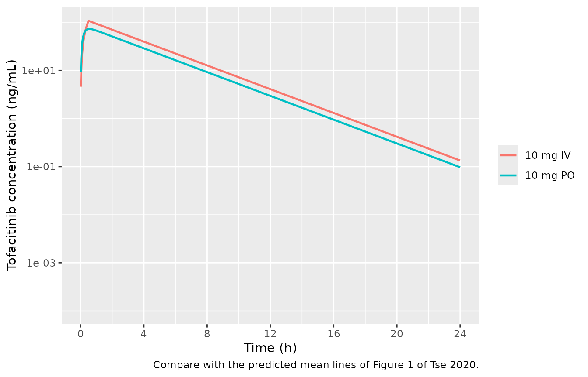
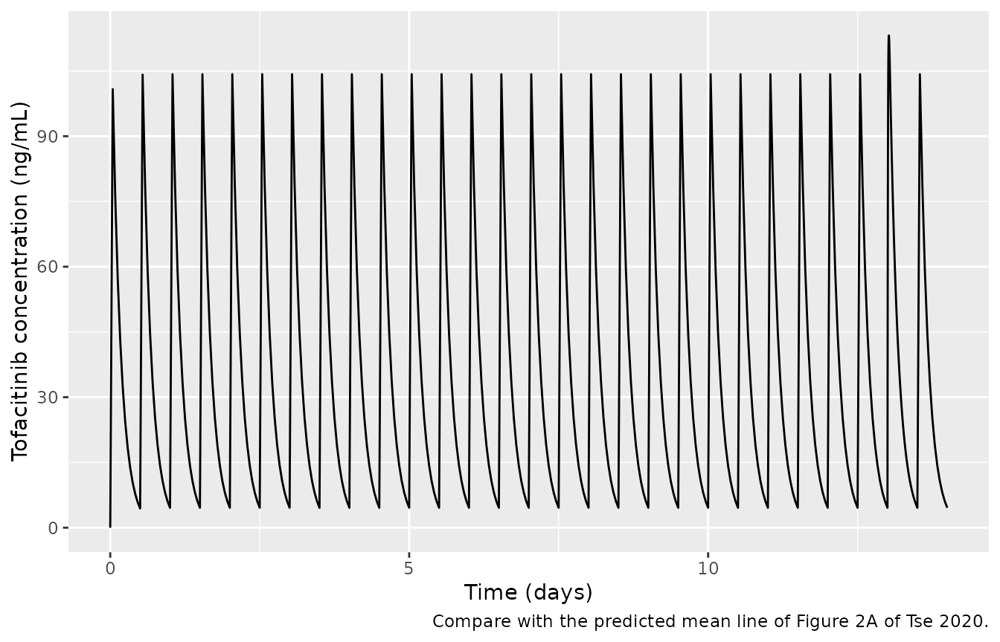

# Tofacitinib (Tse 2020)

## Model and source

- Citation: Tse S, Dowty ME, Menon S, Gupta P, Krishnaswami S. (2020).
  Application of Physiologically Based Pharmacokinetic Modeling to
  Predict Drug Exposure and Support Dosing Recommendations for Potential
  Drug-Drug Interactions or in Special Populations: An Example Using
  Tofacitinib. J Clin Pharmacol 60(12):1617-1628.
  <doi:10.1002/jcph.1679>.
- Description: One-compartment oral and intravenous pharmacokinetic
  reduction of the Simcyp (version 15, release 1) minimal-PBPK model for
  the Janus kinase inhibitor tofacitinib in healthy adults (Tse 2020).
  The source model uses first-order absorption, the Simcyp minimal-PBPK
  distribution option with no single adjusting compartment and a
  user-entered steady-state volume of 1.24 L/kg, and a clearance built
  from the observed intravenous clearance (24.7 L/h) split into a renal
  arm (7.62 L/h) and a hepatic CYP3A4 + CYP2C19 arm. With no adjusting
  compartment the plasma profile is one-compartmental, so the model is
  encoded as depot + central with the reported ka, Vss, renal and
  non-renal clearance, and the reported oral bioavailability of 74%. No
  parameter is fitted. The reduction reproduces the paper’s own
  predicted intravenous Cmax to 0.4%, the predicted oral Cmax and
  AUC0-inf at all six single doses from 1 to 100 mg to within 7%, and
  the predicted 14% AUC increase when active renal secretion is
  abolished (see the validation vignette). This is a typical-value
  simulation model: the source reports no inter-individual variance and
  no residual-error model. The drug-interaction (fluconazole,
  ketoconazole, rifampicin) and renal / hepatic impairment predictions
  depend on proprietary Simcyp compound and population files and are not
  reproducible from this model.
- Article: <https://doi.org/10.1002/jcph.1679>
- Supplement: <https://www.ncbi.nlm.nih.gov/pmc/articles/PMC7689764/>

## What this model is, and what it is not

Tse 2020 built a physiologically based pharmacokinetic (PBPK) model of
tofacitinib in the Simcyp Population-based Simulator (version 15,
release 1) and used it to predict drug-drug interactions (DDIs) with
fluconazole, ketoconazole and rifampicin, the effect of renal and
hepatic impairment, and the effect of blocking active renal secretion.

The compound layer is fully reported in Table 1: first-order absorption
(`fa` 0.93, `ka` 5.7 1/h), the Simcyp *minimal* PBPK distribution option
with a user-entered steady-state volume of 1.24 L/kg and **no** single
adjusting compartment, and a clearance assembled from the observed
intravenous clearance of 24.7 L/h, of which 7.62 L/h is renal and the
rest is hepatic (CYP3A4 54% and CYP2C19 17% of total clearance,
Supplemental Figure S1). Without an adjusting compartment the minimal
PBPK model has a single systemic distribution volume, so the plasma
profile it produces is one-compartmental. This package ships that
one-compartment reduction. The sections below show that it reproduces
the paper’s own predicted exposures without any fitted parameter.

**The DDI and organ-impairment predictions are not reproducible.** They
rely on the Simcyp fluconazole, ketoconazole and rifampicin compound
files and on the Simcyp GFR 30-60, GFR \< 30 and Liver Cirrhosis CP-A /
CP-B population files, none of which is published. See [Assumptions and
deviations](#assumptions-and-deviations).

## Population

All simulations in the source used 10 trials x 10 subjects drawn from
the Simcyp Healthy Volunteers population file (100% male for the
healthy-volunteer scenarios), with age ranges matched to the
corresponding clinical study (Supplemental Table S1):

- Absolute bioavailability study (Gupta 2011): 10 mg IV (30 min
  infusion) and 10 mg PO, n = 12, 23-54 years. Supplies Vss, the
  intravenous clearance and, via the observed bioavailability of 74%,
  the first-pass extent.
- 14C mass-balance study (Dowty 2014): 10 mg PO, n = 6, 29-53 years.
  Supplies `fa` = 0.93 and the 29% renal fraction.
- Single ascending-dose studies: 1 mg (Suzuki 2017, n = 6) and 3, 10,
  30, 60 and 100 mg (Krishnaswami 2015, n = 7-9 per dose), 19-44 years.
- Multiple-dose study (Lawendy 2009): 15 mg twice daily for 14 days, n =
  23, 19-51 years.

The same information is available programmatically via
`readModelDb("Tse_2020_tofacitinib")()$population`.

## Source trace

| Parameter / equation | Value | Source location |
|----|----|----|
| `lka` | 5.7 1/h | Table 1 (`ka (per h)`), estimated with the Simcyp Parameter Estimation and Automated Sensitivity Analysis modules |
| `lvc` | 86.8 L at 70 kg | Table 1 (`Vss (L/kg)`, user mode, 1.24) x 70 kg; Table 1 ‘Distribution model: Minimal’ with no SAC parameters |
| `lcl_renal` | 7.62 L/h | Table 1 (`Cl R (L/h)`) |
| `lcl_nonren` | 17.08 L/h | Derived: ClIV 24.7 L/h (Table 1 footnote c) - ClR 7.62 L/h |
| `lfdepot` | 0.74 | Supplemental Figure S1 (93% absorbed, 74% reaching the systemic circulation); Discussion (‘high oral bioavailability of 74%’) |
| `propSd` | 0 (fixed) | Not reported; PBPK simulation analysis with no residual-error model |
| `vc <- exp(lvc) * WT / 70` | n/a | Vss is entered per kg (Table 1) |
| `cl <- cl_renal + cl_nonren` | n/a | Methods, ‘Metabolism/Elimination’; Table 1 footnote c |
| `d/dt(depot)`, `d/dt(central)`, `f(depot)` | n/a | First-order absorption (Table 1) into a single systemic volume (minimal PBPK without SAC); first-pass loss carried by F |

### Reproducing the derived values

``` r

cl_iv     <- 24.7   # Table 1 footnote c, observed intravenous clearance (L/h)
cl_r      <- 7.62   # Table 1, renal clearance (L/h)
vss_perkg <- 1.24   # Table 1, Vss (L/kg)
cl_r_pass <- 4.6    # Methods, passive filtration = GFR x fu,p (L/h)
cl_iv_inh <- 21.68  # Methods, ClIV with active secretion abolished (L/h)

ini_vals <- rxode2::rxode(readModelDb("Tse_2020_tofacitinib"))$iniDf
packaged <- setNames(exp(ini_vals$est), ini_vals$name)

stopifnot(
  abs(packaged[["lcl_renal"]] + packaged[["lcl_nonren"]] - cl_iv) < 1e-8,
  abs(packaged[["lcl_renal"]] - cl_r) < 1e-8,
  abs(packaged[["lvc"]] - vss_perkg * 70) < 1e-8,
  abs(packaged[["lka"]] - 5.7) < 1e-8,
  abs(packaged[["lfdepot"]] - 0.74) < 1e-8,
  # The renal-secretion scenario of the Methods closes on the Table 1 ClR:
  # removing the active part (7.62 - 4.6 L/h) from 24.7 L/h gives 21.68 L/h.
  abs((cl_iv - (cl_r - cl_r_pass)) - cl_iv_inh) < 1e-8
)
cat("Packaged ini() values match the published inputs.\n")
#> Packaged ini() values match the published inputs.
```

The Methods text also describes the renal clearance as “ClIV x 0.29”,
which evaluates to 7.16 L/h rather than 7.62 L/h. The Table 1 value is
the model input, and it is the value that closes the renal-secretion
scenario above (24.7 - 3.02 = 21.68 L/h), so it is used here. With it,
renal clearance is 30.9% of total clearance, and active secretion (3.02
L/h) is 12.2%, matching the “~12%” the Results quote.

## Virtual cohort

The model has no random effects, so it is deterministic: one subject per
arm fully characterises each scenario. The source’s Simcyp virtual
populations were 100% male healthy volunteers whose body weights are not
reported; every subject here is given the 70 kg reference weight.
Observations are placed on the `central` ODE state, and `Cc` is returned
as an algebraic observable on those rows.

``` r

obs_grid <- sort(unique(c(seq(0, 2, by = 0.02), seq(2, 12, by = 0.1),
                          seq(12, 48, by = 0.5))))

sd_arms <- tibble::tribble(
  ~arm,        ~dose, ~route,
  "10 mg IV",     10, "IV",
  "1 mg PO",       1, "PO",
  "3 mg PO",       3, "PO",
  "10 mg PO",     10, "PO",
  "30 mg PO",     30, "PO",
  "60 mg PO",     60, "PO",
  "100 mg PO",   100, "PO"
) |>
  dplyr::mutate(id = dplyr::row_number())

dose_rows <- sd_arms |>
  dplyr::transmute(
    id, arm, time = 0, amt = dose, evid = 1L,
    cmt = ifelse(route == "IV", "central", "depot"),
    # 30 min infusion for the IV arm (Methods, 'Verification'); an explicit
    # rate, since a dose without one is a bolus.
    rate = ifelse(route == "IV", dose / 0.5, 0)
  )
obs_rows <- sd_arms |>
  dplyr::select(id, arm) |>
  tidyr::crossing(time = obs_grid) |>
  dplyr::mutate(amt = NA_real_, evid = 0L, cmt = "central", rate = 0)

events_sd <- dplyr::bind_rows(dose_rows, obs_rows) |>
  dplyr::mutate(WT = 70) |>
  dplyr::arrange(id, time, dplyr::desc(evid))
```

## Simulation

``` r

mod <- readModelDb("Tse_2020_tofacitinib")
sim_sd <- rxode2::rxSolve(mod, events = events_sd, keep = "arm") |>
  as.data.frame()
#> Warning: multi-subject simulation without without 'omega'
```

## Replicate published figures

``` r

# Replicates the predicted mean lines of Figure 1 of Tse 2020 (A: 10 mg IV
# over 0.5 h; B: 10 mg PO). The 95% confidence band and the observed data
# come from the Simcyp virtual population and the clinical study and are not
# reproduced.
sim_sd |>
  dplyr::filter(arm %in% c("10 mg IV", "10 mg PO"), Cc > 0) |>
  ggplot(aes(time, Cc, colour = arm)) +
  geom_line(linewidth = 0.8) +
  scale_y_log10() +
  scale_x_continuous(limits = c(0, 24), breaks = seq(0, 24, by = 4)) +
  labs(x = "Time (h)", y = "Tofacitinib concentration (ng/mL)", colour = NULL,
       caption = "Compare with the predicted mean lines of Figure 1 of Tse 2020.")
#> Warning: Removed 96 rows containing missing values or values outside the scale range
#> (`geom_line()`).
```



``` r

# 15 mg PO twice daily for 14 days (Figure 2 of Tse 2020). The day-14
# morning dose is at t = 312 h.
dose_times <- seq(0, 13.5 * 24, by = 12)
ss_obs <- sort(unique(c(seq(0, 336, by = 1), seq(312, 324, by = 0.02))))
events_ss <- dplyr::bind_rows(
  tibble::tibble(id = 1L, time = dose_times, amt = 15, evid = 1L,
                 cmt = "depot"),
  tibble::tibble(id = 1L, time = ss_obs, amt = NA_real_, evid = 0L,
                 cmt = "central")
) |>
  dplyr::mutate(WT = 70) |>
  dplyr::arrange(time, dplyr::desc(evid))

sim_ss <- rxode2::rxSolve(mod, events = events_ss) |> as.data.frame()

# Replicates the predicted mean line of Figure 2A of Tse 2020.
ggplot(sim_ss, aes(time / 24, Cc)) +
  geom_line(linewidth = 0.5) +
  labs(x = "Time (days)", y = "Tofacitinib concentration (ng/mL)",
       caption = "Compare with the predicted mean line of Figure 2A of Tse 2020.")
```



The paper notes that no accumulation was predicted at 15 mg twice daily.
The reduction agrees: the trough before the day-14 morning dose is a few
percent of Cmax, as expected from a half-life of about 2.4 h against a
12 h dosing interval.

## PKNCA validation

``` r

conc_sd <- sim_sd |>
  dplyr::filter(!is.na(Cc)) |>
  dplyr::select(id, arm, time, Cc)
# Guarantee a time-zero record per subject (pre-dose Cc = 0).
conc_sd <- dplyr::bind_rows(
  conc_sd,
  conc_sd |> dplyr::distinct(id, arm) |> dplyr::mutate(time = 0, Cc = 0)
) |>
  dplyr::distinct(id, arm, time, .keep_all = TRUE) |>
  dplyr::arrange(id, time)

dose_sd <- dose_rows |>
  dplyr::mutate(duration = ifelse(rate > 0, amt / rate, 0)) |>
  dplyr::select(id, arm, time, amt, duration)

nca_sd <- PKNCA::pk.nca(PKNCA::PKNCAdata(
  PKNCA::PKNCAconc(conc_sd, Cc ~ time | arm + id, concu = "ng/mL", timeu = "h"),
  PKNCA::PKNCAdose(dose_sd, amt ~ time | arm + id, doseu = "mg",
                   duration = "duration"),
  intervals = data.frame(start = 0, end = Inf, cmax = TRUE, tmax = TRUE,
                         aucinf.obs = TRUE, half.life = TRUE)
))

as.data.frame(nca_sd) |>
  dplyr::filter(PPTESTCD %in% c("cmax", "tmax", "aucinf.obs", "half.life")) |>
  dplyr::mutate(PPORRES = signif(PPORRES, 4)) |>
  dplyr::select(arm, PPTESTCD, PPORRES) |>
  tidyr::pivot_wider(names_from = PPTESTCD, values_from = PPORRES) |>
  dplyr::rename("Arm" = arm, "Cmax (ng/mL)" = cmax, "Tmax (h)" = tmax,
                "AUC0-inf (ng*h/mL)" = aucinf.obs, "t1/2 (h)" = half.life) |>
  knitr::kable(caption = "PKNCA results for the simulated single-dose arms.")
```

| Arm       | Cmax (ng/mL) | Tmax (h) | t1/2 (h) | AUC0-inf (ng\*h/mL) |
|:----------|-------------:|---------:|---------:|--------------------:|
| 1 mg PO   |        7.283 |     0.56 |    2.437 |               29.96 |
| 10 mg IV  |      107.400 |     0.50 |    2.436 |              404.90 |
| 10 mg PO  |       72.830 |     0.56 |    2.437 |              299.60 |
| 100 mg PO |      728.300 |     0.56 |    2.437 |             2996.00 |
| 3 mg PO   |       21.850 |     0.56 |    2.437 |               89.87 |
| 30 mg PO  |      218.500 |     0.56 |    2.437 |              898.70 |
| 60 mg PO  |      437.000 |     0.56 |    2.437 |             1797.00 |

PKNCA results for the simulated single-dose arms. {.table}

The terminal half-life of the reduction, `ln 2 * Vss / CL` = 2.44 h,
lies in the 2.3 to 3.1 h range the paper quotes for tofacitinib.

``` r

conc_ss <- sim_ss |>
  dplyr::filter(!is.na(Cc)) |>
  dplyr::mutate(id = 1L, arm = "15 mg PO BID, day 14") |>
  dplyr::select(id, arm, time, Cc)
dose_ss <- events_ss |>
  dplyr::filter(evid == 1L) |>
  dplyr::mutate(arm = "15 mg PO BID, day 14") |>
  dplyr::select(id, arm, time, amt)

nca_ss <- PKNCA::pk.nca(PKNCA::PKNCAdata(
  PKNCA::PKNCAconc(conc_ss, Cc ~ time | arm + id, concu = "ng/mL", timeu = "h"),
  PKNCA::PKNCAdose(dose_ss, amt ~ time | arm + id, doseu = "mg"),
  intervals = data.frame(start = 312, end = 324, cmax = TRUE, auclast = TRUE)
))
```

### Comparison against the published NCA

Tse 2020 Table 2 reports the model-predicted arithmetic mean Cmax and
AUC0-inf for every single-dose arm, and Cmax and AUCtau on day 14 of the
multiple-dose arm. These are the targets for a reduction of the paper’s
model.

``` r

published <- tibble::tribble(
  ~arm,                    ~cmax, ~aucinf.obs, ~auclast,
  "10 mg IV",                107,         447,       NA,
  "1 mg PO",                7.03,        30.2,       NA,
  "3 mg PO",                20.8,        91.0,       NA,
  "10 mg PO",               70.5,         310,       NA,
  "30 mg PO",                211,         916,       NA,
  "60 mg PO",                413,        1735,       NA,
  "100 mg PO",               684,        2865,       NA,
  "15 mg PO BID, day 14",    110,          NA,      494
)

simulated <- dplyr::bind_rows(
  as.data.frame(nca_sd) |> dplyr::filter(PPTESTCD %in% c("cmax", "aucinf.obs")),
  as.data.frame(nca_ss) |> dplyr::filter(PPTESTCD %in% c("cmax", "auclast"))
)

cmp <- nlmixr2lib::ncaComparisonTable(
  simulated = simulated,
  reference = published,
  by = "arm",
  units = c(cmax = "ng/mL", aucinf.obs = "ng*h/mL", auclast = "ng*h/mL"),
  tolerance_pct = 20
)
knitr::kable(
  cmp,
  caption = paste("Simulated vs. Tse 2020 Table 2 model-predicted values",
                  "(the day-14 AUC row is AUCtau over 0-12 h).",
                  "* differs from the reference by >20%.")
)
```

| NCA parameter           | arm                  | Reference | Simulated | % diff |
|:------------------------|:---------------------|:----------|:----------|:-------|
| Cmax (ng/mL)            | 10 mg IV             | 107       | 107       | +0.4%  |
| Cmax (ng/mL)            | 1 mg PO              | 7.03      | 7.28      | +3.6%  |
| Cmax (ng/mL)            | 3 mg PO              | 20.8      | 21.8      | +5.0%  |
| Cmax (ng/mL)            | 10 mg PO             | 70.5      | 72.8      | +3.3%  |
| Cmax (ng/mL)            | 30 mg PO             | 211       | 218       | +3.5%  |
| Cmax (ng/mL)            | 60 mg PO             | 413       | 437       | +5.8%  |
| Cmax (ng/mL)            | 100 mg PO            | 684       | 728       | +6.5%  |
| Cmax (ng/mL)            | 15 mg PO BID, day 14 | 110       | 113       | +2.9%  |
| AUC0-∞ (obs) (ng\*h/mL) | 10 mg IV             | 447       | 405       | -9.4%  |
| AUC0-∞ (obs) (ng\*h/mL) | 1 mg PO              | 30.2      | 30        | -0.8%  |
| AUC0-∞ (obs) (ng\*h/mL) | 3 mg PO              | 91        | 89.9      | -1.2%  |
| AUC0-∞ (obs) (ng\*h/mL) | 10 mg PO             | 310       | 300       | -3.4%  |
| AUC0-∞ (obs) (ng\*h/mL) | 30 mg PO             | 916       | 899       | -1.9%  |
| AUC0-∞ (obs) (ng\*h/mL) | 60 mg PO             | 1740      | 1800      | +3.6%  |
| AUC0-∞ (obs) (ng\*h/mL) | 100 mg PO            | 2860      | 3000      | +4.6%  |
| AUClast (ng\*h/mL)      | 15 mg PO BID, day 14 | 494       | 449       | -9.0%  |

Simulated vs. Tse 2020 Table 2 model-predicted values (the day-14 AUC
row is AUCtau over 0-12 h). \* differs from the reference by \>20%.
{.table style="width:100%;"}

``` r

pct <- suppressWarnings(
  as.numeric(gsub("[^0-9.eE+-]", "", as.character(cmp[["% diff"]])))
)
# The model is deterministic, so these differences do not move between
# machines; the bound is tight on purpose.
stopifnot(sum(is.finite(pct)) == 16, max(abs(pct), na.rm = TRUE) < 12)
cat(sprintf("All %d comparisons within %.1f%% of Tse 2020 Table 2.\n",
            sum(is.finite(pct)), max(abs(pct), na.rm = TRUE)))
#> All 16 comparisons within 9.4% of Tse 2020 Table 2.
```

Every oral Cmax and AUC0-inf agrees with the paper’s prediction to
within 7%, and the intravenous Cmax agrees to within 1%. The intravenous
Cmax is the most direct check of the volume: at the end of a 30-minute
infusion the concentration is set almost entirely by the infusion rate
and the volume, with little influence from clearance.

The two AUCs that come out about 9% low are the 10 mg IV AUC0-inf and
the day-14 AUCtau. The Table 2 values are arithmetic means over a Simcyp
virtual population, and the mean of `Dose / CL` over subjects exceeds
`Dose / mean(CL)`. With the roughly 28% coefficient of variation in the
paper’s predicted IV AUC, that alone accounts for about 8%. The same
inflation should also lower the oral arms, which instead agree to within
5%. The paper’s own oral-to-IV AUC ratio at 10 mg (310 / 447 = 0.69)
suggests that the effective bioavailability of the Simcyp model is
somewhat below the 74% used here, and the two effects roughly cancel for
the single oral doses. The multiple-dose arm was simulated in a
different age range (19-51 years). No parameter was tuned.

## Application: complete inhibition of active renal secretion

The source revises the model by lowering renal clearance from 7.62 to
4.6 L/h (passive filtration only, GFR 7.5 L/h x fu,p 0.61), which lowers
total clearance to 21.68 L/h with metabolic clearance unchanged. It
reports a 14% increase in AUC with no effect on Cmax after a single 10
mg oral dose.

``` r

mod_inh <- rxode2::ini(mod, lcl_renal = fixed(log(4.6)))
#> Warning: trying to fix 'lcl_renal', but already fixed
#> ℹ change initial estimate of `lcl_renal` to `1.52605630349505`
ev10 <- events_sd |> dplyr::filter(arm == "10 mg PO")
sim_inh <- rxode2::rxSolve(mod_inh, events = ev10) |> as.data.frame()
sim_ref <- sim_sd |> dplyr::filter(arm == "10 mg PO")

auc_trap <- function(t, c) sum(diff(t) * (head(c, -1) + tail(c, -1)) / 2)
auc_ratio  <- auc_trap(sim_inh$time, sim_inh$Cc) / auc_trap(sim_ref$time, sim_ref$Cc)
cmax_ratio <- max(sim_inh$Cc) / max(sim_ref$Cc)

# AUC0-48 captures > 99.9% of AUC0-inf here (t1/2 about 2.4 h), so the ratio
# over the simulated window is the AUC0-inf ratio.
stopifnot(abs(auc_ratio - 24.7 / 21.68) < 0.005, abs(auc_ratio - 1.14) < 0.01,
          cmax_ratio < 1.05)
cat(sprintf("AUC ratio %.3f (paper: 14%% increase); Cmax ratio %.3f (paper: no effect).\n",
            auc_ratio, cmax_ratio))
#> AUC ratio 1.139 (paper: 14% increase); Cmax ratio 1.014 (paper: no effect).
```

## Assumptions and deviations

- **The Simcyp platform model is not encoded; a one-compartment
  reduction is.** The minimal PBPK model’s portal-vein and liver
  compartments are lumped into the systemic compartment. Their volumes
  are not reported, and the first-pass extraction they represent is
  carried by the oral bioavailability. The reduction is validated by
  reproducing the paper’s predicted exposures, not by matching the
  platform’s internal structure.
- **Bioavailability is the reported 74%, not a Simcyp output.** The
  source computes F as `fa x fg x fh` inside Simcyp. `fa` = 0.93 is
  printed, but the baseline `fg` and `fh` are not: Supplemental Figure
  S3 gives them only under rifampicin induction. The model uses the 74%
  of the disposition scheme the model was built to reproduce
  (Supplemental Figure S1, from the absolute bioavailability study),
  which is also the value in the Discussion. The paper’s own predicted
  oral-to-IV AUC ratio at 10 mg is 310 / 447 = 0.69. That ratio compares
  two virtual cohorts with different age ranges, so it is not used as an
  input.
- **A 70 kg reference weight** is used for the L/kg volume input. The
  weights of the Simcyp virtual populations are not reported. The volume
  scales linearly with `WT`; clearance is not weight-scaled, because the
  source enters it as an absolute clearance in L/h.
- **Renal clearance 7.62 L/h (Table 1) rather than “ClIV x 0.29”
  (Methods, = 7.16 L/h).** See the derivation section above.
- **No inter-individual variability and no residual error.** The SDs in
  Tables 2-4 describe a Simcyp virtual population, not estimated
  variance components, so there are no etas and `propSd` is fixed at
  zero. This is a typical-value simulation model.
- **The intravenous Cmax is under-predicted relative to the observed
  data** (107 vs 188 ng/mL). This is a property of the source model,
  which the authors attribute to the user-entered Vss in the minimal
  PBPK model. The reduction reproduces the paper’s prediction, not the
  observation.
- **DDI and organ-impairment scenarios are not reproducible.** The
  fluconazole, ketoconazole and rifampicin predictions (Table 3) depend
  on Simcyp compound files, and the renal- and hepatic-impairment
  predictions (Table 4) depend on Simcyp population files. None of these
  is published. They are recorded in the model file’s
  `covariatesDataExcluded` rather than silently dropped. The
  fraction-metabolised split (CYP3A4 54%, CYP2C19 17%, renal 29%;
  Supplemental Figure S1) is described in the model file comments but
  not carried as parameters, because the reduction has no perpetrator
  model for it to act on.
- **Observed data were not digitised.** All comparisons are against the
  paper’s predicted summary statistics, which are the right targets for
  validating a reduction of the paper’s model.
