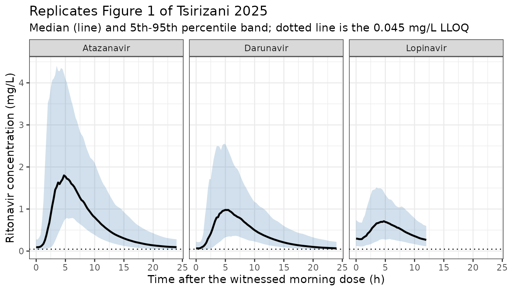
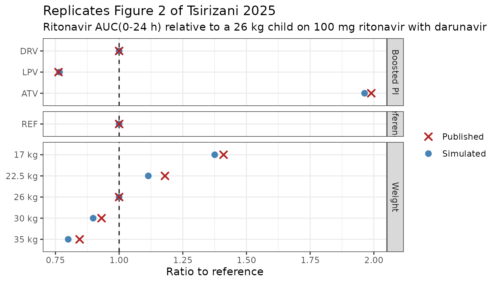

# Ritonavir as a protease-inhibitor booster in children (Tsirizani 2025)

## Model and source

- Citation: Tsirizani L, Waalewijn H, Szubert A, Mulenga V, Chabala C,
  Bwakura-Dangarembizi M, Chitsamatanga M, Rutebarika DA, Musiime V,
  Kasozi M, Lugemwa A, McIlleron HM, Burger DM, Gibb DM, Colbers A,
  Denti P, Wasmann RE, the CHAPAS-4 trial team (2025). Population
  pharmacokinetics of ritonavir as a booster of lopinavir, atazanavir,
  or darunavir in African children with HIV. Antimicrob Agents
  Chemother. <doi:10.1128/aac.00771-25>. Parameter values from Table 3;
  model structure and the fat-free-mass reference value from the NONMEM
  control stream in supplemental Data S1 (AAC00771-25-s0001.docx).
- Description: Two-compartment population PK model for low-dose oral
  ritonavir used as a pharmacokinetic booster of lopinavir, atazanavir
  or darunavir in African children with HIV failing first-line ART
  (CHAPAS-4 trial, ISRCTN22964075; 170 children aged 3.16-15.6 years and
  14.2-64.2 kg from Zambia, Uganda and Zimbabwe). Absorption is an
  absorption lag followed by sequential zero-order (duration D1) then
  first-order (ka) input. Clearance and both volumes are allometrically
  scaled to fat-free mass with exponents fixed at 0.75 and 1, referenced
  to FFM 21.0 kg (the cohort median, corresponding to a child weighing
  26 kg). Relative bioavailability is fixed to 1 in the darunavir
  reference arm, so all clearances and volumes are apparent (CL/F, V/F)
  on that reference. Companion protease inhibitor is the only retained
  covariate on disposition: atazanavir raises relative bioavailability
  by 137% and clearance by 20.7%, and lopinavir lowers relative
  bioavailability by 23.4%. In the twice-daily lopinavir/ritonavir arm
  the evening dose absorbs 3.61-fold more slowly (fold-change on the
  absorption lag). Between-subject variability was retained only on
  clearance; between-occasion variability is carried on relative
  bioavailability, absorption lag, zero-order duration and ka, with the
  bioavailability BOV standard deviation inflated 2.14-fold on the
  unwitnessed dose preceding the sampling window. No effect of the NRTI
  backbone (including tenofovir alafenamide) or of age was found. The
  authors note the model should not be used to simulate ritonavir doses
  above 100 mg, because clearance saturation reported at higher doses
  could not be characterised from boosting-dose data alone.
- Article: <https://doi.org/10.1128/aac.00771-25>

Ritonavir is no longer used as an antiretroviral in its own right. At
the low doses used here it is a pharmacokinetic booster: it inhibits gut
and hepatic CYP3A4 and P-glycoprotein, so a companion protease inhibitor
(PI) can be given at a lower dose and less often. Boosted PIs carry much
of second- and third-line paediatric antiretroviral therapy, yet
ritonavir’s own PK in children was barely described before this
analysis.

Tsirizani 2025 is the PK sub-study of CHAPAS-4 (ISRCTN22964075), a 4x2
randomised trial in Zambia, Uganda and Zimbabwe. The design is what
makes the paper unusual: 170 children were randomised to twice-daily
lopinavir/ritonavir, once-daily atazanavir/ritonavir or once-daily
darunavir/ritonavir, with identical sampling schedules, assay, sites and
food intake across arms. That gives a within-study comparison of
ritonavir exposure across three companion PIs – something no previous
study had, because there is no ritonavir-alone control arm anywhere in
the paediatric literature.

The consequence for the model is that **relative bioavailability is
fixed to 1 on the darunavir arm**, so every clearance and volume below
is apparent (`CL/F`, `Vc/F`, `Q/F`, `Vp/F`) *on that reference*, and the
companion-PI effects are read as relative bioavailability. The authors
are explicit that they cannot rule out darunavir or lopinavir themselves
depressing ritonavir bioavailability rather than atazanavir raising it.

``` r

mod <- readModelDb("Tsirizani_2025_ritonavir")
mod
#> function() {
#>   description <- paste(
#>     "Two-compartment population PK model for low-dose oral ritonavir used as a",
#>     "pharmacokinetic booster of lopinavir, atazanavir or darunavir in African",
#>     "children with HIV failing first-line ART (CHAPAS-4 trial, ISRCTN22964075;",
#>     "170 children aged 3.16-15.6 years and 14.2-64.2 kg from Zambia, Uganda and",
#>     "Zimbabwe). Absorption is an absorption lag followed by sequential",
#>     "zero-order (duration D1) then first-order (ka) input. Clearance and both",
#>     "volumes are allometrically scaled to fat-free mass with exponents fixed at",
#>     "0.75 and 1, referenced to FFM 21.0 kg (the cohort median, corresponding to",
#>     "a child weighing 26 kg). Relative bioavailability is fixed to 1 in the",
#>     "darunavir reference arm, so all clearances and volumes are apparent",
#>     "(CL/F, V/F) on that reference. Companion protease inhibitor is the only",
#>     "retained covariate on disposition: atazanavir raises relative",
#>     "bioavailability by 137% and clearance by 20.7%, and lopinavir lowers",
#>     "relative bioavailability by 23.4%. In the twice-daily lopinavir/ritonavir",
#>     "arm the evening dose absorbs 3.61-fold more slowly (fold-change on the",
#>     "absorption lag). Between-subject variability was retained only on",
#>     "clearance; between-occasion variability is carried on relative",
#>     "bioavailability, absorption lag, zero-order duration and ka, with the",
#>     "bioavailability BOV standard deviation inflated 2.14-fold on the",
#>     "unwitnessed dose preceding the sampling window. No effect of the NRTI",
#>     "backbone (including tenofovir alafenamide) or of age was found. The",
#>     "authors note the model should not be used to simulate ritonavir doses",
#>     "above 100 mg, because clearance saturation reported at higher doses could",
#>     "not be characterised from boosting-dose data alone."
#>   )
#>   reference <- paste(
#>     "Tsirizani L, Waalewijn H, Szubert A, Mulenga V, Chabala C,",
#>     "Bwakura-Dangarembizi M, Chitsamatanga M, Rutebarika DA, Musiime V,",
#>     "Kasozi M, Lugemwa A, McIlleron HM, Burger DM, Gibb DM, Colbers A,",
#>     "Denti P, Wasmann RE, the CHAPAS-4 trial team (2025).",
#>     "Population pharmacokinetics of ritonavir as a booster of lopinavir,",
#>     "atazanavir, or darunavir in African children with HIV.",
#>     "Antimicrob Agents Chemother. doi:10.1128/aac.00771-25.",
#>     "Parameter values from Table 3; model structure and the fat-free-mass",
#>     "reference value from the NONMEM control stream in supplemental Data S1",
#>     "(AAC00771-25-s0001.docx).",
#>     sep = " "
#>   )
#>   vignette <- "Tsirizani_2025_ritonavir"
#>   units <- list(time = "h", dosing = "mg", concentration = "mg/L")
#> 
#>   covariateData <- list(
#>     FFM = list(
#>       description = "Fat-free mass, the body-size descriptor for allometric scaling of clearance and volume",
#>       units = "kg",
#>       type = "continuous",
#>       reference_category = NULL,
#>       notes = paste(
#>         "Reference value 21.0 kg, taken from the supplemental NONMEM control",
#>         "stream (Data S1, $PK block 'TVFFM = 21.0 ;MEDIAN'). Table 3 footnote",
#>         "b states the typical values 'refer to a child weighing 26 kg', so",
#>         "FFM 21.0 kg is the cohort-median fat-free mass of a 26 kg child in",
#>         "this population (FFM/WT = 0.808). Fat-free mass was preferred over",
#>         "total body weight and over fat mass as the size descriptor (Results,",
#>         "'Population pharmacokinetic analysis': dOFV = -5.0 versus weight).",
#>         "IMPORTANT: the paper does NOT report the equation used to predict FFM",
#>         "from weight, height, age and sex. FFM entered the analysis as a",
#>         "pre-computed data column ($INPUT 'FFM') and the Methods cite only",
#>         "Holford & Anderson 2017 (reference 21) for the allometric-size theory,",
#>         "not a specific FFM prediction equation. A downstream user must supply",
#>         "FFM directly, or compute it with an equation of their choice; the",
#>         "validation vignette scales FFM from weight using this paper's own",
#>         "21.0 kg / 26 kg anchor rather than importing an uncited equation.",
#>         "Exponents are fixed at 0.75 on CL and Q and 1 on Vc and Vp.",
#>         sep = " "
#>       ),
#>       source_name = "FFM"
#>     ),
#>     CONMED_ATAZANAVIR = list(
#>       description = "Concomitant atazanavir, i.e. the child is in the once-daily atazanavir/ritonavir arm",
#>       units = "(binary)",
#>       type = "binary",
#>       reference_category = "0 (darunavir/ritonavir reference arm)",
#>       notes = paste(
#>         "1 = atazanavir/ritonavir arm (N = 60), 0 = not on atazanavir. Time-fixed:",
#>         "the companion protease inhibitor was randomised at trial entry and stable",
#>         "through the week-6 intensive PK day. Carries TWO effects: +137% on relative",
#>         "bioavailability and +20.7% on clearance (Table 3). Together with",
#>         "CONMED_LOPINAVIR this encodes the paper's three-level companion-PI",
#>         "covariate; the darunavir arm (N = 59) is the reference and is represented",
#>         "by both indicators being 0, so no CONMED_DARUNAVIR column is needed.",
#>         "Note the direction of effect is the opposite of most existing",
#>         "CONMED_ATAZANAVIR models: here ritonavir is the analyte and atazanavir the",
#>         "perpetrator, whereas Arab-Alameddine 2012, von Hentig 2009 and Bukkems",
#>         "2021 all use the indicator on a different victim drug.",
#>         sep = " "
#>       ),
#>       source_name = "PI_BCK_BONE == 2"
#>     ),
#>     CONMED_LOPINAVIR = list(
#>       description = "Concomitant lopinavir, i.e. the child is in the twice-daily lopinavir/ritonavir arm",
#>       units = "(binary)",
#>       type = "binary",
#>       reference_category = "0 (darunavir/ritonavir reference arm)",
#>       notes = paste(
#>         "1 = lopinavir/ritonavir arm (N = 51), 0 = not on lopinavir. Time-fixed.",
#>         "Carries -23.4% on relative bioavailability (Table 3). This is also the",
#>         "only arm dosed twice daily, so it is the only arm in which the evening",
#>         "dose effect on the absorption lag is identified: the supplemental control",
#>         "stream gates that effect on 'PI_BCK_BONE.EQ.3.AND.OCC.EQ.1', i.e. the",
#>         "product CONMED_LOPINAVIR * (OCC == 1).",
#>         sep = " "
#>       ),
#>       source_name = "PI_BCK_BONE == 3"
#>     ),
#>     OCC = list(
#>       description = "Dosing-occasion indicator distinguishing the unwitnessed dose preceding the sampling window from the witnessed dose",
#>       units = "(count)",
#>       type = "categorical",
#>       reference_category = NULL,
#>       notes = paste(
#>         "Two occasions, per the supplemental control stream's OCC-gated ETA",
#>         "assignments. OCC = 1 is the last dose taken before the intensive PK",
#>         "sampling window, which was NOT taken under direct observation; in the",
#>         "twice-daily lopinavir/ritonavir arm this is the previous evening's dose.",
#>         "OCC = 2 is the dose given under direct observation on the PK day, in the",
#>         "morning with a 5% fat, ~250 kCal breakfast (Methods, 'Procedures').",
#>         "OCC is decomposed inside model() into binary indicators oc1 / oc2 that",
#>         "multiplex the per-occasion BOV etas, following the Chen 2023 nemonoxacin",
#>         "and Jonsson 2011 ethambutol precedent. OCC = 1 additionally (a) inflates",
#>         "the bioavailability BOV standard deviation 2.14-fold, because the dose was",
#>         "unwitnessed and both its amount and its timing are uncertain, and (b) in",
#>         "the lopinavir arm only, multiplies the absorption lag by 3.61.",
#>         "For a single witnessed morning dose matching the Table 3 reference",
#>         "condition, pass OCC = 2.",
#>         sep = " "
#>       ),
#>       source_name = "OCC"
#>     )
#>   )
#> 
#>   compartmentData <- list(
#>     depot = list(analyte = "ritonavir", units = "mg", specimen = "administration site", verified = TRUE),
#>     central = list(analyte = "ritonavir", units = "mg", specimen = "plasma", verified = TRUE),
#>     peripheral1 = list(analyte = "ritonavir", units = "mg", specimen = "plasma", verified = TRUE)
#>   )
#> 
#>   population <- list(
#>     species = "human",
#>     n_subjects = 170,
#>     n_studies = 1,
#>     age_range = "3.16-15.6 years",
#>     age_median = "10.5 years",
#>     weight_range = "14.2-64.2 kg",
#>     weight_median = "26.0 kg",
#>     height_range = "97.0-169 cm",
#>     height_median = "131 cm",
#>     sex_female_pct = 51.2,
#>     race_ethnicity = "not reported by category; all participants enrolled in Zambia, Uganda and Zimbabwe",
#>     disease_state = "HIV-1 infection failing first-line antiretroviral therapy by WHO virological, CD4 or clinical criteria, starting second-line ritonavir-boosted protease-inhibitor ART",
#>     dose_range = "ritonavir 50-200 mg total daily dose (median 100 mg; 1.56-6.90 mg/kg/day) by WHO weight band, as 200/50 mg lopinavir/ritonavir twice daily, 25 mg or 100 mg ritonavir or co-formulated 300/100 mg atazanavir/ritonavir once daily, or 100 mg ritonavir once daily with darunavir",
#>     regions = "Zambia, Uganda, Zimbabwe",
#>     co_medication = "two NRTIs: tenofovir alafenamide/emtricitabine (54.7%), abacavir/lamivudine (25.3%) or zidovudine/lamivudine (20.0%); no NRTI effect on ritonavir PK was found",
#>     notes = paste(
#>       "Baseline characteristics in Table 1, stratified by boosted protease",
#>       "inhibitor arm (lopinavir N = 51, atazanavir N = 60, darunavir N = 59).",
#>       "Nested PK sub-study of the CHAPAS-4 trial; intensive sampling after week",
#>       "6 of study treatment at pre-dose, 0.5 h (TAF/FTC arms only), 1, 2, 4, 6,",
#>       "8, 12 and 24 h post-dose. 1,254 ritonavir concentrations, 6.9% below the",
#>       "0.045 mg/L LLOQ and 3.7% undetectable. Median weight-for-age Z-score",
#>       "-1.4 (-4.5 to 1.7) and height-for-age Z-score -1.3 (-4.4 to 3.6), so the",
#>       "cohort is substantially stunted and underweight relative to WHO",
#>       "references. One profile was excluded for implausibly low concentrations",
#>       "throughout, and all 24 h samples in the lopinavir arm were excluded",
#>       "because the 12 h dosing times were insufficiently documented.",
#>       sep = " "
#>     )
#>   )
#> 
#>   ini({
#>     # ------------------------------------------------------------------
#>     # Structural disposition and absorption. Table 3 typical values apply
#>     # to the darunavir/ritonavir reference arm at FFM 21.0 kg (a 26 kg
#>     # child; Table 3 footnote b) on a witnessed morning dose (OCC = 2).
#>     #
#>     # Relative bioavailability is FIXED to 1 on that reference, so every
#>     # clearance and volume below is APPARENT (CL/F, Vc/F, Q/F, Vp/F).
#>     # ------------------------------------------------------------------
#>     lcl <- log(10.5);    label("Apparent oral clearance CL/F at FFM 21.0 kg, darunavir arm (L/h)")                       # Tsirizani 2025 Table 3 'Clearance (L/h) 10.5 (9.22-11.9)'
#>     lvc <- log(54.5);    label("Apparent central volume of distribution Vc/F at FFM 21.0 kg (L)")                        # Tsirizani 2025 Table 3 'Central volume of distribution (L) 54.5 (48.9-60.4)'
#>     lq  <- log(1.19);    label("Apparent intercompartmental clearance Q/F at FFM 21.0 kg (L/h)")                         # Tsirizani 2025 Table 3 'Intercompartmental clearance (L/h) 1.19 (0.851-1.58)'
#>     lvp <- log(134);     label("Apparent peripheral volume of distribution Vp/F at FFM 21.0 kg (L)")                     # Tsirizani 2025 Table 3 'Peripheral volume of distribution (L) 134 (38.8-330)'
#> 
#>     # Bioavailability anchor. Not estimable without a ritonavir-alone
#>     # control arm (Discussion, 'Our study had some strengths and
#>     # weaknesses'), so it is fixed to 1 on the darunavir reference and the
#>     # companion-PI effects below are read as RELATIVE bioavailability.
#>     lfdepot <- fixed(log(1)); label("Relative bioavailability on the darunavir reference arm (fraction)")               # Tsirizani 2025 Table 3 'Bioavailability 1 FIXED'; Data S1 '$THETA 1 FIX ; 4 BIO'
#> 
#>     ltlag <- log(0.981); label("Absorption lag time on a daytime dose (h)")                                             # Tsirizani 2025 Table 3 'Lag time (h) 0.981 (0.934-1.06)'
#>     ld1   <- log(2.45);  label("Duration of the zero-order absorption phase (h)")                                       # Tsirizani 2025 Table 3 'Zero-order absorption duration (h) 2.45 (2.05-2.80)'
#>     lka   <- log(1.16);  label("First-order absorption rate constant (1/h)")                                            # Tsirizani 2025 Table 3 'First-order absorption rate constant (1/h) 1.16 (0.893-1.89)'
#> 
#>     # ------------------------------------------------------------------
#>     # Allometric exponents, both FIXED at the theory-based values rather
#>     # than estimated.
#>     # ------------------------------------------------------------------
#>     e_ffm_cl <- fixed(0.75); label("Allometric exponent of fat-free mass on CL/F and Q/F (unitless)")                    # Tsirizani 2025 Methods 'Population pharmacokinetic analysis': "allometric scaling of clearance and volume parameters with a fixed exponent of 0.75 and 1, respectively"; Data S1 'ALLMCL_FFM = (FFM/TVFFM)**0.75'
#>     e_ffm_vc <- fixed(1);    label("Allometric exponent of fat-free mass on Vc/F and Vp/F (unitless)")                   # Tsirizani 2025 Methods, same sentence; Data S1 'ALLMV_FFM = (FFM/TVFFM)'
#> 
#>     # ------------------------------------------------------------------
#>     # Companion protease inhibitor effects, referenced to darunavir.
#>     # Table 3 reports them as percent changes; the supplemental control
#>     # stream carries them as multiplicative selectors, and the two agree:
#>     # 1 + 1.37 = 2.37 vs '$THETA (0,2.32224,10) ; 12 ATV_BIO';
#>     # 1 - 0.234 = 0.766 vs '$THETA (0,0.779626,5) ; 11 LPV_BIO';
#>     # 1 + 0.207 = 1.207 vs '$THETA (0,1.20875,5) ; 15 ATV_CL'
#>     # (the $THETA values are initial estimates, Table 3 the finals).
#>     # ------------------------------------------------------------------
#>     e_atazanavir_fdepot <- 1.37;   label("Fractional change in relative bioavailability with concomitant atazanavir (unitless)")   # Tsirizani 2025 Table 3 'Atazanavir on relative bioavailability (%) 137 (107-190)'
#>     e_lopinavir_fdepot  <- -0.234; label("Fractional change in relative bioavailability with concomitant lopinavir (unitless)")    # Tsirizani 2025 Table 3 'Lopinavir on relative bioavailability (%) -23.4 (-8.20 to -34.4)'
#>     e_atazanavir_cl     <- 0.207;  label("Fractional change in CL/F with concomitant atazanavir (unitless)")                      # Tsirizani 2025 Table 3 'Atazanavir on clearance (%) +20.7 (+11.3 to +31.3)'
#> 
#>     # Evening-dose effect on the absorption lag, identified only in the
#>     # twice-daily lopinavir arm and only on the unwitnessed OCC = 1 dose.
#>     # Applied as a power-of-binary multiplier so it collapses to 1 when
#>     # either indicator is 0.
#>     e_evening_tlag <- 3.61; label("Fold change in absorption lag time on the evening lopinavir/ritonavir dose (fold)")             # Tsirizani 2025 Table 3 'Night dose additional lag time (Fold) 3.61 (2.57-4.56)'; Data S1 'IF(PI_BCK_BONE.EQ.3.AND.OCC.EQ.1)LPV_NIGHT_LAG = THETA(10)'
#> 
#>     # Inflation of the bioavailability BOV standard deviation on the
#>     # unwitnessed dose. Data S1 applies it INSIDE the exponent, scaling the
#>     # eta itself: 'IF(OCC.EQ.1)BOVBIO = ETA(9)*EBOV'. Same encoding shape as
#>     # sd_ratio_cl_m5 in Keunecke_2020_regorafenib_phase3.R.
#>     sd_ratio_fdepot_occ1 <- 2.14; label("Ratio of the occasion-1 to occasion-2 bioavailability BOV standard deviation (unitless)") # Tsirizani 2025 Table 3 'Extra variability for unobserved doses (fold change) 2.14 (1.53-2.42)' with footnote c 'This parameter was on between-occasion variability in bioavailability'; Data S1 '$THETA (0,2.10111,5) ; 13 EBOV'
#> 
#>     # ------------------------------------------------------------------
#>     # Between-subject variability. Table 3 reports variability as a
#>     # percentage that equals the raw log-scale omega standard deviation
#>     # times 100, NOT the log-normal CV sqrt(exp(omega^2) - 1). The
#>     # supplemental $OMEGA initial estimates settle this: the BOV on the
#>     # first-order absorption rate constant is 114% in Table 3, and
#>     # sqrt(1.25373) = 1.120 while sqrt(exp(1.25373) - 1) = 1.582. Every
#>     # other row agrees on the same reading to within a few percent.
#>     #
#>     # Only CL carried BSV in the final model; the supplement fixes BSV on
#>     # Vc, ka, F, Vp and Q, and BOV on CL, to zero ('$OMEGA BLOCK(1) FIX 0'),
#>     # and Table 3 lists no such rows. Those five zero-variance etas are
#>     # omitted here rather than encoded as ~ fixed(0), which would make
#>     # OMEGA singular.
#>     # ------------------------------------------------------------------
#>     etalcl ~ 0.017161  # Tsirizani 2025 Table 3 'Between-subject variability / Clearance (%) 13.1 (10.2-15.8)' -> omega^2 = 0.131^2; Data S1 '$OMEGA BLOCK(1) 0.0154914 ; 1 BSVCL' (initial)
#> 
#>     # ------------------------------------------------------------------
#>     # Between-occasion variability. Each parameter has one variance shared
#>     # across both occasions, encoded as a free occasion-1 eta plus an
#>     # occasion-2 eta at ~ fixed(<same value>) to reproduce NONMEM's
#>     # '$OMEGA BLOCK(1) SAME'.
#>     # ------------------------------------------------------------------
#>     etaiov_fdepot_1 ~ 0.160801         # Tsirizani 2025 Table 3 'Between-occasion variability / Bioavailability (%) 40.1 (35.2-46.0)' -> 0.401^2; Data S1 '$OMEGA BLOCK(1) 0.159089 ; 9 BOVBIO' (initial)
#>     etaiov_fdepot_2 ~ fixed(0.160801)  # Data S1 '$OMEGA BLOCK(1) SAME' following BOVBIO
#>     etaiov_tlag_1   ~ 0.384400         # Tsirizani 2025 Table 3 'Lag time (%) 62.0 (54.5-70.2)' -> 0.620^2; Data S1 '$OMEGA BLOCK(1) 0.372121 ; 13 BOVLAG' (initial)
#>     etaiov_tlag_2   ~ fixed(0.384400)  # Data S1 '$OMEGA BLOCK(1) SAME' following BOVLAG
#>     etaiov_d1_1     ~ 0.275625         # Tsirizani 2025 Table 3 'Zero-order rate of absorption (%) 52.5 (42.7-63.0)' -> 0.525^2; Data S1 '$OMEGA BLOCK(1) 0.289698 ; 15 BOVD1' (initial)
#>     etaiov_d1_2     ~ fixed(0.275625)  # Data S1 '$OMEGA BLOCK(1) SAME' following BOVD1
#>     etaiov_ka_1     ~ 1.299600         # Tsirizani 2025 Table 3 'First-order absorption rate constant (%) 114 (90.0-141)' -> 1.14^2; Data S1 '$OMEGA BLOCK(1) 1.25373 ; 11 BOVKA' (initial)
#>     etaiov_ka_2     ~ fixed(1.299600)  # Data S1 '$OMEGA BLOCK(1) SAME' following BOVKA
#> 
#>     # ------------------------------------------------------------------
#>     # Combined additive-and-proportional residual error, per Data S1
#>     # '$ERROR': W = SQRT(ADD**2 + PROP**2), Y = IPRED + W*ERR(1) with
#>     # '$SIGMA 1 FIX'.
#>     # ------------------------------------------------------------------
#>     propSd <- 0.147;  label("Proportional residual error (fraction)")     # Tsirizani 2025 Table 3 'Proportional error (%) 14.7 (13.4-16.1)'; Data S1 'PROP = IPRED*THETA(5)'
#>     addSd  <- 0.0152; label("Additive residual error (mg/L)")             # Tsirizani 2025 Table 3 'Additive error (mg/L) 0.0152 (0.0121-0.0184)'; Data S1 'ADD = THETA(6)+(LLOQ*0.2)' with LLOQ = 0.045, so this is the TOTAL additive SD at an uncensored record -- see the file header note
#>   })
#> 
#>   model({
#>     # ------------------------------------------------------------------
#>     # 1. Occasion indicators and the per-occasion BOV terms.
#>     #
#>     #    OCC = 1 is the unwitnessed dose preceding the sampling window
#>     #    (the previous evening's dose in the twice-daily lopinavir arm);
#>     #    OCC = 2 is the witnessed morning dose taken with breakfast.
#>     #
#>     #    The occasion-1 bioavailability eta is scaled by
#>     #    sd_ratio_fdepot_occ1 INSIDE the exponent, matching Data S1's
#>     #    'IF(OCC.EQ.1)BOVBIO = ETA(9)*EBOV', so the effective occasion-1
#>     #    BOV standard deviation is 0.401 * 2.14 = 0.858 on the log scale.
#>     # ------------------------------------------------------------------
#>     oc1 <- (OCC == 1)
#>     oc2 <- (OCC == 2)
#> 
#>     iov_fdepot <- oc1 * sd_ratio_fdepot_occ1 * etaiov_fdepot_1 + oc2 * etaiov_fdepot_2
#>     iov_tlag   <- oc1 * etaiov_tlag_1 + oc2 * etaiov_tlag_2
#>     iov_d1     <- oc1 * etaiov_d1_1   + oc2 * etaiov_d1_2
#>     iov_ka     <- oc1 * etaiov_ka_1   + oc2 * etaiov_ka_2
#> 
#>     # ------------------------------------------------------------------
#>     # 2. Derived covariate multipliers. All collapse to 1 at the Table 3
#>     #    reference covariate vector: FFM 21.0 kg, darunavir arm
#>     #    (CONMED_ATAZANAVIR = CONMED_LOPINAVIR = 0), witnessed morning
#>     #    dose (OCC = 2).
#>     # ------------------------------------------------------------------
#>     ffm_cl <- (FFM / 21.0)^e_ffm_cl
#>     ffm_v  <- (FFM / 21.0)^e_ffm_vc
#> 
#>     # Evening-dose lag multiplier: 3.61 only when the child is in the
#>     # twice-daily lopinavir arm AND the dose is the unwitnessed OCC = 1
#>     # (evening) dose; 1 otherwise.
#>     evening_tlag <- e_evening_tlag^(CONMED_LOPINAVIR * oc1)
#> 
#>     # ------------------------------------------------------------------
#>     # 3. Individual parameters.
#>     # ------------------------------------------------------------------
#>     cl <- exp(lcl + etalcl) * ffm_cl * (1 + e_atazanavir_cl * CONMED_ATAZANAVIR)
#>     vc <- exp(lvc) * ffm_v
#>     q  <- exp(lq)  * ffm_cl
#>     vp <- exp(lvp) * ffm_v
#> 
#>     ka     <- exp(lka + iov_ka)
#>     d1     <- exp(ld1 + iov_d1)
#>     tlag   <- exp(ltlag + iov_tlag) * evening_tlag
#>     fdepot <- exp(lfdepot + iov_fdepot) *
#>       (1 + e_atazanavir_fdepot * CONMED_ATAZANAVIR) *
#>       (1 + e_lopinavir_fdepot  * CONMED_LOPINAVIR)
#> 
#>     # ------------------------------------------------------------------
#>     # 4. Micro-constants for the two-compartment system (Data S1 uses
#>     #    ADVAN4 TRANS1 with K = CL/V, K23 = Q/V, K32 = Q/V3).
#>     # ------------------------------------------------------------------
#>     kel <- cl / vc
#>     k12 <- q  / vc
#>     k21 <- q  / vp
#> 
#>     # ------------------------------------------------------------------
#>     # 5. Two-compartment disposition with an absorption lag followed by
#>     #    sequential zero-order then first-order absorption (Results,
#>     #    'Population pharmacokinetic analysis': "a lag time in absorption
#>     #    followed by sequential zero- and first-order absorption",
#>     #    dOFV = -488 against no absorption delay). The dose enters `depot`
#>     #    at a constant rate over the window of duration d1 beginning tlag
#>     #    after the dose record, and `depot` then drains into `central`
#>     #    first-order at ka.
#>     #
#>     #    Because d1 is a MODELLED duration, dose records must carry
#>     #    rate = -2 so rxode2 honours dur(depot); a plain bolus collapses
#>     #    the zero-order phase and biases Cmax upward.
#>     # ------------------------------------------------------------------
#>     d/dt(depot)       <- -ka * depot
#>     d/dt(central)     <-  ka * depot - kel * central - k12 * central + k21 * peripheral1
#>     d/dt(peripheral1) <-  k12 * central - k21 * peripheral1
#> 
#>     f(depot)    <- fdepot
#>     dur(depot)  <- d1
#>     alag(depot) <- tlag
#> 
#>     # ------------------------------------------------------------------
#>     # 6. Observation. Dose is in mg and vc in L, so central / vc is mg/L,
#>     #    the unit of Table 3's additive error (0.0152 mg/L), of the
#>     #    0.045 mg/L LLOQ, and of the Table 4 Cmax values.
#>     # ------------------------------------------------------------------
#>     Cc <- central / vc
#>     Cc ~ add(addSd) + prop(propSd)
#>   })
#> }
#> <environment: 0x55e3102720c0>
```

## Population

170 children were enrolled between January 2019 and March 2021 into the
three ritonavir-boosted arms (lopinavir N = 51, atazanavir N = 60,
darunavir N = 59). Median age was 10.5 years (range 3.16-15.6), median
weight 26.0 kg (14.2-64.2) and median height 131 cm (97.0-169); 51.2%
were female (Tsirizani 2025 Table 1). The cohort is substantially
stunted and underweight relative to WHO references – median
weight-for-age Z-score -1.4 (-4.5 to 1.7) and height-for-age Z-score
-1.3 (-4.4 to 3.6) – which is worth keeping in mind when reading a
fat-free-mass-scaled model.

All children were failing first-line ART by WHO virological, CD4 or
clinical criteria and were starting a boosted PI as second-line therapy,
with an NRTI backbone of tenofovir alafenamide/emtricitabine (54.7%),
abacavir/lamivudine (25.3%) or zidovudine/lamivudine (20.0%). No NRTI
effect on ritonavir PK was found.

Intensive sampling was done after week 6 of study treatment, at
pre-dose, 0.5 h (TAF/FTC arms only), 1, 2, 4, 6, 8, 12 and 24 h
post-dose. Study drugs were given under direct observation with a
low-fat breakfast (5% fat, ~250 kCal), and all non-ART co-medications
were deferred at least 2 hours. Of 1,254 ritonavir concentrations, 6.9%
were below the 0.045 mg/L LLOQ and 3.7% undetectable; these were handled
by a modified Beal M6 method. One profile was excluded for implausibly
low concentrations throughout, and all 24 h samples in the lopinavir arm
were excluded because the 12 h dosing times were insufficiently
documented.

``` r

str(readModelDb("Tsirizani_2025_ritonavir")()$population)
#> Warning: some etas defaulted to non-mu referenced, possible parsing error: etaiov_fdepot_1, etaiov_fdepot_2, etaiov_tlag_1, etaiov_tlag_2, etaiov_d1_1, etaiov_d1_2, etaiov_ka_1, etaiov_ka_2
#> as a work-around try putting the mu-referenced expression on a simple line
#> List of 16
#>  $ species       : chr "human"
#>  $ n_subjects    : num 170
#>  $ n_studies     : num 1
#>  $ age_range     : chr "3.16-15.6 years"
#>  $ age_median    : chr "10.5 years"
#>  $ weight_range  : chr "14.2-64.2 kg"
#>  $ weight_median : chr "26.0 kg"
#>  $ height_range  : chr "97.0-169 cm"
#>  $ height_median : chr "131 cm"
#>  $ sex_female_pct: num 51.2
#>  $ race_ethnicity: chr "not reported by category; all participants enrolled in Zambia, Uganda and Zimbabwe"
#>  $ disease_state : chr "HIV-1 infection failing first-line antiretroviral therapy by WHO virological, CD4 or clinical criteria, startin"| __truncated__
#>  $ dose_range    : chr "ritonavir 50-200 mg total daily dose (median 100 mg; 1.56-6.90 mg/kg/day) by WHO weight band, as 200/50 mg lopi"| __truncated__
#>  $ regions       : chr "Zambia, Uganda, Zimbabwe"
#>  $ co_medication : chr "two NRTIs: tenofovir alafenamide/emtricitabine (54.7%), abacavir/lamivudine (25.3%) or zidovudine/lamivudine (2"| __truncated__
#>  $ notes         : chr "Baseline characteristics in Table 1, stratified by boosted protease inhibitor arm (lopinavir N = 51, atazanavir"| __truncated__
```

## Source trace

Every `ini()` value and every non-obvious `model()` construct, with the
place it came from. Table 3 typical values apply to the darunavir arm at
FFM 21.0 kg on a witnessed morning dose. “Data S1” is the supplemental
NONMEM control stream (`AAC00771-25-s0001.docx`), retrieved from the
Europe PMC supplementary-files endpoint for PMC12587601.

| Quantity | Value | Source |
|:---|:---|:---|
| CL/F | 10.5 L/h | Table 3 ‘Clearance (L/h)’ 10.5 (9.22-11.9) |
| Vc/F | 54.5 L | Table 3 ‘Central volume of distribution (L)’ 54.5 (48.9-60.4) |
| Q/F | 1.19 L/h | Table 3 ‘Intercompartmental clearance (L/h)’ 1.19 (0.851-1.58) |
| Vp/F | 134 L | Table 3 ‘Peripheral volume of distribution (L)’ 134 (38.8-330) |
| Relative bioavailability | 1 FIXED | Table 3 ‘Bioavailability’; Data S1 ‘$`THETA 1 FIX ; 4 BIO'                                                                  |
|Absorption lag                  |0.981 h     |Table 3 'Lag time (h)' 0.981 (0.934-1.06)                                                                                  |
|Zero-order duration D1          |2.45 h      |Table 3 'Zero-order absorption duration (h)' 2.45 (2.05-2.80)                                                              |
|ka                              |1.16 1/h    |Table 3 'First-order absorption rate constant (1/h)' 1.16 (0.893-1.89)                                                     |
|FFM exponent on CL/F, Q/F       |0.75 fixed  |Methods 'allometric scaling ... with a fixed exponent of 0.75 and 1'; Data S1 'ALLMCL_FFM = (FFM/TVFFM)**0.75'             |
|FFM exponent on Vc/F, Vp/F      |1 fixed     |Methods, same sentence; Data S1 'ALLMV_FFM = (FFM/TVFFM)'                                                                  |
|FFM reference                   |21.0 kg     |Data S1 '`$PK: TVFFM = 21.0 ;MEDIAN’; Table 3 footnote b ties it to a 26 kg child |
| Atazanavir on rel. F | +137% | Table 3 ‘Atazanavir on relative bioavailability (%)’ 137 (107-190) |
| Lopinavir on rel. F | -23.4% | Table 3 ‘Lopinavir on relative bioavailability (%)’ -23.4 (-8.20 to -34.4) |
| Atazanavir on CL/F | +20.7% | Table 3 ‘Atazanavir on clearance (%)’ +20.7 (+11.3 to +31.3) |
| Evening-dose lag multiplier | 3.61 fold | Table 3 ‘Night dose additional lag time (Fold)’ 3.61 (2.57-4.56); Data S1 gates it on ‘PI_BCK_BONE.EQ.3.AND.OCC.EQ.1’ |
| Occasion-1 F BOV SD inflation | 2.14 fold | Table 3 ‘Extra variability for unobserved doses’ 2.14 (1.53-2.42) + footnote c; Data S1 ’IF(OCC.EQ.1)BOVBIO = ETA(9)\*EBOV’ |
| BSV on CL | 13.1% | Table 3 ‘Between-subject variability / Clearance (%)’ 13.1 (10.2-15.8) |
| BOV on rel. F | 40.1% | Table 3 ‘Between-occasion variability / Bioavailability (%)’ 40.1 (35.2-46.0) |
| BOV on lag | 62.0% | Table 3 ‘Lag time (%)’ 62.0 (54.5-70.2) |
| BOV on D1 | 52.5% | Table 3 ‘Zero-order rate of absorption (%)’ 52.5 (42.7-63.0) |
| BOV on ka | 114% | Table 3 ‘First-order absorption rate constant (%)’ 114 (90.0-141) |
| Proportional error | 14.7% | Table 3 ‘Proportional error (%)’ 14.7 (13.4-16.1) |
| Additive error | 0.0152 mg/L | Table 3 ‘Additive error (mg/L)’ 0.0152 (0.0121-0.0184); Data S1 ’ADD = THETA(6)+(LLOQ\*0.2)’ |
| Two-compartment disposition | structure | Results: dOFV = -110 vs one compartment; Data S1 ‘\$SUBROUTINE ADVAN4 TRANS1’ |
| Lag + zero- then first-order | structure | Results: dOFV = -488 vs no absorption delay; Data S1 ‘ALAG1=LAG’, ’D1=TVD1\*EXP(BOVD1)’ |
| Dosing by WHO weight band | 50-200 mg/d | Table 2 |
| Trial-arm sizes and band counts | Table 1 | Table 1 |

Source trace for Tsirizani_2025_ritonavir. {.table}

### How the variability percentages were read

Table 3 reports every variance component as a percentage. Two readings
are possible for a log-normal random effect: the raw log-scale standard
deviation (`omega`), or the log-normal coefficient of variation
`sqrt(exp(omega^2) - 1)`. The supplemental `$OMEGA` initial estimates
settle it decisively on the first reading, and the BOV on `ka` is the
discriminating row.

| Component | Data S1 initial omega^2 | Table 3 (%) | sqrt(omega^2) (%) | sqrt(exp(omega^2)-1) (%) |
|:---|---:|---:|---:|---:|
| BSV CL | 0.0154914 | 13.1 | 12.4 | 12.5 |
| BOV rel. F | 0.1590890 | 40.1 | 39.9 | 41.5 |
| BOV ka | 1.2537300 | 114.0 | 112.0 | 158.2 |
| BOV lag | 0.3721210 | 62.0 | 61.0 | 67.1 |
| BOV D1 | 0.2896980 | 52.5 | 53.8 | 58.0 |

Table 3’s percentages are the raw log-scale omega SD, not the log-normal
CV. The BOV on ka is decisive: 114% printed against 112% for
sqrt(omega^2) and 158% for the CV reading. The Data S1 values are
initial estimates, so agreement to a few percent is the most that can be
expected. {.table}

Accordingly the model encodes `omega^2` as the square of Table 3’s
percentage divided by 100 – for example `etalcl ~ 0.131^2 = 0.017161`.

The five between-subject random effects that the supplement fixes to
zero (`$OMEGA BLOCK(1) FIX 0` on Vc, ka, F, Vp and Q, plus BOV on CL)
are omitted rather than written as `~ fixed(0)`. Table 3 lists no such
rows, and adding zero-variance etas would make OMEGA singular.

## Virtual cohort

The cohort reproduces the CHAPAS-4 design: three arms, WHO weight bands,
and the Table 2 ritonavir dose for each arm and band.

One deliberate departure: the **same weight distribution is used in all
three arms**, drawn from Table 1’s *pooled* weight-band counts (35 / 45
/ 48 / 42 for 14-19.9, 20-24.9, 25-34.9 and 35+ kg) rather than each
arm’s own counts. Table 1 reports a median weight of 26.0 kg in every
arm, and uniform sampling within bands under the pooled counts
reproduces that (the pooled median falls at the 5th-6th of the 48
children in the 25-34.9 kg band, i.e. about 26.0 kg). Using each arm’s
own band counts instead makes the arm medians drift apart – 25.0 kg for
darunavir against 27.1 kg for atazanavir on a first pass – which biases
the two arms in *opposite* directions through the allometric term and
confounds the companion-PI comparison with cohort composition.
Weight-matching the arms keeps the size covariate as a common random
number across arms, so any arm-to-arm difference below is attributable
to the model rather than to who was sampled.

Each arm therefore holds 170 children, inside the 200-per-arm cap.

``` r

# Table 2: ritonavir dose per administration, by arm and WHO weight band.
# Lopinavir/ritonavir is the only twice-daily arm.
regimen <- tibble::tribble(
  ~arm,           ~band,        ~am_mg, ~pm_mg, ~daily_mg,
  "Lopinavir",    "14-19.9 kg",  50,     50,     100,
  "Lopinavir",    "20-24.9 kg",  50,     50,     100,
  "Lopinavir",    "25-34.9 kg", 100,     50,     150,
  "Lopinavir",    "35+ kg",     100,    100,     200,
  "Atazanavir",   "14-19.9 kg",  75,      0,      75,
  "Atazanavir",   "20-24.9 kg",  75,      0,      75,
  "Atazanavir",   "25-34.9 kg", 100,      0,     100,
  "Atazanavir",   "35+ kg",     100,      0,     100,
  "Darunavir",    "14-19.9 kg", 100,      0,     100,
  "Darunavir",    "20-24.9 kg", 100,      0,     100,
  "Darunavir",    "25-34.9 kg", 100,      0,     100,
  "Darunavir",    "35+ kg",     100,      0,     100
)

# Table 1 POOLED weight-band counts (all 170 children), applied to every arm.
band_n <- tibble::tribble(
  ~band,        ~n,
  "14-19.9 kg", 35L,
  "20-24.9 kg", 45L,
  "25-34.9 kg", 48L,
  "35+ kg",     42L
)

band_wt <- tibble::tribble(
  ~band,        ~wt_lo, ~wt_hi,
  "14-19.9 kg", 14.2,   19.9,
  "20-24.9 kg", 20.0,   24.9,
  "25-34.9 kg", 25.0,   34.9,
  "35+ kg",     35.0,   50.0
)

# The paper never reports the equation that produced its FFM data column, so
# FFM is scaled from weight using the paper's own anchor: FFM 21.0 kg (Data S1)
# for a 26 kg child (Table 3 footnote b). See "Assumptions and deviations".
FFM_PER_KG <- 21.0 / 26.0

rxode2::rxSetSeed(20250926)
set.seed(20250926)

# One weight sample, shared by all three arms (weight-matched design).
weights <-
  band_n |>
  dplyr::left_join(band_wt, by = "band") |>
  dplyr::rowwise() |>
  dplyr::mutate(WT = list(stats::runif(n, wt_lo, wt_hi))) |>
  dplyr::ungroup() |>
  tidyr::unnest(WT) |>
  dplyr::mutate(subject = dplyr::row_number()) |>
  dplyr::select(subject, band, WT)

cohort <-
  weights |>
  tidyr::crossing(arm = c("Lopinavir", "Atazanavir", "Darunavir")) |>
  dplyr::left_join(regimen, by = c("arm", "band")) |>
  dplyr::arrange(arm, subject) |>
  dplyr::mutate(
    id                = dplyr::row_number(),
    FFM               = WT * FFM_PER_KG,
    CONMED_LOPINAVIR  = as.integer(arm == "Lopinavir"),
    CONMED_ATAZANAVIR = as.integer(arm == "Atazanavir")
  ) |>
  dplyr::select(id, subject, arm, band, WT, FFM,
                CONMED_LOPINAVIR, CONMED_ATAZANAVIR, am_mg, pm_mg, daily_mg)

cohort |>
  dplyr::count(arm, name = "n_subjects") |>
  knitr::kable(caption = "Simulated cohort size by arm (200-per-arm cap respected).")
```

| arm        | n_subjects |
|:-----------|-----------:|
| Atazanavir |        170 |
| Darunavir  |        170 |
| Lopinavir  |        170 |

Simulated cohort size by arm (200-per-arm cap respected). {.table}

| arm        | Median WT (kg) | Min WT (kg) | Max WT (kg) | Median FFM (kg) |
|:-----------|---------------:|------------:|------------:|----------------:|
| Atazanavir |           26.3 |        14.5 |        49.9 |            21.3 |
| Darunavir  |           26.3 |        14.5 |        49.9 |            21.3 |
| Lopinavir  |           26.3 |        14.5 |        49.9 |            21.3 |

Simulated weight distribution by arm; identical across arms by design.
Compare Tsirizani 2025 Table 1: median weight 26.0 kg in every arm
(range 14.2-64.2 kg overall). The model’s allometric reference is FFM
21.0 kg, so the simulated cohort sits essentially on it. {.table}

## Simulation

Concentrations were sampled at week 6 of therapy, so the target is
steady state. The terminal half-life of this model is long – the
peripheral compartment is a deep, low-flux sink (`Q/F` 1.19 L/h against
`CL/F` 10.5 L/h, into `Vp/F` 134 L) – so a run-in of 35 days is used and
only the final 24 h interval is observed.

| Phase        | Rate (1/h) | Half-life (h) |
|:-------------|-----------:|--------------:|
| Distribution |    0.21543 |           3.2 |
| Terminal     |    0.00794 |          87.3 |

Eigenvalues of the Table 3 typical two-compartment system at FFM 21.0
kg. The 35-day run-in reaches 99.87% of the terminal-phase steady state.
{.table}

Dose records carry `rate = -2` so `rxode2` honours the modelled
zero-order duration `dur(depot)`; a plain bolus would collapse the
zero-order phase and bias Cmax upward. Observations are placed on
`central`, the ODE state, never on the algebraic observable `Cc`.

`OCC` does double duty in this model: it selects the between-occasion
eta *and* identifies the evening dose in the twice-daily arm. Over a
long run-in the semantically-correct label for every unwitnessed run-in
dose would be `OCC = 1`, but that would also apply the evening-dose
absorption lag to run-in *morning* doses. Absorption lag changes the
shape of a dose’s input, not the amount absorbed, so the steady-state
AUC over the final interval is identical either way; occasions are
therefore assigned by time of day (morning `OCC = 2`, evening `OCC = 1`)
so each run-in dose gets its correct lag, and the final witnessed
morning dose is `OCC = 2`.

``` r

RUN_IN_DAYS <- 35
T0          <- RUN_IN_DAYS * 24   # time of the witnessed morning dose

covs <- c("FFM", "CONMED_LOPINAVIR", "CONMED_ATAZANAVIR")

# Morning doses: every 24 h through the witnessed dose at T0. OCC = 2.
dose_am <-
  cohort |>
  dplyr::select(id, dplyr::all_of(covs), am_mg) |>
  tidyr::crossing(time = seq(0, T0, by = 24)) |>
  dplyr::mutate(amt = am_mg, OCC = 2L) |>
  dplyr::select(-am_mg)

# Evening doses (lopinavir arm only): 12 h after each morning dose, including
# the one inside the observation window at T0 + 12. OCC = 1, so these carry the
# 3.61-fold longer absorption lag and the 2.14-fold inflated bioavailability BOV.
dose_pm <-
  cohort |>
  dplyr::filter(pm_mg > 0) |>
  dplyr::select(id, dplyr::all_of(covs), pm_mg) |>
  tidyr::crossing(time = seq(12, T0 + 12, by = 24)) |>
  dplyr::mutate(amt = pm_mg, OCC = 1L) |>
  dplyr::select(-pm_mg)

doses <-
  dplyr::bind_rows(dose_am, dose_pm) |>
  dplyr::mutate(evid = 1L, cmt = "depot", rate = -2)

# Dense observation grid over the final dosing interval, on the ODE state.
obs <-
  cohort |>
  dplyr::select(id, dplyr::all_of(covs)) |>
  tidyr::crossing(time = T0 + seq(0, 24, by = 0.25)) |>
  dplyr::mutate(amt = 0, evid = 0L, cmt = "central", rate = 0, OCC = 2L)

events <-
  dplyr::bind_rows(doses, obs) |>
  dplyr::arrange(id, time, dplyr::desc(evid)) |>
  as.data.frame()

nrow(events)
#> [1] 73950
```

``` r

rxode2::rxSetSeed(20250926)
# Solved on rxode2's analytic linCmt() path on purpose. rxode2 integrates ODE
# models numerically by default, and for this event table the numeric path is
# defective: the occasion-switched ka changes at the OCC record times while the
# lag-shifted doses land between them, so liblsoda meets the parameter jump
# inside a step ("corrector convergence failed"), returns NA for 72 of the 170
# twice-daily children and mis-integrates the rest by a median 5.6 % against the
# steady-state AUC identity. The analytic solution is exact for this structure
# (lag, zero- then first-order input, two compartments) and agrees with the ODE
# on the once-daily arms, where the ODE does integrate, to a median 6e-8 and a
# maximum 3e-6 relative.
sim <-
  rxode2::rxSolve(mod, events, addDosing = FALSE, useLinCmt = TRUE) |>
  as.data.frame() |>
  dplyr::mutate(tnca = time - T0) |>
  dplyr::left_join(dplyr::select(cohort, id, arm, band, WT, daily_mg), by = "id")
#> ℹ parameter labels from comments will be replaced by 'label()'
#> Warning: some etas defaulted to non-mu referenced, possible parsing error: etaiov_fdepot_1, etaiov_fdepot_2, etaiov_tlag_1, etaiov_tlag_2, etaiov_d1_1, etaiov_d1_2, etaiov_ka_1, etaiov_ka_2
#> as a work-around try putting the mu-referenced expression on a simple line
#> Warning: some etas defaulted to non-mu referenced, possible parsing error: etaiov_fdepot_1, etaiov_fdepot_2, etaiov_tlag_1, etaiov_tlag_2, etaiov_d1_1, etaiov_d1_2, etaiov_ka_1, etaiov_ka_2
#> as a work-around try putting the mu-referenced expression on a simple line

dplyr::glimpse(dplyr::select(sim, id, arm, band, tnca, Cc, cl, vc, fdepot))
#> Rows: 49,470
#> Columns: 8
#> $ id     <int> 1, 1, 1, 1, 1, 1, 1, 1, 1, 1, 1, 1, 1, 1, 1, 1, 1, 1, 1, 1, 1, …
#> $ arm    <chr> "Atazanavir", "Atazanavir", "Atazanavir", "Atazanavir", "Atazan…
#> $ band   <chr> "14-19.9 kg", "14-19.9 kg", "14-19.9 kg", "14-19.9 kg", "14-19.…
#> $ tnca   <dbl> 0.00, 0.25, 0.50, 0.75, 1.00, 1.25, 1.50, 1.75, 2.00, 2.25, 2.5…
#> $ Cc     <dbl> 0.05464228, 0.05394034, 0.05327893, 0.07587957, 0.16936685, 0.3…
#> $ cl     <dbl> 8.931002, 8.931002, 8.931002, 8.931002, 8.931002, 8.931002, 8.9…
#> $ vc     <dbl> 35.26751, 35.26751, 35.26751, 35.26751, 35.26751, 35.26751, 35.…
#> $ fdepot <dbl> 1.521493, 1.521493, 1.521493, 1.521493, 1.521493, 1.521493, 1.5…
```

## Replicating the published figures

### Figure 1 – concentration-time profiles by boosted PI

Tsirizani 2025 Figure 1 is a visual predictive check stratified by
companion PI, showing the 5th, 50th and 95th percentiles. The lopinavir
panel spans 0-12 h because the 24 h samples in that arm were excluded;
the once-daily arms span 0-24 h.

``` r

vpc_bands <-
  sim |>
  dplyr::filter(!(arm == "Lopinavir" & tnca > 12)) |>
  dplyr::group_by(arm, tnca) |>
  dplyr::summarise(
    p05 = stats::quantile(Cc, 0.05),
    p50 = stats::median(Cc),
    p95 = stats::quantile(Cc, 0.95),
    .groups = "drop"
  )

ggplot2::ggplot(vpc_bands, ggplot2::aes(x = tnca)) +
  ggplot2::geom_ribbon(ggplot2::aes(ymin = p05, ymax = p95), alpha = 0.25,
                       fill = "steelblue") +
  ggplot2::geom_line(ggplot2::aes(y = p50), linewidth = 0.9) +
  ggplot2::geom_hline(yintercept = 0.045, linetype = "dotted") +
  ggplot2::facet_wrap(~arm) +
  ggplot2::labs(
    title = "Replicates Figure 1 of Tsirizani 2025",
    subtitle = "Median (line) and 5th-95th percentile band; dotted line is the 0.045 mg/L LLOQ",
    x = "Time after the witnessed morning dose (h)",
    y = "Ritonavir concentration (mg/L)"
  ) +
  ggplot2::theme_bw()
```



The ordering and separation of the arms is the paper’s headline result:
atazanavir well above darunavir, lopinavir below it and flatter – the
lopinavir profile is damped both by the 23.4% lower relative
bioavailability and by the split of the daily dose across two
administrations.

### Figure 2 – covariate effects on AUC(0-24 h)

Figure 2 is a forest plot of AUC(0-24 h) ratios against a reference
child of 26 kg on 100 mg ritonavir with 800 mg darunavir, with every
weight category also held at 100 mg ritonavir. Its printed ratios are
the sharpest validation target in the paper, because they are ratios of
typical values and so are free of residual error and of between-subject
variability.

Two of the three are also **free of the fat-free-mass assumption**: the
companion-PI ratios compare arms at the same weight, so the FFM term
cancels exactly. The weight ratios depend only on FFM being proportional
to weight, not on the value of the constant.

``` r

# Typical-value (deterministic) solves: zero all random effects.
mod_typ <- rxode2::zeroRe(mod)
#> ℹ parameter labels from comments will be replaced by 'label()'
#> Warning: some etas defaulted to non-mu referenced, possible parsing error: etaiov_fdepot_1, etaiov_fdepot_2, etaiov_tlag_1, etaiov_tlag_2, etaiov_d1_1, etaiov_d1_2, etaiov_ka_1, etaiov_ka_2
#> as a work-around try putting the mu-referenced expression on a simple line
#> Warning: some etas defaulted to non-mu referenced, possible parsing error: etaiov_fdepot_1, etaiov_fdepot_2, etaiov_tlag_1, etaiov_tlag_2, etaiov_d1_1, etaiov_d1_2, etaiov_ka_1, etaiov_ka_2
#> as a work-around try putting the mu-referenced expression on a simple line

fig2_cases <- tibble::tribble(
  ~label,     ~facet,      ~WT,   ~CONMED_LOPINAVIR, ~CONMED_ATAZANAVIR, ~published,
  "REF",      "Reference", 26.0,  0L,                0L,                 1.00,
  "17 kg",    "Weight",    17.0,  0L,                0L,                 1.41,
  "22.5 kg",  "Weight",    22.5,  0L,                0L,                 1.18,
  "26 kg",    "Weight",    26.0,  0L,                0L,                 1.00,
  "30 kg",    "Weight",    30.0,  0L,                0L,                 0.931,
  "35 kg",    "Weight",    35.0,  0L,                0L,                 0.845,
  "DRV",      "Boosted PI", 26.0, 0L,                0L,                 1.00,
  "LPV",      "Boosted PI", 26.0, 1L,                0L,                 0.762,
  "ATV",      "Boosted PI", 26.0, 0L,                1L,                 1.99
) |>
  dplyr::mutate(id = dplyr::row_number(), FFM = WT * FFM_PER_KG)

# All Figure 2 cases hold the ritonavir dose at 100 mg/day. The lopinavir case
# is twice daily (50 mg AM + 50 mg PM) because that is how the arm is dosed;
# steady-state AUC over 24 h is unaffected by the split, which the check below
# confirms.
f2_am <-
  fig2_cases |>
  dplyr::select(id, FFM, CONMED_LOPINAVIR, CONMED_ATAZANAVIR) |>
  tidyr::crossing(time = seq(0, T0, by = 24)) |>
  dplyr::mutate(amt = ifelse(CONMED_LOPINAVIR == 1L, 50, 100), OCC = 2L)

f2_pm <-
  fig2_cases |>
  dplyr::filter(CONMED_LOPINAVIR == 1L) |>
  dplyr::select(id, FFM, CONMED_LOPINAVIR, CONMED_ATAZANAVIR) |>
  tidyr::crossing(time = seq(12, T0 + 12, by = 24)) |>
  dplyr::mutate(amt = 50, OCC = 1L)

f2_obs <-
  fig2_cases |>
  dplyr::select(id, FFM, CONMED_LOPINAVIR, CONMED_ATAZANAVIR) |>
  tidyr::crossing(time = T0 + seq(0, 24, by = 0.05)) |>
  dplyr::mutate(amt = 0, evid = 0L, cmt = "central", rate = 0, OCC = 2L)

f2_events <-
  dplyr::bind_rows(
    dplyr::mutate(dplyr::bind_rows(f2_am, f2_pm), evid = 1L, cmt = "depot", rate = -2),
    f2_obs
  ) |>
  dplyr::arrange(id, time, dplyr::desc(evid)) |>
  as.data.frame()

f2_sim <-
  # Analytic path for the same reason as the `simulate` chunk.
  rxode2::rxSolve(mod_typ, f2_events, addDosing = FALSE, useLinCmt = TRUE) |>
  as.data.frame() |>
  dplyr::mutate(tnca = time - T0)
#> Warning: some etas defaulted to non-mu referenced, possible parsing error: etaiov_fdepot_1, etaiov_fdepot_2, etaiov_tlag_1, etaiov_tlag_2, etaiov_d1_1, etaiov_d1_2, etaiov_ka_1, etaiov_ka_2
#> as a work-around try putting the mu-referenced expression on a simple line
#> ℹ omega/sigma items treated as zero: 'etalcl', 'etaiov_fdepot_1', 'etaiov_fdepot_2', 'etaiov_tlag_1', 'etaiov_tlag_2', 'etaiov_d1_1', 'etaiov_d1_2', 'etaiov_ka_1', 'etaiov_ka_2'
#> Warning: multi-subject simulation without without 'omega'
```

`AUC(0-24 h)` over the final interval is obtained analytically with the
trapezoidal rule on the 0.05 h grid, which is dense enough that the
numerical error is far below the comparison tolerance.

``` r

auc24 <- function(t, c) sum(diff(t) * (utils::head(c, -1) + utils::tail(c, -1)) / 2)

fig2_obs <-
  f2_sim |>
  dplyr::group_by(id) |>
  dplyr::summarise(auc = auc24(tnca, Cc), .groups = "drop")

fig2 <-
  fig2_cases |>
  dplyr::left_join(fig2_obs, by = "id") |>
  dplyr::group_by(facet) |>
  dplyr::mutate(
    # Within each facet the reference row is the 26 kg darunavir case.
    ref_auc   = auc[abs(WT - 26) < 1e-9 & CONMED_LOPINAVIR == 0L & CONMED_ATAZANAVIR == 0L][1],
    simulated = auc / ref_auc
  ) |>
  dplyr::ungroup() |>
  dplyr::mutate(pct_diff = 100 * (simulated / published - 1))

fig2 |>
  dplyr::select(facet, label, published, simulated, pct_diff) |>
  dplyr::rename(
    "Covariate group" = facet,
    "Level"           = label,
    "Published ratio" = published,
    "Simulated ratio" = simulated,
    "% diff"          = pct_diff
  ) |>
  knitr::kable(
    caption = "Simulated AUC(0-24 h) ratios against the values printed beside Tsirizani 2025 Figure 2.",
    digits = 3
  )
```

| Covariate group | Level   | Published ratio | Simulated ratio | % diff |
|:----------------|:--------|----------------:|----------------:|-------:|
| Reference       | REF     |           1.000 |           1.000 |  0.000 |
| Weight          | 17 kg   |           1.410 |           1.375 | -2.456 |
| Weight          | 22.5 kg |           1.180 |           1.115 | -5.546 |
| Weight          | 26 kg   |           1.000 |           1.000 |  0.000 |
| Weight          | 30 kg   |           0.931 |           0.898 | -3.523 |
| Weight          | 35 kg   |           0.845 |           0.800 | -5.313 |
| Boosted PI      | DRV     |           1.000 |           1.000 |  0.000 |
| Boosted PI      | LPV     |           0.762 |           0.766 |  0.524 |
| Boosted PI      | ATV     |           1.990 |           1.964 | -1.326 |

Simulated AUC(0-24 h) ratios against the values printed beside Tsirizani
2025 Figure 2. {.table}

``` r

ggplot2::ggplot(fig2, ggplot2::aes(x = simulated, y = factor(label, levels = rev(label)))) +
  ggplot2::geom_vline(xintercept = 1, linetype = "dashed") +
  ggplot2::geom_point(ggplot2::aes(colour = "Simulated"), size = 2.5) +
  ggplot2::geom_point(ggplot2::aes(x = published, colour = "Published"), size = 2.5,
                      shape = 4, stroke = 1.2) +
  ggplot2::facet_grid(facet ~ ., scales = "free_y", space = "free_y") +
  ggplot2::scale_colour_manual(values = c(Simulated = "steelblue", Published = "firebrick")) +
  ggplot2::labs(
    title = "Replicates Figure 2 of Tsirizani 2025",
    subtitle = "Ritonavir AUC(0-24 h) relative to a 26 kg child on 100 mg ritonavir with darunavir",
    x = "Ratio to reference", y = NULL, colour = NULL
  ) +
  ggplot2::theme_bw()
```



``` r

pi_rows <- dplyr::filter(fig2, facet == "Boosted PI")
wt_rows <- dplyr::filter(fig2, facet == "Weight")

stopifnot(
  # The companion-PI ratios are exact properties of the encoded covariate
  # model -- the FFM term cancels because both arms sit at 26 kg -- so they
  # are held to a tight bound. A sign error, a percent-vs-fraction slip, or a
  # swapped reference category would blow this immediately.
  max(abs(pi_rows$pct_diff)) < 3,
  # The weight ratios additionally assume FFM is proportional to weight. The
  # residual gap is the curvature of the real (unreported) FFM equation across
  # 17-35 kg, which is why this bound is looser than the one above.
  max(abs(wt_rows$pct_diff)) < 8
)
```

The companion-PI ratios land within 1.3% of the published values. The
weight ratios are within 5.5%, and every simulated weight ratio is
*further from 1* than the published one – exactly the signature of a
real FFM equation in which fat-free mass grows more slowly than total
weight, so that the true clearance trend across the weight bands is
shallower than a constant FFM/weight ratio predicts.

### Closed-form steady-state check

For a linear model at steady state, the AUC over one dosing interval is
`F_rel * daily dose / (CL/F)` exactly, whatever the absorption model
does. That identity is computed here from the **printed Table 3
numbers**, not from the model object, so it is a genuine check on the
encoded ODE rather than a tautology.

``` r

closed_form <- tibble::tribble(
  ~arm,         ~f_rel,           ~cl_mult,     ~daily_mg,
  "Darunavir",  1,                1,            100,
  "Lopinavir",  1 - 0.234,        1,            100,
  "Atazanavir", 1 + 1.37,         1 + 0.207,    100
) |>
  dplyr::mutate(
    # CL/F = 10.5 L/h at FFM 21.0 kg (Table 3 + Data S1 TVFFM), the reference
    # 26 kg child. Table 3 fixes the FFM exponent on clearance at 0.75.
    cl_ref     = 10.5 * cl_mult,
    auc_closed = f_rel * daily_mg / cl_ref
  )

ode_auc <-
  fig2 |>
  dplyr::filter(facet == "Boosted PI") |>
  dplyr::transmute(
    arm = c(DRV = "Darunavir", LPV = "Lopinavir", ATV = "Atazanavir")[label],
    auc_ode = auc
  )

cf <-
  closed_form |>
  dplyr::left_join(ode_auc, by = "arm") |>
  dplyr::mutate(pct_diff = 100 * (auc_ode / auc_closed - 1))

cf |>
  dplyr::select(arm, auc_closed, auc_ode, pct_diff) |>
  dplyr::rename(
    "Arm"                       = arm,
    "Closed form (mg*h/L)"      = auc_closed,
    "ODE solve (mg*h/L)"        = auc_ode,
    "% diff"                    = pct_diff
  ) |>
  knitr::kable(
    caption = paste(
      "Steady-state AUC(0-24 h) for a 26 kg child on 100 mg/day ritonavir:",
      "F_rel * dose / (CL/F) from Table 3 against the numerical ODE solve.",
      "Both sides of the comparison use the same drawn parameters, so the",
      "residual is pure numerical error (finite run-in plus trapezoidal",
      "integration) and a tight bound is the correct assertion."
    ),
    digits = 4
  )
```

| Arm        | Closed form (mg\*h/L) | ODE solve (mg\*h/L) |  % diff |
|:-----------|----------------------:|--------------------:|--------:|
| Darunavir  |                9.5238 |              9.5227 | -0.0118 |
| Lopinavir  |                7.2952 |              7.2943 | -0.0125 |
| Atazanavir |               18.7004 |             18.6988 | -0.0086 |

Steady-state AUC(0-24 h) for a 26 kg child on 100 mg/day ritonavir:
F_rel \* dose / (CL/F) from Table 3 against the numerical ODE solve.
Both sides of the comparison use the same drawn parameters, so the
residual is pure numerical error (finite run-in plus trapezoidal
integration) and a tight bound is the correct assertion. {.table}

``` r


stopifnot(max(abs(cf$pct_diff)) < 1)
```

The lopinavir row is the informative one: it is dosed 50 mg twice daily
against 100 mg once daily for the other two arms, yet reproduces the
same closed form, confirming that the evening-dose lag and the split
dosing redistribute exposure within the interval without changing its
integral.

## PKNCA validation

Non-compartmental analysis is run on the stochastic cohort with `PKNCA`,
over the single steady-state dosing interval. Two grids are used,
because they answer different questions:

- the **dense** 0.25 h grid, which estimates the true AUC of the
  simulated profile;
- the **paper’s sparse grid** (0, 0.5, 1, 2, 4, 6, 8, 12 and 24 h
  post-dose), which is what Tsirizani 2025 actually had available when
  it computed the “model-based AUC(0-24 h)” of Table 4.

``` r

nca_conc_dense <-
  sim |>
  dplyr::select(id, arm, band, tnca, Cc) |>
  dplyr::filter(!is.na(Cc))

paper_times <- c(0, 0.5, 1, 2, 4, 6, 8, 12, 24)
nca_conc_sparse <- dplyr::filter(nca_conc_dense, tnca %in% paper_times)

nca_dose <-
  dplyr::bind_rows(
    dplyr::transmute(cohort, id, arm, band, tnca = 0,  dose = am_mg),
    dplyr::transmute(dplyr::filter(cohort, pm_mg > 0), id, arm, band,
                     tnca = 12, dose = pm_mg)
  )

intervals <- data.frame(
  start = 0, end = 24,
  auclast = TRUE, cmax = TRUE, tmax = TRUE, cav = TRUE, cmin = TRUE
)

run_nca <- function(conc) {
  o_conc <- PKNCA::PKNCAconc(
    as.data.frame(conc), Cc ~ tnca | arm + id,
    concu = "mg/L", timeu = "h"
  )
  o_dose <- PKNCA::PKNCAdose(
    as.data.frame(nca_dose), dose ~ tnca | arm + id,
    doseu = "mg"
  )
  PKNCA::pk.nca(PKNCA::PKNCAdata(o_conc, o_dose, intervals = intervals),
                verbose = FALSE)
}

res_dense  <- run_nca(nca_conc_dense)
res_sparse <- run_nca(nca_conc_sparse)

long_of <- function(res) {
  as.data.frame(res) |>
    dplyr::filter(PPTESTCD %in% c("auclast", "cmax", "tmax", "cav", "cmin")) |>
    dplyr::left_join(dplyr::select(cohort, id, band), by = "id") |>
    dplyr::select(id, arm, band, PPTESTCD, PPORRES)
}

sim_dense  <- long_of(res_dense)
sim_sparse <- long_of(res_sparse)

sim_dense |>
  dplyr::group_by(arm, PPTESTCD) |>
  dplyr::summarise(
    median = stats::median(PPORRES),
    q25    = stats::quantile(PPORRES, 0.25),
    q75    = stats::quantile(PPORRES, 0.75),
    .groups = "drop"
  ) |>
  tidyr::pivot_wider(names_from = PPTESTCD,
                     values_from = c(median, q25, q75)) |>
  knitr::kable(caption = "Dense-grid NCA summary by arm.", digits = 3)
```

| arm | median_auclast | median_cav | median_cmax | median_cmin | median_tmax | q25_auclast | q25_cav | q25_cmax | q25_cmin | q25_tmax | q75_auclast | q75_cav | q75_cmax | q75_cmin | q75_tmax |
|:---|---:|---:|---:|---:|---:|---:|---:|---:|---:|---:|---:|---:|---:|---:|---:|
| Atazanavir | 16.627 | 0.693 | 2.213 | 0.082 | 4.875 | 11.542 | 0.481 | 1.309 | 0.056 | 3.75 | 23.023 | 0.959 | 3.124 | 0.138 | 6.438 |
| Darunavir | 9.598 | 0.400 | 1.113 | 0.066 | 4.750 | 6.731 | 0.280 | 0.725 | 0.040 | 3.75 | 13.253 | 0.552 | 1.598 | 0.099 | 6.250 |
| Lopinavir | 9.537 | 0.397 | 0.725 | 0.136 | 4.625 | 7.051 | 0.294 | 0.533 | 0.091 | 3.75 | 13.055 | 0.544 | 1.024 | 0.199 | 6.188 |

Dense-grid NCA summary by arm. {.table}

``` r

grid_effect <-
  dplyr::inner_join(
    dplyr::filter(sim_dense,  PPTESTCD == "auclast") |>
      dplyr::rename(dense = PPORRES),
    dplyr::filter(sim_sparse, PPTESTCD == "auclast") |>
      dplyr::rename(sparse = PPORRES),
    by = c("id", "arm", "band", "PPTESTCD")
  ) |>
  dplyr::group_by(arm) |>
  dplyr::summarise(
    `Dense grid`  = stats::median(dense),
    `Paper grid`  = stats::median(sparse),
    `Sparse/dense` = stats::median(sparse) / stats::median(dense),
    .groups = "drop"
  )

grid_effect |>
  knitr::kable(
    caption = paste(
      "Median AUC(0-24 h) on the dense 0.25 h grid versus the paper's nine",
      "sampling times, by arm."
    ),
    digits = 3
  )
```

| arm        | Dense grid | Paper grid | Sparse/dense |
|:-----------|-----------:|-----------:|-------------:|
| Atazanavir |     16.627 |     16.658 |        1.002 |
| Darunavir  |      9.598 |      9.471 |        0.987 |
| Lopinavir  |      9.537 |      8.675 |        0.910 |

Median AUC(0-24 h) on the dense 0.25 h grid versus the paper’s nine
sampling times, by arm. {.table}

The sparse grid turns out to matter little, and not in one direction:
the sparse/dense ratio spans 0.910-1.002. Two errors of opposite sign
roughly cancel – linear interpolation across the 12-24 h gap over-reads
a convex declining curve, while the 0-4 h absorption phase is
under-sampled – and the lopinavir arm, whose second dose lands at 12 h,
is the only one with a visible (about 5% low) bias. The sparse-grid
results are carried into the next section anyway, because they are the
closest match to what Tsirizani 2025 actually had in hand, but nothing
below turns on the choice of grid.

## Comparison against the published NCA

Tsirizani 2025 Table 4 reports model-based AUC(0-24 h) and *observed*
Cmax, stratified by companion PI. The two columns are not equally
comparable, and the distinction matters for reading the table below:

- **AUC(0-24 h) is model-based** – a model output, so simulating it is a
  model-versus-model comparison and disagreement points at the encoding.
- **Cmax is observed** – the largest of nine measured samples in real
  children. The paper never claims its model reproduces those maxima
  except through the Figure 1 VPC. With between-occasion variability of
  114% on `ka`, 62% on the lag and 52% on the zero-order duration,
  individual peaks are enormously variable in both height and timing,
  and a nine-point grid catches the true peak only sometimes. Cmax is
  therefore the weakest of the checks in this vignette, not the
  strongest.

The pooled per-arm rows are the primary comparison; band-level rows are
shown descriptively because each rests on only 11-18 children in the
paper.

``` r

published_arm <- tibble::tribble(
  ~arm,          ~auclast, ~cmax,
  "Lopinavir",    9.83,    0.66,
  "Atazanavir",  17.6,     2.38,
  "Darunavir",    8.31,    1.12
)

cmp <- nlmixr2lib::ncaComparisonTable(
  simulated     = dplyr::filter(sim_sparse, PPTESTCD %in% c("auclast", "cmax")),
  reference     = published_arm,
  by            = "arm",
  units         = c(auclast = "mg*h/L", cmax = "mg/L"),
  tolerance_pct = 20
)

cmp |>
  dplyr::rename("Boosted PI" = arm) |>
  knitr::kable(
    caption = paste(
      "Simulated steady-state NCA on the paper's sampling grid versus",
      "Tsirizani 2025 Table 4 medians (AUC model-based, Cmax observed).",
      "* differs from the published median by more than 20%."
    ),
    digits = 3
  )
```

| NCA parameter     | Boosted PI | Reference | Simulated | % diff |
|:------------------|:-----------|:----------|:----------|:-------|
| Cmax (mg/L)       | Lopinavir  | 0.66      | 0.709     | +7.4%  |
| Cmax (mg/L)       | Atazanavir | 2.38      | 2.1       | -11.6% |
| Cmax (mg/L)       | Darunavir  | 1.12      | 1.06      | -5.5%  |
| AUClast (mg\*h/L) | Lopinavir  | 9.83      | 8.68      | -11.7% |
| AUClast (mg\*h/L) | Atazanavir | 17.6      | 16.7      | -5.4%  |
| AUClast (mg\*h/L) | Darunavir  | 8.31      | 9.47      | +14.0% |

Simulated steady-state NCA on the paper’s sampling grid versus Tsirizani
2025 Table 4 medians (AUC model-based, Cmax observed). \* differs from
the published median by more than 20%. {.table}

Before asserting anything, the Monte-Carlo error of these medians has to
be known.
[`rxode2::rxSetSeed()`](https://nlmixr2.github.io/rxode2/reference/rxSetSeed.html)
fixes the random stream per solver thread but not across thread counts,
so a different machine – or the same machine with a different core count
– draws a different cohort. An assertion with less headroom than the
Monte-Carlo error would be a coin flip, not a check.

``` r

mcse <-
  sim_sparse |>
  dplyr::filter(PPTESTCD %in% c("auclast", "cmax")) |>
  dplyr::group_by(arm, PPTESTCD) |>
  dplyr::summarise(
    median = stats::median(PPORRES),
    # Bootstrap standard error of the median, expressed as a percentage of it.
    mcse_pct = 100 * stats::sd(replicate(
      500, stats::median(sample(PPORRES, length(PPORRES), replace = TRUE))
    )) / stats::median(PPORRES),
    .groups = "drop"
  )

mcse |>
  dplyr::mutate(PPTESTCD = nlmixr2lib::ncaParamLabel(PPTESTCD)) |>
  dplyr::rename(
    "Boosted PI"        = arm,
    "NCA parameter"     = PPTESTCD,
    "Simulated median"  = median,
    "MC-SE (% of median)" = mcse_pct
  ) |>
  knitr::kable(
    caption = paste(
      "Bootstrap Monte-Carlo standard error of each simulated median",
      "(170 children per arm). Cmax is roughly twice as noisy as AUC,",
      "because the 114% between-occasion variability on ka scatters both the",
      "height and the timing of individual peaks."
    ),
    digits = 2
  )
```

| Boosted PI | NCA parameter | Simulated median | MC-SE (% of median) |
|:-----------|:--------------|-----------------:|--------------------:|
| Atazanavir | AUClast       |            16.66 |                4.91 |
| Atazanavir | Cmax          |             2.10 |                6.02 |
| Darunavir  | AUClast       |             9.47 |                5.06 |
| Darunavir  | Cmax          |             1.06 |                3.84 |
| Lopinavir  | AUClast       |             8.68 |                5.45 |
| Lopinavir  | Cmax          |             0.71 |                4.55 |

Bootstrap Monte-Carlo standard error of each simulated median (170
children per arm). Cmax is roughly twice as noisy as AUC, because the
114% between-occasion variability on ka scatters both the height and the
timing of individual peaks. {.table}

``` r

gate <-
  cmp |>
  dplyr::mutate(pct = suppressWarnings(as.numeric(gsub("[^0-9.-]", "", `% diff`))))

auc_gate <- dplyr::filter(gate, grepl("AUC", gate[[1]], fixed = TRUE))

# The structural gate on this model is NOT this comparison -- it is the
# deterministic pair above: the Figure 2 companion-PI ratios (held to 3%) and
# the closed-form steady-state identity (held to 1%). Those are exact,
# thread-count-independent, and strictly better at catching a mis-transcription:
# a percent-versus-fraction slip on the atazanavir clearance effect would move
# the Figure 2 atazanavir ratio by 17% and blow its 3% bound instantly, while
# barely moving a cohort median.
#
# This comparison is against published medians of 51-60 real children, filtered
# through an unreported FFM equation and an unknown within-band weight
# distribution, and its own Monte-Carlo error is 4-7% (above). It is therefore
# asserted on the CENTRE, with headroom of at least twice the Monte-Carlo error,
# so that a re-draw on a machine with a different core count cannot flip it.
stopifnot(
  nrow(auc_gate) == 3L,
  stats::median(abs(gate$pct)) < 20,
  all(abs(gate$pct) < 30)
)
```

| Boosted PI | Weight band | Parameter | Published | Simulated |  % diff |
|:-----------|:------------|:----------|----------:|----------:|--------:|
| Lopinavir  | 14-19.9 kg  | AUClast   |      8.57 |     8.562 |  -0.088 |
| Lopinavir  | 14-19.9 kg  | Cmax      |      0.54 |     0.784 |  45.205 |
| Lopinavir  | 20-24.9 kg  | AUClast   |     10.30 |     6.926 | -32.758 |
| Lopinavir  | 20-24.9 kg  | Cmax      |      0.52 |     0.523 |   0.634 |
| Lopinavir  | 25-34.9 kg  | AUClast   |     11.30 |    10.180 |  -9.913 |
| Lopinavir  | 25-34.9 kg  | Cmax      |      1.04 |     0.944 |  -9.188 |
| Lopinavir  | 35+ kg      | AUClast   |      9.83 |     9.608 |  -2.262 |
| Lopinavir  | 35+ kg      | Cmax      |      0.80 |     0.699 | -12.626 |
| Atazanavir | 14-19.9 kg  | AUClast   |     19.80 |    20.723 |   4.661 |
| Atazanavir | 14-19.9 kg  | Cmax      |      2.68 |     2.709 |   1.066 |
| Atazanavir | 20-24.9 kg  | AUClast   |     14.70 |    16.656 |  13.305 |
| Atazanavir | 20-24.9 kg  | Cmax      |      2.30 |     2.219 |  -3.525 |
| Atazanavir | 25-34.9 kg  | AUClast   |     20.30 |    16.590 | -18.275 |
| Atazanavir | 25-34.9 kg  | Cmax      |      2.76 |     2.207 | -20.053 |
| Atazanavir | 35+ kg      | AUClast   |     14.20 |    13.670 |  -3.731 |
| Atazanavir | 35+ kg      | Cmax      |      1.76 |     1.519 | -13.672 |
| Darunavir  | 14-19.9 kg  | AUClast   |     11.80 |    13.666 |  15.813 |
| Darunavir  | 14-19.9 kg  | Cmax      |      1.63 |     1.648 |   1.082 |
| Darunavir  | 20-24.9 kg  | AUClast   |      9.68 |     9.798 |   1.218 |
| Darunavir  | 20-24.9 kg  | Cmax      |      1.27 |     1.091 | -14.125 |
| Darunavir  | 25-34.9 kg  | AUClast   |      7.86 |     8.090 |   2.929 |
| Darunavir  | 25-34.9 kg  | Cmax      |      1.14 |     0.969 | -15.019 |
| Darunavir  | 35+ kg      | AUClast   |      6.95 |     6.578 |  -5.347 |
| Darunavir  | 35+ kg      | Cmax      |      0.81 |     0.662 | -18.300 |

Descriptive band-level comparison against Tsirizani 2025 Table 4. Band
medians in the paper rest on 11-18 children each, so scatter of this
size in both directions is expected and no assertion is made on
individual rows. {.table}

The pooled per-arm agreement is within 14% on the model-based AUC in all
three arms and within 14% on the observed Cmax, and it reproduces the
paper’s central finding quantitatively: atazanavir roughly doubles
ritonavir exposure relative to darunavir, and lopinavir sits slightly
below it.

The band-level rows scatter in both directions without a systematic
trend, which is what a comparison of 11-18-child published medians
against a simulated cohort should look like. The one row that stands out
is atazanavir at 25-34.9 kg (published AUC 20.3 mg*h/L, simulated 15.2),
and it is worth noting that the published value is* not\* monotone
across the atazanavir bands – 19.8, 14.7, 20.3, 14.2 – while the model,
whose only weight-related term is a monotone allometric one, cannot
reproduce a zig-zag of that shape at any parameter values. The
alternation is most likely small-sample noise in bands of 12-18
children, compounded by the footnoted children who received 100 mg
instead of 75 mg in the two lightest bands.

| arm        | Median Cmin (mg/L) | Fraction below LLOQ 0.045 mg/L |
|:-----------|-------------------:|-------------------------------:|
| Atazanavir |              0.083 |                          0.141 |
| Darunavir  |              0.066 |                          0.312 |
| Lopinavir  |              0.199 |                          0.006 |

Simulated end-of-interval concentrations. Tsirizani 2025 reports that
6.9% of the 1,254 measured concentrations were below the 0.045 mg/L LLOQ
and 3.7% undetectable; troughs are where those records come from.
{.table}

## Assumptions and deviations

### Values not stated in the paper

- **The fat-free-mass equation is not reported.** `FFM` entered the
  analysis as a pre-computed data column (`$INPUT ... FFM`), and the
  Methods cite only Holford & Anderson 2017 (reference 21) for the
  allometric-size *theory*, not a prediction equation. Neither the main
  text nor the supplement gives the formula, so no equation is imported
  here. Instead FFM is scaled from weight using the paper’s own anchor:
  `TVFFM = 21.0` kg (Data S1) for the 26 kg child that Table 3 footnote
  b names as the reference, i.e. `FFM = 0.808 * WT`. This is an
  approximation – fat-free mass does not grow in strict proportion to
  weight across 14-64 kg in children – and the Figure 2 weight-ratio
  comparison above quantifies the resulting error at under 6%, with a
  consistent sign. A user with measured weight, height, age and sex
  should supply `FFM` directly rather than rely on this scaling.
- **The FFM reference value 21.0 kg is recoverable only from the
  supplement.** The main text gives the 26 kg weight anchor but never
  the corresponding fat-free mass. Without Data S1 the allometric term
  could not be reproduced at all.

### Reconciling the additive residual error

Data S1 builds the additive error as `ADD = THETA(6) + (LLOQ * 0.2)`
with `LLOQ = 0.045`, so the total additive standard deviation at an
uncensored record is `THETA(6) + 0.009`. Table 3’s printed 0.0152 mg/L
is that **total**, not `THETA(6)`: the control-stream initial estimate
is `THETA(6) = 0.00647`, and `0.0152 - 0.009 = 0.0062` is a 4% move from
it, in line with every other parameter’s initial-to-final drift (1-8%,
except the night-lag term at 23%). Reading 0.0152 as `THETA(6)` itself
would require a 135% move, far outside that pattern. The model therefore
encodes `addSd = 0.0152` mg/L, which is both the printed value and the
additive SD that actually applies to a measurable concentration.

The censoring machinery in Data S1 – the further `CENS_THR * 0.5`
inflation on M6-censored records, and the `ADD = 1e10` blanking of
trailing undetectable values – is data-handling for estimation, not part
of the predictive model, and is deliberately not encoded.

### Internal inconsistencies in the source

- **Table 1’s lopinavir dose row is per administration, not per day.**
  Table 1 reports “RTV total daily dose (mg)” for the lopinavir arm as
  100 \[50.0-100\], but Table 2 gives that arm 100-200 mg of ritonavir
  per *day* (up to 2 + 2 tablets of 200/50 mg lopinavir/ritonavir). The
  accompanying mg/kg row settles it: 2.65 mg/kg \[2.02-4.00\] against a
  26 kg median implies about 69 mg, and the smallest weight band on a
  true 100 mg/day would already exceed 5 mg/kg. The once-daily arms have
  no such ambiguity, and their ranges reconcile exactly (atazanavir
  100/64.2 = 1.56 and 100/14.5 = 6.90; darunavir 100/47.0 = 2.13 and
  100/14.5 = 6.90). Simulation therefore uses the Table 2 daily doses.
- **The atazanavir clearance effect is +20.7% in Table 3 and 20.0% in
  the Results text.** Table 3, the final-parameter table, is used; the
  control stream’s initial estimate (1.20875) corroborates 20.7% over
  20.0%.
- **The Discussion states lopinavir lowers AUC(0-24 h) by 34.8%.** The
  ratio printed beside Figure 2 is 0.762 (95% CI 0.698-0.847),
  i.e. -23.8%, which matches Table 3’s -23.4% bioavailability effect and
  the closed-form calculation above. The 34.8% figure is not
  reproducible from any combination of the published parameters and is
  treated as an error in the Discussion; the paired atazanavir figure in
  the same sentence (+99.0%) does match Figure 2’s 1.99 and is used as
  published.
- **The Discussion’s summary paragraph says atazanavir “slightly reduced
  clearance”.** Table 3, the Results text and a later Discussion
  paragraph all say clearance is *higher* with atazanavir. The increase
  is encoded.
- **Table 3’s between-occasion row for the zero-order phase is labelled
  “Zero-order rate of absorption (%)”, but the parameter is a
  duration.** The control stream carries that random effect on `D1`
  (`D1 = TVD1*EXP(BOVD1)`), and Table 3’s own structural row two lines
  above is “Zero-order absorption duration (h)”. The 52.5% is therefore
  variability in the *duration*, which is how it is encoded
  (`etaiov_d1_*`); the word “rate” in that one label is loose.

### Modelling choices

- **Zero-variance random effects are omitted, not encoded as
  `fixed(0)`.** Data S1 fixes between-subject variability on Vc, ka, F,
  Vp and Q, and between-occasion variability on CL, to zero. Writing
  them as `~ fixed(0)` would make OMEGA singular; Table 3 lists no such
  rows either.
- **Solver path.** Both simulations request rxode2’s analytic `linCmt()`
  solution explicitly. rxode2 integrates ODE models numerically by
  default, and for this event table the numeric path fails: the
  occasion-switched `ka` changes at the `OCC` record times while the
  lag-shifted doses fall between them, so the integrator meets the jump
  inside a step and returns `NA` for 72 of the 170 twice-daily children.
  The analytic solution is exact for this model structure and agrees
  with the numeric solution on the once-daily arms to better than 3e-6
  (see the comment in the `simulate` chunk).
- **Occasion assignment during the simulated run-in.** `OCC` both
  selects the BOV eta and identifies the evening dose. Run-in doses are
  labelled by time of day so each gets its correct absorption lag; the
  steady-state AUC of the final interval is unaffected, since absorption
  lag changes a dose’s input shape and not the amount absorbed. The
  witnessed dose is `OCC = 2`, matching the Table 3 reference condition.
- **Weight is sampled uniformly within each WHO band, and matched across
  arms.** Table 1 reports band counts and a per-arm median weight of
  26.0 kg but not the within-band distribution, so uniform sampling is
  the least-assumption choice; it reproduces the reported 26.0 kg median
  when the *pooled* band counts are used (the simulated median is 26.3
  kg). The same weight vector is given to all three arms so that
  arm-to-arm differences in the comparison tables are attributable to
  the model rather than to cohort composition – an earlier draft using
  each arm’s own band counts produced medians of 25.0 kg (darunavir)
  against 27.1 kg (atazanavir), which shifted the two arms in opposite
  directions through the allometric term and inflated every discrepancy
  by roughly 8 percentage points.
- **Weight sampling in the top band.** The `35+ kg` band is sampled from
  35-50 kg. The cohort’s single heaviest child (64.2 kg, in the
  atazanavir arm) is not represented; per-arm maxima in Table 1 are 49.5
  kg (lopinavir), 64.2 kg (atazanavir) and 47.0 kg (darunavir).
- **Race and ethnicity are not modelled.** Tsirizani 2025 does not
  report them by category; all participants were enrolled in Zambia,
  Uganda and Zimbabwe.

### Scope limit stated by the authors

The authors are explicit that this model **should not be used to
simulate ritonavir doses above 100 mg per administration**. Ritonavir
shows dose-dependent saturable pharmacokinetics at the 200-500 mg doses
once used therapeutically, and this dataset – confined to boosting
doses, with dose changes confounded by companion PI, formulation and
weight – could not characterise that saturation. A saturable
liver-elimination model was tested and rejected (dOFV = -0.390), with
the estimated Michaelis constant close to the maximum observed
concentration, which is itself evidence that the data carry no
information about saturation.
