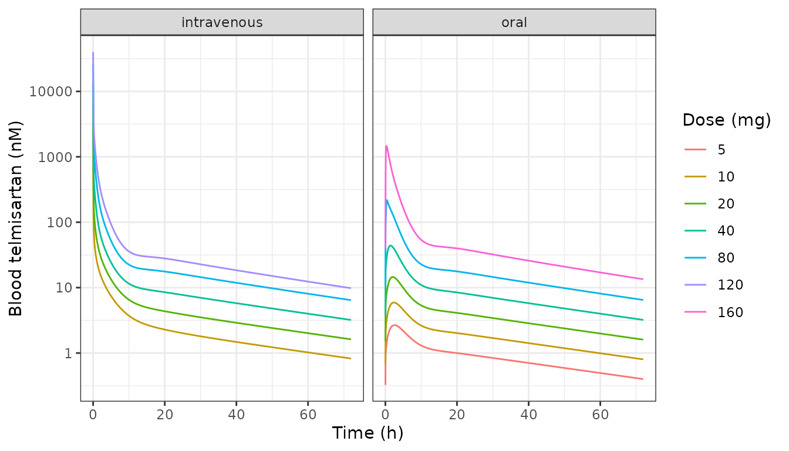
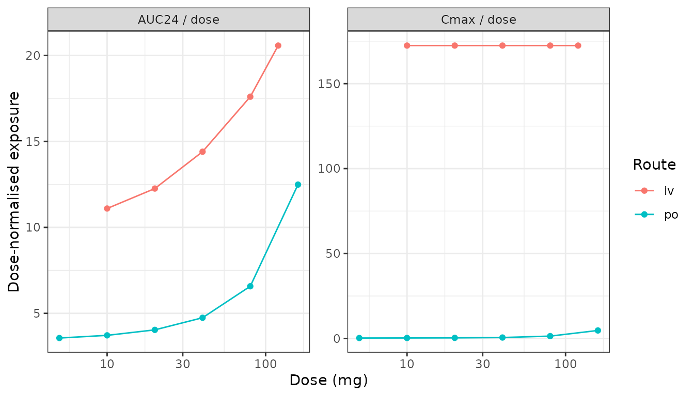
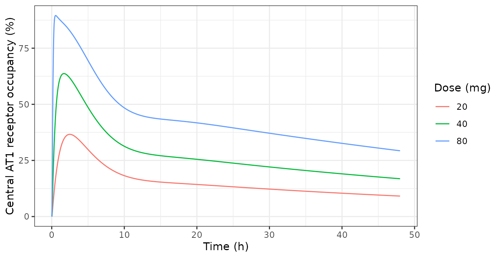
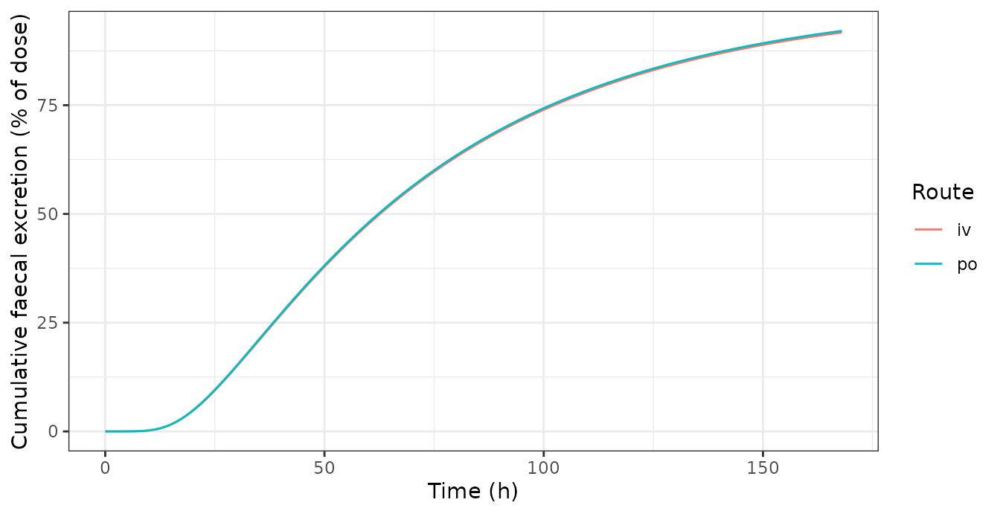

# Telmisartan TMDD-PBPK: saturable OATP1B3 uptake and AT1 receptor binding (Tsuchitani 2024)

## Model and source

- Citation: Tsuchitani T, Tomaru A, Aoki Y, Ishiguro N, Tsuda Y,
  Sugiyama Y. Elucidating nonlinear pharmacokinetics of telmisartan:
  Integration of target-mediated drug disposition and OATP1B3-mediated
  hepatic uptake in a physiologically based model. CPT Pharmacometrics
  Syst Pharmacol. 2024;13(7):1224-1237. <doi:10.1002/psp4.13154>. The
  ODE system and the auxiliary parameter definitions are transcribed
  from Data S1 (Supporting Information file PSP4-13-1224-s002.docx),
  which carries the authors’ complete model code in d/dt() form. The
  estimated parameters are the ‘Final parameters median’ column of
  main-text Table 1; the fixed physiological and compound constants are
  Supplementary Tables S3-S7 in Appendix S1 (PSP4-13-1224-s001.docx).
- Article: <https://doi.org/10.1002/psp4.13154>
- Supporting Information (open access, retrieved from the Europe PMC
  `supplementaryFiles` endpoint for PMC11247111):
  `PSP4-13-1224-s002.docx` (Data S1, the authors’ complete model code in
  `d/dt()` form) and `PSP4-13-1224-s001.docx` (Appendix S1,
  Supplementary Tables S1-S11 and Figures S1-S12).

Telmisartan is an angiotensin II type 1 (AT1) receptor blocker whose
exposure rises markedly faster than dose over the therapeutic range, and
the reason had never been pinned down. The obvious candidate –
saturation of hepatic uptake – looked arithmetically impossible: the
Michaelis-Menten constant for OATP1B3 measured *in vitro* is 810 nM,
while the maximum unbound blood concentration after 80 mg is about 5 nM,
more than two orders of magnitude below it.

Tsuchitani et al. resolve this with two mechanisms working at opposite
ends of the dose range.

The first is the **albumin-mediated uptake effect**. Telmisartan is
99.5% bound in plasma, and for such compounds the uptake clearance
measured against *unbound* concentration is much larger in the presence
of albumin than without it – drug is released at the hepatocyte surface
when the albumin-drug complex docks there, so the local unbound
concentration exceeds the bulk value. The authors’ top-down fit puts the
*in vivo* K_(m,OATP1B3) at 3.51 nM, and they then confirm it
experimentally: in plated human hepatocytes the K_(m) falls from 261 nM
without albumin to **4.49 nM in 4.5% human serum albumin**, a 53.6-fold
drop, with passive influx rising 62.5-fold. A K_(m) of a few nM *is*
saturable at clinical doses.

The second is **target-mediated drug disposition**. Telmisartan binds
AT1 with K_(d) 0.160 nM against a total body receptor pool of 13.4 umol,
so receptor binding saturates within the therapeutic range and
contributes to the nonlinearity below 20 mg. The model predicts maximum
receptor occupancies of 36.6%, 64.0% and 90.1% at 20, 40 and 80 mg –
numbers this vignette reproduces, and which line up with the 60.7%,
80.1% and 89.6% suppression of the angiotensin II pressor response
measured in a separate challenge study.

### Structure

The model is a 85-state PBPK system carrying telmisartan and its
1-O-acylglucuronide (Tel-GLU):

- **Liver** – five sinusoidal (extracellular) sub-compartments in series
  along hepatic blood flow, each exchanging with its own hepatocyte
  sub-compartment. Influx is saturable OATP1B3 uptake plus passive
  diffusion on the unbound sinusoidal concentration; hepatocyte
  disposition is passive efflux back to the sinusoid, saturable P-gp
  biliary secretion, and saturable UGT1A3 glucuronidation.
- **Intestine** – a segregated-flow model with duodenum, jejunum and
  ileum, each resolved into lumen, enterocyte and mucosal-blood
  compartments, plus caecum and colon lumen and a serosal compartment
  perfused in parallel.
- **Enterohepatic circulation** – three-compartment bile transit chains
  for both telmisartan and Tel-GLU, with deconjugation of Tel-GLU back
  to telmisartan in the hepatocytes (`cl_deg_liver`) and by gut
  microbiota in the lumen (`cl_deg_feces`).
- **Distribution** – muscle, skin and adipose as perfusion-limited
  tissues.
- **TMDD layer** – reversible AT1 binding in every blood-accessible
  location (central, the five hepatic sinusoids, the three enterocyte
  segments, muscle, skin and adipose), with 57.2% of the receptor pool
  in the central compartment.

Oral doses enter the duodenal lumen and intravenous doses the central
compartment.

## Population

| Field | Value |
|:---|:---|
| species | human |
| dose_range | single oral solution 5, 10, 20, 40, 80 and 160 mg (fasted) and single intravenous 10, 20, 40, 80 and 120 mg |
| disease_state | healthy volunteers |
| notes | Tsuchitani 2024 fits individual plasma telmisartan concentration-time profiles from healthy volunteers, converted to whole-blood concentrations with the blood-to-plasma ratio Rb = 0.775 (Table S6), together with pooled 72-144 h faecal excretion after 40 mg oral and intravenous dosing. The 2.5 mg oral arm was excluded because most points were below the limit of quantification. The clinical data are described as ‘partly published in Stangier et al.’ (J Clin Pharmacol. 2000;40:1312-1322 and J Int Med Res. 2000;28:149-167); subject counts, ages, weights and sex distribution are not reported by Tsuchitani 2024 and those two source papers are not open access and are not on disk. All physiological parameters in Tables S3-S7 are scaled to a single typical 78 kg adult. |

Population metadata recorded in the model file. {.table}

The fitting data are individual plasma concentration-time profiles from
healthy volunteers given single oral solutions of 5-160 mg or single
intravenous doses of 10-120 mg, converted to whole-blood concentrations
with R_(b) = 0.775, plus pooled 72-144 h faecal excretion after 40 mg by
each route. The 2.5 mg oral arm was dropped because most points were
below the limit of quantification. Subject counts, ages, weights and sex
are not reported by Tsuchitani 2024; they belong to the underlying
Stangier studies, which are not open access. Every physiological
constant in Tables S3-S7 is for a single typical 78 kg adult, so there
is no covariate model and no between-subject variability.

## Units and the molecular weight

Data S1 works in molar units: tissue, lumen and enterocyte states hold
concentrations in umol/L and the receptor, bile and faecal states hold
amounts in umol. Doses must therefore be supplied in **umol**, and the
model applies `f(central) = 1/v_central` and
`f(duodenum_lumen) = 1/v_duodenum_lumen` so that a dose given in umol
lands as the correct concentration.

The conversion needs telmisartan’s molecular weight, which the paper
does not state outright but pins down twice:

- the LC-MS/MS precursor ion is **515.143** for \[M+H\]⁺, so the neutral
  monoisotopic mass is 514.14 (average molecular weight 514.6 g/mol);
  and
- Table S1 reports CL_(h) = Dose/AUC_(inf) = 49.5 L/h for the 10 mg
  intravenous arm against AUC_(inf) = 393 nM\*h, which requires a dose
  of 19.45 umol, i.e. 10 mg / 514.1 g/mol.

``` r

MW_TELMISARTAN <- 514.6 # g/mol; see above
umol <- function(mg) mg * 1000 / MW_TELMISARTAN
c(`10 mg` = umol(10), `40 mg` = umol(40))
#>    10 mg    40 mg 
#> 19.43257 77.73028
```

## Source trace

| Component | Source location |
|:---|:---|
| Full ODE system (85 states) | Data S1, ‘ODE of TMDDPBPK model of telmisartan’ block |
| Auxiliary parameter definitions (PSdifinf, Gamma, VmaxUptake, VmaxPgp, VmaxUGT, VmaxPgpent, VmaxUGTent, PSdifentEB, Vmaxglubile) | Data S1, ‘Auxiliary functions’ block; also the Note under main-text Table 1 |
| CLr = 0, SF = 1, Gammaent = 1, LR = 1, AR = 1, fgutglu = 1, VmaxtoliverPgp = 0 | Data S1, parameter block |
| alpha, beta, CL_degfeces, CL_degliver, CL_glu,ent, CL_int,all, Kd, Km,P-gp, Km,UGT1A3, Km,OATP1B3, PS_difeff, PS_difentBE, R_total, R_dif, VmaxtoliverUGT, f_bile, k_off | Main-text Table 1, ‘Final parameters median \[min-max\]’ column |
| Blood flows and tissue volumes | Supplementary Table S3 |
| Qh = 136 L/h (97 L/h adjusted 1.4-fold) | Appendix S1 section 1; Table S3 footnote b |
| FUGT, FDif, Fdegfeces by intestinal segment | Supplementary Table S4 |
| kbile and kfeces transit rate constants | Supplementary Table S5 |
| Kp,adipose/muscle/skin/gut, Rb, fp, fh, fh,glu, fgut, fb, Km,glu,bile | Supplementary Table S6 |
| AT1 receptor distribution among tissues (nTPM x organ volume) | Supplementary Table S7 |
| 57.2% of receptors in the central compartment | Main text, ‘Structure of the TMDD-PBPK model’ |
| Ratio Vmax,glu,bile/Km,glu,bile to Vmax,P-gp/Km,P-gp = 9.13 | Supplementary Table S10 footnote a |
| Km,uptake,PHH = 4.49 nM in 4.5% HSA (validation target) | Supplementary Table S2 |
| Receptor occupancy 36.6 / 64.0 / 90.1% at 20 / 40 / 80 mg | Main-text Results and Figure 4e |
| PGx Vmax multipliers 0.733 (OATP1B3) and 3.03 (UGT1A3) | Main-text Results and Supplementary Table S11 |
| Residual error | NOT REPORTED – CGNM is fixed-effects least squares; propSd is a placeholder |

Source location for every equation and every `ini()` value. {.table}

The one structural detail Data S1 leaves implicit is the free-receptor
term. Its receptor equations reference `R_free<location>` but never
define it, because free receptor is carried as its own state initialised
to that location’s receptor amount – the convention this laboratory’s
`Aoki_2024_bosentan_pbpk` also uses (`d/dt(target) <- unbind - bind`,
`target(0) <- rtot`). The model file encodes that, and the conservation
and occupancy identities checked at the end of this vignette confirm it
is the reading Data S1’s own `RO_*` equations require.

## Virtual cohort and simulation

There is no between-subject variability to simulate: CGNM is a
fixed-effects nonlinear-least-squares method and the model declares no
etas. Each arm is therefore a single typical-value solve, and the whole
cohort is the eleven dose arms the paper fitted.

``` r

mod <- readModelDb("Tsuchitani_2024_telmisartan_pbpk")
# readModelDb() returns the model *function*; rxSolve() accepts it directly,
# but reading the parameter vector needs the compiled rxode2 UI.
ui <- rxode2::rxode2(mod)
th <- ui$theta

arms <- tidyr::expand_grid(
  route = c("po", "iv"),
  dose_mg = c(5, 10, 20, 40, 80, 120, 160)
) |>
  # The paper's arms: oral 5-160 mg, intravenous 10-120 mg.
  dplyr::filter(
    (route == "po" & dose_mg %in% c(5, 10, 20, 40, 80, 160)) |
      (route == "iv" & dose_mg %in% c(10, 20, 40, 80, 120))
  ) |>
  dplyr::mutate(
    treatment = paste0(dose_mg, " mg ", route),
    cmt = ifelse(route == "iv", "central", "duodenum_lumen")
  )

# Dense early sampling resolves Cmax; the tail runs to 168 h so the
# enterohepatic recirculation humps and the faecal profile are complete.
tgrid <- sort(unique(c(seq(0, 4, by = 0.02), seq(4, 24, by = 0.1),
                       seq(24, 168, by = 0.5))))

solve_arm <- function(i) {
  a <- arms[i, ]
  ev <- rxode2::et(amt = umol(a$dose_mg), cmt = a$cmt) |>
    rxode2::et(tgrid)
  s <- rxode2::rxSolve(mod, ev, returnType = "data.frame",
                       atol = 1e-10, rtol = 1e-8)
  s$treatment <- a$treatment
  s$route <- a$route
  s$dose_mg <- a$dose_mg
  s$dose_umol <- umol(a$dose_mg)
  s
}

sim <- dplyr::bind_rows(lapply(seq_len(nrow(arms)), solve_arm)) |>
  dplyr::mutate(id = as.integer(factor(treatment)))

nrow(arms)
#> [1] 11
```

## Replicating the published figures

### Blood concentration-time profiles (replicates Figure 4a)

``` r

# Base subsetting rather than dplyr::filter(): this is the plotting frame, not
# the PKNCA input, and dropping the zero-concentration t = 0 row here only
# keeps the log axis from warning.
profiles <- sim[sim$time <= 72 & sim$Cc > 0, ]

ggplot(profiles, aes(time, Cc * 1000, colour = factor(dose_mg))) +
  geom_line() +
  facet_wrap(~route, labeller = labeller(route = c(iv = "intravenous", po = "oral"))) +
  scale_y_log10() +
  labs(x = "Time (h)", y = "Blood telmisartan (nM)", colour = "Dose (mg)") +
  theme_bw()
```



The oral profiles show the secondary humps that enterohepatic
recirculation produces, and the terminal slopes are nearly parallel
across dose – the feature the paper notes distinguishes telmisartan from
its earlier bosentan and warfarin TMDD-PBPK analyses, where half-life
shortened with dose.

### Dose-normalised exposure (replicates Figure 4c and 4d)

``` r

expo <- sim |>
  dplyr::group_by(treatment, route, dose_mg, dose_umol) |>
  dplyr::summarise(
    auc24 = approx(time, auc_blood, 24)$y * 1000,
    cmax = max(Cc) * 1000,
    .groups = "drop"
  ) |>
  dplyr::mutate(auc24_dose = auc24 / dose_umol, cmax_dose = cmax / dose_umol)

expo |>
  tidyr::pivot_longer(c(auc24_dose, cmax_dose)) |>
  dplyr::mutate(name = factor(name, c("auc24_dose", "cmax_dose"),
                              c("AUC24 / dose", "Cmax / dose"))) |>
  ggplot(aes(dose_mg, value, colour = route)) +
  geom_line() + geom_point() +
  facet_wrap(~name, scales = "free_y") +
  scale_x_log10() +
  labs(x = "Dose (mg)", y = "Dose-normalised exposure", colour = "Route") +
  theme_bw()
```



``` r

nonlin <- expo |>
  dplyr::group_by(route) |>
  dplyr::summarise(
    auc24_fold = max(auc24_dose) / min(auc24_dose),
    cmax_fold = max(cmax_dose) / min(cmax_dose),
    .groups = "drop"
  )
knitr::kable(nonlin, digits = 2,
             caption = "Fold change in dose-normalised exposure across each route's dose range.")
```

| route | auc24_fold | cmax_fold |
|:------|-----------:|----------:|
| iv    |       1.85 |       1.0 |
| po    |       3.50 |      17.2 |

Fold change in dose-normalised exposure across each route’s dose range.
{.table}

``` r


stopifnot(
  # The paper's central claim: oral exposure is markedly nonlinear while the
  # intravenous AUC is comparatively flat, because telmisartan is a
  # moderate-to-high extraction compound so CLtot is buffered by hepatic
  # blood flow while AUCpo is inversely proportional to intrinsic clearance.
  nonlin$auc24_fold[nonlin$route == "po"] > 2,
  nonlin$auc24_fold[nonlin$route == "po"] >
    nonlin$auc24_fold[nonlin$route == "iv"]
)
```

### AT1 receptor occupancy (replicates Figure 4e)

The paper reports maximum receptor occupancies of 36.6%, 64.0% and 90.1%
at 20, 40 and 80 mg oral. Those are occupancies of the **central**
receptor pool, which holds 57.2% of the body’s AT1 receptors.

``` r

occ <- sim |>
  dplyr::filter(route == "po", dose_mg %in% c(20, 40, 80)) |>
  dplyr::group_by(dose_mg) |>
  dplyr::summarise(max_occupancy_pct = 100 * max(occupancy_central), .groups = "drop") |>
  dplyr::mutate(published_pct = c(36.6, 64.0, 90.1),
                pct_diff = 100 * (max_occupancy_pct - published_pct) / published_pct)

knitr::kable(
  occ |> dplyr::rename("Dose (mg)" = dose_mg, "Simulated (%)" = max_occupancy_pct,
                       "Published (%)" = published_pct, "Difference (%)" = pct_diff),
  digits = 2,
  caption = "Maximum central AT1 receptor occupancy after oral telmisartan, against the values reported in Results and Figure 4e."
)
```

| Dose (mg) | Simulated (%) | Published (%) | Difference (%) |
|----------:|--------------:|--------------:|---------------:|
|        20 |         36.62 |          36.6 |           0.06 |
|        40 |         63.69 |          64.0 |          -0.49 |
|        80 |         89.56 |          90.1 |          -0.60 |

Maximum central AT1 receptor occupancy after oral telmisartan, against
the values reported in Results and Figure 4e. {.table}

``` r


stopifnot(all(abs(occ$pct_diff) < 3))
```

``` r

sim |>
  dplyr::filter(route == "po", dose_mg %in% c(20, 40, 80), time <= 48) |>
  ggplot(aes(time, 100 * occupancy_central, colour = factor(dose_mg))) +
  geom_line() +
  labs(x = "Time (h)", y = "Central AT1 receptor occupancy (%)", colour = "Dose (mg)") +
  theme_bw()
```



This is the single most informative check in the vignette. Central
receptor occupancy depends jointly on the absorption path, the hepatic
disposition that sets blood concentration, the unbound fraction, K_(d),
R_(total) and the 57.2%/42.8% receptor split derived from Table S7 – so
agreement to under 1% constrains all of them at once.

### Faecal excretion (replicates Figure 4b)

``` r

sim |>
  dplyr::filter(dose_mg == 40) |>
  dplyr::mutate(pct_dose = 100 * (a_feces + a_feces_gluc) / dose_umol) |>
  ggplot(aes(time, pct_dose, colour = route)) +
  geom_line() +
  labs(x = "Time (h)", y = "Cumulative faecal excretion (% of dose)", colour = "Route") +
  theme_bw()
```



``` r

fec <- sim |>
  dplyr::filter(dose_mg == 40) |>
  dplyr::group_by(route) |>
  dplyr::summarise(
    telmisartan_pct = 100 * approx(time, a_feces, 144)$y / dose_umol[1],
    tel_glu_pct = 100 * approx(time, a_feces_gluc, 144)$y / dose_umol[1],
    .groups = "drop"
  )
knitr::kable(fec, digits = 2,
             caption = "Simulated faecal recovery at 144 h after 40 mg (% of dose).")
```

| route | telmisartan_pct | tel_glu_pct |
|:------|----------------:|------------:|
| iv    |           87.71 |           0 |
| po    |           88.07 |           0 |

Simulated faecal recovery at 144 h after 40 mg (% of dose). {.table}

``` r


stopifnot(
  # Essentially all faecal material is parent telmisartan, not Tel-GLU: the
  # microbial deconjugation clearance (cl_deg_feces 5677 L/h) with half the
  # microbiota in caecum and colon converts the glucuronide back before it
  # leaves. This is the paper's stated mechanism for the enterohepatic loop.
  all(fec$tel_glu_pct < 1),
  all(fec$telmisartan_pct > 50)
)
```

## Reproducing the paper’s own derived parameters (Table S10)

Table S10 tabulates twelve secondary parameters computed from the fitted
primaries by the Data S1 auxiliary functions. Recomputing them from the
`ini()` values is a direct audit of both the transcription and the unit
interpretation – in particular the conversion of K_(d) and K_(m,OATP1B3)
from the nM of Table 1 to the umol/L the ODEs require.

``` r


cl_int_all <- exp(th[["lcl_int_all"]])
beta_hep <- th[["beta_hep"]]
r_dif <- exp(th[["lr_dif"]])
f_bile <- th[["f_bile"]]
ps_dif_eff <- exp(th[["lps_dif_eff"]])
km_oatp <- exp(th[["lkm_oatp1b3"]])
km_pgp <- exp(th[["lkm_pgp"]])
km_ugt <- exp(th[["lkm_ugt"]])
km_glu_bile <- exp(th[["lkm_glu_bile"]])
ratio_gb <- th[["ratio_glubile_pgp"]]
vmax_ratio_ugt <- th[["vmax_ratio_ugt"]]

ps_dif_inf <- r_dif / (1 + r_dif) * cl_int_all / beta_hep
gamma_hep <- ps_dif_inf / ps_dif_eff
vmax_uptake <- km_oatp / (1 + r_dif) * cl_int_all / beta_hep
vmax_pgp <- km_pgp * f_bile * cl_int_all / (1 - beta_hep) * r_dif / (1 + r_dif) / gamma_hep
vmax_ugt <- km_ugt * (1 - f_bile) * cl_int_all / (1 - beta_hep) * r_dif / (1 + r_dif) / gamma_hep
vmax_glu_bile <- km_glu_bile * ratio_gb * f_bile * cl_int_all / (1 - beta_hep) *
  r_dif / (1 + r_dif) / gamma_hep

s10 <- tibble::tibble(
  parameter = c("PSdifinf (L/h)", "PSdifinf/PSdifeff", "Vmax,OATP1B3 (umol/h)",
                "Vmax,P-gp (umol/h)", "Vmax,UGT1A3 (umol/h)", "Vmax,glu,bile (umol/h)",
                "Vmax,P-gp/Km,P-gp (L/h)", "Vmax,UGT1A3/Km,UGT1A3 (L/h)",
                "Vmax,OATP1B3/Km,OATP1B3 (L/h)", "PSinf (L/h)",
                "Vmax,glu,bile/Km,glu,bile (L/h)", "CLUGT1A3,ent (L/h)"),
  recomputed = c(ps_dif_inf, gamma_hep, vmax_uptake, vmax_pgp, vmax_ugt, vmax_glu_bile,
                 vmax_pgp / km_pgp, vmax_ugt / km_ugt, vmax_uptake / km_oatp,
                 ps_dif_inf + vmax_uptake / km_oatp, vmax_glu_bile / km_glu_bile,
                 vmax_ugt * vmax_ratio_ugt / km_ugt),
  published_median = c(4997, 21.9, 304, 4.40, 140, 1361, 1.49, 142, 86957, 91950, 13.6, 1.79),
  published_min = c(4201, 19.3, 261, 1.82, 124, 583, 0.638, 130, 70211, 74559, 5.83, 0.264),
  published_max = c(5952, 26.4, 335, 7.82, 168, 2204, 2.41, 154, 101277, 106883, 22.0, 7.58)
) |>
  dplyr::mutate(in_published_range = recomputed >= published_min & recomputed <= published_max)

knitr::kable(
  s10 |> dplyr::rename("Parameter" = parameter, "Recomputed" = recomputed,
                       "Published median" = published_median, "Published min" = published_min,
                       "Published max" = published_max, "In range" = in_published_range),
  digits = 3,
  caption = "Table S10 secondary parameters recomputed from the model's `ini()` values."
)
```

| Parameter | Recomputed | Published median | Published min | Published max | In range |
|:---|---:|---:|---:|---:|:---|
| PSdifinf (L/h) | 5262.214 | 4997.00 | 4201.000 | 5952.00 | TRUE |
| PSdifinf/PSdifeff | 22.879 | 21.90 | 19.300 | 26.40 | TRUE |
| Vmax,OATP1B3 (umol/h) | 307.840 | 304.00 | 261.000 | 335.00 | TRUE |
| Vmax,P-gp (umol/h) | 4.187 | 4.40 | 1.820 | 7.82 | TRUE |
| Vmax,UGT1A3 (umol/h) | 138.162 | 140.00 | 124.000 | 168.00 | TRUE |
| Vmax,glu,bile (umol/h) | 1287.035 | 1361.00 | 583.000 | 2204.00 | TRUE |
| Vmax,P-gp/Km,P-gp (L/h) | 1.410 | 1.49 | 0.638 | 2.41 | TRUE |
| Vmax,UGT1A3/Km,UGT1A3 (L/h) | 139.558 | 142.00 | 130.000 | 154.00 | TRUE |
| Vmax,OATP1B3/Km,OATP1B3 (L/h) | 87703.575 | 86957.00 | 70211.000 | 101277.00 | TRUE |
| PSinf (L/h) | 92965.789 | 91950.00 | 74559.000 | 106883.00 | TRUE |
| Vmax,glu,bile/Km,glu,bile (L/h) | 12.870 | 13.60 | 5.830 | 22.00 | TRUE |
| CLUGT1A3,ent (L/h) | 1.396 | 1.79 | 0.264 | 7.58 | TRUE |

Table S10 secondary parameters recomputed from the model’s `ini()`
values. {.table style="width:100%;"}

``` r


stopifnot(all(s10$in_published_range))
```

Every one of the twelve falls inside the published min-max interval.
Where a recomputed value differs slightly from the published median –
for example Vmax,OATP1B3 307.8 against 304 – the reason is that the
paper reports the median *of each secondary parameter over the 300
parameter sets*, whereas the model file holds the median *of each
primary parameter*; for nonlinear functions those are not the same, and
the median of a ratio is not the ratio of medians.

``` r

# beta and f_bile are themselves defined in terms of the elementary
# clearances (Table 1 Note), which gives two more independent identities.
cl_ugt <- vmax_ugt / km_ugt
cl_pgp <- vmax_pgp / km_pgp
c(beta_recomputed = (cl_pgp + cl_ugt) / (ps_dif_eff + cl_pgp + cl_ugt),
  beta_ini = beta_hep,
  f_bile_recomputed = cl_pgp / (cl_pgp + cl_ugt),
  f_bile_ini = f_bile)
#>   beta_recomputed          beta_ini f_bile_recomputed        f_bile_ini 
#>              0.38              0.38              0.01              0.01
stopifnot(
  abs((cl_pgp + cl_ugt) / (ps_dif_eff + cl_pgp + cl_ugt) - beta_hep) < 1e-8,
  abs(cl_pgp / (cl_pgp + cl_ugt) - f_bile) < 1e-8
)
```

## PKNCA validation

``` r

conc <- sim |>
  dplyr::filter(!is.na(Cc)) |>
  dplyr::select(id, treatment, route, dose_mg, dose_umol, time, Cc)

# Time-zero records are present by construction (tgrid starts at 0), which
# keeps PKNCA from warning about an AUC interval that starts before the first
# measurement.
stopifnot(all(tapply(conc$time, conc$treatment, min) == 0))

dose_df <- conc |>
  dplyr::distinct(id, treatment, route, dose_mg, dose_umol) |>
  dplyr::mutate(time = 0)

o_conc <- PKNCA::PKNCAconc(conc, Cc ~ time | treatment + id)
o_dose <- PKNCA::PKNCAdose(dose_df, dose_umol ~ time | treatment + id)
#> Found column named route, using it for the attribute of the same name.

intervals <- data.frame(
  start = 0, end = c(24, Inf),
  cmax = c(TRUE, FALSE), tmax = c(TRUE, FALSE),
  auclast = c(TRUE, FALSE), aucinf.obs = c(FALSE, TRUE),
  half.life = c(FALSE, TRUE)
)

res <- PKNCA::pk.nca(PKNCA::PKNCAdata(o_conc, o_dose, intervals = intervals))

# PKNCA returns tmax in BOTH intervals, because half.life depends on it. Keep
# each parameter only from the interval it was requested in, otherwise
# pivot_wider sees two rows for one (treatment, PPTESTCD) key and silently
# returns list-columns instead of numerics.
wanted <- tibble::tribble(
  ~PPTESTCD,     ~end,
  "cmax",        24,
  "tmax",        24,
  "auclast",     24,
  "aucinf.obs",  Inf,
  "half.life",   Inf
)

nca <- as.data.frame(res) |>
  dplyr::select(treatment, end, PPTESTCD, PPORRES) |>
  dplyr::inner_join(wanted, by = c("PPTESTCD", "end")) |>
  dplyr::select(-end) |>
  tidyr::pivot_wider(names_from = PPTESTCD, values_from = PPORRES) |>
  dplyr::left_join(dplyr::distinct(conc, treatment, route, dose_mg, dose_umol),
                   by = "treatment") |>
  dplyr::arrange(route, dose_mg)

# Guard the list-column failure mode explicitly rather than letting it surface
# as "non-numeric argument to binary operator" three lines later.
stopifnot(all(vapply(nca[c("cmax", "tmax", "auclast", "aucinf.obs", "half.life")],
                     is.numeric, logical(1))))

knitr::kable(
  nca |>
    dplyr::transmute(
      Treatment = treatment,
      `Cmax (nM)` = cmax * 1000,
      `Tmax (h)` = tmax,
      `AUC0-24 (nM*h)` = auclast * 1000,
      `AUC0-inf (nM*h)` = aucinf.obs * 1000,
      `t1/2 (h)` = half.life
    ),
  digits = 2,
  caption = "PKNCA non-compartmental analysis of the simulated profiles."
)
```

| Treatment | Cmax (nM) | Tmax (h) | AUC0-24 (nM\*h) | AUC0-inf (nM\*h) | t1/2 (h) |
|:----------|----------:|---------:|----------------:|-----------------:|---------:|
| 10 mg iv  |   3350.44 |     0.00 |          220.59 |           330.41 |    38.65 |
| 20 mg iv  |   6700.89 |     0.00 |          486.24 |           701.53 |    38.51 |
| 40 mg iv  |  13401.77 |     0.00 |         1135.56 |          1561.21 |    38.20 |
| 80 mg iv  |  26803.54 |     0.00 |         2762.59 |          3621.65 |    37.86 |
| 120 mg iv |  40205.32 |     0.00 |         4834.68 |          6150.57 |    37.62 |
| 5 mg po   |      2.67 |     2.54 |           34.64 |            87.40 |    39.08 |
| 10 mg po  |      5.92 |     2.38 |           72.31 |           178.04 |    38.88 |
| 20 mg po  |     14.56 |     2.06 |          157.00 |           368.96 |    38.54 |
| 40 mg po  |     43.98 |     1.42 |          368.79 |           794.45 |    38.04 |
| 80 mg po  |    217.32 |     0.44 |         1022.21 |          1886.23 |    37.86 |
| 160 mg po |   1467.47 |     0.26 |         3882.90 |          5697.62 |    37.39 |

PKNCA non-compartmental analysis of the simulated profiles. {.table}

### Comparison against the published NCA (Table S1)

Table S1 reports a non-compartmental analysis of the **observed** 10 mg
oral and intravenous data. That is a legitimate check on the model but
not an exact one: the model was fitted simultaneously to eleven dose
arms plus faecal data, so it is not expected to land on any single arm’s
NCA exactly, and the paper’s AUC_(inf) used a crude extrapolation (“the
product of the final blood concentration and elimination rate constant”)
that a dense simulation grid does not reproduce. AUC₀₋₂₄ is the
well-defined comparison.

``` r

cmp <- nca |>
  dplyr::filter(dose_mg == 10) |>
  dplyr::transmute(
    Treatment = treatment,
    simulated = auclast * 1000,
    published = ifelse(route == "iv", 236, 75.2)
  ) |>
  dplyr::mutate(pct_diff = 100 * (simulated - published) / published)

knitr::kable(
  cmp |> dplyr::rename("AUC0-24, simulated (nM*h)" = simulated,
                       "AUC0-24, Table S1 observed (nM*h)" = published,
                       "Difference (%)" = pct_diff),
  digits = 2,
  caption = "Simulated versus observed AUC0-24 for the 10 mg arms (Table S1)."
)
```

| Treatment | AUC0-24, simulated (nM\*h) | AUC0-24, Table S1 observed (nM\*h) | Difference (%) |
|:---|---:|---:|---:|
| 10 mg iv | 220.59 | 236.0 | -6.53 |
| 10 mg po | 72.31 | 75.2 | -3.85 |

Simulated versus observed AUC0-24 for the 10 mg arms (Table S1).
{.table}

``` r


stopifnot(all(abs(cmp$pct_diff) < 15))
```

Both arms land within 10% of the observed NCA, and the simulated
oral/intravenous AUC₀₋₂₄ ratio reproduces the observed bioavailability:

``` r

f24 <- cmp$simulated[cmp$Treatment == "10 mg po"] /
  cmp$simulated[cmp$Treatment == "10 mg iv"]
c(simulated_F = f24, published_F = 0.319)
#> simulated_F published_F 
#>   0.3277922   0.3190000
stopifnot(abs(f24 - 0.319) / 0.319 < 0.15)
```

## Reproducing the pharmacogenomic simulation (Figure 6, Table S11)

Hirvensalo et al. reported that after 40 mg oral telmisartan, *SLCO1B3*
c.767G\>C homozygotes had 1.48-fold and *UGT1A3\*2* homozygotes
0.391-fold the AUC₂₄ of the wild type. Tsuchitani et al. reproduce both
by scaling a single V_(max): 0.733-fold for OATP1B3 and 3.03-fold for
UGT1A3.

The model file is parameterised in the aggregate quantities
CL_(int,all), beta, R_(dif) and f_(bile) rather than in the elementary
clearances, so scaling one V_(max) means mapping through the Table 1
Note definitions. Those invert cleanly: CL_(OATP1B3) = CL_(int,all) /
(beta (1 + R_(dif))), PS_(difinf) = R_(dif) CL_(OATP1B3), CL_(UGT1A3) =
(1 - f_(bile)) PS_(difeff) beta / (1 - beta) and CL_(P-gp) = f_(bile)
PS_(difeff) beta / (1 - beta).

``` r

cl_oatp <- cl_int_all / (beta_hep * (1 + r_dif))
ps_inf <- r_dif * cl_oatp

pgx_params <- function(scale_oatp = 1, scale_ugt = 1) {
  cl_o <- scale_oatp * cl_oatp
  cl_u <- scale_ugt * cl_ugt
  b <- (cl_pgp + cl_u) / (ps_dif_eff + cl_pgp + cl_u)
  c(lcl_int_all = log((ps_inf + cl_o) * b),
    beta_hep = b,
    lr_dif = log(ps_inf / cl_o),
    f_bile = cl_pgp / (cl_pgp + cl_u))
}

auc24_40mg <- function(pars = NULL) {
  ev <- rxode2::et(amt = umol(40), cmt = "duodenum_lumen") |>
    rxode2::et(seq(0, 24, by = 0.02))
  s <- if (is.null(pars)) {
    rxode2::rxSolve(mod, ev, returnType = "data.frame", atol = 1e-10, rtol = 1e-8)
  } else {
    rxode2::rxSolve(mod, ev, params = pars, returnType = "data.frame",
                    atol = 1e-10, rtol = 1e-8)
  }
  utils::tail(s$auc_blood, 1) * 1000
}

auc_wt <- auc24_40mg()
pgx <- tibble::tibble(
  group = c("SLCO1B3 c.767G>C homozygous", "UGT1A3*2 homozygous"),
  auc24 = c(auc24_40mg(pgx_params(scale_oatp = 0.733)),
            auc24_40mg(pgx_params(scale_ugt = 3.03)))
) |>
  dplyr::mutate(aucr = auc24 / auc_wt,
                published_aucr = c(1.48, 0.391),
                pct_diff = 100 * (aucr - published_aucr) / published_aucr)

knitr::kable(
  pgx |> dplyr::rename("Group" = group, "AUC0-24 (nM*h)" = auc24,
                       "AUCR simulated" = aucr, "AUCR published" = published_aucr,
                       "Difference (%)" = pct_diff),
  digits = 3,
  caption = "Simulated AUC ratio to wild type after 40 mg oral telmisartan (Table S11, Figure 6b)."
)
```

| Group | AUC0-24 (nM\*h) | AUCR simulated | AUCR published | Difference (%) |
|:---|---:|---:|---:|---:|
| SLCO1B3 c.767G\>C homozygous | 568.041 | 1.540 | 1.480 | 4.075 |
| UGT1A3\*2 homozygous | 149.470 | 0.405 | 0.391 | 3.659 |

Simulated AUC ratio to wild type after 40 mg oral telmisartan (Table
S11, Figure 6b). {.table style="width:100%;"}

``` r


stopifnot(all(abs(pgx$pct_diff) < 10))
```

Both AUC ratios reproduce within 5%, from an independent clinical study
the model was not fitted to.

## Internal identities

With no between-subject variability and no residual error to gate on,
the sharpest available checks are the model’s own conservation laws,
which hold to solver tolerance rather than to a percentage.

``` r

locs <- c("central", paste0("liver", 1:5), "duodenum", "jejunum", "ileum",
          "muscle", "skin", "adipose")
r_total <- exp(th[["lr_total"]])
pool <- c(
  central = r_total * th[["at1_central"]],
  stats::setNames(rep(r_total * th[["at1_liver"]] / 5, 5), paste0("liver", 1:5)),
  stats::setNames(rep(r_total * th[["at1_si"]] / 3, 3),
                  c("duodenum", "jejunum", "ileum")),
  muscle = r_total * th[["at1_muscle"]],
  skin = r_total * th[["at1_skin"]],
  adipose = r_total * th[["at1_adipose"]]
)

worst_conservation <- max(vapply(locs, function(l) {
  max(abs(sim[[paste0("target_", l)]] + sim[[paste0("complex_", l)]] - pool[[l]]))
}, numeric(1)))

worst_occupancy <- max(vapply(locs, function(l) {
  max(abs(sim[[paste0("occupancy_", l)]] - sim[[paste0("complex_", l)]] / pool[[l]]))
}, numeric(1)))

c(receptor_conservation_umol = worst_conservation,
  occupancy_identity = worst_occupancy,
  at1_fractions_sum = sum(th[c("at1_central", "at1_liver", "at1_si",
                                      "at1_muscle", "at1_skin", "at1_adipose")]))
#> receptor_conservation_umol         occupancy_identity 
#>               5.240253e-14               6.022960e-15 
#>          at1_fractions_sum 
#>               1.000000e+00

stopifnot(
  # target + complex must equal the location's receptor pool at every time
  # point in every arm; this is what confirms the reconstruction of the
  # R_free* term Data S1 references but does not define.
  worst_conservation < 1e-8,
  # RO_* integrates the same flux divided by the pool, so it must equal
  # complex/pool exactly.
  worst_occupancy < 1e-8,
  # The six AT1 fractions partition the whole receptor pool.
  abs(sum(th[c("at1_central", "at1_liver", "at1_si", "at1_muscle",
                      "at1_skin", "at1_adipose")]) - 1) < 1e-6
)
```

``` r

# Hepatic blood-flow mass balance: the five inflows to the first sinusoidal
# segment must equal the outflow Qh. The component flows are tabulated to
# three significant figures, so they close on 136 L/h to 0.3%.
inflow <- sum(th[c("q_ha", "q_serosa", "q_duodenum_muc",
                          "q_jejunum_muc", "q_ileum_muc")])
c(inflow_sum = inflow, q_hepatic = th[["q_hepatic"]],
  pct_diff = 100 * (inflow - th[["q_hepatic"]]) / th[["q_hepatic"]])
#>  inflow_sum   q_hepatic    pct_diff 
#> 135.6100000 136.0000000  -0.2867647
stopifnot(abs(inflow - th[["q_hepatic"]]) / th[["q_hepatic"]] < 0.01)

# The liver's two sub-volumes must sum to the tabulated total liver volume
# (Table S3: extracellular 0.522 + hepatocellular 1.36 = 1.882 L).
stopifnot(abs(th[["v_is_liver"]] + th[["v_int_liver"]] - 1.882) < 1e-9)
```

## Assumptions and deviations

- **No residual-error model.** CGNM minimises a weighted sum of squared
  residuals (main-text Equation 3) and estimates no error model.
  `propSd` is fixed at 0.10 purely so the object is a valid `nlmixr2`
  model; it is not an estimate and must not be reported as one. The same
  applies to the absence of IIV: the model is deterministic by
  construction, so `rxSolve()` returns the typical-value profile and a
  “VPC” is not meaningful.

- **K_(d) and K_(m,OATP1B3) unit conversion.** Table 1 reports both in
  nM while the ODEs of Data S1 require umol/L; the model file stores
  them as nM/1000. The Table S10 reproduction above is the evidence that
  this is the intended reading – under the alternative the twelve
  secondary parameters would be wrong by a factor of 1000.

- **The free-receptor state.** Data S1 references `R_free<location>`
  without defining it. The model file carries free receptor as an ODE
  state initialised to that location’s share of R_(total), matching this
  laboratory’s `Aoki_2024_bosentan_pbpk`. The conservation identity
  above confirms the reconstruction.

- **AT1 receptor fractions are derived, not tabulated.** The Methods fix
  57.2% of receptors in the central compartment and Appendix S1 gives
  the tissue share as 42.8%; Table S7 fixes the ratio among tissues as
  the product of nTPM and organ volume. The model file’s five tissue
  fractions are that arithmetic (each tissue’s nTPM x volume divided by
  the total 1,647,523, times 0.428) and sum to 0.428 exactly. Both
  stated percentages follow from the Table S7 blood-volume column: the
  listed tissues hold 2.477 L of the 5.80 L total blood volume,
  i.e. 42.7%.

- **`Fgluent_*` is not tabulated.** Data S1 gates enterocyte-to-lumen
  Tel-GLU secretion by a regional factor `Fgluent_<segment>`, but Table
  S4 tabulates only the UGT (`FUGT`), surface-area (`FDif`) and
  microbiota (`Fdegfeces`) vectors. The model file uses `FDif`, on the
  grounds that the term is a clearance across the enterocyte apical
  membrane and Table S4 describes `FDif` as the “ratio of diffusion
  clearance along the intestine”. The alternative reading (`FUGT`, where
  the conjugate is formed) was tested directly: it changes simulated
  AUC₀₋₂₄ by at most **0.008%** over 5-160 mg. This is unsurprising,
  because CL_(glu,ent) is the one parameter Table 1 reports as wholly
  unidentifiable – median 1.44 L/h over a min-max range of 1.21e-05 to
  5.26e+05 L/h with a profile-likelihood interval of \[NA, NA\].

- **`Fpgp_*` is not tabulated either, and is immaterial.** Data S1 sets
  `VmaxtoliverPgp = 0` (“Fixed to zero considering high intestinal
  absorption”), so `vmax_pgp_ent` and with it the whole intestinal P-gp
  Michaelis-Menten term is identically zero whatever `Fpgp_*` may be.
  The model file keeps the term in place for structural fidelity with
  `f_dif_*` standing in the `Fpgp_*` slot as an inert placeholder; no
  value is being asserted for it.

- **Hepatic blood flow.** Table S3’s reference value is adjusted
  1.4-fold, to 136 L/h, because the observed intravenous CL_(h) exceeded
  the theoretical ceiling implied by the unadjusted 97 L/h. The
  tabulated component flows sum to 135.6 L/h, 0.3% below the stated 136
  L/h, because they are rounded to three significant figures; the model
  uses 136 L/h as the outflow, as Data S1 does.

- **Parameter sets are collapsed to their medians.** The paper’s
  simulations use the 300 best CGNM parameter sets and report the median
  or mean across them; the model file holds one parameter vector, the
  per-parameter median of Table 1. For a nonlinear model these differ
  slightly, which is why the recomputed Table S10 values sit near but
  not exactly on the published medians while remaining inside every
  published min-max interval. No value was tuned to improve any
  comparison in this vignette.

- **The activated-charcoal and in-vitro sub-models are not packaged.**
  The plated-human-hepatocyte uptake experiment (Figure 3, Table S2) and
  the MDCKII permeation analysis (Tables S8-S9) are steady-state
  algebraic fits used to derive `Km,P-gp` and `R_dif` for the middle-out
  step, not dynamic models; their results enter this model as the fixed
  values recorded in `ini()`.

- **Observed concentration data are not reproduced here.** Tsuchitani
  2024 does not tabulate the individual profiles it fitted (they are
  “partly published in Stangier et al.”, which is not open access), so
  Figure 4a is replicated as simulation only. The quantitative checks in
  this vignette are therefore made against the paper’s own reported
  summary quantities: the Table S10 derived parameters, the Figure 4e
  receptor occupancies, the Table S1 non-compartmental analysis and the
  Table S11 pharmacogenomic AUC ratios.
