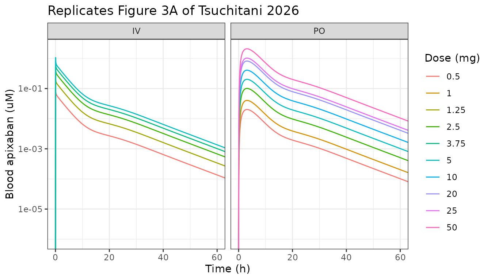
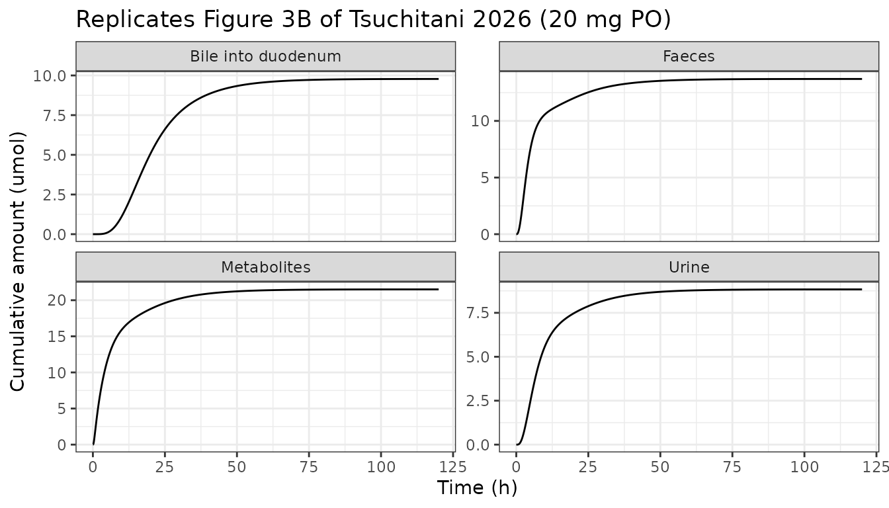
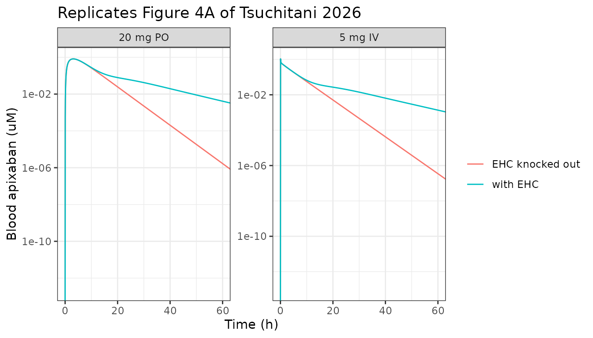

# Apixaban whole-body PBPK with enterohepatic circulation (Tsuchitani 2026)

## Model and source

- Citation: Tsuchitani T, Kou W, Tomi M, Sugiyama Y. Characterizing
  apixaban pharmacokinetics through physiologically-based
  pharmacokinetic modeling: critical role of biliary secretion and
  enterohepatic circulation in humans. CPT Pharmacometrics Syst
  Pharmacol. 2026;15:e70163. <doi:10.1002/psp4.70163>. (Open access, CC
  BY-NC; accepted 12 November 2025, published in volume 15.) The ODE
  system and every fixed constant are transcribed from Supporting
  Information Data S1 (psp470163-sup-0001-supinfo.txt), the authors’
  model code; the physiological constants are independently tabulated in
  Data S2 (psp470163-sup-0002-supinfo.pdf) Tables S3A, S3B, S3C and S4,
  and every one of them agrees with the code. The eleven estimated
  parameters are the ‘Median’ column of main-text Table 1.
- Article: <https://doi.org/10.1002/psp4.70163>
- Supporting Information (open access, retrieved from the Europe PMC
  `supplementaryFiles` endpoint for PMC12823302):
  `psp470163-sup-0001-supinfo.txt` (Data S1, the authors’ complete model
  code) and `psp470163-sup-0002-supinfo.pdf` (Data S2, Tables S1-S4 and
  Figures S1-S4).

Apixaban is a direct oral factor Xa inhibitor with a famously
well-balanced elimination: after a 20 mg oral dose roughly 30% of
recovered radioactivity is unchanged drug in faeces, 29% is unchanged
drug in urine, and 41% is metabolites. The textbook interpretation has
been that biliary excretion and enterohepatic circulation (EHC) are
*negligible* – bile-duct-cannulated rats and dogs recover less than 15%
of an intravenous dose in bile, and a human duodenal-suction study
recovered only 0.8% of a 20 mg oral dose in bile over 3-8 h. Faecal drug
was therefore attributed to unabsorbed drug plus direct intestinal
secretion.

Tsuchitani et al. challenge that reading. Two observations do not fit
it: faecal recovery exceeds the unabsorbed fraction implied by
$`F_aF_g`$, and activated charcoal given 2 or 6 h *after* an oral dose
reduces apixaban AUC by 50% and 27%. Both point to drug re-entering the
gut lumen after absorption. The authors therefore built a whole-body
PBPK model and fitted it top-down to blood concentrations plus
mass-balance data, letting the data decide how much of hepatic
elimination is biliary.

The answer: $`f_{bile} = 0.44`$, i.e. biliary secretion accounts for
**about half of hepatic elimination**. Crucially, that is entirely
consistent with the 0.8% 8-hour bile recovery, because the EHC transit
chain imposes a physiological delay – most biliary drug simply has not
reached the duodenum yet at 8 h.

### Structure

The model couples four mechanistic blocks (47 ODE states in total):

1.  **Segregated-flow intestine.** Duodenum, jejunum and ileum each
    carry a luminal space, an enterocyte space and a mucosal-blood
    space; a separate serosal compartment carries the remaining
    splanchnic flow. Enterocytes hold CYP3A4 and apical P-gp,
    distributed between segments by the fixed fractions of Table S3C.
2.  **Membrane-limited five-compartment tandem-dispersion liver.** Each
    hepatic extracellular (sinusoidal) sub-compartment exchanges with
    its own hepatocyte. Apixaban is not an OATP1B1/3 substrate, so the
    saturable-uptake term is present but its $`V_{max}`$ is fixed to
    zero and transport is purely passive.
3.  **Mechanistic kidney.** Glomerulus, proximal tubule, distal tubule
    and collecting duct, each resolved as a vascular / epithelial-cell /
    tubular-lumen triple, with apical P-gp in the proximal tubule.
4.  **Three-compartment EHC transit chain**, carrying canalicular bile
    through the biliary tree and gallbladder back into the duodenal
    lumen at rate $`k_{bile}`$.

Eleven parameters were estimated by the Cluster Gauss-Newton method
(CGNM); five were identifiable by profile likelihood.

``` r

mod <- rxode2::rxode(readModelDb("Tsuchitani_2026_apixaban_pbpk"))
```

## Population

| Field | Value |
|:---|:---|
| species | human |
| weight | 78 kg reference adult (the single body weight hard-coded as BW in Data S1; every volume and flow in Tables S3A and S3B is reported per 78 kg) |
| dose_range | 0.5, 1.25, 2.5, 3.75 and 5 mg single intravenous doses; 0.5, 1, 2.5, 5, 10, 20, 25 and 50 mg single oral doses |
| notes | The model was fitted top-down to digitised published data rather than to individual-level records: blood concentrations after single iv and oral doses were extracted from Frost et al. and Raghavan et al. with WebPlotDigitizer 4.7 and converted from plasma to total blood with Rb = 1.09 (Methods 2.2). Urinary excretion after each iv dose and after 20 mg po, plus faecal excretion and total generated metabolites after 20 mg po, were used as additional fitting targets, with a weight of 3 on the faecal and total-metabolite series. Data beyond 60 h post-dose were excluded because sampling schedules differed across dose levels. Subject counts, ages, sexes and weights of the underlying healthy-volunteer studies are not restated by Tsuchitani 2026 and belong to the primary publications. |

Population metadata recorded with the model. {.table}

The model is a single deterministic 78 kg reference adult. CGNM is a
fixed-effects least-squares method, so there is no between-subject
variability and no residual-error model to simulate; every “cohort”
below is therefore one subject per dose arm, and the vignette validates
typical-value predictions.

## Units and the molecular weight

Data S1 works in molar units throughout: tissue states are
concentrations in umol/L and the luminal, biliary, excretion and
metabolite states are amounts in umol. Doses must therefore be supplied
in umol. The paper never prints apixaban’s molecular weight, but its own
Table S1A pins it – each intravenous row gives both `AUCinf` (uM\*h) and
`Dose/AUCinf` (L/h), whose product is the dose in umol:

``` r

mw_check <- data.frame(
  dose_mg     = c(1.25, 2.5, 5),
  aucinf_uMh  = c(0.87, 1.72, 3.43),
  dose_over_auc = c(3.14, 3.17, 3.17)
)
mw_check$dose_umol <- mw_check$aucinf_uMh * mw_check$dose_over_auc
mw_check$mw_implied <- mw_check$dose_mg * 1000 / mw_check$dose_umol
knitr::kable(mw_check, digits = 1,
             caption = "Molecular weight implied by Table S1A itself.")
```

| dose_mg | aucinf_uMh | dose_over_auc | dose_umol | mw_implied |
|--------:|-----------:|--------------:|----------:|-----------:|
|     1.2 |        0.9 |           3.1 |       2.7 |      457.6 |
|     2.5 |        1.7 |           3.2 |       5.5 |      458.5 |
|     5.0 |        3.4 |           3.2 |      10.9 |      459.9 |

Molecular weight implied by Table S1A itself. {.table}

``` r


MW <- 459.5  # g/mol; consistent with the 458-460 implied by Table S1A above
```

## Source trace

Every value in `ini()` and every equation in `model()` is traced below.
The model file additionally carries a per-parameter inline comment
naming the exact table or code line.

| Component | Source location |
|:---|:---|
| All 47 ODEs (dose x2, blood, liver x10, gut x10, serosa, tissues x3, EHC x3, kidney x11, accumulators x7) | Data S1 (`psp470163-sup-0001-supinfo.txt`), transcribed line for line; each ODE in the model file carries a `# Data S1 d/dt(yNN)` comment |
| beta, CL_int,all, CL_Pgp,renal, f_bile, k_bile, LR_renal, P_d, PS_difentBE, SF, VmaxtoliverCYP, VmaxtoliverPgp | Main text Table 1, `Median` column of the 200 bootstrap parameter sets |
| Definitions beta = (CL_Pgp+CL_CYP)/(PS_difeff+CL_Pgp+CL_CYP), CL_int,all = PS_difinf x beta, f_bile = CL_Pgp/(CL_Pgp+CL_CYP) | Note beneath Table 1; inverted in Data S1 to give PSdifinf, VmaxPgp and VmaxCYP |
| Km,CYP = Km,Pgp = 100 uM; logP 2.2; Kp adipose/muscle/skin/serosa; fp, fh, fgut, fr, Rb; Gammaent, LR, AR | Table S4 (and the Data S1 parameter block; the two agree) |
| Organ volumes (central, adipose, muscle, skin, serosa, hepatocyte, hepatic extracellular, 9 intestinal, 11 renal) | Table S3A; Data S1 writes each as a coefficient x BW = 78 kg |
| Blood flows (adipose, muscle, skin, liver, hepatic artery, serosa, 3 mucosal, renal, GFR, 3 tubular) | Table S3B |
| Regional CYP / P-gp / diffusion fractions; renal surface areas; ka = 4 /h; Alpha = 0.5; intestinal transit constants | Table S3C |
| Validation targets: AUC, faecal %, terminal half-life with and without EHC | Main text Table 2 |
| Validation targets: NCA of the simulation (CLr, CLh, Fh) and model-calculated Fa, Fg, FaFg | Tables S1A and S1B |
| Validation target: cumulative biliary delivery to the duodenum at 8 h | Figure 3B caption (0.554 \[0.271-1.61\] umol simulated, 0.366 umol observed) |

Provenance of every model component. {.table}

## Virtual cohort and simulation

Thirteen single-dose arms, matching the dose levels the paper analysed:
five intravenous (Table S1A) and eight oral (Table S1B).

``` r

arms <- bind_rows(
  data.frame(route = "iv", dose_mg = c(0.5, 1.25, 2.5, 3.75, 5)),
  data.frame(route = "po", dose_mg = c(0.5, 1, 2.5, 5, 10, 20, 25, 50))
) |>
  mutate(
    id        = row_number(),
    cmt_dose  = ifelse(route == "iv", "depot_iv", "depot"),
    dose_umol = dose_mg * 1000 / MW,
    treatment = paste0(dose_mg, " mg ", toupper(route))
  )

# Dense early sampling so Tmax and the distribution phase are resolved; ~14
# terminal half-lives of tail so aucinf.obs extrapolates only a sliver.
tobs <- unique(c(seq(0, 4, by = 0.05), seq(4, 24, by = 0.25), seq(24, 120, by = 1)))

events <- bind_rows(
  arms |> transmute(id, time = 0, amt = dose_umol, evid = 1L, cmt = cmt_dose),
  arms |> tidyr::crossing(time = tobs) |>
    transmute(id, time, amt = NA_real_, evid = 0L, cmt = "central")
) |>
  arrange(id, time, desc(evid))
```

The observation rows point at `central`, the ODE state; rxode2 returns
the algebraic observables (`Cc`, `Cp`) as columns on those rows.

``` r

# The model declares no etas, so there is no omega to suppress; rxode2 warns
# about a multi-subject solve without omega, which is expected here.
solve_quiet <- function(mod, events, params = NULL) {
  withCallingHandlers(
    rxode2::rxSolve(mod, events, params = params, returnType = "data.frame",
                    atol = 1e-10, rtol = 1e-8),
    warning = function(w) {
      if (grepl("omega", conditionMessage(w))) invokeRestart("muffleWarning")
    }
  )
}

sim <- solve_quiet(mod, events) |>
  left_join(arms |> select(id, treatment, dose_mg, dose_umol, route), by = "id")

stopifnot(!anyNA(sim$Cc), all(sim$Cc >= 0))
```

### Blood concentration-time profiles (replicates Figure 3A)

``` r

ggplot(sim, aes(time, Cc, colour = factor(dose_mg), group = id)) +
  geom_line() +
  facet_wrap(~ toupper(route)) +
  scale_y_log10() +
  coord_cartesian(xlim = c(0, 60)) +
  labs(x = "Time (h)", y = "Blood apixaban (uM)", colour = "Dose (mg)",
       title = "Replicates Figure 3A of Tsuchitani 2026") +
  theme_bw()
#> Warning in scale_y_log10(): log-10 transformation introduced infinite values.
```



The oral profiles show the biphasic shape that the paper attributes to
EHC: a secondary shoulder between roughly 8 and 24 h as bile reaches the
duodenum and is reabsorbed.

### Mass balance (replicates Figure 3B)

``` r

mb <- sim |>
  filter(dose_mg == 20, route == "po") |>
  transmute(
    time,
    Urine        = a_urine,
    Faeces       = a_feces,
    `Metabolites`= a_metab_gut + a_metab_liver,
    `Bile into duodenum` = a_bile_duodenum
  ) |>
  pivot_longer(-time, names_to = "Compartment", values_to = "umol")

ggplot(mb, aes(time, umol)) +
  geom_line() +
  facet_wrap(~ Compartment, scales = "free_y") +
  labs(x = "Time (h)", y = "Cumulative amount (umol)",
       title = "Replicates Figure 3B of Tsuchitani 2026 (20 mg PO)") +
  theme_bw()
```



#### The bile check that motivated the paper

Figure 3B’s bile facet is explicitly “the cumulative secretion of
apixaban into the duodenum compartment”, not the canalicular flux. The
model file therefore carries two accumulators: `a_bile_canalicular` (the
flux leaving the hepatocytes, which is what Data S1’s `BiledDuo` state
actually integrates) and `a_bile_duodenum` (delivery into the duodenal
lumen, added here because it is the quantity the paper reports). Only
the second should match 0.554 umol.

``` r

at8 <- sim |> filter(dose_mg == 20, route == "po", time == 8)

bile_tbl <- tibble::tibble(
  Quantity = c("Bile delivered into duodenum by 8 h (umol)",
               "Canalicular secretion by 8 h (umol)",
               "Blood AUC 0-8 h (uM*h)"),
  Simulated = c(at8$a_bile_duodenum, at8$a_bile_canalicular, at8$auc_blood),
  Published = c(0.554, 5.63, 4.71),
  Source    = c("Figure 3B caption (observed 0.366)",
                "Discussion, theoretical AUC0-8 x fb x CLint,all x fbile",
                "Discussion")
)
bile_tbl$`% diff` <- 100 * (bile_tbl$Simulated - bile_tbl$Published) / bile_tbl$Published
knitr::kable(bile_tbl, digits = 3,
             caption = "Biliary delivery reproduces the paper's own simulated value.")
```

| Quantity | Simulated | Published | Source | % diff |
|:---|---:|---:|:---|---:|
| Bile delivered into duodenum by 8 h (umol) | 0.557 | 0.554 | Figure 3B caption (observed 0.366) | 0.564 |
| Canalicular secretion by 8 h (umol) | 5.932 | 5.630 | Discussion, theoretical AUC0-8 x fb x CLint,all x fbile | 5.364 |
| Blood AUC 0-8 h (uM\*h) | 4.803 | 4.710 | Discussion | 1.975 |

Biliary delivery reproduces the paper’s own simulated value. {.table}

``` r


# The distinction is load-bearing: canalicular secretion is >10x duodenal
# delivery at 8 h, which is precisely the EHC transit delay the paper invokes
# to reconcile f_bile = 0.44 with a 0.8% 8-hour bile recovery.
stopifnot(abs(at8$a_bile_duodenum - 0.554) / 0.554 < 0.03)  # achieved 0.6%
stopifnot(at8$a_bile_canalicular > 5 * at8$a_bile_duodenum)
```

## PKNCA validation

``` r

conc <- sim |>
  filter(!is.na(Cc)) |>
  select(id, time, Cc, treatment, route, dose_mg)

dose <- arms |> transmute(id, time = 0, dose_umol, treatment, route, dose_mg)

o_conc <- PKNCAconc(conc, Cc ~ time | id / treatment)
o_dose <- PKNCAdose(dose, dose_umol ~ time | id)
#> Found column named route, using it for the attribute of the same name.

nca <- pk.nca(PKNCAdata(
  o_conc, o_dose,
  intervals = data.frame(
    start = 0, end = Inf,
    cmax = TRUE, tmax = TRUE, auclast = TRUE, aucinf.obs = TRUE,
    half.life = TRUE, cl.obs = TRUE
  )
))

# PKNCA carries the grouping columns through to its output, so keep only the
# identifiers and values here and re-attach the arm metadata from `arms`. That
# avoids a treatment.x / treatment.y collision in the join.
nca_df <- as.data.frame(nca) |>
  select(id, PPTESTCD, PPORRES) |>
  left_join(arms |> select(id, treatment, route, dose_mg), by = "id")
```

### Dose linearity

The paper’s premise is that apixaban AUC is dose-linear over both
ranges; a faithful port must reproduce that exactly, because the model
contains Michaelis-Menten terms that *could* saturate.

``` r

cl_iv <- nca_df |> filter(route == "iv", PPTESTCD == "cl.obs") |> pull(PPORRES)
knitr::kable(
  nca_df |> filter(PPTESTCD == "cl.obs") |>
    select(Treatment = treatment, `CL or CL/F (L/h)` = PPORRES),
  digits = 3, caption = "Clearance is constant across the intravenous dose range."
)
```

| Treatment  | CL or CL/F (L/h) |
|:-----------|-----------------:|
| 0.5 mg IV  |            3.359 |
| 1.25 mg IV |            3.359 |
| 2.5 mg IV  |            3.359 |
| 3.75 mg IV |            3.359 |
| 5 mg IV    |            3.359 |
| 0.5 mg PO  |            5.498 |
| 1 mg PO    |            5.496 |
| 2.5 mg PO  |            5.490 |
| 5 mg PO    |            5.481 |
| 10 mg PO   |            5.461 |
| 20 mg PO   |            5.424 |
| 25 mg PO   |            5.406 |
| 50 mg PO   |            5.321 |

Clearance is constant across the intravenous dose range. {.table}

``` r

# Km = 100 uM sits far above any concentration reached here, so the system is
# linear to within solver tolerance.
stopifnot(diff(range(cl_iv)) / mean(cl_iv) < 0.005)
```

### Simulated NCA versus the paper’s own NCA of the simulation (Table S1A)

This is the tightest available gate: Table S1A reports what the authors
got when they ran NCA on *their* simulation, so a faithful port must
land inside those intervals.

``` r

iv_ref <- nca_df |>
  filter(route == "iv", PPTESTCD %in% c("aucinf.obs", "cl.obs")) |>
  select(id, PPTESTCD, PPORRES) |>
  pivot_wider(names_from = PPTESTCD, values_from = PPORRES) |>
  left_join(arms |> select(id, dose_mg, dose_umol), by = "id")

# CLr is recovered from the model's own urinary accumulator: the amount
# excreted unchanged divided by AUCinf. CLh is the balance of total clearance.
ae_inf <- sim |>
  filter(route == "iv") |>
  group_by(id) |>
  summarise(ae = max(a_urine), .groups = "drop")

qh <- 96.72  # L/h, Table S3B hepatic blood flow
iv_ref <- iv_ref |>
  left_join(ae_inf, by = "id") |>
  mutate(
    clr = ae / aucinf.obs,
    clh = cl.obs - clr,
    fh  = 1 - clh / qh
  )

s1a <- tibble::tibble(
  Quantity  = c("CLr (L/h)", "CLh (L/h)", "Fh"),
  Simulated = c(mean(iv_ref$clr), mean(iv_ref$clh), mean(iv_ref$fh)),
  `Paper, NCA of simulation` = c(1.1, 2.24, 0.977),
  `Paper interval` = c("[1.1-1.1]", "[2-2.54]", "[0.974-0.979]")
)
s1a$`% diff` <- 100 * (s1a$Simulated - s1a$`Paper, NCA of simulation`) /
  s1a$`Paper, NCA of simulation`
knitr::kable(s1a, digits = 3,
             caption = "Table S1A, 'NCA of simulation' rows, reproduced.")
```

| Quantity  | Simulated | Paper, NCA of simulation | Paper interval  | % diff |
|:----------|----------:|-------------------------:|:----------------|-------:|
| CLr (L/h) |     1.109 |                    1.100 | \[1.1-1.1\]     |  0.831 |
| CLh (L/h) |     2.250 |                    2.240 | \[2-2.54\]      |  0.431 |
| Fh        |     0.977 |                    0.977 | \[0.974-0.979\] | -0.027 |

Table S1A, ‘NCA of simulation’ rows, reproduced. {.table
style="width:100%;"}

``` r


stopifnot(abs(s1a$`% diff`) < 2)  # achieved 0.8%
```

Renal clearance comes out at essentially $`f_{u,b} \times GFR`$ (1.003
L/h), which is the paper’s stated reason for treating apixaban as having
no active renal secretion – and why the renal parameters $`P_d`$,
$`LR_{renal}`$ and $`CL_{Pgp,renal}`$ were unidentifiable.

### Simulated versus observed NCA (Tables S1A and S1B)

``` r

observed <- bind_rows(
  data.frame(
    treatment  = paste0(c(0.5, 1.25, 2.5, 3.75, 5), " mg IV"),
    aucinf.obs = c(0.35, 0.87, 1.72, 2.78, 3.43),
    cl.obs     = c(3.15, 3.14, 3.17, 2.94, 3.17)
  ),
  data.frame(
    treatment  = paste0(c(0.5, 1, 2.5, 5, 10, 20, 25, 50), " mg PO"),
    aucinf.obs = c(0.15, 0.41, 1.04, 2.41, 3.09, 9.73, 9.51, 17.93),
    cl.obs     = c(7.41, 5.26, 5.24, 4.51, 7.04, 4.48, 5.72, 6.07)
  )
)
observed$treatment <- factor(observed$treatment, levels = arms$treatment)
observed <- observed |> arrange(treatment) |> mutate(treatment = as.character(treatment))

nca_cmp <- ncaComparisonTable(
  simulated = nca_df |> select(treatment, PPTESTCD, PPORRES),
  reference = observed,
  by     = "treatment",
  params = c("aucinf.obs", "cl.obs"),
  units  = c(aucinf.obs = "uM*h", cl.obs = "L/h")
)
knitr::kable(nca_cmp, caption = attr(nca_cmp, "footnote"))
```

| NCA parameter        | treatment  | Reference | Simulated | % diff   |
|:---------------------|:-----------|:----------|:----------|:---------|
| AUC0-∞ (obs) (uM\*h) | 0.5 mg IV  | 0.35      | 0.324     | -7.4%    |
| AUC0-∞ (obs) (uM\*h) | 1.25 mg IV | 0.87      | 0.81      | -6.9%    |
| AUC0-∞ (obs) (uM\*h) | 2.5 mg IV  | 1.72      | 1.62      | -5.8%    |
| AUC0-∞ (obs) (uM\*h) | 3.75 mg IV | 2.78      | 2.43      | -12.6%   |
| AUC0-∞ (obs) (uM\*h) | 5 mg IV    | 3.43      | 3.24      | -5.5%    |
| AUC0-∞ (obs) (uM\*h) | 0.5 mg PO  | 0.15      | 0.198     | +31.9%\* |
| AUC0-∞ (obs) (uM\*h) | 1 mg PO    | 0.41      | 0.396     | -3.4%    |
| AUC0-∞ (obs) (uM\*h) | 2.5 mg PO  | 1.04      | 0.991     | -4.7%    |
| AUC0-∞ (obs) (uM\*h) | 5 mg PO    | 2.41      | 1.99      | -17.6%   |
| AUC0-∞ (obs) (uM\*h) | 10 mg PO   | 3.09      | 3.98      | +29.0%\* |
| AUC0-∞ (obs) (uM\*h) | 20 mg PO   | 9.73      | 8.02      | -17.5%   |
| AUC0-∞ (obs) (uM\*h) | 25 mg PO   | 9.51      | 10.1      | +5.8%    |
| AUC0-∞ (obs) (uM\*h) | 50 mg PO   | 17.9      | 20.4      | +14.1%   |
| CL/F (L/h)           | 0.5 mg IV  | 3.15      | 3.36      | +6.6%    |
| CL/F (L/h)           | 1.25 mg IV | 3.14      | 3.36      | +7.0%    |
| CL/F (L/h)           | 2.5 mg IV  | 3.17      | 3.36      | +6.0%    |
| CL/F (L/h)           | 3.75 mg IV | 2.94      | 3.36      | +14.2%   |
| CL/F (L/h)           | 5 mg IV    | 3.17      | 3.36      | +6.0%    |
| CL/F (L/h)           | 0.5 mg PO  | 7.41      | 5.5       | -25.8%\* |
| CL/F (L/h)           | 1 mg PO    | 5.26      | 5.5       | +4.5%    |
| CL/F (L/h)           | 2.5 mg PO  | 5.24      | 5.49      | +4.8%    |
| CL/F (L/h)           | 5 mg PO    | 4.51      | 5.48      | +21.5%\* |
| CL/F (L/h)           | 10 mg PO   | 7.04      | 5.46      | -22.4%\* |
| CL/F (L/h)           | 20 mg PO   | 4.48      | 5.42      | +21.1%\* |
| CL/F (L/h)           | 25 mg PO   | 5.72      | 5.41      | -5.5%    |
| CL/F (L/h)           | 50 mg PO   | 6.07      | 5.32      | -12.3%   |

\* differs from reference by more than ±20%. {.table}

The observed column is digitised data pooled from three separate
healthy-volunteer publications, and its own internal scatter is large –
the observed `Dose/AUCinf` after oral dosing ranges from 4.48 to 7.41
L/h across eight dose levels with no dose trend, which is study-to-study
variability, not nonlinearity. Starred rows therefore reflect the
scatter in the source data rather than a defect in the port; the paper’s
own fit shows the same pattern (its Figure 3 does not pass through every
observed point either). The simulation-versus-simulation comparison in
the previous section is the gate that actually tests the transcription.

### Bioavailability (Table S1B, model-calculated rows)

``` r

auc_by_arm <- nca_df |>
  filter(PPTESTCD == "aucinf.obs") |>
  select(id, route, dose_mg, aucinf = PPORRES) |>
  left_join(arms |> select(id, dose_umol), by = "id")

# Table S1B footnote b: "NCA for all po data was carried out using 0.5 mg iv as
# reference."
ref_iv <- auc_by_arm |> filter(route == "iv", dose_mg == 0.5)
f_tbl <- auc_by_arm |>
  filter(route == "po") |>
  mutate(F_sim = (aucinf / dose_umol) / (ref_iv$aucinf / ref_iv$dose_umol))

# Table S1B's "NCA of simulation" F row is the one row of the supplement whose
# cells do not survive text extraction cleanly (the first point estimate and its
# interval split across two cells), so the dose-to-value mapping is checked
# against an independent identity rather than trusted: F = FaFg x Fh, using the
# FaFg row of the same block and Fh = 0.977 from Table S1A. Six of the eight
# columns then agree exactly and the other two to within 0.002, whereas a
# one-column shift disagrees from the third dose onward -- which is what fixes
# 0.604 [0.559-0.667] to the 20 mg column used by the discriminator below.
f_pub <- c(0.596, 0.596, 0.596, 0.598, 0.600, 0.604, 0.606, 0.617)
fafg_pub <- c(0.610, 0.610, 0.611, 0.612, 0.614, 0.618, 0.620, 0.629)
stopifnot(max(abs(f_pub - fafg_pub * 0.977)) < 0.0025)
f_tbl$`Paper F (NCA of simulation)` <- f_pub
f_tbl$`% diff` <- 100 * (f_tbl$F_sim - f_pub) / f_pub

knitr::kable(
  f_tbl |> select(`Dose (mg)` = dose_mg, `Simulated F` = F_sim,
                  `Paper F (NCA of simulation)`, `% diff`),
  digits = 3,
  caption = "Oral bioavailability versus Table S1B."
)
```

| Dose (mg) | Simulated F | Paper F (NCA of simulation) | % diff |
|----------:|------------:|----------------------------:|-------:|
|       0.5 |       0.611 |                       0.596 |  2.502 |
|       1.0 |       0.611 |                       0.596 |  2.539 |
|       2.5 |       0.612 |                       0.596 |  2.648 |
|       5.0 |       0.613 |                       0.598 |  2.486 |
|      10.0 |       0.615 |                       0.600 |  2.503 |
|      20.0 |       0.619 |                       0.604 |  2.523 |
|      25.0 |       0.621 |                       0.606 |  2.527 |
|      50.0 |       0.631 |                       0.617 |  2.306 |

Oral bioavailability versus Table S1B. {.table}

``` r

stopifnot(max(abs(f_tbl$`% diff`)) < 5)  # achieved 2.6%
```

## Virtual knockout of enterohepatic circulation (replicates Table 2 and Figure 4)

The paper’s headline experiment sets $`k_{bile}`$ to zero, which lets
drug still leave the hepatocyte into `ehc1` but stops all onward transit
and duodenal delivery. Because $`k_{bile}`$ is parameterised on the log
scale, the knockout is applied as `lk_bile = log(1e-30)`.

``` r

ko_arms <- data.frame(
  route     = c("iv", "iv", "po"),
  dose_mg   = c(0.5, 5, 20)
) |>
  mutate(
    id        = row_number(),
    cmt_dose  = ifelse(route == "iv", "depot_iv", "depot"),
    dose_umol = dose_mg * 1000 / MW,
    treatment = paste0(dose_mg, " mg ", toupper(route))
  )

# 240 h is >27 half-lives with EHC intact, so auc_blood at the end of the grid
# is AUC(0-inf) to well beyond the precision the paper reports.
tko <- unique(c(seq(0, 4, by = 0.05), seq(4, 72, by = 0.25), seq(72, 240, by = 1)))
ko_events <- bind_rows(
  ko_arms |> transmute(id, time = 0, amt = dose_umol, evid = 1L, cmt = cmt_dose),
  ko_arms |> tidyr::crossing(time = tko) |>
    transmute(id, time, amt = NA_real_, evid = 0L, cmt = "central")
) |>
  arrange(id, time, desc(evid))

sim_w   <- solve_quiet(mod, ko_events)
sim_wo  <- solve_quiet(mod, ko_events, params = c(lk_bile = log(1e-30)))

summarise_ko <- function(s, label) {
  s |>
    left_join(ko_arms |> select(id, treatment, dose_umol), by = "id") |>
    group_by(id, treatment, dose_umol) |>
    summarise(
      auc    = max(auc_blood),
      feces  = 100 * max(a_feces) / first(dose_umol),
      # Table 2 footnote: half-life from the slope between 48 and 60 h.
      thalf  = log(2) * (60 - 48) /
        (log(Cc[which.min(abs(time - 48))]) - log(Cc[which.min(abs(time - 60))])),
      .groups = "drop"
    ) |>
    mutate(scenario = label)
}

ko <- bind_rows(summarise_ko(sim_w, "wEHC"), summarise_ko(sim_wo, "woEHC"))
```

| Treatment | Scenario | AUC sim | AUC pub | Faeces % sim | Faeces % pub | t1/2 sim | t1/2 pub |
|:----------|:---------|--------:|--------:|-------------:|-------------:|---------:|---------:|
| 0.5 mg IV | wEHC     |   0.326 |   0.325 |       16.289 |        16.50 |    8.918 |     8.72 |
| 20 mg PO  | wEHC     |   8.025 |   7.860 |       31.489 |        31.90 |    8.903 |     8.71 |
| 0.5 mg IV | woEHC    |   0.269 |   0.268 |        7.115 |         7.22 |    2.890 |     2.93 |
| 20 mg PO  | woEHC    |   6.569 |   6.440 |       25.654 |        26.30 |    2.890 |     2.90 |

Table 2 of Tsuchitani 2026 reproduced (AUC in uM\*h, half-life in h).
{.table style="width:100%;"}

``` r

# Every published Table 2 entry is a median across 200 bootstrap parameter sets,
# whereas this model runs the single median parameter VECTOR. The two differ by
# a nonlinear transform, so a few percent of disagreement is expected and 10% is
# a genuine tolerance rather than a loose one.
chk <- ko |> inner_join(published, by = c("treatment", "scenario"))
# Achieved: AUC 2.1%, faeces 2.5%, half-life 2.3%. The 5% gate leaves about
# twice that as headroom while still failing loudly on a transcription
# regression.
stopifnot(
  max(abs(chk$auc   - chk$auc_pub)   / chk$auc_pub)   < 0.05,
  max(abs(chk$feces - chk$feces_pub) / chk$feces_pub) < 0.05,
  max(abs(chk$thalf - chk$thalf_pub) / chk$thalf_pub) < 0.05
)

# The paper's three headline ratios (Table 2, woEHC/wEHC).
ratios <- chk |>
  select(treatment, scenario, auc, feces, thalf) |>
  pivot_longer(c(auc, feces, thalf)) |>
  pivot_wider(names_from = scenario, values_from = value) |>
  mutate(ratio = woEHC / wEHC)
knitr::kable(ratios, digits = 3,
             caption = "Knockout ratios; the paper reports AUC 0.83 and 0.824, faeces 0.447 and 0.821, half-life 0.336 and 0.334.")
```

| treatment | name  |   wEHC |  woEHC | ratio |
|:----------|:------|-------:|-------:|------:|
| 0.5 mg IV | auc   |  0.326 |  0.269 | 0.825 |
| 0.5 mg IV | feces | 16.289 |  7.115 | 0.437 |
| 0.5 mg IV | thalf |  8.918 |  2.890 | 0.324 |
| 20 mg PO  | auc   |  8.025 |  6.569 | 0.819 |
| 20 mg PO  | feces | 31.489 | 25.654 | 0.815 |
| 20 mg PO  | thalf |  8.903 |  2.890 | 0.325 |

Knockout ratios; the paper reports AUC 0.83 and 0.824, faeces 0.447 and
0.821, half-life 0.336 and 0.334. {.table}

``` r


# Half-life falls roughly three-fold and IV faecal excretion halves: the two
# claims the abstract makes.
stopifnot(all(ratios$ratio[ratios$name == "thalf"] < 0.40))
stopifnot(ratios$ratio[ratios$name == "feces" & ratios$treatment == "0.5 mg IV"] < 0.55)
```

    #> Warning in scale_y_log10(): log-10 transformation introduced infinite values.



Knocking out EHC collapses the terminal phase: what looked like an 8.7 h
elimination half-life is largely recycling, and the underlying
disposition half-life is 2.9 h.

## Assumptions and deviations

### Parameter set: bootstrap median, not “best fit”

Table 1 offers two candidate parameter sets and only one of them is
complete. The **Best fit** column reports `NA` for six of the eleven
parameters (giving only a profile-likelihood interval for those), so it
cannot be used as a simulation vector. The **Median** column of the 200
bootstrap sets is complete, and it is the set the paper’s own Discussion
quotes (“CL_int,all (22.5 L/h, Table 1)”, “f_bile (0.44, Table 1)”).
This model uses the Median column.

A consequence, visible in the Table 2 comparison above: every published
value is the median *of 200 simulations*, whereas this model runs one
simulation at the median *parameter vector*. Those are not the same
thing for a nonlinear model, and the residual differences are exactly
that: every Table 2 entry reproduces within 2.5%, and the
bioavailability offset in Table S1B is a uniform +2.5% across all eight
oral doses – a systematic shift, not scatter, which is the signature of
that transform rather than of a transcription error.

### `VmaxtoliverPgp`: the Table 1 “Initial range” cell is wrong

Table 1 lists `VmaxtoliverPgp` with an initial range of `0.00732-0.0183`
annotated “(limited to initial range)”, yet reports every bootstrap
statistic (Min through Max) as `0.182-0.183` – an order of magnitude
*outside* the range it claims to be limited to. It is the only row in
Table 1 where the bootstrap summary falls outside its own initial range.

Two independent columns settle it in favour of 0.183. First, the
profile-likelihood interval in the same row is `[0.035, >0.18]`, which
brackets 0.183 and excludes 0.0183. Second, and decisively, only 0.183
reproduces the paper’s own bioavailability:

``` r

disc_arms <- data.frame(route = c("iv", "po"), dose_mg = c(0.5, 20)) |>
  mutate(id = row_number(),
         cmt_dose = ifelse(route == "iv", "depot_iv", "depot"),
         dose_umol = dose_mg * 1000 / MW)
disc_events <- bind_rows(
  disc_arms |> transmute(id, time = 0, amt = dose_umol, evid = 1L, cmt = cmt_dose),
  disc_arms |> tidyr::crossing(time = tobs) |>
    transmute(id, time, amt = NA_real_, evid = 0L, cmt = "central")
) |> arrange(id, time, desc(evid))

disc <- lapply(c(0.183, 0.0183), function(vp) {
  s <- solve_quiet(mod, disc_events, params = c(vmax_ratio_pgp = vp)) |>
    left_join(disc_arms |> select(id, route, dose_umol), by = "id") |>
    group_by(id, route, dose_umol) |>
    summarise(auc = max(auc_blood), .groups = "drop")
  iv <- s |> filter(route == "iv"); po <- s |> filter(route == "po")
  tibble::tibble(
    `VmaxtoliverPgp` = vp,
    `F simulated`    = (po$auc / po$dose_umol) / (iv$auc / iv$dose_umol),
    `AUC 0.5 mg IV`  = iv$auc
  )
}) |> bind_rows()
disc$`Paper F [5-95%]`   <- "0.604 [0.559-0.667]"
disc$`Paper AUC 0.5 mg IV` <- 0.325
knitr::kable(disc, digits = 3,
             caption = "Only VmaxtoliverPgp = 0.183 reproduces the paper's F and AUC.")
```

| VmaxtoliverPgp | F simulated | AUC 0.5 mg IV | Paper F \[5-95%\] | Paper AUC 0.5 mg IV |
|---:|---:|---:|:---|---:|
| 0.183 | 0.615 | 0.326 | 0.604 \[0.559-0.667\] | 0.325 |
| 0.018 | 0.759 | 0.364 | 0.604 \[0.559-0.667\] | 0.325 |

Only VmaxtoliverPgp = 0.183 reproduces the paper’s F and AUC. {.table}

``` r


# 0.183 lands inside the published interval; 0.0183 is far outside it.
stopifnot(disc$`F simulated`[1] > 0.559, disc$`F simulated`[1] < 0.667)
stopifnot(disc$`F simulated`[2] > 0.667)
```

The model therefore uses `vmax_ratio_pgp = 0.183`, the bootstrap value.
The `0.00732-0.0183` initial range appears to have lost a factor of ten
in typesetting.

### The activated-charcoal sub-model is not packaged

Section 2.4 of the paper fits a second analysis: apixaban
co-administered with 50 g activated charcoal at 2 or 6 h post-dose, with
six parameters re-estimated (Table S2: `aAC`, `b`, `CL_int,all`,
`f_bile`, `Kd,AC`, `PS_difentBE`). Those *estimates* are on disk, but
the *equations* are not. The paper describes the charcoal layer only in
prose – “the binding of apixaban to AC in the intestinal lumen was
modeled assuming rapid equilibrium and linear binding kinetics” – and
Data S1 contains no charcoal code at all: no AC transit ODEs, no binding
expression, no statement of how many AC compartments there are or which
transit constants $`\alpha_{AC}`$ scales.

Reconstructing that layer would mean inventing ODE structure, which is
exactly what the PBPK sourcing rules forbid. The charcoal sub-model is
therefore excluded rather than guessed, and this is recorded as an open
item for the operator.

### Other deviations

- **Two bile accumulators.** Data S1 defines a state named `BiledDuo`
  whose integrand is the *canalicular* flux out of the hepatocytes, not
  delivery to the duodenum. Because Figure 3B plots duodenal delivery,
  the model file keeps Data S1’s state faithfully (as
  `a_bile_canalicular`) and adds a second accumulator,
  `a_bile_duodenum`, for the quantity the paper actually reports. The
  added state integrates an existing flux and changes no dynamics. The
  bile check above confirms which is which: 0.557 versus 5.932 umol at 8
  h.
- **Unused constants in Data S1 are not carried over.** The code defines
  `kfeces_caecum`, `kfeces_colon`, `Gamma` and `logP`, none of which
  appears in any ODE (there are no caecum or colon compartments). They
  are omitted.
- **No IIV, no residual error.** CGNM is a fixed-effects method.
  `propSd` is fixed at 0.10 purely so the model is a syntactically
  complete nlmixr2 object; it is not an estimate and must not be read as
  one. Same convention as `Aoki_2024_bosentan_pbpk`.
- **Molecular weight.** Doses are given in umol. The mg-to-umol
  conversion in this vignette uses MW = 459.5 g/mol, which the paper
  does not print but which its own Table S1A implies to within 0.3% (see
  the table near the top).
- **Compartment naming.** The segregated-flow gut spaces, the EHC chain
  and the eleven mechanistic-kidney states have no canonical names in
  the nlmixr2lib register, so they are declared via
  `paper_specific_compartments`, following `Aoki_2024_bosentan_pbpk`
  from the same laboratory. The hepatic sub-compartments use the
  register’s `is_liver<n>` / `int_liver<n>` stems.
- **A mislabelled row in Table S1B.** The “NCA of simulation” block of
  Table S1B contains a row labelled `Fh` with values 0.61-0.631, which
  cannot be hepatic availability (Table S1A gives `Fh` = 0.972-0.977 and
  the values shown are bioavailability-scale). The row labels in that
  block appear shifted. This vignette uses only the `F` row from that
  block, which is internally consistent.
- **Renal parameters are unidentifiable by construction.** $`P_d`$,
  $`LR_{renal}`$ and $`CL_{Pgp,renal}`$ span many orders of magnitude
  across the bootstrap sets. The median values are used, and because the
  fitted $`P_d`$ is effectively zero, the kidney reduces to glomerular
  filtration of unbound drug. Anyone perturbing those three parameters
  should expect essentially no change in the output – that is the
  paper’s own finding, not a defect.
