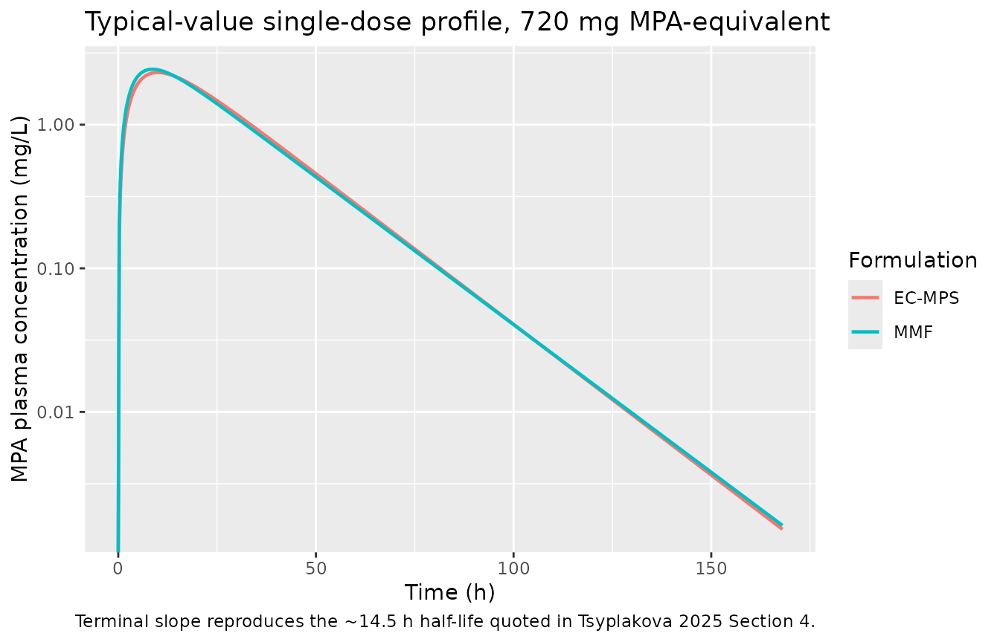
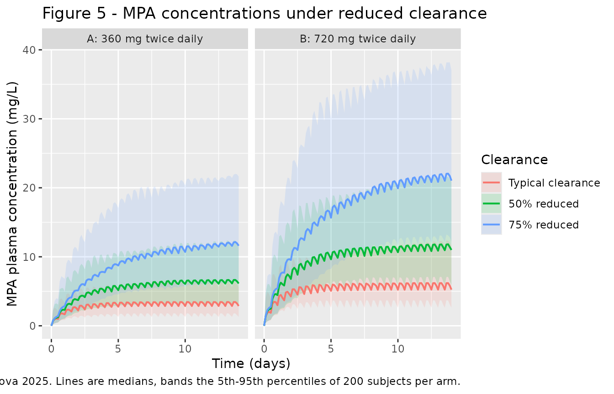

# Mycophenolate EC-MPS and MMF in renal transplantation (Tsyplakova 2025)

## Model and source

Tsyplakova 2025 developed **two** population PK models for mycophenolic
acid (MPA) in adult renal transplant recipients, one per oral
formulation, and both are packaged separately:

``` r

modSodium  <- rxode2::rxode(readModelDb("Tsyplakova_2025_mycophenolateSodium"))
#> ℹ parameter labels from comments will be replaced by 'label()'
#> Warning: some etas defaulted to non-mu referenced, possible parsing error: etaiov_ka_1, etaiov_ka_2, etaiov_ka_3, etaiov_ka_4, etaiov_ka_5, etaiov_ka_6, etaiov_vc_1, etaiov_vc_2, etaiov_vc_3, etaiov_vc_4, etaiov_vc_5, etaiov_vc_6, etaiov_cl_1, etaiov_cl_2, etaiov_cl_3, etaiov_cl_4, etaiov_cl_5, etaiov_cl_6
#> as a work-around try putting the mu-referenced expression on a simple line
modMofetil <- rxode2::rxode(readModelDb("Tsyplakova_2025_mycophenolateMofetil"))
#> ℹ parameter labels from comments will be replaced by 'label()'
#> Warning: some etas defaulted to non-mu referenced, possible parsing error: etaiov_ka_1, etaiov_ka_2, etaiov_ka_3, etaiov_ka_4, etaiov_ka_5, etaiov_ka_6, etaiov_vc_1, etaiov_vc_2, etaiov_vc_3, etaiov_vc_4, etaiov_vc_5, etaiov_vc_6, etaiov_cl_1, etaiov_cl_2, etaiov_cl_3, etaiov_cl_4, etaiov_cl_5, etaiov_cl_6
#> as a work-around try putting the mu-referenced expression on a simple line
```

- Citation: Tsyplakova A, Catic-Djordjevic A, Stefanovic N, Karalis
  VD (2025) Optimizing Mycophenolate Therapy in Renal Transplant
  Patients Using Machine Learning and Population Pharmacokinetic
  Modeling. Med Sci (Basel) 13(4):235. <doi:10.3390/medsci13040235>.
- EC-MPS model: One-compartment population PK model with first-order
  absorption for mycophenolic acid after oral enteric-coated
  mycophenolate sodium (EC-MPS) in adult renal transplant recipients,
  with post-transplant time and total daily dose on apparent clearance
  and inter-occasion variability across monthly visits
- MMF model: One-compartment population PK model with first-order
  absorption for mycophenolic acid after oral mycophenolate mofetil
  (MMF) in adult renal transplant recipients, with post-transplant time
  and total daily dose on apparent clearance and inter-occasion
  variability across monthly visits
- Article: <https://doi.org/10.3390/medsci13040235>

The paper also applies machine-learning methods (principal component
analysis and boosted-tree regression with SHAP attribution) to the same
dataset. Those analyses identify which covariates drive MPA exposure but
do not produce an ODE model, so they are outside the scope of this
package; only the two population PK models are extracted here.

## Population

The analysis pooled 76 adult renal transplant recipients from the
nephrology clinic of the University Clinical Centre of Nis, Serbia,
followed for six months from September 2018 (Tsyplakova 2025 Section 2.1
and Table 1). Patients were at least three months post-transplant, had
stable graft function, and were on an immunosuppressive regimen of
mycophenolate plus tacrolimus plus low-dose prednisone; serum albumin
had to exceed 25 g/L. Median age was 51 years (IQR 14) and 26 of 76
(34.2%) were women. Median post-transplantation time was 70 months (IQR
84.3), and 54 (71%) grafts were from living donors against 18 (24%) from
deceased donors.

Sixty-three patients (82.9%) received enteric-coated mycophenolate
sodium (EC-MPS, 360-1440 mg/day twice daily) and 13 (17.1%) received
mycophenolate mofetil (MMF, 500-2000 mg/day twice daily); MMF doses were
placed on a common MPA-equivalent scale with a 0.72 conversion factor.
Together they contributed 209 MPA plasma samples and 65 saliva samples.
Only steady-state trough (C0) concentrations were measured, one per
occasion, which is why the authors chose a one-compartment structure and
estimated `ka` and `V` by maximum a posteriori estimation while `CL` was
estimated by maximum likelihood.

Laboratory medians were urea 7.8 mmol/L (IQR 5.4), creatinine 136 umol/L
(IQR 60), WBC 7.9 x10^9/L, RBC 4.7 x10^12/L, haemoglobin 138 g/L,
haematocrit 41.4%, and platelets 225 x10^9/L. **Body weight and serum
albumin were not recorded**, so the models carry no allometric or
protein-binding term and creatinine clearance could not be computed
(Section 4).

The same information is available programmatically:

``` r

str(readModelDb("Tsyplakova_2025_mycophenolateSodium")()$population)
#> Warning: some etas defaulted to non-mu referenced, possible parsing error: etaiov_ka_1, etaiov_ka_2, etaiov_ka_3, etaiov_ka_4, etaiov_ka_5, etaiov_ka_6, etaiov_vc_1, etaiov_vc_2, etaiov_vc_3, etaiov_vc_4, etaiov_vc_5, etaiov_vc_6, etaiov_cl_1, etaiov_cl_2, etaiov_cl_3, etaiov_cl_4, etaiov_cl_5, etaiov_cl_6
#> as a work-around try putting the mu-referenced expression on a simple line
#> List of 9
#>  $ species       : chr "human"
#>  $ n_subjects    : num 63
#>  $ n_studies     : num 1
#>  $ age_median    : chr "51 years (IQR 14; whole 76-patient cohort)"
#>  $ sex_female_pct: num 34.2
#>  $ disease_state : chr "adult renal transplant recipients, at least 3 months post-transplant with stable graft function, on mycophenola"| __truncated__
#>  $ dose_range    : chr "360-1440 mg/day enteric-coated mycophenolate sodium, given twice daily"
#>  $ regions       : chr "Serbia (University Clinical Centre of Nis)"
#>  $ notes         : chr "Tsyplakova 2025 Table 1: 76 patients total contributed 209 MPA plasma samples and 65 saliva samples; 63 (82.9%)"| __truncated__
```

## Source trace

Every `ini()` entry carries an in-file comment naming its source
location. They are collected here for review.

| Equation / parameter | EC-MPS value | MMF value | Source location |
|----|----|----|----|
| `lka` (ka) | 0.18 /h | 0.23 /h | Table 2 / Table 3 `kapop`; Eq. 6 / Eq. 9 |
| `lvc` (V/F) | 192.42 L | 196.43 L | Table 2 / Table 3 `Vpop`; Eq. 7 / Eq. 10 |
| `lcl` (CL/F) | 9.3 L/h | 9.3 L/h | Table 2 / Table 3 `Clpop`; Eq. 8 / Eq. 11 |
| `e_pod_cl` | 0.16 | 0.33 | Table 2 / Table 3 `beta(PTP)`; Eq. 8 / Eq. 11 |
| post-transplant reference | 67 months | 21 months | Eq. 8 / Eq. 11 denominator (`Cmean` of Eq. 1) |
| `e_dose_mpa_mgd_cl` | 0.77 | 1.27 | Table 2 / Table 3 `beta(TDD)`; Eq. 8 / Eq. 11 |
| total-daily-dose reference | 1500 mg/day | 1500 mg/day | Eq. 8 / Eq. 11 denominator |
| `etalka` | SD 0.36 | SD 0.27 | Table 2 / Table 3 `omega(ka)` |
| `etalvc` | SD 0.52 | SD 0.09 | Table 2 / Table 3 `omega(V)` |
| `etalcl` | SD 0.27 | SD 0.32 | Table 2 / Table 3 `omega(Cl)` |
| `etaiov_ka_*` | SD 0.28 | SD 0.48 | Table 2 / Table 3 `gamma(ka)` |
| `etaiov_vc_*` | SD 0.52 | SD 0.33 | Table 2 / Table 3 `gamma(V)` |
| `etaiov_cl_*` | SD 0.31 | SD 0.27 | Table 2 / Table 3 `gamma(Cl)` |
| `addSd` | 0.04 mg/L | not used | Table 2 `a`; Eq. 5 combined error |
| `propSd` | 0.06 | 0.17 | Table 2 `b` / Table 3 `b`; Eq. 5 / Eq. 4 |
| Covariate model form | n/a | n/a | Eq. 1: `log(Pi) = log(Ppop) + betaC * log(Ci/Cmean) + eta + kappa` |
| `d/dt(depot)`, `d/dt(central)` | n/a | n/a | Section 3.1: one compartment, first-order absorption and elimination |

Tables 2 and 3 are headed “Standard Deviation of the Random Effects”, so
each reported `omega` and `gamma` is a standard deviation on the log
scale; the model files therefore square them to variances
(`etalcl ~ 0.27^2`).

## Virtual cohort

Original observed data are not publicly available. The simulations below
use virtual cohorts whose covariates are set at the reference values of
each model’s covariate equation, so that apparent clearance reduces to
the published `Clpop` of 9.3 L/h. Concretely, post-transplant time is
set to the model’s own normalisation constant (67 months for EC-MPS, 21
months for MMF) and the total daily dose covariate is set to 1500
mg/day, making both power terms exactly 1. This matches Tsyplakova 2025
Section 3.3, which states that the Monte Carlo simulations used “the
mean population clearance (Cl_pop = 9.3 L/h) estimated from the
developed PopPK model”.

``` r

DAYS_PER_MONTH <- 30.4375  # mean Gregorian month; POD is a days-valued column

# Build one arm as a self-contained event table. `id_offset` keeps subject IDs
# disjoint so several arms can be bind_rows()-ed without rxSolve silently
# merging them into one subject.
make_arm <- function(n, dose, ii, addl, obs_times, pod_months, tdd = 1500,
                     id_offset = 0L, ...) {
  subj <- tibble(
    id           = id_offset + seq_len(n),
    POD          = pod_months * DAYS_PER_MONTH,
    DOSE_MPA_MGD = tdd,
    OCC          = 1,
    ...
  )
  doses <- subj |>
    mutate(time = 0, amt = dose, evid = 1L, cmt = "depot",
           ii = ii, addl = addl, ss = 0L)
  obs <- subj |>
    tidyr::crossing(time = obs_times) |>
    mutate(amt = NA_real_, evid = 0L, cmt = "central",
           ii = 0, addl = 0L, ss = 0L)
  bind_rows(doses, obs) |> arrange(id, time, desc(evid))
}

# Steady-state variant: a single ss=1 record establishes exact steady state,
# which is what the closed-form AUC identity below is tested against.
make_ss_arm <- function(n, dose, ii, obs_times, pod_months, tdd = 1500,
                        id_offset = 0L, ...) {
  subj <- tibble(
    id           = id_offset + seq_len(n),
    POD          = pod_months * DAYS_PER_MONTH,
    DOSE_MPA_MGD = tdd,
    OCC          = 1,
    ...
  )
  doses <- subj |>
    mutate(time = 0, amt = dose, evid = 1L, cmt = "depot",
           ii = ii, addl = 0L, ss = 1L)
  obs <- subj |>
    tidyr::crossing(time = obs_times) |>
    mutate(amt = NA_real_, evid = 0L, cmt = "central",
           ii = 0, addl = 0L, ss = 0L)
  bind_rows(doses, obs) |> arrange(id, time, desc(evid))
}

# Reduced-clearance scenarios are produced by scaling the typical CL/F, which
# is exactly what Section 3.3 describes ("reductions of 50% and 75%").
scale_cl <- function(mod, factor) {
  rxode2::ini(mod, lcl = log(9.3 * factor))
}
```

## Single-dose disposition and the published half-life

Tsyplakova 2025 Section 4 states that “the half-life time of MPA from
both EC-MPS and MMF formulations is about 14.5 h”. A single 720 mg dose
simulated at the typical-value parameters recovers that directly.

``` r

sd_times <- c(seq(0, 24, by = 0.25), seq(25, 168, by = 1))

sd_events <- bind_rows(
  make_arm(1, dose = 720, ii = 0, addl = 0L, obs_times = sd_times,
           pod_months = 67, id_offset =  0L, formulation = "EC-MPS"),
  make_arm(1, dose = 720, ii = 0, addl = 0L, obs_times = sd_times,
           pod_months = 21, id_offset = 10L, formulation = "MMF")
)
stopifnot(!anyDuplicated(unique(sd_events[, c("id", "time", "evid")])))

# rxSolve drops the `id` column when the event table holds a single subject,
# so restore it explicitly from the arm's own id before binding the arms.
solve_one_arm <- function(mod, arm) {
  ev <- filter(sd_events, formulation == arm)
  out <- rxode2::rxSolve(rxode2::zeroRe(mod), events = as.data.frame(ev),
                         keep = "formulation") |>
    as.data.frame()
  if (is.null(out$id)) out$id <- unique(ev$id)
  out
}

sd_sim <- bind_rows(
  solve_one_arm(modSodium,  "EC-MPS"),
  solve_one_arm(modMofetil, "MMF")
)
#> Warning: some etas defaulted to non-mu referenced, possible parsing error: etaiov_ka_1, etaiov_ka_2, etaiov_ka_3, etaiov_ka_4, etaiov_ka_5, etaiov_ka_6, etaiov_vc_1, etaiov_vc_2, etaiov_vc_3, etaiov_vc_4, etaiov_vc_5, etaiov_vc_6, etaiov_cl_1, etaiov_cl_2, etaiov_cl_3, etaiov_cl_4, etaiov_cl_5, etaiov_cl_6
#> as a work-around try putting the mu-referenced expression on a simple line
#> Warning: some etas defaulted to non-mu referenced, possible parsing error: etaiov_ka_1, etaiov_ka_2, etaiov_ka_3, etaiov_ka_4, etaiov_ka_5, etaiov_ka_6, etaiov_vc_1, etaiov_vc_2, etaiov_vc_3, etaiov_vc_4, etaiov_vc_5, etaiov_vc_6, etaiov_cl_1, etaiov_cl_2, etaiov_cl_3, etaiov_cl_4, etaiov_cl_5, etaiov_cl_6
#> as a work-around try putting the mu-referenced expression on a simple line
#> ℹ omega/sigma items treated as zero: 'etalka', 'etalvc', 'etalcl', 'etaiov_ka_1', 'etaiov_ka_2', 'etaiov_ka_3', 'etaiov_ka_4', 'etaiov_ka_5', 'etaiov_ka_6', 'etaiov_vc_1', 'etaiov_vc_2', 'etaiov_vc_3', 'etaiov_vc_4', 'etaiov_vc_5', 'etaiov_vc_6', 'etaiov_cl_1', 'etaiov_cl_2', 'etaiov_cl_3', 'etaiov_cl_4', 'etaiov_cl_5', 'etaiov_cl_6'
#> Warning: some etas defaulted to non-mu referenced, possible parsing error: etaiov_ka_1, etaiov_ka_2, etaiov_ka_3, etaiov_ka_4, etaiov_ka_5, etaiov_ka_6, etaiov_vc_1, etaiov_vc_2, etaiov_vc_3, etaiov_vc_4, etaiov_vc_5, etaiov_vc_6, etaiov_cl_1, etaiov_cl_2, etaiov_cl_3, etaiov_cl_4, etaiov_cl_5, etaiov_cl_6
#> as a work-around try putting the mu-referenced expression on a simple line
#> Warning: some etas defaulted to non-mu referenced, possible parsing error: etaiov_ka_1, etaiov_ka_2, etaiov_ka_3, etaiov_ka_4, etaiov_ka_5, etaiov_ka_6, etaiov_vc_1, etaiov_vc_2, etaiov_vc_3, etaiov_vc_4, etaiov_vc_5, etaiov_vc_6, etaiov_cl_1, etaiov_cl_2, etaiov_cl_3, etaiov_cl_4, etaiov_cl_5, etaiov_cl_6
#> as a work-around try putting the mu-referenced expression on a simple line
#> ℹ omega/sigma items treated as zero: 'etalka', 'etalvc', 'etalcl', 'etaiov_ka_1', 'etaiov_ka_2', 'etaiov_ka_3', 'etaiov_ka_4', 'etaiov_ka_5', 'etaiov_ka_6', 'etaiov_vc_1', 'etaiov_vc_2', 'etaiov_vc_3', 'etaiov_vc_4', 'etaiov_vc_5', 'etaiov_vc_6', 'etaiov_cl_1', 'etaiov_cl_2', 'etaiov_cl_3', 'etaiov_cl_4', 'etaiov_cl_5', 'etaiov_cl_6'
stopifnot(dplyr::n_distinct(sd_sim$id) == 2L)

# The typical-value CL/F must collapse to the published Clpop of 9.3 L/h.
stopifnot(all(abs(sd_sim$cl - 9.3) < 1e-8))
```

``` r

ggplot(sd_sim, aes(time, Cc, colour = formulation)) +
  geom_line(linewidth = 0.8) +
  scale_y_log10() +
  labs(x = "Time (h)", y = "MPA plasma concentration (mg/L)",
       colour = "Formulation",
       title = "Typical-value single-dose profile, 720 mg MPA-equivalent",
       caption = "Terminal slope reproduces the ~14.5 h half-life quoted in Tsyplakova 2025 Section 4.")
#> Warning in scale_y_log10(): log-10 transformation introduced infinite values.
```



``` r

sd_nca <- sd_sim |>
  filter(!is.na(Cc)) |>
  select(id, time, Cc, formulation)

sd_nca <- bind_rows(
  sd_nca,
  sd_nca |> distinct(id, formulation) |> mutate(time = 0, Cc = 0)
) |>
  distinct(id, formulation, time, .keep_all = TRUE) |>
  arrange(id, formulation, time)

# Restrict lambda.z to the true terminal region. With ka = 0.18-0.23 /h the
# absorption phase is not complete until well past 24 h, and PKNCA's automatic
# lambda.z selection otherwise reads the oral half-life slightly long.
sd_nca$include_half.life <- sd_nca$time >= 96

sd_conc <- PKNCA::PKNCAconc(sd_nca, Cc ~ time | formulation + id,
                            include_half.life = "include_half.life")

sd_dose <- sd_events |>
  filter(evid == 1) |>
  select(id, time, amt, formulation)
sd_dose_obj <- PKNCA::PKNCAdose(sd_dose, amt ~ time | formulation + id)

sd_res <- PKNCA::pk.nca(PKNCA::PKNCAdata(
  sd_conc, sd_dose_obj,
  intervals = data.frame(
    start = 0, end = Inf,
    cmax = TRUE, tmax = TRUE, aucinf.obs = TRUE,
    half.life = TRUE, cl.obs = TRUE
  )
))
```

### Comparison against published values

Concentrations are in mg/L and doses in mg, so PKNCA’s `cl.obs`
(`dose / AUCinf`) comes back directly in L/h and can be checked against
the published `Clpop`. `AUCinf` is compared against the closed-form
`Dose / CL` implied by the published clearance, and `half.life` against
the value quoted in the Discussion.

``` r

published <- tibble::tribble(
  ~formulation, ~half.life, ~cl.obs, ~aucinf.obs,
  "EC-MPS",     14.5,       9.3,     720 / 9.3,
  "MMF",        14.5,       9.3,     720 / 9.3
)

cmp <- nlmixr2lib::ncaComparisonTable(
  simulated = sd_res,
  reference = published,
  by        = "formulation",
  units     = c(cl.obs = "L/h", aucinf.obs = "mg*h/L",
                cmax = "mg/L", tmax = "h", half.life = "h"),
  tolerance_pct = 20
)

knitr::kable(
  cmp,
  digits  = 2,
  caption = "Simulated vs. published MPA disposition after a single 720 mg dose. * differs from reference by >20%."
)
```

| NCA parameter          | formulation | Reference | Simulated | % diff |
|:-----------------------|:------------|:----------|:----------|:-------|
| AUC0-∞ (obs) (mg\*h/L) | EC-MPS      | 77.4      | 77.4      | -0.0%  |
| AUC0-∞ (obs) (mg\*h/L) | MMF         | 77.4      | 77.4      | -0.0%  |
| t½ (h)                 | EC-MPS      | 14.5      | 14.3      | -1.1%  |
| t½ (h)                 | MMF         | 14.5      | 14.6      | +1.0%  |
| CL/F (L/h)             | EC-MPS      | 9.3       | 9.3       | +0.0%  |
| CL/F (L/h)             | MMF         | 9.3       | 9.3       | +0.0%  |

Simulated vs. published MPA disposition after a single 720 mg dose. \*
differs from reference by \>20%. {.table}

Half-life reads 14.3 h (EC-MPS) and 14.6 h (MMF) against the quoted
“about 14.5 h”, and `cl.obs` returns the published 9.3 L/h, confirming
both the ODE encoding and the dose/concentration unit chain.

## Steady-state exposure and the closed-form AUC identity

At steady state the AUC over one dosing interval must equal `Dose / CL`
exactly, regardless of `ka` or `V`. This single identity gates the ODE,
the dose encoding, the steady-state event records, and PKNCA’s interval
settings at once.

``` r

ss_grid <- seq(0, 12, by = 0.05)

ss_events <- bind_rows(
  make_ss_arm(1, dose = 360, ii = 12, obs_times = ss_grid, pod_months = 67,
              id_offset = 0L, regimen = "360 mg q12h"),
  make_ss_arm(1, dose = 720, ii = 12, obs_times = ss_grid, pod_months = 67,
              id_offset = 1L, regimen = "720 mg q12h")
)

ss_sim <- rxode2::rxSolve(rxode2::zeroRe(modSodium),
                          events = as.data.frame(ss_events),
                          keep = "regimen") |>
  as.data.frame() |>
  filter(!is.na(Cc))
#> Warning: some etas defaulted to non-mu referenced, possible parsing error: etaiov_ka_1, etaiov_ka_2, etaiov_ka_3, etaiov_ka_4, etaiov_ka_5, etaiov_ka_6, etaiov_vc_1, etaiov_vc_2, etaiov_vc_3, etaiov_vc_4, etaiov_vc_5, etaiov_vc_6, etaiov_cl_1, etaiov_cl_2, etaiov_cl_3, etaiov_cl_4, etaiov_cl_5, etaiov_cl_6
#> as a work-around try putting the mu-referenced expression on a simple line
#> ℹ omega/sigma items treated as zero: 'etalka', 'etalvc', 'etalcl', 'etaiov_ka_1', 'etaiov_ka_2', 'etaiov_ka_3', 'etaiov_ka_4', 'etaiov_ka_5', 'etaiov_ka_6', 'etaiov_vc_1', 'etaiov_vc_2', 'etaiov_vc_3', 'etaiov_vc_4', 'etaiov_vc_5', 'etaiov_vc_6', 'etaiov_cl_1', 'etaiov_cl_2', 'etaiov_cl_3', 'etaiov_cl_4', 'etaiov_cl_5', 'etaiov_cl_6'
#> Warning: multi-subject simulation without without 'omega'

ss_doses <- ss_events |>
  filter(evid == 1) |>
  select(regimen, dose = amt)

ss_auc <- ss_sim |>
  group_by(regimen) |>
  summarise(
    cl        = first(cl),
    auc_trapz = sum(diff(time) * (head(Cc, -1) + tail(Cc, -1)) / 2),
    .groups   = "drop"
  ) |>
  left_join(ss_doses, by = "regimen") |>
  mutate(
    auc_closed = dose / cl,
    pct_diff   = 100 * (auc_trapz - auc_closed) / auc_closed
  ) |>
  relocate(dose, .after = regimen)

# Strict gate: the numerical AUC must match Dose/CL to better than 0.1%.
stopifnot(all(abs(ss_auc$pct_diff) < 0.1))

ss_auc |>
  rename(
    "Regimen"                     = regimen,
    "Dose (mg)"                   = dose,
    "CL/F (L/h)"                  = cl,
    "AUC0-12 simulated (mg*h/L)"  = auc_trapz,
    "AUC0-12 = Dose/CL (mg*h/L)"  = auc_closed,
    "Difference (%)"              = pct_diff
  ) |>
  knitr::kable(digits = c(0, 0, 2, 3, 3, 4),
               caption = "Steady-state AUC identity for the EC-MPS model.")
```

| Regimen | Dose (mg) | CL/F (L/h) | AUC0-12 simulated (mg\*h/L) | AUC0-12 = Dose/CL (mg\*h/L) | Difference (%) |
|:---|---:|---:|---:|---:|---:|
| 360 mg q12h | 360 | 9.3 | 38.710 | 38.710 | -2e-04 |
| 720 mg q12h | 720 | 9.3 | 77.419 | 77.419 | -2e-04 |

Steady-state AUC identity for the EC-MPS model. {.table}

Tsyplakova 2025 Sections 1 and 2.5 give the therapeutic reference range
for AUC0-12 as approximately 30-60 ug\*h/mL, which is numerically the
same as 30-60 mg\*h/L, the units used for plasma concentration in Figure
5. At the published typical clearance the 360 mg twice-daily regimen
gives 38.7 mg\*h/L, inside the therapeutic window, while 720 mg twice
daily gives 77.4 mg\*h/L, above it. That ordering is what drives the
paper’s dose-reduction proposals below.

## Replicating Figure 5: effect of reduced clearance

Figure 5 simulates MPA concentrations after initiating 360 mg twice
daily (panel A) and 720 mg twice daily (panel B) under three conditions:
the typical population clearance, a 50% reduction, and a 75% reduction.
Terminal half-life rises from 14.3 h at full clearance to 28.7 h and
57.4 h respectively, so the simulation window has to be long enough for
the most impaired arm to approach steady state. Fourteen days is 5.9
terminal half-lives for the 75%-reduced arm (98.3% of steady state).

``` r

fig5_times <- seq(0, 336, by = 3)
cl_conditions <- c("Typical clearance" = 1, "50% reduced" = 0.5, "75% reduced" = 0.25)

fig5_sim <- bind_rows(lapply(names(cl_conditions), function(cond) {
  events <- bind_rows(
    make_arm(200, dose = 360, ii = 12, addl = 27L, obs_times = fig5_times,
             pod_months = 67, id_offset =   0L, regimen = "A: 360 mg twice daily"),
    make_arm(200, dose = 720, ii = 12, addl = 27L, obs_times = fig5_times,
             pod_months = 67, id_offset = 200L, regimen = "B: 720 mg twice daily")
  )
  stopifnot(!anyDuplicated(unique(events[, c("id", "time", "evid")])))
  # Same seed per condition so the three arms share one virtual cohort and the
  # only difference between them is the clearance scaling.
  set.seed(20251020)
  rxode2::rxSolve(scale_cl(modSodium, cl_conditions[[cond]]),
                  events = as.data.frame(events),
                  keep = "regimen") |>
    as.data.frame() |>
    mutate(condition = factor(cond, levels = names(cl_conditions)))
}))
#> ℹ change initial estimate of `lcl` to `2.23001440015921`
#> Warning: some etas defaulted to non-mu referenced, possible parsing error: etaiov_ka_1, etaiov_ka_2, etaiov_ka_3, etaiov_ka_4, etaiov_ka_5, etaiov_ka_6, etaiov_vc_1, etaiov_vc_2, etaiov_vc_3, etaiov_vc_4, etaiov_vc_5, etaiov_vc_6, etaiov_cl_1, etaiov_cl_2, etaiov_cl_3, etaiov_cl_4, etaiov_cl_5, etaiov_cl_6
#> as a work-around try putting the mu-referenced expression on a simple line
#> ℹ change initial estimate of `lcl` to `1.53686721959926`
#> Warning: some etas defaulted to non-mu referenced, possible parsing error: etaiov_ka_1, etaiov_ka_2, etaiov_ka_3, etaiov_ka_4, etaiov_ka_5, etaiov_ka_6, etaiov_vc_1, etaiov_vc_2, etaiov_vc_3, etaiov_vc_4, etaiov_vc_5, etaiov_vc_6, etaiov_cl_1, etaiov_cl_2, etaiov_cl_3, etaiov_cl_4, etaiov_cl_5, etaiov_cl_6
#> as a work-around try putting the mu-referenced expression on a simple line
#> ℹ change initial estimate of `lcl` to `0.84372003903932`
#> Warning: some etas defaulted to non-mu referenced, possible parsing error: etaiov_ka_1, etaiov_ka_2, etaiov_ka_3, etaiov_ka_4, etaiov_ka_5, etaiov_ka_6, etaiov_vc_1, etaiov_vc_2, etaiov_vc_3, etaiov_vc_4, etaiov_vc_5, etaiov_vc_6, etaiov_cl_1, etaiov_cl_2, etaiov_cl_3, etaiov_cl_4, etaiov_cl_5, etaiov_cl_6
#> as a work-around try putting the mu-referenced expression on a simple line

fig5_sim |>
  filter(!is.na(Cc)) |>
  group_by(regimen, condition, time) |>
  summarise(
    Q05 = quantile(Cc, 0.05),
    Q50 = quantile(Cc, 0.50),
    Q95 = quantile(Cc, 0.95),
    .groups = "drop"
  ) |>
  ggplot(aes(time / 24, Q50, colour = condition, fill = condition)) +
  geom_ribbon(aes(ymin = Q05, ymax = Q95), alpha = 0.15, colour = NA) +
  geom_line(linewidth = 0.7) +
  facet_wrap(~regimen) +
  labs(x = "Time (days)", y = "MPA plasma concentration (mg/L)",
       colour = "Clearance", fill = "Clearance",
       title = "Figure 5 - MPA concentrations under reduced clearance",
       caption = paste("Replicates Figure 5 of Tsyplakova 2025.",
                       "Lines are medians, bands the 5th-95th percentiles of 200 subjects per arm."))
```



As in the paper, concentrations rise as clearance falls, and the effect
is more pronounced at the higher dose. The median trough after 14 days
rises roughly two- and four-fold across the three conditions, matching
the reciprocal relationship between steady-state exposure and clearance.

``` r

fig5_sim |>
  filter(!is.na(Cc), time == 336) |>
  group_by(regimen, condition) |>
  summarise(trough = median(Cc), .groups = "drop") |>
  tidyr::pivot_wider(names_from = condition, values_from = trough) |>
  rename("Regimen" = regimen) |>
  knitr::kable(digits = 2,
               caption = "Median day-14 trough concentration (mg/L) by clearance condition.")
```

| Regimen               | Typical clearance | 50% reduced | 75% reduced |
|:----------------------|------------------:|------------:|------------:|
| A: 360 mg twice daily |              2.87 |        6.13 |       11.60 |
| B: 720 mg twice daily |              5.24 |       10.99 |       21.03 |

Median day-14 trough concentration (mg/L) by clearance condition.
{.table}

## The proposed dose adjustments are exposure-neutral

Section 3.3 and Figures A2-A3 propose reduced regimens intended to
restore the exposure of the unimpaired patient: 360 mg twice daily
becomes 180 mg twice daily at 50% clearance and 180 mg once daily at 75%
clearance, and 720 mg twice daily becomes 360 mg twice daily and 360 mg
once daily respectively. Because steady-state daily exposure is
`daily dose / CL`, each triplet should land on the same AUC over 24 h.
This is an exact answer key from the paper’s own recommendations, so it
is checked numerically rather than by eye.

``` r

regimens <- tibble::tribble(
  ~reference_regimen,     ~condition,     ~cl_factor, ~dose, ~ii,  ~label,
  "360 mg twice daily",   "Typical",      1.00,       360,   12,   "360 mg q12h",
  "360 mg twice daily",   "50% reduced",  0.50,       180,   12,   "180 mg q12h",
  "360 mg twice daily",   "75% reduced",  0.25,       180,   24,   "180 mg q24h",
  "720 mg twice daily",   "Typical",      1.00,       720,   12,   "720 mg q12h",
  "720 mg twice daily",   "50% reduced",  0.50,       360,   12,   "360 mg q12h",
  "720 mg twice daily",   "75% reduced",  0.25,       360,   24,   "360 mg q24h"
)

adjust_auc <- function(cl_factor, dose, ii) {
  grid <- seq(0, ii, by = ii / 480)
  ev <- make_ss_arm(1, dose = dose, ii = ii, obs_times = grid, pod_months = 67)
  s <- rxode2::rxSolve(rxode2::zeroRe(scale_cl(modSodium, cl_factor)),
                       events = as.data.frame(ev)) |>
    as.data.frame() |>
    filter(!is.na(Cc))
  auc_tau <- sum(diff(s$time) * (head(s$Cc, -1) + tail(s$Cc, -1)) / 2)
  tibble(cl = s$cl[1], auc_24 = auc_tau * 24 / ii)
}

adjust_res <- regimens |>
  rowwise() |>
  mutate(res = list(adjust_auc(cl_factor, dose, ii))) |>
  tidyr::unnest(res) |>
  ungroup() |>
  mutate(auc_24_closed = (dose * 24 / ii) / cl)
#> ℹ change initial estimate of `lcl` to `2.23001440015921`
#> ℹ omega/sigma items treated as zero: 'etalka', 'etalvc', 'etalcl', 'etaiov_ka_1', 'etaiov_ka_2', 'etaiov_ka_3', 'etaiov_ka_4', 'etaiov_ka_5', 'etaiov_ka_6', 'etaiov_vc_1', 'etaiov_vc_2', 'etaiov_vc_3', 'etaiov_vc_4', 'etaiov_vc_5', 'etaiov_vc_6', 'etaiov_cl_1', 'etaiov_cl_2', 'etaiov_cl_3', 'etaiov_cl_4', 'etaiov_cl_5', 'etaiov_cl_6'
#> ℹ change initial estimate of `lcl` to `1.53686721959926`
#> ℹ omega/sigma items treated as zero: 'etalka', 'etalvc', 'etalcl', 'etaiov_ka_1', 'etaiov_ka_2', 'etaiov_ka_3', 'etaiov_ka_4', 'etaiov_ka_5', 'etaiov_ka_6', 'etaiov_vc_1', 'etaiov_vc_2', 'etaiov_vc_3', 'etaiov_vc_4', 'etaiov_vc_5', 'etaiov_vc_6', 'etaiov_cl_1', 'etaiov_cl_2', 'etaiov_cl_3', 'etaiov_cl_4', 'etaiov_cl_5', 'etaiov_cl_6'
#> ℹ change initial estimate of `lcl` to `0.84372003903932`
#> ℹ omega/sigma items treated as zero: 'etalka', 'etalvc', 'etalcl', 'etaiov_ka_1', 'etaiov_ka_2', 'etaiov_ka_3', 'etaiov_ka_4', 'etaiov_ka_5', 'etaiov_ka_6', 'etaiov_vc_1', 'etaiov_vc_2', 'etaiov_vc_3', 'etaiov_vc_4', 'etaiov_vc_5', 'etaiov_vc_6', 'etaiov_cl_1', 'etaiov_cl_2', 'etaiov_cl_3', 'etaiov_cl_4', 'etaiov_cl_5', 'etaiov_cl_6'
#> ℹ change initial estimate of `lcl` to `2.23001440015921`
#> ℹ omega/sigma items treated as zero: 'etalka', 'etalvc', 'etalcl', 'etaiov_ka_1', 'etaiov_ka_2', 'etaiov_ka_3', 'etaiov_ka_4', 'etaiov_ka_5', 'etaiov_ka_6', 'etaiov_vc_1', 'etaiov_vc_2', 'etaiov_vc_3', 'etaiov_vc_4', 'etaiov_vc_5', 'etaiov_vc_6', 'etaiov_cl_1', 'etaiov_cl_2', 'etaiov_cl_3', 'etaiov_cl_4', 'etaiov_cl_5', 'etaiov_cl_6'
#> ℹ change initial estimate of `lcl` to `1.53686721959926`
#> ℹ omega/sigma items treated as zero: 'etalka', 'etalvc', 'etalcl', 'etaiov_ka_1', 'etaiov_ka_2', 'etaiov_ka_3', 'etaiov_ka_4', 'etaiov_ka_5', 'etaiov_ka_6', 'etaiov_vc_1', 'etaiov_vc_2', 'etaiov_vc_3', 'etaiov_vc_4', 'etaiov_vc_5', 'etaiov_vc_6', 'etaiov_cl_1', 'etaiov_cl_2', 'etaiov_cl_3', 'etaiov_cl_4', 'etaiov_cl_5', 'etaiov_cl_6'
#> ℹ change initial estimate of `lcl` to `0.84372003903932`
#> ℹ omega/sigma items treated as zero: 'etalka', 'etalvc', 'etalcl', 'etaiov_ka_1', 'etaiov_ka_2', 'etaiov_ka_3', 'etaiov_ka_4', 'etaiov_ka_5', 'etaiov_ka_6', 'etaiov_vc_1', 'etaiov_vc_2', 'etaiov_vc_3', 'etaiov_vc_4', 'etaiov_vc_5', 'etaiov_vc_6', 'etaiov_cl_1', 'etaiov_cl_2', 'etaiov_cl_3', 'etaiov_cl_4', 'etaiov_cl_5', 'etaiov_cl_6'
#> Warning: There were 8 warnings in `mutate()`.
#> The first warning was:
#> ℹ In argument: `res = list(adjust_auc(cl_factor, dose, ii))`.
#> ℹ In row 1.
#> Caused by warning:
#> ! some etas defaulted to non-mu referenced, possible parsing error: etaiov_ka_1, etaiov_ka_2, etaiov_ka_3, etaiov_ka_4, etaiov_ka_5, etaiov_ka_6, etaiov_vc_1, etaiov_vc_2, etaiov_vc_3, etaiov_vc_4, etaiov_vc_5, etaiov_vc_6, etaiov_cl_1, etaiov_cl_2, etaiov_cl_3, etaiov_cl_4, etaiov_cl_5, etaiov_cl_6
#> as a work-around try putting the mu-referenced expression on a simple line
#> ℹ Run `dplyr::last_dplyr_warnings()` to see the 7 remaining warnings.

# Every triplet must land on one AUC0-24, and each value must match the
# closed-form daily-dose/CL prediction.
stopifnot(nrow(adjust_res) == 6L)
stopifnot(all(abs(adjust_res$auc_24 - adjust_res$auc_24_closed) /
                adjust_res$auc_24_closed < 0.001))

adjust_spread <- adjust_res |>
  group_by(reference_regimen) |>
  summarise(spread = max(auc_24) / min(auc_24) - 1, .groups = "drop")
stopifnot(nrow(adjust_spread) == 2L, all(adjust_spread$spread < 0.001))

adjust_res |>
  select(reference_regimen, condition, label, cl, auc_24, auc_24_closed) |>
  rename(
    "Reference regimen"            = reference_regimen,
    "Clearance"                    = condition,
    "Simulated regimen"            = label,
    "CL/F (L/h)"                   = cl,
    "AUC0-24 simulated (mg*h/L)"   = auc_24,
    "AUC0-24 = daily dose/CL"      = auc_24_closed
  ) |>
  knitr::kable(digits = c(0, 0, 0, 3, 2, 2),
               caption = "The dose adjustments of Figures A2-A3 are exposure-neutral: each reference regimen's three rows share one AUC0-24.")
```

| Reference regimen | Clearance | Simulated regimen | CL/F (L/h) | AUC0-24 simulated (mg\*h/L) | AUC0-24 = daily dose/CL |
|:---|:---|:---|---:|---:|---:|
| 360 mg twice daily | Typical | 360 mg q12h | 9.300 | 77.42 | 77.42 |
| 360 mg twice daily | 50% reduced | 180 mg q12h | 4.650 | 77.42 | 77.42 |
| 360 mg twice daily | 75% reduced | 180 mg q24h | 2.325 | 77.42 | 77.42 |
| 720 mg twice daily | Typical | 720 mg q12h | 9.300 | 154.84 | 154.84 |
| 720 mg twice daily | 50% reduced | 360 mg q12h | 4.650 | 154.84 | 154.84 |
| 720 mg twice daily | 75% reduced | 360 mg q24h | 2.325 | 154.84 | 154.84 |

The dose adjustments of Figures A2-A3 are exposure-neutral: each
reference regimen’s three rows share one AUC0-24. {.table}

Both triplets reproduce exactly: 77.4 mg\*h/L per 24 h for the 360 mg
twice-daily reference and 154.8 mg\*h/L for the 720 mg twice-daily
reference. This confirms that the packaged model reproduces the
arithmetic behind the paper’s dosing recommendations.

## Assumptions and deviations

- **Post-transplant time is stored in days, not months.** The canonical
  covariate column `POD` is defined in days, whereas Tsyplakova 2025
  Eqs. 8 and 11 use months. The model files divide `POD` by 30.4375
  days/month before forming the paper’s ratio, so a user supplies `POD`
  in days and the published coefficients apply unchanged.
- **The normalisation constants differ between the two models** (67
  months for EC-MPS, 21 months for MMF) and are not stated as such in
  the text; they are read off the denominators of Eqs. 8 and 11 and
  interpreted as the per-subgroup covariate means that Eq. 1 defines
  `Cmean` to be. The whole-cohort median in Table 1 is 70 months,
  consistent with the larger EC-MPS subgroup dominating.
- **Total daily dose is on an MPA-equivalent mass scale.** Both models
  normalise to the same 1500 mg/day constant despite describing
  different formulations, which is only coherent if the covariate was
  placed on the common scale created by the 0.72 MMF-to-EC-MPS
  conversion described in Section 2.1. The paper does not state this
  explicitly; it is inferred from the shared constant. Note also that
  1500 mg/day sits above the 360-1440 mg/day protocol range, which the
  Discussion reconciles by noting some participants exceeded the 2160
  mg/day maximum therapeutic dose.
- **Six occasions are encoded for inter-occasion variability.** Section
  2.3 says each subsequent visit is a separate occasion and Section 2.2
  describes monthly measurement over six months, so `OCC` runs 1-6. The
  paper does not report the realised maximum number of occasions per
  patient (209 samples across 76 patients implies most contributed fewer
  than six). Tables 2 and 3 report a single `gamma` per parameter, so
  occasions 2-6 are fixed to the occasion-1 variance.
- **The simulations hold the covariates at their reference values.**
  Section 3.3 states the Monte Carlo work used `Cl_pop` = 9.3 L/h,
  i.e. the typical value without covariate adjustment, so this vignette
  sets `POD` and `DOSE_MPA_MGD` to the values that make both power terms
  equal 1. This is worth flagging: it is internally inconsistent with
  the fitted model, because the simulated regimens imply total daily
  doses of 720 and 1440 mg/day rather than 1500. A covariate-consistent
  simulation of 360 mg twice daily would give CL/F = 9.3 x
  (720/1500)^0.77 = 5.29 L/h and AUC0-12 = 68.1 mg\*h/L, above the 30-60
  mg\*h/L therapeutic window rather than inside it. The paper’s
  conclusion that 360 mg twice daily hits the target therefore depends
  on holding the total-daily-dose covariate at 1500 mg/day. The packaged
  models reproduce the published equations faithfully; users simulating
  new regimens should decide deliberately whether to move `DOSE_MPA_MGD`
  with the simulated dose.
- **The total-daily-dose effect is positive and is confounded by
  indication.** Higher daily doses associate with higher apparent
  clearance (exponents 0.77 and 1.27). The authors attribute this to
  dose titration in an already therapeutically-monitored stable cohort
  and note the covariate may partly proxy for body weight, which was not
  recorded. It should not be read as a mechanistic dose-dependency, and
  extrapolating it far outside the observed dose range is not supported.
- **`V` and `CL` are apparent.** Only oral data were available and
  bioavailability was not estimated, so the packaged `lvc` and `lcl` are
  V/F and CL/F. The paper reports them as `V` and `Cl`.
- **No published NCA table exists to compare against.** Only
  steady-state trough concentrations were measured, so the paper reports
  no Cmax, Tmax, or AUC observations. The comparison table above is
  therefore built from the three quantities the paper does publish or
  state: the typical clearance (Tables 2 and 3), the resulting
  closed-form `Dose / CL` exposure, and the ~14.5 h half-life quoted in
  Section 4.
- **The MMF model rests on 13 patients** against 63 for EC-MPS. The
  authors themselves selected the EC-MPS model for their simulations
  “due to the larger proportion of data derived from this formulation”
  (Section 3.3), which is why the simulation sections here use the
  EC-MPS model.
- **The machine-learning component is not extracted.** The PCA and
  boosted-tree analyses (Sections 2.4, 3.2) identify covariate
  importance but are not ODE models and produce no parameters that enter
  the packaged models.
