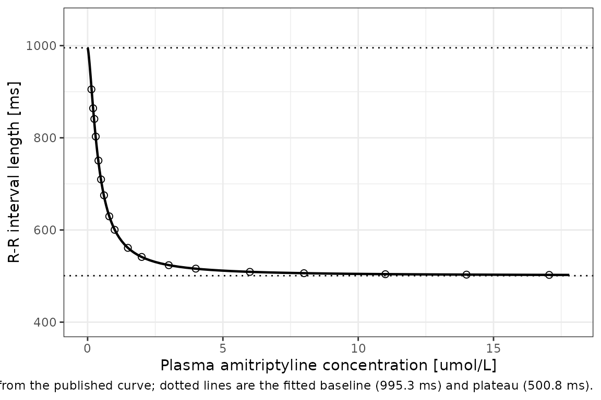
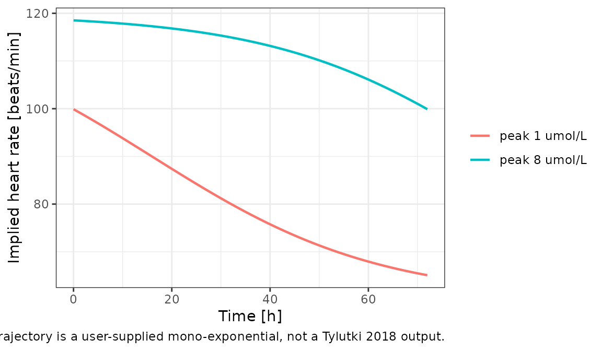

# Amitriptyline concentration-RR interval (Tylutki 2018)

## Model and source

- Citation: Tylutki Z, Mendyk A, Polak S. (2018). Physiologically based
  pharmacokinetic-quantitative systems toxicology and safety (PBPK-QSTS)
  modeling approach applied to predict the variability of amitriptyline
  pharmacokinetics and cardiac safety in populations and in individuals.
  Journal of Pharmacokinetics and Pharmacodynamics 45(5):663-677.
  <doi:10.1007/s10928-018-9597-6>. PMCID PMC6182726. Parameter values
  are from the Results section ‘Emax model’; the structural equation is
  Eq. 4 of the Methods section ‘Pharmacodynamic models’, corrected
  against the published Figure 2 (see ini()).
- Article: <https://doi.org/10.1007/s10928-018-9597-6> (PMC6182726, open
  access)

Tylutki, Mendyk and Polak (2018) assemble a PBPK-QSTS (physiologically
based pharmacokinetic - quantitative systems toxicology and safety)
system for amitriptyline (AT) and its active metabolite nortriptyline
(NT), and use it to predict cardiac safety across 29 mimicked clinical
trials and 19 published cases of amitriptyline intoxication.

The paper has three separable layers, and only one of them is an
original, self-contained, reproducible model. This vignette and the
single accompanying model file cover that one; the other two are
documented here so that a reader knows exactly what is and is not
packaged.

| Layer | Origin | Packaged? |
|----|----|----|
| Full-PBPK amitriptyline model linked to a minimal-PBPK nortriptyline model | Imported **unchanged** from Tylutki 2018 *J Pharm Sci* 107:1167-1177 (`doi:10.1016/j.xphs.2017.11.012`). Methods: *“We used full-PBPK model developed for AT linked to minimal-PBPK model for the metabolite - NT \[14\] without changing any of the model parameters.”* | **No.** Not a single organ volume, blood flow, tissue partition coefficient or clearance appears in this publication, so the layer cannot be reconstructed from it. See *Assumptions and deviations*. |
| Pseudo-ECG / QT simulation | The ten Tusscher & Panfilov (2006) human ventricular cardiomyocyte cell model as implemented in the proprietary Cardiac Safety Simulator v2.1 (Simcyp / Certara). | **No.** A modelling-platform component, not a model this paper specifies. |
| Sigmoid Emax model of the R-R interval versus total plasma amitriptyline concentration (Eq. 4) | **Original to this paper**; fitted here by simulated annealing in the `FME` package to a pooled literature dataset (their references 29-46). All four parameters and the fit RMSE are printed. | **Yes** - `Tylutki_2018_amitriptyline_RR`. |

The packaged model is PD-only. Amitriptyline total plasma concentration
enters as the time-varying covariate `CP_AMITRIPTYLINE_UM` (umol/L);
there is no compartment system and no dosing.

``` math
\text{rr} = e_0 + (r_\text{max} - e_0)\,
  \frac{C^{\,\text{hill}}}{\text{ec50}^{\,\text{hill}} + C^{\,\text{hill}}}
```

Because amitriptyline *speeds* the heart, `rmax` (500.8 ms, about 120
beats/min) lies **below** `e0` (995.3 ms, about 60 beats/min) and the
curve falls monotonically. The maximal attainable effect is `e0 - rmax`
= 494.5 ms of R-R shortening.

``` r

mod <- readModelDb("Tylutki_2018_amitriptyline_RR")
mod
#> function() {
#>   description <- paste(
#>     "Sigmoid Emax model relating total plasma amitriptyline concentration",
#>     "to the absolute electrocardiographic R-R interval length (observation",
#>     "variable rr, ms) in humans, from Tylutki 2018's PBPK-QSTS cardiac-",
#>     "safety analysis. The model is",
#>     "rr = e0 + (rmax - e0) * C^hill / (ec50^hill + C^hill),",
#>     "with e0 = 995.3 ms (drug-free baseline R-R, i.e. 60 beats/min),",
#>     "rmax = 500.8 ms (asymptotic R-R at maximal effect, i.e. 120",
#>     "beats/min), ec50 = 0.4 umol/L and hill = 1.5. Amitriptyline SHORTENS",
#>     "the R-R interval (speeds the heart) so rmax lies BELOW e0 and the",
#>     "curve is monotonically decreasing; the maximal attainable effect is",
#>     "e0 - rmax = 494.5 ms of R-R shortening. The fit is dominated by",
#>     "acute-overdose case reports, which supply almost all of the",
#>     "concentration range above 1 umol/L.",
#>     "PD-ONLY model: amitriptyline total plasma concentration is supplied",
#>     "as the time-varying covariate CP_AMITRIPTYLINE_UM (umol/L). The",
#>     "source paper's PK layer is a full-PBPK model for amitriptyline linked",
#>     "to a minimal-PBPK model for nortriptyline that Tylutki 2018 imports",
#>     "UNCHANGED from Tylutki 2018 J Pharm Sci (doi:10.1016/j.xphs.2017.11.012)",
#>     "and whose organ volumes, blood flows, partition coefficients and",
#>     "clearances appear nowhere in this paper; that layer is therefore not",
#>     "reproduced here and users must supply their own concentration",
#>     "trajectory. Amitriptyline molecular weight is 277.4 g/mol, so",
#>     "1 umol/L = 277.4 ng/mL.",
#>     "NOTE: the R-R equation is printed incorrectly in the source (Eq. 4",
#>     "omits its leading baseline term and evaluates to 0 at zero",
#>     "concentration). The form encoded here is the corrected one; it is the",
#>     "unique reconstruction from the printed parameter symbols that",
#>     "reproduces the published Figure 2 curve. See the ini() block and the",
#>     "vignette Errata for the digitisation evidence.",
#>     sep = " "
#>   )
#> 
#>   reference <- paste(
#>     "Tylutki Z, Mendyk A, Polak S. (2018). Physiologically based",
#>     "pharmacokinetic-quantitative systems toxicology and safety",
#>     "(PBPK-QSTS) modeling approach applied to predict the variability of",
#>     "amitriptyline pharmacokinetics and cardiac safety in populations and",
#>     "in individuals. Journal of Pharmacokinetics and Pharmacodynamics",
#>     "45(5):663-677. doi:10.1007/s10928-018-9597-6. PMCID PMC6182726.",
#>     "Parameter values are from the Results section 'Emax model'; the",
#>     "structural equation is Eq. 4 of the Methods section 'Pharmacodynamic",
#>     "models', corrected against the published Figure 2 (see ini()).",
#>     sep = " "
#>   )
#> 
#>   vignette <- "Tylutki_2018_amitriptyline"
#> 
#>   units <- list(
#>     time = "h",
#>     dosing = "(none; PD-only model driven by an external amitriptyline plasma-concentration covariate)",
#>     concentration = "(observation rr is the absolute R-R interval length in ms; driving covariate CP_AMITRIPTYLINE_UM is in umol/L)"
#>   )
#> 
#>   covariateData <- list(
#>     CP_AMITRIPTYLINE_UM = list(
#>       description = "Instantaneous TOTAL (not unbound) amitriptyline plasma concentration at the time of each R-R observation, supplied as a time-varying covariate from observed plasma samples or an upstream PK source.",
#>       units = "umol/L",
#>       type = "continuous",
#>       reference_category = NULL,
#>       notes = paste(
#>         "Time-varying per event row. Drives the sigmoid Emax expression",
#>         "rr = e0 + (rmax - e0) * CP_AMITRIPTYLINE_UM^hill /",
#>         "(ec50^hill + CP_AMITRIPTYLINE_UM^hill).",
#>         "Tylutki 2018 Eq. 4 defines C as 'AT total plasma concentration",
#>         "[uM]', so the column is TOTAL drug in plasma and is NOT the free",
#>         "cardiac-tissue concentration that the same paper feeds to the",
#>         "Cardiac Safety Simulator for its QT endpoint. Those two",
#>         "quantities differ by roughly four orders of magnitude: Tylutki",
#>         "2018 Eq. 5 gives Cfree,cardiac = Ctotal,plasma * Kp_ht * fu_ht",
#>         "with Kp_ht = 11.77 and fu_ht = 0.0012 for amitriptyline (and",
#>         "Kp_ht = 35.63, fu_ht = 0.001 for nortriptyline). Supplying a free",
#>         "cardiac concentration to this model would understate the driver",
#>         "by a factor of about 71.",
#>         "Amitriptyline molecular weight is 277.4 g/mol (Tylutki 2018",
#>         "Methods, citing PubChem CID 2160), so 1 umol/L = 277.4 ng/mL and",
#>         "a concentration reported in ng/mL must be divided by 277.4 before",
#>         "being supplied on this column.",
#>         "Reference values observed: the Figure 2 dataset spans roughly 0.1",
#>         "to 17.8 umol/L (28 to 4900 ng/mL). Therapeutic amitriptyline",
#>         "trough concentrations of 50-300 ng/mL correspond to 0.18-1.08",
#>         "umol/L, i.e. they straddle the fitted ec50 of 0.4 umol/L; the",
#>         "concentrations above about 2 umol/L come almost entirely from the",
#>         "acute-overdose case reports in the fitting set.",
#>         "Set to 0 for the drug-free reference, at which the expression",
#>         "collapses to rr = e0 = 995.3 ms.",
#>         "The natural input source is the paper's own full-PBPK",
#>         "amitriptyline model, which is imported unchanged from Tylutki",
#>         "2018 J Pharm Sci 107:1167-1177 and is not reproducible from this",
#>         "publication (no organ volume, blood flow, tissue partition",
#>         "coefficient or clearance is printed here); no amitriptyline popPK",
#>         "model is in the nlmixr2lib registry, so users must supply their",
#>         "own trajectory."
#>       ),
#>       source_name = "C (AT total plasma concentration, Tylutki 2018 Eq. 4)"
#>     )
#>   )
#> 
#>   population <- list(
#>     species = "human",
#>     n_subjects = NA_integer_,
#>     n_studies = 18L,
#>     age_range = "not reported for the pooled R-R dataset; the constituent sources range from a paediatric intoxication series to elderly overdose case reports",
#>     weight_range = "not reported",
#>     sex_female_pct = NA_real_,
#>     race_ethnicity = "not reported",
#>     disease_state = paste(
#>       "Pooled literature dataset of paired (total plasma amitriptyline",
#>       "concentration, R-R interval length) observations assembled by",
#>       "Tylutki 2018 from 18 published sources (their references 29-46).",
#>       "The sources are heterogeneous by design and span three settings:",
#>       "(1) healthy-volunteer cardiovascular studies of therapeutic",
#>       "amitriptyline dosing (Warrington 1989 Br J Clin Pharmacol 27:343;",
#>       "Wester 1980 Curr Med Res Opin 6:29; Stern 1985 Pharmacopsychiatry",
#>       "78:272), (2) a heart-rate analysis in 24 depressed patients taking",
#>       "150 mg/day (Rechlin 1994 Psychopharmacology 116:110), and (3)",
#>       "acute-amitriptyline-overdose case reports and case series",
#>       "(Diaz-Buxo 1978, Kansal 2017, Yang 1991, Amitai 1993, Rudorfer",
#>       "1982, Schmidt 2015, Ozayar 2012, Karaci 2013, Baysal 2007, Sein",
#>       "Anand 2005, Zakynthinos 2000, Gomolin 1983, Huge 2011, Spiker",
#>       "1975). The overdose sources supply essentially the whole",
#>       "concentration range above about 2 umol/L, so the plateau parameter",
#>       "rmax is informed by intoxicated rather than therapeutically dosed",
#>       "subjects."
#>     ),
#>     dose_range = "not applicable -- the fitting dataset is indexed by measured plasma concentration, not by dose",
#>     regions = "not reported (the constituent publications are European, North American, Middle Eastern and East Asian)",
#>     notes = paste(
#>       "The number of paired observations is not stated numerically in the",
#>       "paper; Figure 2 displays approximately 60 points, annotated by sex",
#>       "as female, male or not available. Sex is shown as a plotting",
#>       "aesthetic only -- it is not a covariate in the fitted model.",
#>       "Fitting was by simulated annealing ('SANN') in the FME package",
#>       "under R 3.4.0 (Tylutki 2018 Methods 'Pharmacodynamic models').",
#>       "The reported model RMSE is 120.98 ms; see the ini() block for why",
#>       "that is encoded as the additive residual standard deviation.",
#>       "This file encodes ONLY the R-R sub-model of Tylutki 2018. The",
#>       "paper's other two components are not extractable from it: the",
#>       "amitriptyline full-PBPK / nortriptyline minimal-PBPK layer is",
#>       "imported unchanged from a prior publication whose parameters are",
#>       "not restated here, and the QT / pseudo-ECG layer is the ten",
#>       "Tusscher & Panfilov 2006 ventricular cardiomyocyte model as",
#>       "implemented in the proprietary Cardiac Safety Simulator v2.1",
#>       "(Simcyp / Certara) platform. The oral-absorption parameters this",
#>       "paper does contribute (ka = 0.24 1/h and a mean lag time of 1.33 h",
#>       "with 30% CV, plus F drawn from N(0.459, 0.093) truncated to",
#>       "[0.33, 0.62] and fa*Fg drawn from a log-normal with mean 0.832 and",
#>       "CV 0.131) are an input function to that imported PBPK model and",
#>       "are not runnable on their own; they are recorded in the vignette",
#>       "rather than encoded here."
#>     )
#>   )
#> 
#>   ini({
#>     # ==================================================================
#>     # Sigmoid Emax model for the R-R interval (Tylutki 2018 Eq. 4 and
#>     # Results section 'Emax model'). All four estimates are printed in a
#>     # single Results sentence:
#>     #
#>     #   'The estimates of Emax model parameters were as follows:
#>     #    RR0 = 995.3 [ms], RRmax = 500.8 [ms], EC50 = 0.4 [uM], and
#>     #    n = 1.5. The RMSE of established Emax model equaled 120.98.'
#>     #
#>     # THE PUBLISHED EQUATION IS WRONG AND HAS BEEN CORRECTED HERE.
#>     # Eq. 4 is printed as
#>     #
#>     #   RR = (RR0 - RRmax) * C^n / (EC50^n + C^n)
#>     #
#>     # which is zero at C = 0 and INCREASES to 494.5 ms - the opposite of
#>     # the paper's own Figure 2, which starts at ~995 ms at C = 0 and
#>     # DECREASES to a plateau just above 500 ms. The printed form also
#>     # contradicts the paper's stated mechanism (amitriptyline raises
#>     # heart rate, i.e. shortens R-R) and its own definition of RR0 as
#>     # 'the baseline R-R interval length'. The equation is missing its
#>     # leading baseline term.
#>     #
#>     # Two reconstructions restore RR0 at C = 0 using only the printed
#>     # symbols:
#>     #   (A) RR = RR0 - RRmax        * C^n/(EC50^n + C^n)  -> plateau 494.5
#>     #   (B) RR = RR0 - (RR0-RRmax)  * C^n/(EC50^n + C^n)  -> plateau 500.8
#>     # (B) is the printed numerator with the dropped 'RR0 -' restored, and
#>     # it is the reading under which RRmax is what the paper says it is,
#>     # an R-R interval LENGTH in ms rather than a change in one.
#>     #
#>     # Figure 2 discriminates between them. The figure was rendered at
#>     # 600 dpi, the axes calibrated on the panel gridlines (residuals of
#>     # the linear y-axis fit < 0.4 ms over 300-1000 ms), and the fitted
#>     # curve traced at 399 concentrations from 0.11 to 17.8 uM:
#>     #
#>     #   measured plateau (median over 68 clean columns) = 503.1 ms
#>     #     (B) predicts 500.8 ms  -> +2.3 ms, within the 3 px line width
#>     #     (A) predicts 494.5 ms  -> +8.6 ms
#>     #   mean residual over all 399 traced points
#>     #     (B) -0.63 ms     (A) +5.47 ms
#>     #
#>     # (B) is therefore adopted. It is written below in the equivalent
#>     # baseline-plus-plateau form used by Dings_2026_cafedrine_*.R,
#>     #   rr = e0 + (rmax - e0) * C^hill / (ec50^hill + C^hill),
#>     # so that both printed values (995.3 and 500.8) appear verbatim as
#>     # ini() parameters and the 494.5 ms amplitude is derived rather than
#>     # transcribed.
#>     # ==================================================================
#> 
#>     le0 <- log(995.3)
#>     label("Baseline drug-free R-R interval length (ms)")
#>     # Tylutki 2018 Results 'Emax model': RR0 = 995.3 ms. Equivalent to a
#>     # drug-free heart rate of 60000/995.3 = 60.3 beats/min. Anchors the
#>     # curve at C = 0.
#> 
#>     lrmax <- log(500.8)
#>     label("Asymptotic R-R interval length at maximal amitriptyline effect (ms)")
#>     # Tylutki 2018 Results 'Emax model': RRmax = 500.8 ms. This is the
#>     # PLATEAU of the curve, not an amplitude, and it lies BELOW the
#>     # baseline because amitriptyline shortens R-R; 500.8 ms corresponds
#>     # to 119.8 beats/min. The maximal attainable effect is therefore
#>     # e0 - rmax = 494.5 ms of shortening. Named lrmax after the
#>     # 'maximum attainable response' canonical used by
#>     # Dings_2026_cafedrine_theodrenaline_ephedrine.R (lrmax_hr /
#>     # lrmax_map / lrmax_sbp), which has the identical
#>     # baseline-plus-plateau structure, rather than lemax (an increment).
#>     # The paper's own gloss 'RRmax is the maximum R-R interval length
#>     # [ms]' is the plateau reading; its other gloss, 'EC50 is the AT
#>     # concentration that produces 50% of RRmax', would make RRmax an
#>     # effect magnitude instead. The two glosses are mutually
#>     # inconsistent and Figure 2 selects the plateau reading (see above).
#> 
#>     lec50 <- log(0.4)
#>     label("Amitriptyline concentration producing half the maximal R-R effect (umol/L)")
#>     # Tylutki 2018 Results 'Emax model': EC50 = 0.4 uM. Printed to a
#>     # single significant figure, which is the limiting precision of this
#>     # model. 0.4 umol/L = 111 ng/mL, i.e. inside the usual therapeutic
#>     # plasma range, so the curve's steepest region coincides with
#>     # therapeutic exposure.
#> 
#>     lhill <- log(1.5)
#>     label("Sigmoidicity (Hill) exponent n")
#>     # Tylutki 2018 Results 'Emax model': n = 1.5. The paper calls this
#>     # 'the sigmoidicity factor' (Methods, Eq. 4 glossary); canonical
#>     # name lhill per the register's Hill-coefficient convention.
#> 
#>     addSd <- 120.98
#>     label("Additive residual error standard deviation on the R-R interval (ms)")
#>     # Tylutki 2018 Results 'Emax model': 'The RMSE of established Emax
#>     # model equaled 120.98.' The fit was a least-squares fit by the
#>     # 'SANN' method of the FME package (Methods 'Pharmacodynamic
#>     # models'), for which the root-mean-square error IS the estimated
#>     # residual standard deviation on the modelled scale, so it is
#>     # encoded directly as an additive residual SD in ms rather than as
#>     # fixed(0). It is large relative to the 494.5 ms signal, which is
#>     # consistent with the scatter visible in Figure 2 and with the
#>     # pooled, heterogeneous provenance of the fitting data.
#> 
#>     # ==================================================================
#>     # Inter-individual variability: none. The Emax model was fitted to a
#>     # pooled literature dataset in which each source contributes one or
#>     # a few observations, and Tylutki 2018 reports no variance component
#>     # for it (the inter-individual variability the paper does discuss
#>     # belongs to the imported PBPK layer, not to this PD model). Per the
#>     # standing operator policy on unreported IIV this file ships a
#>     # typical-value-only model; the vignette Errata documents the gap.
#>     # ==================================================================
#>   })
#> 
#>   model({
#>     e0 <- exp(le0)
#>     rmax <- exp(lrmax)
#>     ec50 <- exp(lec50)
#>     hill <- exp(lhill)
#> 
#>     # ==================================================================
#>     # Corrected Tylutki 2018 Eq. 4 (see the ini() block for the
#>     # reconstruction and its validation against Figure 2). Written in
#>     # baseline-plus-plateau form; because rmax < e0 the second term is
#>     # negative and rr decreases monotonically from e0 towards rmax.
#>     #
#>     # CP_AMITRIPTYLINE_UM is the TOTAL plasma concentration in umol/L,
#>     # supplied as a time-varying covariate; ec50 is already on that
#>     # scale so no unit rescaling is applied.
#>     #
#>     # There are no ODE states: this is a purely algebraic PD model
#>     # driven by an external concentration column, so rxSolve() must NOT
#>     # be given omega = NA (there are no etas to suppress).
#>     # ==================================================================
#>     rr <- e0 + (rmax - e0) * CP_AMITRIPTYLINE_UM^hill /
#>       (ec50^hill + CP_AMITRIPTYLINE_UM^hill)
#> 
#>     rr ~ add(addSd)
#>   })
#> }
#> <environment: 0x55dd9755b400>
```

## Population

The R-R model was fitted to a **pooled literature dataset**, not to a
single trial. Tylutki 2018 assembled paired (total plasma amitriptyline
concentration, R-R interval) observations from 18 published sources
spanning three very different settings:

1.  healthy-volunteer cardiovascular studies of therapeutic
    amitriptyline dosing (Warrington 1989, Wester 1980, Stern 1985);
2.  a 24-patient heart-rate analysis in depressed patients taking 150
    mg/day (Rechlin 1994);
3.  fourteen acute-amitriptyline-overdose case reports and case series
    (Rudorfer 1982, Spiker 1975, Zakynthinos 2000, Schmidt 2015 and
    others).

The overdose sources supply essentially the whole concentration range
above about 2 umol/L, so the plateau parameter is informed by
*intoxicated* rather than therapeutically dosed subjects. The paper does
not state the number of paired observations; Figure 2 displays
approximately 60 points, annotated by sex as female, male or not
available. **Sex is a plotting aesthetic only** - it is not a covariate
in the fitted model, and no demographic covariate is.

| Field | Value |
|:---|:---|
| Species | human |
| Sources pooled | 18 published reports (Tylutki 2018 refs 29-46) |
| Setting | healthy volunteers, therapeutically dosed patients and acute overdose cases |
| Concentration range | approximately 0.1 to 17.8 umol/L (28 to 4900 ng/mL) |
| Covariates in the model | none |

## Source trace

Every value in `ini()` comes from a single Results sentence; the
structure comes from Eq. 4 as corrected against Figure 2 (see *Errata*,
below).

| Quantity | Model name | Value | Source location |
|:---|:---|:---|:---|
| Baseline drug-free R-R interval | le0 = log(e0) | 995.3 ms | Results, ‘Emax model’ (RR0) |
| Asymptotic R-R at maximal effect | lrmax = log(rmax) | 500.8 ms | Results, ‘Emax model’ (RRmax) |
| Half-maximal-effect concentration | lec50 = log(ec50) | 0.4 umol/L | Results, ‘Emax model’ (EC50) |
| Sigmoidicity exponent | lhill = log(hill) | 1.5 | Results, ‘Emax model’ (n) |
| Residual standard deviation | addSd | 120.98 ms | Results, ‘Emax model’ (model RMSE) |
| Structural equation | model() | sigmoid Emax | Methods, ‘Pharmacodynamic models’, Eq. 4 (corrected) |
| Driver definition and units | CP_AMITRIPTYLINE_UM | total plasma AT, umol/L | Eq. 4 glossary (‘C is AT total plasma concentration \[uM\]’) |
| Amitriptyline molecular weight | (unit conversion only) | 277.4 g/mol | Methods, ‘PBPK model structure’ |
| Fitting data and method | (metadata) | refs 29-46; FME ‘SANN’ | Methods, ‘Pharmacodynamic models’ |

## Errata: the published Eq. 4 is wrong, and how it was corrected

Tylutki 2018 Eq. 4 is printed as

``` math
\text{RR} = \frac{(RR_0 - RR_\text{max}) \times C^{\,n}}{EC_{50}^{\,n} + C^{\,n}}
```

which evaluates to **0 ms at zero concentration** and *increases* to
494.5 ms. That contradicts three things at once: the paper’s own Figure
2 (which starts near 995 ms and *decreases* to a plateau just above 500
ms), the paper’s definition of `RR0` as *“the baseline R-R interval
length”*, and the stated mechanism (amitriptyline raises heart rate,
which shortens R-R). The equation is missing its leading baseline term.

Exactly two reconstructions restore `RR0` at `C = 0` using only the
printed symbols:

- **(A)** `RR = RR0 - RRmax * C^n / (EC50^n + C^n)`, plateau **494.5
  ms** - the reading implied by the paper’s gloss *“EC50 is the AT
  concentration that produces 50% of RRmax”*, under which `RRmax` is an
  effect *magnitude*;
- **(B)** `RR = RR0 - (RR0 - RRmax) * C^n / (EC50^n + C^n)`, plateau
  **500.8 ms** - the printed numerator with the dropped `RR0 -`
  restored, under which `RRmax` is what the paper’s other gloss says it
  is, an R-R interval *length* in ms.

The paper’s two glosses are mutually inconsistent, so Figure 2 was used
to decide. The figure was rendered from the article PDF at 600 dpi, both
axes were calibrated on the panel gridlines (the linear y-axis fit has
residuals below 0.4 ms across 300-1000 ms), and the fitted curve was
traced - column-wise over the flat limb and row-wise over the steep
limb, in both cases keeping only traces at most 9 px thick so that the
much larger scatter markers are excluded. Eighteen representative traced
points are reproduced here:

``` r

fig2 <- tibble::tibble(
  conc_um = c(
    0.140, 0.204, 0.249, 0.301, 0.401, 0.496, 0.607, 0.800, 0.999,
    1.488, 1.999, 2.998, 3.997, 5.996, 7.995, 11.004, 14.002, 17.057
  ),
  rr_figure = c(
    905.1, 864.1, 840.9, 802.7, 750.6, 709.7, 675.2, 629.6, 600.4,
    561.2, 541.5, 523.6, 516.1, 509.1, 506.2, 504.0, 503.1, 502.5
  )
)

rr0 <- 995.3
rrmax <- 500.8
ec50 <- 0.4
hill <- 1.5
hfrac <- with(fig2, conc_um^hill / (ec50^hill + conc_um^hill))

fig2 <- fig2 |>
  dplyr::mutate(
    pred_A = rr0 - rrmax * hfrac,
    pred_B = rr0 + (rrmax - rr0) * hfrac,
    resid_A = rr_figure - pred_A,
    resid_B = rr_figure - pred_B
  )

summary_ab <- tibble::tibble(
  Form = c("(A) plateau 494.5 ms", "(B) plateau 500.8 ms"),
  `Median |residual| (ms)` = round(c(median(abs(fig2$resid_A)), median(abs(fig2$resid_B))), 2),
  `Mean residual (ms)` = round(c(mean(fig2$resid_A), mean(fig2$resid_B)), 2),
  `RMSE (ms)` = round(c(
    sqrt(mean(fig2$resid_A^2)), sqrt(mean(fig2$resid_B^2))
  ), 2)
)
knitr::kable(summary_ab)
```

| Form | Median \|residual\| (ms) | Mean residual (ms) | RMSE (ms) |
|:---|---:|---:|---:|
| \(A\) plateau 494.5 ms | 5.95 | 5.23 | 5.91 |
| \(B\) plateau 500.8 ms | 0.28 | 0.64 | 2.62 |

Form (B) tracks the published curve essentially exactly over the
plateau - eleven of the eighteen points agree to better than 0.4 ms -
while form (A) is biased low by about 5-6 ms throughout, which is the
difference between the two plateaus. **Form (B) is therefore the one
encoded in the model file.** The checks below are the gate that keeps it
that way.

``` r

stopifnot(
  # Form (B) must beat form (A) on every summary statistic.
  median(abs(fig2$resid_B)) < median(abs(fig2$resid_A)),
  sqrt(mean(fig2$resid_B^2)) < sqrt(mean(fig2$resid_A^2)),
  abs(mean(fig2$resid_B)) < abs(mean(fig2$resid_A)),
  # Form (B) is unbiased and tight against the digitised curve. Both sides
  # here are deterministic -- no cohort is drawn -- so these are exact
  # numerical bounds, not envelopes around a random draw.
  median(abs(fig2$resid_B)) < 2,
  abs(mean(fig2$resid_B)) < 3,
  sqrt(mean(fig2$resid_B^2)) < 5,
  # Form (A) is systematically biased in the direction its lower plateau predicts.
  mean(fig2$resid_A) > 3
)
```

The as-printed equation is **not** encoded anywhere, and is worth
stating explicitly because it is a falsifiable claim: it fails at the
single easiest test available.

``` r

as_printed_at_zero <- (rr0 - rrmax) * 0^hill / (ec50^hill + 0^hill)
stopifnot(
  # The published form gives 0 ms at zero concentration, not RR0.
  as_printed_at_zero == 0,
  abs(as_printed_at_zero - rr0) > 900
)
as_printed_at_zero
#> [1] 0
```

## Virtual cohort

The model is purely algebraic and has no time dependence, so a “cohort”
is just a grid of concentrations, one observation record each. The grid
spans the extent of the Figure 2 x-axis (0 to about 17.8 umol/L) and is
denser at the low end where the curve is steep. It holds 101 records,
comfortably inside the 200-per-arm cap.

``` r

conc_grid <- c(0, exp(seq(log(0.01), log(17.8), length.out = 100)))

events <- tibble::tibble(conc_um = conc_grid) |>
  dplyr::mutate(
    id = seq_len(dplyr::n()),
    CP_AMITRIPTYLINE_UM = conc_um,
    time = 0,
    evid = 0, # observation record
    amt = 0,
    cmt = NA_character_
  )

nrow(events)
#> [1] 101
```

## Simulation

The model returns the R-R interval directly as the observation variable
`rr`. No etas are declared - Tylutki 2018 reports no variance component
for this fit - so `zeroRe()` is unnecessary and `omega = NA` must
**not** be passed.

``` r

sim <- rxode2::rxSolve(mod, events = events, keep = "conc_um") |>
  as.data.frame() |>
  dplyr::mutate(hr_bpm = 60000 / rr)
#> Warning: multi-subject simulation without without 'omega'

head(sim[, c("conc_um", "rr", "hr_bpm")])
#>      conc_um       rr   hr_bpm
#> 1 0.00000000 995.3000 60.28333
#> 2 0.01000000 993.3530 60.40149
#> 3 0.01078531 993.1203 60.41564
#> 4 0.01163229 992.8598 60.43149
#> 5 0.01254578 992.5684 60.44923
#> 6 0.01353101 992.2424 60.46909
```

The structural properties the paper asserts must hold exactly, and they
are closed-form consequences of the encoded equation rather than
properties of a drawn sample.

``` r

at0 <- sim$rr[sim$conc_um == 0]
at_top <- sim$rr[which.max(sim$conc_um)]
at_ec50 <- rr0 + (rrmax - rr0) * ec50^hill / (ec50^hill + ec50^hill)

stopifnot(
  # Drug-free R-R is the printed baseline.
  abs(at0 - 995.3) < 1e-6,
  # Monotonically decreasing: amitriptyline shortens R-R (speeds the heart).
  all(diff(sim$rr) < 0),
  # Bounded below by the printed plateau and above by the printed baseline.
  all(sim$rr <= 995.3 + 1e-6),
  all(sim$rr >= 500.8 - 1e-6),
  # At the EC50 the effect is exactly half of the maximal effect.
  abs(at_ec50 - (995.3 + 500.8) / 2) < 1e-6,
  # The top of the plotted range is within 3 ms of the asymptote.
  abs(at_top - 500.8) < 3,
  # Implied heart rates span roughly 60 to 120 beats/min.
  abs(60000 / at0 - 60.3) < 0.1,
  abs(60000 / 500.8 - 119.8) < 0.1
)
```

## Replicate published Figure 2

``` r

ggplot2::ggplot(sim, ggplot2::aes(x = conc_um, y = rr)) +
  ggplot2::geom_line(linewidth = 0.8) +
  ggplot2::geom_point(
    data = fig2,
    ggplot2::aes(x = conc_um, y = rr_figure),
    shape = 1, size = 2
  ) +
  ggplot2::geom_hline(yintercept = c(995.3, 500.8), linetype = "dotted") +
  ggplot2::scale_y_continuous(limits = c(400, 1050)) +
  ggplot2::labs(
    x = "Plasma amitriptyline concentration [umol/L]",
    y = "R-R interval length [ms]",
    caption = paste(
      "Replicates Figure 2 of Tylutki 2018 (the fitted Emax curve).",
      "Open circles are points traced from the published curve;",
      "dotted lines are the fitted baseline (995.3 ms) and plateau (500.8 ms)."
    )
  ) +
  ggplot2::theme_bw()
```



## Landmark exposures

There is no published NCA table for this model to be compared against,
and no NCA is meaningful for it (see the next section). What *is* useful
is the predicted endpoint at concentrations the source and the clinical
literature actually name.

``` r

mw_at <- 277.4 # g/mol, Tylutki 2018 Methods

landmarks <- tibble::tribble(
  ~Scenario, ~conc_ngml,
  "Lowest observed Cmax after 50 mg oral AT (Warrington, Tylutki ref 63)", 16.7,
  "Highest observed Cmax after 50 mg oral AT (Jang, Tylutki ref 61)", 50.7,
  "Lower bound of the usual therapeutic plasma range", 50.0,
  "Fitted EC50 (0.4 umol/L)", 0.4 * mw_at,
  "Upper bound of the usual therapeutic plasma range", 300.0,
  "Top of the Figure 2 concentration range", 17.8 * mw_at
) |>
  dplyr::mutate(
    conc_um = conc_ngml / mw_at,
    rr_ms = rr0 + (rrmax - rr0) * conc_um^hill / (ec50^hill + conc_um^hill),
    hr_bpm = 60000 / rr_ms
  )

landmarks |>
  dplyr::mutate(
    dplyr::across(c(conc_ngml, conc_um, rr_ms, hr_bpm), \(x) round(x, 2))
  ) |>
  dplyr::rename(
    "Scenario" = Scenario,
    "AT (ng/mL)" = conc_ngml,
    "AT (umol/L)" = conc_um,
    "Predicted R-R (ms)" = rr_ms,
    "Implied heart rate (bpm)" = hr_bpm
  ) |>
  knitr::kable()
```

| Scenario | AT (ng/mL) | AT (umol/L) | Predicted R-R (ms) | Implied heart rate (bpm) |
|:---|---:|---:|---:|---:|
| Lowest observed Cmax after 50 mg oral AT (Warrington, Tylutki ref 63) | 16.70 | 0.06 | 968.02 | 61.98 |
| Highest observed Cmax after 50 mg oral AT (Jang, Tylutki ref 61) | 50.70 | 0.18 | 878.61 | 68.29 |
| Lower bound of the usual therapeutic plasma range | 50.00 | 0.18 | 880.46 | 68.15 |
| Fitted EC50 (0.4 umol/L) | 110.96 | 0.40 | 748.05 | 80.21 |
| Upper bound of the usual therapeutic plasma range | 300.00 | 1.08 | 591.61 | 101.42 |
| Top of the Figure 2 concentration range | 4937.72 | 17.80 | 502.46 | 119.41 |

The fitted `ec50` of 0.4 umol/L is 111 ng/mL, which sits **inside** the
usual therapeutic plasma range. The model therefore predicts a
clinically substantial heart-rate rise at ordinary therapeutic
exposure - roughly 68 beats/min at 50 ng/mL rising past 100 beats/min at
300 ng/mL. That is a real property of the published fit and not an
artefact of this encoding, but it should be read with the provenance of
the fitting data in mind: the curve’s shape above about 2 umol/L, and
hence its steepness, is set almost entirely by acute-overdose case
reports. Tylutki 2018’s own conclusion of cardiac safety at therapeutic
doses concerns the **QT** endpoint produced by the Cardiac Safety
Simulator, not this heart-rate model, and the paper notes separately
that its therapeutic-dose QT simulations *did not* take the
amitriptyline-related heart-rate increase into account.

## Driving the model from a concentration trajectory

The model consumes whatever concentration trajectory the user supplies.
The following is a purely illustrative mono-exponential decline from a
supratherapeutic peak - **it is not from Tylutki 2018 and is not an
amitriptyline PK model** - included only to show the mechanics of
feeding a time course through the covariate column.

``` r

tgrid <- seq(0, 72, by = 1)

traj <- tibble::tibble(time = rep(tgrid, 2)) |>
  dplyr::mutate(
    id = rep(1:2, each = length(tgrid)),
    peak_um = rep(c(1.0, 8.0), each = length(tgrid)),
    CP_AMITRIPTYLINE_UM = peak_um * exp(-log(2) / 24 * time),
    evid = 0,
    amt = 0,
    cmt = NA_character_
  )

sim_traj <- rxode2::rxSolve(mod, events = traj, keep = c("peak_um")) |>
  as.data.frame() |>
  dplyr::mutate(
    hr_bpm = 60000 / rr,
    arm = ifelse(peak_um == 1, "peak 1 umol/L", "peak 8 umol/L")
  )
#> Warning: multi-subject simulation without without 'omega'

stopifnot(
  # R-R recovers towards baseline as the concentration falls, in both arms.
  all(tapply(sim_traj$rr, sim_traj$arm, \(x) all(diff(x) > 0))),
  # The higher-peak arm is always at or below the lower-peak arm.
  all(sim_traj$rr[sim_traj$peak_um == 8] <= sim_traj$rr[sim_traj$peak_um == 1])
)

ggplot2::ggplot(sim_traj, ggplot2::aes(x = time, y = hr_bpm, colour = arm)) +
  ggplot2::geom_line(linewidth = 0.8) +
  ggplot2::labs(
    x = "Time [h]", y = "Implied heart rate [beats/min]", colour = NULL,
    caption = "Illustrative only: the concentration trajectory is a user-supplied mono-exponential, not a Tylutki 2018 output."
  ) +
  ggplot2::theme_bw()
```



## Why there is no PKNCA section

`PKNCA` validation is not applicable here and is deliberately omitted.
The packaged model has no dose, no compartment and no concentration
output: its observation variable is an electrocardiographic interval,
and its *input* is a concentration supplied externally. There is no
simulated concentration-time profile to integrate, and Tylutki 2018
reports no NCA metric for the R-R endpoint. The validation strategy used
instead is the one appropriate to an algebraic PD model: closed-form
structural checks against the printed parameters, plus a point-by-point
comparison against the published fitted curve (both above).

## Assumptions and deviations

- **The published Eq. 4 was corrected.** See *Errata*. The correction is
  evidence-based and gated in this vignette rather than asserted, but it
  remains a deviation from the source as printed. A reader reproducing
  Tylutki 2018’s arithmetic literally from Eq. 4 will not reproduce this
  model - or the paper’s own Figure 2.
- **`RRmax` was read as a plateau, not an amplitude.** The paper glosses
  it both ways in adjacent sentences. Figure 2 selects the plateau
  reading; see *Errata*.
- **The PBPK layer is not packaged and is not obtainable from this
  paper.** The amitriptyline full-PBPK and nortriptyline minimal-PBPK
  models are imported unchanged from Tylutki 2018 *J Pharm Sci*
  107:1167-1177 (`doi:10.1016/j.xphs.2017.11.012`), and this publication
  restates none of their parameters. The upstream article is listed by
  Unpaywall as green open access via the Jagiellonian University
  Repository, but the repository record (`item/142030`) carries metadata
  only, with no deposited file; the publisher version is paywalled. The
  upstream source has therefore been registered for acquisition, and the
  PBPK layer is deferred rather than approximated. No organ volume,
  blood flow, partition coefficient or clearance has been substituted
  from any other source.
- **The oral-absorption layer is recorded but not encoded.** This
  paper’s own new PK contribution is an absorption input function for
  that imported PBPK model: `ka` = 0.24 1/h and a mean lag time of 1.33
  h with 30% CV (both fitted here), with `F` drawn from a normal
  distribution of mean 0.459 and SD 0.093 truncated to \[0.33, 0.62\],
  `fa * Fg` drawn from a log-normal with mean 0.832 and CV 0.131, and
  first-pass nortriptyline formation scaled by `MW_NT / MW_AT` = 263.384
  / 277.4. These are real published estimates, but they are the *input*
  to a compartment system that is not available, so they are not
  runnable on their own and are documented here rather than encoded.
- **The free-cardiac-concentration conversion is recorded but not
  encoded.** Tylutki 2018 Eq. 5 gives
  `Cfree,cardiac = Ctotal,plasma * Kp_ht * fu_ht`, with `Kp_ht` = 11.77
  and `fu_ht` = 0.0012 for amitriptyline and `Kp_ht` = 35.63, `fu_ht` =
  0.001 for nortriptyline. This is a single scalar matrix conversion,
  not a model, and it feeds the Cardiac Safety Simulator rather than the
  R-R model. It is noted in the `CP_AMITRIPTYLINE_UM` register entry
  because supplying a free cardiac concentration to this model instead
  of a total plasma concentration would understate the driver by a
  factor of about 71.
- **No inter-individual variability.** The Emax fit was made to a pooled
  literature dataset in which each source contributes one or a few
  observations, and no variance component is reported for it. Per the
  standing policy on unreported IIV, the file ships typical-value-only
  rather than inventing a variance. The inter-individual variability the
  paper discusses at length belongs to the imported PBPK layer.
- **The residual error is the reported fit RMSE.** Tylutki 2018 reports
  *“The RMSE of established Emax model equaled 120.98”* and no separate
  sigma. For a least-squares fit (`FME`, method `SANN`) the RMSE is the
  estimated residual standard deviation on the modelled scale, so it is
  encoded directly as `addSd` in ms. It is large relative to the 494.5
  ms signal, consistent with the scatter in Figure 2.
- **The `ec50` is printed to one significant figure** (0.4 umol/L),
  which is the limiting precision of the whole model. Predictions in the
  steep region should not be read to more precision than that supports.
- **Sex is not a covariate.** Figure 2 distinguishes female, male and
  not-available points, but no sex effect is estimated and none is
  encoded.
- **`CP_AMITRIPTYLINE_UM` is a new canonical covariate column**,
  registered in `inst/references/covariate-columns.md` as a member of
  the established `CP_<drug>_<units>` family. **`rr` is a new canonical
  observation variable** for the absolute R-R interval, registered in
  `inst/references/compartment-names.md` as the reciprocal-scale partner
  of the absolute heart-rate output `hr`; it is distinct from the
  existing `d_rr`, which is a change from baseline on an incomparable
  scale.
