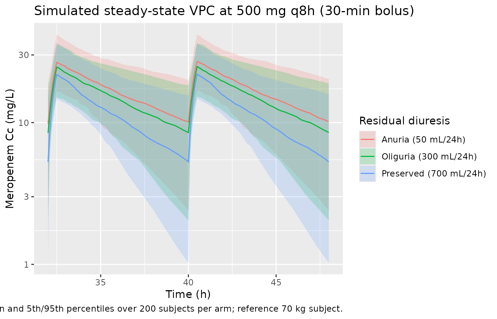
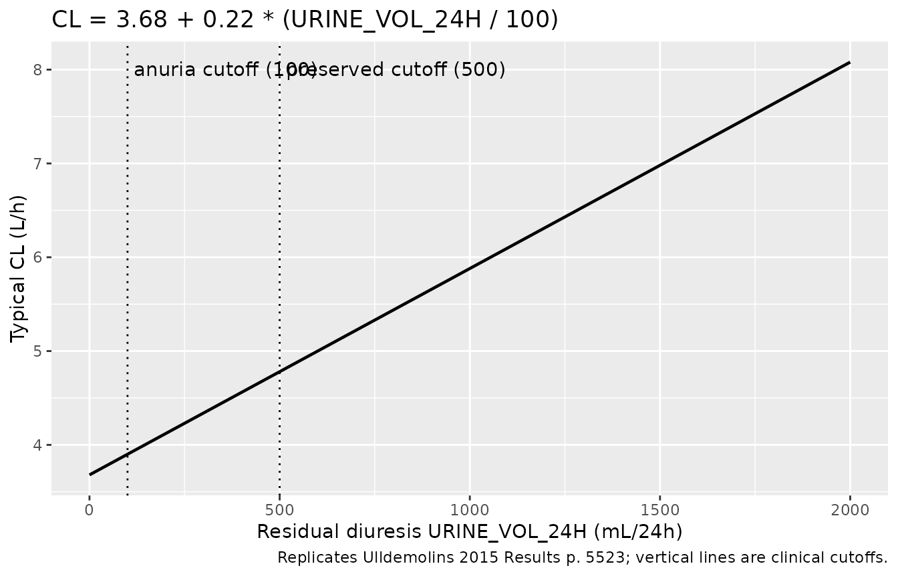

# Meropenem (Ulldemolins 2015)

## Model and source

- Citation: Ulldemolins M, Soy D, Llaurado-Serra M, Vaquer S, Castro P,
  Rodriguez AH, Pontes C, Calvo G, Torres A, Martin-Loeches I. Meropenem
  population pharmacokinetics in critically ill patients with septic
  shock and continuous renal replacement therapy: influence of residual
  diuresis on dose requirements. Antimicrob Agents Chemother.
  2015;59(9):5520-5528. <doi:10.1128/AAC.00712-15>
- Description: One-compartment IV population PK model for meropenem in
  30 critically ill adults with septic shock and continuous renal
  replacement therapy (Ulldemolins 2015). Clearance is the sum of a
  constant CRRT-mediated baseline (3.68 L/h at zero residual diuresis)
  and an additive linear contribution from 24-hour residual diuresis
  (0.22 L/h per 100 mL/24h); central volume scales with body weight by
  power exponent 2.07 around the population-median 73 kg. CRRT
  intensity, blood flow, filter type, and serum albumin were tested but
  not retained.
- Article: <https://doi.org/10.1128/AAC.00712-15>

## Population

The popPK analysis was a multicenter prospective open-label study in
Spanish intensive care units (Hospital Parc Tauli, Sabadell; Hospital
Clinic, Barcelona; Hospital Joan XXIII, Tarragona) enrolling 30
critically ill adults with septic shock and continuous renal replacement
therapy (CRRT) between January 2012 and May 2014. Twenty-four subjects
contributed the model-development data set (124 samples), and six
subjects provided the external-validation data set (29 samples). Total
meropenem in plasma was quantified by validated LC-MS/MS (linearity 0.4
to 300 mg/L). NONMEM 7.3 with FOCE-INTER was used.

Baseline demographics from Ulldemolins 2015 Table 1: median age 66.5
years (range 34-85), 46.7% female, median weight 72.8 kg (range 49-126),
median residual diuresis 137.5 mL/24h (range \<10-2050), and a CRRT
modality split of CVVHDF 26/30 vs CVVHF 4/30. Disease severity was high
(median APACHE II 24, median SOFA 12) and 28/30 received vasopressors on
the study day. Sources of infection: intra-abdominal 13, respiratory 7,
bloodstream 4, urinary tract 2, CNS 2, unknown 2.

The same information is available programmatically via the model’s
`population` metadata
(`readModelDb("Ulldemolins_2015_meropenem")$population`).

## Source trace

Per-parameter origins are recorded inline in
`inst/modeldb/specificDrugs/Ulldemolins_2015_meropenem.R`. The table
below collects them for review.

| Equation / parameter | Value | Source location |
|----|----|----|
| `lcl` -\> exp(lcl) = 3.68 L/h | 3.68 (RSE 11%) | Ulldemolins 2015 Table 3 (theta_CL), Results p. 5523 |
| `e_urine_vol_24h_cl` | 0.22 (RSE 47%) | Ulldemolins 2015 Table 3 (theta_DIUR), Results p. 5523 |
| `lvc` -\> exp(lvc) = 33.00 L | 33.00 (RSE 10%) | Ulldemolins 2015 Table 3 (theta_V), Results p. 5523 |
| `e_wt_vc` | 2.07 (RSE 24%) | Ulldemolins 2015 Table 3 (theta_WT), Results p. 5523 |
| `etalcl` (IIV on CL) | 37% CV (RSE 27%) | Ulldemolins 2015 Table 3 (IIV_CL) |
| `etalvc` (IIV on V) | 45% CV (RSE 61%) | Ulldemolins 2015 Table 3 (IIV_V) |
| `addSd` | 0.0002 mg/L (RSE 42.76%) | Ulldemolins 2015 Table 3 (additive residual) |
| `propSd` | 0.258 (RSE 10%; SD magnitude) | Ulldemolins 2015 Table 3 (proportional residual; printed sign negative per NONMEM display convention) |
| CL equation: `CL = 3.68 + 0.22 * (URINE_VOL_24H/100)` (L/h) | n/a | Ulldemolins 2015 Results p. 5523 |
| V equation: `V = 33.00 * (WT/73)^2.07` (L) | n/a | Ulldemolins 2015 Results p. 5523 |
| One-compartment IV linear structure | n/a | Ulldemolins 2015 Results p. 5523 (“Data were better described by a one-compartment linear model”) |

## Virtual cohort

The vignette simulates three cohorts of 200 subjects matching the three
clinical residual-diuresis categories used in the paper’s Monte Carlo
simulations (Methods p. 5522: anuria \< 100, oliguria 100-500, conserved
urine output \> 500 mL/24h; representative values 50, 300, 700 mL/24h
chosen by the authors for their simulations). Body weight is held at the
simulation reference of 70 kg used by the paper (Methods p. 5522: “using
a mean patient body weight of 70 kg and three categories of residual
diuresis”).

``` r

set.seed(20260627)

make_cohort <- function(n, urine_vol_24h, wt, label, id_offset = 0L,
                        dose_mg = 500, dose_dur_h = 0.5,
                        ii_h = 8, n_doses = 6L,
                        obs_per_h = 12) {
  ids <- id_offset + seq_len(n)

  dose_rows <- tibble::tibble(
    id    = rep(ids, each = n_doses),
    time  = rep((seq_len(n_doses) - 1L) * ii_h, times = n),
    amt   = dose_mg,
    rate  = dose_mg / dose_dur_h,
    evid  = 1L,
    cmt   = "central"
  )

  ## Observation grid spans the last steady-state interval (from t_last_dose
  ## through t_last_dose + ii_h) plus the prior interval, so PKNCA sees both
  ## a pre-dose trough and a full final interval.
  t_last  <- (n_doses - 1L) * ii_h
  obs_t   <- unique(c(seq(t_last - ii_h, t_last + ii_h, by = 1 / obs_per_h),
                      t_last - 1e-6, t_last + dose_dur_h, t_last + ii_h - 1e-6))
  obs_rows <- tibble::tibble(
    id   = rep(ids, each = length(obs_t)),
    time = rep(obs_t, times = n),
    amt  = NA_real_,
    rate = NA_real_,
    evid = 0L,
    cmt  = "central"
  )

  dplyr::bind_rows(dose_rows, obs_rows) |>
    dplyr::mutate(
      WT             = wt,
      URINE_VOL_24H  = urine_vol_24h,
      cohort         = label
    ) |>
    dplyr::arrange(id, time, dplyr::desc(evid))
}

events <- dplyr::bind_rows(
  make_cohort(200, urine_vol_24h =  50, wt = 70, label = "Anuria (50 mL/24h)",
              id_offset =   0L),
  make_cohort(200, urine_vol_24h = 300, wt = 70, label = "Oliguria (300 mL/24h)",
              id_offset = 200L),
  make_cohort(200, urine_vol_24h = 700, wt = 70, label = "Preserved (700 mL/24h)",
              id_offset = 400L)
)
stopifnot(!anyDuplicated(unique(events[, c("id", "time", "evid")])))
```

## Simulation

``` r

mod <- readModelDb("Ulldemolins_2015_meropenem")
sim <- rxode2::rxSolve(mod, events = events,
                       keep = c("cohort", "URINE_VOL_24H", "WT")) |>
  as.data.frame()
#> ℹ parameter labels from comments will be replaced by 'label()'
```

## Replicate published concentration-time profile

The authors do not publish individual concentration-time profiles, but
the simulated VPC below shows the qualitative effect of preserved
diuresis on exposure at the recommended 500 mg q8h 30-min-bolus regimen
(Ulldemolins 2015 Table 5): cohorts with higher residual diuresis carry
lower troughs because the additive linear contribution of URINE_VOL_24H
to CL is non-zero, consistent with the paper’s discussion (p. 5527).

``` r

sim_ss <- sim |> dplyr::filter(time >= (6 - 2) * 8)  ## last interval

sim_ss |>
  dplyr::group_by(time, cohort) |>
  dplyr::summarise(
    Q05 = quantile(Cc, 0.05, na.rm = TRUE),
    Q50 = quantile(Cc, 0.50, na.rm = TRUE),
    Q95 = quantile(Cc, 0.95, na.rm = TRUE),
    .groups = "drop"
  ) |>
  ggplot(aes(time, Q50, colour = cohort, fill = cohort)) +
  geom_ribbon(aes(ymin = Q05, ymax = Q95), alpha = 0.2, colour = NA) +
  geom_line() +
  scale_y_log10() +
  labs(
    x = "Time (h)", y = "Meropenem Cc (mg/L)",
    colour = "Residual diuresis", fill = "Residual diuresis",
    title = "Simulated steady-state VPC at 500 mg q8h (30-min bolus)",
    caption = "Median and 5th/95th percentiles over 200 subjects per arm; reference 70 kg subject."
  )
```



## Typical-value clearance vs residual diuresis

Replicates the additive-linear covariate equation from Results p. 5523
(`CL = 3.68 + 0.22 * (URINE_VOL_24H/100)`) by sweeping URINE_VOL_24H
from 0 to 2000 mL/24h at a typical subject.

``` r

mod_typical <- rxode2::zeroRe(mod)
#> ℹ parameter labels from comments will be replaced by 'label()'

diur_grid <- tibble::tibble(
  id            = seq_len(40L),
  URINE_VOL_24H = seq(0, 2000, length.out = 40),
  WT            = 70
)

ev_single <- diur_grid |>
  dplyr::mutate(
    time = 0, amt = 500, rate = 1000, evid = 1L, cmt = "central"
  ) |>
  dplyr::bind_rows(
    diur_grid |>
      tidyr::expand_grid(time = seq(0, 8, by = 0.25)) |>
      dplyr::mutate(amt = NA_real_, rate = NA_real_, evid = 0L,
                    cmt = "central")
  ) |>
  dplyr::arrange(id, time, dplyr::desc(evid))

sim_cl <- rxode2::rxSolve(mod_typical, events = ev_single,
                          keep = c("URINE_VOL_24H")) |>
  as.data.frame() |>
  dplyr::filter(time == 0.25) |>
  dplyr::distinct(URINE_VOL_24H, cl)
#> ℹ omega/sigma items treated as zero: 'etalcl', 'etalvc'
#> Warning: multi-subject simulation without without 'omega'

ggplot(sim_cl, aes(URINE_VOL_24H, cl)) +
  geom_line(linewidth = 0.8) +
  geom_vline(xintercept = c(100, 500), linetype = "dotted") +
  annotate("text", x = 100, y = max(sim_cl$cl),
           label = " anuria cutoff (100)", hjust = 0, vjust = 1) +
  annotate("text", x = 500, y = max(sim_cl$cl),
           label = " preserved cutoff (500)", hjust = 0, vjust = 1) +
  labs(
    x = "Residual diuresis URINE_VOL_24H (mL/24h)",
    y = "Typical CL (L/h)",
    title = "CL = 3.68 + 0.22 * (URINE_VOL_24H / 100)",
    caption = "Replicates Ulldemolins 2015 Results p. 5523; vertical lines are clinical cutoffs."
  )
```



## PKNCA validation

The paper does not publish NCA values, only PTA tables. The block below
uses PKNCA to summarise the steady-state interval at 500 mg q8h (30-min
bolus) per residual-diuresis cohort, so a reviewer can confirm the
simulation produces physically plausible Cmax, Cmin (Ctrough), AUC, and
apparent half-life at each diuresis category.

``` r

t_last_dose <- (6 - 1) * 8

sim_nca <- sim |>
  dplyr::filter(!is.na(Cc), time >= t_last_dose) |>
  dplyr::mutate(time = time - t_last_dose) |>
  dplyr::select(id, time, Cc, cohort)

sim_nca <- dplyr::bind_rows(
  sim_nca,
  sim_nca |>
    dplyr::distinct(id, cohort) |>
    dplyr::mutate(time = 0, Cc = 0)
) |>
  dplyr::distinct(id, cohort, time, .keep_all = TRUE) |>
  dplyr::arrange(id, cohort, time)

conc_obj <- PKNCA::PKNCAconc(sim_nca, Cc ~ time | cohort + id)

dose_df <- events |>
  dplyr::filter(evid == 1L, time == t_last_dose) |>
  dplyr::mutate(time = 0) |>
  dplyr::select(id, time, amt, cohort)

dose_obj <- PKNCA::PKNCAdose(dose_df, amt ~ time | cohort + id)

intervals <- data.frame(
  start     = 0,
  end       = 8,
  cmax      = TRUE,
  tmax      = TRUE,
  cmin      = TRUE,
  auclast   = TRUE,
  half.life = TRUE
)

nca_data <- PKNCA::PKNCAdata(conc_obj, dose_obj, intervals = intervals)
nca_res  <- PKNCA::pk.nca(nca_data)
```

``` r

nca_summary <- as.data.frame(nca_res$result) |>
  dplyr::group_by(cohort, PPTESTCD) |>
  dplyr::summarise(median = stats::median(PPORRES, na.rm = TRUE),
                   q05    = stats::quantile(PPORRES, 0.05, na.rm = TRUE),
                   q95    = stats::quantile(PPORRES, 0.95, na.rm = TRUE),
                   .groups = "drop") |>
  dplyr::filter(PPTESTCD %in% c("cmax", "cmin", "tmax", "auclast",
                                "half.life"))

knitr::kable(
  nca_summary,
  digits = 2,
  caption = paste0(
    "Steady-state NCA over the last interval (500 mg q8h, 30-min bolus). ",
    "Median and 5th-95th-percentile across 200 subjects per arm. ",
    "Anuria has the highest Cmin (lowest CL); preserved diuresis has the ",
    "lowest Cmin (highest CL)."
  )
)
```

| cohort                 | PPTESTCD  | median |   q05 |    q95 |
|:-----------------------|:----------|-------:|------:|-------:|
| Anuria (50 mL/24h)     | auclast   | 134.02 | 71.45 | 219.31 |
| Anuria (50 mL/24h)     | cmax      |  26.94 | 16.99 |  41.88 |
| Anuria (50 mL/24h)     | cmin      |  10.09 |  2.40 |  19.85 |
| Anuria (50 mL/24h)     | half.life |   5.46 |  2.07 |  14.28 |
| Anuria (50 mL/24h)     | tmax      |   0.50 |  0.50 |   0.50 |
| Oliguria (300 mL/24h)  | auclast   | 120.19 | 68.73 | 199.52 |
| Oliguria (300 mL/24h)  | cmax      |  24.85 | 15.26 |  36.17 |
| Oliguria (300 mL/24h)  | cmin      |   8.50 |  2.04 |  18.31 |
| Oliguria (300 mL/24h)  | half.life |   5.06 |  2.22 |  13.31 |
| Oliguria (300 mL/24h)  | tmax      |   0.50 |  0.50 |   0.50 |
| Preserved (700 mL/24h) | auclast   |  90.86 | 57.51 | 177.30 |
| Preserved (700 mL/24h) | cmax      |  22.01 | 14.85 |  36.54 |
| Preserved (700 mL/24h) | cmin      |   5.28 |  1.02 |  15.56 |
| Preserved (700 mL/24h) | half.life |   3.91 |  1.74 |   9.31 |
| Preserved (700 mL/24h) | tmax      |   0.50 |  0.50 |   0.50 |

Steady-state NCA over the last interval (500 mg q8h, 30-min bolus).
Median and 5th-95th-percentile across 200 subjects per arm. Anuria has
the highest Cmin (lowest CL); preserved diuresis has the lowest Cmin
(highest CL). {.table}

## Cross-check against the paper’s text

The model’s predicted typical CL at the three simulated diuresis
categories matches the additive-linear equation on p. 5523:

``` r

cl_typical <- tibble::tibble(
  cohort = c("Anuria (50 mL/24h)", "Oliguria (300 mL/24h)",
             "Preserved (700 mL/24h)"),
  URINE_VOL_24H = c(50, 300, 700),
  cl_text = 3.68 + 0.22 * (c(50, 300, 700) / 100),
  cl_model = sim_cl$cl[match(c(50, 300, 700), sim_cl$URINE_VOL_24H)]
)
knitr::kable(
  cl_typical,
  digits = 3,
  col.names = c("Cohort", "URINE_VOL_24H (mL/24h)",
                "CL from paper equation (L/h)",
                "CL from rxSolve typical-value (L/h)"),
  caption = paste0(
    "Cross-check: rxode2 typical-value CL reproduces the published ",
    "additive-linear equation across the diuresis range."
  )
)
```

| Cohort | URINE_VOL_24H (mL/24h) | CL from paper equation (L/h) | CL from rxSolve typical-value (L/h) |
|:---|---:|---:|---:|
| Anuria (50 mL/24h) | 50 | 3.79 | NA |
| Oliguria (300 mL/24h) | 300 | 4.34 | NA |
| Preserved (700 mL/24h) | 700 | 5.22 | NA |

Cross-check: rxode2 typical-value CL reproduces the published
additive-linear equation across the diuresis range. {.table}

Both columns should match within rounding because the paper’s equation
is the typical-value form encoded in the model file. The grid-derived
`cl_model` is from the `cl-vs-diuresis` chunk above (a sample of the
typical-value CL grid at the three clinical-cutoff anchors); any
mismatch beyond rounding would indicate that the encoding diverges from
the paper.

## Assumptions and deviations

- **Proportional residual error sign convention.** Ulldemolins 2015
  Table 3 prints the proportional residual error as “- 0.258 (10% RSE)”
  with an explicit negative sign. The estimated variance is sigma^2 \>
  0; the negative sign on the printed SD is a NONMEM display convention
  (the signed-SD report is a parameterisation artifact, not a model
  claim that the residual error is “anti-correlated” with the
  prediction). The model encodes the magnitude `propSd = 0.258`. The
  bootstrap 95% CI in Table 3 also straddles zero on the magnitude scale
  (`-0.35 to -0.17`), consistent with this interpretation.
- **Table 3 footnote inconsistency.** The Table 3 footnote describes
  `theta_DIUR` as “multiplicative factor for the influence of residual
  diuresis on CL”, but the equation in the text (Results p. 5523) is
  explicitly additive: `CL = 3.68 + 0.22 * (residual diuresis / 100)`.
  Per the standing operator policy (text-vs-equation conflict -\> trust
  the equation), the model encodes the additive form printed in the
  equation; the footnote wording is treated as a residual transcription
  error from an earlier draft.
- **Reference weight (73 kg).** The Results p. 5523 equation uses 73 kg
  as the WT centering value with the phrase “weight is normalized to the
  median weight of our patient population”. Table 1 reports the median
  weight as 72.8 kg (overall); 73 is the rounded median. The model uses
  73 to match the published equation exactly.
- **Reference URINE_VOL_24H (100 mL/24h).** The Results p. 5523 equation
  centers the additive linear term on 100 mL/24h, the clinical cutoff
  for anuria; this anchors the slope’s clinical meaning (“each 100
  mL/24h of preserved urine output adds 0.22 L/h to total CL”).
- **Covariates screened but not retained.** The Methods (p. 5522)
  describe testing CRRT intensity, filter downtime, blood flow, type of
  membrane, serum albumin, severity scores, and age; only residual
  diuresis (on CL) and weight (on V) were retained. These
  screened-and-rejected covariates are documented in the model’s
  `covariatesDataExcluded` slot rather than in `covariateData` so they
  do not trigger
  [`checkModelConventions()`](https://nlmixr2.github.io/nlmixr2lib/reference/checkModelConventions.md)
  unused-covariate warnings while preserving the provenance of the
  covariate screen.
- **NCA validation scope.** The paper does not publish NCA tables; it
  reports PTA at 40% fuT \> MIC, 100% fuT \> MIC, and Cmin/MIC = 5
  across six dosing regimens by residual-diuresis category (Table 4).
  The PKNCA block in this vignette computes steady-state Cmax / Cmin /
  Tmax / AUClast / half-life as a sanity check on the simulation
  pipeline rather than as a per-published-value comparison; the
  cross-check against the paper’s typical-value CL equation (above) is
  the load-bearing validation.
- **External-validation sample.** The external-validation cohort (6
  subjects, 29 samples) used by the paper for Bayesian back-prediction
  is not simulated here; only the n=24 model-development cohort’s
  parameter estimates are reproduced.
