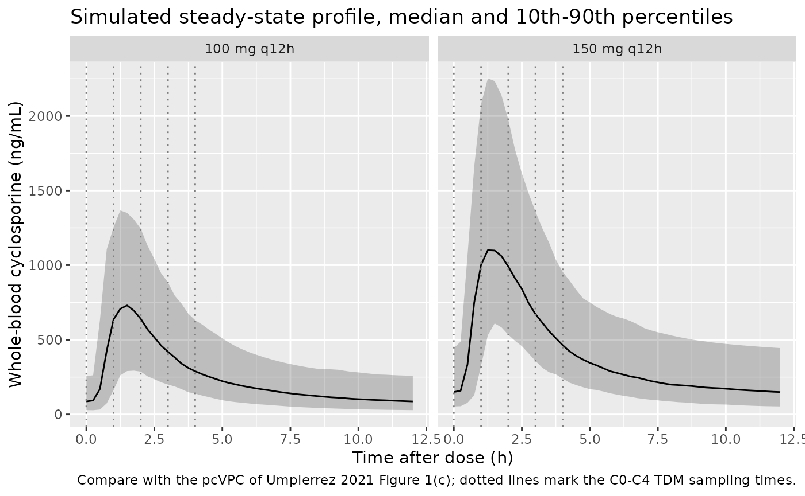
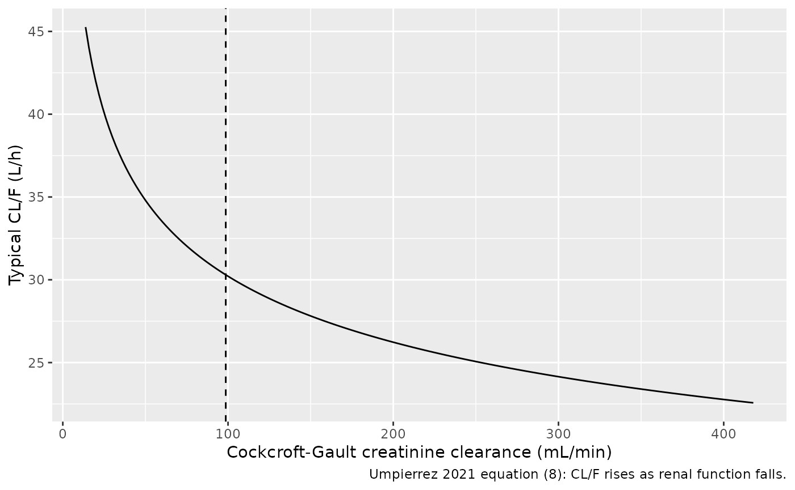

# Cyclosporine (Umpierrez 2021)

## Model and source

- Citation: Umpierrez M, Guevara N, Ibarra M, Fagiolino P, Vazquez M,
  Maldonado C. Development of a population pharmacokinetic model for
  cyclosporine from therapeutic drug monitoring data. Biomed Res Int.
  2021;2021:3108749. <doi:10.1155/2021/3108749>. Parameter estimates are
  Umpierrez 2021 Table 2; the variability and residual-error forms are
  Methods equations (1)-(3) and the creatinine clearance relationship is
  Results equation (8).
- Description: Two-compartment oral population PK model with lagged
  first-order absorption for whole-blood cyclosporine in Uruguayan
  transplant and autoimmune-disease patients monitored at steady state,
  with a power effect of Cockcroft-Gault creatinine clearance on CL/F,
  between-subject variability on CL/F and Q/F, and correlated
  inter-occasion variability on Ka and CL/F plus inter-occasion
  variability on the lag time (Umpierrez 2021)
- Article: [Biomed Res Int.
  2021;2021:3108749](https://doi.org/10.1155/2021/3108749) (open access)

Umpierrez et al. built a population PK model of whole-blood cyclosporine
from routine therapeutic drug monitoring (TDM) in Montevideo, Uruguay,
for use in Bayesian dose individualisation. Every observation is a
steady-state concentration drawn at 0, 1, 2, 3 or 4 h after an oral
dose. The final model is a two-compartment disposition model with lagged
first-order absorption; the only retained covariate is Cockcroft-Gault
creatinine clearance, which enters CL/F as a power function with a
negative exponent. Variability is split between subjects (CL/F, Q/F) and
between monitoring occasions (Ka, CL/F and the lag time, with Ka and
CL/F correlated at the occasion level).

## Population

The model-building cohort (Group A, Umpierrez 2021 Table 1) comprised 37
patients (16 male, 21 female) with at least one four-sample steady-state
profile, contributing 621 whole-blood concentrations. Mean (SD) age was
34.4 (15.85) years and body weight 64.3 (11.0) kg. Mean serum creatinine
was 1.11 mg/dL (range 0.2-5.9) and mean Cockcroft-Gault creatinine
clearance 98.62 mL/min (range 13.79-417.92). Indications were kidney
transplantation (14), kidney autoimmune disease (21), liver autoimmune
disease (1) and bone-marrow transplantation (1). Concentrations were
measured by chemiluminescent microparticle immunoassay (LLOQ 12.5
ng/mL). A second cohort (Group B, 16 patients, 81 concentrations) was
used only for a prospective evaluation of Bayesian forecasting across
three occasions. Doses were not reported.

The same information is available programmatically via
`readModelDb("Umpierrez_2021_cyclosporine")()$population`.

## Source trace

The per-parameter origin is recorded as an in-file comment next to each
`ini()` entry in
`inst/modeldb/specificDrugs/Umpierrez_2021_cyclosporine.R`. The table
below collects them in one place for review.

| Equation / parameter | Value | Source location |
|----|----|----|
| `ltlag` (Tlag) | log(0.512 h) | Table 2 |
| `lka` (Ka) | log(0.523 1/h) | Table 2 |
| `lcl` (CL/F) | log(30.3 L/h) | Table 2 |
| `lq` (Q/F) | log(17.0 L/h) | Table 2 |
| `lvc` (V1) | log(17.9 L) | Table 2 |
| `lvp` (V2) | log(400 L) | Table 2 |
| `e_crcl_cl` | -0.204 | Table 2 row ‘beta CL-CLCr’; Results equation (8) |
| CRCL reference 98.62 mL/min | n/a | Table 1 (Group A mean); Results text below equation (8) |
| `etalcl` | 0.14704 = log(1 + 0.398^2) | Table 2 ‘IIV Cl (%)’ = 39.8; Methods equation (2) |
| `etalq` | 0.24922 = log(1 + 0.532^2) | Table 2 ‘IIV Q (%)’ = 53.2; Methods equation (2) |
| `etaiov_lcl_k` | 0.13488 = log(1 + 0.380^2) | Table 2 ‘IOV Cl (%)’ = 38.0 |
| `etaiov_lka_k` | 0.24426 = log(1 + 0.526^2) | Table 2 ‘IOV ka (%)’ = 52.6 |
| cov(`etaiov_lka_k`, `etaiov_lcl_k`) | -0.10001 | Table 2 ‘Ka-Cl’ correlation = -0.551 |
| `etaiov_ltlag_k` | 0.25672 = log(1 + 0.541^2) | Table 2 ‘IOV tlag (%)’ = 54.1 |
| `propSd` | 0.228 | Table 2 ‘Prop’ |
| `addSd` | 7.52 ng/mL | Table 2 ‘Add (ng/mL)’ |
| Exponential random effects | n/a | Methods equation (1) |
| Combined error `Y = C (1 + e_prop) + e_add` | n/a | Methods equation (3) |
| `cl = CLpop * (CRCL / 98.62)^beta` | n/a | Results equation (8) |
| Two-compartment ODEs with lagged first-order absorption | n/a | Results paragraph 2 and Table 2 |

## Virtual cohort

Original observed data are not publicly available. The virtual cohort
below reproduces the Group A creatinine-clearance distribution
approximately: a log-normal draw centred near the cohort mean, redrawn
(not clamped) until every value falls inside the observed range
13.79-417.92 mL/min. Because the paper does not report doses, two common
oral maintenance regimens are simulated, 100 mg and 150 mg every 12 h.

Each virtual patient is monitored on three occasions, mirroring the
three occasions of the paper’s prospective evaluation (Figure 2). The
occasion-level random effects hold for a whole occasion, so each
occasion is simulated as its own long run of doses every 12 h and
sampled over its final dosing interval. Steady state is reached by
repeated dosing rather than with an `ss = 1` dose: the peripheral volume
is 400 L, so the terminal half-life is long (median about 27 h, about 67
h at the 99th percentile of the between-subject and between-occasion
variability on Q/F and CL/F), and a steady-state dose stopped short of
true steady state for a few simulated patients with low Q/F. Each
occasion is 1512 h long (126 dosing intervals, more than 15 terminal
half-lives even at the 99.9th percentile, about 90 h) and the next
occasion’s `OCC` value is switched on by an `evid = 2` record between
the last sample of one occasion and the first dose of the next.

``` r

set.seed(20210409)
rxode2::rxSetSeed(20210409)

n_per_arm <- 100L
n_occ <- 3L
tau <- 12 # h
occ_len <- 126 * tau # h per occasion
n_dose <- 125L # doses per occasion; the last one opens the sampled interval
occ_start <- (seq_len(n_occ) - 1) * occ_len
obs_start <- occ_start + (n_dose - 1) * tau # time of the sampled (last) dose
obs_tad <- sort(unique(c(seq(0, tau, by = 0.25), 1, 2, 3, 4)))

draw_crcl <- function(n) {
  out <- numeric(0)
  while (length(out) < n) {
    x <- exp(rnorm(n, log(85), 0.5))
    out <- c(out, x[x >= 13.79 & x <= 417.92])
  }
  out[seq_len(n)]
}

make_occasion <- function(k, dose) {
  # Occasion 1 starts the record, so it needs no switch row.
  switch_row <- if (k > 1L) {
    tibble(time = occ_start[k] - tau / 2, evid = 2L, amt = 0, addl = 0L, ii = 0, cmt = "central")
  }
  dose_row <- tibble(
    time = occ_start[k], evid = 1L, amt = dose,
    addl = n_dose - 1L, ii = tau, cmt = "depot"
  )
  obs_rows <- tibble(time = obs_start[k] + obs_tad, evid = 0L, amt = 0, addl = 0L, ii = 0, cmt = "central")
  bind_rows(switch_row, dose_row, obs_rows) |> mutate(OCC = k)
}

make_cohort <- function(n, dose, id_offset = 0L) {
  subj <- tibble(id = id_offset + seq_len(n), CRCL = draw_crcl(n))
  per_occ <- bind_rows(lapply(seq_len(n_occ), make_occasion, dose = dose))
  tidyr::crossing(subj, per_occ) |>
    mutate(treatment = paste(dose, "mg q12h")) |>
    arrange(id, time, desc(evid))
}

events <- bind_rows(
  make_cohort(n_per_arm, 100, id_offset = 0L),
  make_cohort(n_per_arm, 150, id_offset = n_per_arm)
)
stopifnot(!anyDuplicated(unique(events[, c("id", "time", "evid")])))

summary(distinct(events, id, CRCL)$CRCL)
#>    Min. 1st Qu.  Median    Mean 3rd Qu.    Max. 
#>   23.25   56.64   85.82   93.72  115.20  343.50
```

## Simulation

``` r

mod <- readModelDb("Umpierrez_2021_cyclosporine")
sim <- rxode2::rxSolve(
  mod,
  events = events,
  keep = c("treatment", "OCC", "CRCL"),
  returnType = "data.frame"
) |>
  mutate(tad = time - obs_start[OCC]) |>
  # keep the sampled interval only (rxSolve also returns the evid = 2 rows)
  filter(tad >= 0, tad <= tau)
#> ℹ parameter labels from comments will be replaced by 'label()'
#> Warning: some etas defaulted to non-mu referenced, possible parsing error: etaiov_lka_1, etaiov_lcl_1, etaiov_lka_2, etaiov_lcl_2, etaiov_lka_3, etaiov_lcl_3, etaiov_lka_4, etaiov_lcl_4, etaiov_ltlag_1, etaiov_ltlag_2, etaiov_ltlag_3, etaiov_ltlag_4
#> as a work-around try putting the mu-referenced expression on a simple line
```

Steady state is confirmed per simulated patient and occasion: the trough
at the start of the sampled interval equals the trough at its end.

``` r

ss_chk <- sim |>
  filter(tad %in% c(0, tau)) |>
  group_by(id, OCC) |>
  summarise(ratio = Cc[tad == tau] / Cc[tad == 0], .groups = "drop")
stopifnot(nrow(ss_chk) == 2L * n_per_arm * n_occ)
summary(ss_chk$ratio)
#>    Min. 1st Qu.  Median    Mean 3rd Qu.    Max. 
#>       1       1       1       1       1       1
stopifnot(
  abs(median(ss_chk$ratio) - 1) < 1e-3,
  quantile(abs(ss_chk$ratio - 1), 0.9) < 0.01
)
```

A typical-value solve (all random effects zero) at the reference
creatinine clearance gives the deterministic profile used for the exact
exposure check below.

``` r

mod_typical <- rxode2::zeroRe(mod)
#> ℹ parameter labels from comments will be replaced by 'label()'
#> Warning: some etas defaulted to non-mu referenced, possible parsing error: etaiov_lka_1, etaiov_lcl_1, etaiov_lka_2, etaiov_lcl_2, etaiov_lka_3, etaiov_lcl_3, etaiov_lka_4, etaiov_lcl_4, etaiov_ltlag_1, etaiov_ltlag_2, etaiov_ltlag_3, etaiov_ltlag_4
#> as a work-around try putting the mu-referenced expression on a simple line
#> Warning: some etas defaulted to non-mu referenced, possible parsing error: etaiov_lka_1, etaiov_lcl_1, etaiov_lka_2, etaiov_lcl_2, etaiov_lka_3, etaiov_lcl_3, etaiov_lka_4, etaiov_lcl_4, etaiov_ltlag_1, etaiov_ltlag_2, etaiov_ltlag_3, etaiov_ltlag_4
#> as a work-around try putting the mu-referenced expression on a simple line
ev_typ <- events |>
  filter(id %in% c(1L, n_per_arm + 1L), OCC == 1L) |>
  mutate(CRCL = 98.62)
sim_typ <- rxode2::rxSolve(
  mod_typical,
  events = ev_typ,
  keep = c("treatment", "OCC"),
  returnType = "data.frame"
) |>
  mutate(tad = time - obs_start[1]) |>
  filter(tad >= 0)
#> ℹ omega/sigma items treated as zero: 'etalcl', 'etalq', 'etaiov_lka_1', 'etaiov_lcl_1', 'etaiov_lka_2', 'etaiov_lcl_2', 'etaiov_lka_3', 'etaiov_lcl_3', 'etaiov_lka_4', 'etaiov_lcl_4', 'etaiov_ltlag_1', 'etaiov_ltlag_2', 'etaiov_ltlag_3', 'etaiov_ltlag_4'
#> Warning: multi-subject simulation without without 'omega'
```

## Replicate published figures

### Steady-state profile over the monitoring window (Figure 1)

Umpierrez 2021 Figure 1(c) is a prediction-corrected VPC of the 0-4 h
steady-state TDM samples; Figure 1(a) shows the observed concentrations
spanning 0 to about 2500 ng/mL, most of them below 1000 ng/mL. The
observed data and the patients’ doses cannot be reproduced, but the
simulated percentiles below show the shape and spread of the
steady-state profile the model implies for two plausible regimens,
including the full 12-h interval.

``` r

sim |>
  filter(!is.na(Cc)) |>
  group_by(treatment, tad) |>
  summarise(
    Q10 = quantile(Cc, 0.10),
    Q50 = quantile(Cc, 0.50),
    Q90 = quantile(Cc, 0.90),
    .groups = "drop"
  ) |>
  ggplot(aes(tad, Q50)) +
  geom_ribbon(aes(ymin = Q10, ymax = Q90), alpha = 0.25) +
  geom_line() +
  geom_vline(xintercept = c(0, 1, 2, 3, 4), linetype = "dotted", colour = "grey50") +
  facet_wrap(~treatment) +
  labs(
    x = "Time after dose (h)",
    y = "Whole-blood cyclosporine (ng/mL)",
    title = "Simulated steady-state profile, median and 10th-90th percentiles",
    caption = "Compare with the pcVPC of Umpierrez 2021 Figure 1(c); dotted lines mark the C0-C4 TDM sampling times."
  )
```



### Creatinine clearance effect on CL/F (equation 8)

``` r

crcl_grid <- tibble(CRCL = seq(13.79, 417.92, length.out = 200)) |>
  mutate(cl = 30.3 * (CRCL / 98.62)^(-0.204))
ggplot(crcl_grid, aes(CRCL, cl)) +
  geom_line() +
  geom_vline(xintercept = 98.62, linetype = "dashed") +
  labs(
    x = "Cockcroft-Gault creatinine clearance (mL/min)",
    y = "Typical CL/F (L/h)",
    caption = "Umpierrez 2021 equation (8): CL/F rises as renal function falls."
  )
```



The model’s own `cl` output reproduces equation (8) for every simulated
subject once the random effects are removed:

``` r

typ_cl <- rxode2::rxSolve(
  mod_typical,
  events = events |> filter(OCC == 1L),
  keep = "CRCL",
  returnType = "data.frame"
) |>
  distinct(id, CRCL, cl)
#> ℹ omega/sigma items treated as zero: 'etalcl', 'etalq', 'etaiov_lka_1', 'etaiov_lcl_1', 'etaiov_lka_2', 'etaiov_lcl_2', 'etaiov_lka_3', 'etaiov_lcl_3', 'etaiov_lka_4', 'etaiov_lcl_4', 'etaiov_ltlag_1', 'etaiov_ltlag_2', 'etaiov_ltlag_3', 'etaiov_ltlag_4'
#> Warning: multi-subject simulation without without 'omega'
stopifnot(
  nrow(typ_cl) == 2L * n_per_arm,
  all(abs(typ_cl$cl / (30.3 * (typ_cl$CRCL / 98.62)^(-0.204)) - 1) < 1e-8)
)
```

### Inter-occasion variability

Across the three occasions, each virtual patient’s clearance varies
around their own subject-level value. The between-occasion differences
in log(CL/F) and log(Ka) have variance twice the occasion-level
variance, and their correlation equals the Table 2 Ka-Cl correlation
(-0.551).

``` r

occ_par <- sim |>
  distinct(id, OCC, cl, ka) |>
  arrange(id, OCC) |>
  group_by(id) |>
  summarise(
    d_lcl = diff(log(cl))[1],
    d_lka = diff(log(ka))[1],
    .groups = "drop"
  )
iov_summary <- tibble(
  quantity = c("var(d log CL/F) / 2", "var(d log Ka) / 2", "cor(d log Ka, d log CL/F)"),
  simulated = c(var(occ_par$d_lcl) / 2, var(occ_par$d_lka) / 2, cor(occ_par$d_lka, occ_par$d_lcl)),
  model = c(0.13488, 0.24426, -0.551)
)
knitr::kable(iov_summary, digits = 3)
```

| quantity                  | simulated |  model |
|:--------------------------|----------:|-------:|
| var(d log CL/F) / 2       |     0.128 |  0.135 |
| var(d log Ka) / 2         |     0.227 |  0.244 |
| cor(d log Ka, d log CL/F) |    -0.558 | -0.551 |

``` r

# 200 pairs: the SE of a variance estimate is about 10% of its value and the SE
# of the correlation about 0.05, so these bounds sit at several SEs.
stopifnot(
  abs(iov_summary$simulated[1] / iov_summary$model[1] - 1) < 0.35,
  abs(iov_summary$simulated[2] / iov_summary$model[2] - 1) < 0.35,
  iov_summary$simulated[3] < -0.3
)
```

## PKNCA validation

The paper reports no NCA results. The check below is therefore an
internal consistency check: at steady state the AUC over one dosing
interval must equal Dose / CL for every subject and occasion, because
all parameters are apparent (bioavailability is absorbed into CL/F).

``` r

sim_nca <- sim |>
  filter(!is.na(Cc)) |>
  mutate(treatment_occ = paste(treatment, "occasion", OCC)) |>
  select(id, tad, Cc, treatment_occ)

conc_obj <- PKNCA::PKNCAconc(sim_nca, Cc ~ tad | treatment_occ + id)
# the sampled (last) dose of each occasion, at tad = 0
dose_df <- events |>
  filter(evid == 1L) |>
  mutate(tad = 0, treatment_occ = paste(treatment, "occasion", OCC)) |>
  select(id, tad, amt, treatment_occ)
dose_obj <- PKNCA::PKNCAdose(dose_df, amt ~ tad | treatment_occ + id)

intervals <- data.frame(
  start = 0, end = 12,
  auclast = TRUE, cmax = TRUE, tmax = TRUE, cmin = TRUE
)
nca_res <- PKNCA::pk.nca(PKNCA::PKNCAdata(conc_obj, dose_obj, intervals = intervals))

nca_wide <- as.data.frame(nca_res$result) |>
  select(treatment_occ, id, PPTESTCD, PPORRES) |>
  tidyr::pivot_wider(names_from = PPTESTCD, values_from = PPORRES)

nca_wide |>
  mutate(treatment = sub(" occasion.*", "", treatment_occ)) |>
  group_by(treatment) |>
  summarise(
    across(c(cmax, tmax, cmin, auclast), ~ signif(median(.x), 3)),
    .groups = "drop"
  ) |>
  rename(
    "Regimen" = treatment,
    "Cmax (ng/mL)" = cmax,
    "Tmax (h)" = tmax,
    "Cmin (ng/mL)" = cmin,
    "AUC0-12,ss (ng*h/mL)" = auclast
  ) |>
  knitr::kable(caption = "Median steady-state NCA over all subjects and occasions (simulated).")
```

| Regimen     | Cmax (ng/mL) | Tmax (h) | Cmin (ng/mL) | AUC0-12,ss (ng\*h/mL) |
|:------------|-------------:|---------:|-------------:|----------------------:|
| 100 mg q12h |          788 |     1.25 |         84.7 |                  3020 |
| 150 mg q12h |         1250 |     1.25 |        149.0 |                  4900 |

Median steady-state NCA over all subjects and occasions (simulated).
{.table}

``` r

cl_occ <- sim |>
  distinct(id, OCC, cl, treatment) |>
  mutate(treatment_occ = paste(treatment, "occasion", OCC))
dose_occ <- dose_df |> distinct(id, treatment_occ, amt)
auc_chk <- nca_wide |>
  left_join(cl_occ, by = c("id", "treatment_occ")) |>
  left_join(dose_occ, by = c("id", "treatment_occ")) |>
  mutate(expected = 1000 * amt / cl, pct_diff = 100 * (auclast / expected - 1))
stopifnot(nrow(auc_chk) == 2L * n_per_arm * n_occ)
# Both sides use the same drawn parameters; the only difference is trapezoidal
# error on the 0.25-h grid around the absorption peak.
stopifnot(
  abs(median(auc_chk$pct_diff)) < 2,
  quantile(abs(auc_chk$pct_diff), 0.9) < 5
)
summary(auc_chk$pct_diff)
#>       Min.    1st Qu.     Median       Mean    3rd Qu.       Max. 
#> -1.954e+00 -1.840e-01  8.010e-06 -5.700e-02  1.156e-01  6.796e-01

# Deterministic typical-value check at the reference CRCL.
typ_auc <- sim_typ |>
  filter(!is.na(Cc)) |>
  group_by(treatment) |>
  summarise(
    auc = sum(diff(tad) * (head(Cc, -1) + tail(Cc, -1)) / 2),
    c_start = Cc[tad == 0],
    c_end = Cc[tad == tau],
    .groups = "drop"
  ) |>
  mutate(dose = c(100, 150), expected = 1000 * dose / 30.3)
knitr::kable(typ_auc, digits = 1)
```

| treatment   |    auc | c_start | c_end | dose | expected |
|:------------|-------:|--------:|------:|-----:|---------:|
| 100 mg q12h | 3288.9 |    94.6 |  94.6 |  100 |   3300.3 |
| 150 mg q12h | 4933.4 |   141.9 | 141.9 |  150 |   4950.5 |

``` r

stopifnot(
  all(abs(typ_auc$auc / typ_auc$expected - 1) < 0.01),
  # steady state: the trough at the start of the interval equals the trough at its end
  all(abs(typ_auc$c_end / typ_auc$c_start - 1) < 1e-3)
)
```

## Assumptions and deviations

- **Doses.** Umpierrez 2021 does not report the doses in either cohort.
  The 100 mg and 150 mg every-12-h regimens are illustrative maintenance
  doses chosen by the maintainers; they are not from the paper.
- **Dose and concentration units.** The paper reports volumes in L and
  concentrations in ng/mL but not the dose unit. Doses are taken as mg
  and the observation is `Cc = 1000 * central / vc` (ng/mL). With CL/F =
  30.3 L/h a 150 mg q12h regimen gives an average steady-state
  concentration of about 410 ng/mL, in the range of the observed
  concentrations in Figure 1.
- **Variance scale.** Table 2 prints IIV and IOV as CV%, which Methods
  equation
  2.  defines as `CV = 100 * sqrt(exp(omega^2) - 1)`; the model uses
      `omega^2 = log(1 + CV^2)`.
- **Level of the Ka-Cl correlation.** Table 2 prints a single Ka-Cl
  correlation (-0.551). Ka carries no between-subject variability in the
  final model, only inter-occasion variability, and Monolix correlates
  random effects only within one variability level, so the correlation
  is placed between the occasion-level random effects of Ka and CL/F.
- **Number of occasions.** The paper does not state how many occasions
  the model-building patients contributed. The model carries four
  occasion slots (`OCC` = 1 to 4) sharing the Table 2 magnitudes; the
  slots are exchangeable, so a longer monitoring history can reuse them
  cyclically. `OCC = 0` switches inter-occasion variability off.
- **Proportional error.** The Table 2 row is headed ‘Prop (%)’ but
  prints 0.228; this is read as the fraction 0.228 (22.8%), since 0.228%
  would be a residual error far below the assay’s own imprecision
  (0.56-4.1% CV).
- **Combined residual error.** Methods equation (3) adds independent
  proportional and additive errors, i.e. their variances sum, which is
  the nlmixr2 `add() + prop()` default (combined2).
- **Creatinine clearance cohort.** The virtual creatinine clearances are
  a log-normal draw (median 85 mL/min, log-SD 0.5) redrawn into the
  observed Group A range; the paper reports only the mean and range.
- **Covariates screened but not retained** (age, sex, body weight,
  comedication, reason of treatment) are documented in the model’s
  `covariatesDataExcluded` metadata where a canonical column exists;
  they do not enter the model.
- No erratum or correction notice for this article was found on the
  publisher’s page or in Europe PMC as of 2026-09-28.
