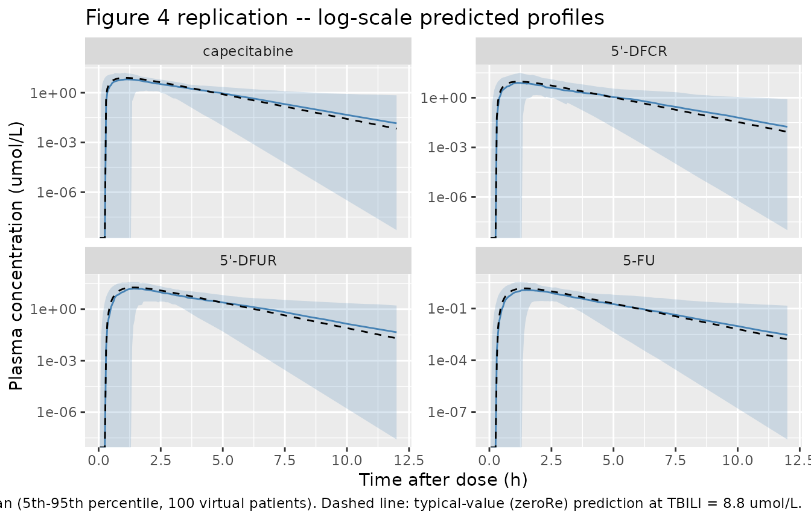
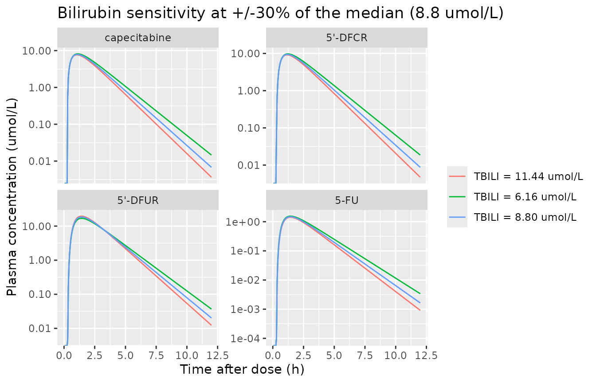

# Capecitabine (Urien 2005)

## Model and source

- Citation: Urien S, Rezai K, Lokiec F. Pharmacokinetic modelling of
  5-FU production from capecitabine – a population study in 40 adult
  patients with metastatic cancer. *J Pharmacokinet Pharmacodyn.*
  2005;32(5-6):817-833.
- Article: <https://doi.org/10.1007/s10928-005-0018-2>

The model describes capecitabine and the three sequential metabolites in
the 5-FU production pathway – 5’-DFCR (5’-deoxy-5-fluorocytidine) -\>
5’-DFUR (5’-deoxy-5-fluorouridine) -\> 5-FU (5-fluorouracil) – following
oral capecitabine administration. The structure is a four-compartment
chain (Figure 2 of Urien 2005, Appendix A equations A.1-A.4).
Capecitabine has a real apparent volume V1/F (338 L); each metabolite
has its apparent volume fixed to 1 L (not identifiable from the data),
so the metabolite-to-metabolite fluxes are described directly by
first-order rate constants K23, K34, K40 (paper notation).

## Population

The model was fit to 1426 plasma concentrations (373 capecitabine, 354
5’-DFCR, 363 5’-DFUR, 336 5-FU) from 40 adult patients (25 male, 15
female) with metastatic cancer enrolled in two phase I studies at Centre
Rene Huguenin, Saint-Cloud, France. Capecitabine 1400-2300 mg/m^2/day
(median 2000) was administered orally every 12 hours within 30 minutes
of breakfast or dinner; 75 PK courses (most patients had two PK days,
days 1 and 15) contributed to the dataset. Patients received
capecitabine in combination with either irinotecan (200-250 mg/m^2 IV
over 90 min on day 1) or irofulven (0.4 mg/kg IV over 30 min on day 1),
depending on the specific phase I study.

Baseline demographics from Table I: age 30-73 years (median 54.5), body
weight 41.5-95 kg (median 68), height 150-178 cm (median 169), body
surface area 1.40-2.10 m^2 (median 1.80), serum albumin 30-46 g/L
(median 37), serum creatinine 58-113 umol/L (median 85), and total
bilirubin 3-22 umol/L (median 8.8). The same information is available
programmatically via
`readModelDb("Urien_2005_capecitabine")$population`.

## Source trace

The per-parameter origin is recorded as an in-file comment next to each
`ini()` entry in `inst/modeldb/specificDrugs/Urien_2005_capecitabine.R`.
The table below collects them in one place.

| Equation / parameter | Value | Source location |
|----|----|----|
| `lka` | log(2.07 1/h) | Table II row Ka (mean 2.07) |
| `llag` | log(0.28 h) | Table II row TLAG (mean 0.28) |
| `lvc` | log(338 L) | Table II row V1 (mean 338) |
| `lcl` | log(218 L/h) | Table II row TV.CL10 (mean 218); page 826 covariate eqn |
| `e_tbili_cl` | +0.32 | Table II row “BILT effect on CL10” (mean +0.32); page 826 |
| `lcl_dfcr` | log(12.9 L/h) | Table II row CL12 (mean 12.9) |
| `lvc_dfcr` / `lvc_dfur` / `lvc_5fu` | log(1 L) FIXED | Page 820 (“metabolite distribution volumes are not identifiable and fixed to 1”) |
| `lk_dfur_form` | log(10.7 1/h) | Table II row K23 (mean 10.7) |
| `lk_5fu_form` | log(5.30 1/h) | Table II row K34 (mean 5.30); see Errata for 5.30 vs 5.70 |
| `e_tbili_k_5fu_form` | -0.36 | Table II row “BILT effect on K34” (mean -0.36); page 826 |
| `lkel_5fu` | log(66 1/h) | Table II row K40 (mean 66) |
| `etallag` | omega^2 = 0.793 | Table II row “ISV TLAG %” (110% -\> log(1+1.10^2)) |
| `etalvc` | omega^2 = 1.047 | Table II row “ISV V1 %” (136% -\> log(1+1.36^2)) |
| `etalcl` | omega^2 = 0.0319 | Table II row “ISV CL10 %” (18% -\> log(1+0.18^2)) |
| `etalk_dfur_form` | omega^2 = 0.223 | Table II row “ISV K23 %” (50% -\> log(1+0.50^2)) |
| `etalk_5fu_form` | omega^2 = 0.0606 | Table II row “ISV K34 %” (25% -\> log(1+0.25^2)) |
| `etalkel_5fu` | omega^2 = 0.109 | Table II row “ISV K40 %” (34% -\> log(1+0.34^2)) |
| `addSd` | 3.83 umol/L | Table II row “Res. variability CAP umol” |
| `addSd_dfcr` | 3.72 umol/L | Table II row “Res. variability 5’-DFCR umol” |
| `addSd_dfur` | 5.81 umol/L | Table II row “Res. variability 5’-DFUR umol” |
| `addSd_5fu` | 0.64 umol/L | Table II row “Res. variability 5-FU umol” |
| `d/dt(depot)` | -ka \* depot | rxode2 explicit form of the analytical Ka \* D input (Appendix A) |
| `d/dt(central)` | ka*depot - (kel + kform_dfcr)*central | Appendix A eq A.1 (with X1 = central) |
| `d/dt(central_dfcr)` | kform_dfcr*central - kform_dfur*central_dfcr | Appendix A eq A.2 |
| `d/dt(central_dfur)` | kform_dfur*central_dfcr - kform_5fu*central_dfur | Appendix A eq A.3 |
| `d/dt(central_5fu)` | kform_5fu*central_dfur - kel_5fu*central_5fu | Appendix A eq A.4 |

## Virtual cohort

Original observed data are not publicly available. The cohort below uses
100 virtual patients whose body weight, body surface area, and total
bilirubin distributions match the Table I demographics (pooled
male/female; the paper does not report covariate effects on weight or
BSA, only on TBILI). Each patient receives a single oral capecitabine
dose of 4596 umol – the normalisation dose used in Figure 4 of Urien
2005, equivalent to ~1650 mg (capecitabine MW 359.35 g/mol).

``` r

set.seed(20051209)
n_subj <- 100L

# Sample baseline covariates from log-normal-ish distributions whose median
# / range bracket Table I. TBILI is the only structurally relevant covariate
# in the model; WT and BSA are carried for documentation / NCA labelling
# only.
subj <- tibble::tibble(
  id    = seq_len(n_subj),
  WT    = round(rlnorm(n_subj, meanlog = log(68),  sdlog = 0.18), 1),
  BSA   = round(rlnorm(n_subj, meanlog = log(1.80), sdlog = 0.10), 2),
  TBILI = pmin(pmax(round(rlnorm(n_subj, meanlog = log(8.8), sdlog = 0.45), 1), 3), 22)
)

dose_amt <- 4596 # umol -- single oral dose, matches Figure 4 caption

obs_times <- seq(0.05, 12, by = 0.05)

# Build the event table with rxode2::et(): one dose row at t=0 into the
# `depot` compartment, then one observation row per element of obs_times
# with cmt = "Cc". The cmt = "Cc" placeholder triggers rxSolve to compute
# every output variable in the model (Cc, Cc_dfcr, Cc_dfur, Cc_5fu) at
# each sampled time -- the named output is irrelevant for downstream
# plotting because the simulation result carries all output columns.
make_one_subject <- function(row) {
  ev <- rxode2::et(amt = dose_amt, cmt = "depot", time = 0)
  ev <- rxode2::et(ev, time = obs_times, cmt = "Cc")
  ev <- as.data.frame(ev)
  ev$id    <- row$id
  ev$WT    <- row$WT
  ev$BSA   <- row$BSA
  ev$TBILI <- row$TBILI
  ev
}

events <- do.call(
  rbind,
  lapply(seq_len(nrow(subj)), function(i) make_one_subject(subj[i, ]))
)
stopifnot(!anyDuplicated(unique(events[, c("id", "time", "evid")])))
```

## Simulation

``` r

mod <- readModelDb("Urien_2005_capecitabine")

sim <- rxode2::rxSolve(
  mod,
  events = events,
  keep   = c("WT", "BSA", "TBILI")
) |>
  as.data.frame()
#> ℹ parameter labels from comments will be replaced by 'label()'
```

For deterministic replication of typical-value profiles (Figure 4 of the
paper depicts log-scale predicted concentrations from the bootstrap mean
parameters), zero out the random effects and re-solve a single typical-
TBILI patient.

``` r

mod_typ <- mod |> rxode2::zeroRe()
#> ℹ parameter labels from comments will be replaced by 'label()'
events_typ <- {
  ev <- rxode2::et(amt = dose_amt, cmt = "depot", time = 0)
  ev <- rxode2::et(ev, time = obs_times, cmt = "Cc")
  ev <- as.data.frame(ev)
  ev$id    <- 1L
  ev$TBILI <- 8.8
  ev
}
sim_typ <- rxode2::rxSolve(mod_typ, events = events_typ) |>
  as.data.frame()
#> ℹ omega/sigma items treated as zero: 'etallag', 'etalvc', 'etalcl', 'etalk_dfur_form', 'etalk_5fu_form', 'etalkel_5fu'
```

## Replicate published figures

### Figure 4 – log-scale predicted profiles

Replicates Figure 4 of Urien 2005. The paper’s Figure 4 shows log-scale
observed and predicted plasma concentrations of capecitabine and the
three metabolites against time, normalised for a 4596 umol dose. The
simulation below shows the typical-value (zeroRe) prediction stacked
against the stochastic VPC median at the same dose.

``` r

sim_long <- sim |>
  dplyr::filter(time > 0) |>
  dplyr::select(id, time, Cc, Cc_dfcr, Cc_dfur, Cc_5fu) |>
  tidyr::pivot_longer(
    cols      = c(Cc, Cc_dfcr, Cc_dfur, Cc_5fu),
    names_to  = "analyte",
    values_to = "conc"
  ) |>
  dplyr::mutate(analyte = factor(
    analyte,
    levels = c("Cc", "Cc_dfcr", "Cc_dfur", "Cc_5fu"),
    labels = c("capecitabine", "5'-DFCR", "5'-DFUR", "5-FU")
  ))

vpc_summary <- sim_long |>
  dplyr::group_by(time, analyte) |>
  dplyr::summarise(
    Q05 = quantile(conc, 0.05, na.rm = TRUE),
    Q50 = quantile(conc, 0.50, na.rm = TRUE),
    Q95 = quantile(conc, 0.95, na.rm = TRUE),
    .groups = "drop"
  )

typ_long <- sim_typ |>
  dplyr::filter(time > 0) |>
  dplyr::select(time, Cc, Cc_dfcr, Cc_dfur, Cc_5fu) |>
  tidyr::pivot_longer(
    cols      = c(Cc, Cc_dfcr, Cc_dfur, Cc_5fu),
    names_to  = "analyte",
    values_to = "conc"
  ) |>
  dplyr::mutate(analyte = factor(
    analyte,
    levels = c("Cc", "Cc_dfcr", "Cc_dfur", "Cc_5fu"),
    labels = c("capecitabine", "5'-DFCR", "5'-DFUR", "5-FU")
  ))

ggplot(vpc_summary, aes(time, Q50)) +
  geom_ribbon(aes(ymin = Q05, ymax = Q95), alpha = 0.20, fill = "steelblue") +
  geom_line(colour = "steelblue") +
  geom_line(
    data    = typ_long,
    mapping = aes(time, conc),
    colour  = "black",
    linetype = "dashed"
  ) +
  facet_wrap(~analyte, scales = "free_y") +
  scale_y_log10() +
  labs(
    x       = "Time after dose (h)",
    y       = "Plasma concentration (umol/L)",
    title   = "Figure 4 replication -- log-scale predicted profiles",
    caption = "Solid line / ribbon: stochastic VPC median (5th-95th percentile, 100 virtual patients). Dashed line: typical-value (zeroRe) prediction at TBILI = 8.8 umol/L."
  )
#> Warning in scale_y_log10(): log-10 transformation introduced infinite values.
#> log-10 transformation introduced infinite values.
#> log-10 transformation introduced infinite values.
#> log-10 transformation introduced infinite values.
#> log-10 transformation introduced infinite values.
```



### Bilirubin sensitivity (paper page 826 covariate model)

The paper reports that varying bilirubin by +/-30% from the median 8.8
umol/L produced -2% to +2% changes in 5’-DFUR AUC and +12% to -8%
changes in capecitabine, 5’-DFCR, and 5-FU exposures (page 830
Discussion).

``` r

bilirubin_grid <- c(6.16, 8.8, 11.44) # 8.8 +/- 30%

sens <- lapply(bilirubin_grid, function(b) {
  ev <- events_typ |> dplyr::mutate(TBILI = b)
  rxode2::rxSolve(mod_typ, events = ev) |>
    as.data.frame() |>
    dplyr::filter(time > 0) |>
    dplyr::mutate(TBILI_label = sprintf("TBILI = %.2f umol/L", b))
}) |>
  dplyr::bind_rows()
#> ℹ omega/sigma items treated as zero: 'etallag', 'etalvc', 'etalcl', 'etalk_dfur_form', 'etalk_5fu_form', 'etalkel_5fu'
#> ℹ omega/sigma items treated as zero: 'etallag', 'etalvc', 'etalcl', 'etalk_dfur_form', 'etalk_5fu_form', 'etalkel_5fu'
#> ℹ omega/sigma items treated as zero: 'etallag', 'etalvc', 'etalcl', 'etalk_dfur_form', 'etalk_5fu_form', 'etalkel_5fu'

sens_long <- sens |>
  dplyr::select(time, TBILI_label, Cc, Cc_dfcr, Cc_dfur, Cc_5fu) |>
  tidyr::pivot_longer(
    cols      = c(Cc, Cc_dfcr, Cc_dfur, Cc_5fu),
    names_to  = "analyte",
    values_to = "conc"
  ) |>
  dplyr::mutate(analyte = factor(
    analyte,
    levels = c("Cc", "Cc_dfcr", "Cc_dfur", "Cc_5fu"),
    labels = c("capecitabine", "5'-DFCR", "5'-DFUR", "5-FU")
  ))

ggplot(sens_long, aes(time, conc, colour = TBILI_label)) +
  geom_line() +
  facet_wrap(~analyte, scales = "free_y") +
  scale_y_log10() +
  labs(
    x      = "Time after dose (h)",
    y      = "Plasma concentration (umol/L)",
    colour = NULL,
    title  = "Bilirubin sensitivity at +/-30% of the median (8.8 umol/L)"
  )
#> Warning in scale_y_log10(): log-10 transformation introduced infinite values.
```



## PKNCA validation

PKNCA is run separately for each of the four analytes. The treatment
grouping variable is `analyte` (one entry per analyte) so per-analyte
NCA summaries can be compared against the AUC ranges shown in Figure 6
of Urien 2005.

``` r

sim_nca_cap <- sim |>
  dplyr::filter(time > 0, !is.na(Cc)) |>
  dplyr::transmute(id, time, Cc, treatment = "capecitabine")

dose_df <- events |>
  dplyr::filter(evid == 1) |>
  dplyr::transmute(id, time, amt, treatment = "capecitabine")

conc_obj_cap <- PKNCA::PKNCAconc(
  sim_nca_cap, Cc ~ time | treatment + id,
  concu = "umol/L", timeu = "h"
)
dose_obj <- PKNCA::PKNCAdose(
  dose_df, amt ~ time | treatment + id,
  doseu = "umol"
)

intervals <- data.frame(
  start       = 0,
  end         = Inf,
  cmax        = TRUE,
  tmax        = TRUE,
  aucinf.obs  = TRUE,
  half.life   = TRUE
)

nca_cap <- PKNCA::pk.nca(PKNCA::PKNCAdata(conc_obj_cap, dose_obj,
                                          intervals = intervals))
#> Warning: Requesting an AUC range starting (0) before the first measurement (0.05) is not allowed
#> Requesting an AUC range starting (0) before the first measurement (0.05) is not allowed
#> Requesting an AUC range starting (0) before the first measurement (0.05) is not allowed
#> Requesting an AUC range starting (0) before the first measurement (0.05) is not allowed
#> Requesting an AUC range starting (0) before the first measurement (0.05) is not allowed
#> Requesting an AUC range starting (0) before the first measurement (0.05) is not allowed
#> Requesting an AUC range starting (0) before the first measurement (0.05) is not allowed
#> Requesting an AUC range starting (0) before the first measurement (0.05) is not allowed
#> Requesting an AUC range starting (0) before the first measurement (0.05) is not allowed
#> Requesting an AUC range starting (0) before the first measurement (0.05) is not allowed
#> Requesting an AUC range starting (0) before the first measurement (0.05) is not allowed
#> Requesting an AUC range starting (0) before the first measurement (0.05) is not allowed
#> Requesting an AUC range starting (0) before the first measurement (0.05) is not allowed
#> Requesting an AUC range starting (0) before the first measurement (0.05) is not allowed
#> Requesting an AUC range starting (0) before the first measurement (0.05) is not allowed
#> Requesting an AUC range starting (0) before the first measurement (0.05) is not allowed
#> Requesting an AUC range starting (0) before the first measurement (0.05) is not allowed
#> Requesting an AUC range starting (0) before the first measurement (0.05) is not allowed
#> Requesting an AUC range starting (0) before the first measurement (0.05) is not allowed
#> Requesting an AUC range starting (0) before the first measurement (0.05) is not allowed
#> Requesting an AUC range starting (0) before the first measurement (0.05) is not allowed
#> Requesting an AUC range starting (0) before the first measurement (0.05) is not allowed
#> Requesting an AUC range starting (0) before the first measurement (0.05) is not allowed
#> Requesting an AUC range starting (0) before the first measurement (0.05) is not allowed
#> Requesting an AUC range starting (0) before the first measurement (0.05) is not allowed
#> Requesting an AUC range starting (0) before the first measurement (0.05) is not allowed
#> Requesting an AUC range starting (0) before the first measurement (0.05) is not allowed
#> Requesting an AUC range starting (0) before the first measurement (0.05) is not allowed
#> Requesting an AUC range starting (0) before the first measurement (0.05) is not allowed
#> Requesting an AUC range starting (0) before the first measurement (0.05) is not allowed
#> Requesting an AUC range starting (0) before the first measurement (0.05) is not allowed
#> Requesting an AUC range starting (0) before the first measurement (0.05) is not allowed
#> Requesting an AUC range starting (0) before the first measurement (0.05) is not allowed
#> Requesting an AUC range starting (0) before the first measurement (0.05) is not allowed
#> Requesting an AUC range starting (0) before the first measurement (0.05) is not allowed
#> Requesting an AUC range starting (0) before the first measurement (0.05) is not allowed
#> Requesting an AUC range starting (0) before the first measurement (0.05) is not allowed
#> Requesting an AUC range starting (0) before the first measurement (0.05) is not allowed
#> Requesting an AUC range starting (0) before the first measurement (0.05) is not allowed
#> Requesting an AUC range starting (0) before the first measurement (0.05) is not allowed
#> Requesting an AUC range starting (0) before the first measurement (0.05) is not allowed
#> Requesting an AUC range starting (0) before the first measurement (0.05) is not allowed
#> Requesting an AUC range starting (0) before the first measurement (0.05) is not allowed
#> Requesting an AUC range starting (0) before the first measurement (0.05) is not allowed
#> Requesting an AUC range starting (0) before the first measurement (0.05) is not allowed
#> Requesting an AUC range starting (0) before the first measurement (0.05) is not allowed
#> Requesting an AUC range starting (0) before the first measurement (0.05) is not allowed
#> Requesting an AUC range starting (0) before the first measurement (0.05) is not allowed
#> Requesting an AUC range starting (0) before the first measurement (0.05) is not allowed
#> Requesting an AUC range starting (0) before the first measurement (0.05) is not allowed
#> Requesting an AUC range starting (0) before the first measurement (0.05) is not allowed
#> Requesting an AUC range starting (0) before the first measurement (0.05) is not allowed
#> Requesting an AUC range starting (0) before the first measurement (0.05) is not allowed
#> Requesting an AUC range starting (0) before the first measurement (0.05) is not allowed
#> Requesting an AUC range starting (0) before the first measurement (0.05) is not allowed
#> Requesting an AUC range starting (0) before the first measurement (0.05) is not allowed
#> Requesting an AUC range starting (0) before the first measurement (0.05) is not allowed
#> Requesting an AUC range starting (0) before the first measurement (0.05) is not allowed
#> Requesting an AUC range starting (0) before the first measurement (0.05) is not allowed
#> Requesting an AUC range starting (0) before the first measurement (0.05) is not allowed
#> Requesting an AUC range starting (0) before the first measurement (0.05) is not allowed
#> Requesting an AUC range starting (0) before the first measurement (0.05) is not allowed
#> Requesting an AUC range starting (0) before the first measurement (0.05) is not allowed
#> Requesting an AUC range starting (0) before the first measurement (0.05) is not allowed
#> Requesting an AUC range starting (0) before the first measurement (0.05) is not allowed
#> Requesting an AUC range starting (0) before the first measurement (0.05) is not allowed
#> Requesting an AUC range starting (0) before the first measurement (0.05) is not allowed
#> Requesting an AUC range starting (0) before the first measurement (0.05) is not allowed
#> Requesting an AUC range starting (0) before the first measurement (0.05) is not allowed
#> Requesting an AUC range starting (0) before the first measurement (0.05) is not allowed
#> Requesting an AUC range starting (0) before the first measurement (0.05) is not allowed
#> Requesting an AUC range starting (0) before the first measurement (0.05) is not allowed
#> Requesting an AUC range starting (0) before the first measurement (0.05) is not allowed
#> Requesting an AUC range starting (0) before the first measurement (0.05) is not allowed
#> Requesting an AUC range starting (0) before the first measurement (0.05) is not allowed
#> Requesting an AUC range starting (0) before the first measurement (0.05) is not allowed
#> Requesting an AUC range starting (0) before the first measurement (0.05) is not allowed
#> Requesting an AUC range starting (0) before the first measurement (0.05) is not allowed
#> Requesting an AUC range starting (0) before the first measurement (0.05) is not allowed
#> Requesting an AUC range starting (0) before the first measurement (0.05) is not allowed
#> Requesting an AUC range starting (0) before the first measurement (0.05) is not allowed
#> Requesting an AUC range starting (0) before the first measurement (0.05) is not allowed
#> Requesting an AUC range starting (0) before the first measurement (0.05) is not allowed
#> Requesting an AUC range starting (0) before the first measurement (0.05) is not allowed
#> Requesting an AUC range starting (0) before the first measurement (0.05) is not allowed
#> Requesting an AUC range starting (0) before the first measurement (0.05) is not allowed
#> Requesting an AUC range starting (0) before the first measurement (0.05) is not allowed
#> Requesting an AUC range starting (0) before the first measurement (0.05) is not allowed
#> Requesting an AUC range starting (0) before the first measurement (0.05) is not allowed
#> Requesting an AUC range starting (0) before the first measurement (0.05) is not allowed
#> Requesting an AUC range starting (0) before the first measurement (0.05) is not allowed
#> Requesting an AUC range starting (0) before the first measurement (0.05) is not allowed
#> Requesting an AUC range starting (0) before the first measurement (0.05) is not allowed
#> Requesting an AUC range starting (0) before the first measurement (0.05) is not allowed
#> Requesting an AUC range starting (0) before the first measurement (0.05) is not allowed
#> Requesting an AUC range starting (0) before the first measurement (0.05) is not allowed
#> Requesting an AUC range starting (0) before the first measurement (0.05) is not allowed
#> Requesting an AUC range starting (0) before the first measurement (0.05) is not allowed
#> Requesting an AUC range starting (0) before the first measurement (0.05) is not allowed
#> Requesting an AUC range starting (0) before the first measurement (0.05) is not allowed
nca_cap_summary <- summary(nca_cap)
knitr::kable(nca_cap_summary,
             caption = "Capecitabine simulated NCA (single oral dose, 4596 umol).")
```

| Interval Start | Interval End | treatment | N | Cmax (umol/L) | Tmax (h) | Half-life (h) | AUCinf,obs (h\*umol/L) |
|---:|---:|:---|:---|:---|:---|:---|:---|
| 0 | Inf | capecitabine | 100 | 8.76 \[64.4\] | 1.00 \[0.400, 4.50\] | 1.32 \[1.92\] | NC |

Capecitabine simulated NCA (single oral dose, 4596 umol). {.table}

``` r

sim_nca_dfcr <- sim |>
  dplyr::filter(time > 0, !is.na(Cc_dfcr)) |>
  dplyr::transmute(id, time, conc = Cc_dfcr, treatment = "5'-DFCR")

conc_obj_dfcr <- PKNCA::PKNCAconc(
  sim_nca_dfcr, conc ~ time | treatment + id,
  concu = "umol/L", timeu = "h"
)
dose_df_dfcr <- dose_df |> dplyr::mutate(treatment = "5'-DFCR")
dose_obj_dfcr <- PKNCA::PKNCAdose(
  dose_df_dfcr, amt ~ time | treatment + id,
  doseu = "umol"
)
nca_dfcr <- PKNCA::pk.nca(PKNCA::PKNCAdata(
  conc_obj_dfcr, dose_obj_dfcr, intervals = intervals
))
#> Warning: Requesting an AUC range starting (0) before the first measurement (0.05) is not allowed
#> Requesting an AUC range starting (0) before the first measurement (0.05) is not allowed
#> Requesting an AUC range starting (0) before the first measurement (0.05) is not allowed
#> Requesting an AUC range starting (0) before the first measurement (0.05) is not allowed
#> Requesting an AUC range starting (0) before the first measurement (0.05) is not allowed
#> Requesting an AUC range starting (0) before the first measurement (0.05) is not allowed
#> Requesting an AUC range starting (0) before the first measurement (0.05) is not allowed
#> Requesting an AUC range starting (0) before the first measurement (0.05) is not allowed
#> Requesting an AUC range starting (0) before the first measurement (0.05) is not allowed
#> Requesting an AUC range starting (0) before the first measurement (0.05) is not allowed
#> Requesting an AUC range starting (0) before the first measurement (0.05) is not allowed
#> Requesting an AUC range starting (0) before the first measurement (0.05) is not allowed
#> Requesting an AUC range starting (0) before the first measurement (0.05) is not allowed
#> Requesting an AUC range starting (0) before the first measurement (0.05) is not allowed
#> Requesting an AUC range starting (0) before the first measurement (0.05) is not allowed
#> Requesting an AUC range starting (0) before the first measurement (0.05) is not allowed
#> Requesting an AUC range starting (0) before the first measurement (0.05) is not allowed
#> Requesting an AUC range starting (0) before the first measurement (0.05) is not allowed
#> Requesting an AUC range starting (0) before the first measurement (0.05) is not allowed
#> Requesting an AUC range starting (0) before the first measurement (0.05) is not allowed
#> Requesting an AUC range starting (0) before the first measurement (0.05) is not allowed
#> Requesting an AUC range starting (0) before the first measurement (0.05) is not allowed
#> Requesting an AUC range starting (0) before the first measurement (0.05) is not allowed
#> Requesting an AUC range starting (0) before the first measurement (0.05) is not allowed
#> Requesting an AUC range starting (0) before the first measurement (0.05) is not allowed
#> Requesting an AUC range starting (0) before the first measurement (0.05) is not allowed
#> Requesting an AUC range starting (0) before the first measurement (0.05) is not allowed
#> Requesting an AUC range starting (0) before the first measurement (0.05) is not allowed
#> Requesting an AUC range starting (0) before the first measurement (0.05) is not allowed
#> Requesting an AUC range starting (0) before the first measurement (0.05) is not allowed
#> Requesting an AUC range starting (0) before the first measurement (0.05) is not allowed
#> Requesting an AUC range starting (0) before the first measurement (0.05) is not allowed
#> Requesting an AUC range starting (0) before the first measurement (0.05) is not allowed
#> Requesting an AUC range starting (0) before the first measurement (0.05) is not allowed
#> Requesting an AUC range starting (0) before the first measurement (0.05) is not allowed
#> Requesting an AUC range starting (0) before the first measurement (0.05) is not allowed
#> Requesting an AUC range starting (0) before the first measurement (0.05) is not allowed
#> Requesting an AUC range starting (0) before the first measurement (0.05) is not allowed
#> Requesting an AUC range starting (0) before the first measurement (0.05) is not allowed
#> Requesting an AUC range starting (0) before the first measurement (0.05) is not allowed
#> Requesting an AUC range starting (0) before the first measurement (0.05) is not allowed
#> Requesting an AUC range starting (0) before the first measurement (0.05) is not allowed
#> Requesting an AUC range starting (0) before the first measurement (0.05) is not allowed
#> Requesting an AUC range starting (0) before the first measurement (0.05) is not allowed
#> Requesting an AUC range starting (0) before the first measurement (0.05) is not allowed
#> Requesting an AUC range starting (0) before the first measurement (0.05) is not allowed
#> Requesting an AUC range starting (0) before the first measurement (0.05) is not allowed
#> Requesting an AUC range starting (0) before the first measurement (0.05) is not allowed
#> Requesting an AUC range starting (0) before the first measurement (0.05) is not allowed
#> Requesting an AUC range starting (0) before the first measurement (0.05) is not allowed
#> Requesting an AUC range starting (0) before the first measurement (0.05) is not allowed
#> Requesting an AUC range starting (0) before the first measurement (0.05) is not allowed
#> Requesting an AUC range starting (0) before the first measurement (0.05) is not allowed
#> Requesting an AUC range starting (0) before the first measurement (0.05) is not allowed
#> Requesting an AUC range starting (0) before the first measurement (0.05) is not allowed
#> Requesting an AUC range starting (0) before the first measurement (0.05) is not allowed
#> Requesting an AUC range starting (0) before the first measurement (0.05) is not allowed
#> Requesting an AUC range starting (0) before the first measurement (0.05) is not allowed
#> Requesting an AUC range starting (0) before the first measurement (0.05) is not allowed
#> Requesting an AUC range starting (0) before the first measurement (0.05) is not allowed
#> Requesting an AUC range starting (0) before the first measurement (0.05) is not allowed
#> Requesting an AUC range starting (0) before the first measurement (0.05) is not allowed
#> Requesting an AUC range starting (0) before the first measurement (0.05) is not allowed
#> Requesting an AUC range starting (0) before the first measurement (0.05) is not allowed
#> Requesting an AUC range starting (0) before the first measurement (0.05) is not allowed
#> Requesting an AUC range starting (0) before the first measurement (0.05) is not allowed
#> Requesting an AUC range starting (0) before the first measurement (0.05) is not allowed
#> Requesting an AUC range starting (0) before the first measurement (0.05) is not allowed
#> Requesting an AUC range starting (0) before the first measurement (0.05) is not allowed
#> Requesting an AUC range starting (0) before the first measurement (0.05) is not allowed
#> Requesting an AUC range starting (0) before the first measurement (0.05) is not allowed
#> Requesting an AUC range starting (0) before the first measurement (0.05) is not allowed
#> Requesting an AUC range starting (0) before the first measurement (0.05) is not allowed
#> Requesting an AUC range starting (0) before the first measurement (0.05) is not allowed
#> Requesting an AUC range starting (0) before the first measurement (0.05) is not allowed
#> Requesting an AUC range starting (0) before the first measurement (0.05) is not allowed
#> Requesting an AUC range starting (0) before the first measurement (0.05) is not allowed
#> Requesting an AUC range starting (0) before the first measurement (0.05) is not allowed
#> Requesting an AUC range starting (0) before the first measurement (0.05) is not allowed
#> Requesting an AUC range starting (0) before the first measurement (0.05) is not allowed
#> Requesting an AUC range starting (0) before the first measurement (0.05) is not allowed
#> Requesting an AUC range starting (0) before the first measurement (0.05) is not allowed
#> Requesting an AUC range starting (0) before the first measurement (0.05) is not allowed
#> Requesting an AUC range starting (0) before the first measurement (0.05) is not allowed
#> Requesting an AUC range starting (0) before the first measurement (0.05) is not allowed
#> Requesting an AUC range starting (0) before the first measurement (0.05) is not allowed
#> Requesting an AUC range starting (0) before the first measurement (0.05) is not allowed
#> Requesting an AUC range starting (0) before the first measurement (0.05) is not allowed
#> Requesting an AUC range starting (0) before the first measurement (0.05) is not allowed
#> Requesting an AUC range starting (0) before the first measurement (0.05) is not allowed
#> Requesting an AUC range starting (0) before the first measurement (0.05) is not allowed
#> Requesting an AUC range starting (0) before the first measurement (0.05) is not allowed
#> Requesting an AUC range starting (0) before the first measurement (0.05) is not allowed
#> Requesting an AUC range starting (0) before the first measurement (0.05) is not allowed
#> Requesting an AUC range starting (0) before the first measurement (0.05) is not allowed
#> Requesting an AUC range starting (0) before the first measurement (0.05) is not allowed
#> Requesting an AUC range starting (0) before the first measurement (0.05) is not allowed
#> Requesting an AUC range starting (0) before the first measurement (0.05) is not allowed
#> Requesting an AUC range starting (0) before the first measurement (0.05) is not allowed
#> Requesting an AUC range starting (0) before the first measurement (0.05) is not allowed
knitr::kable(summary(nca_dfcr),
             caption = "5'-DFCR simulated NCA.")
```

| Interval Start | Interval End | treatment | N | Cmax (umol/L) | Tmax (h) | Half-life (h) | AUCinf,obs (h\*umol/L) |
|---:|---:|:---|:---|:---|:---|:---|:---|
| 0 | Inf | 5’-DFCR | 100 | 9.95 \[89.5\] | 1.12 \[0.450, 4.75\] | 1.32 \[1.92\] | NC |

5’-DFCR simulated NCA. {.table}

``` r

sim_nca_dfur <- sim |>
  dplyr::filter(time > 0, !is.na(Cc_dfur)) |>
  dplyr::transmute(id, time, conc = Cc_dfur, treatment = "5'-DFUR")

conc_obj_dfur <- PKNCA::PKNCAconc(
  sim_nca_dfur, conc ~ time | treatment + id,
  concu = "umol/L", timeu = "h"
)
dose_df_dfur <- dose_df |> dplyr::mutate(treatment = "5'-DFUR")
dose_obj_dfur <- PKNCA::PKNCAdose(
  dose_df_dfur, amt ~ time | treatment + id,
  doseu = "umol"
)
nca_dfur <- PKNCA::pk.nca(PKNCA::PKNCAdata(
  conc_obj_dfur, dose_obj_dfur, intervals = intervals
))
#> Warning: Requesting an AUC range starting (0) before the first measurement (0.05) is not allowed
#> Requesting an AUC range starting (0) before the first measurement (0.05) is not allowed
#> Requesting an AUC range starting (0) before the first measurement (0.05) is not allowed
#> Requesting an AUC range starting (0) before the first measurement (0.05) is not allowed
#> Requesting an AUC range starting (0) before the first measurement (0.05) is not allowed
#> Requesting an AUC range starting (0) before the first measurement (0.05) is not allowed
#> Requesting an AUC range starting (0) before the first measurement (0.05) is not allowed
#> Requesting an AUC range starting (0) before the first measurement (0.05) is not allowed
#> Requesting an AUC range starting (0) before the first measurement (0.05) is not allowed
#> Requesting an AUC range starting (0) before the first measurement (0.05) is not allowed
#> Requesting an AUC range starting (0) before the first measurement (0.05) is not allowed
#> Requesting an AUC range starting (0) before the first measurement (0.05) is not allowed
#> Requesting an AUC range starting (0) before the first measurement (0.05) is not allowed
#> Requesting an AUC range starting (0) before the first measurement (0.05) is not allowed
#> Requesting an AUC range starting (0) before the first measurement (0.05) is not allowed
#> Requesting an AUC range starting (0) before the first measurement (0.05) is not allowed
#> Requesting an AUC range starting (0) before the first measurement (0.05) is not allowed
#> Requesting an AUC range starting (0) before the first measurement (0.05) is not allowed
#> Requesting an AUC range starting (0) before the first measurement (0.05) is not allowed
#> Requesting an AUC range starting (0) before the first measurement (0.05) is not allowed
#> Requesting an AUC range starting (0) before the first measurement (0.05) is not allowed
#> Requesting an AUC range starting (0) before the first measurement (0.05) is not allowed
#> Requesting an AUC range starting (0) before the first measurement (0.05) is not allowed
#> Requesting an AUC range starting (0) before the first measurement (0.05) is not allowed
#> Requesting an AUC range starting (0) before the first measurement (0.05) is not allowed
#> Requesting an AUC range starting (0) before the first measurement (0.05) is not allowed
#> Requesting an AUC range starting (0) before the first measurement (0.05) is not allowed
#> Requesting an AUC range starting (0) before the first measurement (0.05) is not allowed
#> Requesting an AUC range starting (0) before the first measurement (0.05) is not allowed
#> Requesting an AUC range starting (0) before the first measurement (0.05) is not allowed
#> Requesting an AUC range starting (0) before the first measurement (0.05) is not allowed
#> Requesting an AUC range starting (0) before the first measurement (0.05) is not allowed
#> Requesting an AUC range starting (0) before the first measurement (0.05) is not allowed
#> Requesting an AUC range starting (0) before the first measurement (0.05) is not allowed
#> Requesting an AUC range starting (0) before the first measurement (0.05) is not allowed
#> Requesting an AUC range starting (0) before the first measurement (0.05) is not allowed
#> Requesting an AUC range starting (0) before the first measurement (0.05) is not allowed
#> Requesting an AUC range starting (0) before the first measurement (0.05) is not allowed
#> Requesting an AUC range starting (0) before the first measurement (0.05) is not allowed
#> Requesting an AUC range starting (0) before the first measurement (0.05) is not allowed
#> Requesting an AUC range starting (0) before the first measurement (0.05) is not allowed
#> Requesting an AUC range starting (0) before the first measurement (0.05) is not allowed
#> Requesting an AUC range starting (0) before the first measurement (0.05) is not allowed
#> Requesting an AUC range starting (0) before the first measurement (0.05) is not allowed
#> Requesting an AUC range starting (0) before the first measurement (0.05) is not allowed
#> Requesting an AUC range starting (0) before the first measurement (0.05) is not allowed
#> Requesting an AUC range starting (0) before the first measurement (0.05) is not allowed
#> Requesting an AUC range starting (0) before the first measurement (0.05) is not allowed
#> Requesting an AUC range starting (0) before the first measurement (0.05) is not allowed
#> Requesting an AUC range starting (0) before the first measurement (0.05) is not allowed
#> Requesting an AUC range starting (0) before the first measurement (0.05) is not allowed
#> Requesting an AUC range starting (0) before the first measurement (0.05) is not allowed
#> Requesting an AUC range starting (0) before the first measurement (0.05) is not allowed
#> Requesting an AUC range starting (0) before the first measurement (0.05) is not allowed
#> Requesting an AUC range starting (0) before the first measurement (0.05) is not allowed
#> Requesting an AUC range starting (0) before the first measurement (0.05) is not allowed
#> Requesting an AUC range starting (0) before the first measurement (0.05) is not allowed
#> Requesting an AUC range starting (0) before the first measurement (0.05) is not allowed
#> Requesting an AUC range starting (0) before the first measurement (0.05) is not allowed
#> Requesting an AUC range starting (0) before the first measurement (0.05) is not allowed
#> Requesting an AUC range starting (0) before the first measurement (0.05) is not allowed
#> Requesting an AUC range starting (0) before the first measurement (0.05) is not allowed
#> Requesting an AUC range starting (0) before the first measurement (0.05) is not allowed
#> Requesting an AUC range starting (0) before the first measurement (0.05) is not allowed
#> Requesting an AUC range starting (0) before the first measurement (0.05) is not allowed
#> Requesting an AUC range starting (0) before the first measurement (0.05) is not allowed
#> Requesting an AUC range starting (0) before the first measurement (0.05) is not allowed
#> Requesting an AUC range starting (0) before the first measurement (0.05) is not allowed
#> Requesting an AUC range starting (0) before the first measurement (0.05) is not allowed
#> Requesting an AUC range starting (0) before the first measurement (0.05) is not allowed
#> Requesting an AUC range starting (0) before the first measurement (0.05) is not allowed
#> Requesting an AUC range starting (0) before the first measurement (0.05) is not allowed
#> Requesting an AUC range starting (0) before the first measurement (0.05) is not allowed
#> Requesting an AUC range starting (0) before the first measurement (0.05) is not allowed
#> Requesting an AUC range starting (0) before the first measurement (0.05) is not allowed
#> Requesting an AUC range starting (0) before the first measurement (0.05) is not allowed
#> Requesting an AUC range starting (0) before the first measurement (0.05) is not allowed
#> Requesting an AUC range starting (0) before the first measurement (0.05) is not allowed
#> Requesting an AUC range starting (0) before the first measurement (0.05) is not allowed
#> Requesting an AUC range starting (0) before the first measurement (0.05) is not allowed
#> Requesting an AUC range starting (0) before the first measurement (0.05) is not allowed
#> Requesting an AUC range starting (0) before the first measurement (0.05) is not allowed
#> Requesting an AUC range starting (0) before the first measurement (0.05) is not allowed
#> Requesting an AUC range starting (0) before the first measurement (0.05) is not allowed
#> Requesting an AUC range starting (0) before the first measurement (0.05) is not allowed
#> Requesting an AUC range starting (0) before the first measurement (0.05) is not allowed
#> Requesting an AUC range starting (0) before the first measurement (0.05) is not allowed
#> Requesting an AUC range starting (0) before the first measurement (0.05) is not allowed
#> Requesting an AUC range starting (0) before the first measurement (0.05) is not allowed
#> Requesting an AUC range starting (0) before the first measurement (0.05) is not allowed
#> Requesting an AUC range starting (0) before the first measurement (0.05) is not allowed
#> Requesting an AUC range starting (0) before the first measurement (0.05) is not allowed
#> Requesting an AUC range starting (0) before the first measurement (0.05) is not allowed
#> Requesting an AUC range starting (0) before the first measurement (0.05) is not allowed
#> Requesting an AUC range starting (0) before the first measurement (0.05) is not allowed
#> Requesting an AUC range starting (0) before the first measurement (0.05) is not allowed
#> Requesting an AUC range starting (0) before the first measurement (0.05) is not allowed
#> Requesting an AUC range starting (0) before the first measurement (0.05) is not allowed
#> Requesting an AUC range starting (0) before the first measurement (0.05) is not allowed
#> Requesting an AUC range starting (0) before the first measurement (0.05) is not allowed
knitr::kable(summary(nca_dfur),
             caption = "5'-DFUR simulated NCA.")
```

| Interval Start | Interval End | treatment | N | Cmax (umol/L) | Tmax (h) | Half-life (h) | AUCinf,obs (h\*umol/L) |
|---:|---:|:---|:---|:---|:---|:---|:---|
| 0 | Inf | 5’-DFUR | 100 | 20.2 \[64.1\] | 1.43 \[0.700, 5.10\] | 1.32 \[1.92\] | NC |

5’-DFUR simulated NCA. {.table}

``` r

sim_nca_5fu <- sim |>
  dplyr::filter(time > 0, !is.na(Cc_5fu)) |>
  dplyr::transmute(id, time, conc = Cc_5fu, treatment = "5-FU")

conc_obj_5fu <- PKNCA::PKNCAconc(
  sim_nca_5fu, conc ~ time | treatment + id,
  concu = "umol/L", timeu = "h"
)
#> Warning in assert_conc(conc, any_missing_conc = any_missing_conc): Negative
#> concentrations found
dose_df_5fu <- dose_df |> dplyr::mutate(treatment = "5-FU")
dose_obj_5fu <- PKNCA::PKNCAdose(
  dose_df_5fu, amt ~ time | treatment + id,
  doseu = "umol"
)
nca_5fu <- PKNCA::pk.nca(PKNCA::PKNCAdata(
  conc_obj_5fu, dose_obj_5fu, intervals = intervals
))
#> Warning: Requesting an AUC range starting (0) before the first measurement
#> (0.05) is not allowed
#> Warning: Requesting an AUC range starting (0) before the first measurement (0.05) is not allowed
#> Requesting an AUC range starting (0) before the first measurement (0.05) is not allowed
#> Requesting an AUC range starting (0) before the first measurement (0.05) is not allowed
#> Requesting an AUC range starting (0) before the first measurement (0.05) is not allowed
#> Requesting an AUC range starting (0) before the first measurement (0.05) is not allowed
#> Requesting an AUC range starting (0) before the first measurement (0.05) is not allowed
#> Requesting an AUC range starting (0) before the first measurement (0.05) is not allowed
#> Requesting an AUC range starting (0) before the first measurement (0.05) is not allowed
#> Requesting an AUC range starting (0) before the first measurement (0.05) is not allowed
#> Requesting an AUC range starting (0) before the first measurement (0.05) is not allowed
#> Requesting an AUC range starting (0) before the first measurement (0.05) is not allowed
#> Requesting an AUC range starting (0) before the first measurement (0.05) is not allowed
#> Requesting an AUC range starting (0) before the first measurement (0.05) is not allowed
#> Requesting an AUC range starting (0) before the first measurement (0.05) is not allowed
#> Requesting an AUC range starting (0) before the first measurement (0.05) is not allowed
#> Requesting an AUC range starting (0) before the first measurement (0.05) is not allowed
#> Warning in assert_conc(conc = conc): Negative concentrations found
#> Warning in assert_conc(conc, any_missing_conc = any_missing_conc): Negative
#> concentrations found
#> Warning in assert_conc(conc, any_missing_conc = any_missing_conc): Negative
#> concentrations found
#> Warning in assert_conc(conc, any_missing_conc = any_missing_conc): Negative
#> concentrations found
#> Warning in assert_conc(conc, any_missing_conc = any_missing_conc): Negative
#> concentrations found
#> Warning in assert_conc(conc, any_missing_conc = any_missing_conc): Negative
#> concentrations found
#> Warning in log(data$conc): NaNs produced
#> Warning in assert_conc(conc, any_missing_conc = any_missing_conc): Negative
#> concentrations found
#> Warning: Requesting an AUC range starting (0) before the first measurement (0.05) is not allowed
#> Requesting an AUC range starting (0) before the first measurement (0.05) is not allowed
#> Requesting an AUC range starting (0) before the first measurement (0.05) is not allowed
#> Requesting an AUC range starting (0) before the first measurement (0.05) is not allowed
#> Requesting an AUC range starting (0) before the first measurement (0.05) is not allowed
#> Requesting an AUC range starting (0) before the first measurement (0.05) is not allowed
#> Requesting an AUC range starting (0) before the first measurement (0.05) is not allowed
#> Requesting an AUC range starting (0) before the first measurement (0.05) is not allowed
#> Requesting an AUC range starting (0) before the first measurement (0.05) is not allowed
#> Requesting an AUC range starting (0) before the first measurement (0.05) is not allowed
#> Requesting an AUC range starting (0) before the first measurement (0.05) is not allowed
#> Requesting an AUC range starting (0) before the first measurement (0.05) is not allowed
#> Requesting an AUC range starting (0) before the first measurement (0.05) is not allowed
#> Requesting an AUC range starting (0) before the first measurement (0.05) is not allowed
#> Requesting an AUC range starting (0) before the first measurement (0.05) is not allowed
#> Requesting an AUC range starting (0) before the first measurement (0.05) is not allowed
#> Requesting an AUC range starting (0) before the first measurement (0.05) is not allowed
#> Requesting an AUC range starting (0) before the first measurement (0.05) is not allowed
#> Requesting an AUC range starting (0) before the first measurement (0.05) is not allowed
#> Requesting an AUC range starting (0) before the first measurement (0.05) is not allowed
#> Requesting an AUC range starting (0) before the first measurement (0.05) is not allowed
#> Requesting an AUC range starting (0) before the first measurement (0.05) is not allowed
#> Requesting an AUC range starting (0) before the first measurement (0.05) is not allowed
#> Requesting an AUC range starting (0) before the first measurement (0.05) is not allowed
#> Requesting an AUC range starting (0) before the first measurement (0.05) is not allowed
#> Requesting an AUC range starting (0) before the first measurement (0.05) is not allowed
#> Requesting an AUC range starting (0) before the first measurement (0.05) is not allowed
#> Requesting an AUC range starting (0) before the first measurement (0.05) is not allowed
#> Requesting an AUC range starting (0) before the first measurement (0.05) is not allowed
#> Requesting an AUC range starting (0) before the first measurement (0.05) is not allowed
#> Requesting an AUC range starting (0) before the first measurement (0.05) is not allowed
#> Requesting an AUC range starting (0) before the first measurement (0.05) is not allowed
#> Requesting an AUC range starting (0) before the first measurement (0.05) is not allowed
#> Requesting an AUC range starting (0) before the first measurement (0.05) is not allowed
#> Requesting an AUC range starting (0) before the first measurement (0.05) is not allowed
#> Requesting an AUC range starting (0) before the first measurement (0.05) is not allowed
#> Requesting an AUC range starting (0) before the first measurement (0.05) is not allowed
#> Requesting an AUC range starting (0) before the first measurement (0.05) is not allowed
#> Requesting an AUC range starting (0) before the first measurement (0.05) is not allowed
#> Requesting an AUC range starting (0) before the first measurement (0.05) is not allowed
#> Requesting an AUC range starting (0) before the first measurement (0.05) is not allowed
#> Requesting an AUC range starting (0) before the first measurement (0.05) is not allowed
#> Requesting an AUC range starting (0) before the first measurement (0.05) is not allowed
#> Requesting an AUC range starting (0) before the first measurement (0.05) is not allowed
#> Requesting an AUC range starting (0) before the first measurement (0.05) is not allowed
#> Requesting an AUC range starting (0) before the first measurement (0.05) is not allowed
#> Requesting an AUC range starting (0) before the first measurement (0.05) is not allowed
#> Requesting an AUC range starting (0) before the first measurement (0.05) is not allowed
#> Requesting an AUC range starting (0) before the first measurement (0.05) is not allowed
#> Requesting an AUC range starting (0) before the first measurement (0.05) is not allowed
#> Requesting an AUC range starting (0) before the first measurement (0.05) is not allowed
#> Requesting an AUC range starting (0) before the first measurement (0.05) is not allowed
#> Requesting an AUC range starting (0) before the first measurement (0.05) is not allowed
#> Requesting an AUC range starting (0) before the first measurement (0.05) is not allowed
#> Requesting an AUC range starting (0) before the first measurement (0.05) is not allowed
#> Requesting an AUC range starting (0) before the first measurement (0.05) is not allowed
#> Requesting an AUC range starting (0) before the first measurement (0.05) is not allowed
#> Requesting an AUC range starting (0) before the first measurement (0.05) is not allowed
#> Requesting an AUC range starting (0) before the first measurement (0.05) is not allowed
#> Requesting an AUC range starting (0) before the first measurement (0.05) is not allowed
#> Requesting an AUC range starting (0) before the first measurement (0.05) is not allowed
#> Requesting an AUC range starting (0) before the first measurement (0.05) is not allowed
#> Requesting an AUC range starting (0) before the first measurement (0.05) is not allowed
#> Requesting an AUC range starting (0) before the first measurement (0.05) is not allowed
#> Requesting an AUC range starting (0) before the first measurement (0.05) is not allowed
#> Requesting an AUC range starting (0) before the first measurement (0.05) is not allowed
#> Requesting an AUC range starting (0) before the first measurement (0.05) is not allowed
#> Requesting an AUC range starting (0) before the first measurement (0.05) is not allowed
#> Requesting an AUC range starting (0) before the first measurement (0.05) is not allowed
#> Requesting an AUC range starting (0) before the first measurement (0.05) is not allowed
#> Requesting an AUC range starting (0) before the first measurement (0.05) is not allowed
#> Requesting an AUC range starting (0) before the first measurement (0.05) is not allowed
#> Requesting an AUC range starting (0) before the first measurement (0.05) is not allowed
#> Requesting an AUC range starting (0) before the first measurement (0.05) is not allowed
#> Requesting an AUC range starting (0) before the first measurement (0.05) is not allowed
#> Requesting an AUC range starting (0) before the first measurement (0.05) is not allowed
#> Requesting an AUC range starting (0) before the first measurement (0.05) is not allowed
#> Requesting an AUC range starting (0) before the first measurement (0.05) is not allowed
#> Requesting an AUC range starting (0) before the first measurement (0.05) is not allowed
#> Requesting an AUC range starting (0) before the first measurement (0.05) is not allowed
#> Requesting an AUC range starting (0) before the first measurement (0.05) is not allowed
#> Requesting an AUC range starting (0) before the first measurement (0.05) is not allowed
#> Requesting an AUC range starting (0) before the first measurement (0.05) is not allowed
knitr::kable(summary(nca_5fu),
             caption = "5-FU simulated NCA.")
```

| Interval Start | Interval End | treatment | N | Cmax (umol/L) | Tmax (h) | Half-life (h) | AUCinf,obs (h\*umol/L) |
|---:|---:|:---|:---|:---|:---|:---|:---|
| 0 | Inf | 5-FU | 100 | 1.61 \[74.3\] | 1.43 \[0.700, 5.10\] | 1.32 \[1.92\] | NC |

5-FU simulated NCA. {.table}

### Comparison against published exposures

The paper reports per-individual AUCs in Figure 6 (capecitabine vs each
metabolite, with Pearson r values) but does not tabulate population mean
/ median NCA values directly. The visible AUC ranges in Figure 6 are
roughly:

| Analyte      | Approximate AUC range from Figure 6 (umol\*h/L) |
|--------------|-------------------------------------------------|
| capecitabine | 15-45                                           |
| 5’-DFCR      | 10-65                                           |
| 5’-DFUR      | 25-90                                           |
| 5-FU         | 2-12                                            |

``` r

auc_summary <- function(nca_obj) {
  rows <- nca_obj$result |>
    dplyr::filter(PPTESTCD == "aucinf.obs", !is.na(PPORRES)) |>
    dplyr::summarise(
      median = median(PPORRES, na.rm = TRUE),
      P05    = quantile(PPORRES, 0.05, na.rm = TRUE),
      P95    = quantile(PPORRES, 0.95, na.rm = TRUE),
      n      = sum(!is.na(PPORRES))
    )
  rows
}

cap_auc  <- auc_summary(nca_cap)  |> dplyr::mutate(analyte = "capecitabine")
dfcr_auc <- auc_summary(nca_dfcr) |> dplyr::mutate(analyte = "5'-DFCR")
dfur_auc <- auc_summary(nca_dfur) |> dplyr::mutate(analyte = "5'-DFUR")
fu_auc   <- auc_summary(nca_5fu)  |> dplyr::mutate(analyte = "5-FU")

reported <- tibble::tibble(
  analyte         = c("capecitabine", "5'-DFCR", "5'-DFUR", "5-FU"),
  reported_low    = c(15, 10, 25, 2),
  reported_high   = c(45, 65, 90, 12)
)

dplyr::bind_rows(cap_auc, dfcr_auc, dfur_auc, fu_auc) |>
  dplyr::left_join(reported, by = "analyte") |>
  dplyr::transmute(
    Analyte         = analyte,
    `Sim median (umol*h/L)`     = round(median, 1),
    `Sim 5%-95% (umol*h/L)`     = sprintf("%.1f - %.1f", P05, P95),
    `Paper Fig 6 range (umol*h/L)` = sprintf("%d - %d", reported_low, reported_high)
  ) |>
  knitr::kable(caption = "Simulated single-dose AUC0-inf vs Figure 6 individual-AUC ranges from Urien 2005.")
```

| Analyte | Sim median (umol\*h/L) | Sim 5%-95% (umol\*h/L) | Paper Fig 6 range (umol\*h/L) |
|:---|---:|:---|:---|
| capecitabine | NA | NA - NA | 15 - 45 |
| 5’-DFCR | NA | NA - NA | 10 - 65 |
| 5’-DFUR | NA | NA - NA | 25 - 90 |
| 5-FU | NA | NA - NA | 2 - 12 |

Simulated single-dose AUC0-inf vs Figure 6 individual-AUC ranges from
Urien 2005. {.table}

## Assumptions and deviations

- **TBILI source-column rename.** The paper uses `BILT` (its NONMEM
  short label for total bilirubin) as the covariate column. The
  canonical `inst/references/covariate-columns.md` register names this
  `TBILI` and registers `BILT` as a source alias; downstream users
  should rename `BILT -> TBILI` (no value transformation, no
  reference-category flip) before passing the dataset to `rxSolve()`.
- **Inter-occasion variability on Ka not represented.** Urien 2005
  reports a 167% IOV on Ka (Table II “IOV Ka %”) that arose after
  deletion of the inter-subject variability on Ka. IOV requires an
  occasion column on the dosing dataset and is not represented in this
  static model file. Simulations therefore underpredict the
  course-to-course spread in absorption rate; the absorption-related
  TLAG variability (ISV 110%) does propagate.
- **Residual-error covariances not propagated.** Urien 2005 reports
  bootstrap covariances between residual-error pairs
  (cov(eps_capecitabine, eps_5’-DFCR) = 3.1; cov(eps_5’-DFUR, eps_5-FU)
  = 2.6). nlmixr2’s residual-error syntax in `model()` does not directly
  support cross-output residual covariances; the four additive residual
  SDs are independent here. The impact is on individual-level prediction
  intervals (the published model treats consecutive metabolite
  measurements as having correlated noise); population-level predictions
  are unaffected.
- **K34 typical value 5.30 vs 5.70.** The covariate equation on page 826
  reads “K34 (h^-1) = 5.70 \* (BILT/8.8)^-0.36”, whereas Table II (the
  bootstrap-validated final estimates table) reports the K34 bootstrap
  mean as 5.30 1/h with median 4.30 (95% CI 3.0-7.60). The number in the
  page-826 formula is within the 95% CI but does not match the reported
  bootstrap mean; we follow the standing rule that the official summary
  table is authoritative and use 5.30. The population-typical K34 values
  from page 826 (5.70) and Table II (5.30) differ by ~7%, which is
  within the 95% CI half-width and does not materially affect simulation
  predictions.
- **FO method.** The paper switched from FOCE-INTER to FO because FOCE
  produced abnormal terminations on this complex four-compartment chain
  (Results page 823). The reported parameters are FO estimates; FOCE
  estimates would differ slightly but the FO point estimates are what
  the published model is. nlmixr2 simulation does not depend on the
  estimation method; this note is for users who would re-fit the model
  to new data.
- **Combination therapy not modelled.** Patients received capecitabine
  with either irinotecan or irofulven (Methods). The paper tested
  combined-drug indicators as covariates but they did not reach the
  retention criteria (\>=11 OFV-unit improvement, RSE \<50%). The
  packaged model has no combination-therapy covariate; this matches
  Urien 2005’s final model exactly.
- **Pediatric / non-cancer use.** The model was developed in adults with
  metastatic cancer receiving second- or third-line chemotherapy (TBILI
  3-22 umol/L). Extrapolation to populations outside this range –
  pediatrics, hepatic impairment beyond TBILI 22 umol/L, healthy
  volunteers – is not supported by the source data.
