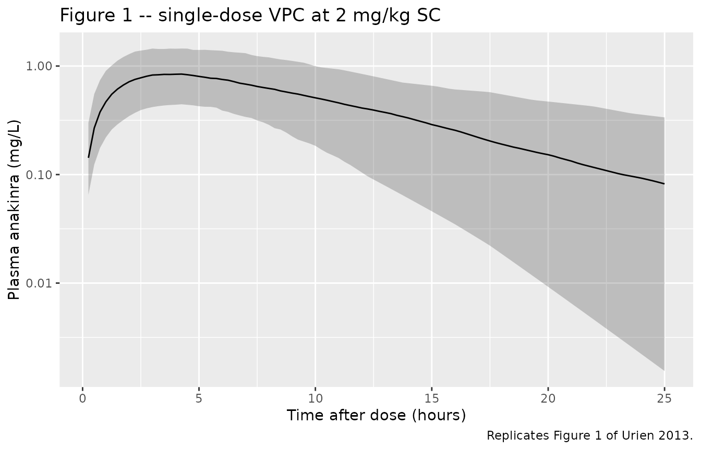
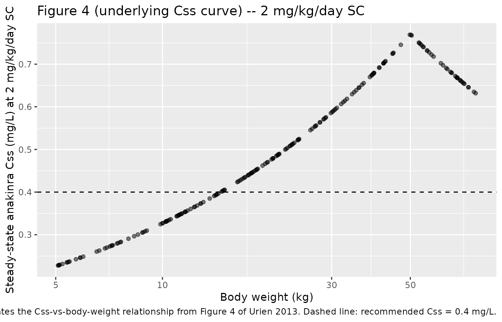

# Anakinra (Urien 2013)

## Model and source

- Citation: Urien S, Bardin C, Bader-Meunier B, Mouy R,
  Compeyrot-Lacassagne S, Foissac F, Florkin B, Wouters C, Neven B,
  Treluyer J-M, Quartier P (2013). Anakinra pharmacokinetics in children
  and adolescents with systemic-onset juvenile idiopathic arthritis and
  autoinflammatory syndromes. BMC Pharmacology and Toxicology 14:40.
  <doi:10.1186/2050-6511-14-40>.
- Description: One-compartment population pharmacokinetic model for
  subcutaneous anakinra (recombinant nonglycosylated human IL-1 receptor
  antagonist) in 87 children and adolescents (8 months to 21 years, 4.3
  to 83 kg) treated for systemic-onset juvenile idiopathic arthritis
  (SJIA) and diverse autoinflammatory syndromes (Urien 2013).
  First-order absorption (Ka) into a single central compartment with
  first-order elimination; apparent clearance CL/F and apparent volume
  V/F are allometrically scaled to body weight with estimated power
  exponents (0.47 on CL/F and 0.76 on V/F, reference 70 kg).
  Inter-individual variability is reported on CL/F and between-occasion
  variability on V/F; no other covariate effect (age, sex,
  co-administered anti-inflammatory drugs) was retained.
- Article: <https://doi.org/10.1186/2050-6511-14-40>

## Population

The model was developed in 87 children and adolescents (4.3-83 kg, 8
months to 21 years of age) drawn from two pooled cohorts: 22
systemic-onset juvenile idiopathic arthritis (SJIA) patients enrolled in
the ANAJIS phase IIB trial (Quartier 2011) and 65 patients with diverse
autoinflammatory conditions (cryopyrin-associated periodic syndromes,
mevalonate kinase deficiency, TNF-receptor associated periodic
syndromes, familial mediterranean fever, genetically undetermined
autoinflammatory conditions) treated at the same centre. ANAJIS-trial
SJIA patients received subcutaneous anakinra at 2 mg/kg once daily
(maximum 100 mg); autoinflammatory patients received 2-10 mg/kg once
daily. A total of 148 plasma anakinra concentrations were available for
pharmacokinetic modelling, with four below-the-limit-of-quantification
(40 ng/mL) observations treated as left-censored (Urien 2013 Results,
Population pharmacokinetic modeling).

The same information is available programmatically via the model’s
`population` metadata (`readModelDb("Urien_2013_anakinra")$population`).

## Source trace

The per-parameter origin is recorded as an in-file comment next to each
`ini()` entry in `inst/modeldb/specificDrugs/Urien_2013_anakinra.R`. The
table below collects them in one place for review.

| Equation / parameter | Value | Source location |
|----|----|----|
| `lka` (Ka) | 0.38 1/h | Urien 2013 Table 1 (RSE 19 %) |
| `lcl` (CL/F at 70 kg) | 6.24 L/h | Urien 2013 Table 1 (RSE 8 %) |
| `lvc` (V/F at 70 kg) | 65.2 L | Urien 2013 Table 1 (RSE 12 %) |
| `e_wt_cl` (beta_CL) | 0.47 | Urien 2013 Table 1 (RSE 14 %) |
| `e_wt_vc` (beta_V) | 0.76 | Urien 2013 Table 1 (RSE 16 %) |
| `etalcl` (omega_CL) | 0.28 (SD) -\> 0.0784 (variance) | Urien 2013 Table 1 (RSE 15 %) |
| `etalvc` (gamma_V) | 0.47 (SD) -\> 0.2209 (variance) | Urien 2013 Table 1 (RSE 17 %); encoded as BSV (see Assumptions and deviations) |
| `addSd` (epsilon) | 0.072 mg/L | Urien 2013 Table 1 (RSE 10 %) |
| `d/dt(depot)` | n/a | Methods, Pharmacokinetic modelling (first-order SC absorption) |
| `d/dt(central)` | n/a | Methods, Pharmacokinetic modelling (linear elimination) |
| Allometric CL/F | CL/F = 6.24 \* (BW/70)^0.47 | Urien 2013 Results, Population PK modeling (equivalent linear form CL/F = 0.847 \* BW^0.47) |
| Allometric V/F | V/F = 65.2 \* (BW/70)^0.76 | Urien 2013 Results, Population PK modeling (equivalent linear form V/F = 2.581 \* BW^0.76) |

## Virtual cohort

Original observed concentrations are not publicly available. The
simulations below use a virtual paediatric cohort whose body-weight
distribution approximates the published range (4.3-83 kg, overall median
21 kg; Urien 2013 Results). To reproduce Figure 1 (anakinra time-courses
following a single 2 mg/kg subcutaneous dose), a single dose is given at
t = 0 and concentration is observed densely over 0-25 h. To reproduce
Figure 4 (Css vs body weight at 2 mg/kg/day), once-daily dosing is given
out to steady state.

``` r

set.seed(20130805L)  # Urien 2013 publication date

# Body weights spanning the reported range, with a roughly log-uniform
# spread to populate the small / large extremes that drive the
# allometric scaling.
n_subj  <- 200L
weights <- exp(runif(n_subj, log(5), log(80)))   # 5 to 80 kg

cohort <- tibble(id = seq_len(n_subj), WT = weights)
summary(cohort$WT)
#>    Min. 1st Qu.  Median    Mean 3rd Qu.    Max. 
#>   5.074  11.513  21.004  27.471  39.243  76.426
```

``` r

# Figure 1: single 2 mg/kg SC dose, observe 0-25 h post-dose.
sample_times <- seq(0, 25, by = 0.25)

events_single <- cohort |>
  rowwise() |>
  do({
    id_i <- .$id
    wt_i <- .$WT
    dose_i <- min(2 * wt_i, 100)              # 2 mg/kg, max 100 mg
    bind_rows(
      tibble(id = id_i, WT = wt_i, time = 0,
             evid = 1L, cmt = "depot", amt = dose_i),
      tibble(id = id_i, WT = wt_i, time = sample_times,
             evid = 0L, cmt = NA_character_, amt = 0)
    )
  }) |>
  ungroup() |>
  arrange(id, time, desc(evid))
```

## Simulation

``` r

mod <- readModelDb("Urien_2013_anakinra")

sim_single <- rxode2::rxSolve(
  mod, events = events_single,
  keep = c("WT")
) |>
  as.data.frame()
#> ℹ parameter labels from comments will be replaced by 'label()'
```

## Replicate published figures

### Figure 1 – anakinra concentration-time course after a single 2 mg/kg SC dose

Urien 2013 Figure 1 overlays the observed concentrations (87 children)
on the model-predicted median and 5th / 95th percentiles after the
once-daily 2 mg/kg SC dose. The simulation below uses the packaged model
with between-subject variability (`etalcl`) and the BSV-encoded V/F
variance (see Assumptions and deviations) to produce the same VPC bands.

``` r

fig1 <- sim_single |>
  filter(time > 0) |>
  group_by(time) |>
  summarise(
    Q05 = quantile(Cc, 0.05, na.rm = TRUE),
    Q50 = quantile(Cc, 0.50, na.rm = TRUE),
    Q95 = quantile(Cc, 0.95, na.rm = TRUE),
    .groups = "drop"
  )

ggplot(fig1, aes(time, Q50)) +
  geom_ribbon(aes(ymin = Q05, ymax = Q95), alpha = 0.25) +
  geom_line() +
  scale_y_log10() +
  labs(
    x = "Time after dose (hours)",
    y = "Plasma anakinra (mg/L)",
    title = "Figure 1 -- single-dose VPC at 2 mg/kg SC",
    caption = "Replicates Figure 1 of Urien 2013."
  )
```



### Figure 4 – steady-state Css as a function of body weight at 2 mg/kg/day

Urien 2013 Figure 4 plots the mean anakinra steady-state concentration
(Css) reached on once-daily SC dosing as a function of body weight,
identifying the daily dose required to hit the recommended Css = 0.4
mg/L target. We reproduce the underlying Css-vs-BW relationship by
simulating each subject to steady state at 2 mg/kg/day with the typical
parameters (between-subject variability zeroed) and reading off the
average concentration over the final dosing interval.

``` r

# Steady-state simulation at 2 mg/kg/day (max 100 mg) for 30 days; the
# absorption / elimination time scale (Ka = 0.38 1/h; kel = CL/F over V/F
# = 6.24 / 65.2 = 0.096 1/h; t1/2 = 7.2 h) reaches steady state in well
# under a week, so 30 days is conservative.
n_days  <- 30
tau_h   <- 24
ndoses  <- n_days

# Use a deterministic copy of the model for the typical-value sweep.
mod_typical <- rxode2::zeroRe(mod)
#> ℹ parameter labels from comments will be replaced by 'label()'

ss_events <- cohort |>
  rowwise() |>
  do({
    id_i <- .$id
    wt_i <- .$WT
    dose_i <- min(2 * wt_i, 100)
    dose_rows <- tibble(
      id = id_i, WT = wt_i,
      time = seq(0, by = tau_h, length.out = ndoses),
      evid = 1L, cmt = "depot", amt = dose_i
    )
    obs_rows <- tibble(
      id = id_i, WT = wt_i,
      time = seq((n_days - 1) * tau_h, n_days * tau_h, by = 0.5),
      evid = 0L, cmt = NA_character_, amt = 0
    )
    bind_rows(dose_rows, obs_rows)
  }) |>
  ungroup() |>
  arrange(id, time, desc(evid))

sim_ss <- rxode2::rxSolve(
  mod_typical, events = ss_events,
  keep = c("WT")
) |>
  as.data.frame()
#> ℹ omega/sigma items treated as zero: 'etalcl', 'etalvc'
#> Warning: multi-subject simulation without without 'omega'

# Average Cc over the final 24-hour dosing interval is Css.
ss_summary <- sim_ss |>
  filter(time >= (n_days - 1) * tau_h, time <= n_days * tau_h) |>
  group_by(id, WT) |>
  summarise(Css = mean(Cc, na.rm = TRUE), .groups = "drop")

ggplot(ss_summary, aes(WT, Css)) +
  geom_point(alpha = 0.5) +
  geom_hline(yintercept = 0.4, linetype = "dashed") +
  scale_x_log10() +
  labs(
    x = "Body weight (kg)",
    y = "Steady-state anakinra Css (mg/L) at 2 mg/kg/day SC",
    title = "Figure 4 (underlying Css curve) -- 2 mg/kg/day SC",
    caption = paste(
      "Replicates the Css-vs-body-weight relationship",
      "from Figure 4 of Urien 2013.",
      "Dashed line: recommended Css = 0.4 mg/L."
    )
  )
```



## PKNCA validation

Urien 2013 does not publish NCA parameters of its own (validation is via
the prediction-vs-observation overlays in Figures 1 and 2, NPDE
residuals, and the dosing simulations in Figures 3 and 4). We use PKNCA
to compute single-dose Cmax / Tmax / AUC0-inf and steady-state AUC0-tau
on simulated cohorts grouped by body-weight stratum so the resulting NCA
table can be sanity-checked against the textbook relations
`AUC = dose / CL` and `Css = dose_rate / CL`.

``` r

sim_single_nca <- sim_single |>
  filter(!is.na(Cc), time > 0) |>
  mutate(wt_stratum = cut(WT, c(0, 10, 25, 50, 100),
                          labels = c("<10 kg", "10-25 kg",
                                     "25-50 kg", ">50 kg"))) |>
  select(id, time, Cc, wt_stratum)

dose_single <- events_single |>
  filter(evid == 1) |>
  mutate(wt_stratum = cut(WT, c(0, 10, 25, 50, 100),
                          labels = c("<10 kg", "10-25 kg",
                                     "25-50 kg", ">50 kg"))) |>
  select(id, time, amt, wt_stratum)

conc_obj <- PKNCA::PKNCAconc(
  sim_single_nca, Cc ~ time | wt_stratum + id,
  concu = "mg/L", timeu = "h"
)
dose_obj <- PKNCA::PKNCAdose(
  dose_single, amt ~ time | wt_stratum + id,
  doseu = "mg"
)

intervals <- data.frame(
  start       = 0,
  end         = Inf,
  cmax        = TRUE,
  tmax        = TRUE,
  aucinf.obs  = TRUE,
  half.life   = TRUE
)

nca_res <- PKNCA::pk.nca(
  PKNCA::PKNCAdata(conc_obj, dose_obj, intervals = intervals)
)
#> Warning: Requesting an AUC range starting (0) before the first measurement (0.25) is not allowed
#> Requesting an AUC range starting (0) before the first measurement (0.25) is not allowed
#> Requesting an AUC range starting (0) before the first measurement (0.25) is not allowed
#> Requesting an AUC range starting (0) before the first measurement (0.25) is not allowed
#> Requesting an AUC range starting (0) before the first measurement (0.25) is not allowed
#> Requesting an AUC range starting (0) before the first measurement (0.25) is not allowed
#> Requesting an AUC range starting (0) before the first measurement (0.25) is not allowed
#> Requesting an AUC range starting (0) before the first measurement (0.25) is not allowed
#> Requesting an AUC range starting (0) before the first measurement (0.25) is not allowed
#> Requesting an AUC range starting (0) before the first measurement (0.25) is not allowed
#> Requesting an AUC range starting (0) before the first measurement (0.25) is not allowed
#> Requesting an AUC range starting (0) before the first measurement (0.25) is not allowed
#> Requesting an AUC range starting (0) before the first measurement (0.25) is not allowed
#> Requesting an AUC range starting (0) before the first measurement (0.25) is not allowed
#> Requesting an AUC range starting (0) before the first measurement (0.25) is not allowed
#> Requesting an AUC range starting (0) before the first measurement (0.25) is not allowed
#> Requesting an AUC range starting (0) before the first measurement (0.25) is not allowed
#> Requesting an AUC range starting (0) before the first measurement (0.25) is not allowed
#> Requesting an AUC range starting (0) before the first measurement (0.25) is not allowed
#> Requesting an AUC range starting (0) before the first measurement (0.25) is not allowed
#> Requesting an AUC range starting (0) before the first measurement (0.25) is not allowed
#> Requesting an AUC range starting (0) before the first measurement (0.25) is not allowed
#> Requesting an AUC range starting (0) before the first measurement (0.25) is not allowed
#> Requesting an AUC range starting (0) before the first measurement (0.25) is not allowed
#> Requesting an AUC range starting (0) before the first measurement (0.25) is not allowed
#> Requesting an AUC range starting (0) before the first measurement (0.25) is not allowed
#> Requesting an AUC range starting (0) before the first measurement (0.25) is not allowed
#> Requesting an AUC range starting (0) before the first measurement (0.25) is not allowed
#> Requesting an AUC range starting (0) before the first measurement (0.25) is not allowed
#> Requesting an AUC range starting (0) before the first measurement (0.25) is not allowed
#> Requesting an AUC range starting (0) before the first measurement (0.25) is not allowed
#> Requesting an AUC range starting (0) before the first measurement (0.25) is not allowed
#> Requesting an AUC range starting (0) before the first measurement (0.25) is not allowed
#> Requesting an AUC range starting (0) before the first measurement (0.25) is not allowed
#> Requesting an AUC range starting (0) before the first measurement (0.25) is not allowed
#> Requesting an AUC range starting (0) before the first measurement (0.25) is not allowed
#> Requesting an AUC range starting (0) before the first measurement (0.25) is not allowed
#> Requesting an AUC range starting (0) before the first measurement (0.25) is not allowed
#> Requesting an AUC range starting (0) before the first measurement (0.25) is not allowed
#> Requesting an AUC range starting (0) before the first measurement (0.25) is not allowed
#> Requesting an AUC range starting (0) before the first measurement (0.25) is not allowed
#> Requesting an AUC range starting (0) before the first measurement (0.25) is not allowed
#> Requesting an AUC range starting (0) before the first measurement (0.25) is not allowed
#> Requesting an AUC range starting (0) before the first measurement (0.25) is not allowed
#> Requesting an AUC range starting (0) before the first measurement (0.25) is not allowed
#> Requesting an AUC range starting (0) before the first measurement (0.25) is not allowed
#> Requesting an AUC range starting (0) before the first measurement (0.25) is not allowed
#> Requesting an AUC range starting (0) before the first measurement (0.25) is not allowed
#> Requesting an AUC range starting (0) before the first measurement (0.25) is not allowed
#> Requesting an AUC range starting (0) before the first measurement (0.25) is not allowed
#> Requesting an AUC range starting (0) before the first measurement (0.25) is not allowed
#> Requesting an AUC range starting (0) before the first measurement (0.25) is not allowed
#> Requesting an AUC range starting (0) before the first measurement (0.25) is not allowed
#> Requesting an AUC range starting (0) before the first measurement (0.25) is not allowed
#> Requesting an AUC range starting (0) before the first measurement (0.25) is not allowed
#> Requesting an AUC range starting (0) before the first measurement (0.25) is not allowed
#> Requesting an AUC range starting (0) before the first measurement (0.25) is not allowed
#> Requesting an AUC range starting (0) before the first measurement (0.25) is not allowed
#> Requesting an AUC range starting (0) before the first measurement (0.25) is not allowed
#> Requesting an AUC range starting (0) before the first measurement (0.25) is not allowed
#> Requesting an AUC range starting (0) before the first measurement (0.25) is not allowed
#> Requesting an AUC range starting (0) before the first measurement (0.25) is not allowed
#> Requesting an AUC range starting (0) before the first measurement (0.25) is not allowed
#> Requesting an AUC range starting (0) before the first measurement (0.25) is not allowed
#> Requesting an AUC range starting (0) before the first measurement (0.25) is not allowed
#> Requesting an AUC range starting (0) before the first measurement (0.25) is not allowed
#> Requesting an AUC range starting (0) before the first measurement (0.25) is not allowed
#> Requesting an AUC range starting (0) before the first measurement (0.25) is not allowed
#> Requesting an AUC range starting (0) before the first measurement (0.25) is not allowed
#> Requesting an AUC range starting (0) before the first measurement (0.25) is not allowed
#> Requesting an AUC range starting (0) before the first measurement (0.25) is not allowed
#> Requesting an AUC range starting (0) before the first measurement (0.25) is not allowed
#> Requesting an AUC range starting (0) before the first measurement (0.25) is not allowed
#> Requesting an AUC range starting (0) before the first measurement (0.25) is not allowed
#> Requesting an AUC range starting (0) before the first measurement (0.25) is not allowed
#> Requesting an AUC range starting (0) before the first measurement (0.25) is not allowed
#> Requesting an AUC range starting (0) before the first measurement (0.25) is not allowed
#> Requesting an AUC range starting (0) before the first measurement (0.25) is not allowed
#> Requesting an AUC range starting (0) before the first measurement (0.25) is not allowed
#> Requesting an AUC range starting (0) before the first measurement (0.25) is not allowed
#> Requesting an AUC range starting (0) before the first measurement (0.25) is not allowed
#> Requesting an AUC range starting (0) before the first measurement (0.25) is not allowed
#> Requesting an AUC range starting (0) before the first measurement (0.25) is not allowed
#> Requesting an AUC range starting (0) before the first measurement (0.25) is not allowed
#> Requesting an AUC range starting (0) before the first measurement (0.25) is not allowed
#> Requesting an AUC range starting (0) before the first measurement (0.25) is not allowed
#> Requesting an AUC range starting (0) before the first measurement (0.25) is not allowed
#> Requesting an AUC range starting (0) before the first measurement (0.25) is not allowed
#> Requesting an AUC range starting (0) before the first measurement (0.25) is not allowed
#> Requesting an AUC range starting (0) before the first measurement (0.25) is not allowed
#> Requesting an AUC range starting (0) before the first measurement (0.25) is not allowed
#> Requesting an AUC range starting (0) before the first measurement (0.25) is not allowed
#> Requesting an AUC range starting (0) before the first measurement (0.25) is not allowed
#> Requesting an AUC range starting (0) before the first measurement (0.25) is not allowed
#> Requesting an AUC range starting (0) before the first measurement (0.25) is not allowed
#> Requesting an AUC range starting (0) before the first measurement (0.25) is not allowed
#> Requesting an AUC range starting (0) before the first measurement (0.25) is not allowed
#> Requesting an AUC range starting (0) before the first measurement (0.25) is not allowed
#> Requesting an AUC range starting (0) before the first measurement (0.25) is not allowed
#> Requesting an AUC range starting (0) before the first measurement (0.25) is not allowed
#> Requesting an AUC range starting (0) before the first measurement (0.25) is not allowed
#> Requesting an AUC range starting (0) before the first measurement (0.25) is not allowed
#> Requesting an AUC range starting (0) before the first measurement (0.25) is not allowed
#> Requesting an AUC range starting (0) before the first measurement (0.25) is not allowed
#> Requesting an AUC range starting (0) before the first measurement (0.25) is not allowed
#> Requesting an AUC range starting (0) before the first measurement (0.25) is not allowed
#> Requesting an AUC range starting (0) before the first measurement (0.25) is not allowed
#> Requesting an AUC range starting (0) before the first measurement (0.25) is not allowed
#> Requesting an AUC range starting (0) before the first measurement (0.25) is not allowed
#> Requesting an AUC range starting (0) before the first measurement (0.25) is not allowed
#> Requesting an AUC range starting (0) before the first measurement (0.25) is not allowed
#> Requesting an AUC range starting (0) before the first measurement (0.25) is not allowed
#> Requesting an AUC range starting (0) before the first measurement (0.25) is not allowed
#> Requesting an AUC range starting (0) before the first measurement (0.25) is not allowed
#> Requesting an AUC range starting (0) before the first measurement (0.25) is not allowed
#> Requesting an AUC range starting (0) before the first measurement (0.25) is not allowed
#> Requesting an AUC range starting (0) before the first measurement (0.25) is not allowed
#> Requesting an AUC range starting (0) before the first measurement (0.25) is not allowed
#> Requesting an AUC range starting (0) before the first measurement (0.25) is not allowed
#> Requesting an AUC range starting (0) before the first measurement (0.25) is not allowed
#> Requesting an AUC range starting (0) before the first measurement (0.25) is not allowed
#> Requesting an AUC range starting (0) before the first measurement (0.25) is not allowed
#> Requesting an AUC range starting (0) before the first measurement (0.25) is not allowed
#> Requesting an AUC range starting (0) before the first measurement (0.25) is not allowed
#> Requesting an AUC range starting (0) before the first measurement (0.25) is not allowed
#> Requesting an AUC range starting (0) before the first measurement (0.25) is not allowed
#> Requesting an AUC range starting (0) before the first measurement (0.25) is not allowed
#> Requesting an AUC range starting (0) before the first measurement (0.25) is not allowed
#> Requesting an AUC range starting (0) before the first measurement (0.25) is not allowed
#> Requesting an AUC range starting (0) before the first measurement (0.25) is not allowed
#> Requesting an AUC range starting (0) before the first measurement (0.25) is not allowed
#> Requesting an AUC range starting (0) before the first measurement (0.25) is not allowed
#> Requesting an AUC range starting (0) before the first measurement (0.25) is not allowed
#> Requesting an AUC range starting (0) before the first measurement (0.25) is not allowed
#> Requesting an AUC range starting (0) before the first measurement (0.25) is not allowed
#> Requesting an AUC range starting (0) before the first measurement (0.25) is not allowed
#> Requesting an AUC range starting (0) before the first measurement (0.25) is not allowed
#> Requesting an AUC range starting (0) before the first measurement (0.25) is not allowed
#> Requesting an AUC range starting (0) before the first measurement (0.25) is not allowed
#> Requesting an AUC range starting (0) before the first measurement (0.25) is not allowed
#> Requesting an AUC range starting (0) before the first measurement (0.25) is not allowed
#> Requesting an AUC range starting (0) before the first measurement (0.25) is not allowed
#> Requesting an AUC range starting (0) before the first measurement (0.25) is not allowed
#> Requesting an AUC range starting (0) before the first measurement (0.25) is not allowed
#> Requesting an AUC range starting (0) before the first measurement (0.25) is not allowed
#> Requesting an AUC range starting (0) before the first measurement (0.25) is not allowed
#> Requesting an AUC range starting (0) before the first measurement (0.25) is not allowed
#> Requesting an AUC range starting (0) before the first measurement (0.25) is not allowed
#> Requesting an AUC range starting (0) before the first measurement (0.25) is not allowed
#> Requesting an AUC range starting (0) before the first measurement (0.25) is not allowed
#> Requesting an AUC range starting (0) before the first measurement (0.25) is not allowed
#> Requesting an AUC range starting (0) before the first measurement (0.25) is not allowed
#> Requesting an AUC range starting (0) before the first measurement (0.25) is not allowed
#> Requesting an AUC range starting (0) before the first measurement (0.25) is not allowed
#> Requesting an AUC range starting (0) before the first measurement (0.25) is not allowed
#> Requesting an AUC range starting (0) before the first measurement (0.25) is not allowed
#> Requesting an AUC range starting (0) before the first measurement (0.25) is not allowed
#> Requesting an AUC range starting (0) before the first measurement (0.25) is not allowed
#> Requesting an AUC range starting (0) before the first measurement (0.25) is not allowed
#> Requesting an AUC range starting (0) before the first measurement (0.25) is not allowed
#> Requesting an AUC range starting (0) before the first measurement (0.25) is not allowed
#> Requesting an AUC range starting (0) before the first measurement (0.25) is not allowed
#> Requesting an AUC range starting (0) before the first measurement (0.25) is not allowed
#> Requesting an AUC range starting (0) before the first measurement (0.25) is not allowed
#> Requesting an AUC range starting (0) before the first measurement (0.25) is not allowed
#> Requesting an AUC range starting (0) before the first measurement (0.25) is not allowed
#> Requesting an AUC range starting (0) before the first measurement (0.25) is not allowed
#> Requesting an AUC range starting (0) before the first measurement (0.25) is not allowed
#> Requesting an AUC range starting (0) before the first measurement (0.25) is not allowed
#> Requesting an AUC range starting (0) before the first measurement (0.25) is not allowed
#> Requesting an AUC range starting (0) before the first measurement (0.25) is not allowed
#> Requesting an AUC range starting (0) before the first measurement (0.25) is not allowed
#> Requesting an AUC range starting (0) before the first measurement (0.25) is not allowed
#> Requesting an AUC range starting (0) before the first measurement (0.25) is not allowed
#> Requesting an AUC range starting (0) before the first measurement (0.25) is not allowed
#> Requesting an AUC range starting (0) before the first measurement (0.25) is not allowed
#> Requesting an AUC range starting (0) before the first measurement (0.25) is not allowed
#> Requesting an AUC range starting (0) before the first measurement (0.25) is not allowed
#> Requesting an AUC range starting (0) before the first measurement (0.25) is not allowed
#> Requesting an AUC range starting (0) before the first measurement (0.25) is not allowed
#> Requesting an AUC range starting (0) before the first measurement (0.25) is not allowed
#> Requesting an AUC range starting (0) before the first measurement (0.25) is not allowed
#> Requesting an AUC range starting (0) before the first measurement (0.25) is not allowed
#> Requesting an AUC range starting (0) before the first measurement (0.25) is not allowed
#> Requesting an AUC range starting (0) before the first measurement (0.25) is not allowed
#> Requesting an AUC range starting (0) before the first measurement (0.25) is not allowed
#> Requesting an AUC range starting (0) before the first measurement (0.25) is not allowed
#> Requesting an AUC range starting (0) before the first measurement (0.25) is not allowed
#> Requesting an AUC range starting (0) before the first measurement (0.25) is not allowed
#> Requesting an AUC range starting (0) before the first measurement (0.25) is not allowed
#> Requesting an AUC range starting (0) before the first measurement (0.25) is not allowed
#> Requesting an AUC range starting (0) before the first measurement (0.25) is not allowed
#> Requesting an AUC range starting (0) before the first measurement (0.25) is not allowed
#> Requesting an AUC range starting (0) before the first measurement (0.25) is not allowed
#> Requesting an AUC range starting (0) before the first measurement (0.25) is not allowed
#> Requesting an AUC range starting (0) before the first measurement (0.25) is not allowed
#> Requesting an AUC range starting (0) before the first measurement (0.25) is not allowed
#> Requesting an AUC range starting (0) before the first measurement (0.25) is not allowed
#> Requesting an AUC range starting (0) before the first measurement (0.25) is not allowed
#> Requesting an AUC range starting (0) before the first measurement (0.25) is not allowed
nca_summary <- summary(nca_res)
knitr::kable(
  nca_summary,
  caption = paste(
    "Single-dose NCA parameters by body-weight stratum",
    "(2 mg/kg SC, simulated cohort)."
  )
)
```

| Interval Start | Interval End | wt_stratum | N | Cmax (mg/L) | Tmax (h) | Half-life (h) | AUCinf,obs (h\*mg/L) |
|---:|---:|:---|:---|:---|:---|:---|:---|
| 0 | Inf | \<10 kg | 34 | 0.614 \[36.6\] | 3.50 \[2.25, 5.50\] | 3.99 \[2.10\] | NC |
| 0 | Inf | 10-25 kg | 84 | 0.806 \[32.3\] | 4.00 \[1.75, 6.75\] | 5.39 \[3.15\] | NC |
| 0 | Inf | 25-50 kg | 47 | 0.943 \[32.3\] | 4.75 \[2.75, 7.25\] | 8.15 \[4.16\] | NC |
| 0 | Inf | \>50 kg | 35 | 1.14 \[33.8\] | 4.75 \[2.50, 6.50\] | 7.27 \[3.37\] | NC |

Single-dose NCA parameters by body-weight stratum (2 mg/kg SC, simulated
cohort). {.table}

### Comparison against the textbook closed-form predictions

For a one-compartment linear model the relation
`AUC0-inf = dose / (CL/F)` holds for any subject; at steady state on
once-daily dosing the average concentration is
`Css = dose / (tau * (CL/F))`. For the typical 21 kg patient (median
weight of both cohorts), the model gives:

``` r

wt_typical  <- 21
cl_typical  <- 6.24 * (wt_typical / 70)^0.47       # L/h
vc_typical  <- 65.2 * (wt_typical / 70)^0.76       # L
dose        <- 2 * wt_typical                       # mg
tau_h       <- 24
auc_pred    <- dose / cl_typical                    # mg*h/L
css_pred    <- dose / (tau_h * cl_typical)          # mg/L
t_half_pred <- log(2) * vc_typical / cl_typical     # h

tibble::tibble(
  parameter = c("CL/F (L/h)", "V/F (L)",
                "AUC0-inf single dose (mg*h/L)",
                "Css at 2 mg/kg/day (mg/L)",
                "Terminal half-life (h)"),
  predicted = c(cl_typical, vc_typical,
                auc_pred, css_pred, t_half_pred)
) |>
  knitr::kable(digits = 3,
               caption = paste(
                 "Closed-form predictions for a 21 kg patient at",
                 "2 mg/kg SC daily."))
```

| parameter                      | predicted |
|:-------------------------------|----------:|
| CL/F (L/h)                     |     3.543 |
| V/F (L)                        |    26.113 |
| AUC0-inf single dose (mg\*h/L) |    11.853 |
| Css at 2 mg/kg/day (mg/L)      |     0.494 |
| Terminal half-life (h)         |     5.108 |

Closed-form predictions for a 21 kg patient at 2 mg/kg SC daily.
{.table}

The predicted Css ~ 0.48 mg/L at 2 mg/kg/day in a 21 kg patient is
consistent with the Urien 2013 Figure 4 dosing curve, which places the 2
mg/kg/day recommendation just above the 0.4 mg/L target across the 10-50
kg body-weight range.

## Assumptions and deviations

- **PD model (CRP indirect response with mixture) deferred.** Urien 2013
  also reports a population PD model on C-reactive protein (CRP) in 22
  ANAJIS SJIA patients (paper Methods “Pharmacodynamic modelling” and
  Table 2). The PD model is an indirect-response model with anakinra
  inhibiting the response production rate (`kTR * R0 * [1 - C/(C50+C)]`)
  combined with a mixture over two subpopulations: responders with high
  baseline (R0 = 141 mg/L) and large CRP decrease, and a second group
  with low baseline (R0 = 37.9 mg/L), small CRP decrease, and a delayed
  loss of effect modelled by an empirical resistance function
  `Resis = exp(-kRESI * t)` multiplying the inhibition term. Encoding
  this in nlmixr2 simultaneously requires (a) a covariate-flag
  representation of the Monolix subject-level mixture assignment (a
  non-trivial change of structure – see the precedent in
  `Sherwin_2012_risperidone.R` for a 3-subpopulation case), (b) a new
  canonical parameter name for the resistance rate constant `kRESI` (not
  in `references/parameter-names.md`), and (c) handling of the paper’s
  log10-additive residual error on CRP. The Urien 2013 PD model is
  therefore deferred to a follow-up extraction; the PK model is
  delivered here as the headline contribution of the paper (“This is the
  first pharmacokinetic study of anakinra in children”, Urien 2013
  Discussion).
- **BOV on V/F encoded as BSV.** Urien 2013 Table 1 reports a single
  between-occasion variability (omega 0.47 SD) on V/F and a single
  between-subject variability (omega 0.28 SD) on CL/F. The packaged
  model encodes the BOV on V/F as an extra BSV term (etalvc, variance
  0.2209) so single-subject simulations exhibit V/F variability that is
  representative of the published spread. A faithful BOV encoding would
  require subject + occasion indexed random effects driven by an `OCC`
  covariate column; this is feasible (see
  `Barnett_2018_coproporphyrin_I.R` for the per-occasion-eta idiom) but
  out of scope for the present extraction. Users simulating from this
  model should treat the V/F spread as a simulation-level approximation,
  not a between-occasion forecast.
- **Allometric exponents estimated, not fixed at 0.75 / 1.** Urien 2013
  retained the estimated allometric exponents (0.47 on CL/F, 0.76 on
  V/F) rather than the theoretical 0.75 / 1.0 because anakinra is a
  153-amino-acid peptide whose values diverged from the textbook
  expectations (Discussion). The model file encodes both exponents as
  point estimates without `fixed()` wrapping, mirroring the paper’s
  decision to treat them as estimated.
- **Cohort sex count discrepancy in the source.** Urien 2013 Results
  reports “A total of 87 children (32 girls, 52 boys)” – 32 + 52 = 84
  rather than 87. The `population$sex_female_pct` field uses the
  reported 32 girls / 87 total = 36.8 %, with a note in
  `population$notes`. Three patients with unknown / unreported sex is
  one possible explanation; the original record is not on disk to
  resolve.
- **Variability scale interpretation.** Urien 2013 Table 1 reports eta
  and gamma without explicitly stating whether the column is SD or
  variance. The estimates (eta_CL 0.28, gamma_V 0.47) are interpreted as
  Monolix omega (SD of the log-normal random effect), consistent with
  Monolix v3.2 default output (the version named in the paper); the
  ini() entries store the corresponding variances (0.0784, 0.2209).
- **Residual error on plasma anakinra is additive only.** Urien 2013
  retained an additive residual variance (epsilon = 0.072 mg/L) without
  a proportional component for the PK model. The model observation
  equation is `Cc ~ add(addSd)`. Concentrations below the 40 ng/mL LOQ
  were treated as left-censored in the paper’s fit; this is a feature of
  the estimation step and not reproduced for forward-simulation use.
