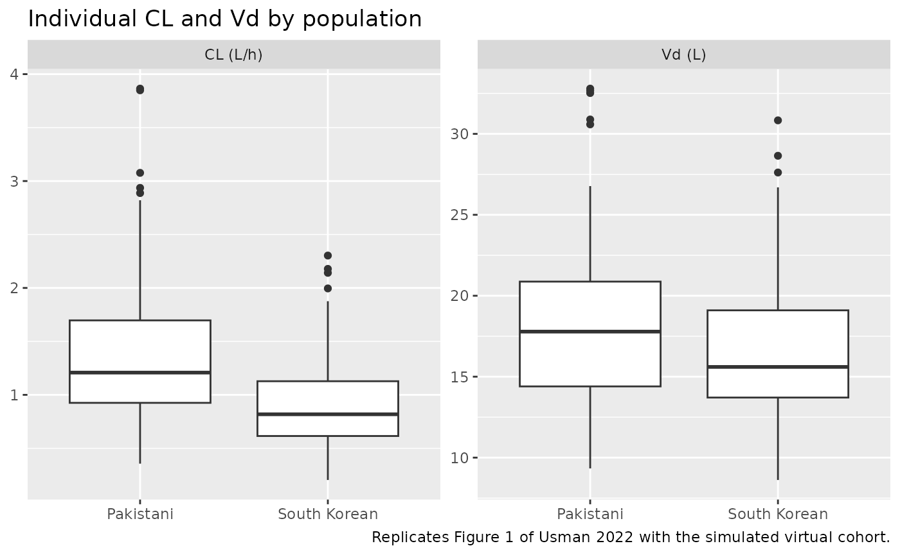
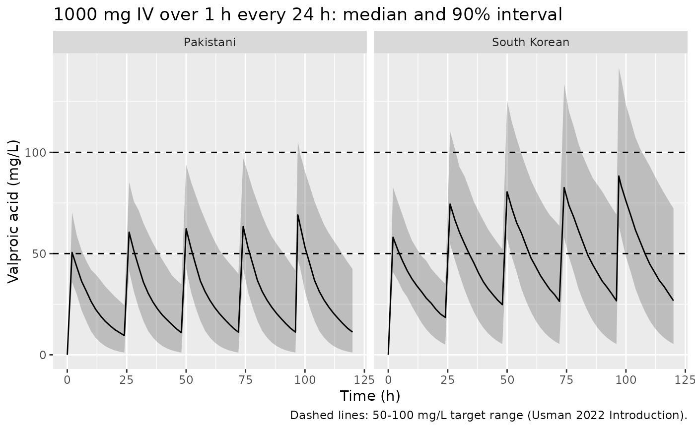

# Valproic acid (Usman 2022)

## Model and source

- Citation: Usman M, Shaukat Q-u-A, Khokhar MI, Bilal R, Khan RR, Saeed
  HA, Ali M, Khan HM. Comparative pharmacokinetics of valproic acid
  among Pakistani and South Korean patients: A population
  pharmacokinetic study. PLoS One. 2022;17(8):e0272622.
  <doi:10.1371/journal.pone.0272622>. PMCID PMC9401156. Parameters from
  Table 2 and Eqs 1-4; covariate-model building from S1 Table (PsN scm
  output).
- Description: One-compartment population PK model with first-order
  elimination for intravenous valproic acid in adult Pakistani and South
  Korean patients, fitted to pooled routine therapeutic-drug-monitoring
  data (Usman 2022; 191 patients, 553 serum concentrations). Clearance
  carries a linear body-weight effect centred on the 67 kg pooled median
  and a multiplicative linear effect of the Pakistani centre (South
  Korean patients are the reference); volume of distribution carries a
  linear body-weight effect centred on 67 kg. Exponential IIV on CL and
  V, proportional residual error. Fitted in NONMEM 7.4.4 (ADVAN1 TRANS2,
  FOCE-I) with the covariate model built by PsN stepwise covariate
  modelling.
- Article: <https://doi.org/10.1371/journal.pone.0272622> (open access)
- Supplement S1 Table (PsN stepwise covariate modelling output):
  <https://doi.org/10.1371/journal.pone.0272622.s001>

## Population

Usman 2022 pooled routine therapeutic-drug-monitoring (TDM) data for
intravenous valproic acid from two sources. The first is 92 Pakistani
patients (218 samples) from Aziz Fatima Hospital, Faisalabad. The second
is 99 South Korean patients (335 samples) from the earlier Park 2002
analysis (<doi:10.1046/j.1365-2710.2002.00440.x>). Together they give
191 patients and 553 serum concentrations, measured by ELISA at peak and
trough.

The pooled cohort was 66.5% male, with median age 48 years (range 18-90)
and median weight 67 kg (range 40-101). The Pakistani patients were
heavier (median 71 kg, range 47-101) and older (median 54 years) than
the Korean patients (median 60 kg, range 40-91; median 44 years). The
median single dose was 1000 mg (range 500-1800 mg). Observed
concentrations ranged from 3.38 to 106.4 mg/L (Usman 2022 Table 1). The
paper does not state the indication, the infusion duration or the dosing
interval.

The same information is available programmatically via
`readModelDb("Usman_2022_valproic_acid")()$population`.

## Source trace

| Equation / parameter | Value | Source location |
|----|----|----|
| Structure: one compartment, IV input, first-order elimination | n/a | Results, ‘Population PK modelling’ (ADVAN1 TRANS2, FOCE-I) |
| `lcl` (CL, South Korean, 67 kg) | log(0.931) L/h | Table 2; Eqs 1 and 3 |
| `lvc` (Vd, 67 kg) | log(16.6) L | Table 2; Eq 4 |
| `e_nonkorean_cl` (CL-CENT) | 0.386 | Table 2; Eqs 1-2; S1 Table ‘CLCENT-2’ |
| `e_wt_cl` (CL-WT) | 0.0143 per kg | Table 2; Eq 3; S1 Table ‘CLWT-2’ |
| `e_wt_vc` (Vd-WT) | 0.009 per kg | Table 2; Eq 4; S1 Table ‘VWT-2’ |
| Centring weight | 67 kg | Eqs 3-4 (‘67 is median body weight of pooled population’); Table 1 |
| `etalcl` | 0.434^2 = 0.188356 | Table 2, ‘IIV CL (%)’ = 43.4 |
| `etalvc` | 0.223^2 = 0.049729 | Table 2, ‘IIV Vd (%)’ = 22.3 |
| `propSd` | 0.148 | Table 2, ‘Proportional Error’ |
| CL equation: `cl = CL * (1 + 0.386 * (1 - RACE_KOREAN)) * (1 + 0.0143 * (WT - 67)) * exp(eta)` | n/a | Eqs 1-3 with the PsN scm linear-relation code (see Errata) |
| V equation: `vc = V * (1 + 0.009 * (WT - 67)) * exp(eta)` | n/a | Eq 4 |
| Final covariate set (CL ~ CENT + WT, V ~ WT) | n/a | S1 Table, last backward step; Table 2 OFV 3344.6 = S1 Table 3344.60228 |

## Typical values

The model is linear in each covariate, so the typical clearance and
volume for any patient can be written down from Table 2. The chunk below
solves the model with the random effects zeroed and checks that the `cl`
and `vc` columns match those hand calculations. The check covers the
reference patient (Korean, 67 kg) and the median Pakistani (71 kg) and
Korean (60 kg) patients.

``` r

mod <- readModelDb("Usman_2022_valproic_acid")
mod_typ <- rxode2::zeroRe(mod)
#> ℹ parameter labels from comments will be replaced by 'label()'

typ_cov <- tibble::tibble(
  id = 1:3,
  label = c("Reference (Korean, 67 kg)", "Median Pakistani (71 kg)", "Median Korean (60 kg)"),
  RACE_KOREAN = c(1, 0, 1),
  WT = c(67, 71, 60)
)
typ_ev <- typ_cov |>
  dplyr::select(id, RACE_KOREAN, WT) |>
  dplyr::cross_join(tibble::tibble(time = c(0, 1), evid = c(1L, 0L), amt = c(1000, 0))) |>
  dplyr::mutate(cmt = "central") |>
  dplyr::arrange(id, time)

typ_sim <- rxode2::rxSolve(mod_typ, events = typ_ev, returnType = "data.frame") |>
  dplyr::distinct(id, cl, vc)
#> ℹ omega/sigma items treated as zero: 'etalcl', 'etalvc'
#> Warning: multi-subject simulation without without 'omega'

typ <- typ_cov |>
  dplyr::left_join(typ_sim, by = "id") |>
  dplyr::mutate(
    cl_hand = 0.931 * (1 + 0.386 * (1 - RACE_KOREAN)) * (1 + 0.0143 * (WT - 67)),
    vc_hand = 16.6 * (1 + 0.009 * (WT - 67)),
    thalf_h = log(2) * vc / cl
  )

# cl and vc are algebraic, not integrated, so they agree to floating point.
stopifnot(
  max(abs(typ$cl / typ$cl_hand - 1)) < 1e-10,
  max(abs(typ$vc / typ$vc_hand - 1)) < 1e-10
)

typ |>
  dplyr::select(label, cl, vc, thalf_h) |>
  dplyr::rename(
    "Patient" = label,
    "Typical CL (L/h)" = cl,
    "Typical V (L)" = vc,
    "Half-life (h)" = thalf_h
  ) |>
  knitr::kable(digits = 3)
```

| Patient                   | Typical CL (L/h) | Typical V (L) | Half-life (h) |
|:--------------------------|-----------------:|--------------:|--------------:|
| Reference (Korean, 67 kg) |            0.931 |        16.600 |        12.359 |
| Median Pakistani (71 kg)  |            1.364 |        17.198 |         8.738 |
| Median Korean (60 kg)     |            0.838 |        15.554 |        12.869 |

At 67 kg the Pakistani typical clearance is 0.931 x 1.386 = 1.290 L/h.
The paper’s Eq 2 prints it as 0.931 + 0.386 = 1.317 L/h. The two differ
by 2%; the Errata section explains why the multiplicative form is used.

## Virtual cohort

Original observed data are not publicly available. The cohort below has
two arms of 150 patients, one per centre. Body weights are drawn
log-normally around each centre’s median (71 kg Pakistani, 60 kg Korean)
and truncated to the observed range of that centre (Table 1). Each
patient receives 1000 mg (the Table 1 median single dose) as a 1-hour
intravenous infusion. The paper does not report the infusion duration;
one hour is the labelled rate for intravenous valproate.

``` r

# rxSetSeed() fixes rxode2's draw for a given solver thread count, not across
# thread counts, so every assertion below is on a centre or a robust quantile.
set.seed(20220824)
rxode2::rxSetSeed(20220824)

n_per_arm <- 150

draw_weight <- function(n, median_wt, lo, hi, sdlog) {
  wt <- exp(rnorm(n * 3, log(median_wt), sdlog))
  wt <- wt[wt >= lo & wt <= hi]
  wt[seq_len(n)]
}

cohort <- dplyr::bind_rows(
  tibble::tibble(
    id = seq_len(n_per_arm),
    population = "Pakistani",
    RACE_KOREAN = 0,
    WT = draw_weight(n_per_arm, 71, 47, 101, 0.15)
  ),
  tibble::tibble(
    id = n_per_arm + seq_len(n_per_arm),
    population = "South Korean",
    RACE_KOREAN = 1,
    WT = draw_weight(n_per_arm, 60, 40, 91, 0.165)
  )
)
stopifnot(!anyNA(cohort$WT), !anyDuplicated(cohort$id))

cohort |>
  dplyr::group_by(population) |>
  dplyr::summarise(
    N = dplyr::n(),
    `Median WT (kg)` = median(WT),
    `Min WT (kg)` = min(WT),
    `Max WT (kg)` = max(WT),
    .groups = "drop"
  ) |>
  dplyr::rename("Population" = population) |>
  knitr::kable(digits = 1)
```

| Population   |   N | Median WT (kg) | Min WT (kg) | Max WT (kg) |
|:-------------|----:|---------------:|------------:|------------:|
| Pakistani    | 150 |           69.7 |        48.2 |        93.8 |
| South Korean | 150 |           59.5 |        41.1 |        89.7 |

## Single-dose simulation and PKNCA

A single 1000 mg dose, sampled densely to 120 h, gives each patient a
full profile. PKNCA’s AUC0-inf and half-life are then compared with the
closed-form one-compartment values for the same patient: AUC = dose / CL
and t1/2 = ln 2 x V / CL. Both sides use the same drawn parameters, so
this check tests the solve and the NCA set-up, not the cohort.

``` r

obs_times <- sort(unique(c(0, 0.5, 1, 1.5, 2, 3, 4, 6, 8, 12, 16, 24, 36, 48, 72, 96, 120)))

sd_ev <- dplyr::bind_rows(
  cohort |> dplyr::mutate(time = 0, evid = 1L, amt = 1000, rate = 1000),
  cohort |>
    dplyr::cross_join(tibble::tibble(time = obs_times)) |>
    dplyr::mutate(evid = 0L, amt = 0, rate = 0)
) |>
  dplyr::mutate(cmt = "central") |>
  dplyr::arrange(id, time, dplyr::desc(evid))

sd_sim <- rxode2::rxSolve(
  mod,
  events = sd_ev,
  keep = c("population", "WT"),
  rtol = 1e-10,
  atol = 1e-12,
  returnType = "data.frame"
)
#> ℹ parameter labels from comments will be replaced by 'label()'
stopifnot(!anyNA(sd_sim$Cc))
```

``` r

# Floor the integrator's sub-atol undershoot before NCA (none expected here,
# but the floor keeps the log-down trapezoid finite if one appears).
stopifnot(all(sd_sim$Cc >= -1e-6 * max(sd_sim$Cc)))

# IPRED: the comparison is against the closed form, so no residual error.
conc_df <- sd_sim |>
  dplyr::filter(!is.na(Cc)) |>
  dplyr::mutate(Cc = pmax(Cc, 0)) |>
  dplyr::select(id, time, Cc, population)

conc_df <- dplyr::bind_rows(
  conc_df,
  conc_df |> dplyr::distinct(id, population) |> dplyr::mutate(time = 0, Cc = 0)
) |>
  dplyr::distinct(id, population, time, .keep_all = TRUE) |>
  dplyr::arrange(id, time)

dose_df <- cohort |>
  dplyr::transmute(id, population, time = 0, amt = 1000)

conc_obj <- PKNCA::PKNCAconc(conc_df, Cc ~ time | population + id)
dose_obj <- PKNCA::PKNCAdose(dose_df, amt ~ time | population + id, duration = 1)
intervals <- data.frame(
  start = 0,
  end = Inf,
  cmax = TRUE,
  tmax = TRUE,
  aucinf.obs = TRUE,
  half.life = TRUE
)
nca_res <- PKNCA::pk.nca(PKNCA::PKNCAdata(conc_obj, dose_obj, intervals = intervals))
```

``` r

par_by_id <- sd_sim |>
  dplyr::distinct(id, population, cl, vc) |>
  dplyr::mutate(
    kel = cl / vc,
    aucinf.obs = 1000 / cl,
    half.life = log(2) / kel,
    # End-of-infusion concentration of a 1 h zero-order input.
    cmax = (1000 / 1) / cl * (1 - exp(-kel * 1))
  )

nca_wide <- as.data.frame(nca_res) |>
  dplyr::filter(PPTESTCD %in% c("cmax", "aucinf.obs", "half.life")) |>
  dplyr::select(id, population, PPTESTCD, PPORRES) |>
  tidyr::pivot_wider(names_from = PPTESTCD, values_from = PPORRES)

ident <- nca_wide |>
  dplyr::left_join(par_by_id, by = c("id", "population"), suffix = c("_nca", "_cf")) |>
  dplyr::mutate(
    pct_auc = 100 * (aucinf.obs_nca / aucinf.obs_cf - 1),
    pct_thalf = 100 * (half.life_nca / half.life_cf - 1),
    pct_cmax = 100 * (cmax_nca / cmax_cf - 1)
  )

# Same parameters on both sides: the only differences are trapezoid error on
# the 1 h infusion and the terminal-phase point selection. Cmax is sampled
# exactly at the end of infusion, so it matches to integrator precision.
stopifnot(
  abs(median(ident$pct_auc)) < 2,
  quantile(abs(ident$pct_auc), 0.9) < 5,
  abs(median(ident$pct_thalf)) < 2,
  quantile(abs(ident$pct_thalf), 0.9) < 5,
  max(abs(ident$pct_cmax)) < 1e-4
)

reference <- par_by_id |>
  dplyr::group_by(population) |>
  dplyr::summarise(
    cmax = median(cmax),
    aucinf.obs = median(aucinf.obs),
    half.life = median(half.life),
    .groups = "drop"
  )

cmp <- ncaComparisonTable(
  nca_res,
  reference,
  by = "population",
  params = c("cmax", "aucinf.obs", "half.life"),
  units = c(cmax = "mg/L", aucinf.obs = "mg*h/L", half.life = "h")
)
cmp |>
  dplyr::rename("Population" = population) |>
  knitr::kable(caption = "Median PKNCA result vs median closed-form one-compartment value, single 1000 mg dose infused over 1 h.")
```

| NCA parameter          | Population   | Reference | Simulated | % diff |
|:-----------------------|:-------------|:----------|:----------|:-------|
| Cmax (mg/L)            | Pakistani    | 54.6      | 54.6      | +0.0%  |
| Cmax (mg/L)            | South Korean | 62.2      | 62.2      | -0.0%  |
| AUC0-∞ (obs) (mg\*h/L) | Pakistani    | 828       | 828       | -0.0%  |
| AUC0-∞ (obs) (mg\*h/L) | South Korean | 1220      | 1220      | -0.0%  |
| t½ (h)                 | Pakistani    | 9.76      | 9.76      | -0.0%  |
| t½ (h)                 | South Korean | 12.6      | 12.6      | -0.0%  |

Median PKNCA result vs median closed-form one-compartment value, single
1000 mg dose infused over 1 h. {.table}

The paper reports no NCA, so the reference column here is the closed
form from the model’s own parameters. None of the rows is starred, so
none differs by more than 20%.

## Replicate Figure 1: CL and Vd by population

Usman 2022 Figure 1 is a pair of box plots of the individual CL and Vd
in the two populations. The Results text gives their medians (ranges):
CL 1.21 (0.55-2.96) L/h Pakistani and 0.97 (0.39-3.38) L/h Korean; Vd
17.6 (10.4-27.5) L Pakistani and 15.2 (8.36-25.1) L Korean.

``` r

indiv <- sd_sim |>
  dplyr::distinct(id, population, cl, vc) |>
  tidyr::pivot_longer(c(cl, vc), names_to = "parameter", values_to = "value") |>
  dplyr::mutate(parameter = dplyr::recode(parameter, cl = "CL (L/h)", vc = "Vd (L)"))

ggplot(indiv, aes(population, value)) +
  geom_boxplot() +
  facet_wrap(~parameter, scales = "free_y") +
  labs(
    x = NULL,
    y = NULL,
    title = "Individual CL and Vd by population",
    caption = "Replicates Figure 1 of Usman 2022 with the simulated virtual cohort."
  )
```



``` r


fig1_ref <- tibble::tribble(
  ~population,    ~parameter, ~published,
  "Pakistani",    "CL (L/h)", 1.21,
  "South Korean", "CL (L/h)", 0.97,
  "Pakistani",    "Vd (L)",   17.6,
  "South Korean", "Vd (L)",   15.2
)

fig1_cmp <- indiv |>
  dplyr::group_by(population, parameter) |>
  dplyr::summarise(simulated = median(value), .groups = "drop") |>
  dplyr::left_join(fig1_ref, by = c("population", "parameter")) |>
  dplyr::mutate(pct_diff = 100 * (simulated / published - 1))

fig1_cmp |>
  dplyr::rename(
    "Population" = population,
    "Parameter" = parameter,
    "Simulated median" = simulated,
    "Published median" = published,
    "% diff" = pct_diff
  ) |>
  knitr::kable(digits = 2)
```

| Population   | Parameter | Simulated median | Published median | % diff |
|:-------------|:----------|-----------------:|-----------------:|-------:|
| Pakistani    | CL (L/h)  |             1.21 |             1.21 |  -0.15 |
| Pakistani    | Vd (L)    |            17.78 |            17.60 |   1.05 |
| South Korean | CL (L/h)  |             0.82 |             0.97 | -15.65 |
| South Korean | Vd (L)    |            15.60 |            15.20 |   2.65 |

``` r


# Vd: the model reproduces the published medians. A 10% band admits the
# cohort-median spread (median of 150 log-normal draws with 22% IIV moves by
# about 2%) and still fails on a mis-transcribed volume or weight slope.
fig1_v <- dplyr::filter(fig1_cmp, parameter == "Vd (L)")
stopifnot(max(abs(fig1_v$pct_diff)) < 10)

# CL: recorded deviation, not gated (see the text below and the Errata).
fig1_cl <- dplyr::filter(fig1_cmp, parameter == "CL (L/h)")
stopifnot(
  fig1_cl$simulated[fig1_cl$population == "Pakistani"] >
    fig1_cl$simulated[fig1_cl$population == "South Korean"]
)
```

The volume medians agree with the published ones. The clearance medians
do not. At the centre median weights the model’s typical clearance is
1.364 L/h for a Pakistani patient (+13% against 1.21 L/h) and 0.838 L/h
for a Korean patient (-14% against 0.97 L/h). The ratio is 1.63, which
is 1.386 for the centre effect times 1.175 for the weight difference.
The Figure 1 medians give 1.21 / 0.97 = 1.25. The simulated cohort
medians in the table scatter around the typical values, because CL has
43% IIV, so one of them can land near a published median by chance. The
ratio is the comparison that does not depend on the draw. Table 2 and
Eqs 1-3 cannot give a ratio as small as 1.25: the weight effect alone
already gives 1.175.

Figure 1 is therefore more likely drawn from individual estimates that
do not come from the final model, for example from a model without the
centre effect, where shrinkage pulls the two centres together. The paper
does not say which model Figure 1 comes from. The packaged model follows
Table 2. The ordering, with Pakistani clearance higher, matches the
paper’s conclusion, and that is the only thing the chunk above gates for
clearance.

## Repeated dosing against the observed concentration range

The paper does not report the dosing interval. The Methods give a daily
dose of 500-1600 mg, and the Table 1 median single dose (1000 mg) equals
the median of that daily range, which suggests once-daily dosing. The
simulation below gives 1000 mg over 1 h every 24 h for 5 days. It shows
peak (end of infusion) and trough concentrations on day 5, with residual
error, against the 3.38-106.4 mg/L range observed in the pooled data and
the 50-100 mg/L target range quoted in the paper’s Introduction.

``` r

tau <- 24
n_dose <- 5
md_ev <- dplyr::bind_rows(
  cohort |>
    dplyr::cross_join(tibble::tibble(time = tau * (seq_len(n_dose) - 1))) |>
    dplyr::mutate(evid = 1L, amt = 1000, rate = 1000),
  cohort |>
    dplyr::cross_join(tibble::tibble(time = c(0, seq(0, tau * n_dose, by = 2), tau * (n_dose - 1) + 1))) |>
    dplyr::mutate(evid = 0L, amt = 0, rate = 0)
) |>
  dplyr::mutate(cmt = "central") |>
  dplyr::distinct(id, time, evid, .keep_all = TRUE) |>
  dplyr::arrange(id, time, dplyr::desc(evid))

md_sim <- rxode2::rxSolve(mod, events = md_ev, keep = "population", returnType = "data.frame")
stopifnot(!anyNA(md_sim$Cc))

md_sim |>
  dplyr::group_by(population, time) |>
  dplyr::summarise(
    Q05 = quantile(Cc, 0.05),
    Q50 = median(Cc),
    Q95 = quantile(Cc, 0.95),
    .groups = "drop"
  ) |>
  ggplot(aes(time, Q50)) +
  geom_ribbon(aes(ymin = Q05, ymax = Q95), alpha = 0.25) +
  geom_line() +
  geom_hline(yintercept = c(50, 100), linetype = "dashed") +
  facet_wrap(~population) +
  labs(
    x = "Time (h)",
    y = "Valproic acid (mg/L)",
    title = "1000 mg IV over 1 h every 24 h: median and 90% interval",
    caption = "Dashed lines: 50-100 mg/L target range (Usman 2022 Introduction)."
  )
```



``` r


day5 <- md_sim |>
  dplyr::filter(time %in% c(tau * (n_dose - 1) + 1, tau * n_dose)) |>
  dplyr::mutate(sample = ifelse(time == tau * n_dose, "Trough", "Peak (end of infusion)"))

day5_sum <- day5 |>
  dplyr::group_by(population, sample) |>
  dplyr::summarise(
    `Median (mg/L)` = median(sim),
    `5th pct (mg/L)` = quantile(sim, 0.05),
    `95th pct (mg/L)` = quantile(sim, 0.95),
    `% inside 3.38-106.4 mg/L` = 100 * mean(sim >= 3.38 & sim <= 106.4),
    .groups = "drop"
  )
day5_sum |>
  dplyr::rename("Population" = population, "Sample" = sample) |>
  knitr::kable(digits = 1)
```

| Population | Sample | Median (mg/L) | 5th pct (mg/L) | 95th pct (mg/L) | % inside 3.38-106.4 mg/L |
|:---|:---|---:|---:|---:|---:|
| Pakistani | Peak (end of infusion) | 67.4 | 43.1 | 105.0 | 96.0 |
| Pakistani | Trough | 11.5 | 1.0 | 43.1 | 81.3 |
| South Korean | Peak (end of infusion) | 87.8 | 54.6 | 144.3 | 74.7 |
| South Korean | Trough | 26.0 | 4.8 | 72.0 | 94.7 |

``` r


# The medians of both peak and trough sit inside the observed range in both
# populations; a mis-scaled volume or clearance moves them out by multiples.
stopifnot(all(day5_sum$`Median (mg/L)` > 3.38 & day5_sum$`Median (mg/L)` < 106.4))
```

On this regimen the upper tail of the Korean peaks lies above the
highest concentration observed in the pooled data. The observed samples
come from doses of 500-1800 mg under unreported regimens, so the table
describes one plausible regimen rather than the study’s own dosing.

## Assumptions and deviations

- **Centre effect is multiplicative (Eqs 1-2).** The paper’s Eq 2 prints
  the Pakistani clearance as `CL = (0.931 + 0.386) = 1.317`. The
  covariate model was built with PsN stepwise covariate modelling. S1
  Table names the retained relations `CLCENT-2`, `CLWT-2` and `VWT-2`,
  which is PsN’s linear relation. For a categorical covariate PsN writes
  that relation as `IF(CENT.EQ.0) CLCENT = 1 ; Most common` and
  `IF(CENT.EQ.1) CLCENT = (1 + THETA)`, then multiplies the typical CL
  by it. Eq 1 reproduces that code, including its ‘Most common’ comment,
  with 0.931 written in place of 1. The packaged model therefore uses
  the fitted form, CL = 0.931 x (1 + 0.386 x CENT) x (1 + 0.0143 x (WT -
  67)). This gives a Pakistani clearance at 67 kg of 1.290 L/h instead
  of the printed 1.317 L/h, a 2% difference.
- **Covariate encoding.** CENT (0 = South Korean, 1 = Pakistani) is
  encoded through the existing `RACE_KOREAN` indicator as CENT = 1 -
  RACE_KOREAN. In this dataset the centre and the ethnicity coincide.
  For a patient who is neither Korean nor Pakistani the model
  extrapolates, and `RACE_KOREAN = 0` then applies the Pakistani
  clearance.
- **Age is not in the final model.** The text under Eq 4 says that Eq 4
  gives the influence of ‘body weight and age’ on Vd. Eq 4 and Table 2
  carry only body weight. S1 Table shows that V-AGE entered in the last
  forward step and was removed in the backward step (dOFV 6.19 \< 6.63).
  The final OFV in S1 Table (3344.60) equals the one in Table 2
  (3344.6).
- **Separate eta on V.** Eq 4 writes the volume random effect as eta1,
  the same symbol as the clearance random effect in Eq 3. Table 2
  reports separate IIV for CL and Vd and no correlation, so the model
  has two independent etas.
- **IIV scale.** Table 2 gives IIV as a percentage, with RSE on the
  variance scale. The bootstrap 95% CI half-width divided by (1.96 x
  estimate x RSE) is 0.51 for CL and 0.50 for Vd. This is the 0.5
  expected when the percentage is 100 x sqrt(omega). The log-normal CV
  reading, omega = log(1 + CV^2), predicts 0.54 for CL. Omega is
  therefore (IIV/100)^2.
- **Residual error is an SD.** The Table 2 rows run CL, Vd, Proportional
  Error, then the three scm covariate coefficients. This is the NONMEM
  THETA order, with PsN appending covariate thetas after the base
  model’s. Proportional Error is therefore THETA(3), the SD multiplying
  EPS with SIGMA fixed at 1, so `propSd = 0.148`.
- **Figure 1 clearance medians not reproduced.** See the Figure 1
  section: the published medians imply a much smaller between-centre
  clearance ratio than Table 2 gives. The Vd medians are reproduced.
- **Dosing used in the simulations.** The infusion duration (1 h used)
  and the dosing interval (24 h used) are not reported. Neither affects
  the model parameters; they only shape the illustrative simulations.
- **Text inconsistency.** The Methods mention comparing ‘Vd and CL of
  vancomycin’ between the centres; the drug throughout is valproic acid.
- **Literature check.** A search of Europe PMC on 2026-10-05 found no
  erratum or correction for this article.
