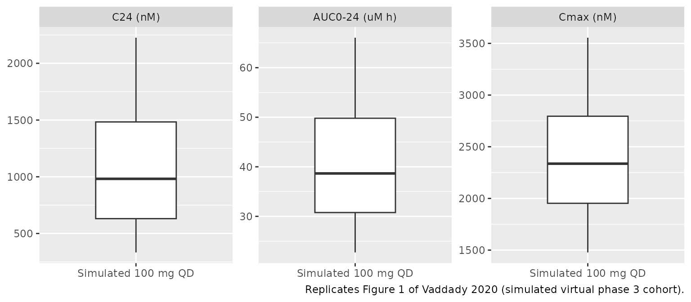
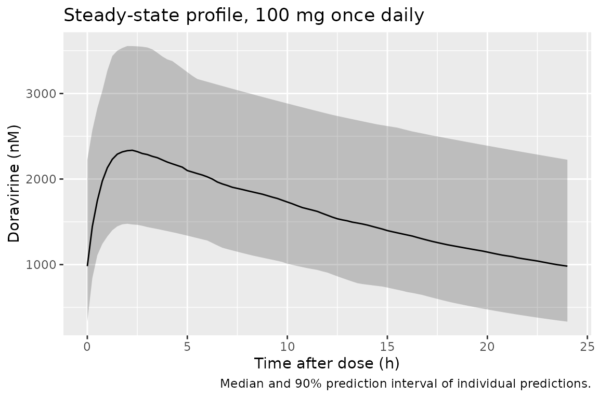

# Doravirine (Vaddady 2020)

## Model and source

- Citation: Vaddady P, Kandala B, Yee KL. Population Pharmacokinetic and
  Pharmacodynamic Analysis To Evaluate a Switch to
  Doravirine/Lamivudine/Tenofovir Disoproxil Fumarate in People Living
  with HIV-1. Antimicrob Agents Chemother. 2020;64(11):e00590-20.
  <doi:10.1128/AAC.00590-20>. Covariate-equation forms and the
  residual-error structure are those of the predecessor model it
  re-estimates: Yee KL, Ouerdani A, Claussen A, de Greef R, Wenning L.
  Population Pharmacokinetics of Doravirine and Exposure-Response
  Analysis in Individuals with HIV-1. Antimicrob Agents Chemother.
  2019;63(4):e02502-18. <doi:10.1128/AAC.02502-18>.
- Description: One-compartment population PK model with first-order
  absorption for oral doravirine in healthy participants,
  treatment-naive adults with HIV-1, and virologically suppressed adults
  with HIV-1 switching to doravirine/lamivudine/tenofovir disoproxil
  fumarate (DRIVE-SHIFT immediate-switch group); linear age effect on
  CL/F, linear weight and healthy-versus-HIV-1 effects on V/F, and
  dose-band relative bioavailability
- Article: <https://doi.org/10.1128/AAC.00590-20> (open access;
  parameter estimates are in Supplemental Table S1 of the online
  supplement)
- Predecessor model (source of the covariate-equation forms and the
  residual-error structure): <https://doi.org/10.1128/AAC.02502-18>

Vaddady 2020 re-estimated the doravirine population PK model of Yee 2019
after adding the sparse PK data of the DRIVE-SHIFT immediate-switch
group (ISG; people living with HIV-1 who were virologically suppressed
on another regimen and switched to doravirine/lamivudine/tenofovir
disoproxil fumarate). The structure and covariates are unchanged from
Yee 2019; only the estimates move slightly. This file packages the
Vaddady 2020 re-estimate.

The paper’s exposure-response analysis (logistic regression of week-48
virologic response on steady-state C24) found slopes not different from
zero and reports no slope estimates, so there is no PD component to
package.

## Population

The analysis data set pooled 341 healthy participants from phase 1
trials, 959 treatment-naive participants with HIV-1 (phase 1b, the phase
2b trial P007 and the phase 3 trials P018 DRIVE-FORWARD and P021
DRIVE-AHEAD), and 443 virologically suppressed participants with HIV-1
from the DRIVE-SHIFT (P024) ISG, for 1,743 participants in total (1,402
with HIV-1). Doses ranged from 6 to 200 mg in phase 1, 25 to 200 mg once
daily in phase 2b, and 100 mg once daily in phase 3. Vaddady 2020 does
not tabulate the demographics of the combined set; Yee 2019 Table 1
reports 80.8% male and 65.2% White, 21.6% Black and 6.7% Asian for the
original 1,300 participants, and the covariate equations are centred on
the median age (34 years) and a reference weight of 75 kg.

``` r

str(readModelDb("Vaddady_2020_doravirine")()$population)
#> List of 11
#>  $ species       : chr "human"
#>  $ n_subjects    : int 1743
#>  $ n_studies     : int 24
#>  $ age_median    : chr "34 years (centring value; Yee 2019 analysis data set)"
#>  $ weight_median : chr "75 kg (centring value)"
#>  $ sex_female_pct: num 19.2
#>  $ race_ethnicity: Named num [1:5] 65.2 21.6 6.7 5.1 1.4
#>   ..- attr(*, "names")= chr [1:5] "White" "Black" "Asian" "Multiracial" ...
#>  $ disease_state : chr "341 healthy participants (phase 1), 959 treatment-naive adults with HIV-1 (phase 1b/2b/3) and 443 virologically"| __truncated__
#>  $ dose_range    : chr "6-200 mg oral doravirine (single and multiple dose) in phase 1; 25-200 mg once daily in phase 2b; 100 mg once daily in phase 3"
#>  $ regions       : chr "Multinational"
#>  $ notes         : chr "Vaddady 2020 main text: 341 healthy + 959 treatment-naive HIV-1 participants of the original Yee 2019 data set "| __truncated__
```

## Source trace

| Equation / parameter | Value | Source location |
|----|----|----|
| One-compartment, first-order absorption, linear CL/F | n/a | Vaddady 2020 main text; Yee 2019 Results |
| `lka` (Ka) | 1.42 1/h | Vaddady 2020 Table S1 |
| `lcl` (CL/F) | 6.21 L/h | Vaddady 2020 Table S1 |
| `lvc` (V/F) | 159 L | Vaddady 2020 Table S1 |
| `lfdepot` (F1, 30-120 mg) | 1 (fixed, reference) | Vaddady 2020 Table S1 |
| `e_dose_lt30_fdepot` (F1, \< 30 mg) | 1.20 | Vaddady 2020 Table S1 |
| `e_dose_gt120_fdepot` (F1, \> 120 mg) | 0.882 | Vaddady 2020 Table S1 |
| `e_age_cl` | -0.00540 per year | Vaddady 2020 Table S1 |
| `e_wt_vc` | 0.00788 per kg | Vaddady 2020 Table S1 |
| `e_dis_healthy_vc` | -0.205 | Vaddady 2020 Table S1 (‘Subject status on V’) |
| `CL = TVCL * (1 + theta * (AGE - 34))` | n/a | Vaddady 2020 Table S1 footnote |
| `V = TVV * (1 + theta * (WT - 75)) * (1 + theta * DIS_HEALTHY)` | n/a | Vaddady 2020 Table S1 footnote (weight term); Yee 2019 Table 2 footnote (healthy-status term, flag = 1 for healthy volunteers) |
| `etalcl` | 0.104 (33.1% CV) | Vaddady 2020 Table S1 |
| `etalvc` | 0.098 (32.1% CV) | Vaddady 2020 Table S1 |
| `expSdP1Early` | 0.224 | Vaddady 2020 Table S1 (‘SD Phase 1 \<=0.5 h postdose’) |
| `expSdP1Late` | 1.25 | Vaddady 2020 Table S1 (‘SD Phase 1 \>0.5 h postdose’) |
| `expSdP23` | 0.504 | Vaddady 2020 Table S1 (‘SD Phase 2b/3’) |
| Additive error on log-transformed concentrations (`lnorm`) | n/a | Yee 2019 Methods and Table 2 footnote |

## Typical-value steady state

For a 34-year-old, 75-kg person living with HIV-1 on 100 mg once daily
the steady-state AUC over a dosing interval must equal `Dose / (CL/F)`
exactly, because F1 = 1 in the 30-120 mg band. Doravirine concentrations
are converted from mg/L to nM with the molecular weight 425.75 g/mol,
the unit the paper reports.

``` r

mod <- readModelDb("Vaddady_2020_doravirine")
mw <- 425.75 # g/mol, doravirine

make_ss_events <- function(dose, n_days = 15, dt = 0.05) {
  last_dose <- (n_days - 1) * 24
  obs_times <- c(0, seq(last_dose, last_dose + 24, by = dt))
  dplyr::bind_rows(
    data.frame(time = seq(0, last_dose, by = 24), evid = 1L, amt = dose, cmt = "depot"),
    data.frame(time = obs_times, evid = 0L, amt = 0, cmt = "central")
  ) |>
    dplyr::arrange(time, dplyr::desc(evid)) |>
    dplyr::mutate(
      id = 1L, AGE = 34, WT = 75, DIS_HEALTHY = 0,
      DOSE_DORAVIRINE_MG = dose, STUDY_PHASE2 = 0, STUDY_PHASE3 = 1
    )
}

typ_mod <- rxode2::zeroRe(mod)
#> ℹ parameter labels from comments will be replaced by 'label()'
#> Warning: No sigma parameters in the model
typ <- lapply(c(25, 100, 200), function(d) {
  s <- as.data.frame(rxode2::rxSolve(typ_mod, make_ss_events(d)))
  last_dose <- 14 * 24
  s <- s[s$time >= last_dose, ]
  data.frame(
    dose = d,
    auc_uMh = sum(diff(s$time) * (head(s$Cc, -1) + tail(s$Cc, -1)) / 2) * 1e3 / mw,
    cmax_nM = max(s$Cc) * 1e6 / mw,
    c24_nM = s$Cc[nrow(s)] * 1e6 / mw
  )
}) |>
  dplyr::bind_rows()
#> ℹ omega/sigma items treated as zero: 'etalcl', 'etalvc'
#> ℹ omega/sigma items treated as zero: 'etalcl', 'etalvc'
#> ℹ omega/sigma items treated as zero: 'etalcl', 'etalvc'
typ$auc_closed_uMh <- c(1.20, 1, 0.882) * typ$dose / 6.21 * 1e3 / mw
knitr::kable(typ, digits = 3, caption = "Typical-value steady-state exposure by dose.")
```

| dose | auc_uMh |  cmax_nM |   c24_nM | auc_closed_uMh |
|-----:|--------:|---------:|---------:|---------------:|
|   25 |  11.347 |  667.406 |  293.391 |         11.347 |
|  100 |  37.822 | 2224.687 |  977.969 |         37.823 |
|  200 |  66.719 | 3924.347 | 1725.137 |         66.719 |

Typical-value steady-state exposure by dose. {.table}

``` r


# Same drawn (typical) parameters on both sides: pure numerical error, so a
# tight bound is correct. Also checks the dose-band F1 multipliers.
stopifnot(all(abs(typ$auc_uMh / typ$auc_closed_uMh - 1) < 0.005))
```

The typical 100-mg values (AUC0-24 37.8 uM h, Cmax 2,220 nM, C24 978 nM)
sit next to the treatment-naive geometric means of Vaddady 2020 Table 1
(38.1 uM h, 2,290 nM, 932 nM).

## Virtual cohort

Vaddady 2020 and Yee 2019 publish the centring values of the covariates
but not their distributions. The cohort below draws age from a normal
distribution centred at 36 years (SD 10, redrawn outside 18-75 years)
and weight from a log-normal distribution with median 75 kg (18% CV,
redrawn outside 40-150 kg). Everyone is a person living with HIV-1 in a
phase 3 study, on 100 mg once daily for 15 days.

``` r

set.seed(20201020)
rxode2::rxSetSeed(20201020)

draw_bounded <- function(n, rfun, lo, hi) {
  x <- rfun(n)
  bad <- x < lo | x > hi
  while (any(bad)) {
    x[bad] <- rfun(sum(bad))
    bad <- x < lo | x > hi
  }
  x
}

n_sub <- 200
cov_df <- data.frame(
  id = seq_len(n_sub),
  AGE = draw_bounded(n_sub, function(n) rnorm(n, 36, 10), 18, 75),
  WT = draw_bounded(n_sub, function(n) 75 * exp(rnorm(n, 0, 0.18)), 40, 150)
)

base_ev <- make_ss_events(100, dt = 0.25) |>
  dplyr::select(-id, -AGE, -WT)
events <- cov_df |>
  dplyr::cross_join(base_ev) |>
  dplyr::mutate(treatment = "100 mg QD") |>
  dplyr::arrange(id, time, dplyr::desc(evid))
stopifnot(!anyDuplicated(events[, c("id", "time", "evid")]))
```

## Simulation

``` r

sim <- rxode2::rxSolve(mod, events = events, keep = c("treatment")) |>
  as.data.frame()
#> ℹ parameter labels from comments will be replaced by 'label()'
```

## PKNCA validation

The published exposures are steady-state AUC0-24, Cmax and C24 in nM, so
the NCA runs on the last dosing interval (336-360 h) after converting
`Cc` to nM.

``` r

sim_nca <- sim |>
  dplyr::filter(!is.na(Cc)) |>
  dplyr::mutate(Cc = Cc * 1e6 / mw) |>
  dplyr::select(id, time, Cc, treatment)

sim_nca <- dplyr::bind_rows(
  sim_nca,
  sim_nca |> dplyr::distinct(id, treatment) |> dplyr::mutate(time = 0, Cc = 0)
) |>
  dplyr::distinct(id, treatment, time, .keep_all = TRUE) |>
  dplyr::arrange(id, treatment, time)

conc_obj <- PKNCA::PKNCAconc(sim_nca, Cc ~ time | treatment + id)

dose_df <- events |>
  dplyr::filter(evid == 1) |>
  dplyr::select(id, time, amt, treatment)
dose_obj <- PKNCA::PKNCAdose(dose_df, amt ~ time | treatment + id)

# The grid ends exactly at 360 h, so clast.obs is C24.
intervals <- data.frame(
  start = 336, end = 360,
  auclast = TRUE, cmax = TRUE, clast.obs = TRUE
)
nca_res <- PKNCA::pk.nca(PKNCA::PKNCAdata(conc_obj, dose_obj, intervals = intervals))

nca_ind <- as.data.frame(nca_res$result) |>
  dplyr::select(id, treatment, PPTESTCD, PPORRES) |>
  tidyr::pivot_wider(names_from = PPTESTCD, values_from = PPORRES) |>
  dplyr::mutate(auclast = auclast / 1000) # nM h -> uM h
```

### Comparison against published NCA

Vaddady 2020 Table 1 reports geometric means, so the simulated side is
aggregated as a geometric mean as well.

``` r

geo_mean <- function(x) exp(mean(log(x)))
simulated <- nca_ind |>
  dplyr::group_by(treatment) |>
  dplyr::summarise(
    auclast = geo_mean(auclast),
    cmax = geo_mean(cmax),
    clast.obs = geo_mean(clast.obs),
    .groups = "drop"
  )

published <- tibble::tribble(
  ~treatment, ~auclast, ~cmax, ~clast.obs,
  "100 mg QD", 38.1, 2290, 932
)

cmp <- nlmixr2lib::ncaComparisonTable(
  simulated = simulated,
  reference = published,
  by = "treatment",
  units = c(auclast = "uM*h", cmax = "nM", clast.obs = "nM"),
  tolerance_pct = 20
)
knitr::kable(
  cmp,
  caption = paste(
    "Simulated vs. published (Vaddady 2020 Table 1, treatment-naive phase 3,",
    "N = 730) steady-state geometric means. AUC is AUC0-24 and the last observed concentration (clast.obs, at 24 h post dose) is C24.",
    "* differs from reference by >20%."
  )
)
```

| NCA parameter   | treatment | Reference | Simulated | % diff |
|:----------------|:----------|:----------|:----------|:-------|
| Cmax (nM)       | 100 mg QD | 2290      | 2320      | +1.2%  |
| Clast (nM)      | 100 mg QD | 932       | 935       | +0.3%  |
| AUClast (uM\*h) | 100 mg QD | 38.1      | 38.5      | +1.1%  |

Simulated vs. published (Vaddady 2020 Table 1, treatment-naive phase 3,
N = 730) steady-state geometric means. AUC is AUC0-24 and the last
observed concentration (clast.obs, at 24 h post dose) is C24. \* differs
from reference by \>20%. {.table}

``` r


gcv <- function(x) 100 * sqrt(exp(stats::var(log(x))) - 1)
spread <- nca_ind |>
  dplyr::summarise(
    `AUC0-24 geo %CV` = gcv(auclast),
    `Cmax geo %CV` = gcv(cmax),
    `C24 geo %CV` = gcv(clast.obs)
  )
knitr::kable(
  spread,
  digits = 1,
  caption = "Simulated between-subject spread (published treatment-naive: 28.8%, 18.2%, 62.7%)."
)
```

| AUC0-24 geo %CV | Cmax geo %CV | C24 geo %CV |
|----------------:|-------------:|------------:|
|            35.5 |         26.1 |          67 |

Simulated between-subject spread (published treatment-naive: 28.8%,
18.2%, 62.7%). {.table}

``` r


# Structural gate on the centre of the distribution: a mis-transcribed CL/F,
# V/F or dose band moves these by tens of percent.
stopifnot(
  abs(simulated$auclast / 38.1 - 1) < 0.15,
  abs(simulated$cmax / 2290 - 1) < 0.15,
  abs(simulated$clast.obs / 932 - 1) < 0.25
)
```

The simulated geometric means agree with the published treatment-naive
values. The simulated between-subject spread is somewhat wider than the
published one, most visibly for AUC0-24 and Cmax. That is expected: the
published values are computed from post hoc (empirical Bayes) parameter
estimates, which shrink toward the typical value when the data are
sparse (the reported eta-shrinkage on V/F is 43.1%), whereas the
simulation draws the full IIV. The DRIVE-SHIFT ISG row of Table 1
(AUC0-24 41.5 uM h, Cmax 2,390 nM, C24 1,110 nM, N = 443) is about 9%
higher on AUC; within the model this corresponds to an older cohort (age
lowers CL/F by 0.54% per year above 34 years), and the paper concludes
the two populations are comparable.

## Replicate published figures

``` r

# Replicates Figure 1 of Vaddady 2020: distribution of steady-state C24,
# AUC0-24 and Cmax after 100 mg once daily (boxes 25th/50th/75th percentiles,
# whiskers 5th/95th percentiles).
fig1 <- nca_ind |>
  dplyr::transmute(
    `C24 (nM)` = clast.obs,
    `AUC0-24 (uM h)` = auclast,
    `Cmax (nM)` = cmax
  ) |>
  tidyr::pivot_longer(dplyr::everything(), names_to = "metric") |>
  dplyr::group_by(metric) |>
  dplyr::summarise(
    ymin = quantile(value, 0.05), lower = quantile(value, 0.25),
    middle = quantile(value, 0.5), upper = quantile(value, 0.75),
    ymax = quantile(value, 0.95), .groups = "drop"
  ) |>
  dplyr::mutate(metric = factor(metric, levels = c("C24 (nM)", "AUC0-24 (uM h)", "Cmax (nM)")))

ggplot(fig1, aes(x = "Simulated 100 mg QD")) +
  geom_boxplot(
    aes(ymin = ymin, lower = lower, middle = middle, upper = upper, ymax = ymax),
    stat = "identity", width = 0.5
  ) +
  facet_wrap(~metric, scales = "free_y") +
  labs(
    x = NULL, y = NULL,
    caption = "Replicates Figure 1 of Vaddady 2020 (simulated virtual phase 3 cohort)."
  )
```



``` r

sim |>
  dplyr::filter(time >= 336) |>
  dplyr::mutate(tad = time - 336, Cc_nM = Cc * 1e6 / mw) |>
  dplyr::group_by(tad) |>
  dplyr::summarise(
    Q05 = quantile(Cc_nM, 0.05), Q50 = quantile(Cc_nM, 0.5),
    Q95 = quantile(Cc_nM, 0.95), .groups = "drop"
  ) |>
  ggplot(aes(tad, Q50)) +
  geom_ribbon(aes(ymin = Q05, ymax = Q95), alpha = 0.25) +
  geom_line() +
  labs(
    x = "Time after dose (h)", y = "Doravirine (nM)",
    title = "Steady-state profile, 100 mg once daily",
    caption = "Median and 90% prediction interval of individual predictions."
  )
```



## Assumptions and deviations

- **Covariate-equation forms from the predecessor.** Vaddady 2020 prints
  the age and weight equations but not how the healthy-versus-HIV-1
  status enters V/F. The model uses the Yee 2019 form, \`V = TVV \* (1 +
  theta_WT \* (WT - 75))
  - (1 + theta_healthy \* flag)\` with flag = 1 for healthy volunteers,
    since Vaddady 2020 states that the prior model structure was
    re-estimated unchanged.
- **Residual error.** Additive on log-transformed concentrations (Yee
  2019), encoded as `lnorm()`. The SDs are selected by study phase
  (`STUDY_PHASE2` / `STUDY_PHASE3`) and, for phase 1, by time after the
  most recent dose (`tad()`, 0.5 h cut-off). The table labels are
  transcribed as printed: 0.224 for phase 1 records at or before 0.5 h
  postdose and 1.25 after 0.5 h. Both Vaddady 2020 Table S1 and Yee 2019
  Table 2 print this assignment, although the Yee 2019 prose (the
  early-absorption samples being the poorly described ones) reads more
  naturally with the larger SD on the early records. The choice affects
  only simulated observation noise, never the individual predictions.
- **Dose bands.** F1 bands are `< 30 mg`, `30-120 mg` and `> 120 mg`; a
  dose of exactly 30 or 120 mg falls in the reference band.
  `DOSE_DORAVIRINE_MG` must be set to the per-administration dose.
- **No IIV on Ka**: none was estimated in either paper.
- **Virtual cohort.** Age and weight distributions are assumptions
  centred on the published centring values; the papers do not report the
  distributions for the combined data set.
- **Exposure-response.** Not packaged: the paper reports only that the
  logistic-regression slopes were not significantly different from zero,
  with no intercept or slope estimates.
- No correction notice was found for Vaddady 2020 (checked 2026-09-27).
