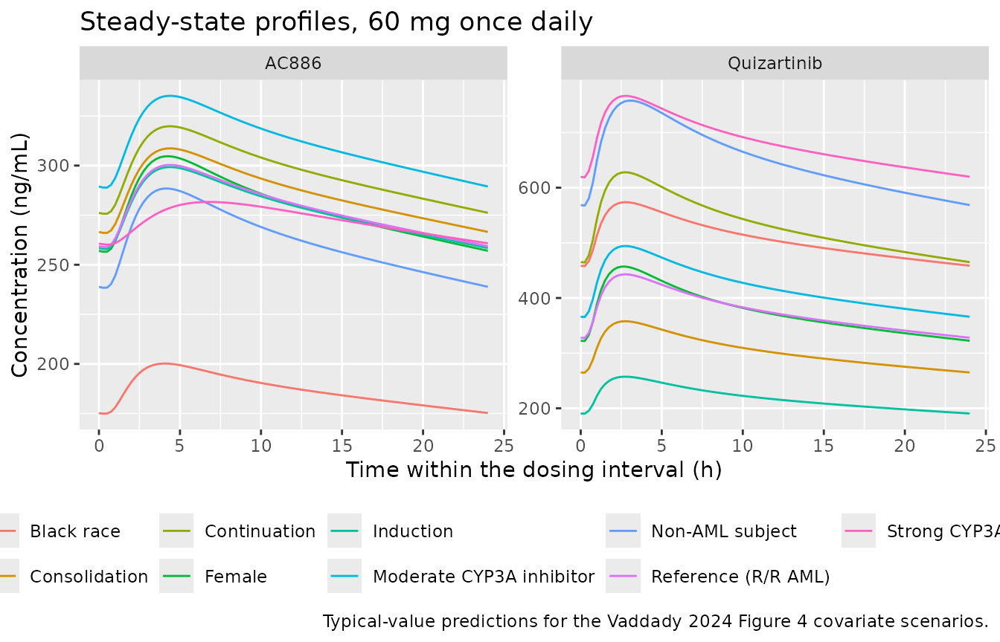
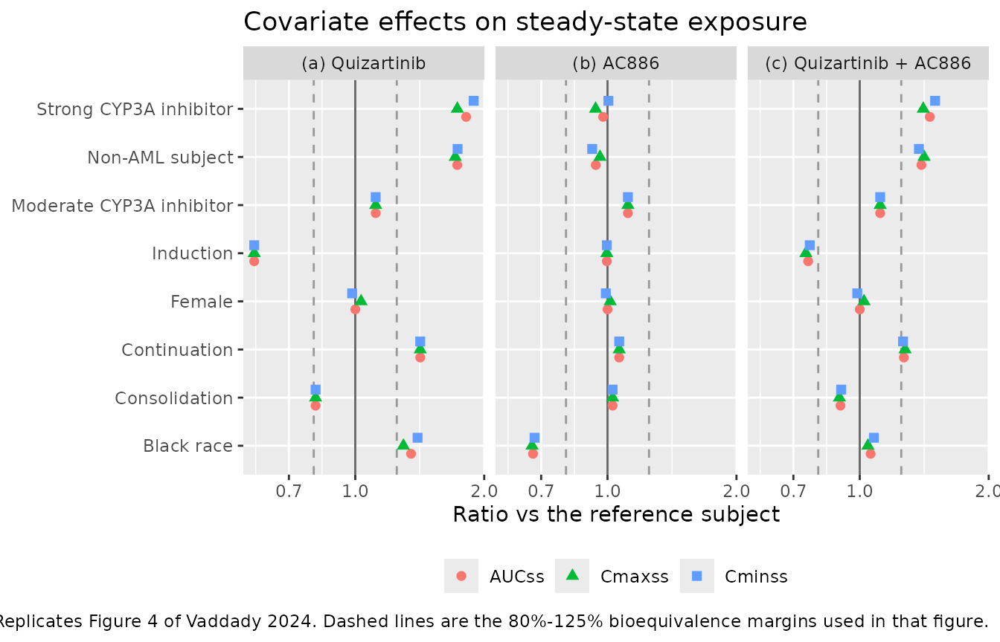
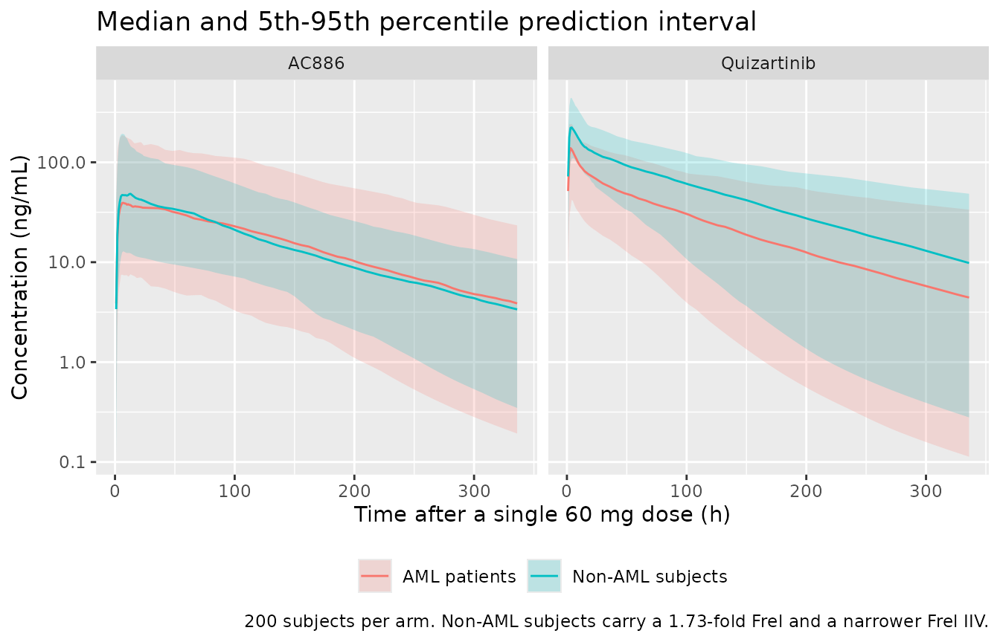

# Quizartinib and AC886 (Vaddady 2024)

## Model and source

``` r

mod <- readModelDb("Vaddady_2024_quizartinib")
ui  <- rxode2::rxode(mod)
#> ℹ parameter labels from comments will be replaced by 'label()'
#> Warning: some etas defaulted to non-mu referenced, possible parsing error: etalfdepot_aml, etalfdepot_nonaml, etalcl_ac886_aml, etalcl_ac886_nonaml
#> as a work-around try putting the mu-referenced expression on a simple line
```

- Citation: Vaddady P, Glatard A, Smania G, Nakayama S, Inoue H,
  Kurumaddali A, Abutarif M, Zheng M. Population pharmacokinetic
  analysis of quizartinib in patients with newly diagnosed
  FLT3-internal-tandem-duplication-positive acute myeloid leukemia. Clin
  Transl Sci. 2024;17:e70074. <doi:10.1111/cts.70074>
- Article: <https://doi.org/10.1111/cts.70074> (open access,
  PMC11600623)
- Supporting Information: model Equations 8-20 and both final NONMEM
  control streams are distributed with the article and were used
  throughout this extraction.

Joint parent-metabolite population PK model for oral quizartinib and its
pharmacologically active metabolite AC886 in adults, pooled across 13
studies in healthy volunteers, subjects with hepatic impairment,
relapsed/refractory (R/R) FLT3-ITD-positive acute myeloid leukemia (AML)
patients on quizartinib monotherapy, and newly diagnosed
FLT3-ITD-positive AML patients receiving quizartinib alongside standard
cytarabine-anthracycline induction and cytarabine consolidation
chemotherapy followed by single-agent continuation (QuANTUM-First;
Vaddady 2024). Quizartinib is described by a three-compartment model
with sequential zero-order (duration D1) then first-order (ka)
absorption from a depot, an absorption lag time, and first-order
elimination from the central compartment. AC886 is described by a
two-compartment model with first-order formation from the quizartinib
central compartment and first-order elimination. Because no intravenous
data were available, the parent-to-metabolite conversion fraction fMET
is not identifiable and is fixed at 0.5; following the authors’
parameterisation, the entire parent elimination flux is routed into the
metabolite compartment and all four AC886 disposition parameters are
divided by fMET, which is algebraically equivalent and leaves fMET
acting as a pure multiplicative scale on predicted AC886 concentrations.
Retained covariates are allometric body-weight scaling on all clearances
and volumes of both moieties (exponents fixed at 0.75 and 1), strong
CYP3A inhibitor coadministration on quizartinib CL and Frel, moderate
CYP3A inhibitor coadministration on Frel, non-AML subject status on Frel
and ka, Black race on quizartinib CL, female sex on quizartinib Vc, age
on the first peripheral volume, and, for newly diagnosed AML patients
only, a treatment-phase effect (induction / consolidation /
continuation) on Frel. AC886 covariates are non-AML status, Black race
and strong CYP3A inhibitors on CL, strong CYP3A inhibitors on Vc, and
the same treatment-phase effect on fMET. Interindividual variability is
reported on quizartinib CL, Q1, Vc, Tlag, ka, D1 and Frel (with separate
Frel variances for AML patients, whose eta is Box-Cox transformed, and
non-AML subjects) and on AC886 CL (separate variances for AML patients
and non-AML subjects) and Vc. Residual error is additive on the log
scale, i.e. proportional on the linear concentration scale, separately
for each moiety.

## Population

The analysis pooled 932 subjects contributing 14,160 quizartinib and
13,399 AC886 plasma concentrations across 13 studies (nine Phase 1, two
Phase 2, two Phase 3), summarised in Vaddady 2024 Table 1. The pooled
analysis set comprises 294 newly diagnosed FLT3-ITD-positive AML
patients from the Phase 3 QuANTUM-First trial (AC220-A-U302), 365
relapsed/refractory (R/R) FLT3-ITD-positive AML patients, and 273
non-AML subjects (healthy volunteers and subjects with hepatic
impairment). Baseline demographics (Vaddady 2024 Table 2): age 18-91
years (median 50.0), weight 36.8-153 kg (median 72.0), 46.9% female,
65.4% White / 18.1% Asian / 8.5% Black / 4.8% Other. Doses ranged from
20 to 90 mg/day, given as tablet (86.4%) or oral solution (13.6%). CYP3A
inhibitor use was common: 19.7% strong, 18.9% moderate, 9.1% weak, 52.3%
none.

The same information is available programmatically from the model’s
`population` metadata:

``` r

str(ui$population, max.level = 1)
#> List of 16
#>  $ species         : chr "human"
#>  $ n_subjects      : int 932
#>  $ n_studies       : int 13
#>  $ age_range       : chr "18-91 years (median 50.0); the QuANTUM-First subset enrolled patients aged 20-75 years"
#>  $ age_median      : chr "50.0 years"
#>  $ weight_range    : chr "36.8-153 kg (median 72.0)"
#>  $ weight_median   : chr "72.0 kg"
#>  $ sex_female_pct  : num 46.9
#>  $ race_ethnicity  : Named num [1:4] 65.4 8.5 18.1 4.8
#>   ..- attr(*, "names")= chr [1:4] "White" "Black" "Asian" "Other"
#>  $ disease_state   : chr "Pooled: 294 newly diagnosed FLT3-ITD-positive AML patients (31.5%), 365 relapsed/refractory FLT3-ITD-positive A"| __truncated__
#>  $ dose_range      : chr "20-90 mg/day oral quizartinib as tablet (805/932 subjects) or oral solution (127/932), given as single doses (3"| __truncated__
#>  $ regions         : chr "Multinational; three of the 13 studies enrolled Japanese patients (AC220-A-J101, AC220-A-J102, AC220-A-J201) an"| __truncated__
#>  $ n_observations  : chr "14,160 quizartinib and 13,399 AC886 plasma concentrations. Quantified by two cross-validated LC-MS/MS methods w"| __truncated__
#>  $ hepatic_function: chr "Includes a dedicated Child-Pugh hepatic-impairment study (AC220-016, 30 subjects) and an NCI-ODWG-criteria hepa"| __truncated__
#>  $ co_medication   : chr "CYP3A inhibitors: none 487/932 (52.3%), weak 85/932 (9.1%), moderate 176/932 (18.9%), strong 184/932 (19.7%). C"| __truncated__
#>  $ notes           : chr "Baseline demographics are Vaddady 2024 Table 2; the study inventory (13 studies: nine Phase 1, two Phase 2, two"| __truncated__
```

## Source trace

Every `ini()` value carries an in-file comment naming its source
location. The table below collects them for review. All typical values
and variances come from **Vaddady 2024 Table 3**; the closed-form
covariate relationships come from **Supporting Information Equations
6-20**.

| Model element | Value | Source location |
|----|----|----|
| `lcl` quizartinib CL/F | 6.65 L/h | Table 3, Eq 8 |
| `lvc` quizartinib Vc/F | 371 L | Table 3, Eq 11 |
| `lq` quizartinib Q1/F | 40.7 L/h | Table 3, Eq 12 |
| `lvp` quizartinib Vp1/F | 312 L | Table 3, Eq 13 |
| `lq2` quizartinib Q2/F | 0.757 L/h | Table 3, Eq 14 |
| `lvp2` quizartinib Vp2/F | 91.9 L | Table 3, Eq 15 |
| `ltlag` absorption lag | 0.196 h | Table 3 |
| `lka` absorption rate | 1.10 1/h | Table 3, Eq 10 |
| `ld1` zero-order input duration | 0.710 h | Table 3 |
| `lfdepot` Frel at R/R AML reference | 1 (fixed) | Eq 9 (reference level) |
| `e_wt_cl`, `e_wt_vc` allometric exponents | 0.75, 1 (fixed) | Eq 6 |
| `e_cyp3a4_inh_strong_cl` | -0.301 | Table 3, Eq 8 |
| `e_race_black_cl` | -0.261 | Table 3, Eq 8 |
| `e_sexf_vc` | -0.169 | Table 3, Eq 11 |
| `e_age_vp` | 0.0152 1/year | Table 3, Eq 13 |
| `e_nonaml_ka` | -0.188 | Table 3, Eq 10 |
| `e_cyp3a4_inh_strong_fdepot` | 0.273 | Table 3, Eq 9 |
| `e_cyp3a4_inh_mod_fdepot` | 0.116 | Table 3, Eq 9 |
| `e_nonaml_fdepot` | 1.73 (a level, not a fractional change) | Table 3, Eq 9 |
| `e_trtph_*_fdepot` induction / consolidation / continuation | -0.419 / -0.192 / 0.418 | Table 3, Eq 9 |
| `boxcox_fdepot` | -1.28 | Table 3, Eq 2 |
| `lcl_ac886` AC886 CL/F | 4.61 L/h | Table 3, Eq 17 |
| `lvc_ac886` AC886 Vc/F | 8.93 L | Table 3, Eq 18 |
| `lq_ac886` AC886 Q/F | 3.76 L/h | Table 3, Eq 19 |
| `lvp_ac886` AC886 Vp/F | 68.5 L | Table 3, Eq 20 |
| `fmet_base` conversion fraction | 0.5 (fixed) | Methods, Eq 16 |
| `e_nonaml_cl_ac886` | 0.843 | Table 3, Eq 17 |
| `e_race_black_cl_ac886` | 0.488 | Table 3, Eq 17 |
| `e_cyp3a4_inh_strong_cl_ac886` | 0.298 | Table 3, Eq 17 |
| `e_cyp3a4_inh_strong_vc_ac886` | 2.79 | Table 3, Eq 18 |
| `e_trtph_*_fmet` induction / consolidation / continuation | 0.715 / 0.272 / -0.249 | Table 3, Eq 16 |
| IIV variances (`etalcl`, `etalq`, `etalvc`, `etaltlag`, `etalka`, `etald1`) | 0.695, 0.691, 0.186, 0.647, 0.423, 0.821 (as SD) | Table 3 |
| IIV Frel, AML / non-AML | 0.444 / 0.256 (as SD) | Table 3 |
| IIV CL AC886, AML / non-AML | 0.740 / 0.516 (as SD) | Table 3 |
| IIV Vc AC886 | 1.36 (as SD) | Table 3 |
| `propSd`, `propSd_ac886` | 0.440, 0.452 | Table 3 (AML patients) |
| Reference subject (75 kg, 47 years, male, R/R AML, no CYP3A, not Black) | n/a | Eq 6, Eq 13, Figure 4 caption |
| Molecular weights 560.68 / 576.67 g/mol | n/a | Methods |
| ODE structure | n/a | Figure 1a/1b; Supporting Information NONMEM streams |

### Three confirmations that Table 3 holds final estimates on the SD scale

1.  **Final, not initial.** The final AC886 control stream re-states
    every quizartinib parameter as a `FIX` row at higher precision
    (`6.6545 FIX ; 1_CL` against Table 3’s 6.65; `371.079 FIX` against
    371; `40.7235 FIX` against 40.7). The non-`FIX` `$THETA` rows in
    both streams are initial estimates and differ materially
    (quizartinib CL initial 6.85443; AC886 CL initial 4.81815 against a
    final 4.61).
2.  **Table 3’s “(CV)” column is the log-scale SD, not a variance and
    not a true lognormal CV.** Each value squares to the corresponding
    `$OMEGA` / `$SIGMA` entry: `0.695^2 = 0.483` against
    `2_IIV_CL_AML = 0.481313`; `0.740^2 = 0.548` against AC886
    `2_CLM = 0.542698`; `1.36^2 = 1.850` against `3_V5 = 1.85491`;
    `0.440^2 = 0.194` against `$SIGMA 1_RUV_AML = 0.194347`.
3.  **The paper’s own prose reads the column the same way.** The
    Abstract reports “approximately 70% coefficient of variation for
    systemic clearances” and the Discussion “a CV of 44% for Frel and
    74% for CLAC886” – i.e. the omega values 0.695, 0.444 and 0.740
    multiplied by 100, with no lognormal back-transformation. (A true
    lognormal CV for omega = 0.695 would be
    `sqrt(exp(0.695^2) - 1) = 79%`.)

The model file therefore stores each variance as `omega^2` with the
reported omega visible in the expression.

## Model structure notes

Three implementation points are worth stating before the simulations.

**Sequential zero- then first-order absorption.** The dose enters
`depot` at a zero-order rate over `D1 = 0.710 h`, beginning after
`Tlag = 0.196 h`, and then transfers to `central` by first-order `ka`.
rxode2 applies a modelled `dur()` only to dose records carrying
`rate = -2`; a plain bolus silently ignores it and collapses Tmax onto
the lag time. **Every dose record below sets `rate = -2`.**

**Two declared endpoints.** The model declares both `Cc` and `Cc_ac886`
with residual error, so rxode2 builds endpoint pseudo-compartments after
the six ODE states. Observation records therefore address the **endpoint
name** (`cmt = "Cc"`), not an ODE state; `cmt = "central"` fails with a
`'dvid'->'cmt' ... undefined compartment` error for this model class.
Every `rxSolve()` call also passes `useLinCmt = FALSE`, because the
automatic ODE-to-linCmt conversion corrupts the dvid mapping.
`rxSolve()` returns both observables as columns regardless of which
endpoint the row names.

**The fMET reparameterization.** No intravenous data were available, so
the parent-to-metabolite conversion fraction is not identifiable and is
fixed at 0.5. Following the authors’ control stream, the model routes
the entire parent elimination flux into `central_ac886` (`K25 = CL/V2`,
`K20 = 0`) and divides all four AC886 disposition parameters by fMET.
The fMET factors cancel in every rate constant, so fMET acts purely as a
multiplicative scale on predicted AC886 concentrations – exactly as the
authors intended, and the reason they could state that “the model fit is
not affected by the value of fMET”.

## Virtual cohort

Original observed data are not publicly available. The deterministic
scenarios below use the paper’s own reference subject (Vaddady 2024
Figure 4 caption: 75 kg, 47 years, male, R/R AML patient, no CYP3A
coadministration, not Black) with one covariate varied at a time – the
construction Figure 4 uses.

``` r

reference_subject <- tibble::tibble(
  WT = 75, AGE = 47, SEXF = 0, RACE_BLACK = 0, DIS_AML = 1,
  CONMED_CYP3A4_INH_STRONG = 0, CONMED_CYP3A4_INH_MOD = 0,
  TRTPH_INDUCTION = 0, TRTPH_CONSOLIDATION = 0, TRTPH_CONTINUATION = 0
)

vary <- function(...) {
  out <- reference_subject
  repl <- list(...)
  out[names(repl)] <- repl
  out
}

scenarios <- dplyr::bind_rows(
  vary()                                     |> dplyr::mutate(scenario = "Reference (R/R AML)"),
  vary(CONMED_CYP3A4_INH_STRONG = 1)         |> dplyr::mutate(scenario = "Strong CYP3A inhibitor"),
  vary(CONMED_CYP3A4_INH_MOD = 1)            |> dplyr::mutate(scenario = "Moderate CYP3A inhibitor"),
  vary(DIS_AML = 0)                          |> dplyr::mutate(scenario = "Non-AML subject"),
  vary(RACE_BLACK = 1)                       |> dplyr::mutate(scenario = "Black race"),
  vary(SEXF = 1)                             |> dplyr::mutate(scenario = "Female"),
  vary(TRTPH_INDUCTION = 1)                  |> dplyr::mutate(scenario = "Induction"),
  vary(TRTPH_CONSOLIDATION = 1)              |> dplyr::mutate(scenario = "Consolidation"),
  vary(TRTPH_CONTINUATION = 1)               |> dplyr::mutate(scenario = "Continuation")
) |>
  dplyr::mutate(id = dplyr::row_number(), .before = 1)

knitr::kable(
  scenarios |> dplyr::select(scenario, WT, AGE, SEXF, RACE_BLACK, DIS_AML,
                             CONMED_CYP3A4_INH_STRONG, CONMED_CYP3A4_INH_MOD,
                             TRTPH_INDUCTION, TRTPH_CONSOLIDATION, TRTPH_CONTINUATION),
  caption = "Covariate scenarios. One factor is varied at a time from the Vaddady 2024 Figure 4 reference subject."
)
```

| scenario | WT | AGE | SEXF | RACE_BLACK | DIS_AML | CONMED_CYP3A4_INH_STRONG | CONMED_CYP3A4_INH_MOD | TRTPH_INDUCTION | TRTPH_CONSOLIDATION | TRTPH_CONTINUATION |
|:---|---:|---:|---:|---:|---:|---:|---:|---:|---:|---:|
| Reference (R/R AML) | 75 | 47 | 0 | 0 | 1 | 0 | 0 | 0 | 0 | 0 |
| Strong CYP3A inhibitor | 75 | 47 | 0 | 0 | 1 | 1 | 0 | 0 | 0 | 0 |
| Moderate CYP3A inhibitor | 75 | 47 | 0 | 0 | 1 | 0 | 1 | 0 | 0 | 0 |
| Non-AML subject | 75 | 47 | 0 | 0 | 0 | 0 | 0 | 0 | 0 | 0 |
| Black race | 75 | 47 | 0 | 1 | 1 | 0 | 0 | 0 | 0 | 0 |
| Female | 75 | 47 | 1 | 0 | 1 | 0 | 0 | 0 | 0 | 0 |
| Induction | 75 | 47 | 0 | 0 | 1 | 0 | 0 | 1 | 0 | 0 |
| Consolidation | 75 | 47 | 0 | 0 | 1 | 0 | 0 | 0 | 1 | 0 |
| Continuation | 75 | 47 | 0 | 0 | 1 | 0 | 0 | 0 | 0 | 1 |

Covariate scenarios. One factor is varied at a time from the Vaddady
2024 Figure 4 reference subject. {.table}

Event tables are built as plain data frames (not
[`rxode2::et()`](https://nlmixr2.github.io/rxode2/reference/et.html)) so
that the `rate = -2` flag and the endpoint-named `cmt` column survive
intact.

``` r

DOSE_MG   <- 60    # a QuANTUM-First tablet strength (Vaddady 2024 Table 1)
TAU       <- 24    # once-daily dosing
N_DAYS_SS <- 42    # long enough for the slow deep compartment to equilibrate

build_events <- function(covariates, dose = DOSE_MG, n_days = N_DAYS_SS,
                         tau = TAU, grid = seq(0, TAU, by = 0.25)) {
  last_dose_time <- (n_days - 1) * tau
  doses <- covariates |>
    dplyr::mutate(time = 0, amt = dose, evid = 1L, rate = -2,
                  ii = tau, addl = as.integer(n_days - 1), cmt = "depot")
  obs <- covariates |>
    tidyr::crossing(time = last_dose_time + grid) |>
    dplyr::mutate(amt = NA_real_, evid = 0L, rate = NA_real_,
                  ii = 0, addl = 0L, cmt = "Cc")
  dplyr::bind_rows(doses, obs) |>
    dplyr::arrange(id, time, dplyr::desc(evid))
}

events_ss <- build_events(scenarios)
stopifnot(!anyDuplicated(unique(events_ss[, c("id", "time", "evid")])))
```

## Simulation

``` r

sim_ss <- rxode2::rxSolve(
  mod, events = events_ss,
  omega = NA,            # typical-value (deterministic) replication of Figure 4
  useLinCmt = FALSE,     # the ODE-to-linCmt auto-conversion breaks the dvid map
  keep = c("scenario"),
  returnType = "data.frame"
)
#> ℹ parameter labels from comments will be replaced by 'label()'
#> Warning: some etas defaulted to non-mu referenced, possible parsing error: etalfdepot_aml, etalfdepot_nonaml, etalcl_ac886_aml, etalcl_ac886_nonaml
#> as a work-around try putting the mu-referenced expression on a simple line
#> Warning: multi-subject simulation without without 'omega'

# rxSolve silently drops subjects on some failures -- assert the count.
stopifnot(dplyr::n_distinct(sim_ss$id) == nrow(scenarios))
stopifnot(!anyNA(sim_ss$Cc), !anyNA(sim_ss$Cc_ac886))
```

### Steady-state concentration-time profiles

``` r

sim_ss |>
  dplyr::mutate(time_in_interval = time - min(time), .by = id) |>
  tidyr::pivot_longer(c(Cc, Cc_ac886), names_to = "moiety", values_to = "conc") |>
  dplyr::mutate(moiety = dplyr::recode(moiety,
                                       Cc = "Quizartinib", Cc_ac886 = "AC886")) |>
  ggplot(aes(time_in_interval, conc, colour = scenario)) +
  geom_line() +
  facet_wrap(~moiety, scales = "free_y") +
  labs(x = "Time within the dosing interval (h)", y = "Concentration (ng/mL)",
       colour = NULL,
       title = "Steady-state profiles, 60 mg once daily",
       caption = "Typical-value predictions for the Vaddady 2024 Figure 4 covariate scenarios.") +
  theme(legend.position = "bottom")
```



The quizartinib profile is strikingly flat across the dosing interval –
a consequence of the very slow second peripheral compartment
(`Q2 = 0.757 L/h` into `Vp2 = 91.9 L`, a distribution half-life of
roughly 84 h), which is what makes quizartinib a once-daily drug with a
low peak-to-trough ratio.

## PKNCA validation

Steady-state NCA over the final 24 h dosing interval, one PKNCA block
per moiety (the model has two outputs), grouped by scenario.

``` r

last_dose_time <- (N_DAYS_SS - 1) * TAU

dose_df <- events_ss |>
  dplyr::filter(evid == 1) |>
  dplyr::select(id, scenario, amt) |>
  dplyr::mutate(time = last_dose_time)   # the dose that opens the SS interval

nca_intervals <- data.frame(
  start   = last_dose_time,
  end     = last_dose_time + TAU,
  cmax    = TRUE,
  tmax    = TRUE,
  cmin    = TRUE,
  auclast = TRUE,
  cav     = TRUE
)

run_nca <- function(conc_col) {
  conc_df <- sim_ss |>
    dplyr::select(id, scenario, time, Cc = dplyr::all_of(conc_col)) |>
    dplyr::filter(!is.na(Cc))
  conc_obj <- PKNCA::PKNCAconc(as.data.frame(conc_df), Cc ~ time | scenario + id,
                               concu = "ng/mL", timeu = "h")
  dose_obj <- PKNCA::PKNCAdose(as.data.frame(dose_df), amt ~ time | scenario + id,
                               doseu = "mg")
  PKNCA::pk.nca(PKNCA::PKNCAdata(conc_obj, dose_obj, intervals = nca_intervals))
}

nca_quiz  <- run_nca("Cc")
nca_ac886 <- run_nca("Cc_ac886")
```

``` r

tidy_nca <- function(res, moiety) {
  as.data.frame(res$result) |>
    dplyr::filter(PPTESTCD %in% c("cmax", "cmin", "tmax", "auclast", "cav")) |>
    dplyr::select(scenario, PPTESTCD, PPORRES) |>
    dplyr::mutate(moiety = moiety)
}

nca_long <- dplyr::bind_rows(
  tidy_nca(nca_quiz, "Quizartinib"),
  tidy_nca(nca_ac886, "AC886")
)

nca_long |>
  tidyr::pivot_wider(names_from = PPTESTCD, values_from = PPORRES) |>
  dplyr::select(moiety, scenario, auclast, cmax, cmin, tmax, cav) |>
  dplyr::arrange(dplyr::desc(moiety), scenario) |>
  dplyr::rename(
    "Moiety"                = moiety,
    "Scenario"              = scenario,
    "AUCss (ng*h/mL)"       = auclast,
    "Cmax,ss (ng/mL)"       = cmax,
    "Cmin,ss (ng/mL)"       = cmin,
    "Tmax,ss (h)"           = tmax,
    "Cavg,ss (ng/mL)"       = cav
  ) |>
  knitr::kable(digits = c(0, 0, 0, 1, 1, 2, 1),
               caption = "Steady-state NCA (PKNCA) over the final 24 h dosing interval, 60 mg once daily.")
```

| Moiety | Scenario | AUCss (ng\*h/mL) | Cmax,ss (ng/mL) | Cmin,ss (ng/mL) | Tmax,ss (h) | Cavg,ss (ng/mL) |
|:---|:---|---:|---:|---:|---:|---:|
| Quizartinib | Black race | 12165 | 573.8 | 457.9 | 2.75 | 506.9 |
| Quizartinib | Consolidation | 7283 | 357.9 | 264.6 | 2.75 | 303.5 |
| Quizartinib | Continuation | 12782 | 628.1 | 464.4 | 2.75 | 532.6 |
| Quizartinib | Female | 9016 | 456.9 | 322.1 | 2.75 | 375.7 |
| Quizartinib | Induction | 5237 | 257.3 | 190.3 | 2.75 | 218.2 |
| Quizartinib | Moderate CYP3A inhibitor | 10060 | 494.3 | 365.5 | 2.75 | 419.2 |
| Quizartinib | Non-AML subject | 15594 | 758.0 | 567.6 | 3.00 | 649.8 |
| Quizartinib | Reference (R/R AML) | 9014 | 442.9 | 327.5 | 2.75 | 375.6 |
| Quizartinib | Strong CYP3A inhibitor | 16355 | 766.6 | 618.9 | 2.75 | 681.5 |
| AC886 | Black race | 4481 | 200.2 | 174.9 | 4.00 | 186.7 |
| AC886 | Consolidation | 6872 | 308.7 | 266.1 | 4.50 | 286.3 |
| AC886 | Continuation | 7120 | 319.8 | 275.7 | 4.50 | 296.7 |
| AC886 | Female | 6688 | 304.7 | 256.6 | 4.25 | 278.7 |
| AC886 | Induction | 6662 | 299.2 | 257.9 | 4.50 | 277.6 |
| AC886 | Moderate CYP3A inhibitor | 7462 | 335.1 | 288.9 | 4.50 | 310.9 |
| AC886 | Non-AML subject | 6277 | 288.4 | 238.4 | 4.25 | 261.5 |
| AC886 | Reference (R/R AML) | 6686 | 300.3 | 258.9 | 4.50 | 278.6 |
| AC886 | Strong CYP3A inhibitor | 6531 | 281.7 | 260.1 | 6.75 | 272.1 |

Steady-state NCA (PKNCA) over the final 24 h dosing interval, 60 mg once
daily. {.table}

### Structural identity check: AUCss = Frel x Dose / CL

At steady state, mass balance requires that the AUC over one dosing
interval equal `Frel * Dose / CL` exactly, for every subject. This is a
per-subject identity rather than a comparison of medians, so it is a
sharp test of the covariate algebra, the allometric scaling, and the
units conversion all at once.

``` r

identity_tbl <- as.data.frame(nca_quiz$result) |>
  dplyr::filter(PPTESTCD == "auclast") |>
  dplyr::select(scenario, auc_nca = PPORRES) |>
  dplyr::left_join(
    sim_ss |> dplyr::distinct(scenario, frel, cl),
    by = "scenario"
  ) |>
  # 1000 converts mg/L to ng/mL, matching the model's observation equation.
  dplyr::mutate(auc_theory = 1000 * frel * DOSE_MG / cl,
                pct_diff   = 100 * (auc_nca - auc_theory) / auc_theory)

identity_tbl |>
  dplyr::select(scenario, auc_nca, auc_theory, pct_diff) |>
  dplyr::rename("Scenario" = scenario,
                "AUCss by PKNCA (ng*h/mL)" = auc_nca,
                "Frel x Dose / CL (ng*h/mL)" = auc_theory,
                "% difference" = pct_diff) |>
  knitr::kable(digits = c(0, 0, 0, 3),
               caption = "Per-scenario steady-state mass-balance identity.")
```

| Scenario | AUCss by PKNCA (ng\*h/mL) | Frel x Dose / CL (ng\*h/mL) | % difference |
|:---|---:|---:|---:|
| Black race | 12165 | 12209 | -0.365 |
| Consolidation | 7283 | 7290 | -0.094 |
| Continuation | 12782 | 12794 | -0.094 |
| Female | 9016 | 9023 | -0.070 |
| Induction | 5237 | 5242 | -0.094 |
| Moderate CYP3A inhibitor | 10060 | 10069 | -0.094 |
| Non-AML subject | 15594 | 15609 | -0.094 |
| Reference (R/R AML) | 9014 | 9023 | -0.094 |
| Strong CYP3A inhibitor | 16355 | 16432 | -0.465 |

Per-scenario steady-state mass-balance identity. {.table}

``` r


# The residual gap is the finite approach to steady state after 42 daily doses,
# not a structural error. Assert it is under 0.5% everywhere.
stopifnot(nrow(identity_tbl) == nrow(scenarios))
stopifnot(all(abs(identity_tbl$pct_diff) < 0.5))
```

## Replicating the published covariate effects (Figure 4)

Vaddady 2024 Figure 4 is a forest plot of the relative difference in
`AUCss`, `Cmax,ss` and `Cmin,ss` from the reference subject, for
quizartinib (panel a), AC886 (panel b), and their sum (panel c). The
paper’s raster figure carries no extractable numbers, but the Abstract,
Results and Discussion state several of the ratios explicitly. Those
statements are the validation targets below.

``` r

ratio_vs_reference <- function(df, moiety_label) {
  wide <- df |>
    tidyr::pivot_wider(names_from = PPTESTCD, values_from = PPORRES)
  ref <- wide |> dplyr::filter(scenario == "Reference (R/R AML)")
  wide |>
    dplyr::mutate(
      moiety = moiety_label,
      AUCss  = auclast / ref$auclast,
      Cmaxss = cmax    / ref$cmax,
      Cminss = cmin    / ref$cmin
    ) |>
    dplyr::select(moiety, scenario, AUCss, Cmaxss, Cminss)
}

# Panel (c) sums the two moieties on the ng/mL scale (Vaddady 2024 Methods:
# the molecular weights differ by under 3%, so the authors summed directly).
total_nca <- {
  conc_df <- sim_ss |>
    dplyr::mutate(Cc = Cc + Cc_ac886) |>
    dplyr::select(id, scenario, time, Cc)
  conc_obj <- PKNCA::PKNCAconc(as.data.frame(conc_df), Cc ~ time | scenario + id,
                               concu = "ng/mL", timeu = "h")
  dose_obj <- PKNCA::PKNCAdose(as.data.frame(dose_df), amt ~ time | scenario + id,
                               doseu = "mg")
  PKNCA::pk.nca(PKNCA::PKNCAdata(conc_obj, dose_obj, intervals = nca_intervals))
}

forest <- dplyr::bind_rows(
  ratio_vs_reference(tidy_nca(nca_quiz,  "x") |> dplyr::select(-moiety), "(a) Quizartinib"),
  ratio_vs_reference(tidy_nca(nca_ac886, "x") |> dplyr::select(-moiety), "(b) AC886"),
  ratio_vs_reference(tidy_nca(total_nca, "x") |> dplyr::select(-moiety), "(c) Quizartinib + AC886")
) |>
  dplyr::filter(scenario != "Reference (R/R AML)")

forest |>
  tidyr::pivot_longer(c(AUCss, Cmaxss, Cminss),
                      names_to = "metric", values_to = "ratio") |>
  ggplot(aes(ratio, scenario, colour = metric, shape = metric)) +
  geom_vline(xintercept = 1, colour = "grey40") +
  geom_vline(xintercept = c(0.8, 1.25), linetype = "dashed", colour = "grey60") +
  geom_point(position = position_dodge(width = 0.5), size = 2) +
  facet_wrap(~moiety) +
  scale_x_log10() +
  labs(x = "Ratio vs the reference subject", y = NULL, colour = NULL, shape = NULL,
       title = "Covariate effects on steady-state exposure",
       caption = paste("Replicates Figure 4 of Vaddady 2024. Dashed lines are the",
                       "80%-125% bioequivalence margins used in that figure.")) +
  theme(legend.position = "bottom")
```



### Comparison against the published effect sizes

Vaddady 2024 reports no absolute NCA table, so the comparison below is
against the fold-changes stated in the paper’s own text rather than
against
[`ncaComparisonTable()`](https://nlmixr2.github.io/nlmixr2lib/reference/ncaComparisonTable.md)
inputs (which expect absolute NCA parameters).

``` r

lookup <- function(moiety_label, scen, metric = "AUCss") {
  v <- forest[[metric]][forest$moiety == moiety_label & forest$scenario == scen]
  if (length(v) != 1L) {
    stop("no unique row for ", moiety_label, " / ", scen, " / ", metric)
  }
  v
}

published <- tibble::tribble(
  ~`Published claim`,                                                          ~Source,                 ~Published, ~Simulated,
  "Strong CYP3A inhibitor increases quizartinib AUCss 1.8-fold",               "Abstract; Results",     1.8,        lookup("(a) Quizartinib", "Strong CYP3A inhibitor"),
  "Quizartinib exposure ~1.7-fold higher in non-AML subjects",                 "Results",               1.7,        lookup("(a) Quizartinib", "Non-AML subject"),
  "Newly diagnosed AML, induction: 0.6-fold vs R/R reference",                 "Abstract; Results",     0.6,        lookup("(a) Quizartinib", "Induction"),
  "Newly diagnosed AML, consolidation: 0.8-fold vs R/R reference",             "Results",               0.8,        lookup("(a) Quizartinib", "Consolidation"),
  "Newly diagnosed AML, continuation: 1.4-fold vs R/R reference",              "Abstract; Results",     1.4,        lookup("(a) Quizartinib", "Continuation"),
  "Induction exposure ratio 0.58 (95% CI 0.54-0.62)",                          "Discussion",            0.58,       lookup("(a) Quizartinib", "Induction"),
  "Continuation exposure ratio 1.42 (95% CI 1.31-1.51)",                       "Discussion",            1.42,       lookup("(a) Quizartinib", "Continuation"),
  "AC886: Black race gives almost 0.7-fold exposure",                          "Results",               0.7,        lookup("(b) AC886", "Black race")
) |>
  dplyr::mutate(
    `% difference` = 100 * (Simulated - Published) / Published,
    Flag = ifelse(abs(`% difference`) > 20, "*", "")
  )

published |>
  knitr::kable(digits = c(0, 0, 2, 3, 1, 0),
               caption = paste("Simulated steady-state exposure ratios against the",
                               "fold-changes stated in Vaddady 2024.",
                               "* marks a difference above 20%."))
```

| Published claim | Source | Published | Simulated | % difference | Flag |
|:---|:---|---:|---:|---:|:---|
| Strong CYP3A inhibitor increases quizartinib AUCss 1.8-fold | Abstract; Results | 1.80 | 1.814 | 0.8 |  |
| Quizartinib exposure ~1.7-fold higher in non-AML subjects | Results | 1.70 | 1.730 | 1.8 |  |
| Newly diagnosed AML, induction: 0.6-fold vs R/R reference | Abstract; Results | 0.60 | 0.581 | -3.2 |  |
| Newly diagnosed AML, consolidation: 0.8-fold vs R/R reference | Results | 0.80 | 0.808 | 1.0 |  |
| Newly diagnosed AML, continuation: 1.4-fold vs R/R reference | Abstract; Results | 1.40 | 1.418 | 1.3 |  |
| Induction exposure ratio 0.58 (95% CI 0.54-0.62) | Discussion | 0.58 | 0.581 | 0.2 |  |
| Continuation exposure ratio 1.42 (95% CI 1.31-1.51) | Discussion | 1.42 | 1.418 | -0.1 |  |
| AC886: Black race gives almost 0.7-fold exposure | Results | 0.70 | 0.670 | -4.3 |  |

Simulated steady-state exposure ratios against the fold-changes stated
in Vaddady 2024. \* marks a difference above 20%. {.table}

``` r


# No claim may drift by more than 20% -- this gate must be able to go red.
stopifnot(nrow(published) == 8L)
stopifnot(all(abs(published$`% difference`) <= 20))
```

Every stated effect size reproduces. The two Discussion values, quoted
to three significant figures, are matched to within 0.2%: the model
returns 0.581 against a published 0.58 for induction and 1.418 against a
published 1.42 for continuation. That precision is expected rather than
lucky – the treatment phase acts only on `Frel`, so the ratio collapses
analytically to `1 + theta_phase` (`1 - 0.419 = 0.581` and
`1 + 0.418 = 1.418`), and recovering it through a full ODE solve plus
PKNCA integration confirms the absorption model, the dosing flags and
the NCA interval as well as the covariate algebra.

## Between-subject variability

The final section exercises the stochastic layer, including the two
disease-status-switched IIV strata and the Box-Cox transformed `Frel`
eta for AML patients. A single 60 mg dose is simulated in 200 subjects
per arm.

``` r

set.seed(20241125)
N_PER_ARM <- 200

make_arm <- function(n, dis_aml, label, id_offset) {
  tibble::tibble(
    id = id_offset + seq_len(n),
    # Weight and age sampled to approximate Vaddady 2024 Table 2 (median 72.0 kg,
    # median 50.0 years); the paper reports medians and ranges, not distributions.
    WT  = pmin(pmax(rnorm(n, mean = 72, sd = 16), 36.8), 153),
    AGE = pmin(pmax(rnorm(n, mean = 50, sd = 14), 18), 91),
    SEXF = rbinom(n, 1, 0.469),
    RACE_BLACK = rbinom(n, 1, 0.085),
    DIS_AML = dis_aml,
    CONMED_CYP3A4_INH_STRONG = 0, CONMED_CYP3A4_INH_MOD = 0,
    TRTPH_INDUCTION = 0, TRTPH_CONSOLIDATION = 0, TRTPH_CONTINUATION = 0,
    arm = label
  )
}

cohort <- dplyr::bind_rows(
  make_arm(N_PER_ARM, 1L, "AML patients",     id_offset = 0L),
  make_arm(N_PER_ARM, 0L, "Non-AML subjects", id_offset = N_PER_ARM)
)

events_sd <- build_events(cohort, n_days = 1, grid = c(seq(0, 24, by = 1),
                                                       seq(30, 336, by = 6)))
stopifnot(!anyDuplicated(unique(events_sd[, c("id", "time", "evid")])))

sim_sd <- rxode2::rxSolve(
  mod, events = events_sd, useLinCmt = FALSE,
  keep = c("arm"), returnType = "data.frame"
)
stopifnot(dplyr::n_distinct(sim_sd$id) == 2 * N_PER_ARM)
```

``` r

sim_sd |>
  tidyr::pivot_longer(c(Cc, Cc_ac886), names_to = "moiety", values_to = "conc") |>
  dplyr::mutate(moiety = dplyr::recode(moiety,
                                       Cc = "Quizartinib", Cc_ac886 = "AC886")) |>
  dplyr::summarise(
    Q05 = quantile(conc, 0.05), Q50 = median(conc), Q95 = quantile(conc, 0.95),
    .by = c(time, arm, moiety)
  ) |>
  dplyr::filter(Q05 > 0) |>
  ggplot(aes(time, Q50, colour = arm, fill = arm)) +
  geom_ribbon(aes(ymin = Q05, ymax = Q95), alpha = 0.2, colour = NA) +
  geom_line() +
  facet_wrap(~moiety) +
  scale_y_log10() +
  labs(x = "Time after a single 60 mg dose (h)", y = "Concentration (ng/mL)",
       colour = NULL, fill = NULL,
       title = "Median and 5th-95th percentile prediction interval",
       caption = "200 subjects per arm. Non-AML subjects carry a 1.73-fold Frel and a narrower Frel IIV.") +
  theme(legend.position = "bottom")
```



The AML arm shows the wider spread the authors describe: the `Frel` IIV
is 0.444 in AML patients against 0.256 in non-AML subjects, and the
AC886 clearance IIV is 0.740 against 0.516. The two arms’ medians differ
by roughly the 1.73-fold `Frel` multiplier for quizartinib, while the
AC886 medians nearly coincide because the 1.73-fold higher formation
input is offset by 1.843-fold higher AC886 clearance in non-AML
subjects.

``` r

# The reported IIV asymmetry must show up in the simulated individual
# parameters; assert it rather than eyeballing the ribbon.
iiv_summary <- sim_sd |>
  dplyr::distinct(id, arm, frel, cl_ac886) |>
  dplyr::summarise(sd_log_frel = sd(log(frel)),
                   sd_log_cl_ac886 = sd(log(cl_ac886)),
                   .by = arm)

knitr::kable(iiv_summary, digits = 3,
             caption = "Realised SD on the log scale of the simulated individual parameters.")
```

| arm              | sd_log_frel | sd_log_cl_ac886 |
|:-----------------|------------:|----------------:|
| AML patients     |       0.466 |           0.767 |
| Non-AML subjects |       0.257 |           0.531 |

Realised SD on the log scale of the simulated individual parameters.
{.table}

``` r


aml    <- iiv_summary[iiv_summary$arm == "AML patients", ]
nonaml <- iiv_summary[iiv_summary$arm == "Non-AML subjects", ]
stopifnot(nrow(aml) == 1L, nrow(nonaml) == 1L)
stopifnot(aml$sd_log_frel > nonaml$sd_log_frel)
stopifnot(aml$sd_log_cl_ac886 > nonaml$sd_log_cl_ac886)
# Non-AML Frel carries a plain exponential eta, so its realised log-scale SD
# should land near the reported omega of 0.256.
stopifnot(abs(nonaml$sd_log_frel - 0.256) < 0.05)
```

The AML `Frel` log-scale SD is deliberately **not** compared against
0.444: that eta is Box-Cox transformed with `lambda = -1.28`, so the
realised spread of `Frel` is a nonlinear function of the underlying eta
and does not equal the reported omega. The non-AML arm, which carries a
plain exponential eta, is the one that can be checked directly against
its reported omega, and it is.

## Assumptions and deviations

- **Residual error is carried for AML patients only.** Vaddady 2024
  reports two residual SDs per moiety – quizartinib 0.440 (AML) / 0.102
  (non-AML) and AC886 0.452 (AML) / 0.312 (non-AML). nlmixr2 cannot
  express a covariate-switched residual error, so the model file carries
  the AML-patient value for each moiety: the population this analysis
  targets, and 659 of 932 subjects. The non-AML values are recorded in
  the `ini()` comments and here. This follows the
  `Lahu_2010_roflumilast.R` precedent.
- **`DIS_AML` has an inverted reference category.** Vaddady 2024
  Methods: “The AML patient group was set as the reference category
  versus which the effect of non-AML subjects was estimated.” The source
  NONMEM column `AML3` is the *non-AML* indicator. The canonical
  `DIS_AML` column carries the AML indicator, so every non-AML effect is
  applied as `(1 - DIS_AML)`. This is a pure relabelling with no sign
  change to any published coefficient.
- **`Frel` for non-AML subjects is a level, not a fractional change.**
  Table 3 reports 1.73 where every other categorical row reports a
  fractional change; the control stream confirms it
  (`F1AML2 = THETA(12)` directly, not `1 + THETA(12)`). The model
  applies it as `1 + (e_nonaml_fdepot - 1) * (1 - DIS_AML)` so the
  published 1.73 stays verbatim in `ini()`.
- **All three treatment phases carry their own indicator.** The
  `TRTPH_<phase>` family preamble normally folds a protocol’s induction
  phase into the all-indicators-zero reference. Vaddady 2024 instead
  makes R/R AML patients on monotherapy the reference, “for whom no
  distinct treatment phases were reported”, so induction, consolidation
  and continuation each need an indicator. The three columns were
  ratified for this extraction.
- **Amount units.** The source control streams carry amounts in
  micromoles and convert at the observation (`CP = A(2)*560.68/V2`).
  This model file carries mg (the natural dosing unit) and instead
  scales the AC886 formation flux by the molecular-weight ratio
  `576.67 / 560.68`, which is algebraically equivalent; observations are
  `1000 * amount / volume` to reach ng/mL.
- **Covariate distributions in the stochastic cohort are assumed.**
  Vaddady 2024 Table 2 reports medians and ranges, not distributions.
  Weight and age are drawn from truncated normals matched to the
  published medians and ranges; sex and race are drawn from the
  published proportions.
- **A modelled `dur()` needs `rate = -2`.** Any event table built for
  this model must set `rate = -2` on dose records (or supply `dur =`
  directly), or rxode2 silently ignores `D1` and collapses Tmax onto the
  lag time. This is a property of rxode2, not of the published model.
- **Non-mu-referenced etas.** The two disease-status-switched IIV strata
  cannot be mu-referenced, so nlmixr2 emits “some etas defaulted to
  non-mu referenced” when the model is loaded. This is inherent to the
  authors’ structure and affects estimation efficiency only, not
  simulation.

### Errata and inconsistencies in the source

Two direction-of-effect slips in the paper’s prose contradict its own
Figure 4 and Table 3. Neither affects the extracted parameters; both are
recorded so a reader comparing this vignette against the paper is not
misled.

1.  **The Discussion inverts the treatment-phase ratio labels.** It
    reads: “The ratio of quizartinib steady-state exposure between R/R
    versus newly diagnosed AML patients was 0.58 … during the induction
    phase, and it increased to 1.42 … during continuation.” Those
    numbers are the *newly diagnosed versus R/R* ratios, not the
    reverse: the Abstract and Results both state the direction correctly
    (“dose-normalized AUCss values were 0.6-fold during induction … and
    1.4-fold during continuation compared to R/R AML patients”), and
    Table 3’s coefficients give `1 - 0.419 = 0.581` and
    `1 + 0.418 = 1.418` for newly diagnosed patients relative to the R/R
    reference. The magnitudes are right; the two groups are named the
    wrong way round.
2.  **“Approximately 40% lower” total exposure is a reciprocal slip.**
    The Discussion states that total quizartinib plus AC886 exposure in
    AML patients “was approximately 40% lower compared to the non-AML
    population (Figure 4c)”. The model gives a non-AML to AML
    total-exposure ratio of 1.39, i.e. non-AML exposure is about 40%
    *higher*, which corresponds to AML exposure being about 28% lower. A
    genuine 40% reduction would require a ratio of 1.67. The Figure 4c
    value the sentence cites is consistent with the model’s 1.4; the
    prose converted “1.4-fold higher” into “40% lower” instead of “29%
    lower”.
