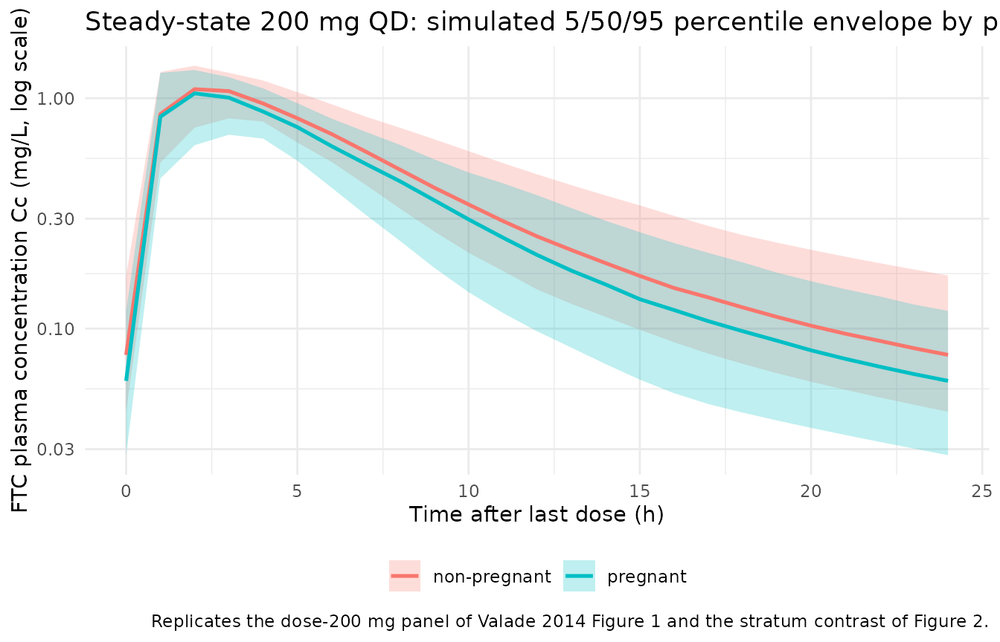
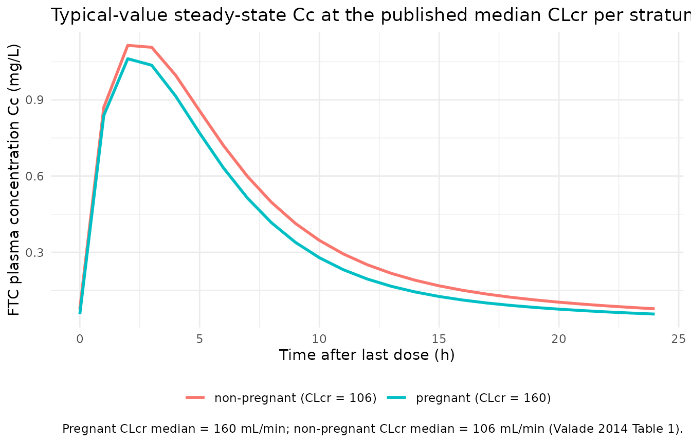

# Emtricitabine (Valade 2014)

## Model and source

- Citation: Valade E, Treluyer JM, Dabis F, Arrive E, Pannier E,
  Benaboud S, Fauchet F, Bouazza N, Foissac F, Urien S, Hirt D. (2014).
  Modified renal function in pregnancy: impact on emtricitabine
  pharmacokinetics. Br J Clin Pharmacol 78(6):1378-1386.
  <doi:10.1111/bcp.12457>
- Description: Two-compartment oral population PK model for
  emtricitabine (FTC) in HIV-infected pregnant and non-pregnant women,
  with first-order absorption and elimination. Creatinine clearance
  (Cockcroft-Gault, raw mL/min) on apparent oral clearance via the power
  model CL/F = 22.3 \* (CRCL/135)^0.33 captures the 18% CL/F increase
  observed during pregnancy as a manifestation of the
  pregnancy-associated 50% rise in estimated glomerular filtration rate;
  pregnancy itself, gestational age, age, weight, serum creatinine and
  co-medication were screened but not retained after CLcr inclusion
  (Valade 2014, BJCP).
- Article: <https://doi.org/10.1111/bcp.12457>

## Population

The model was developed from 179 HIV-infected women pooled across two
studies (Valade 2014 Table 1; Methods, Patients and treatment):

- **Cochin Hospital therapeutic drug monitoring (TDM) cohort**, n = 148
  women followed for routine FTC TDM, receiving 200 mg oral FTC daily
  under chronic combined antiretroviral therapy.
- **TEmAA ANRS 12109 labour study** (Ivory Coast, Cambodia, South
  Africa), n = 31 women at labour receiving a single oral 400 mg FTC
  dose at the start of labour for prevention of mother-to-child
  transmission, with samples at 1, 2, 3, 5, 8, 12 and 24 h post-dose.

After accounting for seven women who appeared in both pregnant and
non-pregnant strata on different occasions, the cohort comprises 103
non-pregnant + 83 pregnant women. Within the pregnant stratum, 1 was in
the first trimester, 26 in the second, 67 in the third (48 on the day of
delivery). A total of 457 plasma concentrations were analysed; 14 (3%)
below the limit of quantification (0.01 mg/L) were set to half-LOQ.

Median (range) baseline characteristics (Valade 2014 Table 1):

- Age: 35 (16-72) years overall; 31 (19-43) pregnant; 40 (16-72)
  non-pregnant.
- Body weight: 69 (37-130) kg overall.
- Serum creatinine: 60 (27-183) umol/L.
- Cockcroft-Gault creatinine clearance (CLcr): **135 (35-335) mL/min**
  overall; **160 (70-335)** in pregnant women; **106 (35-247)** in
  non-pregnant women. The 50% rise in median CLcr during pregnancy is
  the load-bearing physiologic driver of the 18% rise in FTC apparent
  clearance.
- Gestational age (pregnant stratum): 37 (5-41) weeks.

The same information is available programmatically via
`readModelDb("Valade_2014_emtricitabine")()$meta$population`.

## Model structure

FTC plasma kinetics were described by a two-compartment model with
first-order absorption and elimination (Valade 2014 Results, “Population
pharmacokinetics” paragraph; Methods, “Several structural models for FTC
pharmacokinetics were investigated”). The final covariate model retains
creatinine clearance on apparent clearance only:

    CL/F = 22.3 * (CLcr / 135)^0.33

where CLcr is raw Cockcroft-Gault creatinine clearance in mL/min and 135
mL/min is the population median (Valade 2014 final covariate equation in
the Results paragraph following Table 2). Pregnancy itself, gestational
age (tested as continuous, trimester-categorical, and Hill-saturation),
age, body weight, serum creatinine, BW/Scr, and co-medication with TDF,
PIs, NNRTIs and NRTIs all decreased the OFV individually but did not
further improve the model after CLcr inclusion (“After the inclusion of
CLcr on CL/F in the model, the addition of other covariates did not
further improve the model”).

Inter-individual variability was retained on the absorption rate
constant ka and on CL/F only. Residual variability used a proportional
model with separate sigma estimates per study (a 12.4 OFV-point
improvement over a single combined sigma); the packaged model defaults
to the TDM-cohort sigma (200 mg chronic dose, 148/179 women) and
documents the labour-cohort sigma in the Assumptions and deviations
section below.

ODEs (`depot` -\> `central` \<-\> `peripheral1` as in
`inst/modeldb/specificDrugs/Valade_2014_emtricitabine.R`):

    d/dt(depot)       = -ka * depot
    d/dt(central)     =  ka * depot - kel * central - k12 * central + k21 * peripheral1
    d/dt(peripheral1) =  k12 * central                                - k21 * peripheral1
    Cc = central / vc

with `kel = cl / vc`, `k12 = q / vc`, `k21 = q / vp`, and
`cl = exp(lcl + etalcl) * (CRCL / 135)^0.33`.

## Source trace

Per-parameter origin is recorded as an in-file comment next to each
`ini()` entry in
`inst/modeldb/specificDrugs/Valade_2014_emtricitabine.R`. The table
below collects them in one place for review.

| Equation / parameter | Value | Source location |
|----|----|----|
| Two-compartment first-order | n/a | Valade 2014 Results “Population pharmacokinetics”; Methods “Several structural models” |
| `ka` | 0.616 1/h | Valade 2014 Table 2 (RSE 32%) |
| `CL/F` | 22.3 L/h | Valade 2014 Table 2 (RSE 3%) |
| `Vc/F` | 100 L | Valade 2014 Table 2 (RSE 16%) |
| `Q/F` | 5.89 L/h | Valade 2014 Table 2 (RSE 22%) |
| `Vp/F` | 76.1 L | Valade 2014 Table 2 (RSE 28%) |
| `e_crcl_cl` (beta_CLcr) | 0.33 (unitless) | Valade 2014 Table 2 (RSE 16%); equation CL/F = 22.3 \* (CLcr/135)^0.33 in Results |
| Reference CLcr | 135 mL/min | Valade 2014 Table 1 (population median across all 179 women) |
| `omega_ka` (IIV SD) | 0.503 (log scale) | Valade 2014 Table 2 (RSE 36%); variance = 0.503^2 = 0.253009 |
| `omega_CL/F` (IIV SD) | 0.151 (log scale) | Valade 2014 Table 2 (RSE 14%); variance = 0.151^2 = 0.022801 |
| `propSd` (sigma_1, TDM) | 0.505 (fraction) | Valade 2014 Table 2 (RSE 6%) – default; TDM study (200 mg chronic) |
| sigma_2 (TEmAA labour) | 0.373 (fraction) | Valade 2014 Table 2 (RSE 6%); see Assumptions and deviations |

## Virtual cohort

Original observed data are not publicly available. The virtual cohort
below approximates the demographic spread reported in Valade 2014 Table
1 across both pregnant and non-pregnant strata. Each subject receives a
daily 200 mg oral FTC dose for seven days to reach steady state
(matching the standard chronic dosing scenario characterised by the TDM
study). CLcr is sampled per stratum from a truncated normal centred on
the published stratum median with a spread spanning the published range;
body weight and age are not model covariates so they are not simulated.

``` r

set.seed(20141104)
n_per_stratum <- 200L

obs_grid <- c(seq(0, 24, by = 0.25), seq(25, 7 * 24, by = 1))

make_cohort <- function(n, crcl_mean, crcl_sd, crcl_min, crcl_max,
                        stratum, id_offset = 0L) {
  crcl_draw <- pmin(pmax(rnorm(n, mean = crcl_mean, sd = crcl_sd),
                         crcl_min), crcl_max)
  cohort <- tibble::tibble(
    id      = id_offset + seq_len(n),
    CRCL    = crcl_draw,
    stratum = stratum
  )
  dose_rows <- cohort |>
    dplyr::mutate(time = 0, amt = 200, cmt = "depot", evid = 1L,
                  ii = 24, addl = 6L)
  obs_rows <- cohort |>
    tidyr::crossing(time = obs_grid) |>
    dplyr::mutate(amt = NA_real_, cmt = "Cc", evid = 0L,
                  ii = NA_real_, addl = NA_integer_)
  dplyr::bind_rows(dose_rows, obs_rows) |>
    dplyr::select(id, time, amt, cmt, evid, ii, addl, CRCL, stratum) |>
    dplyr::arrange(id, time, dplyr::desc(evid))
}

events <- dplyr::bind_rows(
  make_cohort(n_per_stratum,
              crcl_mean = 106, crcl_sd = 35,
              crcl_min  = 35,  crcl_max = 247,
              stratum   = "non-pregnant", id_offset = 0L),
  make_cohort(n_per_stratum,
              crcl_mean = 160, crcl_sd = 45,
              crcl_min  = 70,  crcl_max = 335,
              stratum   = "pregnant",     id_offset = n_per_stratum)
)
stopifnot(!anyDuplicated(unique(events[, c("id", "time", "evid")])))
```

## Simulation

``` r

mod <- rxode2::rxode2(readModelDb("Valade_2014_emtricitabine"))
#> ℹ parameter labels from comments will be replaced by 'label()'
sim <- rxode2::rxSolve(mod, events = events,
                       keep = c("CRCL", "stratum"),
                       returnType = "data.frame")
```

For deterministic replication (typical-value time course), zero out the
random effects:

``` r

mod_typical <- rxode2::rxode2(readModelDb("Valade_2014_emtricitabine")) |>
  rxode2::zeroRe()
#> ℹ parameter labels from comments will be replaced by 'label()'

typical_events <- tibble::tibble(
  id      = c(1L, 2L),
  CRCL    = c(106, 160),
  stratum = c("non-pregnant (CLcr = 106)", "pregnant (CLcr = 160)")
) |>
  (\(ct) dplyr::bind_rows(
    ct |> dplyr::mutate(time = 0, amt = 200, cmt = "depot", evid = 1L,
                        ii = 24, addl = 6L),
    ct |> tidyr::crossing(time = obs_grid) |>
      dplyr::mutate(amt = NA_real_, cmt = "Cc", evid = 0L,
                    ii = NA_real_, addl = NA_integer_)
  ))() |>
  dplyr::select(id, time, amt, cmt, evid, ii, addl, CRCL, stratum) |>
  dplyr::arrange(id, time, dplyr::desc(evid))

sim_typical <- rxode2::rxSolve(mod_typical, events = typical_events,
                               keep = c("CRCL", "stratum"),
                               returnType = "data.frame")
#> ℹ omega/sigma items treated as zero: 'etalka', 'etalcl'
#> Warning: multi-subject simulation without without 'omega'
```

## Replicate published figures

### Figure 1 / Figure 2 – 200 mg QD steady-state VPC envelope by pregnancy status

Valade 2014 Figure 1 validates the model via VPC against observed FTC
concentrations stratified by dose; Figure 2 compares individual CL/F
estimates between pregnant and non-pregnant women. The block below
combines both views by plotting the simulated 5/50/95 percentile
envelope of Cc over the last steady-state dosing interval for the
non-pregnant and pregnant strata.

``` r

ss_start <- 6 * 24
ss_end   <- 7 * 24

vpc_df <- sim |>
  dplyr::filter(time >= ss_start, time <= ss_end) |>
  dplyr::mutate(rel_time = time - ss_start) |>
  dplyr::group_by(stratum, rel_time) |>
  dplyr::summarise(
    Q05 = quantile(Cc, 0.05, na.rm = TRUE),
    Q50 = quantile(Cc, 0.50, na.rm = TRUE),
    Q95 = quantile(Cc, 0.95, na.rm = TRUE),
    .groups = "drop"
  )

ggplot(vpc_df, aes(rel_time, Q50, fill = stratum, colour = stratum)) +
  geom_ribbon(aes(ymin = Q05, ymax = Q95), alpha = 0.25, colour = NA) +
  geom_line(linewidth = 0.9) +
  scale_y_log10() +
  labs(x = "Time after last dose (h)",
       y = "FTC plasma concentration Cc (mg/L, log scale)",
       fill = NULL, colour = NULL,
       title = "Steady-state 200 mg QD: simulated 5/50/95 percentile envelope by pregnancy status",
       caption = "Replicates the dose-200 mg panel of Valade 2014 Figure 1 and the stratum contrast of Figure 2.") +
  theme_minimal() +
  theme(legend.position = "bottom")
```



### Typical-value Cc trajectory over the last dosing interval

``` r

typical_ss <- sim_typical |>
  dplyr::filter(time >= ss_start, time <= ss_end) |>
  dplyr::mutate(rel_time = time - ss_start)

ggplot(typical_ss, aes(rel_time, Cc, colour = stratum)) +
  geom_line(linewidth = 1.0) +
  labs(x = "Time after last dose (h)",
       y = "FTC plasma concentration Cc (mg/L)",
       colour = NULL,
       title = "Typical-value steady-state Cc at the published median CLcr per stratum",
       caption = "Pregnant CLcr median = 160 mL/min; non-pregnant CLcr median = 106 mL/min (Valade 2014 Table 1).") +
  theme_minimal() +
  theme(legend.position = "bottom")
```



## PKNCA validation

Two PKNCA blocks compute the steady-state AUC0-24 and Ctau (C24) over
the last dosing interval, stratified by pregnancy status, so the
simulated medians can be compared against the published Table 3
geometric means at 200 mg.

``` r

sim_nca <- sim |>
  dplyr::filter(time >= ss_start, time <= ss_end) |>
  dplyr::mutate(rel_time = time - ss_start) |>
  dplyr::select(id, rel_time, Cc, stratum) |>
  dplyr::filter(!is.na(Cc))

# Time-zero guarantee (relative to the dosing interval): for a stable
# steady-state interval the absorption-completed trough is already at
# rel_time = 0, but guard against the possibility that the simulation
# grid omitted it.
sim_nca <- dplyr::bind_rows(
  sim_nca,
  sim_nca |> dplyr::distinct(id, stratum) |>
    dplyr::mutate(rel_time = 0, Cc = NA_real_)
) |>
  dplyr::group_by(id, stratum, rel_time) |>
  dplyr::summarise(Cc = dplyr::first(stats::na.omit(Cc)), .groups = "drop") |>
  dplyr::arrange(id, rel_time) |>
  dplyr::filter(!is.na(Cc))

conc_obj <- PKNCA::PKNCAconc(
  data    = sim_nca,
  formula = Cc ~ rel_time | stratum + id,
  concu   = "mg/L",
  timeu   = "hr"
)

dose_df <- tibble::tibble(
  id      = unique(sim_nca$id)
) |>
  dplyr::left_join(unique(sim_nca[, c("id", "stratum")]), by = "id") |>
  dplyr::mutate(rel_time = 0, amt = 200)

dose_obj <- PKNCA::PKNCAdose(
  data    = dose_df,
  formula = amt ~ rel_time | stratum + id,
  doseu   = "mg"
)

intervals_24 <- data.frame(
  start    = 0,
  end      = 24,
  cmax     = TRUE,
  tmax     = TRUE,
  auclast  = TRUE,
  ctrough  = TRUE
)

nca_res <- suppressWarnings(PKNCA::pk.nca(
  PKNCA::PKNCAdata(conc_obj, dose_obj, intervals = intervals_24)
))
```

### Comparison against published Table 3

Valade 2014 Table 3 reports AUC and C24 geometric means \[min-max\] for
a 200 mg FTC dose, stratified by pregnancy status:

``` r

published <- tibble::tribble(
  ~stratum,        ~auclast, ~ctrough,
  "non-pregnant",  9.77,     0.079,
  "pregnant",      8.30,     0.054
)

cmp <- nlmixr2lib::ncaComparisonTable(
  simulated     = nca_res,
  reference     = published,
  by            = "stratum",
  params        = c("auclast", "ctrough"),
  units         = c(auclast = "mg/L*h", ctrough = "mg/L"),
  tolerance_pct = 20
)

knitr::kable(
  cmp,
  caption = "Simulated vs. published NCA (Valade 2014 Table 3, 200 mg dose). * differs from reference by >20%.",
  align   = c("l", "l", "r", "r", "r")
)
```

| NCA parameter     | stratum      | Reference | Simulated | % diff |
|:------------------|:-------------|----------:|----------:|-------:|
| AUClast (mg/L\*h) | non-pregnant |      9.77 |       9.4 |  -3.7% |
| AUClast (mg/L\*h) | pregnant     |       8.3 |      8.44 |  +1.7% |
| Ctrough (mg/L)    | non-pregnant |     0.079 |     0.077 |  -2.6% |
| Ctrough (mg/L)    | pregnant     |     0.054 |    0.0594 |  +9.9% |

Simulated vs. published NCA (Valade 2014 Table 3, 200 mg dose). \*
differs from reference by \>20%. {.table}

## Assumptions and deviations

- **Two study-specific residual errors collapsed to one.** Valade 2014
  reports a 12.4 OFV-point improvement from estimating a separate
  proportional residual error for each study (sigma_1 = 0.505 for the
  TDM cohort at 200 mg chronic; sigma_2 = 0.373 for the TEmAA labour
  cohort at 400 mg single). The packaged model defaults to sigma_1
  because the TDM cohort covers 148/179 women (83%) and characterises
  the standard chronic 200 mg use case; the labour-cohort sigma is
  documented in the in-file comment next to `propSd` and a downstream
  user can substitute it by assigning `mod$propSd <- 0.373` before
  solving.
- **Reference CLcr value (135 mL/min) is the population median.** The
  model uses raw Cockcroft-Gault creatinine clearance in mL/min, NOT
  BSA-normalised to mL/min/1.73 m^2. The covariate is stored under the
  canonical `CRCL` column with `source_name = "CLcr"` to mark the
  source-column alias, per `inst/references/covariate-columns.md` (raw
  mL/min is an accepted assay form for `CRCL` when the source paper does
  not BSA-normalise; precedents include `Delattre_2010_amikacin.R` and
  `Valade_2015_emtricitabine.R`).
- **Pregnancy is encoded mechanistically via CLcr rather than as a
  binary indicator.** Valade 2014 explicitly tests pregnancy and
  gestational age as covariates on CL/F and finds them subsumed by CLcr
  once the latter is in the model. Encoding the pregnancy effect through
  the CLcr power-scaling submodel matches the paper’s final model
  exactly and preserves the physiological interpretation: the 50% rise
  in median CLcr during pregnancy (160 vs 106 mL/min) implies an 18%
  rise in CL/F via `(160/135)^0.33 / (106/135)^0.33` = 1.18, matching
  the geometric- mean ratio reported in Results (24.1 vs 20.5 L/h).
- **Documented-but-unused covariates.** Age, body weight, serum
  creatinine, pregnancy indicator (PREG), gestational age (GA), and
  associated antiretroviral co-medication (CONMED_ARV) were screened on
  CL/F (continuous-, binary-, categorical-by-trimester, and Hill-form
  effects per Valade 2014 Methods equations (i)-(iii)). None was
  retained after CLcr inclusion. These covariates are documented in the
  model file’s `covariatesDataExcluded` list so the screening trail is
  preserved without triggering “declared-but-unused” convention
  warnings.
- **CLcr distribution sampling.** The virtual cohort samples CLcr from a
  truncated normal per stratum centred on the Table 1 stratum median
  with a spread chosen to span the published min-max range. The true
  CLcr distribution in HIV-infected women on cART is right-skewed and
  truncated below by the Cockcroft-Gault formula’s dependence on serum
  creatinine; sampling on the linear scale is an approximation. The CL/F
  geometric-mean ratio between strata (1.18) is preserved because it
  depends only on the ratio of stratum medians and the 0.33 exponent,
  not on the distribution shape.
- **Race / ethnicity.** Not reported in Valade 2014 (mixed Paris-region
  TDM cohort + Ivory Coast / Cambodia / South Africa labour cohort).
  `population$race_ethnicity` is set to `"Not reported"`; the virtual
  cohort does not stratify by race because the model does not include a
  race covariate.
- **Erratum check.** Searched the British Journal of Clinical
  Pharmacology landing page for the article, the publisher’s corrections
  feed, PubMed, and Google Scholar for
  `"Valade 2014 emtricitabine" erratum` – no published correction
  identified as of the extraction date (2026-06-18).
