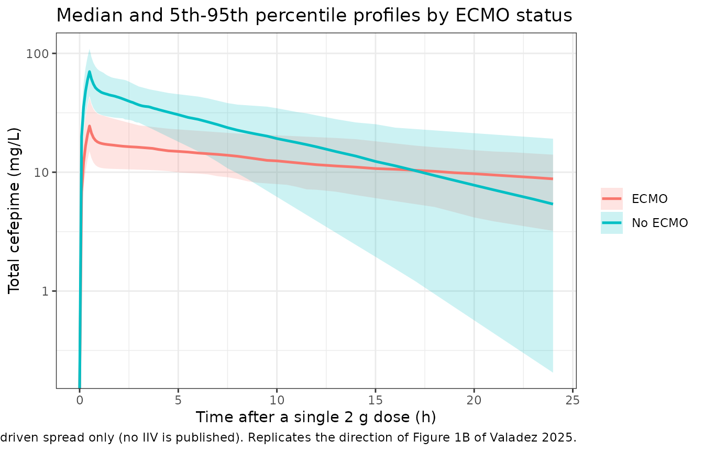
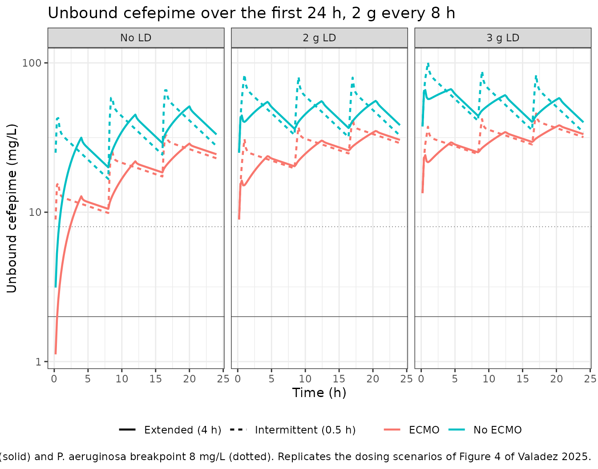

# Cefepime (Valadez 2025)

## Model and source

- Citation: Valadez A, Zurawska M, Harlan E, Scheetz MH, Neely MN,
  Yarnold PR, Kang M, Korth E, Martinez F, Giblin B, Donnelly HK,
  Dedicatoria K, Medernach R, Nozick S, Hauser AR, Ozer EA, Diaz E,
  Misharin AV, Wunderink RG, Rhodes NJ. Individual target
  pharmacokinetic/pharmacodynamic attainment rates among
  cefepime-treated patients admitted to the ICU with hospital-acquired
  pneumonia with and without ECMO. Antimicrob Agents Chemother.
  2025;69(6):e0010225. <doi:10.1128/aac.00102-25>. PMID 40372025;
  PMC12135513.
- Description: Two-compartment population PK model for intravenous
  cefepime in mechanically ventilated adults admitted to the medical ICU
  with suspected hospital-acquired pneumonia, with and without
  extracorporeal membrane oxygenation (ECMO) and excluding concurrent
  renal replacement therapy. Total clearance scales with raw
  Cockcroft-Gault creatinine clearance through a non-linear power term
  standardised to 120 mL/min; central volume scales linearly with total
  body weight standardised to 70 kg and is multiplied by exp(beta2) in
  patients cannulated onto ECMO, a 2.8-fold expansion.
  Inter-compartmental distribution is parameterised directly as the
  micro-constants KCP and KPC rather than as Q and Vp. Estimated with
  the Pmetrics non-parametric adaptive grid (NPAG); the source reports
  only the weighted median of the non-parametric population distribution
  with 95% credible intervals, so no between-subject variance and no
  residual-error model are available (see the vignette Assumptions and
  deviations). Valadez 2025, n = 70 patients (9 on ECMO), 114 plasma
  samples.
- Article: <https://doi.org/10.1128/aac.00102-25>
- Supplement (Fig. S1, Fig. S2, Table S1):
  <https://europepmc.org/article/MED/40372025#supplementary-material>

Valadez 2025 is a target-attainment study, not a
noncompartmental-analysis study. It develops a two-compartment
population PK model for intravenous cefepime in critically ill adults,
then uses Bayesian posteriors and Monte Carlo simulation to ask whether
standard dosing keeps *unbound* cefepime above the MIC for the whole of
the first 24 h in patients supported by extracorporeal membrane
oxygenation (ECMO).

The headline finding is that ECMO expands the central volume of
distribution 2.8-fold without measurably changing clearance, and that a
3 g – but not a 2 g – loading dose is needed to restore the cumulative
fraction of response (CFR) to 80% in ECMO patients.

## Population

Seventy mechanically ventilated adults admitted to the Medical Intensive
Care Unit at Northwestern Memorial Hospital with suspected pneumonia
contributed 114 plasma samples (1-14 per patient) between June 2018 and
March 2024, as a retrospective PK/PD study nested within the prospective
SCRIPT study. Nine patients (12.9%) required ECMO, predominantly
veno-venous support for severe respiratory failure. Baseline
characteristics (Valadez 2025 Table 1, mean +/- SD): age 62.1 +/- 14.4
years, total body weight 83.3 +/- 26.5 kg, body surface area 1.96 +/-
0.33 m^2, serum creatinine 1.12 +/- 0.66 mg/dL, Cockcroft-Gault
creatinine clearance 115.8 +/- 88.6 mL/min. Sixty percent were male.

The design feature that makes this cohort unusual is the *exclusion* of
patients on hemodialysis, peritoneal dialysis or continuous renal
replacement therapy. Earlier ECMO cefepime studies pooled RRT and
non-RRT patients, which confounds the ECMO effect with extracorporeal
solute removal; removing RRT patients is what let these authors
attribute a volume change to ECMO itself.

Sampling was opportunistic (median 2 samples per patient in both groups)
and measured concentrations spanned 1.7-142.9 mg/L. Race and ethnicity
were not reported.

The same information is available programmatically via the model’s
`population` metadata:

``` r

pop <- rxode2::rxode(readModelDb("Valadez_2025_cefepime"))$population
str(pop, max.level = 1)
#> List of 16
#>  $ species        : chr "human"
#>  $ n_subjects     : int 70
#>  $ n_studies      : int 1
#>  $ n_samples      : int 114
#>  $ age_mean_sd    : chr "62.1 +/- 14.4 years (mean +/- SD; Table 1). Full range not reported."
#>  $ weight_mean_sd : chr "83.3 +/- 26.5 kg total body weight (mean +/- SD; Table 1). Full range not reported."
#>  $ bsa_mean_sd    : chr "1.96 +/- 0.33 m^2 (mean +/- SD; Table 1)"
#>  $ sex_female_pct : num 40
#>  $ race_ethnicity : chr "Not reported. The source tabulates only age, total body weight, BSA, serum creatinine, creatinine clearance, EC"| __truncated__
#>  $ disease_state  : chr "Mechanically ventilated adults admitted to the Medical Intensive Care Unit at Northwestern Memorial Hospital wi"| __truncated__
#>  $ renal_function : chr "Patients requiring concurrent hemodialysis, peritoneal dialysis or continuous renal replacement therapy were EX"| __truncated__
#>  $ dose_range     : chr "Institutional renal-function-based cefepime protocols; mean +/- SD initial 24 h dose 4.2 +/- 1.7 g/day. Monte C"| __truncated__
#>  $ regions        : chr "United States (single centre, Chicago, Illinois)"
#>  $ protein_binding: chr "Not fitted. Total cefepime was quantified in plasma; unbound concentrations for the PK/PD target analysis were "| __truncated__
#>  $ sampling       : chr "Opportunistic residual plasma sampling, 1-14 samples per patient (median 2 in both the ECMO and non-ECMO groups"| __truncated__
#>  $ notes          : chr "Retrospective PK/PD study nested within the prospective SCRIPT study (Successful Clinical Response in Pneumonia"| __truncated__
```

## Source trace

Per-parameter origin is recorded as an in-file comment next to each
`ini()` entry in `inst/modeldb/specificDrugs/Valadez_2025_cefepime.R`.
The table below collects them in one place.

| Equation / parameter | Value | Source location |
|----|----|----|
| `lcl` (CL1) | 4.45 L/h (95% CrI 3.22-5.37) | Table 2, row `CL1 (L/h)` |
| `e_crcl_cl` (beta1) | 0.76 (95% CrI 0.52-0.92) | Table 2, row `beta1`; footnote `(CrCl/120 mL/min)^beta1` |
| `lvc` (V1) | 16.3 L (95% CrI 6.54-33.5) | Table 2, row `V1 (L)`; confirmed in Discussion (“4.45 L/h and 16.3 L”) |
| `e_ecmo_status_vc` (beta2) | 1.043 (95% CrI -0.40 to 1.59) | Table 2, row `beta2` |
| `lk12` (KCP) | 3.23 1/h (95% CrI 0.49-8.61) | Table 2, row `KCP (h-1)` |
| `lk21` (KPC) | 2.68 1/h (95% CrI 2.01-9.12) | Table 2, row `KPC (h-1)` |
| `addSd` | 0.994 mg/L | Derived: sqrt(0.989 mg^(2/L)2), the individual-prediction imprecision in Results, “Model development and selection”. Not a published error-model parameter – see Assumptions and deviations |
| `CL = CL1 * (CrCL/120)^beta1` | n/a | Equation 1 |
| `Vd = V1 * (WT/70) * e^(beta2 * ECMO)` | n/a | Equation 2; independently confirmed by Table S1 run 8, “Model 6 with ECMO on V: V1 \* e(beta2\*ECMO)” |
| Two-compartment structure | n/a | Results, “Model development and selection” (-2\*LL 947.3 vs 957.3 for one compartment); Table S1 run 2 lists primary variables “CL, V, KPC, KCP” |
| Unbound fraction 0.80 | n/a | Methods, “Individual PK/PD target attainment” (“published protein binding of 20%”). Applied outside the PK model |
| Reference CrCl 120 mL/min, reference WT 70 kg | n/a | Equations 1-2 and the Table 2 footnote |

Equations 1 and 2 are rendered as images in the source PDF and are
dropped by text extraction; they were read from the published equation
graphics (`aac.00102-25.m001.jpg`, `aac.00102-25.m002.jpg`) and
cross-checked against the Table 2 footnote and Table S1.

### Two forms are possible for the ECMO effect; the arithmetic settles it

The source prose calls beta2 “the proportional change in Vd”, which
would suggest `V1 * (1 + beta2 * ECMO)`. The printed equation and Table
S1 both use the exponential form `V1 * exp(beta2 * ECMO)`, and two
numbers quoted elsewhere in the paper confirm the exponential reading:

``` r

b2 <- 1.043
v1 <- 16.3
data.frame(
  form = c("exponential: exp(beta2)", "linear: 1 + beta2"),
  fold = c(exp(b2), 1 + b2),
  vd_ecmo_L = c(v1 * exp(b2), v1 * (1 + b2))
) |>
  dplyr::rename("Candidate form" = form, "Fold change in Vd" = fold,
                "Vd on ECMO at 70 kg (L)" = vd_ecmo_L) |>
  knitr::kable(digits = 3, caption = paste(
    "Valadez 2025 reports a 2.8-fold increase (Abstract, Conclusion) and",
    "'46.25 L vs 16.3 L' (Discussion). Only the exponential form matches."
  ))
```

| Candidate form          | Fold change in Vd | Vd on ECMO at 70 kg (L) |
|:------------------------|------------------:|------------------------:|
| exponential: exp(beta2) |             2.838 |                  46.255 |
| linear: 1 + beta2       |             2.043 |                  33.301 |

Valadez 2025 reports a 2.8-fold increase (Abstract, Conclusion) and
‘46.25 L vs 16.3 L’ (Discussion). Only the exponential form matches.
{.table}

## Reproducing the published point estimates

The source publishes four derived quantities that follow directly from
the Table 2 parameters. Each is an exact identity, so these are strict
checks rather than approximate comparisons.

``` r

mod <- readModelDb("Valadez_2025_cefepime")
ui  <- rxode2::rxode(mod)
th  <- setNames(ui$theta, names(ui$theta))

cl_ref <- exp(th[["lcl"]])                       # CrCl = 120 mL/min
vc_ref <- exp(th[["lvc"]])                       # WT = 70 kg, no ECMO
b2_hat <- th[["e_ecmo_status_vc"]]

identities <- tibble::tibble(
  quantity = c(
    "Typical CL at CrCl = 120 mL/min (L/h)",
    "Typical central Vd at 70 kg, no ECMO (L)",
    "Elimination half-life ln(2)/(CL/V1) (h)",
    "Fold increase in Vd on ECMO",
    "Central Vd at 70 kg on ECMO (L)"
  ),
  published = c(4.45, 16.3, 2.54, 2.8, 46.25),
  model = c(
    cl_ref,
    vc_ref,
    log(2) / (cl_ref / vc_ref),
    exp(b2_hat),
    vc_ref * exp(b2_hat)
  )
) |>
  dplyr::mutate(`difference (%)` = 100 * (model - published) / published)

identities |>
  dplyr::rename("Published quantity" = quantity, "Valadez 2025" = published,
                "Packaged model" = model) |>
  knitr::kable(digits = c(0, 3, 4, 2), caption = paste(
    "Published values reproduced from the packaged model. Sources: Table 2",
    "(CL1, V1, beta2); Discussion 'a calculated cefepime half-life of",
    "approximately 2.54 h' and '2.8-fold-greater Vd (i.e., 46.25 L vs 16.3 L)'."
  ))
```

| Published quantity | Valadez 2025 | Packaged model | difference (%) |
|:---|---:|---:|---:|
| Typical CL at CrCl = 120 mL/min (L/h) | 4.45 | 4.4500 | 0.00 |
| Typical central Vd at 70 kg, no ECMO (L) | 16.30 | 16.3000 | 0.00 |
| Elimination half-life ln(2)/(CL/V1) (h) | 2.54 | 2.5389 | -0.04 |
| Fold increase in Vd on ECMO | 2.80 | 2.8377 | 1.35 |
| Central Vd at 70 kg on ECMO (L) | 46.25 | 46.2548 | 0.01 |

Published values reproduced from the packaged model. Sources: Table 2
(CL1, V1, beta2); Discussion ‘a calculated cefepime half-life of
approximately 2.54 h’ and ‘2.8-fold-greater Vd (i.e., 46.25 L vs 16.3
L)’. {.table}

``` r


# Strict assertions -- these are exact identities, not approximations.
stopifnot(
  abs(log(2) / (cl_ref / vc_ref) - 2.54)   < 0.005,
  abs(exp(b2_hat) - 2.8)                   < 0.05,
  abs(vc_ref * exp(b2_hat) - 46.25)        < 0.01,
  abs(cl_ref - 4.45)                       < 1e-8,
  abs(vc_ref - 16.3)                       < 1e-8
)
```

Note that the published 2.54 h is `ln(2)/(CL/V1)`, the
*central-compartment* elimination half-life, not the terminal half-life
of the two-compartment system. The terminal half-life is several times
longer and is checked separately in the PKNCA section below. Comparing
the two would be scoring the answer key on the wrong quantity.

## Virtual cohort

Original patient data are not publicly available. The cohort below draws
total body weight and creatinine clearance from log-normal distributions
matched to the Table 1 means and standard deviations, truncated to
physiologically plausible ICU limits. The ECMO arm is simulated at the
same covariate distribution as the non-ECMO arm so that the ECMO
contrast is not confounded by weight or renal function.

``` r

set.seed(20250515)
n_per_arm <- 100L   # cap is 200/arm; 100 is ample for these deterministic checks

# Moment-match a log-normal to a reported mean and SD.
lognormal_pars <- function(mean_val, sd_val) {
  v <- log(1 + (sd_val / mean_val)^2)
  c(meanlog = log(mean_val) - v / 2, sdlog = sqrt(v))
}
p_wt   <- lognormal_pars(83.3, 26.5)    # Table 1: TBW 83.3 +/- 26.5 kg
p_crcl <- lognormal_pars(115.8, 88.6)   # Table 1: CrCl 115.8 +/- 88.6 mL/min

make_arm <- function(ecmo, id_offset) {
  tibble::tibble(
    id   = id_offset + seq_len(n_per_arm),
    WT   = pmin(pmax(rlnorm(n_per_arm, p_wt[["meanlog"]],   p_wt[["sdlog"]]),   40), 180),
    CRCL = pmin(pmax(rlnorm(n_per_arm, p_crcl[["meanlog"]], p_crcl[["sdlog"]]), 15), 350),
    ECMO_STATUS = ecmo,
    treatment   = if (ecmo == 1) "ECMO" else "No ECMO"
  )
}

subjects <- dplyr::bind_rows(
  make_arm(0, id_offset =   0L),
  make_arm(1, id_offset = 100L)
)

# Single 2 g dose over 0.5 h, then a grid dense enough to resolve the
# distribution phase and long enough for aucinf.obs to be well-behaved.
time_grid <- c(seq(0, 4, by = 0.1), seq(4.5, 12, by = 0.5),
               seq(13, 48, by = 1), seq(50, 120, by = 2))

events <- dplyr::bind_rows(
  subjects |> dplyr::mutate(time = 0, amt = 2000, evid = 1L,
                            dur = 0.5, cmt = "central"),
  subjects |> tidyr::crossing(time = time_grid) |>
    dplyr::mutate(amt = NA_real_, evid = 0L, dur = NA_real_, cmt = "central")
) |>
  dplyr::arrange(id, time, dplyr::desc(evid))

stopifnot(!anyDuplicated(unique(events[, c("id", "time", "evid")])))
```

## Simulation

The model declares no random effects (see Assumptions and deviations),
so `rxSolve()` is called without an `omega` argument and every subject’s
profile is driven entirely by their covariates.

``` r

sim <- rxode2::rxSolve(
  mod, events = events,
  keep = c("treatment", "WT", "CRCL", "ECMO_STATUS"),
  useLinCmt = FALSE
) |>
  as.data.frame()
#> Warning: multi-subject simulation without without 'omega'

stopifnot(
  length(unique(sim$id)) == 2L * n_per_arm,   # rxSolve silently drops subjects on bad input
  all(sim$Cc >= 0, na.rm = TRUE),
  !any(is.na(sim$Cc))
)
```

``` r

# Replicates the message of Figure 1B of Valadez 2025: ECMO patients have a
# systematically larger volume of distribution, and therefore systematically
# lower concentrations at a given dose and weight.
sim |>
  dplyr::filter(time <= 24) |>
  dplyr::group_by(treatment, time) |>
  dplyr::summarise(
    Q05 = quantile(Cc, 0.05), Q50 = median(Cc), Q95 = quantile(Cc, 0.95),
    .groups = "drop"
  ) |>
  ggplot(aes(time, Q50, colour = treatment, fill = treatment)) +
  geom_ribbon(aes(ymin = Q05, ymax = Q95), alpha = 0.2, colour = NA) +
  geom_line(linewidth = 0.9) +
  scale_y_log10() +
  labs(
    x = "Time after a single 2 g dose (h)", y = "Total cefepime (mg/L)",
    colour = NULL, fill = NULL,
    title = "Median and 5th-95th percentile profiles by ECMO status",
    caption = paste("Covariate-driven spread only (no IIV is published).",
                    "Replicates the direction of Figure 1B of Valadez 2025.")
  ) +
  theme_bw()
#> Warning in scale_y_log10(): log-10 transformation introduced infinite values.
#> log-10 transformation introduced infinite values.
#> log-10 transformation introduced infinite values.
#> log-10 transformation introduced infinite values.
```



## PKNCA validation

Two exact identities are available for a linear two-compartment model
given an intravenous dose, and both are checked per subject rather than
on a median (a median across subjects hides per-subject error).

1.  `AUC(0-inf) = Dose / CL`, with `CL` reconstructed from the subject’s
    own creatinine clearance through Equation 1.
2.  The NCA terminal half-life equals `ln(2)/lambda_2`, where `lambda_2`
    is the smaller eigenvalue of the two-compartment system built from
    the subject’s own `kel`, `k12` and `k21`.

``` r

# Only `!is.na(Cc)` -- adding `time > 0` or `Cc > 0` would drop the time-zero
# row that PKNCA needs to anchor AUC(0-*).
sim_nca <- sim |>
  dplyr::filter(!is.na(Cc)) |>
  dplyr::select(id, time, Cc, treatment)

# Truncate each profile at the last time it is still quantifiable, using the
# source assay's lower limit ("The assay was linear from 1 to 100 mg/L",
# Methods). This mirrors what a real NCA does and is not cosmetic: the
# simulated terminal half-life ranges from about 2 h to over 100 h across this
# cohort, so a single fixed 120 h window leaves the fastest subjects with a
# long stretch of numerically negligible concentrations. lambda_z fitted
# through that stretch is not a terminal-slope estimate, and it inflated the
# half-life identity error below from 0.2% to 13% for the single subject at
# the creatinine-clearance truncation bound. The time-zero row is re-added
# afterwards so AUC(0-*) is still anchored.
lloq <- 1
sim_nca <- sim_nca |>
  dplyr::group_by(id) |>
  dplyr::filter(time <= max(time[Cc >= lloq])) |>
  dplyr::ungroup()

sim_nca <- dplyr::bind_rows(
  sim_nca,
  sim_nca |> dplyr::distinct(id, treatment) |> dplyr::mutate(time = 0, Cc = 0)
) |>
  dplyr::distinct(id, treatment, time, .keep_all = TRUE) |>
  dplyr::arrange(id, treatment, time)

conc_obj <- PKNCA::PKNCAconc(sim_nca, Cc ~ time | treatment + id,
                             concu = "mg/L", timeu = "h")

dose_df <- events |>
  dplyr::filter(evid == 1) |>
  dplyr::select(id, time, amt, treatment)
dose_obj <- PKNCA::PKNCAdose(dose_df, amt ~ time | treatment + id, doseu = "mg")

intervals <- data.frame(
  start = 0, end = Inf,
  cmax = TRUE, tmax = TRUE, aucinf.obs = TRUE, half.life = TRUE
)

nca_res <- PKNCA::pk.nca(PKNCA::PKNCAdata(conc_obj, dose_obj,
                                          intervals = intervals))
nca_wide <- as.data.frame(nca_res$result) |>
  dplyr::select(id, treatment, PPTESTCD, PPORRES) |>
  tidyr::pivot_wider(names_from = PPTESTCD, values_from = PPORRES)
```

``` r

theory <- subjects |>
  dplyr::mutate(
    cl  = exp(th[["lcl"]]) * (CRCL / 120)^th[["e_crcl_cl"]],
    vc  = exp(th[["lvc"]]) * (WT / 70) * exp(th[["e_ecmo_status_vc"]] * ECMO_STATUS),
    kel = cl / vc,
    k12 = exp(th[["lk12"]]),
    k21 = exp(th[["lk21"]]),
    s   = kel + k12 + k21,
    lambda2   = (s - sqrt(s^2 - 4 * kel * k21)) / 2,
    auc_theory = 2000 / cl,
    thalf_theory = log(2) / lambda2
  )

check <- nca_wide |>
  dplyr::left_join(theory |> dplyr::select(id, auc_theory, thalf_theory),
                   by = "id") |>
  dplyr::mutate(
    auc_err_pct   = 100 * (aucinf.obs - auc_theory) / auc_theory,
    thalf_err_pct = 100 * (half.life  - thalf_theory) / thalf_theory
  )

stopifnot(nrow(check) == 2L * n_per_arm)          # a check with no rows is not a check
# Thresholds are set just above the accuracy actually achieved (0.08% and
# 0.23%), not at a comfortable round number, so that a future regression in
# the ODE system or the covariate equations trips them.
stopifnot(
  max(abs(check$auc_err_pct))   < 0.2,
  max(abs(check$thalf_err_pct)) < 0.5
)

check |>
  dplyr::group_by(treatment) |>
  dplyr::summarise(
    n = dplyr::n(),
    `max |AUC error| (%)`       = max(abs(auc_err_pct)),
    `max |half-life error| (%)` = max(abs(thalf_err_pct)),
    `median terminal t1/2 (h)`  = median(half.life),
    .groups = "drop"
  ) |>
  dplyr::rename("Group" = treatment, "N" = n) |>
  knitr::kable(digits = 3, caption = paste(
    "Per-subject structural identities after a single 2 g dose.",
    "AUC(0-inf) must equal Dose/CL and the NCA terminal half-life must equal",
    "ln(2)/lambda_2; both hold to well under 1%."
  ))
```

| Group | N | max \|AUC error\| (%) | max \|half-life error\| (%) | median terminal t1/2 (h) |
|:---|---:|---:|---:|---:|
| ECMO | 100 | 0.081 | 0.208 | 26.054 |
| No ECMO | 100 | 0.029 | 0.234 | 7.451 |

Per-subject structural identities after a single 2 g dose. AUC(0-inf)
must equal Dose/CL and the NCA terminal half-life must equal
ln(2)/lambda_2; both hold to well under 1%. {.table}

The median terminal half-life is roughly 7 h without ECMO and roughly 26
h with ECMO. Both are much longer than the 2.54 h the paper quotes,
because that figure is `ln(2)/(CL/V1)` – the central-compartment
elimination half-life – and not the terminal slope. There is no
published noncompartmental Cmax / Tmax / AUC table in this paper to
compare against, so
[`nlmixr2lib::ncaComparisonTable()`](https://nlmixr2.github.io/nlmixr2lib/reference/ncaComparisonTable.md)
is deliberately not used here: the only published half-life is a
different quantity from the NCA terminal half-life, and pairing them
would manufacture a 200%-plus “discrepancy” that means nothing.

## Replicating Figure 4: loading doses and target attainment

Valadez 2025 Figure 4 compares the cumulative fraction of response
against the EUCAST *P. aeruginosa* MIC distribution for six regimens in
each of the two groups. CFR is a property of the whole non-parametric
parameter distribution, which this paper does not publish, so the Monte
Carlo CFR percentages cannot be reproduced exactly (see Assumptions and
deviations).

What *can* be reproduced is the typical-value profile of each regimen
and the quantity that drives attainment: the highest MIC at which the
regimen holds 100% *f*T\>MIC across the first 24 h. Because the target
requires the unbound concentration to stay above the MIC for the
*entire* window, that ceiling is simply the minimum unbound
concentration over the window.

Renal clearance is held at the cohort mean of 115 mL/min exactly as the
paper specifies for its simulations, and weight at the Table 1 mean of
83.3 kg. Predictions are generated every 0.2 h for the first 24 h,
matching the paper’s stated simulation grid.

``` r

unbound_fraction <- 0.80   # Methods: "published protein binding of 20%"

regimens <- tidyr::expand_grid(
  ecmo      = c(0, 1),
  infusion  = c("Intermittent (0.5 h)", "Extended (4 h)"),
  load_g    = c(0, 2, 3)
) |>
  dplyr::mutate(
    id        = dplyr::row_number(),
    treatment = ifelse(ecmo == 1, "ECMO", "No ECMO"),
    load_lab  = c("No LD", "2 g LD", "3 g LD")[match(load_g, c(0, 2, 3))],
    regimen   = paste(infusion, load_lab, sep = ", ")
  )

build_regimen <- function(row) {
  dur_maint  <- if (row$infusion == "Extended (4 h)") 4 else 0.5
  has_load   <- row$load_g > 0
  # "the LD was always administered as 2 g over 30 min, immediately followed
  # by the maintenance regimen" -- so maintenance starts at 0.5 h when an LD
  # is given, and at 0 h otherwise.
  maint_time <- if (has_load) c(0.5, 8.5, 16.5) else c(0, 8, 16)

  doses <- dplyr::bind_rows(
    if (has_load) {
      tibble::tibble(time = 0, amt = row$load_g * 1000, dur = 0.5)
    },
    tibble::tibble(time = maint_time, amt = 2000, dur = dur_maint)
  ) |>
    dplyr::mutate(evid = 1L, cmt = "central")

  dplyr::bind_rows(
    doses,
    tibble::tibble(time = seq(0.2, 24, by = 0.2), amt = NA_real_,
                   dur = NA_real_, evid = 0L, cmt = "central")
  ) |>
    dplyr::mutate(id = row$id, WT = 83.3, CRCL = 115,
                  ECMO_STATUS = row$ecmo)
}

reg_events <- do.call(
  dplyr::bind_rows,
  lapply(seq_len(nrow(regimens)), function(i) build_regimen(regimens[i, ]))
) |>
  dplyr::left_join(regimens |> dplyr::select(id, treatment, infusion,
                                             load_lab, regimen),
                   by = "id") |>
  dplyr::arrange(id, time, dplyr::desc(evid))

reg_sim <- rxode2::rxSolve(
  mod, events = reg_events,
  keep = c("treatment", "infusion", "load_lab", "regimen"),
  useLinCmt = FALSE
) |>
  as.data.frame() |>
  dplyr::mutate(Cfree = unbound_fraction * Cc)
#> Warning: multi-subject simulation without without 'omega'

stopifnot(length(unique(reg_sim$id)) == nrow(regimens))
```

``` r

# Replicates the dosing scenarios behind Figure 4 of Valadez 2025.
reg_sim |>
  dplyr::mutate(load_lab = factor(load_lab, c("No LD", "2 g LD", "3 g LD"))) |>
  ggplot(aes(time, Cfree, colour = treatment, linetype = infusion)) +
  geom_hline(yintercept = 2, linewidth = 0.3, colour = "grey40") +
  geom_hline(yintercept = 8, linewidth = 0.3, colour = "grey40",
             linetype = "dotted") +
  geom_line(linewidth = 0.8) +
  facet_wrap(~load_lab) +
  scale_y_log10() +
  labs(
    x = "Time (h)", y = "Unbound cefepime (mg/L)",
    colour = NULL, linetype = NULL,
    title = "Unbound cefepime over the first 24 h, 2 g every 8 h",
    caption = paste(
      "Grey lines: Enterobacterales breakpoint 2 mg/L (solid) and",
      "P. aeruginosa breakpoint 8 mg/L (dotted).",
      "Replicates the dosing scenarios of Figure 4 of Valadez 2025."
    )
  ) +
  theme_bw() +
  theme(legend.position = "bottom")
```



``` r

# Published CFR against the EUCAST P. aeruginosa MIC distribution, Valadez 2025
# Results, "Monte Carlo simulations" (Figure 4).
published_cfr <- tibble::tribble(
  ~treatment, ~infusion,              ~load_lab, ~cfr_pct,
  "No ECMO",  "Extended (4 h)",       "No LD",   49.4,
  "No ECMO",  "Extended (4 h)",       "2 g LD",  83.1,
  "No ECMO",  "Extended (4 h)",       "3 g LD",  86.5,
  "No ECMO",  "Intermittent (0.5 h)", "No LD",   75.7,
  "No ECMO",  "Intermittent (0.5 h)", "2 g LD",  80.2,
  "No ECMO",  "Intermittent (0.5 h)", "3 g LD",  81.8,
  "ECMO",     "Extended (4 h)",       "No LD",   20.2,
  "ECMO",     "Extended (4 h)",       "2 g LD",  73.7,
  "ECMO",     "Extended (4 h)",       "3 g LD",  80.2,
  "ECMO",     "Intermittent (0.5 h)", "No LD",   67.3,
  "ECMO",     "Intermittent (0.5 h)", "2 g LD",  73.3,
  "ECMO",     "Intermittent (0.5 h)", "3 g LD",  80.3
)

attain <- reg_sim |>
  dplyr::group_by(treatment, infusion, load_lab) |>
  dplyr::summarise(mic_ceiling = min(Cfree),
                   ft_gt_8 = 100 * mean(Cfree > 8), .groups = "drop") |>
  dplyr::inner_join(published_cfr, by = c("treatment", "infusion", "load_lab"))

stopifnot(nrow(attain) == nrow(published_cfr))   # guard the join

attain |>
  # Order for reading, not alphabetically. Every lookup below is by key via
  # ceiling_of(), so display order never feeds an assertion.
  dplyr::arrange(dplyr::desc(treatment), infusion,
                 factor(load_lab, c("No LD", "2 g LD", "3 g LD"))) |>
  dplyr::rename(
    "Group" = treatment, "Infusion" = infusion, "Loading dose" = load_lab,
    "Highest MIC with 100% fT>MIC (mg/L)" = mic_ceiling,
    "fT>8 mg/L (%)" = ft_gt_8,
    "Published CFR (%)" = cfr_pct
  ) |>
  knitr::kable(digits = 2, caption = paste(
    "Typical-value attainment ceiling for each regimen against the published",
    "cumulative fraction of response (Valadez 2025 Figure 4). CFR integrates",
    "over the EUCAST MIC distribution and over the non-parametric parameter",
    "distribution, so the columns are not on the same scale -- the comparison",
    "is ordinal."
  ))
```

| Group | Infusion | Loading dose | Highest MIC with 100% fT\>MIC (mg/L) | fT\>8 mg/L (%) | Published CFR (%) |
|:---|:---|:---|---:|---:|---:|
| No ECMO | Extended (4 h) | No LD | 3.13 | 97.50 | 49.4 |
| No ECMO | Extended (4 h) | 2 g LD | 25.04 | 100.00 | 83.1 |
| No ECMO | Extended (4 h) | 3 g LD | 37.56 | 100.00 | 86.5 |
| No ECMO | Intermittent (0.5 h) | No LD | 16.70 | 100.00 | 75.7 |
| No ECMO | Intermittent (0.5 h) | 2 g LD | 25.04 | 100.00 | 80.2 |
| No ECMO | Intermittent (0.5 h) | 3 g LD | 34.30 | 100.00 | 81.8 |
| ECMO | Extended (4 h) | No LD | 1.12 | 90.83 | 20.2 |
| ECMO | Extended (4 h) | 2 g LD | 8.94 | 100.00 | 73.7 |
| ECMO | Extended (4 h) | 3 g LD | 13.41 | 100.00 | 80.2 |
| ECMO | Intermittent (0.5 h) | No LD | 8.94 | 100.00 | 67.3 |
| ECMO | Intermittent (0.5 h) | 2 g LD | 8.94 | 100.00 | 73.3 |
| ECMO | Intermittent (0.5 h) | 3 g LD | 13.41 | 100.00 | 80.3 |

Typical-value attainment ceiling for each regimen against the published
cumulative fraction of response (Valadez 2025 Figure 4). CFR integrates
over the EUCAST MIC distribution and over the non-parametric parameter
distribution, so the columns are not on the same scale – the comparison
is ordinal. {.table}

The paper’s four substantive claims about Figure 4 all reproduce:

``` r

ceiling_of <- function(grp, inf, ld) {
  v <- attain$mic_ceiling[attain$treatment == grp &
                            attain$infusion == inf &
                            attain$load_lab == ld]
  if (length(v) != 1L) stop("no unique row for ", grp, " / ", inf, " / ", ld)
  v
}
infusions <- c("Intermittent (0.5 h)", "Extended (4 h)")
loads     <- c("No LD", "2 g LD", "3 g LD")

# Claim 1: ECMO lowers attainment for every one of the six regimens.
claim_ecmo <- all(vapply(infusions, function(inf) {
  all(vapply(loads, function(ld) {
    ceiling_of("ECMO", inf, ld) < ceiling_of("No ECMO", inf, ld)
  }, logical(1)))
}, logical(1)))

# Claim 2: without a loading dose the 4 h extended infusion is WORSE than the
# 0.5 h intermittent infusion -- the counterintuitive Figure 4 result
# (non-ECMO 49.4% vs 75.7%; ECMO 20.2% vs 67.3%).
claim_ei_worse <- all(vapply(c("No ECMO", "ECMO"), function(grp) {
  ceiling_of(grp, "Extended (4 h)", "No LD") <
    ceiling_of(grp, "Intermittent (0.5 h)", "No LD")
}, logical(1)))

# Claim 3: adding a loading dose never lowers attainment, and 3 g >= 2 g.
claim_ld_monotone <- all(apply(
  expand.grid(grp = c("No ECMO", "ECMO"), inf = infusions,
              stringsAsFactors = FALSE),
  1,
  function(r) {
    v <- vapply(loads, function(ld) ceiling_of(r[["grp"]], r[["inf"]], ld),
                numeric(1))
    all(diff(v) >= 0)
  }
))

# Claim 4: in ECMO patients a 3 g loading dose lifts the ceiling clear of
# the P. aeruginosa breakpoint of 8 mg/L, whereas 2 g only just reaches it
# (8.94 mg/L, i.e. it does technically clear 8 mg/L but with no margin) --
# the typical-value counterpart of the paper's "3 g but not 2 g LD restored
# CFR to >=80%".
ecmo_2g <- max(vapply(infusions, function(i) ceiling_of("ECMO", i, "2 g LD"),
                      numeric(1)))
ecmo_3g <- min(vapply(infusions, function(i) ceiling_of("ECMO", i, "3 g LD"),
                      numeric(1)))
# "with margin" and "only just" are asserted, not just asserted-in-prose:
# 3 g must clear the breakpoint by >50%, 2 g must sit within 20% of it.
claim_3g <- ecmo_3g > 1.5 * 8 && ecmo_2g < 1.2 * 8 && ecmo_3g > ecmo_2g

# Ordinal agreement across all twelve regimens.
rho <- suppressWarnings(
  cor(attain$mic_ceiling, attain$cfr_pct, method = "spearman")
)

stopifnot(claim_ecmo, claim_ei_worse, claim_ld_monotone, claim_3g, rho >= 0.85)

tibble::tibble(
  claim = c(
    "ECMO lowers the attainment ceiling for all 6 regimens",
    "Without a loading dose, 4 h extended infusion is worse than 0.5 h intermittent",
    "Attainment is non-decreasing in loading-dose size (0 <= 2 g <= 3 g)",
    "In ECMO, a 3 g loading dose clears 8 mg/L with margin; 2 g only just reaches it",
    "Spearman correlation of ceiling vs published CFR across 12 regimens"
  ),
  result = c(claim_ecmo, claim_ei_worse, claim_ld_monotone, claim_3g,
             rho >= 0.85),
  value = c(NA, NA, NA, round(ecmo_3g, 2), round(rho, 3))
) |>
  dplyr::rename("Published claim" = claim, "Reproduced" = result,
                "Value" = value) |>
  knitr::kable(caption = paste(
    "Valadez 2025 Figure 4 and Results, 'Monte Carlo simulations'.",
    "Each row is asserted, not merely displayed."
  ))
```

| Published claim | Reproduced | Value |
|:---|:---|---:|
| ECMO lowers the attainment ceiling for all 6 regimens | TRUE | NA |
| Without a loading dose, 4 h extended infusion is worse than 0.5 h intermittent | TRUE | NA |
| Attainment is non-decreasing in loading-dose size (0 \<= 2 g \<= 3 g) | TRUE | NA |
| In ECMO, a 3 g loading dose clears 8 mg/L with margin; 2 g only just reaches it | TRUE | 13.410 |
| Spearman correlation of ceiling vs published CFR across 12 regimens | TRUE | 0.927 |

Valadez 2025 Figure 4 and Results, ‘Monte Carlo simulations’. Each row
is asserted, not merely displayed. {.table}

## Assumptions and deviations

- **No between-subject variability is encoded.** The model was fitted
  with the Pmetrics non-parametric adaptive grid (NPAG), which estimates
  a discrete joint density over support points rather than a parametric
  omega matrix. Table 2 summarises that density with a weighted median
  and a “95% credible interval” only – no SD, no CV%, no omega. The
  credible intervals are parameter *precision*, not between-subject
  spread, and were therefore not converted into random effects. Three
  signals in the source support that reading: beta2’s interval spans
  -0.40 to 1.59 and so straddles zero, which makes no sense as a
  subject-level phenotype for a population covariate coefficient; the
  authors themselves describe such spreads as precision when they reject
  the ECMO-on-CL model for “low precision (i.e., CV \> 200%)”; and the
  CL1 interval implies a log-scale SD near 0.13 (CV about 13%), far too
  narrow against the reported Bayesian posterior CL interquartile range
  of 2.0-4.1 L/h in non-ECMO patients (log-scale SD about 0.53, CV about
  57%). Fabricating omegas from those intervals would have produced
  confidently wrong uncertainty. This is why the Monte Carlo PTA and CFR
  percentages are not reproduced here: they are properties of the
  unpublished support-point distribution. Contrast
  `Tsai_2023_ceftriaxone`, another Pmetrics extraction whose table
  *does* report per-parameter CV% and which therefore carries a
  reconstructed log-normal omega. `fixed(0)` etas were not used, because
  a zero-variance omega is singular and breaks rxode2’s Cholesky
  sampler. Users needing stochastic simulation must supply their own
  omega.
- **The residual error is derived, not published.** Pmetrics
  parameterises residual error as an assay-error polynomial
  `SD(c) = C0 + C1*c + C2*c^2 + C3*c^3` scaled by an estimated gamma;
  the paper prints none of those coefficients. `addSd` is set to
  `fixed(sqrt(0.989)) = 0.994 mg/L` from the reported
  individual-prediction imprecision of 0.989 mg^(2/L)2 (Pmetrics’
  bias-adjusted mean squared prediction error), which is the only
  residual statistic the source publishes. The purely additive form is
  an assumption: observed concentrations spanned 1.7-142.9 mg/L, and a
  real cefepime assay would carry a proportional term as well, so this
  value understates residual error at high concentrations. It is wrapped
  in `fixed()` so it can never be mistaken for an estimated sigma. The
  companion population-prediction imprecision of 8.42 mg^(2/L)2
  additionally carries unmodelled between-subject variability and is
  therefore not the residual.
- **KCP and KPC direction.** Table 2 reports the inter-compartmental
  micro-constants by Pmetrics’ directional names, and they are mapped to
  `lk12` (KCP, central to peripheral) and `lk21` (KPC, peripheral to
  central) following the Pmetrics convention and the precedent set by
  `Tsai_2023_ceftriaxone`, which maps the same Kcp / Kpc pair the same
  way. The source publishes no half-life or Vss value that would
  independently discriminate the two assignments, so this rests on the
  naming convention.
- **Covariate distributions are assumed log-normal.** Table 1 reports
  means and standard deviations only. Weight and creatinine clearance
  were moment-matched to log-normal distributions and truncated to
  40-180 kg and 15-350 mL/min respectively. The creatinine clearance SD
  (88.6) is large relative to its mean (115.8), so the untruncated
  distribution has a long right tail; the truncation is a simulation
  convenience and has no effect on the structural identity checks, which
  are per-subject.
- **Race, ethnicity and full covariate ranges are not reported** in the
  source, so the virtual cohort carries neither.
- **Protein binding is applied outside the model.** The model outputs
  total plasma cefepime as `Cc`; the vignette multiplies by the unbound
  fraction of 0.80 taken from the published 20% protein binding, exactly
  as the paper does. It is a literature constant rather than a fitted
  parameter, so it is recorded in `population$protein_binding` rather
  than in `ini()`.
- **ECMO status is treated as a subject-level indicator.** The source
  does not resolve within-subject cannulation and decannulation timing
  and lists the non-standardised timing of ECMO initiation as a
  limitation. The registered covariate `ECMO_STATUS` is naturally
  time-varying and is used that way by `Kang_2020_cefpirome`.
- **[`ncaComparisonTable()`](https://nlmixr2.github.io/nlmixr2lib/reference/ncaComparisonTable.md)
  is not used.** The source reports no noncompartmental Cmax / Tmax /
  AUC table. Its one published half-life (2.54 h) is `ln(2)/(CL/V1)`, a
  different quantity from the NCA terminal half-life, and is checked as
  an exact identity in “Reproducing the published point estimates”
  instead.
- **Equations 1 and 2 were read from the published equation images.**
  Text extraction of the PDF drops them; they were transcribed from
  `aac.00102-25.m001.jpg` and `aac.00102-25.m002.jpg` in the EuropePMC
  supplementary bundle and cross-checked against the Table 2 footnote
  and Table S1 run 8.
