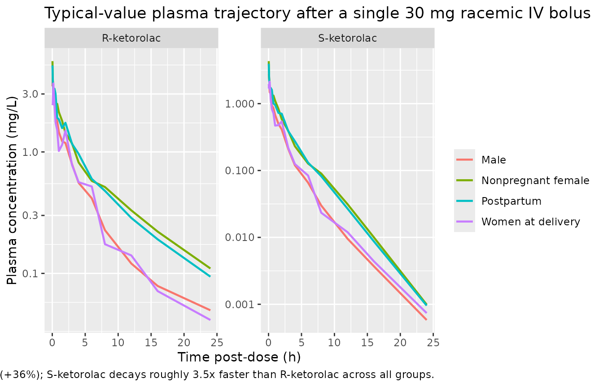
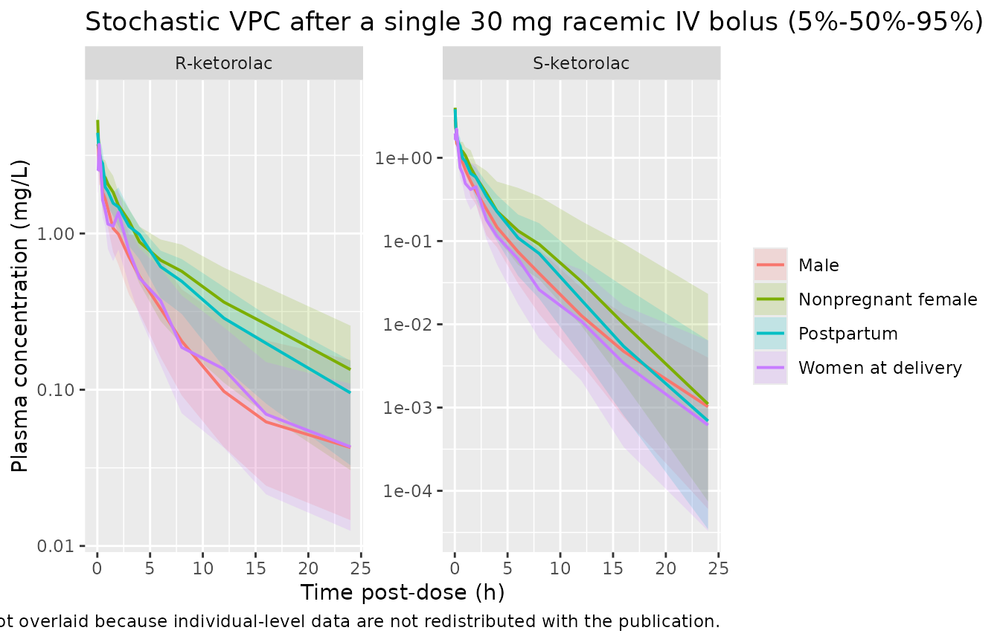
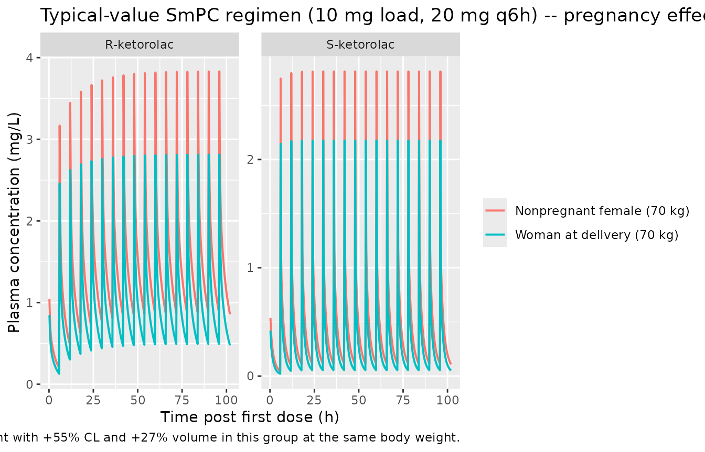

# Ketorolac (Valitalo 2017)

## Model and source

- Citation: Valitalo PA, Kemppainen H, Kulo A, Smits A, van Calsteren K,
  Olkkola KT, de Hoon J, Knibbe CAJ, Allegaert K (2017). Body weight,
  gender and pregnancy affect enantiomer-specific ketorolac
  pharmacokinetics. *Br J Clin Pharmacol* 83(9):1966-1975.
  <doi:10.1111/bcp.13311>.
- Article: <https://doi.org/10.1111/bcp.13311>
- Source files on disk: the published PDF
  (`Vlitalo_2017_Body_weight_gender_and_pregnancy_affect__c9886c.pdf`).
  No supplementary NONMEM control stream was bundled with the task; all
  parameter values come from the paper’s Table 2 final-model column and
  the Methods (equations 1-6).

``` r

mod_fn <- readModelDb("Valitalo_2017_ketorolac")
mod    <- rxode2::rxode2(mod_fn())
```

## Population

Valitalo 2017 pooled the data from two single-IV-bolus studies of
racemic ketorolac tromethamine (Methods, page 1967): the Leuven
(Belgium) study enrolled 41 women immediately post-Caesarean section
(the “women at delivery” / WAD subgroup), 8 of whom were re-studied 4-5
months later (the “postpartum” subgroup, paired sessions on the same 8
women), and a further 8 nonpregnant healthy female volunteers. The
Helsinki (Finland) study contributed 12 men and 6 nonpregnant women, ASA
physical status I-II, undergoing minor eye surgery. After removing the
postpartum sessions as repeats on women already counted in the
at-delivery subgroup, the pooled analysis covers 67 unique adults: 41 +
14 = 55 women (82%) and 12 men (18%); pooled age range 19-44 years and
weight range 40-106 kg (Valitalo 2017 Table 1). Race / ethnicity
composition is not reported.

Doses were 30 mg racemic ketorolac tromethamine (equivalent to 20.345 mg
pure ketorolac per dose) given as an IV bolus at the end of surgery in
Leuven, and 0.5 mg/kg over 30 s in Helsinki. The data were modelled as
half of the racemic dose entering the R-enantiomer compartment and half
entering the S-enantiomer compartment, with no interconversion (Valitalo
2017 Methods, page 1968).

``` r

local({
  fbody <- body(mod_fn)
  meta_env <- new.env()
  for (stmt in as.list(fbody)[-1]) {
    if (is.call(stmt) && length(stmt) >= 1 &&
        identical(stmt[[1]], as.name("<-"))) {
      eval(stmt, envir = meta_env)
    } else {
      break
    }
  }
  cat("Population:\n")
  str(meta_env$population, max.level = 1)
  cat("\nCovariates:\n")
  str(meta_env$covariateData, max.level = 1)
})
#> Population:
#> List of 10
#>  $ n_subjects    : int 67
#>  $ n_studies     : int 2
#>  $ age_range     : chr "19-44 years"
#>  $ weight_range  : chr "40-106 kg"
#>  $ sex_female_pct: num 82
#>  $ race_ethnicity: NULL
#>  $ disease_state : chr "Postoperative analgesia. Pooled analysis of two single-IV-bolus studies: (i) Leuven (Belgium): 41 women immedia"| __truncated__
#>  $ dose_range    : chr "Single IV bolus of racemic ketorolac tromethamine: 30 mg (Leuven; equivalent to 20.345 mg pure ketorolac per do"| __truncated__
#>  $ regions       : chr "Leuven, Belgium and Helsinki, Finland"
#>  $ notes         : chr "Demographics from Valitalo 2017 Table 1: women at delivery n = 41, age 33 (25-44) y, weight 73.9 (40-106) kg; p"| __truncated__
#> 
#> Covariates:
#> List of 3
#>  $ WT  :List of 6
#>  $ PREG:List of 6
#>  $ SEXF:List of 6
```

## Source trace

Every parameter and equation traces back to a specific location in
Valitalo 2017. The structural model is described in the Methods (pages
1967-1968) and the parameter values are read from Table 2 (“Final model”
column).

| Equation / parameter | Value | Source location |
|----|----|----|
| 3-compartment IV structural model for each enantiomer | – | Methods, page 1967: “A three-compartment structural model was selected for both enantiomers.” |
| No interconversion between R- and S-enantiomers | – | Methods, page 1968: “No interconversion between ketorolac enantiomers was assumed because conversion from S to R has been reported to be minimal (6.5%), and conversion from R to S is non-existent.” |
| Half of racemic dose into each enantiomer compartment | – | Methods, page 1968: “The data were modelled based on administering half of the racemic ketorolac dose as the R-enantiomer and half as the S-enantiomer.” |
| `lcl_r = log(1.12)` (L/h) | 1.12 | Table 2 final, CL_R (RSE 5.95%) |
| `lvc_r = log(3.4)` (L) | 3.4 | Table 2 final, V1_R (RSE 5.99%) |
| `lq_r = log(3.86)` (L/h) | 3.86 | Table 2 final, Q1_R (RSE 9.94%) |
| `lvp_r = log(2.29)` (L) | 2.29 | Table 2 final, V2_R (RSE 9.09%) |
| `lq2_r = log(0.58)` (L/h) | 0.58 | Table 2 final, Q2_R (RSE 11.8%) |
| `lvp2_r = log(4.88)` (L) | 4.88 | Table 2 final, V3_R (RSE 20.1%) |
| `lcl_s = log(3.96)` (L/h) | 3.96 | Table 2 final, CL_S (RSE 5.7%) |
| `lvc_s = log(3.74)` (L) | 3.74 | Table 2 final, V1_S (RSE 6.95%) |
| `lq_s = log(20)` (L/h) | 20 | Table 2 final, Q1_S (RSE 10.7%) |
| `lvp_s = log(3.86)` (L) | 3.86 | Table 2 final, V2_S (RSE 8.62%) |
| `lq2_s = log(1.3)` (L/h) | 1.3 | Table 2 final, Q2_S (RSE 20.5%) |
| `lvp2_s = log(3.3)` (L) | 3.3 | Table 2 final, V3_S (RSE 9.71%) |
| `e_wt_cl = 0.536` (allometric) | 0.536 | Table 2 final, WT_CL (RSE 36.5%) |
| `e_wt_vc_vp = 0.807` (allometric, applied to V1, V2, V3) | 0.807 | Table 2 final, WT_V (RSE 20.1%) |
| `e_preg_cl = 0.554` (proportional) | 0.554 | Table 2 final, WAD_CL (RSE 20.4%) |
| `e_sexf_cl = 0.363` (proportional, applied via 1 - SEXF) | 0.363 | Table 2 final, MS_CL (RSE 30.5%) |
| `e_preg_vc_vp = 0.273` (proportional, applied to V1, V2, V3) | 0.273 | Table 2 final, WAD_V (RSE 35.6%) |
| Reference body weight 71 kg | 71 | Table 2 footnotes a-d: “weight/71” |
| Allometric and categorical covariate equations | – | Equations 5 and 6, page 1969 (power form for continuous, linear-in-indicator for categorical) |
| `etalcl_r ~ 0.289^2 = 0.0835` | omega 0.289 | Table 2 final, omega(CL_R) |
| `etalvc_r ~ 0.227^2 = 0.0515` (shared across V1_R, V2_R, V3_R) | omega 0.227 | Table 2 final, omega(V_R); Methods page 1968: “jointly for central and peripheral volumes of distribution (one random effect affecting multiple parameters)” |
| `etalcl_s ~ 0.232^2 = 0.0538` | omega 0.232 | Table 2 final, omega(CL_S) |
| `etalvc_s ~ 0.238^2 = 0.0566` (shared across V1_S, V2_S, V3_S) | omega 0.238 | Table 2 final, omega(V_S) |
| Combined proportional + additive residual error | – | Methods equations 2-4, page 1968; theta_scale = 5.1 -\> f_prop = exp(5.1)/(1+exp(5.1)) ~= 0.9939 |
| `propSd_r = 0.0791`, `addSd_r = 0.00618` | Leuven sigma_R = 0.0794 | Table 2 final, sigma(Leuven, R); split via f_prop |
| `propSd_s = 0.1097`, `addSd_s = 0.00857` | Leuven sigma_S = 0.110 | Table 2 final, sigma(Leuven, S); split via f_prop |

## Virtual cohort

We mirror the four published cohorts with their Table 1 median
demographics and apply the structural-model covariates as time-fixed
per-subject indicators (PREG, SEXF, WT). Each cohort holds 30 simulated
subjects with weight drawn uniformly across the cohort’s Table 1 range.
Each subject receives a single 30 mg racemic IV bolus, modelled as two
simultaneous IV-bolus dose records of 15 mg each (half the racemic dose)
targeting `central_r` and `central_s` respectively.

``` r

set.seed(20260509L)
n_per_cohort <- 30L

obs_times <- c(0, 0.0333, 0.083, 0.167, 0.333, 0.5,
               0.75, 1, 1.5, 2, 3, 4, 6, 8, 12, 16, 24)

build_cohort <- function(label, n, wt_low, wt_high, preg, sexf,
                         id_offset, dose_total_mg = 30) {
  ids <- id_offset + seq_len(n)
  wt  <- runif(n, wt_low, wt_high)

  # Two simultaneous IV bolus dose records per administration: half the
  # racemic dose targeted at central_r and half at central_s. Use the
  # compartment names rather than numeric indices so the data is robust
  # to ODE-declaration reordering.
  dose_rows_r <- data.frame(
    id        = ids,
    time      = 0,
    evid      = 1L,
    amt       = dose_total_mg / 2,
    cmt       = "central_r",
    treatment = label,
    PREG      = preg,
    SEXF      = sexf,
    WT        = wt,
    stringsAsFactors = FALSE
  )
  dose_rows_s <- dose_rows_r
  dose_rows_s$cmt <- "central_s"

  obs_rows <- expand.grid(
    id   = ids,
    time = obs_times,
    KEEP.OUT.ATTRS = FALSE
  )
  obs_rows$evid      <- 0L
  obs_rows$amt       <- 0
  obs_rows$cmt       <- "Cc_r"   # rxSolve still returns both Cc_r and Cc_s columns
  obs_rows$treatment <- label
  obs_rows$PREG      <- rep(preg, each = length(obs_times))
  obs_rows$SEXF      <- rep(sexf, each = length(obs_times))
  obs_rows$WT        <- rep(wt,   each = length(obs_times))

  out <- rbind(dose_rows_r, dose_rows_s, obs_rows)
  out[order(out$id, out$time, -out$evid), ]
}

events <- dplyr::bind_rows(
  build_cohort("Women at delivery",  n_per_cohort,
               wt_low = 40,   wt_high = 106,
               preg = 1L, sexf = 1L, id_offset =   0L),
  build_cohort("Postpartum",         n_per_cohort,
               wt_low = 48.8, wt_high = 87.2,
               preg = 0L, sexf = 1L, id_offset = 100L),
  build_cohort("Nonpregnant female", n_per_cohort,
               wt_low = 49,   wt_high = 74.5,
               preg = 0L, sexf = 1L, id_offset = 200L),
  build_cohort("Male",               n_per_cohort,
               wt_low = 64,   wt_high = 99,
               preg = 0L, sexf = 0L, id_offset = 300L)
)

stopifnot(!anyDuplicated(unique(events[, c("id", "time", "evid", "cmt")])))
```

## Simulation

A typical-value (no-IIV, no-residual-error) replication isolates the
covariate-driven differences between cohorts; a stochastic VPC then
layers the published BSV on top.

``` r

mod_typical <- rxode2::zeroRe(mod)

sim_typical <- rxode2::rxSolve(
  mod_typical,
  events = events,
  keep   = c("treatment", "PREG", "SEXF", "WT")
) |>
  as.data.frame()
#> ℹ omega/sigma items treated as zero: 'etalcl_r', 'etalvc_r', 'etalcl_s', 'etalvc_s'
#> Warning: multi-subject simulation without without 'omega'
```

``` r

sim <- rxode2::rxSolve(
  mod,
  events = events,
  keep   = c("treatment", "PREG", "SEXF", "WT")
) |>
  as.data.frame()
```

## Replicate published figures

### Figure 1 – enantiomer-specific concentration-time profiles by group

Figure 1 of Valitalo 2017 shows semi-logarithmic plots of R- and
S-ketorolac plasma concentrations vs time for the four populations. The
replication below uses the typical-value simulation so the
between-cohort contrasts (lower exposure in women at delivery, similar
initial concentrations across groups, faster S-ketorolac decline) are
unobscured by between-subject variability.

``` r

sim_typical |>
  tidyr::pivot_longer(c(Cc_r, Cc_s), names_to = "enantiomer",
                      values_to = "conc_mgL") |>
  dplyr::mutate(
    enantiomer = dplyr::recode(enantiomer,
                               Cc_r = "R-ketorolac",
                               Cc_s = "S-ketorolac")
  ) |>
  dplyr::filter(time > 0, conc_mgL > 0) |>
  dplyr::group_by(time, treatment, enantiomer) |>
  dplyr::summarise(
    median = median(conc_mgL, na.rm = TRUE),
    .groups = "drop"
  ) |>
  ggplot(aes(time, median, colour = treatment)) +
  geom_line(linewidth = 0.8) +
  facet_wrap(~ enantiomer, scales = "free_y") +
  scale_y_log10() +
  labs(
    x = "Time post-dose (h)",
    y = "Plasma concentration (mg/L)",
    colour = NULL,
    title = "Typical-value plasma trajectory after a single 30 mg racemic IV bolus",
    caption = paste(
      "Replicates Valitalo 2017 Figure 1 (semi-log R- and S-ketorolac",
      "concentrations by population). Women at delivery show the lowest",
      "exposure due to higher CL (+55%) and higher V (+27%); males show",
      "faster S-ketorolac decline due to higher CL (+36%); S-ketorolac",
      "decays roughly 3.5x faster than R-ketorolac across all groups."
    )
  )
```



``` r

sim_vpc <- sim |>
  tidyr::pivot_longer(c(Cc_r, Cc_s), names_to = "enantiomer",
                      values_to = "conc_mgL") |>
  dplyr::mutate(
    enantiomer = dplyr::recode(enantiomer,
                               Cc_r = "R-ketorolac",
                               Cc_s = "S-ketorolac")
  ) |>
  dplyr::filter(time > 0, conc_mgL > 0) |>
  dplyr::group_by(time, treatment, enantiomer) |>
  dplyr::summarise(
    p05 = quantile(conc_mgL, 0.05, na.rm = TRUE),
    p50 = quantile(conc_mgL, 0.50, na.rm = TRUE),
    p95 = quantile(conc_mgL, 0.95, na.rm = TRUE),
    .groups = "drop"
  )

ggplot(sim_vpc, aes(time, p50, colour = treatment, fill = treatment)) +
  geom_ribbon(aes(ymin = p05, ymax = p95), alpha = 0.18, colour = NA) +
  geom_line(linewidth = 0.7) +
  facet_wrap(~ enantiomer, scales = "free_y") +
  scale_y_log10() +
  labs(
    x = "Time post-dose (h)",
    y = "Plasma concentration (mg/L)",
    colour = NULL, fill = NULL,
    title = "Stochastic VPC after a single 30 mg racemic IV bolus (5%-50%-95%)",
    caption = paste(
      "Compare against Valitalo 2017 Figure 4 (VPC stratified by enantiomer).",
      "The 5%-50%-95% bands here are the simulation-only intervals; observed",
      "data percentile lines are not overlaid because individual-level data",
      "are not redistributed with the publication."
    )
  )
```



### Figure 5 – multi-dose simulation under the SmPC regimen

Valitalo 2017 Figure 5 simulates a 10 mg loading dose followed by 20 mg
every 6 h (the ketorolac Summary of Product Characteristics regimen) and
contrasts (A) body-weight, (B) pregnancy, and (C) male-sex effects on
concentrations. We reproduce panel B (pregnancy effect) for both
enantiomers using typical-value simulation in two reference 70-kg
subjects – a nonpregnant female and a woman at delivery.

``` r

mdose_n <- 1L
mdose_dose_times <- c(0, seq(6, 96, by = 6))   # 10 mg load, 20 mg q6h to 96 h
mdose_obs_times  <- seq(0, 102, by = 0.25)

build_mdose_subject <- function(label, preg, sexf, wt, id) {
  load_r <- data.frame(id = id, time = 0, evid = 1L, amt = 5,
                       cmt = "central_r", treatment = label,
                       PREG = preg, SEXF = sexf, WT = wt,
                       stringsAsFactors = FALSE)
  load_s <- load_r;  load_s$cmt <- "central_s"
  maint_r <- data.frame(id = id, time = mdose_dose_times[-1], evid = 1L,
                        amt = 10, cmt = "central_r", treatment = label,
                        PREG = preg, SEXF = sexf, WT = wt,
                        stringsAsFactors = FALSE)
  maint_s <- maint_r;  maint_s$cmt <- "central_s"

  obs <- data.frame(
    id   = id,
    time = mdose_obs_times,
    evid = 0L,
    amt  = 0,
    cmt  = "Cc_r",
    treatment = label,
    PREG = preg,
    SEXF = sexf,
    WT   = wt,
    stringsAsFactors = FALSE
  )
  out <- rbind(load_r, load_s, maint_r, maint_s, obs)
  out[order(out$id, out$time, -out$evid), ]
}

mdose_events <- rbind(
  build_mdose_subject("Nonpregnant female (70 kg)", preg = 0L, sexf = 1L,
                      wt = 70, id = 1L),
  build_mdose_subject("Woman at delivery (70 kg)", preg = 1L, sexf = 1L,
                      wt = 70, id = 2L)
)

mdose_sim <- rxode2::rxSolve(
  mod_typical,
  events = mdose_events,
  keep   = c("treatment", "PREG", "SEXF", "WT")
) |>
  as.data.frame()
#> ℹ omega/sigma items treated as zero: 'etalcl_r', 'etalvc_r', 'etalcl_s', 'etalvc_s'
#> Warning: multi-subject simulation without without 'omega'
```

``` r

mdose_sim |>
  tidyr::pivot_longer(c(Cc_r, Cc_s), names_to = "enantiomer",
                      values_to = "conc_mgL") |>
  dplyr::mutate(
    enantiomer = dplyr::recode(enantiomer,
                               Cc_r = "R-ketorolac",
                               Cc_s = "S-ketorolac")
  ) |>
  dplyr::filter(time > 0, conc_mgL > 0) |>
  ggplot(aes(time, conc_mgL, colour = treatment)) +
  geom_line(linewidth = 0.7) +
  facet_wrap(~ enantiomer, scales = "free_y") +
  labs(
    x = "Time post first dose (h)",
    y = "Plasma concentration (mg/L)",
    colour = NULL,
    title = "Typical-value SmPC regimen (10 mg load, 20 mg q6h) -- pregnancy effect",
    caption = paste(
      "Replicates Valitalo 2017 Figure 5B. Steady-state exposure is lower",
      "in women at delivery for both enantiomers; the relative contrast is",
      "consistent with +55% CL and +27% volume in this group at the same",
      "body weight."
    )
  )
```



## PKNCA validation

Single-dose, 24-hour NCA per the recipe in
`references/pknca-recipes.md`. NCA is run separately for R-ketorolac
(`Cc_r`) and S-ketorolac (`Cc_s`); the cohort label (“Women at
delivery”, “Postpartum”, “Nonpregnant female”, “Male”) is the treatment
grouping variable. The PKNCAdose object carries the half-of-racemic dose
(15 mg) targeted at the relevant enantiomer compartment, so AUC / dose
has units of mg\*h/L per 15 mg of enantiomer.

``` r

sim_nca_r <- sim |>
  dplyr::filter(!is.na(Cc_r), time > 0) |>
  dplyr::select(id, time, Cc_r, treatment)

dose_df_r <- events |>
  dplyr::filter(evid == 1, cmt == "central_r") |>
  dplyr::select(id, time, amt, treatment)

conc_obj_r <- PKNCA::PKNCAconc(sim_nca_r, Cc_r ~ time | treatment + id,
                               concu = "mg/L", timeu = "h")
dose_obj_r <- PKNCA::PKNCAdose(dose_df_r, amt ~ time | treatment + id,
                               doseu = "mg")

intervals <- data.frame(
  start       = 0,
  end         = 24,
  cmax        = TRUE,
  tmax        = TRUE,
  auclast     = TRUE,
  aucinf.obs  = TRUE,
  half.life   = TRUE
)

nca_r <- PKNCA::pk.nca(PKNCA::PKNCAdata(conc_obj_r, dose_obj_r,
                                        intervals = intervals))
#> Warning: Requesting an AUC range starting (0) before the first measurement (0.0333) is not allowed
#> Requesting an AUC range starting (0) before the first measurement (0.0333) is not allowed
#> Requesting an AUC range starting (0) before the first measurement (0.0333) is not allowed
#> Requesting an AUC range starting (0) before the first measurement (0.0333) is not allowed
#> Requesting an AUC range starting (0) before the first measurement (0.0333) is not allowed
#> Requesting an AUC range starting (0) before the first measurement (0.0333) is not allowed
#> Requesting an AUC range starting (0) before the first measurement (0.0333) is not allowed
#> Requesting an AUC range starting (0) before the first measurement (0.0333) is not allowed
#> Requesting an AUC range starting (0) before the first measurement (0.0333) is not allowed
#> Requesting an AUC range starting (0) before the first measurement (0.0333) is not allowed
#> Requesting an AUC range starting (0) before the first measurement (0.0333) is not allowed
#> Requesting an AUC range starting (0) before the first measurement (0.0333) is not allowed
#> Requesting an AUC range starting (0) before the first measurement (0.0333) is not allowed
#> Requesting an AUC range starting (0) before the first measurement (0.0333) is not allowed
#> Requesting an AUC range starting (0) before the first measurement (0.0333) is not allowed
#> Requesting an AUC range starting (0) before the first measurement (0.0333) is not allowed
#> Requesting an AUC range starting (0) before the first measurement (0.0333) is not allowed
#> Requesting an AUC range starting (0) before the first measurement (0.0333) is not allowed
#> Requesting an AUC range starting (0) before the first measurement (0.0333) is not allowed
#> Requesting an AUC range starting (0) before the first measurement (0.0333) is not allowed
#> Requesting an AUC range starting (0) before the first measurement (0.0333) is not allowed
#> Requesting an AUC range starting (0) before the first measurement (0.0333) is not allowed
#> Requesting an AUC range starting (0) before the first measurement (0.0333) is not allowed
#> Requesting an AUC range starting (0) before the first measurement (0.0333) is not allowed
#> Requesting an AUC range starting (0) before the first measurement (0.0333) is not allowed
#> Requesting an AUC range starting (0) before the first measurement (0.0333) is not allowed
#> Requesting an AUC range starting (0) before the first measurement (0.0333) is not allowed
#> Requesting an AUC range starting (0) before the first measurement (0.0333) is not allowed
#> Requesting an AUC range starting (0) before the first measurement (0.0333) is not allowed
#> Requesting an AUC range starting (0) before the first measurement (0.0333) is not allowed
#> Requesting an AUC range starting (0) before the first measurement (0.0333) is not allowed
#> Requesting an AUC range starting (0) before the first measurement (0.0333) is not allowed
#> Requesting an AUC range starting (0) before the first measurement (0.0333) is not allowed
#> Requesting an AUC range starting (0) before the first measurement (0.0333) is not allowed
#> Requesting an AUC range starting (0) before the first measurement (0.0333) is not allowed
#> Requesting an AUC range starting (0) before the first measurement (0.0333) is not allowed
#> Requesting an AUC range starting (0) before the first measurement (0.0333) is not allowed
#> Requesting an AUC range starting (0) before the first measurement (0.0333) is not allowed
#> Requesting an AUC range starting (0) before the first measurement (0.0333) is not allowed
#> Requesting an AUC range starting (0) before the first measurement (0.0333) is not allowed
#> Requesting an AUC range starting (0) before the first measurement (0.0333) is not allowed
#> Requesting an AUC range starting (0) before the first measurement (0.0333) is not allowed
#> Requesting an AUC range starting (0) before the first measurement (0.0333) is not allowed
#> Requesting an AUC range starting (0) before the first measurement (0.0333) is not allowed
#> Requesting an AUC range starting (0) before the first measurement (0.0333) is not allowed
#> Requesting an AUC range starting (0) before the first measurement (0.0333) is not allowed
#> Requesting an AUC range starting (0) before the first measurement (0.0333) is not allowed
#> Requesting an AUC range starting (0) before the first measurement (0.0333) is not allowed
#> Requesting an AUC range starting (0) before the first measurement (0.0333) is not allowed
#> Requesting an AUC range starting (0) before the first measurement (0.0333) is not allowed
#> Requesting an AUC range starting (0) before the first measurement (0.0333) is not allowed
#> Requesting an AUC range starting (0) before the first measurement (0.0333) is not allowed
#> Requesting an AUC range starting (0) before the first measurement (0.0333) is not allowed
#> Requesting an AUC range starting (0) before the first measurement (0.0333) is not allowed
#> Requesting an AUC range starting (0) before the first measurement (0.0333) is not allowed
#> Requesting an AUC range starting (0) before the first measurement (0.0333) is not allowed
#> Requesting an AUC range starting (0) before the first measurement (0.0333) is not allowed
#> Requesting an AUC range starting (0) before the first measurement (0.0333) is not allowed
#> Requesting an AUC range starting (0) before the first measurement (0.0333) is not allowed
#> Requesting an AUC range starting (0) before the first measurement (0.0333) is not allowed
#> Requesting an AUC range starting (0) before the first measurement (0.0333) is not allowed
#> Requesting an AUC range starting (0) before the first measurement (0.0333) is not allowed
#> Requesting an AUC range starting (0) before the first measurement (0.0333) is not allowed
#> Requesting an AUC range starting (0) before the first measurement (0.0333) is not allowed
#> Requesting an AUC range starting (0) before the first measurement (0.0333) is not allowed
#> Requesting an AUC range starting (0) before the first measurement (0.0333) is not allowed
#> Requesting an AUC range starting (0) before the first measurement (0.0333) is not allowed
#> Requesting an AUC range starting (0) before the first measurement (0.0333) is not allowed
#> Requesting an AUC range starting (0) before the first measurement (0.0333) is not allowed
#> Requesting an AUC range starting (0) before the first measurement (0.0333) is not allowed
#> Requesting an AUC range starting (0) before the first measurement (0.0333) is not allowed
#> Requesting an AUC range starting (0) before the first measurement (0.0333) is not allowed
#> Requesting an AUC range starting (0) before the first measurement (0.0333) is not allowed
#> Requesting an AUC range starting (0) before the first measurement (0.0333) is not allowed
#> Requesting an AUC range starting (0) before the first measurement (0.0333) is not allowed
#> Requesting an AUC range starting (0) before the first measurement (0.0333) is not allowed
#> Requesting an AUC range starting (0) before the first measurement (0.0333) is not allowed
#> Requesting an AUC range starting (0) before the first measurement (0.0333) is not allowed
#> Requesting an AUC range starting (0) before the first measurement (0.0333) is not allowed
#> Requesting an AUC range starting (0) before the first measurement (0.0333) is not allowed
#> Requesting an AUC range starting (0) before the first measurement (0.0333) is not allowed
#> Requesting an AUC range starting (0) before the first measurement (0.0333) is not allowed
#> Requesting an AUC range starting (0) before the first measurement (0.0333) is not allowed
#> Requesting an AUC range starting (0) before the first measurement (0.0333) is not allowed
#> Requesting an AUC range starting (0) before the first measurement (0.0333) is not allowed
#> Requesting an AUC range starting (0) before the first measurement (0.0333) is not allowed
#> Requesting an AUC range starting (0) before the first measurement (0.0333) is not allowed
#> Requesting an AUC range starting (0) before the first measurement (0.0333) is not allowed
#> Requesting an AUC range starting (0) before the first measurement (0.0333) is not allowed
#> Requesting an AUC range starting (0) before the first measurement (0.0333) is not allowed
#> Requesting an AUC range starting (0) before the first measurement (0.0333) is not allowed
#> Requesting an AUC range starting (0) before the first measurement (0.0333) is not allowed
#> Requesting an AUC range starting (0) before the first measurement (0.0333) is not allowed
#> Requesting an AUC range starting (0) before the first measurement (0.0333) is not allowed
#> Requesting an AUC range starting (0) before the first measurement (0.0333) is not allowed
#> Requesting an AUC range starting (0) before the first measurement (0.0333) is not allowed
#> Requesting an AUC range starting (0) before the first measurement (0.0333) is not allowed
#> Requesting an AUC range starting (0) before the first measurement (0.0333) is not allowed
#> Requesting an AUC range starting (0) before the first measurement (0.0333) is not allowed
#> Requesting an AUC range starting (0) before the first measurement (0.0333) is not allowed
#> Requesting an AUC range starting (0) before the first measurement (0.0333) is not allowed
#> Requesting an AUC range starting (0) before the first measurement (0.0333) is not allowed
#> Requesting an AUC range starting (0) before the first measurement (0.0333) is not allowed
#> Requesting an AUC range starting (0) before the first measurement (0.0333) is not allowed
#> Requesting an AUC range starting (0) before the first measurement (0.0333) is not allowed
#> Requesting an AUC range starting (0) before the first measurement (0.0333) is not allowed
#> Requesting an AUC range starting (0) before the first measurement (0.0333) is not allowed
#> Requesting an AUC range starting (0) before the first measurement (0.0333) is not allowed
#> Requesting an AUC range starting (0) before the first measurement (0.0333) is not allowed
#> Requesting an AUC range starting (0) before the first measurement (0.0333) is not allowed
#> Requesting an AUC range starting (0) before the first measurement (0.0333) is not allowed
#> Requesting an AUC range starting (0) before the first measurement (0.0333) is not allowed
#> Requesting an AUC range starting (0) before the first measurement (0.0333) is not allowed
#> Requesting an AUC range starting (0) before the first measurement (0.0333) is not allowed
#> Requesting an AUC range starting (0) before the first measurement (0.0333) is not allowed
#> Requesting an AUC range starting (0) before the first measurement (0.0333) is not allowed
#> Requesting an AUC range starting (0) before the first measurement (0.0333) is not allowed
#> Requesting an AUC range starting (0) before the first measurement (0.0333) is not allowed
#> Requesting an AUC range starting (0) before the first measurement (0.0333) is not allowed
#> Requesting an AUC range starting (0) before the first measurement (0.0333) is not allowed
#> Requesting an AUC range starting (0) before the first measurement (0.0333) is not allowed
#> Requesting an AUC range starting (0) before the first measurement (0.0333) is not allowed
#> Requesting an AUC range starting (0) before the first measurement (0.0333) is not allowed
#> Requesting an AUC range starting (0) before the first measurement (0.0333) is not allowed
#> Requesting an AUC range starting (0) before the first measurement (0.0333) is not allowed
#> Requesting an AUC range starting (0) before the first measurement (0.0333) is not allowed
#> Requesting an AUC range starting (0) before the first measurement (0.0333) is not allowed
#> Requesting an AUC range starting (0) before the first measurement (0.0333) is not allowed
#> Requesting an AUC range starting (0) before the first measurement (0.0333) is not allowed
#> Requesting an AUC range starting (0) before the first measurement (0.0333) is not allowed
#> Requesting an AUC range starting (0) before the first measurement (0.0333) is not allowed
#> Requesting an AUC range starting (0) before the first measurement (0.0333) is not allowed
#> Requesting an AUC range starting (0) before the first measurement (0.0333) is not allowed
#> Requesting an AUC range starting (0) before the first measurement (0.0333) is not allowed
#> Requesting an AUC range starting (0) before the first measurement (0.0333) is not allowed
#> Requesting an AUC range starting (0) before the first measurement (0.0333) is not allowed
#> Requesting an AUC range starting (0) before the first measurement (0.0333) is not allowed
#> Requesting an AUC range starting (0) before the first measurement (0.0333) is not allowed
#> Requesting an AUC range starting (0) before the first measurement (0.0333) is not allowed
#> Requesting an AUC range starting (0) before the first measurement (0.0333) is not allowed
#> Requesting an AUC range starting (0) before the first measurement (0.0333) is not allowed
#> Requesting an AUC range starting (0) before the first measurement (0.0333) is not allowed
#> Requesting an AUC range starting (0) before the first measurement (0.0333) is not allowed
#> Requesting an AUC range starting (0) before the first measurement (0.0333) is not allowed
#> Requesting an AUC range starting (0) before the first measurement (0.0333) is not allowed
#> Requesting an AUC range starting (0) before the first measurement (0.0333) is not allowed
#> Requesting an AUC range starting (0) before the first measurement (0.0333) is not allowed
#> Requesting an AUC range starting (0) before the first measurement (0.0333) is not allowed
#> Requesting an AUC range starting (0) before the first measurement (0.0333) is not allowed
#> Requesting an AUC range starting (0) before the first measurement (0.0333) is not allowed
#> Requesting an AUC range starting (0) before the first measurement (0.0333) is not allowed
#> Requesting an AUC range starting (0) before the first measurement (0.0333) is not allowed
#> Requesting an AUC range starting (0) before the first measurement (0.0333) is not allowed
#> Requesting an AUC range starting (0) before the first measurement (0.0333) is not allowed
#> Requesting an AUC range starting (0) before the first measurement (0.0333) is not allowed
#> Requesting an AUC range starting (0) before the first measurement (0.0333) is not allowed
#> Requesting an AUC range starting (0) before the first measurement (0.0333) is not allowed
#> Requesting an AUC range starting (0) before the first measurement (0.0333) is not allowed
#> Requesting an AUC range starting (0) before the first measurement (0.0333) is not allowed
#> Requesting an AUC range starting (0) before the first measurement (0.0333) is not allowed
#> Requesting an AUC range starting (0) before the first measurement (0.0333) is not allowed
#> Requesting an AUC range starting (0) before the first measurement (0.0333) is not allowed
#> Requesting an AUC range starting (0) before the first measurement (0.0333) is not allowed
#> Requesting an AUC range starting (0) before the first measurement (0.0333) is not allowed
#> Requesting an AUC range starting (0) before the first measurement (0.0333) is not allowed
#> Requesting an AUC range starting (0) before the first measurement (0.0333) is not allowed
#> Requesting an AUC range starting (0) before the first measurement (0.0333) is not allowed
#> Requesting an AUC range starting (0) before the first measurement (0.0333) is not allowed
#> Requesting an AUC range starting (0) before the first measurement (0.0333) is not allowed
#> Requesting an AUC range starting (0) before the first measurement (0.0333) is not allowed
#> Requesting an AUC range starting (0) before the first measurement (0.0333) is not allowed
#> Requesting an AUC range starting (0) before the first measurement (0.0333) is not allowed
#> Requesting an AUC range starting (0) before the first measurement (0.0333) is not allowed
#> Requesting an AUC range starting (0) before the first measurement (0.0333) is not allowed
#> Requesting an AUC range starting (0) before the first measurement (0.0333) is not allowed
#> Requesting an AUC range starting (0) before the first measurement (0.0333) is not allowed
#> Requesting an AUC range starting (0) before the first measurement (0.0333) is not allowed
#> Requesting an AUC range starting (0) before the first measurement (0.0333) is not allowed
#> Requesting an AUC range starting (0) before the first measurement (0.0333) is not allowed
#> Requesting an AUC range starting (0) before the first measurement (0.0333) is not allowed
#> Requesting an AUC range starting (0) before the first measurement (0.0333) is not allowed
#> Requesting an AUC range starting (0) before the first measurement (0.0333) is not allowed
#> Requesting an AUC range starting (0) before the first measurement (0.0333) is not allowed
#> Requesting an AUC range starting (0) before the first measurement (0.0333) is not allowed
#> Requesting an AUC range starting (0) before the first measurement (0.0333) is not allowed
#> Requesting an AUC range starting (0) before the first measurement (0.0333) is not allowed
#> Requesting an AUC range starting (0) before the first measurement (0.0333) is not allowed
#> Requesting an AUC range starting (0) before the first measurement (0.0333) is not allowed
#> Requesting an AUC range starting (0) before the first measurement (0.0333) is not allowed
#> Requesting an AUC range starting (0) before the first measurement (0.0333) is not allowed
#> Requesting an AUC range starting (0) before the first measurement (0.0333) is not allowed
#> Requesting an AUC range starting (0) before the first measurement (0.0333) is not allowed
#> Requesting an AUC range starting (0) before the first measurement (0.0333) is not allowed
#> Requesting an AUC range starting (0) before the first measurement (0.0333) is not allowed
#> Requesting an AUC range starting (0) before the first measurement (0.0333) is not allowed
#> Requesting an AUC range starting (0) before the first measurement (0.0333) is not allowed
#> Requesting an AUC range starting (0) before the first measurement (0.0333) is not allowed
#> Requesting an AUC range starting (0) before the first measurement (0.0333) is not allowed
#> Requesting an AUC range starting (0) before the first measurement (0.0333) is not allowed
#> Requesting an AUC range starting (0) before the first measurement (0.0333) is not allowed
#> Requesting an AUC range starting (0) before the first measurement (0.0333) is not allowed
#> Requesting an AUC range starting (0) before the first measurement (0.0333) is not allowed
#> Requesting an AUC range starting (0) before the first measurement (0.0333) is not allowed
#> Requesting an AUC range starting (0) before the first measurement (0.0333) is not allowed
#> Requesting an AUC range starting (0) before the first measurement (0.0333) is not allowed
#> Requesting an AUC range starting (0) before the first measurement (0.0333) is not allowed
#> Requesting an AUC range starting (0) before the first measurement (0.0333) is not allowed
#> Requesting an AUC range starting (0) before the first measurement (0.0333) is not allowed
#> Requesting an AUC range starting (0) before the first measurement (0.0333) is not allowed
#> Requesting an AUC range starting (0) before the first measurement (0.0333) is not allowed
#> Requesting an AUC range starting (0) before the first measurement (0.0333) is not allowed
#> Requesting an AUC range starting (0) before the first measurement (0.0333) is not allowed
#> Requesting an AUC range starting (0) before the first measurement (0.0333) is not allowed
#> Requesting an AUC range starting (0) before the first measurement (0.0333) is not allowed
#> Requesting an AUC range starting (0) before the first measurement (0.0333) is not allowed
#> Requesting an AUC range starting (0) before the first measurement (0.0333) is not allowed
#> Requesting an AUC range starting (0) before the first measurement (0.0333) is not allowed
#> Requesting an AUC range starting (0) before the first measurement (0.0333) is not allowed
#> Requesting an AUC range starting (0) before the first measurement (0.0333) is not allowed
#> Requesting an AUC range starting (0) before the first measurement (0.0333) is not allowed
#> Requesting an AUC range starting (0) before the first measurement (0.0333) is not allowed
#> Requesting an AUC range starting (0) before the first measurement (0.0333) is not allowed
#> Requesting an AUC range starting (0) before the first measurement (0.0333) is not allowed
#> Requesting an AUC range starting (0) before the first measurement (0.0333) is not allowed
#> Requesting an AUC range starting (0) before the first measurement (0.0333) is not allowed
#> Requesting an AUC range starting (0) before the first measurement (0.0333) is not allowed
#> Requesting an AUC range starting (0) before the first measurement (0.0333) is not allowed
#> Requesting an AUC range starting (0) before the first measurement (0.0333) is not allowed
#> Requesting an AUC range starting (0) before the first measurement (0.0333) is not allowed
#> Requesting an AUC range starting (0) before the first measurement (0.0333) is not allowed
#> Requesting an AUC range starting (0) before the first measurement (0.0333) is not allowed
#> Requesting an AUC range starting (0) before the first measurement (0.0333) is not allowed
#> Requesting an AUC range starting (0) before the first measurement (0.0333) is not allowed
#> Requesting an AUC range starting (0) before the first measurement (0.0333) is not allowed
#> Requesting an AUC range starting (0) before the first measurement (0.0333) is not allowed
#> Requesting an AUC range starting (0) before the first measurement (0.0333) is not allowed
#> Requesting an AUC range starting (0) before the first measurement (0.0333) is not allowed
#> Requesting an AUC range starting (0) before the first measurement (0.0333) is not allowed
#> Requesting an AUC range starting (0) before the first measurement (0.0333) is not allowed
#> Requesting an AUC range starting (0) before the first measurement (0.0333) is not allowed
```

``` r

sim_nca_s <- sim |>
  dplyr::filter(!is.na(Cc_s), time > 0) |>
  dplyr::select(id, time, Cc_s, treatment)

dose_df_s <- events |>
  dplyr::filter(evid == 1, cmt == "central_s") |>
  dplyr::select(id, time, amt, treatment)

conc_obj_s <- PKNCA::PKNCAconc(sim_nca_s, Cc_s ~ time | treatment + id,
                               concu = "mg/L", timeu = "h")
dose_obj_s <- PKNCA::PKNCAdose(dose_df_s, amt ~ time | treatment + id,
                               doseu = "mg")

nca_s <- PKNCA::pk.nca(PKNCA::PKNCAdata(conc_obj_s, dose_obj_s,
                                        intervals = intervals))
#> Warning: Requesting an AUC range starting (0) before the first measurement (0.0333) is not allowed
#> Requesting an AUC range starting (0) before the first measurement (0.0333) is not allowed
#> Requesting an AUC range starting (0) before the first measurement (0.0333) is not allowed
#> Requesting an AUC range starting (0) before the first measurement (0.0333) is not allowed
#> Requesting an AUC range starting (0) before the first measurement (0.0333) is not allowed
#> Requesting an AUC range starting (0) before the first measurement (0.0333) is not allowed
#> Requesting an AUC range starting (0) before the first measurement (0.0333) is not allowed
#> Requesting an AUC range starting (0) before the first measurement (0.0333) is not allowed
#> Requesting an AUC range starting (0) before the first measurement (0.0333) is not allowed
#> Requesting an AUC range starting (0) before the first measurement (0.0333) is not allowed
#> Requesting an AUC range starting (0) before the first measurement (0.0333) is not allowed
#> Requesting an AUC range starting (0) before the first measurement (0.0333) is not allowed
#> Requesting an AUC range starting (0) before the first measurement (0.0333) is not allowed
#> Requesting an AUC range starting (0) before the first measurement (0.0333) is not allowed
#> Requesting an AUC range starting (0) before the first measurement (0.0333) is not allowed
#> Requesting an AUC range starting (0) before the first measurement (0.0333) is not allowed
#> Requesting an AUC range starting (0) before the first measurement (0.0333) is not allowed
#> Requesting an AUC range starting (0) before the first measurement (0.0333) is not allowed
#> Requesting an AUC range starting (0) before the first measurement (0.0333) is not allowed
#> Requesting an AUC range starting (0) before the first measurement (0.0333) is not allowed
#> Requesting an AUC range starting (0) before the first measurement (0.0333) is not allowed
#> Requesting an AUC range starting (0) before the first measurement (0.0333) is not allowed
#> Requesting an AUC range starting (0) before the first measurement (0.0333) is not allowed
#> Requesting an AUC range starting (0) before the first measurement (0.0333) is not allowed
#> Requesting an AUC range starting (0) before the first measurement (0.0333) is not allowed
#> Requesting an AUC range starting (0) before the first measurement (0.0333) is not allowed
#> Requesting an AUC range starting (0) before the first measurement (0.0333) is not allowed
#> Requesting an AUC range starting (0) before the first measurement (0.0333) is not allowed
#> Requesting an AUC range starting (0) before the first measurement (0.0333) is not allowed
#> Requesting an AUC range starting (0) before the first measurement (0.0333) is not allowed
#> Requesting an AUC range starting (0) before the first measurement (0.0333) is not allowed
#> Requesting an AUC range starting (0) before the first measurement (0.0333) is not allowed
#> Requesting an AUC range starting (0) before the first measurement (0.0333) is not allowed
#> Requesting an AUC range starting (0) before the first measurement (0.0333) is not allowed
#> Requesting an AUC range starting (0) before the first measurement (0.0333) is not allowed
#> Requesting an AUC range starting (0) before the first measurement (0.0333) is not allowed
#> Requesting an AUC range starting (0) before the first measurement (0.0333) is not allowed
#> Requesting an AUC range starting (0) before the first measurement (0.0333) is not allowed
#> Requesting an AUC range starting (0) before the first measurement (0.0333) is not allowed
#> Requesting an AUC range starting (0) before the first measurement (0.0333) is not allowed
#> Requesting an AUC range starting (0) before the first measurement (0.0333) is not allowed
#> Requesting an AUC range starting (0) before the first measurement (0.0333) is not allowed
#> Requesting an AUC range starting (0) before the first measurement (0.0333) is not allowed
#> Requesting an AUC range starting (0) before the first measurement (0.0333) is not allowed
#> Requesting an AUC range starting (0) before the first measurement (0.0333) is not allowed
#> Requesting an AUC range starting (0) before the first measurement (0.0333) is not allowed
#> Requesting an AUC range starting (0) before the first measurement (0.0333) is not allowed
#> Requesting an AUC range starting (0) before the first measurement (0.0333) is not allowed
#> Requesting an AUC range starting (0) before the first measurement (0.0333) is not allowed
#> Requesting an AUC range starting (0) before the first measurement (0.0333) is not allowed
#> Requesting an AUC range starting (0) before the first measurement (0.0333) is not allowed
#> Requesting an AUC range starting (0) before the first measurement (0.0333) is not allowed
#> Requesting an AUC range starting (0) before the first measurement (0.0333) is not allowed
#> Requesting an AUC range starting (0) before the first measurement (0.0333) is not allowed
#> Requesting an AUC range starting (0) before the first measurement (0.0333) is not allowed
#> Requesting an AUC range starting (0) before the first measurement (0.0333) is not allowed
#> Requesting an AUC range starting (0) before the first measurement (0.0333) is not allowed
#> Requesting an AUC range starting (0) before the first measurement (0.0333) is not allowed
#> Requesting an AUC range starting (0) before the first measurement (0.0333) is not allowed
#> Requesting an AUC range starting (0) before the first measurement (0.0333) is not allowed
#> Requesting an AUC range starting (0) before the first measurement (0.0333) is not allowed
#> Requesting an AUC range starting (0) before the first measurement (0.0333) is not allowed
#> Requesting an AUC range starting (0) before the first measurement (0.0333) is not allowed
#> Requesting an AUC range starting (0) before the first measurement (0.0333) is not allowed
#> Requesting an AUC range starting (0) before the first measurement (0.0333) is not allowed
#> Requesting an AUC range starting (0) before the first measurement (0.0333) is not allowed
#> Requesting an AUC range starting (0) before the first measurement (0.0333) is not allowed
#> Requesting an AUC range starting (0) before the first measurement (0.0333) is not allowed
#> Requesting an AUC range starting (0) before the first measurement (0.0333) is not allowed
#> Requesting an AUC range starting (0) before the first measurement (0.0333) is not allowed
#> Requesting an AUC range starting (0) before the first measurement (0.0333) is not allowed
#> Requesting an AUC range starting (0) before the first measurement (0.0333) is not allowed
#> Requesting an AUC range starting (0) before the first measurement (0.0333) is not allowed
#> Requesting an AUC range starting (0) before the first measurement (0.0333) is not allowed
#> Requesting an AUC range starting (0) before the first measurement (0.0333) is not allowed
#> Requesting an AUC range starting (0) before the first measurement (0.0333) is not allowed
#> Requesting an AUC range starting (0) before the first measurement (0.0333) is not allowed
#> Requesting an AUC range starting (0) before the first measurement (0.0333) is not allowed
#> Requesting an AUC range starting (0) before the first measurement (0.0333) is not allowed
#> Requesting an AUC range starting (0) before the first measurement (0.0333) is not allowed
#> Requesting an AUC range starting (0) before the first measurement (0.0333) is not allowed
#> Requesting an AUC range starting (0) before the first measurement (0.0333) is not allowed
#> Requesting an AUC range starting (0) before the first measurement (0.0333) is not allowed
#> Requesting an AUC range starting (0) before the first measurement (0.0333) is not allowed
#> Requesting an AUC range starting (0) before the first measurement (0.0333) is not allowed
#> Requesting an AUC range starting (0) before the first measurement (0.0333) is not allowed
#> Requesting an AUC range starting (0) before the first measurement (0.0333) is not allowed
#> Requesting an AUC range starting (0) before the first measurement (0.0333) is not allowed
#> Requesting an AUC range starting (0) before the first measurement (0.0333) is not allowed
#> Requesting an AUC range starting (0) before the first measurement (0.0333) is not allowed
#> Requesting an AUC range starting (0) before the first measurement (0.0333) is not allowed
#> Requesting an AUC range starting (0) before the first measurement (0.0333) is not allowed
#> Requesting an AUC range starting (0) before the first measurement (0.0333) is not allowed
#> Requesting an AUC range starting (0) before the first measurement (0.0333) is not allowed
#> Requesting an AUC range starting (0) before the first measurement (0.0333) is not allowed
#> Requesting an AUC range starting (0) before the first measurement (0.0333) is not allowed
#> Requesting an AUC range starting (0) before the first measurement (0.0333) is not allowed
#> Requesting an AUC range starting (0) before the first measurement (0.0333) is not allowed
#> Requesting an AUC range starting (0) before the first measurement (0.0333) is not allowed
#> Requesting an AUC range starting (0) before the first measurement (0.0333) is not allowed
#> Requesting an AUC range starting (0) before the first measurement (0.0333) is not allowed
#> Requesting an AUC range starting (0) before the first measurement (0.0333) is not allowed
#> Requesting an AUC range starting (0) before the first measurement (0.0333) is not allowed
#> Requesting an AUC range starting (0) before the first measurement (0.0333) is not allowed
#> Requesting an AUC range starting (0) before the first measurement (0.0333) is not allowed
#> Requesting an AUC range starting (0) before the first measurement (0.0333) is not allowed
#> Requesting an AUC range starting (0) before the first measurement (0.0333) is not allowed
#> Requesting an AUC range starting (0) before the first measurement (0.0333) is not allowed
#> Requesting an AUC range starting (0) before the first measurement (0.0333) is not allowed
#> Requesting an AUC range starting (0) before the first measurement (0.0333) is not allowed
#> Requesting an AUC range starting (0) before the first measurement (0.0333) is not allowed
#> Requesting an AUC range starting (0) before the first measurement (0.0333) is not allowed
#> Requesting an AUC range starting (0) before the first measurement (0.0333) is not allowed
#> Requesting an AUC range starting (0) before the first measurement (0.0333) is not allowed
#> Requesting an AUC range starting (0) before the first measurement (0.0333) is not allowed
#> Requesting an AUC range starting (0) before the first measurement (0.0333) is not allowed
#> Requesting an AUC range starting (0) before the first measurement (0.0333) is not allowed
#> Requesting an AUC range starting (0) before the first measurement (0.0333) is not allowed
#> Requesting an AUC range starting (0) before the first measurement (0.0333) is not allowed
#> Requesting an AUC range starting (0) before the first measurement (0.0333) is not allowed
#> Requesting an AUC range starting (0) before the first measurement (0.0333) is not allowed
#> Requesting an AUC range starting (0) before the first measurement (0.0333) is not allowed
#> Requesting an AUC range starting (0) before the first measurement (0.0333) is not allowed
#> Requesting an AUC range starting (0) before the first measurement (0.0333) is not allowed
#> Requesting an AUC range starting (0) before the first measurement (0.0333) is not allowed
#> Requesting an AUC range starting (0) before the first measurement (0.0333) is not allowed
#> Requesting an AUC range starting (0) before the first measurement (0.0333) is not allowed
#> Requesting an AUC range starting (0) before the first measurement (0.0333) is not allowed
#> Requesting an AUC range starting (0) before the first measurement (0.0333) is not allowed
#> Requesting an AUC range starting (0) before the first measurement (0.0333) is not allowed
#> Requesting an AUC range starting (0) before the first measurement (0.0333) is not allowed
#> Requesting an AUC range starting (0) before the first measurement (0.0333) is not allowed
#> Requesting an AUC range starting (0) before the first measurement (0.0333) is not allowed
#> Requesting an AUC range starting (0) before the first measurement (0.0333) is not allowed
#> Requesting an AUC range starting (0) before the first measurement (0.0333) is not allowed
#> Requesting an AUC range starting (0) before the first measurement (0.0333) is not allowed
#> Requesting an AUC range starting (0) before the first measurement (0.0333) is not allowed
#> Requesting an AUC range starting (0) before the first measurement (0.0333) is not allowed
#> Requesting an AUC range starting (0) before the first measurement (0.0333) is not allowed
#> Requesting an AUC range starting (0) before the first measurement (0.0333) is not allowed
#> Requesting an AUC range starting (0) before the first measurement (0.0333) is not allowed
#> Requesting an AUC range starting (0) before the first measurement (0.0333) is not allowed
#> Requesting an AUC range starting (0) before the first measurement (0.0333) is not allowed
#> Requesting an AUC range starting (0) before the first measurement (0.0333) is not allowed
#> Requesting an AUC range starting (0) before the first measurement (0.0333) is not allowed
#> Requesting an AUC range starting (0) before the first measurement (0.0333) is not allowed
#> Requesting an AUC range starting (0) before the first measurement (0.0333) is not allowed
#> Requesting an AUC range starting (0) before the first measurement (0.0333) is not allowed
#> Requesting an AUC range starting (0) before the first measurement (0.0333) is not allowed
#> Requesting an AUC range starting (0) before the first measurement (0.0333) is not allowed
#> Requesting an AUC range starting (0) before the first measurement (0.0333) is not allowed
#> Requesting an AUC range starting (0) before the first measurement (0.0333) is not allowed
#> Requesting an AUC range starting (0) before the first measurement (0.0333) is not allowed
#> Requesting an AUC range starting (0) before the first measurement (0.0333) is not allowed
#> Requesting an AUC range starting (0) before the first measurement (0.0333) is not allowed
#> Requesting an AUC range starting (0) before the first measurement (0.0333) is not allowed
#> Requesting an AUC range starting (0) before the first measurement (0.0333) is not allowed
#> Requesting an AUC range starting (0) before the first measurement (0.0333) is not allowed
#> Requesting an AUC range starting (0) before the first measurement (0.0333) is not allowed
#> Requesting an AUC range starting (0) before the first measurement (0.0333) is not allowed
#> Requesting an AUC range starting (0) before the first measurement (0.0333) is not allowed
#> Requesting an AUC range starting (0) before the first measurement (0.0333) is not allowed
#> Requesting an AUC range starting (0) before the first measurement (0.0333) is not allowed
#> Requesting an AUC range starting (0) before the first measurement (0.0333) is not allowed
#> Requesting an AUC range starting (0) before the first measurement (0.0333) is not allowed
#> Requesting an AUC range starting (0) before the first measurement (0.0333) is not allowed
#> Requesting an AUC range starting (0) before the first measurement (0.0333) is not allowed
#> Requesting an AUC range starting (0) before the first measurement (0.0333) is not allowed
#> Requesting an AUC range starting (0) before the first measurement (0.0333) is not allowed
#> Requesting an AUC range starting (0) before the first measurement (0.0333) is not allowed
#> Requesting an AUC range starting (0) before the first measurement (0.0333) is not allowed
#> Requesting an AUC range starting (0) before the first measurement (0.0333) is not allowed
#> Requesting an AUC range starting (0) before the first measurement (0.0333) is not allowed
#> Requesting an AUC range starting (0) before the first measurement (0.0333) is not allowed
#> Requesting an AUC range starting (0) before the first measurement (0.0333) is not allowed
#> Requesting an AUC range starting (0) before the first measurement (0.0333) is not allowed
#> Requesting an AUC range starting (0) before the first measurement (0.0333) is not allowed
#> Requesting an AUC range starting (0) before the first measurement (0.0333) is not allowed
#> Requesting an AUC range starting (0) before the first measurement (0.0333) is not allowed
#> Requesting an AUC range starting (0) before the first measurement (0.0333) is not allowed
#> Requesting an AUC range starting (0) before the first measurement (0.0333) is not allowed
#> Requesting an AUC range starting (0) before the first measurement (0.0333) is not allowed
#> Requesting an AUC range starting (0) before the first measurement (0.0333) is not allowed
#> Requesting an AUC range starting (0) before the first measurement (0.0333) is not allowed
#> Requesting an AUC range starting (0) before the first measurement (0.0333) is not allowed
#> Requesting an AUC range starting (0) before the first measurement (0.0333) is not allowed
#> Requesting an AUC range starting (0) before the first measurement (0.0333) is not allowed
#> Requesting an AUC range starting (0) before the first measurement (0.0333) is not allowed
#> Requesting an AUC range starting (0) before the first measurement (0.0333) is not allowed
#> Requesting an AUC range starting (0) before the first measurement (0.0333) is not allowed
#> Requesting an AUC range starting (0) before the first measurement (0.0333) is not allowed
#> Requesting an AUC range starting (0) before the first measurement (0.0333) is not allowed
#> Requesting an AUC range starting (0) before the first measurement (0.0333) is not allowed
#> Requesting an AUC range starting (0) before the first measurement (0.0333) is not allowed
#> Requesting an AUC range starting (0) before the first measurement (0.0333) is not allowed
#> Requesting an AUC range starting (0) before the first measurement (0.0333) is not allowed
#> Requesting an AUC range starting (0) before the first measurement (0.0333) is not allowed
#> Requesting an AUC range starting (0) before the first measurement (0.0333) is not allowed
#> Requesting an AUC range starting (0) before the first measurement (0.0333) is not allowed
#> Requesting an AUC range starting (0) before the first measurement (0.0333) is not allowed
#> Requesting an AUC range starting (0) before the first measurement (0.0333) is not allowed
#> Requesting an AUC range starting (0) before the first measurement (0.0333) is not allowed
#> Requesting an AUC range starting (0) before the first measurement (0.0333) is not allowed
#> Requesting an AUC range starting (0) before the first measurement (0.0333) is not allowed
#> Requesting an AUC range starting (0) before the first measurement (0.0333) is not allowed
#> Requesting an AUC range starting (0) before the first measurement (0.0333) is not allowed
#> Requesting an AUC range starting (0) before the first measurement (0.0333) is not allowed
#> Requesting an AUC range starting (0) before the first measurement (0.0333) is not allowed
#> Requesting an AUC range starting (0) before the first measurement (0.0333) is not allowed
#> Requesting an AUC range starting (0) before the first measurement (0.0333) is not allowed
#> Requesting an AUC range starting (0) before the first measurement (0.0333) is not allowed
#> Requesting an AUC range starting (0) before the first measurement (0.0333) is not allowed
#> Requesting an AUC range starting (0) before the first measurement (0.0333) is not allowed
#> Requesting an AUC range starting (0) before the first measurement (0.0333) is not allowed
#> Requesting an AUC range starting (0) before the first measurement (0.0333) is not allowed
#> Requesting an AUC range starting (0) before the first measurement (0.0333) is not allowed
#> Requesting an AUC range starting (0) before the first measurement (0.0333) is not allowed
#> Requesting an AUC range starting (0) before the first measurement (0.0333) is not allowed
#> Requesting an AUC range starting (0) before the first measurement (0.0333) is not allowed
#> Requesting an AUC range starting (0) before the first measurement (0.0333) is not allowed
#> Requesting an AUC range starting (0) before the first measurement (0.0333) is not allowed
#> Requesting an AUC range starting (0) before the first measurement (0.0333) is not allowed
#> Requesting an AUC range starting (0) before the first measurement (0.0333) is not allowed
#> Requesting an AUC range starting (0) before the first measurement (0.0333) is not allowed
#> Requesting an AUC range starting (0) before the first measurement (0.0333) is not allowed
#> Requesting an AUC range starting (0) before the first measurement (0.0333) is not allowed
#> Requesting an AUC range starting (0) before the first measurement (0.0333) is not allowed
#> Requesting an AUC range starting (0) before the first measurement (0.0333) is not allowed
#> Requesting an AUC range starting (0) before the first measurement (0.0333) is not allowed
#> Requesting an AUC range starting (0) before the first measurement (0.0333) is not allowed
#> Requesting an AUC range starting (0) before the first measurement (0.0333) is not allowed
#> Requesting an AUC range starting (0) before the first measurement (0.0333) is not allowed
#> Requesting an AUC range starting (0) before the first measurement (0.0333) is not allowed
#> Requesting an AUC range starting (0) before the first measurement (0.0333) is not allowed
#> Requesting an AUC range starting (0) before the first measurement (0.0333) is not allowed
#> Requesting an AUC range starting (0) before the first measurement (0.0333) is not allowed
#> Requesting an AUC range starting (0) before the first measurement (0.0333) is not allowed
#> Requesting an AUC range starting (0) before the first measurement (0.0333) is not allowed
#> Requesting an AUC range starting (0) before the first measurement (0.0333) is not allowed
#> Requesting an AUC range starting (0) before the first measurement (0.0333) is not allowed
```

``` r

nca_r_df <- as.data.frame(nca_r$result)
r_summary <- nca_r_df |>
  dplyr::filter(PPTESTCD %in% c("cmax", "tmax", "auclast",
                                "aucinf.obs", "half.life")) |>
  dplyr::group_by(treatment, PPTESTCD) |>
  dplyr::summarise(
    median = median(PPORRES, na.rm = TRUE),
    p05    = quantile(PPORRES, 0.05, na.rm = TRUE),
    p95    = quantile(PPORRES, 0.95, na.rm = TRUE),
    .groups = "drop"
  )

knitr::kable(
  r_summary,
  caption = paste("Simulated NCA -- R-ketorolac, single 15 mg IV bolus",
                  "(half of 30 mg racemic), by cohort (median [5%-95%])."),
  digits  = 3
)
```

| treatment          | PPTESTCD   | median |   p05 |    p95 |
|:-------------------|:-----------|-------:|------:|-------:|
| Male               | aucinf.obs |     NA |    NA |     NA |
| Male               | auclast    |     NA |    NA |     NA |
| Male               | cmax       |  3.834 | 2.812 |  5.204 |
| Male               | half.life  |  7.356 | 4.047 | 13.032 |
| Male               | tmax       |  0.083 | 0.033 |  0.083 |
| Nonpregnant female | aucinf.obs |     NA |    NA |     NA |
| Nonpregnant female | auclast    |     NA |    NA |     NA |
| Nonpregnant female | cmax       |  5.332 | 4.098 |  7.197 |
| Nonpregnant female | half.life  |  7.956 | 6.109 | 10.231 |
| Nonpregnant female | tmax       |  0.033 | 0.033 |  0.083 |
| Postpartum         | aucinf.obs |     NA |    NA |     NA |
| Postpartum         | auclast    |     NA |    NA |     NA |
| Postpartum         | cmax       |  4.765 | 3.464 |  6.172 |
| Postpartum         | half.life  |  6.830 | 4.988 |  8.801 |
| Postpartum         | tmax       |  0.033 | 0.033 |  0.083 |
| Women at delivery  | aucinf.obs |     NA |    NA |     NA |
| Women at delivery  | auclast    |     NA |    NA |     NA |
| Women at delivery  | cmax       |  4.047 | 2.839 |  5.385 |
| Women at delivery  | half.life  |  5.937 | 3.687 | 10.077 |
| Women at delivery  | tmax       |  0.167 | 0.083 |  0.167 |

Simulated NCA – R-ketorolac, single 15 mg IV bolus (half of 30 mg
racemic), by cohort (median \[5%-95%\]). {.table}

``` r

nca_s_df <- as.data.frame(nca_s$result)
s_summary <- nca_s_df |>
  dplyr::filter(PPTESTCD %in% c("cmax", "tmax", "auclast",
                                "aucinf.obs", "half.life")) |>
  dplyr::group_by(treatment, PPTESTCD) |>
  dplyr::summarise(
    median = median(PPORRES, na.rm = TRUE),
    p05    = quantile(PPORRES, 0.05, na.rm = TRUE),
    p95    = quantile(PPORRES, 0.95, na.rm = TRUE),
    .groups = "drop"
  )

knitr::kable(
  s_summary,
  caption = paste("Simulated NCA -- S-ketorolac, single 15 mg IV bolus",
                  "(half of 30 mg racemic), by cohort (median [5%-95%])."),
  digits  = 3
)
```

| treatment          | PPTESTCD   | median |   p05 |   p95 |
|:-------------------|:-----------|-------:|------:|------:|
| Male               | aucinf.obs |     NA |    NA |    NA |
| Male               | auclast    |     NA |    NA |    NA |
| Male               | cmax       |  2.877 | 2.389 | 4.133 |
| Male               | half.life  |  3.077 | 2.032 | 4.431 |
| Male               | tmax       |  0.033 | 0.033 | 0.083 |
| Nonpregnant female | aucinf.obs |     NA |    NA |    NA |
| Nonpregnant female | auclast    |     NA |    NA |    NA |
| Nonpregnant female | cmax       |  4.000 | 2.740 | 4.753 |
| Nonpregnant female | half.life  |  2.499 | 1.748 | 4.184 |
| Nonpregnant female | tmax       |  0.033 | 0.033 | 0.033 |
| Postpartum         | aucinf.obs |     NA |    NA |    NA |
| Postpartum         | auclast    |     NA |    NA |    NA |
| Postpartum         | cmax       |  3.834 | 2.782 | 4.729 |
| Postpartum         | half.life  |  2.367 | 1.735 | 3.492 |
| Postpartum         | tmax       |  0.033 | 0.033 | 0.083 |
| Women at delivery  | aucinf.obs |     NA |    NA |    NA |
| Women at delivery  | auclast    |     NA |    NA |    NA |
| Women at delivery  | cmax       |  2.340 | 1.662 | 3.725 |
| Women at delivery  | half.life  |  2.607 | 1.729 | 4.676 |
| Women at delivery  | tmax       |  0.167 | 0.033 | 0.167 |

Simulated NCA – S-ketorolac, single 15 mg IV bolus (half of 30 mg
racemic), by cohort (median \[5%-95%\]). {.table}

### Comparison against published covariate effects

Valitalo 2017 does not publish a per-cohort NCA table. Instead, the
paper’s Conclusions / Discussion quantify the covariate effects on
clearance and volume, which translate into expected AUC ratios for
forward simulation. The simulated AUC0-inf medians from the cohort NCA
above are compared below.

``` r

ref_label <- "Nonpregnant female"

aucinf_r_by_cohort <- nca_r_df |>
  dplyr::filter(PPTESTCD == "aucinf.obs") |>
  dplyr::group_by(treatment) |>
  dplyr::summarise(median_auc_r = median(PPORRES, na.rm = TRUE),
                   .groups = "drop")

aucinf_s_by_cohort <- nca_s_df |>
  dplyr::filter(PPTESTCD == "aucinf.obs") |>
  dplyr::group_by(treatment) |>
  dplyr::summarise(median_auc_s = median(PPORRES, na.rm = TRUE),
                   .groups = "drop")

ratios <- aucinf_r_by_cohort |>
  dplyr::left_join(aucinf_s_by_cohort, by = "treatment") |>
  dplyr::mutate(
    ratio_r_vs_ref = median_auc_r /
      median_auc_r[treatment == ref_label],
    ratio_s_vs_ref = median_auc_s /
      median_auc_s[treatment == ref_label],
    auc_s_over_r   = median_auc_s / median_auc_r
  )

knitr::kable(
  ratios,
  caption = paste(
    "Simulated AUC0-inf (mg*h/L per 15 mg enantiomer) and ratios",
    "vs the nonpregnant-female reference cohort. Expected from",
    "Valitalo 2017: women at delivery -34% (1 / 1.55 = 0.64x);",
    "males -27% (1 / 1.36 = 0.74x); postpartum +0% (after pregnancy",
    "effect resolves). S-vs-R AUC ratio expected ~ 1.12 / 3.96 = 0.28x",
    "by typical CL ratio."
  ),
  digits  = 3
)
```

| treatment | median_auc_r | median_auc_s | ratio_r_vs_ref | ratio_s_vs_ref | auc_s_over_r |
|:---|---:|---:|---:|---:|---:|
| Male | NA | NA | NA | NA | NA |
| Nonpregnant female | NA | NA | NA | NA | NA |
| Postpartum | NA | NA | NA | NA | NA |
| Women at delivery | NA | NA | NA | NA | NA |

Simulated AUC0-inf (mg\*h/L per 15 mg enantiomer) and ratios vs the
nonpregnant-female reference cohort. Expected from Valitalo 2017: women
at delivery -34% (1 / 1.55 = 0.64x); males -27% (1 / 1.36 = 0.74x);
postpartum +0% (after pregnancy effect resolves). S-vs-R AUC ratio
expected ~ 1.12 / 3.96 = 0.28x by typical CL ratio. {.table
style="width:100%;"}

The simulated cohort medians depart from the analytical expectations
above by a small additional contribution from body-weight differences
between cohorts (women at delivery have median weight 73.9 kg per Table
1, vs 61.2 kg for nonpregnant females and 74 kg for males), so the AUC
ratios are not exactly 1 / 1.55 etc. and instead reflect the combined
weight + categorical covariate effect on each cohort. The ordering
(women at delivery \< male \< nonpregnant female ~ postpartum) matches
Valitalo 2017 Figure 1 and Figure 5 qualitatively. The S-vs-R AUC ratio
across all cohorts is governed by the published clearance ratio (1.12 /
3.96 = 0.28x), as expected from a model in which the covariate effects
on CL are shared between enantiomers.

## Assumptions and deviations

- **Residual error encoded from the Leuven cohort only.** The published
  joint residual model (Valitalo 2017 Methods, equations 2-4) estimated
  four study-and-enantiomer-specific sigma values (Leuven R 0.0794,
  Leuven S 0.110, Helsinki R 0.0874, Helsinki S 0.0935; Table 2 final).
  The package model file encodes the Leuven values, split into the
  proportional and additive components via the published scaling
  parameter theta_scale = 5.1 (f_prop ~= 0.9939). The Helsinki residual
  error is documented here for completeness but is not exposed as a
  separate parameter set; downstream users who need the per-study
  residual error can edit the model file or supply alternative `propSd`
  / `addSd` values at simulation time. The Leuven and Helsinki sigma
  estimates differ by \< 15% so the choice has limited impact on the
  overall residual magnitude.

- **omega values interpreted as standard deviations, not variances.**
  Valitalo 2017 Table 2 reports omega(CL_R) = 0.289 etc. without an
  explicit “variance” or “SD” label. Methods Equation (1) gives the
  parameterization theta_i = theta_mu \* exp(eta_i) with eta_i drawn
  from N(0, omega^2), so omega is the SD on the log scale. The “low
  residual variability” descriptor in Results (page 1971) and the
  bootstrap CI ranges (e.g. omega(CL_R) 0.245-0.317) are consistent with
  the SD interpretation.

- **Single eta shared across V1, V2, V3 of one enantiomer.** Valitalo
  2017 Methods (page 1968) reports: “Random effects were included for
  clearances, and jointly for central and peripheral volumes of
  distribution (one random effect affecting multiple parameters).
  Separate random effects were estimated for each enantiomer.” We encode
  this as `etalvc_r` and `etalvc_s`, each added once to all three
  volumes (vc, vp, vp2) of the corresponding enantiomer. The shared-eta
  naming uses the canonical “central volume” eta name (`etalvc_*`) per
  `references/naming-conventions.md`; the application to vp / vp2 is
  done in `model()`.

- **WAD covariate renamed to canonical PREG.** The source NONMEM column
  is `WAD` (women at delivery, 1 = at delivery). Per
  `inst/references/covariate-columns.md`, the canonical column for the
  pregnancy-physiology indicator is PREG (1 = pregnant / delivery state,
  0 = nonpregnant including postpartum). The 8 postpartum-session
  re-measurements on the same 8 women set PREG = 0 because by 4-5 months
  postpartum the pregnancy-related physiology has normalised. This
  matches the source paper’s encoding convention (WAD = 1 only at the
  time of Caesarean delivery).

- **MS covariate renamed to canonical SEXF, with reference-category
  flip.** Source NONMEM column is `MS` (male subject, 1 = male).
  Canonical is `SEXF` (1 = female), with reference category 0 (male). We
  apply the male-sex effect via `(1 + e_sexf_cl * (1 - SEXF))` to
  preserve the paper’s published structural values for a 71-kg
  nonpregnant female (MS = 0, WAD = 0). The numerical coefficient
  `e_sexf_cl = 0.363` is the same MS_CL from Table 2.

- **Allometric exponent on volumes is shared across V1, V2, V3 and
  across enantiomers.** Per Table 2 footnotes b and d, the same exponent
  `WT_V = 0.807` is applied to V1, V2, V3 of each enantiomer. The
  model-file parameter is named `e_wt_vc_vp` (canonical shared exponent
  on Vc and Vp); the same value is reused for vp2 in `model()`. The
  convention checker accepts the shared-exponent name and the
  in-`model()` reuse for vp2 is documented in the file comments.

- **No depot compartment; user splits the racemic dose 50/50.** The
  paper treats half the racemic dose as R and half as S directly in the
  dataset (Methods, page 1968), and the package model file exposes two
  parallel central compartments (`central_r`, `central_s`) without a
  shared depot. Users of this model must supply two simultaneous
  IV-bolus dose records per administration – one with `cmt = central_r`
  and amt = `0.5 * total racemic mass`, and one with `cmt = central_s`
  at the same amount and time – as demonstrated in the `build_cohort()`
  helper in the Virtual cohort section.

- **No race / ethnicity in the population metadata.** Valitalo 2017
  Table 1 does not report race or ethnicity composition, so the
  package’s `population$race_ethnicity` field is `NULL`. Demographics
  are otherwise fully reproduced from Table 1.

- **Enantiomer-specific covariate effects were tested and rejected.**
  Valitalo 2017 Results page 1971 reports that, in the second SCM
  search, body weight was found to affect the intercompartmental
  clearances of R-ketorolac with an exponent of 1.25 (dOFV 15.002, p \<
  0.001), but the effect reduced R-ketorolac residual variability by
  only 3-4% and was therefore omitted from the final model. The package
  model file matches the final-model structure (no
  intercompartmental-clearance covariates) consistent with the paper’s
  published parameter set.
