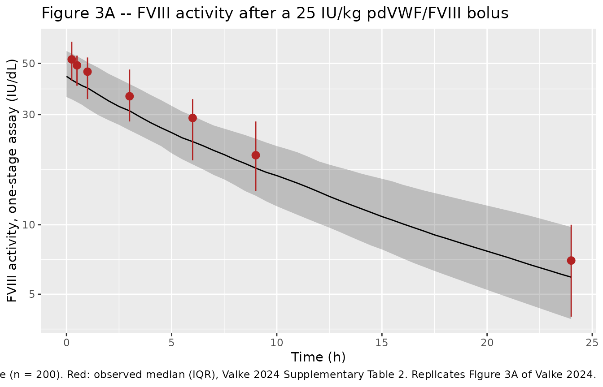
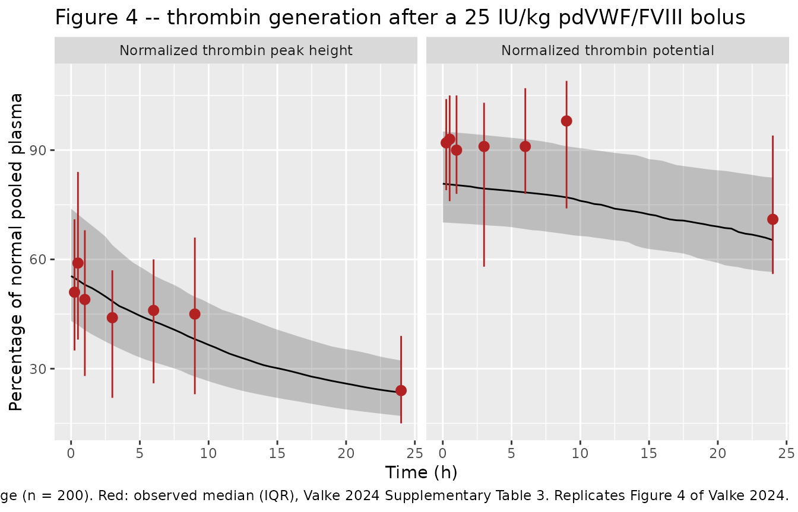
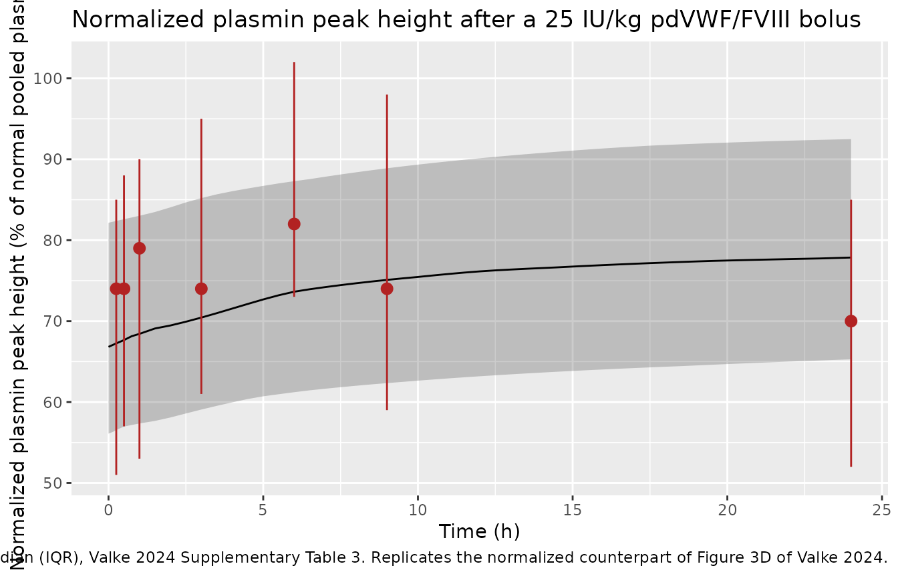
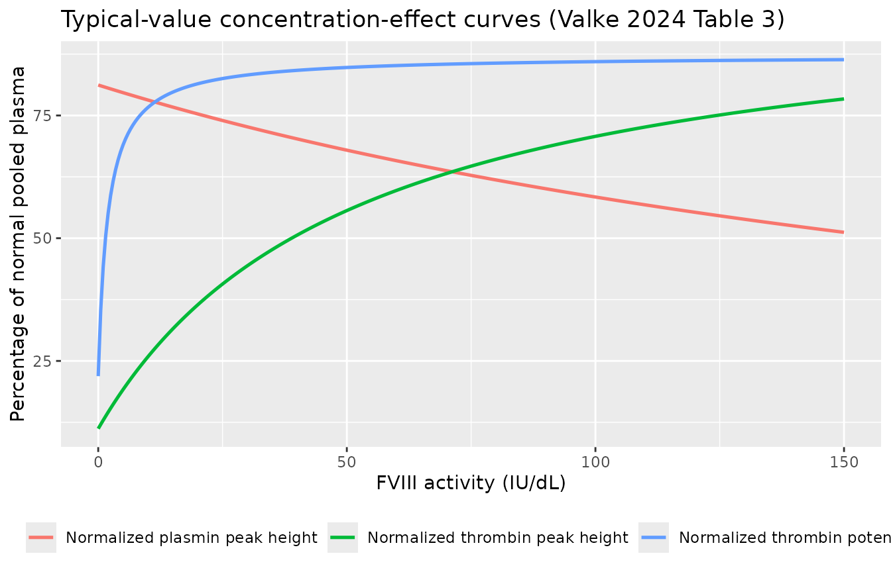
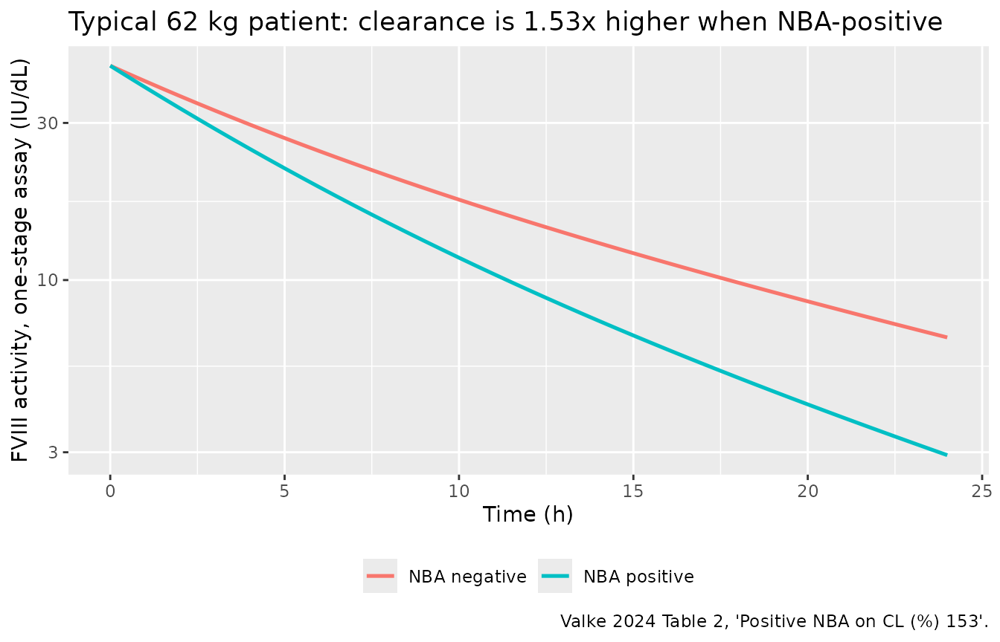

# Factor VIII thrombin and plasmin generation in hemophilia A (Valke 2024)

## Model and source

Valke 2024 is a replication / external-validation study of the Bukkems
2022 population pharmacokinetic-pharmacodynamic model for factor VIII
(FVIII) replacement therapy. The earlier population PK model
over-predicted FVIII activity in the new cohort (median prediction error
60.9%), so a new PK model was estimated; the three pharmacodynamic
models – relating FVIII activity to normalized thrombin peak height,
normalized thrombin potential and normalized plasmin peak height
measured with the Nijmegen hemostasis assay – were each re-estimated as
well.

The paper therefore contributes **four** models to nlmixr2lib: the
population PK model and one sequential PK-PD model per hemostatic
endpoint. Each PD file embeds the same PK layer so that it can be
simulated on its own.

- Article: <https://doi.org/10.1007/s13318-024-00876-6>
- Supplement: <https://doi.org/10.1007/s13318-024-00876-6> (Electronic
  Supplementary Material 1)

``` r

mods <- c(
  "Valke_2024_factorviii",
  "Valke_2024_factorviii_thrombinPeak",
  "Valke_2024_factorviii_thrombinPotential",
  "Valke_2024_factorviii_plasminPeak"
)
tibble::tibble(
  Model       = mods,
  Description = vapply(mods, function(m) readModelDb(m)()$description, character(1))
) |>
  knitr::kable(caption = "The four models contributed by Valke 2024.")
```

| Model | Description |
|:---|:---|
| Valke_2024_factorviii | Two-compartment population PK model for factor VIII (FVIII) activity (IU/dL) after a single intravenous bolus of plasma-derived von Willebrand factor / factor VIII concentrate (pdVWF/FVIII, Humate-P) in 29 adults with severe hemophilia A (Valke 2024). The model was newly estimated after the earlier Bukkems 2022 popPK model over-predicted FVIII activity in this cohort (MPE 60.9%). CL, V1, Q and V2 are allometrically scaled to a 70 kg reference with exponents fixed at 0.75 on clearances and 1 on volumes; typical values are CL 3.07 dL/h, V1 39.1 dL, Q 1.09 dL/h, V2 9.16 dL, giving a terminal half-life of 12.7 h. Clearance is 1.53x higher in patients with a Nijmegen-modified Bethesda assay inhibitor. FVIII activity was measured by both the one-stage clotting assay (OSA, the reference scale of this model) and the chromogenic substrate assay (CSA); CSA samples read 0.939x the OSA value and carry their own residual-error magnitudes. IIV on CL (57.3%) and V1 (38.2%) is correlated at 77.0%. Residual error is combined proportional plus additive, with assay-specific magnitudes. |
| Valke_2024_factorviii_thrombinPeak | Sequential PK-PD model relating factor VIII (FVIII) activity to normalized thrombin peak height (% of normal pooled plasma) measured with the Nijmegen hemostasis assay, after a single intravenous bolus of plasma-derived von Willebrand factor / factor VIII concentrate (pdVWF/FVIII, Humate-P) in 29 adults with severe hemophilia A (Valke 2024). The PK layer is the two-compartment allometric model of Valke 2024 Table 2 (see modellib(‘Valke_2024_factorviii’)); the PD layer is a proportional-baseline Emax model, E = Ebase \* (1 + Emax \* C^n / (EC50^n + C^n)), with baseline 11.2% of normal pooled plasma, Emax 8.06 as a factor of baseline, EC50 51.6 IU/dL and the Hill coefficient fixed at 1. Inter-individual variability is carried on the baseline (34.7%); residual error on the PD readout is additive (17.4% of normal pooled plasma). |
| Valke_2024_factorviii_thrombinPotential | Sequential PK-PD model relating factor VIII (FVIII) activity to normalized thrombin potential (% of normal pooled plasma) measured with the Nijmegen hemostasis assay, after a single intravenous bolus of plasma-derived von Willebrand factor / factor VIII concentrate (pdVWF/FVIII, Humate-P) in 29 adults with severe hemophilia A (Valke 2024). The PK layer is the two-compartment allometric model of Valke 2024 Table 2 (see modellib(‘Valke_2024_factorviii’)); the PD layer is an additive-baseline Emax model, E = Ebase + Emax \* C^n / (EC50^n + C^n), with baseline 21.9% of normal pooled plasma, Emax 65.3% of normal pooled plasma, EC50 1.93 IU/dL and the Hill coefficient fixed at 1. The very low EC50 means thrombin potential stays near normal for 24 h after a bolus even as FVIII activity falls. Inter-individual variability is carried on Emax (33.1%); residual error on the PD readout is additive (16.2% of normal pooled plasma). |
| Valke_2024_factorviii_plasminPeak | Sequential PK-PD model relating factor VIII (FVIII) activity to normalized plasmin peak height (% of normal pooled plasma) measured with the Nijmegen hemostasis assay, after a single intravenous bolus of plasma-derived von Willebrand factor / factor VIII concentrate (pdVWF/FVIII, Humate-P) in 29 adults with severe hemophilia A (Valke 2024). The PK layer is the two-compartment allometric model of Valke 2024 Table 2 (see modellib(‘Valke_2024_factorviii’)); the PD layer is an inhibitory proportional-baseline Imax model, E = Ebase \* (1 - Imax \* C^n / (EC50^n + C^n)), with baseline 81.2% of normal pooled plasma and EC50 256 IU/dL, and Imax and the Hill coefficient both fixed at 1. FVIII replacement therefore suppresses the raised fibrinolytic activity of untreated severe hemophilia A. Inter-individual variability is carried on the baseline (26.4%); residual error on the PD readout is proportional (16.3%). |

The four models contributed by Valke 2024. {.table}

- Citation: Valke LLFG, Cloesmeijer ME, Mansouritorghabeh H, Barteling
  W, Blijlevens NMA, Cnossen MH, Mathot RAA, Schols SEM, van Heerde WL.
  Pharmacokinetic-Pharmacodynamic Modelling in Hemophilia A: Relating
  Thrombin and Plasmin Generation to Factor VIII Activity After
  Administration of a VWF/FVIII Concentrate. Eur J Drug Metab
  Pharmacokinet. 2024 Mar;49(2):191-205.
  <doi:10.1007/s13318-024-00876-6>. <PMID:38367174>. PMCID:PMC10904421.

## Population

Twenty-nine adult men with severe hemophilia A (FVIII activity level \<
1 IU/dL) were enrolled at Ghaem Hospital, Mashhad University of Medical
Sciences, Iran, between 1 August 2011 and 20 December 2012, as a
sub-study of the IMPALA study (Dutch Trial Register NL2808). Median age
was 27 years (range 19-53), mean body weight 62 kg (SD 7; median 62,
range 48-73). Baseline demographics are in Valke 2024 Table 1.

Each patient received a single intravenous bolus of plasma-derived von
Willebrand factor / factor VIII concentrate (pdVWF/FVIII, Humate-P)
after a 72 h wash-out: median 1600 IU FVIII (IQR 1500-1700), i.e. 25.0
IU/kg (IQR 24.6-25.4). Plasma was sampled pre-bolus and at nine time
points to 24 h. FVIII activity was measured by **both** the one-stage
clotting assay (OSA) and the chromogenic substrate assay (CSA), giving
258 observations per assay; the Nijmegen hemostasis assay contributed
285 values per hemostatic endpoint.

One patient (3%) was inhibitor-positive by the Nijmegen-modified
Bethesda assay (NBA; titer 1.1 NBU/mL) and seven (24%) by the more
sensitive Nijmegen low-titer inhibitor assay (NLTIA; titers 0.04-0.05
NLTIU/mL). Only NBA positivity was retained as a covariate, on
clearance. Mean baseline von Willebrand factor activity was 117% (SD
46); VWF was not re-measured after dosing, so the VWF effect on
clearance carried by the Bukkems 2022 model could not be tested here.

The same information is available programmatically via each model’s
`population` metadata, e.g.
`readModelDb("Valke_2024_factorviii")()$population`.

## Source trace

The per-parameter origin is recorded as an in-file comment next to each
`ini()` entry in `inst/modeldb/specificDrugs/Valke_2024_factorviii*.R`.
The table below collects them in one place for review.

| Equation / parameter | Value | Source location |
|----|----|----|
| `lcl` (CL) | 3.07 dL/h/70 kg | Table 2, External dataset column (RSE 10%) |
| `lvc` (V1) | 39.1 dL/70 kg | Table 2 (RSE 7.7%) |
| `lq` (Q) | 1.09 dL/h/70 kg | Table 2 (RSE 35.5%) |
| `lvp` (V2) | 9.16 dL/70 kg | Table 2 (RSE 32.3%) |
| `e_wt_cl`, `e_wt_vc` | 0.75, 1 (fixed) | Supplementary Methods Eq. 1 |
| `e_ada_pos_cl` | 1.53 | Table 2, “Positive NBA on CL (%) 153” |
| `e_assay_osa_cc` | 0.939 | Table 2, “Correction factor CSA” (RSE 2.2%) |
| `e_assay_osa_propsd` | 0.840 = 21.0% / 25.0% | Table 2, proportional error CSA / OSA |
| `e_assay_osa_addsd` | 5.012 = 4.28 / 0.854 | Table 2, additive error CSA / OSA |
| `etalcl`, `etalvc`, correlation | 57.3%, 38.2%, 77.0% | Table 2 |
| `propSd`, `addSd` (OSA) | 25.0%, 0.854 IU/dL | Table 2 |
| Two-compartment IV disposition | n/a | Results 3.4; NONMEM ADVAN3 TRANS4 (Supplementary Methods) |
| Allometric scaling equation | n/a | Supplementary Methods Eq. 1 |
| Exponential IIV equation | n/a | Supplementary Methods Eq. 2 |
| Categorical covariate equation (theta^flag) | n/a | Supplementary Methods Eq. 6 |
| Sigmoid Emax drug effect | n/a | Supplementary Methods Eq. 8 |
| Proportional-baseline relation | n/a | Supplementary Methods Eq. 9; formula block beneath Table 3 |
| Additive-baseline relation | n/a | Supplementary Methods Eq. 10; formula block beneath Table 3 |
| Thrombin peak: `le0`, `lemax`, `lec50`, `lhill` | 11.2% NPP, 8.06x baseline, 51.6 IU/dL, 1 FIX | Table 3 |
| Thrombin peak: `etale0`, `addSd_thrombinPeak` | 34.7%, 17.4% NPP | Table 3 |
| Thrombin potential: `le0`, `lemax`, `lec50`, `lhill` | 21.9% NPP, 65.3% NPP, 1.93 IU/dL, 1 FIX | Table 3 |
| Thrombin potential: `etalemax`, `addSd_thrombinPotential` | 33.1%, 16.2% NPP | Table 3 |
| Plasmin peak: `le0`, `limax`, `lec50`, `lhill` | 81.2% NPP, 1 FIX, 256 IU/dL, 1 FIX | Table 3 |
| Plasmin peak: `etale0`, `propSd_plasminPeak` | 26.4%, 16.3% | Table 3 |
| Observed FVIII activity time course | n/a | Supplementary Table 2 |
| Observed normalized hemostatic time courses | n/a | Supplementary Table 3 |
| Observed FVIII half-life | 10.6 h (IQR 8.3-12.9) | Table 1 |

## Virtual cohort

Original observed data are not publicly available. The simulations below
use a 200-subject virtual population whose body-weight distribution and
inhibitor prevalence approximate Valke 2024 Table 1, dosed exactly as in
the trial.

``` r

set.seed(20240217)

n_sub    <- 200L
obs_grid <- sort(unique(c(
  0, 0.05, 0.0833, 0.1667, 0.25, 0.5, 0.75,
  seq(1, 24, by = 0.5),
  c(0.25, 0.5, 1, 3, 6, 9, 24)  # the times tabulated in Supplementary Tables 2 and 3
)))

# Body weight: mean 62 kg (SD 7), truncated to the observed 48-73 kg range.
wt <- pmin(pmax(rnorm(n_sub, mean = 62, sd = 7), 48), 73)

subj <- tibble::tibble(
  id        = seq_len(n_sub),
  WT        = wt,
  # 1 of 29 patients was NBA inhibitor-positive (Table 1).
  ADA_POS   = rbinom(n_sub, size = 1, prob = 1 / 29),
  # Simulate the one-stage-assay readout, the scale on which CL and V1 were
  # estimated and the scale of the observed values in Supplementary Table 2.
  ASSAY_OSA = 1,
  treatment = "25 IU/kg IV bolus"
)

doses <- subj |>
  mutate(time = 0, amt = 25 * WT, evid = 1L, cmt = "central", dvid = NA_integer_)

# Observations are placed on the `central` ODE state, never on an algebraic
# observable name. The three PD models declare two endpoints (Cc plus the
# hemostatic readout), so observation rows also need a `dvid`; rxode2 returns
# every algebraic observable as its own output column regardless.
obs <- subj |>
  tidyr::crossing(time = obs_grid) |>
  mutate(amt = NA_real_, evid = 0L, cmt = "central", dvid = 1L)

events <- bind_rows(doses, obs) |>
  arrange(id, time, desc(evid)) |>
  as.data.frame()

stopifnot(!anyDuplicated(unique(events[, c("id", "time", "evid")])))
```

## Simulation

``` r

solve_one <- function(model_name) {
  mod <- readModelDb(model_name)
  out <- rxode2::rxSolve(
    mod, events = events,
    keep = c("WT", "ADA_POS", "ASSAY_OSA", "treatment"),
    # rxode2's automatic ODE -> linCmt() conversion corrupts the observable
    # mapping for the two-output PD models; disable it for all four so the
    # four solves are directly comparable.
    useLinCmt = FALSE
  ) |>
    as.data.frame()
  # rxSolve occasionally drops subjects silently; fail loud if it does.
  stopifnot(dplyr::n_distinct(out$id) == n_sub)
  out
}

sim_pk   <- solve_one("Valke_2024_factorviii")
#> ℹ parameter labels from comments will be replaced by 'label()'
sim_tpk  <- solve_one("Valke_2024_factorviii_thrombinPeak")
#> ℹ parameter labels from comments will be replaced by 'label()'
sim_tpot <- solve_one("Valke_2024_factorviii_thrombinPotential")
#> ℹ parameter labels from comments will be replaced by 'label()'
sim_ppk  <- solve_one("Valke_2024_factorviii_plasminPeak")
#> ℹ parameter labels from comments will be replaced by 'label()'

# The IV bolus must produce a non-zero concentration at time 0.
stopifnot(median(sim_pk$Cc[sim_pk$time == 0]) > 0)
```

``` r

qtile <- function(df, value) {
  df |>
    group_by(time) |>
    summarise(
      Q25 = quantile(.data[[value]], 0.25, na.rm = TRUE),
      Q50 = quantile(.data[[value]], 0.50, na.rm = TRUE),
      Q75 = quantile(.data[[value]], 0.75, na.rm = TRUE),
      .groups = "drop"
    )
}
```

## Replicate published figures

### Figure 3A – FVIII activity after the bolus

Valke 2024 Figure 3A (and Supplementary Table 2) shows the observed
one-stage FVIII activity as median with interquartile range. Because the
pre-bolus activity was subtracted during model development, the
simulated profile is the exogenous increment above the patient’s
endogenous level.

``` r

obs_fviii <- tibble::tribble(
  ~time, ~Q25, ~Q50, ~Q75,
  0.25,  42,   52,   62,
  0.50,  40,   49,   54,
  1.00,  35,   46,   53,
  3.00,  28,   36,   47,
  6.00,  19,   29,   35,
  9.00,  14,   20,   28,
  24.00,  4,    7,   10
)

ggplot(qtile(sim_pk, "Cc"), aes(time, Q50)) +
  geom_ribbon(aes(ymin = Q25, ymax = Q75), alpha = 0.25) +
  geom_line() +
  geom_pointrange(
    data = obs_fviii, aes(y = Q50, ymin = Q25, ymax = Q75),
    colour = "firebrick"
  ) +
  scale_y_log10() +
  labs(
    x = "Time (h)", y = "FVIII activity, one-stage assay (IU/dL)",
    title = "Figure 3A -- FVIII activity after a 25 IU/kg pdVWF/FVIII bolus",
    caption = paste(
      "Black: simulated median with interquartile range (n = 200).",
      "Red: observed median (IQR), Valke 2024 Supplementary Table 2.",
      "Replicates Figure 3A of Valke 2024."
    )
  )
```



### Figure 4 – normalized thrombin peak height and thrombin potential

Valke 2024 Figure 4 contrasts the rapid decline of FVIII activity with
the sustained hemostatic response. Normalized thrombin potential is the
striking one: its EC50 of 1.93 IU/dL means it stays near normal for 24 h
even as FVIII activity falls to 7 IU/dL.

``` r

obs_pd <- bind_rows(
  tibble::tribble(
    ~time, ~Q25, ~Q50, ~Q75,
    0.25,  35,   51,   71,
    0.50,  38,   59,   84,
    1.00,  28,   49,   68,
    3.00,  22,   44,   57,
    6.00,  26,   46,   60,
    9.00,  23,   45,   66,
    24.00, 15,   24,   39
  ) |> mutate(endpoint = "Normalized thrombin peak height"),
  tibble::tribble(
    ~time, ~Q25, ~Q50, ~Q75,
    0.25,  79,   92,  104,
    0.50,  76,   93,  105,
    1.00,  78,   90,  105,
    3.00,  58,   91,  103,
    6.00,  78,   91,  107,
    9.00,  74,   98,  109,
    24.00, 56,   71,   94
  ) |> mutate(endpoint = "Normalized thrombin potential")
)

sim_pd <- bind_rows(
  qtile(sim_tpk,  "thrombinPeak")      |> mutate(endpoint = "Normalized thrombin peak height"),
  qtile(sim_tpot, "thrombinPotential") |> mutate(endpoint = "Normalized thrombin potential")
)

ggplot(sim_pd, aes(time, Q50)) +
  geom_ribbon(aes(ymin = Q25, ymax = Q75), alpha = 0.25) +
  geom_line() +
  geom_pointrange(
    data = obs_pd, aes(y = Q50, ymin = Q25, ymax = Q75),
    colour = "firebrick"
  ) +
  facet_wrap(~endpoint) +
  labs(
    x = "Time (h)", y = "Percentage of normal pooled plasma",
    title = "Figure 4 -- thrombin generation after a 25 IU/kg pdVWF/FVIII bolus",
    caption = paste(
      "Black: simulated median with interquartile range (n = 200).",
      "Red: observed median (IQR), Valke 2024 Supplementary Table 3.",
      "Replicates Figure 4 of Valke 2024."
    )
  )
```



### Figure 3D – normalized plasmin peak height

Untreated severe hemophilia A shows a relatively high plasmin peak (95%
of normal pooled plasma at baseline); FVIII replacement suppresses it.
The inhibitory Imax model has a high EC50 (256 IU/dL), so the
suppression is modest over the observed FVIII range.

``` r

obs_plasmin <- tibble::tribble(
  ~time, ~Q25, ~Q50, ~Q75,
  0.25,  51,   74,   85,
  0.50,  57,   74,   88,
  1.00,  53,   79,   90,
  3.00,  61,   74,   95,
  6.00,  73,   82,  102,
  9.00,  59,   74,   98,
  24.00, 52,   70,   85
)

ggplot(qtile(sim_ppk, "plasminPeak"), aes(time, Q50)) +
  geom_ribbon(aes(ymin = Q25, ymax = Q75), alpha = 0.25) +
  geom_line() +
  geom_pointrange(
    data = obs_plasmin, aes(y = Q50, ymin = Q25, ymax = Q75),
    colour = "firebrick"
  ) +
  labs(
    x = "Time (h)", y = "Normalized plasmin peak height (% of normal pooled plasma)",
    title = "Normalized plasmin peak height after a 25 IU/kg pdVWF/FVIII bolus",
    caption = paste(
      "Black: simulated median with interquartile range (n = 200).",
      "Red: observed median (IQR), Valke 2024 Supplementary Table 3.",
      "Replicates the normalized counterpart of Figure 3D of Valke 2024."
    )
  )
```



### Concentration-effect relationships

The three endpoints differ by more than two orders of magnitude in EC50,
which is the paper’s central pharmacological message: a very small
amount of FVIII already restores most of the thrombin potential, whereas
the thrombin peak height needs near-normal FVIII activity and plasmin
generation is barely affected at achievable levels.

``` r

ce <- tibble::tibble(fviii = seq(0, 150, length.out = 301)) |>
  mutate(
    `Normalized thrombin peak height` = 11.2 * (1 + 8.06 * fviii / (51.6 + fviii)),
    `Normalized thrombin potential`   = 21.9 + 65.3 * fviii / (1.93 + fviii),
    `Normalized plasmin peak height`  = 81.2 * (1 - 1 * fviii / (256 + fviii))
  ) |>
  tidyr::pivot_longer(-fviii, names_to = "endpoint", values_to = "effect")

ggplot(ce, aes(fviii, effect, colour = endpoint)) +
  geom_line(linewidth = 0.9) +
  labs(
    x = "FVIII activity (IU/dL)", y = "Percentage of normal pooled plasma",
    colour = NULL,
    title = "Typical-value concentration-effect curves (Valke 2024 Table 3)"
  ) +
  theme(legend.position = "bottom")
```



### Effect of an NBA inhibitor on clearance

``` r

mod_typ <- readModelDb("Valke_2024_factorviii") |> rxode2::zeroRe()
#> ℹ parameter labels from comments will be replaced by 'label()'
#> Warning: No sigma parameters in the model

inh_events <- bind_rows(
  events |> filter(id == 1) |> mutate(id = 1L, ADA_POS = 0L, WT = 62, amt = ifelse(evid == 1L, 25 * 62, amt), treatment = "NBA negative"),
  events |> filter(id == 1) |> mutate(id = 2L, ADA_POS = 1L, WT = 62, amt = ifelse(evid == 1L, 25 * 62, amt), treatment = "NBA positive")
) |>
  as.data.frame()

sim_inh <- rxode2::rxSolve(
  mod_typ, events = inh_events,
  keep = c("treatment"), useLinCmt = FALSE
) |>
  as.data.frame()
#> ℹ omega/sigma items treated as zero: 'etalcl', 'etalvc'
#> Warning: multi-subject simulation without without 'omega'

ggplot(sim_inh, aes(time, Cc, colour = treatment)) +
  geom_line(linewidth = 0.9) +
  scale_y_log10() +
  labs(
    x = "Time (h)", y = "FVIII activity, one-stage assay (IU/dL)", colour = NULL,
    title = "Typical 62 kg patient: clearance is 1.53x higher when NBA-positive",
    caption = "Valke 2024 Table 2, 'Positive NBA on CL (%) 153'."
  ) +
  theme(legend.position = "bottom")
```



## Observed versus simulated summary

``` r

sim_summary <- function(df, value, endpoint) {
  df |>
    filter(time %in% c(0.25, 0.5, 1, 3, 6, 9, 24)) |>
    group_by(time) |>
    summarise(Simulated = median(.data[[value]], na.rm = TRUE), .groups = "drop") |>
    mutate(endpoint = endpoint)
}

obs_summary <- bind_rows(
  obs_fviii   |> transmute(time, Observed = Q50, endpoint = "FVIII activity (IU/dL)"),
  obs_pd      |> transmute(time, Observed = Q50, endpoint),
  obs_plasmin |> transmute(time, Observed = Q50, endpoint = "Normalized plasmin peak height")
)

bind_rows(
  sim_summary(sim_pk,   "Cc",                "FVIII activity (IU/dL)"),
  sim_summary(sim_tpk,  "thrombinPeak",      "Normalized thrombin peak height"),
  sim_summary(sim_tpot, "thrombinPotential", "Normalized thrombin potential"),
  sim_summary(sim_ppk,  "plasminPeak",       "Normalized plasmin peak height")
) |>
  left_join(obs_summary, by = c("time", "endpoint")) |>
  mutate(`Difference (%)` = 100 * (Simulated - Observed) / Observed) |>
  arrange(endpoint, time) |>
  relocate(endpoint, time) |>
  dplyr::rename("Endpoint" = endpoint, "Time (h)" = time) |>
  knitr::kable(
    digits  = c(0, 2, 1, 1, 1),
    caption = paste(
      "Simulated median (n = 200) versus observed median from Valke 2024",
      "Supplementary Tables 2 and 3."
    )
  )
```

| Endpoint                        | Time (h) | Simulated | Observed | Difference (%) |
|:--------------------------------|---------:|----------:|---------:|---------------:|
| FVIII activity (IU/dL)          |     0.25 |      42.4 |       52 |          -18.5 |
| FVIII activity (IU/dL)          |     0.50 |      41.1 |       49 |          -16.0 |
| FVIII activity (IU/dL)          |     1.00 |      39.1 |       46 |          -15.0 |
| FVIII activity (IU/dL)          |     3.00 |      31.1 |       36 |          -13.5 |
| FVIII activity (IU/dL)          |     6.00 |      22.9 |       29 |          -21.0 |
| FVIII activity (IU/dL)          |     9.00 |      17.6 |       20 |          -12.1 |
| FVIII activity (IU/dL)          |    24.00 |       5.9 |        7 |          -15.3 |
| Normalized plasmin peak height  |     0.25 |      67.2 |       74 |           -9.1 |
| Normalized plasmin peak height  |     0.50 |      67.7 |       74 |           -8.6 |
| Normalized plasmin peak height  |     1.00 |      68.4 |       79 |          -13.4 |
| Normalized plasmin peak height  |     3.00 |      70.4 |       74 |           -4.8 |
| Normalized plasmin peak height  |     6.00 |      73.6 |       82 |          -10.2 |
| Normalized plasmin peak height  |     9.00 |      75.1 |       74 |            1.5 |
| Normalized plasmin peak height  |    24.00 |      77.9 |       70 |           11.2 |
| Normalized thrombin peak height |     0.25 |      54.9 |       51 |            7.6 |
| Normalized thrombin peak height |     0.50 |      54.3 |       59 |           -7.9 |
| Normalized thrombin peak height |     1.00 |      53.0 |       49 |            8.2 |
| Normalized thrombin peak height |     3.00 |      48.5 |       44 |           10.3 |
| Normalized thrombin peak height |     6.00 |      43.0 |       46 |           -6.5 |
| Normalized thrombin peak height |     9.00 |      38.1 |       45 |          -15.3 |
| Normalized thrombin peak height |    24.00 |      23.4 |       24 |           -2.3 |
| Normalized thrombin potential   |     0.25 |      80.7 |       92 |          -12.3 |
| Normalized thrombin potential   |     0.50 |      80.6 |       93 |          -13.4 |
| Normalized thrombin potential   |     1.00 |      80.4 |       90 |          -10.7 |
| Normalized thrombin potential   |     3.00 |      79.4 |       91 |          -12.7 |
| Normalized thrombin potential   |     6.00 |      78.4 |       91 |          -13.9 |
| Normalized thrombin potential   |     9.00 |      77.0 |       98 |          -21.4 |
| Normalized thrombin potential   |    24.00 |      65.3 |       71 |           -8.0 |

Simulated median (n = 200) versus observed median from Valke 2024
Supplementary Tables 2 and 3. {.table}

The simulated FVIII activity sits roughly 12-21% below the observed
medians at every time point. That is a property of the published model
rather than of this encoding: Valke 2024 Supplementary Table 4 reports a
median prediction error of -8.47% for the re-estimated FVIII model (and
-6.49%, +2.92% and -2.72% for the three re-estimated hemostatic models),
so the model is known to sit slightly below the observations. The three
hemostatic endpoints agree with the observed medians to within about 21%
throughout, with no systematic drift over the 24 h window.

## PKNCA validation

``` r

sim_nca <- sim_pk |>
  dplyr::filter(!is.na(Cc)) |>
  dplyr::select(id, time, Cc, treatment)

# Guarantee a time = 0 row per subject. This is an IV bolus, so the correct
# pre-existing value is the post-bolus concentration produced by the solver;
# any row already present at time 0 wins via .keep_all on the first occurrence.
sim_nca <- dplyr::bind_rows(
  sim_nca,
  sim_nca |>
    dplyr::group_by(id, treatment) |>
    dplyr::slice_min(time, n = 1, with_ties = FALSE) |>
    dplyr::ungroup() |>
    dplyr::mutate(time = 0)
) |>
  dplyr::distinct(id, treatment, time, .keep_all = TRUE) |>
  dplyr::arrange(id, treatment, time)

conc_obj <- PKNCA::PKNCAconc(sim_nca, Cc ~ time | treatment + id)

dose_df <- events |>
  dplyr::filter(evid == 1L) |>
  dplyr::select(id, time, amt, treatment)

dose_obj <- PKNCA::PKNCAdose(dose_df, amt ~ time | treatment + id)

intervals <- data.frame(
  start      = 0,
  end        = Inf,
  cmax       = TRUE,
  tmax       = TRUE,
  aucinf.obs = TRUE,
  half.life  = TRUE
)

nca_res <- PKNCA::pk.nca(PKNCA::PKNCAdata(conc_obj, dose_obj, intervals = intervals))
```

### Comparison against published NCA

Valke 2024 reports a single non-compartmental quantity: the FVIII
half-life, median 10.6 h (IQR 8.3-12.9; Table 1). The observed Cmax
proxy is the 15-min value of Supplementary Table 2 (52 IU/dL), which is
not a true Cmax for an IV bolus and is therefore not used as a reference
here.

``` r

published <- tibble::tibble(
  treatment = "25 IU/kg IV bolus",
  half.life = 10.6
)

nlmixr2lib::ncaComparisonTable(
  simulated     = nca_res,
  reference     = published,
  by            = "treatment",
  units         = c(half.life = "h"),
  tolerance_pct = 20
) |>
  knitr::kable(
    caption = "Simulated versus published NCA. * differs from reference by > 20%.",
    align   = c("l", "l", "r", "r", "r")
  )
```

| NCA parameter | treatment         | Reference | Simulated | % diff |
|:--------------|:------------------|----------:|----------:|-------:|
| t½ (h)        | 25 IU/kg IV bolus |      10.6 |      10.4 |  -1.6% |

Simulated versus published NCA. \* differs from reference by \> 20%.
{.table}

``` r

as.data.frame(summary(nca_res)) |>
  knitr::kable(caption = "Full simulated NCA summary (PKNCA), 25 IU/kg IV bolus.")
```

| start | end | treatment | N | cmax | tmax | half.life | aucinf.obs |
|---:|---:|:---|:---|:---|:---|:---|:---|
| 0 | Inf | 25 IU/kg IV bolus | 200 | 44.2 \[37.3\] | 0.000 \[0.000, 0.000\] | 11.4 \[3.79\] | 517 \[56.6\] |

Full simulated NCA summary (PKNCA), 25 IU/kg IV bolus. {.table}

## Assumptions and deviations

- **The table’s covariate percentages are read as factors of the
  reference, not as percentage increases.** Valke 2024 Table 2 gives
  “Positive NBA on CL (%) 153” while the Discussion describes “a 153%
  increase in clearance”. The two readings differ by a factor of 1.65 on
  the covariate effect. The model encodes 1.53x (a 53% increase) because
  Supplementary Methods Eq. 6 parameterises categorical covariates as a
  multiplicative
  `theta_pop = theta_pk * (theta_1^Flag1 * theta_2^Flag2 * ...)`, in
  which a reported theta of “153%” is 1.53; because Table 3’s analogous
  row “Mild haemophilia on Emax (% of severe) 70.9” can only be a ratio;
  and because the Bukkems columns of Table 2 (“Positive NLTIA on V1 (%)
  114”, “Full-length recombinant product on V1 (%) 117”) are not
  physiologically plausible as more-than-doubling of a volume of
  distribution caused by a very-low-titer inhibitor. Per the standing
  convention that a printed equation outranks narrative text, the
  equation form was used.
- **Supplementary Eq. 10 is transcribed with an evident typographical
  error.** It is printed as `E = Ebase + (1 + Edrug)` and the formula
  block beneath Table 3 repeats the same “(1 +” for the thrombin
  potential model. A bare additive `1` has no units in a “% of normal
  pooled plasma” readout and is a carry-over from the proportional form
  of Eq. 9, `E = Ebase * (1 +/- Edrug)`. The model encodes
  `E = Ebase + Edrug`. The difference is one percentage point out of
  roughly 85, well inside the residual error, and the no-extra-1 form
  reproduces every time point of Supplementary Table 3.
- **IIV percentages are treated as `omega = CV`, so `omega^2 = CV^2.`**
  The paper reports inter-individual variability as a percentage without
  stating whether it is `sqrt(omega^2)` or `sqrt(exp(omega^2) - 1)`. The
  former is used, matching the convention of the FVIII population PK
  models already in nlmixr2lib (`Hazendonk_2016_factor_viii`,
  `Chelle_2019_factorviii_fanhdi`, `Nestorov_2014_factorviii`). At 57.3%
  the two conventions give `omega^2` of 0.328 versus 0.284.
- **The CSA residual-error and correction-factor effects are encoded on
  the `ASSAY_OSA = 0` rows.** The canonical `ASSAY_OSA` column codes 1 =
  one-stage, 0 = chromogenic with CSA as the nominal reference category,
  but Valke 2024 estimated CL and V1 on the OSA scale and applied its
  0.939 correction factor to the CSA samples. The column coding is
  unchanged; only the side that carries the effect differs from
  `Abrantes_2017_moroctocog`. The per-assay residual magnitudes are
  encoded as the ratios `0.840 = 21.0% / 25.0%` and
  `5.012 = 4.28 / 0.854`, so all four values reported in Table 2 are
  recoverable from the model file.
- **The models describe the exogenous FVIII increment, not total
  activity.** The pre-bolus FVIII activity was treated as the endogenous
  baseline and subtracted from every observation during model
  development, so there is no endogenous-baseline parameter. For the
  severe hemophilia A cohort studied (median pre-bolus activity \< 1
  IU/dL) the distinction is small; it matters if the model is reused for
  moderate hemophilia A.
- **PD baselines are the model’s estimates, not the observed medians.**
  At FVIII = 0 the models predict 11.2%, 21.9% and 81.2% of normal
  pooled plasma for thrombin peak height, thrombin potential and plasmin
  peak height, whereas the observed pre-bolus medians were 6%, 12% and
  95% (Supplementary Table 3). Nine and ten baseline hemostatic
  measurements were undetectable and were excluded from the fit, which
  biases the estimated baselines upward relative to the tabulated
  observed medians.
- **Virtual-cohort assumptions.** Body weight was drawn from a normal
  distribution with the reported mean 62 kg and SD 7 kg, truncated to
  the observed 48-73 kg range; the paper does not report the
  distribution shape. NBA inhibitor status was drawn at the observed
  1-in-29 prevalence. All simulations use `ASSAY_OSA = 1` because the
  observed values tabulated in Supplementary Tables 2 and 3 are
  one-stage-assay values. Race / ethnicity was not reported and is not
  simulated.
- **Not encoded from this paper.** The Bukkems 2022 parameter estimates
  reproduced in Valke 2024 Tables 2 and 3 for comparison belong to a
  different publication and are not extracted here; the Bukkems 2022
  model (Br J Clin Pharmacol 88(6):2757-2768) should be extracted from
  its own source. The NLTIA low-titer inhibitor assay was tested and not
  retained in this cohort, and the VWF-on-clearance effect of the
  Bukkems model could not be tested because VWF was not measured after
  dosing.
