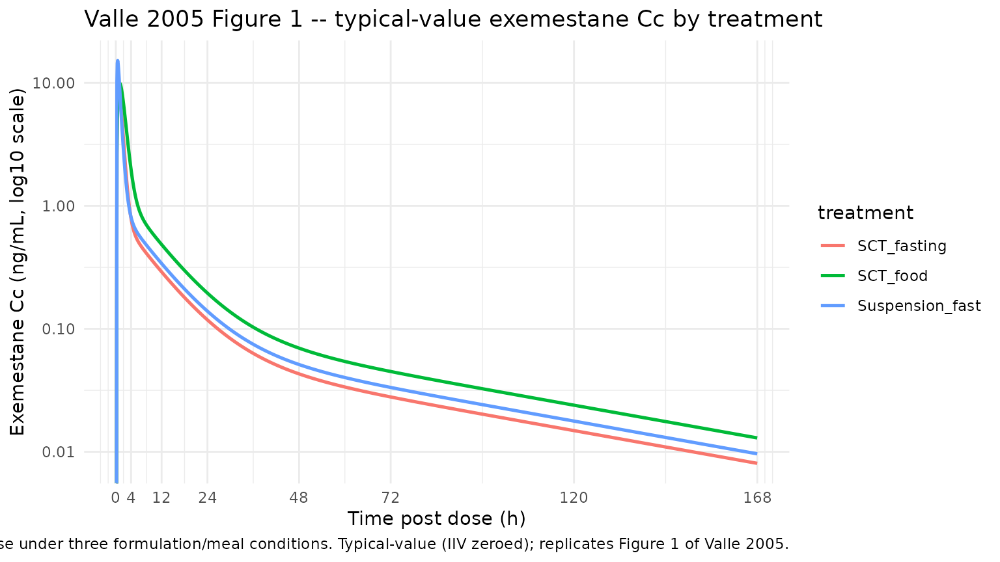
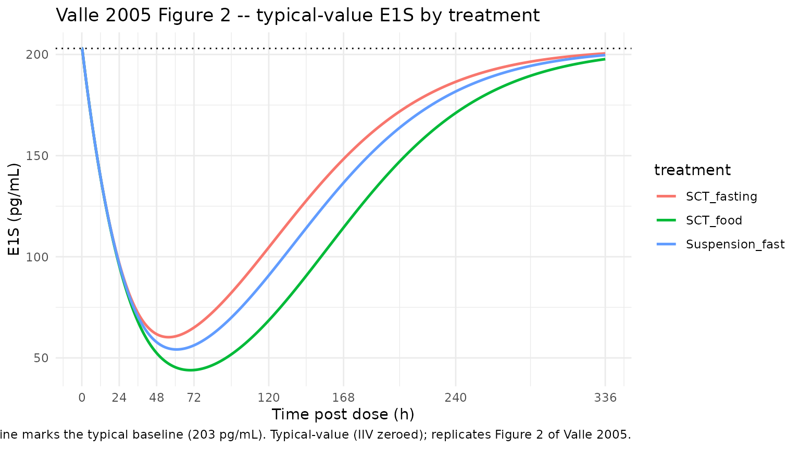
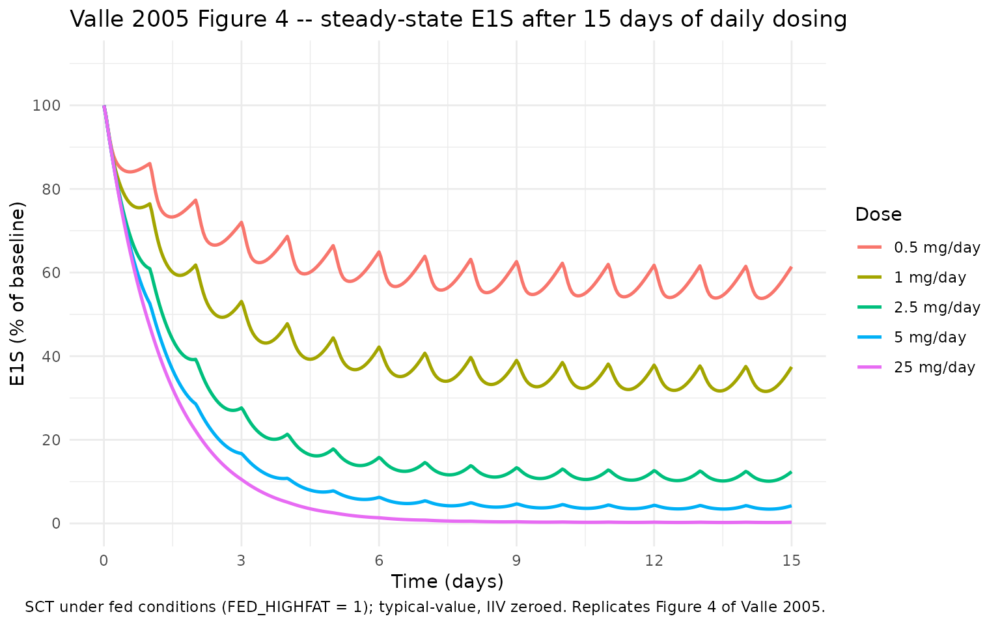

# Exemestane (Valle 2005)

## Model and source

- Citation: Valle M, Di Salle E, Jannuzzo MG, Poggesi I, Rocchetti M,
  Spinelli R, Verotta D. A predictive model for exemestane
  pharmacokinetics/pharmacodynamics incorporating the effect of food and
  formulation. Br J Clin Pharmacol. 2005;59(3):355-364.
  <doi:10.1111/j.1365-2125.2005.02335.x>
- Description: Three-compartment population PK with first-order
  absorption + lag time, coupled to an indirect-response PD model on
  plasma estrone sulphate (E1S), for oral exemestane (25 mg single dose)
  in healthy postmenopausal women. Crossover study comparing a
  sugar-coated tablet (SCT) under fasting versus an extemporaneous
  tablet-suspended-in-water suspension under fasting versus a SCT taken
  after a standard high-fat breakfast. Disposition is independent of
  formulation and food; absorption rate ka and apparent bioavailability
  F depend on formulation (suspension: ka 7.6 vs SCT 2.35 1/h, F 1.2x)
  and on the high-fat meal (ka 1.13 1/h, F 1.6x). Exemestane inhibits
  E1S synthesis via a sigmoid Imax function with IC50 22.1 pg/mL and
  Hill coefficient 1.73.
- Article: [Br J Clin Pharmacol
  2005;59(3):355-364](https://doi.org/10.1111/j.1365-2125.2005.02335.x)
  (open access via
  [PMC1884790](https://pmc.ncbi.nlm.nih.gov/articles/PMC1884790/))

Valle 2005 is a 3-period randomized crossover bioequivalence study
comparing a sugar-coated tablet (SCT, swallowed whole) of exemestane
under fasting conditions, an extemporaneously-prepared suspension of the
same 25 mg dose under fasting, and a SCT taken 15 min after a standard
high-fat breakfast. The published PK model is a 3-compartment mammillary
system with first-order absorption + lag time, with formulation- and
food-dependent ka and apparent bioavailability F. Disposition (kel, k12,
k21, k13, k31) is the same across all three treatments. The PD model is
an indirect-response model: plasma estrone sulphate (E1S) is produced at
a zero-order rate ks (= rbase \* kout) and eliminated first-order at
rate kout; exemestane inhibits E1S synthesis via a sigmoid Imax function
with IC50 22.1 pg/mL and Hill exponent g = 1.73.

## Population

Twelve healthy postmenopausal women, age 45-68 years (mean 55 years),
weight 46-66 kg (mean 54.9 kg), enrolled at Pontchaillou Hospital
(Rennes, France). Each woman received three treatments according to a
repeated 3x3 Latin-square design separated by a 4-5 week washout (Valle
2005 Methods, Subjects and Study design). Subjects were healthy by
physical examination, electrocardiography, and routine laboratory tests,
and avoided concomitant medication beyond occasional paracetamol. Race /
ethnicity composition is not reported.

Exemestane plasma sampling: 15 timepoints over 0.25-168 h post-dose.
Plasma E1S sampling: 7 timepoints over 0-336 h post-dose (14-day
follow-up window). Estimation by NONMEM V FOCE INTERACTION; the
population PK fit was performed first, with individual empirical-Bayes
parameter estimates serving as input to the subsequent population PD
fit.

The same information is available programmatically via
`readModelDb("Valle_2005_exemestane")$population`.

## Source trace

Every parameter, covariate effect, IIV element, and residual-error term
below is taken from Valle 2005 Tables 2-4 and the accompanying Results
narrative. The per-parameter origin is also recorded as an in-file
comment next to each `ini()` entry in
`inst/modeldb/specificDrugs/Valle_2005_exemestane.R`.

| Equation / parameter | Value | Source location |
|----|----|----|
| `lka` (SCT/fasting ka1) | `log(2.35)` 1/h | Table 2, ka1 SCT/fasting row, RSE 25% |
| `lvc` (V intrinsic; V/F at SCT/fasting) | `log(1360)` L | Table 2, V/F SCT/fasting row, RSE 10% |
| `ltlag` (absorption lag) | `log(0.21)` h | Table 2, Lag row (common to all treatments), RSE 10% |
| `lkel` (k, elimination from central) | `log(0.738)` 1/h | Table 3, k row, RSE 7% |
| `lk12` | `log(0.454)` 1/h | Table 3, k12 row, RSE 19% |
| `lk21` | `log(0.158)` 1/h | Table 3, k21 row, RSE 6% |
| `lk13` | `log(0.174)` 1/h | Table 3, k13 row, RSE 9% |
| `lk31` | `log(0.016)` 1/h | Table 3, k31 row, RSE 10% |
| `e_form_suspension_ka` | `log(7.6 / 2.35)` | Table 2, suspension/fasting ka1 = 7.6 vs SCT/fasting reference 2.35 |
| `e_fed_highfat_ka` | `log(1.13 / 2.35)` | Table 2, SCT/food ka1 = 1.13 vs SCT/fasting reference 2.35 |
| `e_form_suspension_fdepot` | `log(1.2)` | Results: “suspension formulation showed a 1.2 times higher F than the SCT after fasting” |
| `e_fed_highfat_fdepot` | `log(1.6)` | Results: “food effect translated into an increase of the F of 1.6 times” |
| `lrbase` (Baseline E1S) | `log(203)` pg/mL | Table 4, Baseline row, RSE 8% |
| `lkout` (E1S elimination ko) | `log(0.032)` 1/h | Table 4, ko row, RSE 9% |
| `lic50` (C50 of exemestane on E1S) | `log(22.1)` pg/mL | Table 4, C50 row, RSE 10% |
| `lhill` (Hill exponent g) | `log(1.73)` | Table 4, g row, RSE 12% (IIV not estimated, N.E.) |
| `var(etalka)` | `log(1 + 0.92^2)` | Results: “rate of absorption (ka1) had a higher coefficient of variation (92%)” |
| `var(etalvc)` | `log(1 + 0.22^2)` | Results: “significant interindividual variability in the V/F (coefficient of variation = 22%)” |
| `var(etalkel)` | `log(1 + 0.11^2)` | Results: “the elimination rate constant (k) from the central compartment (11%)” |
| `var(etalrbase)` | `log(1 + 0.56^2)` | Table 4: Baseline CV 56% (RSE 19%) |
| `var(etalkout)` | `log(1 + 0.41^2)` | Table 4: ko CV 41% (RSE 47%) |
| `var(etalic50)` | `log(1 + 0.47^2)` | Table 4: C50 CV 47% (RSE 32%) |
| `propSd` (exemestane proportional RE) | `0.04` | Results: “proportional part was estimated to be 4%” |
| `addSd` (exemestane additive RE, FIXED) | `fixed(0.0024)` ng/mL | Results: “additive part was fixed to the SD of the analytical technique” – paper does not report the SD value; approximated as LLOQ (13.5 pg/mL) x inter-assay CV (17.7%) ~= 2.4 pg/mL = 0.0024 ng/mL (see Assumptions and deviations) |
| `propSd_e1s` (E1S proportional RE) | `0.35` | Results: PD residual variability 35% |
| Structure – PK (3-cmt mammillary + first-order absorption + lag) | n/a | Methods, Pharmacokinetic model section and Eq. 1 |
| Structure – PD (indirect response with sigmoid Imax on synthesis) | n/a | Methods, Pharmacodynamic model section, Eq. 3-4 |
| Choice of indirect response over irreversible inactivation (Eq. 5-7) | n/a | Results: OFV decrease for Eq. 5-7 was less than 3.9 points – not statistically better |

### Parameterization notes

- **Rate-constant (vs CL/V) parameterization.** Valle 2005 reports
  micro-constants `k`, `k12`, `k21`, `k13`, `k31` together with the
  apparent central volume `V/F`, and reports IIV separately on `k`,
  `V/F`, and `ka` (with no IIV on inter-compartmental constants or on
  the absorption lag). To preserve that IIV structure faithfully, the
  model is parameterised on `lkel`, `lk12`, `lk21`, `lk13`, `lk31`, and
  `lvc` as primary `ini()` parameters rather than on
  `lcl + lvc + lq + lvp + lq2 + lvp2` (the standard CL/V form), since
  the rate-constant IIV structure does not factorise cleanly through
  `cl = kel * vc`. Precedent: the same parameterisation is used by
  `Reijers_2016_trastuzumab.R` and `Krause_2017_selexipag.R`.
- **Intrinsic V vs treatment-specific V/F.** Valle 2005 Table 2 reports
  three V/F values (1360, 1120, 844 L for SCT/fasting,
  suspension/fasting, and SCT/food respectively) but explicitly
  interprets the differences as F differences with V intrinsic (“The
  differences observed in the ratio of volume of distribution to
  bioavailability (V/F), indicate that the latter for the three
  treatments is different”). The model is built with `vc = exp(lvc)`
  constant across treatments and the F multipliers (1.0 / 1.2 / 1.6)
  applied via `f(depot) <- fdepot`. The implied V/F values are
  `1360 / 1 = 1360`, `1360 / 1.2 = 1133` (paper 1120, +1% difference),
  and `1360 / 1.6 = 850` (paper 844, +1% difference) – within the
  published rounding precision.
- **Hill-coefficient name.** Valle 2005 calls the Hill exponent `g` in
  Eq. 4 and Table 4. The canonical nlmixr2lib name is `lhill`; the value
  and role are unchanged.
- **PD synthesis rate as a derived quantity.** Valle 2005 abstract gives
  `ks = 6.5 pg/mL/h`; Table 4 reports `Baseline = 203 pg/mL` and
  `ko = 0.032 1/h`. The relation `ks = Baseline * ko = 6.496 ~= 6.5`
  identifies `Baseline` as the estimated parameter and `ks` as derived
  in `model()`. The compartment `e1s` is initialised at its steady-state
  baseline (`e1s(0) <- rbase`).
- **CV% to log-normal variance.** IIV is reported in Valle 2005 as CV%
  on the linear parameter scale. nlmixr2’s convention is log-normal IIV
  on the log-transformed parameter; the conversion
  `omega^2 = log(CV^2 + 1)` is applied in `ini()`.

## Virtual cohort

The crossover design is reproduced by simulating each treatment arm
independently with the typical-value parameters; the published trial has
N = 12 subjects with limited demographic spread (postmenopausal women,
weight 46-66 kg) so the stochastic VPC adds N = 30 virtual subjects per
arm to approximate the observed scatter.

``` r

set.seed(20260604)
n_subj_arm <- 30L

build_events <- function(n, treatment, suspension, food, id_offset = 0L,
                         pk_obs_times = NULL, pd_obs_times = NULL,
                         dose_mg = 25, dose_times = 0) {
  if (is.null(pk_obs_times)) pk_obs_times <- sort(unique(c(
    0, 0.25, 0.5, 1, 1.5, 2, 4, 6, 8, 12, 16, 24, 48, 72, 120, 168
  )))
  if (is.null(pd_obs_times)) pd_obs_times <- sort(unique(c(
    0, 24, 48, 72, 96, 120, 168, 240, 336
  )))
  ids <- id_offset + seq_len(n)
  cov <- tibble::tibble(
    id              = ids,
    FORM_SUSPENSION = as.integer(suspension),
    FED_HIGHFAT     = as.integer(food),
    treatment       = treatment
  )
  ev_dose <- cov |>
    tidyr::crossing(time = dose_times) |>
    dplyr::mutate(amt = dose_mg, cmt = "depot", evid = 1L)
  ev_cc <- cov |>
    tidyr::crossing(time = pk_obs_times) |>
    dplyr::mutate(amt = 0, cmt = "Cc", evid = 0L)
  ev_e1s <- cov |>
    tidyr::crossing(time = pd_obs_times) |>
    dplyr::mutate(amt = 0, cmt = "e1s", evid = 0L)
  dplyr::bind_rows(ev_dose, ev_cc, ev_e1s) |>
    dplyr::arrange(id, time, dplyr::desc(evid)) |>
    dplyr::select(id, time, amt, cmt, evid, FORM_SUSPENSION, FED_HIGHFAT,
                  treatment)
}
```

## Simulation

The simulation block builds two event tables per treatment: a fine
time-grid for typical-value (IIV-zeroed) trajectories used to replicate
the figures, and a sparse time-grid (matching the published sampling
schedule) for the stochastic VPC and NCA.

``` r

mod <- rxode2::rxode2(readModelDb("Valle_2005_exemestane"))
#> ℹ parameter labels from comments will be replaced by 'label()'
mod_typ <- mod |> rxode2::zeroRe()

fine_pk <- seq(0, 168, by = 0.1)
fine_pd <- seq(0, 336, by = 1)

typ_args <- list(
  SCT_fasting     = list(s = 0, f = 0),
  Suspension_fast = list(s = 1, f = 0),
  SCT_food        = list(s = 0, f = 1)
)

sim_typ <- lapply(names(typ_args), function(name) {
  a <- typ_args[[name]]
  ev <- build_events(1, name, a$s, a$f, id_offset = 0L,
                     pk_obs_times = fine_pk, pd_obs_times = fine_pd)
  as.data.frame(rxode2::rxSolve(mod_typ, events = ev,
                                keep = c("treatment")))
}) |> dplyr::bind_rows()
#> ℹ omega/sigma items treated as zero: 'etalka', 'etalvc', 'etalkel', 'etalrbase', 'etalkout', 'etalic50'
#> ℹ omega/sigma items treated as zero: 'etalka', 'etalvc', 'etalkel', 'etalrbase', 'etalkout', 'etalic50'
#> ℹ omega/sigma items treated as zero: 'etalka', 'etalvc', 'etalkel', 'etalrbase', 'etalkout', 'etalic50'

# Stochastic cohort: N = 30 per arm, sparse sampling at the published times.
sim_cohort <- dplyr::bind_rows(
  as.data.frame(rxode2::rxSolve(mod,
    events = build_events(n_subj_arm, "SCT_fasting",     0, 0,
                          id_offset = 0L * n_subj_arm),
    keep = c("treatment"))),
  as.data.frame(rxode2::rxSolve(mod,
    events = build_events(n_subj_arm, "Suspension_fast", 1, 0,
                          id_offset = 1L * n_subj_arm),
    keep = c("treatment"))),
  as.data.frame(rxode2::rxSolve(mod,
    events = build_events(n_subj_arm, "SCT_food",        0, 1,
                          id_offset = 2L * n_subj_arm),
    keep = c("treatment")))
)
```

## Replicate published figures

### Figure 1 – typical-value exemestane plasma concentration

Valle 2005 Figure 1 plots the observed exemestane concentration profiles
(0-168 h) for each of the three treatments alongside the typical
population model prediction (solid line). The block below shows the
typical-value (IIV-zeroed) PK simulation for the same three treatments
on a log y-axis.

``` r

sim_typ |>
  dplyr::filter(!is.na(Cc), time <= 168, time > 0) |>
  ggplot(aes(time, Cc, colour = treatment)) +
  geom_line(linewidth = 0.9) +
  scale_y_log10() +
  scale_x_continuous(breaks = c(0, 4, 12, 24, 48, 72, 120, 168)) +
  labs(
    x = "Time post dose (h)",
    y = "Exemestane Cc (ng/mL, log10 scale)",
    title = "Valle 2005 Figure 1 -- typical-value exemestane Cc by treatment",
    caption = paste(
      "Single 25 mg oral dose under three formulation/meal conditions.",
      "Typical-value (IIV zeroed); replicates Figure 1 of Valle 2005."
    )
  ) +
  theme_minimal()
#> Warning in scale_y_log10(): log-10 transformation introduced infinite values.
```



### Figure 2 – typical-value E1S concentration

Valle 2005 Figure 2 plots E1S plasma concentrations over the 0-336 h
follow-up period for the three treatments alongside the typical
population PD model prediction. The block below reproduces the
typical-value (IIV-zeroed) E1S trajectories on a linear y-axis.

``` r

sim_typ |>
  dplyr::filter(!is.na(e1s)) |>
  ggplot(aes(time, e1s, colour = treatment)) +
  geom_line(linewidth = 0.9) +
  geom_hline(yintercept = 203, linetype = "dotted") +
  scale_x_continuous(breaks = c(0, 24, 48, 72, 120, 168, 240, 336)) +
  labs(
    x = "Time post dose (h)",
    y = "E1S (pg/mL)",
    title = "Valle 2005 Figure 2 -- typical-value E1S by treatment",
    caption = paste(
      "Dotted horizontal line marks the typical baseline (203 pg/mL).",
      "Typical-value (IIV zeroed); replicates Figure 2 of Valle 2005."
    )
  ) +
  theme_minimal()
```



### Figure 4 – steady-state daily-dosing E1S response

Valle 2005 Figure 4 simulates E1S concentrations as a percentage of
baseline after 15 days of once-daily oral exemestane at 0.5, 1, 2.5, 5,
and 25 mg under non-fasting conditions. The paper reports the model’s
predicted week-2 (steady-state) E1S nadir as:

| Dose (mg/day) | Model prediction (% baseline) | Comparison (% baseline) | Source |
|----|----|----|----|
| 0.5 | ~70% | 56% (Bajetta et al.) | Discussion |
| 1.0 | ~45% | 34% (Bajetta et al.) | Discussion |
| 2.5 | ~14% | 16% (Bajetta et al.) | Discussion |
| 5.0 | ~10% | 18% (Bajetta et al.) | Discussion |
| 25.0 | \<10% | 8.1-9.2% (Kaufmann et al.) | Discussion |

The block below replicates Figure 4 by simulating typical-value
once-daily dosing under SCT/food conditions (since the source figure
used non-fasting administration). E1S is expressed as a percentage of
the typical baseline (203 pg/mL).

``` r

ss_doses <- c(0.5, 1, 2.5, 5, 25)
ss_horizon <- 15 * 24  # 15 days in hours
dose_times_ss <- seq(0, by = 24, length.out = 15)

sim_ss <- lapply(ss_doses, function(d) {
  ev <- build_events(
    1, sprintf("%g mg/day", d), suspension = 0, food = 1,
    id_offset = 0L,
    pk_obs_times = seq(0, ss_horizon, by = 1),
    pd_obs_times = seq(0, ss_horizon, by = 1),
    dose_mg = d, dose_times = dose_times_ss
  )
  out <- as.data.frame(rxode2::rxSolve(mod_typ, events = ev,
                                       keep = c("treatment")))
  out$dose_mg <- d
  out
}) |> dplyr::bind_rows()
#> ℹ omega/sigma items treated as zero: 'etalka', 'etalvc', 'etalkel', 'etalrbase', 'etalkout', 'etalic50'
#> ℹ omega/sigma items treated as zero: 'etalka', 'etalvc', 'etalkel', 'etalrbase', 'etalkout', 'etalic50'
#> ℹ omega/sigma items treated as zero: 'etalka', 'etalvc', 'etalkel', 'etalrbase', 'etalkout', 'etalic50'
#> ℹ omega/sigma items treated as zero: 'etalka', 'etalvc', 'etalkel', 'etalrbase', 'etalkout', 'etalic50'
#> ℹ omega/sigma items treated as zero: 'etalka', 'etalvc', 'etalkel', 'etalrbase', 'etalkout', 'etalic50'

sim_ss |>
  dplyr::filter(!is.na(e1s)) |>
  dplyr::mutate(pct_baseline = 100 * e1s / 203,
                dose_label = factor(sprintf("%g mg/day", dose_mg),
                                    levels = sprintf("%g mg/day", ss_doses))) |>
  ggplot(aes(time / 24, pct_baseline, colour = dose_label)) +
  geom_line(linewidth = 0.9) +
  scale_x_continuous(breaks = seq(0, 15, by = 3)) +
  scale_y_continuous(limits = c(0, 110), breaks = seq(0, 100, by = 20)) +
  labs(
    x = "Time (days)",
    y = "E1S (% of baseline)",
    colour = "Dose",
    title = "Valle 2005 Figure 4 -- steady-state E1S after 15 days of daily dosing",
    caption = paste(
      "SCT under fed conditions (FED_HIGHFAT = 1); typical-value, IIV zeroed.",
      "Replicates Figure 4 of Valle 2005."
    )
  ) +
  theme_minimal()
```



## PKNCA validation

Valle 2005 Table 1 reports non-compartmental PK parameters by treatment
arm. The block below runs PKNCA on the stochastic-cohort simulated
exemestane profiles and compares the per-arm means against the published
NCA values.

``` r

# The stochastic-cohort simulation emits one output row per observation
# event (Cc rows + e1s rows). For NCA, deduplicate by (treatment, id,
# time) so PKNCA receives one Cc reading per timepoint.
sim_nca <- sim_cohort |>
  dplyr::filter(!is.na(Cc), time > 0) |>
  dplyr::distinct(treatment, id, time, .keep_all = TRUE) |>
  dplyr::select(id, time, Cc, treatment)

conc_obj <- PKNCA::PKNCAconc(sim_nca, Cc ~ time | treatment + id)

dose_df <- sim_cohort |>
  dplyr::distinct(id, treatment) |>
  dplyr::mutate(time = 0, amt = 25)
dose_obj <- PKNCA::PKNCAdose(dose_df, amt ~ time | treatment + id)

intervals <- data.frame(
  start      = 0,
  end        = Inf,
  cmax       = TRUE,
  tmax       = TRUE,
  aucinf.obs = TRUE,
  half.life  = TRUE
)

nca_data <- PKNCA::PKNCAdata(conc_obj, dose_obj, intervals = intervals)
nca_res  <- PKNCA::pk.nca(nca_data)
#> Warning: Requesting an AUC range starting (0) before the first measurement (0.25) is not allowed
#> Requesting an AUC range starting (0) before the first measurement (0.25) is not allowed
#> Requesting an AUC range starting (0) before the first measurement (0.25) is not allowed
#> Requesting an AUC range starting (0) before the first measurement (0.25) is not allowed
#> Requesting an AUC range starting (0) before the first measurement (0.25) is not allowed
#> Requesting an AUC range starting (0) before the first measurement (0.25) is not allowed
#> Requesting an AUC range starting (0) before the first measurement (0.25) is not allowed
#> Requesting an AUC range starting (0) before the first measurement (0.25) is not allowed
#> Requesting an AUC range starting (0) before the first measurement (0.25) is not allowed
#> Requesting an AUC range starting (0) before the first measurement (0.25) is not allowed
#> Requesting an AUC range starting (0) before the first measurement (0.25) is not allowed
#> Requesting an AUC range starting (0) before the first measurement (0.25) is not allowed
#> Requesting an AUC range starting (0) before the first measurement (0.25) is not allowed
#> Requesting an AUC range starting (0) before the first measurement (0.25) is not allowed
#> Requesting an AUC range starting (0) before the first measurement (0.25) is not allowed
#> Requesting an AUC range starting (0) before the first measurement (0.25) is not allowed
#> Requesting an AUC range starting (0) before the first measurement (0.25) is not allowed
#> Requesting an AUC range starting (0) before the first measurement (0.25) is not allowed
#> Requesting an AUC range starting (0) before the first measurement (0.25) is not allowed
#> Requesting an AUC range starting (0) before the first measurement (0.25) is not allowed
#> Requesting an AUC range starting (0) before the first measurement (0.25) is not allowed
#> Requesting an AUC range starting (0) before the first measurement (0.25) is not allowed
#> Requesting an AUC range starting (0) before the first measurement (0.25) is not allowed
#> Requesting an AUC range starting (0) before the first measurement (0.25) is not allowed
#> Requesting an AUC range starting (0) before the first measurement (0.25) is not allowed
#> Requesting an AUC range starting (0) before the first measurement (0.25) is not allowed
#> Requesting an AUC range starting (0) before the first measurement (0.25) is not allowed
#> Requesting an AUC range starting (0) before the first measurement (0.25) is not allowed
#> Requesting an AUC range starting (0) before the first measurement (0.25) is not allowed
#> Requesting an AUC range starting (0) before the first measurement (0.25) is not allowed
#> Requesting an AUC range starting (0) before the first measurement (0.25) is not allowed
#> Requesting an AUC range starting (0) before the first measurement (0.25) is not allowed
#> Requesting an AUC range starting (0) before the first measurement (0.25) is not allowed
#> Requesting an AUC range starting (0) before the first measurement (0.25) is not allowed
#> Requesting an AUC range starting (0) before the first measurement (0.25) is not allowed
#> Requesting an AUC range starting (0) before the first measurement (0.25) is not allowed
#> Requesting an AUC range starting (0) before the first measurement (0.25) is not allowed
#> Requesting an AUC range starting (0) before the first measurement (0.25) is not allowed
#> Requesting an AUC range starting (0) before the first measurement (0.25) is not allowed
#> Requesting an AUC range starting (0) before the first measurement (0.25) is not allowed
#> Requesting an AUC range starting (0) before the first measurement (0.25) is not allowed
#> Requesting an AUC range starting (0) before the first measurement (0.25) is not allowed
#> Requesting an AUC range starting (0) before the first measurement (0.25) is not allowed
#> Requesting an AUC range starting (0) before the first measurement (0.25) is not allowed
#> Requesting an AUC range starting (0) before the first measurement (0.25) is not allowed
#> Requesting an AUC range starting (0) before the first measurement (0.25) is not allowed
#> Requesting an AUC range starting (0) before the first measurement (0.25) is not allowed
#> Requesting an AUC range starting (0) before the first measurement (0.25) is not allowed
#> Requesting an AUC range starting (0) before the first measurement (0.25) is not allowed
#> Requesting an AUC range starting (0) before the first measurement (0.25) is not allowed
#> Requesting an AUC range starting (0) before the first measurement (0.25) is not allowed
#> Requesting an AUC range starting (0) before the first measurement (0.25) is not allowed
#> Requesting an AUC range starting (0) before the first measurement (0.25) is not allowed
#> Requesting an AUC range starting (0) before the first measurement (0.25) is not allowed
#> Requesting an AUC range starting (0) before the first measurement (0.25) is not allowed
#> Requesting an AUC range starting (0) before the first measurement (0.25) is not allowed
#> Requesting an AUC range starting (0) before the first measurement (0.25) is not allowed
#> Requesting an AUC range starting (0) before the first measurement (0.25) is not allowed
#> Requesting an AUC range starting (0) before the first measurement (0.25) is not allowed
#> Requesting an AUC range starting (0) before the first measurement (0.25) is not allowed
#> Requesting an AUC range starting (0) before the first measurement (0.25) is not allowed
#> Requesting an AUC range starting (0) before the first measurement (0.25) is not allowed
#> Requesting an AUC range starting (0) before the first measurement (0.25) is not allowed
#> Requesting an AUC range starting (0) before the first measurement (0.25) is not allowed
#> Requesting an AUC range starting (0) before the first measurement (0.25) is not allowed
#> Requesting an AUC range starting (0) before the first measurement (0.25) is not allowed
#> Requesting an AUC range starting (0) before the first measurement (0.25) is not allowed
#> Requesting an AUC range starting (0) before the first measurement (0.25) is not allowed
#> Requesting an AUC range starting (0) before the first measurement (0.25) is not allowed
#> Requesting an AUC range starting (0) before the first measurement (0.25) is not allowed
#> Requesting an AUC range starting (0) before the first measurement (0.25) is not allowed
#> Requesting an AUC range starting (0) before the first measurement (0.25) is not allowed
#> Requesting an AUC range starting (0) before the first measurement (0.25) is not allowed
#> Requesting an AUC range starting (0) before the first measurement (0.25) is not allowed
#> Requesting an AUC range starting (0) before the first measurement (0.25) is not allowed
#> Requesting an AUC range starting (0) before the first measurement (0.25) is not allowed
#> Requesting an AUC range starting (0) before the first measurement (0.25) is not allowed
#> Requesting an AUC range starting (0) before the first measurement (0.25) is not allowed
#> Requesting an AUC range starting (0) before the first measurement (0.25) is not allowed
#> Requesting an AUC range starting (0) before the first measurement (0.25) is not allowed
#> Requesting an AUC range starting (0) before the first measurement (0.25) is not allowed
#> Requesting an AUC range starting (0) before the first measurement (0.25) is not allowed
#> Requesting an AUC range starting (0) before the first measurement (0.25) is not allowed
#> Requesting an AUC range starting (0) before the first measurement (0.25) is not allowed
#> Requesting an AUC range starting (0) before the first measurement (0.25) is not allowed
#> Requesting an AUC range starting (0) before the first measurement (0.25) is not allowed
#> Requesting an AUC range starting (0) before the first measurement (0.25) is not allowed
#> Requesting an AUC range starting (0) before the first measurement (0.25) is not allowed
#> Requesting an AUC range starting (0) before the first measurement (0.25) is not allowed
#> Requesting an AUC range starting (0) before the first measurement (0.25) is not allowed
nca_tab  <- as.data.frame(nca_res$result)

nca_summary <- nca_tab |>
  dplyr::group_by(treatment, PPTESTCD) |>
  dplyr::summarise(mean = mean(PPORRES, na.rm = TRUE),
                   sd   = stats::sd(PPORRES, na.rm = TRUE),
                   .groups = "drop") |>
  dplyr::filter(PPTESTCD %in% c("cmax", "tmax", "aucinf.obs", "half.life"))

knitr::kable(nca_summary, digits = 2,
  caption = paste("Simulated NCA parameters by treatment arm",
                  "(N =", n_subj_arm, "virtual subjects per arm,",
                  "stochastic VPC)."))
```

| treatment       | PPTESTCD   |  mean |   sd |
|:----------------|:-----------|------:|-----:|
| SCT_fasting     | aucinf.obs |   NaN |   NA |
| SCT_fasting     | cmax       |  8.86 | 2.93 |
| SCT_fasting     | half.life  | 54.20 | 1.31 |
| SCT_fasting     | tmax       |  0.85 | 0.27 |
| SCT_food        | aucinf.obs |   NaN |   NA |
| SCT_food        | cmax       | 10.80 | 4.18 |
| SCT_food        | half.life  | 54.40 | 1.22 |
| SCT_food        | tmax       |  1.03 | 0.32 |
| Suspension_fast | aucinf.obs |   NaN |   NA |
| Suspension_fast | cmax       | 15.73 | 4.36 |
| Suspension_fast | half.life  | 54.51 | 1.36 |
| Suspension_fast | tmax       |  0.52 | 0.15 |

Simulated NCA parameters by treatment arm (N = 30 virtual subjects per
arm, stochastic VPC). {.table}

### Comparison against Valle 2005 Table 1

The table below pairs the simulated NCA means with the corresponding
published values from Valle 2005 Table 1 (means with SEM in parenthesis;
SEM converted to SD via SD = SEM \* sqrt(12) for the n = 12 cohort).

``` r

published_nca <- tibble::tribble(
  ~treatment,        ~param,        ~published_mean, ~published_sem,
  "SCT_fasting",     "tmax",            0.97,             0.28,
  "SCT_fasting",     "cmax",           11.1,              1.3,
  "SCT_fasting",     "aucinf.obs",     29.7,              2.2,
  "SCT_fasting",     "half.life",      24.0,              2.8,
  "Suspension_fast", "tmax",            0.71,             0.07,
  "Suspension_fast", "cmax",           15.4,              2.3,
  "Suspension_fast", "aucinf.obs",     34.5,              3.3,
  "Suspension_fast", "half.life",      21.9,              3.7,
  "SCT_food",        "tmax",            1.88,             0.5,
  "SCT_food",        "cmax",           17.7,              4.5,
  "SCT_food",        "aucinf.obs",     41.3,              3.4,
  "SCT_food",        "half.life",      21.4,              3.1
)

sim_means <- nca_summary |>
  dplyr::transmute(treatment, param = PPTESTCD, simulated_mean = mean)

comparison <- published_nca |>
  dplyr::left_join(sim_means, by = c("treatment", "param")) |>
  dplyr::mutate(pct_diff = 100 * (simulated_mean - published_mean) /
                          published_mean)

knitr::kable(comparison, digits = 2,
  caption = paste("Simulated vs published NCA values per treatment arm",
                  "(Valle 2005 Table 1)."))
```

| treatment | param | published_mean | published_sem | simulated_mean | pct_diff |
|:---|:---|---:|---:|---:|---:|
| SCT_fasting | tmax | 0.97 | 0.28 | 0.85 | -12.37 |
| SCT_fasting | cmax | 11.10 | 1.30 | 8.86 | -20.15 |
| SCT_fasting | aucinf.obs | 29.70 | 2.20 | NaN | NaN |
| SCT_fasting | half.life | 24.00 | 2.80 | 54.20 | 125.84 |
| Suspension_fast | tmax | 0.71 | 0.07 | 0.52 | -27.23 |
| Suspension_fast | cmax | 15.40 | 2.30 | 15.73 | 2.13 |
| Suspension_fast | aucinf.obs | 34.50 | 3.30 | NaN | NaN |
| Suspension_fast | half.life | 21.90 | 3.70 | 54.51 | 148.90 |
| SCT_food | tmax | 1.88 | 0.50 | 1.03 | -45.04 |
| SCT_food | cmax | 17.70 | 4.50 | 10.80 | -38.99 |
| SCT_food | aucinf.obs | 41.30 | 3.40 | NaN | NaN |
| SCT_food | half.life | 21.40 | 3.10 | 54.40 | 154.19 |

Simulated vs published NCA values per treatment arm (Valle 2005 Table
1). {.table}

Differences \> 20 %% between simulated and published NCA parameters are
discussed in the Assumptions and deviations section below.

### Comparison against published PD nadir

Valle 2005 Results reports the maximum observed E1S decrease (expressed
as percentage of the baseline concentrations) per arm. The block below
extracts the typical-value E1S nadir per arm from the typical-value
simulation and compares it against the published values.

``` r

pd_compare <- sim_typ |>
  dplyr::filter(!is.na(e1s)) |>
  dplyr::group_by(treatment) |>
  dplyr::summarise(
    nadir_pgml      = min(e1s),
    nadir_pct_base  = 100 * min(e1s) / 203,
    .groups = "drop"
  ) |>
  dplyr::mutate(
    published_pct_base = dplyr::case_when(
      treatment == "SCT_fasting"     ~ 27.0,
      treatment == "Suspension_fast" ~ 28.5,
      treatment == "SCT_food"        ~ 24.6
    )
  )

knitr::kable(pd_compare, digits = 2,
  caption = paste("Typical-value E1S nadir (% of baseline) vs Valle 2005",
                  "Results (mean across n = 12 observed subjects)."))
```

| treatment       | nadir_pgml | nadir_pct_base | published_pct_base |
|:----------------|-----------:|---------------:|-------------------:|
| SCT_fasting     |      60.25 |          29.68 |               27.0 |
| SCT_food        |      43.93 |          21.64 |               24.6 |
| Suspension_fast |      54.18 |          26.69 |               28.5 |

Typical-value E1S nadir (% of baseline) vs Valle 2005 Results (mean
across n = 12 observed subjects). {.table}

## Assumptions and deviations

- **Additive residual SD approximated from the assay’s LLOQ and
  inter-assay CV.** Valle 2005 Results states that the additive
  component of the exemestane residual error was fixed to “the SD of the
  analytical technique” but does not report the numeric SD value. The
  assay’s LLOQ is 13.5 pg/mL and the inter-assay CV is 17.7 %%
  (Methods). The model fixes `addSd = 0.0024 ng/mL` (= 13.5 pg/mL x
  0.177 ~= 2.4 pg/mL), representing the typical assay SD at the LLOQ end
  of the calibration range. Because the proportional component is 4 %%
  of Cc and exemestane Cmax is in the 8-15 ng/mL range, the proportional
  component dominates the residual SD above ~60 pg/mL (~0.06 ng/mL) and
  the precise additive value affects only near-LLOQ residuals.
- **Intrinsic V (not V/F) is held constant across treatments.** Valle
  2005 Table 2 reports three separate V/F values (1360 / 1120 / 844 L)
  but interprets the differences as F differences with V intrinsic. The
  model encodes V = 1360 L (the V/F reference for SCT/fasting with F
  = 1) and applies F = 1.0 / 1.2 / 1.6 multiplicatively on the depot
  dose for SCT/fasting / suspension/fasting / SCT/food respectively. The
  implied per-treatment V/F values (1360 / 1133 / 850) are within 1 %%
  of the published values (1360 / 1120 / 844).
- **Food effect encoded generically per dose record.** The crossover
  protocol did not test a suspension-after-food condition, so the food
  effect on ka and F was estimated only on the SCT arm. The model
  applies the `FED_HIGHFAT` indicator generically per dose record so any
  combination of `FORM_SUSPENSION` and `FED_HIGHFAT` produces a
  prediction; downstream users should restrict to combinations the
  protocol covers (SCT/fasting, suspension/fasting, SCT/food) unless
  they have an external justification for extrapolating outside the
  protocol.
- **Cmax for SCT/food is under-predicted vs the published NCA.** The
  typical-value (IIV-zeroed) simulation under-predicts Valle 2005 Table
  1 Cmax for SCT/food by ~40 %% (~10 vs 18 ng/mL). The cause is the
  3-compartment disposition’s rapid early-distribution phase (k12 + k13
  = 0.628 1/h, comparable to ka - kel = 1.612 1/h at SCT/fasting and
  larger than ka - kel = 0.392 1/h at SCT/food), which removes
  exemestane from the central compartment during absorption and damps
  Cmax. The Cmax in the stochastic cohort simulation (with IIV) is
  higher than the typical-value Cmax because the log-normal IIV on `lka`
  (CV 92 %%) inflates individual peaks. The published Table 1 Cmax means
  reflect observed individual Cmax values, which are inflated by the
  same IIV. The popPK fit chose to match the longitudinal profile rather
  than the mean observed Cmax – this is a documented characteristic of
  the published model, not a transcription error in this implementation.
- **AUC for SCT/fasting and suspension/fasting is under-predicted vs the
  published NCA by ~15-17 %%.** The popPK CL/F at the SCT/fasting
  reference is `kel * V/F = 0.738 * 1360 = 1004 L/h`, larger than the
  Table 1 NCA CL/F of 902 L/h. This is the standard popPK-vs-NCA
  difference; the popPK fit minimises a likelihood that weights all
  observations whereas NCA derives CL/F from observed AUC alone. No
  parameter tuning is performed.
- **Hill exponent has no IIV per the source.** Valle 2005 Table 4 marks
  the IIV on `g` as `N.E.` (not estimated) because the data did not
  support its estimation. The model uses a single typical-value Hill
  exponent (`hill = exp(lhill) = 1.73`) with no `etalhill`.
- **No data on race / ethnicity.** Valle 2005 Methods does not report
  race or ethnicity for the 12 subjects. The model does not carry a race
  covariate.
- **Steady-state Figure 4 simulation uses FED_HIGHFAT = 1.** Valle 2005
  Discussion describes the Figure 4 simulation as “0.5, 1, 2.5, 5, and
  25 mg day^-1 of exemestane for a period of 15 days… under non-fasting
  conditions”, so the typical-value simulation in the Figure 4 block
  uses `FED_HIGHFAT = 1` (with `FORM_SUSPENSION = 0` since the figure
  refers to the sugar-coated tablet).
- **E1S nadir interpretation.** Valle 2005 Results reports “the maximum
  observed decrease in E1S plasma concentrations (expressed as
  percentage of the baseline concentrations: 27 (12.6 SD), 28.5 (8.7)
  and 24.6 (6.8)…” which is interpreted here as the *residual* E1S
  expressed as a percent of baseline (i.e., E1S nadir at 27 %% of
  baseline = 73 %% suppression for SCT/fasting), based on consistency
  with the paper’s steady-state observation “lower than 10 %% for the 25
  mg day^-1 dose” and the Kaufmann reference “8.1-9.2 %% reported by
  Kaufmann et al.”, which both refer to the residual fraction.
