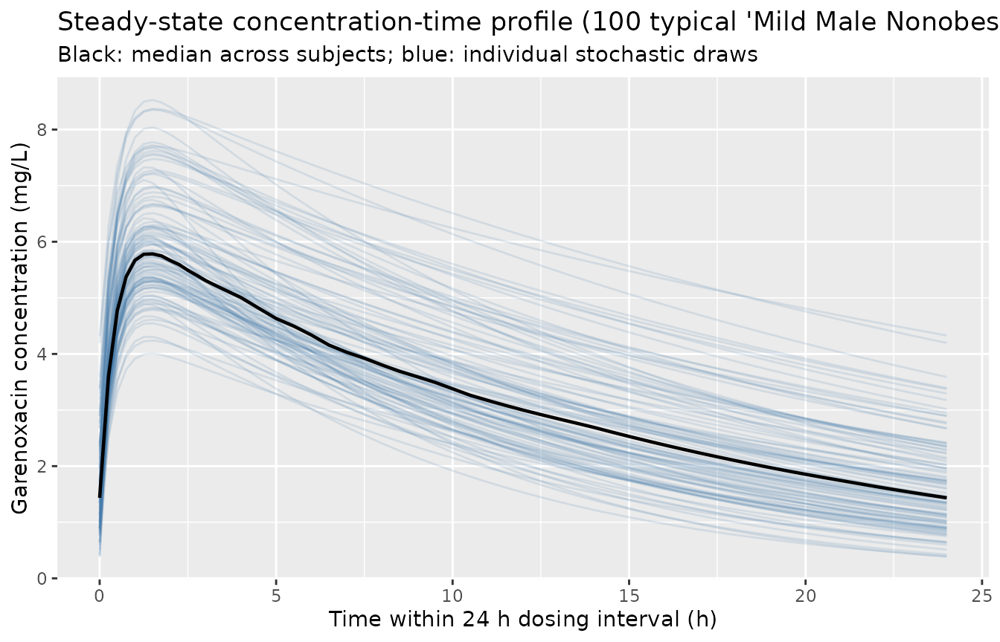

# Garenoxacin (Van Wart 2004)

## Model and source

- Citation: Van Wart S, Phillips L, Ludwig EA, Russo R, Gajjar DA, Bello
  A, Ambrose PG, Costanzo C, Grasela TH, Echols R, Grasela DM.
  Population pharmacokinetics and pharmacodynamics of garenoxacin in
  patients with community-acquired respiratory tract infections.
  Antimicrob Agents Chemother. 2004;48(12):4766-4777.
  <doi:10.1128/AAC.48.12.4766-4777.2004>
- Description: One-compartment population pharmacokinetic model with
  first-order absorption and first-order elimination for oral
  garenoxacin (a des-F(6) quinolone) in adults with community-acquired
  respiratory tract infections (Van Wart 2004); CL/F covariates are
  creatinine clearance, ideal body weight, age, obesity (WT \> 130%
  IBW), and concomitant pseudoephedrine; V/F covariates are body weight
  and male sex.
- Article: <https://doi.org/10.1128/AAC.48.12.4766-4777.2004>

## Population

The development data set in Van Wart 2004 comprises 580 adult
outpatients (80% of a pooled 721-patient cohort, with the remaining 141
reserved for external validation) from three multinational phase II
trials of oral garenoxacin (T-3811ME, BMS-284756) for community-acquired
respiratory tract infections: acute exacerbation of chronic bronchitis
(ABECB), community-acquired pneumonia (CAP), and acute bacterial
sinusitis (ABS). The 580 development subjects contributed 1,529 plasma
garenoxacin concentrations.

Baseline demographics from Van Wart 2004 Table 2 (development set):
50.3% female (292 / 580), 85% Caucasian, 10% Hispanic, 6% Black; mean
(SD, range) age 49.5 (17) yrs / 18-88, mean (SD, range) body weight 79.3
(21.3) kg / 34-178, mean (SD, range) ideal body weight 64.2 (11.8) kg /
20.9-96.9, mean (SD, range) creatinine clearance 86.9 (29.5) mL/min /
14.5-205 (Cockcroft-Gault, raw mL/min, not BSA-normalized). 34% of the
development cohort were obese by Van Wart’s \>130% IBW criterion.
Concomitant pseudoephedrine was recorded in approximately 14% of
patients (82 / 580; Table 1). Patients with severe renal dysfunction
(CrCL 15-29 mL/min) were rare (n = 3) and the model is not validated
below 15 mL/min.

All patients received oral garenoxacin 400 mg once daily for 5 to 10
days. Garenoxacin doses were classified as fed or fasted at each PK
sample; food effect was tested as a covariate on bioavailability and not
retained (F_fed = 98.2%, P = 0.8516). PK sampling: predose (0 h), 2 h
after the first dose, and the day 3-5 visit. Plasma garenoxacin was
quantified by validated LC/MS/MS over 0.01-10 ug/mL with between-run CV
\<= 7.3% and within-run CV \<= 4.2%.

The same information is available programmatically via
`readModelDb("VanWart_2004_garenoxacin")$population`.

## Source trace

Every parameter in the model file carries an inline source-location
comment. The table below collects the entries in one place.

| Equation / parameter | Value | Source location |
|----|----|----|
| One-compartment open model with first-order absorption / elimination | n/a | Methods, “Structural model development” paragraph; Results, “Basic structural model” |
| Exponential IIV model on CL/F and V/F | n/a | Methods, “Structural model development” paragraph |
| `ka` removed from IIV (sparse absorption-phase data) | n/a | Results, “Basic structural model” |
| Proportional residual error | n/a | Methods, “Structural model development” paragraph |
| `lka` (typical absorption rate constant) | 2.41 1/h | Table 4 row “ka (l/h)” |
| `lcl` (CL/F structural coefficient at reference covariates) | 83.4 mL/min | Table 4 row “CL/F coefficient (ml/min)” |
| `lvc` (V/F structural coefficient at WT=79.3 kg, female) | 67.1 L | Table 4 row “V/F coefficient (liters)” |
| `e_crcl_cl` (CRCL-CL power exponent) | 0.436 | Table 4 row “CRCL-CL power” |
| `e_ibw_cl` (IBW-CL additive slope) | 0.764 mL/min/kg | Table 4 row “IBW-CL slope” |
| `e_obese_cl` (additive CL shift for obese subjects) | 10.9 mL/min | Table 4 row “Additive shift in CL for obesity” |
| `e_age_cl` (Age-CL additive slope) | 0.301 mL/min/yr | Table 4 row “Age-CL slope” |
| `e_pseu_cl` (proportional CL shift for concomitant pseudoephedrine) | -0.144 | Table 4 row “Proportional shift in CL for concomitant pseudoephedrine use” |
| `e_wt_vc` (WTKG-V power exponent) | 0.635 | Table 4 row “WTKG-V power” |
| `e_sexm_vc` (additive V shift for males) | 17.7 L | Table 4 row “Additive shift in V for males” |
| CL/F covariate equation | full equation | Results, “Final model” paragraph |
| V/F covariate equation | full equation | Results, “Final model” paragraph |
| IIV CL/F (CV%) | 25.5% | Table 4 IIV column |
| IIV V/F (CV%) | 18.8% | Table 4 IIV column |
| Diagonal omega (no CL-V correlation) | n/a | Results, “Covariate analyses” paragraph |
| Proportional residual SD | 27.6% CV | Table 4 row “Residual variability (%CV)” |
| Cohort medians used as reference covariate values | CRCL=86.9, IBW=64.2, AGE=49.5, WTKG=79.3 | Table 2 development-set means |
| Obesity definition (WT \> 130% IBW) | n/a | Methods, “Covariates” paragraph |

## Virtual cohort

The model’s covariate equation is reproduced exactly on a typical-value
panel that matches the median covariate values Van Wart 2004 used in
Table 9 for each renal-function / gender / obesity subgroup. The panel
is a unit-test of the structural model: with `zeroRe()` zeroing all
etas, each row should match Table 9’s reported typical CL/F and AUC0-24
(steady-state).

``` r

# Table 9 covariate medians (Van Wart 2004), one row per reported subgroup.
# Severe-renal (15-29 mL/min) and Moderate Male Obese rows are omitted
# because the paper does not report them ("insufficient number of
# patients" for severe; the moderate-male-obese cell is empty in the
# published Table 9).
table9 <- tibble::tribble(
  ~renal,      ~sex_label, ~obese_label, ~n,    ~CRCL, ~IBW, ~AGE, ~WT,  ~AUC_pub, ~Cmax_pub,
  "Moderate",  "Male",     "Nonobese",   22L,   44,    71,   77,   73,   88.3,     6.12,
  "Moderate",  "Female",   "Nonobese",   15L,   43,    50,   74,   54,   115,      8.69,
  "Moderate",  "Female",   "Obese",      17L,   45,    45,   67,   73,   104,      7.49,
  "Mild",      "Male",     "Nonobese",   67L,   67,    69,   67,   75,   79.9,     5.77,
  "Mild",      "Male",     "Obese",      19L,   65,    67,   60,   100,  74.3,     5.18,
  "Mild",      "Female",   "Nonobese",   61L,   71,    52,   49,   60,   99.7,     7.83,
  "Mild",      "Female",   "Obese",      52L,   68,    52,   55,   81,   85.3,     6.58,
  "Normal",    "Male",     "Nonobese",   133L,  107,   77,   41,   80,   67.7,     5.24,
  "Normal",    "Male",     "Obese",      NA_integer_, 105, 76, 46, 116, 60.9,     4.51,
  "Normal",    "Female",   "Nonobese",   41L,   96,    58,   35,   61,   85.5,     7.29,
  "Normal",    "Female",   "Obese",      61L,   99,    59,   42,   99,   71.7,     5.67
) |>
  mutate(
    # Canonical covariate columns expected by the model.
    SEXF = ifelse(sex_label == "Female", 1L, 0L),
    # CONMED_PSEUDOEPHEDRINE = 0 (Table 9 reflects typical-value patients
    # in the absence of pseudoephedrine; the -14.4% effect is small and
    # not absorbed into the Table 9 typical CL/F).
    CONMED_PSEUDOEPHEDRINE = 0L,
    id    = seq_len(dplyr::n()),
    group = paste(renal, sex_label, obese_label)
  )

# Sanity check: the obese_label and the (WT > 1.3 * IBW) flag should agree.
obese_check <- table9 |>
  mutate(obese_flag = (WT > 1.3 * IBW) * 1) |>
  transmute(group, obese_label, obese_flag,
            agreement = (obese_label == "Obese") == (obese_flag == 1))
stopifnot(all(obese_check$agreement))
```

## Simulation

PK is simulated to steady state for each typical-value subject in the
panel above. Garenoxacin 400 mg PO daily is given for 10 doses
(sufficient for the 14-h half-life to reach steady state); the final
dosing interval is observed densely so that NCA can compute AUC0-tau,
Cmax, and Tmax over the steady-state interval and compare against Table
9. A stochastic overlay (100 subjects per group at the Mild Male
Nonobese median row) shows the spread expected from the 25.5% / 18.8%
IIV.

``` r

mod         <- rxode2::rxode2(readModelDb("VanWart_2004_garenoxacin"))
#> ℹ parameter labels from comments will be replaced by 'label()'
mod_typical <- mod |> rxode2::zeroRe()

# Dosing window. Use 10 daily doses to reach steady state, then observe
# densely over the 10th 24 h interval (216-240 h).
dosing_times <- seq(0, by = 24, length.out = 10)
ss_start     <- 216           # start of 10th dosing interval
ss_end       <- 240           # end of 10th dosing interval
obs_times    <- sort(unique(c(
  ss_start,
  ss_start + seq(0.25, 4, by = 0.25),
  ss_start + seq(4.5, 24, by = 0.5)
)))

build_events <- function(demo) {
  doses <- tidyr::crossing(
    demo |> select(id, CRCL, IBW, AGE, WT, SEXF, CONMED_PSEUDOEPHEDRINE),
    time = dosing_times
  ) |>
    mutate(amt = 400, evid = 1L, cmt = "depot")

  obs <- tidyr::crossing(
    demo |> select(id, CRCL, IBW, AGE, WT, SEXF, CONMED_PSEUDOEPHEDRINE),
    time = obs_times
  ) |>
    mutate(amt = NA_real_, evid = 0L, cmt = NA_character_)

  bind_rows(doses, obs) |>
    arrange(id, time, desc(evid))
}

events_typical <- build_events(table9)

sim_typical <- rxode2::rxSolve(
  mod_typical, events = events_typical,
  keep = c("CRCL", "IBW", "AGE", "WT", "SEXF", "CONMED_PSEUDOEPHEDRINE")
) |> as.data.frame()
#> ℹ omega/sigma items treated as zero: 'etalcl', 'etalvc'
#> Warning: multi-subject simulation without without 'omega'
```

## Replicate Table 9 (typical-value AUC and Cmax by subgroup)

``` r

# Restrict to the 10th dosing interval (216-240 h).
ss_sim <- sim_typical |>
  filter(time >= ss_start, time <= ss_end) |>
  mutate(t_in_interval = time - ss_start)

# Trapezoidal AUC over the 24 h interval and Cmax / Tmax.
nca_typical <- ss_sim |>
  group_by(id) |>
  arrange(t_in_interval) |>
  summarise(
    cmax = max(Cc),
    tmax = t_in_interval[which.max(Cc)],
    auc  = sum((t_in_interval - lag(t_in_interval)) * (Cc + lag(Cc)) / 2, na.rm = TRUE),
    .groups = "drop"
  )

cmp <- table9 |>
  select(id, group, n, AUC_pub, Cmax_pub) |>
  left_join(nca_typical, by = "id") |>
  mutate(
    AUC_sim_str  = sprintf("%.1f", auc),
    Cmax_sim_str = sprintf("%.2f", cmax),
    AUC_diff_pct  = (auc  - AUC_pub)  / AUC_pub  * 100,
    Cmax_diff_pct = (cmax - Cmax_pub) / Cmax_pub * 100
  ) |>
  transmute(
    Subgroup            = group,
    `n (paper)`         = n,
    `Paper AUC0-24 (ug.h/mL)` = AUC_pub,
    `Sim AUC0-24 (ug.h/mL)`   = AUC_sim_str,
    `AUC diff (%)`            = sprintf("%+.1f", AUC_diff_pct),
    `Paper Cmax (mg/L)`       = Cmax_pub,
    `Sim Cmax (mg/L)`         = Cmax_sim_str,
    `Cmax diff (%)`           = sprintf("%+.1f", Cmax_diff_pct)
  )

knitr::kable(cmp,
             caption = "Replicates Van Wart 2004 Table 9: typical-value steady-state AUC0-24 and Cmax for each renal function / gender / obesity subgroup at the subgroup's median covariate values, dose 400 mg PO QD.")
```

| Subgroup | n (paper) | Paper AUC0-24 (ug.h/mL) | Sim AUC0-24 (ug.h/mL) | AUC diff (%) | Paper Cmax (mg/L) | Sim Cmax (mg/L) | Cmax diff (%) |
|:---|---:|---:|:---|:---|---:|:---|:---|
| Moderate Male Nonobese | 22 | 88.3 | 88.3 | -0.0 | 6.12 | 6.15 | +0.4 |
| Moderate Female Nonobese | 15 | 115.0 | 115.1 | +0.1 | 8.69 | 8.70 | +0.1 |
| Moderate Female Obese | 17 | 104.0 | 103.9 | -0.1 | 7.49 | 7.52 | +0.4 |
| Mild Male Nonobese | 67 | 79.9 | 79.9 | -0.0 | 5.77 | 5.79 | +0.3 |
| Mild Male Obese | 19 | 74.3 | 74.3 | -0.0 | 5.18 | 5.20 | +0.4 |
| Mild Female Nonobese | 61 | 99.7 | 99.6 | -0.1 | 7.83 | 7.84 | +0.1 |
| Mild Female Obese | 52 | 85.3 | 85.2 | -0.1 | 6.58 | 6.59 | +0.1 |
| Normal Male Nonobese | 133 | 67.7 | 67.6 | -0.1 | 5.24 | 5.24 | +0.1 |
| Normal Male Obese | NA | 60.9 | 60.9 | -0.0 | 4.51 | 4.52 | +0.2 |
| Normal Female Nonobese | 41 | 85.5 | 85.4 | -0.1 | 7.29 | 7.28 | -0.1 |
| Normal Female Obese | 61 | 71.7 | 71.7 | -0.0 | 5.67 | 5.68 | +0.1 |

Replicates Van Wart 2004 Table 9: typical-value steady-state AUC0-24 and
Cmax for each renal function / gender / obesity subgroup at the
subgroup’s median covariate values, dose 400 mg PO QD. {.table}

If the structural model is encoded correctly the simulated values should
match Table 9 within rounding (~1% on AUC, a few percent on Cmax owing
to the discrete observation grid).

## Stochastic VPC (Mild Male Nonobese reference)

A 100-subject stochastic cohort matched to the Mild Male Nonobese median
covariates illustrates the IIV expected from the 25.5% (CL/F) and 18.8%
(V/F) %CV omegas.

``` r

set.seed(20041214)
n_stoch <- 100L

# Use the Mild Male Nonobese row as the structural template; sample
# log-normal WT and a Bernoulli for SEXF to keep total cohort variability
# small (the question of interest is IIV, not the cohort heterogeneity).
ref_row <- table9 |> filter(group == "Mild Male Nonobese")
stoch_demo <- tibble::tibble(
  id    = seq_len(n_stoch),
  CRCL  = ref_row$CRCL,
  IBW   = ref_row$IBW,
  AGE   = ref_row$AGE,
  WT    = ref_row$WT,
  SEXF  = 0L,
  CONMED_PSEUDOEPHEDRINE = 0L
)

events_stoch <- build_events(stoch_demo)
sim_stoch    <- rxode2::rxSolve(mod, events = events_stoch,
                                keep = c("WT", "SEXF")) |> as.data.frame()

ss_stoch <- sim_stoch |>
  filter(time >= ss_start, time <= ss_end) |>
  mutate(t_in_interval = time - ss_start)

ggplot(ss_stoch, aes(t_in_interval, Cc, group = id)) +
  geom_line(alpha = 0.15, colour = "#4477AA") +
  geom_line(data = ss_stoch |> group_by(t_in_interval) |>
              summarise(Cc = median(Cc), .groups = "drop"),
            aes(group = NULL), colour = "black", linewidth = 0.8) +
  labs(x = "Time within 24 h dosing interval (h)",
       y = "Garenoxacin concentration (mg/L)",
       title = "Steady-state concentration-time profile (100 typical 'Mild Male Nonobese' subjects)",
       subtitle = "Black: median across subjects; blue: individual stochastic draws")
```



## PKNCA validation

PKNCA is run on the stochastic cohort over the 24 h steady-state
interval to compute Cmax, Tmax, AUC0-24, and apparent terminal
half-life.

``` r

nca_in <- ss_stoch |>
  select(id, time = t_in_interval, Cc) |>
  arrange(id, time)

dose_df <- stoch_demo |>
  mutate(time = 0, amt = 400) |>
  select(id, time, amt)

conc_obj <- PKNCA::PKNCAconc(nca_in,  Cc  ~ time | id)
dose_obj <- PKNCA::PKNCAdose(dose_df, amt ~ time | id)

intervals <- data.frame(
  start     = 0,
  end       = 24,
  cmax      = TRUE,
  tmax      = TRUE,
  auclast   = TRUE,
  half.life = TRUE
)

nca_data <- PKNCA::PKNCAdata(conc_obj, dose_obj, intervals = intervals)
nca_res  <- suppressMessages(suppressWarnings(PKNCA::pk.nca(nca_data)))
nca_summary <- summary(nca_res)
knitr::kable(nca_summary,
             caption = "Steady-state NCA on the 100-subject Mild Male Nonobese stochastic cohort.")
```

| start | end | N   | auclast       | cmax          | tmax                | half.life     |
|------:|----:|:----|:--------------|:--------------|:--------------------|:--------------|
|     0 |  24 | 100 | 80.4 \[26.1\] | 5.90 \[16.2\] | 1.50 \[1.25, 1.50\] | 12.2 \[4.01\] |

Steady-state NCA on the 100-subject Mild Male Nonobese stochastic
cohort. {.table}

The mean AUC0-24 in the stochastic cohort should be close to Van Wart
2004 Table 9’s Mild Male Nonobese value of 79.9 ug.h/mL, with the spread
driven by the 25.5% / 18.8% IIV.

## Assumptions and deviations

- **Pseudoephedrine effect not applied in Table 9 replication.** Table 9
  reports typical-value CL/F and AUC by renal function / sex / obesity
  in the absence of concomitant pseudoephedrine. The vignette mirrors
  this: `CONMED_PSEUDOEPHEDRINE = 0` in the typical-value panel. A
  separate comparison is not made because the paper does not tabulate
  Table 9 with pseudoephedrine on; the effect is encoded in the model
  file via `e_pseu_cl = -0.144` and is exercised when a user simulates
  with the flag set.
- **Bioavailability F = 1.** Van Wart 2004 tested fed vs fasted as a
  bioavailability covariate and did not retain it (F_fed = 98.2%, P =
  0.8516). The packaged model assumes F = 1 across dosing states. The
  apparent oral parameters CL/F and V/F absorb F into the typical
  values.
- **Race / ethnicity not modelled.** Race was tested as a V/F covariate
  during forward selection (P = 0.00684) and eliminated during backward
  stepwise; it does not appear in the final model. The covariate column
  is not used by `VanWart_2004_garenoxacin`.
- **Severe renal dysfunction (CrCL 15-29 mL/min) not validated.** The
  development cohort had only n = 3 such patients (Van Wart 2004 Table 9
  footnote b). The model can be evaluated at CrCL \< 15 mL/min
  mechanically but the result is an extrapolation.
- **Multiple-dose steady state used for Table 9 replication.** Van Wart
  2004 computed AUC0-tau and Cmax for each patient with the POSTHOC
  Bayesian PK parameter estimates and the standard one-compartment
  steady-state equations (Methods, “Antimicrobial activity analysis”).
  The vignette reaches steady state by simulating 10 daily 400 mg doses
  and integrating the 10th dosing interval; the 14 h elimination
  half-life is well-resolved by then.
- **Concentrations \< 2 mg/L overpredicted by the final model.** Van
  Wart 2004 Results notes that “many concentrations that were low (\< 2
  mg/L) relative to most of the data collected less than 6 h postdose …
  were overpredicted by the final model, indicating that patient
  covariates did not explain this variability. Therefore, the unusual
  low concentrations may have been the result of protocol adherence
  issues.” The packaged model inherits this characteristic.
- **PD layer not modelled.** Van Wart 2004 reports stepwise logistic
  regression on drug-related adverse-event occurrence (Tables 4-5 not on
  PK; safety/efficacy in Tables 7-8), clinical cure, and bacteriological
  eradication for S. pneumoniae and H. influenzae / H. parainfluenzae
  / M. catarrhalis. These analyses are statistical (SAS PROC LOGISTIC)
  and do not translate to a structural nlmixr2 PD model; they are not
  included in the model file.
- **Vignette uses 100 stochastic subjects for the VPC.** Cohort size is
  large enough to give a stable steady-state profile envelope while
  keeping the vignette under the 5-minute pkgdown gate.
