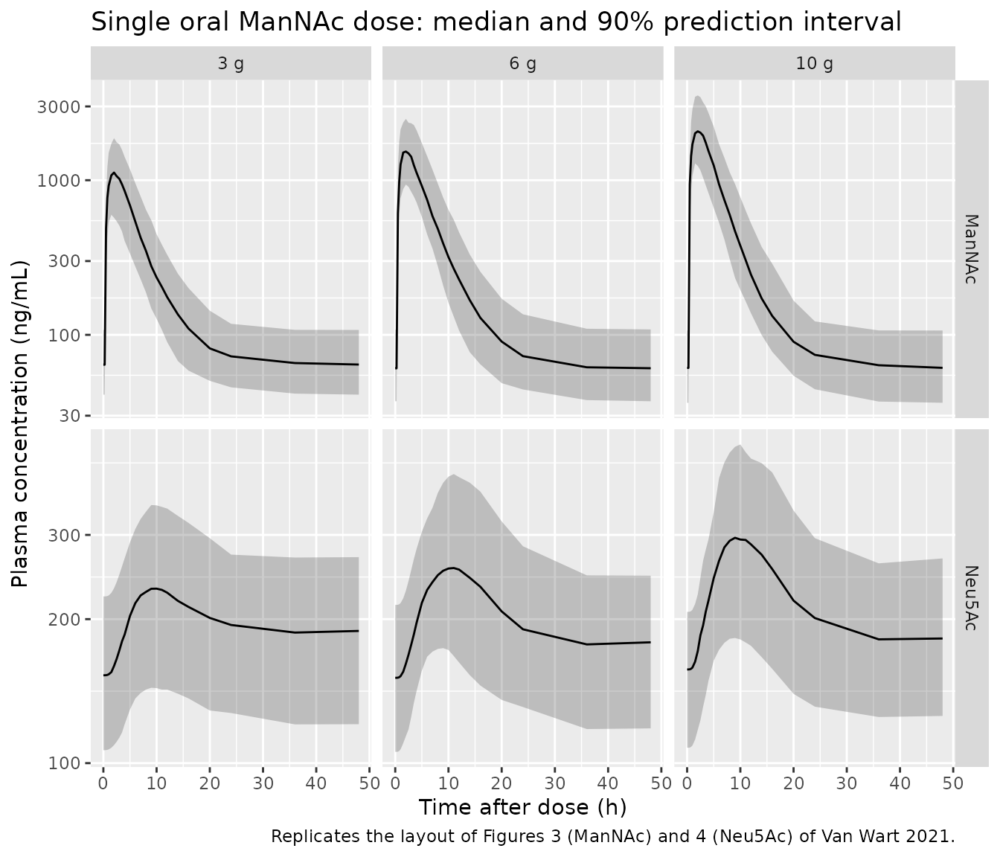
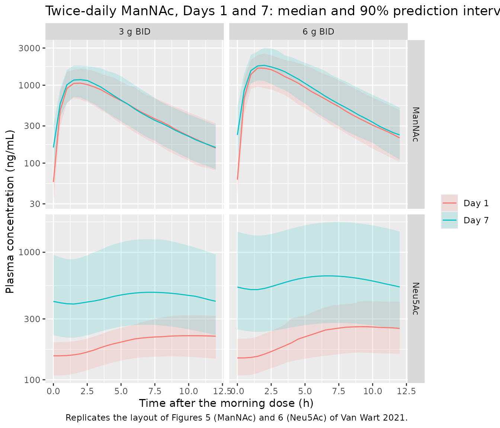

# N-acetylmannosamine (ManNAc) and Neu5Ac (Van Wart 2021)

## Model and source

    #> ℹ parameter labels from comments will be replaced by 'label()'

- Citation: Van Wart S, Mager DE, Bednasz CJ, Huizing M, Carrillo N.
  Population Pharmacokinetic Model of N-acetylmannosamine (ManNAc) and
  N-acetylneuraminic acid (Neu5Ac) in Subjects with GNE Myopathy. Drugs
  R D. 2021;21(2):189-202. <doi:10.1007/s40268-021-00343-6>
- Description: Semi-mechanistic joint population pharmacokinetic model
  of oral N-acetylmannosamine (ManNAc) and its metabolite
  N-acetylneuraminic acid (Neu5Ac, sialic acid) in adults with GNE
  myopathy (Van Wart 2021). ManNAc: one-compartment disposition with
  first-order absorption after a lag time, relative bioavailability
  falling with dose as a power function (F = 1 at 6 g), and a constant
  endogenous ManNAc production that holds the pre-dose baseline M0.
  Neu5Ac: an indirect-response production through a precursor
  compartment, both states draining at the Neu5Ac elimination rate
  constant kout, with production stimulated linearly by plasma ManNAc.
  The stimulation slope rises exponentially with time from SLP0 to SLPSS
  (first-order rate kinc), describing the increase in ManNAc-to-Neu5Ac
  conversion over the first week of dosing. Inter-occasion variability
  on ManNAc clearance over four occasions. No covariates were retained.
- Article: <https://doi.org/10.1007/s40268-021-00343-6>
- Supplement (Online Resources 1-10, including the NONMEM control stream
  of the final model as Online Resource 6): available from the article’s
  Supplementary Information link.

Van Wart 2021 describes a semi-mechanistic model that fits plasma
N-acetylmannosamine (ManNAc) and its metabolite N-acetylneuraminic acid
(Neu5Ac, sialic acid) jointly, after oral ManNAc in adults with GNE
myopathy, a rare muscle disease caused by deficient sialic acid
biosynthesis. Both species are endogenous, so the model carries baseline
concentrations `M0` and `N0` that are maintained before dosing. The
authors built the model in four stages as data accrued (Table 1); the
parameters here are those of the Stage 4 final model (Table 4).

## Population

Thirty-four adults with genetically confirmed GNE myopathy contributed
data from two NIH studies (Van Wart 2021 Table 2 and Online Resource 1).
In the Phase 1 study 12-HG-0207 (NCT01634750), subjects received a
single fasting oral dose of 3 g (n = 6), 6 g (n = 8) or 10 g (n = 8) of
ManNAc, with placebo in a 3:1 ratio. In the Phase 2 study 15-HG-0068
(NCT02346461), 12 subjects took 3 g or 6 g twice daily for 7 days, then
6 g twice daily for up to 30 months, with a 72-hour washout after Day
90. Eight of them came back at Day 912 and, after a 5-7 day break, took
4 g three times daily. Sixteen subjects were male and 18 female, with a
median age of 39.5 years (range 25-65 years) and a median weight of 84.6
kg (range 49.3-115 kg). 70.6% were Caucasian and 26.5% Asian. Renal
function was normal (mean cystatin C eGFR 123 mL/min). The analysis used
845 ManNAc and 849 Neu5Ac concentrations.

The same information is available programmatically via
`readModelDb("VanWart_2021_mannac")()$population`.

## Source trace

Every `ini()` value carries an in-file comment pointing to its source in
`inst/modeldb/specificDrugs/VanWart_2021_mannac.R`. The table below
collects them.

| Equation / parameter | Value | Source location |
|----|----|----|
| `lka` (ka) | 0.256 1/h | Table 4 |
| `lcl` (CLM/F) | 631 L/h | Table 4 |
| `lvc` (VM/F) | 506 L | Table 4 |
| `ltlag` (tlag) | 0.254 h | Table 4 |
| `lrbase` (M0) | 61.1 ng/mL | Table 4 |
| `lrbase_neu5ac` (N0) | 150 ng/mL | Table 4 |
| `lkout_neu5ac` (kout) | 0.283 1/h | Table 4 |
| `lslope0` (SLP0) | 0.000619 mL/ng | Table 4 |
| `lslope_ss` (SLPSS) | 0.00334 mL/ng | Table 4 |
| `lkinc` (kinc) | 0.0287 1/h | Table 4 |
| `lfdepot` | 1 (fixed) | Table 4, ‘F for 6 g dose’ |
| `e_dose_fdepot` | -0.405 | Table 4, ‘F-Dose slope’; form from Online Resource 6 (`F1=(DOSEMG/6000)**THETA(11)`) |
| `etalka`, `etalcl`, `etalvc`, `etalrbase`, `etalrbase_neu5ac`, `etalslope_ss` | 0.0697, 0.0636, 0.120, 0.0966, 0.0439, 0.383 | Table 4 omega-squared column |
| `etaiov_cl_1` … `etaiov_cl_4` | 0.0580 (shared) | Table 4 ‘IOV on CLM/F’; four occasions from Online Resource 6 `$PK` |
| `propSd` (ManNAc) | sqrt(0.102) = 0.319 | Table 4 ‘sigma2 CCV component’; Online Resource 6 `RV_CCV_M` |
| `propSd_neu5ac` (Neu5Ac) | sqrt(0.0370) = 0.192 | Table 4 row printed ‘Additive component’; Online Resource 6 `RV_CCV_N` (see Assumptions) |
| `d/dt(depot)` | n/a | Eq. 1 |
| `d/dt(central)`, `ksyn = M0 * CLM/F` | n/a | Eq. 2; Methods 2.3.3 |
| `d/dt(precursor1)`, `d/dt(central_neu5ac)` | n/a | Eqs. 3-4 |
| `kpro` | n/a | Eq. 5, in the as-run units of Online Resource 6 (see Assumptions) |
| `slope(t)` | n/a | Eq. 6 |
| Initial conditions `central(0) = M0 * VM`, `precursor1(0) = central_neu5ac(0) = N0` | n/a | Eqs. 2-4; Online Resource 6 `A_INITIAL` |

The model equations are

``` math
\begin{aligned}
\frac{dA_{PO}}{dt} &= -k_a A_{PO}, \qquad \text{dose enters after } t_{lag} \text{ with } F = (\text{Dose}/6\,\text{g})^{-0.405}\\
\frac{dA_M}{dt} &= k_{syn} + k_a A_{PO} - \frac{CL_M}{V_M} A_M, \qquad M = A_M / V_M\\
\frac{dPN}{dt} &= k_{pro}\,(1 + SLP(t) \cdot M) - k_{out} PN\\
\frac{dN}{dt} &= k_{out} PN - k_{out} N\\
SLP(t) &= SLP_{SS} - (SLP_{SS} - SLP_0)\,e^{-k_{inc} t}
\end{aligned}
```

## Structural checks on the typical subject

These checks use the typical-value model (`zeroRe()`), so they are
deterministic.

``` r

mod_typ <- suppressWarnings(rxode2::zeroRe(ui))
th <- ui$theta

# Build one subject's event table. Dose rows carry the dose in DOSE_MANNAC_MG
# (the control stream's DOSEMG); observation rows nominate the ManNAc/Neu5Ac
# endpoint pair with dvid = 1, which returns both Cc and Cc_neu5ac as columns.
# The dose covariate follows id/time/amt/evid/cmt/dvid on purpose.
make_events <- function(id, dose_mg, dose_times, obs_times, occ = 1L) {
  doses <- data.frame(
    id = id, time = dose_times, amt = dose_mg, evid = 1L, cmt = "depot",
    dvid = NA_integer_, DOSE_MANNAC_MG = dose_mg
  )
  obs <- data.frame(
    id = id, time = obs_times, amt = 0, evid = 0L, cmt = NA_character_,
    dvid = 1L, DOSE_MANNAC_MG = 0
  )
  out <- rbind(doses, obs)
  out$OCC <- occ
  out[order(out$id, out$time, -out$evid), ]
}
```

### Secondary parameters of Table 4

Table 4 lists two derived quantities, `ksyn` and `kpro`.

``` r

m0 <- exp(th[["lrbase"]])
n0 <- exp(th[["lrbase_neu5ac"]])
cl <- exp(th[["lcl"]])
kout <- exp(th[["lkout_neu5ac"]])
slp0 <- exp(th[["lslope0"]])

ksyn_ugh <- m0 * cl # ng/mL * L/h = ug/h
kpro_eq5 <- kout * n0 / (1 + slp0 * m0) # Eq. 5, M0 in ng/mL
kpro_asrun <- kout * n0 / (1 + slp0 * m0 / 1000) # control stream, M0 in mg/L

derived <- data.frame(
  Quantity = c("ksyn (ug/h)", "kpro, Eq. 5 (ng/mL/h)", "kpro, as run (ng/mL/h)"),
  Model = c(ksyn_ugh, kpro_eq5, kpro_asrun),
  `Table 4` = c(38554, 40.9, 40.9),
  check.names = FALSE
)
knitr::kable(derived, digits = 2, caption = "Derived parameters against Table 4.")
```

| Quantity               |    Model | Table 4 |
|:-----------------------|---------:|--------:|
| ksyn (ug/h)            | 38554.10 | 38554.0 |
| kpro, Eq. 5 (ng/mL/h)  |    40.90 |    40.9 |
| kpro, as run (ng/mL/h) |    42.45 |    40.9 |

Derived parameters against Table 4. {.table}

``` r


stopifnot(
  abs(ksyn_ugh / 38554 - 1) < 1e-3,
  # Eq. 5 in consistent units reproduces the printed kpro...
  abs(kpro_eq5 / 40.9 - 1) < 1e-3,
  # ...while the as-run control-stream form is 3.8% higher (see Assumptions).
  abs(kpro_asrun / kpro_eq5 - (1 + slp0 * m0)) < 1e-3
)
```

`ksyn` matches exactly. The printed `kpro` of 40.9 ng/mL/h is Eq. 5
evaluated with `M0` in ng/mL. The fitted control stream evaluates the
same expression with `M0` in mg/L, which gives 42.45 ng/mL/h. The
packaged model keeps that as-run form, for the reasons given under
Assumptions and deviations.

### ManNAc: closed-form single-dose solution and relative bioavailability

Plasma ManNAc is linear, with a first-order input after a lag on top of
a constant endogenous baseline. For a single dose the model must
therefore equal the closed form
`M(t) = M0 + F * Dose * ka / (V * (ka - k)) * (exp(-k (t - tlag)) - exp(-ka (t - tlag)))`
for `t > tlag`, with `F = (Dose / 6 g)^-0.405`. The Results give the
fitted F as ranging “from 1.32 at a dose of 3 g to 0.81 at a dose of 10
g”.

``` r

ka <- exp(th[["lka"]])
vc <- exp(th[["lvc"]])
tlag <- exp(th[["ltlag"]])
k <- cl / vc
tt <- c(0, 0.1, seq(0.5, 24, by = 0.5))

cf_rows <- lapply(c(3000, 6000, 10000), function(d) {
  s <- rxode2::rxSolve(
    mod_typ, make_events(1L, d, 0, tt),
    returnType = "data.frame", useLinCmt = FALSE, rtol = 1e-10, atol = 1e-12
  )
  f_dose <- (d / 6000)^th[["e_dose_fdepot"]]
  te <- pmax(s$time - tlag, 0)
  cf <- m0 + 1000 * f_dose * d * ka / (vc * (ka - k)) * (exp(-k * te) - exp(-ka * te))
  data.frame(dose_g = d / 1000, F = f_dose, max_rel_err = max(abs(s$Cc / cf - 1)))
})
#> ℹ omega/sigma items treated as zero: 'etalka', 'etalcl', 'etalvc', 'etalrbase', 'etalrbase_neu5ac', 'etalslope_ss', 'etaiov_cl_1', 'etaiov_cl_2', 'etaiov_cl_3', 'etaiov_cl_4'
#> ℹ omega/sigma items treated as zero: 'etalka', 'etalcl', 'etalvc', 'etalrbase', 'etalrbase_neu5ac', 'etalslope_ss', 'etaiov_cl_1', 'etaiov_cl_2', 'etaiov_cl_3', 'etaiov_cl_4'
#> ℹ omega/sigma items treated as zero: 'etalka', 'etalcl', 'etalvc', 'etalrbase', 'etalrbase_neu5ac', 'etalslope_ss', 'etaiov_cl_1', 'etaiov_cl_2', 'etaiov_cl_3', 'etaiov_cl_4'
cf_tab <- do.call(rbind, cf_rows)
knitr::kable(cf_tab, digits = c(0, 3, 12),
  caption = "Relative bioavailability and agreement of the ODE solution with the closed form.")
```

| dose_g |     F | max_rel_err |
|-------:|------:|------------:|
|      3 | 1.324 |     7.8e-11 |
|      6 | 1.000 |     9.3e-11 |
|     10 | 0.813 |     8.2e-11 |

Relative bioavailability and agreement of the ODE solution with the
closed form. {.table}

``` r


stopifnot(
  abs(cf_tab$F[cf_tab$dose_g == 3] - 1.32) < 0.005,
  abs(cf_tab$F[cf_tab$dose_g == 10] - 0.81) < 0.005,
  # Measured ~1e-10 with these tolerances.
  max(cf_tab$max_rel_err) < 1e-7
)
```

### Endogenous baselines and the time-dependent conversion slope

With no dose, ManNAc must hold at `M0` forever. Neu5Ac starts at `N0`,
but it does not hold there. The conversion slope `SLP(t)` rises from
`SLP0` towards `SLPSS` as a function of time alone (Eq. 6), so an
undosed subject’s Neu5Ac settles at the level set by `SLPSS`:
`N_ss = kpro * (1 + SLPSS * M0) / kout`. Online Resource 10 notes that
“after about 1 week, the SLP parameter reaches steady-state levels”.

``` r

b <- rxode2::rxSolve(
  mod_typ, make_events(1L, 0, 0, c(0, 24, 168, 336, 2000)),
  returnType = "data.frame", useLinCmt = FALSE, rtol = 1e-10, atol = 1e-12
)
#> ℹ omega/sigma items treated as zero: 'etalka', 'etalcl', 'etalvc', 'etalrbase', 'etalrbase_neu5ac', 'etalslope_ss', 'etaiov_cl_1', 'etaiov_cl_2', 'etaiov_cl_3', 'etaiov_cl_4'
slp_ss <- exp(th[["lslope_ss"]])
n_ss <- kpro_asrun * (1 + slp_ss * m0) / kout
frac_1wk <- (b$slope[b$time == 168] - slp0) / (slp_ss - slp0)

knitr::kable(b[, c("time", "Cc", "Cc_neu5ac", "slope")], digits = 6,
  caption = "Undosed typical subject.")
```

| time |   Cc | Cc_neu5ac |    slope |
|-----:|-----:|----------:|---------:|
|    0 | 61.1 |  150.0000 | 0.000619 |
|   24 | 61.1 |  165.0739 | 0.001974 |
|  168 | 61.1 |  180.3555 | 0.003318 |
|  336 | 61.1 |  180.6023 | 0.003340 |
| 2000 | 61.1 |  180.6043 | 0.003340 |

Undosed typical subject. {.table}

``` r


stopifnot(
  max(abs(b$Cc / m0 - 1)) < 1e-8,
  abs(b$Cc_neu5ac[b$time == 0] / n0 - 1) < 1e-8,
  abs(b$Cc_neu5ac[b$time == 2000] / n_ss - 1) < 1e-6,
  frac_1wk > 0.99
)
```

`SLP` has covered 99.2% of its rise by one week, which matches Online
Resource 10. The undosed Neu5Ac level rises from 150 to 180.6 ng/mL.
That rise is built into the published model, not a defect of the
encoding: `SLP` is a function of time since the start of the subject’s
record, and dosing does not enter it.

## Single-dose simulations (Figures 3 and 4)

Van Wart 2021 Figures 3 and 4 are VPCs of plasma ManNAc and Neu5Ac after
a single 3, 6 or 10 g dose in study 12-HG-0207. The chunk below
simulates 100 virtual subjects per dose group with between-subject
variability and plots the 5th, 50th and 95th percentiles of the
individual predictions. No covariates are needed because none were
retained.

``` r

rxode2::rxSetSeed(2021)
n_sd <- 100
sd_times <- c(0, 0.25, 0.5, 0.75, 1, 1.5, 2, 2.5, 3, 3.5, 4, 5, 6, 7, 8, 9, 10,
  11, 12, 14, 16, 20, 24, 36, 48)
sd_doses <- c(3000, 6000, 10000)
sd_events <- do.call(rbind, lapply(seq_along(sd_doses), function(i) {
  ev <- do.call(rbind, lapply((i - 1) * n_sd + seq_len(n_sd), function(j) {
    make_events(j, sd_doses[i], 0, sd_times)
  }))
  ev$treatment <- paste0(sd_doses[i] / 1000, " g")
  ev
}))
stopifnot(!anyDuplicated(unique(sd_events[, c("id", "time", "evid")])))

sd_sim <- rxode2::rxSolve(mod, events = sd_events, keep = "treatment",
  returnType = "data.frame", useLinCmt = FALSE)
#> ℹ parameter labels from comments will be replaced by 'label()'
#> Warning: some etas defaulted to non-mu referenced, possible parsing error: etaiov_cl_1, etaiov_cl_2, etaiov_cl_3, etaiov_cl_4
#> as a work-around try putting the mu-referenced expression on a simple line
sd_sim$treatment <- factor(sd_sim$treatment, levels = c("3 g", "6 g", "10 g"))
stopifnot(!anyNA(sd_sim$Cc), !anyNA(sd_sim$Cc_neu5ac))
```

``` r

sd_sim |>
  select(id, time, treatment, ManNAc = Cc, Neu5Ac = Cc_neu5ac) |>
  pivot_longer(c(ManNAc, Neu5Ac), names_to = "analyte", values_to = "conc") |>
  group_by(analyte, treatment, time) |>
  summarise(
    Q05 = quantile(conc, 0.05), Q50 = median(conc), Q95 = quantile(conc, 0.95),
    .groups = "drop"
  ) |>
  ggplot(aes(time, Q50)) +
  geom_ribbon(aes(ymin = Q05, ymax = Q95), alpha = 0.25) +
  geom_line() +
  facet_grid(analyte ~ treatment, scales = "free_y") +
  scale_y_log10() +
  labs(
    x = "Time after dose (h)", y = "Plasma concentration (ng/mL)",
    title = "Single oral ManNAc dose: median and 90% prediction interval",
    caption = "Replicates the layout of Figures 3 (ManNAc) and 4 (Neu5Ac) of Van Wart 2021."
  )
```



### PKNCA: single dose

The Introduction summarises the single-dose Phase 1 data (reference 11
of the paper): ManNAc is “absorbed rapidly (Tmax 2-2.5 h)” and Neu5Ac
peaks later (“Tmax 8-11 h”). These are observed values from the same
study the model was fitted to. Concentrations include the endogenous
baseline, as measured.

``` r

sd_dose <- sd_events |>
  filter(evid == 1) |>
  select(id, time, amt, treatment)
sd_int <- data.frame(start = 0, end = 48, cmax = TRUE, tmax = TRUE, auclast = TRUE)

nca_sd <- function(conc_col) {
  conc <- sd_sim |>
    filter(!is.na(.data[[conc_col]])) |>
    transmute(id, time, treatment = as.character(treatment), conc = .data[[conc_col]])
  conc_obj <- PKNCA::PKNCAconc(conc, conc ~ time | treatment + id)
  dose_obj <- PKNCA::PKNCAdose(sd_dose, amt ~ time | treatment + id)
  PKNCA::pk.nca(PKNCA::PKNCAdata(conc_obj, dose_obj, intervals = sd_int))
}
nca_sd_m <- nca_sd("Cc")
nca_sd_n <- nca_sd("Cc_neu5ac")

sd_summary <- bind_rows(
  as.data.frame(nca_sd_m) |> mutate(analyte = "ManNAc"),
  as.data.frame(nca_sd_n) |> mutate(analyte = "Neu5Ac")
) |>
  group_by(analyte, treatment, PPTESTCD) |>
  summarise(median = median(PPORRES), .groups = "drop") |>
  pivot_wider(names_from = PPTESTCD, values_from = median) |>
  mutate(treatment = factor(treatment, levels = c("3 g", "6 g", "10 g"))) |>
  arrange(analyte, treatment)

sd_summary |>
  select(analyte, treatment, cmax, tmax, auclast) |>
  rename(
    "Analyte" = analyte, "Dose" = treatment, "Cmax (ng/mL)" = cmax,
    "Tmax (h)" = tmax, "AUC0-48 (ng*h/mL)" = auclast
  ) |>
  knitr::kable(digits = 1, caption = "Median simulated single-dose NCA (100 subjects per dose).")
```

| Analyte | Dose | Cmax (ng/mL) | Tmax (h) | AUC0-48 (ng\*h/mL) |
|:--------|:-----|-------------:|---------:|-------------------:|
| ManNAc  | 3 g  |       1159.2 |        2 |             9673.9 |
| ManNAc  | 6 g  |       1587.8 |        2 |            12198.5 |
| ManNAc  | 10 g |       2115.7 |        2 |            15466.3 |
| Neu5Ac  | 3 g  |        232.9 |       10 |             9520.0 |
| Neu5Ac  | 6 g  |        255.9 |       10 |             9652.8 |
| Neu5Ac  | 10 g |        297.3 |        9 |            10337.3 |

Median simulated single-dose NCA (100 subjects per dose). {.table}

``` r


tmax_m <- sd_summary$tmax[sd_summary$analyte == "ManNAc"]
tmax_n <- sd_summary$tmax[sd_summary$analyte == "Neu5Ac"]
stopifnot(
  length(tmax_m) == 3, length(tmax_n) == 3,
  # Introduction: ManNAc Tmax 2-2.5 h and Neu5Ac Tmax 8-11 h across the three
  # dose groups (observed). A 0.5 h grid margin either side allows for the
  # sampling grid and for cohort-to-cohort variation of a median.
  all(tmax_m >= 1.5 & tmax_m <= 3),
  all(tmax_n >= 7.5 & tmax_n <= 11.5)
)
```

The simulated median Tmax sits inside the reported ranges for both
analytes and all three dose groups. The Neu5Ac peak comes about 6-8
hours after the ManNAc peak, as the paper notes.

## Repeated dosing (Figures 5 and 6)

Study 15-HG-0068 started with 3 g or 6 g twice daily for 7 days, sampled
intensively on Days 1 and 7. Figures 5 and 6 are the repeated-dose VPCs.
The occasion switches from 1 to 2 at Day 4, as in the control stream.
Neu5Ac rises from Day 1 to Day 7 because the conversion slope increases
over the week.

``` r

rxode2::rxSetSeed(2022)
n_md <- 100
md_obs <- c(seq(0, 12, by = 0.5), 144 + seq(0, 12, by = 0.5))
md_doses <- c(3000, 6000)
md_events <- do.call(rbind, lapply(seq_along(md_doses), function(i) {
  ev <- do.call(rbind, lapply((i - 1) * n_md + seq_len(n_md), function(j) {
    make_events(j, md_doses[i], seq(0, 156, by = 12), md_obs)
  }))
  ev$OCC <- ifelse(ev$time < 72, 1L, 2L)
  ev$treatment <- paste0(md_doses[i] / 1000, " g BID")
  ev
}))
stopifnot(!anyDuplicated(unique(md_events[, c("id", "time", "evid")])))

md_sim <- rxode2::rxSolve(mod, events = md_events, keep = "treatment",
  returnType = "data.frame", useLinCmt = FALSE)
stopifnot(!anyNA(md_sim$Cc), !anyNA(md_sim$Cc_neu5ac))
md_sim$day <- ifelse(md_sim$time < 72, "Day 1", "Day 7")
md_sim$tad <- ifelse(md_sim$time < 72, md_sim$time, md_sim$time - 144)
```

``` r

md_sim |>
  select(id, tad, day, treatment, ManNAc = Cc, Neu5Ac = Cc_neu5ac) |>
  pivot_longer(c(ManNAc, Neu5Ac), names_to = "analyte", values_to = "conc") |>
  group_by(analyte, treatment, day, tad) |>
  summarise(
    Q05 = quantile(conc, 0.05), Q50 = median(conc), Q95 = quantile(conc, 0.95),
    .groups = "drop"
  ) |>
  ggplot(aes(tad, Q50, colour = day, fill = day)) +
  geom_ribbon(aes(ymin = Q05, ymax = Q95), alpha = 0.15, colour = NA) +
  geom_line() +
  facet_grid(analyte ~ treatment, scales = "free_y") +
  scale_y_log10() +
  labs(
    x = "Time after the morning dose (h)", y = "Plasma concentration (ng/mL)",
    colour = NULL, fill = NULL,
    title = "Twice-daily ManNAc, Days 1 and 7: median and 90% prediction interval",
    caption = "Replicates the layout of Figures 5 (ManNAc) and 6 (Neu5Ac) of Van Wart 2021."
  )
```



The typical subject makes the Day-1-to-Day-7 increase deterministic:

``` r

md_typ <- rxode2::rxSolve(
  mod_typ, make_events(1L, 6000, seq(0, 156, by = 12), md_obs, occ = 1L),
  returnType = "data.frame", useLinCmt = FALSE
)
#> ℹ omega/sigma items treated as zero: 'etalka', 'etalcl', 'etalvc', 'etalrbase', 'etalrbase_neu5ac', 'etalslope_ss', 'etaiov_cl_1', 'etaiov_cl_2', 'etaiov_cl_3', 'etaiov_cl_4'
n_cmax_d1 <- max(md_typ$Cc_neu5ac[md_typ$time <= 12])
n_cmax_d7 <- max(md_typ$Cc_neu5ac[md_typ$time >= 144])
m_cmax_d1 <- max(md_typ$Cc[md_typ$time <= 12])
m_cmax_d7 <- max(md_typ$Cc[md_typ$time >= 144])
c(neu5ac_day7_over_day1 = n_cmax_d7 / n_cmax_d1, mannac_day7_over_day1 = m_cmax_d7 / m_cmax_d1)
#> neu5ac_day7_over_day1 mannac_day7_over_day1 
#>              2.554389              1.056885
stopifnot(
  # ManNAc disposition is fast (0.56 h half-life), but absorption is slow
  # (ka = 0.256 1/h, a 2.7 h half-life), so about exp(-0.256 * 11.75) = 5% of
  # each dose is still in the depot at the next dose: slight accumulation only.
  m_cmax_d7 / m_cmax_d1 > 1, m_cmax_d7 / m_cmax_d1 < 1.1,
  # Neu5Ac rises markedly over the week as SLP approaches SLPSS.
  n_cmax_d7 / n_cmax_d1 > 1.5
)
```

## Dosing-regimen simulations (Table 3) and PKNCA

Table 3 gives the median and 5th-95th percentiles of the average
steady-state concentration (`Css,ave` = AUC over the dosing interval on
Day 30, divided by tau; Online Resource 4) for 3, 4, 6 and 10 g every 8,
12 or 24 hours, with 90 virtual subjects. The paper simulated “a single
clinical trial”, so the same 90 subjects appear in every regimen. That
design is reproduced here with common random numbers. The 90 subjects’
random effects are drawn once in base R and passed to the typical-value
model as data columns. Every regimen therefore sees the same subjects,
and the result depends only on R’s own seed, not on rxode2’s thread
count. Day 30 falls in occasion 3 of the IOV structure (Day \>= 30),
which is used throughout.

``` r

set.seed(2021)
n_t3 <- 90
om <- ui$omega
etas <- as.data.frame(matrix(rnorm(n_t3 * ncol(om)), n_t3) %*% chol(om))
names(etas) <- colnames(om)
etas$pid <- seq_len(n_t3)

regimens <- expand.grid(dose_g = c(3, 4, 6, 10), tau = c(8, 12, 24))
regimens$regimen <- sprintf("%g g Q%dH", regimens$dose_g, regimens$tau)
day30 <- 29 * 24

t3_events <- do.call(rbind, lapply(seq_len(nrow(regimens)), function(i) {
  r <- regimens[i, ]
  ev <- do.call(rbind, lapply(seq_len(n_t3), function(p) {
    e <- make_events(
      (i - 1) * n_t3 + p, r$dose_g * 1000,
      seq(0, by = r$tau, length.out = 30 * 24 / r$tau),
      day30 + seq(0, r$tau, by = 0.25), occ = 3L
    )
    e$pid <- p
    e
  }))
  ev$regimen <- r$regimen
  ev
})) |>
  left_join(etas, by = "pid")
stopifnot(!anyDuplicated(unique(t3_events[, c("id", "time", "evid")])))

t3_sim <- rxode2::rxSolve(mod_typ, events = t3_events, keep = "regimen",
  returnType = "data.frame", useLinCmt = FALSE)
#> ℹ omega/sigma items treated as zero: 'etalka', 'etalcl', 'etalvc', 'etalrbase', 'etalrbase_neu5ac', 'etalslope_ss', 'etaiov_cl_1', 'etaiov_cl_2', 'etaiov_cl_3', 'etaiov_cl_4'
#> Warning: multi-subject simulation without without 'omega'
stopifnot(!anyNA(t3_sim$Cc), !anyNA(t3_sim$Cc_neu5ac))
# The etas were applied: the panel's clearances spread around the typical 631 L/h.
stopifnot(sd(log(t3_sim$cl)) > 0.2)
```

`Css,ave` is PKNCA’s `cav` over the Day-30 dosing interval.

``` r

t3_dose <- t3_events |>
  filter(evid == 1) |>
  select(id, time, amt, regimen)
t3_int <- regimens |>
  transmute(regimen, start = day30, end = day30 + tau, cav = TRUE)

nca_t3 <- function(conc_col) {
  conc <- t3_sim |>
    filter(!is.na(.data[[conc_col]])) |>
    transmute(id, time, regimen, conc = .data[[conc_col]])
  conc_obj <- PKNCA::PKNCAconc(conc, conc ~ time | regimen + id)
  dose_obj <- PKNCA::PKNCAdose(t3_dose, amt ~ time | regimen + id)
  PKNCA::pk.nca(PKNCA::PKNCAdata(conc_obj, dose_obj, intervals = t3_int))
}
nca_t3_m <- nca_t3("Cc")
nca_t3_n <- nca_t3("Cc_neu5ac")

# Van Wart 2021 Table 3: median and 5th-95th percentiles of Css,ave (ng/mL).
table3 <- tibble::tribble(
  ~analyte, ~regimen, ~t3_median, ~t3_p05, ~t3_p95,
  "ManNAc", "3 g Q8H", 922, 501, 1550,
  "ManNAc", "4 g Q8H", 1060, 573, 1790,
  "ManNAc", "6 g Q8H", 1290, 692, 2180,
  "ManNAc", "10 g Q8H", 1650, 883, 2810,
  "ManNAc", "3 g Q12H", 642, 359, 1060,
  "ManNAc", "4 g Q12H", 729, 404, 1220,
  "ManNAc", "6 g Q12H", 881, 480, 1480,
  "ManNAc", "10 g Q12H", 1120, 607, 1900,
  "ManNAc", "3 g Q24H", 365, 223, 570,
  "ManNAc", "4 g Q24H", 411, 246, 650,
  "ManNAc", "6 g Q24H", 483, 281, 780,
  "ManNAc", "10 g Q24H", 603, 340, 989,
  "Neu5Ac", "3 g Q8H", 633, 247, 2010,
  "Neu5Ac", "4 g Q8H", 702, 265, 2300,
  "Neu5Ac", "6 g Q8H", 818, 296, 2780,
  "Neu5Ac", "10 g Q8H", 1020, 344, 3540,
  "Neu5Ac", "3 g Q12H", 484, 209, 1420,
  "Neu5Ac", "4 g Q12H", 533, 222, 1610,
  "Neu5Ac", "6 g Q12H", 612, 242, 1930,
  "Neu5Ac", "10 g Q12H", 735, 274, 2440,
  "Neu5Ac", "3 g Q24H", 338, 174, 825,
  "Neu5Ac", "4 g Q24H", 364, 181, 921,
  "Neu5Ac", "6 g Q24H", 405, 190, 1080,
  "Neu5Ac", "10 g Q24H", 464, 204, 1330
)

cmp_m <- nlmixr2lib::ncaComparisonTable(
  simulated = nca_t3_m,
  reference = table3 |> filter(analyte == "ManNAc") |> transmute(regimen, cav = t3_median),
  by = "regimen", units = c(cav = "ng/mL"), tolerance_pct = 20
)
cmp_n <- nlmixr2lib::ncaComparisonTable(
  simulated = nca_t3_n,
  reference = table3 |> filter(analyte == "Neu5Ac") |> transmute(regimen, cav = t3_median),
  by = "regimen", units = c(cav = "ng/mL"), tolerance_pct = 20
)
knitr::kable(cmp_m, caption = "Plasma ManNAc Css,ave: simulated median vs. Table 3. * differs by >20%.")
```

| NCA parameter | regimen   | Reference | Simulated | % diff |
|:--------------|:----------|:----------|:----------|:-------|
| Cavg (ng/mL)  | 3 g Q8H   | 922       | 826       | -10.4% |
| Cavg (ng/mL)  | 4 g Q8H   | 1060      | 966       | -8.9%  |
| Cavg (ng/mL)  | 6 g Q8H   | 1290      | 1210      | -6.3%  |
| Cavg (ng/mL)  | 10 g Q8H  | 1650      | 1610      | -2.3%  |
| Cavg (ng/mL)  | 3 g Q12H  | 642       | 578       | -10.0% |
| Cavg (ng/mL)  | 4 g Q12H  | 729       | 670       | -8.1%  |
| Cavg (ng/mL)  | 6 g Q12H  | 881       | 831       | -5.7%  |
| Cavg (ng/mL)  | 10 g Q12H | 1120      | 1100      | -1.8%  |
| Cavg (ng/mL)  | 3 g Q24H  | 365       | 323       | -11.6% |
| Cavg (ng/mL)  | 4 g Q24H  | 411       | 373       | -9.1%  |
| Cavg (ng/mL)  | 6 g Q24H  | 483       | 457       | -5.4%  |
| Cavg (ng/mL)  | 10 g Q24H | 603       | 590       | -2.2%  |

Plasma ManNAc Css,ave: simulated median vs. Table 3. \* differs by
\>20%. {.table}

``` r

knitr::kable(cmp_n, caption = "Plasma Neu5Ac Css,ave: simulated median vs. Table 3. * differs by >20%.")
```

| NCA parameter | regimen   | Reference | Simulated | % diff |
|:--------------|:----------|:----------|:----------|:-------|
| Cavg (ng/mL)  | 3 g Q8H   | 633       | 561       | -11.4% |
| Cavg (ng/mL)  | 4 g Q8H   | 702       | 627       | -10.6% |
| Cavg (ng/mL)  | 6 g Q8H   | 818       | 743       | -9.1%  |
| Cavg (ng/mL)  | 10 g Q8H  | 1020      | 946       | -7.3%  |
| Cavg (ng/mL)  | 3 g Q12H  | 484       | 447       | -7.7%  |
| Cavg (ng/mL)  | 4 g Q12H  | 533       | 490       | -8.0%  |
| Cavg (ng/mL)  | 6 g Q12H  | 612       | 563       | -8.0%  |
| Cavg (ng/mL)  | 10 g Q12H | 735       | 691       | -6.0%  |
| Cavg (ng/mL)  | 3 g Q24H  | 338       | 309       | -8.6%  |
| Cavg (ng/mL)  | 4 g Q24H  | 364       | 334       | -8.3%  |
| Cavg (ng/mL)  | 6 g Q24H  | 405       | 380       | -6.2%  |
| Cavg (ng/mL)  | 10 g Q24H | 464       | 453       | -2.4%  |

Plasma Neu5Ac Css,ave: simulated median vs. Table 3. \* differs by
\>20%. {.table}

The comparison tables give the medians. The 90% intervals come from the
same PKNCA results:

``` r

t3_pct <- bind_rows(
  as.data.frame(nca_t3_m) |> mutate(analyte = "ManNAc"),
  as.data.frame(nca_t3_n) |> mutate(analyte = "Neu5Ac")
) |>
  filter(PPTESTCD == "cav") |>
  group_by(analyte, regimen) |>
  summarise(
    median = median(PPORRES), p05 = quantile(PPORRES, 0.05), p95 = quantile(PPORRES, 0.95),
    .groups = "drop"
  ) |>
  left_join(table3, by = c("analyte", "regimen")) |>
  mutate(
    pct_diff = 100 * (median / t3_median - 1),
    pct_diff_p05 = 100 * (p05 / t3_p05 - 1),
    pct_diff_p95 = 100 * (p95 / t3_p95 - 1),
    regimen = factor(regimen, levels = regimens$regimen)
  ) |>
  arrange(analyte, regimen)

t3_pct |>
  mutate(
    simulated = sprintf("%.0f (%.0f-%.0f)", median, p05, p95),
    published = sprintf("%.0f (%.0f-%.0f)", t3_median, t3_p05, t3_p95)
  ) |>
  select(analyte, regimen, simulated, published, pct_diff) |>
  rename(
    "Analyte" = analyte, "Regimen" = regimen,
    "Simulated median (5th-95th)" = simulated,
    "Table 3 median (5th-95th)" = published,
    "Median difference (%)" = pct_diff
  ) |>
  knitr::kable(digits = 1, caption = "Css,ave (ng/mL) on Day 30, 90 virtual subjects per regimen.")
```

| Analyte | Regimen | Simulated median (5th-95th) | Table 3 median (5th-95th) | Median difference (%) |
|:---|:---|:---|:---|---:|
| ManNAc | 3 g Q8H | 826 (501-1368) | 922 (501-1550) | -10.4 |
| ManNAc | 4 g Q8H | 966 (586-1614) | 1060 (573-1790) | -8.9 |
| ManNAc | 6 g Q8H | 1209 (732-2043) | 1290 (692-2180) | -6.3 |
| ManNAc | 10 g Q8H | 1612 (975-2754) | 1650 (883-2810) | -2.3 |
| ManNAc | 3 g Q12H | 578 (351-930) | 642 (359-1060) | -10.0 |
| ManNAc | 4 g Q12H | 670 (407-1094) | 729 (404-1220) | -8.1 |
| ManNAc | 6 g Q12H | 831 (505-1377) | 881 (480-1480) | -5.7 |
| ManNAc | 10 g Q12H | 1099 (666-1850) | 1120 (607-1900) | -1.8 |
| ManNAc | 3 g Q24H | 323 (200-502) | 365 (223-570) | -11.6 |
| ManNAc | 4 g Q24H | 373 (230-580) | 411 (246-650) | -9.1 |
| ManNAc | 6 g Q24H | 457 (280-716) | 483 (281-780) | -5.4 |
| ManNAc | 10 g Q24H | 590 (358-951) | 603 (340-989) | -2.2 |
| Neu5Ac | 3 g Q8H | 561 (296-2035) | 633 (247-2010) | -11.4 |
| Neu5Ac | 4 g Q8H | 627 (322-2365) | 702 (265-2300) | -10.6 |
| Neu5Ac | 6 g Q8H | 743 (367-2939) | 818 (296-2780) | -9.1 |
| Neu5Ac | 10 g Q8H | 946 (439-3890) | 1020 (344-3540) | -7.3 |
| Neu5Ac | 3 g Q12H | 447 (246-1444) | 484 (209-1420) | -7.7 |
| Neu5Ac | 4 g Q12H | 490 (265-1665) | 533 (222-1610) | -8.0 |
| Neu5Ac | 6 g Q12H | 563 (297-2047) | 612 (242-1930) | -8.0 |
| Neu5Ac | 10 g Q12H | 691 (347-2681) | 735 (274-2440) | -6.0 |
| Neu5Ac | 3 g Q24H | 309 (198-854) | 338 (174-825) | -8.6 |
| Neu5Ac | 4 g Q24H | 334 (205-964) | 364 (181-921) | -8.3 |
| Neu5Ac | 6 g Q24H | 380 (221-1155) | 405 (190-1080) | -6.2 |
| Neu5Ac | 10 g Q24H | 453 (248-1472) | 464 (204-1330) | -2.4 |

Css,ave (ng/mL) on Day 30, 90 virtual subjects per regimen. {.table}

``` r


range(t3_pct$pct_diff_p05)
#> [1] -10.12404  27.65976
range(t3_pct$pct_diff_p95)
#> [1] -12.25625  10.66771

stopifnot(
  nrow(t3_pct) == 24, !anyNA(t3_pct$t3_median),
  # Measured: -11.6% to -1.8% across all 24 medians. Table 3 was simulated
  # with the interim Stage 3 model, not the final one (see Assumptions), so a
  # small offset is expected. A mis-transcribed CL, V, F exponent, kout or SLP
  # moves these by tens of percent. The etas are drawn in base R, so these
  # numbers do not depend on rxode2's thread count.
  max(abs(t3_pct$pct_diff)) < 15,
  abs(median(t3_pct$pct_diff)) < 10
)
```

Every median is within 2-12% of Table 3. The simulated 5th-95th
percentile ranges have a similar width to the published ones. The
simulated 95th percentiles differ from Table 3 by -12% to 11%, and the
5th percentiles by -10% to 28%. The largest gap is a narrower lower tail
for Neu5Ac. That is expected, because the interim model behind Table 3
still carried IIV on `kout`, which the final model dropped. With 90
subjects, each 5th percentile also rests on only four or five of them.
The median differences are all negative and are generally largest at the
lowest doses. That pattern fits the paper’s own account: Table 3 came
from the Stage 3 “updated” model, whose dose effect on F had been “fixed
to the final estimate of a preliminary run”. The final model
re-estimated it.

### The 12 g/day comparison that motivated the TID extension

The paper’s main dosing finding was that “administration of 4 g Q8H
would be expected to provide a greater Neu5Ac Css,ave than administering
6 g Q12H (702 vs 612 ng/mL)”. This finding led to the 4 g TID extension
visit at Day 912.

``` r

med_n <- setNames(
  t3_pct$median[t3_pct$analyte == "Neu5Ac"],
  as.character(t3_pct$regimen[t3_pct$analyte == "Neu5Ac"])
)
ratio_sim <- med_n[["4 g Q8H"]] / med_n[["6 g Q12H"]]
c(simulated = ratio_sim, table3 = 702 / 612)
#> simulated    table3 
#>  1.114310  1.147059
stopifnot(ratio_sim > 1.05)
```

## Assumptions and deviations

- **Residual error: Table 4’s “Additive component” row is the Neu5Ac
  proportional error.** Table 4 lists two residual variances, “sigma2
  CCV component 0.102 (31.9% CV)” and “Additive component 0.0370 (19.2%
  CV)”. The control stream (Online Resource 6) has four `$SIGMA`
  records. They are ManNAc CCV, ManNAc additive `0 FIXED`, Neu5Ac CCV
  (initial estimate 0.0365) and Neu5Ac additive `0 FIXED`. So both
  additive terms are fixed to zero, and the 0.0370 row is the Neu5Ac
  proportional variance. It is encoded as
  `propSd_neu5ac = sqrt(0.0370)`. The “19.2% CV” label, which is
  `sqrt(0.0370)`, only makes sense for a proportional error.
- **`kpro` is kept in the as-run form of the fitted control stream.**
  Eq. 5 defines `kpro = kout * N0 / (1 + SLP0 * M0)` so that Neu5Ac
  starts at steady state, and Table 4’s `kpro` of 40.9 ng/mL/h is that
  expression with `M0` in ng/mL. The control stream computes
  `KPRO=(KOUT*N0)/(1+SLP*M0)` with `M0 = THETA(4)/1000` in mg/L, while
  `SLP` is in mL/ng. The stimulation term inside `kpro` is therefore
  1000-fold smaller than the one in the ODE (`STIM = 1 + SLP * MC`, with
  `MC` in ng/mL). The published estimates were obtained with that form,
  so the model reproduces it
  (`kpro = kout * N0 / (1 + SLP0 * M0 / 1000)`). Encoding Eq. 5 as
  printed would pair the fitted parameters with an equation they were
  not estimated under. The practical effect is small. For the typical
  subject, `kpro` is 3.8% higher (42.45 vs 40.9 ng/mL/h), Neu5Ac is not
  exactly stationary at time zero, and simulated Neu5Ac concentrations
  are 3.8% higher than under Eq. 5 (Neu5Ac is linear in `kpro`). The
  Table 3 comparison slightly favours the as-run form (simulated Neu5Ac
  medians are 2-12% below Table 3, and Eq. 5 would lower them by a
  further 3.6%), but that table comes from an interim model, so it
  cannot settle the question. To use Eq. 5 as printed, replace the
  `kpro` line with
  `rxode2::model(ui, kpro <- kout_neu5ac * rbase_neu5ac / (1 + slope0 * rbase))`.
- **Parameter values come from Table 4, not from the control stream.**
  The `$THETA` and `$OMEGA` records of Online Resource 6 are the initial
  estimates handed to the final run: `VM` 510 vs 506, `SLP0` 0.000602 vs
  0.000619, `kinc` 0.0294 vs 0.0287, `omega2(ka)` 0.0674 vs 0.0697. The
  stream is used for structure, units, occasion definitions and the
  residual-error layout.
- **IIV on `kout` is omitted.** The final stream fixes it to 0 and the
  Results state it “was no longer retained”.
- **Time in `SLP(t)` is time since the start of the subject’s record.**
  It is the NONMEM `T` in `$DES`, and it is not reset by a washout. For
  a new patient, start dosing at `t = 0`. As shown above, an undosed
  subject’s Neu5Ac settles near 181 ng/mL rather than at `N0`. This
  follows from the published model, which ties the rise in conversion
  efficiency to elapsed time rather than to ManNAc exposure.
- **Occasions.** `OCC` follows the control stream: 1 before Day 4, 2
  from Day 4 to before Day 30, 3 from Day 30 on twice-daily dosing, and
  4 for the three-times-daily extension period. The Table 3 simulation
  uses occasion 3 throughout, because Day 30 is the day analysed.
  ManNAc’s 0.56 h half-life makes earlier occasions irrelevant to Day-30
  exposure.
- **Table 3 was produced by the interim Stage 3 model.** The paper
  describes that model as having IIV on `kout`, no separate TID
  occasion, and the F-dose exponent fixed from a preliminary run. Its
  parameter values are not printed. The comparison above therefore tests
  the final model against the interim model’s predictions, and exact
  agreement is not expected.
- **Figures 3-6 are replicated in layout only.** The published VPCs
  overlay observed data that are not publicly available. The plotted
  bands are individual predictions without residual error.
- **Errata.** No correction or erratum to Van Wart 2021 was found in
  Europe PMC or Crossref as of 2026-09-28.
