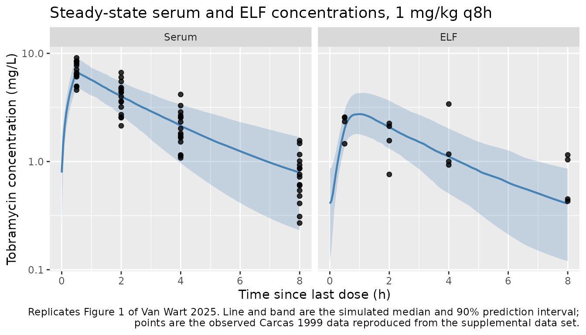
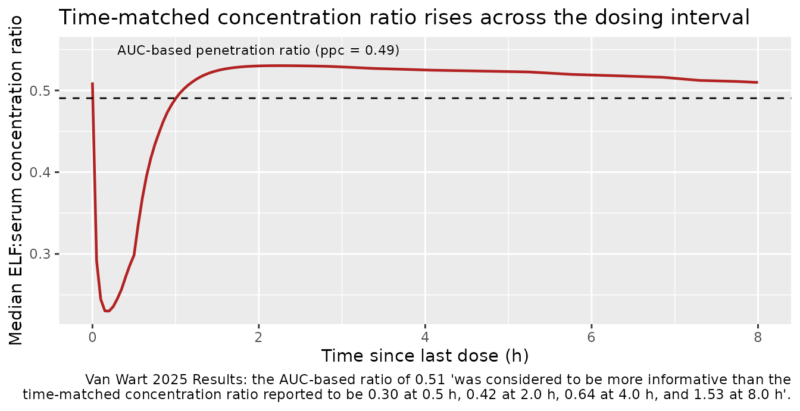

# Tobramycin serum and ELF (Van Wart 2025)

## Model and source

``` r

ui <- rxode2::rxode(readModelDb("VanWart_2025_tobramycin"))
#> ℹ parameter labels from comments will be replaced by 'label()'
```

- Citation: Van Wart SA, Trang M, Safir MC, Santulli AR, Rubino CM,
  Bhavnani SM. Population pharmacokinetic analysis of tobramycin in
  serum and ELF using data from patients with pneumonia. Antimicrob
  Agents Chemother. 2025;69(5):e0090824. <doi:10.1128/aac.00908-24>.
  Parameter estimates are from Table 1; the structural equations, the
  creatinine clearance derivation, and the residual-error structure are
  from the NONMEM control stream printed on page 5 of the supplemental
  material (aac.00908-24-s0001.pdf). The underlying serum and ELF
  concentration data were published by Carcas AJ, Garcia-Satue JL,
  Zapater P, Frias-Iniesta J. Tobramycin penetration into epithelial
  lining fluid of patients with pneumonia. Clin Pharmacol Ther.
  1999;65(3):245-250. <doi:10.1016/S0009-9236(99)70103-7>.
- Description: Two-compartment population PK model for tobramycin in
  serum with zero-order intravenous input, first-order elimination, and
  a linked epithelial-lining-fluid (ELF) effect compartment, developed
  on time-matched steady-state serum and urea-corrected ELF
  (bronchoalveolar-lavage) concentrations from 16 adult patients with
  pneumonia originally published by Carcas 1999 (Van Wart 2025). The ELF
  compartment is driven by the serum concentration and does not remove
  drug from the central compartment, so it is a partitioned effect
  compartment rather than a distribution compartment: the
  pseudo-partition coefficient ppc = k13 / k30 = 0.49 sets the
  steady-state ELF:serum ratio and the equilibration rate ke0 = k30
  gives an equilibration half-life of about 12 minutes.
  Body-surface-area-normalised creatinine clearance, computed inside the
  model from weight, height, age, sex, and serum creatinine, acts on
  clearance as a power function referenced to 90 mL/min/1.73 m2. Central
  and peripheral volumes were constrained equal during fitting (Vss 20.8
  L).
- Article: <https://doi.org/10.1128/aac.00908-24>
- Supplement (structural model diagram, goodness-of-fit plots, NONMEM
  control stream, and the complete analysis data set):
  <https://europepmc.org/article/MED/40227040#supplementary-material>

Van Wart 2025 is a re-analysis of the tobramycin serum and epithelial
lining fluid (ELF) data published by Carcas 1999. Its purpose is to
quantify the steady-state ELF penetration ratio for an aminoglycoside
using time-staggered bronchoalveolar-lavage (BAL) sampling, so that the
ELF exposure can be carried into later pharmacokinetic-pharmacodynamic
target-attainment work.

Structurally the model is a two-compartment serum PK model with
zero-order intravenous input and first-order elimination, plus a third
compartment for ELF that is *driven by* the serum concentration but
returns nothing to it. In the paper’s own words, the model “used serum
drug concentrations to drive appearance in and subsequent removal of
drug from the ELF without impacting the serum PK data fitting”. That
makes it a partitioned effect compartment rather than a distribution
compartment, and it is encoded here in the canonical `ke0` / `ppc` form.

## Population

The model was fit to 16 adult patients with pneumonia who underwent
bronchoscopy with BAL. Each patient received tobramycin as a 30-minute
intravenous infusion every 8 hours, nominally 1 mg/kg with dose
adjustment as needed to reach peak and trough concentrations of
approximately 8 and \< 2 mg/L; bronchoscopy was performed at least 2
days after any adjustment, so serum concentrations were at steady state.
Serum concentrations were measured at 0.5, 2, 4, and 8 hours after the
previous dose, and a single urea-corrected ELF concentration was
collected per patient at one of those four times (four patients per time
point). Demographics span 23-72 years (median 43 years) and 50-84 kg
(median 68 kg), with 31.2% female; the complete 16-subject analysis data
set is printed on pages 7-9 of the supplemental material and is
reproduced below.

``` r

str(ui$population)
#> List of 13
#>  $ species       : chr "human"
#>  $ n_subjects    : int 16
#>  $ n_studies     : int 1
#>  $ age_range     : chr "23-72 years (median 43 years)"
#>  $ weight_range  : chr "50-84 kg (median 68 kg)"
#>  $ height_range  : chr "147-190 cm"
#>  $ sex_female_pct: num 31.2
#>  $ disease_state : chr "Adults with pneumonia undergoing bronchoscopy with bronchoalveolar lavage."
#>  $ renal_function: chr "Serum creatinine 0.6-1.2 mg/dL. Derived creatinine clearance spans roughly 60-160 mL/min/1.73 m^2 using the con"| __truncated__
#>  $ dose_range    : chr "1 mg/kg tobramycin as a 30-minute IV infusion every 8 h, with dose adjustment as needed to reach peak and troug"| __truncated__
#>  $ regions       : chr "Spain (the source clinical study of Carcas 1999)."
#>  $ n_observations: chr "63 serum concentrations and 16 urea-corrected ELF concentrations (1 per patient, 4 patients at each of 0.5, 2, "| __truncated__
#>  $ notes         : chr "Van Wart 2025 is a re-analysis: it fits a population PK model to individual dosing, demographic, renal-function"| __truncated__
```

``` r

# The published 16-subject NONMEM analysis data set (supplemental material,
# pages 7-9). Covariates are one row per subject.
subjects <- tibble::tribble(
  ~id, ~WT, ~AGE, ~SEXF, ~HT, ~CREAT,
   1L,  73,   72,    0,  164,   0.9,
   2L,  68,   49,    0,  148,   1.0,
   3L,  68,   36,    0,  190,   1.0,
   4L,  50,   34,    1,  157,   1.0,
   5L,  71,   28,    1,  159,   0.9,
   6L,  67,   44,    1,  159,   0.6,
   7L,  65,   48,    0,  158,   1.1,
   8L,  84,   56,    1,  147,   0.6,
   9L,  77,   25,    0,  176,   1.2,
  10L,  60,   45,    1,  159,   0.7,
  11L,  62,   39,    0,  156,   1.0,
  12L,  68,   47,    0,  168,   1.0,
  13L,  59,   23,    0,  172,   0.9,
  14L,  70,   67,    0,  168,   0.7,
  15L,  67,   41,    0,  163,   0.9,
  16L,  69,   42,    0,  169,   1.1
)

# Observed steady-state concentrations, by time since last dose (TSLD).
# matrix = "Serum" for CMT 1 records and "ELF" for CMT 3 records.
observed <- tibble::tribble(
  ~id, ~tsld, ~matrix, ~dv,
   1L, 0.5, "Serum", 6.08,  1L, 2.0, "Serum", 4.57,  1L, 4.0, "Serum", 2.87,
   1L, 8.0, "Serum", 1.47,  1L, 4.0, "ELF",   3.40,
   2L, 0.5, "Serum", 8.37,  2L, 2.0, "Serum", 6.00,  2L, 4.0, "Serum", 3.29,
   2L, 8.0, "Serum", 1.16,  2L, 0.5, "ELF",   2.54,
   3L, 0.5, "Serum", 9.09,  3L, 2.0, "Serum", 4.72,  3L, 4.0, "Serum", 2.67,
   3L, 8.0, "Serum", 1.01,  3L, 0.5, "ELF",   2.57,
   4L, 0.5, "Serum", 6.42,  4L, 2.0, "Serum", 4.37,  4L, 4.0, "Serum", 2.54,
   4L, 8.0, "Serum", 0.87,  4L, 4.0, "ELF",   0.93,
   5L, 0.5, "Serum", 4.58,  5L, 2.0, "Serum", 2.57,  5L, 4.0, "Serum", 1.13,
   5L, 8.0, "Serum", 0.27,  5L, 8.0, "ELF",   0.43,
                            6L, 2.0, "Serum", 2.54,  6L, 4.0, "Serum", 1.15,
   6L, 8.0, "Serum", 0.31,  6L, 0.5, "ELF",   1.46,
   7L, 0.5, "Serum", 6.18,  7L, 2.0, "Serum", 4.36,  7L, 4.0, "Serum", 1.69,
   7L, 8.0, "Serum", 0.54,  7L, 2.0, "ELF",   2.25,
   8L, 0.5, "Serum", 7.09,  8L, 2.0, "Serum", 4.83,  8L, 4.0, "Serum", 2.32,
   8L, 8.0, "Serum", 0.61,  8L, 0.5, "ELF",   2.34,
   9L, 0.5, "Serum", 7.74,  9L, 2.0, "Serum", 5.49,  9L, 4.0, "Serum", 4.17,
   9L, 8.0, "Serum", 0.86,  9L, 2.0, "ELF",   1.56,
  10L, 0.5, "Serum", 8.47, 10L, 2.0, "Serum", 6.64, 10L, 4.0, "Serum", 2.57,
  10L, 8.0, "Serum", 1.56, 10L, 4.0, "ELF",   1.17,
  11L, 0.5, "Serum", 8.50, 11L, 2.0, "Serum", 3.98, 11L, 4.0, "Serum", 1.76,
  11L, 8.0, "Serum", 0.60, 11L, 8.0, "ELF",   0.45,
  12L, 0.5, "Serum", 8.07, 12L, 2.0, "Serum", 3.61, 12L, 4.0, "Serum", 1.82,
  12L, 8.0, "Serum", 0.48, 12L, 4.0, "ELF",   1.00,
  13L, 0.5, "Serum", 4.92, 13L, 2.0, "Serum", 2.14, 13L, 4.0, "Serum", 1.08,
  13L, 8.0, "Serum", 0.93, 13L, 8.0, "ELF",   1.15,
  14L, 0.5, "Serum", 6.63, 14L, 2.0, "Serum", 3.56, 14L, 4.0, "Serum", 2.02,
  14L, 8.0, "Serum", 0.72, 14L, 2.0, "ELF",   2.12,
  15L, 0.5, "Serum", 6.39, 15L, 2.0, "Serum", 2.71, 15L, 4.0, "Serum", 1.52,
  15L, 8.0, "Serum", 0.76, 15L, 2.0, "ELF",   0.76,
  16L, 0.5, "Serum", 4.96, 16L, 2.0, "Serum", 3.19, 16L, 4.0, "Serum", 1.66,
  16L, 8.0, "Serum", 0.41, 16L, 8.0, "ELF",   1.04
)

# Subject 6 has no 0.5 h serum sample in the published data set.
stopifnot(sum(observed$matrix == "Serum") == 63L,
          sum(observed$matrix == "ELF") == 16L)
observed %>% count(matrix, tsld) %>% tidyr::pivot_wider(names_from = matrix, values_from = n)
#> # A tibble: 4 × 3
#>    tsld   ELF Serum
#>   <dbl> <int> <int>
#> 1   0.5     4    15
#> 2   2       4    16
#> 3   4       4    16
#> 4   8       4    16
```

The renal-function covariate is derived inside the model rather than
supplied as a column, so the derived creatinine clearance of the
analysis population is worth stating explicitly.

``` r

subjects %>%
  mutate(
    BSA = 0.0235 * WT^0.51456 * HT^0.42246,
    CRCL = (140 - AGE) * WT / (72 * CREAT) *
      ((1 - SEXF) * (1.73 / BSA) + SEXF * 0.85)
  ) %>%
  summarise(
    `Min CRCL` = min(CRCL), `Median CRCL` = median(CRCL), `Max CRCL` = max(CRCL)
  ) %>%
  knitr::kable(digits = 1, caption = "Derived creatinine clearance (mL/min/1.73 m^2) of the 16 analysis subjects.")
```

| Min CRCL | Median CRCL | Max CRCL |
|---------:|------------:|---------:|
|     62.6 |        90.8 |    138.8 |

Derived creatinine clearance (mL/min/1.73 m^2) of the 16 analysis
subjects. {.table}

## Source trace

Every `ini()` entry in
`inst/modeldb/specificDrugs/VanWart_2025_tobramycin.R` carries an
in-file comment naming its source. They are collected here for review.

| Equation / parameter | Value | Source location |
|----|----|----|
| `lcl` | 3.26 L/h | Table 1, “CL (L/h) for a typical 90 mL/min/1.73m2 patient” (%RSE 6.41); control stream `THETA(1)` |
| `e_crcl_cl` | 0.685 | Table 1, “CL-CLcr exponent” (%RSE 31.0); control stream `THETA(6)` |
| `lvc` | 10.4 L | Table 1, “Vc (L)” (%RSE 7.03); control stream `THETA(2)` |
| `lq` | 0.518 L/h | Table 1, “CLd (L/h)” (%RSE 25.8); control stream `THETA(3)` |
| `vp` (derived from `lvc`) | 10.4 L | Table 1, “Vp (L)” and footnote b (“Vc and Vp were constrained to have the same value”); control stream `VP = TVVC` |
| `lke0` | 3.69 1/h | Table 1, “k30 (h-1)” (%RSE 38.9); control stream `THETA(5)` |
| `lppc` | 1.81 / 3.69 = 0.4905 | Table 1, “k13 (h-1)” = 1.81 (%RSE 23.1) and “k30 (h-1)” = 3.69; control stream `THETA(4)` / `THETA(5)` |
| `etalcl`, `etalvc`, `etalke0` | 0.0488 each | Table 1, omega^2 CL / Vc / k30 = 0.0488 (22.4% CV, %RSE 31.6) and footnote c (constrained equal); control stream `$OMEGA BLOCK(1)` + two `SAME` |
| `propSd` | sqrt(0.0299) = 0.173 | Table 1, “sigma^2 CCV for serum data” = 0.0299 (17.3% CV, %RSE 36.3) |
| `addSd_Celf` | sqrt(0.264) = 0.514 | Table 1, “sigma^2 Additive for ELF data” = 0.264 (0.514 SD, %RSE 61.6) |
| `d/dt(central)`, `d/dt(peripheral1)` | n/a | Supplement page 5, `$DES`: `DADT(1) = K21*A(2) - K12*A(1) - K10*A(1)`, `DADT(2) = K12*A(1) - K21*A(2)` |
| `d/dt(elf)` | n/a | Supplement page 5, `$DES`: `DADT(3) = K13*A(1) - K30*A(3)` with `S3 = VC`, i.e. `dCelf/dt = k13*Cc - k30*Celf` |
| `crcl` derivation | n/a | Supplement page 5, `$PK`: Gehan and George BSA plus the two sex-specific Cockcroft-Gault branches |
| Residual-error split | n/a | Supplement page 5, `$ERROR`: `Y = F + F*EPS(1)*(1-FLGELF) + EPS(2)*FLGELF` |

### Reparameterisation of the ELF compartment

The control stream estimates `k13` (central to ELF) and `k30` (out of
ELF). Dividing the ELF `$DES` line by the ELF scaling `S3 = VC` gives an
ODE in concentration units,

``` math
\frac{d C_{ELF}}{dt} = k_{13}\,C_c - k_{30}\,C_{ELF}
  = k_{e0}\left(ppc \cdot C_c - C_{ELF}\right),
```

with `ke0` = `k30` and `ppc` = `k13 / k30`. Those are the canonical
nlmixr2lib names for a partitioned effect compartment, so the model file
uses them. Two independent numbers in the paper confirm the mapping.

``` r

k13 <- 1.81
k30 <- 3.69
ppc_tv <- k13 / k30
c(`ppc = k13/k30` = ppc_tv,
  `paper median penetration ratio (Table 2)` = 0.49,
  `equilibration half-life (min) = log(2)/k30` = log(2) / k30 * 60,
  `paper equilibrium half-life (min, Results text)` = 12)
#>                                   ppc = k13/k30 
#>                                       0.4905149 
#>        paper median penetration ratio (Table 2) 
#>                                       0.4900000 
#>      equilibration half-life (min) = log(2)/k30 
#>                                      11.2706859 
#> paper equilibrium half-life (min, Results text) 
#>                                      12.0000000
```

`k13` is a fixed effect in `$PK` while `k30` carries `ETA(3)`. Because
`k13 = ke0 * ppc`, the model file writes `ppc <- exp(lppc - etalke0)` so
that `ke0 * ppc` is eta-free for every subject and the individual
penetration ratio `ppc_i = k13 / k30_i` varies as `exp(-etalke0)`. This
is what generates the between-patient spread in the ELF:serum ratio that
Table 2 reports.

## Virtual cohort

The original serum and ELF observations *are* available (they are
printed in the supplement and reproduced above), so the figures below
overlay them directly. The simulated cohort follows the paper’s own
simulation design: patients are bootstrapped from the 16
model-development subjects and given 1 mg/kg tobramycin as a 30-minute
IV infusion every 8 hours for 14 days. The paper simulated 1,000
patients; this vignette uses 200, the nlmixr2lib per-arm cap.

``` r

set.seed(20250414)

n_sim <- 200L
tau <- 8            # dosing interval (h)
n_dose <- 42L       # 14 days of q8h dosing
t_last <- (n_dose - 1L) * tau   # time of the final dose

cohort <- subjects[sample.int(nrow(subjects), n_sim, replace = TRUE), ]
cohort$id <- seq_len(n_sim)
cohort$amt_mg <- 1 * cohort$WT          # 1 mg/kg
cohort$rate_mgh <- cohort$amt_mg * 2    # 30-minute infusion

# Route A of the multi-output event-table convention: cmt names a real ODE
# state and dvid names the endpoint. A plain data.frame is required -- et()
# does not carry dvid through.
doses <- cohort %>%
  tidyr::crossing(time = seq(0, t_last, by = tau)) %>%
  mutate(amt = amt_mg, rate = rate_mgh, evid = 1L,
         cmt = "central", dvid = NA_integer_)

obs <- cohort %>%
  tidyr::crossing(time = t_last + seq(0, tau, by = 0.05)) %>%
  mutate(amt = NA_real_, rate = NA_real_, evid = 0L,
         cmt = "central", dvid = 1L)

events <- bind_rows(doses, obs) %>%
  arrange(id, time, desc(evid)) %>%
  select(id, time, amt, rate, evid, cmt, dvid, WT, AGE, SEXF, HT, CREAT)

stopifnot(!anyDuplicated(events[, c("id", "time", "evid")]))
```

## Simulation

``` r

mod <- readModelDb("VanWart_2025_tobramycin")

# useLinCmt = FALSE: the automatic ODE-to-linCmt conversion corrupts the
# dvid -> cmt mapping for multi-output models.
sim <- rxode2::rxSolve(mod, events = events, keep = c("WT"),
                       useLinCmt = FALSE, addDosing = FALSE,
                       returnType = "data.frame")
#> ℹ parameter labels from comments will be replaced by 'label()'

# rxSolve can silently drop subjects; assert the count.
stopifnot(length(unique(sim$id)) == n_sim)

# Cc / Celf are the individual predictions (no residual error); `sim` is the
# column that carries it. Profile figures and NCA use the predictions.
stopifnot(isTRUE(all.equal(sim$Cc, sim$ipredSim)))

sim <- sim %>% mutate(tsld = time - t_last)
```

## Replicate published figures

### Figure 1 – visual predictive check, serum (A) and ELF (B)

Figure 1 of Van Wart 2025 plots the observed steady-state serum and ELF
concentrations against the median and 90% prediction interval of the
simulations. The observed points below are the published Carcas 1999
data.

``` r

pi_bands <- sim %>%
  select(id, tsld, Serum = Cc, ELF = Celf) %>%
  tidyr::pivot_longer(c(Serum, ELF), names_to = "matrix", values_to = "conc") %>%
  group_by(matrix, tsld) %>%
  summarise(
    Q05 = quantile(conc, 0.05), Q50 = median(conc), Q95 = quantile(conc, 0.95),
    .groups = "drop"
  ) %>%
  mutate(matrix = factor(matrix, levels = c("Serum", "ELF")))

ggplot(pi_bands, aes(tsld, Q50)) +
  geom_ribbon(aes(ymin = Q05, ymax = Q95), alpha = 0.25, fill = "steelblue") +
  geom_line(colour = "steelblue", linewidth = 0.8) +
  geom_point(
    data = observed %>%
      mutate(matrix = factor(matrix, levels = c("Serum", "ELF"))),
    aes(tsld, dv), inherit.aes = FALSE, size = 1.6, alpha = 0.8
  ) +
  facet_wrap(~matrix) +
  scale_y_log10() +
  labs(
    x = "Time since last dose (h)", y = "Tobramycin concentration (mg/L)",
    title = "Steady-state serum and ELF concentrations, 1 mg/kg q8h",
    caption = paste(
      "Replicates Figure 1 of Van Wart 2025. Line and band are the simulated",
      "median and 90% prediction interval;\npoints are the observed Carcas 1999",
      "data reproduced from the supplemental data set."
    )
  )
```



The ELF panel shows the hysteresis the paper describes: the ELF profile
peaks about 30 minutes after the serum peak and its terminal decline is
shallower, so the time-matched ELF:serum concentration ratio rises
across the dosing interval even though the AUC-based ratio is a single
number.

``` r

sim %>%
  group_by(tsld) %>%
  summarise(ratio = median(Celf / Cc), .groups = "drop") %>%
  ggplot(aes(tsld, ratio)) +
  geom_line(colour = "firebrick", linewidth = 0.8) +
  geom_hline(yintercept = ppc_tv, linetype = "dashed") +
  annotate("text", x = 0.3, y = ppc_tv * 1.12, hjust = 0,
           label = "AUC-based penetration ratio (ppc = 0.49)", size = 3) +
  labs(
    x = "Time since last dose (h)", y = "Median ELF:serum concentration ratio",
    title = "Time-matched concentration ratio rises across the dosing interval",
    caption = paste(
      "Van Wart 2025 Results: the AUC-based ratio of 0.51 'was considered to be",
      "more informative than the\ntime-matched concentration ratio reported to be",
      "0.30 at 0.5 h, 0.42 at 2.0 h, 0.64 at 4.0 h, and 1.53 at 8.0 h'."
    )
  )
```



## Structural identity: the AUC penetration ratio is exactly `ppc`

At steady state the ELF concentration returns to its starting value over
one dosing interval, so integrating the ELF ODE across the interval
gives `0 = ke0 * (ppc * AUC_serum - AUC_ELF)`, i.e. the AUC-based
penetration ratio equals `ppc` **exactly**, for every subject,
independent of `ke0`, dose, weight, and renal function. That makes it a
hard identity rather than an approximation, and it is the tightest
available check on the ELF half of the model.

``` r

auc_by_subject <- sim %>%
  arrange(id, tsld) %>%
  group_by(id) %>%
  summarise(
    auc_serum = sum(diff(tsld) * (head(Cc, -1) + tail(Cc, -1)) / 2),
    auc_elf   = sum(diff(tsld) * (head(Celf, -1) + tail(Celf, -1)) / 2),
    ppc_i     = median(ppc),
    .groups = "drop"
  ) %>%
  mutate(ratio = auc_elf / auc_serum)

# The trapezoid on a 0.05 h grid is the only source of error here.
max_rel_err <- max(abs(auc_by_subject$ratio - auc_by_subject$ppc_i) /
                     auc_by_subject$ppc_i)
stopifnot(max_rel_err < 1e-3)
c(`max relative deviation of AUC ratio from ppc_i` = max_rel_err)
#> max relative deviation of AUC ratio from ppc_i 
#>                                   2.974633e-07
```

Because `ppc_i = ppc * exp(-etalke0)` with `omega^2 = 0.0488`, the
penetration ratio is exactly log-normal, and its moments are available
in closed form. They match Table 2 without any simulation at all.

``` r

omega2 <- 0.0488
analytic <- c(
  Mean   = ppc_tv * exp(omega2 / 2),
  SD     = ppc_tv * exp(omega2 / 2) * sqrt(exp(omega2) - 1),
  Median = ppc_tv
)
tibble::tibble(
  Statistic = names(analytic),
  `Closed form` = as.numeric(analytic),
  `Simulated (n = 200)` = c(mean(auc_by_subject$ratio),
                            sd(auc_by_subject$ratio),
                            median(auc_by_subject$ratio)),
  `Van Wart 2025 Table 2` = c(0.51, 0.12, 0.49)
) %>%
  knitr::kable(digits = 3,
               caption = "ELF:serum AUC0-8 penetration ratio: closed form, simulation, and published values.")
```

| Statistic | Closed form | Simulated (n = 200) | Van Wart 2025 Table 2 |
|:----------|------------:|--------------------:|----------------------:|
| Mean      |       0.503 |               0.498 |                  0.51 |
| SD        |       0.112 |               0.113 |                  0.12 |
| Median    |       0.491 |               0.484 |                  0.49 |

ELF:serum AUC0-8 penetration ratio: closed form, simulation, and
published values. {.table}

## PKNCA validation

NCA is computed over the final steady-state dosing interval, with time
re-zeroed at the last dose so that Tmax is directly comparable to Table
2. Serum and ELF are stacked into one concentration frame with a
`matrix` grouping variable, which keeps both outputs in a single
comparison table.

``` r

nca_conc <- sim %>%
  select(id, tsld, Serum = Cc, ELF = Celf) %>%
  tidyr::pivot_longer(c(Serum, ELF), names_to = "matrix", values_to = "Cc") %>%
  filter(!is.na(Cc)) %>%
  rename(time = tsld)

# Guarantee a time-zero record per (matrix, id); the simulation grid already
# starts at the dose time, so this only de-duplicates.
nca_conc <- nca_conc %>%
  distinct(matrix, id, time, .keep_all = TRUE) %>%
  arrange(matrix, id, time)
stopifnot(all(nca_conc %>% count(matrix, id) %>% pull(n) == length(seq(0, tau, by = 0.05))))

nca_dose <- cohort %>%
  select(id, amt = amt_mg) %>%
  tidyr::crossing(matrix = c("Serum", "ELF")) %>%
  mutate(time = 0)

conc_obj <- PKNCA::PKNCAconc(nca_conc, Cc ~ time | matrix + id,
                             concu = "mg/L", timeu = "h")
dose_obj <- PKNCA::PKNCAdose(nca_dose, amt ~ time | matrix + id, doseu = "mg")

intervals <- data.frame(
  start = 0, end = tau,
  cmax = TRUE, tmax = TRUE, cmin = TRUE, auclast = TRUE, cav = TRUE
)

nca_res <- PKNCA::pk.nca(
  PKNCA::PKNCAdata(conc_obj, dose_obj, intervals = intervals)
)
```

### Comparison against published NCA

Table 2 of Van Wart 2025 reports mean, SD, median, and range for the
simulated steady-state metrics.
[`ncaComparisonTable()`](https://nlmixr2.github.io/nlmixr2lib/reference/ncaComparisonTable.md)
aggregates the simulated per-subject values with the median, so the
published **medians** are used as the reference.

``` r

published <- tibble::tribble(
  ~matrix, ~PPTESTCD,  ~PPORRES,
  "Serum", "cmax",         6.56,
  "Serum", "auclast",     20.0,
  "ELF",   "cmax",         2.70,
  "ELF",   "tmax",         1.0,
  "ELF",   "auclast",      9.75
)

cmp <- nlmixr2lib::ncaComparisonTable(
  simulated = nca_res,
  reference = published,
  by        = "matrix",
  units     = c(cmax = "mg/L", auclast = "mg*h/L", tmax = "h"),
  tolerance_pct = 20
)

knitr::kable(
  cmp,
  caption = paste(
    "Simulated (n = 200) vs. published (n = 1,000) steady-state NCA,",
    "Van Wart 2025 Table 2 medians. * differs from reference by > 20%."
  ),
  align = c("l", "l", "r", "r", "r")
)
```

| NCA parameter     | matrix | Reference | Simulated | % diff |
|:------------------|:-------|----------:|----------:|-------:|
| Cmax (mg/L)       | Serum  |      6.56 |      6.78 |  +3.4% |
| Cmax (mg/L)       | ELF    |       2.7 |      2.76 |  +2.1% |
| Tmax (h)          | ELF    |         1 |      0.95 |  -5.0% |
| AUClast (mg\*h/L) | Serum  |        20 |      21.1 |  +5.6% |
| AUClast (mg\*h/L) | ELF    |      9.75 |      10.1 |  +3.4% |

Simulated (n = 200) vs. published (n = 1,000) steady-state NCA, Van Wart
2025 Table 2 medians. \* differs from reference by \> 20%. {.table}

``` r

attr(cmp, "footnote")
#> NULL
```

Table 2 also reports dispersion, which the comparison table above does
not carry. The full side-by-side is worth showing because one row does
not agree.

``` r

sim_stats <- nca_res$result %>%
  filter(PPTESTCD %in% c("cmax", "tmax", "auclast")) %>%
  group_by(matrix, PPTESTCD) %>%
  summarise(Mean = mean(PPORRES), SD = sd(PPORRES),
            Median = median(PPORRES), .groups = "drop")

published_stats <- tibble::tribble(
  ~matrix, ~PPTESTCD,  ~`Mean (paper)`, ~`SD (paper)`, ~`Median (paper)`,
  "Serum", "cmax",       6.60,  0.76,  6.56,
  "ELF",   "cmax",       2.79,  0.65,  2.70,
  "ELF",   "tmax",       1.0,   0.1,   1.0,
  "Serum", "auclast",   20.5,   5.2,  20.0,
  "ELF",   "auclast",   10.3,   3.5,   9.75
)

published_stats %>%
  left_join(sim_stats, by = c("matrix", "PPTESTCD")) %>%
  mutate(Metric = nlmixr2lib::ncaParamLabel(PPTESTCD)) %>%
  select(Matrix = matrix, Metric,
         `Mean (paper)`, `Mean (sim)` = Mean,
         `SD (paper)`, `SD (sim)` = SD,
         `Median (paper)`, `Median (sim)` = Median) %>%
  knitr::kable(digits = 2,
               caption = "Steady-state NCA dispersion: Van Wart 2025 Table 2 vs. this simulation.")
```

| Matrix | Metric | Mean (paper) | Mean (sim) | SD (paper) | SD (sim) | Median (paper) | Median (sim) |
|:---|:---|---:|---:|---:|---:|---:|---:|
| Serum | Cmax | 6.60 | 6.89 | 0.76 | 1.32 | 6.56 | 6.78 |
| ELF | Cmax | 2.79 | 2.89 | 0.65 | 0.77 | 2.70 | 2.76 |
| ELF | Tmax | 1.00 | 0.97 | 0.10 | 0.10 | 1.00 | 0.95 |
| Serum | AUClast | 20.50 | 21.35 | 5.20 | 5.17 | 20.00 | 21.13 |
| ELF | AUClast | 10.30 | 10.63 | 3.50 | 3.56 | 9.75 | 10.08 |

Steady-state NCA dispersion: Van Wart 2025 Table 2 vs. this simulation.
{.table}

Every central-tendency value agrees closely, and so does every
dispersion except one. The serum and ELF AUC0-8 SDs in particular land
almost exactly on the published values (5.17 vs. 5.20 and 3.56
vs. 3.50). The single discrepancy is the **dispersion of serum Cmax**:
the paper reports SD 0.76 on a mean of 6.60 (11.5% CV) whereas
simulating from the published OMEGA gives SD 1.32 on a mean of 6.89 (19%
CV). See the Errata below.

## Assumptions and deviations

- **Cohort size.** The paper simulated 1,000 bootstrapped patients; this
  vignette simulates 200 (the nlmixr2lib per-arm cap). Means, SDs, and
  medians are stable at that size, but the minimum and maximum in Table
  2 are extreme order statistics of an n = 1,000 sample and are
  therefore not compared.
- **Bootstrapping.** Covariates are resampled with replacement from the
  16 published analysis subjects, as the paper describes (“after
  bootstrapping from the population of model development patients”). New
  random effects are drawn from the published OMEGA for each simulated
  subject.
- **Dose.** 1 mg/kg, exactly as Table 2 specifies. The underlying
  clinical study adjusted doses to hit target peak and trough
  concentrations, and the published analysis data set reflects those
  adjusted doses; the simulation does not reproduce that adjustment
  because Table 2 does not.
- **Race and ethnicity** are not reported by Van Wart 2025 or Carcas
  1999 and are not used by the model.
- The residual error is not applied to the profile figures or to the
  NCA; `Cc` and `Celf` are individual predictions. The `sim` column
  returned by `rxSolve()` carries the residual error if it is needed.

## Errata and as-published quirks

- **The creatinine clearance formula is asymmetric between the sexes.**
  The supplemental `$PK` block computes, verbatim:

      BSA=0.0235*(WTKG**0.51456)*(HTCM**0.42246)     ; Gehan and George
      IF(SEXF.EQ.0) THEN
       CLCR = (140.0-AGE)*WTKG/(72.0*SCR)*(1.73/BSA) ; Males, in mL/min/1.73 m^2
      ELSE
       CLCR = ((140.0-AGE)*WTKG/(72.0*SCR))*0.85     ; Females, mL/min/1.73 m^2
      ENDIF

  The male branch normalises to 1.73 m^2 but applies no sex factor; the
  female branch applies the conventional 0.85 sex factor but is **not**
  BSA-normalised, even though its comment claims the same units. A
  conventional implementation would apply both to both sexes. The model
  file reproduces the code as published, because the reported fixed
  effects – in particular `lcl` and `e_crcl_cl` – were estimated
  conditional on exactly these values. Users who want a conventional
  CRCL should recompute `lcl` accordingly rather than editing the
  derivation in place.

- **Serum Cmax variability is lower in Table 2 than the published OMEGA
  implies.** Simulating from `omega^2(Vc) = 0.0488` (22.4% CV) plus the
  50-84 kg weight spread gives a serum Cmax CV near 19% (SD 1.32 / mean
  6.89), but Table 2 reports 11.5% (SD 0.76 / mean 6.60), with a range
  of 4.78-9.64 mg/L. Serum AUC0-8 dispersion matches almost exactly (SD
  5.17 simulated vs. 5.20 published) and both ELF metrics agree well, so
  this is specific to Cmax, the metric most sensitive to `Vc`. The most
  likely explanation is that the paper’s bootstrap resampled each
  development subject’s *empirical Bayes* parameters rather than drawing
  fresh etas: with only four serum samples per patient, all inside one
  dosing interval, `Vc` is weakly informed and its EBEs would be heavily
  shrunk toward the typical value. The paper does not state which was
  done, so this is not resolvable from the source. The model file
  encodes Table 1’s OMEGA as published; no value was tuned to close the
  gap.

- **`Vp` has no `ini()` entry.** Table 1 footnote b states that “Vc and
  Vp were constrained to have the same value during model fitting”, and
  the control stream implements it as `VP = TVVC` – the *typical*
  central volume, without `ETA(2)`. The model derives `vp <- exp(lvc)`
  so the constraint cannot be broken by re-estimating `lvc`, and so that
  `vp` correctly carries no IIV. The resulting Vss of 20.8 L (0.297 L/kg
  at 70 kg) is what the footnote reports.

- **The three IIV variances are constrained equal.** Table 1 footnote c
  states that the magnitude of IIV for CL, Vc, and k30 “was constrained
  to have the same estimated value during model fitting”, implemented as
  one `$OMEGA BLOCK(1)` followed by two `SAME` blocks – one shared
  variance, three independent etas, no covariances. nlmixr2 has no
  cross-omega equality constraint, so the value 0.0488 is written three
  times; re-estimating this model would free them.

- **Subject 6 has no 0.5 h serum sample.** The Results text states that
  “tobramycin concentrations in serum were measured for all patients at
  each of the four time points”, but the supplemental analysis data set
  contains 63 serum records, not 64: subject 6 has serum values only at
  2, 4, and 8 h. The data set is authoritative here.

- **The ELF compartment does not conserve mass with the central
  compartment.** `DADT(1)` contains no `-K13*A(1)` term, so drug
  appearing in ELF is not removed from serum. This is deliberate and is
  stated in the paper (“without impacting the serum PK data fitting”):
  the ELF compartment is a partitioned effect compartment used to read
  out a site-of-action exposure, not a physiologic distribution
  compartment. Do not interpret `ke0` and `ppc` as transfer clearances.
