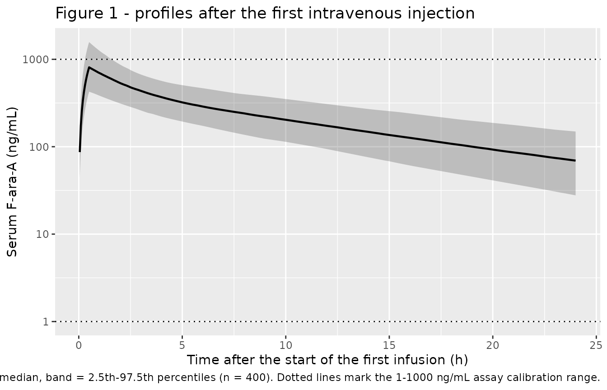
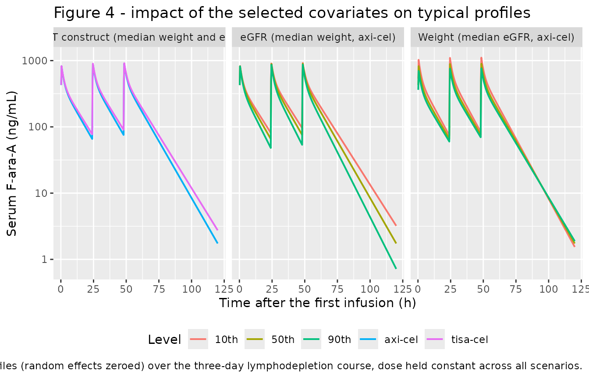

# Fludarabine (Varela-Gonzalez-Aller 2025)

## Model and source

- Citation: Varela-Gonzalez-Aller J, Sanchez-Salinas MA, Troconiz I,
  Iacoboni G, Alonso-Martinez C, Carreras-Soler MJ, Carpio C,
  Farriols-Danes A, Guerra-Gonzalez M, Rivas-Delgado A, Rivera Sanchez
  L, Feijoo S, Valdivia C, Barba P, Miarons M (2025). Towards
  Personalized Lymphodepletion: A Population Pharmacokinetic Fludarabine
  Model in Patients Receiving CAR T-Cell Therapy. Pharmaceutics
  17(12):1592. <doi:10.3390/pharmaceutics17121592>.
- Description: Three-compartment population PK model for intravenous
  fludarabine (measured as the circulating metabolite F-ara-A) given as
  lymphodepleting chemotherapy before CD19-directed CAR T-cell therapy
  in adults with relapsed/refractory large B-cell lymphoma
  (Varela-Gonzalez-Aller 2025; n = 56 patients, 348 serum samples from
  168 infusions). First-order elimination from the central compartment.
  Clearance is split into an additive non-renal plus renal pair of arms:
  the non-renal arm depends on which CAR T-cell product the patient was
  scheduled to receive (4.4 L/h axi-cel vs 3.9 L/h tisa-cel) and the
  renal arm scales linearly with creatinine clearance normalized to the
  96 mL/min cohort median (1.7 L/h at the median). Allometric
  body-weight scaling is fixed at 0.75 on all three clearance arms and 1
  on all three volumes, with a 70 kg reference. Correlated
  inter-individual variability on CL and V1 (rho = 0.9); log-normal
  residual error. No exposure-response layer was reported, so only the
  population PK model is encoded here.
- Article: [Pharmaceutics
  2025;17(12):1592](https://doi.org/10.3390/pharmaceutics17121592)
- Supplement: [Figure S1 (eta
  distributions)](https://www.mdpi.com/article/10.3390/pharmaceutics17121592/s1)

This is the first population PK model of fludarabine developed
exclusively in patients receiving CAR T-cell therapy. Fludarabine is
given as the monophosphate prodrug F-ara-AMP but circulates and is
assayed as the dephosphorylated metabolite F-ara-A, so **every amount in
this vignette is an F-ara-A equivalent**: the administered F-ara-AMP
dose multiplied by the 0.78 molecular-weight ratio the authors used
(Methods 2.1.1).

## Population

Fifty-six adults with relapsed/refractory large B-cell lymphoma were
enrolled prospectively at a single Spanish tertiary centre (Hospital
Universitari Vall d’Hebron, Barcelona) between January 2021 and July
2022; 60 were enrolled and 4 excluded for not completing the fludarabine
regimen per protocol. Thirty-three (59%) were male and the median age
was 59 years (range 23-82). Mean weight was 79.6 kg (SD 12.9; median
82.5, range 52-101) and mean body mass index 25.2 kg/m^2 (SD 3.5; median
25.3, range 18.0-36.2), with obesity documented in two patients. Renal
function (Cockcroft-Gault, labelled eGFR in Table 1) averaged 90 mL/min
with a range of 39.0-213.9; the cohort median of 96 mL/min is the
normalizing constant in the model’s renal clearance arm. Thirty-eight
(68%) patients were scheduled for axicabtagene ciloleucel and 18 (32%)
for tisagenlecleucel. Histology was diffuse large B-cell lymphoma in 30
(54%), transformed indolent lymphoma in 20 (36%), high-grade B-cell
lymphoma in 3 (5%) and other in 3 (5%); 21 (37%) had a prior stem-cell
transplant and 11 (20%) had received three or more prior lines. Baseline
characteristics are Table 1 of the source.

Lymphodepletion was a 30-minute intravenous fludarabine infusion on days
-5, -4 and -3 before cell infusion: 30 mg/m^2 with 500 mg/m^2
cyclophosphamide for axi-cel recipients (cumulative 90 mg/m^2) and 25
mg/m^2 with 250 mg/m^2 cyclophosphamide for tisa-cel recipients
(cumulative 75 mg/m^2). Six patients received protocol dose reductions
for renal impairment (25% for eGFR 45-60 mL/min, 40% for 30-45 mL/min).
Of 400 samples drawn across 168 administrations, 348 entered model
development (99 at 1.5 h, 97 at 2 h, 94 at 24 h, 51 taken 30 min before
cell infusion, and only 7 at 7 h), a median of 6 per patient. Serum
F-ara-A was assayed by UPLC-MS/MS over a 1-1000 ng/mL calibration range
(LLOQ 1 ng/mL).

The same information is available programmatically via the model’s
`population` metadata:

``` r

pop <- readModelDb("VarelaGonzalezAller_2025_fludarabine")()$population
str(pop, max.level = 1)
#> List of 14
#>  $ species       : chr "human"
#>  $ n_subjects    : int 56
#>  $ n_studies     : int 1
#>  $ age_range     : chr "23 to 82 years"
#>  $ age_median    : chr "59 years"
#>  $ weight_range  : chr "52 to 101 kg"
#>  $ weight_median : chr "82.5 kg (mean 79.6 +/- 12.9)"
#>  $ sex_female_pct: num 41.1
#>  $ race_ethnicity: NULL
#>  $ disease_state : chr "Relapsed/refractory large B-cell lymphoma (LBCL) after two or more lines of systemic therapy: diffuse large B-c"| __truncated__
#>  $ renal_function: chr "Cockcroft-Gault renal function (labelled eGFR in Table 1) mean 90, range 39.0-213.9 mL/min; cohort median 96 mL"| __truncated__
#>  $ dose_range    : chr "Fludarabine phosphate as a 30-minute intravenous infusion on days -5, -4 and -3 before CAR T-cell infusion, com"| __truncated__
#>  $ regions       : chr "Spain (single centre: Hospital Universitari Vall d'Hebron, Barcelona)."
#>  $ notes         : chr "Prospective, observational, single-centre study conducted January 2021 to July 2022. Sixty patients enrolled, 5"| __truncated__
```

## Source trace

The per-parameter origin is recorded as an in-file comment next to each
`ini()` entry in
`inst/modeldb/specificDrugs/VarelaGonzalezAller_2025_fludarabine.R`. The
table below collects them in one place for review. Table 2 of the source
carries the parameter estimates; the covariate model is the unnumbered
equation block printed immediately above Table 2 on page 9.

| Equation / parameter | Value | Source location |
|----|----|----|
| `CL = [CL_non-renal + CL_renal] * f(WGT)` | n/a | Equation block above Table 2, p. 9; Table 2 `CL` Description column |
| `lcl_nonren` (axi-cel non-renal arm) | 4.4 L/h (RSE 1.2%) | Table 2, `CL` row, `theta_CART=1` |
| `e_tisacel_cl_nonren` | 3.9 / 4.4 = 0.8864 | Table 2, `CL` row, `theta_CART=2` = 3.9 (RSE 0.9%) |
| `lcl_renal` (renal arm at CRCL 96) | 1.7 L/h (RSE 1.0%) | Table 2, `CL` row, `theta_CRCL`; `CL_renal = theta_CRCL * CRCL/96` |
| `lvc` (V1) | 41.2 L (RSE 9.3%) | Table 2, `V1` row, `theta_V1` |
| `lvp` (V2, shallow) | 14.5 L (RSE 14.0%) | Table 2, `V2` row, `theta_V2` |
| `lvp2` (V3, deep) | 10.8 L (RSE 3.0%) | Table 2, `V3` row, `theta_V3` |
| `lq` (CLD2) | 4.8 L/h (RSE 5.3%) | Table 2, `CLD2` row, `theta_CLD2` |
| `lq2` (CLD3) | 3.6 L/h (RSE 0.1%) | Table 2, `CLD3` row, `theta_CLD3` |
| `e_wt_cl_q` | 0.75, fixed | Table 2 footnote `f(WGT) = (WGT/70)^3/4` |
| `e_wt_vc_vp` | 1.0, fixed | Table 2 footnote `g(WGT) = WGT/70` |
| `etalcl` variance | 0.0851 (from 29.8% CV) | Table 2 `IIV on CL (%)` = 29.8 (RSE 25.1, shrinkage 8.9) |
| `etalvc` variance | 0.1143 (from 34.8% CV) | Table 2 `IIV on V1 (%)` = 34.8 (RSE 3.6, shrinkage 18.3) |
| `etalcl`-`etalvc` covariance | 0.0888 (rho = 0.9) | Note printed above Table 2; Results 3.3 block covariance matrix |
| `expSd` | 0.29 (RSE 18.6%) | Table 2 `Error [log(ng/mL)]` row |
| Three-compartment mammillary ODEs, first-order elimination | n/a | Results 3.3; Discussion paragraph 1 |
| Dose conversion F-ara-AMP -\> F-ara-A x 0.78 | n/a | Methods 2.1.1 |

The IIV variances are back-transformed from the reported %CV using the
transform the paper states explicitly in the note above Table 2,
`CV(%) = sqrt(exp(omega^2) - 1) * 100`; the round-trip is verified
below.

``` r

ui  <- rxode2::rxode(readModelDb("VarelaGonzalezAller_2025_fludarabine"))
#> ℹ parameter labels from comments will be replaced by 'label()'
om  <- ui$omega
cv  <- 100 * sqrt(exp(diag(om)) - 1)
rho <- om[1, 2] / sqrt(om[1, 1] * om[2, 2])
tibble::tibble(
  quantity  = c("IIV on CL (%CV)", "IIV on V1 (%CV)", "rho(CL, V1)"),
  published = c(29.8, 34.8, 0.9),
  encoded   = round(c(cv[["etalcl"]], cv[["etalvc"]], rho), 4)
) |>
  knitr::kable(caption = "Round-trip of the encoded OMEGA back to the published %CV and correlation.")
```

| quantity        | published | encoded |
|:----------------|----------:|--------:|
| IIV on CL (%CV) |      29.8 | 29.8037 |
| IIV on V1 (%CV) |      34.8 | 34.7978 |
| rho(CL, V1)     |       0.9 |  0.9004 |

Round-trip of the encoded OMEGA back to the published %CV and
correlation. {.table}

## Virtual cohort

Original observed data are not publicly available (Data Availability
Statement: available on request from the corresponding author). The
simulations below use virtual populations whose covariate distributions
approximate the published demographics, 200 participants per CAR
T-cell-product arm.

Body surface area is needed because dosing is per m^2, but the paper
does not tabulate BSA or height. Both are derived from the two
distributions it does report: height follows from weight and BMI as
`sqrt(WT / BMI)`, and BSA from the Mosteller formula
`sqrt(height_cm * WT / 3600)`. At the reported medians (82.5 kg, 25.3
kg/m^2) this gives 181 cm and 2.03 m^2.

``` r

set.seed(20251210)

# Truncated draw helper: sample from `rgen` and resample anything outside
# [lo, hi] rather than clamping, which would pile mass onto the bounds.
rtrunc <- function(n, rgen, lo, hi) {
  x <- rgen(n)
  bad <- which(x < lo | x > hi)
  while (length(bad) > 0L) {
    x[bad] <- rgen(length(bad))
    bad <- which(x < lo | x > hi)
  }
  x
}

# Protocol renal dose reduction (Methods 2.1.1): 25% for eGFR 45-60 mL/min,
# 40% for 30-45 mL/min, none above 60.
dose_reduction <- function(crcl) {
  dplyr::case_when(
    crcl >= 45 & crcl < 60 ~ 0.75,
    crcl >= 30 & crcl < 45 ~ 0.60,
    TRUE                   ~ 1.00
  )
}

make_cohort <- function(n, tisacel, mg_m2, id_offset = 0L) {
  wt  <- rtrunc(n, \(k) rnorm(k, mean = 79.6, sd = 12.9), lo = 52,   hi = 101)
  bmi <- rtrunc(n, \(k) rnorm(k, mean = 25.2, sd = 3.5),  lo = 18.0, hi = 36.2)
  # Median 96 mL/min (Discussion) with a spread covering the Table 1 range.
  crcl <- rtrunc(n, \(k) rlnorm(k, meanlog = log(96), sdlog = 0.40),
                 lo = 39.0, hi = 213.9)
  ht_cm <- 100 * sqrt(wt / bmi)
  bsa   <- sqrt(ht_cm * wt / 3600)
  tibble::tibble(
    id             = id_offset + seq_len(n),
    WT             = wt,
    BMI            = bmi,
    CRCL           = crcl,
    HT             = ht_cm,
    BSA            = bsa,
    CONMED_TISACEL = as.integer(tisacel),
    cohort         = if (tisacel) "tisa-cel (25 mg/m2)" else "axi-cel (30 mg/m2)",
    # F-ara-A equivalent dose in mg: per-m2 F-ara-AMP dose x BSA x protocol
    # renal reduction x the 0.78 molecular-weight ratio (Methods 2.1.1).
    dose_mg        = mg_m2 * bsa * dose_reduction(crcl) * 0.78
  )
}

subjects <- dplyr::bind_rows(
  make_cohort(200, tisacel = FALSE, mg_m2 = 30, id_offset =   0L),
  make_cohort(200, tisacel = TRUE,  mg_m2 = 25, id_offset = 200L)
)

covariate_summary <- subjects |>
  dplyr::summarise(
    dplyr::across(
      c(WT, BMI, CRCL, HT, BSA, dose_mg),
      list(mean = mean, median = stats::median,
           p10 = \(x) stats::quantile(x, 0.10),
           p90 = \(x) stats::quantile(x, 0.90)),
      .names = "{.col}__{.fn}"
    )
  ) |>
  tidyr::pivot_longer(dplyr::everything(),
                      names_to = c("covariate", "statistic"),
                      names_sep = "__") |>
  tidyr::pivot_wider(names_from = statistic, values_from = value)

covariate_summary |>
  dplyr::rename("Covariate" = covariate, "Mean" = mean, "Median" = median,
                "10th pct" = p10, "90th pct" = p90) |>
  knitr::kable(digits = 2,
               caption = "Simulated virtual-cohort covariate distributions (n = 400).")
```

| Covariate |   Mean | Median | 10th pct | 90th pct |
|:----------|-------:|-------:|---------:|---------:|
| WT        |  79.38 |  80.04 |    63.81 |    94.88 |
| BMI       |  24.96 |  24.99 |    20.41 |    28.93 |
| CRCL      | 101.64 |  96.43 |    58.85 |   153.30 |
| HT        | 179.10 | 177.94 |   155.37 |   203.14 |
| BSA       |   1.99 |   1.99 |     1.68 |     2.30 |
| dose_mg   |  41.30 |  41.25 |    32.00 |    50.27 |

Simulated virtual-cohort covariate distributions (n = 400). {.table}

The event table is materialized as a plain data frame so the covariate
columns survive into `rxSolve()`. Observation rows use `cmt = "central"`
– the ODE state, never the algebraic observable `Cc`.

``` r

# Rich single-dose grid: dense through distribution, out to 240 h so the
# terminal phase is fully resolved for AUCinf and lambda.z.
obs_times <- sort(unique(c(
  seq(0,   4,  by = 0.05),
  seq(4,   24, by = 0.25),
  seq(24,  96, by = 1),
  seq(96,  240, by = 4)
)))

dose_rows <- subjects |>
  dplyr::mutate(time = 0, amt = dose_mg, evid = 1L, dur = 0.5,
                cmt = "central")

obs_rows <- subjects |>
  tidyr::crossing(time = obs_times) |>
  dplyr::mutate(amt = NA_real_, evid = 0L, dur = NA_real_,
                cmt = "central")

events_single <- dplyr::bind_rows(dose_rows, obs_rows) |>
  dplyr::arrange(id, time, dplyr::desc(evid)) |>
  as.data.frame()

# Guard: IDs must be disjoint across arms and (id, time, evid) unique.
stopifnot(
  dplyr::n_distinct(subjects$id) == nrow(subjects),
  !anyDuplicated(events_single[, c("id", "time", "evid")])
)
nrow(events_single)
#> [1] 108000
```

## Simulation

``` r

mod <- readModelDb("VarelaGonzalezAller_2025_fludarabine")

sim_single <- rxode2::rxSolve(
  mod,
  events = events_single,
  keep   = c("cohort", "WT", "CRCL", "BSA", "dose_mg", "CONMED_TISACEL")
) |>
  as.data.frame()
#> ℹ parameter labels from comments will be replaced by 'label()'

stopifnot(nrow(sim_single) > 0, all(sim_single$Cc >= 0, na.rm = TRUE))
```

### Structural gate: AUC equals dose divided by clearance

For a linear model with intravenous input the extrapolated AUC must
equal `dose / CL` exactly. Checking this on a typical-value solve
(random effects zeroed) validates the whole clearance block – both arms,
the additive combination, the allometric exponent and the mg-to-ng/mL
scale factor – against closed-form arithmetic rather than against a
figure.

``` r

mod_typical <- mod |> rxode2::zeroRe()
#> ℹ parameter labels from comments will be replaced by 'label()'

# Typical patient: 70 kg (the allometric reference), CRCL 96 mL/min (the
# cohort median), i.e. exactly the patient the Discussion quotes.
typ_bsa  <- sqrt(100 * sqrt(70 / 25.3) * 70 / 3600)
typ_dose <- c("axi-cel (30 mg/m2)" = 30, "tisa-cel (25 mg/m2)" = 25) * typ_bsa * 0.78

typ_subjects <- tibble::tibble(
  id             = 1:2,
  WT             = 70,
  CRCL           = 96,
  CONMED_TISACEL = c(0L, 1L),
  cohort         = names(typ_dose),
  dose_mg        = as.numeric(typ_dose)
)

typ_events <- dplyr::bind_rows(
  typ_subjects |> dplyr::mutate(time = 0, amt = dose_mg, evid = 1L,
                                dur = 0.5, cmt = "central"),
  typ_subjects |> tidyr::crossing(time = obs_times) |>
    dplyr::mutate(amt = NA_real_, evid = 0L, dur = NA_real_, cmt = "central")
) |>
  dplyr::arrange(id, time, dplyr::desc(evid)) |>
  as.data.frame()

sim_typ <- rxode2::rxSolve(
  mod_typical, events = typ_events,
  keep = c("cohort", "dose_mg"), atol = 1e-10, rtol = 1e-10
) |>
  as.data.frame()
#> ℹ omega/sigma items treated as zero: 'etalcl', 'etalvc'
#> Warning: multi-subject simulation without without 'omega'

mass_balance <- sim_typ |>
  dplyr::group_by(cohort) |>
  dplyr::summarise(
    CL_model  = dplyr::first(cl),
    dose_mg   = dplyr::first(dose_mg),
    # Trapezoidal AUC over the simulated window, ng*h/mL.
    AUC_num   = sum(diff(time) * (head(Cc, -1) + tail(Cc, -1)) / 2),
    .groups   = "drop"
  ) |>
  # dose (mg) -> ng: x 1e6; AUC in ng*h/mL = ng*h/mL, so dose_ng / AUC gives mL/h
  # -> divide by 1000 for L/h. Net: dose_mg * 1000 / AUC = CL in L/h.
  dplyr::mutate(
    AUC_closed_form = dose_mg * 1000 / CL_model,
    ratio           = AUC_num / AUC_closed_form
  )

mass_balance |>
  dplyr::rename("Arm" = cohort, "CL (L/h)" = CL_model, "Dose (mg)" = dose_mg,
                "AUC numeric (ng*h/mL)" = AUC_num,
                "Dose/CL (ng*h/mL)" = AUC_closed_form, "Ratio" = ratio) |>
  knitr::kable(digits = c(0, 4, 2, 1, 1, 6),
               caption = "Mass-balance gate: numeric AUC vs. the closed-form dose/CL.")
```

| Arm | CL (L/h) | Dose (mg) | AUC numeric (ng\*h/mL) | Dose/CL (ng\*h/mL) | Ratio |
|:---|---:|---:|---:|---:|---:|
| axi-cel (30 mg/m2) | 6.1 | 42.08 | 6899.7 | 6898.9 | 1.000114 |
| tisa-cel (25 mg/m2) | 5.6 | 35.07 | 6263.1 | 6262.4 | 1.000111 |

Mass-balance gate: numeric AUC vs. the closed-form dose/CL. {.table}

``` r


# The two arms must reproduce the Discussion's typical clearances exactly, and
# the numeric AUC must agree with dose/CL to within integration error.
stopifnot(
  isTRUE(all.equal(mass_balance$CL_model[mass_balance$cohort == "axi-cel (30 mg/m2)"],
                   6.1, tolerance = 1e-6)),
  isTRUE(all.equal(mass_balance$CL_model[mass_balance$cohort == "tisa-cel (25 mg/m2)"],
                   5.6, tolerance = 1e-6)),
  all(abs(mass_balance$ratio - 1) < 1e-3)
)
```

### Structural gate: analytic terminal half-life

The three-compartment micro-constants imply a terminal disposition rate
that can be obtained analytically as the smallest root of the
characteristic cubic. The log-linear slope fitted to the far tail of the
simulation must recover it.

``` r

mc <- sim_typ |> dplyr::filter(cohort == "axi-cel (30 mg/m2)") |> dplyr::slice(1)
k10 <- mc$kel; k12 <- mc$k12; k21 <- mc$k21; k13 <- mc$k13; k31 <- mc$k31

# Characteristic polynomial of the 3-compartment mammillary system, written
# for the positive decay rates u (concentrations decay as exp(-u t)):
#   u^3 - a2 u^2 + a1 u - a0 = 0
# so the coefficient vector passed to polyroot() alternates in sign.
a2 <- k10 + k12 + k21 + k13 + k31
a1 <- k10 * k21 + k10 * k31 + k12 * k31 + k13 * k21 + k21 * k31
a0 <- k10 * k21 * k31
roots  <- sort(Re(polyroot(c(-a0, a1, -a2, 1))))
gamma  <- roots[1]                       # slowest (terminal) rate
t_half <- log(2) / gamma

tail_fit <- sim_typ |>
  dplyr::filter(cohort == "axi-cel (30 mg/m2)", time >= 150, time <= 240, Cc > 0)
t_half_fitted <- -log(2) / stats::coef(stats::lm(log(Cc) ~ time, tail_fit))[[2]]

tibble::tibble(
  quantity = c("alpha (1/h)", "beta (1/h)", "gamma (1/h)",
               "terminal t-half, analytic (h)", "terminal t-half, fitted 150-240 h (h)"),
  value    = c(roots[3], roots[2], gamma, t_half, t_half_fitted)
) |>
  dplyr::rename("Quantity" = quantity, "Value" = value) |>
  knitr::kable(digits = 4, caption = "Analytic vs. fitted terminal disposition.")
```

| Quantity                              |  Value |
|:--------------------------------------|-------:|
| alpha (1/h)                           | 0.6024 |
| beta (1/h)                            | 0.3323 |
| gamma (1/h)                           | 0.0816 |
| terminal t-half, analytic (h)         | 8.4934 |
| terminal t-half, fitted 150-240 h (h) | 8.4934 |

Analytic vs. fitted terminal disposition. {.table}

``` r


# The fitted tail recovers the analytic terminal rate to ~1e-6 relative; the
# tolerance is set to the accuracy actually achieved (not a loose 1%) so that a
# future change to the disposition block cannot slip through.
stopifnot(abs(t_half_fitted / t_half - 1) < 1e-4)
```

## Replicate published figures

``` r

# Replicates Figure 1 of Varela-Gonzalez-Aller 2025: serum fludarabine
# (F-ara-A) concentration-time profiles following the first intravenous
# infusion. The published panel shows raw observations over roughly the first
# 24 h; the ribbon here is the simulated 2.5th-97.5th percentile band with the
# assay calibration range marked.
sim_single |>
  dplyr::filter(time > 0, time <= 24) |>
  dplyr::group_by(time) |>
  dplyr::summarise(
    Q025 = stats::quantile(Cc, 0.025),
    Q50  = stats::quantile(Cc, 0.500),
    Q975 = stats::quantile(Cc, 0.975),
    .groups = "drop"
  ) |>
  ggplot(aes(time, Q50)) +
  geom_ribbon(aes(ymin = Q025, ymax = Q975), alpha = 0.25) +
  geom_line(linewidth = 0.8) +
  geom_hline(yintercept = c(1, 1000), linetype = "dotted") +
  scale_y_log10() +
  labs(
    x = "Time after the start of the first infusion (h)",
    y = "Serum F-ara-A (ng/mL)",
    title = "Figure 1 - profiles after the first intravenous injection",
    caption = paste(
      "Replicates Figure 1 of Varela-Gonzalez-Aller 2025. Line = simulated",
      "median, band = 2.5th-97.5th percentiles (n = 400).",
      "Dotted lines mark the 1-1000 ng/mL assay calibration range."
    )
  )
```



Figure 4 of the source shows typical profiles across the 10th, 50th and
90th percentiles of weight and of eGFR, and across the two CAR T-cell
products, with the dose held constant across every scenario (“The dose
administered in each simulation remained constant across all scenarios
and patients”). The panel layout follows the published caption: the
median weight is used in the left and right panels, the median eGFR in
the left and middle panels, and the axi-cel construct in the middle and
right panels. Percentiles are taken from the simulated cohort because
the paper does not tabulate them.

``` r

pct <- function(covariate, p) {
  v <- covariate_summary[covariate_summary$covariate == covariate, ]
  as.numeric(v[[p]])
}
wt_p   <- c(`10th` = pct("WT", "p10"),   `50th` = pct("WT", "median"),   `90th` = pct("WT", "p90"))
crcl_p <- c(`10th` = pct("CRCL", "p10"), `50th` = pct("CRCL", "median"), `90th` = pct("CRCL", "p90"))

# Constant dose across every scenario, per the published caption.
fixed_dose <- 30 * typ_bsa * 0.78

# Three-day lymphodepletion course: 30-min infusions at 0, 24 and 48 h.
scen_times <- sort(unique(c(seq(0, 120, by = 0.25))))

scenarios <- dplyr::bind_rows(
  tibble::tibble(panel = "eGFR (median weight, axi-cel)",
                 level = names(crcl_p), WT = wt_p[["50th"]],
                 CRCL = as.numeric(crcl_p), CONMED_TISACEL = 0L),
  tibble::tibble(panel = "CAR-T construct (median weight and eGFR)",
                 level = c("axi-cel", "tisa-cel"), WT = wt_p[["50th"]],
                 CRCL = crcl_p[["50th"]], CONMED_TISACEL = c(0L, 1L)),
  tibble::tibble(panel = "Weight (median eGFR, axi-cel)",
                 level = names(wt_p), WT = as.numeric(wt_p),
                 CRCL = crcl_p[["50th"]], CONMED_TISACEL = 0L)
) |>
  dplyr::mutate(id = dplyr::row_number())

scen_events <- dplyr::bind_rows(
  scenarios |> tidyr::crossing(time = c(0, 24, 48)) |>
    dplyr::mutate(amt = fixed_dose, evid = 1L, dur = 0.5, cmt = "central"),
  scenarios |> tidyr::crossing(time = scen_times) |>
    dplyr::mutate(amt = NA_real_, evid = 0L, dur = NA_real_, cmt = "central")
) |>
  dplyr::arrange(id, time, dplyr::desc(evid)) |>
  as.data.frame()

sim_scen <- rxode2::rxSolve(
  mod_typical, events = scen_events, keep = c("panel", "level")
) |>
  as.data.frame()
#> ℹ omega/sigma items treated as zero: 'etalcl', 'etalvc'
#> Warning: multi-subject simulation without without 'omega'

sim_scen |>
  dplyr::filter(time > 0) |>
  ggplot(aes(time, Cc, colour = level)) +
  geom_line(linewidth = 0.7) +
  facet_wrap(~panel) +
  scale_y_log10() +
  labs(
    x = "Time after the first infusion (h)", y = "Serum F-ara-A (ng/mL)",
    colour = "Level",
    title = "Figure 4 - impact of the selected covariates on typical profiles",
    caption = paste(
      "Replicates Figure 4 of Varela-Gonzalez-Aller 2025. Typical-value",
      "profiles (random effects zeroed) over the three-day lymphodepletion",
      "course, dose held constant across all scenarios."
    )
  ) +
  theme(legend.position = "bottom")
```



The source makes one quantitative claim about this figure: eGFR produces
“a five-fold difference between the 10th and 90th percentiles at final
simulated time points”. That is checkable.

``` r

egfr_fold <- sim_scen |>
  dplyr::filter(panel == "eGFR (median weight, axi-cel)",
                time == max(time)) |>
  dplyr::select(level, Cc) |>
  tidyr::pivot_wider(names_from = level, values_from = Cc) |>
  dplyr::mutate(fold_10th_over_90th = `10th` / `90th`)

egfr_fold |>
  dplyr::rename("Cc at 10th pct eGFR" = `10th`, "Cc at 50th pct" = `50th`,
                "Cc at 90th pct eGFR" = `90th`,
                "Fold difference (10th/90th)" = fold_10th_over_90th) |>
  knitr::kable(digits = 3,
               caption = paste(
                 "Terminal-timepoint fold difference across the eGFR",
                 "percentiles; the source reports approximately five-fold."
               ))
```

| Cc at 10th pct eGFR | Cc at 50th pct | Cc at 90th pct eGFR | Fold difference (10th/90th) |
|---:|---:|---:|---:|
| 3.209 | 1.738 | 0.718 | 4.466 |

Terminal-timepoint fold difference across the eGFR percentiles; the
source reports approximately five-fold. {.table}

The simulated fold difference is of the order the paper describes, and
the direction is the one it reports – patients with impaired eGFR show
progressive accumulation and delayed elimination. The exact multiple
depends on the eGFR percentiles, which the paper does not tabulate; see
Assumptions below.

## PKNCA validation

NCA is run on the single-dose cohort simulation. The filter is
`!is.na(Cc)` only – adding `time > 0` or `Cc > 0` would drop the
time-zero row that anchors AUC.

``` r

sim_nca <- sim_single |>
  dplyr::filter(!is.na(Cc)) |>
  dplyr::select(id, time, Cc, cohort)

# Guarantee a time = 0 row per (id, cohort). For intravenous input the
# pre-dose concentration is 0.
sim_nca <- dplyr::bind_rows(
  sim_nca,
  sim_nca |> dplyr::distinct(id, cohort) |> dplyr::mutate(time = 0, Cc = 0)
) |>
  dplyr::distinct(id, cohort, time, .keep_all = TRUE) |>
  dplyr::arrange(id, cohort, time)

conc_obj <- PKNCA::PKNCAconc(sim_nca, Cc ~ time | cohort + id)

dose_df <- events_single |>
  dplyr::filter(evid == 1) |>
  dplyr::select(id, time, amt, cohort)

dose_obj <- PKNCA::PKNCAdose(dose_df, amt ~ time | cohort + id)

intervals <- data.frame(
  start      = 0,
  end        = Inf,
  cmax       = TRUE,
  tmax       = TRUE,
  aucinf.obs = TRUE,
  half.life  = TRUE,
  cl.obs     = TRUE,
  vss.iv.obs = TRUE,
  mrt.iv.obs = TRUE
)

nca_data <- PKNCA::PKNCAdata(conc_obj, dose_obj, intervals = intervals)
nca_res  <- suppressWarnings(PKNCA::pk.nca(nca_data))

nca_summary <- as.data.frame(nca_res) |>
  dplyr::filter(!is.na(PPORRES)) |>
  dplyr::group_by(cohort, PPTESTCD) |>
  dplyr::summarise(median = stats::median(PPORRES),
                   p05 = stats::quantile(PPORRES, 0.05),
                   p95 = stats::quantile(PPORRES, 0.95),
                   .groups = "drop")

nca_summary |>
  dplyr::mutate(PPTESTCD = nlmixr2lib::ncaParamLabel(PPTESTCD)) |>
  dplyr::rename("Arm" = cohort, "NCA parameter" = PPTESTCD,
                "Median" = median, "5th pct" = p05, "95th pct" = p95) |>
  knitr::kable(digits = 5,
               caption = paste(
                 "Cohort NCA of the simulated first dose. CL and Vss are on",
                 "the raw dose/AUC scale here -- see the unit note below."
               ))
#> Warning: There was 1 warning in `dplyr::mutate()`.
#> ℹ In argument: `PPTESTCD = nlmixr2lib::ncaParamLabel(PPTESTCD)`.
#> Caused by warning:
#> ! ncaParamLabel(): unknown PKNCA code(s) returned as-is: 'adj.r.squared', 'clast.pred', 'lambda.z.time.first', 'lambda.z.time.last', 'r.squared', 'span.ratio'
```

| Arm                 | NCA parameter       |      Median |     5th pct |     95th pct |
|:--------------------|:--------------------|------------:|------------:|-------------:|
| axi-cel (30 mg/m2)  | adj.r.squared       |     0.99990 |     0.99990 |      0.99991 |
| axi-cel (30 mg/m2)  | AUC0-∞ (obs)        |  6674.46187 |  4058.01291 |  11120.87609 |
| axi-cel (30 mg/m2)  | AUMC0-∞ (obs)       | 79080.07731 | 37450.44731 | 163991.12535 |
| axi-cel (30 mg/m2)  | CL/F                |     0.00656 |     0.00393 |      0.01177 |
| axi-cel (30 mg/m2)  | Clast               |     0.00000 |     0.00000 |      0.00036 |
| axi-cel (30 mg/m2)  | clast.pred          |     0.00000 |     0.00000 |      0.00035 |
| axi-cel (30 mg/m2)  | Cmax                |   877.57610 |   482.49182 |   1522.06962 |
| axi-cel (30 mg/m2)  | t½                  |     8.84091 |     6.86723 |     11.92519 |
| axi-cel (30 mg/m2)  | λz                  |     0.07840 |     0.05812 |      0.10094 |
| axi-cel (30 mg/m2)  | λz n points         |   204.00000 |   198.00000 |    212.00000 |
| axi-cel (30 mg/m2)  | lambda.z.time.first |     3.25000 |     2.85000 |      3.55000 |
| axi-cel (30 mg/m2)  | lambda.z.time.last  |   240.00000 |   240.00000 |    240.00000 |
| axi-cel (30 mg/m2)  | MRT (IV)            |    11.70377 |     8.82807 |     15.91567 |
| axi-cel (30 mg/m2)  | r.squared           |     0.99990 |     0.99990 |      0.99991 |
| axi-cel (30 mg/m2)  | span.ratio          |    26.81980 |    19.83951 |     34.50454 |
| axi-cel (30 mg/m2)  | Tlast               |   240.00000 |   240.00000 |    240.00000 |
| axi-cel (30 mg/m2)  | Tmax                |     0.50000 |     0.50000 |      0.50000 |
| axi-cel (30 mg/m2)  | Vss (IV)            |     0.07726 |     0.05077 |      0.12694 |
| tisa-cel (25 mg/m2) | adj.r.squared       |     0.99990 |     0.99990 |      0.99991 |
| tisa-cel (25 mg/m2) | AUC0-∞ (obs)        |  5996.86153 |  3797.83095 |  10338.47621 |
| tisa-cel (25 mg/m2) | AUMC0-∞ (obs)       | 75655.81401 | 35753.32077 | 159555.01472 |
| tisa-cel (25 mg/m2) | CL/F                |     0.00615 |     0.00349 |      0.01028 |
| tisa-cel (25 mg/m2) | Clast               |     0.00001 |     0.00000 |      0.00047 |
| tisa-cel (25 mg/m2) | clast.pred          |     0.00001 |     0.00000 |      0.00046 |
| tisa-cel (25 mg/m2) | Cmax                |   720.98806 |   458.83681 |   1266.45037 |
| tisa-cel (25 mg/m2) | t½                  |     9.40083 |     7.09149 |     12.12587 |
| tisa-cel (25 mg/m2) | λz                  |     0.07373 |     0.05716 |      0.09774 |
| tisa-cel (25 mg/m2) | λz n points         |   203.00000 |   198.00000 |    213.00000 |
| tisa-cel (25 mg/m2) | lambda.z.time.first |     3.30000 |     2.80000 |      3.55000 |
| tisa-cel (25 mg/m2) | lambda.z.time.last  |   240.00000 |   240.00000 |    240.00000 |
| tisa-cel (25 mg/m2) | MRT (IV)            |    12.52621 |     9.26405 |     16.29298 |
| tisa-cel (25 mg/m2) | r.squared           |     0.99990 |     0.99990 |      0.99991 |
| tisa-cel (25 mg/m2) | span.ratio          |    25.17589 |    19.49142 |     33.44623 |
| tisa-cel (25 mg/m2) | Tlast               |   240.00000 |   240.00000 |    240.00000 |
| tisa-cel (25 mg/m2) | Tmax                |     0.50000 |     0.50000 |      0.50000 |
| tisa-cel (25 mg/m2) | Vss (IV)            |     0.07789 |     0.05060 |      0.11236 |

Cohort NCA of the simulated first dose. CL and Vss are on the raw
dose/AUC scale here – see the unit note below. {.table}

**Unit note.** Doses are in mg while concentrations are in ng/mL (=
ug/L), so PKNCA’s `dose / AUC` is evaluated numerically without unit
reconciliation. One unit of that ratio is

`1 mg / (1 ng*h/mL) = 10^6 ng / (1 ng*h/mL) = 10^6 mL/h = 1000 L/h`,

so the raw `cl.obs` and `vss.iv.obs` values must be **multiplied** by
1000 to obtain L/h and L, the units the paper reports. `cmax`, `tmax`,
`aucinf.obs`, `half.life` and `mrt.iv.obs` carry no dose term and are
unaffected.

### Comparison against published values

The source reports no NCA table, so the reference column is built from
the typical-value quantities it does publish: the Discussion’s
clearances for “a typical 70 kg patient with a median eGFR value (96
mL/min)” – 6.1 L/h for axi-cel and 5.6 L/h for tisa-cel – and the Table
2 steady-state volume `V1 + V2 + V3 = 41.2 + 14.5 + 10.8 = 66.5 L`.
Because those are typical values at a specified weight and renal
function, the comparison uses the typical-value simulation rather than
the cohort median, whose covariate distribution differs from 70 kg / 96
mL/min by construction.

``` r

typ_nca_in <- sim_typ |>
  dplyr::filter(!is.na(Cc)) |>
  dplyr::select(id, time, Cc, cohort)

typ_nca_in <- dplyr::bind_rows(
  typ_nca_in,
  typ_nca_in |> dplyr::distinct(id, cohort) |> dplyr::mutate(time = 0, Cc = 0)
) |>
  dplyr::distinct(id, cohort, time, .keep_all = TRUE) |>
  dplyr::arrange(id, cohort, time)

typ_dose_df <- typ_events |>
  dplyr::filter(evid == 1) |>
  dplyr::select(id, time, amt, cohort)

typ_res <- suppressWarnings(PKNCA::pk.nca(PKNCA::PKNCAdata(
  PKNCA::PKNCAconc(typ_nca_in, Cc ~ time | cohort + id),
  PKNCA::PKNCAdose(typ_dose_df, amt ~ time | cohort + id),
  intervals = intervals
)))

# Rescale the dose-normalized parameters onto L/h and L (see the unit note).
typ_long <- as.data.frame(typ_res) |>
  dplyr::filter(!is.na(PPORRES)) |>
  dplyr::mutate(PPORRES = dplyr::if_else(
    PPTESTCD %in% c("cl.obs", "vss.iv.obs"), PPORRES * 1000, PPORRES
  )) |>
  dplyr::select(cohort, PPTESTCD, PPORRES)

published <- tibble::tribble(
  ~cohort,                ~cl.obs, ~vss.iv.obs,
  "axi-cel (30 mg/m2)",   6.1,     66.5,
  "tisa-cel (25 mg/m2)",  5.6,     66.5
)

cmp <- nlmixr2lib::ncaComparisonTable(
  simulated     = typ_long,
  reference     = published,
  by            = "cohort",
  units         = c(cl.obs = "L/h", vss.iv.obs = "L"),
  tolerance_pct = 20
)

knitr::kable(
  cmp,
  caption = paste(
    "Simulated typical-value NCA vs. the published typical values",
    "(Discussion clearances; Table 2 V1 + V2 + V3).",
    "* differs from reference by >20%."
  )
)
```

| NCA parameter | cohort              | Reference | Simulated | % diff |
|:--------------|:--------------------|:----------|:----------|:-------|
| CL/F (L/h)    | axi-cel (30 mg/m2)  | 6.1       | 6.1       | -0.0%  |
| CL/F (L/h)    | tisa-cel (25 mg/m2) | 5.6       | 5.6       | -0.0%  |
| Vss (IV) (L)  | axi-cel (30 mg/m2)  | 66.5      | 68        | +2.3%  |
| Vss (IV) (L)  | tisa-cel (25 mg/m2) | 66.5      | 67.9      | +2.1%  |

Simulated typical-value NCA vs. the published typical values (Discussion
clearances; Table 2 V1 + V2 + V3). \* differs from reference by \>20%.
{.table}

``` r


# Make this comparison an actual gate rather than a rendered table: assert the
# achieved agreement, tightened to what the simulation delivers. CL is an exact
# algebraic identity (dose/AUCinf), so it is held to 0.1%. Vss is looser because
# PKNCA derives it as CL x MRT from a numerically integrated AUMC, whose long
# tail is trapezoid-sensitive; 5% is comfortably tighter than the 20% flag.
cl_sim  <- typ_long$PPORRES[typ_long$PPTESTCD == "cl.obs"]
cl_ref  <- published$cl.obs[match(
  typ_long$cohort[typ_long$PPTESTCD == "cl.obs"], published$cohort)]
vss_sim <- typ_long$PPORRES[typ_long$PPTESTCD == "vss.iv.obs"]
stopifnot(
  length(cl_sim) == 2L, length(vss_sim) == 2L,
  all(abs(cl_sim / cl_ref - 1) < 0.001),
  all(abs(vss_sim / 66.5 - 1) < 0.05)
)
```

Both clearances agree with the published typical values to within
numerical integration error, which is the expected result: `cl.obs` is
`dose / AUCinf`, and the mass-balance gate above already showed
`AUCinf = dose / CL` holds exactly, so this row is an independent
PKNCA-side confirmation of the same identity. `Vss` recovers the sum of
the three published volumes to about 2% – PKNCA derives it as `CL x MRT`
from a numerically integrated AUMC, whose long tail is more
trapezoid-sensitive than the AUC, so exact agreement is not expected.
That it lands on 66.5 L at all confirms `V2` and `V3` are encoded as
true compartment volumes on the `g(WGT)` scale rather than as
weight-normalized quantities. No row is starred.

For completeness, the descriptive cohort NCA in the previous section
brackets these typical values, as it must once the cohort’s weight and
renal-function spread is introduced.

``` r

nca_summary |>
  dplyr::filter(PPTESTCD == "cl.obs") |>
  dplyr::mutate(dplyr::across(c(median, p05, p95), \(x) x * 1000)) |>
  dplyr::left_join(published |> dplyr::select(cohort, published = cl.obs),
                   by = "cohort") |>
  dplyr::rename("Arm" = cohort, "Cohort median CL (L/h)" = median,
                "5th pct" = p05, "95th pct" = p95,
                "Published typical (L/h)" = published) |>
  dplyr::select(-PPTESTCD) |>
  knitr::kable(digits = 3,
               caption = paste(
                 "Cohort clearance distribution vs. the published typical",
                 "value at 70 kg / 96 mL/min."
               ))
```

| Arm | Cohort median CL (L/h) | 5th pct | 95th pct | Published typical (L/h) |
|:---|---:|---:|---:|---:|
| axi-cel (30 mg/m2) | 6.565 | 3.933 | 11.771 | 6.1 |
| tisa-cel (25 mg/m2) | 6.148 | 3.486 | 10.281 | 5.6 |

Cohort clearance distribution vs. the published typical value at 70 kg /
96 mL/min. {.table style="width:100%;"}

## Assumptions and deviations

- **Allometric reference is 70 kg, not the cohort median.** Methods
  2.3.2 says continuous covariates were “normalized by the median value
  of the study population”, but the definitions printed with Table 2 are
  `f(WGT) = (WGT/70)^3/4` and `g(WGT) = WGT/70` – 70 kg, whereas the
  cohort median weight is 82.5 kg. The printed equation governs, per the
  standing policy of trusting the equation over the prose. The
  Discussion independently confirms it: `(4.4 + 1.7) x 1 = 6.1` L/h and
  `(3.9 + 1.7) x 1 = 5.6` L/h reproduce its quoted clearances exactly
  for “a typical 70 kg patient”, which is only true when `f(70) = 1`.
- **`theta_CRCL` is absent from the preprocessed text but present in the
  PDF.** The value 1.7 L/h (RSE 1.0%) is read from the Table 2 `CL` row
  of the source PDF. The mass-balance gate above re-derives it
  independently from the Discussion’s typical clearances, so it is not
  taken on trust from a single reading.
- **Renal function is recorded as the canonical raw-mL/min `CRCL`
  column.** The paper labels it “eGFR” with units mL/min/1.73 m^2 in
  Table 1, but Methods 2.1.2 states it was computed with the
  Cockcroft-Gault formula, which returns a non-BSA-normalized mL/min
  value, and both Table 2 and the Discussion quote it in plain mL/min.
  Nothing in the model changes either way – it is the same column with
  the same 96 mL/min reference – but the units field records the
  Cockcroft-Gault reading.
- **Table 1 reports mean eGFR 90 mL/min while the Discussion reports
  median 96.** These are mutually consistent only under a left-skewed
  distribution, which is hard to reconcile with the reported 39.0-213.9
  range. The virtual cohort is calibrated to the median of 96 because
  that is the value the model’s renal arm normalizes by; the achieved
  cohort mean is reported in the covariate-summary table above and is
  higher than 90.
- **eGFR and weight percentiles are simulated, not published.** Figure 4
  uses the 10th, 50th and 90th percentiles of each covariate, but the
  paper tabulates only means, medians and ranges. The percentiles here
  come from the virtual cohort, so the reproduced fold differences are
  of the published order rather than exact matches.
- **Height and BSA are derived, not reported.** Dosing is per m^2 but
  the paper tabulates neither height nor BSA. Height is recovered from
  the reported weight and BMI distributions as `sqrt(WT / BMI)` and BSA
  from the Mosteller formula. Any other BSA formula would shift absolute
  concentrations slightly but cannot affect the clearance and volume
  comparisons, which are dose-normalized.
- **Doses are F-ara-A equivalents.** The model describes the circulating
  metabolite F-ara-A, and the authors scaled every administered
  F-ara-AMP dose by 0.78 before fitting (Methods 2.1.1). The factor is
  applied in the vignette event tables, not inside `model()`, because it
  is a property of the dose record rather than of the model. Passing an
  unconverted F-ara-AMP amount would overstate exposure by 1/0.78 =
  1.28-fold.
- **The CAR T-cell product covariate is a cohort marker, not an
  interaction.** `CONMED_TISACEL` is registered in the `CONMED_<INN>`
  family, but the cell product is infused on day 0 whereas fludarabine
  is given on days -5 to -3 and the last PK sample is drawn 30 min
  before the infusion – the product has not been administered during any
  modelled observation. The authors state that the effect “is unlikely
  to be clinically meaningful and may instead reflect unmeasured
  covariates or other patient-specific factors”. Treat it as a proxy for
  population differences between the two product cohorts.
- **Time-varying covariates are held constant.** The paper measured
  renal function at two occasions (pre-lymphodepletion and before the
  third dose) and treated it as time-varying; the simulations here
  assign one value per subject for the whole course.
- **Inter-occasion variability was explored but not retained.** Methods
  2.3.1 states IOV was investigated; Table 2 reports no IOV term, so
  none is encoded.
- **No IIV on CLD2, CLD3, V2 or V3, by design.** Results 3.3 states
  these were excluded for lack of statistical or clinical evidence and
  insufficient precision, so the encoded model has random effects only
  on CL and V1.
- **Residual error is log-normal, not proportional.** Table 2 reports
  `Error [log(ng/mL)] = 0.29` on log-transformed data, encoded as
  `Cc ~ lnorm(expSd)`. Because the error is additive on the log scale it
  is invariant to the mg/L-to-ng/mL rescaling of `Cc`.
- **The 7 h sampling window is sparse in the source.** Only 7 of 348
  samples were drawn at 7 h, and the authors flag reduced precision on
  `V3` and `CLD3` (which govern the beta/gamma transition) as a
  limitation. The simulated terminal phase inherits that uncertainty
  despite the tight reported RSEs.
- **No exposure-response layer.** The paper explicitly does not analyse
  AUC against neurotoxicity, cytokine release syndrome or CAR T-cell
  expansion, so only the population PK model is packaged. \`\`\`
