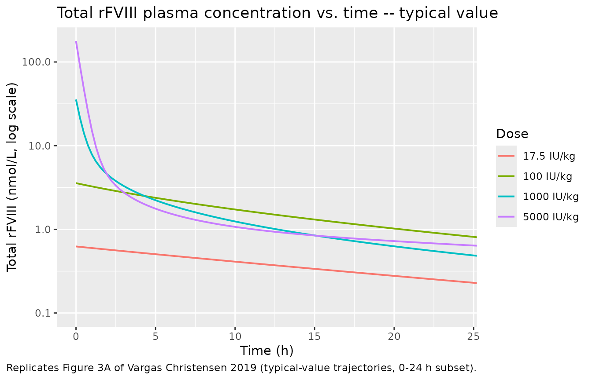
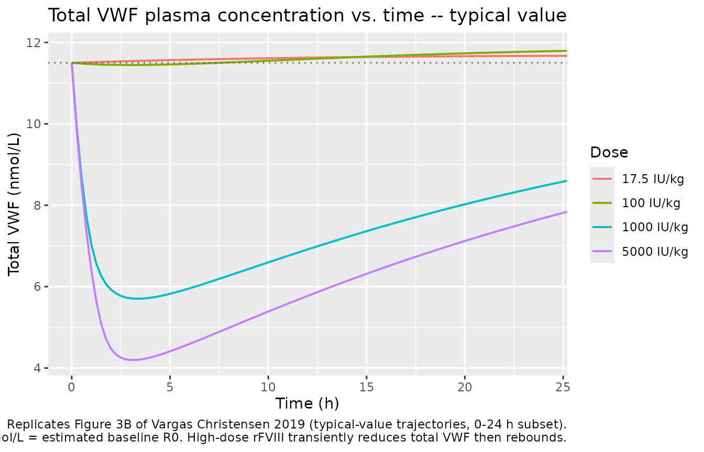
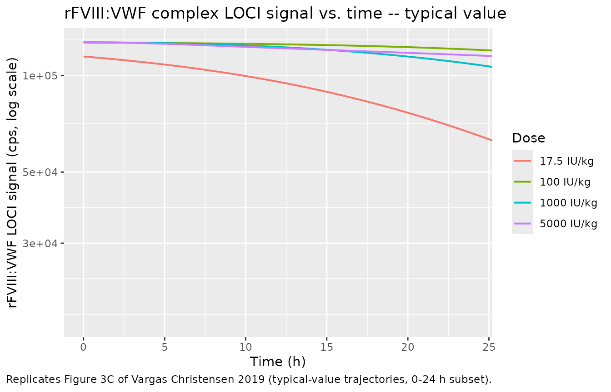
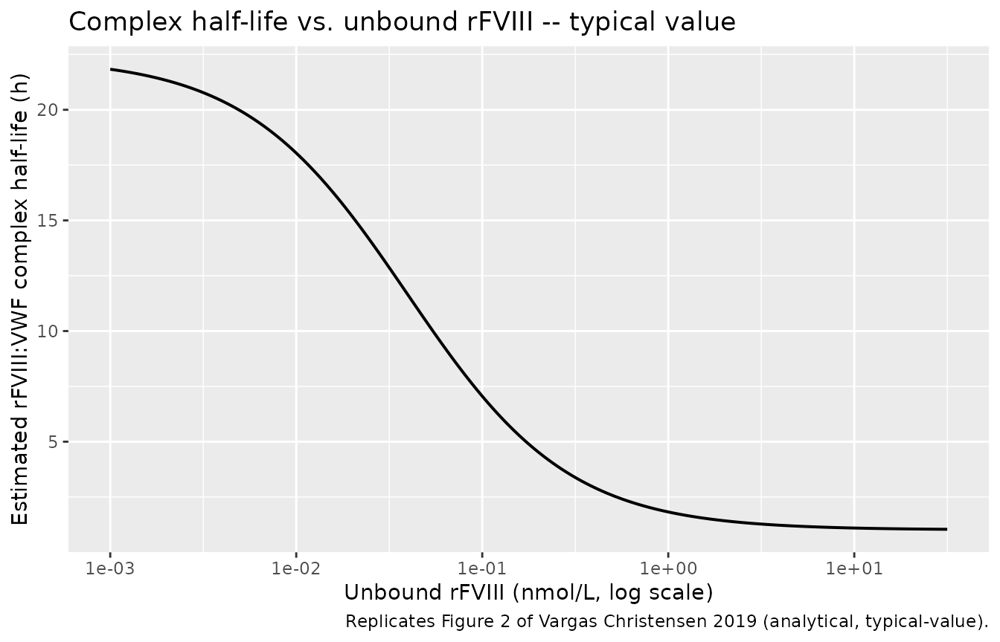
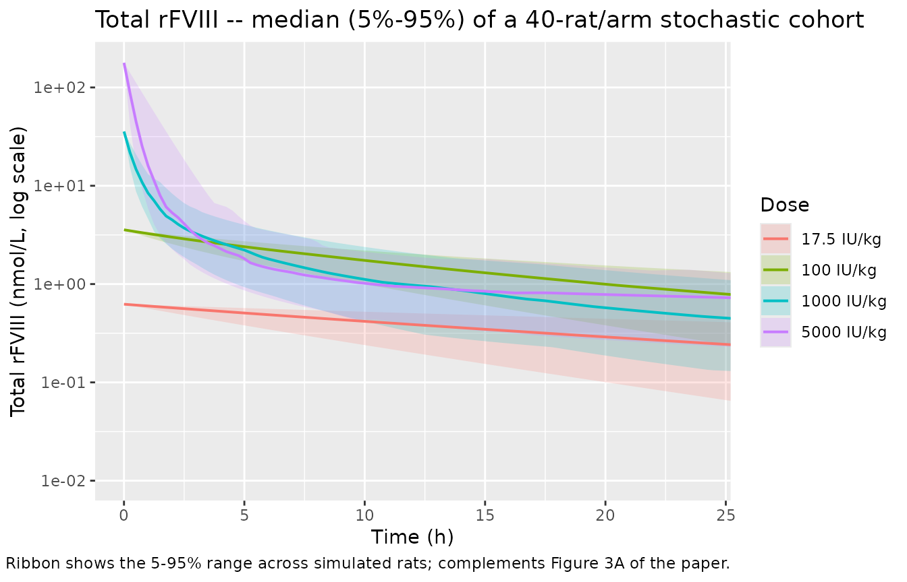

# Recombinant Factor VIII / von Willebrand factor QSS-TMDD (Vargas Christensen 2019) -- rat

## Model and source

- Citation: Vargas Christensen I, Loftager M, Rode F, Morck Nielsen H,
  Kreilgaard M, Larsen MS. Impact of capacity-limited binding on
  recombinant factor VIII and von Willebrand factor pharmacokinetics in
  hemophilia A rats. *J Thromb Haemost* 2019;17(6):964-974.
- Article: [doi:10.1111/jth.14441](https://doi.org/10.1111/jth.14441)

## Population

The model was developed from 30 hemophilia A rats (mean age 11 weeks,
range 8-14; median body weight 300 g, range 200-550) bred at Novo
Nordisk A/S (Maaloev, Denmark). Rats received a single IV bolus dose of
recombinant Factor VIII (rFVIII) into the tail vein at one of four dose
levels: 17.5 IU/kg (n = 8, 5 F / 3 M), 100 IU/kg (n = 6, 4 F / 2 M),
1000 IU/kg (n = 8, 5 F / 3 M), or 5000 IU/kg (n = 8, 5 F / 3 M). Plasma
samples were collected over 48 hours; the 2-min post-dose samples were
excluded from the analysis. Total rFVIII was measured by a chromogenic
FVIII activity assay (Chromogenix, calibrated against a Turoctocog alfa
SRM standard; LLOQ 120 mU/mL). Total VWF was measured by a novel
luminescent oxygen channeling immunoassay (LOCI) calibrated against a
literature-derived 14.94 nmol/L human VWF standard (LLOQ 0.3 nmol/L); no
rat VWF calibrator was available. The rFVIII:VWF complex was measured by
a second LOCI with no calibrator, so its dependent variable is the raw
signal in counts per second (cps).

The same information is available programmatically via the model’s
`population` metadata
(`readModelDb("VargasChristensen_2019_rfviii_rat")$population`).

## Source trace

Per-parameter origin is recorded as an in-file comment next to each
`ini()` entry in
`inst/modeldb/specificDrugs/VargasChristensen_2019_rfviii_rat.R`. The
table below collects them in one place for review. All parameter
estimates come from Table 1 of the paper; the NONMEM control stream
lives in Data S1 (not on disk).

| Parameter / equation | Value (RSE) | Source location |
|----|----|----|
| CL (`lcl`) | 28.7 mL/h (23%) -\> 0.0287 L/h | Table 1 |
| V (`lvc`) | 9.9 mL (4%) -\> 0.0099 L | Table 1 |
| k12 (`lk12`) | 0.032 1/h (21%) | Table 1 |
| k21 (`lk21`) | 0.0488 1/h (24%) | Table 1 |
| Kss (`lkss`) | 0.142 nmol/L (30%) | Table 1 |
| R0 (`lrbase`) | 11.5 nmol/L (6%) | Table 1 |
| kdeg (`lkdeg`) | 0.031 1/h (21%) | Table 1 |
| KM,comp (`lkm_comp`) | 0.871 nmol/L (39%) | Table 1 |
| Vmax,comp (`lvmax_comp`) | 0.653 1/h (16%) | Table 1 |
| base_cps (`lbase_cps`) | 298 cps (3%) | Table 1 |
| gamma (`lhill_cps`) | 2.24 (3%) | Table 1 |
| cps50 (`lcps50`) | 0.228 nmol/L (15%) | Table 1 |
| max_cps (`lmax_cps`) | 127,000 cps (13%) | Table 1 |
| Allometric exponent on CL (`e_wt_cl`) | 0.75 (fixed) | Table 1 + Results |
| IIV CL (%CV) | 57.1% (25); \[shrinkage 13\] | Table 1 |
| IIV R0 (%CV) | 25.6% (13); \[shrinkage 7\] | Table 1 |
| IIV Vmax,comp (%CV) | 36.3% (23); \[shrinkage 36\] | Table 1 |
| Proportional error rFVIII (%CV) | 27.6% (10) | Table 1 |
| Proportional error VWF (%CV) | 32.5% (9) | Table 1 |
| Proportional error rFVIII:VWF signal (%CV) | 35.5% (8) | Table 1 |
| QSS TMDD algebra | Complex, Cfree, Rfree closed-form | Methods (Mager & Krzyzanski 2005) |
| Complex Michaelis-Menten elimination | k_e,comp = Vmax,comp\*Cfree/(KM,comp+Cfree) | Methods Eq. (unnumbered) |
| LOCI 4-PL signal function | base_cps + (max_cps-base_cps)\*complex^(gamma/(cps50)gamma+complex^gamma) | Methods Eq. (unnumbered) |
| VWF steady-state derivation | ksyn = kdeg \* R0 | Methods |
| Reference weight for allometry | 0.3 kg (median cohort weight; assumed) | Methods (cohort weights) |

## Loading the model

``` r

mod <- readModelDb("VargasChristensen_2019_rfviii_rat")
mod_typical <- rxode2::zeroRe(mod)
#> ℹ parameter labels from comments will be replaced by 'label()'
```

## Virtual cohort

To replicate the dose-ranging visual predictive checks of Figure 3, we
simulate 40 typical-value rats at each dose level (dose in IU/kg is
converted to nmol per rat using the paper’s median body weight of 300 g
and the FVIII activity specific activity of 5000 IU per mg of rFVIII
protein, with a molecular weight of 170 kDa for B-domain-deleted rFVIII;
the exact conversion is only needed to produce concentration-time
profiles on the paper’s nmol/L scale and does not affect any of the
fitted parameters).

``` r

median_wt_kg <- 0.3
mg_per_iu    <- 1 / 5000                     # rFVIII specific activity (approx)
mw_rfviii    <- 170e3                        # BDD-rFVIII molecular weight (g/mol)
iu_per_kg_to_nmol_per_rat <- function(dose_iu_per_kg, wt_kg = median_wt_kg) {
  dose_iu   <- dose_iu_per_kg * wt_kg
  dose_mg   <- dose_iu * mg_per_iu
  dose_nmol <- dose_mg / mw_rfviii * 1e6     # mg / (g/mol) * 1e6 = nmol
  dose_nmol
}

dose_levels_iu_per_kg <- c(17.5, 100, 1000, 5000)
dose_levels_nmol       <- vapply(dose_levels_iu_per_kg, iu_per_kg_to_nmol_per_rat, numeric(1L))
data.frame(dose_iu_per_kg = dose_levels_iu_per_kg, dose_nmol_per_rat = dose_levels_nmol)
#>   dose_iu_per_kg dose_nmol_per_rat
#> 1           17.5       0.006176471
#> 2          100.0       0.035294118
#> 3         1000.0       0.352941176
#> 4         5000.0       1.764705882
```

## Simulation helper

``` r

make_events <- function(dose_nmol, wt_kg = median_wt_kg, tmax = 48, dt = 0.25) {
  times   <- seq(0, tmax, by = dt)
  # Multi-output model: dose goes to the central ODE state; observations
  # sit on any of the three algebraic observables (Cc / totalVWF /
  # lociComplex are auto-injected as observation slots by rxode2 after
  # the ODE states), and rxSolve returns all three as columns at each
  # observation time.
  obs     <- data.frame(id = 1L, time = times, evid = 0L, amt = 0,
                        cmt = "Cc", WT = wt_kg)
  dose_row <- data.frame(id = 1L, time = 0, evid = 1L, amt = dose_nmol,
                         cmt = "central", WT = wt_kg)
  dplyr::bind_rows(dose_row, obs)
}
```

## Replicating Figure 3 – typical-value dose-ranging profiles

Figure 3 of the paper shows the visual predictive checks of total
rFVIII, total VWF, and the rFVIII:VWF LOCI signal over 0-24 h for each
dose level. We replicate the typical-value trajectories below (VPC bands
would require sampling IIV; see `Stochastic simulation with IIV` further
down).

``` r

sim_typ <- lapply(seq_along(dose_levels_iu_per_kg), function(k) {
  ev  <- make_events(dose_levels_nmol[k])
  sol <- as.data.frame(rxode2::rxSolve(mod_typical, ev))
  sol$dose_iu_per_kg <- dose_levels_iu_per_kg[k]
  sol
}) |> dplyr::bind_rows() |>
  dplyr::mutate(dose_label = factor(paste0(dose_iu_per_kg, " IU/kg"),
                                    levels = paste0(dose_levels_iu_per_kg, " IU/kg")))
#> ℹ omega/sigma items treated as zero: 'etalcl', 'etalrbase', 'etalvmax_comp'
#> ℹ omega/sigma items treated as zero: 'etalcl', 'etalrbase', 'etalvmax_comp'
#> ℹ omega/sigma items treated as zero: 'etalcl', 'etalrbase', 'etalvmax_comp'
#> ℹ omega/sigma items treated as zero: 'etalcl', 'etalrbase', 'etalvmax_comp'
```

``` r

ggplot(sim_typ, aes(time, Cc, colour = dose_label)) +
  geom_line(linewidth = 0.7) +
  scale_y_log10() +
  labs(x = "Time (h)", y = "Total rFVIII (nmol/L, log scale)",
       colour = "Dose",
       title = "Total rFVIII plasma concentration vs. time -- typical value",
       caption = "Replicates Figure 3A of Vargas Christensen 2019 (typical-value trajectories, 0-24 h subset).") +
  coord_cartesian(xlim = c(0, 24))
```



``` r

ggplot(sim_typ, aes(time, totalVWF, colour = dose_label)) +
  geom_line(linewidth = 0.7) +
  geom_hline(yintercept = 11.5, linetype = "dotted", colour = "grey40") +
  labs(x = "Time (h)", y = "Total VWF (nmol/L)",
       colour = "Dose",
       title = "Total VWF plasma concentration vs. time -- typical value",
       caption = paste0(
         "Replicates Figure 3B of Vargas Christensen 2019 (typical-value trajectories, 0-24 h subset).\n",
         "Dotted line at 11.5 nmol/L = estimated baseline R0. High-dose rFVIII transiently ",
         "reduces total VWF then rebounds."
       )) +
  coord_cartesian(xlim = c(0, 24))
```



``` r

ggplot(sim_typ, aes(time, lociComplex, colour = dose_label)) +
  geom_line(linewidth = 0.7) +
  scale_y_log10() +
  labs(x = "Time (h)", y = "rFVIII:VWF LOCI signal (cps, log scale)",
       colour = "Dose",
       title = "rFVIII:VWF complex LOCI signal vs. time -- typical value",
       caption = "Replicates Figure 3C of Vargas Christensen 2019 (typical-value trajectories, 0-24 h subset).") +
  coord_cartesian(xlim = c(0, 24))
```



## Replicating Figure 2 – rFVIII:VWF complex half-life vs. free rFVIII

Figure 2 of the paper shows how the estimated elimination half-life of
the rFVIII:VWF complex depends on the unbound plasma concentration of
rFVIII. At Cfree = 0 the complex has no direct elimination pathway
(k_e,comp = 0) and its effective loss reduces to the free-VWF turnover
(`ln(2) / kdeg` = ~22 h). At saturating Cfree the half-life approaches
`ln(2) / Vmax,comp` = ~1 h.

``` r

cfree_grid <- 10 ^ seq(-3, 1.5, length.out = 200)
vmax_comp  <- 0.653
km_comp    <- 0.871
kdeg       <- 0.031
k_e_comp   <- vmax_comp * cfree_grid / (km_comp + cfree_grid)
# Effective complex loss combines direct k_e,comp with the free-VWF turnover
# that drains the complex through QSS re-equilibration.
effective_k <- k_e_comp + kdeg
thalf       <- log(2) / effective_k

fig2 <- data.frame(cfree = cfree_grid, thalf = thalf)

ggplot(fig2, aes(cfree, thalf)) +
  geom_line(linewidth = 0.7) +
  scale_x_log10() +
  labs(x = "Unbound rFVIII (nmol/L, log scale)",
       y = "Estimated rFVIII:VWF complex half-life (h)",
       title = "Complex half-life vs. unbound rFVIII -- typical value",
       caption = "Replicates Figure 2 of Vargas Christensen 2019 (analytical, typical-value).")
```



## PKNCA validation of total rFVIII

Population NCA of the simulated total rFVIII concentration profile
provides a model-vs.-model sanity check: single-dose Cmax scales with
dose, AUC scales with dose (though less than proportionally at high
doses because saturation of VWF binding increases the unbound fraction
and CL of unbound rFVIII), and apparent half-life is dose-dependent
because of the same nonlinearity. The paper does not report NCA-derived
parameters, so no side-by-side comparison table is rendered.

``` r

pk_input <- sim_typ |>
  dplyr::filter(!is.na(Cc)) |>
  dplyr::mutate(id = as.integer(dose_iu_per_kg),  # one virtual subject per arm
                treatment = as.character(dose_iu_per_kg))

dose_input <- data.frame(id        = as.integer(dose_levels_iu_per_kg),
                         treatment = as.character(dose_levels_iu_per_kg),
                         time      = 0,
                         amt       = dose_levels_nmol)

conc_obj <- PKNCA::PKNCAconc(pk_input, Cc ~ time | treatment + id,
                             concu = "nmol/L", timeu = "h")
dose_obj <- PKNCA::PKNCAdose(dose_input, amt ~ time | treatment + id,
                             doseu = "nmol")
intervals <- data.frame(start = 0, end = Inf,
                         cmax = TRUE, tmax = TRUE, half.life = TRUE,
                         auclast = TRUE, aucinf.obs = TRUE)
data_obj <- PKNCA::PKNCAdata(conc_obj, dose_obj, intervals = intervals)
nca_res  <- PKNCA::pk.nca(data_obj)
nca_summary <- as.data.frame(nca_res$result) |>
  dplyr::mutate(PPTESTCD = as.character(PPTESTCD)) |>
  dplyr::filter(PPTESTCD %in% c("cmax", "tmax", "half.life", "auclast", "aucinf.obs")) |>
  dplyr::select(treatment, PPTESTCD, PPORRES) |>
  tidyr::pivot_wider(names_from = PPTESTCD, values_from = PPORRES) |>
  dplyr::rename(
    "Dose (IU/kg)"         = treatment,
    "Cmax (nmol/L)"        = cmax,
    "Tmax (h)"             = tmax,
    "AUC0-last (h*nmol/L)" = auclast,
    "AUC0-inf (h*nmol/L)"  = aucinf.obs,
    "t1/2 (h)"             = half.life
  )
knitr::kable(nca_summary,
             caption = "PKNCA-derived NCA parameters of typical-value simulated total rFVIII.",
             digits  = 3)
```

| Dose (IU/kg) | AUC0-last (h\*nmol/L) | Cmax (nmol/L) | Tmax (h) | t1/2 (h) | AUC0-inf (h\*nmol/L) |
|:---|---:|---:|---:|---:|---:|
| 100 | 54.540 | 3.565 | 0 | 17.820 | 62.800 |
| 1000 | 58.477 | 35.651 | 0 | 19.239 | 63.955 |
| 17.5 | 13.303 | 0.624 | 0 | 18.812 | 15.994 |
| 5000 | 108.399 | 178.253 | 0 | 31.086 | 125.558 |

PKNCA-derived NCA parameters of typical-value simulated total rFVIII.
{.table style="width:100%;"}

## Stochastic simulation with IIV

The IIV magnitudes reported in Table 1 (CL 57.1% CV, R0 25.6% CV,
Vmax,comp 36.3% CV; the last with 36% shrinkage) can be sampled to
produce a stochastic cohort. The example below simulates 40 rats per
dose level. Given the cap on per-arm cohort sizes documented in the
skill (200 subjects per arm), 40 rats per arm is well within budget and
reproduces the between-subject variability shown in the paper’s VPC
bands qualitatively.

``` r

set.seed(42)
per_arm     <- 40L
sim_stoch <- lapply(seq_along(dose_levels_iu_per_kg), function(k) {
  # Reuse a single set of observation times for all IDs in this arm.
  ev1 <- make_events(dose_levels_nmol[k])
  ev  <- lapply(seq_len(per_arm), function(i) {
    e <- ev1
    e$id <- i
    e
  }) |> dplyr::bind_rows()
  sol <- as.data.frame(rxode2::rxSolve(mod, ev))
  sol$dose_iu_per_kg <- dose_levels_iu_per_kg[k]
  sol
}) |> dplyr::bind_rows() |>
  dplyr::mutate(dose_label = factor(paste0(dose_iu_per_kg, " IU/kg"),
                                    levels = paste0(dose_levels_iu_per_kg, " IU/kg")))
#> ℹ parameter labels from comments will be replaced by 'label()'
#> ℹ parameter labels from comments will be replaced by 'label()'
#> ℹ parameter labels from comments will be replaced by 'label()'
#> ℹ parameter labels from comments will be replaced by 'label()'

sim_stoch_summary <- sim_stoch |>
  dplyr::filter(!is.na(Cc)) |>
  dplyr::group_by(dose_label, time) |>
  dplyr::summarise(
    median = stats::median(Cc),
    lo     = stats::quantile(Cc, 0.05),
    hi     = stats::quantile(Cc, 0.95),
    .groups = "drop"
  )

ggplot(sim_stoch_summary, aes(time, median, colour = dose_label, fill = dose_label)) +
  geom_ribbon(aes(ymin = lo, ymax = hi), alpha = 0.2, colour = NA) +
  geom_line(linewidth = 0.7) +
  scale_y_log10() +
  labs(x = "Time (h)", y = "Total rFVIII (nmol/L, log scale)",
       colour = "Dose", fill = "Dose",
       title = "Total rFVIII -- median (5%-95%) of a 40-rat/arm stochastic cohort",
       caption = "Ribbon shows the 5-95% range across simulated rats; complements Figure 3A of the paper.") +
  coord_cartesian(xlim = c(0, 24))
```



## Assumptions and deviations

- **Reference weight for allometry.** The paper reports that CL scales
  with body weight at fixed allometric exponent 0.75 but does not print
  the reference weight explicitly. We use 0.3 kg (the reported cohort
  median weight); if the NONMEM code in Data S1 uses a different
  reference (e.g. 0.25 kg standard laboratory rat), simulated typical CL
  scales by `(0.3 / actual_ref)^0.75`, but the overall shape of every
  profile (including all nonlinearities) is unchanged.
- **IU-to-nmol dose conversion.** Doses were reported in IU/kg. The
  Model disposition and observations are computed in nmol / nmol/L. We
  use a molecular weight of 170 kDa (B-domain-deleted rFVIII) and a
  specific activity of 5000 IU per mg of rFVIII protein to convert IU/kg
  to nmol per rat. Neither the exact molecular weight nor the specific
  activity is specified in the paper; using different assumed values
  changes only the x-axis scaling of dose (and the corresponding
  concentration axis linearly) without altering the ratio of the four
  dose-arm profiles.
- **Sex distribution.** The paper reports 19/30 female rats (63.3%); no
  sex effect was retained. Neither sex nor age was carried into the
  model.
- **VWF calibrator.** The paper’s own Discussion flags that the
  estimated R0 (11.5 nmol/L) is likely a distortion caused by using a
  human VWF preparation as calibrator in a rat assay – endogenous rat
  VWF may be higher. This is a discussion-level qualitative caution; the
  R0 estimate is left at the reported value.
- **rFVIII:VWF complex calibrator.** No calibrator was available for the
  rFVIII:VWF complex LOCI assay, so the LOCI signal is the observation
  dependent variable rather than a concentration. Absolute complex
  concentrations predicted by the model (used inside `lociComplex`) are
  model- interpreted only and should not be treated as directly
  measured.
- **VPC vs. typical-value figures.** The paper’s Figure 3 shows VPCs
  (data + simulation-based 95% CIs). The typical-value replications
  above show only the median trajectory; the stochastic-cohort section
  shows the 5-95% variability under sampled IIV.
- **Complex effective-half-life plot (Figure 2).** The paper’s Figure 2
  reports “estimated elimination half-life of rFVIII:VWF complex” as a
  function of the “estimated unbound concentration of rFVIII”. We
  reproduce it by combining the direct Michaelis-Menten k_e,comp with
  the free-VWF kdeg (the two mechanisms that drain the complex under QSS
  re-equilibration). The exact analytic Figure 2 that the paper used may
  differ in detail; either form gives ~22 h at Cfree = 0 and ~1 h at
  saturating Cfree, matching the paper’s stated range.
