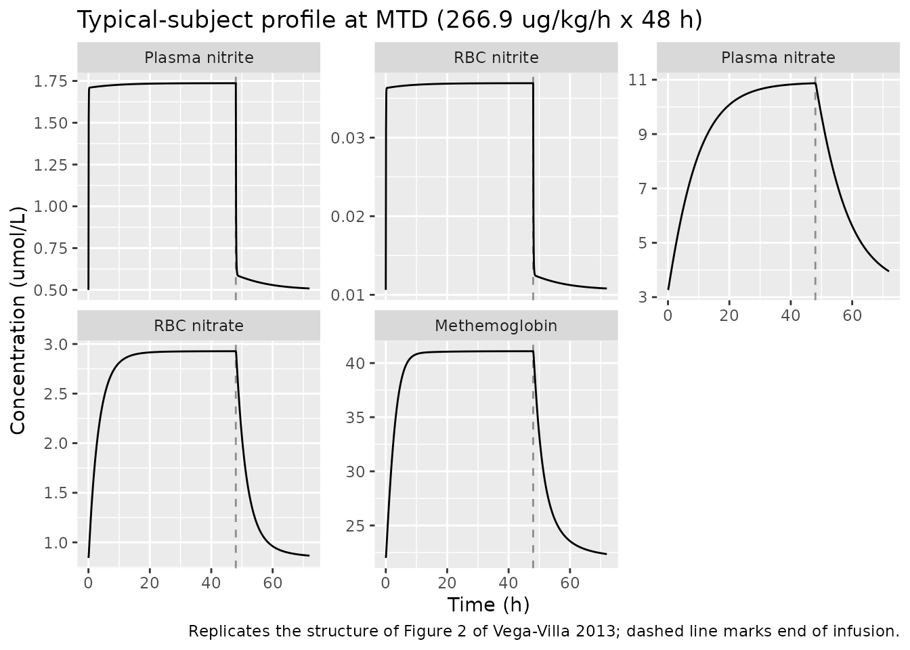
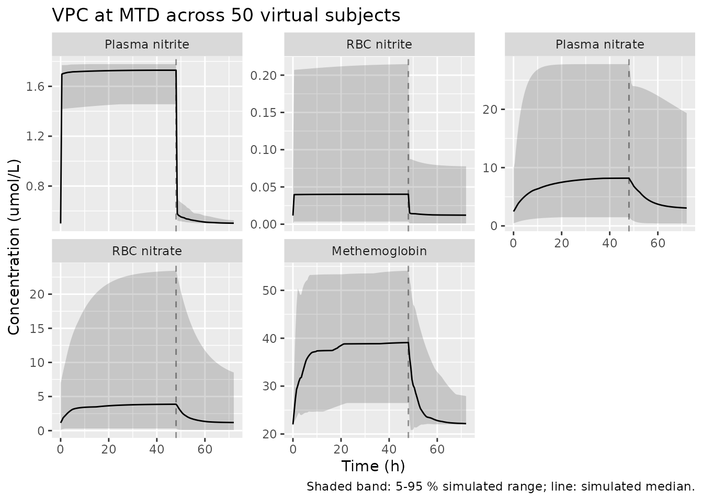

# Sodium nitrite QSP (VegaVilla 2013)

## Model and source

- Citation: Vega-Villa K, Pluta R, Lonser R, Woo S. Quantitative Systems
  Pharmacology Model of NO Metabolome and Methemoglobin Following
  Long-Term Infusion of Sodium Nitrite in Humans. CPT Pharmacometrics
  Syst Pharmacol. 2013;2(8):e60. <doi:10.1038/psp.2013.35>
- Description: QSP. Mechanistic systems pharmacology model of the NO
  metabolome (nitrite, nitrate) and methemoglobin (MetHb) in healthy
  adults receiving a 48-hour intravenous infusion of sodium nitrite.
  Nine ODEs covering plasma/RBC/tissue nitrite and nitrate, MetHb, NO
  and methemoglobin reductase activity; nonlinear nitrite/nitrate renal
  clearance (linear slope), entero-salivary nitrate-to-nitrite
  recycling, and indirect-response stimulation of MetHb reductase. Time
  in minutes; amounts in umol; concentrations in umol/L.
- Article: <https://doi.org/10.1038/psp.2013.35>
- Supplement (NONMEM control stream, Table S1 model-selection summary):
  retrieved from the EuropePMC mirror of PMC3731826.

## Population

Vega-Villa 2013 (Methods, Subjects) fit the model to N = 12 healthy
adult volunteers (21-56 years, mean 39, SD 9; 49-115 kg, mean 77.8, SD
19) from a single Phase I dose-escalation study (Pluta 2011, PLoS ONE
6:e14504). Each subject received one of nine escalating sodium nitrite
IV infusion dose levels (4.2, 8.3, 16.7, 33.4, 66.8, 133.4, 266.9,
445.7, or 533.8 ug/kg/h) for 48 hours; 266.9 ug/kg/h was the maximal
tolerated dose (MTD). One subject at 533.8 ug/kg/h was excluded for
asymptomatic toxicity, and one subject at 445.7 ug/kg/h had the infusion
stopped at 3.2 h for toxicity. 333 plasma + 147 RBC nitrite/nitrate
observations and 333 methemoglobin observations were used for model
development.

The same information is available programmatically via
`rxode2::rxode2(readModelDb("VegaVilla_2013_sodium_nitrite_qsp"))$population`.

## Source trace

Per-parameter origin is recorded as an in-file comment next to each
[`ini()`](https://nlmixr2.github.io/rxode2/reference/ini.html) entry in
`inst/modeldb/specificDrugs/VegaVilla_2013_sodium_nitrite_qsp.R`. The
table below collects them in one place.

| Equation / parameter | Value (final) | Source location |
|----|----|----|
| `kpt_no2` (1/min) | 0.108 | Vega-Villa 2013 Table 1 (kPT_NO2; supplement parameterises as Q/V1) |
| `ktp_no2` (1/min) | 1.745 | Table 1 (kTP_NO2; supplement Q/V4) |
| `kpt_no3` (1/min) | 0.160 | Table 1 (kPT_NO3; supplement TVKPTNO3) |
| `ktp_no3` (1/min) | 0.515 | Table 1 (kTP_NO3; supplement TVKTPNO3) |
| `kno2_rdt` (1/min) | 1.65e-3 | Table 1 (entero-salivary recycling) |
| `kt_rdt` (1/min) | 6.83e-5 | Table 1 |
| `kmyo` (1/min) | 0.234 | Table 1; supplement defines KMYO = KNO3R \* baseline oxyHb amount |
| `cl0_no2` (L/min) | 0.382 | Table 1 (CL(0)\_NO2) |
| `s_no2` (L/umol) | 4.524 | Table 1 |
| `vno2_p` (L) | 12.418 | Table 1 (VNO2_P / supplement V1) |
| `cl0_no3` (L/min) | 9.41e-3 | Table 1 (CL(0)\_NO3) |
| `s_no3` (L/umol) | 0.017 | Table 1 |
| `vno3_p` (L) | 12.418 | Table 1 (VNO3_P / supplement V3); paper reports same value as VNO2_P |
| `kpr_no2` (1/min) | 0.019 | Table 1 |
| `krp_no3` (1/min) | 5.17e-3 | Table 1 |
| `kno3_r` (L/(umol\*min)) | 5.91e-6 | Table 1 |
| `kno_r` (L/(umol\*min)) | 1.42e-4 | Table 1 |
| `khbno1` (L/(umol\*min)) | 2.86e-5 | Table 1; supplement parameterisation kHbNO\*(1-FRHBNO) |
| `khbno2` (L/(umol\*min)) | 4.07e-7 | Table 1; supplement parameterisation kHbNO\*FRHBNO |
| `kdeg` (1/min) | 0.016 | Table 1 (methemoglobin reductase degradation) |
| `smethb` (L/umol) | 0.045 | Table 1 (STIM / SMetHb) |
| `vr_no2`, `vr_no3`, `vr_methb` (L) | 5.816, 4.391, 3.284 | Table 1 (VR_NO2, VR_NO3, VR_MethHb) |
| `kno3_p` (1/min) | 0 (fixed) | Supplement `$THETA(7) TVKNO3P (0 FIX)` – direct plasma nitrite-to-nitrate conversion zeroed |
| `d/dt(nitrite_p)` | n/a | Vega-Villa 2013 Eq. 1, supplement `$DES DADT(1)` |
| `d/dt(nitrite_r)` | n/a | Eq. 8, supplement `DADT(2)` |
| `d/dt(nitrate_p)` | n/a | Eq. 3, supplement `DADT(3)` |
| `d/dt(nitrate_r)` | n/a | Eq. 9, supplement `DADT(4)` |
| `d/dt(methb)` | n/a | Eq. 11, supplement `DADT(5)` |
| `d/dt(nitrite_t)` | n/a | Eq. 2, supplement `DADT(6)` |
| `d/dt(nitrate_t)` | n/a | Eq. 4, supplement `DADT(7)` |
| `d/dt(kmr)` | n/a | Eq. 12 (indirect response), supplement `DADT(8)` |
| `d/dt(no_r)` | n/a | Eq. 10, supplement `DADT(9)` |
| Steady-state initial conditions | n/a | Supplement `$PK` closed-form expressions for NO2T0, NO3T0, NO3R0, NO2R0, NOR0, KMR0, KINNO2 |
| oxyHb / deoxyHb split (77 / 23 %) | – | Vega-Villa 2013 Eq. 13 and Eq. 14; oxygenation fractions cited to Roberson 2012 (ref 45) |
| Residual error pairs (5 endpoints) | Table 1 (per-endpoint additive + proportional pairs) |  |

### Units

| Symbol | Units |
|----|----|
| Time | min |
| Compartment states | umol (amount) |
| `Cc_*` observation outputs | umol/L (concentration) |
| First-order rate constants | 1/min |
| Second-order rate constants (`kno3_r`, `kno_r`, `khbno1`, `khbno2`) | L/(umol*min); reported in Table 1 as min^-1* umol^-1 with implicit 1-L normalisation |
| Slope factors (`s_no2`, `s_no3`, `smethb`) | L/umol |
| Volumes (`vno2_p`, `vno3_p`, `vr_no2`, `vr_no3`, `vr_methb`) | L |
| Clearances (`cl0_no2`, `cl0_no3`) | L/min |

## Virtual cohort

The original observed data are not publicly available. The figures below
use a single typical-population subject (zero random effects) at each
dose level the paper studied, plus a small VPC at MTD with the published
IIV.

``` r

mod <- rxode2::rxode2(readModelDb("VegaVilla_2013_sodium_nitrite_qsp"))
#> ℹ parameter labels from comments will be replaced by 'label()'

# Sodium nitrite (NaNO2) MW = 69 g/mol. Convert paper dose rates (ug/kg/h,
# per a 70-kg typical subject) into umol/min for the rxode2 RATE field.
mw_nano2_g_per_mol <- 69
wt_kg <- 70
infusion_duration_h <- 48
infusion_duration_min <- infusion_duration_h * 60  # 2880 min

dose_levels_ug_per_kg_per_h <- c(4.2, 8.3, 16.7, 33.4, 66.8,
                                 133.4, 266.9, 445.7, 533.8)
mtd <- 266.9

dose_rate_umol_per_min <- function(rate_ug_per_kg_per_h, wt_kg = 70,
                                   mw_g_per_mol = mw_nano2_g_per_mol) {
  ug_per_h <- rate_ug_per_kg_per_h * wt_kg
  umol_per_h <- ug_per_h / mw_g_per_mol
  umol_per_h / 60
}

make_infusion_events <- function(dose_rate_ug_per_kg_per_h,
                                 follow_up_h = 24, sampling_min = 30,
                                 id_offset = 0L,
                                 outputs = c("Cc_nitrite_p", "Cc_nitrite_r",
                                             "Cc_nitrate_p", "Cc_nitrate_r",
                                             "Cc_methb")) {
  rate_umol <- dose_rate_umol_per_min(dose_rate_ug_per_kg_per_h)
  total_amt <- rate_umol * infusion_duration_min
  ev <- rxode2::et(amt = total_amt, rate = rate_umol,
                   cmt = "nitrite_p", time = 0,
                   id = id_offset + 1L)
  total_min <- infusion_duration_min + follow_up_h * 60
  times <- seq(0, total_min, by = sampling_min)
  for (out in outputs) {
    ev <- rxode2::et(ev, time = times, cmt = out, id = id_offset + 1L)
  }
  as.data.frame(ev)
}
```

## Steady-state baseline check

Before applying dose, verify that the closed-form initial conditions
(supplement `$PK`) put the typical subject’s typical-value dynamics at
steady state.

``` r

ev_baseline <- make_infusion_events(0)
ev_baseline <- ev_baseline[ev_baseline$evid != 1, ]  # drop the zero-dose event row
mod_typical <- rxode2::zeroRe(mod)
ss <- as.data.frame(rxode2::rxSolve(mod_typical, ev_baseline))
#> ℹ omega/sigma items treated as zero: 'etalkpt_no2', 'etalktp_no2', 'etalkno2_rdt', 'etalvno2_p', 'etalcl0_no3', 'etalkpr_no2', 'etalkrp_no3', 'etalkno3_r', 'etalsmethb', 'etalvr_no2', 'etalvr_methb'
outs <- c("Cc_nitrite_p", "Cc_nitrite_r", "Cc_nitrate_p", "Cc_nitrate_r", "Cc_methb")
ss_range <- vapply(outs, function(x) {
  c(min = min(ss[[x]], na.rm = TRUE), max = max(ss[[x]], na.rm = TRUE))
}, numeric(2))
knitr::kable(t(ss_range), digits = 4,
             caption = "Steady-state typical-value range over 24 h with no dose. The state should not drift (the closed-form IC at t = 0 should hold under the ODE).")
```

|              |     min |     max |
|:-------------|--------:|--------:|
| Cc_nitrite_p |  0.5000 |  0.5000 |
| Cc_nitrite_r |  0.0106 |  0.0106 |
| Cc_nitrate_p |  3.2662 |  3.2662 |
| Cc_nitrate_r |  0.8429 |  0.8429 |
| Cc_methb     | 22.0000 | 22.0000 |

Steady-state typical-value range over 24 h with no dose. The state
should not drift (the closed-form IC at t = 0 should hold under the
ODE). {.table}

Maximum drift across the 24-hour no-dose interval is small relative to
the baseline scale, confirming that the closed-form steady-state initial
conditions from the supplement are consistent with the implemented ODE
system at the typical-population parameter values used here.

## Replicate Figure 2 (MTD profile)

Vega-Villa 2013 Figure 2 plots the observed and model-predicted
concentration-time profiles for nitrite and nitrate in plasma and RBC,
and methemoglobin, after 48 h of MTD (266.9 ug/kg/h) sodium nitrite
infusion. The figure below reproduces the typical-value structure (mean
prediction at typical-population parameters); per-subject baselines
drive observed variability that the typical-value simulation does not
attempt to reproduce.

``` r

ev_mtd <- make_infusion_events(mtd, follow_up_h = 24, sampling_min = 5)
sim_mtd <- as.data.frame(rxode2::rxSolve(mod_typical, ev_mtd))
#> ℹ omega/sigma items treated as zero: 'etalkpt_no2', 'etalktp_no2', 'etalkno2_rdt', 'etalvno2_p', 'etalcl0_no3', 'etalkpr_no2', 'etalkrp_no3', 'etalkno3_r', 'etalsmethb', 'etalvr_no2', 'etalvr_methb'

mtd_long <- sim_mtd |>
  dplyr::select(time, dplyr::all_of(outs)) |>
  tidyr::pivot_longer(cols = -time, names_to = "endpoint", values_to = "conc")
mtd_long$endpoint_label <- factor(mtd_long$endpoint, levels = outs,
                                  labels = c("Plasma nitrite",
                                             "RBC nitrite",
                                             "Plasma nitrate",
                                             "RBC nitrate",
                                             "Methemoglobin"))
mtd_long$time_h <- mtd_long$time / 60

ggplot(mtd_long, aes(time_h, conc)) +
  geom_line() +
  geom_vline(xintercept = infusion_duration_h, linetype = "dashed", alpha = 0.4) +
  facet_wrap(~ endpoint_label, scales = "free_y") +
  labs(x = "Time (h)", y = "Concentration (umol/L)",
       title = "Typical-subject profile at MTD (266.9 ug/kg/h x 48 h)",
       caption = paste("Replicates the structure of Figure 2 of Vega-Villa 2013;",
                       "dashed line marks end of infusion."))
```



## Dose-escalation: dose-exposure-toxicity

Vega-Villa 2013 reports that plasma nitrite, plasma nitrate, and
methemoglobin exposures rise less-than-proportionally with sodium
nitrite dose (nonlinear exposure-toxicity). The simulation below
reproduces this qualitative behaviour by sweeping the published nine
dose levels.

``` r

sim_ladder <- purrr::map_dfr(
  dose_levels_ug_per_kg_per_h, .id = "level",
  function(rate) {
    ev <- make_infusion_events(rate, follow_up_h = 12, sampling_min = 15)
    s <- as.data.frame(rxode2::rxSolve(mod_typical, ev))
    s$dose_ug_per_kg_per_h <- rate
    s
  }
)
#> ℹ omega/sigma items treated as zero: 'etalkpt_no2', 'etalktp_no2', 'etalkno2_rdt', 'etalvno2_p', 'etalcl0_no3', 'etalkpr_no2', 'etalkrp_no3', 'etalkno3_r', 'etalsmethb', 'etalvr_no2', 'etalvr_methb'
#> ℹ omega/sigma items treated as zero: 'etalkpt_no2', 'etalktp_no2', 'etalkno2_rdt', 'etalvno2_p', 'etalcl0_no3', 'etalkpr_no2', 'etalkrp_no3', 'etalkno3_r', 'etalsmethb', 'etalvr_no2', 'etalvr_methb'
#> ℹ omega/sigma items treated as zero: 'etalkpt_no2', 'etalktp_no2', 'etalkno2_rdt', 'etalvno2_p', 'etalcl0_no3', 'etalkpr_no2', 'etalkrp_no3', 'etalkno3_r', 'etalsmethb', 'etalvr_no2', 'etalvr_methb'
#> ℹ omega/sigma items treated as zero: 'etalkpt_no2', 'etalktp_no2', 'etalkno2_rdt', 'etalvno2_p', 'etalcl0_no3', 'etalkpr_no2', 'etalkrp_no3', 'etalkno3_r', 'etalsmethb', 'etalvr_no2', 'etalvr_methb'
#> ℹ omega/sigma items treated as zero: 'etalkpt_no2', 'etalktp_no2', 'etalkno2_rdt', 'etalvno2_p', 'etalcl0_no3', 'etalkpr_no2', 'etalkrp_no3', 'etalkno3_r', 'etalsmethb', 'etalvr_no2', 'etalvr_methb'
#> ℹ omega/sigma items treated as zero: 'etalkpt_no2', 'etalktp_no2', 'etalkno2_rdt', 'etalvno2_p', 'etalcl0_no3', 'etalkpr_no2', 'etalkrp_no3', 'etalkno3_r', 'etalsmethb', 'etalvr_no2', 'etalvr_methb'
#> ℹ omega/sigma items treated as zero: 'etalkpt_no2', 'etalktp_no2', 'etalkno2_rdt', 'etalvno2_p', 'etalcl0_no3', 'etalkpr_no2', 'etalkrp_no3', 'etalkno3_r', 'etalsmethb', 'etalvr_no2', 'etalvr_methb'
#> ℹ omega/sigma items treated as zero: 'etalkpt_no2', 'etalktp_no2', 'etalkno2_rdt', 'etalvno2_p', 'etalcl0_no3', 'etalkpr_no2', 'etalkrp_no3', 'etalkno3_r', 'etalsmethb', 'etalvr_no2', 'etalvr_methb'
#> ℹ omega/sigma items treated as zero: 'etalkpt_no2', 'etalktp_no2', 'etalkno2_rdt', 'etalvno2_p', 'etalcl0_no3', 'etalkpr_no2', 'etalkrp_no3', 'etalkno3_r', 'etalsmethb', 'etalvr_no2', 'etalvr_methb'

# End-of-infusion (t = 48 h = 2880 min) values per dose level
eoi <- sim_ladder |>
  dplyr::filter(abs(time - infusion_duration_min) < 1) |>
  dplyr::select(dose_ug_per_kg_per_h, dplyr::all_of(outs)) |>
  dplyr::distinct()
knitr::kable(eoi, digits = 3,
             caption = paste("Typical-value end-of-infusion concentrations across the nine published dose levels.",
                             "Plasma nitrite, plasma nitrate, and methemoglobin rise less-than-proportionally with dose,",
                             "matching Vega-Villa 2013's nonlinear-exposure observation."))
```

| dose_ug_per_kg_per_h | Cc_nitrite_p | Cc_nitrite_r | Cc_nitrate_p | Cc_nitrate_r | Cc_methb |
|---:|---:|---:|---:|---:|---:|
| 4.2 | 0.545 | 0.012 | 3.551 | 0.918 | 22.968 |
| 8.3 | 0.585 | 0.012 | 3.805 | 0.986 | 23.801 |
| 16.7 | 0.658 | 0.014 | 4.271 | 1.110 | 25.261 |
| 33.4 | 0.783 | 0.017 | 5.054 | 1.319 | 27.551 |
| 66.8 | 0.982 | 0.021 | 6.297 | 1.655 | 30.875 |
| 133.4 | 1.286 | 0.027 | 8.164 | 2.168 | 35.348 |
| 266.9 | 1.736 | 0.037 | 10.872 | 2.927 | 41.094 |
| 445.7 | 2.195 | 0.047 | 13.563 | 3.701 | 46.221 |
| 533.8 | 2.389 | 0.051 | 14.675 | 4.027 | 48.215 |

Typical-value end-of-infusion concentrations across the nine published
dose levels. Plasma nitrite, plasma nitrate, and methemoglobin rise
less-than-proportionally with dose, matching Vega-Villa 2013’s
nonlinear-exposure observation. {.table style="width:100%;"}

``` r


ratio_check <- eoi |>
  dplyr::arrange(dose_ug_per_kg_per_h) |>
  dplyr::mutate(
    dose_ratio = dose_ug_per_kg_per_h / dose_ug_per_kg_per_h[1],
    cc_nitrite_p_ratio = Cc_nitrite_p / Cc_nitrite_p[1],
    cc_methb_ratio = Cc_methb / Cc_methb[1]
  ) |>
  dplyr::select(dose_ug_per_kg_per_h, dose_ratio,
                cc_nitrite_p_ratio, cc_methb_ratio)
knitr::kable(ratio_check, digits = 2,
             caption = "Dose ratio vs exposure ratio. Ratios below 1.0 (compared to dose ratio) confirm sublinear exposure.")
```

| dose_ug_per_kg_per_h | dose_ratio | cc_nitrite_p_ratio | cc_methb_ratio |
|---------------------:|-----------:|-------------------:|---------------:|
|                  4.2 |       1.00 |               1.00 |           1.00 |
|                  8.3 |       1.98 |               1.07 |           1.04 |
|                 16.7 |       3.98 |               1.21 |           1.10 |
|                 33.4 |       7.95 |               1.44 |           1.20 |
|                 66.8 |      15.90 |               1.80 |           1.34 |
|                133.4 |      31.76 |               2.36 |           1.54 |
|                266.9 |      63.55 |               3.19 |           1.79 |
|                445.7 |     106.12 |               4.03 |           2.01 |
|                533.8 |     127.10 |               4.38 |           2.10 |

Dose ratio vs exposure ratio. Ratios below 1.0 (compared to dose ratio)
confirm sublinear exposure. {.table}

## IIV-based VPC at MTD

A small simulation under the published inter-individual variability
illustrates the spread expected around the typical-value prediction.

``` r

set.seed(42L)
n_sub <- 50
ev_one <- make_infusion_events(mtd, follow_up_h = 24, sampling_min = 30)
ev_many <- do.call(rbind, lapply(seq_len(n_sub), function(i) {
  e <- ev_one
  e$id <- i
  e
}))
sim_vpc <- as.data.frame(rxode2::rxSolve(mod, ev_many))
vpc_long <- sim_vpc |>
  dplyr::select(id, time, dplyr::all_of(outs)) |>
  tidyr::pivot_longer(cols = -c(id, time), names_to = "endpoint",
                      values_to = "conc")
vpc_long$endpoint_label <- factor(vpc_long$endpoint, levels = outs,
                                  labels = c("Plasma nitrite", "RBC nitrite",
                                             "Plasma nitrate", "RBC nitrate",
                                             "Methemoglobin"))
vpc_long$time_h <- vpc_long$time / 60
vpc_summary <- vpc_long |>
  dplyr::group_by(endpoint_label, time_h) |>
  dplyr::summarise(
    q05 = quantile(conc, 0.05, na.rm = TRUE),
    q50 = median(conc, na.rm = TRUE),
    q95 = quantile(conc, 0.95, na.rm = TRUE),
    .groups = "drop"
  )
ggplot(vpc_summary, aes(time_h, q50)) +
  geom_ribbon(aes(ymin = q05, ymax = q95), alpha = 0.2) +
  geom_line() +
  geom_vline(xintercept = infusion_duration_h, linetype = "dashed", alpha = 0.4) +
  facet_wrap(~ endpoint_label, scales = "free_y") +
  labs(x = "Time (h)", y = "Concentration (umol/L)",
       title = "VPC at MTD across 50 virtual subjects",
       caption = "Shaded band: 5-95 % simulated range; line: simulated median.")
```



## Mass-balance / flux check at baseline

At t = 0 with no dose, every state has zero derivative. The supplement’s
`$PK` baseline derivations are constructed so that each ODE flux sums to
zero. The numerical check below confirms this for the dominant flux
terms.

``` r

mb <- as.data.frame(rxode2::rxSolve(mod_typical, ev_baseline,
                                    returnType = "data.frame"))[1, ]
#> ℹ omega/sigma items treated as zero: 'etalkpt_no2', 'etalktp_no2', 'etalkno2_rdt', 'etalvno2_p', 'etalcl0_no3', 'etalkpr_no2', 'etalkrp_no3', 'etalkno3_r', 'etalsmethb', 'etalvr_no2', 'etalvr_methb'
# Recompute the dominant nitrite-plasma flux components at t = 0 from the
# typical-value parameters (parameter values mirror Table 1 of the paper).
ini <- list(
  kin_no2 = mb$kin_no2,
  kpt_no2 = 0.108, ktp_no2 = 1.745, kno2_rdt = 1.65e-3,
  kpr_no2 = 0.019, cl0_no2 = 0.382, vno2_p = 12.418,
  s_no2 = 4.524
)
flux_in  <- ini$kin_no2 + ini$kno2_rdt * mb$nitrate_p + ini$ktp_no2 * mb$nitrite_t
flux_out <- (ini$kpt_no2 + ini$kpr_no2 + ini$cl0_no2 / ini$vno2_p) * mb$nitrite_p
imbalance <- (flux_in - flux_out) / flux_in
knitr::kable(data.frame(
  term = c("kin_no2 (endogenous prod.)",
           "kno2_rdt * nitrate_p (recycle)",
           "ktp_no2 * nitrite_t (tissue->plasma)",
           "kpt_no2 * nitrite_p (plasma->tissue)",
           "kpr_no2 * nitrite_p (plasma->RBC)",
           "cl0_no2 / vno2_p * nitrite_p (renal)"),
  flux_umol_per_min = round(c(ini$kin_no2,
                              ini$kno2_rdt * mb$nitrate_p,
                              ini$ktp_no2 * mb$nitrite_t,
                              ini$kpt_no2 * mb$nitrite_p,
                              ini$kpr_no2 * mb$nitrite_p,
                              ini$cl0_no2 / ini$vno2_p * mb$nitrite_p), 4)),
  caption = sprintf("Nitrite-plasma flux components at t = 0. Net imbalance (relative): %.2e.",
                    imbalance))
```

| term                                   | flux_umol_per_min |
|:---------------------------------------|------------------:|
| kin_no2 (endogenous prod.)             |            0.3206 |
| kno2_rdt \* nitrate_p (recycle)        |            0.0669 |
| ktp_no2 \* nitrite_t (tissue-\>plasma) |            0.5921 |
| kpt_no2 \* nitrite_p (plasma-\>tissue) |            0.6706 |
| kpr_no2 \* nitrite_p (plasma-\>RBC)    |            0.1180 |
| cl0_no2 / vno2_p \* nitrite_p (renal)  |            0.1910 |

Nitrite-plasma flux components at t = 0. Net imbalance (relative):
-2.72e-15. {.table}

## Assumptions and deviations

- **Compartment names are mechanism-specific.** `nitrite_p`,
  `nitrite_r`, `nitrite_t`, `nitrate_p`, `nitrate_r`, `nitrate_t`,
  `methb`, `kmr`, and `no_r` are not the canonical nlmixr2lib
  compartment names (`depot`, `central`, `peripheral1`, …). They follow
  the paper’s biological structure (NONMEM `$MODEL COMP=` names
  lowercased and snake-cased).
  [`checkModelConventions()`](https://nlmixr2.github.io/nlmixr2lib/reference/checkModelConventions.md)
  flags these as warnings; they are intentional and required for a QSP /
  mechanistic model.

- **Per-subject baselines are replaced by typical-population
  constants.** In the published fit `[NO2-]P(0)`, `[MetHb](0)`, and
  `[Hb]total` were read from per-subject predose measurements (data
  columns `NO2P`, `HB3`, `HBUM`). The data file ships separately from
  the article and is not publicly available, so the model uses three
  typical-adult constants embedded in
  [`model()`](https://nlmixr2.github.io/rxode2/reference/model.html):

  - `bl_nitrite_p_conc = 0.5 umol/L` (plasma nitrite predose,
    representative of Figure 4b)
  - `bl_methb_conc = 22 umol/L` (about 1 % of total Hb, consistent with
    the paper’s “trace amounts (\<= 1 %)” baseline description)
  - `hbt = 51,400 umol` total Hb amount in the V5 compartment, derived
    so that the supplement’s `KMYO = kno3_r * baseline_oxyHb_amount`
    recovers Table 1’s typical-value `kMYO = 0.234 /min` given the Table
    1 `kno3_r = 5.91e-6 L/(umol*min)`.

  These are not “training-data substitutions” – they are
  typical-population values backed out of Table 1 parameter consistency
  and the paper’s narrative baselines.

- **Baseline plasma nitrate is model-derived, not population-mean.** The
  closed-form steady-state expression in supplement `$PK` (Eq. 15c)
  yields `[NO3-]P(0) ~ 3.27 umol/L` for the typical-value parameters
  used here. The paper’s reported empirical baseline of
  `10.78 +/- 1.33 umol/L` includes dietary nitrate intake that the
  supplement adds as an additional `DIET` amount to plasma nitrate at
  `t = 0` for three identified subjects (IDs 1, 5, 6 in the supplement
  `$PK`). The library model does not implement the `DIET` per-subject
  correction; for a typical-population simulation the model-derived
  steady-state is what falls out of the equations.

- **`kpt_no2` / `ktp_no2` IIV is independent, not Q-correlated.** The
  supplement parameterises nitrite plasma-tissue distribution as
  `Q / V1` and `Q / V4` so the two rate constants share an ETA through
  `Q`. Table 1 reports the marginal %CV on the derived rate constants
  directly; this library model attaches independent etas to `kpt_no2`
  and `ktp_no2`, matching Table 1’s marginal IIV magnitudes but losing
  the implicit `Q`-mediated correlation. A virtual subject drawn from
  the IIV in this model will therefore have slightly different
  distribution-rate variability than one drawn from the original NONMEM
  model.

- **`kHbNO1` / `kHbNO2` parameterisation reconciles Table 1 with the
  paper’s “4.61 %” narrative.** The supplement parameterises NO-fate as
  a single second-order rate constant `kHbNO` with a fractional split
  `FRHBNO` between the deoxyHb path (NO + deoxyHb -\> HbNO, mass
  `1 - FRHBNO`) and the oxyHb path (NO + oxyHb -\> MetHb + nitrate, mass
  `FRHBNO`). Table 1 reports `kHbNO1 = 2.86e-5 L/(umol*min)` and
  `kHbNO2 = 4.07e-7 L/(umol*min)` as separate quantities; the numerical
  ratio `kHbNO2 / (kHbNO1 + kHbNO2) ~ 1.4 %` differs from the paper’s
  Discussion narrative quoting 4.61 %. The library model uses Table 1’s
  two numerical rate constants directly (the most reproducible source),
  without forcing a split that matches the 4.61 % narrative. This is an
  internal-paper inconsistency rather than an extraction choice.

- **`kmyo` is treated as a fitted parameter, not a derived quantity.**
  In the supplement `KMYO` is computed at `t = 0` as
  `kno3_r * baseline_oxyHb_amount`, so per-subject `KMYO` varies with
  the subject’s hemoglobin. The library model treats `kmyo` as a
  typical-value first-order rate constant with `kmyo = 0.234 1/min`
  (Table 1), matching the typical-`hbt` derivation. Simulations under
  inter-individual variability in `vr_methb` therefore do not propagate
  hemoglobin variability into `kmyo` the way the original NONMEM model
  did.

- **`kno3_p` (direct plasma nitrite -\> plasma nitrate) is fixed at 0.**
  Supplement `$THETA(7)` carries the `FIX` flag, so the term
  `kno3_p * nitrite_p` in `d/dt(nitrite_p)` and `d/dt(nitrate_p)`
  vanishes by construction. The parameter is retained in
  [`ini()`](https://nlmixr2.github.io/rxode2/reference/ini.html) with
  `fixed(0)` for structural transparency.

- **Residual error parameters for nitrate plasma and RBC are
  duplicated.** The supplement `$ERROR` shares a single
  `THETA(20) / THETA(21)` pair across `CMT = 3` (plasma nitrate) and
  `CMT = 4` (RBC nitrate). nlmixr2 requires a unique residual-error
  parameter per endpoint, so the same Table 1 values
  (`addSd = 3.848 umol/L`, `propSd = 0.3633`) are declared on each of
  `Cc_nitrate_p` and `Cc_nitrate_r`. This is a syntactic restatement,
  not a structural change.

- **`VNO2_P` and `VNO3_P` reported as equal in Table 1.** Both are
  12.418 L with separate row entries (IIV only on `VNO2_P`); the
  supplement estimates `V1` and `V3` as distinct THETAs whose final
  estimates coincidentally land at the same value. The library model
  carries them as independent log-transformed parameters.

- **PKNCA validation is intentionally omitted.** Vega-Villa 2013 does
  not report NCA parameters (Cmax / Tmax / AUC), and the model is a
  multi-species turnover system rather than an ADME PK model. The
  endogenous-validation recipe (steady-state check, flux balance, figure
  replication) is used instead, per
  `references/endogenous-validation.md`.
