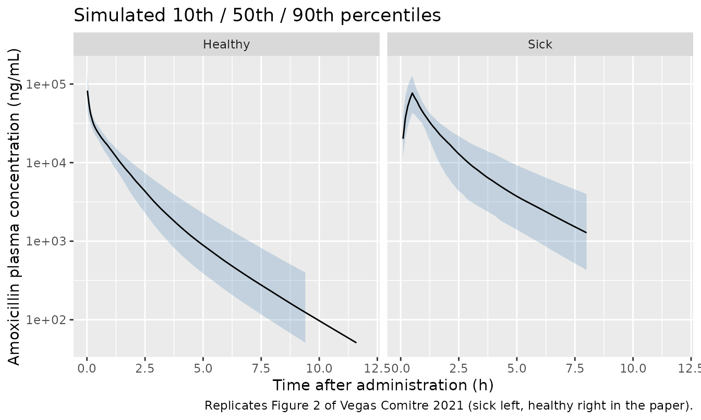
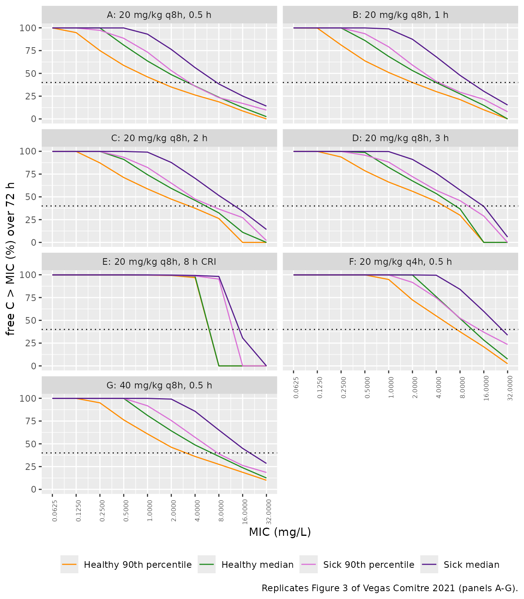

# Amoxicillin in healthy and critically ill dogs (Vegas Comitre 2021)

## Model and source

``` r

mod <- readModelDb("VegasComitre_2021_amoxicillin_dog")
ui <- rxode2::rxode(mod)
#> ℹ parameter labels from comments will be replaced by 'label()'
#> Warning: some etas defaulted to non-mu referenced, possible parsing error: etaiov_cl_1, etaiov_cl_2, etaiov_cl_3, etaiov_cl_4
#> as a work-around try putting the mu-referenced expression on a simple line
```

- Citation: Vegas Comitre MD, Cortellini S, Cherlet M, Devreese M,
  Roques BB, Bousquet-Melou A, Toutain P-L, Pelligand L. (2021).
  Population Pharmacokinetics of Intravenous Amoxicillin Combined With
  Clavulanic Acid in Healthy and Critically Ill Dogs. Frontiers in
  Veterinary Science 8:770202. <doi:10.3389/fvets.2021.770202>.
- Description: Veterinary (dog). Three-compartment population PK model
  for intravenous amoxicillin (given as amoxicillin-clavulanic acid) in
  12 healthy laboratory beagles (single 20 mg/kg IV bolus) and 12
  critically ill client-owned dogs in intensive care (20 mg/kg as a 0.5
  h IV infusion every 8 h for at least 48 h), fitted jointly in Phoenix
  NLME. All disposition parameters are body-weight-normalised (L/kg,
  L/h/kg), so the dose supplied to this model is mg of amoxicillin per
  kg. Critical illness (DIS_CRITILL) lowers clearance to 43.6% of the
  healthy value and lowers the clearance to the superficial peripheral
  compartment by exp(-9.946), which removes that compartment from the
  disposition of sick dogs. Between-occasion variability on clearance
  applies to sick dogs only, with a larger variance on occasion 3.
  Residual error is combined additive plus proportional with separate
  magnitudes for healthy and sick dogs. Protein binding was negligible,
  so Cc is also the free concentration.
- Article: <https://doi.org/10.3389/fvets.2021.770202> (open access;
  PMC8636140)

The paper’s Supplementary Material (Data Sheet 1) holds only
goodness-of-fit plots. The Results section says model code is included
there too, but the published Data Sheet 1 has none. Every value in the
model therefore comes from Table 4 and the Methods text.

## Population

The two cohorts were modelled together in one Phoenix NLME fit (Tables 1
and 2).

- **Healthy dogs.** Twelve intact female laboratory beagles from the
  Toulouse Veterinary School. Median age was 24 months and mean weight
  11.5 kg (range 9.9-13.2). Each dog got a single IV bolus of
  amoxicillin-clavulanic acid (AMC) 20 mg/kg, which is 16.95 +/- 0.37
  mg/kg of amoxicillin. Plasma was sampled at 0, 0.03, 0.17, 0.42, 0.67,
  1, 2, 4, 6, 8, 10 and 12 h.
- **Critically ill dogs.** Twelve client-owned, mixed-breed dogs in the
  intensive care unit of the Royal Veterinary College. Mean age was 40.2
  months (range 4.8-114) and mean weight 20.6 kg (range 11.4-42.0). The
  cohort was 4 male, 6 male neutered, 1 female and 1 female spayed dog.
  Diagnoses were septic peritonitis (7), pyothorax (3), acute
  haemorrhagic diarrhoea syndrome (1) and burns (1). Two dogs had acute
  kidney injury and one was mechanically ventilated. Eleven of the 12
  met SIRS criteria. The dogs got AMC 20 mg/kg (16.667 mg/kg
  amoxicillin) as a 0.5 h infusion every 8 h for at least 48 h. Sampling
  started after at least two doses. Samples were taken at the end of the
  infusion, then at 1, 2 and 4 h, with troughs at 8, 24 and 48 h.

In total, 218 amoxicillin concentrations were available (LLOQ 50 ng/mL,
handled with the M3 method). Protein binding measured by ultrafiltration
was negligible, so total concentration is also the free concentration.

The same information is available programmatically via
`readModelDb("VegasComitre_2021_amoxicillin_dog")()$population`.

## Source trace

| Equation / parameter | Value | Source location |
|----|----|----|
| Three-compartment model, IV input into central | n/a | Results, ‘Population Pharmacokinetic Model’ |
| `P_i = tvP * exp(eta_Pi)` | n/a | Methods Eq. (1) |
| `CV% = 100 * sqrt(exp(omega^2) - 1)` | n/a | Methods Eq. (2) |
| `lcl` (Cl, healthy) | 0.336 L/h/kg | Table 4 |
| `lvc` (V1) | 0.173 L/kg | Table 4 |
| `lq` (Cl2, superficial, healthy) | 0.861 L/h/kg | Table 4 |
| `lvp` (V2, superficial) | 0.174 L/kg | Table 4 |
| `lq2` (Cl3, deep) | 0.0373 L/h/kg | Table 4 |
| `lvp2` (V3, deep) | 0.0776 L/kg | Table 4 |
| `e_dis_critill_cl` | -0.829 | Table 4, theta(Health) on Cl; footnote: sick Cl = healthy Cl x exp(-0.829) |
| `e_dis_critill_q` | -9.946 | Table 4, theta(Health) on Cl2 |
| `etalcl` | 0.0399935 (20.2% CV) | Table 4, BSV Cl |
| `etalvc` | 0.309251 (60.2% CV) | Table 4, BSV V1 |
| `etalq` | 0.164606 (42.3% CV) | Table 4, BSV Cl2 |
| `etalvp` | 0.00842838 (9.2% CV) | Table 4, BSV V2 |
| `etaiov_cl_1`, `_2`, `_4` | 0.0321307 (18.07% CV) | Table 4, BOV on Cl (all but Occasion 3) |
| `etaiov_cl_3` | 0.16346 (42.14% CV) | Table 4, BOV on Cl (Occasion 3) |
| Occasion definitions | n/a | Methods, ‘Pharmacokinetic Analysis’ (estimation) and ‘Assessment of Dose-Exposure Relationship’ (simulation) |
| `propSd_healthy` | 0.042 | Table 4, proportional error healthy 4.2% |
| `addSd_healthy` | 0.0306 mg/L | Table 4, additive error healthy 30.6 ng/mL |
| `propSd_critill` | 0.359 | Table 4, proportional error sick 35.9% |
| `addSd_critill` | 0.00358 mg/L | Table 4, additive error sick 3.58 ng/mL |
| Combined additive + proportional residual error | n/a | Methods, ‘Pharmacokinetic Analysis’ |
| Free fraction = 1 | n/a | Results, ‘Protein Binding’ |

## Typical-value check

The Table 4 footnote says that sick-dog clearance is
`0.336 * exp(-0.829) = 0.147` L/h/kg, 43.6% of the control value. It
also says that `exp(-9.946)` makes V2 unidentifiable in sick dogs. The
model reproduces both.

``` r

tv <- with(as.list(ui$theta), c(
  cl_healthy = exp(lcl),
  cl_sick = exp(lcl + e_dis_critill_cl),
  q_healthy = exp(lq),
  q_sick = exp(lq + e_dis_critill_q)
))
signif(tv, 3)
#> cl_healthy    cl_sick  q_healthy     q_sick 
#>   3.36e-01   1.47e-01   8.61e-01   4.13e-05
stopifnot(
  abs(tv[["cl_sick"]] - 0.147) < 0.0005,
  abs(tv[["cl_sick"]] / tv[["cl_healthy"]] - 0.436) < 0.001,
  # Superficial compartment effectively disconnected: < 0.01% of healthy Cl2.
  tv[["q_sick"]] / tv[["q_healthy"]] < 1e-4
)
```

## Virtual cohort and simulation

No individual data are published. Because the model is
weight-normalised, each virtual dog needs only its health status
(`DIS_CRITILL`) and, for sick dogs, the occasion index (`OCC`). Doses
are mg of amoxicillin per kg. The paper’s Monte Carlo simulations used
1,000 dogs per population. Here, 200 per population and regimen are
used.

``` r

# One cohort of n dogs on a regimen given as amoxicillin mg/kg per dose,
# infusion duration (h; 0 = bolus), dosing interval (h) and number of doses.
# Sick dogs use the paper's simulation occasions: 24-h blocks from the first
# dose (Methods, 'Assessment of Dose-Exposure Relationship').
make_cohort <- function(n, sick, amt, dur, ii, n_dose, obs_times,
                        id_offset = 0L, regimen = "") {
  ids <- id_offset + seq_len(n)
  dose_times <- (seq_len(n_dose) - 1) * ii
  doses <- expand.grid(id = ids, time = dose_times) |>
    mutate(evid = 1L, amt = amt, rate = if (dur > 0) amt / dur else 0)
  obs <- expand.grid(id = ids, time = obs_times) |>
    mutate(evid = 0L, amt = 0, rate = 0)
  bind_rows(doses, obs) |>
    mutate(
      cmt = "central",
      DIS_CRITILL = sick,
      OCC = pmin(floor(time / 24) + 1, 4),
      population = if (sick == 1) "Sick" else "Healthy",
      regimen = regimen
    ) |>
    arrange(id, time, desc(evid))
}
```

### Figure 2: concentration-time profiles

The healthy dogs got one 16.95 mg/kg bolus. The sick dogs were dosed
with 16.667 mg/kg as a 0.5 h infusion every 8 h. Their PK sampling
interval was the third dose (16-24 h), matching Figure 1 (“the first
plasma concentration was measured 16 to 24 h thereafter”). That interval
is plotted against time after dose.

``` r

rxode2::rxSetSeed(20211115)
ev_vpc <- bind_rows(
  make_cohort(200, 0, amt = 16.95, dur = 0, ii = 24, n_dose = 1,
              obs_times = c(seq(0.02, 1, by = 0.02), seq(1.1, 12, by = 0.1)),
              id_offset = 0L),
  make_cohort(200, 1, amt = 16.667, dur = 0.5, ii = 8, n_dose = 7,
              obs_times = seq(16, 24, by = 0.1), id_offset = 200L)
)
stopifnot(!anyDuplicated(unique(ev_vpc[, c("id", "time", "evid")])))
sim_vpc <- rxode2::rxSolve(mod, events = ev_vpc, keep = "population",
                           returnType = "data.frame")
#> ℹ parameter labels from comments will be replaced by 'label()'
#> Warning: some etas defaulted to non-mu referenced, possible parsing error: etaiov_cl_1, etaiov_cl_2, etaiov_cl_3, etaiov_cl_4
#> as a work-around try putting the mu-referenced expression on a simple line
vpc <- sim_vpc |>
  mutate(tad = ifelse(population == "Sick", time - 16, time)) |>
  filter(tad > 0) |>
  group_by(population, tad) |>
  summarise(
    Q10 = quantile(Cc, 0.10), Q50 = median(Cc), Q90 = quantile(Cc, 0.90),
    .groups = "drop"
  )
ggplot(vpc, aes(tad, Q50 * 1000)) +
  geom_ribbon(aes(ymin = Q10 * 1000, ymax = Q90 * 1000), alpha = 0.25, fill = "steelblue") +
  geom_line() +
  facet_wrap(~population) +
  scale_y_log10(limits = c(50, NA)) +
  labs(x = "Time after administration (h)",
       y = "Amoxicillin plasma concentration (ng/mL)",
       title = "Simulated 10th / 50th / 90th percentiles",
       caption = "Replicates Figure 2 of Vegas Comitre 2021 (sick left, healthy right in the paper).")
#> Warning: Removed 26 rows containing missing values or values outside the scale range
#> (`geom_ribbon()`).
#> Warning: Removed 4 rows containing missing values or values outside the scale range
#> (`geom_line()`).
```



In Figure 2, observed concentrations are around 50,000 ng/mL shortly
after dosing in both groups. At 8 h the observed median is about 2,000
ng/mL in sick dogs and a few hundred ng/mL in healthy dogs. The
simulated bands follow the same shape. The sick-dog band is much wider
than the healthy one, which reflects the larger proportional residual
error and between-occasion variability of the ICU cohort.

### Figure 3: time above MIC for seven regimens

For each regimen, the fraction of the 72-h treatment during which the
free concentration exceeds the MIC (%fT \> MIC) is computed on a 0.1 h
grid. For each MIC, the plot shows the median and the value reached by
90% of dogs. The paper labels that value the “90th percentile” and it is
the 10th percentile of %fT \> MIC. The PK/PD cutoff (PK/PDCO) is the
highest MIC at which 90% of dogs reach 40% fT \> MIC.

``` r

regimens <- tribble(
  ~regimen,                        ~amt,   ~dur, ~ii,
  "A: 20 mg/kg q8h, 0.5 h",        16.667, 0.5,  8,
  "B: 20 mg/kg q8h, 1 h",          16.667, 1,    8,
  "C: 20 mg/kg q8h, 2 h",          16.667, 2,    8,
  "D: 20 mg/kg q8h, 3 h",          16.667, 3,    8,
  "E: 20 mg/kg q8h, 8 h CRI",      16.667, 8,    8,
  "F: 20 mg/kg q4h, 0.5 h",        16.667, 0.5,  4,
  "G: 40 mg/kg q8h, 0.5 h",        33.333, 0.5,  8
)
mics <- 2^(-4:5)
grid72 <- seq(0, 71.9, by = 0.1)

ft_one <- function(k) {
  r <- regimens[k, ]
  ev <- bind_rows(
    make_cohort(200, 0, r$amt, r$dur, r$ii, 72 / r$ii, grid72,
                id_offset = 0L, regimen = r$regimen),
    make_cohort(200, 1, r$amt, r$dur, r$ii, 72 / r$ii, grid72,
                id_offset = 200L, regimen = r$regimen)
  )
  s <- rxode2::rxSolve(mod, events = ev, keep = c("population", "regimen"),
                       returnType = "data.frame")
  s |>
    group_by(regimen, population, id) |>
    reframe(mic = mics, ft = vapply(mics, function(m) 100 * mean(Cc > m), numeric(1)))
}
rxode2::rxSetSeed(770202)
ft <- bind_rows(lapply(seq_len(nrow(regimens)), ft_one))

ft_sum <- ft |>
  group_by(regimen, population, mic) |>
  summarise(median = median(ft), p90 = quantile(ft, 0.10), .groups = "drop")
```

``` r

ft_sum |>
  pivot_longer(c(median, p90), names_to = "stat", values_to = "ft") |>
  mutate(curve = paste(population, ifelse(stat == "median", "median", "90th percentile"))) |>
  ggplot(aes(mic, ft, colour = curve)) +
  geom_line() +
  geom_hline(yintercept = 40, linetype = "dotted") +
  scale_x_continuous(trans = "log2", breaks = mics, labels = format(mics)) +
  scale_colour_manual(values = c(
    "Healthy median" = "forestgreen", "Healthy 90th percentile" = "darkorange",
    "Sick median" = "purple4", "Sick 90th percentile" = "orchid"
  )) +
  facet_wrap(~regimen, ncol = 2) +
  labs(x = "MIC (mg/L)", y = "free C > MIC (%) over 72 h", colour = NULL,
       caption = "Replicates Figure 3 of Vegas Comitre 2021 (panels A-G).") +
  theme(legend.position = "bottom", axis.text.x = element_text(angle = 90, size = 6))
```



#### Comparison against Figure 3A

The standard-regimen curves below were read off Figure 3A by the
maintainers. The readings are at the tabulated MICs and are good to
about +/- 3 percentage points.

``` r

fig3a <- tribble(
  ~population, ~mic,  ~median_pub, ~p90_pub,
  "Healthy",   0.25,  100,         78,
  "Healthy",   0.5,   82,          62,
  "Healthy",   1,     65,          47,
  "Healthy",   2,     53,          36,
  "Healthy",   4,     40,          27,
  "Healthy",   8,     27,          17,
  "Healthy",   16,    13,          8,
  "Sick",      0.5,   100,         90,
  "Sick",      1,     96,          78,
  "Sick",      2,     83,          57,
  "Sick",      4,     63,          40,
  "Sick",      8,     43,          27,
  "Sick",      16,    28,          18,
  "Sick",      32,    15,          10
)
cmp3a <- ft_sum |>
  filter(regimen == regimens$regimen[1]) |>
  inner_join(fig3a, by = c("population", "mic")) |>
  mutate(d_median = median - median_pub, d_p90 = p90 - p90_pub)
cmp3a |>
  select(population, mic, median, median_pub, p90, p90_pub) |>
  mutate(mic = as.character(mic)) |>
  dplyr::rename(
    "Population" = population, "MIC (mg/L)" = mic,
    "Median, simulated" = median, "Median, Fig. 3A" = median_pub,
    "90th pct, simulated" = p90, "90th pct, Fig. 3A" = p90_pub
  ) |>
  knitr::kable(digits = 1, caption = "%fT > MIC over 72 h, standard regimen: simulated vs digitised Figure 3A.")
```

| Population | MIC (mg/L) | Median, simulated | Median, Fig. 3A | 90th pct, simulated | 90th pct, Fig. 3A |
|:---|:---|---:|---:|---:|---:|
| Healthy | 0.25 | 99.9 | 100 | 75.0 | 78 |
| Healthy | 0.5 | 81.0 | 82 | 58.7 | 62 |
| Healthy | 1 | 63.6 | 65 | 46.1 | 47 |
| Healthy | 2 | 48.6 | 53 | 35.0 | 36 |
| Healthy | 4 | 36.1 | 40 | 26.2 | 27 |
| Healthy | 8 | 23.8 | 27 | 18.8 | 17 |
| Healthy | 16 | 12.5 | 13 | 8.8 | 8 |
| Sick | 0.5 | 99.9 | 100 | 88.5 | 90 |
| Sick | 1 | 93.1 | 96 | 73.3 | 78 |
| Sick | 2 | 76.3 | 83 | 53.0 | 57 |
| Sick | 4 | 56.3 | 63 | 35.8 | 40 |
| Sick | 8 | 38.4 | 43 | 23.3 | 27 |
| Sick | 16 | 25.1 | 28 | 17.0 | 18 |
| Sick | 32 | 14.1 | 15 | 9.7 | 10 |

%fT \> MIC over 72 h, standard regimen: simulated vs digitised Figure
3A. {.table}

``` r


# Centre and robust-envelope gates (per-dog tails differ across rxode2
# builds, so no single point is asserted). A mis-transcribed clearance or a
# unit error shifts every curve by tens of points.
all_d <- c(cmp3a$d_median, cmp3a$d_p90)
stopifnot(
  abs(median(all_d)) < 5,
  quantile(abs(all_d), 0.9) < 10
)
```

#### PK/PD cutoffs

``` r

pkpdco <- ft_sum |>
  group_by(regimen, population) |>
  summarise(PKPDCO = suppressWarnings(max(mic[p90 >= 40])), .groups = "drop") |>
  pivot_wider(names_from = population, values_from = PKPDCO)
published_co <- tribble(
  ~regimen,                     ~Healthy_pub, ~Sick_pub,
  "A: 20 mg/kg q8h, 0.5 h",     1,            4,
  "D: 20 mg/kg q8h, 3 h",       4,            8,
  "F: 20 mg/kg q4h, 0.5 h",     NA,           16
)
pkpdco |>
  left_join(published_co, by = "regimen") |>
  dplyr::rename(
    "Regimen" = regimen,
    "Healthy, simulated" = Healthy, "Healthy, paper" = Healthy_pub,
    "Sick, simulated" = Sick, "Sick, paper" = Sick_pub
  ) |>
  knitr::kable(caption = "PK/PDCO (mg/L; highest MIC with >= 40% fT > MIC in 90% of dogs). Paper values are those stated in the Results text.")
```

| Regimen | Healthy, simulated | Sick, simulated | Healthy, paper | Sick, paper |
|:---|---:|---:|---:|---:|
| A: 20 mg/kg q8h, 0.5 h | 1 | 2 | 1 | 4 |
| B: 20 mg/kg q8h, 1 h | 2 | 4 | NA | NA |
| C: 20 mg/kg q8h, 2 h | 2 | 4 | NA | NA |
| D: 20 mg/kg q8h, 3 h | 4 | 8 | 4 | 8 |
| E: 20 mg/kg q8h, 8 h CRI | 4 | 8 | NA | NA |
| F: 20 mg/kg q4h, 0.5 h | 4 | 8 | NA | 16 |
| G: 40 mg/kg q8h, 0.5 h | 2 | 4 | NA | NA |

PK/PDCO (mg/L; highest MIC with \>= 40% fT \> MIC in 90% of dogs). Paper
values are those stated in the Results text. {.table}

The paper states PK/PDCO values for regimens A, D and F in the text. For
the other regimens, Figure 3 marks each crossing with an arrow but gives
no number. The simulated cutoffs agree with the stated values to within
one two-fold dilution. Regimen D matches exactly. The regimen A (sick)
and regimen F cutoffs can come out one dilution lower. In each of those
cases the paper’s 90th-percentile curve crosses 40% right at the stated
cutoff MIC. The simulated curve reaches only about 35-39% there, while
the simulated medians match the figure closely. A tail shortfall of a
few percentage points therefore moves a statistic read on a two-fold
grid by a whole dilution. The most likely cause is the unreported
off-diagonal random-effect terms (see Assumptions and deviations).
Cohort size may also contribute: 200 dogs per arm here, 1,000 in the
paper.

## PKNCA validation

The paper reports no NCA. Its derived clearances are 0.336 L/h/kg in
healthy dogs and 0.147 L/h/kg in sick dogs (Abstract, Results). The
volume at steady state follows from Table 4: V1 + V2 + V3 = 0.425 L/kg
in healthy dogs. In sick dogs Cl2 is near zero, so V2 drops out and the
volume is V1 + V3 = 0.251 L/kg. These are typical (median) values, so
they can be checked against the median of a single-dose NCA. Sick dogs
are simulated on one occasion (`OCC = 1`) so that clearance stays
constant within each profile.

``` r

rxode2::rxSetSeed(8636140)
nca_times <- c(0, 0.03, 0.083, 0.17, 0.25, 0.42, 0.5, 0.67, 1, 1.5, 2, 3, 4,
               6, 8, 10, 12, 16, 24, 36, 48)
ev_nca <- bind_rows(
  make_cohort(200, 0, amt = 16.95, dur = 0, ii = 24, n_dose = 1,
              obs_times = nca_times, id_offset = 0L),
  make_cohort(200, 1, amt = 16.667, dur = 0.5, ii = 24, n_dose = 1,
              obs_times = nca_times, id_offset = 200L)
) |>
  mutate(OCC = 1, treatment = population)
# Post-dose concentrations below the assay LLOQ (50 ng/mL = 0.05 mg/L) are
# set to missing, as in the study. Without this, healthy-dog profiles fall to
# ~1e-7 mg/L by 36-48 h, and ODE round-off there (tiny negative values) breaks
# the lambda_z fit.
sim_nca <- rxode2::rxSolve(mod, events = ev_nca, keep = "treatment",
                           returnType = "data.frame") |>
  dplyr::mutate(Cc = ifelse(time > 0 & Cc < 0.05, NA_real_, Cc)) |>
  dplyr::filter(!is.na(Cc)) |>
  dplyr::select(id, time, Cc, treatment)
# Guarantee a time-zero row; for an IV dose the pre-dose concentration is 0.
sim_nca <- bind_rows(
  sim_nca,
  sim_nca |> distinct(id, treatment) |> mutate(time = 0, Cc = 0)
) |>
  distinct(id, treatment, time, .keep_all = TRUE) |>
  arrange(id, treatment, time)

dose_df <- ev_nca |>
  filter(evid == 1) |>
  mutate(duration = ifelse(rate > 0, amt / rate, 0)) |>
  select(id, time, amt, duration, treatment)

conc_obj <- PKNCA::PKNCAconc(sim_nca, Cc ~ time | treatment + id)
dose_obj <- PKNCA::PKNCAdose(dose_df, amt ~ time | treatment + id,
                             route = "intravascular", duration = "duration")
intervals <- data.frame(
  start = 0, end = Inf,
  cmax = TRUE, aucinf.obs = TRUE, half.life = TRUE,
  cl.obs = TRUE, vss.obs = TRUE
)
nca_res <- PKNCA::pk.nca(PKNCA::PKNCAdata(conc_obj, dose_obj, intervals = intervals))

published <- tribble(
  ~treatment, ~cl.obs, ~vss.obs,
  "Healthy",  0.336,   0.173 + 0.174 + 0.0776,
  "Sick",     0.147,   0.173 + 0.0776
)
cmp <- nlmixr2lib::ncaComparisonTable(
  simulated = nca_res,
  reference = published,
  by = "treatment",
  params = c("cl.obs", "vss.obs"),
  units = c(cl.obs = "L/h/kg", vss.obs = "L/kg"),
  tolerance_pct = 20
)
knitr::kable(cmp, caption = "Simulated single-dose NCA (median) vs the paper's typical clearance and Table 4 volumes. * differs by more than 20%.")
```

| NCA parameter | treatment | Reference | Simulated | % diff |
|:--------------|:----------|:----------|:----------|:-------|
| CL/F (L/h/kg) | Healthy   | 0.336     | 0.331     | -1.4%  |
| CL/F (L/h/kg) | Sick      | 0.147     | 0.149     | +1.4%  |
| Vss/F (L/kg)  | Healthy   | 0.425     | 0.432     | +1.6%  |
| Vss/F (L/kg)  | Sick      | 0.251     | 0.275     | +9.9%  |

Simulated single-dose NCA (median) vs the paper’s typical clearance and
Table 4 volumes. \* differs by more than 20%. {.table}

``` r


nca_tab <- as.data.frame(nca_res$result) |>
  filter(PPTESTCD %in% c("cl.obs", "vss.obs")) |>
  group_by(treatment, PPTESTCD) |>
  summarise(med = median(PPORRES, na.rm = TRUE), n = sum(!is.na(PPORRES)), .groups = "drop")
med_of <- function(trt, p) nca_tab$med[nca_tab$treatment == trt & nca_tab$PPTESTCD == p]
stopifnot(
  # Nearly every profile must yield a clearance, or the median is meaningless.
  all(nca_tab$n >= 190),
  abs(med_of("Healthy", "cl.obs") / 0.336 - 1) < 0.10,
  abs(med_of("Sick", "cl.obs") / 0.147 - 1) < 0.10
)
```

The median NCA clearance matches the typical values. The volume
comparison is looser because the 60% CV on V1 enters Vss additively, not
multiplicatively. The median of the sum is therefore close to, but not
exactly, the sum of the typical values.

## Assumptions and deviations

- **Weight-normalised parameterisation.** The paper estimates every
  volume and clearance per kg of body weight, and all doses are
  prescribed in mg/kg. The model keeps that form, so doses are mg of
  amoxicillin per kg. AMC 20 mg/kg corresponds to 16.667 mg/kg of
  amoxicillin. Concentrations are mg/L. The two additive residual SDs
  are converted from the paper’s ng/mL.
- **Diagonal random-effect matrix.** The Methods say a full
  variance-covariance matrix was used for the Monte Carlo simulations,
  but Table 4 reports only the variances (as CV%). The off-diagonal
  terms are unknown and are set to zero. This is the most likely reason
  the simulated 90th-percentile (lower tail) %fT \> MIC curves run a few
  percentage points below Figure 3 while the medians agree. Because of
  that, the PK/PDCO for regimen A (sick dogs) and regimen F (both
  populations) comes out one two-fold dilution below the published
  value.
- **Between-occasion variability.** Table 4 describes BOV as that of
  sick dogs, and the paper’s simulations included it for sick dogs only,
  so the model gates it with `DIS_CRITILL`. Occasions 1, 2 and 4 share
  one variance (18.07% CV) and occasion 3 has its own (42.14% CV). In
  Table 4 the bootstrap medians of these two rows (47 and 19.4) look
  transposed relative to the estimates. The ‘Estimate’ column is used,
  which agrees with the Results text (“day-to-day variability much
  higher in Occasion 3”).
- **Occasion definition.** For estimation the occasions were built
  around the 8-, 24- and 48-h troughs. The paper’s simulations, and this
  vignette, use 24-h blocks from the first dose. The model reads
  whatever occasion index is supplied in `OCC`. Any value outside 1-4
  switches the BOV term off.
- **Residual error form.** The Methods say only “a combination of
  additive and proportional error model”. The standard Phoenix
  additive-plus-multiplicative form, with variance
  `add^2 + (prop * C)^2`, is assumed. That is the same form as rxode2’s
  default `add() + prop()`. The paper estimated the error separately in
  healthy and sick dogs, and the model switches between the two sets
  with `DIS_CRITILL`.
- **Free concentration.** Protein binding was negligible (Results,
  ‘Protein Binding’), so the %fT \> MIC calculation uses `Cc` directly,
  as the paper did.
- **Confounding.** Health status is fully confounded with breed, sex,
  weight and study site (healthy intact female beagles in Toulouse, sick
  mixed-breed dogs at the Royal Veterinary College). `DIS_CRITILL`
  carries all of these differences.
- **Figure 3 values** in the comparison table were digitised by the
  maintainers from the published figure (about +/- 3 percentage points).
- No correction notice for this article was found on the publisher’s
  page or in Crossref as of 2026-09-29.
