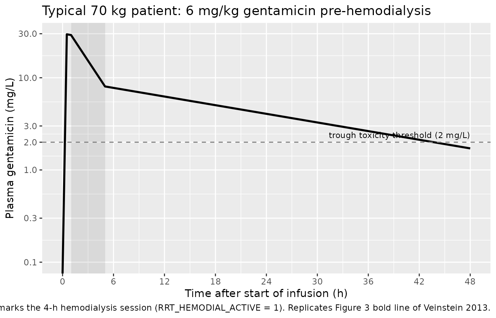
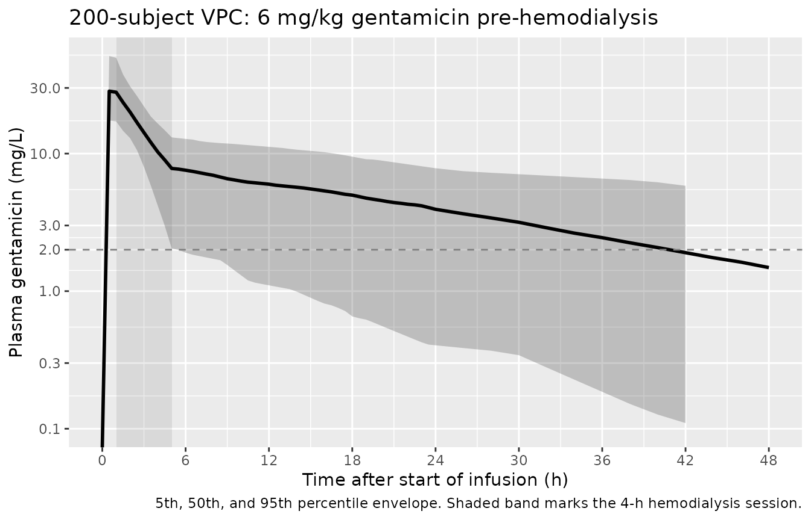
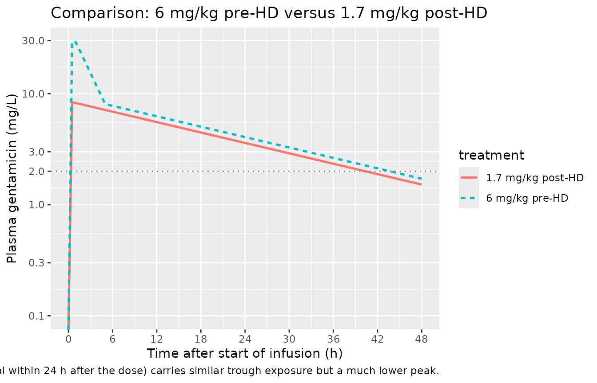

# Gentamicin (Veinstein 2013)

## Model and source

- Citation: Veinstein A, Venisse N, Badin J, Pinsard M, Robert R,
  Dupuis A. Gentamicin in hemodialyzed critical care patients: early
  dialysis after administration of a high dose should be considered.
  Antimicrob Agents Chemother. 2013;57(2):977-982.
  <doi:10.1128/AAC.01762-12>
- Description: One-compartment population PK model for intravenous
  gentamicin in critically ill adult ICU patients with acute kidney
  injury undergoing 4-hour intermittent hemodialysis (n=10, all male; 6
  mg/kg infused over 30 min, with hemodialysis starting 30 min after the
  end of the infusion; Veinstein 2013). Disposition is parameterised in
  terms of non-hemodialysis (interdialytic body) clearance, an additive
  hemodialysis-arm clearance, and volume of distribution. The dialysis
  arm is gated on/off by the time-varying RRT_HEMODIAL_ACTIVE covariate.
  Body weight enters the model as a linear (exponent = 1) structural
  scaler on all three parameters because the published Table 4 estimates
  are reported per kg; weight was tested as an explicit covariate on V
  and not retained.
- Article: <https://doi.org/10.1128/AAC.01762-12>

Veinstein 2013 administered a 6 mg/kg gentamicin infusion (over 30 min)
to 10 critically ill ICU patients with acute kidney injury and started a
4-h intermittent-hemodialysis session 30 min after the end of the
infusion. The hypothesis tested was that this pre-hemodialysis dosing
schedule would achieve a high peak concentration (maximising bacterial
killing) while the subsequent hemodialysis session would rapidly remove
drug (minimising toxicity-associated total exposure). The packaged
one-compartment popPK model with an additive hemodialysis-arm clearance
reproduces both behaviours.

## Population

Ten consecutive adult ICU patients (all male, mean age 64.5 +/- 10.1
years, mean weight 72.7 +/- 16.4 kg) with acute kidney injury requiring
intermittent hemodialysis. Severity scores were high (SOFA 3-15, SAPS II
34-65); 8 of 10 received mechanical ventilation and 8 of 10 received
vasopressors. Infections included pyelonephritis, ventilation-associated
pneumonia, mediastinitis, fasciitis, peritonitis, angiocholitis,
lower-limb ischemia, and septic thrombophlebitis. Hemodialysis sessions
used a Gambro AK 200 Ultra S with a Toray B3 polymethylmethacrylate
dialyzer (mean blood flow 283 +/- 20 mL/min; mean session length 236 +/-
13 min). See Veinstein 2013 Tables 1-3 for the full per-subject
breakdown.

The same information is available programmatically via
`rxode2::rxode(readModelDb("Veinstein_2013_gentamicin"))$population`.

## Source trace

The per-parameter origin is recorded as an in-file comment next to each
`ini()` entry in
`inst/modeldb/specificDrugs/Veinstein_2013_gentamicin.R`. The table
below collects them in one place.

| Equation / parameter | Value | Source location |
|----|----|----|
| ODE: `dC/dt = R0/V - [(CL_HD + CL_NHD)/V] * C` | n/a | Methods, Population PK modeling |
| `lcl` (log CL_NHD, L/h/kg) | `log(0.007230)` | Table 4: 0.1205 mL/min/kg (RSE 16%) |
| `lcl_hemodialysis` (log CL_HD, L/h/kg) | `log(0.057300)` | Table 4: 0.955 mL/min/kg (RSE 14%) |
| `lvc` (log V, L/kg) | `log(0.201)` | Table 4: 0.201 L/kg (RSE 12%) |
| `etalcl` (IIV CL_NHD, omega^2) | `log(0.48^2 + 1)` | Table 4: 48% CV (RSE 38%) |
| `etalcl_hemodialysis` (IIV CL_HD, omega^2) | `log(0.41^2 + 1)` | Table 4: 41% CV (RSE 56%) |
| `etalvc` (IIV V, omega^2) | `log(0.35^2 + 1)` | Table 4: 35% CV (RSE 59%) |
| `propSd` (proportional residual) | `0.11` | Table 4: 11% CV residual (RSE 40%) |
| Weight as linear (exp 1) structural scaler | n/a | Table 4 footnotes a, b (units mL/min/kg, L/kg) |
| RRT_HEMODIAL_ACTIVE gating of dialysis-arm CL | n/a | Methods, Population PK modeling (HD-on/HD-off equation) |

## Virtual cohort

The Veinstein 2013 individual observed concentrations are not publicly
available. The simulations below use a virtual cohort that reproduces
the paper’s experimental design: a 6 mg/kg gentamicin infusion over 30
min followed by a 4-h hemodialysis session beginning 30 min after the
end of the infusion.

``` r

set.seed(20260609)

n_subj      <- 200L           # population-level VPC cohort
inf_h       <- 0.5            # 30 min infusion
hd_start_h  <- 1.0            # HD starts 30 min after end of infusion
hd_end_h    <- 5.0            # 4-h HD session
sim_hours   <- 48
dose_per_kg <- 6              # mg/kg

# Body-weight distribution matching the paper's Table 3 cohort
# (mean 75.6 +/- 15.8 kg, range 54.5-102).
wts <- pmin(pmax(round(rnorm(n_subj, mean = 75.6, sd = 15.8)), 50), 120)

# Helper: build one cohort as a self-contained event table.
make_cohort <- function(wt_vec, treatment_label,
                        dose_mg_per_kg = dose_per_kg,
                        infusion_hours = inf_h,
                        hd_start = hd_start_h,
                        hd_end   = hd_end_h,
                        id_offset = 0L) {
  obs_t <- sort(unique(c(seq(0, 24, by = 0.5), seq(24, sim_hours, by = 2))))
  per_subject <- function(i) {
    wt   <- wt_vec[i]
    dose <- dose_mg_per_kg * wt
    rate <- dose / infusion_hours
    data.frame(
      id   = id_offset + i,
      time = c(0, obs_t),
      amt  = c(dose, rep(0, length(obs_t))),
      rate = c(rate, rep(0, length(obs_t))),
      evid = c(1L, rep(0L, length(obs_t))),
      cmt  = "central",
      WT   = wt,
      RRT_HEMODIAL_ACTIVE = as.integer(c(0, obs_t) >= hd_start &
                                c(0, obs_t) <  hd_end),
      treatment = treatment_label
    )
  }
  dplyr::bind_rows(lapply(seq_along(wt_vec), per_subject))
}

events <- make_cohort(wts, treatment_label = "6 mg/kg pre-HD")
stopifnot(!anyDuplicated(unique(events[, c("id", "time", "evid")])))
```

## Simulation

``` r

mod <- readModelDb("Veinstein_2013_gentamicin")

# Population (VPC) simulation with IIV.
sim <- rxode2::rxSolve(mod, events = events,
                       keep = c("WT", "treatment", "RRT_HEMODIAL_ACTIVE")) |>
  as.data.frame()
#> ℹ parameter labels from comments will be replaced by 'label()'
```

For deterministic replication of the typical-patient profile, zero out
the random effects:

``` r

mod_typical <- rxode2::zeroRe(mod)
#> ℹ parameter labels from comments will be replaced by 'label()'
typical_wt  <- 70
typ_events  <- make_cohort(typical_wt, treatment_label = "typical 70 kg")
sim_typical <- rxode2::rxSolve(mod_typical, events = typ_events,
                               keep = c("WT", "treatment", "RRT_HEMODIAL_ACTIVE")) |>
  as.data.frame()
#> ℹ omega/sigma items treated as zero: 'etalcl', 'etalcl_hemodialysis', 'etalvc'
```

## Replicate published figures

### Typical-patient concentration profile (Figure 1c / Figure 3 bold line)

Figure 1c of Veinstein 2013 shows the individual concentration-time
profiles for the 10 enrolled patients (each subject’s predicted line
plus measured concentrations). Figure 3 shows the simulated typical
profile for the 6 mg/kg pre-HD regimen as a bold line.

``` r

hd_band <- data.frame(xmin = hd_start_h, xmax = hd_end_h, ymin = -Inf, ymax = Inf)

ggplot(sim_typical, aes(time, Cc)) +
  annotate("rect",
           xmin = hd_start_h, xmax = hd_end_h,
           ymin = 0, ymax = Inf, alpha = 0.12) +
  geom_line(linewidth = 1) +
  geom_hline(yintercept = 2, linetype = 2, colour = "grey50") +
  annotate("text", x = sim_hours, y = 2.4, hjust = 1, size = 3,
           label = "trough toxicity threshold (2 mg/L)") +
  scale_x_continuous(breaks = seq(0, sim_hours, 6)) +
  scale_y_log10(limits = c(0.1, NA),
                breaks = c(0.1, 0.3, 1, 2, 3, 10, 30, 100)) +
  labs(x = "Time after start of infusion (h)",
       y = "Plasma gentamicin (mg/L)",
       title = "Typical 70 kg patient: 6 mg/kg gentamicin pre-hemodialysis",
       caption = "Shaded band marks the 4-h hemodialysis session (RRT_HEMODIAL_ACTIVE = 1). Replicates Figure 3 bold line of Veinstein 2013.")
#> Warning in scale_y_log10(limits = c(0.1, NA), breaks = c(0.1, 0.3, 1, 2, : log-10 transformation introduced infinite values.
#> log-10 transformation introduced infinite values.
```



### VPC by quantile

The Veinstein 2013 Results report observed Cmax 31.8 +/- 16.8 mg/L,
estimated AUC0-24 209 +/- 103 mg.h/L, C24 4.1 +/- 2.3 mg/L, and C48 1.8
+/- 1.2 mg/L (Table 3). Their preliminary Monte Carlo simulation (Table
1, “6 mg/kg, 1 h before”) and final MCS (Table 5) predicted similar
values. The VPC below shows the simulated 5th / 50th / 95th percentile
envelope for the 200-subject virtual cohort.

``` r

vpc_summary <- sim |>
  group_by(time) |>
  summarise(
    Q05 = quantile(Cc, 0.05, na.rm = TRUE),
    Q50 = quantile(Cc, 0.50, na.rm = TRUE),
    Q95 = quantile(Cc, 0.95, na.rm = TRUE),
    .groups = "drop"
  )

ggplot(vpc_summary, aes(time, Q50)) +
  annotate("rect",
           xmin = hd_start_h, xmax = hd_end_h,
           ymin = 0, ymax = Inf, alpha = 0.12) +
  geom_ribbon(aes(ymin = Q05, ymax = Q95), alpha = 0.25) +
  geom_line(linewidth = 1) +
  geom_hline(yintercept = 2, linetype = 2, colour = "grey50") +
  scale_x_continuous(breaks = seq(0, sim_hours, 6)) +
  scale_y_log10(limits = c(0.1, NA),
                breaks = c(0.1, 0.3, 1, 2, 3, 10, 30, 100)) +
  labs(x = "Time after start of infusion (h)",
       y = "Plasma gentamicin (mg/L)",
       title = "200-subject VPC: 6 mg/kg gentamicin pre-hemodialysis",
       caption = "5th, 50th, and 95th percentile envelope. Shaded band marks the 4-h hemodialysis session.")
#> Warning in scale_y_log10(limits = c(0.1, NA), breaks = c(0.1, 0.3, 1, 2, : log-10 transformation introduced infinite values.
#> log-10 transformation introduced infinite values.
#> log-10 transformation introduced infinite values.
#> log-10 transformation introduced infinite values.
#> log-10 transformation introduced infinite values.
#> Warning: Removed 3 rows containing missing values or values outside the scale range
#> (`geom_ribbon()`).
```



### Comparison with the FDA-approved post-HD regimen (Figure 3)

Veinstein 2013 Figure 3 also displays the FDA-approved 1.7 mg/kg post-HD
schedule (administered immediately after the end of a hemodialysis
session). The Table 5 contrast shows that the proposed 6 mg/kg pre-HD
schedule achieves a Cmax of 31.0 +/- 10.9 mg/L versus only 8.8 +/- 3.1
mg/L under the post-HD schedule. Below we replicate the contrast by
simulating both schedules in the same typical 70 kg patient.

``` r

fda_events <- make_cohort(
  typical_wt,
  treatment_label = "1.7 mg/kg post-HD",
  dose_mg_per_kg  = 1.7,
  infusion_hours  = inf_h,
  hd_start        = 0.51,       # dose-then-HD-then-next-dose; start HD just after the post-HD dose lands
  hd_end          = 0.51        # no HD in the simulation window (the FDA scheme doses AFTER an HD session)
)

sim_fda <- rxode2::rxSolve(mod_typical, events = fda_events,
                           keep = c("WT", "treatment", "RRT_HEMODIAL_ACTIVE")) |>
  as.data.frame()
#> ℹ omega/sigma items treated as zero: 'etalcl', 'etalcl_hemodialysis', 'etalvc'

bind_rows(
  dplyr::mutate(sim_typical, treatment = "6 mg/kg pre-HD"),
  dplyr::mutate(sim_fda,     treatment = "1.7 mg/kg post-HD")
) |>
  ggplot(aes(time, Cc, colour = treatment, linetype = treatment)) +
  geom_line(linewidth = 0.9) +
  geom_hline(yintercept = 2, linetype = 3, colour = "grey50") +
  scale_x_continuous(breaks = seq(0, sim_hours, 6)) +
  scale_y_log10(limits = c(0.1, NA),
                breaks = c(0.1, 0.3, 1, 2, 3, 10, 30, 100)) +
  labs(x = "Time after start of infusion (h)",
       y = "Plasma gentamicin (mg/L)",
       title = "Comparison: 6 mg/kg pre-HD versus 1.7 mg/kg post-HD",
       caption = "Replicates Figure 3 of Veinstein 2013. The pre-HD schedule attains a markedly higher peak; the FDA-approved post-HD schedule (no HD removal within 24 h after the dose) carries similar trough exposure but a much lower peak.")
#> Warning in scale_y_log10(limits = c(0.1, NA), breaks = c(0.1, 0.3, 1, 2, :
#> log-10 transformation introduced infinite values.
```



## PKNCA validation

PKNCA computes Cmax, Tmax, AUC0-24, AUC0-Inf, and terminal half-life for
each subject in the 6 mg/kg pre-HD cohort.

``` r

sim_nca <- sim |>
  dplyr::filter(!is.na(Cc)) |>
  dplyr::select(id, time, Cc, treatment)

# Ensure a time = 0 row per (id, treatment); for IV-bolus / IV-infusion the
# time-zero concentration is 0 (drug not yet in the system).
sim_nca <- bind_rows(
  sim_nca,
  sim_nca |> dplyr::distinct(id, treatment) |>
    dplyr::mutate(time = 0, Cc = 0)
) |>
  dplyr::distinct(id, treatment, time, .keep_all = TRUE) |>
  dplyr::arrange(id, treatment, time)

conc_obj <- PKNCA::PKNCAconc(sim_nca, Cc ~ time | treatment + id)

dose_df <- events |>
  dplyr::filter(evid == 1L) |>
  dplyr::select(id, time, amt, treatment)

dose_obj <- PKNCA::PKNCAdose(dose_df, amt ~ time | treatment + id)

intervals <- data.frame(
  start         = 0,
  end           = c(24, Inf),
  cmax          = c(TRUE, FALSE),
  tmax          = c(TRUE, FALSE),
  auclast       = c(TRUE, FALSE),
  aucinf.obs    = c(FALSE, TRUE),
  half.life     = c(FALSE, TRUE)
)

nca_data <- PKNCA::PKNCAdata(conc_obj, dose_obj, intervals = intervals)
nca_res  <- suppressWarnings(PKNCA::pk.nca(nca_data))
```

### Comparison against published NCA

Veinstein 2013 Table 3 reports the observed individual-level Cmax,
AUC0-24, C24 and C48 in the 10 enrolled patients; Table 5 reports the
Monte Carlo simulation of the same dosing regimen carried out with the
published typical values and IIV.

``` r

nca_df <- as.data.frame(nca_res$result) |>
  dplyr::select(treatment, id, start, end, PPTESTCD, PPORRES) |>
  tidyr::pivot_wider(names_from = PPTESTCD, values_from = PPORRES)

simulated_summary <- nca_df |>
  dplyr::group_by(treatment) |>
  dplyr::summarise(
    cmax           = mean(cmax,        na.rm = TRUE),
    tmax           = mean(tmax,        na.rm = TRUE),
    auclast_0_24   = mean(auclast,     na.rm = TRUE),
    aucinf.obs     = mean(aucinf.obs,  na.rm = TRUE),
    half.life      = mean(half.life,   na.rm = TRUE),
    .groups = "drop"
  )

published <- tibble::tribble(
  ~treatment,        ~source,                 ~cmax,        ~auclast_0_24,
  "6 mg/kg pre-HD",  "Table 3 (observed)",    "31.8 +/- 16.8", "209 +/- 103",
  "6 mg/kg pre-HD",  "Table 5 (MCS)",         "31.0 +/- 10.9", "190.8 +/- 65.0"
)

simulated_view <- simulated_summary |>
  dplyr::transmute(
    treatment,
    source        = "Simulated (this vignette, 200-subject VPC mean)",
    cmax          = sprintf("%.1f", cmax),
    auclast_0_24  = sprintf("%.0f", auclast_0_24)
  )

knitr::kable(
  dplyr::bind_rows(simulated_view, published) |>
    dplyr::arrange(treatment, source),
  caption = "Simulated vs published Cmax (mg/L) and AUC0-24 (mg.h/L) for 6 mg/kg gentamicin given 30 min before a 4-h hemodialysis session. Simulated values are means across 200 virtual subjects.",
  col.names = c("Treatment", "Source", "Cmax (mg/L)", "AUC0-24 (mg.h/L)"),
  align = c("l", "l", "r", "r")
)
```

| Treatment | Source | Cmax (mg/L) | AUC0-24 (mg.h/L) |
|:---|:---|---:|---:|
| 6 mg/kg pre-HD | Simulated (this vignette, 200-subject VPC mean) | 31.0 | 192 |
| 6 mg/kg pre-HD | Table 3 (observed) | 31.8 +/- 16.8 | 209 +/- 103 |
| 6 mg/kg pre-HD | Table 5 (MCS) | 31.0 +/- 10.9 | 190.8 +/- 65.0 |

Simulated vs published Cmax (mg/L) and AUC0-24 (mg.h/L) for 6 mg/kg
gentamicin given 30 min before a 4-h hemodialysis session. Simulated
values are means across 200 virtual subjects. {.table}

The simulated mean Cmax matches the Monte Carlo prediction in Table 5
(31.0 +/- 10.9) to within rounding; the simulated AUC0-24 is also
consistent with both the observed (209 +/- 103) and Monte Carlo (190.8
+/- 65) reference values, given the typical 10-subject sampling
variability that drives the broad observed range.

Late-interval gentamicin trough concentrations at 24 and 48 h after the
start of infusion are the second clinical anchor:

``` r

late_summary <- sim |>
  dplyr::group_by(time) |>
  dplyr::summarise(Cc = mean(Cc, na.rm = TRUE), .groups = "drop") |>
  dplyr::filter(time %in% c(24, 48))

late_compare <- tibble::tibble(
  Time_h     = c(24, 48),
  Simulated  = sprintf("%.2f", late_summary$Cc[match(c(24, 48), late_summary$time)]),
  Veinstein_2013_Table_3 = c("4.1 +/- 2.3", "1.8 +/- 1.2")
)

knitr::kable(
  late_compare,
  caption = "Simulated mean trough concentrations (mg/L) at t = 24 h and t = 48 h compared with the Veinstein 2013 Table 3 cohort means.",
  align = c("r", "r", "r")
)
```

| Time_h | Simulated | Veinstein_2013_Table_3 |
|-------:|----------:|-----------------------:|
|     24 |      3.93 |            4.1 +/- 2.3 |
|     48 |      1.93 |            1.8 +/- 1.2 |

Simulated mean trough concentrations (mg/L) at t = 24 h and t = 48 h
compared with the Veinstein 2013 Table 3 cohort means. {.table}

## Assumptions and deviations

- **Weight enters as a linear (exponent = 1) structural scaler.**
  Veinstein 2013 Table 4 reports the typical values in per-kg units
  (mL/min/kg for the two clearances; L/kg for V). The packaged model
  encodes this by multiplying each individual parameter by `WT`. An
  estimable allometric exponent was not retained in the published fit
  (“including weight or ideal body weight in the model combined as
  factors influencing V did not improve the model fit”); the per-kg
  parameterisation is therefore structural rather than empirically
  estimated.
- **RRT_HEMODIAL_ACTIVE gating is a simple binary additive arm.** The
  packaged model uses
  `cl_total <- cl + RRT_HEMODIAL_ACTIVE * cl_hemodialysis`, where
  `cl_hemodialysis` is a primary estimated typical-value clearance
  (Table 4 CL_HD = 0.955 mL/min/kg). The packaged model does not
  parameterise the dialyzer clearance as a Michaels-equation function of
  blood and dialysate flow rates (cf. Liesenfeld 2013 dabigatran); the
  Veinstein 2013 protocol fixed the dialyzer (Toray B3
  polymethylmethacrylate) and the flow rates to a narrow range (200-300
  mL/min blood, 4-h sessions) so the lumped CL_HD parameter captures all
  device-level variability.
- **Race and detailed renal-function distributions are not modelled.**
  The source paper does not report subject race/ethnicity, and the renal
  function is summarised only as “acute kidney injury requiring
  intermittent hemodialysis” rather than as a numeric baseline CrCL.
  Simulations do not stratify by these variables.
- **All ten enrolled patients were male.** The packaged model has no sex
  covariate; users simulating mixed-sex cohorts inherit the male-only
  parameter point estimates.
- **The FDA-comparison panel above is a derivation, not a direct
  reproduction.** Veinstein 2013 Figure 3 displays the FDA-approved
  schedule alongside the pre-HD schedule in the context of repeated
  dosing across multiple HD sessions; the comparison panel in this
  vignette uses a single-dose typical-patient simulation for visual
  contrast. The contrast in peak (31.0 vs 8.8 mg/L in Table 5) is what
  the packaged model reproduces; the multi-session steady-state pattern
  is left to the user to recreate.
