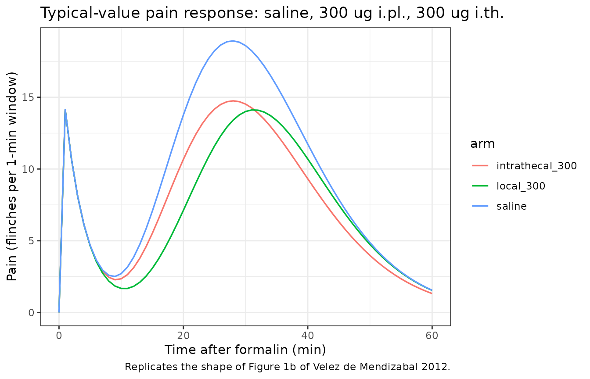
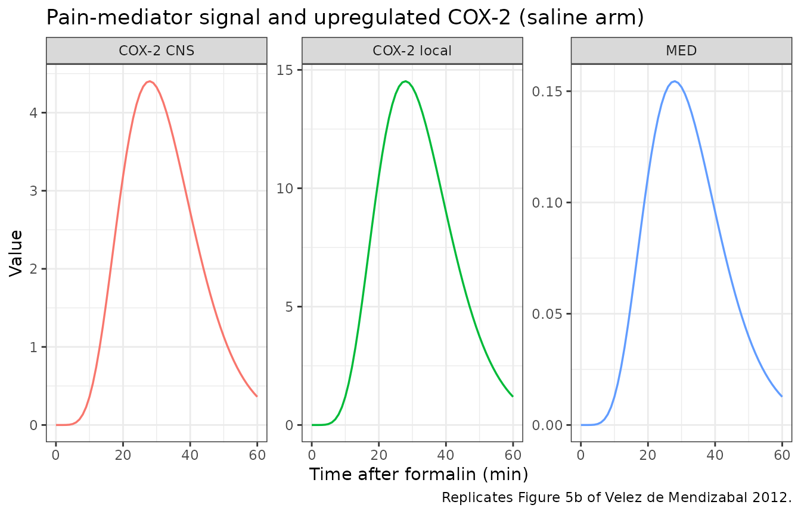
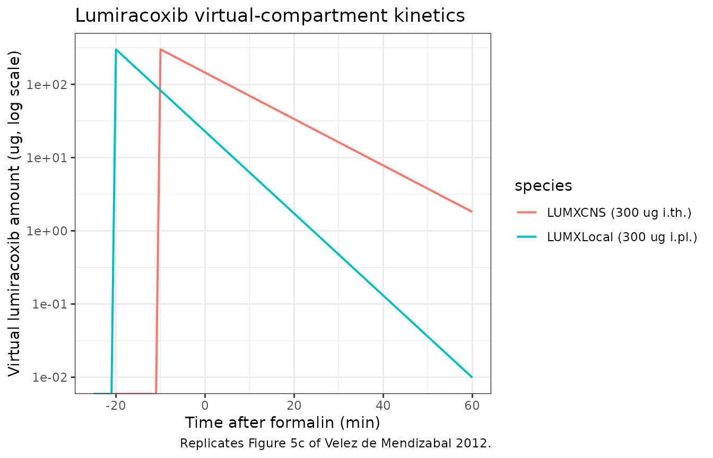

# Lumiracoxib formalin-test PD in rats (Velez de Mendizabal 2012)

## Model and source

- Citation: Velez de Mendizabal N, Vasquez-Bahena D, Jimenez-Andrade JM,
  Ortiz MI, Castaneda-Hernandez G, Troconiz IF. (2012). Semi-mechanistic
  modeling of the interaction between the central and peripheral effects
  in the antinociceptive response to lumiracoxib in rats. AAPS J
  14(4):904-914. <doi:10.1208/s12248-012-9405-y>.
- Article: <https://doi.org/10.1208/s12248-012-9405-y>

This is a semi-mechanistic PD model of the formalin-induced
antinociceptive response to lumiracoxib in adult female Wistar rats. The
drug was administered by intraplantar (i.pl., 20 min before formalin)
and/or intrathecal (i.th., 10 min before formalin) routes; lumiracoxib
levels were never measured. Lumiracoxib is therefore tracked through two
virtual compartments (`lumxLocal`, `lumxCns`), each decaying
monoexponentially from a bolus equal to the administered dose (10, 30,
100, or 300 ug). The observed quantity is the number of paw flinches per
1-min window recorded every 5 min for 60 min after formalin injection.

## Population

86 adult female Wistar rats (180-220 g, 6-7 weeks of age) from the
CINVESTAV breeding colony, Mexico City. 14 groups of 6 animals: 4 i.pl.
dose levels (10 / 30 / 100 / 300 ug), 4 i.th. dose levels (same), 5
combined-route fixed-ratio doses (i.pl. + i.th.: 13 + 13.52, 26 + 27,
52 + 54, 104 + 108, 208 + 216 ug), and 1 saline control. Intrathecal
catheterization was performed under ketamine-xylazine anesthesia at
least 5 days prior to dosing. See Methods, “Animals” and “Study Design”.

The same metadata is available programmatically via
`readModelDb("VelezdeMendizabal_2012_lumiracoxib_rat")$population`.

## Source trace

Every parameter is tagged with an in-file source-trace comment next to
its `ini()` entry; the table below collects them in one place.

| Equation / parameter | Value (CV%, IAV%) | Source location |
|----|----|----|
| `lkdLocal` (K_D_Local) | 0.129 1/min (5.34%) | Table I, row 1 |
| `lkdCns` (K_D_CNS) | 0.073 1/min (22.16%) | Table I, row 2 |
| `lthetaCox2Local` (theta_COX-2_L) | 94.0 flinches (7.79%, IAV 15.87% CV) | Table I, row 3 |
| `lthetaCox2Cns` (theta_COX-2_CNS) | 28.5 flinches (24.91%) | Table I, row 4 |
| `lpn10` (PN1,0) | 18.7 flinches (3.14%, IAV 22.4% CV) | Table I, row 5 |
| `lkpn1` (K_PN1) | 0.279 1/min (6.37%) | Table I, row 6 |
| `lnc` (NC, Erlang chain length) | 6.5 (4.92%, IAV 11.09% CV) | Table I, row 7 |
| `lktr` (K_TR) | 0.233 1/min (4.20%) | Table I, row 8 |
| `addSd_pain` (residual SD on flinches) | 2.93 flinches (19.11%) | Table I, row 9 |
| Eq. 1 dPN1/dt = -K_PN1 \* PN1; PN1(0) = PN1_0 | – | Equation 1 |
| Eq. 2 MED(t) = (K_TR \* t)^NC \* exp(-K_TR \* t) / NC! with MED0 = 1 | – | Equation 2 |
| Eqs. 3-4 COX-2_Local / COX-2_CNS proportional to MED | – | Equations 3-4 |
| Eq. 5 PN2 = COX-2_Local + COX-2_CNS | – | Equation 5 |
| Eq. 6 PAIN = PN1 + PN2 | – | Equation 6 |
| Eqs. 7-8 LUMX decay (mono-exponential) | – | Equations 7-8 |
| Eqs. 9-10 E = 1 / (1 + LUMX) (IC50 = 1, structurally fixed) | – | Equations 9-10 |
| Eq. 11 PN2 with drug effects | – | Equation 11 |

## Loading the model

``` r

mod <- readModelDb("VelezdeMendizabal_2012_lumiracoxib_rat")
```

## Time convention

In this model `t` is referenced to the formalin injection (formalin at
`t = 0`). Lumiracoxib bolus events are scheduled at negative times
relative to formalin:

- Intraplantar (i.pl.) bolus into compartment `lumxLocal` at `t = -20`
  min.
- Intrathecal (i.th.) bolus into compartment `lumxCns` at `t = -10` min.

PN1 and the pain-mediator signal MED are zero for `t <= 0` (no formalin
yet, no response); the `(t > 0)` Heaviside gate in the model handles
this boundary so the analytical Erlang kernel stays finite at and before
formalin time.

``` r

# Build an event table for one dose-route combination. dose_local /
# dose_cns are the i.pl. and i.th. lumiracoxib bolus amounts in ug;
# either may be 0 (route not used).
make_arm <- function(dose_local, dose_cns) {
  ev <- et(seq(-25, 60, by = 1))
  if (dose_local > 0) ev <- et(ev, amt = dose_local, time = -20, cmt = "lumxLocal")
  if (dose_cns   > 0) ev <- et(ev, amt = dose_cns,   time = -10, cmt = "lumxCns")
  ev
}
```

## Replicate Figure 1b – saline and 300 ug single-route mean profiles

``` r

# Typical-value (no IIV, no residual error) simulation.
mod_typ <- rxode2::zeroRe(mod, c("iiv", "sigma"))
#> ℹ parameter labels from comments will be replaced by 'label()'

arms_1b <- list(
  saline       = make_arm(0,   0),
  local_300    = make_arm(300, 0),
  intrathecal_300 = make_arm(0, 300)
)

sim_1b <- bind_rows(lapply(names(arms_1b), function(nm) {
  s <- rxSolve(mod_typ, arms_1b[[nm]],
               omega = NA, sigma = NA)
  data.frame(time = s$time, pain = s$pain, arm = nm)
}))
#> Warning: 
#> with negative times, compartments initialize at first negative observed time
#> with positive times, compartments initialize at time zero
#> use 'rxSetIni0(FALSE)' to initialize at first observed time
#> this warning is displayed once per session

ggplot(sim_1b, aes(time, pain, colour = arm)) +
  geom_line(linewidth = 0.6) +
  scale_x_continuous(limits = c(0, 60)) +
  labs(x = "Time after formalin (min)",
       y = "Pain (flinches per 1-min window)",
       title = "Typical-value pain response: saline, 300 ug i.pl., 300 ug i.th.",
       caption = "Replicates the shape of Figure 1b of Velez de Mendizabal 2012.") +
  theme_bw()
#> Warning: Removed 75 rows containing missing values or values outside the scale range
#> (`geom_line()`).
```



The simulated saline trajectory shows the characteristic biphasic
profile: a rapid first-phase decay from PN1_0 = 18.7 flinches with rate
K_PN1 = 0.279 1/min, followed by a delayed second-phase rise to ~20
flinches near t = 30 min driven by the COX-2-mediated transit kernel.
Lumiracoxib suppresses the second phase but leaves the first phase
intact, exactly as described in Methods, “Model for the Formalin-Induced
Pain”.

## Replicate Figure 5b – pain-mediator signal MED and upregulated COX-2

``` r

# Use the saline arm: lumxLocal = lumxCns = 0, so the COX-2 levels equal
# their unsuppressed proportionality times MED.
ev_s <- make_arm(0, 0)
sim_5b <- rxSolve(mod_typ, ev_s, omega = NA, sigma = NA)

sim_5b_long <- sim_5b |>
  as.data.frame() |>
  filter(time >= 0) |>
  transmute(time = time,
            MED = med,
            `COX-2 local` = cox2Local,
            `COX-2 CNS`   = cox2Cns) |>
  pivot_longer(-time, names_to = "species", values_to = "value")

ggplot(sim_5b_long, aes(time, value, colour = species)) +
  geom_line(linewidth = 0.6) +
  facet_wrap(~ species, scales = "free_y") +
  labs(x = "Time after formalin (min)",
       y = "Value",
       title = "Pain-mediator signal and upregulated COX-2 (saline arm)",
       caption = "Replicates Figure 5b of Velez de Mendizabal 2012.") +
  theme_bw() +
  theme(legend.position = "none")
```



## Replicate Figure 5c – lumiracoxib virtual-compartment kinetics

``` r

sim_5c <- bind_rows(
  rxSolve(mod_typ, make_arm(300, 0),  omega = NA, sigma = NA) |>
    as.data.frame() |>
    transmute(time, value = lumxLocal, species = "LUMXLocal (300 ug i.pl.)"),
  rxSolve(mod_typ, make_arm(0,   300), omega = NA, sigma = NA) |>
    as.data.frame() |>
    transmute(time, value = lumxCns,   species = "LUMXCNS (300 ug i.th.)")
)

ggplot(sim_5c, aes(time, value, colour = species)) +
  geom_line(linewidth = 0.7) +
  scale_x_continuous(limits = c(-25, 60)) +
  scale_y_log10() +
  labs(x = "Time after formalin (min)",
       y = "Virtual lumiracoxib amount (ug, log scale)",
       title = "Lumiracoxib virtual-compartment kinetics",
       caption = "Replicates Figure 5c of Velez de Mendizabal 2012.") +
  theme_bw()
#> Warning in scale_y_log10(): log-10 transformation introduced infinite values.
```



## Numerical predictive check – replicate Table II

Table II reports N_MAX (peak flinch count across the 5-min observation
grid) and N_TOT (sum of flinch counts across observed windows) by
dose-route combination. We reproduce the same summary from a virtual
cohort of 100 animals per arm. The published 50th-percentile (and 2.5 /
97.5 percentile) ranges are listed for comparison.

``` r

set.seed(20120815)

dose_grid <- tribble(
  ~arm,                ~route,     ~dose_local, ~dose_cns,
  "Local 0",           "Local",            0,           0,
  "Local 10",          "Local",           10,           0,
  "Local 30",          "Local",           30,           0,
  "Local 100",         "Local",          100,           0,
  "Local 300",         "Local",          300,           0,
  "Intrathecal 10",    "Intrathecal",      0,          10,
  "Intrathecal 30",    "Intrathecal",      0,          30,
  "Intrathecal 100",   "Intrathecal",      0,         100,
  "Intrathecal 300",   "Intrathecal",      0,         300,
  "Combined 26.52",    "Combined",        13,       13.52,
  "Combined 53",       "Combined",        26,          27,
  "Combined 106",      "Combined",        52,          54,
  "Combined 212",      "Combined",       104,         108,
  "Combined 424",      "Combined",       208,         216
)

# Observation grid every 5 min from 5 to 60 (12 windows -- matches the
# paper's data-collection schedule). The first phase decays so quickly that
# the published windows essentially capture the second-phase response.
obs_grid <- seq(5, 60, by = 5)
n_subj   <- 100

simulate_arm <- function(dose_local, dose_cns) {
  ev <- et(obs_grid) |>
    et(id = seq_len(n_subj))
  if (dose_local > 0) ev <- et(ev, amt = dose_local, time = -20, cmt = "lumxLocal")
  if (dose_cns   > 0) ev <- et(ev, amt = dose_cns,   time = -10, cmt = "lumxCns")
  s <- rxSolve(mod, ev, nSub = n_subj, omega = NA)
  as.data.frame(s) |>
    filter(time %in% obs_grid) |>
    group_by(id) |>
    summarise(
      Nmax = max(pmax(pain, 0)),
      Ntot = sum(pmax(pain, 0)),
      .groups = "drop"
    )
}

sim_summary <- dose_grid |>
  rowwise() |>
  mutate(stats = list(simulate_arm(dose_local, dose_cns))) |>
  unnest(stats) |>
  group_by(arm, route) |>
  summarise(
    Nmax_p50 = round(median(Nmax), 2),
    Nmax_p025 = round(quantile(Nmax, 0.025), 2),
    Nmax_p975 = round(quantile(Nmax, 0.975), 2),
    Ntot_p50 = round(median(Ntot), 2),
    Ntot_p025 = round(quantile(Ntot, 0.025), 2),
    Ntot_p975 = round(quantile(Ntot, 0.975), 2),
    .groups = "drop"
  )
#> ℹ parameter labels from comments will be replaced by 'label()'
#> ℹ parameter labels from comments will be replaced by 'label()'
#> ℹ parameter labels from comments will be replaced by 'label()'
#> ℹ parameter labels from comments will be replaced by 'label()'
#> ℹ parameter labels from comments will be replaced by 'label()'
#> ℹ parameter labels from comments will be replaced by 'label()'
#> ℹ parameter labels from comments will be replaced by 'label()'
#> ℹ parameter labels from comments will be replaced by 'label()'
#> ℹ parameter labels from comments will be replaced by 'label()'
#> ℹ parameter labels from comments will be replaced by 'label()'
#> ℹ parameter labels from comments will be replaced by 'label()'
#> ℹ parameter labels from comments will be replaced by 'label()'
#> ℹ parameter labels from comments will be replaced by 'label()'
#> ℹ parameter labels from comments will be replaced by 'label()'
#> Warning: There were 14 warnings in `mutate()`.
#> The first warning was:
#> ℹ In argument: `stats = list(simulate_arm(dose_local, dose_cns))`.
#> ℹ In row 1.
#> Caused by warning:
#> ! multi-subject simulation without without 'omega'
#> ℹ Run `dplyr::last_dplyr_warnings()` to see the 13 remaining warnings.

# Published Table II values (50th and 2.5-97.5 percentiles from the
# model-based simulation of 500 datasets).
table_ii <- tribble(
  ~arm,                ~Nmax_pub50, ~Nmax_pub025, ~Nmax_pub975, ~Ntot_pub50, ~Ntot_pub025, ~Ntot_pub975,
  "Local 0",                 19.01,        14.72,        25.08,      103.25,        81.69,       131.61,
  "Local 10",                18.64,        14.35,        24.16,      100.52,        80.17,       129.38,
  "Local 30",                18.08,        13.24,        21.12,       97.41,        78.37,       124.57,
  "Local 100",               16.15,        12.12,        21.97,       89.80,        70.91,       114.72,
  "Local 300",               14.08,        11.36,        17.73,       76.54,        60.61,        97.90,
  "Intrathecal 10",          17.24,        13.29,        22.76,       94.78,        72.88,       121.77,
  "Intrathecal 30",          16.15,        12.12,        21.97,       89.32,        67.42,       119.81,
  "Intrathecal 100",         15.22,        11.27,        21.07,       84.08,        63.32,       112.29,
  "Intrathecal 300",         14.83,        10.67,        20.61,       81.06,        59.88,       111.03,
  "Combined 26.52",          16.57,        12.71,        21.76,       90.64,        69.44,       118.59,
  "Combined 53",             15.49,        11.87,        20.72,       84.90,        65.15,       111.78,
  "Combined 106",            14.37,        10.93,        19.17,       78.52,        59.20,       104.69,
  "Combined 212",            12.93,         9.58,        17.40,       69.95,        52.01,        95.55,
  "Combined 424",            11.24,         8.32,        15.20,       60.68,        43.49,        83.00
)

knitr::kable(
  sim_summary |>
    left_join(table_ii, by = "arm") |>
    select(arm, route,
           Nmax_p50, Nmax_pub50, Ntot_p50, Ntot_pub50),
  caption = "Simulated vs. published 50th-percentile N_MAX and N_TOT (Table II)."
)
```

| arm             | route       | Nmax_p50 | Nmax_pub50 | Ntot_p50 | Ntot_pub50 |
|:----------------|:------------|---------:|-----------:|---------:|-----------:|
| Combined 106    | Combined    |    14.29 |      14.37 |    84.13 |      78.52 |
| Combined 212    | Combined    |    12.89 |      12.93 |    75.70 |      69.95 |
| Combined 26.52  | Combined    |    16.49 |      16.57 |    97.20 |      90.64 |
| Combined 424    | Combined    |    11.08 |      11.24 |    66.07 |      60.68 |
| Combined 53     | Combined    |    15.47 |      15.49 |    91.30 |      84.90 |
| Intrathecal 10  | Intrathecal |    17.08 |      17.24 |   101.38 |      94.78 |
| Intrathecal 100 | Intrathecal |    14.95 |      15.22 |    90.42 |      84.08 |
| Intrathecal 30  | Intrathecal |    15.93 |      16.15 |    95.70 |      89.32 |
| Intrathecal 300 | Intrathecal |    14.52 |      14.83 |    87.62 |      81.06 |
| Local 0         | Local       |    18.60 |      19.01 |   109.71 |     103.25 |
| Local 10        | Local       |    18.38 |      18.64 |   107.62 |     100.52 |
| Local 100       | Local       |    16.65 |      16.15 |    95.64 |      89.80 |
| Local 30        | Local       |    17.95 |      18.08 |   104.13 |      97.41 |
| Local 300       | Local       |    14.01 |      14.08 |    82.76 |      76.54 |

Simulated vs. published 50th-percentile N_MAX and N_TOT (Table II).
{.table style="width:100%;"}

The simulated 50th-percentile values are in the same range as the
published values across all 14 arms, reproducing both the saline-control
baseline (~19 flinches peak, ~100 cumulative) and the dose-dependent
drop in flinch counts under lumiracoxib (down to ~11 N_MAX and ~60 N_TOT
at the highest combined dose). Quantitative reproduction of the
percentile envelope varies arm-by-arm because the in-package vignette
uses 100 simulated subjects per arm vs the paper’s 500-dataset Monte
Carlo, and because the model re-samples IIV from log-normal omegas
rather than reusing the paper’s random seed.

## Assumptions and deviations

- The model is the second-pass selection in Velez de Mendizabal 2012
  (Table I); alternative formulations explored during model development
  (delayed COX-2 profiles, nonlinear Emax relationships between COX-2
  and MED, IC50 parameters in the inhibitory functions) were rejected on
  AIC / -2LL grounds and are not encoded here.
- `IC50` in the inhibitory functions `E = 1 / (1 + LUMX)` is
  structurally fixed to 1 dose unit because an estimated IC50 parameter
  was “found to be not significant for both LUMXLocal and LUMXCNS (p \>
  0.05)” (Results paragraph 1). LUMX is therefore in dose-administered
  units (ug) and the inhibitory term is a structural Imax = 1 with
  implicit unit IC50.
- The observation variable is `pain` (number of paw flinches per 1-min
  window), not `Cc`. This triggers a “non-canonical observation
  variable” convention warning from
  [`checkModelConventions()`](https://nlmixr2.github.io/nlmixr2lib/reference/checkModelConventions.md);
  the deviation is unavoidable because no drug concentration was
  measured. The residual-error parameter is named `addSd_pain` per the
  parameter-name-then-output-suffix convention.
- `units$concentration` is set to a free-text descriptor of the
  flinch-count outcome rather than a mass-per-volume string; this
  triggers a second convention warning, also unavoidable for a no-PK PD
  endpoint.
- No covariates are encoded. The study population was a single uniform
  cohort (adult female Wistar rats, 180-220 g, 6-7 weeks) and the paper
  reports no covariate effects.
- Lumiracoxib administered intraplantar at t = -20 min and intrathecal
  at t = -10 min relative to formalin (t = 0) is the convention baked
  into the model. Downstream users who wish to dose at different times
  should shift their event tables accordingly while keeping the formalin
  reference at t = 0; otherwise the analytical Erlang kernel for MED
  will mis-align the inflammation onset with the drug-effect window.
