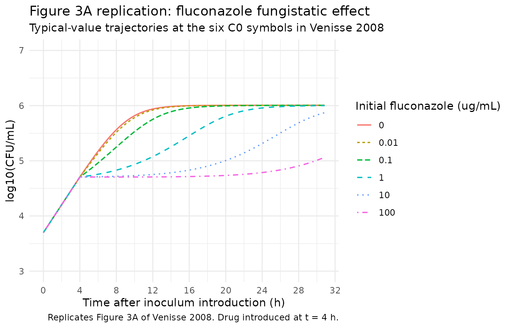
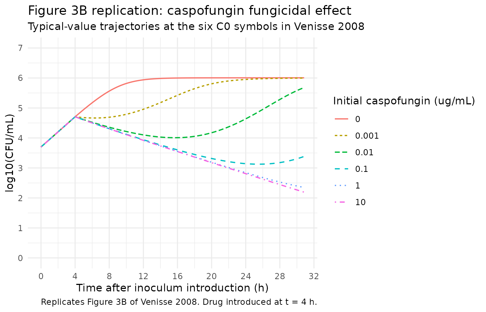

# Fluconazole and caspofungin against Candida albicans (Venisse 2008)

## Model and source

Venisse et al. (2008) developed two mechanism-based PK-PD models on the
same in vitro Candida albicans (ATCC 3153) preparation, fitted
simultaneously in a single NONMEM run:

- `modellib("Venisse_2008_fluconazole")` – fluconazole, fungistatic
  (growth inhibition Imax model).
- `modellib("Venisse_2008_caspofungin")` – caspofungin, fungicidal
  (death stimulation Emax model).

The Candida-population parameters (`Kg`, `Kd`, `Nmax`) are shared across
drugs and reproduced identically in both files; the drug-specific PD
parameters (`IC50`, `Imax`; `EC50`, `Emax`) are different.

- Article: <https://doi.org/10.1128/AAC.01030-07>

## Population

The experimental population is an in vitro Candida albicans culture
(ATCC 3153 reference strain, NCCLS-susceptible). Six experiments were
performed (three fluconazole, three caspofungin), each comprising a
drug-free growth control plus three drug arms with different initial
concentrations (Table 1 of the paper). The growth medium was RPMI 1640
supplemented with 2% sorbitol; incubation at 37 C in a 400 mL glass
flask under continuous magnetic stirring with peristaltic-pump broth
renewal calibrated to a 3 h elimination half-life. The starting Candida
inoculum was 5 x 10^3 CFU/mL, introduced 4 h before the drug.

The MICs measured for this isolate were:

- Fluconazole MIC = 1.56 ug/mL (NCCLS-susceptible).
- Caspofungin MIC = 0.015 ug/mL (typical of susceptible C. albicans).

The same information is available programmatically via each model’s
`population` metadata.

## Source trace

| Component | Value or form | Source |
|----|----|----|
| Drug PK: 1-compartment IV | `d/dt(central) = -kel * central` | Methods, PK-PD analysis |
| `CL` | 1.54 mL/min = 0.0924 L/h (fixed) | Methods, PK-PD analysis |
| `V` | 0.4 L (fixed, bulk flask volume) | Methods, PK-PD analysis |
| `kel` derived | `CL/V` = 0.231 1/h (drug t1/2 = 3 h) | Methods |
| Candida natural growth + death | Eq. 1: `dN/dt = (Kg - Kd) * N` | Page 938, Eq. 1 |
| Saturable growth (Mouton) | Eq. 2: `dN/dt = Kg * (1 - N/Nmax) * N - Kd * N` | Page 938, Eq. 2 |
| With broth renewal | Eq. 3: `dN/dt = Kg * (1 - N/Nmax) * N - Kd * N - Ke * N` | Page 938, Eq. 3 |
| Fluconazole growth inhibition | Eq. 4: `dN/dt = Kg * (1 - N/Nmax) * (1 - Imax*C/(IC50 + C)) * N - Kd*N - Ke*N` | Page 938, Eq. 4 |
| Caspofungin death stimulation | Eq. 5: `dN/dt = Kg * (1 - N/Nmax) * N - Emax*C/(EC50 + C) * N - Kd*N - Ke*N` | Page 938, Eq. 5 |
| `Kg` = 0.864 1/h | growth rate, SE 0.0321 | Table 2 |
| `Kd` = 0.0414 1/h | natural death rate, SE 0.0245 | Table 2 |
| `Nmax` = 1.48e6 CFU/mL | maximum carrying capacity, SE 5.54e5 | Table 2 |
| `Ke` = 0.231 1/h | broth renewal rate, fixed | Methods, page 938 |
| `IC50` = 0.0929 ug/mL | fluconazole IC50, SE 0.0567 | Table 2 |
| `Imax` = 0.675 | fluconazole maximum fractional inhibition, SE 0.0342 (\< 1; see Discussion) | Table 2 |
| `EC50` = 2.51e-4 ug/mL | caspofungin EC50, SE 4.62e-5 | Table 2 |
| `Emax` = 0.804 1/h | caspofungin maximum killing rate, SE 0.0511 | Table 2 |
| `eta(Nmax)` = 225% CV exp. | omega^2 = log(2.25^2 + 1) = 1.802 (natural-log scale) | Table 2 |
| `eta(Emax)` = 65% CV exp. | omega^2 = log(0.65^2 + 1) = 0.353 (caspofungin only) | Table 2 |
| `epsilon` flu = 197% CV exp. | sigma_ln = sqrt(log(1.97^2 + 1)) = 1.259 (additive on log CFU/mL) | Table 2 |
| `epsilon` casp = 96% CV exp. | sigma_ln = sqrt(log(0.96^2 + 1)) = 0.808 (additive on log CFU/mL) | Table 2 |

## Validation strategy

Because the source data are CFU/mL counts under a fixed drug-PK kernel
and the paper does not report NCA-style metrics, PKNCA is not the
appropriate validation target (see `references/endogenous-validation.md`
in the skill for the rationale). Instead the vignette walks the
typical-value trajectories under three scenarios:

1.  **Natural growth control** (no drug) – confirms the
    saturable-growth + broth-renewal balance yields the in vitro
    carrying capacity reported in the paper (~ 1.0e6 CFU/mL – see below
    for the analytic steady state).
2.  **Figure 3A replication** – fluconazole at the six C0 values shown
    in the paper’s symbols (control, 0.01, 0.1, 1, 10, 100 ug/mL).
3.  **Figure 3B replication** – caspofungin at the six C0 values shown
    in the paper’s symbols (control, 0.001, 0.01, 0.1, 1, 10 ug/mL).

A side-by-side parameter table at the end confirms the file’s typical
values agree with Table 2 byte-for-byte.

## Analytic steady-state of the drug-free control

With drug absent and `Ke = 0.231 1/h` active, Equation 3 has steady
state where `Kg * (1 - N/Nmax) = Kd + Ke`. Plugging the Table 2 typical
values:

``` r

Kg   <- 0.864
Kd   <- 0.0414
Ke   <- 0.231
Nmax <- 1.48e6
N_ss <- Nmax * (1 - (Kd + Ke) / Kg)
N_ss
#> [1] 1013389
log10(N_ss)
#> [1] 6.005776
```

So the typical-value plateau is approximately 1.0e6 CFU/mL (log10 ~
6.0), about 68% of the `Nmax` parameter value (1.48e6 CFU/mL). The
remaining gap from `Nmax` is consumed by the natural-death (`Kd`) and
broth-renewal (`Ke`) loss terms. (The paper’s Discussion also reports
that complementary experiments without broth renewal raised the plateau
to ~ 1e8 CFU/mL.)

## Virtual cohort: typical-value trajectories

Each cohort below is the typical-value (zero between-experiment
variance) prediction for a single C0 arm. We use the drug-PK kernel from
each model file and dose the bath at t = 4 h to deliver `C0 * V` of drug
(amt in mg, V in L) so the initial bath concentration equals the
experimental C0.

``` r

V_bath <- 0.4   # litres

# rxode2 expects amt in the same mass units the model uses (here, mg in the
# linear-mg/L = ug/mL convention). dose = C0 * V to deliver an initial bath
# concentration of C0 in ug/mL.
mk_events <- function(C0_vec, t_obs = c(0, 4, seq(4.1, 31, by = 0.25)),
                      id_offset = 0L) {
  out <- vector("list", length(C0_vec))
  for (k in seq_along(C0_vec)) {
    id <- id_offset + k
    C0 <- C0_vec[k]
    dose <- C0 * V_bath  # mg
    if (C0 == 0) {
      ev <- rxode2::et(time = t_obs) %>%
        rxode2::et(id = id)
    } else {
      ev <- rxode2::et(amt = dose, time = 4, cmt = "central") %>%
        rxode2::et(time = t_obs) %>%
        rxode2::et(id = id)
    }
    df <- as.data.frame(ev)
    df$C0 <- C0
    out[[k]] <- df
  }
  dplyr::bind_rows(out)
}
```

``` r

C0_flu  <- c(0, 0.01, 0.1, 1, 10, 100)
C0_casp <- c(0, 0.001, 0.01, 0.1, 1, 10)

events_flu  <- mk_events(C0_flu,  id_offset = 0L)
events_casp <- mk_events(C0_casp, id_offset = 100L)

stopifnot(!anyDuplicated(unique(events_flu[, c("id", "time", "evid")])))
stopifnot(!anyDuplicated(unique(events_casp[, c("id", "time", "evid")])))
```

``` r

flu_typical  <- rxode2::zeroRe(flu)
casp_typical <- rxode2::zeroRe(casp)

sim_flu  <- rxode2::rxSolve(flu_typical,  events = events_flu,  keep = "C0")
sim_casp <- rxode2::rxSolve(casp_typical, events = events_casp, keep = "C0")

sim_flu_df  <- as.data.frame(sim_flu)
sim_casp_df <- as.data.frame(sim_casp)

range(sim_flu_df$candida)
#> [1]    5000 1013386
range(sim_casp_df$candida)
#> [1]     155.4566 1013386.4758
```

## Replicate Figure 3A – fluconazole fungistatic time-kill

``` r

sim_flu_df %>%
  dplyr::mutate(
    log10_cfu = log10(pmax(candida, 1)),
    label     = ifelse(C0 == 0, "control",
                       sprintf("C0 = %g ug/mL", C0))
  ) %>%
  ggplot(aes(time, log10_cfu,
             colour = factor(C0),
             linetype = factor(C0))) +
  geom_line(linewidth = 0.6) +
  scale_x_continuous(breaks = seq(0, 32, by = 4)) +
  scale_y_continuous(limits = c(3, 7), breaks = seq(3, 7)) +
  labs(
    title    = "Figure 3A replication: fluconazole fungistatic effect",
    subtitle = "Typical-value trajectories at the six C0 symbols in Venisse 2008",
    x        = "Time after inoculum introduction (h)",
    y        = "log10(CFU/mL)",
    colour   = "Initial fluconazole (ug/mL)",
    linetype = "Initial fluconazole (ug/mL)",
    caption  = "Replicates Figure 3A of Venisse 2008. Drug introduced at t = 4 h."
  ) +
  theme_minimal()
```



The control curve rises from the 5e3 inoculum to a plateau near
log10(N_ss) ~ 5.67, in line with the analytic steady state above. The
drug arms delay or partially suppress growth in a
concentration-dependent way but never drive a decay phase: because
`Imax = 0.675 < 1` the growth rate can be reduced by at most 67.5%, so
the post-drug rate `Kg * (1 - Imax) = 0.864 * 0.325 = 0.281 1/h` still
exceeds the loss rate `Kd + Ke = 0.272 1/h`, leaving a small positive
net growth even at saturating fluconazole concentrations. This matches
the paper’s observation (Discussion paragraph 4: “Candida growth slowed
but was still observed at the highest initial fluconazole
concentrations”).

## Replicate Figure 3B – caspofungin fungicidal time-kill

``` r

sim_casp_df %>%
  dplyr::mutate(
    log10_cfu = log10(pmax(candida, 1)),
    label     = ifelse(C0 == 0, "control",
                       sprintf("C0 = %g ug/mL", C0))
  ) %>%
  ggplot(aes(time, log10_cfu,
             colour = factor(C0),
             linetype = factor(C0))) +
  geom_line(linewidth = 0.6) +
  scale_x_continuous(breaks = seq(0, 32, by = 4)) +
  scale_y_continuous(limits = c(0, 7), breaks = seq(0, 7)) +
  labs(
    title    = "Figure 3B replication: caspofungin fungicidal effect",
    subtitle = "Typical-value trajectories at the six C0 symbols in Venisse 2008",
    x        = "Time after inoculum introduction (h)",
    y        = "log10(CFU/mL)",
    colour   = "Initial caspofungin (ug/mL)",
    linetype = "Initial caspofungin (ug/mL)",
    caption  = "Replicates Figure 3B of Venisse 2008. Drug introduced at t = 4 h."
  ) +
  theme_minimal()
```



The control curve matches the fluconazole control panel by construction
(same Candida-growth parameters). The treated arms show the
concentration-dependent initial CFU decay followed by regrowth that the
paper highlights as the hallmark of fungicidal activity. Because
`EC50 = 2.51e-4 ug/mL` is two-to-three orders of magnitude below the
clinical Cmax, even C0 = 0.001 ug/mL induces a measurable initial decay.

## Parameter table

| Parameter                | Paper   | File                              |
|:-------------------------|:--------|:----------------------------------|
| CL (L/h, fixed)          | 0.0924  | 0.0924                            |
| V (L, fixed)             | 0.4     | 0.4                               |
| Ke (1/h, fixed)          | 0.231   | 0.231                             |
| Kg (1/h)                 | 0.864   | 0.864                             |
| Kd (1/h)                 | 0.0414  | 0.0414                            |
| Nmax (CFU/mL)            | 1.48e6  | 1.48e6                            |
| IC50 fluconazole (ug/mL) | 0.0929  | 0.0929                            |
| Imax fluconazole         | 0.675   | 0.675                             |
| EC50 caspofungin (ug/mL) | 2.51e-4 | 2.51e-4                           |
| Emax caspofungin (1/h)   | 0.804   | 0.804                             |
| eta(Nmax) (CV%)          | 225     | 225 (omega^2 = 1.802)             |
| eta(Emax) (CV%)          | 65      | 65 (omega^2 = 0.353)              |
| epsilon flu (CV%)        | 197     | 197 (addSd on log CFU/mL = 1.259) |
| epsilon casp (CV%)       | 96      | 96 (addSd on log CFU/mL = 0.808)  |

Venisse 2008 Table 2 typical values vs. packaged-file values. {.table}

## Assumptions and deviations

- **Single-output observation on `Cc`**. The nlmixr2lib convention names
  the model’s primary observation `Cc`. For both Venisse models `Cc` is
  the natural log of the Candida CFU/mL count (with a +1 floor to avoid
  log(0) under saturating caspofungin), not a drug concentration. The
  drug concentration is the derived quantity `cc <- central / vc` and is
  not observed.
- **NONMEM exponential residual mapped to additive on log scale**. The
  paper reports the residual as “exponential” with the variance
  summarised as a percent CV on the linear CFU/mL scale (Table 2: 197%
  for fluconazole, 96% for caspofungin). nlmixr2’s equivalent is an
  additive residual on the natural-log-transformed observation; the SD
  is `sqrt(log(CV^2 + 1))`. Both files document the conversion inline
  next to `addSd`.
- **Eta on Emax in caspofungin only**. The paper’s joint fit gave
  `eta(Nmax) = 225% CV` (shared between drugs) and `eta(Emax) = 65% CV`
  (caspofungin-specific). The fluconazole file therefore carries only
  `etalnmax`; the caspofungin file carries `etalnmax` + `etalemax`. No
  IIV was estimated on Imax, IC50, EC50, Kg, or Kd, so none is added
  here.
- **Initial inoculum 5e3 CFU/mL at t = 0**. The paper’s experimental
  timeline starts at inoculation, with drug introduced 4 h later. The
  model files anchor `candida(0) = 5000` at simulation time 0; the
  vignette dosing schedule introduces the drug at t = 4 h to reproduce
  the experimental timing.
- **No covariates**. Both files declare `covariateData <- list()`. The
  Venisse experiments are typical-value in vitro with replicate
  experimental variability captured by the etas; no subject-level
  covariates are reported or relevant.
- **`Imax < 1` is a paper-specific structural finding**. The paper’s
  Discussion paragraph 4 notes that even at fluconazole concentrations
  exceeding the MIC by \> 200-fold, Candida growth was not fully
  inhibited; the estimated `Imax = 0.675` is load-bearing for the
  fungistatic-vs-fungicidal mechanistic distinction. The packaged file
  does not constrain `Imax` to (0, 1) via a logit transform – it carries
  the typical value 0.675 directly. Re-fits should restore the (0, 1)
  bound through a transform if intended.
