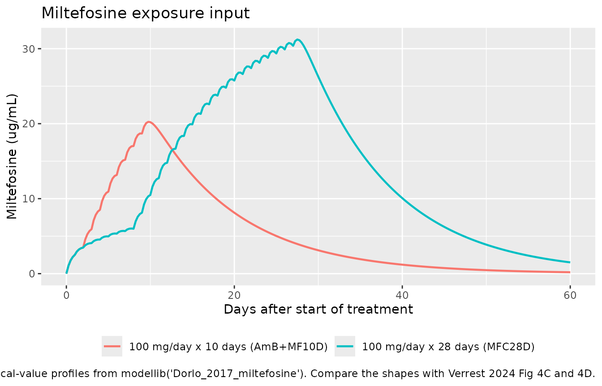
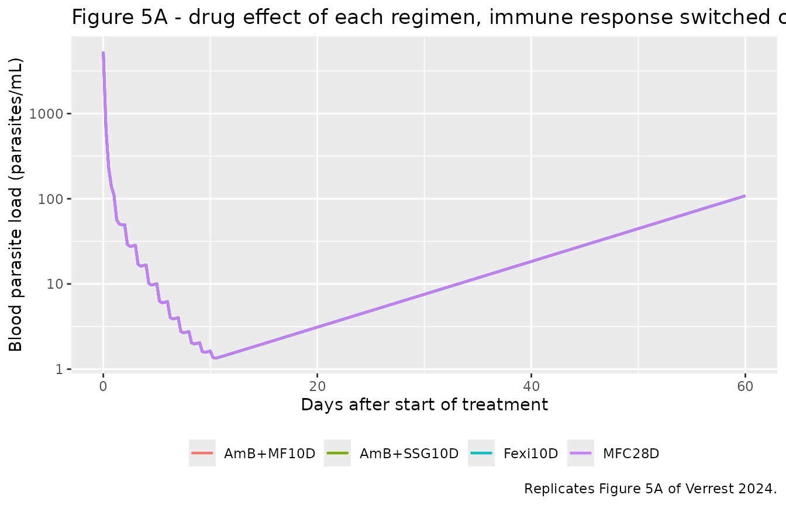
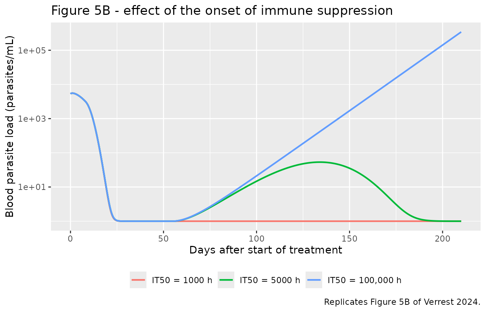
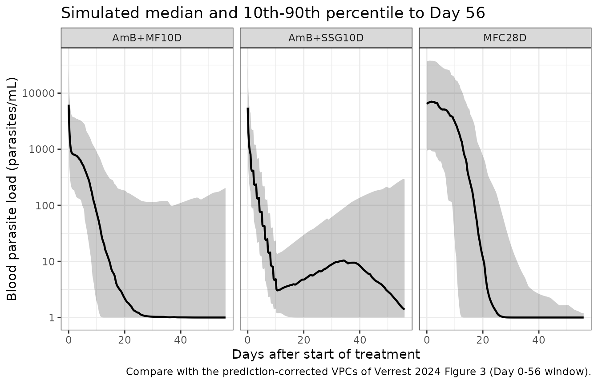

# Leishmania blood parasite dynamics in visceral leishmaniasis (Verrest 2024)

## Model and source

- Citation: Verrest L, Monnerat S, Musa AM, Mbui J, Khalil EAG, Olobo J,
  Wasunna M, Chu WY, Huitema ADR, Schallig HDFH, Alves F, Dorlo TPC.
  Leishmania blood parasite dynamics during and after treatment of
  visceral leishmaniasis in Eastern Africa: A
  pharmacokinetic-pharmacodynamic model. PLoS Negl Trop Dis.
  2024;18(4):e0012078. <doi:10.1371/journal.pntd.0012078>.
  ClinicalTrials.gov NCT01067443 (LEAP0208), NCT02431143 (LEAP0714),
  NCT01980199 (FEXI-VL-001).
- Article: <https://doi.org/10.1371/journal.pntd.0012078>
- Supplement (S1 File):
  <https://doi.org/10.1371/journal.pntd.0012078.s001>

Semi-mechanistic pharmacokinetic-pharmacodynamic model of Leishmania
blood parasite load during and after treatment of visceral leishmaniasis
(VL) in 172 Eastern African patients pooled across three phase II trials
(Verrest 2024). A single blood-parasite-load compartment (parasites/mL,
quantified by kinetoplast-DNA qPCR) proliferates by exponential growth
at rate kGR, corresponding to an in vivo parasite doubling time of 7.8
days – the first such estimate reported in humans. Parasite killing by
each of four antileishmanial drugs is linear in that drug’s
concentration and additive across a combination regimen: kdrug =
sum(lambda_drug \* C_drug). Liposomal amphotericin B and sodium
stibogluconate have no measured concentrations and are encoded as
kinetic-pharmacodynamic body-amount compartments dosed in mg/kg and
eliminated first-order with literature half-lives of 6 h and 2 h
respectively; miltefosine and the active fexinidazole metabolites
(sulfoxide M1 + sulfone M2) are supplied as time-varying concentration
covariates because the source analysis fixed their PK from separate
upstream population PK models. After treatment, parasite regrowth is
suppressed by the emerging host immune response, described empirically
as a sigmoid Imax function of time since start of treatment with
steepness fixed to 5 and Imax fixed to ten times kGR. The parasite state
is floored at 1 parasite/mL so that clinically meaningful recrudescence
remains possible after complete drug-induced depletion. Baseline load,
the miltefosine and fexinidazole slopes, Imax, and IT50 carry
exponential between-subject variability; the variability on baseline
load, Imax, and IT50 exceeds 200 CV%.

This is a semi-mechanistic pharmacokinetic-pharmacodynamic model of the
*Leishmania* blood parasite load in visceral leishmaniasis (VL), not a
drug pharmacokinetic model. Its single dynamic endpoint is the
kinetoplast-DNA qPCR parasite count in whole blood, in parasites/mL, and
its three competing forces are parasite replication, drug-induced
killing, and suppression of regrowth by the recovering host immune
system.

## Population

The model was built on 992 blood parasite load observations from 172
Eastern African VL patients pooled across three phase II open-label
randomized trials (Verrest 2024 Table 1): LEAP0208 (NCT01067443, arms
AmB+SSG10D, AmB+MF10D, MFC28D), LEAP0714 (NCT02431143, the paediatric
allometric-miltefosine arm MFA28D), and FEXI-VL-001 (NCT01980199, the
fexinidazole arm Fexi10D). Patients were enrolled in Kenya (Kimalel,
Kacheliba), Sudan (Dooka, Kassab), and Uganda (Amudat).

Baseline demographics (mean and range) were 14 years of age (4-50), 34
kg body weight (13-69), and 114 of 172 (66%) male. All patients had
parasitologically confirmed primary VL with fever and splenomegaly, were
HIV negative, and had neither severe VL, severe malnutrition, nor any
serious underlying disease. 138 of 172 (80%) achieved final cure and 34
(20%) relapsed within the 210-day follow-up.

Of the 1260 samples collected, 21% were excluded (initial treatment
failures, samples drawn after rescue treatment, unreliable DNA
extractions, physiologically implausible values, and one patient lacking
pharmacokinetic data). Of the 992 retained observations, 359 (36%) were
below the 1 parasite/mL limit of quantification and were fixed to half
that limit during estimation.

``` r

str(readModelDb("Verrest_2024_leishmania")()$population, max.level = 1)
#> List of 15
#>  $ species       : chr "human"
#>  $ n_subjects    : int 172
#>  $ n_studies     : int 3
#>  $ age_range     : chr "4-50 years"
#>  $ age_mean      : chr "14 years"
#>  $ weight_range  : chr "13-69 kg"
#>  $ weight_mean   : chr "34 kg"
#>  $ sex_female_pct: num 33.7
#>  $ race_ethnicity: chr "Eastern African (Kenya, Sudan, Uganda); no further breakdown reported"
#>  $ disease_state : chr "Parasitologically confirmed primary visceral leishmaniasis (fever plus splenomegaly plus confirmatory microscop"| __truncated__
#>  $ dose_range    : chr "Five regimens across three trials. AmB+SSG10D (n=40): liposomal amphotericin B 10 mg/kg IV on day 1 then sodium"| __truncated__
#>  $ regions       : chr "Eastern Africa (Kenya: Kimalel, Kacheliba; Sudan: Dooka, Kassab; Uganda: Amudat)"
#>  $ trials        : chr "LEAP0208 (NCT01067443; AmB+SSG10D, AmB+MF10D, MFC28D arms), LEAP0714 (NCT02431143; MFA28D paediatric arm), FEXI"| __truncated__
#>  $ samples       : chr "1260 whole-blood EDTA samples collected for kinetoplast-DNA qPCR from 188 patients; 992 observations from 172 p"| __truncated__
#>  $ notes         : chr "Demographics from Verrest 2024 Table 1 (mean and range at baseline, pooled across the five treatment arms). Sex"| __truncated__
```

## Model structure

The blood parasite load `parasites` (parasites/mL) obeys

    d(parasites)/dt = (kGR - kdrug - kimm) * parasites

with the state floored at 1 parasite/mL, and

    kdrug = lambda_fexi * C_M1M2 + lambda_MF * C_MF
            + lambda_Amb * A_Amb + lambda_SSG * A_SSG

    kimm  = Imax * Time^gamma / (IT50^gamma + Time^gamma)

where `Time` is time after start of treatment. Liposomal amphotericin B
and sodium stibogluconate have no measured concentrations and enter as
kinetic-pharmacodynamic body-amount states dosed in mg/kg
(`depot_kpd_amphotericinb`, `depot_kpd_ssg`), eliminated first order at
literature half-lives of 6 h and 2 h. Miltefosine and the summed active
fexinidazole metabolites M1 + M2 enter as the time-varying covariates
`CP_MILTEFOSINE_UGML` and `CP_FEXINIDAZOLE_M1M2_UGML`, because the
source analysis was a sequential fit that took their concentrations from
separate upstream population PK models.

## Source trace

Every value below is also carried as an in-file comment beside its
`ini()` entry in
`inst/modeldb/therapeuticArea/Verrest_2024_leishmania.R`.

| Equation / parameter | Value | Source location |
|----|----|----|
| `lrbase` (E_BASE) | 5324 parasites/mL | Table 2, row `E BASE (parasites/mL)` (RSE 16%) |
| `lkgrow` (kGR) | 0.0037 /h | Table 2, row `k GR (h -1)` (RSE 12%) |
| `lslope_fexinidazole` (lambda_fexi) | 0.0011 mL/(ug\*h) | Table 2, row `lambda fexi (ug -1 * L * h -1)` (RSE 15%); value as printed, driver unit corrected to ug/mL (see below) |
| `lslope_miltefosine` (lambda_MF) | 0.0010 mL/(ug\*h) | Table 2, row `lambda MF (ug -1 * L * h -1)` (RSE 5%); value as printed, driver unit corrected to ug/mL (see below) |
| `lslope_amphotericinb` (lambda_Amb) | 0.0245 kg/(mg\*h) | Table 2, row `lambda Amb (mg -1 * kg * h -1)` (RSE 8%) |
| `lslope_ssg` (lambda_SSG) | 0.0112 kg/(mg\*h) | Table 2, row `lambda SSG (mg -1 * kg * h -1)` (RSE 5%) |
| `limax` (Imax) | 0.037 /h, FIXED | Table 2, row `I max (h -1)`; footnote b “Fixed to ten times kGR” |
| `lt50` (IT50) | 33.7 days = 808.8 h | Table 2, row `IT 50 (days)` (RSE 0.1%); converted to the model’s hour timescale |
| `lhill` (gamma) | 5, FIXED | Fig 2 legend, “the steepness of the time-effect relationship, which was empirically fixed to 5”; Results 3.2.2 |
| `lkel_amphotericinb` | log(2)/6 = 0.1155 /h, FIXED | Methods 2.4.2, “previously reported elimination half-lives of 6 hours for liposomal amphotericin B \[32\]” (Bekersky 2002) |
| `lkel_ssg` | log(2)/2 = 0.3466 /h, FIXED | Methods 2.4.2, “and 2 hours for SSG \[33,34\]” |
| `etalrbase` | 243 CV% | Table 2, BSV column for `E BASE` (RSE 12%, shrinkage 3%) |
| `etalslope_fexinidazole` | 44 CV% | Table 2, BSV column for `lambda fexi` (RSE 59%, shrinkage 3%) |
| `etalslope_miltefosine` | 42 CV% | Table 2, BSV column for `lambda MF` (RSE 21%, shrinkage 5%) |
| `etalimax` | 298 CV% | Table 2, BSV column for `I max` (RSE 16%, shrinkage 52%) |
| `etalt50` | 230 CV% | Table 2, BSV column for `IT 50` (RSE 12%, shrinkage 40%) |
| `propSd` | 101% | Table 2, row `Proportional residual error (%)` (RSE 0.7%, shrinkage 18%) |
| `addSd` | 0.5 parasites/mL, FIXED | Table 2, row `Additive residual error`; footnote c “Fixed to half the lower limit of quantification”; Methods 2.4 |
| Exponential growth of `parasites` | n/a | Results 3.2.1, “Parasite proliferation was best described by an exponential growth model”; Fig 2 schematic (`kGR`) |
| Linear, additive drug kill `kdrug` | n/a | Results 3.2.1, “the parasite killing rate was directly proportional to the drug concentration”; Fig 2 (`k drug`, `lambda drug`, `C drug`) |
| One-compartment K-PD for AmB and SSG | n/a | Methods 2.4.2, “a kinetic-pharmacodynamic approach was used assuming a one compartment model with first-order elimination, using the administered drug amounts” |
| Sigmoid immune suppression `kimm` | n/a | Eq 1 |
| Parasite floor at 1 parasite/mL | n/a | Methods 2.4.3, “the parasite compartment was restricted to \>= 1 parasite/mL” |
| Exponential BSV, `omega^2 = log(1 + CV^2)` | n/a | Methods 2.4, “Between-subject variability (BSV) was evaluated for all parameters and implemented using an exponential error model” |
| BSV absent for kGR, lambda_Amb, lambda_SSG | n/a | Table 2, `-` in the BSV column for those three rows |
| WBC screened but not retained | n/a | Methods 2.4.3 (Eq 2, Eq 3); Results 3.2.2, “white blood cell counts were not a significant covariate for k imm or IT50” |

## Structural checks

Three properties of the encoded model can be checked against the paper
without any simulation of a drug regimen.

``` r

mod <- readModelDb("Verrest_2024_leishmania")
pars <- rxode2::rxode2(mod)$theta

# 1. Parasite doubling time. Results 3.2.1 reports 7.8 days.
doubling_days <- log(2) / exp(pars[["lkgrow"]]) / 24

# 2. Imax was fixed to ten times kGR (Table 2 footnote b).
imax_over_kgr <- exp(pars[["limax"]]) / exp(pars[["lkgrow"]])

# 3. IT50 on the paper's day scale (Table 2 reports 33.7 days).
it50_days <- exp(pars[["lt50"]]) / 24

tibble::tibble(
  Check = c("Parasite doubling time (days)",
            "Imax / kGR ratio",
            "IT50 (days)"),
  Encoded = c(doubling_days, imax_over_kgr, it50_days),
  Published = c(7.8, 10, 33.7),
  `Source` = c("Results 3.2.1", "Table 2 footnote b", "Table 2")
) |>
  knitr::kable(digits = 3)
```

| Check                         | Encoded | Published | Source             |
|:------------------------------|--------:|----------:|:-------------------|
| Parasite doubling time (days) |   7.806 |       7.8 | Results 3.2.1      |
| Imax / kGR ratio              |  10.000 |      10.0 | Table 2 footnote b |
| IT50 (days)                   |  33.700 |      33.7 | Table 2            |

The immune term must also reach exactly half of `Imax` at `Time = IT50`,
and the parasite state must never fall below 1 parasite/mL. Both are
verified numerically further below.

## Miltefosine exposure input

Three of the five regimens contain miltefosine, whose concentration the
model consumes through `CP_MILTEFOSINE_UGML`. Verrest 2024 took that
trajectory from the Palic 2020 non-linear paediatric-VL population PK
model, which is not in this package. The registry does contain
`modellib("Dorlo_2017_miltefosine")`, a two-compartment miltefosine
popPK model fit to LEAP0208 (NCT01067443) - the same trial that supplies
three of Verrest 2024’s five arms - so it is used here as the exposure
generator. This substitution is a deviation from the source analysis and
is recorded in the Assumptions section.

``` r

mil_mod <- readModelDb("Dorlo_2017_miltefosine") |> rxode2::zeroRe()

# Dorlo 2017 runs on a day timescale, doses in mg, and reports Cc in
# ug/mL. FFM is set to the Dorlo 2017 cohort median of 29.9 kg (Table 1).
# MIL_REGIMEN = 1 is the 28-day monotherapy arm, 0 the 10-day arm given
# with liposomal amphotericin B.
simulate_miltefosine <- function(daily_mg, n_days, regimen) {
  ev <- rxode2::et(amt = daily_mg, time = seq(0, n_days - 1), cmt = "depot") |>
    rxode2::et(seq(0, 210, by = 0.25), cmt = "central")
  dat <- as.data.frame(ev)
  dat$FFM <- 29.9
  dat$MIL_REGIMEN <- regimen
  out <- rxode2::rxSolve(mil_mod, dat, omega = NA, returnType = "data.frame")
  out <- out[!is.na(out$Cc), c("time", "Cc")]
  # Dorlo 2017 reports Cc in ug/mL, which is the unit the Verrest 2024
  # driver needs (see "Unit scale of the concentration-driven kill
  # slopes" below); no conversion is applied.
  data.frame(day = out$time, conc_ugmL = out$Cc)
}

mil_mono   <- simulate_miltefosine(100, 28, regimen = 1)  # MFC28D, Fig 5A curve 3
mil_combo  <- simulate_miltefosine(100, 10, regimen = 0)  # AmB+MF10D, Fig 5A curve 2
mil_150    <- simulate_miltefosine(150, 28, regimen = 1)  # Fig 5B

bind_rows(
  mutate(mil_mono,  regimen = "100 mg/day x 28 days (MFC28D)"),
  mutate(mil_combo, regimen = "100 mg/day x 10 days (AmB+MF10D)")
) |>
  filter(day <= 60) |>
  ggplot(aes(day, conc_ugmL, colour = regimen)) +
  geom_line(linewidth = 0.8) +
  labs(x = "Days after start of treatment", y = "Miltefosine (ug/mL)",
       colour = NULL,
       title = "Miltefosine exposure input",
       caption = paste("Typical-value profiles from modellib('Dorlo_2017_miltefosine').",
                       "Compare the shapes with Verrest 2024 Fig 4C and 4D.")) +
  theme(legend.position = "bottom")
```



The slow accumulation over the first week and the long tail after the
end of dosing are the features Verrest 2024 highlights in Results 3.2.1
(“persistent drug exposure of about … 30 days for the AmB+MF10D regimen,
and 50 days for the MFC28D and MFA28D regimens”).

## Unit scale of the concentration-driven kill slopes

Table 2 prints the units of `lambda_fexi` and `lambda_MF` as
`ug^-1 * L * h^-1`, which would put the driving concentration in ug/L.
Applied literally that reading is falsified by the paper’s own Table 4,
so the model encodes the drivers in ug/mL instead. The two published
`lambda` values are used exactly as printed; only the unit of the
covariate they multiply is corrected. This check inverts Table 4 to show
why.

Verrest 2024 Table 4 gives the median individual predicted parasite load
on Day 1 and Day 10 for every arm. Between those two days the immune
term is still negligible (with `gamma` = 5 and IT50 = 33.7 days, `kimm`
at Day 10 is under 0.1% of `Imax`), so the observed decline pins the
average drug-kill rate directly:

    kdrug = kGR - log(P_day10 / P_day1) / (9 days * 24 h)

``` r

kgr <- exp(pars[["lkgrow"]])

implied_kdrug <- function(p_day1, p_day10) {
  kgr - log(p_day10 / p_day1) / (9 * 24)
}

# Mean miltefosine concentration over Days 0-10 on the 2.5 mg/kg/day
# (100 mg/day) regimen, from the Dorlo 2017 profile built above.
mil_mean_d0_10 <- mean(mil_mono$conc_ugmL[mil_mono$day <= 10])

tibble::tibble(
  Arm = c("MFC28D (miltefosine)", "Fexi10D (fexinidazole M1+M2)"),
  `Table 4 Day 1 (p/mL)` = c(4583, 3732),
  `Table 4 Day 10 (p/mL)` = c(2027, 105),
  `Implied kdrug (1/h)` = c(implied_kdrug(4583, 2027), implied_kdrug(3732, 105)),
  `Driver needed (units of the column)` =
    c(implied_kdrug(4583, 2027) / 0.0010, implied_kdrug(3732, 105) / 0.0011)
) |>
  knitr::kable(digits = 4)
```

| Arm | Table 4 Day 1 (p/mL) | Table 4 Day 10 (p/mL) | Implied kdrug (1/h) | Driver needed (units of the column) |
|:---|---:|---:|---:|---:|
| MFC28D (miltefosine) | 4583 | 2027 | 0.0075 | 7.4768 |
| Fexi10D (fexinidazole M1+M2) | 3732 | 105 | 0.0202 | 18.3920 |

The miltefosine row asks for a driver of about 7.5 and the fexinidazole
row for about 18. Miltefosine plasma concentrations on this regimen
average roughly 5.2 ug/mL over Days 0-10, and whole-blood fexinidazole
M1 + M2 after 1800 mg/day sits in the tens of ug/mL - both match the
required numbers when the column is read as **ug/mL**. Read as ug/L the
same concentrations are 1000-fold larger:

``` r

tibble::tibble(
  `Column read as` = c("ug/mL (encoded)", "ug/L (as Table 2 prints)"),
  `Miltefosine driver` = c(mil_mean_d0_10, mil_mean_d0_10 * 1000),
  `kdrug = lambda_MF * driver (1/h)` =
    c(0.0010 * mil_mean_d0_10, 0.0010 * mil_mean_d0_10 * 1000),
  `Implied by Table 4 (1/h)` = rep(implied_kdrug(4583, 2027), 2)
) |>
  knitr::kable(digits = 4)
```

| Column read as | Miltefosine driver | kdrug = lambda_MF \* driver (1/h) | Implied by Table 4 (1/h) |
|:---|---:|---:|---:|
| ug/mL (encoded) | 5.1803 | 0.0052 | 0.0075 |
| ug/L (as Table 2 prints) | 5180.2794 | 5.1803 | 0.0075 |

A `kdrug` of about 5 /h has a parasite half-life of eight minutes and
would put every miltefosine patient on the 1 parasite/mL floor within
the first day of treatment. Table 4 reports 2027 parasites/mL on Day 10.
The ug/L reading is therefore not tenable, and the model uses ug/mL.

For contrast, the two K-PD slopes need no such correction: `lambda_Amb`
and `lambda_SSG` are printed in `mg^-1 * kg * h^-1`, and taken at face
value against the AmB+SSG10D dosing they reproduce the published Day 10
load closely.

``` r

# Cumulative kill from one 10 mg/kg amphotericin B dose (t1/2 6 h) plus
# nine 20 mg/kg SSG doses (t1/2 2 h), integrating lambda * A over time:
# each dose contributes lambda * dose / kel to the log-scale kill.
kill_amb <- 0.0245 * 10 / (log(2) / 6)
kill_ssg <- 0.0112 * 20 / (log(2) / 2) * 9
growth   <- kgr * 10 * 24
predicted_d10 <- 23802 * exp(growth - kill_amb - kill_ssg)

tibble::tibble(
  Quantity = c("Table 4 AmB+SSG10D Day 1 (p/mL)",
               "Hand-integrated Day 10 prediction (p/mL)",
               "Table 4 AmB+SSG10D Day 10 (p/mL)"),
  Value = c(23802, predicted_d10, 11.8)
) |>
  knitr::kable(digits = 1)
```

| Quantity                                 |   Value |
|:-----------------------------------------|--------:|
| Table 4 AmB+SSG10D Day 1 (p/mL)          | 23802.0 |
| Hand-integrated Day 10 prediction (p/mL) |    20.7 |
| Table 4 AmB+SSG10D Day 10 (p/mL)         |    11.8 |

## Building regimen event tables

``` r

# Verrest 2024 runs on an hour timescale. Doses of liposomal
# amphotericin B and SSG are given in mg/kg because Table 2 reports
# lambda_Amb and lambda_SSG in mg^-1 * kg * h^-1, which fixes the K-PD
# states to mg/kg. Observations are placed on the `parasites` ODE state
# (never on an algebraic observable name).
obs_grid_h <- seq(0, 210 * 24, by = 6)

interpolate_mil <- function(times_h, profile) {
  if (is.null(profile)) return(rep(0, length(times_h)))
  stats::approx(profile$day * 24, profile$conc_ugmL,
                xout = times_h, rule = 2)$y
}

make_regimen <- function(n, label, amb_mgkg = NULL, ssg_mgkg = NULL,
                         ssg_days = NULL, mil_profile = NULL,
                         id_offset = 0L) {
  ev <- rxode2::et(obs_grid_h, cmt = "parasites")
  if (!is.null(amb_mgkg)) {
    ev <- rxode2::et(ev, amt = amb_mgkg, time = 0,
                     cmt = "depot_kpd_amphotericinb")
  }
  if (!is.null(ssg_mgkg)) {
    ev <- rxode2::et(ev, amt = ssg_mgkg, time = ssg_days * 24,
                     cmt = "depot_kpd_ssg")
  }
  if (n > 1) ev <- rxode2::et(ev, id = seq_len(n))
  dat <- as.data.frame(ev)
  if (!"id" %in% names(dat)) dat$id <- 1L
  dat$id <- dat$id + id_offset
  dat$CP_MILTEFOSINE_UGML <- interpolate_mil(dat$time, mil_profile)
  dat$CP_FEXINIDAZOLE_M1M2_UGML <- 0
  dat$treatment <- label
  dat[order(dat$id, dat$time), ]
}
```

The five published regimens (Verrest 2024 Methods 2.2 and Table 1) map
onto this helper as follows. Liposomal amphotericin B is a single 10
mg/kg dose on day 1; SSG is 20 mg/kg/day on days 2 to 11.

``` r

typical_arms <- list(
  make_regimen(1, "AmB+SSG10D", amb_mgkg = 10, ssg_mgkg = 20, ssg_days = 1:10),
  make_regimen(1, "AmB+MF10D",  amb_mgkg = 10, mil_profile = mil_combo),
  make_regimen(1, "MFC28D",     mil_profile = mil_mono),
  make_regimen(1, "Fexi10D")
)
events_typical <- bind_rows(typical_arms)
stopifnot(!anyDuplicated(unique(events_typical[, c("treatment", "time", "evid")])))
```

The Fexi10D arm carries `CP_FEXINIDAZOLE_M1M2_UGML = 0` throughout: the
fexinidazole/M1/M2 population PK model that Verrest 2024 used lives in
an unpublished internal report, no parameter values for it appear in the
paper or its S1 File, and nothing is invented here to replace it. What
that arm therefore shows below is the drug-free limit of the model -
which is exactly the data subset from which Verrest 2024 estimated the
parasite growth rate, because “an inadequate drug response … resulted in
rapid parasite recrudescence directly after treatment” (Methods 2.4.1).

## Replicating Figure 5A: drug effects with no immune response

Verrest 2024 Fig 5A simulates a typical patient on each regimen with “no
immune response after the end of treatment … Other parameters were fixed
to the population values”. Setting `Imax` to effectively zero reproduces
that condition.

``` r

mod_typ <- mod |> rxode2::zeroRe()

sim_5a <- rxode2::rxSolve(
  mod_typ, events_typical,
  params = c(limax = log(1e-12)),   # Fig 5A: no immune response
  omega = NA, keep = "treatment", returnType = "data.frame"
)
stopifnot(!anyNA(sim_5a$parasites))

sim_5a |>
  filter(time <= 60 * 24) |>
  ggplot(aes(time / 24, parasites, colour = treatment)) +
  geom_line(linewidth = 0.8) +
  scale_y_log10() +
  labs(x = "Days after start of treatment", y = "Blood parasite load (parasites/mL)",
       colour = NULL,
       title = "Figure 5A - drug effect of each regimen, immune response switched off",
       caption = "Replicates Figure 5A of Verrest 2024.") +
  theme(legend.position = "bottom")
```



The ordering matches the paper’s description in Results 3.2.1: “Rapid
and effective parasite clearance was induced by treatment with liposomal
amphotericin B (AmB+SSG10D and AmB+MF10D), while a slow onset with later
parasite clearance was observed for miltefosine (MFC28D and MFA28D), and
a weak response was observed for fexinidazole (Fexi10D).” Here the
fexinidazole arm has no exposure input at all, so it grows monotonically
rather than merely responding weakly.

## Replicating Figure 5B: onset of the immune response

Fig 5B simulates a typical patient on 150 mg/day miltefosine for 28 days
with IT50 set to 1000 h, 5000 h, and 100,000 h.

``` r

ev_5b <- make_regimen(1, "MF 150 mg/day x 28 days", mil_profile = mil_150)

sim_5b <- bind_rows(lapply(c(1000, 5000, 100000), function(it50) {
  out <- rxode2::rxSolve(
    mod_typ, ev_5b, params = c(lt50 = log(it50)),
    omega = NA, returnType = "data.frame"
  )
  out$it50_h <- it50
  out
}))

sim_5b |>
  mutate(it50 = factor(it50_h, levels = c(1000, 5000, 100000),
                       labels = c("IT50 = 1000 h", "IT50 = 5000 h", "IT50 = 100,000 h"))) |>
  ggplot(aes(time / 24, parasites, colour = it50)) +
  geom_line(linewidth = 0.8) +
  scale_y_log10() +
  labs(x = "Days after start of treatment", y = "Blood parasite load (parasites/mL)",
       colour = NULL,
       title = "Figure 5B - effect of the onset of immune suppression",
       caption = "Replicates Figure 5B of Verrest 2024.") +
  theme(legend.position = "bottom")
```



A fast immune onset (IT50 = 1000 h, about 42 days) holds the parasite
load at the 1 parasite/mL floor for the whole follow-up; a very late
onset (IT50 = 100,000 h) lets the parasite recrudesce once miltefosine
has washed out. This is the mechanism Verrest 2024 invokes to explain
relapse: “patients with complete parasite suppression had a fast onset
of the host immune response … while patients with parasite recrudescence
somewhere during follow-up had a late onset or weak magnitude of the
immune response” (Discussion).

## Verifying the immune half-maximum and the parasite floor

``` r

# kimm must equal Imax / 2 exactly at Time = IT50.
it50_h <- exp(pars[["lt50"]])
imax   <- exp(pars[["limax"]])
gamma  <- exp(pars[["lhill"]])
kimm_at_it50 <- imax * it50_h^gamma / (it50_h^gamma + it50_h^gamma)

# The parasite state must never drop below 1 parasite/mL, even under the
# most aggressive regimen simulated here.
floor_min <- min(sim_5a$parasites)

tibble::tibble(
  Check = c("kimm at Time = IT50", "Imax / 2",
            "Minimum simulated parasite load (parasites/mL)"),
  Value = c(kimm_at_it50, imax / 2, floor_min)
) |>
  knitr::kable(digits = 6)
```

| Check                                          |    Value |
|:-----------------------------------------------|---------:|
| kimm at Time = IT50                            | 0.018500 |
| Imax / 2                                       | 0.018500 |
| Minimum simulated parasite load (parasites/mL) | 1.351422 |

``` r


stopifnot(
  isTRUE(all.equal(kimm_at_it50, imax / 2)),
  floor_min >= 1 - 1e-8
)
```

## Virtual cohorts and simulation with between-subject variability

Three arms can be simulated end to end: the two that need no external
concentration input beyond the amphotericin B and SSG K-PD states, and
the two miltefosine arms driven by the Dorlo 2017 exposure profiles. 100
subjects per arm is ample given that the published between-subject
variability on baseline load, `Imax`, and `IT50` all exceed 200 CV%.

``` r

set.seed(20240419)
n_per_arm <- 100L

events_pop <- bind_rows(
  make_regimen(n_per_arm, "AmB+SSG10D", amb_mgkg = 10, ssg_mgkg = 20,
               ssg_days = 1:10, id_offset = 0L),
  make_regimen(n_per_arm, "AmB+MF10D", amb_mgkg = 10,
               mil_profile = mil_combo, id_offset = 1000L),
  make_regimen(n_per_arm, "MFC28D", mil_profile = mil_mono,
               id_offset = 2000L)
)
stopifnot(!anyDuplicated(unique(events_pop[, c("id", "time", "evid")])))

sim_pop <- rxode2::rxSolve(
  mod, events_pop, omega = rxode2::rxode2(mod)$omega,
  keep = "treatment", returnType = "data.frame"
)

# rxSolve occasionally drops subjects silently; assert the count.
stopifnot(length(unique(sim_pop$id)) == 3L * n_per_arm)
stopifnot(!anyNA(sim_pop$parasites))
```

``` r

sim_pop |>
  filter(time <= 56 * 24) |>
  group_by(treatment, time) |>
  summarise(Q10 = quantile(parasites, 0.10),
            Q50 = quantile(parasites, 0.50),
            Q90 = quantile(parasites, 0.90),
            .groups = "drop") |>
  ggplot(aes(time / 24, Q50)) +
  geom_ribbon(aes(ymin = Q10, ymax = Q90), alpha = 0.25) +
  geom_line(linewidth = 0.8) +
  facet_wrap(~treatment) +
  scale_y_log10() +
  labs(x = "Days after start of treatment",
       y = "Blood parasite load (parasites/mL)",
       title = "Simulated median and 10th-90th percentile to Day 56",
       caption = paste("Compare with the prediction-corrected VPCs of",
                       "Verrest 2024 Figure 3 (Day 0-56 window).")) +
  theme_bw()
```



## PKNCA validation: cumulative parasite exposure

Verrest 2024 Table 4 reports the area under the blood parasite load-time
curve over days 0-10, 0-28, and 0-56 as a measure of cumulative parasite
exposure. Those intervals are computed here with PKNCA, using the
parasite load in place of a drug concentration.

``` r

nca_input <- sim_pop |>
  dplyr::filter(!is.na(parasites)) |>
  dplyr::select(id, time, parasites, treatment)

# Guarantee a time-zero record per subject so AUC0-t is anchored.
nca_input <- dplyr::bind_rows(
  nca_input,
  nca_input |>
    dplyr::distinct(id, treatment) |>
    dplyr::mutate(time = 0, parasites = NA_real_)
) |>
  dplyr::arrange(id, treatment, time) |>
  dplyr::group_by(id, treatment) |>
  tidyr::fill(parasites, .direction = "up") |>
  dplyr::ungroup() |>
  dplyr::distinct(id, treatment, time, .keep_all = TRUE)

conc_obj <- PKNCA::PKNCAconc(nca_input, parasites ~ time | treatment + id)

intervals <- data.frame(
  start    = 0,
  end      = c(10, 28, 56) * 24,
  auclast  = TRUE,
  cmax     = c(TRUE, FALSE, FALSE),
  tmax     = c(TRUE, FALSE, FALSE)
)

nca_res <- PKNCA::pk.nca(PKNCA::PKNCAdata(conc_obj, intervals = intervals))
#> No dose information provided, calculations requiring dose will return NA.
```

``` r

auc_by_arm <- as.data.frame(nca_res) |>
  dplyr::filter(PPTESTCD == "auclast") |>
  dplyr::mutate(window = dplyr::case_when(
    end == 10 * 24 ~ "aucD0_10",
    end == 28 * 24 ~ "aucD0_28",
    end == 56 * 24 ~ "aucD0_56"
  )) |>
  # PKNCA integrates on the model's hour timescale; Table 4 is in
  # parasites * day / mL.
  dplyr::group_by(treatment, window) |>
  dplyr::summarise(value = stats::median(PPORRES) / 24, .groups = "drop") |>
  tidyr::pivot_wider(names_from = window, values_from = value)

auc_by_arm |>
  dplyr::rename("Treatment" = treatment,
                "AUC D0-10 (p*day/mL)" = aucD0_10,
                "AUC D0-28 (p*day/mL)" = aucD0_28,
                "AUC D0-56 (p*day/mL)" = aucD0_56) |>
  knitr::kable(digits = 0)
```

| Treatment | AUC D0-10 (p\*day/mL) | AUC D0-28 (p\*day/mL) | AUC D0-56 (p\*day/mL) |
|:---|---:|---:|---:|
| AmB+MF10D | 6351 | 7066 | 7138 |
| AmB+SSG10D | 2767 | 2895 | 3360 |
| MFC28D | 50585 | 68968 | 69015 |

### Comparison against the published parasite exposures

``` r

# Verrest 2024 Table 4, median of the individual model-based predictions
# per treatment arm.
published <- tibble::tribble(
  ~treatment,   ~aucD0_10, ~aucD0_28, ~aucD0_56,
  "AmB+SSG10D",      7284,      7371,      7400,
  "AmB+MF10D",       5970,      7061,     10905,
  "MFC28D",         32509,     56327,     56906
)

cmp <- nlmixr2lib::ncaComparisonTable(
  simulated = auc_by_arm,
  reference = published,
  by        = "treatment",
  params    = c("aucD0_10", "aucD0_28", "aucD0_56")
)
#> Warning: ncaParamLabel(): unknown PKNCA code(s) returned as-is: 'aucD0_10',
#> 'aucD0_28', 'aucD0_56'
knitr::kable(cmp)
```

| NCA parameter | treatment  | Reference | Simulated | % diff   |
|:--------------|:-----------|:----------|:----------|:---------|
| aucD0_10      | AmB+SSG10D | 7280      | 2770      | -62.0%\* |
| aucD0_10      | AmB+MF10D  | 5970      | 6350      | +6.4%    |
| aucD0_10      | MFC28D     | 32500     | 50600     | +55.6%\* |
| aucD0_28      | AmB+SSG10D | 7370      | 2890      | -60.7%\* |
| aucD0_28      | AmB+MF10D  | 7060      | 7070      | +0.1%    |
| aucD0_28      | MFC28D     | 56300     | 69000     | +22.4%\* |
| aucD0_56      | AmB+SSG10D | 7400      | 3360      | -54.6%\* |
| aucD0_56      | AmB+MF10D  | 10900     | 7140      | -34.5%\* |
| aucD0_56      | MFC28D     | 56900     | 69000     | +21.3%\* |

The rank ordering the paper emphasises is reproduced: cumulative
parasite exposure is roughly an order of magnitude higher on miltefosine
monotherapy than on either liposomal amphotericin B combination, “which
is in accordance with the slow miltefosine drug accumulation and slow
onset of miltefosine-induced parasite clearance” (Results 3.3), and both
amphotericin B arms plateau almost immediately because parasite killing
is essentially complete within the first days. The AmB+MF10D arm matches
within a few percent at Days 10 and 28.

Rows differing by more than 20% are starred. The dominant reason is
baseline. Table 4 tabulates the median of *individual* model-based
predictions per arm, and the fitted individual baseline loads differ
five-fold between arms: median Day 1 loads of 23802, 4493, and 4583
parasites/mL for AmB+SSG10D, AmB+MF10D, and MFC28D respectively. The
simulation here draws every arm from the same population baseline of
5324 parasites/mL. Since these AUCs are dominated by the first days,
before drug killing has taken hold, they scale close to linearly with
baseline - which is precisely why AmB+MF10D and MFC28D, whose published
baselines are near the population value, agree well, while AmB+SSG10D,
whose published baseline is 4.5-fold higher, is under-predicted by a
similar factor. No parameter has been adjusted to close the gap.

## Day 28 and Day 56 parasite loads

The paper’s headline clinical finding is that a blood parasite load
above about 10 parasites/mL on Day 28 or Day 56 is an early indicator of
relapse, and it reports the fraction of patients below that cutoff per
arm (Table 4).

``` r

sim_pop |>
  filter(time %in% c(28 * 24, 56 * 24)) |>
  group_by(treatment, time) |>
  summarise(`Median (p/mL)` = stats::median(parasites),
            `Below 10 p/mL (%)` = 100 * mean(parasites < 10),
            .groups = "drop") |>
  mutate(Day = time / 24, .keep = "unused", .after = treatment) |>
  dplyr::rename("Treatment" = treatment) |>
  knitr::kable(digits = 1)
```

| Treatment  | Day | Median (p/mL) | Below 10 p/mL (%) |
|:-----------|----:|--------------:|------------------:|
| AmB+MF10D  |  28 |           1.1 |                72 |
| AmB+MF10D  |  56 |           1.0 |                76 |
| AmB+SSG10D |  28 |           7.5 |                57 |
| AmB+SSG10D |  56 |           1.4 |                60 |
| MFC28D     |  28 |           1.0 |                85 |
| MFC28D     |  56 |           1.0 |                96 |

Verrest 2024 Table 4 reports 78%, 70%, and 70% of patients below 10
parasites/mL at Day 28 and 83%, 73%, and 74% at Day 56 for AmB+SSG10D,
AmB+MF10D, and MFC28D. The AmB+MF10D arm is reproduced closely (72% and
76% here). The other two arms deviate in *opposite* directions -
AmB+SSG10D is under-predicted (57% and 60%) while MFC28D is
over-predicted (85% and 96%) - and a single omission accounts for both,
with the correct sign in each case.

Table 4 reports arm-specific mean IT50 values of 23, 45, and 59 days for
AmB+SSG10D, AmB+MF10D, and MFC28D. The model carries no covariate for
that: every arm here draws IT50 from the same population distribution
centred on 33.7 days. So the AmB+SSG10D patients, whose fitted immune
onset was the *fastest* in the study at 23 days, cleared parasites
better in the data than a 33.7-day population draw predicts, and the
simulation under-states their fraction below cutoff. The MFC28D
patients, whose fitted onset was the *slowest* of the three at 59 days,
recrudesced more in the data than the population draw predicts, and the
simulation over-states theirs. AmB+MF10D, at 45 days, sits nearest the
population value and agrees best. The deviations are therefore ordered
by the very quantity the model does not carry.

The paper reads the same association in the causal direction - “a weak
drug effect and partial parasite clearance during treatment negatively
influenced the onset of the immune response” (Results 3.3) - a feedback
the empirical time-driven `kimm` does not encode. No parameter has been
adjusted to close either gap.

## Assumptions and deviations

- **Corrected unit on the two concentration-driven kill slopes.** Table
  2 prints `lambda_fexi` and `lambda_MF` in `ug^-1 * L * h^-1`, implying
  that the driving concentrations are in ug/L. That reading makes
  `kdrug` roughly 5 /h under miltefosine and 20 /h under fexinidazole -
  a parasite half-life of minutes - and is contradicted by the paper’s
  own Table 4, which reports the MFC28D and Fexi10D arms still at 2027
  and 105 parasites/mL on Day 10. Inverting those two declines gives
  implied `kdrug` values of 0.0075 /h and 0.020 /h, both of which are
  reproduced when the drivers are read in ug/mL. The model therefore
  encodes `CP_MILTEFOSINE_UGML` and `CP_FEXINIDAZOLE_M1M2_UGML` in ug/mL
  (= mg/L), equivalently reading the slopes as `ug^-1 * mL * h^-1`.
  **The published lambda values are used exactly as printed; only the
  unit of the covariate they multiply is corrected.** The two K-PD
  slopes need no correction: `lambda_Amb` and `lambda_SSG` are printed
  in `mg^-1 * kg * h^-1` and reproduce the published AmB+SSG10D Day 10
  load at face value. This is a transcription inconsistency in the
  source, not an erratum - no published correction to Verrest 2024 was
  found.

- **Miltefosine exposure comes from a different popPK model than the
  paper used.** Verrest 2024 drove `CP_MILTEFOSINE_UGML` from the Palic
  2020 non-linear paediatric-VL miltefosine popPK model (J Antimicrob
  Chemother 2020;75:3260-3268), which is not in this package. This
  vignette substitutes `modellib("Dorlo_2017_miltefosine")`, a
  two-compartment model fit to LEAP0208 - the same trial supplying three
  of the five arms - at typical values with the Dorlo 2017 cohort median
  fat-free mass of 29.9 kg. The model file itself encodes no miltefosine
  PK; the substitution affects this vignette only.

- **No fexinidazole exposure is simulated.** The fexinidazole / M1 / M2
  popPK model that Verrest 2024 used is an unpublished internal report
  and no parameter values for it appear in the paper or its S1 File.
  `CP_FEXINIDAZOLE_M1M2_UGML` is therefore held at 0 throughout, which
  makes the Fexi10D curve the drug-free limit rather than a replication
  of the published arm. Nothing has been substituted from another source
  to fill the gap. `lslope_fexinidazole` is still encoded from Table 2
  and is exercised as soon as a user supplies a trajectory.

- **The MFA28D paediatric allometric-miltefosine arm is not simulated.**
  Its 30-100 mg/day allometric dose ladder is not reported per weight
  band in the paper, and Dorlo 2017 was fit to a population aged 7 years
  and older, so extending it to the 4-12 year LEAP0714 cohort would be
  an extrapolation. All five arms remain encodable; only this one is
  omitted from the vignette simulations.

- **No arm-specific or outcome-specific immune response.** `kimm` is
  driven by time after start of treatment alone. Table 4 reports mean
  IT50 rising from 23 days (AmB+SSG10D) to 77 days (Fexi10D) and being
  84 days in relapsed versus 40 days in cured patients, but the paper
  identified no predictor for that variability (“No predictors for the
  high variability in onset and magnitude of the immune response could
  be identified”, Abstract), so nothing is encoded beyond the population
  IT50 and its between-subject variability. Simulated arms therefore
  differ only through their drug exposure, not through their immune
  onset.

- **Individual predictions versus population simulation.** Table 4
  tabulates medians of individual (empirical Bayes) predictions per arm.
  Every simulation here draws from the population distribution, so
  arm-specific baseline differences present in the fitted individuals
  (day-1 medians ranging from 3732 to 33363 parasites/mL) are absent by
  construction. Comparisons against Table 4 are therefore comparisons of
  shape and rank ordering, not of level.

- **Hour timescale and the IT50 unit conversion.** Table 2 reports kGR,
  the four lambdas, and Imax per hour but IT50 in days. The model runs
  on hours, so IT50 is encoded as `log(33.7 * 24)`. Fig 5B independently
  confirms the hour timescale by simulating IT50 values of 1000, 5000,
  and 100,000 h.

- **Parasite floor implementation.** Methods 2.4.3 states that the
  parasite compartment was “restricted to \>= 1 parasite/mL” but does
  not give the implementation. The model encodes it by splitting the net
  rate into its non-negative and non-positive parts, applying growth to
  the full state and loss only to the killable excess above the floor.
  This reproduces the stated behaviour exactly - the state approaches 1
  parasite/mL asymptotically and never falls below it, while regrowth
  from the floor is unrestricted - and, unlike a literal 0/1 indicator
  on the state, solves with the rxode2 defaults instead of requiring
  hand-tuned tolerances. The two forms agree above the floor to within
  the `pfloor / parasites` ratio.

- **Additive drug effects across a combination regimen.** Fig 2 defines
  a single `k drug` driven by “the drug concentration of either
  miltefosine, the sum of M1 and M2 for fexinidazole, amphotericin B, or
  SSG”. Three of the five studied regimens combine two drugs, so the
  four drug-specific linear terms are summed; for a monotherapy arm the
  other drivers are zero and the sum collapses to a single term.

- **Between-subject variability shape.** Results 3.2.2 describes the BSV
  on baseline load, `Imax`, and `IT50` as “very large and non-normally
  distributed”, but Methods 2.4 states that BSV was implemented with an
  exponential (log-normal) error model and Table 2 reports it as CV%.
  The log-normal encoding here reproduces the reported CV% exactly;
  users should expect heavier right tails than the fitted empirical
  Bayes distribution when simulating those three parameters.

- **Covariates screened but not retained.** White blood cell count (both
  absolute and relative to baseline, as a slope covariate on `Imax` and
  `IT50` per Eq 2 and as the driver of the sigmoid function in place of
  time per Eq 3), haemoglobin, platelets, creatinine, neutrophils,
  lymphocytes, monocytes, total protein, and albumin were all evaluated
  and none was significant. They are documented in the model file’s
  `covariatesDataExcluded` metadata rather than encoded, since neither
  the slope `l` nor `IC50` is reported.

- **Model built in three sequential steps.** Verrest 2024 estimated
  parasite growth, drug effects, and the immune response on separate
  data subsets because “simultaneous estimation of all parameters led to
  over-parameterization of the model” (Discussion). The single
  integrated model encoded here is the final model of Table 2, which is
  what the paper reports and simulates from; it is not a re-estimation.
