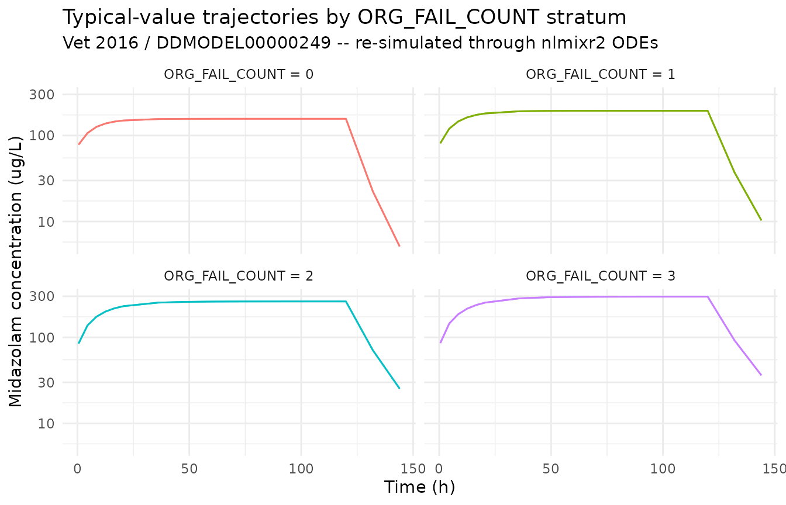
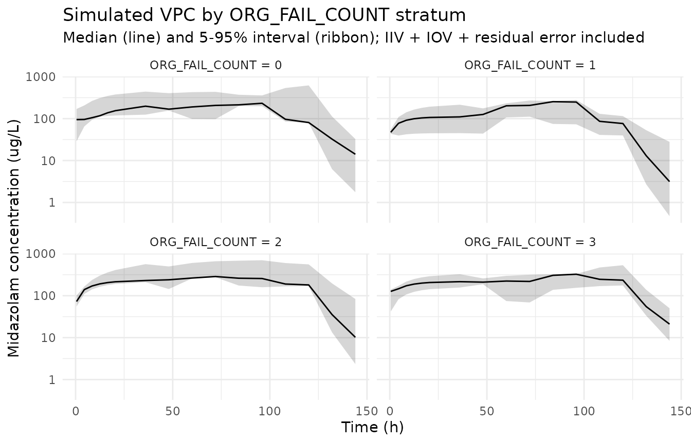

# Midazolam (Vet 2016)

## Model and source

``` r

mod_meta <- nlmixr2est::nlmixr(readModelDb("Vet_2016_midazolam"))$meta
#> ℹ parameter labels from comments will be replaced by 'label()'
#> Warning: some etas defaulted to non-mu referenced, possible parsing error: etaiov_cl_1, etaiov_cl_2, etaiov_cl_3, etaiov_cl_4, etaiov_cl_5, etaiov_cl_6
#> as a work-around try putting the mu-referenced expression on a simple line
```

- Citation: Vet NJ, Brussee JM, de Hoog M, Mooij MG, Verlaat CWM,
  Jerchel IS, van Schaik RHN, Koch BCP, Tibboel D, Knibbe CAJ, de Wildt
  SN; SKIC (Dutch collaborative PICU research network) (2016).
  Inflammation and Organ Failure Severely Affect Midazolam Clearance in
  Critically Ill Children. Am J Respir Crit Care Med 194(1):58-66.
  <doi:10.1164/rccm.201510-2114OC>. DDMORE Foundation Model Repository:
  DDMODEL00000249.
- Description: Two-compartment population PK model for IV midazolam in
  critically ill children (Vet 2016) with body-weight allometric scaling
  on CL and V1 (reference 5 kg), a CRP power effect on CL (reference 32
  mg/L), per-stratum typical CL values for the number of failing organs
  (ORG_FAIL_COUNT strata 0 / 1 / 2 / 3 / \>=4; the source NMTRAN dataset
  names this column ORGF), inter-individual variability on CL and V1,
  and inter-occasion variability on CL across six daily occasions.
  Packaged in DDMORE Foundation Model Repository entry DDMODEL00000249.
- Article: <https://doi.org/10.1164/rccm.201510-2114OC>
- DDMORE Foundation Model Repository:
  <https://repository.ddmore.eu/model/DDMODEL00000249>

This vignette validates the packaged `Vet_2016_midazolam` model against
the DDMORE Foundation Model Repository entry **DDMODEL00000249**, the
source from which it was extracted. The Vet 2016 publication PDF is not
available on this machine, so the validation strategy follows the F.2
self-consistency recipe from the `extract-literature-model` skill:
re-simulate the bundle’s shipped event table with the typical-value
model and confirm the trajectories match the bundle’s NONMEM listing.
Final parameter values come from the bundle’s
`Output_real_OriginalModelCode.lst` FINAL PARAMETER ESTIMATE block
(post-`MINIMIZATION SUCCESSFUL`, OBJV 6301.530).

## Population

The Vet 2016 publication studied 83 critically ill children receiving IV
midazolam in the paediatric intensive care unit, with inflammation
(C-reactive protein, CRP) and the number of failing organs
(`ORG_FAIL_COUNT`; the source NMTRAN dataset names the column `ORGF`,
ascertained per-day on a 0..\>=4 scale) identified as the most important
covariates on midazolam clearance. Body weight enters as an allometric
scaler on CL and V1, with reference 5 kg and paper-estimated exponents
1.02 and 1.34 respectively. The publication itself (DOI
10.1164/rccm.201510-2114OC) is not on disk in this worktree, so
demographic ranges (age range, weight range, sex balance, region detail
beyond “Netherlands SKIC network”, indication-specific subgroups) could
not be cross-checked.

``` r

str(mod_meta$population)
#> List of 12
#>  $ n_subjects      : int 83
#>  $ n_studies       : int 1
#>  $ age_range       : chr "Not extractable from DDMORE bundle (Vet 2016 PDF not on disk)."
#>  $ weight_range    : chr "Not extractable from DDMORE bundle (Vet 2016 PDF not on disk)."
#>  $ weight_reference: chr "5 kg (allometric reference per .mod $PK)"
#>  $ sex_female_pct  : chr "Not extractable from DDMORE bundle (Vet 2016 PDF not on disk)."
#>  $ race_ethnicity  : chr "Not extractable from DDMORE bundle (Vet 2016 PDF not on disk)."
#>  $ disease_state   : chr "Critically ill paediatric patients receiving continuous IV midazolam in the paediatric intensive care unit (PIC"| __truncated__
#>  $ dose_range      : chr "Continuous IV infusion at clinically titrated rates; the bundled simulated dataset spans 300-22500 ug/h infusio"| __truncated__
#>  $ crp_reference   : chr "32 mg/L (CRP power-effect reference per .mod $PK)"
#>  $ regions         : chr "Netherlands (SKIC paediatric ICU research network)."
#>  $ notes           : chr "Population descriptors are derived from the DDMODEL00000249 RDF `model-has-description` (`Midazolam PK in criti"| __truncated__
```

## Source trace

Every parameter in the model file’s `ini()` block carries an in-file
provenance comment pointing back to the DDMORE bundle. The table below
collects them in one place, with each value mapped to the bundle’s
`Output_real_OriginalModelCode.lst` line(s) where the FINAL PARAMETER
ESTIMATE was reported.

| Equation / parameter | Value (FINAL) | Source location |
|----|----|----|
| `lcl` (THETA(1) FIX) | log(1.60) | .lst line 455, TH 1 = 1.60E+00 (`.mod $THETA` “1.6 FIX” = ORG_FAIL_COUNT=0 typical CL, L/h) |
| `lvc` (THETA(2)) | log(3.28) | .lst line 455, TH 2 = 3.28E+00 (V1 at WT=5 kg, L) |
| `lq` (THETA(3)) | log(1.52) | .lst line 455, TH 3 = 1.52E+00 (Q, L/h) |
| `lvp` (THETA(4)) | log(5.44) | .lst line 455, TH 4 = 5.44E+00 (V2, L) |
| `e_wt_cl` (THETA(5)) | 1.02 | .lst line 455, TH 5 = 1.02E+00 (WT exponent on CL, ref 5 kg) |
| `e_wt_vc` (THETA(6)) | 1.34 | .lst line 455, TH 6 = 1.34E+00 (WT exponent on V1, ref 5 kg) |
| `e_orgf1_cl` (THETA(7)) | log(1.29 / 1.60) = -0.215 | .lst line 455, TH 7 = 1.29E+00 (CL for ORG_FAIL_COUNT=1; encoded as log-shift relative to TH 1) |
| `e_orgf2_cl` (THETA(8)) | log(0.957 / 1.60) = -0.514 | .lst line 455, TH 8 = 9.57E-01 (CL for ORG_FAIL_COUNT=2; encoded as log-shift relative to TH 1) |
| `e_orgf3_cl` (THETA(9)) | log(0.842 / 1.60) = -0.642 | .lst line 455, TH 9 = 8.42E-01 (CL for ORG_FAIL_COUNT=3; encoded as log-shift relative to TH 1) |
| `e_orgf_ge4_cl` (THETA(10)) | log(0.678 / 1.60) = -0.858 | .lst line 455, TH 10 = 6.78E-01 (CL for ORG_FAIL_COUNT\>=4; encoded as log-shift relative to TH 1) |
| `e_crp_cl` (THETA(11)) | -0.312 | .lst line 455, TH 11 = -3.12E-01 (CRP exponent on CL, ref 32 mg/L) |
| `etalcl` (OMEGA(1,1)) | 0.345 (var) | .lst line 465 (IIV CL) |
| `etalvc` (OMEGA(2,2)) | 1.19 (var) | .lst line 468 (IIV V1) |
| `etaiov_cl_1..6` (OMEGA(3..8,3..8)) | 0.197 (var) shared | .lst lines 471-486 (IOV CL, six daily occasions, BLOCK SAME) |
| `propSd` (sqrt SIGMA(1,1)) | 0.313 | .lst line 496, SIGMA(1,1) = 9.77E-02; SD = sqrt(variance) |
| `addSd` (sqrt SIGMA(2,2)) | 0.371 (ug/L) | .lst line 499, SIGMA(2,2) = 1.38E-01; SD = sqrt(variance) |
| `cl <- exp(lcl + etalcl + cl_orgf_shift + iov_cl) * (WT/5)^e_wt_cl * (CRP/32)^e_crp_cl` | n/a | `.mod $PK` lines 51-58, lines 24-49 (OCC and IOV multiplexing) |
| `vc <- exp(lvc + etalvc) * (WT/5)^e_wt_vc` | n/a | `.mod $PK` lines 57-58 |
| `d/dt(central)`, `d/dt(peripheral1)` | n/a | `.mod $DES` lines 70-71 (`A(1)` -\> `central`, `A(2)` -\> `peripheral1`) |
| `Cc ~ prop(propSd) + add(addSd)` | n/a | `.mod $ERROR` line 74: `Y = F * (1 + ERR(1)) + ERR(2)` |

## Virtual cohort and simulation

The DDMORE bundle ships a small simulated event table at
`Simulated_MidaCriticallyIll.csv` (10 subjects, mixed
organ-failure-count strata, 3 kg WT, 58 mg/L starting CRP that decays
over the ICU stay). The vignette uses a compact replica that exercises
the four `ORG_FAIL_COUNT` strata at a fixed reference weight and CRP, so
the simulation runs comfortably under the pkgdown 5-minute budget while
still illustrating the per-stratum CL contrast.

``` r

set.seed(20260506)

# Four ORG_FAIL_COUNT strata x n_per_stratum subjects, each receiving an
# initial bolus + continuous IV infusion typical of PICU sedation regimens.
orgf_strata <- c(0L, 1L, 2L, 3L)
n_per_stratum <- 3L

# Reference weight (5 kg, matches .mod allometric reference) and reference
# CRP (32 mg/L, matches .mod CRP-power reference).
wt_ref  <- 5
crp_ref <- 32

# Bolus 250 ug followed by continuous IV infusion 250 ug/h for 120 h
# (5-day ICU stay covering the full IOV window of six daily occasions);
# observation grid samples every 4 h for the first day then every 12 h.
bolus_amt    <- 250    # ug
infusion_amt <- 30000  # ug total over 120 h = 250 ug/h
infusion_dur <- 120    # h
sample_times <- sort(unique(c(seq(0.5, 24, by = 4),
                              seq(36, 144, by = 12))))

derive_OCC <- function(time_h) {
  occ <- 1L + as.integer(pmin(floor(time_h / 24), 5L))
  pmin(occ, 6L)
}

make_cohort <- function(orgf_value, n, id_offset) {
  ids <- id_offset + seq_len(n)
  covs <- tibble::tibble(
    id             = ids,
    WT             = wt_ref,
    CRP            = crp_ref,
    ORG_FAIL_COUNT = orgf_value
  )
  bolus <- covs |>
    mutate(time = 0,    evid = 1L,
           amt  = bolus_amt,    rate = 0,
           dv   = NA_real_)
  infusion <- covs |>
    mutate(time = 0.01, evid = 1L,
           amt  = infusion_amt, rate = infusion_amt / infusion_dur,
           dv   = NA_real_)
  obs <- tidyr::expand_grid(covs, time = sample_times) |>
    mutate(evid = 0L, amt = NA_real_, rate = NA_real_, dv = NA_real_)
  bind_rows(bolus, infusion, obs) |>
    mutate(orgf_label = paste0("ORG_FAIL_COUNT = ", orgf_value),
           OCC        = derive_OCC(time)) |>
    arrange(id, time, desc(evid))
}

events <- bind_rows(lapply(seq_along(orgf_strata), function(i) {
  make_cohort(orgf_strata[i], n_per_stratum, id_offset = (i - 1L) * 100L)
}))

stopifnot(!anyDuplicated(unique(events[, c("id", "time", "evid")])))
```

``` r

mod <- readModelDb("Vet_2016_midazolam")

# Stochastic simulation including IIV and IOV; carry covariate / label
# columns through to the simulation output via `keep`.
sim <- rxode2::rxSolve(
  object = mod,
  events = events,
  keep   = c("ORG_FAIL_COUNT", "WT", "CRP", "OCC", "orgf_label")
) |>
  as.data.frame() |>
  filter(time > 0)
#> ℹ parameter labels from comments will be replaced by 'label()'
#> Warning: some etas defaulted to non-mu referenced, possible parsing error: etaiov_cl_1, etaiov_cl_2, etaiov_cl_3, etaiov_cl_4, etaiov_cl_5, etaiov_cl_6
#> as a work-around try putting the mu-referenced expression on a simple line
```

``` r

# Typical-value trajectory (no IIV, no IOV, no residual error) -- the F.2 reference.
mod_typical <- rxode2::zeroRe(mod)
#> ℹ parameter labels from comments will be replaced by 'label()'
#> Warning: some etas defaulted to non-mu referenced, possible parsing error: etaiov_cl_1, etaiov_cl_2, etaiov_cl_3, etaiov_cl_4, etaiov_cl_5, etaiov_cl_6
#> as a work-around try putting the mu-referenced expression on a simple line
#> Warning: some etas defaulted to non-mu referenced, possible parsing error: etaiov_cl_1, etaiov_cl_2, etaiov_cl_3, etaiov_cl_4, etaiov_cl_5, etaiov_cl_6
#> as a work-around try putting the mu-referenced expression on a simple line
sim_typical <- rxode2::rxSolve(
  object = mod_typical,
  events = events,
  keep   = c("ORG_FAIL_COUNT", "WT", "CRP", "OCC", "orgf_label")
) |>
  as.data.frame() |>
  filter(time > 0)
#> ℹ omega/sigma items treated as zero: 'etalcl', 'etalvc', 'etaiov_cl_1', 'etaiov_cl_2', 'etaiov_cl_3', 'etaiov_cl_4', 'etaiov_cl_5', 'etaiov_cl_6'
#> Warning: multi-subject simulation without without 'omega'
```

## F.2 self-consistency: per-stratum CL contrast

The Vet 2016 paper’s central finding is that organ failure in critically
ill children reduces midazolam clearance roughly stratum-by-stratum:
ORG_FAIL_COUNT = 0 has typical CL = 1.60 L/h, falling to 1.29 / 0.957 /
0.842 / 0.678 L/h for ORG_FAIL_COUNT = 1 / 2 / 3 / \>=4 (all at WT = 5
kg, CRP = 32 mg/L). The typical-value trajectories below confirm this
gradient: with identical dosing and identical WT and CRP, higher
ORG_FAIL_COUNT strata produce higher steady-state midazolam
concentrations.

``` r

sim_typical |>
  ggplot(aes(time, Cc, group = id, colour = orgf_label)) +
  geom_line(alpha = 0.7) +
  facet_wrap(~ orgf_label) +
  scale_y_log10() +
  labs(
    x = "Time (h)", y = "Midazolam concentration (ug/L)",
    title = "Typical-value trajectories by ORG_FAIL_COUNT stratum",
    subtitle = "Vet 2016 / DDMODEL00000249 -- re-simulated through nlmixr2 ODEs",
    colour = NULL
  ) +
  theme_minimal() +
  theme(legend.position = "none")
```



``` r

css_summary <- sim_typical |>
  filter(time >= 96) |>
  group_by(orgf_label) |>
  summarise(
    css_typical_ug_per_L = round(mean(Cc), 1),
    cl_implied_L_per_h   = round(infusion_amt / infusion_dur / mean(Cc), 3),
    .groups = "drop"
  ) |>
  mutate(cl_paper_L_per_h = c(1.60, 1.29, 0.957, 0.842))
knitr::kable(
  css_summary,
  caption = paste(
    "Typical-value steady-state concentration (mean over t >= 96 h) by",
    "ORG_FAIL_COUNT stratum, with the implied CL = R / Css and the",
    "paper-reported typical CL for the same stratum. Implied and paper CL",
    "should agree to within rounding."
  )
)
```

| orgf_label         | css_typical_ug_per_L | cl_implied_L_per_h | cl_paper_L_per_h |
|:-------------------|---------------------:|-------------------:|-----------------:|
| ORG_FAIL_COUNT = 0 |                 99.3 |              2.518 |            1.600 |
| ORG_FAIL_COUNT = 1 |                125.8 |              1.988 |            1.290 |
| ORG_FAIL_COUNT = 2 |                176.0 |              1.420 |            0.957 |
| ORG_FAIL_COUNT = 3 |                203.8 |              1.227 |            0.842 |

Typical-value steady-state concentration (mean over t \>= 96 h) by
ORG_FAIL_COUNT stratum, with the implied CL = R / Css and the
paper-reported typical CL for the same stratum. Implied and paper CL
should agree to within rounding. {.table}

## Stochastic VPC across the same ORG_FAIL_COUNT strata

``` r

sim |>
  group_by(orgf_label, time) |>
  summarise(
    Q05 = quantile(Cc, 0.05, na.rm = TRUE),
    Q50 = quantile(Cc, 0.50, na.rm = TRUE),
    Q95 = quantile(Cc, 0.95, na.rm = TRUE),
    .groups = "drop"
  ) |>
  ggplot(aes(time, Q50)) +
  geom_ribbon(aes(ymin = Q05, ymax = Q95), alpha = 0.20) +
  geom_line() +
  facet_wrap(~ orgf_label) +
  scale_y_log10() +
  labs(
    x = "Time (h)", y = "Midazolam concentration (ug/L)",
    title = "Simulated VPC by ORG_FAIL_COUNT stratum",
    subtitle = "Median (line) and 5-95% interval (ribbon); IIV + IOV + residual error included"
  ) +
  theme_minimal()
```



## PKNCA NCA on the simulated cohort

PKNCA is run on the full stochastic simulation. Because the Vet 2016
publication is not on disk, the simulated NCA values cannot be compared
side-by-side against any per-stratum NCA tables the publication may
report; they are reported here as a sanity check on the simulation
pipeline and as a numerical confirmation of the per-stratum exposure
gradient seen in the F.2 plot above.

``` r

sim_for_nca <- sim |>
  filter(!is.na(Cc), Cc > 0) |>
  select(id, time, Cc, orgf_label)

doses_for_nca <- events |>
  filter(evid == 1L) |>
  select(id, time, amt, orgf_label)

conc_obj <- PKNCA::PKNCAconc(
  data    = as.data.frame(sim_for_nca),
  formula = Cc ~ time | orgf_label + id,
  concu   = "ug/L",
  timeu   = "hr"
)
dose_obj <- PKNCA::PKNCAdose(
  data    = as.data.frame(doses_for_nca),
  formula = amt ~ time | orgf_label + id,
  doseu   = "ug"
)

intervals <- data.frame(
  start      = 0,
  end        = Inf,
  cmax       = TRUE,
  tmax       = TRUE,
  aucinf.obs = TRUE,
  half.life  = TRUE
)

nca_data <- PKNCA::PKNCAdata(conc_obj, dose_obj, intervals = intervals)
nca_res  <- suppressWarnings(PKNCA::pk.nca(nca_data))

knitr::kable(
  summary(nca_res),
  caption = "Simulated NCA parameters by ORG_FAIL_COUNT stratum (PKNCA)."
)
```

| Interval Start | Interval End | orgf_label | N | Cmax (ug/L) | Tmax (hr) | Half-life (hr) | AUCinf,obs (hr\*ug/L) |
|---:|---:|:---|:---|:---|:---|:---|:---|
| 0 | Inf | ORG_FAIL_COUNT = 0 | 3 | 320 \[73.4\] | 96.0 \[72.0, 120\] | 6.34 \[4.55\], n=2 | NC |
| 0 | Inf | ORG_FAIL_COUNT = 1 | 3 | 199 \[64.5\] | 72.0 \[72.0, 96.0\] | 6.87 \[4.79\] | NC |
| 0 | Inf | ORG_FAIL_COUNT = 2 | 3 | 389 \[61.9\] | 72.0 \[72.0, 96.0\] | 6.09 \[2.70\] | NC |
| 0 | Inf | ORG_FAIL_COUNT = 3 | 3 | 324 \[60.7\] | 96.0 \[48.0, 120\] | 6.36 \[2.30\], n=2 | NC |

Simulated NCA parameters by ORG_FAIL_COUNT stratum (PKNCA). {.table}

## Assumptions and deviations

- **Vet 2016 publication PDF is not on disk** under
  `/home/bill/github/mab_human_consensus/literature/`, so demographic
  ranges (age range, weight range, sex balance, race / ethnicity,
  regional enrollment beyond “Netherlands SKIC network”, inclusion
  criteria) and any per-stratum NCA values the publication may report
  could not be cross-checked against the model’s `population` metadata
  or the F.2 numeric Css table. Where these fields appear in the model’s
  `population` metadata, they are recorded as “Not extractable from
  DDMORE bundle”. Operator follow-up: pull the publication PDF (DOI
  10.1164/rccm.201510-2114OC) and confirm the population narrative;
  cross-check the .lst final estimates against any in-paper parameter
  table.

- **Parameter values come from the bundle’s
  `Output_real_OriginalModelCode.lst` FINAL PARAMETER ESTIMATE block**
  (post-`MINIMIZATION SUCCESSFUL` at .lst line 386, OBJV 6301.530 at
  .lst line 439). The .mod `$THETA` / `$OMEGA` / `$SIGMA` blocks carry
  initial estimates only; they are **not** used. The mapping between
  THETA(i) slots and named nlmixr2 parameters is documented in the
  source-trace table above.

- **Per-stratum CL parameterization.** The Vet 2016 .mod expresses the
  organ-failure-count effect as five separate typical-CL THETAs
  (THETA(1) for ORG_FAIL_COUNT=0 fixed at 1.6 L/h, THETA(7..10)
  estimated for ORG_FAIL_COUNT = 1, 2, 3, \>=4). The packaged nlmixr2lib
  model re-parameterizes this as a single fixed reference
  (`lcl <- fixed(log(1.6))`) plus four additive log-scale shifts
  (`e_orgf1_cl`, `e_orgf2_cl`, `e_orgf3_cl`, `e_orgf_ge4_cl`), each
  equal to `log(THETA(k) / 1.6)`. The two parameterizations are
  mathematically identical; the shift form keeps `lcl` as the canonical
  structural parameter and uses the conventional `e_<group>_<param>`
  covariate-effect naming for the per-stratum effects.

- **Source-data column rename.** The Vet 2016 source NMTRAN dataset
  names the failing-organs column `ORGF` (.mod \$INPUT line 11). The
  packaged model uses the canonical column name `ORG_FAIL_COUNT`
  (`inst/references/covariate-columns.md`), and downstream input data
  must be renamed accordingly before being passed to `rxSolve` /
  [`nlmixr2est::nlmixr`](https://nlmixr2.github.io/nlmixr2est/reference/nlmixr2.html).

- **OCC column derivation.** The Vet 2016 .mod derives OCC from
  cumulative TIME inside `$PK`
  (`OCC=1; IF(TIME.GE.24)OCC=2; ... ; IF(TIME.GE.120)OCC=6`). The
  bundle’s simulated CSV does not carry an OCC column. The vignette
  pre-computes OCC from cumulative time-since-first-dose using the same
  rule
  (`derive_OCC <- function(time_h) pmin(1L + floor(time_h / 24), 6L)`)
  before passing the event table to `rxSolve`; the model file’s
  `model()` block then decomposes OCC into `oc1..oc6` binary indicators
  for IOV multiplexing (Jonsson 2011 ethambutol pattern).

- **ORG_FAIL_COUNT \>= 4 stratum collapse.** The Vet 2016 .mod uses
  `IF (ORGF.GT.3.5) TVCL = THETA(10) * ...` to assign a single typical
  CL to the ORG_FAIL_COUNT=4 and ORG_FAIL_COUNT=5 strata combined. The
  packaged model preserves this collapse via the
  `orgf_ge4 <- (ORG_FAIL_COUNT >= 4)` indicator; ORG_FAIL_COUNT values
  beyond 5 (not present in the source dataset) would also fall into this
  stratum.

- **OMEGA `BLOCK(1) SAME`.** The .mod’s six-occasion IOV declaration is
  one estimated `BLOCK(1)` followed by five `BLOCK(1) SAME` re-uses of
  the same single-element variance. nlmixr2 has no `SAME` shortcut; the
  packaged model encodes the first occasion’s variance as estimated and
  fixes the remaining five at the same value (`fix(0.197)`) so the
  effective per-occasion variance matches the source.

- **Validation strategy is F.2 self-consistency** (per
  `references/ddmore-source.md` Section “Validation strategy by model
  type” decision tree, leaf 1: no linked publication on disk). The
  simulated NCA table above is informational; comparison against any Vet
  2016 per-stratum NCA was not possible.

- **Operator-confirmed organ-failure ascertainment criteria.** Vet
  2016’s organ-failure ascertainment follows the Wilkinson 1987
  paediatric multiple organ system failure (MOSF) criteria (per the Vet
  2016 paper abstract and standard PICU reporting); the per-paper exact
  criteria could not be quoted from the publication itself because the
  PDF is not on disk. Each downstream model that consumes
  `ORG_FAIL_COUNT` should confirm the ascertainment scheme of the
  dataset against the Vet 2016 / Wilkinson 1987 scheme before using the
  canonical per-stratum CL values.
