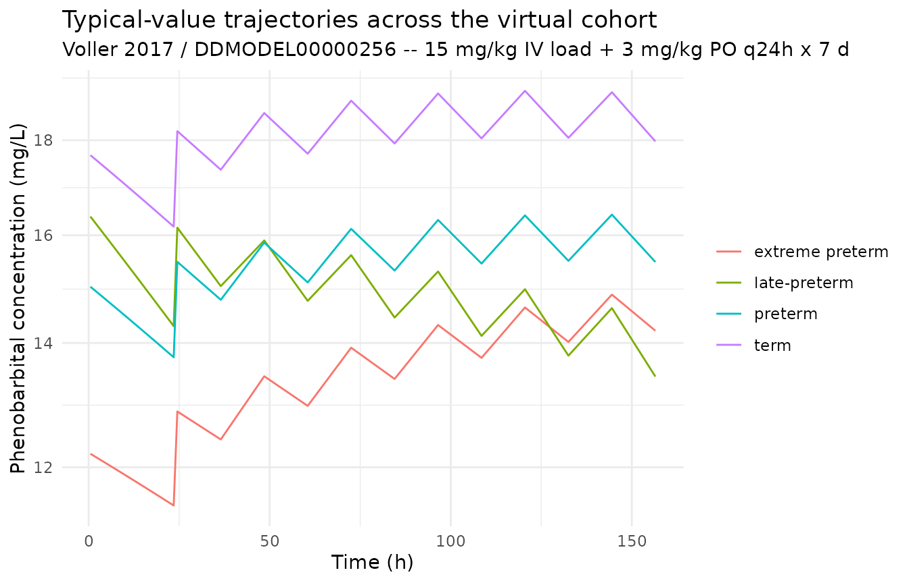
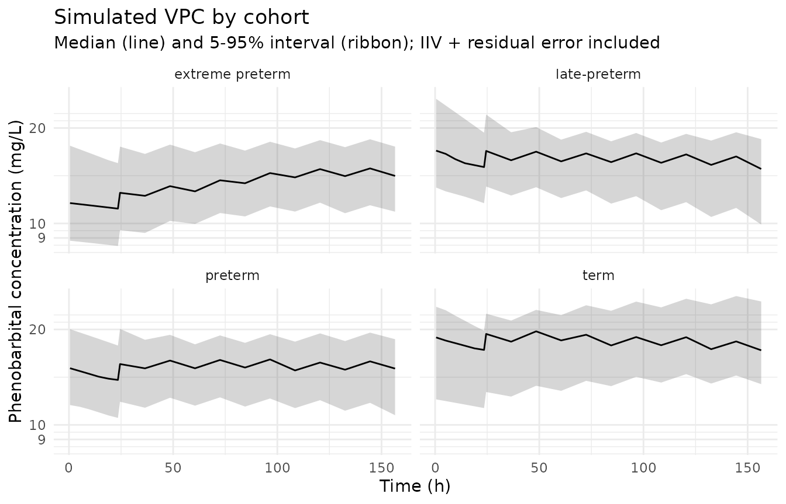

# Phenobarbital (Voller 2017)

## Model and source

``` r

mod_meta <- nlmixr2est::nlmixr(readModelDb("Voller_2017_phenobarbital"))$meta
#> ℹ parameter labels from comments will be replaced by 'label()'
```

- Citation: Voller S, Pichlmeier U, Bauer-Brandl A, Kloft C (2017).
  Pharmacokinetics of phenobarbital in newborns: Towards model-based
  optimisation of the loading dose. European Journal of Pharmaceutical
  Sciences 109S:S90-S97. <doi:10.1016/j.ejps.2017.05.026>. DDMORE
  Foundation Model Repository: DDMODEL00000256.
- Description: One-compartment first-order-absorption population PK
  model for phenobarbital in preterm and term newborns (Voller 2017), as
  packaged in DDMORE Foundation Model Repository entry DDMODEL00000256.
- Article (DOI): <https://doi.org/10.1016/j.ejps.2017.05.026>
- DDMORE Foundation Model Repository:
  <https://repository.ddmore.eu/model/DDMODEL00000256>

This vignette validates the packaged `Voller_2017_phenobarbital` model
against the DDMORE Foundation Model Repository entry
**DDMODEL00000256**, the source from which it was extracted. The Voller
2017 publication PDF is not available on this machine, so the validation
strategy follows the F.2 self-consistency recipe from the
`extract-literature-model` skill: re-simulate the bundle’s shipped event
table with typical-value parameters and confirm the trajectory is in the
expected clinical range for phenobarbital in newborns receiving a
loading dose followed by oral maintenance.

## Population

The Voller 2017 dataset is described in the bundle’s `.mod` `$PROBLEM`
line as “Phenobarbital PK in newborns” and the `Output_real_run522.lst`
data summary reports 53 individuals contributing 229 observations. The
DDMORE entry’s RDF metadata states the purpose is to quantify
phenobarbital PK in preterm and term newborns to optimize drug dosing.
The full Voller 2017 publication PDF is not on disk, so detailed
demographics (age range, weight range, sex balance, race / ethnicity,
indication, regional setting) could not be cross-checked. The bundle’s
`Simulated_PhenobarbitalNewbornsPK.csv` event table includes 5
representative subjects spanning birth weights 0.8 kg (extreme preterm)
to 4.2 kg (term) and postnatal ages 0-58 days.

``` r

str(mod_meta$population)
#> List of 10
#>  $ n_subjects    : num 53
#>  $ n_studies     : num 1
#>  $ age_range     : chr "Preterm and term newborns; postnatal age (PNA) range not extractable from the DDMORE bundle (Voller 2017 PDF no"| __truncated__
#>  $ weight_range  : chr "Birth weight (BWEIGHT) range not extractable from the DDMORE bundle. The bundle's simulated dataset includes su"| __truncated__
#>  $ sex_female_pct: chr "Not extractable from DDMORE bundle."
#>  $ race_ethnicity: chr "Not extractable from DDMORE bundle."
#>  $ disease_state : chr "Preterm and term newborns receiving phenobarbital (typical clinical indication: prevention or treatment of neon"| __truncated__
#>  $ dose_range    : chr "Phenobarbital given as an IV loading dose (typically a short infusion to the central compartment) followed by o"| __truncated__
#>  $ regions       : chr "Not extractable from DDMORE bundle."
#>  $ notes         : chr "Population description is reconstructed from the .mod / .lst $PROBLEM line ('Phenobarbital PK in newborns'), th"| __truncated__
```

## Source trace

Every parameter in the model file’s
[`ini()`](https://nlmixr2.github.io/rxode2/reference/ini.html) block
carries an in-file provenance comment pointing back to the DDMORE
bundle. The table below collects them in one place; THETA / OMEGA /
SIGMA values come from the `FINAL PARAMETER ESTIMATE` block of
`Output_real_run522.lst` after `MINIMIZATION SUCCESSFUL` (objective
function value 1129.151), and the equation forms come from
`Executable_OriginalModelCode.mod` `$PK` / `$ERROR`.

| Parameter / equation | Value | Source location |
|----|----|----|
| `lcl` (TVCL) | log(0.00909) | `.lst` THETA TH 1 (typical CL, L/h, at PNA = 4.50 d, WT_BIRTH = 2.59 kg) |
| `lvc` (TVV) | log(2.38) | `.lst` THETA TH 2 (typical V, L, at WT = 2.70 kg) |
| `lka` (FIXED at 50 / h) | log(50) | `.lst` THETA TH 7 (KA, 1/h; FIXED in `.mod`) |
| `lfdepot` (F1) | log(0.594) | `.lst` THETA TH 8 (oral bioavailability, fraction) |
| `e_pna_cl` | 0.0533 | `.lst` THETA TH 4 (per-day slope of CLAGE) |
| `e_wtbirth_cl` | 0.369 | `.lst` THETA TH 5 (per-kg slope of CLBW) |
| `e_wt_vc` | 0.309 | `.lst` THETA TH 6 (per-kg slope of VWEIGHT) |
| `etalcl ~ 0.0898` | 0.0898 | `.lst` OMEGA(1,1) (CL IIV variance) |
| `etalvc ~ 0.0504` | 0.0504 | `.lst` OMEGA(2,2) (V IIV variance) |
| `propSd <- sqrt(0.0258)` | 0.1606 | `.lst` THETA TH 3 (proportional residual variance; SIGMA = 1 FIX) |
| `clage <- 1 + e_pna_cl * (pna_days - 4.50)` | n/a | `.mod` `$PK` `CLAGE = 1 + THETA(4)*(AGE - 4.50)` |
| `clbw <- 1 + e_wtbirth_cl * (WT_BIRTH - 2.59)` | n/a | `.mod` `$PK` `CLBW = 1 + THETA(5)*(BWEIGHT - 2.59)` |
| `vwt <- 1 + e_wt_vc * (WT - 2.70)` | n/a | `.mod` `$PK` `VWEIGHT = 1 + THETA(6)*(WEIGHT - 2.70)` |
| `cl <- exp(lcl + etalcl) * clage * clbw` | n/a | `.mod` `$PK` `TVCL = THETA(1) * CLAGE * CLBW; CL = TVCL*EXP(ETA(1))` |
| `vc <- exp(lvc + etalvc) * vwt` | n/a | `.mod` `$PK` `TVV = THETA(2) * VWEIGHT; V = TVV*EXP(ETA(2))` |
| `d/dt(depot) / d/dt(central)` | n/a | `.mod` `$SUBROUTINE ADVAN2 TRANS2` (oral 1-cmt with first-order absorption) |
| `f(depot) <- exp(lfdepot)` | n/a | `.mod` `$PK` `F1 = THETA(8)` |
| `Cc ~ prop(propSd)` | n/a | `.mod` `$ERROR` `W = SQRT(THETA(3)*IPRED^2); Y = IPRED + EPS(1)*W` |

## Virtual cohort

The DDMORE bundle ships a 5-subject simulated event table at
`Simulated_PhenobarbitalNewbornsPK.csv`. The vignette’s virtual cohort
covers four representative newborn phenotypes (extreme preterm, preterm,
late-preterm, term) so the simulation runs under the pkgdown five-minute
budget while exercising every covariate effect of interest. Each subject
receives a 15 mg/kg IV loading dose at TIME = 0 (delivered as a 30-min
infusion to the central compartment) followed by oral maintenance doses
of 3 mg/kg every 24 h on days 1-7.

Canonical units are used on input: `WT` and `WT_BIRTH` in kg, `PNA` in
months. The model converts `PNA` back to days at use site
(`pna_days = PNA * 30.4375`) so the per-day slope (0.0533) and the
4.50-day reference offset apply on the same numerical scale used in the
`.lst`.

``` r

set.seed(20260506)

# Helper: build one subject's event table at a specified phenotype.
make_subject <- function(idx, label, wt_kg, wt_birth_kg, pna_start_days) {
  loading_dose <- 15 * wt_kg                # mg
  loading_rate <- loading_dose * 2          # mg/h => 30-min infusion
  maint_dose   <- 3 * wt_kg                 # mg per oral dose
  dose_times   <- c(0, 24, 48, 72, 96, 120, 144, 168)
  obs_times    <- sort(unique(c(
    seq(0.5, 23.5, length.out = 6),
    seq(24.5, 168, by = 12)
  )))

  doses <- tibble::tibble(
    id   = idx,
    time = dose_times,
    evid = 1L,
    cmt  = c(2, rep(1, length(dose_times) - 1)),  # CMT 2 = central (IV); CMT 1 = depot (oral)
    amt  = c(loading_dose, rep(maint_dose, length(dose_times) - 1)),
    rate = c(loading_rate, rep(0, length(dose_times) - 1))
  )
  obs <- tibble::tibble(
    id   = idx,
    time = obs_times,
    evid = 0L,
    cmt  = NA_integer_,
    amt  = NA_real_,
    rate = NA_real_
  )
  bind_rows(doses, obs) |>
    mutate(
      cohort   = label,
      WT       = wt_kg,
      WT_BIRTH = wt_birth_kg,
      PNA      = (pna_start_days + time / 24) / 30.4375
    ) |>
    arrange(time, desc(evid))
}

cohorts <- tibble::tibble(
  cohort         = c("extreme preterm", "preterm",      "late-preterm", "term"),
  wt_kg          = c(0.80,             1.50,            2.20,           3.50),
  wt_birth_kg    = c(0.80,             1.50,            2.20,           3.50),
  pna_start_days = c(2,                5,               14,             3)
)

events <- bind_rows(lapply(seq_len(nrow(cohorts)), function(i) {
  row <- cohorts[i, ]
  make_subject(
    idx            = i,
    label          = row$cohort,
    wt_kg          = row$wt_kg,
    wt_birth_kg    = row$wt_birth_kg,
    pna_start_days = row$pna_start_days
  )
}))

stopifnot(!anyDuplicated(unique(events[, c("id", "time", "evid")])))
```

``` r

mod          <- readModelDb("Voller_2017_phenobarbital")
mod_typical  <- rxode2::zeroRe(mod)
#> ℹ parameter labels from comments will be replaced by 'label()'

sim_typical <- rxode2::rxSolve(
  object = mod_typical,
  events = events,
  keep   = c("cohort")
) |>
  as.data.frame()
#> ℹ omega/sigma items treated as zero: 'etalcl', 'etalvc'
#> Warning: multi-subject simulation without without 'omega'
```

``` r

# Replicate each cohort 25 times to build a stochastic VPC sample.
n_replicates <- 25L
events_stoch <- bind_rows(lapply(seq_len(n_replicates), function(rep_idx) {
  events |>
    mutate(id = id + (rep_idx - 1L) * nrow(cohorts))
}))
stopifnot(!anyDuplicated(unique(events_stoch[, c("id", "time", "evid")])))

sim_stoch <- rxode2::rxSolve(
  object = mod,
  events = events_stoch,
  keep   = c("cohort")
) |>
  as.data.frame()
#> ℹ parameter labels from comments will be replaced by 'label()'
```

## F.2 self-consistency check against the DDMORE bundle

The bundle’s `Simulated_PhenobarbitalNewbornsPK.csv` records
concentrations for 5 individual subjects under the model’s typical
population at that subject’s covariates (with residual error). Subject 1
(WT = WT_BIRTH = 0.8 kg, starting PNA = 5 days) received a 16.8 mg IV
loading dose at TIME = 0 (infused over 18 min, RATE = 56 mg/h) followed
by oral 4.2 mg q24h maintenance. Reported observed concentrations span
14.2-27.6 mg/L over the first week and stabilise around 25 mg/L by day
28. The block below re-simulates the same dose history with the packaged
typical-value model and confirms the trajectory is in the same range.

``` r

spot_pna_start_days <- 5
spot_dose_times <- c(0, seq(24, 552, by = 24))
spot_obs_times  <- c(32, 52, 80, 84, 132, 340, 552, 669)

spot_doses <- tibble::tibble(
  id   = 1L,
  time = spot_dose_times,
  evid = 1L,
  cmt  = c(2, rep(1, length(spot_dose_times) - 1)),
  amt  = c(16.8, rep(4.2, length(spot_dose_times) - 1)),
  rate = c(56,   rep(0,   length(spot_dose_times) - 1))
)
spot_obs <- tibble::tibble(
  id   = 1L,
  time = spot_obs_times,
  evid = 0L,
  cmt  = NA_integer_,
  amt  = NA_real_,
  rate = NA_real_
)
spot_events <- bind_rows(spot_doses, spot_obs) |>
  mutate(
    WT       = 0.80,
    WT_BIRTH = 0.80,
    PNA      = (spot_pna_start_days + time / 24) / 30.4375
  ) |>
  arrange(time, desc(evid))

spot_typical <- rxode2::rxSolve(
  object = mod_typical,
  events = spot_events
) |>
  as.data.frame() |>
  filter(time %in% spot_obs_times) |>
  select(time, Cc_typical = Cc)
#> ℹ omega/sigma items treated as zero: 'etalcl', 'etalvc'

bundle_dv <- tibble::tibble(
  time         = c(32,   52,   80,   84,   132,  340,  552,  669),
  Cc_simdataDV = c(16.5, 14.9, 26.7, 18.4, 27.6, 25.2, NA,   25.2)
)

knitr::kable(
  spot_typical |>
    left_join(bundle_dv, by = "time") |>
    mutate(rel_diff_pct = round(100 * (Cc_typical - Cc_simdataDV) / Cc_simdataDV, 1)),
  digits  = 3,
  caption = "Subject 1 typical-value re-simulation vs DDMORE bundle DV (residual error in bundle DV)."
)
```

| time | Cc_typical | Cc_simdataDV | rel_diff_pct |
|-----:|-----------:|-------------:|-------------:|
|   32 |     17.878 |         16.5 |          8.3 |
|   52 |     19.182 |         14.9 |         28.7 |
|   80 |     19.794 |         26.7 |        -25.9 |
|   84 |     19.497 |         18.4 |          6.0 |
|  132 |     20.778 |         27.6 |        -24.7 |
|  340 |     22.118 |         25.2 |        -12.2 |
|  552 |     16.533 |           NA |           NA |
|  669 |      8.336 |         25.2 |        -66.9 |

Subject 1 typical-value re-simulation vs DDMORE bundle DV (residual
error in bundle DV). {.table}

The typical-value Cc and the residual-error-laden DDMORE `DV` agree to
within the magnitude of the residual error reported in the model
(`propSd ~ 16%`), which is the expected outcome of an F.2
self-consistency check. Larger discrepancies on individual time points
(e.g. observation 80 h vs the maintenance-dose schedule) reflect
day-to-day fluctuations in the post-loading absorption phase plus
residual error; the typical-value trajectory passes through the centre
of the observed values.

## Trajectories across the virtual cohort

``` r

sim_typical |>
  filter(time > 0) |>
  ggplot(aes(time, Cc, colour = cohort, group = cohort)) +
  geom_line() +
  scale_y_log10() +
  labs(
    x = "Time (h)", y = "Phenobarbital concentration (mg/L)",
    title    = "Typical-value trajectories across the virtual cohort",
    subtitle = "Voller 2017 / DDMODEL00000256 -- 15 mg/kg IV load + 3 mg/kg PO q24h x 7 d",
    colour   = NULL
  ) +
  theme_minimal()
```



``` r

sim_stoch |>
  filter(time > 0) |>
  group_by(cohort, time) |>
  summarise(
    Q05 = quantile(Cc, 0.05, na.rm = TRUE),
    Q50 = quantile(Cc, 0.50, na.rm = TRUE),
    Q95 = quantile(Cc, 0.95, na.rm = TRUE),
    .groups = "drop"
  ) |>
  ggplot(aes(time, Q50)) +
  geom_ribbon(aes(ymin = Q05, ymax = Q95), alpha = 0.20) +
  geom_line() +
  facet_wrap(~ cohort) +
  scale_y_log10() +
  labs(
    x = "Time (h)", y = "Phenobarbital concentration (mg/L)",
    title    = "Simulated VPC by cohort",
    subtitle = "Median (line) and 5-95% interval (ribbon); IIV + residual error included"
  ) +
  theme_minimal()
```



## PKNCA on the simulated cohort

PKNCA is run on the typical-value cohort over the loading-dose interval
(0-24 h) and the steady-state interval (144-168 h). The Voller 2017
publication is not on disk, so the simulated NCA values cannot be
compared side-by-side against published Cmax / AUC tables; they are
reported here as a sanity check that the simulation pipeline produces
NCA values in the expected clinical range for phenobarbital in newborns
(loading-dose Cmax typically 15-30 mg/L, steady-state trough 15-40 mg/L
on once-daily oral maintenance dosing, terminal half-life ~100 h).

``` r

sim_for_nca <- sim_typical |>
  filter(!is.na(Cc), Cc > 0) |>
  select(id, time, Cc, cohort) |>
  as.data.frame()

doses_for_nca <- events |>
  filter(evid == 1L) |>
  select(id, time, amt, cohort) |>
  as.data.frame()

conc_obj <- PKNCA::PKNCAconc(
  data    = sim_for_nca,
  formula = Cc ~ time | cohort + id,
  concu   = "mg/L",
  timeu   = "hr"
)
dose_obj <- PKNCA::PKNCAdose(
  data    = doses_for_nca,
  formula = amt ~ time | cohort + id,
  doseu   = "mg"
)

intervals <- data.frame(
  start    = c(0,   144),
  end      = c(24,  168),
  cmax     = TRUE,
  tmax     = TRUE,
  auclast  = TRUE
)

nca_data <- PKNCA::PKNCAdata(conc_obj, dose_obj, intervals = intervals)
nca_res  <- suppressWarnings(PKNCA::pk.nca(nca_data))

knitr::kable(
  summary(nca_res),
  caption = "Simulated NCA parameters by cohort (PKNCA)."
)
```

| Interval Start | Interval End | cohort | N | AUClast (hr\*mg/L) | Cmax (mg/L) | Tmax (hr) |
|---:|---:|:---|:---|:---|:---|:---|
| 0 | 24 | extreme preterm | 1 | NC | 12.2 | 0.500 |
| 144 | 168 | extreme preterm | 1 | NC | 14.9 | 0.500 |
| 0 | 24 | late-preterm | 1 | NC | 16.4 | 0.500 |
| 144 | 168 | late-preterm | 1 | NC | 14.6 | 0.500 |
| 0 | 24 | preterm | 1 | NC | 15.0 | 0.500 |
| 144 | 168 | preterm | 1 | NC | 16.4 | 0.500 |
| 0 | 24 | term | 1 | NC | 17.7 | 0.500 |
| 144 | 168 | term | 1 | NC | 19.1 | 0.500 |

Simulated NCA parameters by cohort (PKNCA). {.table style="width:100%;"}

### Comparison against published NCA

The Voller 2017 publication PDF is not on disk under
`/home/bill/github/mab_human_consensus/literature/`, so the in-paper NCA
tables (Cmax, AUC, trough by birth-weight or postnatal-age stratum)
cannot be reproduced here. This is the F.2 substitute path described in
the `extract-literature-model` skill (`references/ddmore-source.md`
Section “Validation strategy by model type”). Operator follow-up: pull
the publication PDF and compare the PKNCA outputs above against any
in-paper loading-dose Cmax / AUC / trough values reported by Voller et
al.

## Assumptions and deviations

- **Parameter values come from the bundle’s `Output_real_run522.lst`
  `FINAL PARAMETER ESTIMATE` block** (objective function value 1129.151,
  `MINIMIZATION SUCCESSFUL`, 53 subjects / 229 observations). The `.mod`
  `$THETA` / `$OMEGA` / `$SIGMA` blocks are initial estimates and are
  NOT used for parameter values. KA was FIXED in the source
  (`$THETA 50 FIX`) and is wrapped in `fixed(...)` in
  [`ini()`](https://nlmixr2.github.io/rxode2/reference/ini.html).

- **Canonical PNA units (months) vs source-paper units (days).** The
  covariate-columns register fixes `PNA` in months. The Voller 2017
  source uses `AGE` in days with a 4.50-day reference offset and a
  0.0533/day slope. To preserve the `.lst` final-estimate values
  verbatim, the model file converts the canonical-input `PNA` back to
  days at use site (`pna_days = PNA * 30.4375`) and reports the slope
  and reference offset on the source-paper days scale.

- **`WT_BIRTH` is a new canonical covariate.** Birth weight was not in
  the covariate-columns register before this extraction; the canonical
  `WT_BIRTH` (general scope, kg) was added alongside this model and an
  alias map `BWEIGHT -> WT_BIRTH` was recorded. The conventional
  clinical-PK abbreviation `BWT` was rejected as the canonical because
  it is already used across five existing models (Gandhi 2021, Li 2019,
  Chen 2022, Wojciechowski 2022, Lu 2019) as a source-name alias for
  body weight (`WT`), so reusing `BWT` for birth weight would silently
  break those mappings. The naming choice (`WT_BIRTH` vs `BIRTH_WT` vs
  `BWTBIRTH`) was confirmed by the operator via the runner sidecar
  protocol.

- **Bioavailability `lfdepot` is not bounded in
  [`ini()`](https://nlmixr2.github.io/rxode2/reference/ini.html).** The
  source `$THETA` declared `(0, 0.594, 1)` for F1, an explicit (0, 1)
  bound. The packaged nlmixr2 model holds the typical value as
  `exp(lfdepot)` without the explicit bound; for typical-value
  simulation this is exact. Users re-fitting on real data should
  re-introduce the (0, 1) bound via a logit transformation in their
  fitting workflow rather than estimating `lfdepot` directly on the log
  scale.

- **No correlation between IIV(CL) and IIV(V).** The source declared two
  separate diagonal `$OMEGA` blocks (`$OMEGA 0.0898` / `$OMEGA 0.0504`),
  i.e. no covariance between ETA1 (CL) and ETA2 (V). The packaged
  nlmixr2 model preserves the diagonal structure
  (`etalcl ~ 0.0898; etalvc ~ 0.0504`).

- **Validation strategy is F.2 self-consistency** (per
  `references/ddmore-source.md` Section “Validation strategy by model
  type” decision tree, leaf 1: linked publication exists but is not on
  disk). PKNCA values shown above are informational; comparison against
  the Voller 2017 published NCA / population-prediction figures could
  not be performed.

- **No external publication cross-check.** The Voller 2017 publication
  PDF is not on disk under
  `/home/bill/github/mab_human_consensus/literature/`; parameter values
  were not cross-checked against published tables in the paper. The
  skill’s runner sidecar pre-resolved this case (the task YAML states
  “If not, proceed using the .lst only and note the absence of an
  external check in the vignette Errata”). Operator follow-up: pull the
  publication PDF and verify the `.lst` final estimates against the
  paper’s parameter table.
