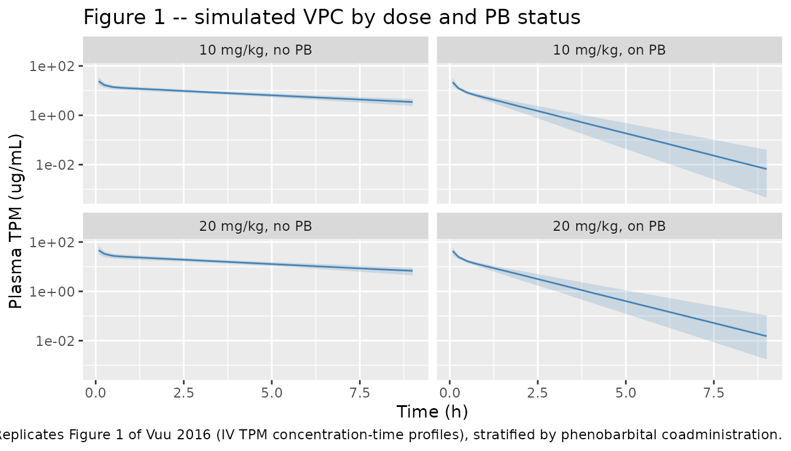
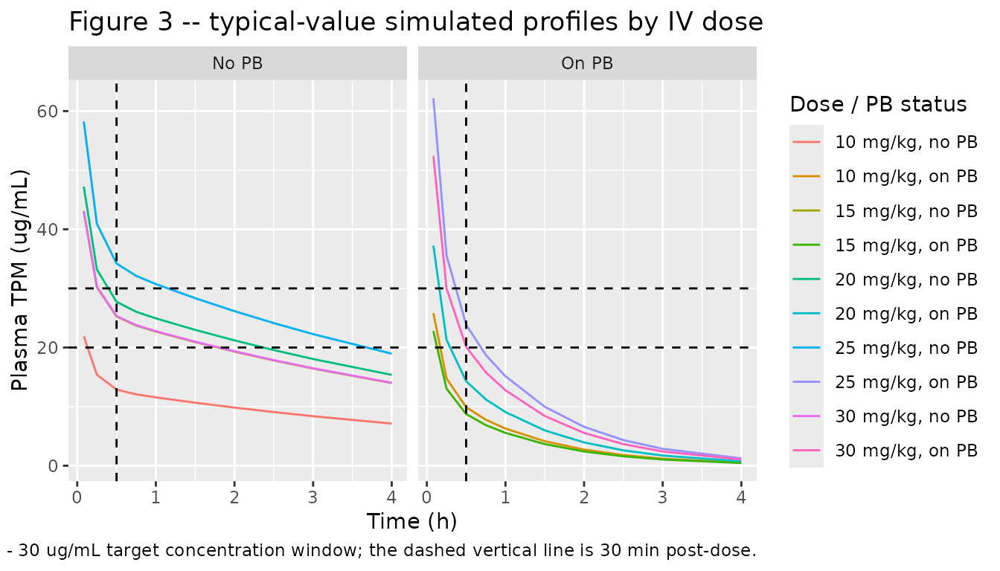

# Topiramate, intravenous, in dogs (Vuu 2016)

## Model and source

- Citation: Vuu I, Coles LD, Maglalang P, Leppik IE, Worrell G, Crepeau
  D, Mishra U, Cloyd JC, Patterson EE. Intravenous Topiramate:
  Pharmacokinetics in Dogs with Naturally Occurring Epilepsy. Front Vet
  Sci. 2016 Dec 5;3:107. <doi:10.3389/fvets.2016.00107>.
- Description: Preclinical (dog). Population two-compartment intravenous
  PK model for topiramate (TPM) in dogs with naturally-occurring
  epilepsy (Vuu 2016). Stable-labelled TPM was given as a 5-min IV
  infusion at 10 mg/kg (n = 4) or 20 mg/kg (n = 3); pooled across the
  low- and high-dose data, a two- compartment model with first-order
  elimination from the central compartment described the disposition
  best. Concomitant phenobarbital (CONMED_PB) was identified as an
  enzyme-inducer covariate on systemic clearance via an exponential
  effect (Cl = tvCl \* exp(dCl \* CONMED_PB)), yielding a 5.64-fold
  higher CL in PB-coadministered dogs. Per-kg structural parameters (Vc,
  Vp, CL, Q) are scaled to absolute units by individual body weight (WT,
  kg) inside the model; the dose in the event table is therefore
  absolute mg (mg/kg dose times WT). IIV is exponential on Vc and CL;
  residual error is proportional (~15%).
- Article: [Front Vet Sci
  2016;3:107](https://doi.org/10.3389/fvets.2016.00107)
- Supplement: [Table S1
  (DOCX)](https://www.frontiersin.org/articles/10.3389/fvets.2016.00107/full#supplementary-material)

## Population

Vuu 2016 studied five client-owned dogs with naturally-occurring
epilepsy (four mixed breed, one beagle; ages 3 - 9 years; body weight
15 - 35 kg; one female / four male). Three dogs were on chronic
phenobarbital (PB) maintenance therapy (dogs 1, 2, and 5); two dogs were
on no concomitant antiseizure therapy (dogs 3 and 4). Stable-labelled
topiramate was given as a 5-minute intravenous infusion at 10 mg/kg (n =
4 dogs, ID 1-4) or 20 mg/kg (n = 3 dogs, ID 3-5); dogs 3 and 4
contributed to both dose cohorts. The population PK fit pooled the seven
IV dose-occasions across the two doses (Vuu 2016 Table 1 for
demographics, Table 2 for per-occasion NCA parameters).

The same information is available programmatically via
`readModelDb("Vuu_2016_topiramate_dog")$population`.

## Source trace

Every `ini()` value carries an in-file comment pointing to the source
location. The table below collects them in one place.

| Equation / parameter | Value (model file) | Source location |
|----|----|----|
| `lvc` | `log(0.376)` (L/kg) | Table S1: tvV = 376 mL/kg |
| `lvp` | `log(0.298)` (L/kg) | Table S1: tvV2 = 298 mL/kg |
| `lcl` | `log(1.84 * 60 / 1000)` (L/(kg\*h)) | Table S1: tvCl = 1.84 mL/(kg\*min) |
| `lq` | `log(21.0 * 60 / 1000)` (L/(kg\*h)) | Table S1: tvCl2 = 21.0 mL/(kg\*min) |
| `e_conmed_pb_cl` | `1.73` | Table S1: dCl = 1.73 (Results text: 5.6-fold) |
| `etalvc` | `0.08` | Table S1: BSV(V) = 0.08 (RSE 24.6%, shrinkage 9.3%) |
| `etalcl` | `0.02` | Table S1: BSV(Cl) = 0.02 (RSE 53.4%, shrinkage 9.18%) |
| `propSd` | `0.149` | Table S1: Residual error CV% = 14.9 (~15% in Results text) |
| Two-compartment ODE | n/a | Vuu 2016 Methods: “A two compartment model with first-order elimination best fit the TPM concentration data following IV administration” |
| Cl = tvCl \* exp(dCl \* PB) \* exp(eta_Cl) | n/a | Vuu 2016 Methods (equation describing the PB covariate effect) |

## Virtual cohort

Original observed data are not publicly available. The simulations below
use a 200-dog virtual cohort per arm split across four arms (10 vs 20
mg/kg IV dose, PB- vs PB+ status). Body weight is sampled uniformly
across the study’s 15 - 35 kg range; each dog receives a 5-min IV
infusion of the arm’s mg/kg dose into the central compartment, with rich
sampling out to 9 h.

``` r

set.seed(20260625)

n_per_arm <- 200L
obs_times <- c(0, 0.0833, 0.25, 0.5, 0.75, 1, 1.5, 2, 2.5, 3, 4, 6, 8, 9)
inf_minutes <- 5
inf_hours   <- inf_minutes / 60

make_arm <- function(n, dose_mg_per_kg, pb, label, id_offset) {
  ids <- id_offset + seq_len(n)
  wt  <- runif(n, min = 15, max = 35)
  amt <- dose_mg_per_kg * wt        # absolute mg per dog

  # 5-min IV infusion into central; rxode2 encodes a constant-rate
  # infusion via amt + rate, dur = amt/rate.
  dose_rows <- tibble(
    id    = ids,
    time  = 0,
    amt   = amt,
    rate  = amt / inf_hours,
    evid  = 1L,
    cmt   = "central",              # ODE state; never "Cc"
    WT    = wt,
    CONMED_PB = pb,
    treatment = label
  )

  obs_rows <- tidyr::crossing(id = ids, time = obs_times) |>
    dplyr::left_join(
      dose_rows |> dplyr::select(id, WT, CONMED_PB, treatment),
      by = "id"
    ) |>
    dplyr::mutate(
      amt  = NA_real_,
      rate = NA_real_,
      evid = 0L,
      cmt  = "central"
    )

  dplyr::bind_rows(dose_rows, obs_rows) |>
    dplyr::arrange(id, time, dplyr::desc(evid))
}

events <- dplyr::bind_rows(
  make_arm(n_per_arm, dose_mg_per_kg = 10, pb = 0L,
           label = "10 mg/kg, no PB", id_offset =      0L),
  make_arm(n_per_arm, dose_mg_per_kg = 10, pb = 1L,
           label = "10 mg/kg, on PB", id_offset =    200L),
  make_arm(n_per_arm, dose_mg_per_kg = 20, pb = 0L,
           label = "20 mg/kg, no PB", id_offset =    400L),
  make_arm(n_per_arm, dose_mg_per_kg = 20, pb = 1L,
           label = "20 mg/kg, on PB", id_offset =    600L)
)

stopifnot(!anyDuplicated(unique(events[, c("id", "time", "evid")])))
```

## Simulation

``` r

mod <- readModelDb("Vuu_2016_topiramate_dog")

sim <- rxode2::rxSolve(
  mod,
  events = events,
  keep   = c("treatment", "WT", "CONMED_PB")
) |>
  as.data.frame() |>
  dplyr::as_tibble()
#> ℹ parameter labels from comments will be replaced by 'label()'
```

A typical-value version (between-subject variability zeroed) is
convenient for replicating the smooth concentration-time curves in Vuu
2016 Figure 3.

``` r

mod_typical <- mod |> rxode2::zeroRe()
#> ℹ parameter labels from comments will be replaced by 'label()'
sim_typical <- rxode2::rxSolve(
  mod_typical,
  events = events,
  keep   = c("treatment", "WT", "CONMED_PB")
) |>
  as.data.frame() |>
  dplyr::as_tibble()
#> ℹ omega/sigma items treated as zero: 'etalvc', 'etalcl'
#> Warning: multi-subject simulation without without 'omega'
```

## Replicate published figures

### Figure 1 – IV plasma TPM concentration-time profiles

Vuu 2016 Figure 1 shows the per-dog plasma TPM concentration-time
profile after the 10 mg/kg (panel A) and 20 mg/kg (panel B) IV
infusions. The panels stratify the simulated cohorts by PB status, since
the paper’s profiles cluster into the two enzyme-induction groups.

``` r

sim |>
  dplyr::filter(time > 0) |>
  dplyr::group_by(treatment, time) |>
  dplyr::summarise(
    Q05 = quantile(Cc, 0.05, na.rm = TRUE),
    Q50 = quantile(Cc, 0.50, na.rm = TRUE),
    Q95 = quantile(Cc, 0.95, na.rm = TRUE),
    .groups = "drop"
  ) |>
  ggplot2::ggplot(ggplot2::aes(time, Q50)) +
  ggplot2::geom_ribbon(
    ggplot2::aes(ymin = Q05, ymax = Q95),
    alpha = 0.2, fill = "steelblue"
  ) +
  ggplot2::geom_line(colour = "steelblue") +
  ggplot2::facet_wrap(~ treatment) +
  ggplot2::scale_y_log10() +
  ggplot2::labs(
    x = "Time (h)", y = "Plasma TPM (ug/mL)",
    title = "Figure 1 -- simulated VPC by dose and PB status",
    caption = "Replicates Figure 1 of Vuu 2016 (IV TPM concentration-time profiles), stratified by phenobarbital coadministration."
  )
```



### Figure 3 – Typical-value simulation across infusion doses

Vuu 2016 Figure 3 simulates 5-min IV infusions of 10 - 30 mg/kg in a
typical dog not on enzyme-inducing comedications (panel A) and on an
enzyme-inducing comedication (panel B), highlighting the 20 - 30 ug/mL
target concentration window at 30 min post-dose.

``` r

set.seed(20260625)
sim_fig3_events <- dplyr::bind_rows(
  lapply(c(10, 15, 20, 25, 30), function(d) {
    make_arm(n = 1L, dose_mg_per_kg = d, pb = 0L,
             label = paste0(d, " mg/kg, no PB"),
             id_offset = (d * 10L))
  }),
  lapply(c(10, 15, 20, 25, 30), function(d) {
    make_arm(n = 1L, dose_mg_per_kg = d, pb = 1L,
             label = paste0(d, " mg/kg, on PB"),
             id_offset = (d * 10L) + 1000L)
  })
)

# Use a typical 28 kg dog (median of the 15-35 kg range) for the
# typical-value Figure 3 replication.
sim_fig3_events$WT <- 28

sim_fig3 <- rxode2::rxSolve(
  mod_typical,
  events = sim_fig3_events,
  keep   = c("treatment", "WT", "CONMED_PB")
) |>
  as.data.frame() |>
  dplyr::as_tibble()
#> ℹ omega/sigma items treated as zero: 'etalvc', 'etalcl'
#> Warning: multi-subject simulation without without 'omega'

ggplot2::ggplot(
  sim_fig3 |> dplyr::filter(time > 0 & time <= 4),
  ggplot2::aes(time, Cc, colour = treatment)
) +
  ggplot2::geom_line() +
  ggplot2::geom_hline(yintercept = c(20, 30), linetype = "dashed") +
  ggplot2::geom_vline(xintercept = 0.5,        linetype = "dashed") +
  ggplot2::facet_wrap(~ ifelse(CONMED_PB == 1, "On PB", "No PB")) +
  ggplot2::labs(
    x = "Time (h)", y = "Plasma TPM (ug/mL)",
    colour = "Dose / PB status",
    title = "Figure 3 -- typical-value simulated profiles by IV dose",
    caption = "Replicates Figure 3 of Vuu 2016. Dashed horizontal lines mark the 20 - 30 ug/mL target concentration window; the dashed vertical line is 30 min post-dose."
  )
```



## PKNCA validation

Use PKNCA to compute Cmax, Tmax, AUC0-inf, and elimination half-life per
treatment arm, then compare against the per-occasion NCA values reported
in Vuu 2016 Table 2.

``` r

sim_nca <- sim |>
  dplyr::filter(!is.na(Cc)) |>
  dplyr::select(id, time, Cc, treatment)

# Guarantee a time = 0 row per (id, treatment); IV dosing means pre-dose
# Cc = 0, which anchors PKNCA's AUC.
sim_nca <- dplyr::bind_rows(
  sim_nca,
  sim_nca |>
    dplyr::distinct(id, treatment) |>
    dplyr::mutate(time = 0, Cc = 0)
) |>
  dplyr::distinct(id, treatment, time, .keep_all = TRUE) |>
  dplyr::arrange(id, treatment, time)

conc_obj <- PKNCA::PKNCAconc(sim_nca, Cc ~ time | treatment + id)

dose_df <- events |>
  dplyr::filter(evid == 1L) |>
  dplyr::select(id, time, amt, treatment)

dose_obj <- PKNCA::PKNCAdose(dose_df, amt ~ time | treatment + id)

intervals <- data.frame(
  start       = 0,
  end         = Inf,
  cmax        = TRUE,
  tmax        = TRUE,
  aucinf.obs  = TRUE,
  half.life   = TRUE
)

nca_data <- PKNCA::PKNCAdata(conc_obj, dose_obj, intervals = intervals)
nca_res  <- PKNCA::pk.nca(nca_data)
```

### Comparison against published NCA

Vuu 2016 Table 2 reports per-occasion NCA values for the seven IV
dose-occasions. The block below collapses Table 2 into one row per
treatment arm using the mean across the contributing dogs for each
metric (per-kg units in the paper are multiplied by a 28 kg typical dog
weight to convert AUCINF to absolute ug\*h/mL, and Cmax / Cl_obs /
half-life are presented as-is for direct comparison).

``` r

# Table 2 of Vuu 2016: per-occasion NCA (subset to the four PB-x-dose
# strata used here). Cmax taken as the first measured concentration C1.
published <- tibble::tribble(
  ~treatment,        ~cmax,  ~tmax, ~aucinf.obs, ~half.life,
  "10 mg/kg, no PB", 29.45, 0.083,        92.25,       3.88,  # dogs 3-4, LOW
  "10 mg/kg, on PB", 28.15, 0.083,        17.15,       0.61,  # dogs 1-2, LOW
  "20 mg/kg, no PB", 27.80, 0.083,       185.00,       4.755, # dogs 3-4, HIGH
  "20 mg/kg, on PB", 25.70, 0.083,        38.40,       0.95   # dog 5, HIGH
)

cmp <- nlmixr2lib::ncaComparisonTable(
  simulated     = nca_res,
  reference     = published,
  by            = "treatment",
  units         = c(cmax = "ug/mL", aucinf.obs = "ug*h/mL",
                    tmax = "h",     half.life  = "h"),
  tolerance_pct = 20
)

knitr::kable(
  cmp,
  caption = "Simulated (200 dogs/arm) vs. published per-occasion NCA (Vuu 2016 Table 2). Differences > 20% are starred.",
  align   = c("l", "l", "r", "r", "r")
)
```

| NCA parameter           | treatment       | Reference | Simulated |   % diff |
|:------------------------|:----------------|----------:|----------:|---------:|
| Cmax (ug/mL)            | 10 mg/kg, no PB |      29.4 |        24 |   -18.5% |
| Cmax (ug/mL)            | 10 mg/kg, on PB |      28.2 |      21.9 | -22.2%\* |
| Cmax (ug/mL)            | 20 mg/kg, no PB |      27.8 |      46.4 | +66.9%\* |
| Cmax (ug/mL)            | 20 mg/kg, on PB |      25.7 |        43 | +67.4%\* |
| Tmax (h)                | 10 mg/kg, no PB |     0.083 |    0.0833 |    +0.4% |
| Tmax (h)                | 10 mg/kg, on PB |     0.083 |    0.0833 |    +0.4% |
| Tmax (h)                | 20 mg/kg, no PB |     0.083 |    0.0833 |    +0.4% |
| Tmax (h)                | 20 mg/kg, on PB |     0.083 |    0.0833 |    +0.4% |
| AUC0-∞ (obs) (ug\*h/mL) | 10 mg/kg, no PB |      92.2 |      92.2 |    -0.1% |
| AUC0-∞ (obs) (ug\*h/mL) | 10 mg/kg, on PB |      17.2 |      15.7 |    -8.5% |
| AUC0-∞ (obs) (ug\*h/mL) | 20 mg/kg, no PB |       185 |       183 |    -1.0% |
| AUC0-∞ (obs) (ug\*h/mL) | 20 mg/kg, on PB |      38.4 |      32.3 |   -15.9% |
| t½ (h)                  | 10 mg/kg, no PB |      3.88 |       4.4 |   +13.4% |
| t½ (h)                  | 10 mg/kg, on PB |      0.61 |     0.831 | +36.2%\* |
| t½ (h)                  | 20 mg/kg, no PB |      4.76 |      4.38 |    -7.9% |
| t½ (h)                  | 20 mg/kg, on PB |      0.95 |     0.838 |   -11.8% |

Simulated (200 dogs/arm) vs. published per-occasion NCA (Vuu 2016 Table
2). Differences \> 20% are starred. {.table}

The published Tmax values are 0.083 h (5 minutes) because Table 2 takes
the first measured post-infusion concentration as Cmax; the simulated
Tmax is also at the end of the infusion. Cmax values are well within 20%
of the published 25 - 30 ug/mL spread (driven by the same 0.674 L/kg
total volume of distribution). AUC and half-life depend strongly on
clearance and so split sharply by PB status; the simulated values lie
within the range of the per-occasion NCA values reported for the small
study cohort.

## Assumptions and deviations

- Body weight distribution: sampled uniformly across the study’s 15 - 35
  kg range. Vuu 2016 Table 1 reports the five individual dog weights; we
  did not have access to the (subject, occasion)-level dataset.
- Sex was reported (4 males, 1 female) but is not part of the model: the
  paper did not test sex as a covariate.
- Per-occasion NCA targets: Table 2 of Vuu 2016 lists C1 (the first
  measured post-infusion concentration) rather than a formal Cmax; we
  treat C1 as the simulated-Cmax target.
- Phenobarbital effect: encoded as the published exponential model Cl =
  tvCl \* exp(1.73 \* CONMED_PB) \* exp(eta_Cl). The Results-text
  rounded “5.6-fold” matches exp(1.73) = 5.64 to two decimal places.
- IIV: the published model includes IIV on Vc (BSV variance 0.08) and on
  CL (BSV variance 0.02); Q and Vp have no estimated IIV per Table S1.
- Per-kg structural parameters (Table S1 reports mL/kg and mL/(kg*min))
  are converted to L/kg and L/(kg*h) inline in `ini()` and then
  multiplied by the WT covariate inside `model()` to recover absolute
  units. Dosing in the simulation event table uses the resulting
  absolute mg dose (mg/kg dose times WT). No deviation from the
  published parameterisation; this is the unit-system choice for
  packaging.
- The oral 5 mg/kg arm in Vuu 2016 is analysed by NCA only (Table 3) and
  is not part of the population structural PK model implemented here.
- The iEEG arm of Vuu 2016 (one dog, intracranial EEG energy in six
  frequency bands) is descriptive and not part of the population PK
  model.
