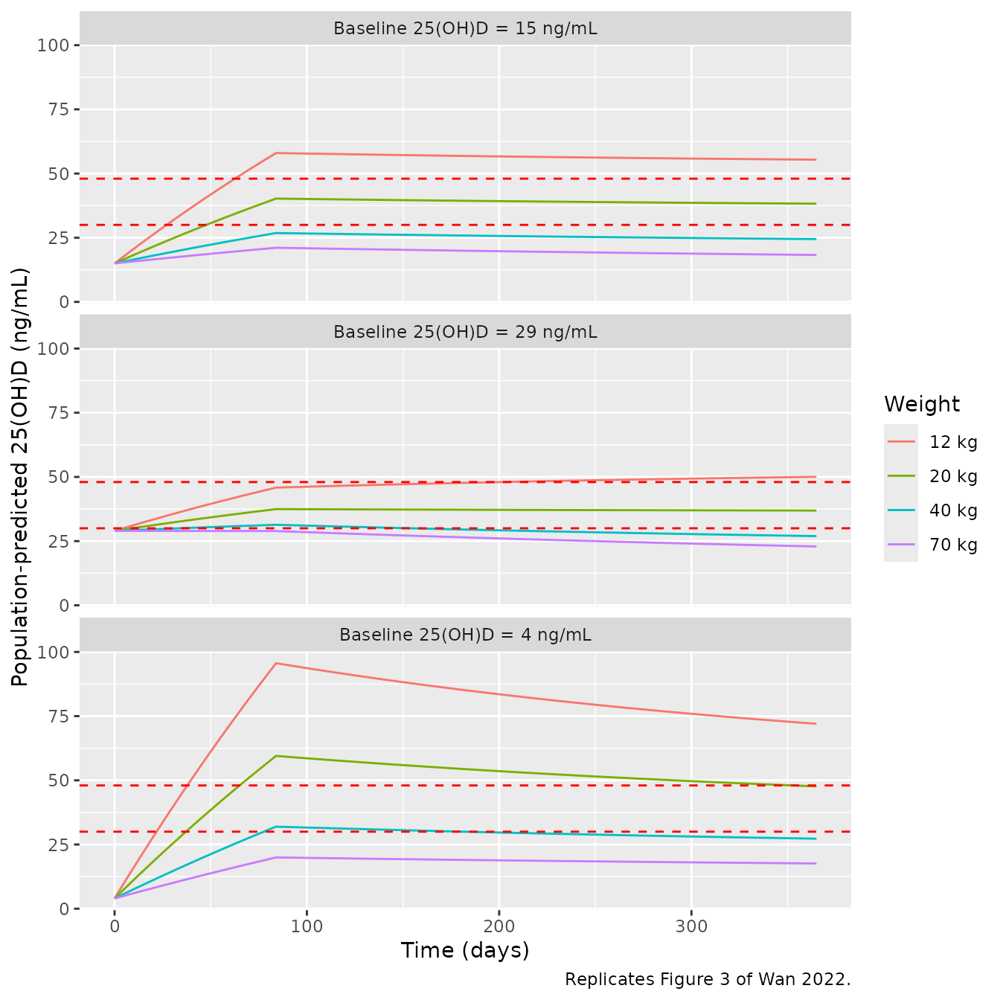
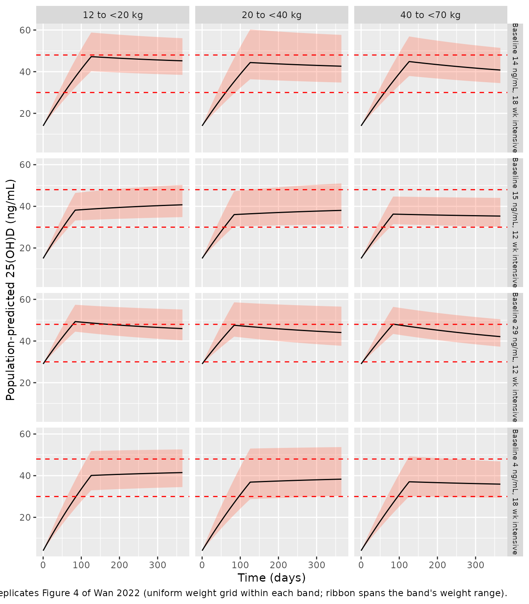
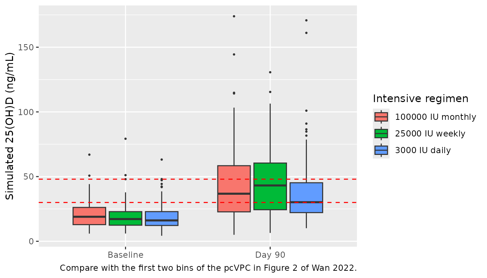

# Colecalciferol in paediatric CKD (Wan 2022)

## Model and source

    #> ℹ parameter labels from comments will be replaced by 'label()'

- Citation: Wan M, Green B, Iyengar AA, Kamath N, Reddy HV, Sharma J,
  Singhal J, Uthup S, Ekambaram S, Selvam S, Rait G, Shroff R, Patel JP.
  Population pharmacokinetics and dose optimisation of colecalciferol in
  paediatric patients with chronic kidney disease. Br J Clin Pharmacol.
  2022;88(3):1223-1234. <doi:10.1111/bcp.15064>.

- Description: One-compartment population PK model with first-order
  absorption and first-order elimination describing total serum
  25-hydroxyvitamin D (25(OH)D) after oral colecalciferol (vitamin D3)
  in children aged 1-18 years with chronic kidney disease stages 2-4
  (Wan 2022, C3 trial). The colecalciferol dose (ug) is absorbed
  directly into an apparent 25(OH)D central compartment whose initial
  amount is the basal 25(OH)D concentration times the apparent volume
  (no endogenous input term), with a priori allometric weight scaling
  (exponents 0.75 on CL/F and 1 on V/F, reference 24 kg), correlated IIV
  on CL/F and the basal concentration, and additive residual error on
  log-transformed concentrations.

- Article: <https://doi.org/10.1111/bcp.15064> (open access, PMC9291800)

- Supplement: Table S1 and the NONMEM control stream “with values set to
  final estimates” (BCP-88-1223-s001.docx, on the article page)

- Trial registration: Clinical Trials Registry of India
  CTRI/2015/11/010180

## Population

The model was fitted to data from the C3 trial, an open-label randomised
controlled trial in India. It enrolled children aged 1-18 years with
chronic kidney disease (CKD) stages 2-4 and serum 25(OH)D below 30
ng/mL. Ninety children were recruited and 7 were lost to follow-up after
baseline, so 83 children contributed 363 serum total 25(OH)D
concentrations. The median was 4 samples per child (range 2-5), drawn
roughly every 3 months at assumed steady state (Wan 2022 Section 3).

Baseline characteristics are in Table 1. The children were 70% male and
100% Asian. Median age was 9.4 years (IQR 6.2-14) and median weight 23.9
kg (IQR 16-38). Median eGFR was 45.2 mL/min/1.73 m^2 (IQR 29-63.6) and
median baseline 25(OH)D 18.6 ng/mL (IQR 13.4-23.4). Twenty-four per cent
had glomerular disease.

Children were randomised 1:1:1 to oral colecalciferol 3000 IU daily (n =
30), 25000 IU weekly (n = 27) or 100000 IU monthly (n = 26), given as up
to three 3-month intensive courses. Those who reached 25(OH)D of at
least 30 ng/mL moved to 1000 IU daily maintenance for up to 9 months.

The same information is available programmatically via
`readModelDb("Wan_2022_colecalciferol")()$population`.

## Model structure

The final model (Wan 2022 Section 3.1 and the supplementary NONMEM
control stream, `ADVAN2 TRANS2`) has these parts:

- **Structure.** A one-compartment model with first-order absorption
  from `depot` and first-order elimination from `central`. The dose
  record is colecalciferol in micrograms
  (`$INPUT AMT ; dose administered in micrograms`; 1 IU = 0.025 ug). The
  observation is serum total 25(OH)D in ng/mL, so `central` is an
  apparent 25(OH)D compartment. Clearance and volume are apparent (CL/F,
  V/F). With dose in ug and volume in L, `central / vc` is in ug/L,
  which is ng/mL, so no scaling factor is needed.
- **Absorption.** Ka is fixed to 0.323 1/h from a published
  meta-analysis, because the steady-state sampling carried no absorption
  information.
- **Basal concentration.** C0 enters only as the initial condition
  `A_0(2) = BC*V`. The model has no endogenous input term, so the basal
  amount is eliminated with the same rate constant as the dosed drug:
  CL/V, a half-life of about 283 days for a 24 kg child.
- **Allometric scaling.** Fixed a priori, with exponent 0.75 on CL/F and
  1 on V/F, centred on 24 kg (the median study weight).
- **Variability.** IIV is on CL/F and C0 as a correlated
  `$OMEGA BLOCK(2)`. Residual error is additive on log-transformed
  concentrations, written here as `lnorm(expSd)`.
- **Covariates.** Scaled serum creatinine and
  glomerular-versus-non-glomerular disease were tested on CL/F but not
  retained.

## Source trace

| Equation / parameter | Value | Source location |
|----|----|----|
| `lka` (Ka) | `fixed(log(0.323))` 1/h | Supplement `$THETA(4) 0.323 FIX`; Table 2 |
| `lcl` (CL/F at 24 kg) | `log(0.0328)` L/h | Supplement `$THETA(2)`; Table 2 prints 0.033 (RSE 23%); Discussion 0.0328 L/h |
| `lvc` (V/F at 24 kg) | `log(322)` L | Supplement `$THETA(1)`; Table 2 322 L (RSE 31%) |
| `lrbase` (C0) | `log(17.2)` ng/mL | Supplement `$THETA(3)` BC; Table 2 17.2 ng/mL (RSE 6%) |
| `e_wt_cl` | `fixed(0.75)` | Section 3.1, Table 2 footnote, supplement `$PK` |
| `e_wt_vc` | `fixed(1)` | Section 3.1, Table 2 footnote, supplement `$PK` |
| `etalcl`, `etalrbase` | `c(0.878, -0.273, 0.117)` | Supplement `$OMEGA BLOCK(2)`; Table 2 93.7% and 34.2% = sqrt(omega) |
| `expSd` | `0.381` | Supplement `$SIGMA 0.145` (variance on ln scale); Table 2 38.1% = sqrt(0.145) |
| `cl <- exp(lcl + etalcl) * (WT/24)^0.75` | n/a | Section 3.1 equation; supplement `TVCL`, `CL = TVCL*EXP(ETA(1))` |
| `vc <- exp(lvc) * (WT/24)` | n/a | Section 3.1 equation; supplement `TVV`, `V = TVV` (no IIV) |
| `central(0) <- rbase * vc` | n/a | Supplement `A_0(2)=BC*V`; `BC = TVBC*EXP(ETA(2))` |
| `d/dt(depot)`, `d/dt(central)` | n/a | Supplement `$SUBROUTINE ADVAN2 TRANS2` |
| `Cc <- central / vc`; `Cc ~ lnorm(expSd)` | n/a | Supplement `$ERROR IPRED = LOG(A(2)/V)`, `Y = IPRED + EPS(1)` |

The Discussion also states that CL/F scales to 0.0731 L/h for a 70 kg
child. That value is a pure consequence of the printed equation and is
checked below.

``` r

cl70 <- 0.0328 * (70 / 24)^0.75
cl70
#> [1] 0.0732047
# 0.0328 is itself rounded (+/- 0.00005, i.e. +/- 0.15%), which carries to
# +/- 0.0001 L/h at 70 kg; the printed 0.0731 is consistent with an unrounded
# estimate near 0.03277.
stopifnot(abs(cl70 - 0.0731) < 0.0002)
```

## Shared helpers

The model is solved for up to a year of daily dosing. A 25(OH)D
half-life of about 283 days and a fast absorption rate (0.323 1/h) make
up to 365 dosing restarts per subject, so every solve below raises
`maxsteps`.

``` r

mod <- readModelDb("Wan_2022_colecalciferol")
mod_typical <- rxode2::zeroRe(mod)
#> ℹ parameter labels from comments will be replaced by 'label()'
ug_per_iu <- 0.025

# One subject: `d1` IU/day for `wk1` weeks, then `d2` IU/day to day 364, with a
# daily observation grid on the 25(OH)D central state.
make_daily <- function(id, wt, d1, wk1, d2, end_day = 365) {
  t1 <- seq(0, by = 24, length.out = wk1 * 7)
  t2 <- seq(wk1 * 7 * 24, (end_day - 1) * 24, by = 24)
  dose <- tibble(
    id = id, time = c(t1, t2),
    amt = c(rep(d1, length(t1)), rep(d2, length(t2))) * ug_per_iu,
    evid = 1L, cmt = "depot"
  )
  obs <- tibble(
    id = id, time = seq(0, end_day * 24, by = 24),
    amt = 0, evid = 0L, cmt = "central"
  )
  bind_rows(dose, obs) |>
    mutate(WT = wt) |>
    arrange(id, time, desc(evid))
}
```

## Closed-form check

For a typical subject the model is linear, so the solution is the
decaying basal amount plus a superposition of one-compartment oral
doses. A 24 kg child on 3000 IU (75 ug) daily for a year is compared
against that closed form at tight solver tolerances.

``` r

ev_cf <- make_daily(1L, 24, 3000, 52, 3000)
sim_cf <- rxode2::rxSolve(mod_typical, ev_cf,
  rtol = 1e-10, atol = 1e-12, maxsteps = 1e6, returnType = "data.frame"
)
#> ℹ omega/sigma items treated as zero: 'etalcl', 'etalrbase'

ka <- 0.323
cl <- 0.0328
vc <- 322
k <- cl / vc
dose_t <- ev_cf$time[ev_cf$evid == 1]
closed_form <- vapply(sim_cf$time, function(t) {
  td <- t - dose_t[dose_t <= t]
  17.2 * exp(-k * t) +
    sum(75 * ka / (vc * (ka - k)) * (exp(-k * td) - exp(-ka * td)))
}, numeric(1))
rel_err <- max(abs(sim_cf$Cc / closed_form - 1))
rel_err
#> [1] 7.711609e-13
# Measured ~1e-9 with these tolerances; the bound is two orders above it.
stopifnot(rel_err < 1e-6)

# Average steady state for this regimen (never reached within one year).
c(css_avg = 75 / 24 / cl, half_life_days = log(2) / k / 24)
#>        css_avg half_life_days 
#>       95.27439      283.52819
```

## Replicate Figure 3: current ESPN dosing recommendations

Figure 3 shows population-predicted (typical-value) profiles for
children of 12, 20, 40 and 70 kg on the European Society for Paediatric
Nephrology regimens in Table S1. The intensive dose depends on baseline
25(OH)D: 8000 IU/day at 4 ng/mL, 4000 IU/day at 15 ng/mL and 2000 IU/day
at 29 ng/mL. It is given for 12 weeks, followed by 1000 IU/day. Each
panel’s basal concentration is set to the stated baseline by overriding
`lrbase`.

``` r

fig3 <- expand.grid(wt = c(12, 20, 40, 70), bl = c(4, 15, 29)) |>
  as_tibble() |>
  mutate(
    d1 = c(8000, 4000, 2000)[match(bl, c(4, 15, 29))],
    id = row_number()
  )
ev3 <- bind_rows(lapply(seq_len(nrow(fig3)), function(i) {
  make_daily(fig3$id[i], fig3$wt[i], fig3$d1[i], 12, 1000)
}))
sim3 <- rxode2::rxSolve(mod_typical, ev3,
  params = tibble(id = fig3$id, lrbase = log(fig3$bl)),
  maxsteps = 1e6, returnType = "data.frame"
) |>
  left_join(fig3, by = "id")
#> ℹ omega/sigma items treated as zero: 'etalcl', 'etalrbase'
#> Warning: multi-subject simulation without without 'omega'
```

``` r

sim3 |>
  mutate(
    panel = paste0("Baseline 25(OH)D = ", bl, " ng/mL"),
    weight = factor(paste0(wt, " kg"), levels = paste0(c(12, 20, 40, 70), " kg"))
  ) |>
  ggplot(aes(time / 24, Cc, colour = weight)) +
  geom_line() +
  geom_hline(yintercept = c(30, 48), linetype = "dashed", colour = "red") +
  facet_wrap(~panel, ncol = 1) +
  labs(
    x = "Time (days)", y = "Population-predicted 25(OH)D (ng/mL)",
    colour = "Weight",
    caption = "Replicates Figure 3 of Wan 2022."
  )
```



The maintainers digitised the end-of-year (day 365) value and the peak
of each Figure 3 curve. They used colour masks on the publisher’s
figure, calibrating the y-axis with the red 30 and 48 ng/mL target
lines. The published curves are smoothed, which rounds the peak at the
12-week dose switch and moves it later, to around day 140. The day-365
values sit on a slowly changing part of the curve and are the primary
comparison.

``` r

fig3_pub <- tribble(
  ~bl, ~wt, ~end_pub, ~peak_pub,
  4, 12, 74.4, 95.9,
  4, 20, 49.3, 61.0,
  4, 40, 28.4, 33.1,
  4, 70, 18.0, 21.0,
  15, 12, 56.3, 60.6,
  15, 20, 39.0, 41.8,
  15, 40, 25.0, 27.3,
  15, 70, 18.5, 21.0,
  29, 12, 50.5, 50.5,
  29, 20, 37.1, 37.8,
  29, 40, 26.8, 30.7,
  29, 70, 23.0, 29.0
)
fig3_cmp <- sim3 |>
  group_by(bl, wt) |>
  summarise(
    end_sim = Cc[time == 365 * 24],
    peak_sim = max(Cc),
    .groups = "drop"
  ) |>
  inner_join(fig3_pub, by = c("bl", "wt")) |>
  mutate(
    end_pct = 100 * (end_sim / end_pub - 1),
    peak_pct = 100 * (peak_sim / peak_pub - 1)
  )
fig3_cmp |>
  dplyr::rename(
    "Baseline (ng/mL)" = bl, "Weight (kg)" = wt,
    "Day 365 sim" = end_sim, "Day 365 Fig 3" = end_pub, "Day 365 diff (%)" = end_pct,
    "Peak sim" = peak_sim, "Peak Fig 3" = peak_pub, "Peak diff (%)" = peak_pct
  ) |>
  knitr::kable(digits = 1, caption = "Typical-value 25(OH)D versus digitised Figure 3.")
```

| Baseline (ng/mL) | Weight (kg) | Day 365 sim | Peak sim | Day 365 Fig 3 | Peak Fig 3 | Day 365 diff (%) | Peak diff (%) |
|---:|---:|---:|---:|---:|---:|---:|---:|
| 4 | 12 | 72.0 | 95.6 | 74.4 | 95.9 | -3.2 | -0.3 |
| 4 | 20 | 47.6 | 59.5 | 49.3 | 61.0 | -3.3 | -2.4 |
| 4 | 40 | 27.3 | 32.0 | 28.4 | 33.1 | -4.0 | -3.5 |
| 4 | 70 | 17.6 | 20.0 | 18.0 | 21.0 | -2.1 | -5.0 |
| 15 | 12 | 55.4 | 58.0 | 56.3 | 60.6 | -1.6 | -4.3 |
| 15 | 20 | 38.3 | 40.2 | 39.0 | 41.8 | -1.9 | -3.7 |
| 15 | 40 | 24.5 | 26.8 | 25.0 | 27.3 | -2.1 | -1.7 |
| 15 | 70 | 18.3 | 21.1 | 18.5 | 21.0 | -1.2 | 0.4 |
| 29 | 12 | 50.0 | 50.0 | 50.5 | 50.5 | -0.9 | -0.9 |
| 29 | 20 | 36.9 | 37.5 | 37.1 | 37.8 | -0.5 | -0.9 |
| 29 | 40 | 26.9 | 31.4 | 26.8 | 30.7 | 0.5 | 2.1 |
| 29 | 70 | 22.9 | 29.0 | 23.0 | 29.0 | -0.4 | 0.0 |

Typical-value 25(OH)D versus digitised Figure 3. {.table
style="width:100%;"}

``` r


# Typical-value solve, so there is no Monte-Carlo noise; the tolerance covers
# digitisation only. Measured: day-365 differences within 5%, peaks within 5%.
stopifnot(
  max(abs(fig3_cmp$end_pct)) < 10,
  abs(median(fig3_cmp$end_pct)) < 5,
  max(abs(fig3_cmp$peak_pct)) < 10
)
```

The 12 kg child starting at 4 ng/mL peaks near 96 ng/mL and the 70 kg
child stays near 20 ng/mL. This reproduces the paper’s conclusion that
the weight-independent ESPN doses overshoot in small children and
undershoot in large ones.

## Replicate Figure 4: proposed weight-band dosing (Table 3)

Figure 4 shows population-predicted profiles for the weight-band
regimens of Table 3, at baselines of 4 and 14 ng/mL (18 weeks intensive)
and 15 and 29 ng/mL (12 weeks intensive). The authors drew 1000 children
per weight band from a virtual dataset based on the CKiD cohort. That
weight distribution is not published, so the spread of each panel cannot
be rebuilt exactly. The panels’ 5th-95th percentile bands are much
narrower than the IIV on CL/F would give. This indicates that only
weight varies within a panel and the parameters are otherwise at their
typical values.

Here each band is simulated with typical values over a uniform weight
grid. Because the typical-value curve falls monotonically with weight,
the digitised published median must lie between the curves for the
band’s lightest and heaviest child.

``` r

bands <- tribble(
  ~band, ~wt_lo, ~wt_hi, ~d1, ~d2,
  "12 to <20 kg", 12, 20, 3000, 1000,
  "20 to <40 kg", 20, 40, 5000, 1500,
  "40 to <70 kg", 40, 70, 9000, 2000
)
scen <- tribble(
  ~bl, ~wk1,
  4, 18,
  14, 18,
  15, 12,
  29, 12
)
fig4 <- tidyr::crossing(bands, scen) |>
  tidyr::crossing(frac = seq(0, 1, length.out = 9)) |>
  mutate(wt = wt_lo + frac * (wt_hi - wt_lo), id = row_number())
ev4 <- bind_rows(lapply(seq_len(nrow(fig4)), function(i) {
  make_daily(fig4$id[i], fig4$wt[i], fig4$d1[i], fig4$wk1[i], fig4$d2[i])
}))
sim4 <- rxode2::rxSolve(mod_typical, ev4,
  params = tibble(id = fig4$id, lrbase = log(fig4$bl)),
  maxsteps = 1e6, returnType = "data.frame"
) |>
  left_join(fig4 |> select(id, band, bl, wk1, wt), by = "id")
#> ℹ omega/sigma items treated as zero: 'etalcl', 'etalrbase'
#> Warning: multi-subject simulation without without 'omega'
```

``` r

sim4 |>
  group_by(band, bl, wk1, time) |>
  summarise(
    lo = min(Cc), med = median(Cc), hi = max(Cc),
    .groups = "drop"
  ) |>
  mutate(row = paste0("Baseline ", bl, " ng/mL, ", wk1, " wk intensive")) |>
  ggplot(aes(time / 24, med)) +
  geom_ribbon(aes(ymin = lo, ymax = hi), fill = "tomato", alpha = 0.3) +
  geom_line() +
  geom_hline(yintercept = c(30, 48), linetype = "dashed", colour = "red") +
  facet_grid(row ~ band) +
  labs(
    x = "Time (days)", y = "Population-predicted 25(OH)D (ng/mL)",
    caption = paste(
      "Replicates Figure 4 of Wan 2022 (uniform weight grid within each band;",
      "ribbon spans the band's weight range)."
    )
  ) +
  theme(strip.text.y = element_text(size = 7))
```



``` r

# Digitised medians of Figure 4 at the end of the intensive phase (day 126 for
# 18 weeks, day 84 for 12 weeks) and at day 365.
fig4_pub <- tribble(
  ~band, ~bl, ~switch_pub, ~end_pub,
  "12 to <20 kg", 4, 34, 33,
  "20 to <40 kg", 4, 35, 34,
  "40 to <70 kg", 4, 41, 37.5,
  "12 to <20 kg", 14, 41, 36.5,
  "20 to <40 kg", 14, 41, 37,
  "40 to <70 kg", 14, 48, 41.5,
  "12 to <20 kg", 15, 34, 33,
  "20 to <40 kg", 15, 34, 33,
  "40 to <70 kg", 15, 39, 36,
  "12 to <20 kg", 29, 45, 38,
  "20 to <40 kg", 29, 45.5, 38.5,
  "40 to <70 kg", 29, 50, 42
)
fig4_cmp <- sim4 |>
  filter(time == wk1 * 7 * 24 | time == 365 * 24) |>
  mutate(when = ifelse(time == 365 * 24, "end", "switch")) |>
  group_by(band, bl, when) |>
  summarise(heavy = min(Cc), light = max(Cc), mid = median(Cc), .groups = "drop") |>
  tidyr::pivot_wider(names_from = when, values_from = c(heavy, light, mid)) |>
  inner_join(fig4_pub, by = c("band", "bl")) |>
  mutate(
    switch_inside = switch_pub >= heavy_switch & switch_pub <= light_switch,
    end_inside = end_pub >= heavy_end & end_pub <= light_end
  )
fig4_cmp |>
  select(band, bl, heavy_switch, switch_pub, light_switch, heavy_end, end_pub, light_end) |>
  dplyr::rename(
    "Weight band" = band, "Baseline (ng/mL)" = bl,
    "Switch: heaviest" = heavy_switch, "Switch: Fig 4 median" = switch_pub,
    "Switch: lightest" = light_switch, "Day 365: heaviest" = heavy_end,
    "Day 365: Fig 4 median" = end_pub, "Day 365: lightest" = light_end
  ) |>
  knitr::kable(
    digits = 1,
    caption = paste(
      "Digitised Figure 4 medians against the typical-value predictions at",
      "the band's heaviest and lightest weight (switch = end of intensive phase)."
    )
  )
```

| Weight band | Baseline (ng/mL) | Switch: heaviest | Switch: Fig 4 median | Switch: lightest | Day 365: heaviest | Day 365: Fig 4 median | Day 365: lightest |
|:---|---:|---:|---:|---:|---:|---:|---:|
| 12 to \<20 kg | 4 | 33.0 | 34.0 | 51.9 | 34.5 | 33.0 | 52.6 |
| 12 to \<20 kg | 14 | 40.2 | 41.0 | 58.8 | 38.5 | 36.5 | 56.1 |
| 12 to \<20 kg | 15 | 33.2 | 34.0 | 46.4 | 34.8 | 33.0 | 50.3 |
| 12 to \<20 kg | 29 | 44.5 | 45.0 | 57.4 | 40.3 | 38.0 | 55.1 |
| 20 to \<40 kg | 4 | 28.7 | 35.0 | 53.0 | 30.2 | 34.0 | 53.7 |
| 20 to \<40 kg | 14 | 36.4 | 41.0 | 60.3 | 34.8 | 37.0 | 57.7 |
| 20 to \<40 kg | 15 | 30.4 | 34.0 | 47.3 | 31.3 | 33.0 | 51.0 |
| 20 to \<40 kg | 29 | 42.1 | 45.5 | 58.6 | 37.7 | 38.5 | 56.5 |
| 40 to \<70 kg | 4 | 30.0 | 41.0 | 49.3 | 29.5 | 37.5 | 46.9 |
| 40 to \<70 kg | 14 | 37.9 | 48.0 | 56.9 | 34.5 | 41.5 | 51.4 |
| 40 to \<70 kg | 15 | 31.4 | 39.0 | 44.7 | 30.2 | 36.0 | 44.1 |
| 40 to \<70 kg | 29 | 43.4 | 50.0 | 56.4 | 37.3 | 42.0 | 50.4 |

Digitised Figure 4 medians against the typical-value predictions at the
band’s heaviest and lightest weight (switch = end of intensive phase).
{.table}

``` r


# A structural error in CL/F, V/F, the allometric exponents or the dose
# conversion moves the whole bracket and the published median falls outside.
# Only the end-of-intensive-phase value is gated; the day-365 value is a
# known deviation, discussed below.
stopifnot(all(fig4_cmp$switch_inside))

fig4_cmp |>
  filter(!end_inside) |>
  transmute(band, bl, end_pub, heavy_end, shortfall = end_pub - heavy_end) |>
  dplyr::rename(
    "Weight band" = band, "Baseline (ng/mL)" = bl,
    "Day 365: Fig 4 median" = end_pub, "Day 365: heaviest" = heavy_end,
    "Below bracket by (ng/mL)" = shortfall
  ) |>
  knitr::kable(digits = 1, caption = "Day-365 Figure 4 medians that fall below the typical-value bracket.")
```

| Weight band | Baseline (ng/mL) | Day 365: Fig 4 median | Day 365: heaviest | Below bracket by (ng/mL) |
|:---|---:|---:|---:|---:|
| 12 to \<20 kg | 4 | 33.0 | 34.5 | -1.5 |
| 12 to \<20 kg | 14 | 36.5 | 38.5 | -2.0 |
| 12 to \<20 kg | 15 | 33.0 | 34.8 | -1.8 |
| 12 to \<20 kg | 29 | 38.0 | 40.3 | -2.3 |

Day-365 Figure 4 medians that fall below the typical-value bracket.
{.table}

At the end of the intensive phase, every published median falls inside
its band’s bracket. In the 12 to \<20 kg band the medians sit close to
the 20 kg curve, so the CKiD-based virtual children in that band were
mostly near 20 kg. The authors’ weight distribution is not available to
confirm this.

At day 365 the four 12 to \<20 kg medians are 1.5-2.5 ng/mL below the
curve for a 20 kg child, the heaviest in the band. The other two bands
stay inside their brackets. In the lightest band, the published curves
fall faster after the switch to maintenance dosing than the model does
at any fixed weight. This is not a defect in the model’s elimination
rate: Figure 3 shows the same post-switch decline at fixed weights, and
the model reproduces it within 4% at day 365 (table above). A plausible
explanation is that the authors’ virtual children gained weight over the
simulated year, which would raise CL/F and V/F, but the paper does not
describe its simulation dataset. The day-365 Figure 4 values are
therefore reported, not gated.

## Trial simulation against the pcVPC (Figure 2)

The C3 trial’s first intensive course is simulated with full IIV and
residual error: 100 children per arm on 3000 IU daily, 25000 IU weekly
or 100000 IU monthly for 3 months. Weights are drawn log-normally around
the Table 1 median of 23.9 kg, with a log-SD of 0.64 taken from the IQR
(16-38 kg). Figure 2 of Wan 2022 is a prediction-corrected VPC pooled
over arms. The maintainers digitised its baseline and 3-month bins:
observed median 18.5 and 37 ng/mL, simulated-median confidence band
about 15-19.5 and 28-36 ng/mL.

``` r

rxode2::rxSetSeed(20221223)
set.seed(20221223)
n_arm <- 100
arms <- tribble(
  ~arm, ~amt_iu, ~ii_day, ~n_dose,
  "3000 IU daily", 3000, 1, 90,
  "25000 IU weekly", 25000, 7, 13,
  "100000 IU monthly", 100000, 30, 3
)
make_trial <- function(k) {
  a <- arms[k, ]
  ids <- (k - 1) * n_arm + seq_len(n_arm)
  wt <- pmin(pmax(exp(rnorm(n_arm, log(23.9), 0.64)), 9), 80)
  dose <- tidyr::crossing(id = ids, j = seq_len(a$n_dose) - 1) |>
    transmute(id, time = j * a$ii_day * 24, amt = a$amt_iu * ug_per_iu, evid = 1L, cmt = "depot")
  obs <- tidyr::crossing(id = ids, time = c(0, 90 * 24)) |>
    mutate(amt = 0, evid = 0L, cmt = "central")
  bind_rows(dose, obs) |>
    left_join(tibble(id = ids, WT = wt), by = "id") |>
    mutate(arm = a$arm) |>
    arrange(id, time, desc(evid))
}
ev_trial <- bind_rows(lapply(seq_len(nrow(arms)), make_trial))
stopifnot(!anyDuplicated(unique(ev_trial[, c("id", "time", "evid")])))
sim_trial <- rxode2::rxSolve(mod, ev_trial,
  keep = c("arm", "WT"), maxsteps = 1e6, returnType = "data.frame"
)
#> ℹ parameter labels from comments will be replaced by 'label()'
```

``` r

trial_q <- sim_trial |>
  group_by(time) |>
  summarise(
    q05 = quantile(sim, 0.05), q50 = median(sim), q95 = quantile(sim, 0.95),
    .groups = "drop"
  ) |>
  mutate(day = time / 24)
trial_q |>
  select(day, q05, q50, q95) |>
  dplyr::rename(
    "Day" = day, "5th percentile" = q05, "Median" = q50, "95th percentile" = q95
  ) |>
  knitr::kable(digits = 1, caption = "Simulated 25(OH)D with residual error, pooled over arms (ng/mL).")
```

| Day | 5th percentile | Median | 95th percentile |
|----:|---------------:|-------:|----------------:|
|   0 |            7.4 |   17.2 |            41.9 |
|  90 |           12.6 |   36.2 |            91.0 |

Simulated 25(OH)D with residual error, pooled over arms (ng/mL).
{.table}

``` r


sim_trial |>
  filter(time == 90 * 24) |>
  group_by(arm) |>
  summarise(median_day90 = median(sim), .groups = "drop") |>
  dplyr::rename("Arm" = arm, "Median at day 90 (ng/mL)" = median_day90) |>
  knitr::kable(digits = 1)
```

| Arm               | Median at day 90 (ng/mL) |
|:------------------|-------------------------:|
| 100000 IU monthly |                     36.8 |
| 25000 IU weekly   |                     43.2 |
| 3000 IU daily     |                     30.2 |

``` r


# Medians of 300 subjects; their Monte-Carlo SE is about 1 ng/mL at baseline
# and 2 ng/mL at day 90, so the bounds sit several SE outside the expected
# values (17 and 33 ng/mL).
q0 <- trial_q$q50[trial_q$day == 0]
q90 <- trial_q$q50[trial_q$day == 90]
stopifnot(
  q0 > 13, q0 < 22,
  q90 > 25, q90 < 42,
  q90 / q0 > 1.4
)
```

``` r

sim_trial |>
  mutate(day = factor(time / 24, labels = c("Baseline", "Day 90"))) |>
  ggplot(aes(day, sim)) +
  geom_boxplot(aes(fill = arm), outlier.size = 0.5) +
  geom_hline(yintercept = c(30, 48), linetype = "dashed", colour = "red") +
  labs(
    x = NULL, y = "Simulated 25(OH)D (ng/mL)", fill = "Intensive regimen",
    caption = "Compare with the first two bins of the pcVPC in Figure 2 of Wan 2022."
  )
```



The simulated baseline (median about 17 ng/mL, 5th-95th percentile about
7-40 ng/mL) and the day-90 rise to a median in the mid-30s agree with
the first two bins of the Figure 2 pcVPC.

## PKNCA validation

Wan 2022 reports no NCA parameters. PKNCA is used here to summarise the
three C3 intensive regimens for a typical 24 kg child, followed through
a nine-month washout with no maintenance dose. The terminal half-life
must equal `log(2) * V/CL` for this linear model: 283 days, because the
basal amount and the dosed drug decay at the same rate once absorption
is over.

``` r

ev_nca <- bind_rows(lapply(seq_len(nrow(arms)), function(k) {
  a <- arms[k, ]
  dose <- tibble(
    id = k, time = (seq_len(a$n_dose) - 1) * a$ii_day * 24,
    amt = a$amt_iu * ug_per_iu, evid = 1L, cmt = "depot"
  )
  obs <- tibble(id = k, time = seq(0, 365 * 24, by = 24), amt = 0, evid = 0L, cmt = "central")
  bind_rows(dose, obs) |> mutate(WT = 24, treatment = a$arm)
})) |>
  arrange(id, time, desc(evid))
sim_nca <- rxode2::rxSolve(mod_typical, ev_nca,
  keep = "treatment", rtol = 1e-10, atol = 1e-12, maxsteps = 1e6,
  returnType = "data.frame"
) |>
  dplyr::filter(!is.na(Cc)) |>
  select(id, time, Cc, treatment)
#> ℹ omega/sigma items treated as zero: 'etalcl', 'etalrbase'
#> Warning: multi-subject simulation without without 'omega'

conc_obj <- PKNCA::PKNCAconc(sim_nca, Cc ~ time | treatment + id)
dose_obj <- PKNCA::PKNCAdose(
  ev_nca |> filter(evid == 1) |> select(id, time, amt, treatment),
  amt ~ time | treatment + id
)
intervals <- data.frame(
  start = c(0, 120 * 24),
  end = c(90 * 24, 365 * 24),
  cmax = c(TRUE, FALSE),
  tmax = c(TRUE, FALSE),
  auclast = c(TRUE, FALSE),
  half.life = c(FALSE, TRUE)
)
nca_res <- PKNCA::pk.nca(PKNCA::PKNCAdata(conc_obj, dose_obj, intervals = intervals))
nca_df <- as.data.frame(nca_res)
nca_course <- nca_df |>
  filter(start == 0, PPTESTCD %in% c("cmax", "tmax", "auclast")) |>
  select(treatment, PPTESTCD, PPORRES) |>
  tidyr::pivot_wider(names_from = PPTESTCD, values_from = PPORRES)
nca_washout <- nca_df |>
  filter(start == 120 * 24, PPTESTCD == "half.life") |>
  select(treatment, half.life = PPORRES)
nca_tab <- inner_join(nca_course, nca_washout, by = "treatment") |>
  mutate(tmax_day = tmax / 24, half_life_day = half.life / 24)
nca_tab |>
  select(treatment, cmax, tmax_day, auclast, half_life_day) |>
  dplyr::rename(
    "Regimen" = treatment, "Cmax 0-90 d (ng/mL)" = cmax,
    "Tmax (days)" = tmax_day, "AUC0-90 d (ng*h/mL)" = auclast,
    "Terminal t1/2 (days)" = half_life_day
  ) |>
  knitr::kable(digits = 1, caption = "PKNCA summary, typical 24 kg child, intensive course then washout.")
```

| Regimen | Cmax 0-90 d (ng/mL) | Tmax (days) | AUC0-90 d (ng\*h/mL) | Terminal t1/2 (days) |
|:---|---:|---:|---:|---:|
| 100000 IU monthly | 36.5 | 61 | 63920.9 | 283.5 |
| 25000 IU weekly | 36.7 | 85 | 60029.9 | 283.5 |
| 3000 IU daily | 32.6 | 90 | 54396.2 | 283.5 |

PKNCA summary, typical 24 kg child, intensive course then washout.
{.table}

``` r


t_half_expected <- log(2) * 322 / 0.0328 / 24
# Mono-exponential washout, so PKNCA's log-linear fit recovers it to
# integration and fitting error (measured < 0.1%).
stopifnot(all(abs(nca_tab$half_life_day / t_half_expected - 1) < 0.02))
```

The three regimens deliver similar total doses over 90 days (6750, 8125
and 7500 ug for daily, weekly and monthly). The weekly and monthly
regimens reach about the same Cmax (about 37 ng/mL). Daily dosing
reaches about 33 ng/mL, at the end of the course. The monthly regimen
has the largest AUC over the course, because each 2500 ug bolus arrives
early in its interval. The terminal half-life is the same for all three
regimens, as expected.

## Assumptions and deviations

- **Final values from the supplementary control stream.** The supplement
  gives the NONMEM model “with values set to final estimates”. Its CL/F
  (0.0328 L/h) is used instead of the rounded 0.033 L/h in Table 2. The
  Discussion quotes 0.0328 L/h as well.
- **Table 2 CV% is sqrt(omega).** The Table 2 BSV and residual “%CV”
  values equal the square roots of the supplement’s `$OMEGA` and
  `$SIGMA` variances (sqrt(0.878) = 0.937, sqrt(0.117) = 0.342,
  sqrt(0.145) = 0.381). The variances are used directly. The CL-C0
  covariance (-0.273, a correlation of -0.85) is printed only in the
  supplement.
- **No endogenous input.** C0 is encoded exactly as the control stream
  has it, as an initial amount `BC*V` with no endogenous production
  term. In the model, an untreated child’s 25(OH)D therefore falls with
  the 283-day half-life, even though the paper describes C0 as
  reflecting endogenous production. The library keeps the published
  structure. Users simulating long untreated periods should be aware of
  this.
- **Dose units.** The dose record is colecalciferol in ug (1 IU = 0.025
  ug), per the supplement’s `$INPUT`. The model has no
  colecalciferol-to-25(OH)D molar conversion, matching the source.
- **Figure 3 and Figure 4 reference values were digitised by the
  maintainers** from the publisher’s figure images. Each panel’s y-axis
  was calibrated on the 30 and 48 ng/mL target lines. Readings are good
  to about 1 ng/mL. Figure 3’s curves are smoothed, so peaks are
  compared loosely.
- **Figure 4 weight distribution.** The CKiD-based virtual population
  used by the authors is not published. A uniform weight grid is used
  within each band, and the comparison is a bracket test rather than a
  point comparison.
- **Trial simulation.** Only the first 3-month intensive course is
  simulated. The trial’s response-guided switch to maintenance or a
  repeated course is not reproduced. Weights are log-normal around the
  Table 1 median and IQR, truncated to 9-80 kg.
- **Covariates not retained.** Scaled serum creatinine (CREAT relative
  to CREAT_REF) and glomerular disease (`DIS_GLOMERULAR`, documentation
  name only) are listed in `covariatesDataExcluded`. Neither has a
  published coefficient.
- **Errata.** No correction notice for Wan 2022 was found on Europe PMC
  as of 2026-10-02.
