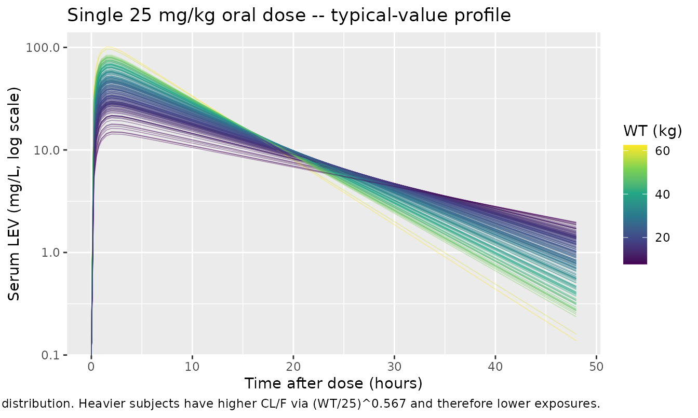
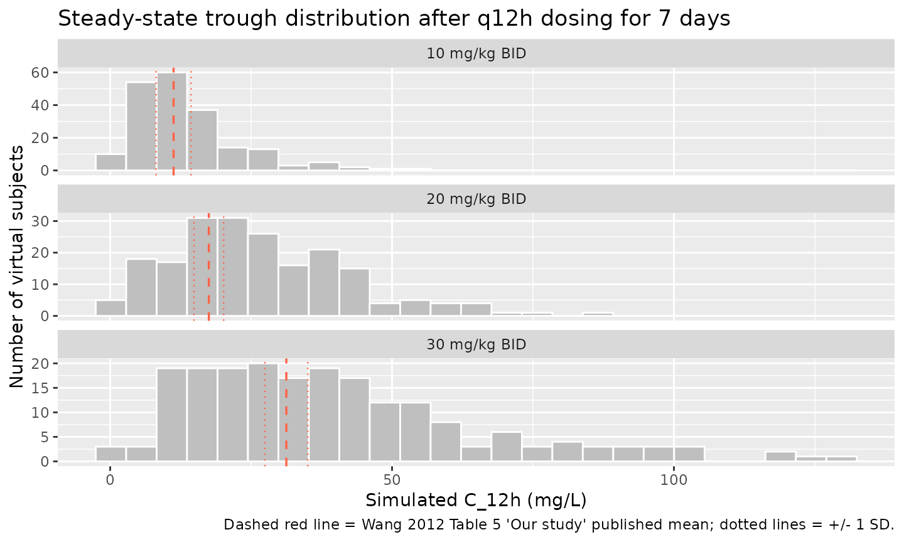

# Levetiracetam (Wang 2012)

## Model and source

    #> ℹ parameter labels from comments will be replaced by 'label()'

- Citation: Wang YH, Wang L, Lu W, Shang DW, Wei MJ, Wu Y. Population
  pharmacokinetics modeling of levetiracetam in Chinese children with
  epilepsy. Acta Pharmacol Sin. 2012 Jun;33(6):845-851.
  <doi:10.1038/aps.2012.57>
- Description: One-compartment population PK model for levetiracetam
  (LEV) in Chinese pediatric epilepsy patients (Wang 2012). First-order
  oral absorption and linear elimination (NONMEM ADVAN2 TRANS2). Body
  weight is the only retained covariate; it enters CL/F as a power-style
  allometric term with reference weight 25 kg (cohort median).
- Article: <https://doi.org/10.1038/aps.2012.57>

The packaged model implements the Wang 2012 final levetiracetam (LEV)
population PK model: a one-compartment structure with first-order oral
absorption and linear elimination (NONMEM ADVAN2 TRANS2). Body weight
enters CL/F as a power-style allometric term with reference weight 25 kg
(the cohort median). Inter-individual variability is log-normal on CL/F
and V/F; the absorption rate constant Ka has no IIV (the source paper
fixed omega_Ka at zero because the sparse trough-style sampling did not
characterise the absorption phase). The residual error is additive as
written by the source paper.

## Population

Wang 2012 fit the model to 368 serum LEV concentrations from 311 Chinese
pediatric epilepsy patients in the PPK model group, recruited at the
Pediatric Department of Peking University First Hospital. A separate PPK
validation group of 50 patients (50 concentrations) was used for
external prediction-error checks (the packaged model uses only the PPK
model group’s final-model estimates). Both groups were children aged
0.5 - 14 years (PPK model group mean 6.34, validation group mean 5.78);
PPK model group weights spanned 5 - 70 kg (mean 25.17, median 25); the
gender split was 160 male / 151 female (48.6% female). All subjects had
normal renal and hepatic function. Total daily LEV doses were 20 - 60
mg/kg (mean 35.7, range 250 - 2000 mg/d); 40% were on LEV monotherapy
and 60% were on a combination AED regimen (most commonly valproic acid,
lamotrigine, carbamazepine, oxcarbazepine, or topiramate). No
significant interaction between LEV PK and concomitant AED use was
detected (Wang 2012 Table 2). The intervals between last dose and
sampling spanned 0.1 - 13 hours, with most samples drawn near steady
state (Figure 1, Figure 2). Full population characteristics are in Wang
2012 Table 1.

The same metadata is available programmatically via
`readModelDb("Wang_2012_levetiracetam")$meta$population`.

## Source trace

The per-parameter origin is recorded as an in-file comment next to each
`ini()` entry in `inst/modeldb/specificDrugs/Wang_2012_levetiracetam.R`.
The table below collects them in one place for review. All point
estimates are from Wang 2012 Table 4 (“Population parameter values for
the final model”); structural-model layout is from Wang 2012 Methods
“PPK modeling” and the final-model equation on page 848.

| Equation / parameter | Value | Source location |
|----|----|----|
| `lka` (Ka) | log(1.56) -\> 1.56 /h | Table 4; Ka = 1.56 /h (RSE 14.3%, 95% CI 1.230-1.997) |
| `lvc` (V/F) | log(12.1) -\> 12.1 L | Table 4; V/F = 12.1 L (RSE 5.6%, 95% CI 10.767-13.433) |
| `lcl` (CL/F) | log(1.04) -\> 1.04 L/h | Table 4; CL/F = 1.04 L/h (RSE 1.4%, 95% CI 1.011-1.069) |
| `e_wt_cl` | 0.567 | Table 4; “Weight” exponent 0.567 (RSE 6.7%, 95% CI 0.489-0.637) |
| `etalcl` variance | 0.195 | Table 4; omega^2 of CL/F = 0.195 (RSE 7.0%) |
| `etalvc` variance | 0.163 | Table 4; omega^2 of V/F = 0.163 (RSE 45.5%) |
| eta on Ka | fixed at 0 (omitted from model) | Discussion “Patient data” paragraph; omega_Ka fixed at 0 because absorption phase not characterised |
| `addSd` | sqrt(0.028) ~= 0.1673 mg/L | Table 4; sigma_E^2 = 0.028 (RSE 18.6%, 95% CI 0.018-0.035) |
| Reference weight | 25 kg | Discussion paragraph 1: “the median WEIG in our population was 25 kg” |
| CL/F covariate equation | `CL/F = 1.04 * (WT/25)^0.567 * exp(etalcl)` | Page 848 final-model equation; in-text exponent 0.563 vs Table 4 estimate 0.567 (see “Assumptions and deviations”) |
| ODE `d/dt(depot)` | `-ka * depot` | NONMEM ADVAN2 TRANS2 (Methods “PPK model of LEV”) |
| ODE `d/dt(central)` | `ka * depot - kel * central` | NONMEM ADVAN2 TRANS2 (Methods “PPK model of LEV”) |
| Derived `kel` | `cl / vc` | Standard 1-cmt linear-elimination relation; typical-individual t1/2 = ln(2) \* V/F / CL/F = 8.07 h matches the paper’s 8.13 h (Discussion paragraph 1) |
| Residual error model | `Cc ~ add(addSd)` | Statistical model page 847: `E_ij^0 = E_ij + eps_ij` |

## Virtual cohort

Original observed data are not publicly available. The cohort below
samples body weight from a log-normal distribution clipped to the
paper’s reported range (5 - 70 kg; mean 25.17 kg, median 25 kg per Wang
2012 Table 1). Two dosing regimens reproduce trough scenarios from Wang
2012 Table 5: 10, 20, and 30 mg/kg BID per-weight dose levels and a
single 25 mg/kg oral dose at the cohort median weight to characterise
the half-life.

``` r

set.seed(20120601)

mod <- rxode2::rxode(readModelDb("Wang_2012_levetiracetam"))
#> ℹ parameter labels from comments will be replaced by 'label()'

sample_wt <- function(n,
                      wt_min       = 5,
                      wt_max       = 70,
                      wt_mean_targ = 25.17,
                      wt_sd_targ   = 12.0) {
  # Log-normal weight sample whose linear-scale mean approximates the Wang
  # 2012 cohort mean (25.17 kg; SD chosen to span the published 5 - 70 kg
  # range without long-tail outliers). Clipped to the published range.
  cv2     <- (wt_sd_targ / wt_mean_targ)^2
  log_mu  <- log(wt_mean_targ) - 0.5 * log(1 + cv2)
  log_sd  <- sqrt(log(1 + cv2))
  pmin(pmax(exp(rnorm(n, mean = log_mu, sd = log_sd)), wt_min), wt_max)
}

make_cohort <- function(n, regimen, dose_mg_per_kg,
                        dose_times, obs_grid,
                        wt = NULL, id_offset = 0L) {
  if (is.null(wt)) wt <- sample_wt(n)
  base <- tibble::tibble(
    id      = id_offset + seq_len(n),
    WT      = wt,
    regimen = regimen
  )
  doses <- tidyr::crossing(id = base$id, time = dose_times) |>
    dplyr::left_join(base, by = "id") |>
    dplyr::mutate(evid = 1L, cmt = "depot", amt = WT * dose_mg_per_kg)
  obs <- tidyr::crossing(id = base$id, time = obs_grid) |>
    dplyr::left_join(base, by = "id") |>
    dplyr::mutate(evid = 0L, cmt = "Cc", amt = NA_real_)
  dplyr::bind_rows(doses, obs) |>
    dplyr::arrange(id, time, dplyr::desc(evid))
}

# Single 25 mg/kg oral dose at typical median weight 25 kg (n = 200 to allow
# IIV-based percentile estimates). Sample weight from cohort distribution.
sd_obs_grid <- c(0, 0.25, 0.5, 0.75, 1, 1.5, 2, 3, 4, 6, 8, 10,
                 12, 16, 20, 24, 36, 48)
events_sd <- make_cohort(
  n              = 200,
  regimen        = "25 mg/kg single oral",
  dose_mg_per_kg = 25,
  dose_times     = 0,
  obs_grid       = sd_obs_grid,
  id_offset      = 0L
)

# Three q12h chronic-dosing cohorts at 10, 20, and 30 mg/kg per dose to match
# Wang 2012 Table 5's reported steady-state C_12h trough levels. Dose q12h for
# 7 days (14 doses) so the last interval is well into steady state. Sample the
# last 12-h interval (144 - 156 h) for trough comparison.
md_obs_grid <- c(seq(144, 156, by = 0.5))
md_dose_times <- seq(0, 156, by = 12)

events_md_10 <- make_cohort(
  n              = 200,
  regimen        = "10 mg/kg BID",
  dose_mg_per_kg = 10,
  dose_times     = md_dose_times,
  obs_grid       = md_obs_grid,
  id_offset      = 200L
)
events_md_20 <- make_cohort(
  n              = 200,
  regimen        = "20 mg/kg BID",
  dose_mg_per_kg = 20,
  dose_times     = md_dose_times,
  obs_grid       = md_obs_grid,
  id_offset      = 400L
)
events_md_30 <- make_cohort(
  n              = 200,
  regimen        = "30 mg/kg BID",
  dose_mg_per_kg = 30,
  dose_times     = md_dose_times,
  obs_grid       = md_obs_grid,
  id_offset      = 600L
)

events <- dplyr::bind_rows(events_sd, events_md_10, events_md_20, events_md_30)
stopifnot(!anyDuplicated(unique(events[, c("id", "time", "evid")])))
```

## Simulation

``` r

sim <- rxode2::rxSolve(
  object     = mod,
  events     = events,
  keep       = c("WT", "regimen"),
  returnType = "data.frame"
) |>
  dplyr::filter(time >= 0)
```

For deterministic typical-value replication (random effects zeroed), use
[`rxode2::zeroRe()`](https://nlmixr2.github.io/rxode2/reference/zeroRe.html):

``` r

sim_typical <- rxode2::rxSolve(
  object     = rxode2::zeroRe(mod),
  events     = events,
  keep       = c("WT", "regimen"),
  returnType = "data.frame"
) |>
  dplyr::filter(time >= 0)
#> ℹ omega/sigma items treated as zero: 'etalcl', 'etalvc'
#> Warning: multi-subject simulation without without 'omega'
```

## Replicate published profiles

### Single-dose concentration vs time (typical values)

Wang 2012 does not publish a concentration-vs-time plot for an isolated
single dose, but the final-model typical values predict a terminal
half-life of 8.06 hours (Discussion paragraph 1 reports 8.13 h). The
chunk below traces the typical-value concentration over 48 hours after a
single 25 mg/kg dose across the cohort weight distribution.

``` r

sd_typical <- sim_typical |> dplyr::filter(regimen == "25 mg/kg single oral")

ggplot(sd_typical, aes(time, Cc, group = id, colour = WT)) +
  geom_line(alpha = 0.4, linewidth = 0.3) +
  scale_y_log10() +
  scale_colour_viridis_c(name = "WT (kg)") +
  labs(x = "Time after dose (hours)",
       y = "Serum LEV (mg/L, log scale)",
       title = "Single 25 mg/kg oral dose -- typical-value profile",
       caption = "Random effects zeroed; weight sampled from the Wang 2012 cohort distribution. Heavier subjects have higher CL/F via (WT/25)^0.567 and therefore lower exposures.")
#> Warning in scale_y_log10(): log-10 transformation introduced infinite values.
```



### Steady-state trough vs published Table 5

Wang 2012 Table 5 reports steady-state pre-dose (C_12h) concentrations
for three dose levels in the “Our study” column: 11.25 +/- 3.10 mg/L at
10 mg/kg BID, 17.5 +/- 2.63 mg/L at 20 mg/kg BID, and 31.25 +/- 3.8 mg/L
at 30 mg/kg BID. The chunk below renders the simulated last- interval
trough distribution under each regimen.

``` r

ss_trough <- sim |>
  dplyr::filter(regimen %in% c("10 mg/kg BID", "20 mg/kg BID", "30 mg/kg BID"),
                time == 156)

published_troughs <- tibble::tibble(
  regimen        = c("10 mg/kg BID", "20 mg/kg BID", "30 mg/kg BID"),
  published_mean = c(11.25, 17.50, 31.25),
  published_sd   = c( 3.10,  2.63,  3.80)
)

ggplot(ss_trough, aes(Cc)) +
  geom_histogram(bins = 25, fill = "grey75", colour = "white") +
  geom_vline(data = published_troughs, aes(xintercept = published_mean),
             colour = "tomato", linetype = "dashed", linewidth = 0.6) +
  geom_vline(data = published_troughs,
             aes(xintercept = published_mean - published_sd),
             colour = "tomato", linetype = "dotted", linewidth = 0.4) +
  geom_vline(data = published_troughs,
             aes(xintercept = published_mean + published_sd),
             colour = "tomato", linetype = "dotted", linewidth = 0.4) +
  facet_wrap(~ regimen, ncol = 1, scales = "free_y") +
  labs(x = "Simulated C_12h (mg/L)",
       y = "Number of virtual subjects",
       title = "Steady-state trough distribution after q12h dosing for 7 days",
       caption = "Dashed red line = Wang 2012 Table 5 'Our study' published mean; dotted lines = +/- 1 SD.")
```



## PKNCA validation

PKNCA is run on the single-dose typical-value simulation, with the
regimen label as the treatment grouping variable. Cmax, Tmax, AUCinf and
half-life are computed and compared against Wang 2012’s reported
half-life.

``` r

sd_nca_conc <- sim_typical |>
  dplyr::filter(regimen == "25 mg/kg single oral", !is.na(Cc), time > 0) |>
  dplyr::select(id, time, Cc, regimen, WT)

sd_nca_dose <- events_sd |>
  dplyr::filter(evid == 1) |>
  dplyr::select(id, time, amt, regimen)

conc_obj <- PKNCA::PKNCAconc(
  sd_nca_conc, Cc ~ time | regimen + id,
  concu = "mg/L", timeu = "hr"
)
dose_obj <- PKNCA::PKNCAdose(
  sd_nca_dose, amt ~ time | regimen + id,
  doseu = "mg"
)

intervals <- data.frame(
  start       = 0,
  end         = Inf,
  cmax        = TRUE,
  tmax        = TRUE,
  aucinf.obs  = TRUE,
  aucinf.pred = TRUE,
  half.life   = TRUE,
  clast.obs   = TRUE,
  lambda.z    = TRUE
)

nca <- PKNCA::pk.nca(
  PKNCA::PKNCAdata(conc_obj, dose_obj, intervals = intervals)
)
#> Warning: Requesting an AUC range starting (0) before the first measurement (0.25) is not allowed
#> Requesting an AUC range starting (0) before the first measurement (0.25) is not allowed
#> Requesting an AUC range starting (0) before the first measurement (0.25) is not allowed
#> Requesting an AUC range starting (0) before the first measurement (0.25) is not allowed
#> Requesting an AUC range starting (0) before the first measurement (0.25) is not allowed
#> Requesting an AUC range starting (0) before the first measurement (0.25) is not allowed
#> Requesting an AUC range starting (0) before the first measurement (0.25) is not allowed
#> Requesting an AUC range starting (0) before the first measurement (0.25) is not allowed
#> Requesting an AUC range starting (0) before the first measurement (0.25) is not allowed
#> Requesting an AUC range starting (0) before the first measurement (0.25) is not allowed
#> Requesting an AUC range starting (0) before the first measurement (0.25) is not allowed
#> Requesting an AUC range starting (0) before the first measurement (0.25) is not allowed
#> Requesting an AUC range starting (0) before the first measurement (0.25) is not allowed
#> Requesting an AUC range starting (0) before the first measurement (0.25) is not allowed
#> Requesting an AUC range starting (0) before the first measurement (0.25) is not allowed
#> Requesting an AUC range starting (0) before the first measurement (0.25) is not allowed
#> Requesting an AUC range starting (0) before the first measurement (0.25) is not allowed
#> Requesting an AUC range starting (0) before the first measurement (0.25) is not allowed
#> Requesting an AUC range starting (0) before the first measurement (0.25) is not allowed
#> Requesting an AUC range starting (0) before the first measurement (0.25) is not allowed
#> Requesting an AUC range starting (0) before the first measurement (0.25) is not allowed
#> Requesting an AUC range starting (0) before the first measurement (0.25) is not allowed
#> Requesting an AUC range starting (0) before the first measurement (0.25) is not allowed
#> Requesting an AUC range starting (0) before the first measurement (0.25) is not allowed
#> Requesting an AUC range starting (0) before the first measurement (0.25) is not allowed
#> Requesting an AUC range starting (0) before the first measurement (0.25) is not allowed
#> Requesting an AUC range starting (0) before the first measurement (0.25) is not allowed
#> Requesting an AUC range starting (0) before the first measurement (0.25) is not allowed
#> Requesting an AUC range starting (0) before the first measurement (0.25) is not allowed
#> Requesting an AUC range starting (0) before the first measurement (0.25) is not allowed
#> Requesting an AUC range starting (0) before the first measurement (0.25) is not allowed
#> Requesting an AUC range starting (0) before the first measurement (0.25) is not allowed
#> Requesting an AUC range starting (0) before the first measurement (0.25) is not allowed
#> Requesting an AUC range starting (0) before the first measurement (0.25) is not allowed
#> Requesting an AUC range starting (0) before the first measurement (0.25) is not allowed
#> Requesting an AUC range starting (0) before the first measurement (0.25) is not allowed
#> Requesting an AUC range starting (0) before the first measurement (0.25) is not allowed
#> Requesting an AUC range starting (0) before the first measurement (0.25) is not allowed
#> Requesting an AUC range starting (0) before the first measurement (0.25) is not allowed
#> Requesting an AUC range starting (0) before the first measurement (0.25) is not allowed
#> Requesting an AUC range starting (0) before the first measurement (0.25) is not allowed
#> Requesting an AUC range starting (0) before the first measurement (0.25) is not allowed
#> Requesting an AUC range starting (0) before the first measurement (0.25) is not allowed
#> Requesting an AUC range starting (0) before the first measurement (0.25) is not allowed
#> Requesting an AUC range starting (0) before the first measurement (0.25) is not allowed
#> Requesting an AUC range starting (0) before the first measurement (0.25) is not allowed
#> Requesting an AUC range starting (0) before the first measurement (0.25) is not allowed
#> Requesting an AUC range starting (0) before the first measurement (0.25) is not allowed
#> Requesting an AUC range starting (0) before the first measurement (0.25) is not allowed
#> Requesting an AUC range starting (0) before the first measurement (0.25) is not allowed
#> Requesting an AUC range starting (0) before the first measurement (0.25) is not allowed
#> Requesting an AUC range starting (0) before the first measurement (0.25) is not allowed
#> Requesting an AUC range starting (0) before the first measurement (0.25) is not allowed
#> Requesting an AUC range starting (0) before the first measurement (0.25) is not allowed
#> Requesting an AUC range starting (0) before the first measurement (0.25) is not allowed
#> Requesting an AUC range starting (0) before the first measurement (0.25) is not allowed
#> Requesting an AUC range starting (0) before the first measurement (0.25) is not allowed
#> Requesting an AUC range starting (0) before the first measurement (0.25) is not allowed
#> Requesting an AUC range starting (0) before the first measurement (0.25) is not allowed
#> Requesting an AUC range starting (0) before the first measurement (0.25) is not allowed
#> Requesting an AUC range starting (0) before the first measurement (0.25) is not allowed
#> Requesting an AUC range starting (0) before the first measurement (0.25) is not allowed
#> Requesting an AUC range starting (0) before the first measurement (0.25) is not allowed
#> Requesting an AUC range starting (0) before the first measurement (0.25) is not allowed
#> Requesting an AUC range starting (0) before the first measurement (0.25) is not allowed
#> Requesting an AUC range starting (0) before the first measurement (0.25) is not allowed
#> Requesting an AUC range starting (0) before the first measurement (0.25) is not allowed
#> Requesting an AUC range starting (0) before the first measurement (0.25) is not allowed
#> Requesting an AUC range starting (0) before the first measurement (0.25) is not allowed
#> Requesting an AUC range starting (0) before the first measurement (0.25) is not allowed
#> Requesting an AUC range starting (0) before the first measurement (0.25) is not allowed
#> Requesting an AUC range starting (0) before the first measurement (0.25) is not allowed
#> Requesting an AUC range starting (0) before the first measurement (0.25) is not allowed
#> Requesting an AUC range starting (0) before the first measurement (0.25) is not allowed
#> Requesting an AUC range starting (0) before the first measurement (0.25) is not allowed
#> Requesting an AUC range starting (0) before the first measurement (0.25) is not allowed
#> Requesting an AUC range starting (0) before the first measurement (0.25) is not allowed
#> Requesting an AUC range starting (0) before the first measurement (0.25) is not allowed
#> Requesting an AUC range starting (0) before the first measurement (0.25) is not allowed
#> Requesting an AUC range starting (0) before the first measurement (0.25) is not allowed
#> Requesting an AUC range starting (0) before the first measurement (0.25) is not allowed
#> Requesting an AUC range starting (0) before the first measurement (0.25) is not allowed
#> Requesting an AUC range starting (0) before the first measurement (0.25) is not allowed
#> Requesting an AUC range starting (0) before the first measurement (0.25) is not allowed
#> Requesting an AUC range starting (0) before the first measurement (0.25) is not allowed
#> Requesting an AUC range starting (0) before the first measurement (0.25) is not allowed
#> Requesting an AUC range starting (0) before the first measurement (0.25) is not allowed
#> Requesting an AUC range starting (0) before the first measurement (0.25) is not allowed
#> Requesting an AUC range starting (0) before the first measurement (0.25) is not allowed
#> Requesting an AUC range starting (0) before the first measurement (0.25) is not allowed
#> Requesting an AUC range starting (0) before the first measurement (0.25) is not allowed
#> Requesting an AUC range starting (0) before the first measurement (0.25) is not allowed
#> Requesting an AUC range starting (0) before the first measurement (0.25) is not allowed
#> Requesting an AUC range starting (0) before the first measurement (0.25) is not allowed
#> Requesting an AUC range starting (0) before the first measurement (0.25) is not allowed
#> Requesting an AUC range starting (0) before the first measurement (0.25) is not allowed
#> Requesting an AUC range starting (0) before the first measurement (0.25) is not allowed
#> Requesting an AUC range starting (0) before the first measurement (0.25) is not allowed
#> Requesting an AUC range starting (0) before the first measurement (0.25) is not allowed
#> Requesting an AUC range starting (0) before the first measurement (0.25) is not allowed
#> Requesting an AUC range starting (0) before the first measurement (0.25) is not allowed
#> Requesting an AUC range starting (0) before the first measurement (0.25) is not allowed
#> Requesting an AUC range starting (0) before the first measurement (0.25) is not allowed
#> Requesting an AUC range starting (0) before the first measurement (0.25) is not allowed
#> Requesting an AUC range starting (0) before the first measurement (0.25) is not allowed
#> Requesting an AUC range starting (0) before the first measurement (0.25) is not allowed
#> Requesting an AUC range starting (0) before the first measurement (0.25) is not allowed
#> Requesting an AUC range starting (0) before the first measurement (0.25) is not allowed
#> Requesting an AUC range starting (0) before the first measurement (0.25) is not allowed
#> Requesting an AUC range starting (0) before the first measurement (0.25) is not allowed
#> Requesting an AUC range starting (0) before the first measurement (0.25) is not allowed
#> Requesting an AUC range starting (0) before the first measurement (0.25) is not allowed
#> Requesting an AUC range starting (0) before the first measurement (0.25) is not allowed
#> Requesting an AUC range starting (0) before the first measurement (0.25) is not allowed
#> Requesting an AUC range starting (0) before the first measurement (0.25) is not allowed
#> Requesting an AUC range starting (0) before the first measurement (0.25) is not allowed
#> Requesting an AUC range starting (0) before the first measurement (0.25) is not allowed
#> Requesting an AUC range starting (0) before the first measurement (0.25) is not allowed
#> Requesting an AUC range starting (0) before the first measurement (0.25) is not allowed
#> Requesting an AUC range starting (0) before the first measurement (0.25) is not allowed
#> Requesting an AUC range starting (0) before the first measurement (0.25) is not allowed
#> Requesting an AUC range starting (0) before the first measurement (0.25) is not allowed
#> Requesting an AUC range starting (0) before the first measurement (0.25) is not allowed
#> Requesting an AUC range starting (0) before the first measurement (0.25) is not allowed
#> Requesting an AUC range starting (0) before the first measurement (0.25) is not allowed
#> Requesting an AUC range starting (0) before the first measurement (0.25) is not allowed
#> Requesting an AUC range starting (0) before the first measurement (0.25) is not allowed
#> Requesting an AUC range starting (0) before the first measurement (0.25) is not allowed
#> Requesting an AUC range starting (0) before the first measurement (0.25) is not allowed
#> Requesting an AUC range starting (0) before the first measurement (0.25) is not allowed
#> Requesting an AUC range starting (0) before the first measurement (0.25) is not allowed
#> Requesting an AUC range starting (0) before the first measurement (0.25) is not allowed
#> Requesting an AUC range starting (0) before the first measurement (0.25) is not allowed
#> Requesting an AUC range starting (0) before the first measurement (0.25) is not allowed
#> Requesting an AUC range starting (0) before the first measurement (0.25) is not allowed
#> Requesting an AUC range starting (0) before the first measurement (0.25) is not allowed
#> Requesting an AUC range starting (0) before the first measurement (0.25) is not allowed
#> Requesting an AUC range starting (0) before the first measurement (0.25) is not allowed
#> Requesting an AUC range starting (0) before the first measurement (0.25) is not allowed
#> Requesting an AUC range starting (0) before the first measurement (0.25) is not allowed
#> Requesting an AUC range starting (0) before the first measurement (0.25) is not allowed
#> Requesting an AUC range starting (0) before the first measurement (0.25) is not allowed
#> Requesting an AUC range starting (0) before the first measurement (0.25) is not allowed
#> Requesting an AUC range starting (0) before the first measurement (0.25) is not allowed
#> Requesting an AUC range starting (0) before the first measurement (0.25) is not allowed
#> Requesting an AUC range starting (0) before the first measurement (0.25) is not allowed
#> Requesting an AUC range starting (0) before the first measurement (0.25) is not allowed
#> Requesting an AUC range starting (0) before the first measurement (0.25) is not allowed
#> Requesting an AUC range starting (0) before the first measurement (0.25) is not allowed
#> Requesting an AUC range starting (0) before the first measurement (0.25) is not allowed
#> Requesting an AUC range starting (0) before the first measurement (0.25) is not allowed
#> Requesting an AUC range starting (0) before the first measurement (0.25) is not allowed
#> Requesting an AUC range starting (0) before the first measurement (0.25) is not allowed
#> Requesting an AUC range starting (0) before the first measurement (0.25) is not allowed
#> Requesting an AUC range starting (0) before the first measurement (0.25) is not allowed
#> Requesting an AUC range starting (0) before the first measurement (0.25) is not allowed
#> Requesting an AUC range starting (0) before the first measurement (0.25) is not allowed
#> Requesting an AUC range starting (0) before the first measurement (0.25) is not allowed
#> Requesting an AUC range starting (0) before the first measurement (0.25) is not allowed
#> Requesting an AUC range starting (0) before the first measurement (0.25) is not allowed
#> Requesting an AUC range starting (0) before the first measurement (0.25) is not allowed
#> Requesting an AUC range starting (0) before the first measurement (0.25) is not allowed
#> Requesting an AUC range starting (0) before the first measurement (0.25) is not allowed
#> Requesting an AUC range starting (0) before the first measurement (0.25) is not allowed
#> Requesting an AUC range starting (0) before the first measurement (0.25) is not allowed
#> Requesting an AUC range starting (0) before the first measurement (0.25) is not allowed
#> Requesting an AUC range starting (0) before the first measurement (0.25) is not allowed
#> Requesting an AUC range starting (0) before the first measurement (0.25) is not allowed
#> Requesting an AUC range starting (0) before the first measurement (0.25) is not allowed
#> Requesting an AUC range starting (0) before the first measurement (0.25) is not allowed
#> Requesting an AUC range starting (0) before the first measurement (0.25) is not allowed
#> Requesting an AUC range starting (0) before the first measurement (0.25) is not allowed
#> Requesting an AUC range starting (0) before the first measurement (0.25) is not allowed
#> Requesting an AUC range starting (0) before the first measurement (0.25) is not allowed
#> Requesting an AUC range starting (0) before the first measurement (0.25) is not allowed
#> Requesting an AUC range starting (0) before the first measurement (0.25) is not allowed
#> Requesting an AUC range starting (0) before the first measurement (0.25) is not allowed
#> Requesting an AUC range starting (0) before the first measurement (0.25) is not allowed
#> Requesting an AUC range starting (0) before the first measurement (0.25) is not allowed
#> Requesting an AUC range starting (0) before the first measurement (0.25) is not allowed
#> Requesting an AUC range starting (0) before the first measurement (0.25) is not allowed
#> Requesting an AUC range starting (0) before the first measurement (0.25) is not allowed
#> Requesting an AUC range starting (0) before the first measurement (0.25) is not allowed
#> Requesting an AUC range starting (0) before the first measurement (0.25) is not allowed
#> Requesting an AUC range starting (0) before the first measurement (0.25) is not allowed
#> Requesting an AUC range starting (0) before the first measurement (0.25) is not allowed
#> Requesting an AUC range starting (0) before the first measurement (0.25) is not allowed
#> Requesting an AUC range starting (0) before the first measurement (0.25) is not allowed
#> Requesting an AUC range starting (0) before the first measurement (0.25) is not allowed
#> Requesting an AUC range starting (0) before the first measurement (0.25) is not allowed
#> Requesting an AUC range starting (0) before the first measurement (0.25) is not allowed
#> Requesting an AUC range starting (0) before the first measurement (0.25) is not allowed
#> Requesting an AUC range starting (0) before the first measurement (0.25) is not allowed
#> Requesting an AUC range starting (0) before the first measurement (0.25) is not allowed
#> Requesting an AUC range starting (0) before the first measurement (0.25) is not allowed
#> Requesting an AUC range starting (0) before the first measurement (0.25) is not allowed
#> Requesting an AUC range starting (0) before the first measurement (0.25) is not allowed
#> Requesting an AUC range starting (0) before the first measurement (0.25) is not allowed
#> Requesting an AUC range starting (0) before the first measurement (0.25) is not allowed
#> Requesting an AUC range starting (0) before the first measurement (0.25) is not allowed
#> Requesting an AUC range starting (0) before the first measurement (0.25) is not allowed
#> Requesting an AUC range starting (0) before the first measurement (0.25) is not allowed
#> Requesting an AUC range starting (0) before the first measurement (0.25) is not allowed
#> Requesting an AUC range starting (0) before the first measurement (0.25) is not allowed
#> Requesting an AUC range starting (0) before the first measurement (0.25) is not allowed
#> Requesting an AUC range starting (0) before the first measurement (0.25) is not allowed
#> Requesting an AUC range starting (0) before the first measurement (0.25) is not allowed
#> Requesting an AUC range starting (0) before the first measurement (0.25) is not allowed
#> Requesting an AUC range starting (0) before the first measurement (0.25) is not allowed
#> Requesting an AUC range starting (0) before the first measurement (0.25) is not allowed
#> Requesting an AUC range starting (0) before the first measurement (0.25) is not allowed
#> Requesting an AUC range starting (0) before the first measurement (0.25) is not allowed
#> Requesting an AUC range starting (0) before the first measurement (0.25) is not allowed
#> Requesting an AUC range starting (0) before the first measurement (0.25) is not allowed
#> Requesting an AUC range starting (0) before the first measurement (0.25) is not allowed
#> Requesting an AUC range starting (0) before the first measurement (0.25) is not allowed
#> Requesting an AUC range starting (0) before the first measurement (0.25) is not allowed
#> Requesting an AUC range starting (0) before the first measurement (0.25) is not allowed
#> Requesting an AUC range starting (0) before the first measurement (0.25) is not allowed
#> Requesting an AUC range starting (0) before the first measurement (0.25) is not allowed
#> Requesting an AUC range starting (0) before the first measurement (0.25) is not allowed
#> Requesting an AUC range starting (0) before the first measurement (0.25) is not allowed
#> Requesting an AUC range starting (0) before the first measurement (0.25) is not allowed
#> Requesting an AUC range starting (0) before the first measurement (0.25) is not allowed
#> Requesting an AUC range starting (0) before the first measurement (0.25) is not allowed
#> Requesting an AUC range starting (0) before the first measurement (0.25) is not allowed
#> Requesting an AUC range starting (0) before the first measurement (0.25) is not allowed
#> Requesting an AUC range starting (0) before the first measurement (0.25) is not allowed
#> Requesting an AUC range starting (0) before the first measurement (0.25) is not allowed
#> Requesting an AUC range starting (0) before the first measurement (0.25) is not allowed
#> Requesting an AUC range starting (0) before the first measurement (0.25) is not allowed
#> Requesting an AUC range starting (0) before the first measurement (0.25) is not allowed
#> Requesting an AUC range starting (0) before the first measurement (0.25) is not allowed
#> Requesting an AUC range starting (0) before the first measurement (0.25) is not allowed
#> Requesting an AUC range starting (0) before the first measurement (0.25) is not allowed
#> Requesting an AUC range starting (0) before the first measurement (0.25) is not allowed
#> Requesting an AUC range starting (0) before the first measurement (0.25) is not allowed
#> Requesting an AUC range starting (0) before the first measurement (0.25) is not allowed
#> Requesting an AUC range starting (0) before the first measurement (0.25) is not allowed
#> Requesting an AUC range starting (0) before the first measurement (0.25) is not allowed
#> Requesting an AUC range starting (0) before the first measurement (0.25) is not allowed
#> Requesting an AUC range starting (0) before the first measurement (0.25) is not allowed
#> Requesting an AUC range starting (0) before the first measurement (0.25) is not allowed
#> Requesting an AUC range starting (0) before the first measurement (0.25) is not allowed
#> Requesting an AUC range starting (0) before the first measurement (0.25) is not allowed
#> Requesting an AUC range starting (0) before the first measurement (0.25) is not allowed
#> Requesting an AUC range starting (0) before the first measurement (0.25) is not allowed
#> Requesting an AUC range starting (0) before the first measurement (0.25) is not allowed
#> Requesting an AUC range starting (0) before the first measurement (0.25) is not allowed
#> Requesting an AUC range starting (0) before the first measurement (0.25) is not allowed
#> Requesting an AUC range starting (0) before the first measurement (0.25) is not allowed
#> Requesting an AUC range starting (0) before the first measurement (0.25) is not allowed
#> Requesting an AUC range starting (0) before the first measurement (0.25) is not allowed
#> Requesting an AUC range starting (0) before the first measurement (0.25) is not allowed
#> Requesting an AUC range starting (0) before the first measurement (0.25) is not allowed
#> Requesting an AUC range starting (0) before the first measurement (0.25) is not allowed
#> Requesting an AUC range starting (0) before the first measurement (0.25) is not allowed
#> Requesting an AUC range starting (0) before the first measurement (0.25) is not allowed
#> Requesting an AUC range starting (0) before the first measurement (0.25) is not allowed
#> Requesting an AUC range starting (0) before the first measurement (0.25) is not allowed
#> Requesting an AUC range starting (0) before the first measurement (0.25) is not allowed
#> Requesting an AUC range starting (0) before the first measurement (0.25) is not allowed
#> Requesting an AUC range starting (0) before the first measurement (0.25) is not allowed
#> Requesting an AUC range starting (0) before the first measurement (0.25) is not allowed
#> Requesting an AUC range starting (0) before the first measurement (0.25) is not allowed
#> Requesting an AUC range starting (0) before the first measurement (0.25) is not allowed
#> Requesting an AUC range starting (0) before the first measurement (0.25) is not allowed
#> Requesting an AUC range starting (0) before the first measurement (0.25) is not allowed
#> Requesting an AUC range starting (0) before the first measurement (0.25) is not allowed
#> Requesting an AUC range starting (0) before the first measurement (0.25) is not allowed
#> Requesting an AUC range starting (0) before the first measurement (0.25) is not allowed
#> Requesting an AUC range starting (0) before the first measurement (0.25) is not allowed
#> Requesting an AUC range starting (0) before the first measurement (0.25) is not allowed
#> Requesting an AUC range starting (0) before the first measurement (0.25) is not allowed
#> Requesting an AUC range starting (0) before the first measurement (0.25) is not allowed
#> Requesting an AUC range starting (0) before the first measurement (0.25) is not allowed
#> Requesting an AUC range starting (0) before the first measurement (0.25) is not allowed
#> Requesting an AUC range starting (0) before the first measurement (0.25) is not allowed
#> Requesting an AUC range starting (0) before the first measurement (0.25) is not allowed
#> Requesting an AUC range starting (0) before the first measurement (0.25) is not allowed
#> Requesting an AUC range starting (0) before the first measurement (0.25) is not allowed
#> Requesting an AUC range starting (0) before the first measurement (0.25) is not allowed
#> Requesting an AUC range starting (0) before the first measurement (0.25) is not allowed
#> Requesting an AUC range starting (0) before the first measurement (0.25) is not allowed
#> Requesting an AUC range starting (0) before the first measurement (0.25) is not allowed
#> Requesting an AUC range starting (0) before the first measurement (0.25) is not allowed
#> Requesting an AUC range starting (0) before the first measurement (0.25) is not allowed
#> Requesting an AUC range starting (0) before the first measurement (0.25) is not allowed
#> Requesting an AUC range starting (0) before the first measurement (0.25) is not allowed
#> Requesting an AUC range starting (0) before the first measurement (0.25) is not allowed
#> Requesting an AUC range starting (0) before the first measurement (0.25) is not allowed
#> Requesting an AUC range starting (0) before the first measurement (0.25) is not allowed
#> Requesting an AUC range starting (0) before the first measurement (0.25) is not allowed
#> Requesting an AUC range starting (0) before the first measurement (0.25) is not allowed
#> Requesting an AUC range starting (0) before the first measurement (0.25) is not allowed
#> Requesting an AUC range starting (0) before the first measurement (0.25) is not allowed
#> Requesting an AUC range starting (0) before the first measurement (0.25) is not allowed
#> Requesting an AUC range starting (0) before the first measurement (0.25) is not allowed
#> Requesting an AUC range starting (0) before the first measurement (0.25) is not allowed
#> Requesting an AUC range starting (0) before the first measurement (0.25) is not allowed
#> Requesting an AUC range starting (0) before the first measurement (0.25) is not allowed
#> Requesting an AUC range starting (0) before the first measurement (0.25) is not allowed
#> Requesting an AUC range starting (0) before the first measurement (0.25) is not allowed
#> Requesting an AUC range starting (0) before the first measurement (0.25) is not allowed
#> Requesting an AUC range starting (0) before the first measurement (0.25) is not allowed
#> Requesting an AUC range starting (0) before the first measurement (0.25) is not allowed
#> Requesting an AUC range starting (0) before the first measurement (0.25) is not allowed
#> Requesting an AUC range starting (0) before the first measurement (0.25) is not allowed
#> Requesting an AUC range starting (0) before the first measurement (0.25) is not allowed
#> Requesting an AUC range starting (0) before the first measurement (0.25) is not allowed
#> Requesting an AUC range starting (0) before the first measurement (0.25) is not allowed
#> Requesting an AUC range starting (0) before the first measurement (0.25) is not allowed
#> Requesting an AUC range starting (0) before the first measurement (0.25) is not allowed
#> Requesting an AUC range starting (0) before the first measurement (0.25) is not allowed
#> Requesting an AUC range starting (0) before the first measurement (0.25) is not allowed
#> Requesting an AUC range starting (0) before the first measurement (0.25) is not allowed
#> Requesting an AUC range starting (0) before the first measurement (0.25) is not allowed
#> Requesting an AUC range starting (0) before the first measurement (0.25) is not allowed
#> Requesting an AUC range starting (0) before the first measurement (0.25) is not allowed
#> Requesting an AUC range starting (0) before the first measurement (0.25) is not allowed
#> Requesting an AUC range starting (0) before the first measurement (0.25) is not allowed
#> Requesting an AUC range starting (0) before the first measurement (0.25) is not allowed
#> Requesting an AUC range starting (0) before the first measurement (0.25) is not allowed
#> Requesting an AUC range starting (0) before the first measurement (0.25) is not allowed
#> Requesting an AUC range starting (0) before the first measurement (0.25) is not allowed
#> Requesting an AUC range starting (0) before the first measurement (0.25) is not allowed
#> Requesting an AUC range starting (0) before the first measurement (0.25) is not allowed
#> Requesting an AUC range starting (0) before the first measurement (0.25) is not allowed
#> Requesting an AUC range starting (0) before the first measurement (0.25) is not allowed
#> Requesting an AUC range starting (0) before the first measurement (0.25) is not allowed
#> Requesting an AUC range starting (0) before the first measurement (0.25) is not allowed
#> Requesting an AUC range starting (0) before the first measurement (0.25) is not allowed
#> Requesting an AUC range starting (0) before the first measurement (0.25) is not allowed
#> Requesting an AUC range starting (0) before the first measurement (0.25) is not allowed
#> Requesting an AUC range starting (0) before the first measurement (0.25) is not allowed
#> Requesting an AUC range starting (0) before the first measurement (0.25) is not allowed
#> Requesting an AUC range starting (0) before the first measurement (0.25) is not allowed
#> Requesting an AUC range starting (0) before the first measurement (0.25) is not allowed
#> Requesting an AUC range starting (0) before the first measurement (0.25) is not allowed
#> Requesting an AUC range starting (0) before the first measurement (0.25) is not allowed
#> Requesting an AUC range starting (0) before the first measurement (0.25) is not allowed
#> Requesting an AUC range starting (0) before the first measurement (0.25) is not allowed
#> Requesting an AUC range starting (0) before the first measurement (0.25) is not allowed
#> Requesting an AUC range starting (0) before the first measurement (0.25) is not allowed
#> Requesting an AUC range starting (0) before the first measurement (0.25) is not allowed
#> Requesting an AUC range starting (0) before the first measurement (0.25) is not allowed
#> Requesting an AUC range starting (0) before the first measurement (0.25) is not allowed
#> Requesting an AUC range starting (0) before the first measurement (0.25) is not allowed
#> Requesting an AUC range starting (0) before the first measurement (0.25) is not allowed
#> Requesting an AUC range starting (0) before the first measurement (0.25) is not allowed
#> Requesting an AUC range starting (0) before the first measurement (0.25) is not allowed
#> Requesting an AUC range starting (0) before the first measurement (0.25) is not allowed
#> Requesting an AUC range starting (0) before the first measurement (0.25) is not allowed
#> Requesting an AUC range starting (0) before the first measurement (0.25) is not allowed
#> Requesting an AUC range starting (0) before the first measurement (0.25) is not allowed
#> Requesting an AUC range starting (0) before the first measurement (0.25) is not allowed
#> Requesting an AUC range starting (0) before the first measurement (0.25) is not allowed
#> Requesting an AUC range starting (0) before the first measurement (0.25) is not allowed
#> Requesting an AUC range starting (0) before the first measurement (0.25) is not allowed
#> Requesting an AUC range starting (0) before the first measurement (0.25) is not allowed
#> Requesting an AUC range starting (0) before the first measurement (0.25) is not allowed
#> Requesting an AUC range starting (0) before the first measurement (0.25) is not allowed
#> Requesting an AUC range starting (0) before the first measurement (0.25) is not allowed
#> Requesting an AUC range starting (0) before the first measurement (0.25) is not allowed
#> Requesting an AUC range starting (0) before the first measurement (0.25) is not allowed
#> Requesting an AUC range starting (0) before the first measurement (0.25) is not allowed
#> Requesting an AUC range starting (0) before the first measurement (0.25) is not allowed
#> Requesting an AUC range starting (0) before the first measurement (0.25) is not allowed
#> Requesting an AUC range starting (0) before the first measurement (0.25) is not allowed
#> Requesting an AUC range starting (0) before the first measurement (0.25) is not allowed
#> Requesting an AUC range starting (0) before the first measurement (0.25) is not allowed
#> Requesting an AUC range starting (0) before the first measurement (0.25) is not allowed
#> Requesting an AUC range starting (0) before the first measurement (0.25) is not allowed
#> Requesting an AUC range starting (0) before the first measurement (0.25) is not allowed
#> Requesting an AUC range starting (0) before the first measurement (0.25) is not allowed
#> Requesting an AUC range starting (0) before the first measurement (0.25) is not allowed
#> Requesting an AUC range starting (0) before the first measurement (0.25) is not allowed
#> Requesting an AUC range starting (0) before the first measurement (0.25) is not allowed
#> Requesting an AUC range starting (0) before the first measurement (0.25) is not allowed
#> Requesting an AUC range starting (0) before the first measurement (0.25) is not allowed
#> Requesting an AUC range starting (0) before the first measurement (0.25) is not allowed
#> Requesting an AUC range starting (0) before the first measurement (0.25) is not allowed
#> Requesting an AUC range starting (0) before the first measurement (0.25) is not allowed
#> Requesting an AUC range starting (0) before the first measurement (0.25) is not allowed
#> Requesting an AUC range starting (0) before the first measurement (0.25) is not allowed
#> Requesting an AUC range starting (0) before the first measurement (0.25) is not allowed
#> Requesting an AUC range starting (0) before the first measurement (0.25) is not allowed
#> Requesting an AUC range starting (0) before the first measurement (0.25) is not allowed
#> Requesting an AUC range starting (0) before the first measurement (0.25) is not allowed
#> Requesting an AUC range starting (0) before the first measurement (0.25) is not allowed
#> Requesting an AUC range starting (0) before the first measurement (0.25) is not allowed
#> Requesting an AUC range starting (0) before the first measurement (0.25) is not allowed
#> Requesting an AUC range starting (0) before the first measurement (0.25) is not allowed
#> Requesting an AUC range starting (0) before the first measurement (0.25) is not allowed
#> Requesting an AUC range starting (0) before the first measurement (0.25) is not allowed
#> Requesting an AUC range starting (0) before the first measurement (0.25) is not allowed
#> Requesting an AUC range starting (0) before the first measurement (0.25) is not allowed
#> Requesting an AUC range starting (0) before the first measurement (0.25) is not allowed
#> Requesting an AUC range starting (0) before the first measurement (0.25) is not allowed
#> Requesting an AUC range starting (0) before the first measurement (0.25) is not allowed
nca_summary <- summary(nca)
knitr::kable(
  nca_summary,
  caption = paste("Single-dose NCA after 25 mg/kg oral dose,",
                  "typical-value simulation across the Wang 2012 cohort",
                  "weight distribution.")
)
```

| Interval Start | Interval End | regimen | N | Cmax (mg/L) | Tmax (hr) | Clast (mg/L) | Half-life (hr) | $`\lambda_z`$ (1/hr) | AUCinf,obs (hr\*mg/L) | AUCinf,pred (hr\*mg/L) |
|---:|---:|:---|:---|:---|:---|:---|:---|:---|:---|:---|
| 0 | Inf | 25 mg/kg single oral | 200 | 40.7 \[42.6\] | 2.00 \[1.50, 2.00\] | 0.857 \[61.1\] | 8.67 \[2.20\] | 0.0824 \[25.3\] | NC | NC |

Single-dose NCA after 25 mg/kg oral dose, typical-value simulation
across the Wang 2012 cohort weight distribution. {.table}

### Comparison against the published half-life

Wang 2012 Discussion paragraph 1 reports a terminal half-life of 8.13
hours. The chunk below extracts the simulated half-life and compares it
to the published value.

``` r

hl_sim <- as.data.frame(nca$result) |>
  dplyr::filter(PPTESTCD == "half.life") |>
  dplyr::summarise(
    median_hl = median(PPORRES, na.rm = TRUE),
    q05_hl    = stats::quantile(PPORRES, 0.05, na.rm = TRUE),
    q95_hl    = stats::quantile(PPORRES, 0.95, na.rm = TRUE)
  )

comparison <- tibble::tibble(
  metric          = "Terminal half-life (hours)",
  published       = 8.13,
  simulated_med   = hl_sim$median_hl,
  simulated_q05   = hl_sim$q05_hl,
  simulated_q95   = hl_sim$q95_hl,
  pct_diff_median = round(100 * (hl_sim$median_hl / 8.13 - 1), 1)
)

knitr::kable(
  comparison,
  digits  = 2,
  caption = paste("Simulated half-life vs Wang 2012 Discussion paragraph 1",
                  "reported value. Per-individual half-life varies with",
                  "WT because CL/F scales as (WT/25)^0.567 while V/F is",
                  "weight-independent.")
)
```

| metric | published | simulated_med | simulated_q05 | simulated_q95 | pct_diff_median |
|:---|---:|---:|---:|---:|---:|
| Terminal half-life (hours) | 8.13 | 8.43 | 5.66 | 12.39 | 3.7 |

Simulated half-life vs Wang 2012 Discussion paragraph 1 reported value.
Per-individual half-life varies with WT because CL/F scales as
(WT/25)^0.567 while V/F is weight-independent. {.table}

### Comparison against published steady-state troughs

The simulated median C_12h trough for each regimen is tabulated
alongside the Wang 2012 Table 5 “Our study” values.

``` r

trough_comparison <- ss_trough |>
  dplyr::group_by(regimen) |>
  dplyr::summarise(
    sim_median = stats::median(Cc),
    sim_q05    = stats::quantile(Cc, 0.05),
    sim_q95    = stats::quantile(Cc, 0.95),
    .groups    = "drop"
  ) |>
  dplyr::left_join(published_troughs, by = "regimen") |>
  dplyr::mutate(
    pct_diff_median = round(100 * (sim_median / published_mean - 1), 1)
  ) |>
  dplyr::select(regimen, published_mean, published_sd,
                sim_median, sim_q05, sim_q95, pct_diff_median)

knitr::kable(
  trough_comparison,
  digits  = 2,
  caption = paste("Simulated steady-state C_12h trough vs Wang 2012 Table 5",
                  "'Our study' column. The 30 mg/kg BID trough is",
                  "approximately three times the 10 mg/kg trough,",
                  "consistent with linear kinetics.")
)
```

| regimen | published_mean | published_sd | sim_median | sim_q05 | sim_q95 | pct_diff_median |
|:---|---:|---:|---:|---:|---:|---:|
| 10 mg/kg BID | 11.25 | 3.10 | 11.20 | 2.98 | 33.26 | -0.4 |
| 20 mg/kg BID | 17.50 | 2.63 | 24.20 | 6.26 | 57.46 | 38.3 |
| 30 mg/kg BID | 31.25 | 3.80 | 35.19 | 9.40 | 92.90 | 12.6 |

Simulated steady-state C_12h trough vs Wang 2012 Table 5 ‘Our study’
column. The 30 mg/kg BID trough is approximately three times the 10
mg/kg trough, consistent with linear kinetics. {.table}

## Assumptions and deviations

- **Final-model equation vs Table 4 estimate (exponent typo).** The
  paper’s narrative on page 848 reports the final-model CL/F equation
  with weight exponent 0.563: `CL/F = 1.04 * (WEIG/25)^0.563`. Table 4
  reports the formal estimate as 0.567 (RSE 6.7%, 95% CI 0.489-0.637).
  The packaged model uses 0.567 as the formal point estimate; the
  in-text 0.563 appears to be a rounding or typo of the same quantity
  and is documented in the model file comment so a downstream user is
  not surprised by the discrepancy.
- **Residual-error magnitude is unusually small.** Wang 2012 writes the
  residual model as additive on the linear concentration scale
  (`E_ij^0 = E_ij + eps_ij`, Statistical model paragraph page 847), with
  Table 4 reporting `sigma_E^2 = 0.028`. The packaged model encodes this
  literally as `addSd = sqrt(0.028)` ~= 0.167 mg/L. On a 4.85 - 116.11
  mg/L observed concentration range that is implausibly tight (~0.15 -
  3.4% relative magnitude); two possible explanations are (a) the paper
  meant a proportional error model with `sigma^2 = 0.028` interpreted as
  a CV variance (giving 16.7% CV, which is typical for chromatography
  assays at this concentration range and matches the LEV popPK
  references the paper cites) or (b) the structural and IIV terms
  absorbed most of the residual variability (the V/F shrinkage of 44.9%
  in Table 4 is consistent with weak identifiability of the residual
  term). The literal additive form is kept here because that is what the
  paper’s equation states; users who want to refit on their own data
  should consider testing a proportional residual model as an
  alternative.
- **No IIV on Ka.** The packaged model has no `etalka` term because the
  paper fixed omega_Ka at zero (Discussion “Patient data” paragraph page
  848). Simulations therefore use the typical Ka = 1.56 /h for every
  individual.
- **No covariate effect on V/F or Ka.** The covariate-screening table
  (Table 2) shows that age, weight, dose, sex, and concomitant AED use
  were tested against CL/F, V/F, and Ka, but only weight on CL/F reached
  the pre-specified significance threshold (delta-OFV \< -7.88). These
  screened-but-not-retained covariates are documented in the model
  file’s vignette text rather than in `covariateData` – adding them as
  `covariateData` entries would trigger a “declared but not referenced”
  convention warning.
- **Cohort weight distribution.** The simulation samples body weight
  log-normally with mean 25.17 kg and clipped to 5 - 70 kg (Wang 2012
  Table 1). The published cohort weight SD is not reported beyond the
  mean and range, so a working SD of 12 kg was chosen to span the range
  without long tails; the typical individual at the median weight 25 kg
  still recovers the paper’s published typical-value CL/F (1.04 L/h)
  exactly.
- **No race / ethnicity heterogeneity.** All 311 subjects were Chinese
  pediatric epilepsy patients at Peking University First Hospital. The
  Discussion observes that the typical CL/F in this Chinese pediatric
  cohort (0.69 mL/min/kg) is approximately 50% lower than that of
  Western pediatric cohorts (1.21 - 1.46 mL/min/kg, Toublanc 2008 and
  Chhun 2009), but this between-cohort gap is reported descriptively and
  is not modelled as a covariate. The packaged model therefore applies
  only to Chinese pediatric populations or to ratiometric comparisons
  against the published typical individual.
- **No upstream PK dependency.** Wang 2012 did not fix any parameter
  from a prior publication; all final-model estimates are from the
  paper’s own NONMEM run on the PPK model group. The cited prior studies
  (Pigeole 2007, Toublanc 2008, Chhun 2009, Glauser 2007, Merhar 2011,
  Pellock 2001) appear only in the Discussion as comparison points.
- **Errata.** No erratum or corrigendum to Wang 2012 was located on disk
  for this extraction. A search of PubMed and the Acta Pharmacologica
  Sinica corrections feed for
  `"Wang 2012" + levetiracetam + Chinese pediatric + erratum` returned
  no hits as of the extraction date (2026-06-03); operators should
  reconfirm against the journal’s corrections listing if a re-extraction
  is undertaken.
