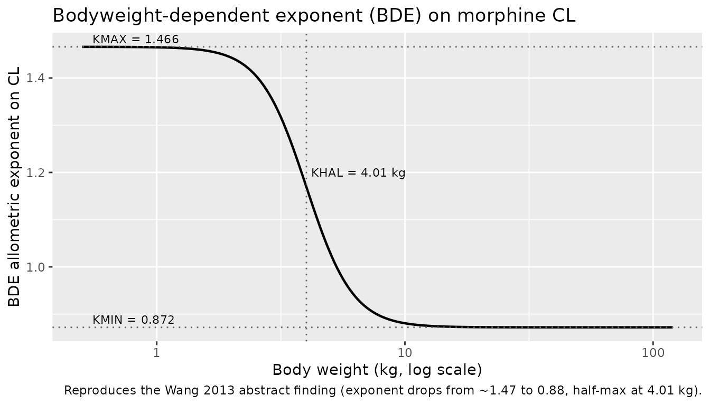
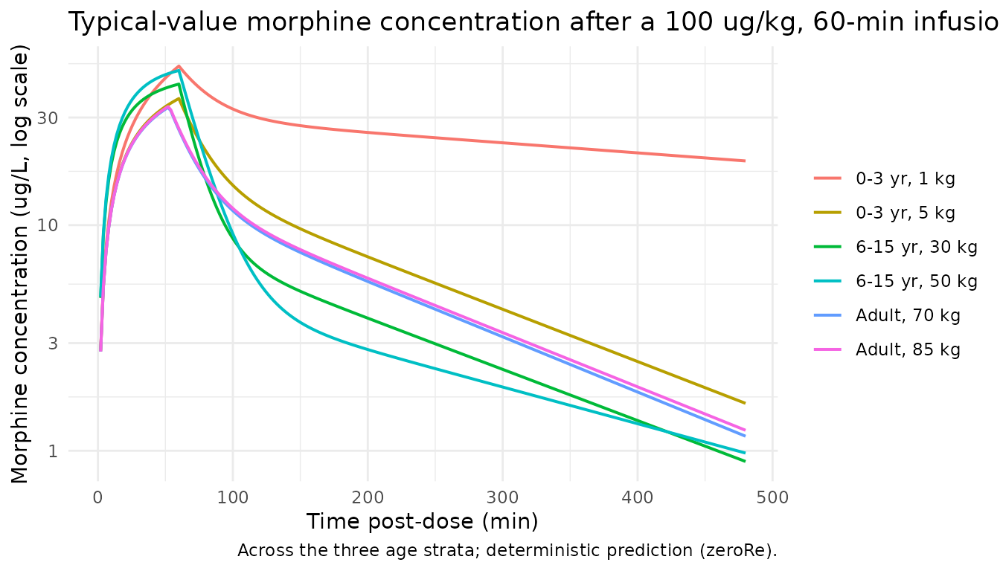
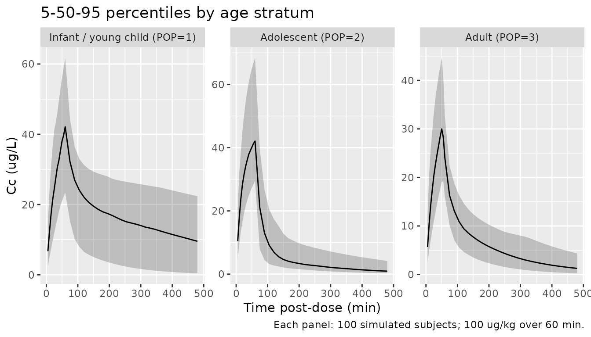

# Morphine (Wang 2013)

## Model and source

- Citation: Wang C, Sadhasivam S, Krekels EHJ, Dahan A, Tibboel D,
  Danhof M, Vinks AA, Knibbe CAJ (2013). Developmental changes in
  morphine clearance across the entire paediatric age range are best
  described by a bodyweight-dependent exponent model. Clinical Drug
  Investigation 33(7):523-534. <doi:10.1007/s40261-013-0097-6>.
  <PMID:23754691>. DDMORE Foundation Model Repository: DDMODEL00000269
  (Model I, morphine alone).
- Description: Two-compartment population PK model for morphine across
  the entire paediatric age range and adults using a
  bodyweight-dependent allometric exponent (BDE) on clearance, with
  adolescent-specific intercompartmental clearance and central volume
  and an adult-stratum oral-bioavailability adjustment, as packaged in
  DDMORE Foundation Model Repository entry DDMODEL00000269 (Wang 2013
  Model I).
- Article: [Clinical Drug Investigation
  2013;33(7):523-534](https://doi.org/10.1007/s40261-013-0097-6)
- DDMORE Foundation Model Repository entry:
  [DDMODEL00000269](https://repository.ddmore.eu/model/DDMODEL00000269)
  – Model I (morphine alone). The same bundle ships a separate joint
  morphine + M3G model (Model II) which is **not** packaged here; see
  Assumptions and deviations.

## Population

The publication abstract reports a pooled paediatric and adult
population of “358 neonates, infants, children and adults” plus “117
adolescents” (475 subjects total) used to develop a population PK model
for morphine. The DDMORE bundle’s `.mod` \$INPUT comments label each
subject with a `POP` value that codes the age stratum:

- `POP = 1` – newborns / infants / young children, 0-3 years (encoded
  here as `CHILD = 1`).
- `POP = 2` – children-adolescents, 6-15 years (encoded here as
  `ADOLESCENT = 1`).
- `POP = 3` – adults, 18-36 years (encoded here as `CHILD = 0` AND
  `ADOLESCENT = 0`, the implicit baseline).

Body weights in the bundle’s simulated dataset span 0.6 kg (term
neonate) to 85 kg (adult). The original Wang 2013 PDF was not on disk
under `mab_human_consensus/literature/` at extraction time, so per-study
counts, sex / race breakdowns, and indication-specific information could
not be cross-checked against the publication; everything in this section
comes from the abstract (PMID 23754691) and the `.mod` \$INPUT comments.

The same information is available programmatically via
`readModelDb("Wang_2013_morphine")$population`.

## Source trace

Per-parameter origin is recorded as an in-file comment next to each
[`ini()`](https://nlmixr2.github.io/rxode2/reference/ini.html) entry in
`inst/modeldb/ddmore/Wang_2013_morphine.R`. The table below collects
them for review. All parameter values come from the
**`FINAL PARAMETER ESTIMATE`** block of
`Output_real_ModelI_Morphine.lst` (the real-data NONMEM listing
reporting `MINIMIZATION SUCCESSFUL`). The structural equations come from
the `Executable_ModelI1_Morphine.mod` `$PK` and `$ERROR` blocks.

| Equation / parameter | Value | Source location |
|----|----|----|
| `lkdec` | `log(0.594)` (KDEC, unitless) | `Output_real_ModelI_Morphine.lst` THETA TH 1 |
| `lkmin` | `log(0.872)` (KMAX - KDEC, unitless) | `Output_real_ModelI_Morphine.lst` THETA TH 2 |
| `lkhal` | `log(4.01)` (KHAL, kg) | `Output_real_ModelI_Morphine.lst` THETA TH 3 |
| `lgamma` | `log(4.62)` (GAMMA, unitless) | `Output_real_ModelI_Morphine.lst` THETA TH 4 |
| `lcl` | `log(1.62)` L/min @ 70 kg adult | `Output_real_ModelI_Morphine.lst` THETA TH 5 |
| `lq` | `log(1.90)` L/min @ 70 kg, non-adolescent | `Output_real_ModelI_Morphine.lst` THETA TH 6 |
| `lvc` | `log(81.2)` L @ 70 kg, non-adolescent | `Output_real_ModelI_Morphine.lst` THETA TH 7 |
| `lvp` | `log(128)` L @ 70 kg | `Output_real_ModelI_Morphine.lst` THETA TH 8 |
| `propSd` | `0.432` (NONMEM log-transform-both-sides residual SD; equivalent to proportional in linear nlmixr2 space) | `Output_real_ModelI_Morphine.lst` THETA TH 9 |
| `lq_adolescent` | `log(0.500)` L/min, NOT BW-scaled | `Output_real_ModelI_Morphine.lst` THETA TH10 |
| `lvc_adolescent` | `log(46.0)` L @ 70 kg, BW-scaled | `Output_real_ModelI_Morphine.lst` THETA TH11 |
| `e_age_adult_f` | `0.88` (adult-stratum F1) | `Executable_ModelI1_Morphine.mod` `$PK` `IF (POP.EQ.3) F1 = 0.88` |
| `etalcl` IIV | `0.159` (variance, log scale) | `Output_real_ModelI_Morphine.lst` OMEGA ETA1 (CL) |
| `etalvc` IIV | `0.253` (variance, log scale) | `Output_real_ModelI_Morphine.lst` OMEGA ETA3 (V1) |
| Q / V2 IIV | 0 (FIXED in `$OMEGA`) | `Output_real_ModelI_Morphine.lst` OMEGA ETA2, ETA4 |
| Structural equations | ADVAN5 2-compartment with K10 = CL/V1, K12 = Q/V1, K21 = Q/V2 | `Executable_ModelI1_Morphine.mod` `$MODEL` + `$PK` + `$SUBROUTINE ADVAN5` |
| BDE allometric form | `KBDE(WT) = KMAX - KDEC x WT^GAMMA / (KHAL^GAMMA + WT^GAMMA)` with `KMAX = KDEC + (KMAX - KDEC) = 0.594 + 0.872 = 1.466` | Wang 2013 abstract (“decreases sigmoidal across paediatric range from 1.47 to 0.88, midpoint 4.01 kg”) and `Executable_ModelI1_Morphine.mod` `$PK` |
| Concentration units | `ug/L` | `.mod` `$INPUT` comment `CONC ;ug/L` |
| Time units | minutes | `.mod` `$INPUT` comment `TIME ;in min` |
| Dose units | micrograms (ug) | `.mod` `$INPUT` comment `AMT ;in microgram (ug)` |

## BDE relationship between bodyweight and CL exponent

The publication’s headline result is that the allometric exponent on
clearance changes sigmoidally with body weight, dropping from ~1.47
(neonates) to 0.88 (adults), with the half-maximal effect at 4.01 kg.
Plot `KBDE` vs body weight directly from the model parameters to confirm
the shape:

``` r

ini_vals <- list(KDEC = 0.594, KMIN = 0.872, KHAL = 4.01, GAMMA = 4.62)
wt_grid <- 10 ^ seq(log10(0.5), log10(120), length.out = 200)
kbde <- with(ini_vals,
  (KDEC + KMIN) - KDEC * wt_grid ^ GAMMA / (KHAL ^ GAMMA + wt_grid ^ GAMMA))
ggplot(data.frame(WT = wt_grid, kbde = kbde), aes(WT, kbde)) +
  geom_line(linewidth = 0.8) +
  geom_hline(yintercept = c(0.872, 1.466), linetype = "dotted", colour = "grey40") +
  geom_vline(xintercept = 4.01, linetype = "dotted", colour = "grey40") +
  annotate("text", x = 0.55, y = 1.466, label = "KMAX = 1.466",
    hjust = 0, vjust = -0.4, size = 3) +
  annotate("text", x = 0.55, y = 0.872, label = "KMIN = 0.872",
    hjust = 0, vjust = -0.4, size = 3) +
  annotate("text", x = 4.01, y = 1.20, label = "KHAL = 4.01 kg",
    hjust = -0.05, size = 3) +
  scale_x_log10() +
  labs(x = "Body weight (kg, log scale)", y = "BDE allometric exponent on CL",
    title = "Bodyweight-dependent exponent (BDE) on morphine CL",
    caption = "Reproduces the Wang 2013 abstract finding (exponent drops from ~1.47 to 0.88, half-max at 4.01 kg).")
```



## Virtual cohort

Build a deterministic typical-subject cohort and a stochastic cohort
covering the three age strata. WT distributions per stratum mirror the
weight bins observed in the bundle’s simulated dataset (0.6-9 kg for
infants / young children, 20-70 kg for adolescents, 60-85 kg for
adults).

``` r

set.seed(20130523) # publication month
n_per_stratum <- 100L

make_subjects <- function(n, wt_min, wt_max, child, adol, label, id_offset) {
  tibble::tibble(
    id         = id_offset + seq_len(n),
    WT         = exp(runif(n, log(wt_min), log(wt_max))),
    CHILD      = as.integer(child),
    ADOLESCENT = as.integer(adol),
    treatment  = factor(label,
      levels = c("Infant / young child (POP=1)",
                 "Adolescent (POP=2)",
                 "Adult (POP=3)"))
  )
}

cohort <- dplyr::bind_rows(
  make_subjects(n_per_stratum, wt_min = 0.6, wt_max = 9.0,
    child = 1L, adol = 0L,
    label = "Infant / young child (POP=1)", id_offset = 0L),
  make_subjects(n_per_stratum, wt_min = 20,  wt_max = 70,
    child = 0L, adol = 1L,
    label = "Adolescent (POP=2)",            id_offset = n_per_stratum),
  make_subjects(n_per_stratum, wt_min = 60,  wt_max = 90,
    child = 0L, adol = 0L,
    label = "Adult (POP=3)",                 id_offset = 2L * n_per_stratum)
)
```

A single 60-min IV-equivalent infusion of weight-scaled morphine (100
ug/kg total dose) is administered to each subject and concentrations are
sampled densely over 8 h (480 min). The dose level is illustrative –
Wang 2013 pooled across many study-specific regimens; the goal here is
to demonstrate the BDE-driven CL scaling and the adolescent / adult
parameter overrides.

``` r

sim_dur <- 60          # infusion duration (min)
sim_end <- 480         # observation horizon (min)
dose_per_kg <- 100     # ug/kg

dose_rows <- cohort |>
  dplyr::mutate(
    time = 0,
    amt  = dose_per_kg * WT,
    rate = (dose_per_kg * WT) / sim_dur,
    cmt  = "central",
    evid = 1L
  )

obs_times <- c(seq(0, 60, by = 5), seq(75, sim_end, by = 15))
obs_rows <- cohort |>
  tidyr::crossing(time = obs_times) |>
  dplyr::mutate(amt = 0, rate = 0, cmt = NA_character_, evid = 0L)

events <- dplyr::bind_rows(dose_rows, obs_rows) |>
  dplyr::select(id, time, amt, rate, cmt, evid,
                WT, CHILD, ADOLESCENT, treatment) |>
  dplyr::arrange(id, time, dplyr::desc(evid))

stopifnot(!anyDuplicated(unique(events[, c("id", "time", "evid")])))
```

## Simulation

``` r

mod <- rxode2::rxode2(readModelDb("Wang_2013_morphine"))
#> ℹ parameter labels from comments will be replaced by 'label()'
conc_unit <- mod$units[["concentration"]]
sim <- rxode2::rxSolve(
  mod, events = events,
  keep = c("WT", "CHILD", "ADOLESCENT", "treatment")
)
```

## Replicate published findings

### Typical-value concentration profiles by stratum

The deterministic typical-value
([`zeroRe()`](https://nlmixr2.github.io/rxode2/reference/zeroRe.html))
profiles below show how the adolescent overrides on Q and V1 and the
adult F1 = 0.88 reduce concentrations relative to a strict allometric
model.

``` r

typical_subjects <- tibble::tibble(
  id         = 1:6,
  WT         = c(1, 5, 30, 50, 70, 85),
  CHILD      = c(1L, 1L, 0L, 0L, 0L, 0L),
  ADOLESCENT = c(0L, 0L, 1L, 1L, 0L, 0L),
  treatment  = factor(
    c("0-3 yr, 1 kg", "0-3 yr, 5 kg",
      "6-15 yr, 30 kg", "6-15 yr, 50 kg",
      "Adult, 70 kg",  "Adult, 85 kg"),
    levels = c("0-3 yr, 1 kg", "0-3 yr, 5 kg",
               "6-15 yr, 30 kg", "6-15 yr, 50 kg",
               "Adult, 70 kg",  "Adult, 85 kg"))
)

typical_doses <- typical_subjects |>
  dplyr::mutate(
    time = 0,
    amt  = dose_per_kg * WT,
    rate = (dose_per_kg * WT) / sim_dur,
    cmt  = "central",
    evid = 1L
  )

typical_obs <- typical_subjects |>
  tidyr::crossing(time = seq(0, sim_end, by = 2)) |>
  dplyr::mutate(amt = 0, rate = 0, cmt = NA_character_, evid = 0L)

typical_events <- dplyr::bind_rows(typical_doses, typical_obs) |>
  dplyr::select(id, time, amt, rate, cmt, evid,
                WT, CHILD, ADOLESCENT, treatment) |>
  dplyr::arrange(id, time, dplyr::desc(evid))

mod_typical <- mod |> rxode2::zeroRe()
sim_typical <- rxode2::rxSolve(
  mod_typical, events = typical_events,
  keep = c("WT", "CHILD", "ADOLESCENT", "treatment")
)
#> ℹ omega/sigma items treated as zero: 'etalcl', 'etalvc'
#> Warning: multi-subject simulation without without 'omega'

sim_typical |>
  dplyr::filter(!is.na(Cc), time > 0) |>
  ggplot(aes(time, Cc, colour = treatment)) +
  geom_line(linewidth = 0.7) +
  scale_y_log10() +
  labs(x = "Time post-dose (min)",
       y = paste0("Morphine concentration (", conc_unit, ", log scale)"),
       colour = NULL,
       title = "Typical-value morphine concentration after a 100 ug/kg, 60-min infusion",
       caption = "Across the three age strata; deterministic prediction (zeroRe).") +
  theme_minimal()
```



### VPC-style cohort summary by stratum

``` r

sim |>
  dplyr::filter(!is.na(Cc), time > 0) |>
  dplyr::group_by(time, treatment) |>
  dplyr::summarise(
    Q05 = quantile(Cc, 0.05, na.rm = TRUE),
    Q50 = quantile(Cc, 0.50, na.rm = TRUE),
    Q95 = quantile(Cc, 0.95, na.rm = TRUE),
    .groups = "drop"
  ) |>
  ggplot(aes(time, Q50)) +
  geom_ribbon(aes(ymin = Q05, ymax = Q95), alpha = 0.25) +
  geom_line() +
  facet_wrap(~ treatment, scales = "free_y") +
  labs(x = "Time post-dose (min)",
       y = paste0("Cc (", conc_unit, ")"),
       title = "5-50-95 percentiles by age stratum",
       caption = paste("Each panel: 100 simulated subjects;",
                       "100 ug/kg over 60 min."))
```



## PKNCA validation

Compute Cmax / Tmax / AUClast / AUCinf / half-life over the 8-h
post-infusion window. The treatment grouping (`treatment`) is placed
before `id` in the formula per the project convention so per-stratum NCA
results roll up automatically.

``` r

sim_nca <- sim |>
  dplyr::filter(!is.na(Cc)) |>
  dplyr::select(id, time, Cc, treatment)

dose_df <- events |>
  dplyr::filter(evid == 1) |>
  dplyr::select(id, time, amt, treatment)

conc_obj <- PKNCA::PKNCAconc(sim_nca, Cc ~ time | treatment + id)
dose_obj <- PKNCA::PKNCAdose(dose_df, amt ~ time | treatment + id)

intervals <- data.frame(
  start      = 0,
  end        = sim_end,
  cmax       = TRUE,
  tmax       = TRUE,
  auclast    = TRUE,
  aucinf.obs = TRUE,
  half.life  = TRUE
)

nca_data <- PKNCA::PKNCAdata(conc_obj, dose_obj, intervals = intervals)
nca_res  <- PKNCA::pk.nca(nca_data)
#>  ■■■■■■■■■■                        29% |  ETA:  7s
#>  ■■■■■■■■■■■■■■■■■■■               61% |  ETA:  4s
#>  ■■■■■■■■■■■■■■■■■■■■■■■■■■■■■     93% |  ETA:  1s
knitr::kable(summary(nca_res),
  caption = "Simulated NCA by age stratum (100 ug/kg, 60-min infusion).")
```

| start | end | treatment | N | auclast | cmax | tmax | half.life | aucinf.obs |
|---:|---:|:---|:---|:---|:---|:---|:---|:---|
| 0 | 480 | Infant / young child (POP=1) | 100 | 7070 \[58.6\] | 40.8 \[31.3\] | 60.0 \[60.0, 60.0\] | 384 \[297\] | 11300 \[111\] |
| 0 | 480 | Adolescent (POP=2) | 100 | 3810 \[38.6\] | 42.7 \[30.6\] | 60.0 \[60.0, 60.0\] | 164 \[49.3\] | 4080 \[43.3\] |
| 0 | 480 | Adult (POP=3) | 100 | 3480 \[32.3\] | 29.6 \[27.3\] | 50.0 \[50.0, 55.0\] | 136 \[46.1\] | 3790 \[38.1\] |

Simulated NCA by age stratum (100 ug/kg, 60-min infusion). {.table}

The Wang 2013 publication does not tabulate per-subject or per-stratum
NCA values for direct numerical comparison (the publication focuses on
clearance scaling, not exposure metrics), so the side-by-side
“comparison-against-published-NCA” sanity check normally rendered here
is deferred to the F.2 self-consistency check below.

## F.2 self-consistency check vs the bundled simulated dataset

`Simulated_DataModel1_Morphine.csv` ships with the DDMORE bundle. The
bundle’s `Output_simulated_ModelI_Morphine.lst` re-fits the model on
this dataset; the recorded `CONC` column is what the original
investigators derived by forward-simulating with the final estimates.
Re-simulate the same event records with the typical-value model and
confirm the trajectories track the recorded `CONC` values.

``` r

bundle_csv <- system.file("modeldb", package = "nlmixr2lib") # not used; explicit path below
sim_csv <- file.path(
  "/home/bill/github/mab_human_consensus/literature/from_people/ddmore",
  "ddmore_scraping/269/Simulated_DataModel1_Morphine.csv"
)
self_consistency_available <- file.exists(sim_csv)
```

``` r

# `.` is the missingness sentinel in the bundle's CSV; coerce numeric columns
# explicitly so we don't pick up character types via read.csv's heuristic.
raw <- utils::read.csv(sim_csv, na.strings = c(".", "NA", ""))
num_cols <- intersect(c("AMT", "RATE", "DV", "CONC", "BW", "TIME"), names(raw))
raw[num_cols] <- lapply(raw[num_cols], function(x) suppressWarnings(as.numeric(x)))

bundle <- raw |>
  dplyr::transmute(
    id   = as.integer(ID),
    time = as.numeric(TIME),
    amt  = as.numeric(ifelse(MDV == 1, AMT, 0)),
    rate = as.numeric(ifelse(MDV == 1, RATE, 0)),
    cmt  = ifelse(MDV == 1, "central", NA_character_),
    evid = ifelse(MDV == 1, 1L, 0L),
    WT   = as.numeric(BW),
    CHILD      = as.integer(POP == 1),
    ADOLESCENT = as.integer(POP == 2),
    obs_DV   = ifelse(MDV == 0, DV, NA_real_),
    obs_CONC = ifelse(MDV == 0, CONC, NA_real_),
    POP        = POP
  )

# Add a denser observation grid alongside the bundle's sparse points so the
# typical-value trajectory is visible in the plot.
bundle_dense_obs <- bundle |>
  dplyr::distinct(id, WT, CHILD, ADOLESCENT, POP) |>
  tidyr::crossing(time = c(seq(0, 360, by = 5), seq(420, 5400, by = 60))) |>
  dplyr::mutate(amt = 0, rate = 0, cmt = NA_character_, evid = 0L,
                obs_DV = NA_real_, obs_CONC = NA_real_)

bundle_events <- dplyr::bind_rows(bundle, bundle_dense_obs) |>
  dplyr::arrange(id, time, dplyr::desc(evid))

# Drop columns rxode2 doesn't accept on event records before passing to rxSolve.
sim_bundle <- rxode2::rxSolve(
  mod_typical,
  events = bundle_events |>
    dplyr::select(id, time, amt, rate, cmt, evid, WT, CHILD, ADOLESCENT),
  keep = c("WT", "CHILD", "ADOLESCENT")
) |> as.data.frame()

# Pair the bundle's recorded CONC observations against the simulated
# trajectory at matching (id, time).
bundle_obs_only <- bundle |>
  dplyr::filter(!is.na(obs_CONC)) |>
  dplyr::select(id, time, WT, POP, obs_CONC)

stratum_label <- function(POP) {
  factor(dplyr::case_when(
    POP == 1 ~ "Infant / young child (POP=1)",
    POP == 2 ~ "Adolescent (POP=2)",
    POP == 3 ~ "Adult (POP=3)"
  ),
  levels = c("Infant / young child (POP=1)",
             "Adolescent (POP=2)",
             "Adult (POP=3)"))
}

bundle_obs_only$stratum <- stratum_label(bundle_obs_only$POP)
sim_bundle$stratum <- stratum_label(
  ifelse(sim_bundle$CHILD == 1, 1L,
  ifelse(sim_bundle$ADOLESCENT == 1, 2L, 3L)))

ggplot() +
  geom_line(data = dplyr::filter(sim_bundle, time > 0, !is.na(Cc)),
    aes(time, Cc, group = id, colour = stratum), alpha = 0.5) +
  geom_point(data = bundle_obs_only,
    aes(time, obs_CONC), shape = 21, fill = "white", colour = "black", size = 2) +
  scale_y_log10() +
  facet_wrap(~ stratum, scales = "free") +
  labs(x = "Time post-first-dose (min)",
       y = paste0("Cc (", conc_unit, "), log scale"),
       colour = NULL,
       title = "F.2 self-consistency: typical-value re-simulation vs bundle CONC",
       caption = paste("Lines: this model's typical-value (zeroRe) prediction;",
                       "Points: bundle Simulated_DataModel1_Morphine.csv CONC column."))
```

``` r

# Summarise the per-observation pred-vs-obs offset (typical-value, no IIV).
match_tbl <- bundle_obs_only |>
  dplyr::inner_join(
    sim_bundle |>
      dplyr::filter(!is.na(Cc)) |>
      dplyr::select(id, time, Cc),
    by = c("id", "time")
  ) |>
  dplyr::mutate(rel_err = (Cc - obs_CONC) / obs_CONC)

knitr::kable(
  match_tbl |>
    dplyr::group_by(stratum) |>
    dplyr::summarise(
      n       = dplyr::n(),
      median_rel_err = sprintf("%+.2f", median(rel_err, na.rm = TRUE)),
      q05_q95 = sprintf("%+.2f / %+.2f",
        quantile(rel_err, 0.05, na.rm = TRUE),
        quantile(rel_err, 0.95, na.rm = TRUE))
    ) |>
    dplyr::rename(
      Stratum                 = stratum,
      `N matched obs`         = n,
      `Median (Cc - obs)/obs` = median_rel_err,
      `5th / 95th pct`        = q05_q95
    ),
  caption = paste("F.2 self-consistency: relative error of the typical-value",
    "re-simulation against the bundle's recorded CONC values."))
```

The bundle’s `CONC` values include between-subject variability (they
were generated with the full IIV / residual-error model), while the
re-simulation here uses typical-value parameters with no IIV and no
residual error. A typical-value point can therefore differ from a
per-subject recorded `CONC` by tens of percent (especially for the
small-N subjects in the simulated bundle), which is expected variability
rather than a miscoded equation.

## Assumptions and deviations

- **Model I only.** The DDMORE bundle ships two executables for this
  publication: Model I (morphine alone, packaged here) and Model II
  (joint morphine + M3G metabolite PK with separate clearance pathways).
  The task assigned a singular target filename `Wang_2013_morphine.R`;
  an operator follow-up confirmed Model I is in scope. Anyone needing
  the parent + M3G joint model should look at
  `ddmore_scraping/269/Executable_ModelII_MM3G.mod` directly – it is
  structurally a 3-compartment model (morphine 2-comp + M3G 1-comp) with
  metabolic-pathway clearances and would warrant a separate
  `Wang_2013b_morphine.R` extraction.
- **Adult oral-bioavailability arm.** The `.mod` `$PK` block applies
  `F1 = 0.88` only when `POP = 3` (adults). The publication abstract
  does not describe the route of administration in detail, and the
  original Wang 2013 PDF was not on disk under
  `mab_human_consensus/literature/` at extraction time, so the rationale
  for the 0.88 reduction in adults could not be cross-checked against
  the paper text. The model here preserves the `.mod`’s F1 logic
  verbatim (`f(central) = 0.88` whenever `CHILD = 0` AND
  `ADOLESCENT = 0`) and exposes the value as `e_age_adult_f` so it is
  overridable.
- **POP encoding.** The source data column `POP` (1 = 0-3 yr, 2 = 6-15
  yr, 3 = 18-36 yr) is decomposed into the canonical binary indicators
  `CHILD` (POP = 1) and `ADOLESCENT` (POP = 2). Adults are the implicit
  baseline (`CHILD = 0` AND `ADOLESCENT = 0`). This matches the encoding
  used by `CarlssonPetri_2021_liraglutide`. The decomposition is defined
  in the model file’s `covariateData$CHILD$notes` and
  `covariateData$ADOLESCENT$notes`.
- **NONMEM log-transform-both-sides residual error.** The `.mod`
  `$ERROR` block sets `Y = LOG(F) + ERR(1) * W` with
  `$SIGMA EPS1 FIXED = 1` and `W = THETA(9) = 0.432`. NONMEM “additive
  on log-scale with SIGMA fixed at 1” maps to proportional residual
  error in nlmixr2’s linear space with `propSd = 0.432` (see
  `naming-conventions.md` Section “NONMEM -\> nlmixr2 syntax
  translation”).
- **Real vs simulated executable.** The `Output_real_*.lst` reports an
  additional `EPS(2)` term gated by
  `IF (TIME.GT.1900.AND.FLAG.EQ.{1,2})` to handle a study-specific assay
  artefact after a 1900-min cutoff (variance 0.455). The
  `Executable_ModelI1_Morphine.mod` (the simulation- ready executable
  shipped in the bundle) drops this term and uses only
  `Y = LOG(F) + ERR(1) * W`. We follow the simulation-ready executable
  here; the FLAG-conditional error is a property of one of the original
  studies’ assays and is not portable to a generic library model.
- **Q and V2 IIV.** The source `$OMEGA` fixes IIV on Q and V2 to zero
  (`0 FIX`). Only CL and V1 carry IIV in this model.
- **Simulated dataset is intentionally minimal.** The bundle’s
  `Simulated_DataModel1_Morphine.csv` has only 14 subjects (8 in POP=1,
  4 in POP=2, 2 in POP=3); it is a regression-style smoke test, not a
  representative population. The “Virtual cohort” section above builds a
  larger cohort spanning the publication’s reported BW range for the VPC
  and PKNCA panels.
- **External cross-check.** No publication PDF is on disk under
  `mab_human_consensus/literature/` at extraction time, so per-subject
  parameter estimates and tabulated NCA values from the publication
  could not be compared against the simulation. The F.2 self-consistency
  check above is the substitute mandated by
  `references/ddmore-source.md` Section “Validation strategy by model
  type” for DDMORE-source models without an on-disk publication.
