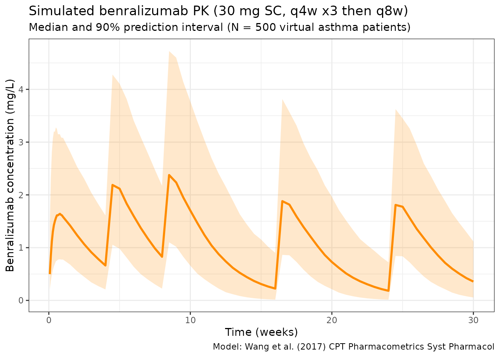

# Wang_2017_benralizumab

``` r
library(nlmixr2lib)
library(rxode2)
#> rxode2 5.0.2 using 2 threads (see ?getRxThreads)
#>   no cache: create with `rxCreateCache()`
library(dplyr)
#> 
#> Attaching package: 'dplyr'
#> The following objects are masked from 'package:stats':
#> 
#>     filter, lag
#> The following objects are masked from 'package:base':
#> 
#>     intersect, setdiff, setequal, union
library(tidyr)
library(ggplot2)
library(PKNCA)
#> 
#> Attaching package: 'PKNCA'
#> The following object is masked from 'package:stats':
#> 
#>     filter
```

## Benralizumab population PK simulation

Simulate benralizumab concentration-time profiles using the final
population PK model from Wang et al. (2017) in healthy volunteers and
patients with asthma (N = 200 across 6 Phase I/II studies).

Benralizumab is a humanized, afucosylated IgG1 monoclonal antibody
targeting IL-5 receptor alpha. The model is a 2-compartment model with
first-order SC absorption, allometric weight scaling (CL exponent fixed
at 0.75), and covariate effects for high-titer anti-drug antibodies
(ADA, titer \>= 400) on CL and Japanese healthy volunteer status on Vc.

Source: Table 3 of Wang et al. (2017) CPT Pharmacometrics Syst
Pharmacol. 6(4):249-257. <doi:10.1002/psp4.12160>. Parameters verified
against PMC5397562.

### Virtual population

``` r
set.seed(2017)
n_subj <- 500

pop <- data.frame(
  ID          = seq_len(n_subj),
  WT          = rlnorm(n_subj, log(77), 0.24),  # Mean ~77 kg (Table 2)
  ADA         = rbinom(n_subj, 1, 0.05),         # ~5% high-titer ADA
  JAPANESE_HV = 0                                 # Non-Japanese patient population
)
```

### Dosing dataset

Approved asthma regimen: 30 mg SC every 4 weeks for first 3 doses, then
every 8 weeks. Simulate through 30 weeks.

``` r
dose_times <- c(0, 28, 56, 112, 168)  # days (weeks 0, 4, 8, 16, 24)

obs_times <- sort(unique(c(
  seq(0, 7, by = 0.5),
  seq(7, 210, by = 3.5)
)))

d_dose <- pop %>%
  crossing(TIME = dose_times) %>%
  mutate(AMT = 30, EVID = 1, CMT = 1, DV = NA_real_)

d_obs <- pop %>%
  crossing(TIME = obs_times) %>%
  mutate(AMT = NA_real_, EVID = 0, CMT = 2, DV = NA_real_)

d_sim <- bind_rows(d_dose, d_obs) %>%
  arrange(ID, TIME, desc(EVID)) %>%
  as.data.frame()
```

### Simulate

``` r
mod <- readModelDb("Wang_2017_benralizumab")
sim <- rxSolve(mod, d_sim, returnType = "data.frame")
#> ℹ parameter labels from comments will be replaced by 'label()'
```

### Concentration-time profiles

``` r
sim_summary <- sim %>%
  filter(time > 0) %>%
  group_by(time) %>%
  summarise(
    median = median(Cc, na.rm = TRUE),
    lo     = quantile(Cc, 0.05, na.rm = TRUE),
    hi     = quantile(Cc, 0.95, na.rm = TRUE),
    .groups = "drop"
  )

ggplot(sim_summary, aes(x = time / 7)) +
  geom_ribbon(aes(ymin = lo, ymax = hi), alpha = 0.2, fill = "darkorange") +
  geom_line(aes(y = median), color = "darkorange", linewidth = 1) +
  labs(
    x = "Time (weeks)",
    y = "Benralizumab concentration (mg/L)",
    title = "Simulated benralizumab PK (30 mg SC, q4w x3 then q8w)",
    subtitle = "Median and 90% prediction interval (N = 500 virtual asthma patients)",
    caption = "Model: Wang et al. (2017) CPT Pharmacometrics Syst Pharmacol"
  ) +
  theme_bw()
```



### NCA analysis

``` r
# Use 2nd dosing interval (weeks 4-8)
sim_df <- as.data.frame(sim)
# Build a unique subject key: use sim.id (replicate) and id (original subject)
# when both are available; otherwise fall back to whichever exists
if (all(c("sim.id", "id") %in% names(sim_df))) {
  sim_df$subject <- paste(sim_df$sim.id, sim_df$id, sep = "_")
} else if ("id" %in% names(sim_df)) {
  sim_df$subject <- sim_df$id
} else {
  sim_df$subject <- sim_df$sim.id
}
nca_data <- data.frame(
  subject  = sim_df$subject,
  time_rel = sim_df$time - 28,
  Cc       = sim_df$Cc
)
nca_data <- nca_data[nca_data$time_rel >= 0 & nca_data$time_rel <= 28 & nca_data$Cc > 0, ]

conc_obj <- PKNCAconc(nca_data, Cc ~ time_rel | subject)
dose_obj <- PKNCAdose(
  data.frame(subject = unique(nca_data$subject), time_rel = 0, AMT = 30),
  AMT ~ time_rel | subject
)
data_obj <- PKNCAdata(conc_obj, dose_obj,
                       intervals = data.frame(start = 0, end = 28,
                                              cmax = TRUE, tmax = TRUE,
                                              auclast = TRUE, half.life = TRUE))
nca_results <- pk.nca(data_obj)
#>  ■■■■■■■■■■■■■■■■■                 55% |  ETA:  3s
nca_summary <- summary(nca_results)
knitr::kable(nca_summary, digits = 2,
             caption = "NCA summary (2nd dosing interval, weeks 4-8)")
```

| start | end | N   | auclast       | cmax          | tmax                | half.life     |
|------:|----:|:----|:--------------|:--------------|:--------------------|:--------------|
|     0 |  28 | 500 | 40.1 \[56.9\] | 2.20 \[47.2\] | 3.50 \[3.50, 14.0\] | 15.7 \[6.09\] |

NCA summary (2nd dosing interval, weeks 4-8)

### Notes

- **Model:** 2-compartment SC with linear elimination. No TMDD.
- **Bioavailability:** 52.6% for SC (estimated, not fixed).
- **Allometry:** CL exponent fixed at 0.75 (standard); Vc and Vp
  exponents estimated at 0.651 and 0.576 respectively.
- **ADA effect:** High-titer ADA (\>= 400) causes exp(1.52) = 4.57-fold
  increase in CL (Eq. 6 in paper; Table 3 footnote c “natural
  exponent”). ADA is time-varying (assessed at each sampling visit).
- **Japanese race:** 1.34-fold larger Vc for Japanese healthy volunteers
  (multiplicative factor; may confound with healthy volunteer status).
- **IIV on all 6 PK parameters** (CL, Vc, Q, Vp, ka, F).
- **Reference weight:** 77 kg (population mean; paper states “normalized
  to population median” but exact median not explicitly stated).
